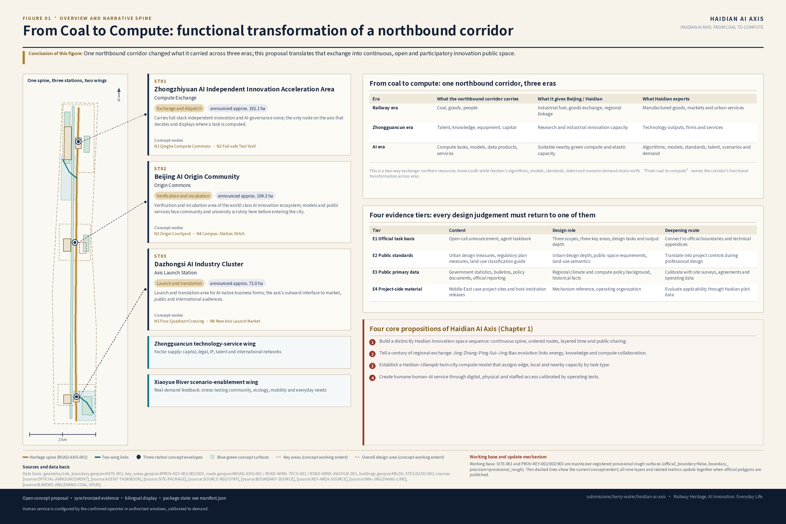
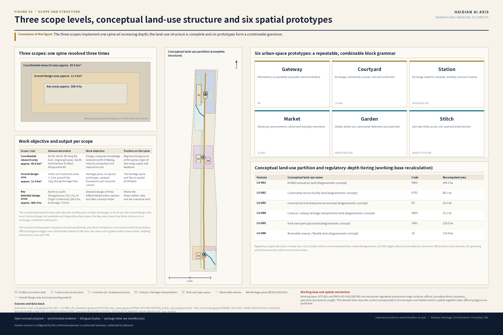
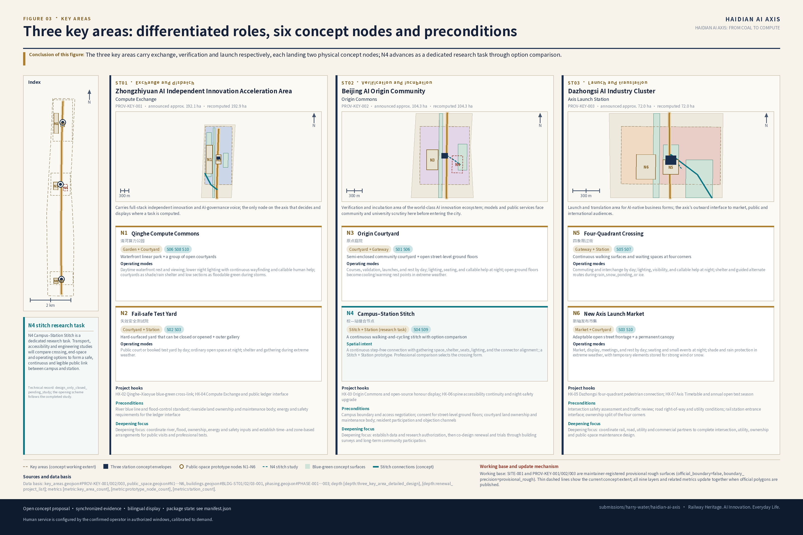
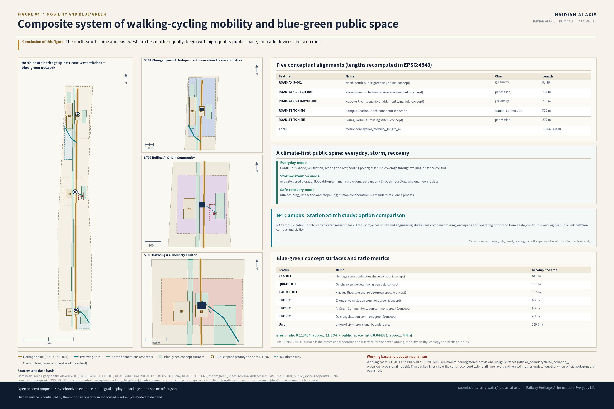
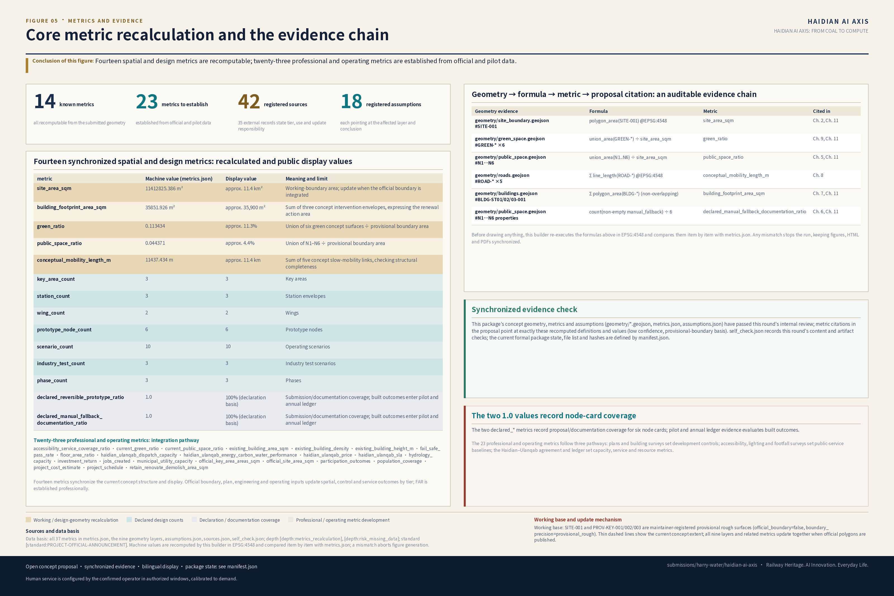

# HAIDIAN AI AXIS: FROM COAL TO COMPUTE

## Design Basis and Source List

The proposed name is **海淀新轴 / Haidian AI Axis**. Its full Chinese title is *海淀新轴：百年京张，从运煤到运算*; its English title is *HAIDIAN AI AXIS: FROM COAL TO COMPUTE*. The ceremonial Chinese lock-up is “百年京张·海淀新轴,” the Chinese brand line is “百年京张，向新而行,” and the English communication line is *Railway Heritage. AI Innovation. Everyday Life.* The submission slug is `haidian-ai-axis`.

“**From Coal to Compute**” translates the century-old northbound corridor into an AI-era story. The railway era moved coal, goods, and people; the Zhongguancun era concentrated knowledge, talent, and capital; the AI era can connect northern computing resources with Beijing’s innovation demand while Haidian sends algorithms, models, standards, talent, and applications back into the regional network.

Four affirmative propositions guide the design:

1. **Build a distinctly Haidian sequence of innovation spaces.** Apply the Beijing Central Axis methods of a continuous spine, ordered nodes, layered time, and public sharing to connect northern, central, and southern innovation resources along Jing-Zhang heritage space.
2. **Tell the story of a century-long regional exchange corridor.** Connect the 1909 Jing-Zhang Railway, the later Ping-Sui–Jing-Bao evolution, the Jimingshan coal-mine branch, Zhongguancun innovation, and contemporary computing collaboration.
3. **Establish a Haidian–Ulanqab twin-city compute model.** Haidian leads algorithms, models, standards, talent, and applications; suitable training, batch, and elastic tasks can use partner capacity, with edge, local, and external compute assigned by task type.
4. **Create humane human–AI public services.** Digital and staffed services, online systems, and physical alternatives form one service system. Operators calibrate staff, place, and service windows to actual demand.

The complete proposal follows one reading spine:

> **heritage spine → three-station division of roles → two-wing supply and feedback → six spatial prototypes → ten operating scenarios → one annual ledger**

The design basis is the Haidian open-call announcement [source:OFFICIAL-ANNOUNCEMENT], the Agent taskbook [source:AGENT-TASKBOOK], and the scopes, templates, and working geometry in `brief/site-package/` [source:SITE-PACKAGE]. Complete standards, source tiers, and design-depth links are retained in `standard_matrix.json`, `sources.json`, and `design_depth_matrix.json` so that this narrative remains readable.

| Evidence tier | Content | Role in this proposal | Deepening route |
| --- | --- | --- | --- |
| E1 Official task basis | Announcement and Agent taskbook | Defines the three scopes, key areas, tasks, and deliverables | Connect to official boundaries and technical appendices |
| E2 Public standards | Urban design, regulatory planning, and land-use guidance | Provides professional language for urban form and public space | Translate into project controls during professional design |
| E3 Public first-party data | Government statistics, reports, policies, and official releases | Supports climate, computing, and historical context | Calibrate with field surveys, agreements, and operating data |
| E4 Project-party material | Middle East project and host-organization releases | Supplies transferable mechanisms for climate, innovation, service, and phasing | Test every mechanism under Haidian conditions |

The package registers 35 external public sources in `sources.json`, alongside seven repository sources. Each record states its authority tier, intended use, and risk note. Planning control lines, building surveys, ownership, and station-level climate data become explicit inputs to the next professional phase [source:SOURCE-REGISTRY].

The maintained working `SITE_BOUNDARY` and three `KEY_AREA` polygons provide one consistent concept base [data:geometry/site_boundary.geojson#SITE-001] and [data:geometry/key_areas.geojson#PROV-KEY-001]. The area [metric:site_area_sqm] and key-area count [metric:key_area_count] keep text, figures, and geometry synchronized. When official polygons arrive, the same pipeline updates all nine geometry layers and associated metrics.

**Design judgment**: Start with one brand vision, one historical narrative, one spatial method, and one twin-city operating proposition.
**Rationale**: The Central Axis method, Jing-Zhang history, and Haidian–Ulanqab collaboration supply spatial order, cultural meaning, and long-term operation as one coherent system.
**Layers / metrics / standards**: working boundary [data:geometry/site_boundary.geojson#SITE-001], area metric [metric:site_area_sqm], and existing-conditions depth [depth:existing_conditions_diagnosis].
**Deepening interface**: Add official boundaries and controls, building and ownership surveys, station-level climate observations, and a project-specific Haidian–Ulanqab technical agreement.

## Three-Level Scope Framework

The three official scope levels carry different links of the same proposal:

| Level | Official scope | Design objective | Position in the spine | Main outputs |
| --- | --- | --- | --- | --- |
| Coordinated Research Area | Approx. 43.6 km², bounded by the North Fifth Ring, Jingzang Expressway, Xizhimen Outer Street, and Wanquan River Road | Northern energy–compute–knowledge network, innovation ecosystem, future-city form, and combined international mechanisms | Regional background and two-wing sources | Strategic structure, mechanism chain, scenarios, operations |
| Overall Design Area | Approx. 11.4 km² around Jing-Zhang Railway Heritage Park and adjacent industrial areas | Heritage spine, six prototypes, renewal framework, transport, utilities, and urban character | Heritage spine and spatial prototypes | Land use, roads, green and public space, buildings, phasing |
| Key-Area Detailed Design Area | Approx. 368.4 ha: Zhongzhiyuan 192.1 ha, AI Origin Community 104.3 ha, Dazhongsi 72.0 ha | Three differentiated urban stations and six physical nodes | Three stations and ten operating scenarios | Positioning, spatial structure, renewal, mobility, public space, AI scenarios |

The three-level framework follows [depth:three_level_scope_framework] and [depth:overall_spatial_structure]. The processed fact pack provides the reading index [source:PROCESSED-FACT-PACK], with scope geometry retained in the structured layers.

The Coordinated Research Area asks what the northbound corridor exchanges in the AI era. The Overall Design Area turns that exchange into walkable, lingerable, climate-adaptive space. The key areas translate it into three stations for exchange, validation, and launch. Together they form one progression from regional strategy to everyday experience.

Current working geometry supports concept positioning and consistent recalculation. Once official polygons are available, site area [metric:site_area_sqm], key-area count [metric:key_area_count], and green ratio [metric:green_ratio] move to the official base. Public-space ratio [metric:public_space_ratio], building intervention area [metric:building_footprint_area_sqm], and FAR [metric:floor_area_ratio] update in the same cycle.

**Design judgment**: Organize the three scopes as regional collaboration, overall structure, and detailed nodes.
**Rationale**: Every level has a clear task, output, and input to the next level.
**Layers / metrics / standards**: working boundary [data:geometry/site_boundary.geojson#SITE-001], key-area framework [data:geometry/key_areas.geojson#PROV-KEY-002], and scope depth [depth:three_level_scope_framework].
**Deepening interface**: Insert official polygons, precise key-area limits, and their overlay relationship.

## Coordinated Research Area: Industry and Future City Research

### Three overlapping orders

The Beijing Central Axis demonstrates **spatial order**, the Jing-Zhang corridor demonstrates **the order of movement and exchange**, and Haidian–Ulanqab collaboration suggests **an operating order for task allocation**. Haidian AI Axis combines the three into a method that links form, function, and time.

### Beijing Central Axis: three correspondences and three Haidian actions (agent.1 / agent.5)

The 7.8-km Beijing Central Axis comprises fifteen heritage components in five types, the central roads, and their setting. Its siting, layout, and urban form embody the ideal order of the traditional Chinese capital [source:UNESCO-AXIS-1714] and [source:BJCT-AXIS-INSCRIPTION]. Haidian AI Axis translates six lessons into contemporary innovation-space design.

| Distinctive Central Axis quality | Haidian correspondence | Spatial and operating action | Contemporary expression |
| --- | --- | --- | --- |
| A building-and-heritage ensemble whose order extends beyond a road | **The spine is a family of spaces** | Integrate the heritage park, adjacent sites, frontages, and cross-links; join slow-mobility gaps and align shade, accessibility, lighting, and wayfinding | A modern public-space and linear identity system |
| Differentiated functions form an ordered sequence and balanced pairs | **Differentiated nodes and complementary balance** | Three key areas specialize in exchange, public validation, and launch; balance innovation with daily life and algorithms with human service | Functional complementarity and equitable access |
| Multiple periods and everyday life continue to overlap | **Continuous layering of time and culture** | Combine railway remains, Zhongguancun research memory, ordinary work, and AI public life through timelines, markers, open-source honors, oral history, and seasonal programs | Heritage, innovation, and community life as one evolving story |

| Haidian planning action | Derived from | Spatial and operating action | Implementation focus |
| --- | --- | --- | --- |
| **Cross-axis stitching** | The spine as a family of spaces | Railway crossings, Qinghe and Xiaoyue River blue-green links, community interchanges, and east–west public space | Compare transport, accessibility, and engineering options |
| **Public sharing** | Differentiated nodes need a common entry experience | Open spine and landmarks, digital and staffed service, accessible physical entrances | Agree ownership, maintenance, and service windows |
| **Long-term governance** | Time layering needs continued care | New Axis timetable, open testing season, compute ledger, human review, public feedback, annual update | Establish a pilot charter, budget, audit, and participation mechanism |

### From coal to compute: a century of exchange (agent.5)

The Jing-Zhang Railway, completed in 1909, was the first state railway surveyed, designed, built, and managed by Chinese engineers and connected Beijing’s Liucun area with Zhangjiakou [source:NRA-JINGZHANG-LINE]. The line later extended toward Suiyuan and became part of the Ping-Sui Railway; after 1949, it was renamed the Jing-Bao Railway, establishing a long regional connection between Beijing, Zhangjiakou, Inner Mongolia, and northern China [source:NMG-JINGSUI-HERITAGE] and [source:NRA-JINGZHANG-HSR-OVERVIEW]. The Jimingshan coal-mine branch moved coal near Xiahuayuan and helped supply the railway itself [source:BJTU-JINGZHANG-HISTORY] and [source:BJNEWS-JINGZHANG-COAL-SPUR].

| Era | What moved along the corridor | What it supplied to Beijing / Haidian | What Haidian sent outward |
| --- | --- | --- | --- |
| Railway era | Coal, goods, people | Fuel, material exchange, regional connection | Manufactured goods, markets, urban services |
| Zhongguancun era | Talent, knowledge, equipment, capital | Research and industrial innovation | Technology, enterprises, services |
| AI era | Compute tasks, models, data products, services | Suitable nearby green compute and elastic capacity | Algorithms, models, standards, talent, applications |

This is a continuing two-way exchange: northern resources move south while Haidian’s algorithms, models, standards, talent, and scenario demand move north. The railway supplies the historical narrative; the twin-city compute network supplies the contemporary operating mechanism.

### Three positionings, five functions, Three Zones and Two Wings (agent.1)

The three positionings are **an AI ecosystem world coordinate**, **a demonstration window for full-stack independent innovation**, and **a Jing-Zhang heritage and AI-culture pilgrimage destination**. Five functions follow: research and source innovation; compute, testing, and safety evaluation; finance, legal, IP, talent, and international services; public-space and civic-scenario validation; cultural communication and global launch.

The spatial organization is **Three Zones and Two Wings**:

- **Zhongzhiyuan AI Independent Innovation Acceleration Area / Compute Exchange** — research, standards, safety evaluation, twin-city dispatch, and failure drills.
- **Beijing AI Origin Community / Origin Commons** — universities, communities, developers, model validation, and open-source honor display.
- **Dazhongsi AI Industry Cluster / Axis Launch Station** — product conversion, cultural content, enterprise procurement, international display, and urban life.
- **Zhongguancun Technology Services Wing** — capital, legal, intellectual-property, talent, and international resources.
- **Xiaoyue River Scenario Enablement Wing** — real-world feedback from communities, ecology, transport, and everyday demand.

The loop is: Origin Community **validates** → Zhongzhiyuan **exchanges and dispatches** → Dazhongsi **launches and converts** → the two wings **supply capabilities and demand** → the next validation cycle begins.

### Name and visual identity (agent.1)

“海淀新轴” carries the cultural and spatial image; `HAIDIAN AI AXIS` states the function directly. The `AI` embedded in `H[AI]DIAN` can become a visual mnemonic. The logo combines one continuous line, three differentiated station marks, and one transverse stitch. `FROM COAL TO COMPUTE` and *Railway Heritage. AI Innovation. Everyday Life.* unify external communication.

### Five Middle East cases as one Haidian mechanism chain (agent.2)

The cases contribute climate design, talent development, industrial service, compute organization, and demand-led phasing. Masdar City [source:MASDAR-SUSTAINABLE-DESIGN], MBZUAI [source:MBZUAI-IEC], and DIFC AI Campus [source:DIFC-AI-CAMPUS-LICENSING] anchor the first three; the complete HUMAIN/AWS and NEOM sources are registered in `sources.json`.

| Case | Transferable mechanism | Haidian landing point | Local translation | Delivery and evaluation |
| --- | --- | --- | --- | --- |
| Masdar City | Passive climate design: shade, ventilation, envelope, walkability | Entire public spine | Beijing four-season design: summer shade and drainage, winter sun and wind protection | Street-canyon, sunlight, hourly-rainfall, and block simulation |
| MBZUAI | Research → validation → prototype display → incubation → industry | AI Origin Community | Cross-institution projects linking universities, firms, and communities | Confirm funding, IP, and shared scenario lists |
| Dubai AI Campus | Space + compliance + capital + acceleration + procurement + training | Dazhongsi and the operating platform | Permanent legal, IP, talent, procurement, and international-service team | Annual budget, service catalogue, conversion outcomes |
| HUMAIN / AWS AI Zone | Chips → network → platform → models → applications → talent | Zhongzhiyuan and Haidian–Ulanqab collaboration | Multi-party allocation of edge, local, and partner compute by task type | Project agreement on tasks, metering, service levels, switching, and audit |
| NEOM THE LINE | Phasing, demand response, proximity, and connection | Belt-wide scenario testing and operating simulation | Small, reversible block pilots adjusted through feedback | Phase goals, public feedback, facility data, and scale/adjust/transform decisions |

The localized sequence is **climate-ready public space → research and talent anchor → permanent operator → twin-city green compute → rights-based digital twin**. Each layer has a space, accountable organization, and evaluation method.

### Regional background for future city form

Beijing-wide annual rainfall ranged from 482 to 924 mm during 2021–2025, with a five-year mean of 766.4 mm [source:BJWATER-RAINFALL-2021] and [source:BJWATER-RAINFALL-2025]. Beijing’s annual PM2.5 concentration declined overall, and Haidian’s 2025 mean was below the citywide mean [source:BJEE-PM25-2021] and [source:BJEE-PM25-2025]. These regional series support a public-space system that adapts across seasons and weather. Station observations, hourly rainfall, hydrology, and waterlogging records become the next calibration layer.

**Design judgment**: Combine six Central Axis-derived spatial methods with five international mechanisms for climate, talent, operations, compute, and phased testing.
**Rationale**: High-quality public space comes first; research, service, compute, and intelligent operations are then added in an accountable sequence.
**Layers / metrics / standards**: overall land use [data:geometry/land_use.geojson#LU-001], public-space prototype [data:geometry/public_space.geojson#N3], and structure depth [depth:overall_spatial_structure].
**Deepening interface**: Build a local parameter library from station climate data, street-canyon comfort surveys, third-party case evaluation, and local ecosystem statistics.

## Overall Design Area: Urban Renewal and Regulatory-Plan-Level Urban Design

### One axis, three stations, two wings, six types of urban space

**One axis** is the Jing-Zhang Railway Heritage Park and its continuous north–south public space. Free access, continuity, accessibility, and climate adaptation form the basic experience; technology display and innovation service add value. Intelligent facilities integrate with passage, shade, rest, and accessibility.

| Prototype | Urban role | Typical design action | Layer anchor |
| --- | --- | --- | --- |
| Gateway | Information, accessibility, and public-service entry | Transit entrance, linear wayfinding, staffed desk, accessible ramp | [data:geometry/public_space.geojson#N5] |
| Courtyard | Research exchange, community learning, rest, small tests | Semi-open courtyard, reservable test places, shade, seating | [data:geometry/land_use.geojson#LU-004] |
| Station | Exchange point for compute, transport, service, or events | Edge compute, interchange, gathering, staffed service, physical wayfinding | [data:geometry/roads.geojson#ROAD-AXIS-001] |
| Market | Demonstration, procurement, culture, daily commerce | Open frontage, activated ground floor, temporary exhibition | [data:geometry/land_use.geojson#LU-003] |
| Garden | Shade, winter sun, stormwater, quiet rest | Climate-ready space, floodable green, rain garden | [data:geometry/green_space.geojson#GREEN-AXIS-001] |
| Stitch | East–west connection across rail, road, and water barriers | Continuous slow mobility and ecological links; engineering option study | [data:geometry/roads.geojson#ROAD-STITCH-N4] |

These are combinable and extensible block-scale prototypes. Professional teams can turn them into courtyards, streets, parks, interchanges, and transverse links suited to each section.

### Renewal framework and regulatory-plan depth

Following [standard:MOHURD-CONTROL-DETAILED-PLANNING], [depth:land_use_layout], and [depth:development_intensity_controls], the design separates three tiers:

1. **Concept-structure metrics**: land-use structure [data:geometry/land_use.geojson#LU-002], building intervention envelopes [data:geometry/buildings.geojson#BLDG-ST01-001], green and public-space ratios [metric:green_ratio] and [metric:public_space_ratio], and building intervention area [metric:building_footprint_area_sqm].
2. **Professional deepening metrics**: FAR [metric:floor_area_ratio], height, coverage, setbacks, road red lines, and facility standards, established with official plans and site data.
3. **Long-term operating metrics**: AI innovation index, talent density, slow-mobility access, scenario use, and participation, recorded in the annual ledger.

Land-use semantics follow [standard:MNR-LAND-USE-CLASSIFICATION-GUIDE]. `land_use.geojson` combines AI R&D, park and open space, industry and commerce, and community service [data:geometry/land_use.geojson#LU-001].

### Climate-first public spine

The heritage-park spine operates in three states: **everyday activity → stormwater detention → safe recovery**. Everyday mode supplies continuous shade, ventilation, seating, and rest/cooling points. Storm mode activates tiered drainage, floodable green, and rain gardens. Recovery mode organizes cleaning, inspection, and reopening. Qinghe and Xiaoyue River form the transverse blue-green link.

Coverage of rest/cooling points is measured as walking distance from any point on the spine to the nearest available node. The next phase combines alignment, break points, slope, shade, and footfall to set the target; hydrological models determine detention capacity.

**Design judgment**: Use one axis, three stations, two wings, and six prototypes, organized into concept, professional, and operating tiers.
**Rationale**: A clear hierarchy lets concept design, professional work, and post-occupancy evaluation reinforce the same core proposition.
**Layers / metrics / standards**: overall land use [data:geometry/land_use.geojson#LU-001], building envelope [data:geometry/buildings.geojson#BLDG-ST01-001], and land-use depth [depth:land_use_layout].
**Deepening interface**: Add regulatory-plan plates, building and ownership surveys, road and utility controls, river blue lines, flood standards, and heritage controls.

## Detailed Design of Key Areas

The three working polygons establish differentiated station frameworks [data:geometry/key_areas.geojson#PROV-KEY-001], [data:geometry/key_areas.geojson#PROV-KEY-002], and [data:geometry/key_areas.geojson#PROV-KEY-003]. Each key area has an area-scale proposal and two physical concept-node cards, translating Gateway, Courtyard, Station, Market, Garden, and Stitch into recognizable urban forms [depth:three_key_area_detailed_design].

### Zhongzhiyuan AI Independent Innovation Acceleration Area | Compute Exchange (approx. 192.1 ha)

- **Positioning**: Full-stack independent innovation and AI-governance capability; the new axis’s place for deciding and explaining where tasks are computed.
- **Spatial structure**: A Qinghe-front public living room organized as river → garden → courtyard → R&D cluster; dispatch and testing gather in public-facing central courtyards.
- **Building renewal**: Retention and light renovation first; activate ground floors and roof equipment levels; use reversible additions for testing and display and calibrate new space with planning and ownership conditions.
- **Mobility and public space**: Separate external traffic from internal walking/cycling, build a continuous Qinghe path, and keep staffed and physical service entrances at interchanges. Gardens support shade, stormwater, and quiet rest.
- **AI scenarios**: 02 Safety Governance Sandbox, 06 Jing-Zhang Heritage and AI Public Education, 08 Haidian–Ulanqab Green Compute Dispatch Test, 10 Climate Digital-Twin Operations Test.
- **Deepening focus**: Coordinate river, flood, energy, safety, and ownership conditions and establish time- and zone-based public access for testing.

#### Node N1 | Qinghe Compute Commons (waterfront linear park + open courtyards)

- **Opportunity**: Turn the Qinghe edge into a public living room where compute becomes visible, understandable, and discussable.
- **Spatial action**: A continuous linear park with open courtyards, public-readable dispatch and ledger interfaces, and shaded walks; a Garden + Courtyard prototype.
- **Operating modes**: Daytime waterfront rest and viewing; lower night lighting with continuous wayfinding and callable human help; courtyards as shade/rain shelter and low sections as floodable green during storms.
- **Users**: R&D and evaluation staff, residents, walkers, cyclists, and visitors.
- **Delivery inputs**: River and flood controls, ownership and maintenance, frontage-renovation consent, energy and safety requirements.
- **Deepening route**: Fix location, scale, flood design, ownership, and operation from the agreed prototype.

#### Node N2 | Fail-safe Test Yard (openable/closable hard court + outer gallery)

- **Opportunity**: Create a public window into system testing and human takeover.
- **Spatial action**: An everyday public court that uses movable boundaries during tests; an outer gallery lets visitors observe safely; a Courtyard + Station prototype.
- **Operating modes**: Public court or booked test yard by day; ordinary open space at night; shelter and gathering during extreme weather.
- **Users**: Evaluation teams, regulators, visitors, and residents outside test periods.
- **Delivery inputs**: Safety rules and permits, management responsibility, fire and structural review, and public, synthetic, or de-identified test data.
- **Deepening route**: Complete siting, safety approval, facility, and operating design.

### Beijing AI Origin Community | Origin Commons (approx. 104.3 ha)

- **Positioning**: Validation and incubation for a world-class AI ecosystem; public services receive community and university review before citywide use.
- **Spatial structure**: Courtyard-centered small-scale network linking campus, park, and neighborhood; open-source honors line the slow-mobility spine.
- **Building renewal**: Retention and light renovation, adding launch, talent, residential support, and open collaboration; reversible conversion of underused ground floors.
- **Mobility and public space**: Campus–park stitching, night lighting, and safe routes home. Origin Commons is enterable and lingerable, with a staffed arrival-service interface calibrated through operating tests.
- **AI scenarios**: 01 Open-Source Launch Hall, 04 Newcomer 72-Hour Settling-In, 06 Jing-Zhang Heritage and AI Public Education, 09 Research-to-SME Conversion Test.
- **Deepening focus**: Establish data and research authorization, coordinate ownership and community interests, and co-design testing and renovation through long-term participation.

#### Node N3 | Origin Courtyard (semi-enclosed community court + open street-level frontages)

- **Opportunity**: Give universities, companies, and residents a shared in-between place for validation, learning, and everyday exchange.
- **Spatial action**: An open semi-enclosed courtyard, accessible street-level service and display, reservable validation places, a permanent staffed desk, and linear open-source honors; a Courtyard + Gateway prototype.
- **Operating modes**: Courses, validation, launches, and rest by day; lighting, seating, and callable help at night; open ground floors become cooling/warming rest points in extreme weather.
- **Users**: Faculty, students, developers, residents, newcomers, parents, and children.
- **Delivery inputs**: Campus access agreements, ground-floor use consent, ownership and maintenance, and resident participation channels.
- **Deepening route**: Fix location, dimensions, building assessment, and co-operation plan.

#### Node N4 | Campus–Station Stitch (`mobility_stitch` research task)

- **Research task (`design_only_closed_pending_study`)**: [data:geometry/public_space.geojson#N4] remains closed while transport, accessibility, and engineering studies compare overpass, underpass, at-grade reconfiguration, shelter, end spaces, detours, and service arrangements.
- **Opportunity**: Shorten detours between campuses, parks, and rail stations, especially at night and in rain or snow.
- **Spatial intent**: A continuous step-free connection with gathering space, shelter, seats, lighting, and the connector alignment [data:geometry/roads.geojson#ROAD-STITCH-N4]; a Stitch + Station prototype. Professional comparison selects the crossing form.
- **Future operation**: School and work trips by day; visible safe routes at night; alternate routes during extreme weather; staffed guidance aligned with the confirmed operator and authorized service windows.
- **Users**: Faculty, students, commuters, night workers, parents, wheelchair users, and people with limited mobility.
- **Delivery inputs**: Transport, accessibility, and engineering studies; rail and road safety; station entrances; ownership and utilities at both ends.
- **Deepening route**: Complete option selection, alignment, end-space design, and opening procedure after the studies.

### Dazhongsi AI Industry Cluster | Axis Launch Station (approx. 72.0 ha)

- **Positioning**: Launch and conversion area for intelligence-native business; the axis’s public, market, and international interface.
- **Spatial structure**: Market-led, with four-quadrant pedestrian continuity and ground-floor services around rail stations; launch and cultural content follow the walking network.
- **Building renewal**: Retention and ground-floor activation, compound use of planned green space, and calibrated new or added space after planning and ownership confirmation.
- **Mobility and public space**: Rail integration and four-quadrant walking connectivity, co-designed with transport and utilities. The launch station hosts the annual timetable and remains an everyday urban living room.
- **AI scenarios**: 05 Barrier-Free Continuous Passage, 07 Safe Route Home for Night Workers, 03 Network/Power Fail-safe, 10 Climate Digital-Twin Operations Test.
- **Deepening focus**: Complete intersection safety, utilities, ownership, maintenance, and international content-rights procedures.

#### Node N5 | Four-Quadrant Crossing (continuous corner surfaces + waiting spaces)

- **Opportunity**: Integrate walking, transfers, waiting, and rest at all four corners of a large intersection.
- **Spatial action**: Continuous step-free surfaces, sheltered waiting areas, drop-off, bicycle parking, and station entrances arranged as one Gateway + Station prototype; transport simulation selects the crossing form.
- **Operating modes**: Commuting and interchange by day; lighting, visibility, and callable help at night; shelter and guided alternate routes during rain, snow, ponding, or ice.
- **Users**: Transit riders, workers, visitors, older residents, wheelchair users, and cyclists.
- **Delivery inputs**: Intersection safety and traffic review, red lines and utilities, station connections, ownership, and management.
- **Deepening route**: Complete traffic simulation, crossing option, station integration, and municipal design.

#### Node N6 | New Axis Launch Market (adaptable street frontage + permanent canopy)

- **Opportunity**: Let product launch, procurement, culture, and daily street life share one year-round space.
- **Spatial action**: A permanent light canopy frames an open street used as market, rest, and display space; detachable stalls and panels transform it during launch season; a Market + Courtyard prototype.
- **Operating modes**: Market, display, meetings, and rest by day; seating and small events at night; shade and rain protection in extreme weather, with temporary elements stored for strong wind or snow.
- **Users**: Residents, workers, SMEs, start-ups, visitors, international guests, and vendors.
- **Delivery inputs**: Ownership and use consent, event permit and safety plan, canopy structure and fire review, rights clearance and reuse of temporary elements.
- **Deepening route**: Complete siting, dimensioning, structure, tenant mix, and everyday operation.

**Design judgment**: The three key areas specialize in exchange, validation, and launch and each receives two physical concept nodes.
**Rationale**: Differentiation completes the innovation chain; the six node cards turn it into tangible and usable urban space.
**Layers / metrics / standards**: key-area framework [data:geometry/key_areas.geojson#PROV-KEY-001], public-space nodes [data:geometry/public_space.geojson#N1], and detailed-design depth [depth:three_key_area_detailed_design].
**Deepening interface**: Add official limits, buildings and ownership, rail and road engineering, water and heritage controls, and architectural design-depth files.

## AI Innovation Ecosystem, Personas, and AI+ Scenarios

### Five personas (agent.3)

| Persona | Typical needs | Spatial and service response | Service and data principle |
| --- | --- | --- | --- |
| Older residents and people with lower digital confidence | Travel, health access, rest, understandable information | Shade, seats, staffed desk, large-print wayfinding, physical entry | Direct access to basic service; minimum-data mode |
| Young researchers, founders, and new renters | First 72-hour settling-in, affordable work, compute access | Origin Community arrival help, shared tests, conversion station | Voluntary information focused on actual needs |
| Night service, logistics, security, and lab workers | Safe route home, rest, emergency contact | Graded lighting, night rest points, callable help | Facility status and anonymous aggregate statistics |
| Parents, children, and students | Safe school route, public education, activity space | School routes, heritage/AI learning, reservable courtyard | Age-appropriate content, guardianship, minimum data |
| Wheelchair, visually impaired, and other mobility-limited users | Continuous accessibility, clear guidance, reliable alternatives | Barrier-free spine, tactile/audio guidance, human help during faults | Function-based assistance, convenient access, dignity |

### Ten AI scenario cards (agent.3)

Every card states place, users, trigger, data, human review, network/power continuity, operator, user choice, and evaluation. Digital systems, physical facilities, and staffed services form one resilient system. Service windows and staffing follow operating demand. Target definitions are established in Chapter 11.

| Card | Place | Users / trigger | Data and service principle | Human collaboration / resilient alternative | Operation and user choice | Core metric |
| --- | --- | --- | --- | --- | --- | --- |
| 01 Open-Source Launch Hall | Origin Community | Universities, open-source groups, start-ups / application | Voluntary project information | Human editorial review; paper schedule and on-site registration | Operator runs events; teams update or withdraw displays | Events, participating teams |
| 02 Safety Governance Sandbox | Zhongzhiyuan | R&D, evaluation teams, regulators / booking | Test datasets and evaluation records | Professional sign-off; offline evaluation | Operator stages tests; projects enter, adjust, or close by phase | Test rounds, public reports |
| 03 Network/Power Fail-safe | All stations and gateways | Everyone / outage | Facility status | Human takeover; paper wayfinding and on-site guidance | Resilience protocol; service mode follows system state | Recovery and staff-arrival time |
| 04 Newcomer 72-Hour Settling-In | Origin Community, gateways | New arrivals / voluntary inquiry | Need-based voluntary information, cleared after service | Human adviser, print guide, offline desk | Anonymous consultation available | Requests, resolution rate |
| 05 Barrier-Free Continuous Passage | Entire spine | Mobility-limited users / all times | Facility availability | Human guidance during faults; tactile and physical wayfinding | Basic passage stays directly accessible | Break points, continuity, repair time |
| 06 Jing-Zhang Heritage and AI Public Education | Heritage spine, Origin Community | Students, residents, visitors | Public history and licensed content | Human content review; physical panels and print guide | Choice of digital or physical interpretation | Participation, rights-clearance rate |
| 07 Safe Route Home for Night Workers | Spine and stations | Night workers / night hours | Lighting and facility status, anonymous aggregates | Staffed help, physical call points, fixed patrol | Night service calibrated to demand | Lighting compliance, response time |
| 08 Haidian–Ulanqab Green Compute Dispatch Test | Zhongzhiyuan | R&D and public observers / test window | Task-level operating data | Professional confirmation; resilient local service | Test operator updates the task catalogue from evidence | Ledger below |
| 09 Research-to-SME Conversion Test | Origin Community, Dazhongsi | Universities and SMEs / application | Voluntary research and demand data | Human IP and compliance review; offline meeting | Both parties choose each cooperation stage | Initiated projects, exit rate |
| 10 Climate Digital-Twin Operations Test | Entire axis, Qinghe–Xiaoyue River | Operators and public / severe-weather alert | Public weather and facility status; spatial/facility model | Professional approval for field action; print plan and patrol | Public movement follows on-site safety operations | Switching time, false-alert rate |

Cards **08, 09, and 10** are three industry testing-and-validation scenarios. Card 08 creates a task-level compute, energy, carbon, water, and failure ledger. Card 09 tests the full research-to-SME path across matching, IP, authorization, product validation, and procurement. Card 10 rehearses extreme-weather operations and continuously calibrates switching time, false alerts, and public feedback.

### Open Operations Consortium and reversible growth cycle (agent.6)

The proposed **Haidian AI Axis Open Operations Consortium** connects six capabilities: public-interest stewardship, technical operation, independent audit, resident and user participation, Haidian–Ulanqab agreement work, and independent grievance mediation.

| Responsibility | Scope | Role in scenarios and dispatch | Collaboration and independence |
| --- | --- | --- | --- |
| Public-interest steward | Free, continuous, accessible public space and physical service entry | Reviews service changes and safeguards basic public value | Receives technical information while retaining public-value authority |
| Technical operator | Daily operation, maintenance, incident response | Executes task tiers, switching, and human takeover | Performance reviewed by independent auditor |
| Independent evidence/energy/privacy auditor | Verifies ledger, resource metering, and data governance | Publishes audit opinion for renewal or adjustment | Organizationally and financially independent of operator |
| Resident and user council | Represents residents, older people, mobility-limited users, night workers, students | Initiates review and proposes improvement or pause | Formal record and written professional response |
| Haidian–Ulanqab agreement group | Negotiates task tiers, metering, and incident responsibility | Creates task catalogue, ledger fields, service levels, switching responsibility | Works through a signed and published project agreement |
| Independent grievance mediator | Handles complaints and oversees pause/exit procedure | Provides a scenario-specific redress channel | Separate from technical operation; preserves basic service continuity |

The reversible growth cycle is: **90-day standards rehearsal → one-year reversible public pilot → annual audit and renew/modify/stop decision**. Each phase uses public evidence to advance, adjust, or return to the previous phase. The consortium begins with the rehearsal and moves into public piloting after its charter, participants, annual budget, and accountability procedures are in place.

### Extreme-weather switching

The public-space system embeds flood detention and shelter from heat and cold as spatial operating modes. Floodable green and tiered drainage activate during storms; shaded or warmed rest points support hot and cold periods. Operators align staffed service with alerts and user demand, while physical space supplies the basic climate resilience.

### Haidian–Ulanqab long-term operating model

The Jining Big Data Industrial Park is part of a national computing-hub start-up area serving Beijing–Tianjin–Hebei demand [source:NDRC-COMPUTE-HUB-REPLY-2021]. Inner Mongolia government releases report two direct 144-core optical links to Beijing and about 4.2 ms end-to-end latency [source:NMG-NETWORK-REPORT-2025] and [source:NMG-NETWORK-REPORT-2024]. MIIT documented one Ulanqab data-center case with annual average PUE 1.32, monthly PUE around 1.22 in natural-cooling periods, renewable-energy share above 40%, and roughly ten months of natural cooling [source:MIIT-DATACENTER-CASE-2021]. Haidian and Ulanqab have signed an AI-industry cooperation memorandum, and government reporting references a green computing service platform [source:BJHD-COOPERATION-2024].

These conditions support a **twin-city compute architecture** that assigns edge, local, and nearby partner capacity through an auditable task system. A project-specific agreement confirms Haidian-specific links, application latency, capacity, price, service level, metering, and incident responsibility.

Task tiers are: (1) field control and sensitive tasks at edge/local systems; (2) low-latency public service through local/near-edge inference plus staffed and offline service; (3) ordinary inference and elastic peaks dispatched under the agreement; (4) training, fine-tuning, synthetic data, batch work, and backup matched to suitable nearby resources; (5) fault mode switching to local service, human takeover, and recovery.

Authorized and minimized data serve outbound tasks; personal identity, biometrics, minors’, health, and movement data stay protected locally. Public service always offers a minimum-data and physical path. The task ledger records latency, queueing, failure, energy, PUE scope, renewable share, carbon, water, and switchover time. Annual testing and review update the next year’s task catalogue and dispatch rules.

Scenario and spatial evidence includes node N1 [data:geometry/public_space.geojson#N1], the axis road [data:geometry/roads.geojson#ROAD-AXIS-001], and axis green [data:geometry/green_space.geojson#GREEN-AXIS-001]. Scenario and industry-test counts are [metric:scenario_count] and [metric:industry_test_count].

**Design judgment**: Use five personas, ten scenario cards, human collaboration, physical alternatives, user choice, and task-tiered computing as one service framework.
**Rationale**: Reliable and understandable services turn technical capability into long-term public value.
**Layers / metrics / standards**: scenario node [data:geometry/public_space.geojson#N3], axis road [data:geometry/roads.geojson#ROAD-AXIS-001], and taskbook standard [standard:PROJECT-AGENT-OPEN-CALL-TASKBOOK].
**Deepening interface**: Co-produce the technical architecture, task catalogue, and metering definitions; add footfall, accessibility, and night-lighting surveys; begin the real operating ledger.

## Land Use, Building Scale, and Retain-Renovate-Demolish Strategy

Land use follows [standard:MNR-LAND-USE-CLASSIFICATION-GUIDE]. AI R&D [data:geometry/land_use.geojson#LU-001], park and open space [data:geometry/land_use.geojson#LU-002], industry and commerce, and community services form a mutually supporting structure. The full polygon index is in `land_use.geojson`.

| Tier | Suitable assets | Design action | Delivery input |
| --- | --- | --- | --- |
| Retain | Sound buildings carrying memory or community use | Maintain mass and main frontage; improve maintenance and use | Existing-condition survey |
| Light renovation | Closed ground floors, inactive frontages, disordered roof equipment | Ground-floor activation, open frontage, roof coordination, accessibility | Ownership and use consent |
| Reversible addition | New display, test, rest, or service space | Demountable, relocatable light structures | Fire, structure, and planning approval |
| Condition-based new build | Missing essential public function | Establish location intent, then set scale and height professionally | Plan, ownership, utilities, transport |

Three concept intervention envelopes [data:geometry/buildings.geojson#BLDG-ST01-001], [data:geometry/buildings.geojson#BLDG-ST02-001], and [data:geometry/buildings.geojson#BLDG-ST03-001] identify priority renewal areas. Their recalculated footprint is [metric:building_footprint_area_sqm]. Building survey and regulatory conditions establish total floor area, FAR [metric:floor_area_ratio], height, coverage, setbacks, and control lines under [depth:height_massing_character].

**Design judgment**: Use retain → light renovation → reversible addition → condition-based new build.
**Rationale**: The four tiers protect urban memory while creating adaptable public-service and innovation space.
**Layers / metrics / standards**: industry land [data:geometry/land_use.geojson#LU-003], building envelope [data:geometry/buildings.geojson#BLDG-ST01-001], and renewal depth [depth:retain_renovate_demolish].
**Deepening interface**: Survey buildings, ownership, structure, fire safety, and industry space, then create a building-by-building action list.

## Transport, Rail, Municipal Infrastructure, and Public Services

The mobility strategy restores east–west links, completes the north–south public spine, and improves rail interchange [depth:traffic_rail_slow_parking]. It stitches slow-mobility gaps, improves walking and cycling across ring roads, reorganizes access around Wudaokou, Qinghuadongluxikou, and Dazhongsi stations, and coordinates bicycle parking and interchange.

New infrastructure translates compute into visible, serviced, accountable city facilities [depth:municipal_new_infrastructure]:

- **Edge compute points** in Station prototypes serve low-latency public scenarios and integrate rest, inquiry, charging, and physical wayfinding.
- **Climate nodes** in Garden and Courtyard prototypes provide shade, warmth, drinking water, and temporary shelter.
- **Visible resilience** lets stations display service mode and switch smoothly to local and staffed service when network state changes.
- **Municipal integration** coordinates water, drainage, power, communication, and sanitation with new infrastructure.

`geometry/constraints.geojson` is the professional coordination interface. `#CONSTRAINTS` gathers planning, transport, utilities, ecology, and heritage inputs [data:geometry/constraints.geojson#CONSTRAINTS]. The technology-services and scenario-enablement research catchments are [data:geometry/constraints.geojson#WING-TECH-001] and [data:geometry/constraints.geojson#WING-XIAOYUE-001].

**Design judgment**: Mobility and utilities stitch urban gaps and turn compute into accessible, accountable city service.
**Rationale**: Continuous walking improves daily life; edge compute integrated with rest, inquiry, and charging makes technical capacity tangible.
**Layers / metrics / standards**: axis road [data:geometry/roads.geojson#ROAD-AXIS-001], N4 stitch [data:geometry/roads.geojson#ROAD-STITCH-N4], and transport depth [depth:traffic_rail_slow_parking].
**Deepening interface**: Add road sections, rail alignment and entrances, utility capacity, parking, and bicycle-supply surveys.

## Blue-Green Network, Public Space, and Urban Character

Jing-Zhang Railway Heritage Park is the spine [data:geometry/green_space.geojson#GREEN-AXIS-001]; Qinghe and Xiaoyue River provide transverse blue-green links [data:geometry/green_space.geojson#GREEN-QINGHE-001]. Green ratio [metric:green_ratio] measures the spatial basis for shade, detention, and climate adaptation; the related GeoJSON files retain the full polygon inventory.

### Three AI pilgrimage landmarks and honor display (agent.4)

1. **Compute Exchange, Zhongzhiyuan** — a public-readable dispatch and ledger interface that makes “where does the task compute?” visitable and discussable; open test records show collective progress.
2. **Origin Commons, AI Origin Community** — an open-source honor wall, community oral history, and visible model validation; contribution records remain updateable by contributors.
3. **Axis Launch Station, Dazhongsi** — the annual New Axis timetable and launch program in an everyday urban living room shared by local and international use.

The public-space component library is the six prototypes: Gateway, Courtyard, Station, Market, Garden, Stitch. A unified mileage and wayfinding system creates a repeatable rhythm. Rights clearance covers logo, type, imagery, people, and enterprise marks.

### Cultural narrative and wayfinding (agent.5)

Three memories overlap: the **energy-supply history** of Jing-Zhang heritage and the Jimingshan coal branch; the **innovation and everyday-work history** of Zhongguancun; and the **contemporary history** of AI public life. Mileage + station + direction becomes the wayfinding grammar. `HAIDIAN AI AXIS: FROM COAL TO COMPUTE` and *Railway Heritage. AI Innovation. Everyday Life.* carry the story internationally.

**Design judgment**: Blue-green space supplies climate resilience and daily-life foundations; three landmarks add culture, innovation, and public exchange.
**Rationale**: Accessible, comfortable, continuously operated urban rooms let landmarks grow into lasting destinations.
**Layers / metrics / standards**: axis green [data:geometry/green_space.geojson#GREEN-AXIS-001], launch market [data:geometry/public_space.geojson#N6], and public-space depth [depth:blue_green_public_space].
**Deepening interface**: Add heritage inventories, river and green controls, ownership and maintenance, park facilities, and opening patterns.

## Renewal Projects, Implementation Policy, and Phasing

The renewal list follows [depth:renewal_project_list]; phasing follows [depth:phasing_implementation] and [data:geometry/phasing.geojson#PHASE-001].

| ID | Project | Type | Starting condition | Deepening focus |
| --- | --- | --- | --- | --- |
| P01 | Heritage public-spine continuity | Public space | Break-point and accessibility survey | Shade, lighting, wayfinding, maintenance |
| P02 | Qinghe–Xiaoyue blue-green links | Ecology and resilience | Blue lines, hydrology, ownership | Detention, floodable green, recovery routes |
| P03 | Compute Exchange pilot | Innovation service | Haidian–Ulanqab task catalogue and operator | Ledger, public interface, incident switching |
| P04 | Origin Commons pilot | Community innovation | Campus/community agreement | Courtyard, ground-floor activation, staffed service |
| P05 | Axis Launch Station pilot | Industry and culture | Rail/street coordination and event operator | Four-quadrant walking, market, launch program |
| P06 | Accessible and night-safe route | Mobility | Accessibility, lighting, and night-demand survey | Break points, rest nodes, call points |
| P07 | Open Operations Consortium | Governance | Participants, charter, budget, accountability | Rehearsal, pilot, audit, renewal decisions |

| Phase | Priority | Evidence gate | Result |
| --- | --- | --- | --- |
| Phase 1 | Rules, surveys, reversible pilots | Charter, baseline surveys, test specifications | Working prototypes and operating manual |
| Phase 2 | Three-station space and service delivery | Planning, ownership, engineering, operator agreements | Key-area projects and connected public spine |
| Phase 3 | Network extension and annual improvement | Operating ledger, public feedback, independent audit | Scaled, adjusted, or transformed programs |

Long-term operations use one **New Axis timetable**: open testing season, open-source launch season, heritage and public-education season, and annual ledger review. A shared brand system supports event communication. Origin Commons hosts developer collaboration and honor records; scenarios follow apply → assess → trial → review → update. A walkable public experience route links heritage, Origin Community, and the Launch Station.

**Design judgment**: Begin with rules, ledgers, surveys, and reversible pilots, then advance the three stations and wider network.
**Rationale**: Early trials create real feedback for space, operating budgets, and policy tools.
**Layers / metrics / standards**: phasing layer [data:geometry/phasing.geojson#PHASE-001], renewal list [depth:renewal_project_list], and phasing depth [depth:phasing_implementation].
**Deepening interface**: Confirm delivery organizations, ownership, funding and policy tools, event and safety procedures, and the Haidian–Ulanqab agreement.

## Metrics, Area Recalculation, and Compliance Matrix

Metrics have three roles [depth:metrics_recalculation]:

| Category | Metric | Current design meaning |
| --- | --- | --- |
| Recomputable spatial | [metric:site_area_sqm] | Recalculated from [data:geometry/site_boundary.geojson#SITE-001] for synchronized concept work |
| Recomputable spatial | [metric:key_area_count] | Three key areas from [data:geometry/key_areas.geojson#PROV-KEY-003] |
| Recomputable spatial | [metric:building_footprint_area_sqm] | Sum of three concept building-intervention envelopes |
| Recomputable spatial | [metric:green_ratio] | Union of six concept green polygons ÷ working area |
| Recomputable spatial | [metric:public_space_ratio] | Union of N1–N6 public-space prototypes ÷ working area |
| Professional deepening | [metric:floor_area_ratio] | Established with official FAR controls and boundaries |
| Long-term performance | Latency, queueing, failure, energy, green share, carbon, water, switching, conversion, accessibility, lighting | Measurement definitions first; comparable annual values after pilots |

### Same-source metric table

| Group | Metric | Recalculated value | Display value | Design use and update |
| --- | --- | --- | --- | --- |
| Working/design geometry | [metric:site_area_sqm] | 11,412,825.386 m² | approx. 11.4 km² | Working-boundary area; update with official boundary |
| Working/design geometry | [metric:building_footprint_area_sqm] | 35,851.926 m² | approx. 36,000 m² | Three concept intervention envelopes |
| Working/design geometry | [metric:green_ratio] | 0.113434 | approx. 11.3% | Six green polygons ÷ working area |
| Working/design geometry | [metric:public_space_ratio] | 0.044371 | approx. 4.4% | N1–N6 union ÷ working area |
| Working/design geometry | [metric:conceptual_mobility_length_m] | 11,437.434 m | approx. 11.4 km | Five concept slow-mobility links |
| Declared design counts | key areas [metric:key_area_count], stations [metric:station_count], wings [metric:wing_count] | 3, 3, 2 | integers | Submitted spatial composition |
| Declared design counts | prototypes [metric:prototype_node_count], scenarios [metric:scenario_count], tests [metric:industry_test_count], phases [metric:phase_count] | 6, 10, 3, 3 | integers | Submitted operating composition |
| Documentation coverage | [metric:declared_reversible_prototype_ratio] | 1.0 | 100% of submitted node cards | Reversibility principle documented for N1–N6 |
| Documentation coverage | [metric:declared_manual_fallback_documentation_ratio] | 1.0 | 100% of submitted node cards | Staffed/offline alternative documented for N1–N6 |

The two `declared_*` fields check proposal completeness. Built performance enters the pilot and annual ledger. FAR [metric:floor_area_ratio] enters the project-control system after planning confirmation.

### Verifiable design targets

| Target | Definition and formula | Baseline needed | Establishment stage |
| --- | --- | --- | --- |
| Rest/cooling coverage | Maximum walking distance along the spine to an available node | Alignment, break points, slope, shade, footfall | Baseline survey + design calibration |
| Night rest-point availability | Open night hours ÷ defined night hours | Night-worker travel, staffing, facility hours | Operator plan + pilot |
| Barrier-free continuity | Continuous accessible length ÷ total spine length | Level change, width, paving, ramps, guidance | Accessibility survey + design |
| Failure recovery | Event-to-normal-service or completed takeover time | Drill/pilot records and monitoring definition | 90-day rehearsal + pilot |
| Human help response | Call-to-arrival or call-to-answer time | Staff plan, post distribution, event record | Operator plan + pilot |
| Fault repair | Registration-to-repair duration by asset type | Maintenance responsibility, parts, procedure | Operations contract + pilot |

`compliance_matrix.json`, `standard_matrix.json`, and `design_depth_matrix.json` hold the complete requirement–claim–layer–metric–evidence–self-check chain. The visible scorecard groups ten scenario cards, three industry tests, six prototypes, three stations, two wings, and three phases as one design system.

**Design judgment**: Separate concept structure, professional controls, and long-term operation while keeping 14 current metrics synchronized with `metrics.json`.
**Rationale**: One metric system can follow the proposal from concept through professional design, pilot operation, and annual evaluation.
**Layers / metrics / standards**: all nine geometry layers, the 15-item metric system, [depth:metrics_recalculation], and [standard:PROJECT-OFFICIAL-ANNOUNCEMENT].
**Deepening interface**: Insert official boundaries and controls, complete surveys, and begin the real operating ledger after pilots start.

## Risk, Copyright, and Compliance

The proposal translates risk and compliance into five **implementation assurance mechanisms**.

**Fact and brand calibration**: Haidian AI Axis uses Central Axis urban-design wisdom as a method, the Jing-Zhang–Ping-Sui–Jing-Bao evolution as cultural context, and current Haidian–Ulanqab conditions as the start of a twin-city compute model. Every narrative has sources, scope, and an update owner.

**Data and spatial calibration**: The working boundary and three key-area polygons keep concept geometry and visible metrics synchronized. `geometry/constraints.geojson` gathers planning, buildings, ownership, utilities, fire, ecology, and heritage inputs for the next phase. The workflow follows [depth:risk_missing_data], [source:SITE-PACKAGE], and [standard:MOHURD-CONTROL-DETAILED-PLANNING].

**Human-centered AI governance**: The ten scenarios share human collaboration, physical alternatives, user choice, minimum data, and reversible piloting. Accountable professionals translate automated suggestions into service action; residents and users participate through the council, public ledger, and independent grievance process.

**Originality and open display**: Sources and licenses for figures, drawings, icons, type, data, and code are registered in `sources.json` and `report/copyright_statement.md`. The visual language is original; offline HTML uses local resources. Chinese and English proposals, figures, HTML, A3 booklets, and A0 boards are generated from the same source system.

**Haidian–Ulanqab project agreement**: A project-specific agreement establishes the task catalogue, capacity, price, service level, data governance, energy/carbon/water metering, incident responsibility, and exit procedure. Testing starts with specifications and ledger structures, then integrates verified operating data.

Haidian AI Axis is an open concept proposal for professional teams and city partners. Its vision, structure, node prototypes, scenarios, operating architecture, and deepening interfaces provide a practical basis for continued collaboration among the organizer, public agencies, professional institutions, companies, universities, and communities.

**Design judgment**: Embed evidence, data, governance, copyright, and agreement requirements as five accountable delivery mechanisms.
**Rationale**: Positive assurance mechanisms protect credibility while making the next task, responsible party, and expected depth explicit.
**Layers / metrics / standards**: coordination layer [data:geometry/constraints.geojson#CONSTRAINTS], risk depth [depth:risk_missing_data], and architectural depth [standard:MOHURD-ARCH-DESIGN-DEPTH-2016].
**Deepening interface**: Use each chapter’s interface and `missing_data_checklist.csv` to prioritize official boundaries, control lines, surveys, and the project agreement.

## References

### Repository basis

- `brief/public-brief.md`, `brief/site-package/design_brief.json`, `brief/site-package/allowed_design_space.json`
- `brief/site-package/agent_taskbook.json`, `brief/site-package/enums/`, `brief/site-package/ranges/planning_limits.json`
- `brief/site-package/standards/standards.json` and its references
- `data/source_registry.json`, `data/processed/agent_fact_pack.md`, and the processed CSV checklists
- `templates/proposal.md`, `skills/urban-design-ai-submission/SKILL.md`
- This package’s `sources.json`, `assumptions.json`, `metrics.json`, three matrices, and copyright statement

### Core bibliography

1. Beijing Municipal Commission of Planning and Natural Resources, Haidian Branch, open-call announcement [source:OFFICIAL-ANNOUNCEMENT].
2. OpenCity, *Agent Taskbook for the Centennial Jing-Zhang AI Innovation Belt* [source:AGENT-TASKBOOK].
3. UNESCO World Heritage Centre, *Beijing Central Axis: A Building Ensemble Exhibiting the Ideal Order of the Chinese Capital* [source:UNESCO-AXIS-1714].
4. Beijing City Planning & Construction Review and related planning material on Central Axis protection [source:BEIJING-AXIS-PROTECTION-PLAN].
5. National Railway Administration, historical material on the Jing-Zhang Railway [source:NRA-JINGZHANG-LINE].
6. Beijing Jiaotong University and *Beijing News*, material on Jing-Zhang history and the Jimingshan coal branch [source:BJTU-JINGZHANG-HISTORY] and [source:BJNEWS-JINGZHANG-COAL-SPUR].
7. Beijing Water Authority, *Beijing Water Resources Bulletins, 2021–2025*, for interannual climate context [source:BJWATER-RAINFALL-2025].
8. NDRC, Inner Mongolia, and Haidian government material on the national computing hub and Haidian–Ulanqab collaboration [source:NDRC-COMPUTE-HUB-REPLY-2021] and [source:BJHD-COOPERATION-2024].
9. Masdar City, MBZUAI, and DIFC AI Campus material on climate adaptation, talent, and industrial services [source:MASDAR-SUSTAINABLE-DESIGN], [source:MBZUAI-IEC], and [source:DIFC-AI-CAMPUS-LICENSING].
10. HUMAIN, AWS, and NEOM material on compute organization, industrial infrastructure, and demand-led phasing [source:PIF-HUMAIN-LAUNCH], [source:AWS-HUMAIN-INVESTMENT], and [source:NEOM-THE-LINE].

The complete 42-source register, authority tiers, use scopes, and risk notes are in `sources.json`. Full standard, depth, metric, and geometry links are in the structured matrices, `metrics.json`, and nine GeoJSON files. New official boundaries, control lines, and surveys enter the same source–layer–metric chain [source:SOURCE-REGISTRY].

**Design judgment**: Use ten readable bibliography groups for the human layer and structured files for the complete audit layer.
**Rationale**: Readers see the evidence that matters to each design claim while the machine layer preserves full traceability and update capacity.
**Layers / metrics / standards**: coordination layer [data:geometry/constraints.geojson#CONSTRAINTS], risk depth [depth:risk_missing_data], and announcement standard [standard:PROJECT-OFFICIAL-ANNOUNCEMENT].
**Deepening interface**: Add official boundaries, control lines, and surveys to the same source–layer–metric chain and rerun the complete calculation set.
