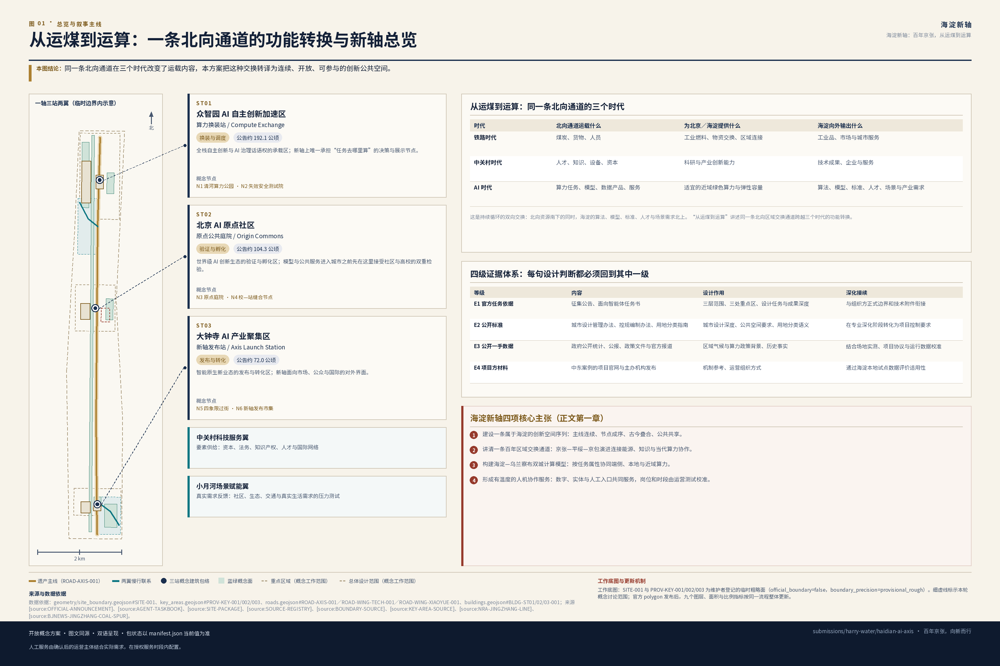
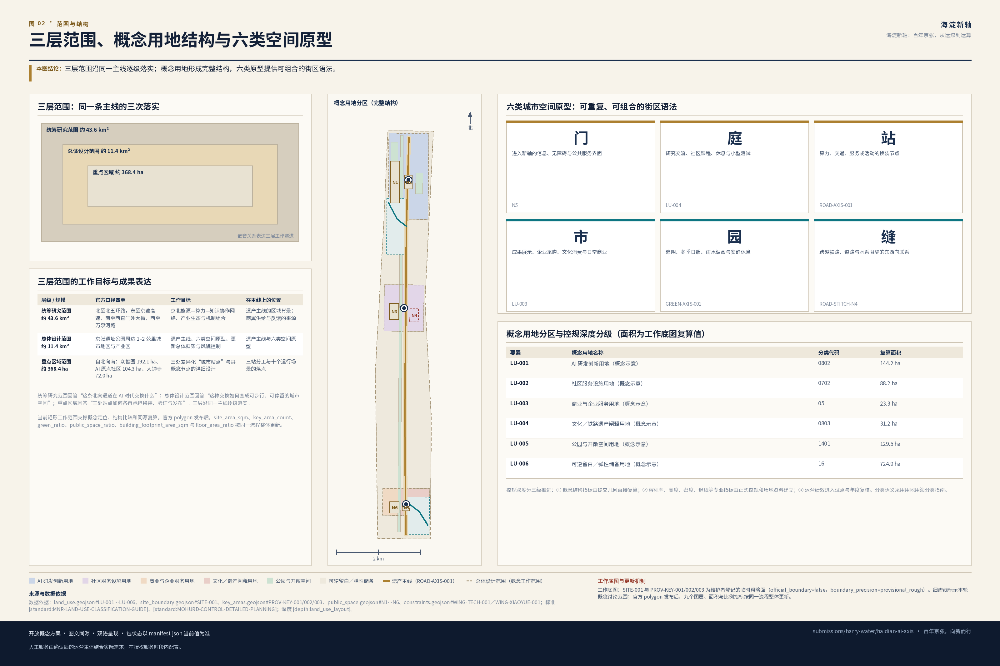
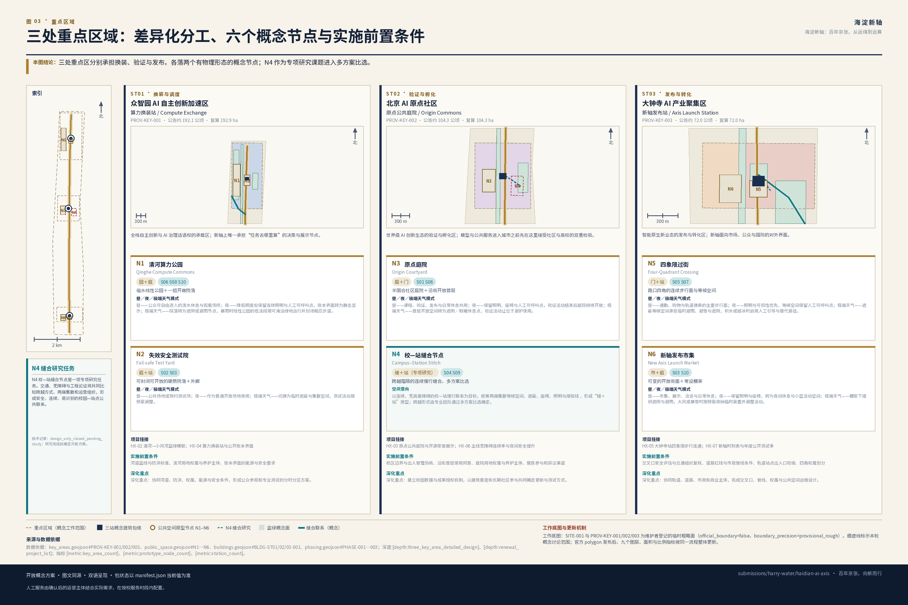
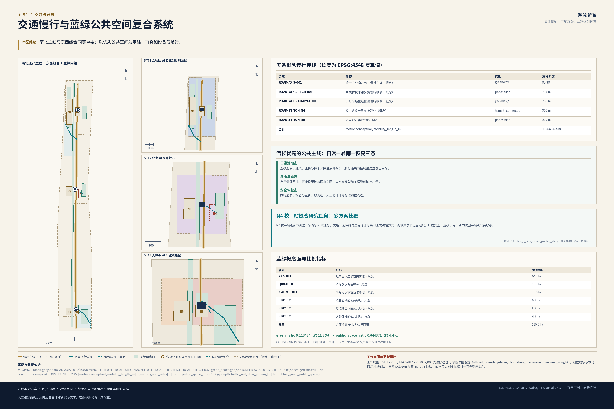
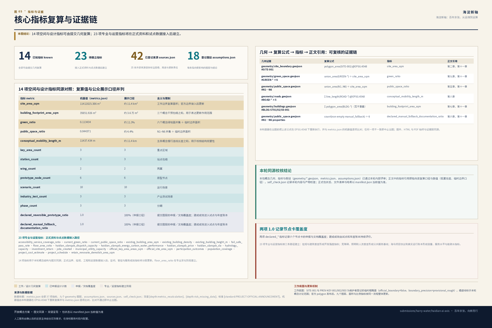

# 海淀新轴：百年京张，从运煤到运算

## 设计依据与资料清单

本方案提出的创新带概念名称为**海淀新轴**，英文品牌名为 **HAIDIAN AI AXIS**，封面完整标题为《海淀新轴：百年京张，从运煤到运算》，英文完整标题为 *HAIDIAN AI AXIS: FROM COAL TO COMPUTE*，礼仪性组合字为“百年京张·海淀新轴”，中文品牌句为“百年京张，向新而行”，英文传播句为 *Railway Heritage. AI Innovation. Everyday Life.*，提交目录 slug 为 `haidian-ai-axis`。

“**从运煤到运算**”把百年北向通道的区域交换传统转化为 AI 时代的新叙事：铁路时代输送煤炭、货物与人员，中关村时代汇聚知识、人才与资本，AI 时代进一步形成“北方算力支撑北京创新、海淀知识反哺区域发展”的双向协作。京张铁路、后续平绥—京包通道与当代海乌合作共同提供历史和区域背景；海淀新轴则把这种交换能力落实为公共空间、创新服务与日常生活。

方案由四项积极主张展开：

1. **建设一条属于海淀的创新空间序列。**借鉴北京中轴线“主线连续、节点成序、古今叠合、公共共享”的城市组织智慧，以京张遗产公共空间串联海淀北部、中部与南部创新资源，形成面向未来的城市新轴。
2. **讲清一条百年区域交换通道。**以 1909 年京张铁路和其后平绥—京包通道的演进为历史脉络，把鸡鸣山煤矿支线的能源供给记忆、中关村的知识创新和今天的算力协作组织成连续文化叙事。
3. **构建一个海淀—乌兰察布双城计算协作模型。**海淀负责算法、模型、标准、人才与应用场景，乌兰察布等近域伙伴承接适宜外送的训练、批处理与弹性任务，端侧、本地与外部算力按任务属性协同运行。
4. **形成一套有温度的人机协作公共服务。**数字服务与人工服务、在线系统与离线设施共同构成城市基础服务；人工服务由后续运营主体结合场地、需求和服务时段配置，使每类使用者都能以适合自己的方式进入新轴。

全文只有一条阅读主线，各章均为这条主线上的一环：

> **遗产主线 → 三站分工 → 两翼供给/反馈 → 六类空间原型 → 十个运行场景 → 一套年度账本**

这条链条同时是设计推进顺序：先有连续可用的公共空间，才有差异化站点；先有站点分工，才有空间原型；先有原型，才谈得上把场景装进去；最后由账本回过头检验前面每一环是否仍然成立。

方案以北京市规划和自然资源委员会海淀分局发布的《百年京张AI创新带城市设计国际方案征集资格预审公告》[source:OFFICIAL-ANNOUNCEMENT] 和面向全球智能体的开源征集任务书 [source:AGENT-TASKBOOK] 为任务依据，以 `brief/site-package/` 的范围、模板与工作几何 [source:SITE-PACKAGE] 为设计底板。标准、资料层级和完整审计关系分别收录在 `standard_matrix.json`、`sources.json` 与 `design_depth_matrix.json`，让正文保持清晰可读。

本方案使用四级证据体系，为概念生成、空间深化与后续实施提供连续依据：

| 证据等级 | 内容 | 在本方案中的作用 | 后续深化接续 |
| --- | --- | --- | --- |
| E1 官方任务依据 | 征集公告、面向智能体任务书 | 确定三层范围、三处重点区、设计任务与成果深度 | 与组织方后续发布的正式边界和技术附件衔接 |
| E2 公开标准 | 城市设计管理办法、控规编制审批办法、用地用海分类指南 | 建立城市设计、风貌、公共空间和用地分类的专业语言 | 在专业深化阶段转化为项目级控制要求 |
| E3 公开一手数据 | 政府部门公开统计、公报、政策文件与官方报道 | 提供区域气候、算力合作与历史叙事背景 | 结合场地实测、项目协议与运行数据完成本地校准 |
| E4 项目方材料 | 中东案例的项目官网与主办机构发布 | 提取气候设计、创新组织、运营服务和分期实施机制 | 通过海淀本地条件测试其适用性与成效 |

`data/source_registry.json` 提供了资料分级方法，本提交进一步在 `sources.json` 中登记 35 条外部公开来源：京张铁路与平绥—京包演进 5 条、北京中轴线遗产说明与保护管理规划 4 条、北京市水资源公报与年鉴 5 条、北京市生态环境局 PM2.5 年度数据 5 条、海淀—乌兰察布算力协同政府与部委材料 5 条、中东五案例项目方与主办机构材料 11 条。其中北京交通大学与新京报两条作为二手佐证使用，全部来源均逐条记录 `authority_level`、`usage` 与 `risk_note`，并以 `source:ID` 与正文对应。文保紫线、河道蓝线、绿线、道路红线、轨道控制线等资料将在下一阶段与组织方和专业团队协同接入 [source:SOURCE-REGISTRY]。

本轮以维护者提供的临时 `SITE_BOUNDARY` 与三处 `KEY_AREA` polygon 建立统一的概念工作底图，支撑方案生成、自检、可视化与空间讨论 [data:geometry/site_boundary.geojson#SITE-001]、[data:geometry/key_areas.geojson#PROV-KEY-001]。相应的 [metric:site_area_sqm] 与 [metric:key_area_count] 用于保持本轮图文一致。正式 polygon 到位后，将以同一套流程整体更新 site boundary、key areas、land use、roads、green space、public space、buildings、phasing 与全部指标，使概念框架顺畅进入专业深化。

**设计判断**：以品牌愿景、历史脉络、空间方法和双城协作四项主张共同启动设计。
**判断理由**：中轴线方法、京张历史与海乌算力分别提供空间秩序、文化叙事和运行机制，三者合在一起，才能把 AI 创新带从概念名称转化为可体验的城市方案。
**图层／指标／标准对应**：工作边界 [data:geometry/site_boundary.geojson#SITE-001]、面积指标 [metric:site_area_sqm] 与现状诊断深度 [depth:existing_conditions_diagnosis]。
**深化接口**：下一阶段接入官方红线、控规条件、现状建筑与权属、海淀站点级气候观测以及海乌合作技术协议，完成从概念设计到专业方案的校准。

## 三层范围工作框架

本方案按公告确定的三个层次组织工作，三层范围分别承担阅读主线上的不同环节：

| 层级 | 官方口径 | 本方案的工作目标 | 在主线上的位置 | 成果表达 |
| --- | --- | --- | --- | --- |
| 统筹研究范围 | 约 43.6 平方公里；北至北五环路，东至京藏高速，南至西直门外大街，西至万泉河路 | 京北能源—算力—知识协作网络、产业生态、未来城市形态与中东机制组合 | 遗产主线的区域背景；两翼供给与反馈的来源 | 战略结构图、机制链、场景与运营框架 |
| 总体设计范围 | 约 11.4 平方公里；京张遗址公园周边 1–2 公里城市地区与产业区 | 遗产主线、六类空间原型、城市更新总体框架、交通市政支撑与风貌控制 | 遗产主线与六类空间原型 | 用地、道路、绿地、公共空间、建筑与分期图层 |
| 重点区域范围 | 约 368.4 公顷；自北向南为众智园 192.1 公顷、AI 原点社区 104.3 公顷、大钟寺 72.0 公顷 | 三处差异化“城市站点”与其概念节点的详细设计 | 三站分工与十个运行场景的落点 | 定位、空间结构、建筑更新、慢行、公共空间、AI 场景与深化重点 |

三层范围的深度由 [depth:three_level_scope_framework] 与 [depth:overall_spatial_structure] 约束，任务依据为 [standard:PROJECT-OFFICIAL-ANNOUNCEMENT]，范围索引以 [source:PROCESSED-FACT-PACK] 中 `project_scope_summary.csv` 为导航，空间证据为 [data:geometry/site_boundary.geojson#SITE-001] 与 [data:geometry/key_areas.geojson#PROV-KEY-002]。

**海淀新轴把三个设计层次组织成一套连续行动。**统筹研究范围回答“这条北向通道在 AI 时代交换什么”，总体设计范围回答“这种交换如何变成可步行、可停留、可持续运营的城市空间”，重点区域回答“三处站点如何分别承担换装、验证与发布”。三层由区域协作逐级落实到街区和节点，共同完成一张从战略到日常体验的设计图。

本轮工作范围承担概念定位、结构比较和指标同源校核。正式 polygon 发布后，面积 [metric:site_area_sqm]、重点区计数 [metric:key_area_count] 与蓝绿空间比例 [metric:green_ratio] 将切换到正式计算基数。

公共空间比例 [metric:public_space_ratio]、建筑作用范围 [metric:building_footprint_area_sqm] 与容积率 [metric:floor_area_ratio] 将同步更新，使几何、图件和指标始终采用同一底板。

**设计判断**：三层范围承担同一条行动链上的不同环节，形成“区域协作—总体结构—重点节点”的逐级落实关系。
**判断理由**：把战略、总体与详细设计接入同一主线，可以让每一层都形成明确任务、成果和对下一层的输入。
**图层／指标／标准对应**：工作边界 [data:geometry/site_boundary.geojson#SITE-001]、重点区框架 [data:geometry/key_areas.geojson#PROV-KEY-002] 与三层范围深度 [depth:three_level_scope_framework]。
**深化接口**：接入三层官方 polygon、重点区四至以及重点区与总体设计范围的精确套合关系。

## 统筹研究范围产业与未来城市研究

### 概念说明：三种秩序如何叠合

在展开主线之前，先说明本方案的概念来源：北京中轴线示范了**空间秩序**如何组织一座城市，京张及其后续通道示范了**流动秩序**如何组织区域交换，海淀—乌兰察布协同则提出了**运行秩序**如何决定任务去向。三者共同以清晰规则串联功能、空间与时间，为海淀新轴提供一套从形态到运营的完整方法。全文按第一章的单一主线推进。

### 北京中轴线：三项独特对应与三项本地规划推论（agent.1／agent.5）

北京中轴线全长 7.8 公里，由五类十五个遗产构成要素、居中道路及相关环境共同组成，是城市建筑与遗址的组合体，其选址、格局与城市形态展现了中国传统理想都城秩序 [source:UNESCO-AXIS-1714]、[source:BJCT-AXIS-INSCRIPTION]。海淀新轴从这一世界级城市遗产中提取“连续主线、差异节点、均衡互补、古今叠合、公共共享、长期治理”六项组织智慧，并将其转译为海淀创新带的当代空间方法。

本方案把六项方法分为两组：**第一组从中轴线自身特质提取三项独特对应；第二组把这些对应转化为海淀可实施的三项本地规划行动**。前者建立文化与空间逻辑，后者把逻辑落到跨轴缝合、公共共享和长期治理。

**第一组｜三项独特对应（援引中轴线本身的特质）**

| 中轴线的独特之处 | 海淀新轴的对应 | 具体空间与运营动作 | 海淀当代表达 |
| --- | --- | --- | --- |
| 它是城市建筑与遗址的**组合体**，呈现超越单一道路的整体秩序 | **对应一：主线是一组空间** | 京张遗址公共空间连同两侧场地、界面与横向联系共同构成主线；衔接慢行断点、连续遮阴、无障碍、夜间照明与统一里程导视 | 以现代公共空间和线性导视建立海淀自己的识别系统 |
| 节点**功能各异且成序**，通过成对关系形成均衡 | **对应二：差异化节点序列与成对均衡** | 三处重点区分别承担研发换装、公共验证、成果发布；创新与生活、生产与照护、算法与人工成对配置，提升铁路东西两侧服务可达性 | 以功能互补和公平可达塑造当代均衡，而非建筑镜像 |
| 不同时代的建设与日常生活在同一条主线上**持续叠合** | **对应三：时间与文化的连续叠合** | 京张铁路遗存、中关村科研记忆、普通劳动与 AI 公共生活共同构成新轴记忆：时间轴、遗存标识、开源荣誉墙、社区口述、昼夜与四季运行日历 | 以真实遗存、当代创新和社区生活共同形成可持续更新的文化场景 |

**第二组｜三项本地规划推论（当代规划推导，非中轴线专属）**

| 推论 | 由哪项对应推出 | 具体空间与运营动作 | 实施重点 |
| --- | --- | --- | --- |
| **推论一：跨轴缝合** | 主线作为一组空间，需要与两侧城市连成整体 | 跨铁路缝合、清河与小月河蓝绿横联、社区换乘与东西向公共空间；南北主线与横向联系同等重要 | 通过交通、无障碍与工程专项比选确定缝合形式 |
| **推论二：公共共享** | 差异节点需要共同的进入与使用体验 | 主线与三处地标持续开放、方便进入，数字服务与人工服务共同构成公共入口 | 通过权属、运维与服务时段协商形成稳定开放机制 |
| **推论三：长期治理** | 时间叠合需要持续维护与更新 | 从一次性建设转为年度运营与复核：新轴时刻表、公开测试季、算力账本、人工复核、公众反馈与年度更新（治理主体见第六章） | 以试点章程建立组织、预算、审计和公众参与机制 |

以上六项均为可供专业团队深化研究的概念建议。

### 从运煤到运算：百年北向通道的功能转换（agent.5）

1909 年建成的京张铁路是中国人自主勘测、设计、施工与管理的第一条国有干线铁路，连接北京丰台柳村与张家口 [source:NRA-JINGZHANG-LINE]。此后线路向绥远方向延伸并纳入平绥铁路，1949 年后平绥铁路改称京包铁路，由此形成北京连接张家口、内蒙古与北方地区的长期铁路通道 [source:NMG-JINGSUI-HERITAGE]、[source:NRA-JINGZHANG-HSR-OVERVIEW]。历史资料还记载京张铁路设**鸡鸣山煤矿支线**，便于下花园附近煤矿的煤炭运输，既降低京张全路的燃料与转运成本，也支持煤炭运销各处；本方案据此把它概括为“服务煤炭外运、同时支持铁路自身运行的**能源供给支线**” [source:BJTU-JINGZHANG-HISTORY]、[source:BJNEWS-JINGZHANG-COAL-SPUR]。

| 时代 | 北向通道运载什么 | 为北京／海淀提供什么 | 海淀向外输出什么 |
| --- | --- | --- | --- |
| 铁路时代 | 煤炭、货物、人员 | 工业燃料、物资交换、区域连接 | 工业品、市场与城市服务 |
| 中关村时代 | 人才、知识、设备、资本 | 科研与产业创新能力 | 技术成果、企业与服务 |
| AI 时代 | 算力任务、模型、数据产品、服务 | 适宜的近域绿色算力与弹性容量 | 算法、模型、标准、人才、场景与产业需求 |

这是持续循环的**双向交换**：北向资源南下，海淀的算法、模型、标准、人才与场景需求北上，新轴把两种流动汇合为面向公众的城市服务。铁路通道提供历史叙事，双城计算网络提供当代运行机制，二者通过“区域交换”这一共同主题相互呼应。

### 三大定位、五大功能与三区两翼（agent.1）

三大定位为“百年京张文化带、都市 AI 生活体验带、AI 融合创新带”；五大功能为“AI 全栈自主创新体系、世界级 AI 创新生态、AI+ 场景赋能新范式、智能化 AI 活力城市、AI 治理全球话语权”[source:AGENT-TASKBOOK]、[standard:PROJECT-AGENT-OPEN-CALL-TASKBOOK]。本方案把三区两翼组织成一条持续循环、相互赋能的协同回路：

- **众智园 AI 自主创新加速区｜算力换装站 / Compute Exchange**——承担全栈自主创新体系与 AI 治理话语权：研发、标准、安全评测、双城调度与故障演练。
- **北京 AI 原点社区｜原点公共庭院 / Origin Commons**——承担世界级 AI 创新生态：高校、社区、开发者、模型验证与开源荣誉展示。
- **大钟寺 AI 产业聚集区｜新轴发布站 / Axis Launch Station**——承担智能原生新业态：产品转化、文化内容、企业采购、国际展示与城市生活。
- **中关村科技服务翼**——要素全球化配置：资本、法务、知识产权、人才与国际网络。
- **小月河场景赋能翼**——AI 场景赋能与活力城市：社区、生态、交通与真实生活需求的压力测试与反馈。

回路方向为：原点社区**验证**→ 众智园**换装与调度**→ 大钟寺**发布与转化**→ 两翼**供给要素与真实需求**→ 回到原点社区形成下一轮验证。

### 命名与视觉识别方向（agent.1）

中文名“海淀新轴”承担文化与空间意象，英文名 `HAIDIAN AI AXIS` 直接传达创新带的功能定位。`HAIDIAN` 中连续出现的字母 `AI` 可进一步形成 `H[AI]DIAN AI AXIS` 的视觉记忆点。英文传播统一配合 `FROM COAL TO COMPUTE` 与 `Railway Heritage. AI Innovation. Everyday Life.`，让铁路遗产、AI 创新、公共空间和日常生活同时进入品牌。Logo 采用“一条连续主线＋三个差异化站点标记＋一处横向缝合”的线性符号，形成简洁、开放、可扩展的识别系统；字体、图像、人物与企业标识在后续视觉深化中统一完成权利核验。以上方向可直接进入专业品牌与导视设计。

### 中东五案例：组合成一条海淀机制链（agent.2）

五个中东案例分别提供气候设计、人才培养、产业服务、算力组织与分期运营五类机制。本方案把它们拆解后重新组合，使每项经验都对应海淀新轴的一个空间节点、一个运营职能和一组本地适用条件。气候、人才和产业机制分别参考 Masdar City [source:MASDAR-SUSTAINABLE-DESIGN]、MBZUAI [source:MBZUAI-IEC] 与 DIFC AI Campus [source:DIFC-AI-CAMPUS-LICENSING]；算力和分期机制的完整来源见 `sources.json`。案例资料重点支持组织方法，并以海淀本地运营数据持续评估成效。

| 案例 | 可借鉴机制 | 海淀新轴的空间与运营落点 | 本地化转译 | 落地条件与评估重点 |
| --- | --- | --- | --- | --- |
| Masdar City | 被动式气候设计优先：遮阴、通风、围护与步行共同塑造舒适环境 | 整条公共主线：连续遮阴、冬季日照、通风廊、雨水转输与休息／降温点网络 | 从干热气候经验转译为北京“夏季遮阴与排涝、冬季日照与避风”并重的四季策略 | 结合街谷通风、日照、小时雨强和既有街廓逐段模拟，形成适合北京的参数 |
| MBZUAI | 大学研究—真实场景验证—原型展示—孵化—产业合作闭环 | AI 原点社区：高校研究与社区需求对接、模型验证、伦理复核、开源展示 | 以跨机构项目制连接高校、企业与社区，并同步建立数据、知识产权和成果共享规则 | 由参与高校、企业、社区共同确认长期经费、知识产权与开放场景清单 |
| Dubai AI Campus | “空间＋合规服务＋资本＋加速器＋企业采购＋人才训练”的常设运营体系 | 大钟寺发布站与新轴运营平台：空间建设与运营服务同步启动 | 把国际园区服务包转化为适合海淀的法务、知识产权、人才、采购与国际合作服务 | 建立常设团队、年度预算、服务清单和以转化成效为核心的评价体系 |
| HUMAIN / AWS AI Zone | 芯片—网络—平台—模型—应用—人才的全栈组织链 | 众智园与海乌算力协同：把算力、验证、开发者训练、企业试用与场景采购编成持续服务 | 由单体全栈转为海淀与乌兰察布多主体协作，按任务类型配置端侧、本地与外部算力 | 通过项目协议明确任务目录、计量口径、服务水平、切换责任与年度审计 |
| NEOM THE LINE | 分期、按需响应以及工作、服务、文化功能之间的近接与连通 | 全轴场景测试与运营模拟：按使用需求组织公共空间开放节奏与场景接入顺序 | 把超大尺度愿景转化为小尺度、可逆、可按反馈调整的街区试点；气候数字孪生服务本地空间运营 | 以分期目标、公众反馈和设施数据持续校准场景，逐阶段决定扩大、调整或转型 |

本地化后的组合顺序是：**气候公共空间 → 科研与人才锚点 → 常设运营机构 → 双城绿色算力协作 → 以公众权利为基础的数字孪生**。这条顺序先营造本身就舒适、开放的公共空间，再把科研、产业、算力和智能运营逐层叠加；每一层都有明确的空间载体、责任主体和评估指标。

### 未来城市形态的区域背景

区域气候背景显示：2021—2025 年北京**全市**年降水量在 482—924 mm 之间，五年均值 766.4 mm，呈现显著的年际丰枯变化 [source:BJWATER-RAINFALL-2021]、[source:BJWATER-RAINFALL-2025]。空气质量方面，2021—2025 年北京 PM2.5 年均浓度总体下降，2025 年海淀区均值低于全市均值 [source:BJEE-PM25-2021]、[source:BJEE-PM25-2025]。完整年度序列收录在 `sources.json`；这些区域资料支持新轴采用可适应不同季节与天气的公共空间框架。下一阶段叠加研究区站点气象、小时雨强、水文模型与积水资料，校准“日常活动—暴雨滞蓄—安全恢复”三态系统及工程参数。

**设计判断**：以中轴线的三项独特对应和三项本地规划行动确立空间组织方式，再把五个中东案例组合为气候、人才、运营、算力与数字孪生的机制链。
**判断理由**：世界级创新生态来自机制与空间的协同。先营造优质公共空间，再叠加科研、服务、算力与智能运营，可以让技术创新持续服务城市生活。
**图层／指标／标准对应**：总体用地 [data:geometry/land_use.geojson#LU-001]、公共空间原型 [data:geometry/public_space.geojson#N3] 与总体结构深度 [depth:overall_spatial_structure]。
**深化接口**：补充海淀站点降水与小时雨强、街谷通风与热舒适实测、中东案例第三方绩效资料以及开源社区与企业分布统计，形成面向下一阶段的本地参数库。

## 总体设计范围城市更新与控规深度城市设计

### 一轴、三站、两翼、六类城市空间

**一轴**：京张铁路遗址公园及其南北连续公共空间。它以免费、连续、无障碍、气候适应为基础体验，以技术展示和创新服务为增值内容。所有智能设施都与通行、遮阴、休息和无障碍设施一体化设置，让科技自然进入城市日常。

**三站、两翼**已在第三章说明。**六类城市空间**构成可重复、可组合的街区语法，以小尺度、连续、可进入的城市空间表达“轴”：

| 空间类型 | 城市职能 | 典型设计动作 | 对应图层 |
| --- | --- | --- | --- |
| 门 / Gateway | 进入新轴的信息、无障碍与公共服务界面 | 以站点出入口、现代线性导视、人工服务台和无障碍坡道共同形成开放入口 | [data:geometry/public_space.geojson#N5] |
| 庭 / Courtyard | 研究交流、社区课程、休息与小型测试 | 半开放庭院、可预约测试位、遮阴与座椅 | [data:geometry/land_use.geojson#LU-004] |
| 站 / Station | 算力、交通、服务或活动的换装节点 | 端侧算力、交通接驳、活动集散、人工服务和实体导视协同布置 | [data:geometry/roads.geojson#ROAD-AXIS-001] |
| 市 / Market | 成果展示、企业采购、文化消费与日常商业 | 开放街面、首层活化、可临时布展 | [data:geometry/land_use.geojson#LU-003] |
| 园 / Garden | 遮阴、冬季日照、雨水调蓄与安静休息 | 气候公共空间、可淹没绿地、雨水花园 | [data:geometry/green_space.geojson#GREEN-AXIS-001] |
| 缝 / Stitch | 跨越铁路、道路与水系阻隔的东西向联系 | 形成连续慢行与生态联系，并通过专项比选确定适宜工程形式 | [data:geometry/roads.geojson#ROAD-STITCH-N4] |

六类空间是一套可组合、可扩展的街区原型。专业团队可依据不同区段的现状条件，把它们组合成院落、街面、公园、换乘与横向缝合等具体项目。

### 城市更新总体框架与控规深度分级

按 [standard:MOHURD-CONTROL-DETAILED-PLANNING] 与 [depth:land_use_layout]、[depth:development_intensity_controls] 的要求，本方案把所有控规深度内容分为三级并分别标注：

1. **概念结构指标**：用地结构 [data:geometry/land_use.geojson#LU-002]、建筑干预包络 [data:geometry/buildings.geojson#BLDG-ST01-001]、绿地与公共空间比例 [metric:green_ratio]、[metric:public_space_ratio]、建筑干预包络面积 [metric:building_footprint_area_sqm]。它们用于保持本轮空间结构和图文表达一致。
2. **专业深化指标**：容积率 [metric:floor_area_ratio]、建筑高度、建筑密度、退线、道路红线与设施标准。下一阶段结合正式控规和场地资料建立项目级控制值。
3. **长期运营指标**：AI 创新指数、人才密度、慢行可达性、场景使用频次、活动参与度。它们进入年度账本，以真实运行数据持续校准空间和服务。

用地分类语义统一采用 [standard:MNR-LAND-USE-CLASSIFICATION-GUIDE]；提交的 `land_use.geojson` 以 AI 研发创新、公园绿地与开敞空间、产业与商业服务、社区服务与配套四类概念分区形成完整结构 [data:geometry/land_use.geojson#LU-001]。

### 气候优先的公共主线

依据前述区域气候背景，京张遗址公园主线按**日常活动—暴雨滞蓄—安全恢复**三态设计：日常态提供连续遮阴、通风、座椅与休息／降温点网络；暴雨态启用分级蓄排、可淹没绿地与雨水花园；恢复态执行清淤、检查与重新开放流程。清河—小月河构成生态调蓄横联，下一阶段结合蓝线、水文与景观专项确定具体空间形态。

休息／降温点采用“主线上任一点到最近可用节点的步行距离”为控制量。下一阶段结合主线实际长度、断点位置、坡度、遮阴现状与人流分布确定覆盖目标（口径见第十一章“可验证设计目标”表）。蓄排容量则通过水文模型与工程资料模拟确定，使三态系统从概念策略进入可实施设计。

**设计判断**：以“一轴三站两翼六空间”建立清晰的总体结构，并把设计内容组织为概念结构、专业深化与长期运营三个层次。
**判断理由**：清晰的层级让概念设计、专业深化和建成后的运营评估彼此衔接，使核心主张在每个阶段持续强化。
**图层／指标／标准对应**：总体用地 [data:geometry/land_use.geojson#LU-001]、建筑作用范围 [data:geometry/buildings.geojson#BLDG-ST01-001] 与用地布局深度 [depth:land_use_layout]。
**深化接口**：接入控规图则、现状建筑与权属、道路红线、市政管线、河道蓝线、防洪标准和文保紫线，形成项目级控制图则。

## 重点区域详细设计

三处重点区以临时工作 polygon 建立差异化站点框架 [data:geometry/key_areas.geojson#PROV-KEY-001]、[data:geometry/key_areas.geojson#PROV-KEY-002]、[data:geometry/key_areas.geojson#PROV-KEY-003]。本轮重点回答每个区域“承担什么创新职能、形成什么公共空间、导入什么 AI 场景”，并为后续专业团队提供可继续深化的组织原型，由 [depth:three_key_area_detailed_design] 校核。

每处重点区包含一个区级方案和**两个概念节点卡**，共六个。节点卡把“门、庭、站、市、园、缝”落到可识别的公共空间形态：院、场、缝合节点、街和过街面。现状假设用于指导下一阶段普查，空间动作给出明确建设方向，实施前置条件则连接权属、交通、工程和运营专业。人工服务、实体导视和数字设施作为完整服务系统统筹设计，具体岗位和时段由运营方案确定。

### 众智园 AI 自主创新加速区｜算力换装站 / Compute Exchange（约 192.1 公顷）

- **定位**：全栈自主创新与 AI 治理话语权的承载区；新轴上唯一承担“任务去哪里算”的决策与展示节点。
- **空间结构**：以临清河界面为公共客厅，形成“河—园—庭—研发组团”的层进结构；调度与测试功能集中在面向公众开放的中部庭院组群。
- **建筑更新方向**：以保留与轻改造为主，优先改造首层界面与屋顶设备层；新增测试与展示空间采用可逆加建，并在控规与权属条件确认后配置必要的新建空间。
- **交通慢行**：强化对外交通与园区内慢行分离；沿清河形成连续骑行与步行道；接驳点保留人工问询与非数字入口。
- **公共空间**：低碳创新交往环境以“园”为主，承担遮阴、雨洪调蓄与安静休息；公开测试季期间部分庭院转为开放测试场。
- **AI 场景**：场景卡 02 安全治理沙盒、06 京张遗产与 AI 公共教育、08 海乌绿色智算调度测试、10 气候数字孪生城市运维测试。
- **深化重点**：协同确认河道蓝线、防洪、能源、安全与权属条件，并为公众参观和专业测试建立分时、分区的运营组织。

#### 节点卡 N1｜清河算力公园 / Qinghe Compute Commons（形态：临水线性公园＋一组开敞院落）

- **场地机会（待普查校准）**：园区临清河界面具备转型为开放公共客厅的潜力；通过可停留、可观看、可提问的空间，可以让抽象的“算力”成为公众可理解的城市内容。
- **空间动作**：把临河带整理为连续的线性公园，并在其中嵌入一组开敞院落，把调度与账本的公众可读界面设在院落的沿街／沿河面；院落之间以连续遮阴步道串联，属“园＋庭”原型的组合。
- **昼／夜／极端天气模式**：昼——公众可自由进入的滨水休息与观看场所；夜——降低照度但保留连续照明与人工可呼叫点，账本界面转为静态显示；极端天气——院落转为遮阴或避雨节点，暴雨时线性公园的低洼段按可淹没绿地运行并封闭相应步道。
- **主要使用者**：园区研发与评测人员、周边居民、沿河慢行与骑行者、公众参观者。
- **实施前置条件**：河道蓝线与防洪标准、滨河用地权属与养护主体、临河建筑界面改造的使用同意、账本界面的能源与安全要求。
- **深化方式**：本轮确定“临水线性公园＋开敞院落”的空间原型；下一阶段完成定位、尺度、防洪、权属与运营设计。

#### 节点卡 N2｜失效安全测试院 / Fail-safe Test Yard（形态：可封闭可开放的硬质院落＋外廊）

- **场地机会（待普查校准）**：安全评测与故障演练多在专业空间内进行，城市需要一个让公众理解系统运行和人工接管机制的开放窗口。
- **空间动作**：设一处硬质院落，日常作为普通公共场地使用，测试期通过可移动围界组织安全分区；公众可从环绕院落的外廊观看演练与人工接管过程；属“庭＋站”原型。
- **昼／夜／极端天气模式**：昼——公共场地或预约测试场；夜——作为普通开放场地使用；极端天气——切换为临时遮蔽与集散空间，测试活动按预案调整。
- **主要使用者**：评测与研发团队、监管观察者、公众参观者、周边居民（非测试时段）。
- **实施前置条件**：明确测试活动安全规则与许可、场地权属和管理责任、围界与设施的消防结构条件；演练采用公开、合成或完成去标识处理的数据。
- **深化方式**：本轮确定“可开可合的测试院＋公众外廊”原型；下一阶段完成场地选址、安全许可、设施与运营设计。

### 北京 AI 原点社区｜原点公共庭院 / Origin Commons（约 104.3 公顷）

- **定位**：世界级 AI 创新生态的验证与孵化区；模型与公共服务在进入城市之前先在这里接受社区与高校的双重检验。
- **空间结构**：以“庭”为核心的小尺度网络，缝合校区—园区—街区；开源荣誉展示沿慢行主线线性展开，形成日常可见的创新界面。
- **建筑更新方向**：以保留和轻改造为主，重点补足成果发布、人才服务、居住配套与开源协作空间；对沿街低效首层优先做可逆改造。
- **交通慢行**：校区与园区之间的慢行缝合优先；夜间照明与安全归途路线纳入常态运营。
- **公共空间**：原点公共庭院以可进入、可停留、有人服务为核心体验，设置面向新来者到达初期的信息与服务界面；服务时段与人员配置由后续运营测试确定。
- **AI 场景**：场景卡 01 开源发布厅、04 新来者 72 小时安顿、06 京张遗产与 AI 公共教育、09 科研到中小企业产品转化测试。
- **深化重点**：建立校园数据与科研成果授权机制，协同处理产权和社区利益，并通过长期参与机制共同确定测试活动和建筑更新方式。

#### 节点卡 N3｜原点庭院 / Origin Courtyard（形态：半围合社区庭院＋沿街开放首层）

- **场地机会（待普查校准）**：高校、企业与居住社区彼此相邻，具备共建中间场所的潜力；开放的模型验证与开源活动可成为三方持续交流的公共界面。
- **空间动作**：以半围合庭院组织一处对三方都开放的中间场所，沿街首层开放为可进入的服务与展示界面；庭院内设可预约的小型验证位与常设人工服务台，开源荣誉展示沿庭院边界线性展开；属“庭＋门”原型。
- **昼／夜／极端天气模式**：昼——课程、验证、发布与日常休息共用；夜——保留照明、座椅与人工可呼叫点，验证活动结束后庭院继续开放；极端天气——首层开放空间转为遮阴／取暖休息点，验证活动让位于避护使用。
- **主要使用者**：高校师生、开发者、周边居民（含老年居民）、初到海淀的租住者、家长与儿童。
- **实施前置条件**：校区边界与出入管理的协商、沿街首层的使用同意与业态调整、庭院用地权属与养护主体、居民参与和异议渠道的制度安排。
- **深化方式**：本轮确定“半围合社区庭院＋沿街开放首层”原型；下一阶段完成定位、尺度、建筑评估和共建运营方案。

#### 节点卡 N4｜校—站缝合节点 / Campus–Station Stitch（慢行缝合研究课题，mobility_stitch 原型）

- **研究任务（design_only_closed_pending_study）**：将 [data:geometry/public_space.geojson#N4] 定义为 `mobility_stitch` 研究课题，现阶段保持关闭，集中完成交通、无障碍和工程三项专项论证。上跨、下穿、平面改造、连续遮蔽、两端集散、绕行组织与服务配置共同进入多方案比选。
- **场地机会（待普查校准）**：校区、园区与轨道站点之间存在铁路、道路或围墙形成的绕行；缩短迂回距离、改善夜间与雨雪天体验，是本节点的核心公共价值。
- **空间意向**：以连续、无高差障碍的校—站慢行联系为目标，统筹两端集散等候空间、遮蔽、座椅、照明与接驳线 [data:geometry/roads.geojson#ROAD-STITCH-N4]，形成“缝＋站”原型；跨越形式由专业团队通过多方案比选确定。
- **未来运行方式**：昼——通学、通勤与校园—园区往返路径；夜——以照明和可视性提供安全归途；极端天气——按预案切换替代路径。人工值守与引导结合运营主体和授权服务时段配置。
- **主要使用者**：高校师生、通勤者、夜班人员、学生与家长、使用轮椅与其他行动受限者。
- **实施前置条件**：交通、无障碍与工程三项专项论证，铁路与道路的安全控制要求，轨道站点出入口条件，两端落地空间的权属与市政管线条件。
- **深化方式**：本轮完成课题定义、使用者目标与比选要素；专项论证确定安全可行的跨越形式、线位、两端空间和运营方式后，再进入实施设计与开放程序。

### 大钟寺 AI 产业聚集区｜新轴发布站 / Axis Launch Station（约 72.0 公顷）

- **定位**：智能原生新业态的发布与转化区；新轴面向市场、公众与国际的对外界面。
- **空间结构**：以“市”为主导，围绕轨道站点组织四象限步行连通与首层商业服务；发布与文化内容功能沿步行系统串联。
- **建筑更新方向**：以保留与首层活化为主；规划绿地复合利用作为公共空间补充；在控规与权属条件确认后配置必要的新建与加建空间。
- **交通慢行**：以轨道站点一体化和路口四象限步行连通为核心动作，与轨道、道路和市政部门协同确定实施方案。
- **公共空间**：新轴发布站兼具年度“新轴时刻表”主场地和日常城市客厅两种角色，企业发布、国际交流与普通市民使用共享同一开放空间。
- **AI 场景**：场景卡 05 无障碍连续通行、07 夜班人员安全归途、03 断网／断电失效安全、10 气候数字孪生城市运维测试（发布端）。
- **深化重点**：协同轨道、道路、市政和商业主体，完成交叉口安全、管线、产权与运维设计，并建立国际活动的内容与版权管理流程。

#### 节点卡 N5｜四象限过街 / Four-Quadrant Crossing（形态：路口四角的连续步行面与等候空间）

- **场地机会（待普查校准）**：大型路口四个象限具备整合步行、换乘、等候和休息的潜力；以一套连续步行面组织四角，可以显著改善多次等候与绕行体验。
- **空间动作**：把路口四角整理为连续、无高差障碍的步行面，并在每个角部预留带遮蔽的等候与休息空间；四个象限的落客、非机动车停放与轨道站点出入口在同一套步行面上组织；属“门＋站”原型。交通与工程专业通过仿真和多方案比较确定具体过街形式。
- **昼／夜／极端天气模式**：昼——通勤、购物与轨道换乘的主要步行面；夜——照明与可视性优先，等候空间保留人工可呼叫点；极端天气——遮蔽等候空间承担临时避雨、避雪与遮阴，积水或结冰时启用人工引导与替代路径。
- **主要使用者**：轨道通勤者、周边就业者与访客、老年居民、使用轮椅与其他行动受限者、非机动车使用者。
- **实施前置条件**：交叉口安全评估与交通组织复核、道路红线与市政管线条件、轨道站点出入口衔接、四角用地的权属与管理责任划分。
- **深化方式**：本轮确定“四角连续步行面＋等候空间”的目标；下一阶段完成交通仿真、过街形式、轨道衔接和市政设计。

#### 节点卡 N6｜新轴发布市集 / New Axis Launch Market（形态：可变的开放街面＋常设棚架）

- **场地机会（待普查校准）**：成果发布、企业采购、文化活动与沿街日常生活可以共享同一空间，通过常设公共设施和可变活动装置提高全年使用效率。
- **空间动作**：以常设轻质棚架限定一段开放街面，日常作为普通市集、休息与展示空间，发布季通过可拆装摊位与展板转为发布与采购场地；棚架是永久公共设施，活动装置是临时的；属“市＋庭”原型。
- **昼／夜／极端天气模式**：昼——市集、展示、洽谈与日常休息；夜——保留照明与座椅，转为夜间休息与小型活动空间；极端天气——棚架下提供遮阴与避雨，大风或暴雪时按预案收纳临时装置并调整活动。
- **主要使用者**：周边居民与就业者、中小企业与初创团队、访客与国际来宾、摊位经营者。
- **实施前置条件**：街面与用地的权属和使用同意、公共活动许可与安全预案、棚架的结构与消防条件、临时装置的清权与回收安排。
- **深化方式**：本轮确定“开放街面＋常设棚架＋可拆装活动设施”原型；下一阶段完成定位、尺度、结构、招商与日常运营设计。

**设计判断**：三处重点区差异化承担换装、验证、发布，各自形成“定位＋空间结构＋建筑更新＋交通慢行＋公共空间＋AI 场景＋深化重点”的小方案，并各落两个有物理形态的概念节点（N1–N6）。
**判断理由**：清晰分工让三站共同形成完整创新链；六张节点卡则把区域定位落实为可感知、可使用、可继续设计的城市空间。
**图层／指标／标准对应**：三站以重点区图层 [data:geometry/key_areas.geojson#PROV-KEY-001]、六类节点以公共空间图层 [data:geometry/public_space.geojson#N1] 表达，并由重点区详细设计深度 [depth:three_key_area_detailed_design] 校核。
**深化接口**：接入三处重点区正式四至、现状建筑与权属、轨道与道路工程条件、河道与文保控制线及建筑专业深度文件，推动六个节点从概念原型进入专业设计。

## AI 创新生态、人才画像与 AI+ 场景

### 五类用户画像（agent.3）

| 画像 | 典型需求 | 空间与服务响应 | 服务与数据原则 |
| --- | --- | --- | --- |
| 本地老年居民与数字能力较弱者 | 通勤、就医、休息、可理解的信息 | 连续遮阴与座椅、人工问询台、大字导视、实体入口 | 直接使用基础服务；系统采用最小数据模式 |
| 初到海淀的青年研究者、创业者或租住者 | 72 小时安顿、低成本工位、算力入口 | 原点社区安顿服务、共享测试位、成果转化驿站 | 信息由使用者自愿提交，服务聚焦实际问题而非用户画像 |
| 夜班服务、物流、安保与实验室人员 | 夜间安全归途、休息点、应急联系 | 分级照明、夜间休息点和可呼叫人工的求助节点 | 设施状态数据与匿名聚合统计支持运营优化 |
| 家长、儿童与学生 | 安全通学、公共教育、活动空间 | 通学路径、京张遗产与 AI 教育点、可预约庭院 | 采用适龄内容、监护与最小数据原则 |
| 轮椅、视障及其他行动受限使用者 | 连续无障碍、清晰导引、可靠替代方案 | 主线无障碍连续通行、触觉与语音导引、故障时人工引导 | 辅助服务以功能需求为依据，保障便捷进入和个人尊严 |

### 十张 AI 场景卡（agent.3）

十张场景卡用同一套格式回答：在哪里、为谁服务、何时触发、使用什么数据、由谁复核、如何在断网断电时继续服务、由谁运营、使用者如何选择进入或退出、以什么指标评估。数字系统、实体设施与人工服务共同构成韧性服务，使用者可以选择适合自己的入口。运营主体由后续开放运营联盟组织落实，具体责任见下节治理矩阵；人工值守、可呼叫点和引导服务结合运营条件配置服务时段。

表中“核心指标”列出每个场景进入试点后需要建立的观测量。恢复时间、人工到位时间、求助响应时间、故障修复时长、覆盖率与达标率由人流、运营时段、人力配置和现状普查共同确定，口径见第十一章“可验证设计目标”表。卡 04 的“72 小时”定义新来者到达后的集中需求窗口，便于组织安顿服务。

| 卡号与名称 | 空间位置 | 服务对象／触发条件 | 数据与服务原则 | 人工协作／韧性替代 | 运营与使用选择 | 核心指标 |
| --- | --- | --- | --- | --- | --- | --- |
| 01 开源发布厅 | 原点社区 | 高校、开源社区、初创团队／发布与路演申请 | 使用团队自愿提交的项目信息 | 人工编辑内容；纸质排期与现场登记同步运行 | 运营机构组织发布；团队自主更新或撤回展示 | 发布场次、参与团队数 |
| 02 安全治理沙盒 | 众智园 | 研发与评测团队、监管观察者／模型评测预约 | 使用测试数据集与评测记录 | 专业人员签署评测结论；保留离线评测流程 | 运营机构组织测试；项目按阶段进入、调整或结束 | 评测轮次、公开报告数 |
| 03 断网／断电失效安全 | 全轴站与门 | 全体使用者／网络或供电中断 | 使用设施状态信号 | 自动切换人工接管；纸质指引与人工引导保持服务连续 | 运营机构执行韧性预案；系统按状态切换服务模式 | 恢复时间、人工到位时间 |
| 04 新来者 72 小时安顿 | 原点社区、门 | 初到海淀者／自愿咨询 | 使用者按需自愿提交信息，完成服务后清理 | 人工顾问、纸质手册与线下窗口共同服务 | 运营机构组织服务；支持匿名咨询 | 咨询量、问题解决率 |
| 05 无障碍连续通行 | 主线全段 | 行动受限使用者／全时段 | 使用设施可用状态数据 | 故障时人工引导；实体触觉导引与告示持续可用 | 运营机构维护设施；基础通行直接开放 | 无障碍断点数、连续率、故障修复时长 |
| 06 京张遗产与 AI 公共教育 | 遗址主线、原点社区 | 学生、居民、访客／日常与活动季 | 使用公开史料与授权内容 | 讲解内容人工审校；实体展板与纸质导览同步提供 | 运营机构更新内容；访客自主选择数字或实体导览 | 参与人次、内容清权率 |
| 07 夜班人员安全归途 | 全轴主线、站 | 夜班工作者／夜间时段 | 使用照明与设施状态数据，形成匿名运营统计 | 人工求助、实体按钮与固定巡查协同 | 运营机构按夜间需求配置服务；基础求助直接可用 | 夜间照明达标率、求助响应时间 |
| 08 海乌绿色智算调度测试 | 众智园 | 研发团队、公众观察者／调度测试窗口 | 使用任务级运行数据 | 调度策略由专业人员确认；本地服务保持韧性 | 运营机构组织测试；按测试结果调整任务目录 | 见下文账本口径 |
| 09 科研到中小企业产品转化测试 | 原点社区、大钟寺 | 高校团队、中小企业／转化申请 | 使用双方自愿提交的成果与需求信息 | 人工完成知识产权与合规审核；保留线下洽谈 | 运营机构提供转化服务；双方自主决定合作阶段 | 转化立项数、退出率 |
| 10 气候数字孪生城市运维测试 | 全轴、清河—小月河 | 运维单位、公众／暴雨与极端温度预警 | 使用公开气象与设施状态数据，面向空间和设施建模 | 现场处置由专业人员批准；纸质预案与人工巡查同步运行 | 运营机构组织预演；公共通行由现场安全规则管理 | 切换用时、误报率 |

其中，**08、09、10 为三项 AI 产业测试验证场景**，分别形成三套可公开评估的测试规范：

- **08 海乌绿色智算调度测试**：以任务为单位记录时延、排队、失败率、能耗、PUE 适用口径、绿电比例、碳、水与故障切换时间。先发布测试规范和账本结构，再由真实运行数据逐步形成可比较的双城计算绩效。
- **09 科研到中小企业产品转化测试**：测试需求匹配、知识产权、数据授权、产品验证和采购对接的完整流程，以转化立项数、完成率、退出率和参与者反馈评估服务能力。
- **10 气候数字孪生城市运维测试**：围绕设施与空间开展极端天气预演，由专业人员把模型结果转化为现场处置建议，并以切换用时、误报率和公众反馈持续校准。

### 开放运营联盟与可逆成长周期（agent.6）

十张场景卡与海乌调度模型共用一套长期运营架构。本方案建议组建**海淀新轴开放运营联盟 / Haidian AI Axis Open Operations Consortium**，连接公共利益、技术运营、独立审计、居民参与、海乌合作与争议调解六类能力。联盟先以试点章程确定参与主体、年度预算、服务清单和问责方式，再随场景成熟逐步扩展。

联盟内部设置六类相互制衡又彼此协作的责任，其中公共利益受托、技术运营和独立审计由不同主体承担：

| 责任 | 职责范围 | 对场景卡与海乌调度的具体作用 | 协作接口与独立性 |
| --- | --- | --- | --- |
| 1. 公共利益受托人 | 维护公共空间免费、连续、可进入及实体服务入口 | 评估场景变更对基本公共服务的影响并行使公共利益否决权 | 专注公共价值，由技术运营方提供信息支持 |
| 2. 技术运营方 | 场景与调度的日常运行、维护和故障处置 | 执行任务分级、故障切换与人工接管流程 | 绩效由独立审计方评价，续期由治理委员会决定 |
| 3. 独立证据／能耗／隐私审计方 | 核验账本、能耗、碳水计量及数据治理 | 出具公开审计意见，作为续期与调整依据 | 保持与运营方的组织和利益独立 |
| 4. 居民与使用者理事会 | 汇集居民、老年人、行动受限者、夜班人员与学生体验 | 发起场景复核、提出改进或暂停动议 | 意见进入正式记录，并由专业团队形成书面回应 |
| 5. 海乌协议工作组 | 与合作方协商任务分级、计量口径和故障责任 | 形成任务目录、账本字段、服务水平与切换责任 | 以签署并公开的项目协议作为执行依据 |
| 6. 独立申诉与争议调解机构 | 受理投诉、调解争议并监督暂停与退出程序 | 为每个使用者提供面向单一场景的申诉入口 | 与技术运营相分离，并在服务切换时保障基础服务连续 |

场景按**可逆成长周期**推进，每一阶段都以公开证据决定进入下一阶段、调整或回到上一阶段：

1. **90 天标准演练**：先演练规则、口径、流程与账本结构，使用公开、合成或去标识测试数据，形成可审计的运行手册。
2. **一年可逆公共试点**：在限定节点开放试运行，设施可拆、规则可调、服务可回退；公共利益受托人、居民理事会和争议调解机构可依据现场证据发起调整或暂停。
3. **年度审计与续期／修改／停止决定**：独立审计方发布意见，联盟治理委员会据此作出续期、修改或停止决定并公开理由。公共利益受托人、居民理事会和争议调解机构参与表决；技术运营方陈述运行情况，海乌工作组说明协议可行性。每一种决定都属于正常的证据驱动治理结果。

上述第 2 类责任承担场景的具体运营，第 1、3、4、6 类共同提供公共监督、证据审计、使用者参与和申诉调解。联盟筹备期从第一阶段标准演练启动，在组织与章程就绪后进入公共试点。

### 极端天气与暴雨切换场景

除上述十卡外，公共空间的三态切换（暴雨滞蓄、极端高温与寒冷避护）作为**空间运行工况**内嵌在第四章与第九章：暴雨时启用可淹没绿地与分级蓄排，高温与严寒时开放遮阴／取暖休息点；运营主体根据预警和使用需求调整人工服务时段。实体空间首先提供基础气候韧性，智能系统进一步提升预警、调度和恢复效率。

### 海淀—乌兰察布长期运营模型

乌兰察布集宁大数据产业园属于国家算力枢纽起步区，并面向京津冀高实时性需求 [source:NDRC-COMPUTE-HUB-REPLY-2021]；内蒙古自治区政府公开报道提到两条直通北京的 144 芯点对点光缆及约 4.2 ms 的端到端时延 [source:NMG-NETWORK-REPORT-2025]、[source:NMG-NETWORK-REPORT-2024]；工信部公开材料记录了乌兰察布**某一特定数据中心**当时的年均 PUE 1.32、自然冷却月份月度 PUE 约 1.22、可再生能源占比 40% 以上与约 10 个月自然冷源条件 [source:MIIT-DATACENTER-CASE-2021]；海淀区与乌兰察布市已签署人工智能产业合作备忘录，政府报道亦提到“海乌绿色智算服务平台”合作 [source:BJHD-COOPERATION-2024]、[source:NMG-NETWORK-REPORT-2025]。

这些公开资料说明，海淀与乌兰察布已经具备政策协作、网络联系和绿色数据中心实践等基础条件。本方案据此提出**双城计算架构**：把端侧、本地与近域算力组织成可审计的任务调度系统。约 4.2 ms 的公开报道口径、特定数据中心的 PUE 与可再生能源数据作为技术研究的起点；下一阶段通过项目专属协议，进一步确认海淀链路、应用时延、容量、价格、服务水平、计量口径和故障责任。

**任务分级**（决定任务在哪里计算）：

1. 现场控制与敏感任务：由端侧和本地系统承担。
2. 低时延公共服务：采用本地／近端推理，并配置人工与离线服务。
3. 普通推理与弹性峰值：依据项目协议在两地动态调度。
4. 训练、微调、合成数据、批处理与备份：优先匹配适宜的近域伙伴资源。
5. 故障状态：自动切换本地服务、人工接管和恢复复位，并记录全过程。

**数据分级**：外送任务使用获得授权、完成分类分级并满足最小化要求的数据；个人身份、生物特征、未成年人、健康与轨迹信息由本地系统保护。公共服务同时提供最小数据和实体服务路径。

**时延与韧性**：公共服务以“本地持续可用”为设计基准，外部算力承担适宜调度的任务；链路状态变化自动触发本地服务模式和人工协作。

**能耗、碳与水账本**：按任务记录时延、排队、失败率、能耗、PUE 适用口径、绿电比例、碳排、水耗与故障切换时间，并标注每一项的计量口径与来源。试点从测试规范和表结构启动，随后以真实运行数据形成年度比较。

**故障切换与人工接管**：系统提供明确的人工决定权，人工接管作为标准韧性流程；每次切换与接管都进入公开账本。

**年度复核**：每年通过公开测试季和账本复核评估任务分级、数据治理、能源绩效和服务韧性；复核结论公开发布，并用于更新下一年度任务目录和调度规则。

场景与空间的对应证据为 [data:geometry/public_space.geojson#N1]、[data:geometry/roads.geojson#ROAD-AXIS-001]、[data:geometry/green_space.geojson#GREEN-AXIS-001]，比例指标为 [metric:public_space_ratio] 与 [metric:green_ratio]，场景与产业测试计数为 [metric:scenario_count] 与 [metric:industry_test_count]；任务依据为 [source:AGENT-TASKBOOK]。

**设计判断**：五类画像与十张场景卡共用“人工协作、实体替代、自主选择”三项服务原则，并由海乌任务分级配置计算资源。
**判断理由**：AI 城市场景的价值来自稳定、易用和可信赖。把服务原则写进每张卡，可以让技术能力、公共体验和长期运营同步深化。
**图层／指标／标准对应**：场景节点 [data:geometry/public_space.geojson#N3]、主线道路 [data:geometry/roads.geojson#ROAD-AXIS-001] 与场景任务标准 [standard:PROJECT-AGENT-OPEN-CALL-TASKBOOK]。
**深化接口**：与海乌合作方共同形成项目技术架构、任务目录和计量口径，并补充公共空间人流、无障碍与夜间照明普查，启动真实运行账本。

## 用地、建筑规模与拆改留方案

用地采用 [standard:MNR-LAND-USE-CLASSIFICATION-GUIDE] 的分类语义，以 AI 研发创新 [data:geometry/land_use.geojson#LU-001]、公园绿地与开敞空间 [data:geometry/land_use.geojson#LU-002]、产业与商业服务、社区服务与配套四类概念分区，构成“创新生产—生态休闲—产业转化—日常生活”相互支持的用地框架。完整图斑索引收录在 `land_use.geojson`。

建筑策略采用四级分类，由 [depth:retain_renovate_demolish] 与 [depth:height_massing_character] 管理：

| 级别 | 适用对象 | 设计动作 | 前置条件 |
| --- | --- | --- | --- |
| 保留 | 结构与使用状况良好、承载记忆或社区功能的建筑 | 维持体量与主要界面，提升维护与使用品质 | 现状调查 |
| 轻改造 | 首层封闭、界面消极、屋顶设备杂乱的建筑 | 首层活化、界面开放、屋顶整理、无障碍改造 | 权属与使用同意 |
| 可逆加建 | 需要新增展示、测试、休息或服务空间处 | 采用可拆除、可迁移的轻质结构 | 消防、结构与规划许可 |
| 条件性新建 | 需要补充关键公共功能的节点 | 先明确位置意图，再由控规、城市设计和建筑专业确定规模与高度 | 控规、权属、市政与交通条件确认 |

三个概念干预包络 [data:geometry/buildings.geojson#BLDG-ST01-001]、[data:geometry/buildings.geojson#BLDG-ST02-001]、[data:geometry/buildings.geojson#BLDG-ST03-001] 标识三站优先开展建筑更新的作用范围，复算值为 [metric:building_footprint_area_sqm]。下一阶段通过建筑普查和控规条件确定建筑总规模、容积率 [metric:floor_area_ratio]、建筑高度、建筑密度、退线与控制线。地块级拆改留方案由四级策略进一步细化。

**设计判断**：采用“保留—轻改造—可逆加建—条件性新建”四级建筑更新策略。
**判断理由**：四级策略既保护现有城市记忆，又为公共服务和创新活动提供弹性空间，并能在现状、权属和控规资料接入后快速转化为地块级方案。
**图层／指标／标准对应**：产业用地 [data:geometry/land_use.geojson#LU-003]、建筑作用范围 [data:geometry/buildings.geojson#BLDG-ST01-001] 与拆改留深度 [depth:retain_renovate_demolish]。
**深化接口**：开展现状建筑、权属、结构、消防和产业空间普查，并结合控规图则形成逐栋更新清单。

## 交通、轨道、市政与公共服务设施

交通策略以**恢复东西向连接、贯通南北公共主线、提升轨道站点接驳体验**为核心。由 [depth:traffic_rail_slow_parking] 约束，主要动作包括：缝合京张遗址公园慢行断点；改善跨环路节点的步行与骑行连续性；整理五道口、清华东路西口、大钟寺站等交通节点周边步行环境；统筹非机动车停放与轨道接驳。道路、轨道、桥隧和管线专业在下一阶段对各节点开展方案比选。

市政与新型基础设施由 [depth:municipal_new_infrastructure] 约束，重点是把抽象的算力转化为有位置、有服务、有人负责的城市设施：

- **端侧算力点**：布置在“站”类空间，服务低时延公共场景，是海乌任务分级中第 1、2 级任务的物理落点；与休息、问询、充电等日常服务一体化设置。
- **气候节点**：与“园”“庭”结合，承担遮阴、取暖、饮水与暴雨临时避险，是极端天气工况的物理载体。
- **故障转移的城市侧表现**：当外部链路状态变化时，站点清楚显示服务模式，并自动切换到本地和人工服务。
- **传统市政融合**：供水、排水、供电、通信与环卫共同支撑新型基础设施；下一阶段以现状容量调查和负荷测算确定实施条件。

`geometry/constraints.geojson` 承担下一阶段专业协同接口：`#CONSTRAINTS` 汇总全域需要接入的规划、交通、市政、生态和文保资料 [data:geometry/constraints.geojson#CONSTRAINTS]；两翼概念服务范围面 [data:geometry/constraints.geojson#WING-TECH-001] 与 [data:geometry/constraints.geojson#WING-XIAOYUE-001] 标识科技服务和场景赋能的重点研究区。文保紫线、河道蓝线、绿线、道路红线与轨道控制线接入后，可在同一套图层结构中校准全部空间动作，其资料可用性由 [source:SOURCE-REGISTRY] 持续登记。

**设计判断**：交通与市政共同完成两项任务——缝合城市断点，把算力转化为可进入、有人负责的城市设施。
**判断理由**：连续慢行直接改善日常体验；端侧算力与休息、问询、充电等服务结合，则把技术能力转化为市民可感知的公共价值。
**图层／指标／标准对应**：南北主线 [data:geometry/roads.geojson#ROAD-AXIS-001]、跨轴研究节点 [data:geometry/roads.geojson#ROAD-STITCH-N4] 与交通设计深度 [depth:traffic_rail_slow_parking]。
**深化接口**：接入道路红线与断面、轨道线位与站点出入口、管线与市政容量，并完成慢行断点、停车和非机动车供给普查。

## 蓝绿空间、公共空间与城市风貌

京张遗址公园主线是新轴的骨架 [data:geometry/green_space.geojson#GREEN-AXIS-001]，清河与小月河构成东西向蓝绿横联 [data:geometry/green_space.geojson#GREEN-QINGHE-001]，两者共同支撑第四章的三态运行。绿地比例 [metric:green_ratio] 衡量遮阴、调蓄和极端天气适应的空间基础；公共空间比例衡量创新交往与日常生活在同一主线上的共存程度。完整蓝绿与节点图斑收录在相应 GeoJSON 中。

### 三处 AI 朝圣地标与荣誉展示体系（agent.4）

三处地标以“真正可进入、可停留、可交流”为共同特征，数字展示、人工服务和日常活动共同构成有温度的公共空间：

1. **算力换装站 / Compute Exchange（众智园）**：以公众可读的调度与账本界面为核心，把“任务去哪里算”变成可参观、可提问的公共内容；以公开测试记录与评测报告展示共同进步。
2. **原点公共庭院 / Origin Commons（AI 原点社区）**：以开源荣誉墙、社区口述与模型验证现场为核心，记录贡献者与贡献事件；展示可随时应贡献者要求撤下。
3. **新轴发布站 / Axis Launch Station（大钟寺）**：以年度“新轴时刻表”与成果发布为核心，兼作日常城市客厅；国际交流与本地日常使用共享同一开放空间。

**公共空间组件库**即第四章的门、庭、站、市、园、缝六类原型，配合统一里程与导视系统，形成可复制的街区节奏。地标、导视、Logo、字体、图像、人物与企业标识统一完成权利核验，以克制、清晰、长期耐看的视觉语言塑造品牌。

### 文化叙事与导视符号系统（agent.5）

风貌叙事由三层记忆叠合：京张铁路遗存与鸡鸣山煤矿支线所代表的**能源供给史**、中关村科研与普通劳动所代表的**创新与日常史**、AI 公共生活所代表的**当代史**。导视系统以“里程＋站点＋方向”为基本语法呼应铁路秩序，用统一里程标记和抽象线性元素形成当代海淀识别。国际传播统一使用 `HAIDIAN AI AXIS: FROM COAL TO COMPUTE` 与 `Railway Heritage. AI Innovation. Everyday Life.`，持续讲述从铁路遗产到 AI 日常生活的城市故事。

**设计判断**：蓝绿空间提供气候韧性和日常生活基底，三处地标在这一基底上组织文化、创新和公共交流。
**判断理由**：可进入、可停留、可持续运营的城市客厅，能够让地标从一次性视觉符号成长为长期公共目的地。
**图层／指标／标准对应**：主线绿地 [data:geometry/green_space.geojson#GREEN-AXIS-001]、发布市集 [data:geometry/public_space.geojson#N6] 与蓝绿公共空间深度 [depth:blue_green_public_space]。
**深化接口**：接入文保与历史建筑清单、河道蓝线与绿线、既有绿地权属和养护主体、遗址公园现状设施与开放时间，形成分区段景观与运营设计。

## 更新项目清单、实施政策与分期计划

更新项目清单由 [depth:renewal_project_list] 管理，分期由 [depth:phasing_implementation] 管理，空间证据为 [data:geometry/phasing.geojson#PHASE-001]。七个先导项目共同覆盖公共主线、蓝绿系统、三站空间、新型基础设施、无障碍与长期运营。

| 项目编号 | 项目名称 | 类型 | 启动条件 | 深化重点 |
| --- | --- | --- | --- | --- |
| HX-01 | 京张主线慢行断点缝合与连续遮阴 | 公共空间／交通 | 道路红线、桥下空间、交通组织复核 | 优先研究跨环路节点，形成逐段缝合方案 |
| HX-02 | 清河—小月河蓝绿横联与调蓄 | 蓝绿空间 | 河道蓝线、生态与防洪条件 | 建立水文模型并确定分级调蓄容量 |
| HX-03 | 原点公共庭院与开源荣誉展示 | 城市更新／文化 | 校区边界、权属、首层业态 | 通过高校—社区共建机制形成持续开放运营 |
| HX-04 | 算力换装站与公开账本界面 | 新基建／公共服务 | 能源、安全、运营主体与海乌协议 | 明确任务目录和计量口径，接入真实运行数据 |
| HX-05 | 大钟寺站四象限步行连通 | 轨道一体化／慢行 | 轨道站点、交叉口、市政管线 | 建立多部门协同与交通工程比选机制 |
| HX-06 | 主线无障碍连续率与夜间安全提升 | 公共空间 | 现状普查、照明与养护主体 | 建立连续率基线、服务时段和维护责任清单 |
| HX-07 | 新轴时刻表与年度公开测试季 | 运营／品牌 | 公共空间许可、活动安全、版权清权 | 组建运营团队并形成年度预算和合作伙伴体系 |

**分期逻辑**为：**数据治理 → 可逆试点 → 三站建设 → 网络扩展 → 年度复核**。近期建立数据与服务规则，启动可逆公共空间试点、账本和测试规范；中期完成三站空间建设并导入常设运营；长期向两翼扩展网络，通过年度复核持续更新。征集的 100 天用于形成开放方案，实施分期则依据专业深化、试点反馈和资源条件滚动推进。

### 长期运营与全球活动体系（agent.6）

- **年度活动体系**：以“新轴时刻表”为统一日历，包含公开测试季（对应场景卡 08–10）、开源发布季（对应卡 01）、遗产与公共教育季（对应卡 06）与年度账本复核会。活动强度按季节与气候条件调整。
- **活动品牌与传播视觉**：统一使用海淀新轴 / HAIDIAN AI AXIS 品牌层级与线性符号系统，各活动子品牌作为主品牌的季节性延展，共享同一套 Logo、导视和内容规范。
- **开发者社区运营**：以原点公共庭院为常设场地，提供发布、协作、评测与荣誉记录；贡献记录可持续保存且可应贡献者要求撤下。
- **场景开放运营**：十张场景卡按“申请—评估—试运行—复核—更新”流程开放，对应第六章六类责任与“90 天演练—一年可逆试点—年度审计”周期；每次调整都保障基础公共服务连续。
- **公共体验路线与国际传播**：形成从遗产主线、原点社区到发布站的可步行体验路线；按“开放方案—专业深化—试点—实施”四个阶段持续发布进展。
- **招引与转化路径**：以转化立项数、完成率、退出率、评测报告数和参与团队数评价服务成效，并由后续政策与资金工具支持成熟项目。

**设计判断**：以规则、账本和可逆试点启动新轴，再逐步推进三站建设与网络扩展。
**判断理由**：早期试点可以快速形成真实使用反馈，为后续空间建设、运营预算和政策工具提供更准确的依据。
**图层／指标／标准对应**：分期图层 [data:geometry/phasing.geojson#PHASE-001]、更新项目清单 [depth:renewal_project_list] 与分期实施深度 [depth:phasing_implementation]。
**深化接口**：明确实施主体与权属，配置资金和政策工具，完成活动许可、安全预案与海乌项目协议。

## 指标体系、面积复算与合规矩阵

指标分为三类，由 [depth:metrics_recalculation] 管理，并与 `metrics.json`、`assumptions.json`、`compliance_matrix.json` 对应：

| 类别 | 指标 | 当前状态与设计含义 |
| --- | --- | --- |
| 可复算空间指标 | [metric:site_area_sqm] | 由提交工作边界复算 [data:geometry/site_boundary.geojson#SITE-001]，用于保持本轮图文口径一致；正式边界接入后同步更新 |
| 可复算空间指标 | [metric:key_area_count] | 三处重点区计数 [data:geometry/key_areas.geojson#PROV-KEY-003]；验证“差异化节点序列”是否落到三处不同分工的站点 |
| 可复算空间指标 | [metric:building_footprint_area_sqm] | 由 [data:geometry/buildings.geojson#BLDG-ST01-001]、[data:geometry/buildings.geojson#BLDG-ST02-001]、[data:geometry/buildings.geojson#BLDG-ST03-001] 复算三个概念干预包络，用于校核建筑更新四级策略的作用范围 |
| 可复算空间指标 | [metric:green_ratio] | 由 [data:geometry/green_space.geojson#GREEN-AXIS-001] 等六个概念绿地面与边界复算；直接关系遮阴、调蓄与极端天气工况能否成立 |
| 可复算空间指标 | [metric:public_space_ratio] | 由 [data:geometry/public_space.geojson#N1] 至 [data:geometry/public_space.geojson#N6] 与边界复算；关系创新交往与日常生活能否共存于同一主线 |
| 专业深化管控指标 | [metric:floor_area_ratio] | 正式 FAR 控制和官方边界接入后建立项目级指标 |
| 长期运营绩效指标 | 账本类（时延、排队、失败率、能耗、绿电比例、碳、水、切换时间）；运营类（转化立项数、退出率、无障碍断点数、夜间照明达标率） | 先建立计量口径与表结构，试点启动后以真实运行数据形成年度比较 |

### 已知指标同源对照表（与 `metrics.json` 同步）

下表把 `metrics.json` 当前 14 项可复算指标按三种性质分组同源对照。“复算值”保持计算可追溯，“展示口径”用于公众传播。空间数学指标描述概念几何，设计计数说明方案构成，申报覆盖度检查节点卡是否完整填写；正式边界、工程参数和运行数据接入后，各类指标按对应流程更新。

| 分组 | 指标 | 复算值（`metrics.json`） | 展示口径建议 | 设计用途与更新方式 |
| --- | --- | --- | --- | --- |
| 临时／设计几何数学 | [metric:site_area_sqm] | 11412825.386 m² | 约 11.4 km² | 本轮工作边界的复算面积；正式边界接入后更新 |
| 临时／设计几何数学 | [metric:building_footprint_area_sqm] | 35851.926 m² | 约 3.6 万 m² | 三个概念干预包络之和，用于表达三站建筑更新作用范围 |
| 临时／设计几何数学 | [metric:green_ratio] | 0.113434 | 约 11.3% | 六个概念绿地面并集 ÷ 临时边界面积 |
| 临时／设计几何数学 | [metric:public_space_ratio] | 0.044371 | 约 4.4% | N1–N6 六个原型面并集 ÷ 临时边界面积 |
| 临时／设计几何数学 | [metric:conceptual_mobility_length_m] | 11437.434 m | 约 11.4 km | 五条概念慢行联系之和，用于校核一轴两翼与横向缝合的结构完整性 |
| 已申报设计计数 | [metric:key_area_count]、[metric:station_count]、[metric:wing_count] | 3、3、2 | 直接使用整数 | 三处临时重点区、三个站点概念包络、两翼概念连线的申报计数 |
| 已申报设计计数 | 原型 [metric:prototype_node_count]、场景 [metric:scenario_count]、产业测试 [metric:industry_test_count]、分期 [metric:phase_count] | 6、10、3、3 | 直接使用整数 | N1–N6 原型、S01–S10 场景、S08–S10 产业测试、三期分期的申报计数 |
| 申报／文档覆盖度 | [metric:declared_reversible_prototype_ratio] | 1.0 | 100%（申报口径） | N1–N6 均已填写 `reversible=true`，检查可调整、可回退的设计原则是否覆盖全部原型 |
| 申报／文档覆盖度 | [metric:declared_manual_fallback_documentation_ratio] | 1.0 | 100%（申报口径） | N1–N6 均已填写人工／离线服务字段，检查韧性服务说明是否覆盖全部原型 |

两项 `declared_*` 是方案完整性检查项；建成后的可逆性、人工服务和系统韧性由试点与年度账本评价。[metric:floor_area_ratio] 在正式控规条件确认后进入项目级指标体系。

### 可验证设计目标

下表把时间、间距、时段与覆盖要求转化为**可验证设计目标**。每项目标都有控制量、公式和基线数据需求；现状普查和试点启动后建立基线、确定目标并进入年度比较。

| 设计目标 | 控制量与公式 | 所需基线数据 | 建立时点 |
| --- | --- | --- | --- |
| 休息／降温点覆盖 | 主线上任一点到最近可用休息／降温点的步行距离；`max(沿主线步行距离)`，按遮阴与坡度加权 | 主线实际长度与线形、断点位置、坡度、现状遮阴、人流分布与停留时长 | 现状普查后 |
| 夜间休息点可用时段 | 夜间时段内休息点开放小时数占该时段的比例；`开放小时数 / 夜间时段小时数` | 夜班人群的实际通行时段、人力配置能力、周边设施既有开放时间 | 运营试点前 |
| 主线无障碍连续率 | 无障碍连续通行的主线长度占主线总长的比例；`无障碍连续段长度 / 主线总长` | 无障碍现状普查（高差、宽度、铺装、坡道、导引设施）、断点清单 | 现状普查后 |
| 失效恢复时间 | 从服务降级到恢复正常或完成人工接管的用时；按事件记录取分位值 | 演练与试点期的事件记录、设施状态监测口径 | 90 天演练期 |
| 人工到位与求助响应时间 | 从呼叫到人工到达或应答的用时；按事件记录取分位值 | 人力配置、值守点位分布、试点期事件记录 | 一年公共试点期 |
| 故障修复时长 | 从故障登记到修复完成的用时；按设施类型分别统计 | 养护主体与责任划分、备件与维护流程 | 一年公共试点期 |

这些目标进入第六章治理矩阵的年度审计环节，由独立审计方核验并公开实测值，推动空间与服务持续改进。

合规矩阵把公告 1.3、1.4、1.5 与任务书 agent.1–agent.6 逐项映射到章节、图层、指标、图纸、HTML、来源、假设与自检项。本方案中，agent.1 见第三章命名与三区两翼、agent.2 见第三章中东机制链与生态回路、agent.3 见第六章画像、场景卡与治理矩阵、agent.4 见第五章节点卡与第九章地标和组件库、agent.5 见第三章历史叙事与第九章导视符号、agent.6 见第六章治理矩阵与第十章长期运营。标准覆盖情况见 `standard_matrix.json`，深度覆盖情况见 `design_depth_matrix.json`。

回到第一章的主线，本章是它的最后一环：**遗产主线 → 三站分工 → 两翼供给/反馈 → 六类空间原型 → 十个运行场景 → 一套年度账本**。年度账本把前五环转化为可持续观察和改进的城市过程——主线连续性、站点差异化、原型使用、场景体验和使用者选择都在年度审计中得到检验与更新。

**设计判断**：把指标分为概念结构、专业深化和长期运营三类，并让 14 项 `known` 指标与 `metrics.json` 同源。
**判断理由**：同一套指标系统可以贯穿概念设计、专业深化、试点运营和年度评估，使设计目标逐步转化为可测量的城市成效。
**图层／指标／标准对应**：全部九个几何图层、15 项指标引用（14 项当前可复算指标与 1 项专业深化指标）、[depth:metrics_recalculation]、[standard:PROJECT-OFFICIAL-ANNOUNCEMENT]。
**深化接口**：接入官方边界与重点区 polygon、控规指标和现状普查，试点启动后持续沉淀真实运行账本。

## 风险、版权与合规说明

本方案把风险与合规转化为五项**实施保障机制**，使积极愿景能够稳定进入专业深化和长期运营。

**事实与品牌校准机制**：海淀新轴以北京中轴线的城市组织智慧为方法参照，以京张—平绥—京包历史演进为文化线索，以海淀—乌兰察布合作条件为双城计算起点。每一类叙事都对应明确来源、使用范围和更新责任；当新的官方资料、项目协议或运行证据发布时，由内容与证据团队同步更新。

**数据与空间校准机制**：本轮工作边界和三处重点区 polygon 支撑概念结构与图文同源；`geometry/constraints.geojson` 汇总下一阶段需要接入的控规、现状建筑、权属、市政、消防、生态和文保条件。专业团队在正式资料到位后整体更新九个几何图层和相关指标。该流程由 [depth:risk_missing_data] 管理，并与 [source:SITE-PACKAGE]、[source:PROCESSED-FACT-PACK] 及 [standard:MOHURD-CONTROL-DETAILED-PLANNING] 对应。

**以人为本的 AI 治理机制**：十个场景共同采用人工协作、实体替代、自主选择、数据最小化和可逆试点原则。现场控制与敏感数据由本地系统保护，自动化建议由有责任主体的专业人员转化为服务行动；居民与使用者通过理事会、公开账本和独立申诉参与年度更新。

**原创与开放展示机制**：图片、图纸、图标、字体、数据与代码的来源及许可统一登记在 `sources.json` 与 `report/copyright_statement.md`。视觉系统使用原创的海淀新轴线性语言；离线 HTML 采用本地资源，提供稳定、可重复的评审体验。中文主文件与 `proposal.en.md` 形成完整双语表达，双语图件、HTML、A3 文册和 A0 展板由同源数据生成。

**海乌项目协议机制**：双城调度、服务水平、账本和测试场景由项目专属协议落地。协议明确任务目录、容量、价格、SLA、数据治理、能源与碳水计量、故障责任和退出程序；签署前以测试规范启动，签署后接入真实运行数据并按年度公开评估。

海淀新轴是一份面向专业团队和城市合作伙伴的开放概念方案。它已经给出清晰的愿景、空间结构、节点原型、场景体系、运营架构和深化接口，可在组织方、政府部门、专业机构、企业、高校与社区共同参与下逐步转化为实施方案。

**设计判断**：把边界要求转化为证据、数据、治理、版权和协议五项实施机制，并分别嵌入负责主体和更新流程。
**判断理由**：正面的保障机制既能保护方案可信度，也能告诉下一阶段团队“接下来做什么、由谁做、做到什么程度”。
**图层／指标／标准对应**：[data:geometry/constraints.geojson#CONSTRAINTS]、[depth:risk_missing_data]、[standard:MOHURD-ARCH-DESIGN-DEPTH-2016]。
**深化接口**：以各章“深化接口”和 `missing_data_checklist.csv` 为任务清单，优先接入正式边界、控制线、现状普查与海乌项目协议。

## 参考资料

### 仓库内依据

- `brief/public-brief.md`、`brief/site-package/design_brief.json`、`brief/site-package/allowed_design_space.json`
- `brief/site-package/agent_taskbook.json`、`brief/site-package/enums/`、`brief/site-package/ranges/planning_limits.json`
- `brief/site-package/standards/standards.json` 与 `brief/site-package/standards/references/`
- `data/source_registry.json`、`data/processed/agent_fact_pack.md`、`project_scope_summary.csv`、`agent_task_requirements.csv`、`source_use_matrix.csv`、`missing_data_checklist.csv`
- `templates/proposal.md`、`skills/urban-design-ai-submission/SKILL.md`
- 本提交包：`sources.json`、`assumptions.json`、`metrics.json`、`compliance_matrix.json`、`standard_matrix.json`、`design_depth_matrix.json`、`report/copyright_statement.md`

### 核心参考文献

1. 北京市规划和自然资源委员会海淀分局：《百年京张AI创新带城市设计国际方案征集资格预审公告》[source:OFFICIAL-ANNOUNCEMENT]。
2. OpenCity：《百年京张AI创新带城市设计开源征集 Agent 任务书》[source:AGENT-TASKBOOK]。
3. UNESCO World Heritage Centre：*Beijing Central Axis: A Building Ensemble Exhibiting the Ideal Order of the Chinese Capital* [source:UNESCO-AXIS-1714]。
4. 北京市城市规划设计研究院：《北京中轴线保护管理规划》相关说明 [source:BEIJING-AXIS-PROTECTION-PLAN]。
5. 国家铁路局：京张铁路历史与线路资料 [source:NRA-JINGZHANG-LINE]。
6. 北京交通大学与新京报：京张铁路、鸡鸣山煤矿支线历史资料 [source:BJTU-JINGZHANG-HISTORY]、[source:BJNEWS-JINGZHANG-COAL-SPUR]。
7. 北京市水务局：《北京市水资源公报（2021—2025）》系列，用于建立年际气候背景 [source:BJWATER-RAINFALL-2025]。
8. 国家发展改革委、内蒙古自治区人民政府、海淀区人民政府：国家算力枢纽与海淀—乌兰察布协作资料 [source:NDRC-COMPUTE-HUB-REPLY-2021]、[source:BJHD-COOPERATION-2024]。
9. Masdar City、MBZUAI、DIFC AI Campus：气候适应、人才培养与产业服务案例资料 [source:MASDAR-SUSTAINABLE-DESIGN]、[source:MBZUAI-IEC]、[source:DIFC-AI-CAMPUS-LICENSING]。
10. HUMAIN、AWS 与 NEOM：算力组织、产业基础设施和需求驱动分期资料 [source:PIF-HUMAIN-LAUNCH]、[source:AWS-HUMAIN-INVESTMENT]、[source:NEOM-THE-LINE]。

完整的 42 条来源记录、来源层级、使用范围与风险备注收录在 `sources.json`；标准、设计深度、指标和几何的完整对应关系收录在三份矩阵、`metrics.json` 与九个 GeoJSON 中。下一阶段接入文保紫线、河道蓝线、绿线、道路红线和轨道控制线时，沿用同一来源—图层—指标链更新 [source:SOURCE-REGISTRY]。

**设计判断**：以十组核心文献支持读者理解，以结构化文件承接完整证据审计。
**判断理由**：正文聚焦关键设计判断，机器层保存全部来源与对应关系，兼顾阅读效率、证据可信度和持续更新能力。
**图层／指标／标准对应**：[data:geometry/constraints.geojson#CONSTRAINTS]、[depth:risk_missing_data]、[standard:PROJECT-OFFICIAL-ANNOUNCEMENT]。
**深化接口**：把组织方后续提供的正式边界、控制线和现状资料纳入同一来源—图层—指标链，支持下一阶段完整复算。
