# Compute Catalysis: Jingzhang's Second Autonomy through AI-Native Planning

**From tech autonomy to urban autonomy, let Jing-Zhang reclaim its role as a source of original innovation.**

If the first autonomy marks the century-old Jing-Zhang Railway, independently designed and built by China, the "second autonomy" targets the city: equipping planning with autonomous sensing, intelligent simulation, human-machine decision-making and continual iteration. Using the historic railway as axis, this AI-native system links trusted data, mechanism-hypothesis diagnosis, a computing network (primary hub → edge nodes → applications), a spatial framework of three zones, two wings, four corridors, and five renewal strategies. It integrates planning approval, investment decisions, urban operations and public life into one feedback loop, transforming Jing-Zhang from an AI resource hub into a world-class source of AI ideas, enterprises, standards and scenarios.

## Design basis and information list

This chapter records the team's AI-era planning methodology, city-history base, and project context; all static, dynamic, institutional and social data must cite source, time, process, credibility and use, while regulatory, tenure, municipal and engineering details remain pending formal completion. [source:USER-DETAILED-PROPOSAL] [source:OFFICIAL-ANNOUNCEMENT]

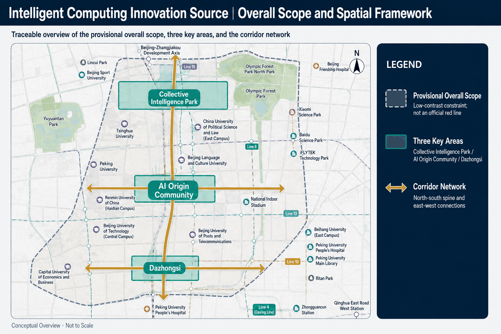
Competition required figure 01｜Overall design scope and evidence-base overview.
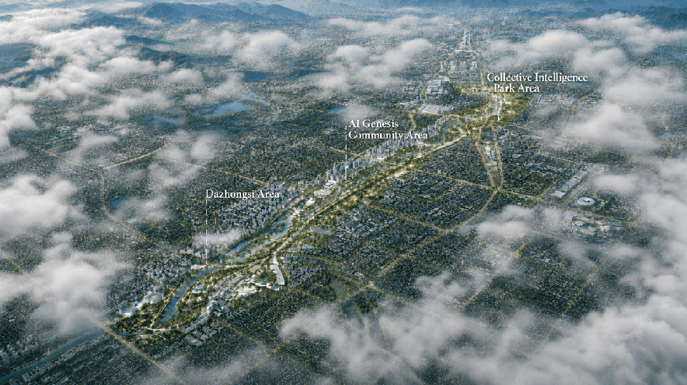
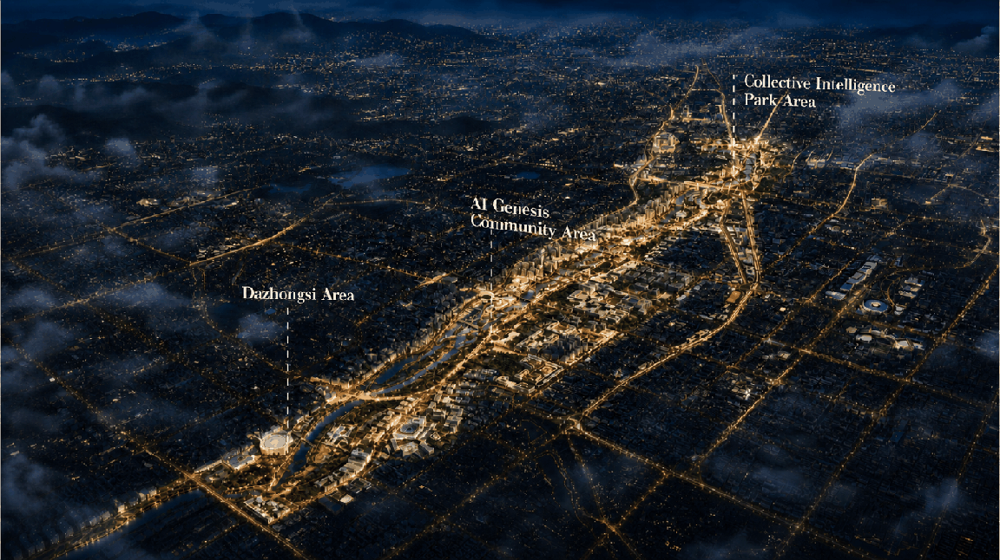
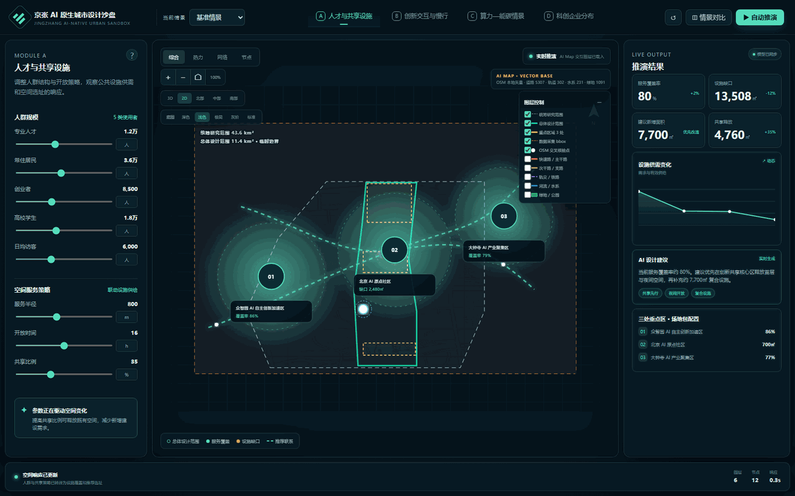
*Interactive sandbox: click the preview image to open the fullscreen interactive sandbox.*
*Figure 01 required for overall design scope and event overview.*

### The first chapter of the project understands why it's planned with AI?

#### 1 Project Understanding

The proposal positions the centennial Jing-Zhang corridor as a world-class AI source, with Zhongzhiyuan, Beijing AI Origin Community and Dazhongsi as three priority areas.

#### AI New theme for time planning: eight fundamental changes

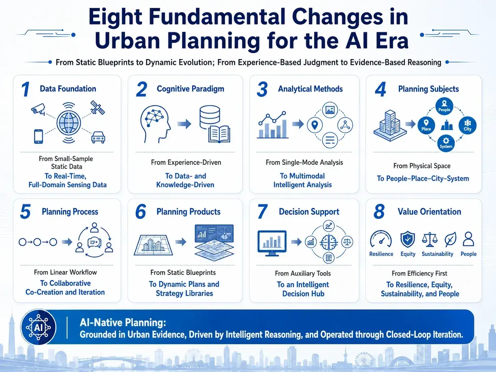
*Figure 1*

|Dimensions|Traditional planning|AI The Changing Age|
|---|---|---|
|**Data base**|Small static sample|Real-time full-domain sensing (remote sensing, IoT, signaling, transport, energy, feedback)|
|**Cognitive paradigm**|Experience-driven|Co-driven data and knowledge; planners assess credibility and local applicability of patterns|
|**Analytical methodology**|Single analysis|Multimodal intelligent analysis identifying relevant, abnormal and candidate explanations, professionally validated|
|**Planning object**|Physical space|People-land-city system, including rights, population, industry, energy use, operations and social impacts|
|**Planning process**|Linear|New evidence refines judgments and optimizes proposals|
|**Planned products**|Static blueprints|Dynamic scenario/strategy library, callable, groupable, iterative|
|**Decision support**|Auxiliary tools|Intelligent decision hub alerting evidence gaps, pre-conditions, rule conflicts and scenario failures|
|**Value orientation**|Efficiency priority|Resilience, equity, sustainability, human dignity|

#### Three questions: method, presentation and application

#### How to plan: the logical path of AI-native planning

Perception & data aggregation ▶ evidence construction & governance ▶ knowledge & reasoning ▶ program generation & simulation ▶ decision support & synergy ▶ monitoring, assessment & iteration

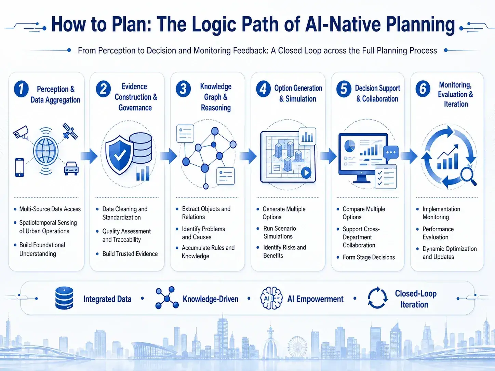
#### How to project: a new expression of content interface

Use one planning matrix with six interfaces: **decision**, **technical review**, **spatial experience**, **approval rules**, **project investment**, and **public operation**.

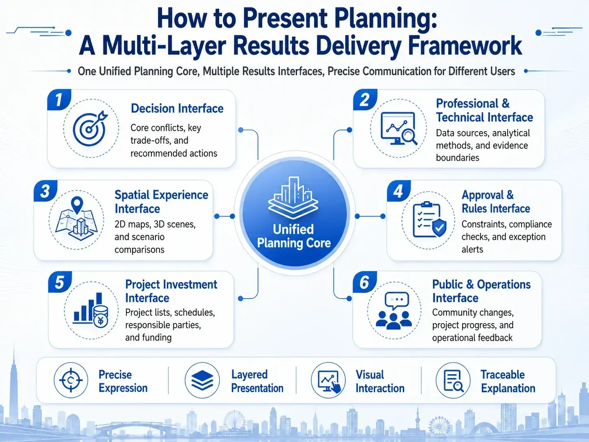
#### How to apply planning: new scenarios, new applications of the AI era

The application loop is **problem identification → proposal generation → scenario testing → implementation → feedback**, turning a one-off design into an updateable process.

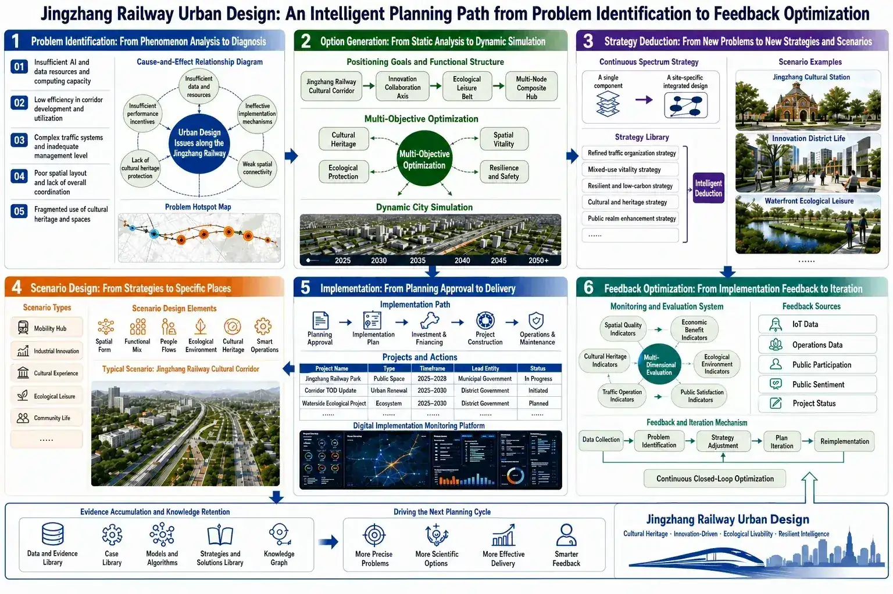
### Chapter two, the establishment of the bottom line...

#### Establishment of a base: from database to urban time and space data

The evidence system converts governed, validated sources into traceable planning evidence. Each source must state its origin, time, spatial scope, processing, quality and applicability boundary.

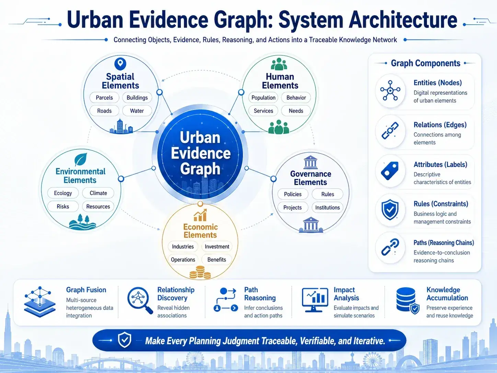
*Figure 2: shift from database to urban spatiotemporal data, from phenomenon analysis to mechanism hypotheses*

#### 2.1 Data Foundation

#### Static space evidence

  - Land, buildings, roads, installations, topography, water systems
  - Property rights, ecologically sensitive areas, historical and cultural resources
  - 3D urban form, skyline, public space quality

#### Dynamic running evidence

  - Block-level activity and traffic flows, prioritising public statistics, onsite counts or lawfully authorized aggregates; no assumption of access to mobile signalling
  - Energy, water, tourist stopovers, facilities.
  - Meteorological and environmental monitoring

#### Institutional and project evidence

  - Policy documents, approval conditions, budget, land supply
  - Construction projects, operating rights, contractual arrangements
  - Subject and source of funds

#### Social cognitive evidence

  - Resident opinion, business claims, online discussions, complaints recommendations
  - Local knowledge, expert judgment
  - Stakeholder interviews

#### 2.2 Data mapping
Instead of mapping urban data, the audience organizes provenance, description, support or refutation, decisions, and outcomes into a searchable, verifiable, traceable, up-to-date space-time relationship system.

#### The bottom of the mark.

  - Space units (lots, blocks, corridors, nodes)
  - Functional facilities (transport, industry, public services, computational power facilities)
  - Owners of title and subjects of governance

#### Structural relations

  - Space relations (neighbor, inclusive, accessible, visible)
  - Functional relationships (synergy, conflict, dependence, substitution)
  - Time series (evolution, update, project sequence)

#### Professional theme profile

  - Transport-land-industry interaction mapping
  - Historical protection - urban renewal weighs
  - Science resources - matching of facilities
  - computational power facility - Security assessment

#### Other relations

  - Policy-project-space mapping relationships
  - Public demand-planning response

On the "one map" and CIM, add **semantic links, evidence trace, planning reasoning, decision basis, implementation feedback**-four dimensions beyond a standard knowledge graph: **source credibility; support vs. rebuttal; reasoning and decision processes; operational results and feedback**.

|System|Main questions answered|Typical content|
|---|---|---|
|GIS|Where, how far?|Land parcels, roads, water systems, facilities, administrative districts|
|CIM/digital twin|City status and operation?|Construction, plumbing, equipment, 3D models, sensors|
|Data Centre|What data exist and where?|Data directories, interfaces, databases, services|
|City|What is the city's role?|Construction on plot, enterprise in park, road link node|
|**City**|Why judge credibility and its decision impact?|Evidence, sources, assumptions, rebuttals, rules, judgments, decisions, actions, outcomes|

#### 2.3 Five core permissions

#### Image Integration

  - Harmonize cross-sector, professional and format information into a unified urban audience and build a cross-cutting evidence system.

#### Association Found

  - Reveal hidden links among space, population, economy, environment and governance to pinpoint systemic problems in decentralized systems.

#### Path reasoning

  - From evidence through judgment, proposal, decision-making and projects, planning bases and pre-conditions can be reverse-checked

#### Impact analysis

  - Identify affected objects and sectors across spectral relationships when policies, data or projects change.

#### Knowledge deposition

  - Continuously accumulate research, judgment, controversy, proposal selection and implementation results as reusable, updated knowledge assets.

## Three-tier working framework

The proposal follows three tiers-Integrated Research Scope, Overall Design Scope, Focus Areas-aligned with the Industrial and Future Cities Study, the Jing-Zhang urban design, and conceptual designs for Zhongzhi Park, Beijing AI Origin Community, and Dazhongsi. The provisional scope is not a statutory red line nor an approval basis. [data:geometry/site_boundary.geojson#SITE-001] [depth:three_level_scope_framework]

#### 1.3 Three sectors, two wings: overall division of labour among the three priority sectors

The mission document assigns the "two wings of the Three Sectors" and defines three priority areas as distinct points in the source chain, shifting the "source" from abstract concepts to specific divisions of labour, affordability, and synergy.

|Focus areas|Positioning|Theme|Role in the supply chain|
|---|---|---|---|
|**Zhongzhi Park**|AI autonomous innovation acceleration zone|Open, innovative development|Comprehensive innovation plus central governance voice, breaking core technologies|
|**Beijing AI Community of Origin**|World-class AI innovation ecology|Enhanced advantage|Element convergence, standard output, generating new ideas, enterprises, standards|
|**Dazhongsi**|AI industrial cluster|Ecological synergy|Intelligent neo-business, rapid southern response, industrial landing and scenario proliferation|

Zhongzhi Park - breaking through - the community of origin.

Jing-Zhang gallery links to the orbital network support the three, forming a chain of **autonomous innovation breakthroughs**, **factor sources gather together**, **industrial ecological convergence**; the two wings (transport, robotics, public-space nodes, peripheral training centres) jointly position the "World-class Access of Original Innovation" phase, which serves as the site-selection point for the urban-design phase and informs plot re-allocation after official boundary and tenure data are obtained.

#### 1.7 Functional structure: quadrant space skeleton
Within the overall positioning, the Jing-Zhang Railway belt establishes a "Four Channels" functional structure as the two-wing spatial skeleton in Sector 3 (compact outline 1.2):

|Functional Structure|Content|Main location|
|---|---|---|
|**Engine core**|University-house-business innovation cluster, the engine of innovation|Beijing AI Community of Origin (core)|
|**Double iron complex**|Transport-Industry-Public space integration corridor, main axes of Zone Three|Jing-Zhang corridor (cross zone 3)|
|**Resilience computational power district**|Safe, low-carbon, resilient infrastructure supporting autonomous innovation|Zhongzhi Park (core) + outer training centres|
|**Biographical belt**|Railway heritage activities and community renewal of integration belts to meet cultural corridor goals|+ Dazhongsi|

The four corridors are not parallel strips but overlap as four properties on the same space: **the science engine core** supplies source "density", **the dual iron complex** supplies flow "connectivity", **the resilience-computational power area** supplies operational "security", and **the cultural life belt** supplies identification "weight".

#### 1.8 Division of labour and regional synergies in the three regions

World-class positioning demands clear division of labour among the three sectors to avoid single-point supply failures (see 4.4).

|Focus areas|Resilience character|Main space carrier|Relation to source of original innovation|
|---|---|---|---|
|Zhongzhi Park|AI independent innovation & computational power governance|Logic and training centre, chip testing workshop, model validation site, safe-governance lab|Assumes primary power centre and standard governance to support the source|
|Beijing AI Origin Community|World-class innovation ecology|Open-Source Publishing Room, Results Conversion Street, Data Elements Lodge, Standard Evaluation, Talent Community, Endside Construction Portal|Core scene with six elements and standard output.|
|Dazhongsi|Smart original business (situation & edge response)|Enterprise service, product release, lightweight edge node|Mobilises resources and computational power for rapid response and disaster preparedness in the south|

Peripheral training centres conduct large-scale, long-duration training; Zhongzhi Park handles full-scale reasoning, chip testing and governance; the origin community supplies factor sources, standards and data; together with transport, robotics and public-space nodes, they create the chain **periphery training - Zhongzhi Park reasoning & validation - origin factor source & standards - edge response of three regions**.

#### 1.9 Design of boundaries

This section provides a conceptual orientation for the urban contest; the specific plots, spatial scope, functional matches and construction scale of the three priority areas are evolving and not yet approved, and "World-class Access of regional innovation" is a planning vision and evaluation criterion, not a construction commitment.

During formal deepening, recalibrate the location, functional structure and division of labour using the official focus-area boundaries, planning conditions, terrain, utility capacity, tenure and environmental information available at that stage.

#### Main references

1. The 100-year Jing-Zhang AI Innovation Belt Open Job Book for Smart Bodies summarises clean-up rights locally.
2. Proposal structure outline "1 Project Understanding and Functional Structure".
3. This proposal 4.4, "Soft Resilience Smart Program," outlines a two-sided labour division in Sector 3.

## Integrated study of industry and future city studies

AI-native planning focuses on Jing-Zhang's Second Self-Assessment, shifting from industrial clustering to city-level autonomy in recognition, planning, spatial action and resilience, enabling higher-education institutions, businesses, talent, capital, reliable data, testing environments and public life to support new ideas, enterprises and standards.

#### 1.1 Overall positioning: world class

The competition targets complex urban zones along the Jing-Zhang Railway-clusters of science, technology, innovation resources, double-column collages, and historical layers-reducing the proposal's overall positioning to one sentence:

> ** Centennial Jing-Zhang ▪ AI Innovation - World-class Association.**

> Leveraging the 100-year Jing-Zhang Railway history as a triple attribute (AI Generation Science Corridor, Cultural Corridor, Resilience Channel), the innovation belt serves as a world-class planning source for China's AI era.

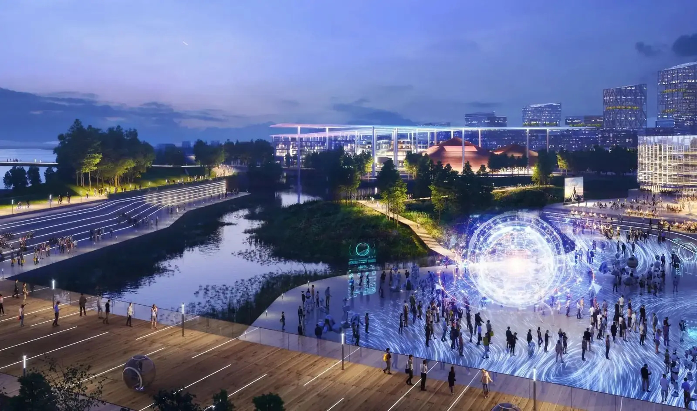
*Figure A: Overall positioning - 100-year Jing-Zhang × AI Innovation Corridor*

The orientation operates at three levels, matching the Core Three (1.2):

|Positioning level|Content|Answering the proposition|
|---|---|---|
|**A corridor** (space carrier)|Jing-Zhang corridor as a triple attribute of "Creative + Culture"|How are we planning this?|
|**One source** (core function)|"World-class access to international innovation" - generating new ideas, businesses, standards, beyond aggregate elements.|How does planning work?|
|**A methodology**|"Planning Operating System" - human-engineer planning with municipal feedback|Planning value creation|

"World-class" is a testable standard; the source of extraordinary innovation differs from a typical AI campus by greater adaptive capacity-ability to self-replace, restructure, and regenerate amid paradigm shifts, power shocks, capital cycles, and brain drain. This aligns with proposal 4.4 "Soft Resilient Intelligence," which defines core competitiveness as generating new ideas, enterprises, and standards during ongoing instability.

#### 1.2 Source capacity: four testable dimensions

The proposal translates the world-class innovation-source ambition into four testable design dimensions:

  - **First discoverer of scientific law**: leveraging higher-education institutions as the AI basic-research source.
  - **First creator of technological invention**: Zhongzhi Park's autonomous innovation serves as the engine for key core breakthroughs.
  - **First pioneer of the innovation industry**: origin community elements become the source of new industries and businesses.
  - **First practitioner of the concept of innovation**: the "Planning Operating System" approach pilots paradigm change in AI-era planning.

The four dimensions map to the spatial roles of the three focus areas, forming a complete chain of ideas, technologies and industry.

## urban renewal and regulatory detailed planning depth urban design

The design addresses five structural issues across space structures, partitions, public facilities, and urban renewal. Volume, height, density, regression, etc., must comply with formal regulatory planning, while the submitted map layer proposes models beyond statutory conclusions. [standard:MOHURD-CONTROL-DETAILED-PLANNING] [depth:land_use_layout] [data:geometry/land_use.geojson#LU-001]

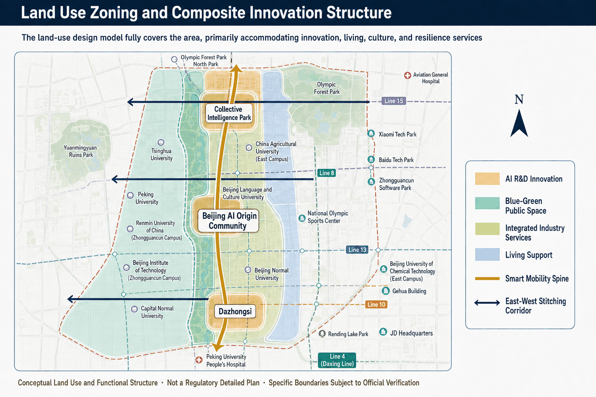
*Mapping 02 is required to define the area and overall space structure.*

### Chapter three, problem identification, planning for what?

#### Problem identification: from observed patterns to mechanism hypotheses
Based on public evidence and the design model, this chapter proposes testable explanations of “why” and which interventions might help. It does not present co-occurrence as established causation. The outputs are diagnostic indicators and candidate mechanism chains for pilot design and comparison.

Five core issues · observed pattern — candidate mechanism — diagnostic indicator.
3.1

#### Methodological boundary: from association to testable mechanism hypotheses

This level marks the key transition from "problem identification" in the six-tier evolution, summarized as:

> This proposal does not claim identified causal effects. A real pilot must preregister treatment and comparison groups, confounders and identification assumptions, report uncertainty, and conduct placebo, sensitivity and robustness checks. Until then, models only generate falsifiable questions and alternative interventions.

Traditional problems are identified at the "situation" and "relevance" levels, often mislabeling causes and consequences and leading to symptom-based responses.

|Dimensions|Traditional practices (relevance)|This chapter approach|
|---|---|---|
|**Issue description**|A is associated with B|X may affect Y through Z — a testable mechanism|
|**Targets of intervention**|Fix the phenomenon|Compare candidate leverage points in a pilot|
|**Result pattern**|Qualitative description + isolated indicators|Comparable, top-map, monitorable diagnostics|

Each issue therefore follows **observed pattern — candidate mechanism — diagnostic indicator**. Arrows denote relationships to be tested, not proven causal effects.

3.2

#### Overview of the five core issues

The Jing-Zhang Railway innovation faces five core, independent yet compatible issues in the AI era; the table below overviews these problems, with deeper diagnosis in the next section.

|#|Core issues|Observed pattern|Candidate mechanism chain (unverified)|Diagnostic indicators|
|---|---|---|---|---|
|**I**|AI IRR mismatches facility system|High institutional density, but lacking residential, commercial, cultural, interaction space|Job separation, long commutes, fragmented innovation networks, brain-drain risk|Post-housing balance, innovative facility density, commuting time cost|
|**II**|Low-impact reuse along dual-iron corridor|Inefficient industries, storage, idle land on both rail sides|Complex property rights, security controls, limited renewal power|Land-use efficiency, side-by-side availability, upgrade potential index|
|**III**|Conflict: complex transport vs poor urban traffic mgmt|Overlapping subway, peri-urban rail, roads with inefficient switching|Multi-corp ops, missing data, weak prediction, disproportionate congestion|Switch time, congestion index, multimode travel share|
|**IV**|Hub layout and safety|Rapid new infrastructure (Intelligence Centre, Grand Data Centre)|Energy-use-land-security constraints, layout risks, low resilience|Power demand density, energy security, disaster risk, networking|
|**V**|Conflict: heritage preservation vs spatial renewal|Jing-Zhang Railway heritage valuable but hard to balance conservation and use|Rigid border protection, blurred dynamic path, low public participation|Heritage conservation level, active-use intensity, public cultural identity|

Question one.

#### AI IRR does not match the facility system
Completed

The observed-pattern–candidate-mechanism-diagnostic indicator chain reveals a conglomerate of creative resources, a six-type facility mismatch, and diagnostic calculators.

#### Problem identification: AI Generous Resource Pooling, the support system is still in "Securing Basics."

Exploratory point layers suggest clusters of university research and technology enterprises along the corridor, but the layers are not item-by-item verified and do not support count or density claims. Existing public services remain oriented to basic residential provision and do not fully address spaces for exchange, collaboration and sharing.

#### Problem: AI has created a pool of resources, and the system of supporting facilities is still in the "basics"

The "human spot" and "facility spot" are co-located but mismatched: resources gather rapidly while combinations remain lacking.

#### Resources: university research and technology-enterprise clusters

The innovation zone concentrates creative resources in a two-polar spatial pattern: North-end talent and South-east industrial convergence.

- **University research resources** form a northern talent and research interface.
- **Technology-enterprise resources** form enterprise-service and translation nodes in the central and southern sections.
  - **In the middle is "the corridor"**: a few-kilometre commuting-collaborative link between North and South that should exist but does not.

#### Where is it?
Existing public services meet a **basic protection level**, covering essential needs (food, education, health, sports) but not the "new life" required for AI.

Core judgment

Core judgment: where talent density peaks, the innovation link is weakest; the current situation shows "inhabitation" without solving "innovation", offering AI-centred support rather than population-centred.

Space overview: tertiary and AI enterprise resource cluster.
The default view shows exploratory university and technology-enterprise point layers. They demonstrate spatial patterns only and do not present formal statistics.

#### Public-service types and accessibility gaps

Contrasting innovation needs, public services consist of "one base plus six gaps".

|Level|Current status characteristics|Innovation need question related to AI|
|---|---|---|
|**Basic-living service layer** (types and accessibility pending a formal survey)|Basic living support such as food access, education, health care and exercise|Current evidence supports a service-type framework, not a verified facility count or population-demand baseline|
|**Innovation package (type 6)** Coffee/social, fitness, library self-study, conference roadshow, canteen, community display|Scattered, self-emerging, fragmented; lacking Third Space and Innovation Services|Without such interaction, AI talent collisions-and thus innovation-cannot occur|

Population caliber further highlights the mismatch magnitude:

- Ph ≈ 4.50 million; AI innovative population ≈ 60,000 (horizon 4080,000)
- New package should not target "up to 450,000 inhabitants" but a continuous spectrum for an innovative population of 60,000, considering population sharing.

Thus the proposal's core is not point supplementation but **a new logic**-shifting from "basic point supply" to "continuous spectroscopy across four layers".

Question II

#### Ineffective reuse along the dual-iron space corridor
Completed

The observed-pattern–candidate-mechanism-provides a comprehensive diagnosis of diagnostic indicators (four sub-problems, measurable).

#### Ineffective reuse along the dual-iron space corridor

Following the Jing-Zhang Railway undergrounding and the Line 13 elevation/undergrounding works, the formerly divided city became a high-value corridor. Yet numerous old factories, markets, under-bridge spaces and rear-facing park sites remain unrenewed, a pattern associated with inefficient development. This section examines low-efficiency redevelopment along the dual-rail corridor (core issue II) through a mechanism-hypothesis diagnosis.

Dual-barricaded, inefficient redevelopment; low land efficiency; limited updating potential; AI innovation zone.
Overview

#### Overall judgment: potential release and inefficiencies

AI requires contiguous industrial land for innovation, yet ownership is fragmented while industry must remain isolated.

**Candidate mechanism (unverified).** Removing physical barriers may raise land value on both corridor sides; complex property rights, strict safety controls, and insufficient renewal capacity may then delay renewal of markets, informal housing, outdated industry, and under-bridge spaces, contributing to **spatial fragmentation and value sinking.** Candidate mechanism chain: complex rights + high safety controls + insufficient renewal capacity. This interpretation requires pilot evidence before it can support a causal conclusion.

> The core issue, "Ineffective reuse along the dual-iron corridor", involves land-use efficiency on the top-down line and rail-side availability (supported by city-time data), plus fine re-activation and continuity (proposal generation and countermeasure discovery). Identified problems translate into quantifiable, monitorable diagnostic indicators and digital-base requirements.
Question one.

#### Timing gap between corridor release and ground-level renewal

After removing the railway cut, land on both corridor sides shifted from devalued edge to high-access scarce resource, markedly increasing value. However, old markets, squatters, legacy industries, and under-bridge negative spaces were not upgraded, creating a gap between exploitation potential and current inefficient quality/function.

- **9 km** corridor length along Jing-Zhang Railway - **two irons**: ground entry (high iron) + simultaneous release (line 13) - **T+Δ**: gallery value window vs updated landing cycle
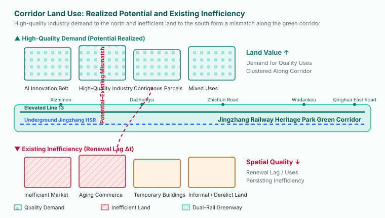
**Chart 1** Land-use inefficiency coexists with low-quality space. Near the park gallery at Jing-Zhang Railway, inefficient markets, old commerce, temporary structures contrast sharply with high-quality demand.
Question II

#### Low-utility multitractive and highly fragmented

Along the 9-km corridor, inefficiency stems from a mixed "point-line-face" stream, hindering unified integration.

#### 1 Trading market category (non-capital function defusing)

A gap exists between outdated construction, low-quality space, and insufficient accommodation.

#### 2 Negative space class (large area, non-functional)

Under the bridge, vacant railways, temporary parking, and wall perimeters form a large area lacking public functions and persisting as a "visible, useless" negative space.

#### 3 shanty towns and abandoned land

Shantytowns and modern plots near Harun Road, Four Rings West, and Five Crossroads are costly and complex to upgrade.

- **Under-bridge areas, idle railway land, temporary parking and walled edges** are treated as underused-space types for later survey and classification; this proposal does not cite unverified area or length figures.
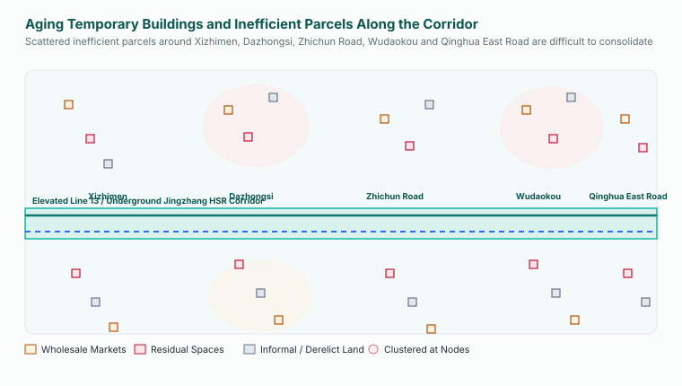
**Chart 2** Distribution of old temporary buildings along corridor. West Gate, Dazhongsi, Zhichun Rd, five junctions, East Chonghua Rd concentrate old temporaries; new sites are scattered, hard to integrate.
Question III

#### The compound wall is superimposed on the administrative boundary and the main body is updated and dispersed

It is not only a matter of space, but also of governance.

- **Institutional boundaries:** visual and field review suggests that some research campuses present closed edges to the park corridor; the extent requires onsite verification.
  - **Administrative boundary:** multiple, overlapping secular and administrative borders create complex governance layers.

- **Campus edges**: some closed or park-facing interfaces - **Coordination**: multiple actors - **Walls**: potential access and sharing barriers
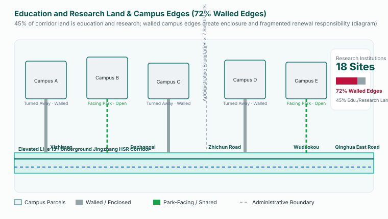
**Chart 3.** Educational and research land and campus boundaries. The diagram indicates some wall and fence interfaces along the corridor; exact shares and extents require official land data and onsite verification.
Question IV

#### Lack of public space and ecological networks
Even though the corridor was released as a green belt, its "public" and "ecological" aspects were not fully realized:

- Open space is fragmented by interfaces, and some areas show low activity or weak access;
  - Greenness **is scattered**, failing to form a continuous ecological network.
  - Lack of linkages and design synergy between nurseries/parks limits ecological value and public vitality.

- **Space activity**: some underused areas - **Interface continuity**: field verification required - **Pattern**: green space is not yet a continuous network
Diagnostic indicators

#### Diagnosis indicator: from phenomenon identification to measurable, monitorable
Following a phenomenon-to-mechanism-hypothesis diagnosis, the four questions become quantifiable, top-modifiable, continuously monitored **diagnostic indicators** linked to the digital base, serving both spatial data foundations and product monitoring.

|Problem|Diagnostic indicators|Status / Threshold (calculated)|Data sources and monitoring tools (digitized base)|
|---|---|---|---|
|** Question I Time difference**|Land efficiency along routes|Low utility ratio, unit output intensity; post-corridor land-value index, but current quality unsynchronized|Land-map, price monitoring, AI remote-sensing graph|
|Update potential index (time dimension)|Local block "Identification Planner Update Operations" phase, window loss risk warning|Special planning library update + progress board (camp town applet)||
|**Issue II: type fragmentation**|Land-use efficiency along the route|Distribution and connectivity of market, underused and abandoned-space types|Underused-land inventory + later survey verification|
|Update of the Potential Index (one dimension)|Number of composing units, fragmentation (platform connectivity)|Spatial unit spectrometry and image connectivity calculations||
|**Question 3**|Accessibility on both sides of the railway|Campus orientation, cross-actor coordination and barrier-interface length|Campus-access verification + administrative boundaries + co-governance entry points|
|**Issue 4: public ecological deficiencies**|Renewal potential index|Open-space activity and green-network connectivity|Open-space / green-space vectors + ecological-network visualization|

> The three core indicators-land-use efficiency along routes, rail availability on both sides, and renewed-potential index-form the diagnostic core of "low-impact reuse along the dual-iron corridor". This section refines them into measurable sub-indicators and data for program generation and digitized products.
Question III

#### Conflict between complex transport systems and poor urban traffic management
Completed

The observed-pattern–candidate-mechanism-provides a comprehensive diagnosis of diagnostic indicators (five sub-problems, measurable).

#### Conflict between complex transport systems and poor urban traffic management

Jing-Zhang corridor, including 13th high-line, has been rebuilt into a three-tier transport system with central eco-belt, multiple TOD hubs and layered traffic, yet management remains static and manual, unable to meet rising multi-layer, peak-dispersion demands.

3-storey composite traffic, switching efficiency, debris management, congestion index, AI innovation zone.
Overview

#### Overall judgment: the system is complex and management is lagging behind

**The phenomenon.** Subway, peri-urban rail (Jing-Zhang high-iron) and line 13, urban roads overlap, forming a three-storey system (underground rail, ground parks, elevated orbits) with TOD hubs, P+R and static traffic, yet resident and visitor experience does not keep pace with hardware upgrades.

**Candidate mechanism (unverified).** Multi-actor operation (rail, subway, municipality, university, and subdistrict/town), fragmented data, and limited predictive capacity may combine to produce "hardware complexity" and coarse operational coordination, contributing to **both congestion and degraded experience**. Candidate mechanism chain: multi-actor operation + fragmented data + limited predictive capacity. This interpretation requires pilot evidence before it can support a causal conclusion.

> The issue "Contradiction between complex transport systems and poor urban traffic management" lies at the core of the problem framework; dynamic traffic flows, public transport, etc., call for smart-line strategies, rail corridor integration, and active migration. Diagnosis will be expressed as measurable, monitorable diagnostic indicators forming the core of intelligent transport platform monitoring.
Question one.

#### Underground-ground-up three-storey complex, vertically complex.

The 13th line intersected high-terrain, creating **7 typical ground-to-ground faults**. Intensive underground rail, ground parks, elevated orbits, traffic and utilities exceed two-dimensional planning, requiring vertical switching, evacuation and pipe avoidance.

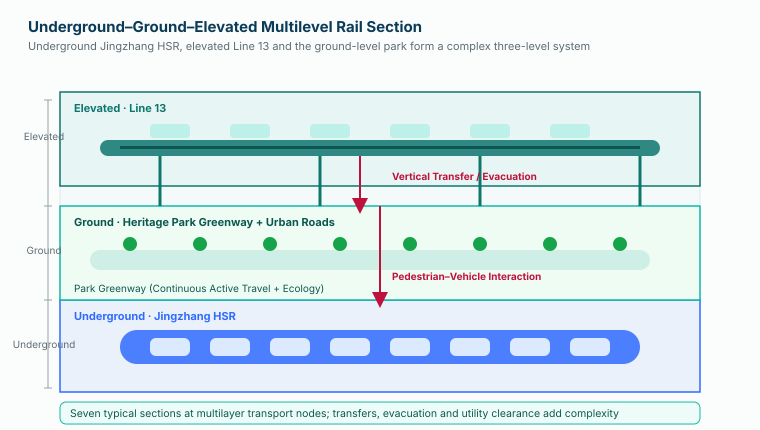
**Underground 1 - Ground three-storey orbital line distribution.** The Jing-Zhang high-terrain and 13 line alternate elevation, creating seven vertical faults at Dazhongsi, Sichuan Road and five junctions within multi-storey traffic nodes.
Question II

#### East-West connections have been cut for a long time, and traffic density is still low.

Rail, waterways and major roads create east-west barriers and force detours on some routes. Exploratory base-map reading suggests gaps in local-road continuity and cross-corridor links. Without versioned official road data and a reproducible calculation chain, the proposal does not state a precise network density, breakpoint count or quantitative threshold comparison.

- **Network continuity**: local gaps - **Cross-corridor links**: some detours - **Verification**: recalculate from official road data
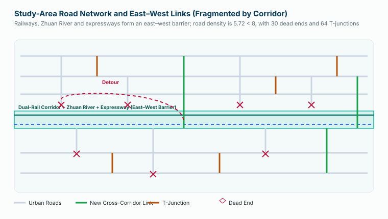
**Chart 2 - Study of road systems and east-west access.** Superhighways, fast, main and secondary roads are well graded but intersected by rail/orbit/trans-river, creating insufficient east-west links and higher bypass costs due to break-heads and thong roads.
Question III

#### Site switching and access is inefficient

Line 13 parallels the Jingzhang corridor, while the submitted design study identifies candidate transfer and active-mobility discontinuities between stations, parks and cross-corridor links. These observations are exploratory and require an official network dataset, field survey and reproducible route analysis before any coverage ratio or walking-time conclusion is stated.

- **Exploratory observation:** candidate station-to-park and cross-corridor gaps are retained as locations for professional survey; no audited coverage ratio, walking-time threshold or absolute ranking is claimed.
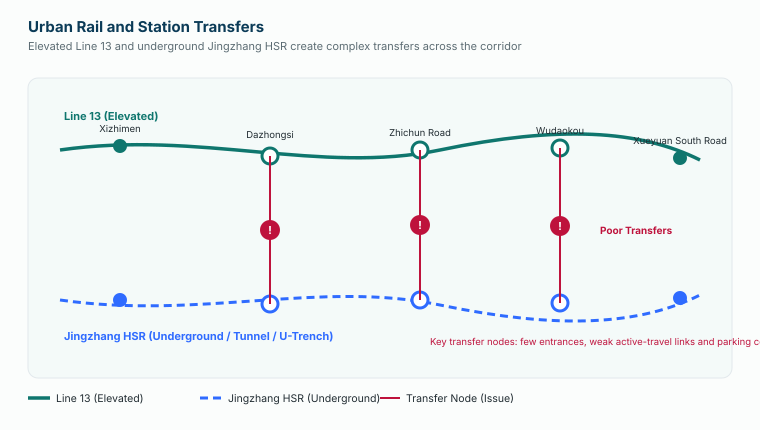
**Chart 3 - Urban orbit and site exchange.** Jing-Zhang high-iron surface, tunnel and U-train segments interweave with line 13 (above, underground, entry), creating complex trans-junctions at Xinjiang Gate, Dazhongsi, Sichuan Road, five junctions, Xinhua East Pass, South Road, etc.
Question IV

#### Multiple traffic streams, severe nodes

Transit traffic dominates, with t-roads converging on two main arteries; proximity to intersections causes severe clashes among pedestrians, non-motorized and motorized vehicles, creating disorderly traffic. Peaks at international contacts are constantly congested, and the twin roads and East Qinghua/East Qing Dynasty roads form a traffic "point" where all modes interfere within limited space.

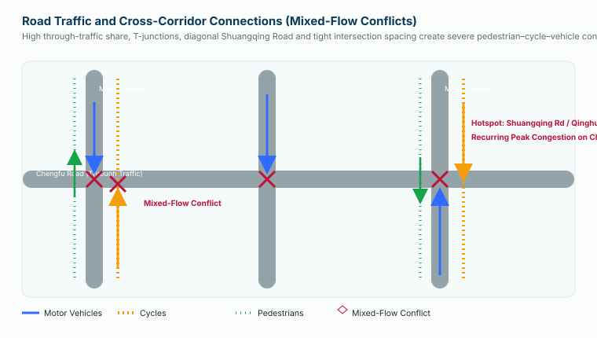
**Figure 4 - Urban road traffic and cross-corridor links.** Rapid, main and secondary roads are under-planned; transit traffic intermixes within a limited corridor, creating high-intensity pressure on routes to East Chonghua East Road, Chengzhou Road and South Road of the College.
Question 5

#### Traffic management tools in broad distribution: A lack of spatial order and a lack of physical mobility under the bridge

#### 1 Under Bridge Space Management

Under-bridge areas are filled with illegal, circular, and temporary parking, preventing orderly public space conversion and hindering access, worsening the lack of access to problem III sites.

#### 2 active system administration missing

Disorderly bike parking encroaches bus stops; narrow, dim, poorly maintained sidewalks diminish continuous activation of the intended green porch.

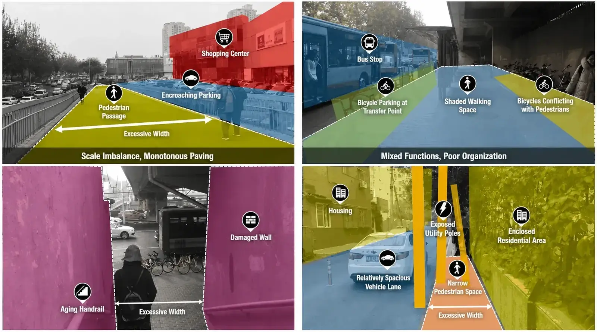
**Chart 5 - Underbridge space and environment management.** Underbridge and street spaces are overly wide and mixed-use; pedestrian access is compromised, bicycle and bus stops conflict, resulting in poor experience and management.
Diagnostic indicators

#### Diagnosis indicator: from phenomenon identification to measurable, monitorable

Following a phenomenon-to-mechanism-hypothesis diagnosis, the five issues become quantifiable, top-map **diagnostic indicators** continuously monitored at the digital base, directly tied to Smart Transport Platform monitoring targets.

|Problem|Diagnostic indicators|Status / Threshold (calculated)|Data sources and monitoring tools (digitized base)|
|---|---|---|---|
|**Question one: multi-level interchange**|Transfer and evacuation performance|Candidate vertical interchange types and multi-level pedestrian/vehicle conflict locations; quantities pending field and engineering verification|Surveyed sections + BIM/IoT model after authorization|
|**Question 2: east-west barriers**|Network accessibility|Road continuity, average cross-corridor detour and connection gaps|Official road vectors + traffic flow + route calculation|
|**Question three: weak connections**|Transfer time / multimodal share|Candidate station-to-park and cross-corridor gaps; baseline and thresholds pending reproducible network analysis|Authorized transit, street and active-mobility data + route analysis|
|** Question four, mixed conflict**|Congestion index (order)|Intensities of conflict between nodal groups; peak congestion periods in sections such as Chengdu Roads/Two Clear Roads|Multisource Perception Integration (Video/ Radar)+Auto-Detection of Events|
|** Question V Managing roughness**|Multi-modal travel sharing (quality)|Ground occupancy rate below bridge violation; damage rate to active mobility lanes; bicycle invasion frequency|Subbridge Portal AI Test + action quality rating + hand-shot closed loop|

> Core indicators-time switching, congestion index, multimodal travel share-constitute the diagnostic core of "complex transport systems and poor urban traffic management". This section refines them into measurable sub-indicators and data foundations for proposal generation and digitized smart-transport products.
Question IV

#### The space layout of the hub and its safety
Completed

Symptoms - Candidate mechanisms - Full diagnosis of indicators (general diagnosis, four phenomena, candidate mechanism chain, calculable indicators).

#### The space layout of the hub and its safety

In high-density smart clusters with city-level infrastructure, cost-driven site constraints, simplified "one-stop" resilience, and minimal governance create a layout-resilience mismatch. This section deepens diagnosis using the three-part "results-diagnostic indicators" pattern.

#### 3.4.1 General judgment: “hot” of the general power layout and “cold” of security

Large-model training and AI reasoning have driven a sharp rise in computational-power demand, requiring 100,000-calorie smart infrastructure and upgrading from an 'enterprise room' to a city-level facility that underpins regional competitiveness. Intelligence hubs are clustering in dense urban zones near schools and orbital stations to access near-edge compute and talent.

**Computational power demand density rises, coupling energy, land and security constraints at the same scale, creating a structural gap between layout and resilience:** layout seeks proximity to users, grid, talent, disaster avoidance, redundancy, re-engineering-hard to achieve in under-resourced corridors and prevailing priority compromises, increasing layout risk and resilience deficit. **candidate mechanism chain:** computational power surge + location constraints + simplified site design + governance and resilience gaps.

> This question is “the spatial layout of the Centre and its security response”, which is at the core of the overall problem framework: it is going to take up basic floors such as computational power demand density, energy security, disaster risk exposure, cyberresilience (which needs to be supported by city-time data foundation), and it is going down to `AI+softresilience intelligence', factor redundancy and system self-resilient strategies (generation and discovery of countermeasures). The results of problem identification will be directly translated into calculable, monitorable diagnostic indicators and digital base construction needs.

#### 3.4.2 Symptom I: Positive conflict between demand outbreak and location constraints

The communicative power centre, unlike typical industrial buildings, requires strict site selection; high-density areas present systemic spatial conflicts.

  - **Energy constraints**: need reliable power and fast communications, yet core corridor grids lack capacity and transformer facilities, sharing load with urban electricity.
  - **Environmental constraints**: require clean surroundings and favorable temperatures, but dense areas cause thermal buildup, dust, limited natural cooling, raising PUE.
  - **Hazardous sources**: must stay away from dust, oil, smoke, corrosive or explosive materials, yet gas stations, storage, catering are scattered, making safety distances hard to meet.
  - **Disaster avoidance**: must avoid flood, earthquake, pressure-line, high water table, and fracture-zone zones along corridors.
  - **Function compatibility**: medium-size compute power centers are unsuitable for residential/commercial zones, yet pressure to locate near mixed-use areas brings noise, heat, transport, and proximity issues.

**Figure 1 - Site conflict illustration.** Strict location criteria (green) for the Computation Power facility clash with the actual high-density area (red), compressing energy, environment, disaster, function, and secure space into limited zones.

#### 3.4.3 Scenario II: concentrated layout and disaster risk exposure
Frequent disasters and extreme weather concentrate systemic risk in centralized layouts:

- **Flood risk**: low-lying riverine, ditch, low-dry bridge and upwelling zones face pouring, leaching and failure during heavy rain; extreme rainfall can damage first-layer equipment if below flood level for 100 years.
  - **Seismic risk**: generic power centre built to type C may suffer overturned cabinets, pipe fractures, and cluster paralysis during strong quakes.
  - **Environmental risk**: strong vibrations (traffic, machinery) and electromagnetic interference (substations, high-voltage lines) continuously threaten equipment stability and data integrity.
  - **Single-point risk**: isolated power clusters face total failure from outages, fire, flooding, lack of redundancy, and directly affect urban and industrial operations.

**Fig. 2** Centralized single-point risk profile. **Communicational Power group shares grid and route, lacks dispersion of disaster-preparedness node, rendering impact cover ineffective.**

#### 3.4.4 Symptom III: Space resilience design gaps
Even after site selection, a four-fold gap in spatial resilience leaves "resilient" and "reconstructable" only on paper.

**1 Flood resistance position.** Core data and governance assets sit in flood-prone underground/low-lying zones; inflow control absent at entrances, ramps, vents, pipes; underground garage ramps isolated from pipe inlets, directing extreme rain onto core equipment.

**Fire-resistant design**: no physical separation of rooms, power, and energy zones; a fire can engulf the whole cluster. Lacking fire lanes, separate zones, and protected emergency lines; critical systems (power, refrigeration) lack fail-safe sub-designs.

**Master plan unplanned**: no long-term expansion land, primary distribution and refrigeration networks not pre-built, and power units lack coordinated layout, causing mismatched capacity, higher investment risk, and disruptive retrofits.

**Peak re-engineering limited**: current civil build-outs and hardware depth cannot adapt from low-capacity servers to ultra-high-intensity liquid-cooling cabinets; distribution, refrigeration, pipelines, bridges, and interfaces lack standardization, making hardware swaps or structural changes costly; isolated room failures propagate through shared systems.

**Figure 3 - Space availability vs ideal framework.** Current state shows a four-dimensional (red) gap; ideal resilience (green) requires Key Layer Lifting, Separatization, Growth, Module Decomposition.

#### 3.4.5 Symptom IV: Inadequate Elements and Systems

The central power centre relies on both its rooms and supply/operation systems, revealing a clear soft-resilience gap at factor and system levels.

#### Element resilience

  - **One-point manpower reliance**: dependence on few local staff, lacking off-site specialist support, knowledge loss, and critical personnel risk.
  - **Vendor lock-in**: power supply, hardware, software, and control platform tied to a single supplier; any failure propagates across the cluster.
  - **Open-source supply-chain risk**: using unvetted overseas open-source control frameworks without nationalization or internal maintenance creates potential upstream failures.
  - **Data tolerance gap**: ungraded multi-copy storage, fragmented hazard nodes, and lack of continuous operation mechanisms risk data loss.
  - **Hard-bound power resources**: over-provisioned generic and intelligent power lacking downgrade mode, unable to shed non-core loads during failures, and missing cross-regional transfer channels.

#### System resilience

  - **Light construction governance**: resilience metrics (downtime rate, RTO/RPO, failure handling) omit full project research, design, acceptance, and operational appraisal, relying only on PUE and peak power.
  - **Standard confusion**: mismatched infrastructure and operational standards, proprietary interfaces and control agreements, insufficient for future hardware and standards.
  - **Governance synergy deficit**: unclear emergency procedures among operators, grid, telecom, tenants, regulators; isolated alerts and no unified incident bus or visualization.

#### 3.4.6 Correlation chain: from demand outbreak to deficit
These observations suggest a candidate mechanism progression that remains to be tested:

> • Construction shifts to high-density areas for nearby compute power and support.

The key levers are two interventions: **site "safe border front**" enforcing non-negotiable disaster avoidance, hazard distance, and functional compatibility; and **design "resilience indicator embedded**" embedding redundancy, downgrade, re-engineering, and self-healing into research, design, acceptance, and operation. The former blocks risk entry, the latter absorbs it.

#### 3.4.7 Diagnostic indicators: calculable, mapable, monitorable

Using an "observed-pattern-to-mechanism-hypothesis" approach, these observations become quantifiable diagnostic indicators **that may be monitored at the digital layer subject to governance controls**; they serve as potential urban spatiotemporal inputs for downstream products (soft-resilience platform and compute-energy-security coordination).

|Diagnosis dimensions|Diagnostic indicators|Status / Threshold (calculated)|Monitoring instruments (digitized base)|
|---|---|---|---|
|**Layout constraints (site security)**|Site compliance|Computational facilities, flood zones, flood retention, seismic fracture zones, hazardous chemical sites, strong vibrancy/magnetic sources; level A facilities' avoidance of residential/commercial areas|National Space "One Chart" auto-verification of site compliance|
|COMPutal power demand density|Grid capacity per unit area (FLOPS/km²) vs intellectual node density matching load capacity|+ grid load monitoring||
|**Catastrophe exposure (space resistance)**|Flood exposure|High critical-equipment-to-flood ratio per 100 yr (1.0 1.0 m compliance); sub-dry bridge to low-lying river area ratio for power node; groundwater depth distance|Digital twin water-safety "four-prevention" simulation|
|Structural earthquake & fire safety compliance|Seismic class compliance (A-level B); machine/electricity/storage ratio; fire-lane and fire-ward independence rate|BIM construction + network monitoring of fire protection||
|**Energy and Networks (Elemental Redundancy)**|Energy security|Electricity reliability (target 99.999); bidirectional municipal power, diesel generators, storage redundancy; PUE vs green electricity ratio|SCADA + Energy Efficiency Monitoring Platform|
|Network|Multi-operator, multi-physics cable routes; cross-regional command success; physical dispersion of off-site disaster-preparedness nodes (different risk zones)|Network Topup Monitoring + Cross-Drive Movement Control Platform||
|**Space and operation (reformed self-healing)**|Space reconstructability|% modular rooms; % reserved expandable land (target 20-30); civil-hardware decomposition; count of malfunction isolation units|Digitized asset desk + phased board|
|Institutional compliance rate|RRO/RPO compliance; reduced operational capability (core data retention ratio); mixed-exercise frequency and failback loop closure rate|Resilience Indicator Examination Platform + Exercise Event Library||

> The four core indicator categories-site compliance, flood exposure, energy security, spatial reconstructability-diagnose layout safety and are refined into measurable sub-indicators and data for proposal generation and digital soft-resilience products.
Question 5

#### Contradiction between historical and cultural preservation and spatial renewal
Completed

Symptoms - Candidate mechanisms - Full diagnosis of indicators (general diagnosis, four phenomena, candidate mechanism chain, calculable indicators).

#### Contradiction between historical and cultural preservation and spatial renewal

Tasked with preserving authenticity while renewing a century-old national railway across a nine-kilometre corridor, this section expands diagnosis using three generic diagnostic-indicator dimensions.

#### 3.5.1 General judgment: the “high” value of heritage and the “mixed” path of activation

**Jing-Zhang Railway**, China's first autonomous line, has progressed from single-structure preservation to holistic industrial-heritage conservation: tracks, stations, bridges, tunnels, and welding units form a linear heritage gallery; the site park has shifted from an abandoned line to public space. Yet balancing conservation with revitalization is challenged-heritage value is recognized, but decisions on what to protect, modify, and operate remain unclear, leaving the corridor in a "preserving unstructured, updated climate."

**Heritage value is rigidly regulated**, yet dynamic pathways are blurred due to missing hierarchical controls, weak update mechanisms, and absent public participation, compounded by weak cultural identity-resulting in a **broken** outcome. **candidate mechanism chain:** rigid boundary protection + blurred dynamic path + insufficient public participation.

> This "preservation vs. renewal" conflict underpins the problem framework, supplying data on heritage resources, corridor conditions, and public cultural needs (city-time foundation) and informing responses within the "articular continuity development" and "precision-activated camp" strategies, later translated into measurable diagnostic indicators.

#### 3.5.2 Symptom I: Space competition for protection and renewal

The corridor's protection and renewal demands are both deemed non-negotiable.

  - **Protector end**: authenticity protection - retain primary railway tracks, bridges, welding components; holistic protection - extend safeguards from isolated relics to linear corridors and nodes, covering foundations, stations, factories, bridges; active protection - convert static remnants into living public landscapes that engage users.
  - **Update end**: seaming cities - bridge the gap between railways and tall urban structures; prioritize people - tailor solutions for residents, commuters, students; ecological convergence - transform idle grey infrastructure into green public space.

In complementary corridors, protection (main retention) and upgrading (functional implantation) compete for the same road-base, station, or bridge; "protection first" freezes assets and blocks new functions, while "cracking cities" risks cutting, wrapping, or concealing original remnants.

**Chart 1 - Space competition.** Protection (green) calls for "remain as is"; updating (red) demands "functional implantation". Both compete within the same corridor without hierarchy, zoning, or temporal reconciliation.

#### 3.5.3 Symptom 2: Point protection and structural contradiction of linear corridors

Jing-Zhang Railway's linear legacy is protected and renewed at isolated points, causing structural and scale inconsistencies.

  - **Legacy sites are separate**: stations, bridges, tunnels, etc., are identified and protected individually, lacking a unified framework for route-wide heritage value and narrative.
- **Consequencing arteries fractured**: 9 km of linear porches vary by sector-some built in parks, others enclosed, some used for temporary parking or inefficient functions; the arteries are spatially intermittent, preventing a coherent "multiple activation" pattern.
  - **Systems of protection and scales**: protection uses points, updating and operation use blocks, creating mismatched boundaries that hinder alignment of protection planning, renewal proposals, and spatial management.
  - **Value interpretation gap**: heritage value is defined only by what is retained, missing systematic explanations of its importance, experience, and links between industrial memory and modern urban life.

#### 3.5.4 Symptom III: The bipolar risk of static freezing and renewed destruction
Conservation and renewal often swing to extremes, leaving the essential middle "promotion" path absent.

**Extreme I: Static freeze.** "Protection first" becomes mere encapsulation, fencing heritage as a dead specimen; results: isolation from daily life, cultural loss, financial burden, functional decay, new security and environmental issues, and hindered sustainable loops.

**Extreme II: Renewed damage.** Cities "pull back" to remove or overlay heritage without assessment, damaging authenticity, erasing railway memory, causing irreversible arterial fractures, and eroding public trust and consensus for future protection.

Missing is the intermediate "promoting protection" path: allow heritage use through rational functional implantation and modern replacements (e.g., converting waiting rooms to stools, dragon-gate hangings to signage, abandoned cars to displays); its absence creates a "no-no-no" paradox.

**Figure 2 - Two-polar risk indicator.** Left shows static freeze, right renewed destruction; both represent failed protective-update chainsaw exports, with the central "for safety" route omitted.

#### 3.5.5 Pattern IV: Decentralization of diverse subjects and inadequate public participation

The Jing-Zhang corridor traverses many towns and owners, fragmenting protection and renewal responsibilities and lacking synergy mechanisms and public participation.

  - **Decentralized**: railway owners, road units, street communities, merchants lack a unified responsibility boundary and coordination platform, leading to unled protection and unaccountable updating/operation.
  - **Unequal interests**: protection duties fall on locals, but renewal gains (land value, economic input) benefit broader parties, weakening local protection incentives.
  - **Inadequate public participation**: residents, teachers, students, and local businesses are under-involved in protection listing, proposal updating, and operational planning, limiting cultural identity translation into governance.
  - **Lack of sustainable operations**: public spaces lack regular cultural programming (railway exhibitions, creative markets, guides), leading to unmanaged, idle spaces.

#### 3.5.6 Correlation chain: from protective rigidity to arterial fractures
These observations suggest two mutually reinforcing candidate mechanism paths that require testing.

> High heritage value → rigid core protection → limited renewal space → fuzzy activation → low energy → fragmentation → isolation → poor public participation → weakened cultural identity → protection-renewal impasse → outcomes: memory loss, disrupted spatial continuity, fragmented social identity.

Key leverage points: first, protection through "segregated regulation rules": rigid core controls plus flexible buffer coordination; second, activation through "mobilization mechanisms": functional implantation, cultural operations, public construction to preserve heritage. Combined they mitigate "suspended death" and "overhanging" risks, enabling an intermediate path.

#### 3.5.7 Diagnostic indicators: calculable, mapable, monitorable

Applying a phenomenon-to-diagnosis approach, the identified issues become quantifiable, monitorable diagnostic indicators linked to digital data foundations and to subsequent digitized products (cultural archives, participation platforms, operation monitoring).

|Diagnosis dimensions|Diagnostic indicators|Status / Threshold (calculated)|Monitoring instruments (digitized base)|
|---|---|---|---|
|**Heritage protection (realty and integrity)**|Level & completeness of heritage protection|Coverage of heritage sites along routes; retention rate of primary assets (tracks, roads, stations, bridges); enforcement of rigid controls for core areas|Heritage "One Map" + Digital Archives + Remote Sensing Monitoring|
|Pulse continuity index|Ratio of heritage narrative points to continuous sequences along the porch; artery identification/direction; density of restored/displayed historical scenes|Gallery heritage narrative + limited vector superdition||
|**Space renewal (suture and activation)**|Accessibility both sides of railway (suture convergence)|Breakway pass rate; added pedestrian/car walkways; average east-west bypass distance; length of removed wall sections|Web Vector + Mobile Path Calculation + Wall Demolition Watch|
|Active utilization intensity|Heritage function injection rate; count of active carriers (museums, exhibits, cultural spaces, initiatives); frequency of cultural operations|Functional implant record + space heating + operating calendar||
|**Social identity (co-governance)**|Public cultural identity|Awareness rate of heritage values among residents/teachers/tourists; participation count & satisfaction; conversion rate of creative consumption|Platform questionnaire + activity sign-up data + consumption monitoring|
|Multiple Synergy|Count of cross-town coordination units; coverage of protection-update-operation agreements; public opinion acceptance and feedback-loop rate|Joint platform with desk accounts + voice-processing stream tracking||

> The three core indicators - Pulse Consistency Index, bilateral railway availability, public cultural identity - drive diagnosis of historic preservation versus renewal; they are refined into quantifiable sub-indicators and data feeds for proposal generation and digital products (archives, participation platforms).
The question-identification section of AI urban design | this page is the main page of the `issue-identification' chapter, and the completed questions are linked to the corresponding sub-chapter file, to be added. All data and indicators must be cited after the source of the source.json/Metrics.json.json.

### Chapter four, the discovery of the response, the strategy planned?

#### Discovery of responses: from emerging issues, new tools to new responses, new scenarios

Addressing Chapter III's five core issues, the strategy includes continuous spectroscopy matching, fine activation of the camp city, menu-choice thinking, soft resilience calculations, and successional continuity.

#### 4.1 Consisting spectroscopy policy *Public service packages and AI infrastructure (continuous spectroscopy public facility network S/M/H/L + general power hub and edge node)*

#### Continuous spectral policy S / M / H / L network and AI infrastructure

Based on identified issues, the proposal transforms public service facilities from point supply to a continuous spectrum (solo, occasional, coexistence, communication, collaboration, demonstration, community, urban life) and completes AI infrastructure with **3** general power hub and **12** edge node.

Space overview: continuous spectrum support and AI infrastructure.
Shows exploratory university and technology-enterprise point layers together with the S/M/H/L and infrastructure layers. The points demonstrate spatial patterns only.

#### Continuous spectral support policy: S / M / H / L 4-level network

Reconstruct the facility from point supply to a **continuous spectrum covering eight urban public-life states**, enabling variable intensity presence.

#### spectral axis: eight states, none of which should be missing

Human public life forms a continuous intensity axis from private isolation to major city celebrations:

spectral 8-state

Solo, occasional, co-existence, communication, collaboration, display, community, urban public life.

Supporting-space demand is structured around eight activity types: solitude, encounter, co-presence, exchange, collaboration, display, community and urban public life.

|Status|Alone.|I met him once.|Together.|Communications|Collaboration|Presentation|Community|Urban public life|
|---|---|---|---|---|---|---|---|---|
|**Per capita (m2)**|0.3|0.2|0.4|0.5|0.8|0.3|0.3|0.2|

The total supporting-space requirement must be recalculated once formal population, land and planning conditions are available; no area conclusion is assumed here.

#### Level 4: S / M / H / L (set L ⊃ H ⊃ M ⊃ S)

Four nested levels form the spatial framework, with each level expanding function and public accessibility.

|Level|Number|Area share|Roles and Typicals|
|---|---|---|---|
|**S** Focus & encounter|Distributed|Small and flexible|Focus workpoints and encounter bars between universities and enterprises|
|**M** Innovation/life/community|Clustered|Daily-use layer|Innovation lounges, life nodes, third places and health spaces|
|**H** Industrial flagship engine|Focus areas|Industry layer|Zhongzhi Park, Beijing AI Origin Community and Dazhongsi|
|**L** Urban public destination|Corridor nodes|Public interface|Public display, exchange and experience spaces|

#### Why "spectrum" instead of "compensation"?

A single point cannot address potential conflicts; innovation requires unexpected interactions across spatial gradients, matching AI researcher stages (one-on-one, occasional colleagues, exhibition) with appropriate facilities; spectra strategies align facilities with AI talent rhythms rather than mere sufficiency.

#### Add AI infrastructure: general power hub + Edge node

AI city requires a computational power facility; program adds **3 central power hubs** and **12 edge node**, forming a double cycle of "Data Up, Power Down".

#### Why: Double-track demand of time delay x size

- AI **Size** - assigned to 100,000-calorie cluster in Kyinzu; **Time delay** - requires local millisecond response.
- Strategy "Local Low Cards" extrapolation: ~2000 cards (0.0·6 EFLOPs, ≈2% of foreign power) locally, handling low-time-delay reasoning and top-line data interface; training provided to Jing-Zhang.
  - The central hub functions as a **city-level interface** combining **computational power + data**.

#### computational power hub: 3 (1 main port + 2 sub-port)

|Hub|Level|Local cards|It's not like I'm going to have to do this.|Area|Hostroom down.|
|---|---|---|---|---|---|
|**Zhongzhi Park Port**|Main port|Subject to engineering verification|Subject to engineering verification|Subject to planning verification|Renovated plant / new heavy-duty building|
|**Community port of origin**|Port|Subject to engineering verification|Subject to engineering verification|Subject to planning verification|Adaptive reuse / new heavy-duty building|
|**Dazhongsi port**|Port|Subject to engineering verification|Subject to engineering verification|Subject to planning verification|Adaptive reuse / new heavy-duty building|

The three hubs adopt "stock implantation + light separation": each hub comprises **1 light landmark** (R&D building, accessible sanctuaries) and **1 heavy bottom** (aircraft room, heavy board/liquid cooling), making computational power an urban, visible element rather than an isolated data centre.

#### edge node: 12 (16–64 cards)

12 Edge Node totals ~384 cards (0, 0.1 EFLOPs), allocated within the AI Enterprise POI Group (e.g., Zhongzhi Park Core 12, Five Crossings), serving low-time-delay reasoning and data acquisition.

#### Double cycle: Data topline. data power down

Double Cycle

**Uplined data**: edge-collected, desensitized hub feeds Jing-Zhang training; **computational power down**: Jing-Zhang controls hub movement for marginal reasoning scenarios.

Site selection follows norm drop-off: 100 m from railway (category A ≥ B/C ≥ 10 m), 10 m from subway (category A ≥ B/C ≥ 8 m), and 10 m from residential; large/medium aircraft rooms excluded from residential/commercial zones; flood-restricted areas observed.

#### Main references and data calibres

|Category|Contents|Source/ caliber|
|---|---|---|
|University-research and technology-enterprise points|Exploratory distribution layers used only to demonstrate spatial patterns|Not item-by-item verified; no count, density or ranking claim|
|Basic-living service types|Service-type and accessibility framework|Exploratory design framework; facility counts require a formal survey|
|Pai ≈ 60,000|AI Innovative population (4-80,000)|Push Value|
|Eight activity-space types|Solitude / encounter / co-presence / exchange / collaboration / display / community / urban public life|Scale to be recalculated from formal conditions|
|S/M/H/L mix|Scenario mix based on activity intensity, service reach and delivery conditions|Conceptual framework; no fixed count or ratio claim|
|COMPUTATION POWER CENTRE 3|Zhongzhi Park Main Port 1000 Kcal / Origin Community Port 600 Kcal / Dazhongsi 400 Kcal (local 2000 Ccal, 0.6 EFLOPS, 2%)|Extrapolation value; host room down to proposal decision|
|Edge Node 12|≈384, ≈0.1 EFLOPs|Data (POI group) + evolution value|
|Location Back|Railway A 80 m / B-C 10 m; Subway A 10 m / B-C 8 m; Housing 10 m; Flood ban|Normal value|

Report values are grouped into three categories, indicated per case: **[norms]** (industry standards), **[case experience]** (domestic/international), **[extractable values]** (retroactive), **[data]** (original POI/statistical caliber), **[extrapolation]** (analytical judgment), **[user decision]** (proposal-level manual choice). All coordinates use WGS84, consistently with the base map.

## Detailed design of focus areas

Zhongzhi Park, Beijing AI Origin Community, and Dazhongsi each oversee innovation & certification, youth talent & open-source living, and business growth. Labour division, grouping, public space, scenery, operation and resilience remain fully maintained; all borders undergo formal review. [data: geometry/key_areas.geojson#PROV-KEY-001]

The other two provisional ranges are independent elements of the same data concentration. [data: geometry/key_areas.geojson#PROV-KEY-002] [data: geometry/key_areas.geojson#PROV-KEY-003]

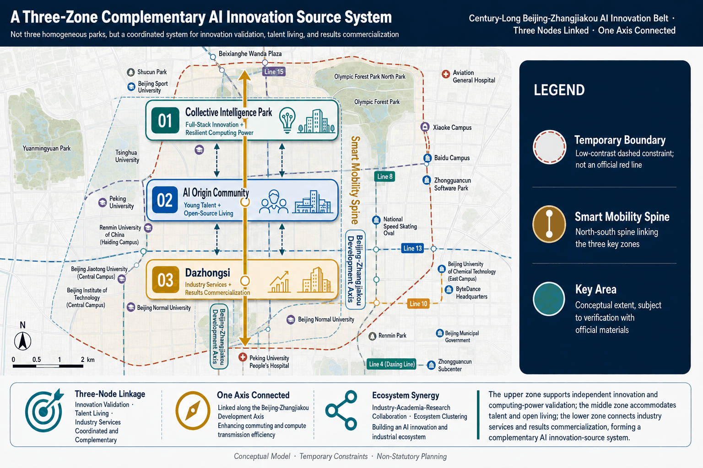
*Figure 03 must display the three priority areas and pending conditions.*

#### 1.4 Zhongzhi ParkAI Autonomous Innovation Acceleration Area
Focus area I

#### Zhongzhi Parkai Autonomous Innovation Acceleration Zone
Open win-win, innovation development

*B|Zhongzhi Park AI Autonomous Innovation Acceleration Area*

Zhongzhi Park claims the "technology breakthrough" link within the **AI Autonomous Innovation Acceleration** chain:

  - **All-in-house autonomous innovation**: an AII system with reasoning and training centers, chip-testing labs, model validation sites, and safety governance labs to underpin core technologies (the "primary creator of inventions").
  - **Community power and governance voice**: a regional central hub providing standard governance and reverse support to origin communities.
  - **Open win-win**: theme of open-win, innovative development, encouraging open-source, cooperative sharing, and positioning autonomous innovation within a globally collaborative open model.

#### 1.5 Beijing AI Community of Origin
Focus area II

#### Beijing AI Community of Origin
[Empowerment, Young Power]

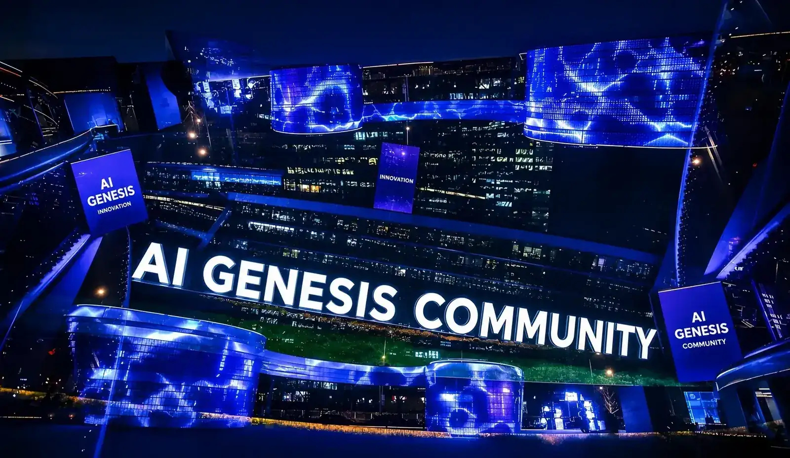
*Figure C: Beijing AI Community of Origin*

The Beijing AI community of origin is the "World class of original innovation" **scene core**, forming part of the "**Thoughts and Standards**" in the source chain:

  - **Elemental source and standard output**: core of talent, enterprise, open source, data; convergence of five standard elements; includes open-source publishing hall, results-transformation street, data-element living room, standard assessment, and talent community;
  - **Reinforcement of the advantage**: convert "brain density" to "source concentration" leveraging the established benefit of higher-education and youth institutional convergence;
- **Young Power**: Leveraging the "enhanced advantage, youth strength" theme as the primary idea source, AI frames the "young cause, youth career" concept (see 4.4 "source of original community").

#### 1.6 Dazhongsiai Industrial Cluster
Focus area III

#### DazhongsiAI Industrial Cluster
Elemental convergence, ecological synergy

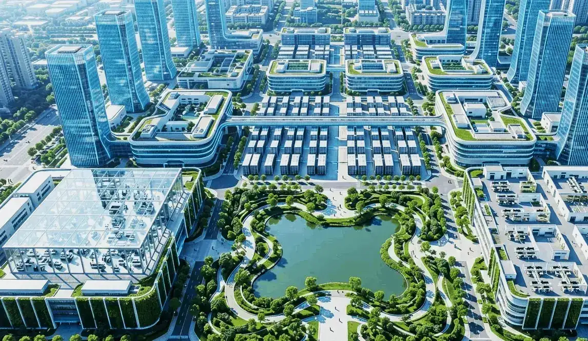
*D|DazhongsiAI Industrial Cluster*

Dazhongsi oversees the "**industrial landslide and ecological clustering**" segment of the source chain.

  - **Intelligent neo-business**: carrier enterprise services, product releases, and lightweight edge nodes to turn source results into a landable, diffuse industrial landscape;
  - **Southern low-temporal response**: mobilize source and community services for low-latency response and disaster preparedness in the South, enhancing regional synergistic capacity;
  - **Element convergence, ecological synergy**: develop a healthy ecosystem where all participants coexist, enabling AI to fulfil all functions;

#### 4.4.4 Space evolution of strategy: Two Wings Down in Sector 3 and resilience Space Organization
The three core strategies focus on spatial division of the "two wings of the Three Sectors" and specific organization of the AI origin community. This section layers three strategies: scene location, overall plan, three resilience layers, water-park relationship, flow lines, building structure, ratios, and drawings.

#### Site location: AIS-based community division of labour between two wings of sector 3

The proposal assigns roles per the mission document: **AI Origin Community** - "World Class AI Innovation Ecology Source of Innovation" with six convergence elements and standard output; **Zhongzhi Park** - AI self-innovation, computation power/governance; **Dazhongsi** - intellectual novelty and low-time response in the South. This corrects the misplacement of the "Centre of reasoning" by locating original innovation as the hub for ideas, business, and standards.

After obtaining data on official boundaries, terrain, electricity, municipalities, tenure, and fire protection, re-select specific plots within the AI origin community.

|Focus areas|Resilience character|Main space carrier|Relation to original innovation source|
|---|---|---|---|
|Zhongzhi Park|AI independent innovation + computational power & governance speech|Logic & training centre, chip testing workshop, model validation site, safe governance lab|Assume primary power centre and standard governance to support the source|
|AI Community of Origin|World-class innovation ecology|Open-Source Publishing Room, Results Conversion Street, Data Elements Lodge, Standard Evaluation, Talent Community, Endside Construction Portal|Core scene with six elements and standard output.|
|Dazhongsi|Smart original business (situation + edge response)|Enterprise service, product release, lightweight edge node|Provides resource mobilization and computational power for rapid and disaster-prepared response in the south|

Zhongzhi Park handles full-scale energy consumption and long-term large-scale training; also ink reasoning, chip testing, and safe governance. AI Community of Origin manages factor source, standard-setting, and credible data flow. Sector Three, together with Transport, Robots, and Public Space Nodes, forms the chain: **periphery training - Zhongzhi Park full-barrel reasoning and validation - origin element and standard output - Zone Three Edge Response**.

The roads, orbits, water systems and green areas are mapped via the local OSM cache projection `AI maap/osm-data.js '; the overall design scope and the three focus areas follow the provisional presumed coordinates of `map-three-layers.html, for spatial relation identification during the competition. Zhongzhi Park manages overall innovation and power; the Community of Origin handles ecological innovation sources and standard output; Dazhongsi oversees new-industry transformation and edge response. Linked by the Jing-Zhang corridor, they form a "two-wing" collaboration system with peripheral training resources across the urban landscape.

#### General plane design: one session, two rings, three interfaces, six groups

The AI origin community adopts a space structure **"One Court, Two Rings, Three Interfaces, Six Clusters"**, representing a six-factor carrier.

#### Division I: Element sharing courtyard

As a public living room for the public:

  - Ground-based real-time eco-resilience info belts displaying aggregate health of talent flows, enterprise growth, open-source dynamics, data compliance, standard iterations, and computational power usage;
  - Provide a bookable outcome press, open-source demo areas, scene validation sites, and small distribution points;
  - Link open-source publishing halls, standard assessment workshops, data-element living rooms, and enterprise service spaces via a semi-outdoor gallery;
  - Set up shades, rain gardens, mobile seats and all-weather work interfaces;
  - Only anonymized public activity data are displayed at night;

#### Two rings: public innovation and safety.
**The Public Innovation Ring** targets urban roads, campuses, and green spaces, linking exhibition halls, factor service halls, open-source and shared meetings, results presentations, talent services, and roof gardens. Users follow the ring to complete the "know-know-need-access-elements-see-results" process.

It avoids public walkways and mitigates impact on public spaces via greening, building massing, and acoustic barriers.

#### Three Interfaces

1. **Urban service interface**: main roads, public transport, entrance squares, factor service halls, business services and exhibition space;
2. **Campus innovation interface**: open-source communities, joint research offices, standard assessment workshops and credible data sandboxes for universities and research institutes;
3. **Park ecological interface**: low-density public functions, rain gardens, resting platforms and energy-science facilities for green areas, preventing direct equipment, heat and high-noise emissions into the park.

#### Six.

|Group|Elements|Core content|Space characteristics|
|---|---|---|---|
|Talent Corps|Talent|Joint research offices, international talent communities, youth apartments, night collaboration spaces|Adjacent campus interface, mixed residence, R&D, socialization|
|Enterprise|Enterprise|Incubation, acceleration, unicorn building, investment financing, legal services|Can be segmented and reorganized along the street.|
|Open Source Group|Open Source|Open-source publishing hall, public code wall, contribution space|First floor open, linking courtyard to city entrance.|
|Data group|Data|Credible data sandboxes, data-element lounge, compliance audit|Tiered delegation, key data above security marker|
|Standard Cluster|Standard|Evaluation lab, security governance, red-team testing, standard setting|Visitable, reservable, regulatory governance interface|
|_Other Organiser|Computational power|Endside computational power station, Edge Node, Model Validation Workshop, Near Light Calculator|Sub-seat enabler combined with public service; scalable and re-engineered|

Six groups form a staggered building complex sharing courtyards and galleries. Talent, businesses, and open-source groups create a public dynamic; data, standards, and computational-power groups form the governance core-**computational-power groups serve as the base energy element**, providing the first five groups with near-light infrastructure, marginal caches, and certification. This element supplies visual and functional innovation without dominating mass, acting as a resilience and energy link.

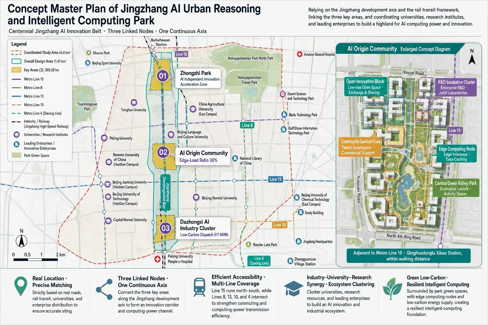
*General plane of the concept of the AI origin community (global bottom map + focus area amplified)*

The master plan uses a two-scale layout "wide-down map + focus-area amplification": the left map shows spatial relations among Zhongzhi Park, the AI origin community, and Dazhongsi along the Jing-Zhang axis, roads, water systems, and green-field networks; the right map employs AI to generate bird-view concepts for open, innovative neighborhoods, incubator groups, community service core, company node, and Central Green Valley Park.

#### Space implementation on three levels

#### Element renewal: redundancy and substitution

  - **Talent**: create mobility and mutual-recognition pathways among universities, parks, and enterprises so talent shifts do not cause ecological breaks; provide flexible joint study rooms and short-term work units;
  - **Enterprise**: support accelerated unicorn growth alongside redundancies to avoid over-reliance on a single lead; allow space division and reorganization for enterprise scaling and exit;
  - **Open source**: distribute code, models, and community contributions decentrally without a single hosting platform; enable easy re-matching of public code walls and contribution spaces;
  - **Data**: classify key data, maintain multiple auditable copies, and provide a credible sandbox for cross-subject compliance collaboration;
  - **Standards**: offer open assessment and governance methods, transparent layout, and prevent standards monopolization;
- **Computational power**: as a foundational element, redundant supply of the 3rd tier of the `Exterior Training - Zhongzhi Park Whole Inference - Origin close to Light Count - Edge of Dazhongsi' Commutation Power Network; local retention of the source point for near lightweight, edge cache and authentication workshops, with cross-scale movement of tasks in any one-time malfunction, creating an alternative to the ` near-light, area recalculation and cross-scale movement.

#### Spaceresilience: Resilience and Reconstructability
AI origin communities employ a composite layout "public space below, collaborative space above, key data and standards above, energy systems above", keeping key data, standards, and governance out of flood-prone underground zones.

  - Key data sandboxes, standard assessment, and governance controls are placed above ground after flood, structural, and fire review, using modular and partitioned design;
  - Underground areas are limited to parking and non-critical support rooms, excluding core data, unified governance, critical network nodes, and primary power control;
  - Protect construction entrances, ramps, vents, and pipelines; isolate garage ramps from main entrances;
  - Use a phased, disassemblable structure allowing partial re-engineering or updates without interrupting core functions.

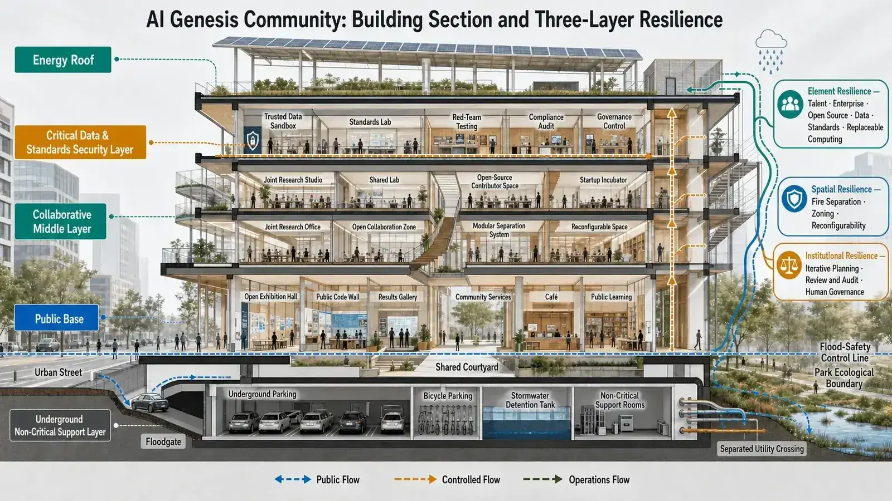
*AI-Oi community profile with three resilience layers*
The profile stacks: public base, cooperative middle level (data, standards, safety-energy roofs), and underground. Public spaces link streets, courtyards, and park eco-interfaces; collaborative zones host joint research, open-source work, and flexible business incubation; key data, assessments, red-team tests, and compliance audits sit above flood-control lines; underground houses parking, rainwater management, and non-critical services. Element, spatial, and institutional resilience are woven throughout via distinct public, controlled, and transport streams.

#### Institutional resilience: self-healing and the right to speak

  - **Multi-Intelligence Collaborative Governance**: monitors mobility breakpoints, public-space thermal power, facility maintenance, business demand, and security risks; requires planning clearance, prohibits unauthorized image export, and makes no implementation warranties.
  - **Standards and Governance Output**: converts assessments, red-team tests, security ratings, and audits into accessible, bookable, regulated public interfaces, positioning standards development and model governance as core competencies.
  - **Open source and ruleover**: community-governed data-flow rules and algorithm guidelines are participatory, versioned, and auditable, yielding institutional products reusable by other cities.

#### Design relationships with water systems, parks and urban environments

#### Water is not a shortcut to cool, but a safe border.
Zhongzhi Park and Dazhongsi border the Qing, Moon, and other rivers; AI-origin communities must verify urban runoff and groundwater.

  - Key data, standards, and governance functions sit above the security marker.
  - Underground space is not solely for critical functions.
  - (b) Install inverted water systems at entrances, ramps, vents, and pipes.
  - Manage cooling, fire, rain, and sewage subsystems.
  - (b) Deploy leakage detection and auto-disconnect in key areas.
  - Rain gardens provide daily savings but do not replace protection of critical facilities.
  - Using the multi-smart "four-prevention" system (scene IV), predefine flood extents and scenarios; capability endorsement does not imply implementation commitment.

#### The park is not a back yard, it's a public innovation interface.
The first floor will be partially accessible, eschewing large walls that block public space.

#### Central Park Belt: From Landscape to Ecoresilience Disk

The central park belt, free of high-speed transit, is the community's signature public space and the hardware base of the intellectual-carbon platform.

  - **Plant configuration as carbon-sink hardware**: prioritize high-capacity native, low-maintenance species using Joe-Irrigated-grass-plough design to boost leaf-area index and carbon capture; monitor vegetation health to adjust irrigation and pruning, avoiding excessive maintenance.
  - **Water-body design as climate-relief hardware**: retain and expand rain-fed wetlands, ecological ditches, and retention pools for flood control, purification, and evaporative cooling; monitor plant and microbial carbon sinks and methane for dual-carbon accounting.
  - **Water-penetration and sponge facilities as water-carbon synergy hardware**: install penetrative soils, submersible greens, and eco-pools to cut runoff and heat islands; monitor matrix infiltration and moisture to ensure light rain drains and heavy rain does not flood.
  - **Active mobility network as carbon-mitigation hardware**: link campus, business, and public transit to foot and bike paths; use passenger flow data to quantify carbon savings from active over motorized travel.

The Wisdom-Carbon platform continuously monitors and optimizes these hardware, turning the central park belt into **an eco-infrastructure for active urban-resilience participation**.

#### People flow, logistics, data flow and fire lines

|Stream|Entry & Path|Design requirements|
|---|---|---|
|Public and business flows|City entrance - factor service hall - shared courtyard - exhibition hall - park|Continuous, barrier-free, with a core safety zone|
|Researcher flow line|Campus entrance - Identification - Joint Research Office/Certification Workshop - Controlled Data Area|Tiered authorization, appointment-based access, no equipment-logistics overlap|
|Equipment and transport logistics|Backfield entrance - unloading platform - equipment elevator - general power & energy groups|Independent enclosure for replacement and continuous maintenance of large equipment|
|Fire and emergency flow lines|Urban roads - ring fire routes - rescue sites - fire subsectors|Constant access, without conflict with parking, activities or displays|

Public display, research, business, city-sensitive, and governance data are routed to separate secure networks; exhibition halls may only use desensitized, delayed, or simulated data, and governance networks remain isolated from public ones.

#### Building patterns and urban style

AI Place communities employ low-midrise, organized, staggered building forms:

  - Talent, business, and open-source groups create continuous active street-level interfaces.
  - Data and standards teams reside within the group, shielding sun-exposed components and preserving the gallery's technical image.
  - Building height conforms to adjacent campus, community, and city contexts; the concept phase does not pre-determine height.
  - (b) Integrate roof energy and photovoltaic systems in the fifth-dimension design.
  - Nighttime displays show only entrances, courtyards, and operational status, avoiding extensive media presence.
  - Public art merges Jing-Zhang Railway heritage, computing history, and Central Guan's innovation culture.

#### Space modules to reference ratios
The following percentage references **conceptual priorities for the urban-design phase**, guiding relationships among the six factor spaces rather than serving as a final statutory metric.

|Functional category|Reference priority/scale area|Design intent|
|---|---|---|
|Talent, enterprise, open source group|40%-50%|Elements forming the source of original infusion and public vitality|
|Data, standards, governance cluster|20%-25%|Carrying credible data flow and governance output|
|Computational power, edge and authentication (underground)|15%—20%|For near lightweight, marginal caches, validation of workshops and energy synergies as substrate energy enablers|
|Transport, logistics & security support|10%-15%|Equipment transport, fire rescue, routine services|

Retaining primary space for talent, enterprise and open source keeps the innovation community, rather than the machine room, in the leading role. Work-unit scale and final land boundaries must be determined from official focus-area and planning conditions.

#### Design drawings and simulations

The outcome must produce at least seven designs, not merely system frameworks.

1. **General scene plan**: one session, two rings, three interfaces, six clusters;
2. **Front floor open space map**: links public, business, research, parks;
3. **Architectural profile**: public base, mid-level collaboration, key data and links to safety layers, energy roofs, flood resistance;
4. **Quadrate chart**: human flow, logistics, data flow, fire stream;
5. **One-day scenario**: utilization of scientific research, business, public, urban governance;
6. **Impact Switch Simulation**: talent, enterprise, computational & provisional power, elemental restructuring, space response;
7. **Central Park intellectual-carbon platform map**: sensory nodes, carbon sequestration, water bodies, water penthouse layout, dual-carbon cockpit interface;

Digital sandpads must toggle "normal-concern-restricted-carry-emergency-restoration" to denote open/closed zones, mission sites, power routes, water-risk areas, and evacuation variations across states.

## AI Innovation Ecology, Talent Image and AI+ scene

The chapter addresses the AI+ context in public services, stock updates, smart transport, soft intelligence, and rail veins, assembling a service unit comprising client, space carrier, data boundary, manual review, fail-safe exit, and operator.

#### 4.2.7 Three types of AI+ scenario

The inventory-update cloud applet provides a lightweight quantitative UI for the closed loops. Three scenarios convert "Space-Asset ID AI → Precision Activation → Smart Schedule → Feedback Optimization" into user experience.

#### Scenario one: Asset discovery — Resource Square and Resource Map

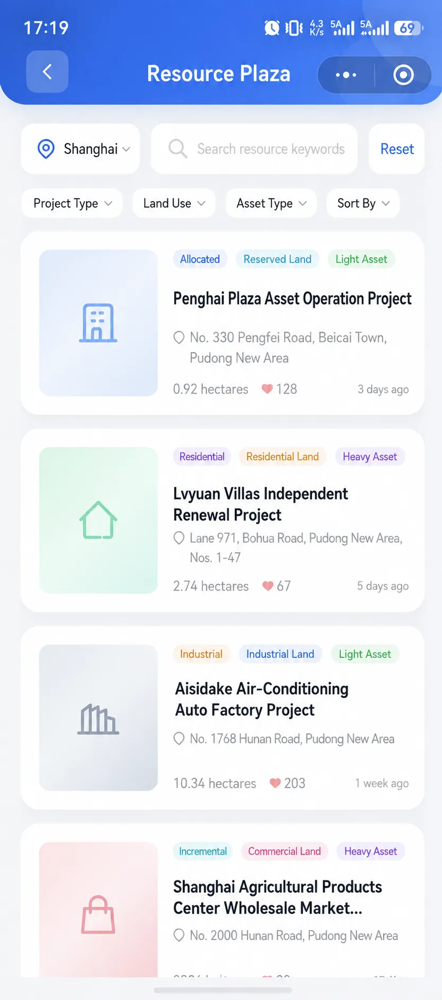
*Resource Square*

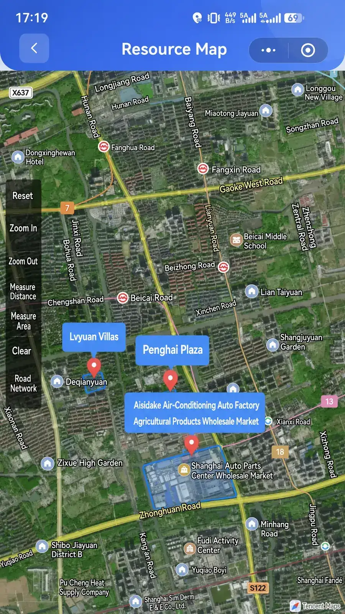
*Resource maps*

**Planning object**: local governments, national finance platforms, space operators, innovative enterprises, community leaders, citizens.

**Space position**: livable assets in low-use Jing-Zhang corridor zones, sub-bridge spaces, idle buildings, edge greens, etc.

**Wisdom experience**: 1. **Resource Square browsing**: first page screens "full/hotspot/light/heavy" assets and positions by spatial type and model; **Multi-dimensional labeling**: retrieve by city, land type, label, sort; AI matches assets via non-identifying rule rules on asset traits (no personal history; see Appendix E governance); **Resource map positioning**: switch to maps to view asset distribution, tenure boundaries, perimeters, cutting ground-cost; **Transaction case reference**: display historical cases via "resource column" to supply business and profit models;

**Data and privacy boundary**: open-space asset data is anonymized; tenure and financial details are accessible only to accredited operators.

**Operating entity**: national platform, official innovation operator, and third-party space operator.

#### Scene 2: Request to operate — asset details and “I'll run”

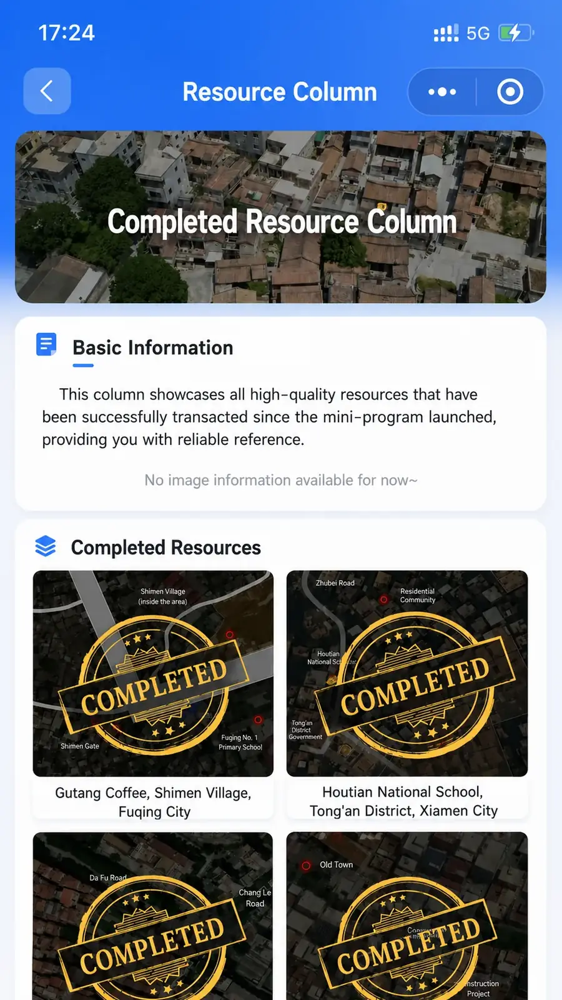
*Resources column*

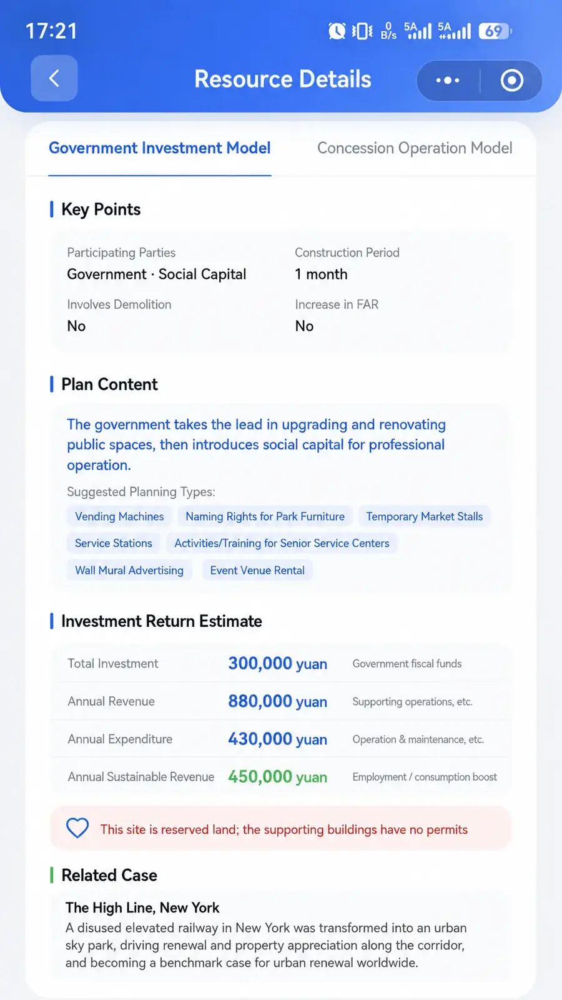
*Resource details*

** Planning object**: intent operators, community leaders, innovative enterprises, creative teams.

**Spatial location**: any online asset in the Jing-Zhang gallery.

**Intelligence experience**: 1. **Asset details card**: space status, tenure, usage area, building area, lease offer, photos, business concession terms, location, project profile, plot details; 2. **AI adaptation assessment**: auto-evaluates functional mix feasibility using proposal, revenue metrics, asset traits, operator-submitted plan; 3. **Key operation application**: clicking "I'm going to operate (quick application)" routes platform to National Finance Platform/Property Review; 4. **Rapid consultation & interface**: "quick consulting" points let operators contact platform client/owner on policy, rights, alteration needs;

** Data and privacy boundaries**: operator business plans and contacts accessible only to authorized reviewers; public data excludes personal privacy.

** Operator**: National Platform + Proprietor + official innovation source.

#### Scenario III: Two-way Matching — Project Needs Release, Forum and Policy Information

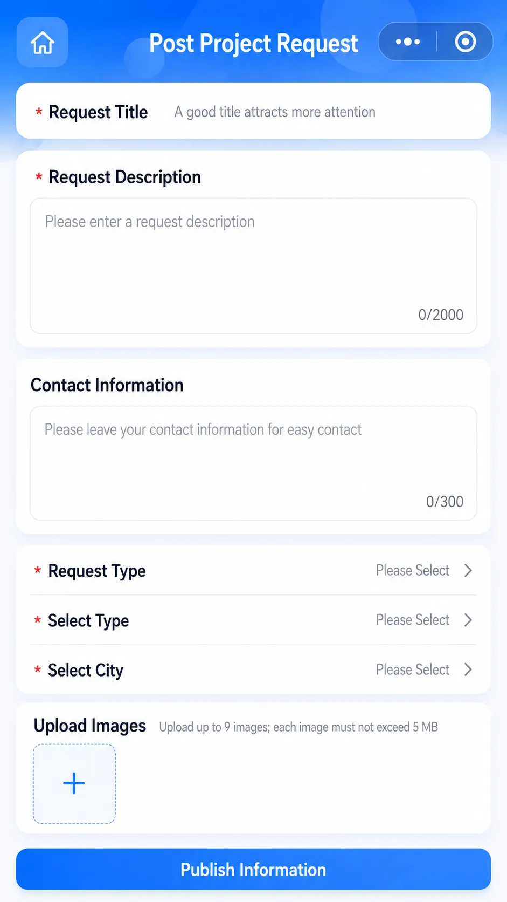
*Organisation*

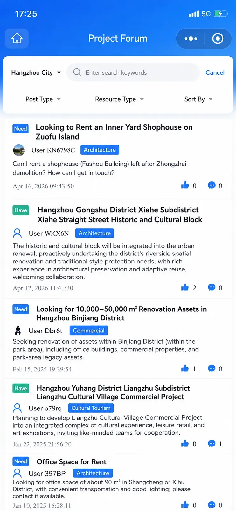
*Forum discussions*

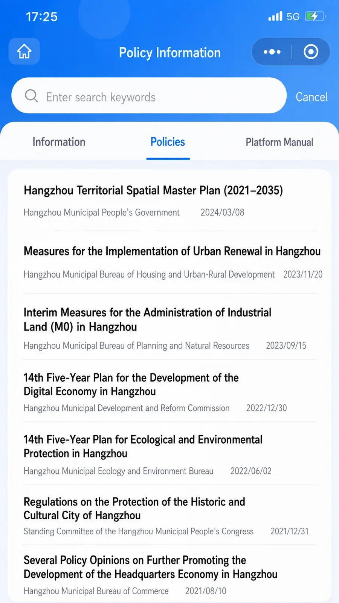
*Policy advice*

** Planning object**: periphery, innovator, community manager, designer, urban-renewal implementer.

**Spatial position**: online platform + acupuncture micro-update point + community space.

**Wise experience**: 1. **Demand release**: users click "demand", enter title, description, contact, type, city, upload photos, specify rent, location, adaptation, cooperation; 2. **Demand square matches**: AI matches citizen/enterprise needs with platform assets, reversing opportunities to property owners; 3. **Forum discussion**: asset-specific forums enable joint proposals, reviews, transparent governance; 4. **Policy information query**: central display of park-side services, asset pool activity, urban renewal policies, lowering information barrier;

**Data and privacy boundaries**: contact details are private by default and disclosed only to a specified recipient after explicit, revocable user consent; users can correct, delete and appeal. Forum content receives automated prompts and human review before display.

** Operator**: Community House Council + urban-renewal implementer + small-program operator.

#### 4.3.3 Category V AI+ traffic scene
Five AI+ scenarios deliver "AI-native transport" to an operational setting: each addresses a specific traffic issue-brain mobility, end distribution, public-transport timing, travel services, movement security-and provides a closed "space-service-governance" loop covering client, location, architecture, data governance, operator and exit mechanism.

The five AI+ scenarios run on a unified **intelligent traffic management platform**: prototype plus seven core modules, then the five scenarios per case.

The Platform channels movement and governance of the five scenarios via the "**Governance before Technical Devices**" principle: AI offers recommendations; evacuations, closures, orders are confirmed; data are minimized, desensitized, and traceable. It is an operational support layer, not a standalone product, for the urban signature proposal.

#### 4.3.3.1 Prototype of platform

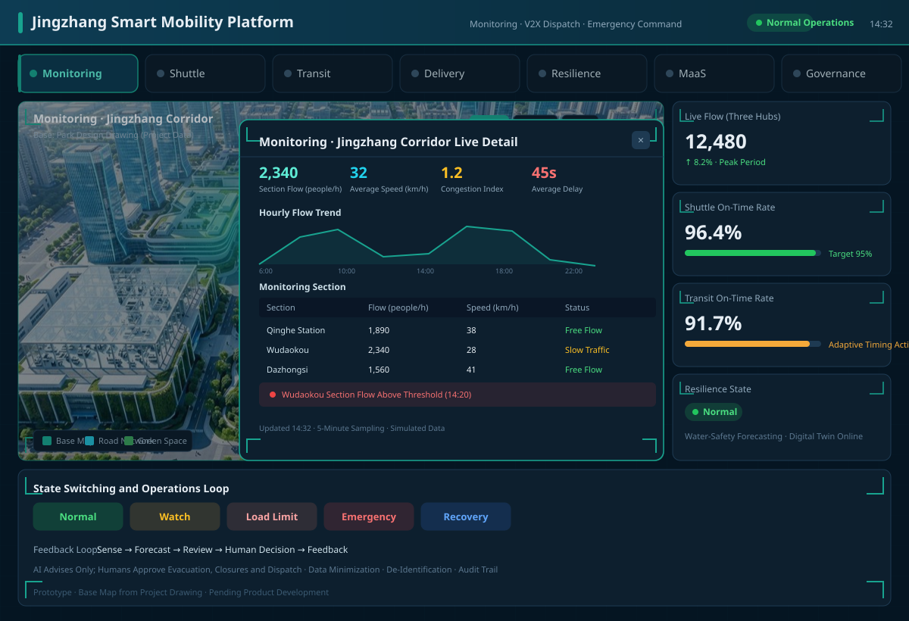
*Smart traffic management platform dashboard prototype: top-module toggle + park base map + monitoring bullet windows + KPI + five-state switch (protocol for productization)*

#### 4.3.3.2 Seven functional modules and five scene mapping

|Module|Correspond|Main functions|
|---|---|---|
|Operation monitoring|Global situation|Real-time flow/road/water level perception, fault indicators, alarms|
|Access dispatch|scene one.|Unattended appointments, dispatch, terminal prediction|
|Public transport synergies|Scene three. Precision bus.|Vehicle-infrastructure coordination time, bus priority|
|Distribution Management|Scene two, no one to deliver.|Distribution orders, routes and docking points|
|resilience Switch|scene 5 switch|Normal limited-load emergency recovery 5-state switch|
|Maas Travel Services|scene IV Maas|Course planning, multiplication advice, carbon credits|
|Data and governance|Cross scene|Data classification, desensitization, audit marks, manual review|

The scenarios use public-transport coordination, active-mobility connections, MaaS and digital twins as conceptual methods, without committing any party to delivery or implementation.

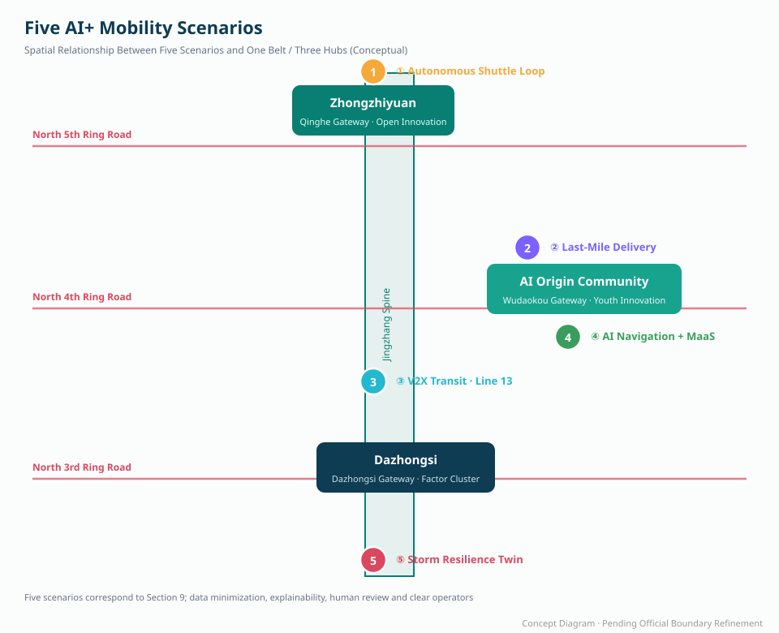
*5 AI-plus traffic scenes and three nuclear space relations (concepts pending official refinement)*

#### Scene one: Public access ring (talent flow)

**Possibility and object**: backbone links among three cores, serving commuters, visitors, high-level train passengers at Qing River station to ease talent mobility. **Space position**: along Qing River-Dazhongsi corridor, low-speed unlinked access (hydrogen/electric minibus, design speed 20-40 km/h), stations spaced 300-500 m, integrated with main spine and three nuclear portals.

**System architecture (end-side-wind)**

  - **end**: vehicle-borne laser/M-wave radar/cam, roadside RSU, hologram;
  - **edge**: computation units at portal edges for low-latency avoidance and docking decisions;
  - **cloud**: access-scheduling platform, appointment, passenger-flow forecasting, orbital-clock link;
  - **data closed loop**: perception positioning → path planning **control-to-station feedback** → schedule optimization.

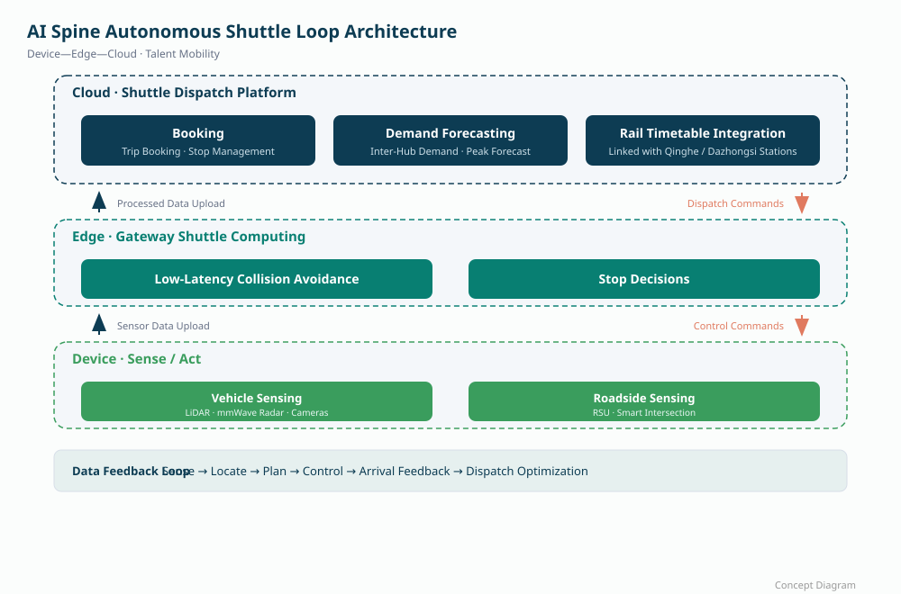
*Scenario I system architecture: end (car/roadside perception) - side (edge computation) - cloud (connection control)*
**Service flow**: reservation / fixed-point stop → vehicle-infrastructure perception → three-core gateway transfer → station-arrival feedback → dispatch optimization.

** Data and governance**: passenger flow aggregated openly; vehicle status authorized; personal itineraries restricted; only desensitized flow data collected; sensor failures mitigated by edge parking and remote takeover; transport sector confirms and traces operating lines and parking points.

**Manual review and operation**: the district operator and public-transport operator jointly manage the service; dispatch actions require human confirmation, with conventional bus links retained as the fallback.

** Indicator and validation**: access response delay, inter-core commute time, arrival rate; tested on closed/semi-open segment before launch.

** Implementation and exit**: cost-class pilot at Qinghu-Dazhongsi line; halt if safety unmet and revert to routine access.

> **Discrepancies (lightpoints)**: operating on the Jing-Zhang ridge via orbital portal, serving talent flow-not a viewing or tourist tool; lack of access blocks talent movement between three nuclears.

#### Scene 2: No one delivers "last mile"

** Positioning and Targeting**: terminal distribution at parks, communities, high schools; serves park enterprises, residents, college staff and students, delivering "computational power + life" to the last kilometre. **Space position**: distribution point and terminal storage between Zhongzhi Park and origin community, supported by low-altitude drone platforms.

**System architecture (end-side-wind)**

  - **end**: low-speed ground unmanned vehicles + low-altitude instant-delivery drones;
  - **border**: distribution and movement control of terminal warehousing;
  - **cloud**: distribution-scheduling platform, order tracking, route management;
  - **data closing**: dialing distributions → handovers → receipts and abnormal schedule duplicate.

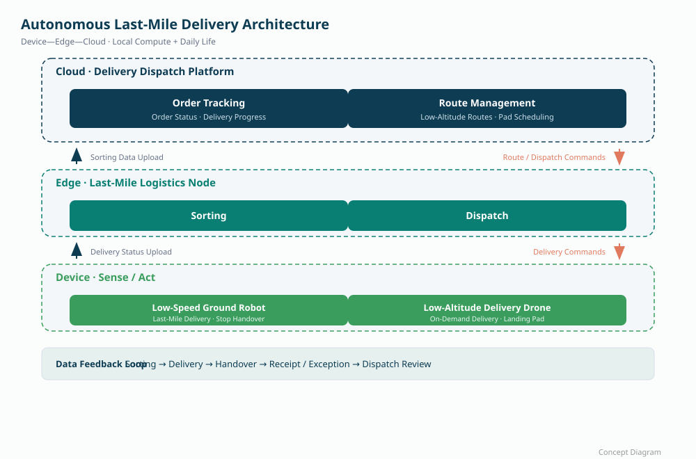
*Scenario II system architecture: end (UAVs) - side (edge storage) - cloud (distribution control)*
** Service flow**: allocate ground unmanned vehicles/UAV docking points → sign-off and report abnormal dispatch double-disk.

** Data and governance**: orders/deliveries minimized; recipient data limited; no-fly zones, lanes, landing points approved by airspace/security; logistics flows independent of evacuation routes.

** Manual review and operation**: primary operator provides innovation + logistics; distribution anomalies masked; serves as non-digital alternative to traditional delivery and self-depositors.

** Indicator and validation**: distribution response delay, abnormal drop rate, end-to-end interface accuracy.

** Implementation and exit**: low-cost renewal of existing warehouses and roads; pilot single-campus Zhongzhi Park; security or complaints insufficient.

> ** Discrepancies (lightpoints)**: reuse orbit/road redundancy, break distribution and walk time, high-frequency small units for AI talent - discard low distribution for "computational power close to + life".

#### Scene III: fine public transport

**Positioning & object**: timely public transport along and across corridors, serving bus passengers, stitching east-west. **Space position**: integrate conventional transport on line 13 via cloud-side car, hologram point at intersection.

**System architecture (end-side-wind)**

  - **end (roadside)**: RSU, mm-wave radar, hologram, signal collector;
  - **Edge**: compute road edge and dynamic signal-matching timing;
  - **Cloud**: transport dispatch centre, class density, route optimisation;
  - **Data closed loop**: → bus priority to station ** scheduling optimisation as roadside perception pairs dynamically.

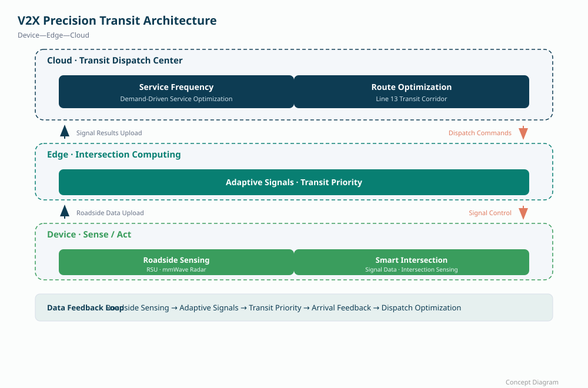
*Scenario 3 system architecture: end (roadside perception) - side (front-side border control) - cloud (bus dispatch centre)*
** Service flow**: Roadside perception → dynamic mix ** bus priority to station info return → schedule optimisation.

** Data and governance**: collect vehicle location, speed, passenger flow only, no personal ID; signal control and priority strategy approved by traffic management, with manual takeover retained.

** Manual review and operation**: primary operator is transport operator and innovation source; signal strategy confirmed manually; non-digital substitute for fixed time frames and manual movement.

** Indicator and validation**: traffic-to-station ratio, adaptation rate during signal matching, peak point increase.

**Implementation and exit**: cost-class roadside retrofit; pilot single PT corridor on Line 13; if performance misses target, revert.

> **Discrepancies (lightpoints)**: goods stitching on line 13 for precision PT-timing of PT crossing council connections rather than a single hub.

#### Scenario IV: AI active mobility navigation integrated with Maas

** Positioning and Object**: One-Stop Activity Mobility + Track + Access Out for residents, teachers, students, entrepreneurs, visitors. ** Space is down** with Jing-Zhang vibrator belt as interface, low-invasive sensing and interpretable guidance to identify active-mobility breakpoints, crowded nodes, accessibility needs.

**System architecture (end-side-wind)**

  - **end**: low-invasive, interpretable screen;
  - **Edge node**, active mobility breakpoint and congestion recognition;
  - **Cloud**: MaaS platform, itinerary planning, multiplier advice, carbon credits;
  - **Data closed loop**: process planning → conversion recommendation → mobile navigation → carbon-fraction feedback → breakpoint update.

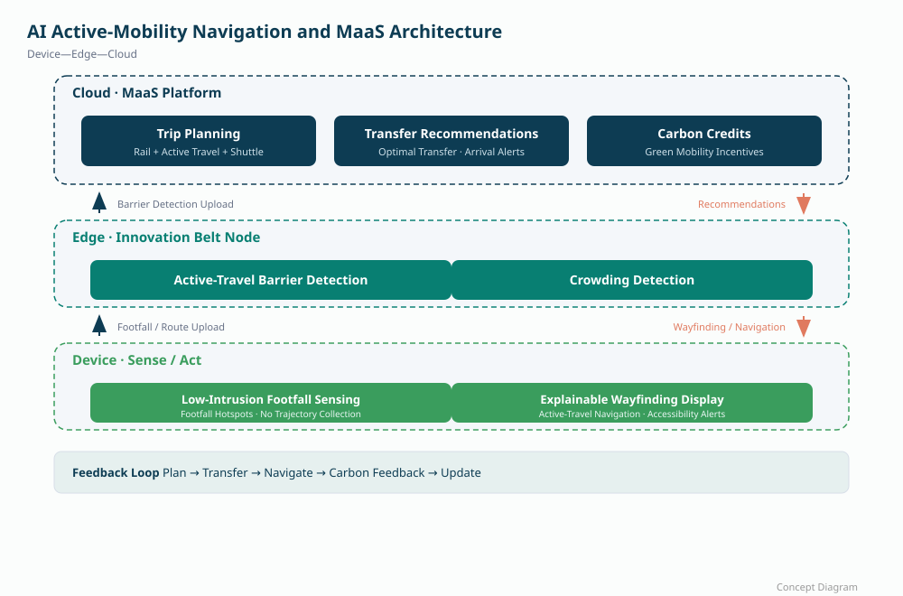
*Scene IV System Structure: End (Human Flow/Guide) - Side (Dynamic Belt Reversion) - Cloud (MaaS Platform)*
** Service flow**: process planning (orbit + active migration + access + shared bicycle)

** Data and governance**: aggregate only human flow and path data, no personal portraits or commercial recommendations; orientation content is desensitised and manually reviewed; accessibility findings undergo professional review.

** Manual review and operation**: primary operator is innovation source and travel-service platform; guide and recommend desensitisation clearance; non-digital substitute for static marking and manual queries.

**Indicator and validation**: 5/10/15 min of active migration availability, breakpoint detection, multiplier adoption rate.

** Implementation and exit**: low-cost; pilot in Jing-Zhang main ridge segment; privacy or misleading issues noted below.

> ** Discrepancies (lightpoints)**: MaaS Service Active Mobility Main Ridge and Tri-nucleic connection, core to "identify Active Mobility Breakpoints" rather than mere route recommendation.

#### Scene 5: The Great Flow to resilience

**Location and object**: traffic emergency backed by digital twin, service manager (transport, emergency, water, park), public desensitization display. **Space down**: global AI event-week bus flow and storm-flood "Pre-motion-reverse" with 4.4 water-saving "four-prevention system".

**System architecture (end-side-wind)**

  - **end**: Skyland Waterworks Awareness Network (rain, water level, passenger flow, road conditions);
  - **Edge**: Zhongzhi Park City Centre for Logic, multi-smart "four-prevention system" closed;
  - **Cloud**: platform for urban operations, transport, emergency response;
  - **Data closed loop**: perception → Four-prevention system → Duplicate → manual decision-making ** implementation feedback.

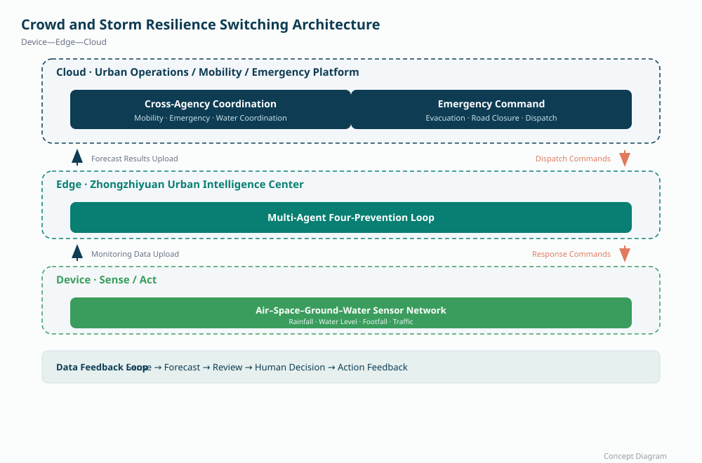
*Scenario 5 system architecture: End (Skyland Waterworks Awareness) - Side (City Logic Center) - Four-prevention system - Clouds*
** Toggle logic**: concern state (passage/water level deviation) → restrictive mode (downgrade non-critical activities, encrypt access) → emergency state (separation section, cross-nodal takeover, evacuation route activation) ** recovery (inspection, phased restoration).

** Data and governance**: address only structured monitoring and desensitisation indicators; no personal tracks collected; evacuation, blockage, movement decisions confirmed; AI provides only recommendations.

** Manual review and operation**: primary operator is Urban Operating Sector and Zhongzhi Park City Centre of Dictionary Twin Technical Support (conceptual phase as competency reference); non-digital substitute is preset plus manual command.

** Indicator and validation**: transition time, pre-proposal advance, cross-node takeover success rate (upplay of marker digital twin).

** Implementation and exit**: cost-class (reuse Four-Prevention system capability); pilot, single-stage global AI activities week; misreporting/frustration and adjustment model.

> ** Discrepancies (lightpoints)**: extend resilience to heavy rains, combine water safety for four-prevention system in Jing-Zhang water system (Clean/Mount/Trop).

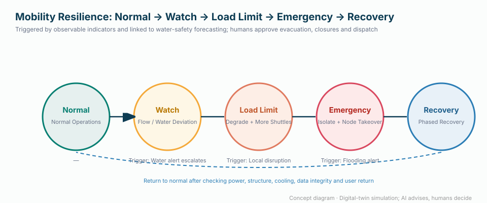
*Traffic resilience to quinquennium.*

> Intelligent traffic and digital twin water case data are endorsements of capability and are formally included in the `sources.json ' registration sources prior to submission of the package and confirmed for external reference, and do not constitute a commitment of the proposal to the construction or implementation of any subject.

#### 4.4.5 Three types of AI+ scenario: three types of user trip

The three scenarios target core user groups-scientific teams, start-ups, citizens-illustrating "one-stop" acquisition, "diagnosis", and "sensitisation" of original innovation.

#### Scenario one: "One-stop access to source ecology" by the scientific team

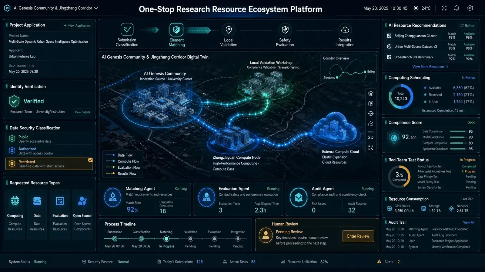
*One-stop eco-source digitizing system for scientific teams*

** Planning object**: colleges and scientific-institution teams (teachers, students, post-doctoral, independent researchers) entering via campus innovation interface.

**Spatial Path**: School Innovation Interface → Identity Verification Elements Sharing Courtyard (Results Submission Desk) → Local Validation Workshop results returned.

**Process**: 1. **Submission and classification**: team submits result summary, data security tier (public/authorized/restricted) and required elements (computational power, data, evaluation, open-source hosting); 2. **Elements**: proposal combines items per "minimum element, near-computational power, compliance priority" principle-small-scale validation in local workshops, large-scale training/central reasoning at Zhongzhi Park or outskirts; 3. **Security evaluation**: results go to local rapid testing; after red-team test and standard security rating, decision made to grant access to enterprise, open-source community, or city; 4. **Left a mark and rediscussion**: full audit trail enables review of resource use and compliance.

** Data and privacy boundary**: security phase processes only results metadata and team-initiated submissions; campus data and scientific results need authorisation; no personal research-behaviour trajectory collected.

** Manual review**: security classification and feed findings confirmed by security staff with the team; system is recommended only.

** Operator**: original innovation source + standard assessment lab.

#### Scene II: "Ecoresilience Clinic"

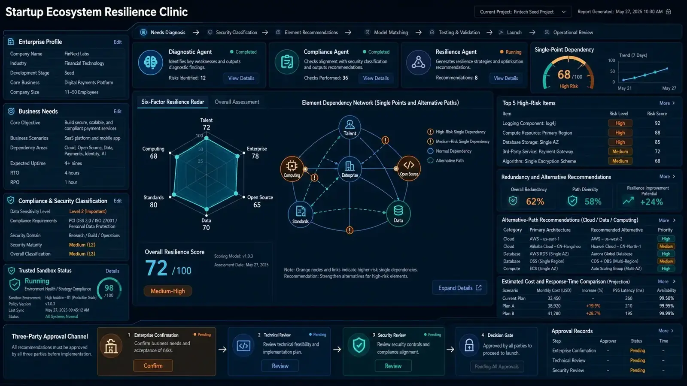
*Start-up Enterprise Ecoresilience Outpatient Digital System*

** Planning object**: start-up team and growth business presenting needs in factor service halls.

** Process (seven steps)**: demand diagnostic → safety-classification recommendation → model-fit ** test validation → online → running double disk.

** Core feature - Single point dependency assessment**: Clinics issue "single point dependence" reports identifying enterprise elements over-centralized on a single cloud, data source, or compute channel, and recommend redundant "resilience" measures from park slogans to enforceable decisions.

** Data and privacy boundary**: process only enterprise business and compliance data, using credible sandboxes, Zhongzhi Park or peripherals.

** Manual review **: final proposal jointly confirmed by enterprises, technicians and security staff; windows below the line remain closed.

** Operator**: original innovation source + corporate service team.

#### Scene III: Citizens enter the “discoverable reminisce”

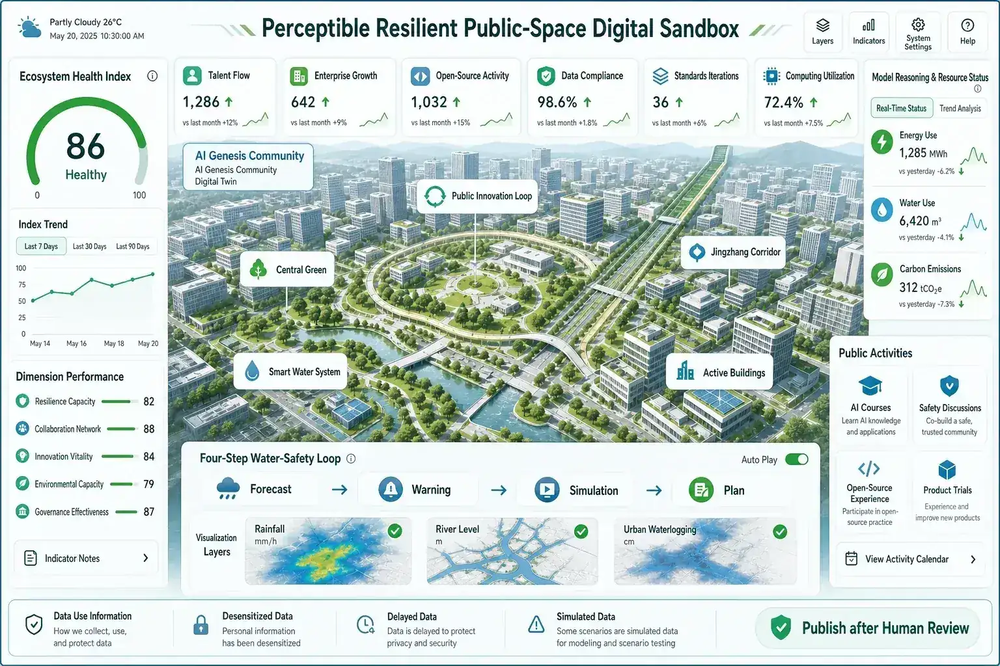
*Visible resilience Digital Sandboard*

** Client**: peripheral residents and public.

**Spatial path**: Public Innovation Ring Pavilion → Sharing courtyard → Park Eco-interface.

2. **Participatory activities**: youth AI course, model security discussion, open-source contribution, pilot product testing.

** Data and privacy boundary**: public zones use only desensitized, delayed or simulated data; no personal tracks collected, no commercial recommendations made, and standards/governance zones remain untouched.

** Manual review**: displays released after sensitization and review.

** Operator**: official innovation source + public education partner.

#### 4.4.6 Deepening scenes of urban operations

Three scenarios elevate spatial innovation from "in-garden principles" to "city running": water-safety "four-prevention system" showing AI reasoning supports spatial response under extreme weather; a resilience toggle illustrating differentiated shock response; and the Dual-carbon platform demonstrating measurable operation of the ecological chassis.

#### Scenario IV: Real-time reasoning for urban running - Water Safety

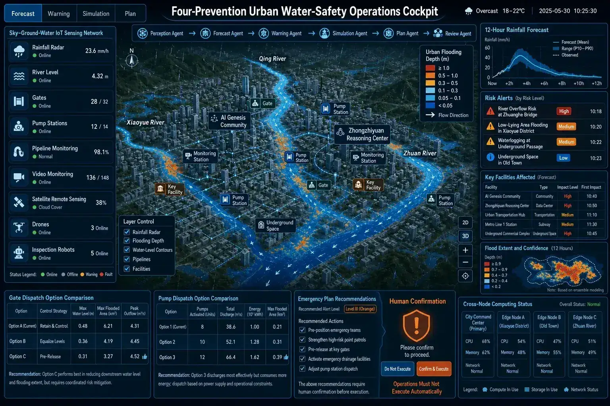
*Water Safety City Operating cockpit*

** Position**: Key scenario moving "resilience source of abstraction" into urban reality via water security, showing AI reasoning supports extreme weather and flood resilience. Relies on Jing-Zhang Railway to convert urban hydro-capacity into accessible resilience service, based on Inland Qing River, Moon River, and trans-river system.

** Planning object**: authority managers (city, water, emergency, park) and public sensitization displays.

**Spatial position**: reasoning power sits in Zhongzhi Park's urban reasoning centre; AI's origin community and the Qing/Moon/Turk River systems are linked via high-speed network, avoiding equipment concentration in origin locales. These rivers form the built-up water system aligned with Ningbo River's "basin + urban flooding + underground space + lifeline" structure, enabling direct migration.

**AI Origin structure (multi-intellectual "four-prevention system" closed loop)**: organized under the "AI Native, multi-intellectual collaboration" competition, incorporating non-traditional water informatization.

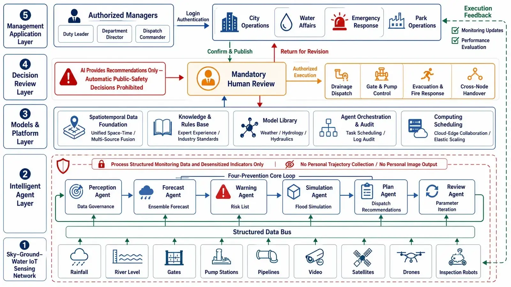
*Multi-IntelligentFour-prevention system closed-ring logic structure*

1. **Agent (Monitoring)**: integrate "Skyland Waterworker" sensors-rainfall, river level, gates, pumps, pipelines, video, satellites, drones, ground robots-to upload structured data;
2. **Agent (model)**: meteorological-hydrography-hydrodynamic coupling for advanced water-level and flood-risk prediction;
3. **Early warning Agent (thresholds/knowledge)**: triggers and expert analysis auto-generate risk lists sent to authorized managers;
4. **Preview of Agent (simulation)**: 2-3D flood model illustrating gate deployment effects and section failures;
5. **Precedent Agent (mobilization)**: proposal linking drainage control, pumps, gates, and cross-nodes;
6. **Duplicate Agent (over time)**: post-forecast vs. measurement comparison to iteratively refine model parameters.

** Manual review and privacy border**: drainage, gates, evacuation, fire and public-safety decisions require confirmation; AI provides only recommendations. Only structured monitoring and desensitized indicators are processed; no personal tracks or images are collected.

** Operating entity**: Zhongzhi Park City Centre for Dictionary, Urban Operations Management & Digital tech support (concept stage; service relationships to be validated).

#### Scene five: Treasure versus resilience under impact

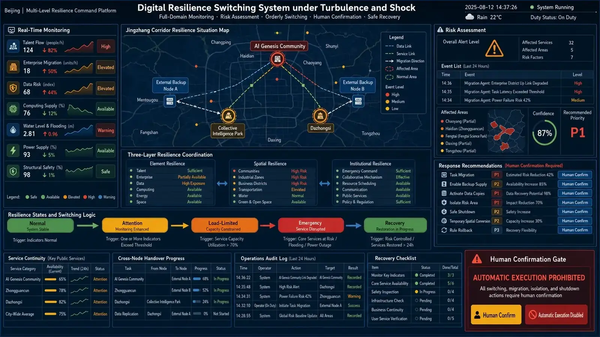
*resilience to digitize the political screen*

Switches covering the "Element-Space-Systems" three layers, triggered by indicators and linked to the water-safety "four-prevention system" in scenario four:

  - **Concerning state** (trigger: key indicator deviation or water-security warning): increase monitoring of brain drain, enterprise emigration, data risk, general power supply, water leakage, power supply and structure.
  - **Lock-down mode** (trigger: local shocks, core needs): relocate or downgrade non-critical innovation to maintain core R & D continuity and reliable data flow with urban services.
  - **Emergency state** (trigger: extreme weather, flooding, power/structural alarm): isolate faulty physical or data subdivisions; cross-node takeover of critical ops (Zhongzhi Park or external compute power), enable off-site data copies; shut down critical functions.
  - **Recovery status** (trigger: shock relief): phased recovery after verifying power, structure, cooling, data integrity and brain/enterprise return.

The water-security "four-prevention system" forecasts serve as a decision base for the "Concerned-state to emergency" transition. Presented simply at the exhibition hall, it turns the "source of official innovation" into daily public education.

**Communicational powerforce map**: impacts Level 3 computing network; routine recalculation via "near lightweight + area" mobility; non-critical training shifts to Zhongzhi Park/periphery to sustain core R&D and urban services; emergency cross-level takeover, off-site data copies, upgrade from "one room" to "network-wide portable disaster" power.

#### Scenario six: Central Park with intellectual-carbon platform

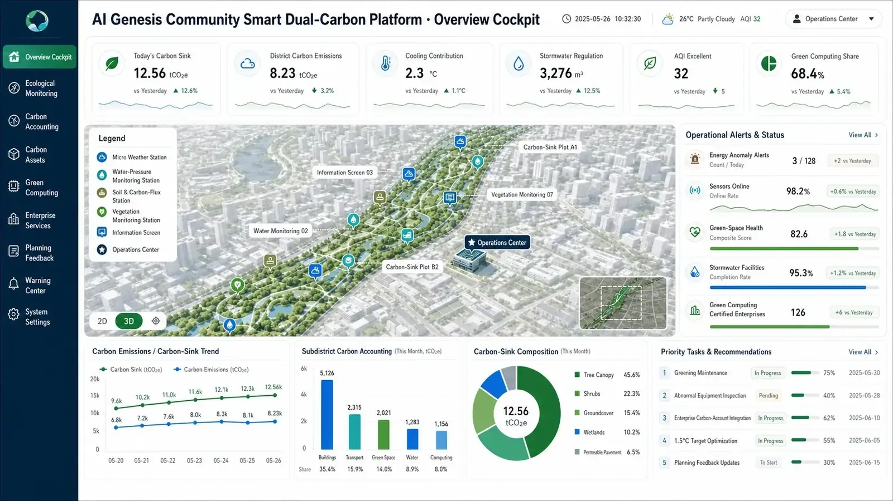
*Central Park with Smart-carbon platform*

** Positioning**: Linear park belts at the AI origin community should evolve beyond "green packaging of smart computing" to a **perceived, measurable, manageable eco-resilience chassis** via the intellectual-carbon platform, serving as daily innovation space and composite infrastructure for urban carbon sinks, climate regulation and awareness.

** Planning object**: peripheral population, commuters, researchers, business visitors, urban ecological management.

**Spatial position**:

  - ** Perception node**: install micrometeorological stations, anaerobic ion monitors, online water-quality, soil-moisture and carbon-flux sensors, and vegetation health probes along park belts;
  - ** Carbon cell block**: establish "Quantifiable green infrastructure" as a model area with Joe-Imbush-grassed carbon storage, rain-fed wetlands, and water-drilling;
  - ** Presentation interface**: add a dual-carbon info screen in the park's eco-interface and shared courtyard to display real-time impacts of carbon sinks, cooling, rainwater recharge, and air-quality improvement;
  - ** Managing the cockpit**: feed data to the operations centre for urban water security "our-prevention system", energy management, and compute power distribution.

**Platform architecture (third floor)**:

1. **Perception layer: credible ecological data collection**

    - Energy consumption: sub-energy use for buildings, transport, power, lighting, air-conditioning;
    - Carbon emission sources: vehicular traffic, catering, waste, refrigerant leakage, etc.;
    - Carbon absorption channels: vegetation type, leaf area index, soil organic carbon, wetland water quality, methane flux;
- Environmental metrics: Temperature, PM2.5/PM10, negative ion, noise, infrared surface heat.

2. **Accounting level: harmonized carbon accounting relative to 1.5 degrees**

    - Development of sector-level carbon emissions-sink equilibrium models;
    - Accounting by sub-accounts for construction, transport, green land, water systems, power;
- Indicator "1.5 Model Lifestyle Zones": recommendations on compliance, gaps, and optimization.

3. **Appendix: three user interfaces**

    - **Public screen**: shows today's park carbon captured, temperature reduction, and air cleaned, making the dual-carbon goal tangible daily;
    - **Management of the cockpit**: early warning of abnormal energy use to park operators, carbon-sink asset inventory, greening advice;
    - **Planning feedback interface**: links design parameters (vegetation layout, water area, perforation rate, etc.) to carbon-sink effects and updates surrounding plot designs accordingly;

** with the ecological integration of:

  - (b) Energy consumption and carbon emissions platform for the Centre of Intelligence & Accounting to explore a "green government power certification" mechanism;
  - Provide business tenants carbon footprints and abatement advice for ESG reporting;
  - Create a "low-carbon living laboratory" for the talent community, converting behaviour data (riding, walking, shared office, etc.) into visualised low-carbon results;

** Data and privacy boundary**: collect only regional aggregate data and operate public facilities without individual tracking; enterprise energy data accessed after authorization;

** Manual review**: carbon accounting methods, targets, and major reduction proposals validated by third-party verification and planners;

** Operator**: environmental-innovation source + urban eco-environment sector + technical service provider;

#### 4.5.7 Three types of AI+ scenario

#### Site one: Visitors to the 100-year Jing-Zhang Digital Museum

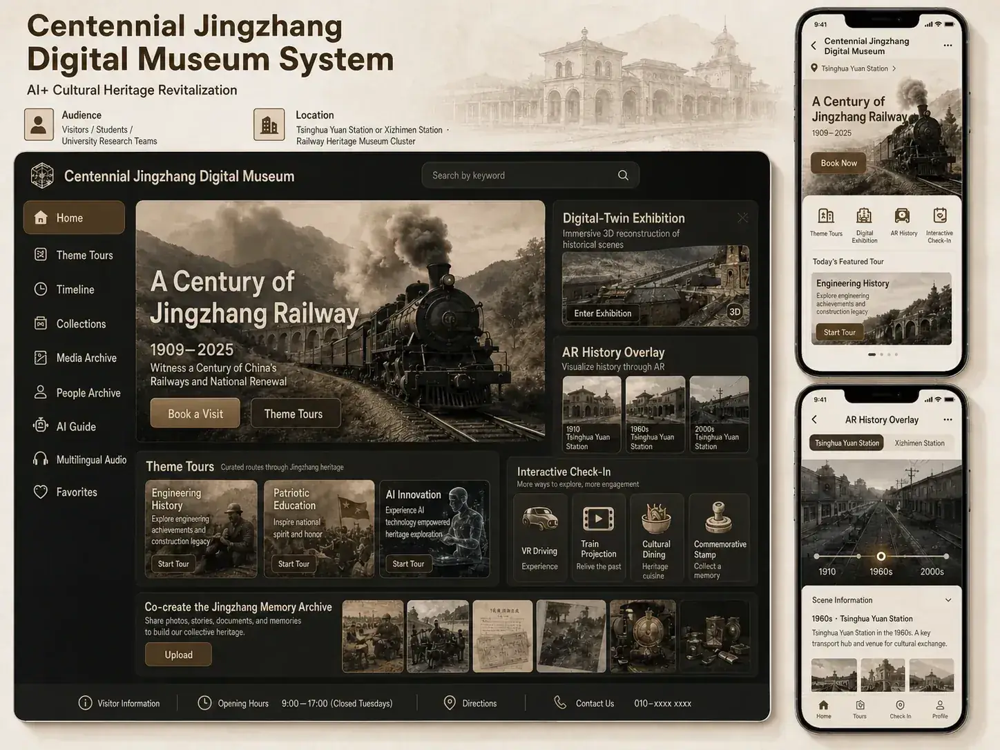
*100-year Jing-Zhang Digital Museum System*
** Planning object**: domestic/foreign tourists, primary/secondary students, university research teams;

**Spatial location**: railway museum community at Qinghua Park station node or West Straight Gate node;

**Visitor experience**: 1. **Booking and thematic guidance**: visitors select engineering-history, public-education or AI-innovation routes while the system balances flow and site capacity; 2. **Digital-twin interpretation**: indoor displays present verified railway technologies and spatial change, while outdoor AR uses only archival material checked against authoritative records; 3. **Interactive experience**: simulated driving, carriage media, creative products and commemorative stamps; 4. **Co-creation**: public memories enter the digital archive or public-art wall only after source verification and content review.

** Data and privacy boundaries**: only booking images, research feedback, and authorized shares processed; no biometric or tracking data collected;

** Operating entity**: museum operator + human security sector + educational partner;

#### Scene 2: Citizens enter the Sound Museum and AR History Site.

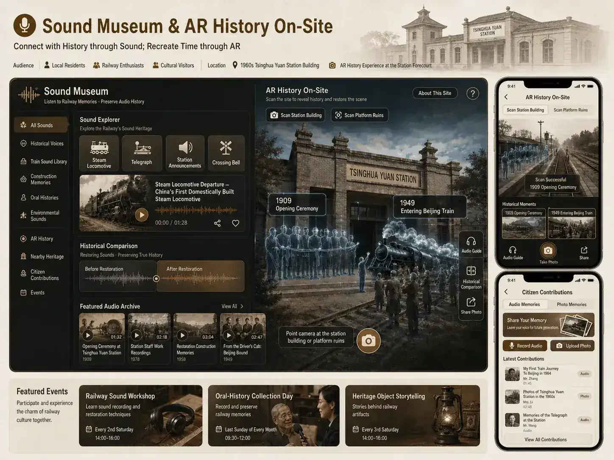
*Sound Museum and AR History Site*

** Planning object**: peripheral residents, railway enthusiasts, cultural visitors;

**Space landing**: in 1960, Qinghua Park station becomes a sound museum with an AR point at its entrance.

(b) 2. **AR historical site**: 1909 drive-through ceremony, 1949 "Go to Kyoto" special arrival;

** Data and privacy boundary**: oral history and voice collection need written consent; public broadcasts are sensitized and validated;

** Operator**: museum operator + Community House Council + Oral History Agency;

#### Scene 3: The community created the Jing-Zhang Memory Garden.

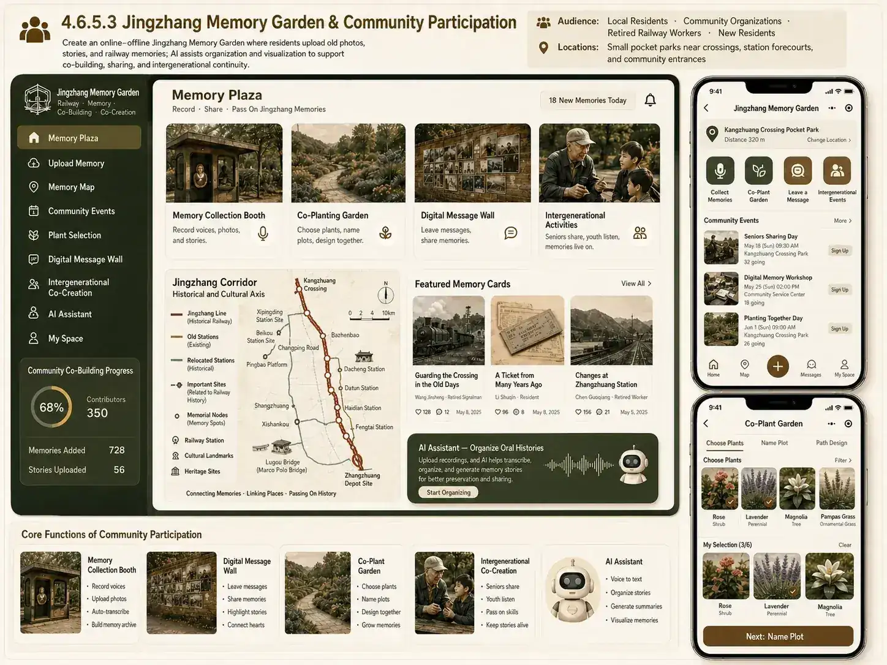
*Jing-Zhang Memory Garden and Community Participation*

** Planning object**: peripheral residents, community groups, senior railway workers, new-immigrant families;

** Space landing**: small pocket parks like mouths, front stations, community entrances, etc.;

**Wisdom experience**: 1. **Memory collection kiosks**: audio/video booths let residents share personal and Jing-Zhang Railway stories; 2. **Co-planting**: residents choose plants, name items, design layouts, embedding community memory; 3. **Digital message wall**: historic photos and stories displayed on public screens or online; 4. **Generational activities**: veteran railway workers share experiences with youth, who create family memory books using digital tools.

** Data and privacy boundaries**: oral history and historic photos need written consent; public broadcast is desensitized and authorized; no personal routines tracked;

** Operating entity**: Community Houses + Museum Operator + original-innovation source;

## Land use, building size and retention proposal

Update follows "evidence before judgment": prioritize railway heritage repair; reversible storage space; demolition conditioned on retrofitting after tenure, structural and security checks; new construction fills service and resilience gaps. All size conclusions retain conceptual design attributes. [standard:MNR-LAND-USE-CLASSIFICATION-GUIDE] [depth:retain_renovate_demolish] [data:geometry/buildings.geojson#BLDG-001]

#### 4.2 Fine activation of camp city strategy *AI+ stock asset update cloud (space asset identification * AI supporting decision-making * precision space activation * smart operating schedule * feedback optimization *

#### 4.2 AI+ finely activate inventory assets to update cloud

Optimise inefficient, debris-laden idle space in the Jing-Zhang Railway innovation zone, converting "stocked assets update cloud" into a matching asset system; employ space-asset identification, AI-driven decisions, precise activation, smart operation control, and feedback optimisation to turn sleeping assets into cash flow and talent-retaining carriers;

#### 4.2.1 Strategic positioning: transforming space stocks into an entry point for innovative operations

The Jing-Zhang Railway innovation belt contains many inefficient spaces-grey under-bridge areas, idle stations, old industrial sites, edge green zones, vacant office floors-resulting from re-routing, upgrading, and complex tenure; they are "sleeping assets" awaiting proper project-operator matching, not negative assets;

The strategy uses a stock-asset renewal workflow and treats fine-grained activation as a lightweight operating system: it avoids large-scale demolition and relies on space-asset identification, assisted decisions, precise activation, operations and feedback to turn underused space into flexible innovation and service hubs.

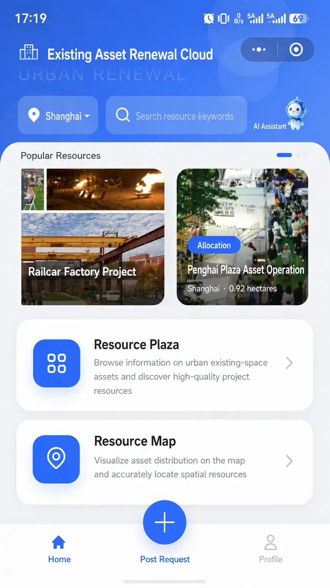
*Jing-Zhang Space Asset Inventory Update Cloud Applet home page*

The applet home page features four portals-Resource Square, Resource Maps, Policy Information, Forums-linking asset discovery, spatial positioning, rule queries, and community management, shifting the inefficient Jing-Zhang corridor from "sleeping assets" to "dynamic operations";

#### 4.2.2 Space asset identification: from sleeping assets to operational data

Space-asset identification initiates inventory updates; digitising and structuring inefficient spaces supplies reliable input for AI-driven matching and operation;

#### Four categories of inefficient space

Active space along the Jing-Zhang corridor falls into four categories, each with distinct activation potential and constraints;

|Space type|Typical object|Core issues|Activate Potential|
|---|---|---|---|
|Ashes below the bridge.|Under rail/road bridge, under shelf|Complex tenure, poor accessibility, low environmental quality|Traffic nodes, community activities, innovative services|
|Unreserved station/industrial complex|Old station, welding plant, warehouse, industrial yard.|Aging buildings, outdated functions, fragmentation of property rights|Museums, joint offices, creative markets, research|
|Under-office/coup building|At night, there's an empty office building and a corner dress.|Timeless, single business|24-hour service street, social consumption, community activities|
|Peripheral Green / Pocket Park|Street corner green, abandoned corner, small park|Inadequate facilities, low usage and lack of maintenance|Community gardens, flexible playgrounds, pet friendly spaces|

#### Space assets database fields

Create a database of inefficient Jing-Zhang corridor assets to produce searchable, comparable, traceable digital ID cards for each;

  - **Basic information**: asset ID, name, coordinates, admin division, street, usage area, building area, volume ratio, floor count;
  - **Title and law**: title holder, land nature, title status, lease/use status, planning limits, fire/structural safety level;
  - **Status assessment**: function, vacancy rate, condition, environmental quality, accessibility, peri-urban traffic, municipal capacity surplus;
  - **Accompanying facilities**: distance to transit stations, public transport coverage, parking, Wi-Fi, charging stations, accessibility;
  - **Economy and operations**: lease offers, historic rents/revenues, projected adaptation costs, operational gains, heavy/light asset classification.
  - **Labels and portraits**: space-type, business, target-population, activation-difficulty, policy-adaptation labels;
  - **Multimedia and documentation**: status photos, aerial videos, point-cloud models, mapping drawings, scanned title documents;
  - **Dynamic status**: uplink, matching, operating, performance rating, complaints and feedback records;

#### AI Indicators for spatial vitality assessment
Integrate static endowment and dynamic data to build spatial assessment models, supplying quantitative basis for screening and prioritising acupuncture points:

|Indicator dimensions|Specific indicators|Data sources|
|---|---|---|
|Location value|Distance to transit, public-transport coverage, network accessibility and block-level jobs-housing statistics from public or authorized aggregates|OSM and public transport data; authorized statistics only after a data-protection impact assessment|
|Population needs|Peripheral population density, share of innovative talent, age structure, facility gap index|Census, POI, research questionnaire|
|Current activity|Block-level time-band footfall and dwell-intensity classes plus public-space observation|Onsite counts, public statistics or lawfully authorized data meeting aggregation thresholds; no direct mobile-signalling, Wi-Fi-probe or personal social-account feeds|
|Space quality|Greening coverage, lighting, accessibility, environmental quality|Streetscape Image Identification, IOT Sensor|
|Operational potential|Clear property rights, adaptive elasticity, strong policy support, market rental expectations|Tenure databases, policy documents, market comparable cases|
|Cost of intervention|Renovation volume, municipal access difficulty, approval timeline, demolition risk|Site survey, planning conditions, expert assessment|

The model may trial a 0–100 spatial-vitality index only after approval of lawful source, minimum fields, aggregation threshold, retention and access roles. It must not support personal credit scoring, identity decisions or automated resource allocation; rankings require human review and explanation, correction and appeal channels.

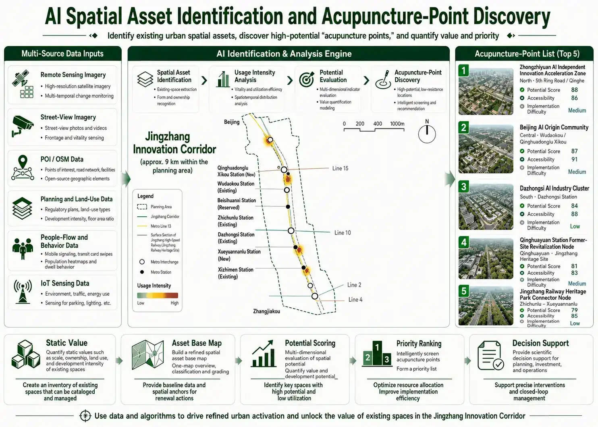
*AI Space Asset Identification and Acupuncture Discovery*

**Figure 1: AI Space Asset Identification and Acupuncture Point Discovery** - integrates asset database, dynamic evaluation model, and GIS analysis to auto-identify high-potential acupuncture points along the Jing-Zhang corridor, producing priority rankings and preliminary business recommendations.

Resource Square and Resource Maps visualize asset identification: Square screens by spatial type, heavy/light assets, label combos; Maps show asset distribution, tenure boundaries, perimeters on the base map, cutting ground-survey costs.

#### 4.2.3 AI Auxiliary decision-making: acupuncture point identification, program generation and subject matching

Using digitized assets, AI supports "diagnostic-match-generated" decision-making, turning vague spatial issues into implementable project lists.

#### Acupuncture recognition logic

AI Acupuncture Point Identification follows a five-step process: Data Integration, Candidate Screening, Comprehensive Rating, Prioritization, On-site Validation:

1. **Data integration**: asset databases, human heat, POI distribution, mobile phone data, public complaints, planning conditions and social data;
2. **Candidate screening**: hard threshold-property rights clear or harmonizable, no major structural risks, basic accessibility ensured;
3. **Comprehensive scoring**: compute composite scores per point using dynamic indicators and flag short panels (e.g., facilities with high footfall but significant gaps);
4. **Prioritization**: generate annual acupuncture bank considering implementation difficulty, demo effect, investment scale, and stakeholder support;
5. **On-site proofing**: rapid step survey and community interview at high-priority points to close AI data blind zones.

#### Spatial digital image
Create a dynamic "space digital image" per asset as a unified language for operational matching:

  - **Basic portrait**: location, size, tenure, current function, constraints;
  - **Dynamic image**: human-flow series, mass composition, activity type, peak-valley;
- **Demography needs**: population, industry, infrastructure gaps within 5/10-minute walk perimeter;
- **Apportunity image**: suitable business, potential operator, expected yield range, overlaid 4.3/4.4/4.5 strategy;
  - **Risk image**: structural hazards, property-rights disputes, policy constraints, neighbourhood risk avoidance, municipal bottlenecks.

#### Space-project-operator matching mechanism
Establish a tripartite two-way matching model aligning "space-search-project" and "project-search-space" within an algorithmic framework:

  - **Space side input**: digital portraits, binding conditions, owner intentions, revenue expectations, acceptable operation mode (rent/assembly/sharing/public goods);
  - **Project side input**: business plan, target audience, investment scale, experience, social benefits, time-use demand;
  - **Operating entity input**: subject type (state/private/community leaders/high-school teams), credit rating, past performance, competency labels, geographic preferences;
  - **Matching algorithm**: generate ranked recommendations via multi-purpose optimization (space compatibility, benefits, social value, risk control, sustainability);
  - **Closed decision**: recommended results feed resource details; owners review online; platform tracks performance and feedback to the model.

#### Micro-update proposal generation process
For chosen acupuncture points, AI generates "light, fast, quick" micro-updates:

1. **Diagnosis of problems**: identify point deficits (seating, lighting, greening, functionality, accessibility);
2. **User image**: analyze spatial-temporal distribution and needs of key groups (tripers, residents, students, tourists) around the perimeter;
3. **Toolbox matching**: select appropriate mix of standardized modules (painting, furniture, kiosks, greening, lighting, digital facilities);
4. **Scene packaging**: embed features such as coffee cafes, community kitchens, shared conference rooms, delivery stations, riding stations, pet-friendly facilities;
5. **Cost estimate**: derived from unit costs of modules and projected project volume;
6. **Programme output**: generate plan maps, material inventory, implementation timeline, business model proposals, and expected results;
7. **Public feedback**: online platform proposals, residential outreach, comments, voting, AI-compiled views and optimization support.

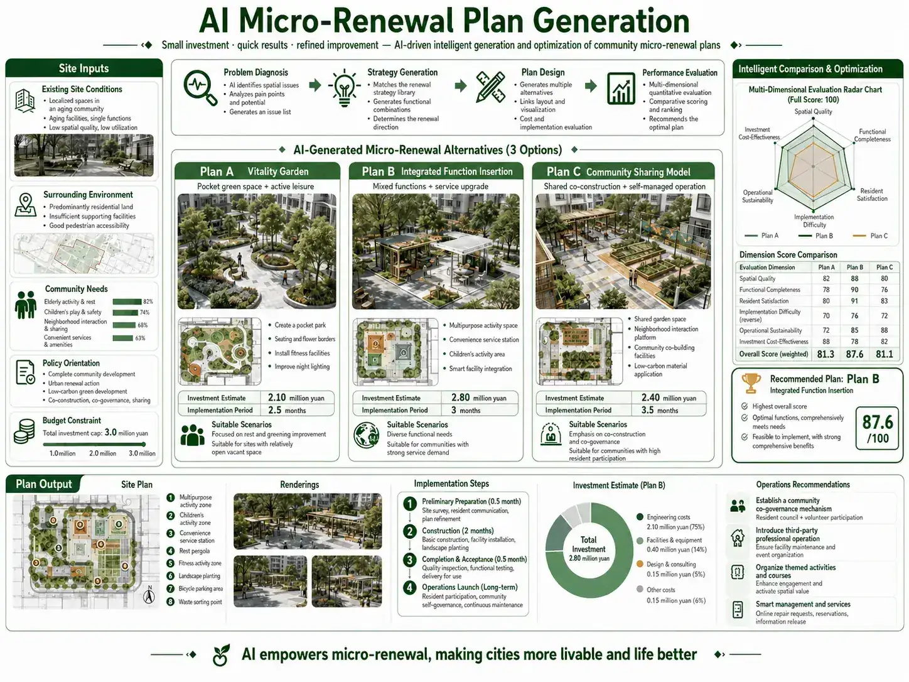
*AI Microupdate Program Generation*
**Figure 2: AI Micro-update Program Generation** - using point diagnosis, user image, and standardized toolbox, AI auto-creates multiple micro-applications for community, designer, and operator selection, voting, and iteration.

The asset details page serves as the AI Localization Interface: clicking a resource card shows space status, owner, current image, concession terms, location, project profile, plot details, and AI-generated appliance and revenue metrics.

#### 4.2.4 Precision space activation: micro-updating toolbox, innovation box and community embedding

AI decisions translate into space adaptations and functional embedding, emphasizing "small cuts, quick effects, accumulation" to activate dormant assets with low-cost interventions.

#### Standardized Micro-update Toolkit

Creates a replicable, low-cost, updated menu grouped by pointboard:

  - **Ground and interface**: water-penetration renovations, rail pillows, mobile platforms, modular benches, vertical green walls;
  - **Facilities and services**: mobile furniture, modular kiosks, public Wi-Fi, charging stations, smart lights, express containers, drinking water;
  - **Ecology and landscape**: flower tanks, rain gardens, sunshields, pet-friendly facilities, bike parking racks;
  - **Numbers and interactions**: info screens, QR code guides, NFC tags, environmental sensors, human-flow counters.

#### Embedded in geochemical scenes
Based on nearby population traits, embed differential functions to avoid "thousands":

  - **Commuting node**: coffee bar, quick breakfast, temporary workspaces, bike-service station;
  - **Resident community**: community kitchens, shared meeting rooms, express delivery stations, children's waiting spaces, pet-friendly corners;
- **peri-university**: open-source living room, joint discussion room, improvisation corner, 24-hour self-study module;
  - **Node of the Cultural Brigade**: railway-theme display, bronze retail, light food, AR card point.

#### Innovation Box and Community Space Network
Small community spaces (Innovation Box, Joint Discussion Room, Open Source Lodge) within 5-10-minute walk in the innovation zone:

  - **Functional positioning**: support occasional communication, improvisation, cross-border cooperation, small activities;
- **Spatial form**: modular, mobile and time-shared; the specific scale is determined by site and operational conditions;
  - **Service embedded**: integrate short-term rentals, shared kitchens, laundry, gym, childcare, pet care around community spaces to ease innovators' lives;
  - **Business-community-sharing interface**: Encourage firms to open conference rooms, exhibition halls, green spaces, parking to communities in exchange for public service points or brand exposure, creating mutual benefits.

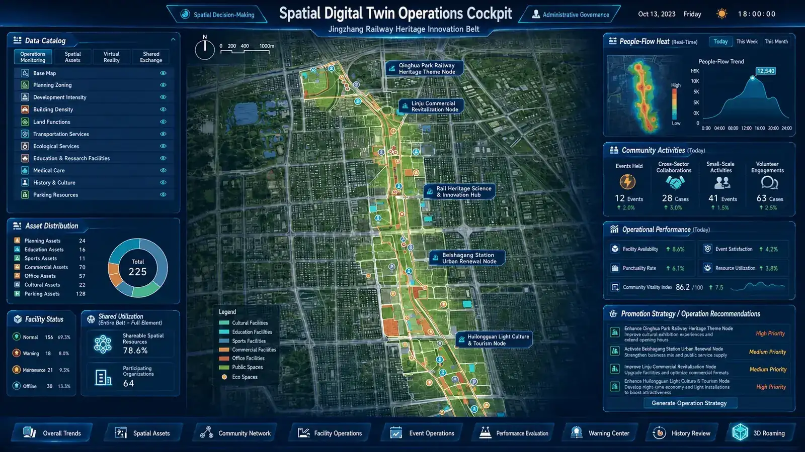
*Space digital twin operating cockpit*
**Figure 3: Spacedigital twin operating cockpit** - consolidates asset locations, human-flow heat, facility status, performance, and community activity into a visual interface for real-time management and rapid decisions.

#### 4.2.5 Smart operating schedule: time-use and dynamic matching

Spaces serve varied groups over time, central to the inventory-update cloud strategy for asset efficiency. AI schedules optimize four variables: time, space, user, activity.

#### Four types of spatial time partitioning strategy

|Space type|Mixed/temporal policy|Typical time allocation|Load function|
|---|---|---|---|
|Ashes below the bridge.|+ Night community activities|9-18:00 shared office/show; 18:00-22:00 community fitness/market|A hotel, a theater, a weekend fair.|
|Unreserved station/industrial complex|Workday industrial service + weekend cultural consumption|Business road shows, joint offices on workdays; weekend exhibitions, research, creative fairs|Business living room, study class, flashroom|
|Under-office/coup building|Day living services + night social consumption|Day coffee, convenience stores, light meals; night taverns, talk shows, community events|24 Hours of Innovation Services Street|
|Peripheral Green / Pocket Park|Daily leisure + festival|Weekday walking, lunch break; weekend/holiday themed fairs, open-air films|Community gardens, flexible playgrounds|

#### AI Timely operating dispatch mechanism

- **Time period particle size**: year-round booking calendar in 1 hour or 30 minutes;
  - **User hierarchy**: residents, business services, community activities, operations, cleaning maintenance; each with distinct priorities and pricing rules;
  - **Dynamic pricing**: peak-time market and membership rates; public-interest periods low or free;
  - **Conflict resolution**: if multiple parties request the same slot, auto-decide by hierarchy: security maintenance > long-term lease > pro bono > commercial > ad-hoc;
  - **Smart appointment**: users see real-time slots, one-click booking, payment, door/bar access via passcodes.
  - ** Handover management**: define handover, cleaning, security timing to cut transaction costs.

#### Functional hybrid access and protocol template

  - ** Access list**: create catalogue of incentives, restrictions, prohibitions to allow a moderate mix of commercial, cultural, innovative services while ensuring safety and compliance.
  - ** Template of agreements**: standardized operating agreement specifying parties, periods, fees, transfers, security, insurance, and default liability.
  - ** Light asset blending**: involve operators, community leaders, university start-ups to lessen government/property owner burden via short rents, alliances, revenue shares.

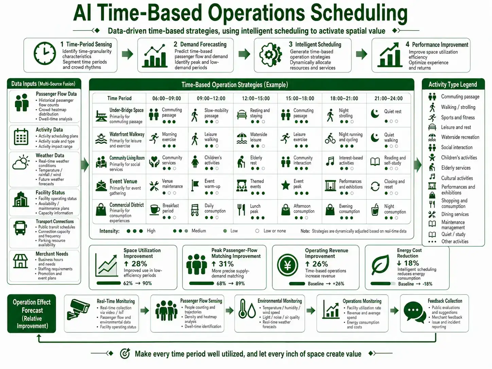
*AI Timeline Operation Schedule*
**Figure 4: AI Timed Operating Schedule** - using appointment data, flow forecasts, and priority rules, AI auto-allocates time to ensure efficient, secure use of the space.

#### 4.2.6 Feedback Optimization: Agent and Shared Platform for Community Operations

Continuous user feedback drives ongoing community self-organization for space operations.

#### Community Operations

Deploy an intelligent community where Agent connects residents, operators, and managers:

  - ** Needs awareness**: auto-analyze forum posts, demand releases, votes, activity feedback to identify high-frequency requests (e.g., night exercise, more child-care spaces).
  - ** Space matching**: auto-recommend appropriate acupuncture points or community spaces based on demand type, population size, timing, and generate activity draft proposals.
  - ** Resource alignment**: match activities with leaders, volunteers, collaborators, and policy support.
  - ** Smart reminder**: notify target users of activities and remind facility maintenance and handover to operators.
  - ** Feedback learning**: auto-collect satisfaction, participants, energy use, safety events post-activity and update space graphics and strategies.
  - ** Score Incentives**: record co-creation and volunteer contributions; exchange points for public space access or creative perks.

#### Demand release shared with Forum

  - ** Requiring publication**: users submit demand titles, descriptions, types, locations, photos and publish rent-seeking, address-seeking, adaptation, cooperation etc.
  - ** AI Match**: system auto-matches citizen/enterprise needs with online assets and channels operational opportunities to owners.
  - ** Forum discussion**: facilitate asset-specific or renewal talks, co-planning by residents, designers, operators to foster transparency and co-governance.
  - ** Policy information**: central display of policies on inventory activity, urban renewal, park support services, etc., lowering information barriers.

#### Performance feedback and model iterative

  - ** Operating Performance Watch**: real-time display of asset usage, returns, satisfaction, energy use, and safety events.
  - ** Issue closed loop**: create a single stream for complaints, failures, misuses to track outcomes.
  - ** Model iterative**: feed operational data to asset databases and algorithms to continuously improve acupuncture point identification, proposals, and subject matching.

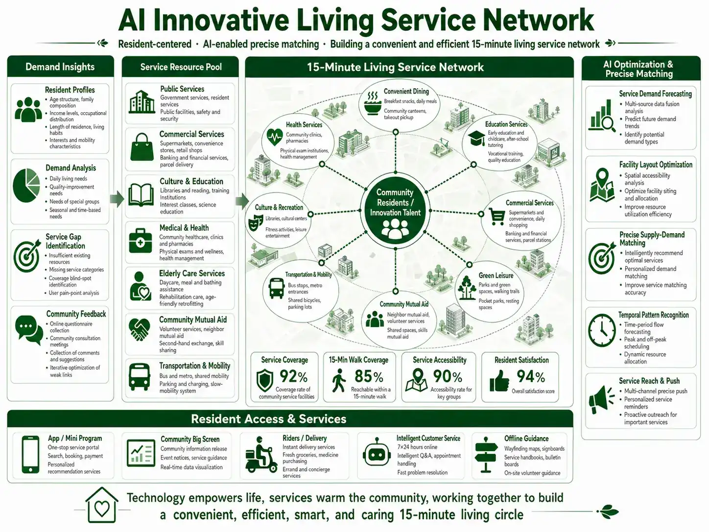
*AI Network for Innovative Life Services*
** Figure 5: AI Network for Innovative Living Services** - Agent, demand release, forum co-management and point incentives convert people and talent needs into real-time space operations and micro-upgrades, creating self-expanding service networks.

The Demand Dissemination and Forum is a synergistic portal that optimizes feedback: a single key to population needs, AI auto-matches space with operators, and a forum fosters transparent governance around assets.

#### 4.2.8 Corresponding to chapter III issues identified

|Chapter III core issues|Response to this strategy|
|---|---|
|AI IRR mismatches facility system|Acupuncture points, innovation boxes, and life services integrated into daily interactions|
|Ineffective reuse along dual-iron corridor|Align project with operator by upgrading asset-inventory cloud platform and boosting value of underutilised railway-corridor spaces|
|Conflict between complex transport and weak traffic management|Embed micro-spaces at bridge stations-waiting zones, cycling services, temporary offices-to improve transposition experience and activity continuity|
|Tension between heritage preservation and spatial renewal|Low-impact acupuncture interventions add mixed functions, enabling historic spaces to host contemporary services|

#### 4.2.9 General mapping of intelligent means

|urban design|Wisdom.|Output|
|---|---|---|
|Asset identification|Survey of space assets, tenure & planning database, heavy/light classification, rating model|Jing-Zhang gallery inefficient space map and asset detail cards|
|Asset discovery|Resource Square classification, map positioning, hotspots and case recommendations|List of space assets matching user needs|
|Project Match|AI Space matching engine, gain measurement, concession audit|Operational proposals and time-use agreements|
|Operational requirements|Fast "I'll run" application, online clearance, rapid consultation|Operations tied to property rights|
|Two-way Match|Project requirement release, forum discussion, policy queries|Dynamic demand-supply brokering|
|Microupdate Management|Demand crowdsourcing, heat sequencing, proposal publicity, implementation tracking|Annual acupuncture update bank and implementation list|
|Space operations|Scheduling shared platforms, monitoring flow, energy use, security alerts|Efficient, safe operation of underutilised spaces|
|Community governance|Community image, activity matching, record-setting, point incentives|Self-organized innovative networks|

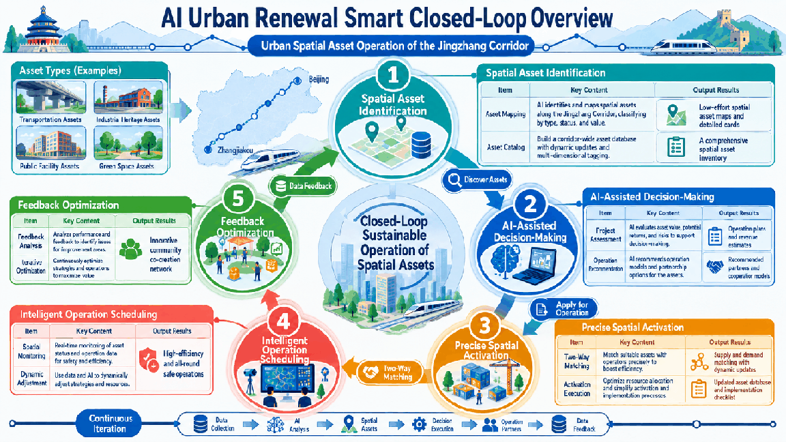
*AI Inventory Asset Updates Cloud Intelligence Closed Ring General Mapping*

** Figure 6: AI Stock Assets Updates the Cloud Intelligence Closed Ring General Map** - From asset identification, AI decision support, precise activation, smart operation to feedback optimization, forming a continuous "data-calculations-space-operate-work-take" cycle for urban assets.

#### 4.2.10 Interface with other responses

- **With 4.1 continuous spectra policy**: Innovation boxes and community spaces act as service spectrum endpoints, offering flexible incubation, acceleration, and outcome-transformation extensions;
- **With the 4.3 menu for the smart-line strategy**: Acupuncture micro-upgrades and sub-bridge spaces serve as active mobility stations, ride-service hubs, and waiting areas;
- **With 4.4 soft resilience calculation strategy**: Overlapping inefficient-space use with open-source walkways raises urban redundancy and emergency response capacity;
  - ** Harmonized with the Articular Extension Development Strategy**: integrate industrial retrofitting spaces into inventory-update cloud platforms, letting historic spaces convey cultural narratives while delivering innovative services.

#### 4.2.11 Evaluation indicators

  - (b) Inefficient spatial asset survey coverage and incomplete asset detail cards;
  - Accuracy of online assets count in Resource Square and heavy/light classification;
  - Number and implementation rate of acupuncture micronodes;
  - Number of items used for functional mixing and time-use;
  - (b) Number of operators registered on inventory-update cloud, plus matching and conversion rates for "I am running" applications;
  - (a) Number of project need releases matched to supply-demand transactions;
  - Active user and residential/brainer participation in the Forum;
  - Length and reuse of innovation boxes/community spaces;
- (a) Life service coverage and 5 minutes availability;
  - (b) Asset return rate or rent growth after inefficient space operation;
  - Public survey scores on surrounding space satisfaction;
  - Average cycle of micro-update projects from demand submission to implementation.

#### 4.2.12 Design of boundaries
This conceptual strategy targets the urban design competition; tenure, planning conditions, fire and municipal capacity, and cost-benefit models for inefficient spaces require official data and pilot measurements.

#### Main references

1. The 100-year Jing-Zhang AI Innovation Belt Open Job Book for Smart Bodies summarises local clean-up rights.
2. 14 Inventory Renewal Clouds: Small Procedures for Urban Space Assets (2024.10) - updates cloud concepts for inventory assets "for space adaptation projects, space for projects" and outlines three-phase models for asset exploration, packaging, and dissemination.
3. China Institute for Urban Planning and Design: "Concept for integrating the park at the Jing-Zhang Railway Sites" [CCP], March 2020.
4. China Institute of Architectural and Design Research, Ltd.: "Draft Convergence Concept Program for Jing-Zhang Railway Site Parks", 2020.
5. `AI Map/map-three-layers.html ' and `AI map/osm-data.js: temporary OSM road, orbit, water and green-field data for design research and spatial relationship identification.

## Transport, track, municipalities and public services

The Jing-Zhang Site Park creates a North-South active-mobility ridge with orbital backbones; transport, connection and custom services form a travel menu. The main compute hub, Edge Node, and applications integrate energy, water safety, fire, communications, and utilities. Engineering line and capacity await professional review. [data: geometry/Roads.geojson#ROAD-001]

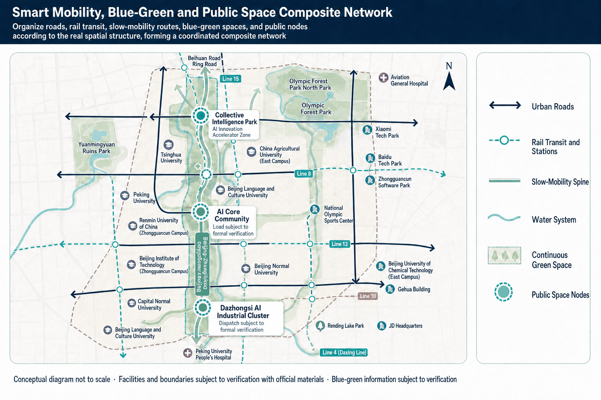
*Mapping 04 traffic, city, smart, and blue-green systems is required.*

#### 4.3 Menu-specific smart-line strategy * Response to "complex transport systems and management backwardness" (traffic track active migration, including active migration sutures and sub-bridge space activation, and response to "two irons with low utility")*

#### Transport trajectories active migration – making ridges mobile.

The Jing-Zhang Railway Site Park changed from an "east-west rail barrier" to a "north-south public ridge," based on a "three cores, multiple points" structure and a "Blue-Green Activity Complex," offering a reviewable road network, tracks, active mobility, parking, and external traffic proposals: an active ridge with blue-green, orbital backbone, AI mobility to enable people movement, near-site supply and testing.

#### 4.3.1 Transport propositions and strategies

#### 4.3.1.1 Thesis: ridges are first and foremost mobile systems

This proposal assumes the overall role of the "100-year Jing-Zhang AI Innovation Belt" - a world-class transport system delivering intellectual innovation, likened to brain-flow vessels, near-supply chassis, and experimental scenery. The Jing-Zhang Site Park, a green corridor, provides both longitudinal (North-South) and horizontal (West-East) mobility functions.[source]

Transport systems follow "** Governance before Technology Devices**": AI Primary Transport is a contribution-driven, tested, safety-focused system, each scenario ensuring **data minimization, interpretability, manual review, clear operators**; soft resilience reflects emergency and indicator robustness.

#### 4.3.1.2 Transport development strategy

|Policy|Content|Drop Point|
|---|---|---|
|Activate mobile priority|Jing-Zhang corridor dominated by walking and cycling; motor traffic yields to active modes|Main ridges, complex rings.|
|Public transport priority|Orbital and conventional buses form the backbone, ensuring preferential access|Orbital portal, transport corridor|
|TOD Integration|Site perimeter integrated conceptually, no pre-intensity|Qing Ha, Dazhongsi stations, 5 junctions, Qinghua East Road|
|Demand management|Encourage green travel via parking supply, time-sharing, restricted access|Parking partition, P+R, Maas|

Two transport subdivisions: **active mobility priority area** (Jing-Zhang Site Park, tri-nuclear public space; vehicle speed limits, traffic concessions) and **public transport priority area** (transport priority, access encrypted within 500 m of the orbital portal). **Boundary remains conceptual pending formal review.**

#### 4.3.2 Traffic skeletons and space structures

#### 4.3.2.1 Status of the Internet

The network uses a "ring line + vertical axis": three concentric north rings (three/four/five) with Kyuchi for rapid traffic; Central Guan Village St and College Roads carry major north-south flow; east road links east-south; Jing-Zhang corridor is a railway.

#### 4.3.2.2 Status of orbit

|Track|Relationships|Key Nodes|
|---|---|---|
|Line 13|Surrounding former Jing-Zhang line|West Naumen - Dazhongsi - Know - Chun Rd - Five mouths - Upland - Clean River|
|Line 4|Western north-south side serving schools and Central Guan Village|Central Kanamura - Great East Gate - People's University - Straight Gate West|
|Line 10|Ring line, functional transition|♪ I know the way ♪|
|Jing-Zhang high iron|Northern portal hub|Qinghu Station|
|16/12/15/ Chang Horizon|Complementary network, line pending|Qinghua East Luxi junction, etc.|

Lines and sites are conceptually defined; precise alignments, access points, transjects, and traffic follow OSM/Official Data Nucleus.

#### 4.3.2.3 Status of public transport, active mobility, parking and external traffic

  - **Public transport**: runs on major roads; poor connection to orbital stations; limited access and customized services.
  - **Active mobility**: Jing-Zhang ridges are continuous, yet few cross-street blocks and many walls limit a seamless, "wireless" network.
  - (a) **Parking**: dominated by parcel development; lacking P+R, time-sharing schemes, and adequate static/dynamic traffic links.
  - **External traffic**: the Qing River station is a high iron portal, but the `stop-city' integrated access to regional freight organizations needs to be strengthened.

#### 4.3.2.4 Status diagnosis

1. **Triple cutting**: three horizontal cuts in the northern three/four/five ring, based on select nodes for continuity;
2. **Site disjointed**: site isolated from industrial area by road, wall, poor "last kilometre" access
3. **Insufficient east-west suture**: few crossing points, many walls, weak campus/community links;
4. **Ridge free**: active ridge strong but feeder, micro-cycle and ridge network density insufficient;
5. **Achievability disparity**: 5/10/15 min availability, active-mobility breakpoints, public-service coverage gaps derived via Time-Space Analysis and Digital Sandboard "Model B. Innovation Interacting with Activity Mobility", linked to `geometry/Roads.geojson ', `geometry/public_space.geojson school cores.

#### 4.3.2.5 Network systems and faults

#### 4.3.2.5.1 Network hierarchy

|Level|Functions|Beneath road (concept)|Principle of treatment|
|---|---|---|---|
|Fast road.|Long-range motor transport, fully closed|North Three-Four-Five Ring, Beijing-Tibet Expressway|Prioritize Jing-Zhang gallery intersection for continuous cross-border access|
|Main road|Area traffic|Central Guan Village St, College Rd, Zhi Chun Rd|Bus priority, traffic diversion, optimal crossing|
|Secondary roads|Zone traffic, diverting main road|West Turk Rd, Cheng Dynasty Rd, Dazhongsi East Rd, Hu Chong Rd|Organisational micro-cycle linking active mobility and public transport|
|Secondary roads|Land access, active mobility, micro-cycle|Parks/intra-community roads (pending)|Encrypted feeder network; head break|

The core action is **encrypted feeder network and breakout circuit access** to densify feeders for active mobility and public transport.

#### 4.3.2.5.2 Road Fragments and Transport Organisation

  - **Urban road break**: implement motorized lanes, non-motorized lanes, sidewalks, and green belts on main/sub roads; provide continuous non-motorized lanes separated from traffic (conceptual).
- **Main ridge fractures**: Jing-Zhang corridor adopts composite fracture "Blue-green tops, active mobility centre, access side" (see 4.3.2.8);
  - **Crossroad**: at Dazhongsi, five junctions, Trans-Circumpolar Rd., propose vehicle separation, street-level mobility, optimized signal timing, without preset canalisation.
  - **Microcycle**: one-way, low-speed cycles integrated with feeder and campus circuits to curb cross-border traffic into activity cores.

#### 4.3.2.6 Public transport system

#### 4.3.2.6.1 Level 3 public transport

|Level|Carrier|Functions|
|---|---|---|
|Bone layer|Orbital (13/4/10/Jing-Zhang high iron, etc.)|High-capacity rapid link among three nuclei and beyond|
|General Layer|Regular + precision buses|Main/sub-drive coverage, priority-infrastructure concentration, good station access|
|Bridge|Bus access and custom public-transport services|Orbital portal last kilometre, trinuclear micro-cycle|

#### 4.3.2.6.2 Sites and hubs

  - **Clean river station**: integrated portal combining high-capacity rail, public transport and connections for external movement and trans-shipments.
  - **Dazhongsi station**: orbital hub with bus interchange and quadrant footpath to facilitate southern dispersion.
  - **Five junctions, Qinghua East Luxien Junk**: track, public transport and active-mobility hub serving university-side distribution.

The integrated perimeter active-mobility-industry development is conceptual, with no preset capacity or height, awaiting formal regulation.

#### 4.3.2.7 active mobility system

#### 4.3.2.7.1 Step system classification

  - **City level**: Jing-Zhang Main Ridge (North-South Tunnel, Chong River Station, West Straight Gate).
  - **Area level**: East-West suture links (cross-ring road, corridor, site quadrant).
  - **Community level**: micro-cycle feeders, public spaces, daily service travel.

#### 4.3.2.2 Bicycling systems and accessibility

  - **Main skeleton**: Jing-Zhang ridge cycling sidewalk (set apart from foot traffic).
  - **Sub-branch**: sutures and composite cycling tracks.
  - **Microcycle**: campus/community cycling lanes linking shared bike parking.
  - **Accessibility design objective (subject to professional review)**: establish a continuous accessible route across the spine, gateways, crossings and main public spaces. Compliance can only be confirmed after detailed design review, field measurement and testing with disabled and older users.

Continuous-route checklist:

| Link | Design objective | Pre-implementation verification and non-digital fallback |
| --- | --- | --- |
| Spine and feeders | Clear width, even non-slip surfaces, obstacle-free headroom and reachable rest points | Measure width, gradients, surfaces and obstacles; provide signed detours and staff assistance where deficient |
| Gateways and entrances | Step-free entrance or compliant ramp/lift connected to public transport | Verify level changes, door width, manoeuvring space and equipment uptime; keep a staffed offline entrance available |
| Crossings and transfers | Continuous kerb ramps, tactile guidance, audible/visual cues and safe waiting areas | Professionally review signal timing and multisensory cues; staff manage passage during emergencies |
| Main public spaces | Reachable accessible toilet, seating, drinking water and service desk | Joint professional and real-user testing before acceptance, with defects entering a correction and appeal loop |
| Information and participation | Alt text, captions/transcripts, easy-read content, keyboard operation and multisensory cues | Provide phone, paper and onsite booking, guidance, transport help and feedback; a smartphone is never the only channel |

All accessibility statements are design objectives, not claims of completed compliance. Detailed design, construction review, acceptance and operations require professional checks, real-user testing, onsite assistance, correction/appeal routes and emergency non-digital fallback. [standard:BARRIER-FREE-ENVIRONMENT-LAW]

#### 4.3.2.7.3 active mobility network indicators (geometrically recalculated)
Core recoverable indicators: **active mobility network density** (network length/land area), **active mobility coverage** (buffer area/land area), **active mobility breakpoints**, and **5/10/15 min active mobility connectivity**. Formula and calculator in 4.3.5; values computed after final boundary and road data.

#### 4.3.2.8 A strip of three cores multi-point composite rings

#### 4.3.2.1.1 Area (North-South main ridge)

Jing-Zhang Site Park, the main ridge, splits into three sections, each with an orbital portal:

|Paragraph|Area|Tie the portal|Lead activities|
|---|---|---|---|
|North|Zhongzhi Park North Four Circles|Clear River Portal|High iron to port, park commuting, river water.|
|Medium|North Four Rings - Community of Origin - Harun Road|Five mouths, Qinghua East Road Portal|Recent school events, open-source interaction, Little Moon River waters|
|South|Qui Chun Road-Dazhongsi-Si straightgate|Dazhongsi portal|Orbital dispersion, intelligent economy, trans-river water|

The main ridge is "Blue Green Up, Active Mobility Centre, Connected" (walking/riding/blue-green links) with width set to road's right. Its "Reconstructable Road" allows cycling to switch to foot or emergency traffic during large events.

#### 4.3.2.1.2 Three nuclear portals suture with east-west

Each becomes an "orbit-active mobility-industry" portal - Zhongzhi Park (open win-win, innovation), origin communities (youth advantage), Dazhongsi (ecological synergy) - with traffic supporting these roles. Priority actions stitch street continuity, site integration, and wall openings (three light-size measures) without building a bridge.

|Suture Node|Type|Main Actions|Dependency conditions|
|---|---|---|---|
|North 5-ring corridor.|Roundabout crossing.|Active mobility up/down (conceptual)|Red line road, traffic organization review|
|North Quadrilateral.|Roundabout crossing.|Ride and walk continuum, barrier-free|Road red line, subbridge space|
|Dazhongsi station quadrant|Site Integration|All right, we'll have a four-dimensional walk.|Orbital stations, intersections, municipal pipelines|
|Five mouths.|Site + Historical Memory|Jing-Zhang Railway Memory Node + Operation Mobile Suture|Sites, public spaces, security conditions|

Node forms (top-crossing, penetrating, underground) are conceptual and not feasibility commitments.

#### 4.3.2.83 Complex rings

The composite ring creates a closed traffic loop at three nuclear spots, anchored by the water system (Clean River, Light Moon River, Turnover River) and surrounding schools, gardens, and public spaces, forming active-mobility circuits to the Trinucle.

#### 4.3.2.9 Static traffic and parking

#### 4.3.2.9.1 Parking areas

  - **Core strict-control area** (Jing-Zhang Ridge & Tri-nuclear public space): public transport and active mobility dominate; parking is scarce, sharing encouraged.
  - **Peripheral zones** (zones and communities): primarily structured, with time-shared P+R.

#### 4.3.2.9.2 Parking organization

  - **P+R / rotation parking**: Qing River and Dazhongsi stations with P+R (conceptual) to channel traffic to orbit.
  - **Non-motorized vehicle parking**: centralized bays with lock switches between portal and public spaces, linking shared bikes without using main sidewalks.
  - **Time-sharing**: "global smart parking" concept linking static bays with dynamic traffic via data.

Parking size, layout and fees will follow official detailed plans and traffic data; no figures are provided.

#### 4.3.2.10 External transport and freight logistics

#### 4.3.2.10.1 External transport

Zing River station is a high-capacity iron portal regionally.

#### 4.3.2.1.2 Freight and logistics transport

  - **Freight route**: outer fast track and dedicated lane keep cargo away from core active-mobility area (conceptual).
  - **Unmanned distribution logistics**: ground drones deliver to end-point docks, creating a logistics flow independent of evacuation routes.
  - **Low-altitude logistics**: UAV routes and landing sites await airspace and safety approval; none are planned yet.

#### 4.3.4 New infrastructure and vehicle-infrestructure cooperation

New "almost-light" infrastructure services and regional "soft supply" recosting avoid heavy equipment piles.

  - **Roadside units and holograms**: edge compute, RSU, mm-wave radar, smart poles deployed on demand at portals and key intersections.
  - **Endside compute power and edge node**: paired with power station for low-latency transfer, active-mobility breakpoint detection and distribution coordination.
  - **Power exchange and undistributed parking**: portals and campuses provide charging, undocked docking and terminal storage.
- **digital twin base**: Support people flow and emergency response via cloud twins, reusing 4.4 water-saving "four-prevention system".

Equipment placement, power configurations and energy conditions are conceptual, requiring detailed study of utility, communications, municipal and security factors.

#### 4.3.5 Indicators Implementation Borders

#### 4.3.5.1 Demand forecasting and carrying (methodological framework)

Transport demand uses a four-stage (generation-distribution-distribution-distribution) model with peak-hour and network load assessment based on official population, employment and mobility data. The proposal provides only a methodology, not traffic or load values; professional teams will apply it after data completion.

#### 4.3.5.2 System of indicators (tier 3)

|Category|Indicators|Source/ caliber|
|---|---|---|
|Geometrically recalculated|Road network density, active mobility network density, active mobility coverage, orbital station 500 m coverage, 5/10/15 minutes availability|Recalculated using `roads.geojson ', `public_space.geojson coordinates and site|
|To be official/actually measured|Max traffic, network saturation, orbital passenger traffic, parking needs|Official traffic survey and detailed regulatory conditions|
|Performance calibration|Access accuracy, non-distribution floor rate, resilience transition time, dissensitisation clearance rate|Continuous operational data calibration|

The recalculation indicators: **road network density = road length / usage area (km/km²)**; **active mobility coverage = activity buffer / usage area**; **orbital site coverage = 500 m buffer / usage area**; **accessibility coverage at 5/10/15 min**. Overall visual indicators (`site_area_sqm ', `green_ratio, `public_space_ratio`) are integrated in the indicator layer.

#### Recent transport implementation projects

|Numbering|Item|Type|Mainly dependent|
|---|---|---|---|
|JT-01|Jing-Zhang Main Ridge Active Mobility Breakpoint|active mobility/public space|Road Red Line, Subbridge Space, Transport Organisation|
|JT-02|Dazhongsi station Quadrant foot connection|Orbital integration/active migration|Orbital stations, intersections, municipal pipelines|
|JT-03|The Qinghu station is being upgraded.|External traffic/access|Rail, rail, bus stations|
|JT-04|Secondary network encryption and microcycle|Network/active mobility|Title, regulatory detailed planning, status wall|
|JT-05|AI access and vehicle-infrestruction pilot|New capital/scenes|Energy, computational power, security, operator|

Short-term reversible pilots and governance agreements (mobility breakpoints, station links, secondary microcycles) upgrade public spaces and buildings medium-term, and inform long-term AI traffic service expansion.

#### Design boundaries

This proposal presents a concept for the urban design competition.

Official design scope, priority area boundaries, road redlines, orbital slots, access points, bridge and engineering conditions, traffic rates, municipal pipelines, fire protection, low-altitude airspace and drone routes, tenure and environmental impacts must be added before completing the deepening process.

#### Main references

1. The 100-year Jing-Zhang AI Innovation Belt Open Job Book for Smart Bodies summarizes local clean-up rights.
2. National standards: GB/T 51,328 Planning Standards for Integrated Urban Transport Systems, CJJ 37 Design Code for Urban Road Works, GB 50647 Design Code for Urban Road Traffic Facilities.
3. `AI Map/map-three-layers.html ' and `AI map/osm-data.js: temporary scope and OSM road, orbit, water system and green-field background data, for design research and spatial relationship identification only.

#### 4.4 Soft response strategy *World-class self-adaptation (1 bottom + 5 source)

#### 4.4 Soft resilience extrapolation strategy

As a response to Chapter IV, 4.4 defines softness as "world-class adaptive resilience" and outlines three core strategies-Zhongzhi Park, AI-origin community, Dazhongsi-recasting six elements (computational power + 5 sources: human, entrepreneurial, open-source, data, standards) around facility elasticity, energy-computational security, future-tech compatibility, and three AI-scenario urban operation layers to enable space-resistant, institutional, three-tier redevelopment.

#### 4.4.1 Strategy positioning: Softness is a world-class definition of essential innovation

Instead of viewing resilience as a single unit or pursuing "many cards and redundant lines", the strategy asserts **world-class AI core competitiveness that continuously generates ideas, businesses and standards amid volatile technology paradigms, supply chains, talent and capital cycles**.

This definition merges "soft response" and a "world-class approach": rather than intensifying the AI campus, it aims for **greater adaptive capacity**-shifting model paradigms (CNN → Transformer → next), withstanding external supply shocks, capital cycles, brain drain, and enabling ecological self-restructuring and regeneration.

In brief, **4.4 The answer is "how a world-class organization can continuously replace, restructure and regenerate amid technology, supply-chain, talent and capital upheavals", not "how many cards, redundant lines or machine-room square metres to build."** It shifts focus from "aircraft-level disaster preparedness" to "aircraft-level self-adaptability," using power as the source for talent, business, open source, data, standards, space and mechanisms.

Accordingly, the AI community of origin comprises **the elemental structure of the "One Bottom + 5 Source"** and **three tiers of resilience**:

- **Six elements (1 bottom + 5 source)**: **Computational power enables the bottom**, providing the primary infrastructure for the five source elements-talent, enterprise, open source, data, standards; the source element drives the innovation ecology, while the bottom element offers public support.
  - **Three-floor resilience**

1. **Element resilience (redundancy and supplantability)**: replacement or redundant sources are available for any element impact, eliminating single-point failure.
2. **Space resilience (disaster resistance and reconstructability)**: physical space is flood- and fire-resistant, scalable, reconstructable, with critical functions located away from vulnerable or isolated sites.
3. **System resilience (self-healing and voice rights)**: standards, rules, open-source governance and multi-intelligence collaboration are iterative, auditable, and globally exportable.

> **Core scenario: a "source of self-regeneration" - talent circulates in open-source publishing halls and joint research; businesses expand in factor-sharing courtyards; standards emerge in assessment and security labs and disperse globally; data flow in credible sandboxes is evenly distributed; on-demand community power serves the public, perceived as a health transition in resilience.**

#### Jing-Zhang Language: Rail corridor as resilience skeleton

The Jing-Zhang Railway Innovation Belt offers an irreplaceable **linear spatial skeleton** and **historical narrative anchor**. It links northern Haidian, the city centre and outer districts, and serves as a **serial innovation element that carries urban resilience and industrial memory**.

  - **Space skeleton**: Zhongzhi Park (North Five Rings/Clean River), AI Source Community (North Four Rings/North High School-Track-Intension Area), Dazhongsi (North Three Rings/Transverse River) along the Jing-Zhang corridor, forming the "**Extradition Training - Zhongzhi Park Total Logic & Validation - Source of Origin Elements & Standard Output - Zone Three Margins Response**" resilience chain.
  - **Element Channel**: Jing-Zhang rail, subway and peri-urban lines form a multi-modular channel for talent, materials, data and emergency response; during extremes, it provides trans-regional flow and backup for urban lifeline security.
  - **Water safety boundary**: Qing River, Moon River and trans-river systems intertwine with rail corridors, creating a spatial security boundary and an urban "four-prevention" water-security system.
  - **Activation of historical memory**: Jing-Zhang Railway's industrial heritage (orbit, bridge, station) is repurposed as open-source "resilience commons" and public art, enabling the historic space to support future innovation and prevent artistic fractures.

#### 4.4.2 Correspond to previous problem identification sections

This strategy directly addresses the prior "Identity identification" chapter, positioning the "Soft resilience strategy" as a verifiable response node. The three-tier network power layout (bottom-type element) answers the diagnosis in chapter 3.4 "Space layout and its security response" concerning computational power demand density, energy security, disaster risk, and network resilience.

|Chapter III core issues|Response to this strategy|Key space/wise carriers|
|---|---|---|
|AI Resource Pool mismatches facility system|Shared courtyard uniting talent, enterprise and open-source groups into a six-element ecology; a "one-stop access source ecology" platform shortens acquisition time|Talent/enterprise/open-source group, factor service hall, joint research office|
|Ineffective reuse of dual-iron corridor|Convert railway corridor and adjacent idle spaces into "resilience commons-open-source tracks-innovation service belts", turning the corridor into a factor link|Jing-Zhang corridor, sub-bridge space, pre-station space, public innovation ring|
|Conflict between complex transport systems and weak urban traffic management|Public innovation loops and secure transport links, intelligent multimodal travel to aid mobility; segregated data streams protect urban operations|Two circulation lines, active mobility system, data safety area|
|Centre space layout and security|Positions computational power as the "underground element" with "outside training - Zhongzhi Park full inference - origin near light at the edge - Dazhongsi" 3rd flexible network power layout; the origin community keeps near-light and validation workshops for alternative supply via close-light, area recalculation, and cross-scale movement|Level-III computational power network, end-to-end power station, Edge Node, model validation workshop|
|Conflict between heritage preservation and spatial renewal|Integrate Jing-Zhang Railway industrial memory into public art, spatial interface, and "open-source walk"; convert historic space into public innovation interface|Public art, resilience, open path|

#### 4.4.3 Three core strategies

The strategy situates "world-class adaptive capacity" within three implementable core approaches: flexible base-seat layout, synergy of energy-computing-power-city security, and future-technology compatibility, forming a "factor resilience-space-resilience-system remission."

#### Core policy one: flexible layout and redundant design of the base of the computational power (level 3 network)

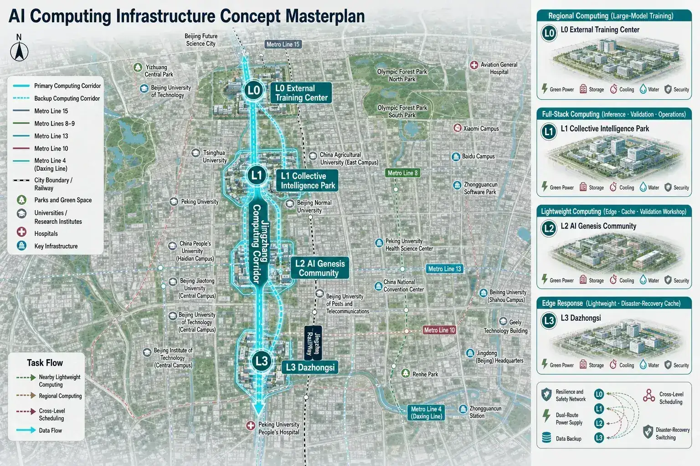
*General map of the infrastructure concept of the third level of the network*

The organization's base element is **"Exterior Training - Zhongzhi Park Full Logic - Origin near Light - Dazhongsi Edge" Level 3 Commutational Power Network**, allowing the power infrastructure to integrate within high-density zones without being its sole foundation.

|Level|Nodes|The role of general power|Flexible and redundant design|
|---|---|---|---|
|L0 External Training Centre|Energy and municipal peripherals|Large-model pre-training, long-duration energy-intensive tasks|High-energy missions placed outside dense zones, avoiding competition for water and electricity.|
|L1 Zhongzhi Park|North Five Ring / Cine River|Full reasoning, chip testing, modelling, security governance (computational power centre)|Recalculate, govern, and back-stop the source|
|L2 AI Community of Origin|North Four Circles High School - Interlocking Area|Lightweight, edge cache, validation workshop|Low-latency scene validation, task escalation to L1/L0|
|L3 Dazhongsi|North Triangular / Transverse|Lightweight edge node, fast southern response, disaster preparedness|Time-sensitive southern node serving as remote backup|

The three tiers interconnect via a high-speed computing network; any tier failure, flooding, power limit or demand surge can be scaled: tasks shift to Zhongzhi Park or outskirts, with low-delay verification at Edge Node in Dazhongsi. This "near-light + regional recalculation + cross-scale movement" makes the compute infrastructure redundant, forming a flexible innovation base.

#### Core Policy II: Energy - Computal Power - Coordinated Planning for Urban Safety

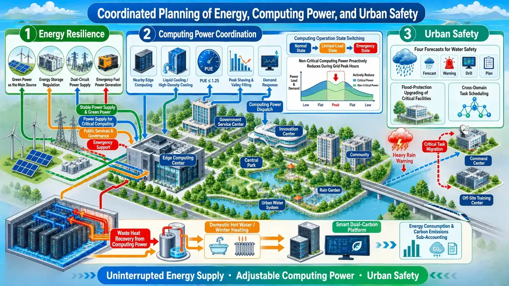
*Energy-computal power-cooperative planning for urban safety*

Energy supply, efficiency, and residual-heat use are primary constraints on energy access, power, and urban safety, not minor issues.

  - **Supply**: power group employs "green power + storage + bidirectional flow + emergency diesel generators" for multi-source supply, with governance independent of a single source and reserves for future density increases.
- **Energy efficiency**: Deploy liquid/high-density cooling for near-light computing centres targeting PUE ≤ 1.25; prioritize free and natural cooling to cut energy use and urban heat islands;
  - **Residual heat recovery (official co-design)**: excess computational heat supplies building and winter heating, integrated into the Smart-Carbon platform's energy-consumption accounting, partnering with stable users (communities, public buildings) to convert passive emissions into measurable low-carbon resources.
  - **Computational power-grid synergy**: compute load participates in peak shaving and demand response, acting as a controllable load during grid peaks or extreme weather to secure urban electricity.
  - **Urban Safety Co-operative**: Computational Power Group connects to the "four-prevention" water-safety system, pre-positioning tasks for flood alerts, ensuring flood-free Zhongzhi Park/peripheries, rapid access to restricted/emergency zones, and preventing civil power infrastructure from becoming vulnerable to flooding, fire, or electrical accidents.

As a concept, power capacity, PUE, residual-heat size and access will be demonstrated after official electricity and municipal data are available; shared halls can illustrate heat recovery direction, but no firm commitments are made for unimplemented residual-heat use.

#### Core Policy III: Releasing and Compatibility for Future Technological Evolution

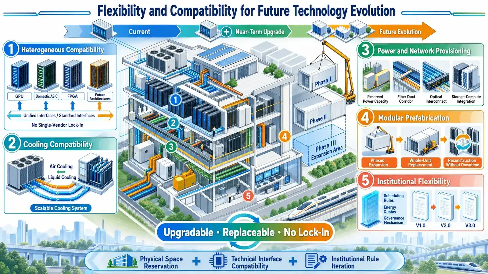
*Retention and compatibility for future technological evolution*

The strategy offers an "upgradable, fungible, unlocked" physical and institutional space:

  - **Isomer compatibility**: GPU, national ASIC, FPGA, and future architectures for power distribution, cabinets and networks, avoiding single-chip reliance.
  - **Refrigeration compatibility**: wind-cooling and liquid-cold switching for near-light compute centers, with extensible cooling systems.
  - **Electricity and network retention**: reserved power capacity and cable pathways for future density, preserving space for light interconnection, storage, etc.
  - **Modularized prefabricated**: modular power units and prefabricated buildings enabling phased expansion and complete replacement.
  - **System retention**: computational power flow rules, energy quotas, and governance versions to prevent premature lock-in of technology.

#### 4.4.7 General mapping of smart instruments: from "technology superseding" to "space feedback"

Here "intellectual" refers not to a post-design information system but to a **common production tool embedded in the urban design** across problem diagnosis, proposal generation and governance, aiming to **enable urban spaces to sense their status and continuously calibrate via data feedback**.

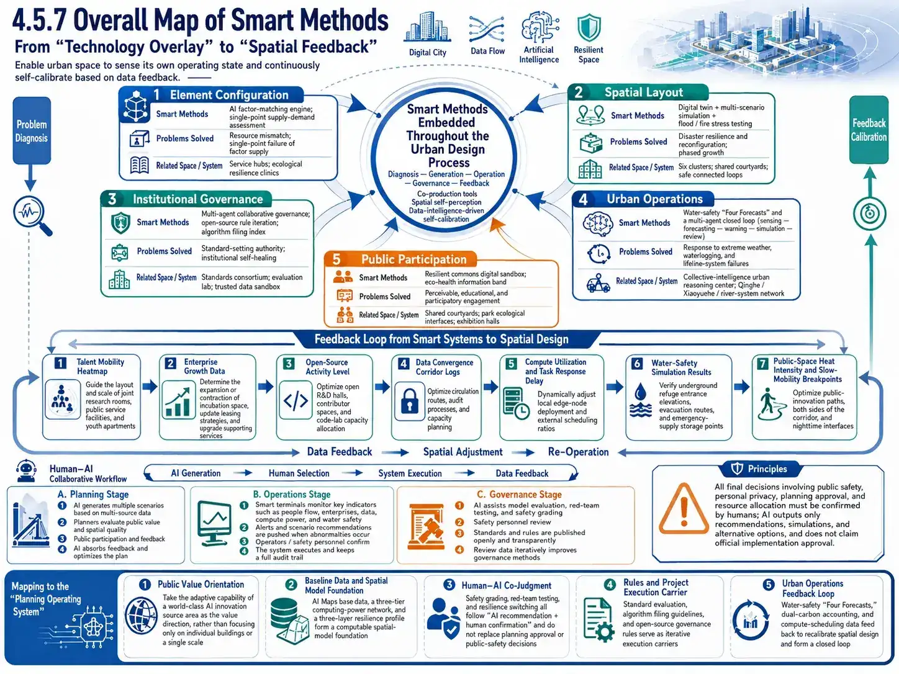
*A master map of intelligence tools*

#### A map of the smart tools and the urban design layer

|urban design|Wisdom.|Issues addressed|Counterpart space/system|
|---|---|---|---|
|Element Configuration|AI factor matching engine, single-point dependence assessment|Resource mismatch, single-point factor supply failure|Element service hall, ecoresilience clinic|
|Space Layout|Digital twin, multi-scenario simulation, flood/fire stress test|Resilient and re-engineered|Six groups, shared courtyards, security rings|
|Institutional governance|Multi-Intelligence Collaborative Governance, Open Source Overlay, Algorithmic Recording Guidance|Standard voice, institutional healing|Standard groups, assessment labs, credible data sandboxes|
|Urban operation|Water security "four-prevention system" with multi-intelligence closed loops (sension-predict-advance-predation-reverse)|Response to extreme weather, internal flooding, lifeline failures|Zhongzhi Park Urban Centre for Logic, Qinghe/Mount/Trans-river Network|
|Public participation|Resilience Digital Sandboard, Ecological Health Information Tape|Visible, educational, participatory|Sharing courtyards, park eco-interfaces, exhibition halls|

#### Intelligence system feedback loops on space design

Not only does the smart system serve operations, but its operational data also reverses space design:

  - **Thermal mobility of talent**
  - **Enterprise growth data** determine incubation space expansion/restriction, lease strategy updates and service package upgrades;
  - **Open source activity**
  - **Data compliance traffic log** Optimizing the zoning strategy, audit process and capacity planning for credible sandboxes;
  - **Communicational power utilization rate versus mission response** Dynamic adjustment of local edge node to external movement ratio;
  - **Water safety preview results**
  - **Public space thermal and active mobility breakpoint** Optimizing public innovation loop paths, seat shades and night interfaces.

#### People working together.
AI complements-not replaces-human judgment, merging professional experience with large-scale computing to create "**AI generation → people make choices → system implementation → data feedback → optimization**".

  - **Planning phase**: AI multi-scenario program generating multi-source data
  - **Operating phase**: continuous monitoring of intelligence systems for talent, enterprise, data, compute power and water safety indicators
  - **Governance phase**: AI aids model assessments, red-team tests, security-classification review of personnel standards, and phased transparent data release

> **Principle:** All final decisions on public safety, privacy, planning clearance, and resource allocation require confirmation; AI provides only recommendations, evolutions, and options, without implementation commitment.

#### Map with Planning Operating System

The strategy's smart instrument exemplifies the 1.3 "Planning operating system" at the resilience dimension:

  - **Public value orientation**: aim for "world-class adaptive capacity" over chamber size or compute power
  - **Floor and spatial model base**: AI map database, third-tier compute network, and three-layer resilience profile form the computing space base
  - **Joint HR judgment**: security classification, red-team testing, resilience switch "AI recommendation + confirmation"; not a substitute for planning approval or public-safety decisions
  - **Rules and project implementation vehicle**: standard assessments, algorithm filing guidelines, and open-source governance rules as iterative tools
  - **Urban run feedback loop**: water-security "four-prevention system", dual-carbon accounting, and compute-dispatch data correction to create closed loops

#### 4.4.8 Interface with other countermeasures: resilience nodes in the continuum
This strategy is not an isolated "computational powerline" island but a key node in Chapter IV, "Discovery of the response", interacting mutually.

- **With 4.1 Continuous spectra policy**: AI Origin Community serves as the resource pole on the Jing-Zhang Railway innovation belt "Innovation Service Spectra", creating continuous bands along the corridor and incubation, enterprise acceleration, and outcome transformation nodes, avoiding single-point convergence.
- **With 4.2 fine activation of camp city strategy**: "Ecoreresilience Clinic" and "Team of Talents" in origin communities provide diagnostic tools, talent support, and scene-validation platforms for low-impact upgrades of surrounding and historic buildings.
- **With 4.3 menus for the smart-line strategy**: double-barrier lanes and smart travel systems enable talent to cross-node Zhongzhi Park, origin communities and Dazhongsi; public innovation ring and security links aim for "quick arrival, slow communication".
- **Initiative development strategy with 4.5.**: Jing-Zhang Railway's industrial heritage becomes an "open-source trajectories" "resilience communal" public-art vehicle, blending historic linear space with future innovation networks.

> Through this interface, the soft-resilience calculation expands "intellectual means" from a single technology to a holistic approach spanning urban landscape, operational governance, and public participation, echoing Chapter IV, "Measuring urban problems with wisdom in smart cities".

#### Four interface exits: from scene to application

The strategy concludes with four applications in chapter 5:

  - **Planning approval**: resilience profile, flood-resistant high-mark, and third-stage compute network layout as reviewable, comparable options
  - **Investment decision**: redundancy, energy security, and single-point dependency assessment of the project base to inform prioritization and benefit-risk judgments
  - **Urban operations**: water-security "four-prevention systems", dual-carbon platform, and coordinated communal power-energy integration for monitoring and emergency response
  - **Public life**: resilient digital sandpads, eco-health info tapes, dual-carbon public screens, turning environmental innovation into daily experience

#### 4.4.9 Evaluation indicators

  - (b) Talent mobility and return rates
  - (b) Enterprise lifecycle-birth, growth, safe exit-and single-point dependence
  - Open-source community activity and hosting redundancy for code/models
  - Number and audit completeness of credible data compliance
  - Number of releases and external adoption of standards, assessments, and governance methods
  - Time for scientific teams and enterprises to acquire factor services
  - Local lightweight validation mission response times
  - (b) Length of first-level open interface and public-space usage
  - (a) Element redundancy as alternative to success and cross-node takeover
  - Key data and flood-risk exposure for governance functions
- Lead time for internal-flood early warning;
- Error in predicted water levels and inundation extent;
- Completeness and timeliness of generated risk lists;
  - Inundation preview coverage and update frequency
  - Early fire detection, breakdown isolation, and emergency transition times
  - Continuous public-service availability during failures
  - Public display of data desensitization and manual clearance completion rate
  - Annual carbon remittances per unit area of central park (tons of CO2/ha per year);
  - (a) Park belt contribution to hot-island mitigation (surface-temperature reduction)
  - (b) Rainwater wetlands and annual rainfall recharge and runoff factors
- Real-time compliance rates for environmental indicators like negative ion, PM2.5 and noise;
  - (a) Mobile travel sharing activity and carbon-reduction behavior
  - Online monitoring coverage of Centre and campus energy consumption
  - Error rate between carbon accounting results and third-party verification of the dual-carbon platform
- 1.5 rate of indicator achievement for model lifestyle areas.

** With chapter III 3.4: The evaluation indicator directly addresses the diagnosis in chapter III 3.4 - "The space layout of the extrapolation centre and its safety" -

- **Computational power demand density**: "Elemental redundancy replacement success rate" for "local light-calculated validation mission response time lags", supported by a layered Level 3 network;
  - **Energy security**: energy-compute synergy indicators for two-way coverage, long storage, emergency firewood availability, and PUE compliance rate
  - **DRR exposure**: Mirrors "Key data and flood-risk exposure for governance functions", enacted by elevating critical layers and inundating subdistricts
  - **Network response**: Aligns with "Current takeover success rate" for missions with node failure, implemented via high-speed interconnections and triple-state switching

#### 4.4.10 Design of boundaries
This strategy is a conceptual program for the urban design competition. The site plots, work units, six-group spatial structure and proportions are design conditions, not approved site-selection, land-use, scale or engineering conclusions.

Data must include total surface, building size, energy consumption, drawings, and simulation indicators.

#### Main references

1. The 100-year Jing-Zhang AI Innovation Belt Open Job Book for Smart Bodies provides a local summary of clean-up rights.
2. Beijing City Bureau for Economics and Informatization & Communications Authority: Implementation Programme for Construction of Infrastructure in Beijing City Commutational Power (2024-2027). [https://jxj.beijing.gov.cn/zwgk/2024zcwj/202406/t20240621_372303.html] (https://jxj.beijing.gov.cn/zwgk/2024zwj/2024400621_372303.html)]
3. Departments including the National Development Reform Commission: Specialized Action Plan for Green Low-Carbon Development in Data Centres. [https://www.ndrc.gov.cn/xwdt/tzgg/202407/t2020723_1391895_ext.html] (https://www.ndrc.gov.cn/xwdt/tzgg/2024077/t200723_13918995_ext.html)]
4. `AI Map/map-three-layers.html ' and `AI map/osm-data.js: temporary scope covering OSM road, orbit, water system and green-field background data, for design research and spatial relationship identification only.

## Blue green space, public space and urban style

The old Jing-Zhang Railway, Ching River, Light Moon River and adjacent open spaces form a patrilogy-ecological-public life network sustaining railway memory through historic remembrance, innovative sharing, and park ecology. Greenfield-public space ratios derive from design models and will be uniformly recalculated after official borders are released. [depth: blue_green_public_space] [data:geometry/green_space.geojson#GREEN-001]

#### 4.5 Articular continuity development strategy *Jing-Zhang Railway Industrial Heritage activation (cultural roots — cultural evolution — cultural regeneration; linear parks and cultural troupe — retrofitting — digital reproduction)*

#### 4.5 AI+ Sequence of Renaissance

Leveraging the Jing-Zhang Railway's industrial heritage as a cultural chassis, the three-tier "Cultural Roots-Evolution-Renewal" strategy creates a sensory, participatory, iterative historical narrative, converting railway memory from spatial fragmentation to innovative cohesion.

#### 4.5 Articular Continuing Development Strategy

#### 4.5.1 Strategy positioning: the artery is a soft operating system with an innovative belt

The Jing-Zhang Railway, China's first state-owned line built independently, embodies "self-reliance, boldness, excellence" and links the AI era's innovative demands with the historic "railway age" across its nine-kilometre innovation corridor, serving as both industrial heritage archive and bridge to the smart age.

Instead of a separate "cultural city scene", the strategy treats art as **a soft operating system spanning 4.1-4.4**: it avoids dominant space competition, enhancing belonging, recognizability and global diffusion of innovation via historic narratives, site identity and public participation. In short, **4.5 The answer is "What makes this innovation remember and want to stay" rather than "how big a cultural park is to be built".**

#### 4.5.2 Space structure: one axis, three belts, five curtains, multiple nodes

Using the old Jing-Zhang Railway as a skeletal frame, the north-south **cultural narrative axis** hosts three functional bands, five thematic curtains, and multiple accessible nodes, creating a 9 km continuous cultural experience corridor.

#### Axis I: Jing-Zhang Railway Cultural Axis

The maintenance of cultural axis continuity by retaining/rehabilitating old rail lines, ground markings, gravel belts, steel tracks and walkways, linking West Straight Gate, the five mouths, Qinghua Garden, Zing Chun Road and Qing River.

#### Three.

  - **Historical monuments**: museum communities, station sites, transmitters, oral memories, memorial squares emphasizing authenticity, readability and education;
  - **Innovative sharing belts**: open-source tracks, orbital theatres, creative gardens, research classes, business outlets linking higher education, enterprises and communities to turn cultural spaces into innovation generators;
  - **Park Ecoregion**: green-water systems-including rain gardens, wetlands, eco-forest belts-to align cultural narratives with sponge-city goals and biodiversity.

#### Five.

|Scene|Theme|Space down.|Core intent|
|---|---|---|---|
|Act one: Westgate leaves.|Jing-Zhang Beginnings Old City Portal|West Naumen station, welding station.|Industrial Residues + Old City Update|
|Act II: Five words of memory|mouth culture - international interaction|Five straight-track memories, 13-line|Dowmouth Square + 3D Garden|
|Act 3: Qinghua Park Dialogue|Centenary Station Science Dialogue|Qinghua Park (1910/1960)|Museum community + scene restoration|
|Act IV: The transformation of the known spring road|urban renewal|In 1960, rewired monuments and old-line gardens|Old Line Garden + Innovation Block|
|Act Five: The New Qinghu.|The Iron Age. The Future Ecology.|Qinghu station, Jing-Zhang high-terrain/entry section|Wetland + Smart ecology|

#### Multinodes
Sound museum, orbital theatre, written garden, research class, railway-theme park and AR history points lie between the five curtains, creating a 'great narrative + small surprise' rhythm that ties the main axis to an active mobility network.

#### 4.5.3 Spatial implementation of trilayers

Convert abstract arteries into three operational tiers-protective, reflective, regeneration-mirroring heritage background, narrative experience and contemporary functions.

  - **Cultural roots: Identification and static protection**: classify heritage elements (stationary, orbital, bridge, entrance, signal, industrial); maintain first-level protected sites, adapt second-level, display third-level via ground marking, local restoration, digital archives.

  - **Cultural performance: narrative and scene re-emergence**: use time-stacking (e.g., Qinghua Park's "three stops"), sound museum, symbolic fonts, AR/VR and night-vision devices to convey history in contemporary language.

  - **Cultural regeneration: rejuvenation and participatory renewal**: enable historic spaces to host open-source dialogue, business road shows, community events, research education and cultural incubation. Key vectors include a museum community at Qinghua Park station, open-source tracks linking academia and residents, orbital theatres with industrial shelving, school study classes, and community-designed memory gardens.

#### 4.5.4 Core strategy I: Railway heritage linear parks and cultural paths

Employ the old Jing-Zhang Railway as a north-south skeletal spine for a hierarchical, continuous cultural park and active mobility walkway that protects heritage while supporting commuting, interaction and community activity.

#### Three modes of expression for the skeleton.

Based on the railway's existing condition and surrounding city functions, we apply a differentiated spatial strategy to avoid one-size-fits-all replication:

  - **Retention of original line**: maintain orbits, wood/concrete pillow tracks and ramps at key sites (Qinghua Park station, five junctions) to create tactile rail-memory bands; add green benches on both sides to modulate peak foot traffic.
  - **Symbolic hint**: preserve visual axis continuity with "indicated old lines" via copper ground signs, steel-tracked garden roads, gravel belts, pillow-track preparations at entrances, crossroads or building interfaces.
- **Vertical Extension**: Where ground expression isn't possible-e.g., beneath the 13th high-mounted bridge and Jing-Zhang high-mounted section-the axis memory extends into air and night via bridge-side rail symbols, acoustic devices, photo projection, and vertical greening.

#### Cultural troupe hierarchy

|Step Level|Width|Functional positioning|Typical Battery|
|---|---|---|---|
|The main walk.|4-6 m|North-South access for walking, running, barrier-free and small activities|Centre 2 m water-penetrating + side 1 m gravel/column belt + walk tree|
|Steppath|2-3 m|Links the main walk to surrounding communities, colleges, innovation nodes|Brick-through water + rail-theme ground marking + low-level lighting|
|Explore Path|1.2-1.8 m|Accesses specific sites, sub-bridge spaces or ecological nodes|Wood plume/crush path + information column + touch guide|

#### Narrative Information Carrier System
A multi-scale, multi-sensor narrative system along the walkway turns walking into a historical reading experience:

- (a) **Information column and explanation card**: install steel columns at key historic points (e.g., 1909 drive-through ceremony, 1912 Sun Zhongshan inspection, 1949 "Arrival in Kyoto" column) showing text, 2D code, photographs and drawings;
  - **Ground-based marking system**: abstract human-font lines, Suzhou code, station names, pillow tracks and textures, balancing cultural expression and accessibility.
  - **Sound device**: install direct sound sources at junction memory squares and station fronts to broadcast historic scenes (old motorbikes, telegraphs, radio).
  - **Public art intervention**: commission artists to craft installations from steel tracks, pillows, transients and signal lights, producing a 'big narrative + small surprise' rhythm.

#### Smart Step Narrative System
Installation of NFC/Bluetooth beacons and 2D codes in information columns, nodes and entrances to sites, and construction of an iterative digital narrative network:

  - ** Triggered speech**: visitors can trigger multilingual speech, old photo comparison, AR ground markings and 3D components decomposed;
  - **Themes guide**: offer thematic routes (Professional History, Patriotic Education, AI Innovation) with system-suggested times and paths based on real-time flow and capacity.
  - **Heat-driven content optimization**: continuously adjust node density, talk length and activities to prevent congestion, using anonymous walk-thermal data.
  - **Accessibility services**: voice navigation, tactile marks for the visually impaired; sign-language video and text guides for the hearing impaired.

#### Activity planning and day-to-day operations

  - **Day-to-day functions**: commuter mobility, exercise, parent-child walks, lunch breaks.
  - **Weekend function**: railway theme fairs, research classes, business flash announcements, community cultural festivals.
- **Feleration function**: 100-year Jing-Zhang light show, railway music festival, cultural-heritage day event.

This strategy directly addresses Chapter III, "Contradiction between Historical-culture Protection and Space Renewal", transforming the railway corridor from "City Clan" to "Cultural Cohesion Belt".

#### 4.5.5 Core strategy II: Industrial memory transformed into a cultural space for innovation

Applying minimal, reversible intervention to activate industrial heritage and railway structures generates innovation and community life. Transformation aims not at "museumization" but at enabling historic spaces to host open-source dialogue, business road shows, community activities and research education-linking "old industry - new intellectuals."

#### Principles for adaptation and space strategy

  - **Minimal intervention**: prioritize preserving existing structures, surfaces, roofs and industrial elements; add temporary, disassemblable, reversible facilities.
  - **Function complex**: a memory space supports multiple uses-exhibitions, performances, fairs, conferences, education-rather than a single function.
  - **Old and new dialogues**: combine new materials (glass, light steel, perforated aluminium) with old (red brick, concrete, steel racks) to create clear colour, quality and structural contrasts.
  - **Security priority**: complete structural, fire, municipal capacity and accessibility assessments before modifications; establish dynamic monitoring records.

#### Surplus type and reuse direction

|Residual type|Space characteristics|Reuse direction|Load function|
|---|---|---|---|
|Station sites (Old Station, Qinghua Park, 1960,…)|Brick structures, sloped roofs, large open areas|Post-renovation implants, acoustic experience, community meetings|Railway Museum, Sound Museum, Tea Club|
|Industrial emboss/long-door hanging (weld tracks…)|Large steel structure, high volume|Retain with light and temporary art|Orbital theatres, weekend fairs, fashion shows|
|Orbit and mouth facilities|Linear elements, strong memory|Partial rehab, public art plus children's activities|Railroad-theme parent garden, Dojo memory garden, signal-machine witness point|
|Old line ground and subbridge space|Long gray area, complex tenure|Landscape & time use|Old Line Gardens, Under-bridge Parks, temporary exhibitions, flash shows|

#### Functional implants and scene planning

  - **Innovative launch scene**: debut new business products, open-source road shows, scientific conversion events on stage, orbital theatres showcasing industry as "hard technology."
  - **Community living scenes**: community kitchens, shared meeting rooms, elder activity centres, youth-designed classrooms to reintegrate heritage space into daily life.
  - **Cultural consumption scene**: install railway bookstores, creative retail, fine coffee, fast-flash halls, forming low-density, high-resolution cultural consumption belts.
  - **Educational scene of R&D**: joint primary/secondary schools, colleges and museums offering courses in railway engineering, industrial heritage, AI innovation, etc.

#### Wisdom Operations and Time Sharing
Deploy lightweight human-flow monitoring, environmental sensors and energy measures for open storage, and reuse exhibitions, fairs, road shows and community meetings via shared platform appointments:

  - **Time allocation**: weekdays focus on industrial services, research and education; evenings and weekends on cultural consumption and community activities.
  - **Appointment and dynamic pricing**: set appointment rules by space size, facility setup and time demand; offer free or low-cost pro-bono slots, charge commercial hours at market rates.
  - **Security early warning**: real-time monitoring of flow density, structural vibrations, humidity and fire systems; auto-alert on extreme values and dispatch field managers.

#### Toggleable digital display interface
Modular digital screens, projection interfaces and removable display walls in stations and booths enable rapid content changes per event:

  - **Historical archive model**: exhibit old photographs, engineering drawings and oral histories.
  - **Business results model**: showcase cutting-edge technologies and products from integrated university teams.
  - **Community Story Model**: resident-presented memory images, creative content and event photos.
  - **Art stand-by model**: support artists, curators, rapid discovery and evacuation.

#### 4.5.6 Core strategy III: Digitalization of historical scenarios and public participation
Intelligently lowers the historical-understanding threshold, turning the public from "watcher" to "co-founder." Builds a sustainable Jing-Zhang cultural knowledge graph via digital twin, AR/VR scenarios, oral-history collection, and public participation.

#### Jing-Zhang Cultural digital twin platform

Uses three-dimensional laser scanning and tilt photography of heritage structures to create a BIM/CIM-class digital archive, forming a searchable, comparable, updated Jing-Zhang cultural digital twin.

  - **Data layer**: integrates multi-source data-historical maps, photos, engineering drawings, monitoring data, oral-history video, product information.
- **Model layer**: build 3D models of heritage assets, historic landscapes and surrounding contexts; publish historical states only after verification against authoritative records;
  - **Knowledge graph layer**: builds a Jing-Zhang Railway knowledge graph for semantic search and node-based recommendations (person, event, location, technology, object).
  - **Open interface layer**: defines open standards for museums, education platforms, developers, urban-governance APIs, encouraging secondary development and cross-domain applications.

#### AR/VR Historical scene
Establish AR/VR experience points at key nodes (Qinghua Park Station, Five Mouths, West Naumen, Harun Road) to immerse users in historical events.

  - **Core scene list**:
- In 1909, the Jing-Zhang Railway ceremony and the "human-shaped" line occurred instantly;
- 1912 visit to Jing-Zhang Railway at Sun Zhongshan;
- In 1949, the Qinghua Park entrance exam was specially scheduled;
- In 1960, the railway line shifted and Qinghua Park station moved;
- Railway-facility transition points verified against authoritative historical records;
  - ** Trigger method**: mobile phone scanning station floors, site base sites or specific public art, allowing the superseding of historical images and 3D restoration; entry of immersed cars and sites through VR head-on in museums;
  - **Content production pipeline**: AI narrative engine generates scripts, spectroscopy, and multilingual interpretation from archives, followed by manual review for accuracy.
  - **Intergenerational interaction**: Adolescents add digital notes via AR to elders' historical scenes, creating family memory books.

#### Sound and oral history files
Collects historic car sounds, telegraphs, station broadcasts, bells, and oral histories into an audio archive and community memory bank.

  - **Collection process**: sets fixed collection points in communities, museums, schools; holds regular "sound collection days" and "old objects story fairs."
  - **Soundscape design**: edits collected audio into directional soundscapes by space and historical period for playback in sound museums and walking nodes.
  - **Privacy and authorization**: requires signed consent outlining usage scope; public broadcast content is desensitized and censored.

#### Public participation and co-creation mechanisms
Provides open access to historic photos, stories, and creative content, enabling deep public involvement in planning memory gardens, public art, and events.

  - **Memory pick-up kiosks**: small audio/video stations in gardens and in front of the railway where residents share personal and Jing-Zhang Railway stories.
  - **Co-planting and co-design**: engages residents in plant selection, minor naming, layout design, and embedding community memory in memory gardens.
  - **Programme announcements and voting**: publishes site renovation, public art, campaign proposals online for comments, praise, and voting.
  - **Digital message wall**: displays reviewed historic photos and stories on public screens or online, searchable by time, location, theme.
  - **Intergenerational activities**: railway veterans share work experiences; youth use digital tools to help elders create family memory books, closing the oral-history loop.

#### Jing-Zhang IP & SKK
Develops creative products and digital collections using historic symbols (human-font lines, Suzhou code, station signs, pillow tracks) and sets sustainable operating mechanisms.

  - **IP system**: creates main and sub-brands of "Jing-Zhang Railway" (memory, intellectual, youth, etc.) and harmonizes visual identity and licensing standards.
  - **Product development**: produces stationery, clothing, blind boxes, digital collections, AR postcards, railway-theme meals, etc.
  - Incentives against nursing: allocates creative income to community renewal, heritage maintenance, and public education, forming a virtuous "cultural value-economic gain-protective input" cycle.

#### 4.5.8 Corresponding to chapter III issues

|Chapter III core issues|Response to this strategy|
|---|---|
|Contradiction between preservation and spatial renewal|Replace single-museum model with "linear park + memory retrofit + digital reproduction" to enable protected sites for active mobility, innovation and community use|
|Ineffective reuse along dual-iron corridor|Convert old railway lines and underused spaces into cultural troupes and public activity belts, boosting spatial value on both sides|
|AI IRR misaligned with facility system|Pair cultural troupes with industrial relics as low-cost, high-identity innovations to strengthen talent belonging|
|Conflict between complex transport and poor traffic management|Convert old rail line to active mobility corridor, complementing intelligent travel system for short-range travel and leisure|

#### 4.5.9 General mapping of intelligent means

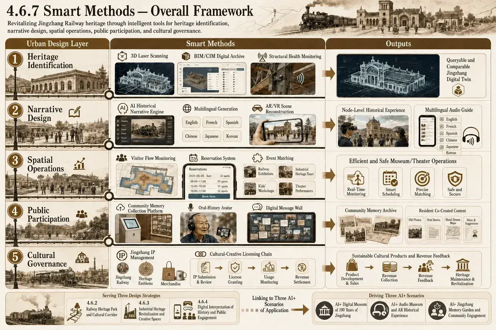
*A master map of intelligence tools*

|urban design|Wisdom.|Output|
|---|---|---|
|Heritage recognition|3D laser scan + BIM/CIM digital archive + structural health monitoring|Queryable, contrastable Jing-Zhang culture digital twin|
|Narrative Design|AI historical narrative engine, multilingual generation, AR/VR scene reconstruction|Node historical scene experience, multilingual orientation|
|Space operations|Flow monitoring, reservation system, activity matching|Efficient and safe operation of museums and theatres|
|Public participation|Community Memory Collection Platform, Oral History Package, Digital Message Wall|Community memory bank, community creation.|
|Cultural governance|Jing-Zhang IP management and authorisation chain|Sustainablely operated creative products and revenue-resilient feeding mechanisms|

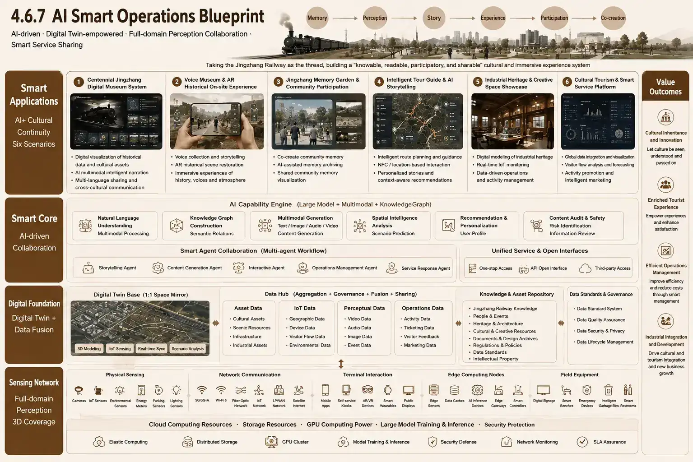
*Technical*

**Technology map**: 4.5 The intellectual artery is a four-tier ring: Sensor-platform-Application-Governance. Sensors (three-dimensional laser, IoT, health monitoring) digitize the heritage base for the Jing-Zhang digital twin; the platform uses BIM/CIM, AI narrative and multilingual tools to create an interactive knowledge graph; applications deliver dynamic feedback from tourists, citizens and residents to digital museums, AR/VR sites, sound museums and memory gardens; governance ensures sustainable operation and public participation via flow monitoring, booking, IP licensing and revenue-back mechanisms.

#### 4.5.10 Interface with other responses

- **With 4.1 continuous spectra policy**: cultural walkways and linear parks serve as public interfaces for innovative services, offering cultural anchor points for incubation, acceleration and conversion nodes along routes;
- **With 4.2 fine-activation camp strategy**: industrial retrofits and community memory gardens deliver low-cost, high-emotional spaces;
- **With the 4.3 menu-specific smart-line strategy**: an active-mobility gallery converting the old rail line complements the intelligent travel system for short-distance commute and leisure;
- **With the "resilience public" "open-source walk" in 4.4, the cultural narrative of 4.5 can be superseded, enabling resilient space to hold historic memory and innovation**

#### 4.5.11 Evaluation indicators

  - The old rail line functions as an active migration corridor.
  - Number of industrial retrofit utilization and activation projects.
  - Coverage of heritage-element digital archive.
  - Annual number of visits and study teams.
  - Count of AR/VR sites and sound files.
  - Number and participation rate of community memory collection entries.
  - Ratio of Jing-Zhang creative products to income rate for nursing communities.
  - Public perception and identification survey scores for "Jing-Zhang art."
  - Use of multilingual guides for international visitors.

#### 4.5.12 Design of boundaries
This conceptual strategy serves the urban design competition, not a stand-alone proposal; the railway alignment, residual protection level, adaptation method, and digital content must follow official security assessments, tenure verification, community participation, and regulatory conditions.

#### Main references

1. The 100-year Jing-Zhang AI Innovation Belt Open Job Book for Smart Bodies summarizes local clean-up rights.
2. China Institute for Urban Planning and Design: "The concept of a proposal for the integration of the park at the Jing-Zhang Railway Sites" [CCP], March 2020.
3. China Institute of Architectural and Design Research, Ltd.: "A draft of the Convergence Concept Program for Jing-Zhang Railway Site Parks", 2020.
4. `AI Map/map-three-layers.html ' and `AI map/osm-data.js: temporary scope and OSM road, orbit, water system and green field background data, only for design research and space relationship identification.

## Update project lists, implementation policies and phased plans

Implementation level serves as export value for planning, approval, investment decisions, urban operations, and public life. Immediate priority: reversible pilot, assessed and expanded via public feedback; medium-term expansion; long-term deepening after detailed planning, tenure, capacity, and investment mechanisms are clarified. Concept does not imply government commitment, approval, or investment. [depth:renewal_project_list] [depth:phasing_implementation] [data:geometry/phasing.geojson#PHASE-001]

### Chapter V - Landing of applications - How does planning produce value?

#### 5 Application landing: from outcome to scene

Planning outcomes are translated into four integrated interfaces for approvals, investment decisions, urban operations and public life. Public-platform practices are used only as methodological references, not as implementation commitments.

#### 5.0 General: Planning for the export of four values at the executive level of the operating system

The floor addresses the final query of the six-layer logic -**how planning creates value**. Planned results feed four operational, iterative interfaces.

|Module|Interface|Core contradiction|Main clients|Anchorage|
|5.1 Planning and approval|AI-aided planning and compliance interface|Stabilization of dynamic results by statutes|Sector, design unit, evaluation expert|Beijing Multi-System Coordination Platform monitors information|
|5.2 Investment decisions|Urban-renewal decision interface|Limited authority and unclear accounts|Implementation body, fiscal departments, social capital|Public data-service practices|
|5.3 Urban operations|Resilient urban-operation interface|Traffic, energy and extreme-event safety|Operation centres, operators, communities|Public urban-operation practices|
|5.4 Public life|Resident and visitor experience interface|Heritage activation, participation and planning awareness|Residents, visitors, developers, students|Railway-heritage public-space practices|

Planning approval 5.1; issuance of space rules 5.2; conversion of investment decisions to project timeline 5.4; reverting demands and perceptions 5.3

**Key mechanism:** 5.4 social-awareness data on public-life return, 5.3 dynamic data on urban-operations return-re-entering the data foundation as input for the next planning cycle, forming the "city-run feedback closed" system (1.3).

> **Principles:** Final decisions on approval, investment, public safety, and privacy must be confirmed; AI provides only recommendations, not implementation commitments. The four modules are conceptual recommendations for professional review.

#### 5.1 Planning approval - AI Supplementary Planning Compliance Governance
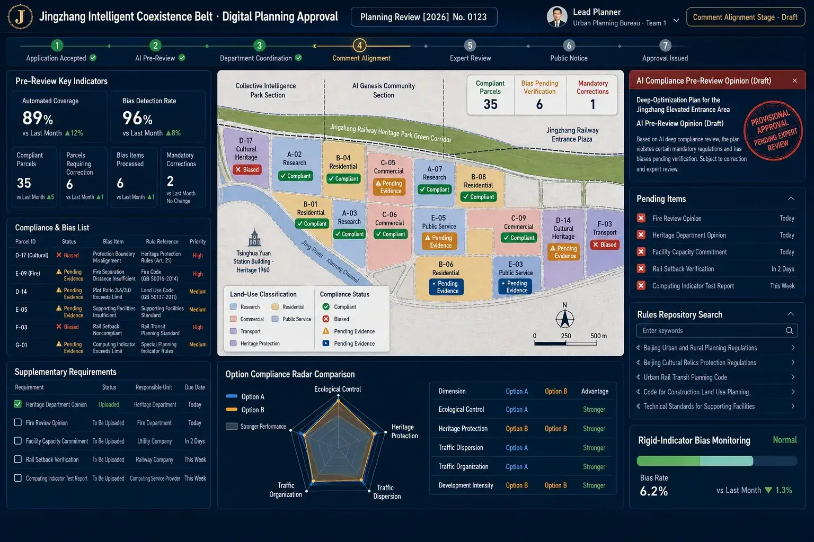

#### 5.1.1 Site theme: dynamic planning results, how to be captured by mandated processes

Core contradiction: traditional review cannot match dynamic, scenario-driven results, remaining manual, slow, and less transparent to the public about approval rationale and issuance.

This module asserts that planning approvals are not final outcomes but an institutional interface for dynamic capacity within statutes. It supplements, not replaces, statutory reviews, converting multi-scenario outputs from human decisions (5.3.3) into reviewable, comparable, traceable decision support, shifting planners from document handling to value-based work.

#### 5.1.2 Jing-Zhang context: why innovation belts need more compliance governance

- **Complex tenure:** railway-corridor renewal involves multiple ownership and authorization relationships and therefore requires a transparent, traceable compliance process.
  - **Multi-rule superimposed:** Constraints include municipal, district super-trajectories, Wenbao railway heritage (e.g., Qinghua station), water services (Clean River, Light Moon River, Turn River), transport, plus manual cross-cutting rule checks.
- **High public interest:** Railway heritage protection and urban renewal create strong tension; public demands transparency (opposed 5.4).
  - **Contest context:** Proposal relies on provisional boundaries; compliance reviews act as gatekeepers to shape official restraints from provisional assumptions and stop temporary geometry being treated as legal red lines.

#### 5.1.3 Place of scene: the Beijing legal system

  - **Data layer:** Deploy monitoring system for the "one map" enabling online collaboration of three result types, three city-wide integration levels, quality control and inventory integration.
- **Platform level:** Synergistic "Multi-Corporate One" platform (2018,381) fully deployed in 2018, executing the Multi-Corporate One, Multi-Certificate One, Multi-System Integration, Multi-System One framework and the Integrated Implementation Plan per Articles 30 & 31 of Beijing Urban-Rural Planning Regulations.
  - **Additional level:** Adds AI pre-screening, program selection and dynamic early-warning monitoring, creating a labour split under "statutory platform succession rules, AI-assisted judgment" while preserving approval tenure and legality.

#### 5.1.4 Corresponding to chapter III issues identified

|Core issues|Module response|Key carrier|
|Low-impact redevelopment along dual rail corridor|Provide `rules against + list of witnesses to be refilled' to update compliance pre-trial|Pre-trial compliance engines, deviation maps|
|Complex traffic conflicts with urban management|Include orbital security zones, active mobility breakpoints, station-city integration in compliance|Transport-Land Interaction Mapping|
|Conflict between heritage preservation and renewal|Make protected boundary a strict pre-screening item, automatically indicating protection basis|Historical protection - updated trade-offs|
|AI creative resource collection & matching|Include innovative facilities and housing needs in the integrated implementation plan|Science resources - facility matching|

#### 5.1.5 Core functional design

#### 1 AI Pre-compliance (rule versus engine)
The package (geometry + Metrics + Compliance Matrix) uploads and exports "compliance/violation/reparation" conclusions. Deviations appear on the map with **source of deviation + proposed supplement path**. Key design: **Deviation **Rejection ** - the system reports only "which rule, where, how" and avoids AI black-box vetoes.

#### 2. Rapid assessment of proposal selection and impact

Parallel impact assessments via digital twin produce comparable indicator cards and five-dimensional radars (economic, social, ecological, cultural) aligned with 5.2 goals.

#### 3. Visualization and transparency of the approval process

Element list, processing progress, opinion marks, version diffs, and full-time workflow are traceable; stakeholders can view proposal status, contents, and amendment history (publicity end and 5.4 entry point).

#### 4. Dynamic monitoring and assessment of early warning

Beijing's "Dynamic Monitoring and Assessment Early Warning Mechanism" underpins post-implementation monitoring, issuing timely warnings of control-requirement breaches and shifting approval from a "one-time gate" to life-cycle care.

#### 5.1.6 Wisdom tools and technical routes

|Insight|Issues addressed|Technical elements|
|Rule digitization|Non-calculation of provisions|Policy provisions, structural rules, spatial algorithms (overlap, adjacent, accessible)|
|AI pre-trial compliance|Manual checks are slow, error-prone|Rules engine + Space Popup + Neutron semantic matching|
|Option evaluation|Difficult to fairly compare multiple cases|Multi-targeted decomposition + proxy model + five-dimensional radar|
|Process transparency|Address black-box perception|Version management, chaining, public-readable card|
|Dynamic monitoring & early warning|Risk ageing during implementation|Thresholds for binding indicators + spatiotemporal warning|

#### 5.1.7 Site cards: three typical user-hours

#### Scenario one: "Self-check for compliance" before the design unit is submitted

** Planning object:** Prepared unit / Design team. ** Space path:** digital twin platform - upload packages → pre-screen → self-inspection report. ** Process:** 1) Upload proposal package (geometry, metrics, compliance matrix); 2) Colour-code (red/yellow deviations / green compliance) on bottom map; 3) Export deviation sources, material list, amendment recommendations; 4) Revise post-checks for formal review. ** Data and privacy boundary:** process only structured proposal data; closed planning data undergo approval and confidentiality. ** Manual review:** pre-screens support conclusions; formal review issued by approving officers. ** Business entity:** Department rules + Planning Institute technical team.

#### Scenes two: "Multi Case Selection" at the jury.

** Planning object:** review experts and bodies. ** Process:** 1) 3 candidate parallels; 2) 5-dimensional radar and impact indicator card; 3) expert vote on evidence markers. ** Data and privacy boundary:** author-submitted proposal data shown after de-sensitization. ** Manual review:** evaluation supported by selection findings, yielding committee recommendations. ** Operating entity:** Evaluation organizers.

#### Scene III: "Intellectible, Revealable" during the public announcement period

** Planning object:** Residents and public along the line (activation 5.4). ** Process:** 1) programme publicity; 2) three-minute readable card (what, what change, impact); 3) one-click support/oppose/additional recommendations; 4) opinion fed into approval stream. ** Data and privacy boundary:** public views only de-sensitized content; feedback states purpose clearly. ** Manual review:** opinions grouped and adopted by approving officers. ** Operating entity:** sector and street regulations.

#### 5.1.8 Evaluation indicators

Compliance pre-trial automation • Detection/misreporting deviation • Accelerated program selection cycle • Closed-cycle approval transparency index • Dynamic monitoring early warning.

#### 5.1.9 Design of boundaries

AI conclusions must remain interpretable, reversible and flagged throughout, without supplanting statutory review. Confidential planning data must follow a sealed process. Control indicators (volume, height, etc.) rely on official detailed plans or mission annexes; provisional boundaries must not be presented as statutory red lines.

#### 5.1.10 Basis of reference

Beijing Urban and Rural Planning Ordinance (articles 30, 31); City Planning Territory (2018); Circular (2018); 381 on full implementation of the multi-range platform mechanism (2020); Kyeongfa (2020); 7 opinions on establishing and monitoring multi-rural strategic planning system (DB11/T); 2389-2025 Technical Guidelines for inter-state strategic planning data transfer. Jing-Zhang Railway Sites.

#### 5.2 Investment decision-making - urban renewal business decision-making
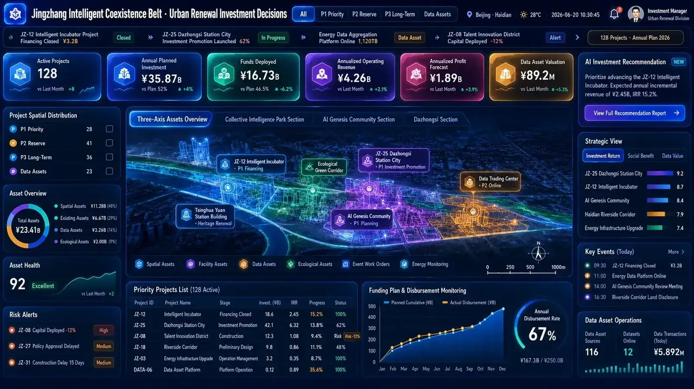

#### 5.2.1 The scenario proposition: the source of the renewed drive is "the cleanness of accounts"

Question 2: Test the candidate mechanism that complex property rights, safety controls, and inadequate renewal capacity may contribute to spatial fragmentation and value loss. The "renewal-capacity deficit" is not yet directly measurable; investment efficiency, social benefits, and risk exposure cannot currently be combined in one interface. This module hypothesizes that urban-renewal competitiveness may shift from a land-price dividend toward combined business gains and governed data assets.

#### 5.2.2 Jing-Zhang Language: Updates of authentic "books" along railway lines

  - **Low-impact stocks are real:** Numerous inefficient industries, storage, idle land and overlapping property rights exist along the bi-rail corridor.
- **Public-case reference:** railway-corridor public-space renewal shows that ownership coordination, public access and long-term operations should be designed together.
  - **The business model can be replicated:** The "city partner" model integrates route stakeholders into shared business.
  - **Data asset growth pole:** Haidian follows a nationally replicable data-asset entry pathway.

#### 5.2.3 Site location: update project library + three ledgers assessment
The Jing-Zhang Innovation Belt Renewal Project Library serves as the central hub covering three sectors: Repository (project images of low-impact projects), Assessment Ledgers (scorecards), Sorting (integrated priorities), and Monitoring (full life-cycle tracking).

#### 5.2.4 Corresponding to the identification of Chapter III issues

|Chapter III core issues|Response to this module|Key carrier|
|AI IRR does not match the facility|Translating innovative facilities, talent housing gaps into social accounts|Creative Resources - Matching Mapping|
|Low-impact redevelopment along dual rail corridor|Update case-by-case potential index and integrate to break "deep"|Update project library, priority engine|
|Projection centre layout & security|Include security and energy redundancy in release account|Energy-computational power map|
|Historical & cultural preservation & renewal|Render heritage conservation and continuity costs visible in Social Bill|Historical protection - update trade-offs|

#### 5.2.5 Core functional design

#### Update project priority smart sequencing

Enter updated potential index × investment benefits × social impact × policy window × science matching; output a queued list with explanations for each black-box sort. Prioritize releasing the greatest disequilibrium near higher-education and orbital stations, invoking the full "one slice".

#### 2 three ledgers integrated assessment

Economic accounts (value-added land, rent, operating income + data-asset growth); Social accounts (post, public space, job balance, cultural continuity); Resilience account (computational-power security, disaster exposure, energy redundancy). Produce comprehensive scorecard with sensitivity analysis (flipping-mark conclusion).

#### 3 Project life-cycle monitoring

• Implement five-phase operation status, funding and deviation monitoring; auto-generate unusual warnings and assign responsibility.

#### 4. Assetization of data

Updated de-sensitized project data will form a registrable asset; the Northern Digital Institute-Haidian integrated service centre will interface, registration tables will be completed, and the "fourth book" added to the project update.

#### 5.2.6 Methods and technical route (with public-case reference)

|Wisdom.|Issues addressed|Technical elements|
|Update the assessment of potential|Low-impact recognition of experience|Land-use efficiency, accessibility, tenure complexity, updated potential index|
|Sort Priority|Get in line and slap your head.|Multi-guide decision-making + interpretable sorting + sensitivity analysis|
|Three ledgers.|The economic-social-resilience cannot be matched|Financial model + social impact assessment + risk pricing|
|Full-cycle monitoring|Progress reports|Key Node Watchboard + Abnormal Early Warning + Allocation of Responsibility|
|Assetization of data|Data value sleeping|Data registration, compliance, entry tables, circulation (to the north)|

> **Public-case reference:** Public data-exchange and data-element service platforms provide methodological references for registration, compliance, circulation and asset management. This proposal does not cite unverified transaction values, valuations or performance figures.

#### 5.2.7 Site cards: three typical user-hours

#### Scenario one: "Renew the project line" on the national platform

** Planning object:** Zone updates implementation entity/national platform. ** Space path:** update project database; three ledgers assess integrated annual plan ranking. ** Process:** 1) low-effectiveness in cataloguing and graphics generation; 2) export economics/social/renewal ledgers rating card; 3) integrated priority list with ranking bases; 4) draft annual implementation plan for decision-making. ** Data and privacy boundaries:** tenure, investment, fiscal-sensitivity data kept confidential, not public. ** Manual review:** ranking supports decisions; plan confirmed by decision-making body. ** Operating entity:** district implementation body with financial, regulatory, sectoral partners.

#### Scenario II: Social capital "A Visible Communication Tool"

**Planning object:** Industrial operators, social capital, business clients. **Process:** Select negotiables **Generate** a de-sensitized "project investment cards" (ledgers summary + policy conditions + time-to-place).

#### Scenario III: Progress light for the full project cycle

** Planning object:** implementer management, responsible department. ** Process:** 1) real-time node status viewer; 2) delayed/funding-gap automatic compliance risk early warning; 3) assign responsibility for subject-matter overhaul; 4) close loops. ** Data and privacy boundaries:** internal management data delegated by hierarchy. ** Manual review:** early-warning actions manually confirmed. ** Operator:** project implementer.

#### 5.2.8 Evaluation indicators

Update project time-based • Low-effectiveness release (ha) • Integrated ROI • Improved job balance • Varied funded ratio • Count and value of de-sensitized data-asset input tables.

#### 5.2.9 Design boundaries

Sequencing and evaluation support decisions but do not replace statutory bid approval. Land, finance and investment data are kept confidential; measurements rely on documented assumptions; data-asset entry forms must satisfy accounting and compliance standards, backed by professional bodies.

#### 5.2.10 Basis of reference

China Economic Network, Beijing First Green Data Asset List (2024-05-10)

#### 5.3 Urban operations - monitoring of urban operations and movement
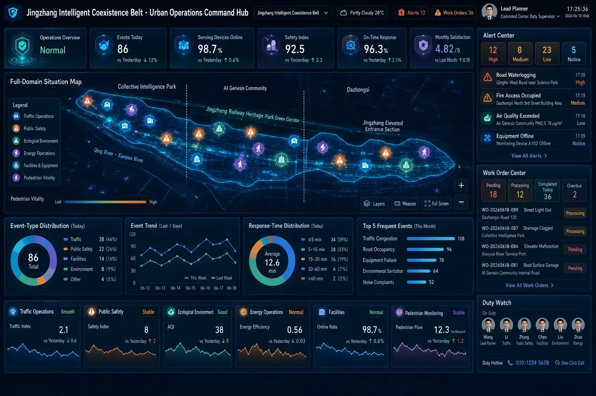

#### 5.3.1 Site theme: The competitiveness of urban operations is "capability"

The module argues **city operations must move beyond "sensitization-disposal" to "prevent-adapt-self-adaptation**": during extreme weather, floods or power shocks, the city can pre-empt, swiftly reorganize and reset, testing the Jing-Zhang belt's resilience promise.

#### 5.3.2 Jing-Zhang Language: Double Iron, Computational Power and Water System

  - **Multi-modal transport superheavy:** subways, suburban rail, high-speed lines, urban roads overlapping along the Jing-Zhang corridor; Chong Ha station-Beijing North Station exemplifies a multi-modal hub.
  - **Computational power extension:** Zhongzhi Park provides reasoning and training compute, peripheral layout training centre, and energy-compute-security synergies as new topics.
- **True water-security boundary:** clean river, moon river, trans-river and rail corridor interlink; internal flood risk and "four-prevention" digital twin fully designed in 4.4. 7 scenario IV.
- **Interface with existing capability:** the proposal reserves interfaces to district-level operation platforms, sensing facilities and spatial-information basemaps, without claiming unverified system scale or performance figures.

#### 5.3.3 Site location: connect to district-level urban-operation capability
The proposal reserves interfaces to district sensing, computing, command-and-dispatch and spatial-information capabilities, adding dynamic simulation, the four-prevention loop and compute-transport scenarios without replacing the existing urban-operation system.

#### 5.3.4 Corresponding to chapter III issues

|Chapter III core issues|Response to this module|Key carrier|
|Complex traffic systems and traffic management are lagging behind|Multi-model real-time monitoring + swap efficiency analysis + congestion warning + induction scheduling|Transport dashboard, multi-smart traffic drive|
|Projection centre layout and security|Energy -computal power - Safety co-monitoring, transport and landing of loads under extreme events|Computational power - Energy synergy, resilience switching (link 4.4)|
|Low-impact redevelopment along the dual rail corridor|Underbridge, prestation space integrated into operational monitoring|Space monitoring layer|
|Historical and cultural preservation and renewal|Safety and experience operational monitoring of heritage sites, crowd centres|Public safety run layer|

#### 5.3.5 Core functional design

#### 1. Real-time transport rollover and movement control

Multi-modal monitoring, multiplication efficiency analysis, congestion warning, modular induction, and a 6.3 "menu-selection for smart lines" scenario: Qing Ha station-Beijing North Station top exchange, sudden large-flow response.

#### 2 Energy-computational power synergetic monitoring

IQC energy consumption, load, PUE, redundancy, real-time disaster exposure monitoring; coordinated energy-computational power for city safety (6.4)

#### 3. Early warning of urban events and emergency response

Extreme weather, high passenger flow, integrated safety warnings with hierarchical response; reuse 5.3.2 extreme-event stress-test model pre-action.

#### 4 Water Safety "four-prevention system" interface

Access the main operator interface within closed loops of the four-scenario "four-prevention system" to guide extreme-weather decisions; public desensitization presentation.

#### 5. Dynamic resource allocation for urban services

Shared facilities, transport, emergency resources and community services are dynamically demand-distributed, docking 6.2 "lightly activated camp town".

#### 5.3.6 Methods and technical route (with public-case reference)

|Wisdom|Issues addressed|Technical elements|
|Multi-modal traffic promotion|Multiple Synergy|Transport Simulation, Real-Time OD, Multi-Intelligence Schedule|
|Energy-computational power|Computational power & grid security|Load prediction, migration policy, reversion switcher|
|Multismart "four-prevention system"|Slow extreme-event response|Perceptions/forecasts/preprints/drives Category 6|
|Dynamic resource movement|Resource mismatch|Supply-demand matching, hierarchical authorization, continual markup|
|Run feedback design|Data lacks flow-space return|Operating data → Space design feedback loop (link 4.4.6)|

> **Public-case reference:** Public urban-operation practices in multi-source sensing, spatial-information integration, event coordination and assisted dispatch provide methodological references. This proposal does not cite unverified compute capacity, device counts, data volumes or governance-performance figures.

#### 5.3.7 Site cards: three typical user-hours

#### Scene one: "Multi-modular conversion" at peak times

**Planning object:** Dispatcher, Transport Operator. **Space Path:** Qing River Station → Beijing North Station hub → Traffic Operator dashboard → Large-flow alert → Level response. **Process:** 1) Multi-modal real-time flow convergence; 2) Switch efficiency & congestion analysis; 3) Super-threshold warnings with inducement recommendations (additions, peak tips, temporary waiting areas); 4) Movement-control personnel implement and mark after confirmation. **Data & privacy:** Use polymers, de-sensitized passenger flows and OD data; no personal tracking. **Manual review:** All movement orders manually confirmed; AI only suggests. **Operating entity:** City Transport Centre + Transport Operator.

#### Scenario two: "computational power-energy switching" in extreme weather

**Planning object:** Computational-power centre operator, power provider, emergency command. **Process:** 1) Weather & grid early-warning access; 2) Load-migration assessment via 4.4 status (limited-load emergency recovery); 3) Auto-generation of alternative displacement/download/emergency-power scenarios; 4) Authority for cross-nodal takeover after confirmation. **Data & privacy:** Process only infrastructure operating data, not user data. **Manual review:** Public-safety movement control must be manually confirmed and auditable. **Operating entity:** Zhongzhi Park City Logic Centre + Power and City Operating Sector.

#### Scene 3: Integrated Response to Emergencies

**Planning object:** Emergency command and street communities. **Process:** 1) incident sensing through sensors and voluntary public reports; video requires separate approval; 2) AI-assisted options for response level and resources; 3) commander confirmation; 4) dispatch; 5) post-event review. **Data & privacy:** no collection or retention of continuous individual location trails. Short-lived, zonal aggregate information may be used only when legally authorized and after a data-protection impact assessment and security test. Sensitive-event access is role-based, time-limited and subject to deletion, correction and appeal. **Manual review:** an authorized officer confirms and remains responsible for every command decision; AI provides options only. **Operators:** emergency command and street communities.

#### 5.3.8 Evaluation indicators

Response duration, efficiency swap, energy efficiency, PUE, early-warning accuracy/fault rate, resource movement satisfaction, public-service continuity, internal flood early-warning/water-level prediction error (reuse 4.4 indicator).

#### 5.3.9 Design of boundaries

Real-time public-safety dispatch requires human confirmation and an auditable log. Public-safety data must be role-restricted, minimized and time-limited. The proposal does not assume access to individual location, video or other sensitive data; a real pilot requires legality review, a data-protection impact assessment, security testing and an exercised shutdown plan. This module does not replace existing city-operation systems.

#### 5.3.10 Basis of reference

Proposal 4.4, Scenario IV (water-safety four-prevention system), and methodological references from public urban-operation platforms; unverified external performance figures are not cited.

#### 5.4 Public Life - Urban Experience of Residents and Visitors
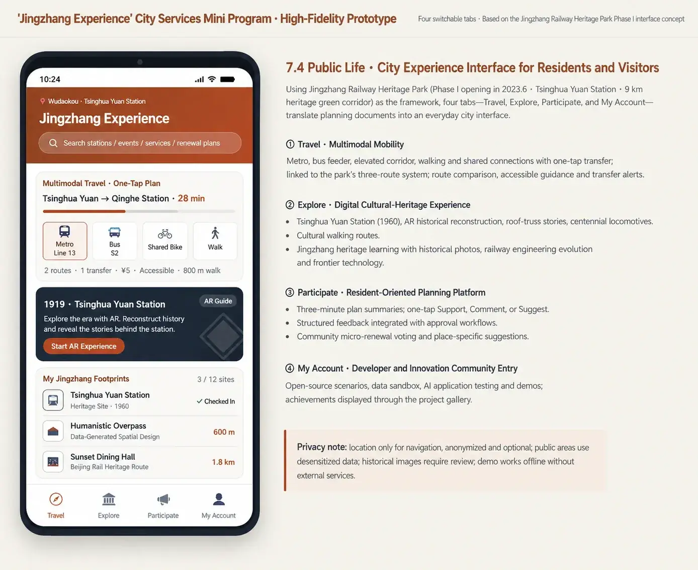

#### 5.4.1 Site theme: the value of planning, ultimately realized by "human perception "

One candidate mechanism in Issue 5 is insufficient public participation; this relationship remains to be tested. The public-life module treats daily users as essential reviewers and offers a participatory interface for the corridor while keeping offline participation available.

#### 5.4.2 Jing-Zhang: The park that has grown is the best interface

- **Existing public space:** the linear space released by undergrounding the railway provides an accessible public interface; this proposal relies on fieldwork and formal material rather than unverified length or area figures.
- (b) Maintain Qinghua Station (1960), restore the old Jing-Zhang line, integrate >20 railway elements (human slope, memorial dunes, train rollers, etc.), and convert the north four-ring railway bridge into the "Sunset Lodge" Jing-Zhang Railway Outdoor Museum.
- **Active-mobility system:** connect the linear green space to surrounding streets and public destinations; quantities remain subject to formal survey and design.
- **Places of activity:** 20 other venues (standard football, five-person football, basketball, smart gym, etc.).
  - **Operating model:** The "city partner" model incorporates key route units into shared business.
- **Long-term view:** Beijing North Station plan extends ≈9 km, covering ≈14 km² radiation, serving 9 street towns and ≈20 tertiary institutions.
- **Honours:** Beijing urban-renewal Best Practices (2023).

#### 5.4.3 Places of scenes: public interface of the organization of "multi-point" sex parks along the routes

|Region|Public experience focus|Main carrier|
|Five mouths - Qinghua Park Station|Heritage experience, school innovation, community leisure|Qinghua Park Station, nearby school, cultural path|
|Zhongzhi Park|Innovation showcase, computational power hub, sports leisure|Smart Sports Square, industry presentation interface|
|Dazhongsi|One-Station City, International|Front of station space, civil-brigade node|

#### 5.4.4 Corresponding to chapter III issues identification

|Chapter III core issues|Response to this module|Key carrier|
|Tension: historic-cultural preservation vs. renewal|Digital heritage re-emergence and participatory activation shifting from passive to active experience|AR orientation, participatory activities, cultural path|
|AI creative resource collection & matching|Embed innovation scenes in park public interface for visibility|Developer walkways, results gallery|
|Complex traffic conflicts with urban management|Multi-module Travel One Key Planner + Park Active Mobility Connection to Reduce Last kilometre|Smart Travel Module|
|Inefficient double-barrel track redevelopment.|Reactivate pre-station and sub-bridge spaces as public nodes; renew power along anti-nursing route.|Under-bridge space active as front square.|

#### 5.4.5 Core functional design

#### 1 Platform for participatory planning for the population
Programme announcements, opinion collection, feedback loops (shared with 5.1 portals); community micro-update voting and site acupuncture proposals (6.2).

#### 2. The digital experience of cultural heritage

Jing-Zhang railway heritage digital recovery features AR historical scenes (Cinghua Park Station, Jian Tianwu Story, Centennial Motorcycle), cultural walkway guide, historic photos, railway-tech evolution and forward-rail demos for the "Jing-Zhang Heritage Educational School".

#### 3 Smart travel and life service

One-key multi-modal planning: subway, peri-urban rail, heavy rail, active migration, shared connection (6.3); AI Living Services: medical, education, law, community; direct link to Site Park's three-green active mobility system.

#### 4 Developer and innovation community interface

Open scenes, data sandboxes, AI testing and demos (addressing Deep Control); open-source release, results presentation, developer activities hosted at the park public interface.

#### 5.4.6 Wisdom tools and technology routes

|Wisdom|Issues addressed|Technical elements|
|Heritage AR Wizard|Invisible, insensitive history|Site recognition, historic image overlay, narrative audio|
|Multi-modal travel planning|Last-mile focus|Real-time multi-modal routes, active mobility link, accessibility|
|Participatory feedback|Structuring opinions is hard|Issue cards, view groups, closed-loop tracking|
|Data Sandbox|Data scarce and hard to use|Desensitized datasets, scene lab, Developer API (compliance authorization)|
|Social awareness flow|Perception data not feeding planning|Perceptions, comments, behaviour (desensitization) 2.1.4; next diagnosis round|

#### 5.4.7 Site cards: three typical user-hours

#### Scene one: Residents are involved in "my zone update."

**Planning object:** Residents along **Space path:** community participation platform; **Votes:** topics, issues; **Publication:** results. **Process:** 1) Update programme publicity → "3 Minute Cards". 2) Resident vote + recommendations; 3) Structured opinions; 4) Feedback (adoption, interpretation, supplementation) to form a closed "present-process-receipt" loop. **Data & privacy:** collect only issue feedback, clear use statements, no irrelevant personal data. **Manual review:** street and approving officers. **Operator:** Street + sector rules (link 5.1).

#### Scene Two: "The 100-year Jing-Zhang AR Guide for Visitors"

** Planning object:** visitors, citizens, students.** Space path:** cultural walk entrance ** Site AR Identification of historical scenes and narratives.** Process:** 1) Scan station / Track / Monument logo; 2) Supersed historical images (e.g., "1919 Qinghua Park"), technical stories and person narratives; 3) Consistent slopes, memorials, train drives, sundown guesthouses, etc.; 4) Created "my Jing-Zhang footprints".** Data and privacy boundaries:** location data are used only to guide location, anonymity and closure; historical images and portraits are subject to clearance.** Manual review:** presented after history, copyright and sensitivity clearance.** Operator:** Cultural Operating Company + Street+ Educational Cooperation.**

#### Scenario three: Developer access to Open scene and data sandbox

**Planning object:** developers, AI creative team, university scientists. **Process:** 1) Request scene authorization; 2) Use desensitized sandbox datasets (energy, parking, human flow); 3) Develop AI applications; 4) Test displays on public interfaces; 5) Integrate top applications into results gallery. **Data & privacy:** sandbox data desensitized, authorized, auditable; no personal IDs. **Manual review:** application and data access vetted. **Operator:** official source + Haidian Integrated Service Centre for Data Elements (United Nations Action 5.2).

#### 5.4.8 Evaluation indicators

Number of public participants/adoptions, cultural experiences, travel-service satisfaction, developer landscape adaptations and sandbox activity, community issue-response cycles, duration of park public-space use linked to active mobility.

#### 5.4.9 Design boundaries

Personal data are minimized, anonymous and authorized; historical images, trademarks, portraits require clearance; exhibition ends comply with competition rule "HTML open offline, no external services"; public areas use only desensitized data; park operations retain the "city partners" model, not a substitute for enhancement.

#### 5.4.10 Basis of reference

Phase one construction of Jing-Zhang Railway Site Park by Haidian Government offered free to public (2023-06-30). People.cn Beijing Jing-Zhang Railway Site Park officially opened (2023-06-29). Beijing News version opened to public (2023-06-29). Beijing Daily News client 2023 cites urban-renewal best practice (first phase) (2023-10). This proposal 4.4 - Site III (resilience public).

#### 5.5 Four Module Closed Rings and Data Reflow

|Link|Input|Output|Rewind to|
|Planning approval|Programme package + multi-scenario results|Approved space rules, compliance deviation list|Data mapping (policy-project-space map)|
|Investment decisions|Approved rules + update potential|Project time series, Bree ledgers calibration, early-warning monitoring|Indicators system, implementation progress, data assets|
|Urban operations|Landing project + run data|Operation status, incident warnings, dispatch instructions|Data foundation (dynamic running data 2.1.2)|
|Public life|Space rules + services|Human experience, claims, sensory data|Social awareness data (2.1.4); next diagnosis round|

**Key mechanism:** Data reflow into the database enables the Planning Operating System (1.3) to self-calibrate each cycle, closing city-operation feedback loop.

#### 5.6 Phased implementation path

|Phase|Time window|Area carrier|Focus.|
|Recent Pilots|0-1 years|Five mouths - Qinghua Park (Slice One) + Site Park One|Public life (AR orientation, travel, participation); planning approval (compliance pre-trial pilot)|
|Medium-term expansion|1-3 years|Three focus areas|Investment decisions (updated project bank, data asset tables); urban operations (transport monitoring, emergency response)|
|Forward governance|3-5 years|Jing-Zhang Innovation Area (post 9km Green Corridor)|Four-module closed loops, energy-power synergy, open scene and capacity trading|

## System of indicators, area recovery and compliance matrix

Indicators include geometrically recalculated design-model metrics, statutory/engineering metrics per official conditions, and performance metrics for continuous calibration. Full mission and standards reside in the machine matrix; this chapter details their design-judgment role. [Depth: metrics_rea_sqm]

Public-space proportion is computed from the design layer versus total boundary area. [data:geometry/public_space.geojson#PUBLIC-001]

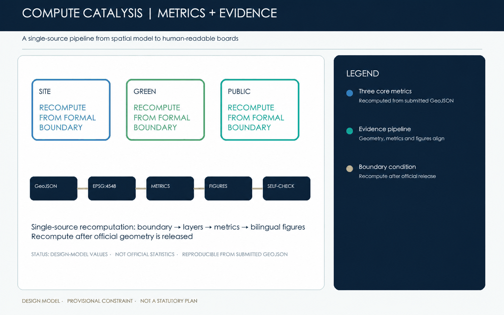
*Figure 05: indicators, evidence, mission coverage, and self-censorship required.*

#### 5.7 Interface with competition tasks and existing modules

|Competition Task / Existing Modules|Four module acceptances|
|External reference|Method references for investment decisions, urban operations and approval coordination, without unverified case-performance claims|
|Agent 3 AI+ scene|Transport, services, consumption, medical, education public life + urban operating load|
|object.4|"Cultural Experiences" of public life for developer walks, result showrooms, and honor wall.|
|delegate.6 Long-term ops|Operate four modules via phased, closed-loop mechanism|
|Five functions: Intelligent AI Urban Governance|5.1 Planning approval + 5.3 Direct urban business counterpart|
|Smart governance track|DeepAgent (data check-up/solicitation/synergy) available for attachment 5.2 / 5.3|
|4.4 Soft resilience wisdom|5.3 Urban ops extend operating layers (water safety four-prevention system, resilience switching)|
|Chart Deep Series|Deep Chat 5.4 Life Services; Deep GIS 5.1 Approval Analysis; Deep Age ## 5.2/5.3 Governance; Deep Control 5.2 Data Assetization + Developer Interface|

#### 5.8 Landing statement (take note of the package submission)

1. The four modules are conceptual recommendations/reference proposals for professional study, not implementation plans, as the Government has already set arrangements;
2. Reproducible module indicators populate `metrics.json`; formally cited data sources enter `sources.json`; bulletin and taskbook requirements populate `compliance_matrix.json`;
3. Prototype includes digital twin platform (8.3-1), AI Planning Assistant interface (8.3-2), and a fully processed video slice (8.3-3) serving as shared technical base and demo for the four modules;

## Description of risk, copyright and compliance

The results package finalizes the team's original version but does not present the conceptual proposal as statutory planning or definitive implementation. Major risks: location/area errors from temporary boundaries; insufficient transport, municipal, electricity, fire-protection and environmental data; limited traffic, power-facility, flood, vibration, noise, heat-discharge and functional-conflict information; lack of transparency; privacy leaks or algorithmic automatic deviations; confusing historical recovery and unclear external authorizations for fonts, images, media.

Team results are registered separately from third-party data. Submitting identity, attribution and third-party material licences were confirmed per-asset by the submitting entity on 2026-08-31: every asset in formal use traces to a rights basis (team-authored works, disclosed AI-generated media, open-source redistribution with licence headers, statistical POI citation, or paraphrased textual reference); see assets/media/appendix-g-rights-inventory.md and report/copyright_statement.md.

Appendices in `assets/media/`: task-closure(A) · logo-vi-direction(B) · regional-collaboration(C) · pilot-protocol(D) · data-governance(E) · claims-audit(F) · rights-inventory(G).

## References

The reference system contains the competition announcement with Agent's mission, site packages, planning standards, full team drafts, and open policies and cases within permitted borders.

The team manuscript, synchronized with this audit round's claim-caliber downgrades, is archived in `report/narrative.md`. Machine audits support retroactive recalculation but do not replace the original argument. Additions must be recorded in body, indicator or spatial conclusion with source, licence, timeframe and use limits. [source:SITE-PACKAGE] [source:SOURCE-REGISTRY]
