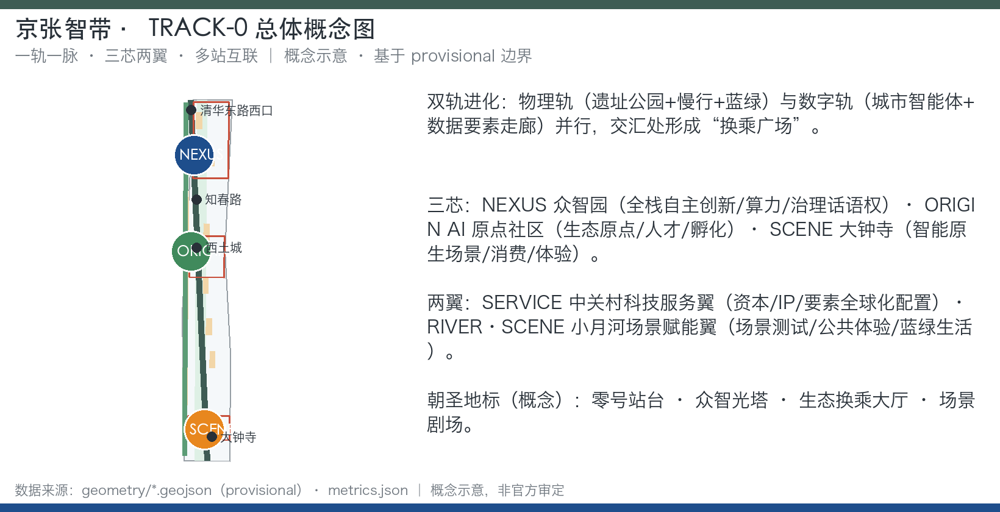
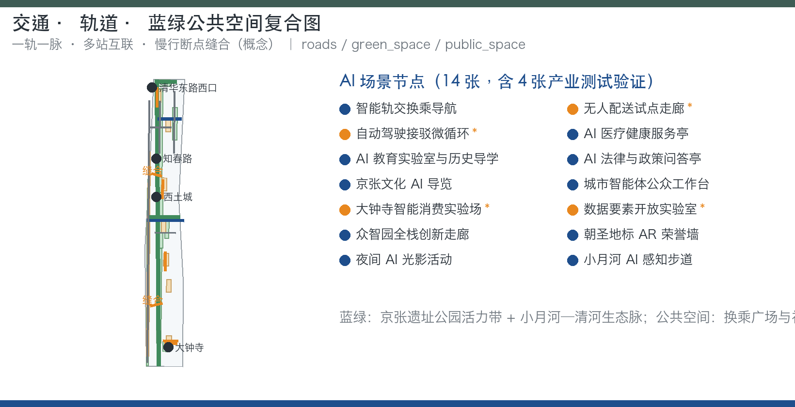
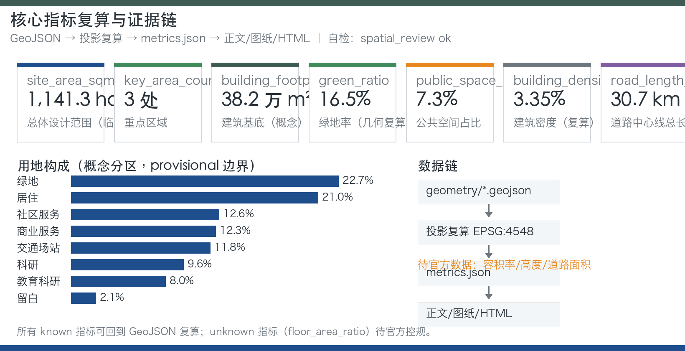
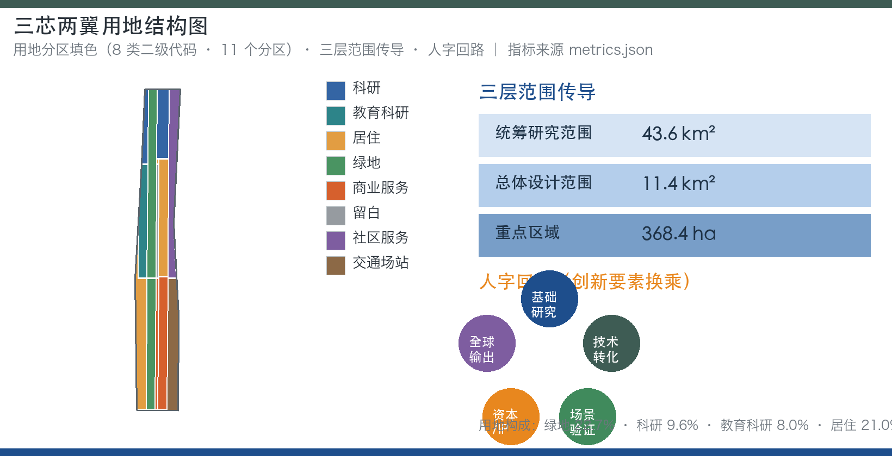

# Jing-Zhang Smart Belt · Zeroth Smart Rail —— Urban Design Open Call for the Centennial Jing-Zhang AI Innovation Belt

## Design Basis and Source List

This proposal is based on the first criterion of the Qualification Pre-Review Notice for the International Scheme of the Centennial Jing-Zhang AI Innovation Belt Urban Design, issued by the Haidian Branch of the Beijing Municipal Commission of Planning and Natural Resources in May 2026 [source:OFFICIAL-ANNOUNCEMENT]. It also adheres to the co-creative boundary set by the open call task book for agents [source:AGENT-TASKBOOK], and is generated based on the design task book, allowable design space, enumeration, scope, patterns, and machine-readable source list provided in the `brief/site-package/` [source:SITE-PACKAGE]. All factual and spatial judgments are referred to the boundaries registered in `data/source_registry.json` [source:SOURCE-REGISTRY], and are organized through the navigation layer in `data/processed/agent_fact_pack.md` for tasks, scope, source purposes, and missing data lists [source:PROCESSED-FACT-PACK].

It should be noted that the organizing body has not yet released the official `SITE_BOUNDARY` and the precise polygons for the three key areas. This plan uses the provisional boundaries generated from `brief/site-package/geometry/provisional_boundaries.geojson` for the expression of the plan [source:BOUNDARY-SOURCE] [source:KEY-AREA-SOURCE]. These boundaries are only for AI-generated visualization and non-legal design discussions and should not be used as the Official Planning Boundary, approval basis, or for precise area recalculation or legal control conclusions. Once the official boundaries are released, the site boundary, key areas, land use, roads, green spaces, public spaces, buildings, phasing, and all spatial metrics will need to be recalculated [depth:existing_conditions_diagnosis] [depth:metrics_recalculation]. (Official Boundary) (Provisional Boundary) This document includes the historical facts and background information (construction history of the Jing-Zhang Railway, Tsinghua Garden Station, the opening of the Jing-Zhang Railway Heritage Park Phase I, and the Haidian AI industry background) after verification with publicly available authoritative sources [source:RESEARCH-JZ-RAILWAY] [source:RESEARCH-QHY-STATION] [source:RESEARCH-PARK-2023] [source:RESEARCH-HAIDIAN-AI].

The scheme depth is organized according to the requirements of the announcement and the task book: the Coordinated Research Area addresses the industrial ecology and the future urban form [standard:PROJECT-OFFICIAL-ANNOUNCEMENT]; the Overall Design Area is organized for Urban Design based on the depth of the control plan, addressing land use, pedestrian and bicycle networks, blue and green spaces, urban appearance, and updates framework [standard:MOHURD-CONTROL-DETAILED-PLANNING]; the three key areas are developed to the depth of the Integrated Planning Implementation Plan [standard:MOHURD-URBAN-DESIGN-MEASURES]; land use classification follows the direction of the National Land and Resources Land Use and Sea Use Classification Guide [standard:MNR-LAND-USE-CLASSIFICATION-GUIDE]; architectural design expression follows the direction of the Design Document Preparation Depth Regulations [standard:MOHURD-ARCH-DESIGN-DEPTH-2016]. The AI co-creation principle, three positioning, five functional areas, and the Three Zones and Two Wings collaborative loop are in response to the task book [standard:PROJECT-AGENT-OPEN-CALL-TASKBOOK]. The Evidence Chain for this plan starts with [data:geometry/site_boundary.geojson#SITE-001] and [data:geometry/key_areas.geojson#PROV-KEY-001], with all spatial conclusions traceable back to the layers, metrics, and sources.

### Rules for Using the Materials

This plan adheres to three rules: first, only use materials registered as officially public, repository-verified, or confirmed through verified media in the `sources.json`, and do not cite unregistered sources [source:SOURCE-REGISTRY]; second, for all content involving areas, company lists, investment amounts, policy commitments, and approval status, use official announcements and registered sources exclusively, with the plan itself providing only directional conclusions [source:SITE-PACKAGE]; third, gaps in data are explicitly listed as "impact—handling method—formal submission prerequisites" and correspond one-to-one with the assumption items in `assumptions.json` [depth:risk_missing_data]. Historical facts use traceable public sources: the Jing-Zhang Railway began construction in 1905 and opened on September 9, 1909, being the first major railway line designed and constructed by Chinese people, with the Qinglong Bridge using a zigzag return track [source:RESEARCH-JZ-RAILWAY]. BeiJing-Zhangjiakou Railway Heritage Park was established in 1910 at the Beijing-Zhangjiakou Railway Station, which was the first station after exiting Xizhimen Station, with the station name inscribed by Zhan Tianyou [source:RESEARCH-QHY-STATION]; the first phase of the Beijing-Zhangjiakou Railway Heritage Park opened in June 2023, located between Qinghua East Road and Zhi Chun Road, covering approximately 2.5 kilometers in length [source:RESEARCH-PARK-2023]; Haidian District, as the birthplace of Zhongguancun, is reported to house 37 universities, over a hundred national-level research institutions, and form an AI full-stack industrial chain [source:RESEARCH-HAIDIAN-AI]. These historical facts provide a traceable reference for narratives such as "Zero Station Platform" and "One Track," but they are cited as background facts and do not imply any current ownership or engineering conditions [depth:existing_conditions_diagnosis]. (Jing-Zhang Railway Heritage Park)

## Three-Level Scope Framework

The three layers of scope serve as the transmission backbone for the scheme, from macro to micro, based on the areas specified in the announcement: the Coordinated Research Area covers 43.6 square kilometers, addressing strategic studies on industrial ecology, innovation networks, and future urban forms; the Overall Design Area spans 11.4 square kilometers, with the submitted boundary falling within this layer, as expressed by [data:geometry/site_boundary.geojson#SITE-001]; the key areas cover 368.4 hectares, focusing on detailed design for the Zhongzhiyuan AI Independent Innovation Acceleration Area, Beijing AI Origin Community, and Dazhongsi AI Industry Cluster Area, as expressed by [data:geometry/key_areas.geojson#PROV-KEY-001], [data:geometry/key_areas.geojson#PROV-KEY-002], and [data:geometry/key_areas.geojson#PROV-KEY-003] [metric:site_area_sqm] [metric:key_area_count].

The three layers follow a depth progression of 'research—overall—key': the strategic layer determines the collaborative circles and the direction of element flow, the overall layer implements the collaborative circles into land use, pedestrian-friendly areas, blue-green spaces, urban appearance, and renewal frameworks, and the key layer within 368.4 hectares provides the direction for functional types, building scale, traffic organization, Public Spaces, and implementation project lists [depth:three_level_scope_framework]. The transmission method is divided into four steps: the first step is element identification, mapping the four categories of elements—talent, capital, data, and scenarios—from the strategic layer to the spatial framework of the overall layer; the second step is spatial positioning, placing the elements on the carrier of 'one track, one vein, three cores, two wings, and multiple stations interconnected'; the third step is deep verification, using Building Footprints, road centerlines, and green space and public space layers to check if the spatial actions are realizable [data:geometry/buildings.geojson#BLDG-001] [data:geometry/roads.geojson#ROAD-001]; the fourth step is feedback correction, feeding back the contradictions from the key layer to adjust the land use and pedestrian-friendly framework in the overall layer [depth:metrics_recalculation]. Three key areas each have an area as announced, and the provisional polygons must not be used as official district boundaries or as a basis for formal scoring or approval [depth:three_key_area_detailed_design]. The current diagnosis and data gaps are prerequisites for the three layers of range transmission: when the Official Boundary, control plan conditions, road red lines, ownership, municipal, and cultural heritage control lines are missing, the corresponding conclusions must be downgraded to Conceptual Recommendations [depth:existing_conditions_diagnosis] [depth:risk_missing_data].

## Coordinated Research Area: Industry and Future City Research

Coordinated Research Area (43.6 km²) encompasses the study of the Three Zones and Two Wings. This plan proposes the "Human-shaped Circuit" as the governance mechanism for the Three Zones and Two Wings: basic research (universities and ORIGIN Core) → technology transfer (NEXUS Core) → scenario validation (SCENE Core and RIVER·SCENE Wing) → capital and IP (SERVICE Wing) → global output and feedback to the ORIGIN Core. Innovative elements flow like trains through the ecological transfer stations, with the turnover and retention efficiency of talent, capital, data, and scenarios becoming an observation subject for Urban Design and AI ecosystem metrics [depth:overall_spatial_structure] [standard:PROJECT-AGENT-OPEN-CALL-TASKBOOK].

The AI Innovation Ecosystem map unfolds in three layers: the core layer consists of three cores (NEXUS Full Stack Autonomous Innovation, ORIGIN Innovation Ecosystem Origin, SCENE Intelligent Nativized Scenarios); the support layer consists of two wings (SERVICE Global Configuration of Capital/IP/Elements, RIVER·SCENE Scenario Testing and Public Experience); and the outer circle includes clusters of universities, industrial parks, communities, and the global developer network. Haidian District, as the birthplace of Zhongguancun, is reported to house 37 universities, over a hundred national-level research institutions, and form an AI full-stack industrial chain [source:RESEARCH-HAIDIAN-AI], which serves as the practical support for the fundamental research end and talent supply end of the "human circuit." This also provides a knowledge network for the ORIGIN chip campus near the university. The ecosystem mechanism covers eight categories of elements: land, space, industry, capital, talent, computing power, data, and scenarios, all defined by public information, without specifying any specific recruitment, investment, or policy arrangements [source:AGENT-TASKBOOK] [depth:risk_missing_data].

### Global Case Studies and Transferable Patterns

Global case studies are summarized based on "experience → transformation mechanisms," serving only as directional indications. Specific data should be verified against publicly available sources and do not constitute a list of companies, investment amounts, output values, or policy commitments [depth:existing_conditions_diagnosis] [source:OFFICIAL-ANNOUNCEMENT]:

| Case (Illustrative) | Transferable Experiences | Conversion Mechanism in This Belt |
| --- | --- | --- |
| Silicon Valley Stanford Research Park | Institutionalized Collaboration between University Land/Talent and Urban Tax Incentives | ORIGIN Core Near-Institution Type Park Interface and University-Enterprise-Capital Circuit |
| Boston Kendall Square | Campus-Park-City Continuous Interface: Renovation of the Old Industrial Area and Flexible Office Space | ORIGIN Core Near School Type Street Block Seam and Transformation Result Station |
| Singapore One-North | industrial clusters and public interface layers, garden-type park and mixed-use blocks | NEXUS Chip Garden-Type Innovation Block and Low-Carbon Computing Experience, Phased Development |
| London King's Cross Knowledge Quarter | Upcycling Public Spaces and Anchoring Knowledge Institutions | Dazhongsi and Site Park Update Operations and Scene Theater |
| Berlin Adlershof | Research and Innovation Campus Redevelopment, Long-Term Master Planning, and Phased Implementation | Phase One Pilot—Mid-Term Upgrades—Long-Term Governance Phased Framework |
| Shenzhen Nanshan High-Tech Park and Huaxiang North | Density of the supply chain, culture of rapid hardware prototyping | Intelligent terminals and content consumption, Dazhongsi Intelligent Native Experiment Field, pilot for unmanned delivery |
| Hangzhou Yuntai Town | Incubation of Leading Enterprises, Annual Event Branding, and Town Operations | TRACK-0 Festival and Open Source Submission and Release, Activity-Community-Case Study Feedback Loop |
| Startup Ecosystem of Tel Aviv | Government Service Interface, Event Operations, and Incubation System | AI Legal and Policy Q&A Kiosks, Enterprise Service Kiosks |

From the above cases, five patterns that can be transferred to Haidian can be summarized: First, **Near-School Type Interface** —— transform universities from 'boundaries' into 'interfaces.' Kendall Square and Stanford Research Park demonstrate that continuous campus-park-city pedestrian and functional interfaces are more effective than isolated industrial parks. This corresponds to the near-school type seam at ORIGIN [depth:overall_spatial_structure]; Second, **Updated Public Spaces** —— King's Cross's experience shows that, by first creating public spaces and pedestrian networks, knowledge institutions and mixed-use functions can then fill in spontaneously. This corresponds to the updating operation of Dazhongsi and the heritage park [depth:blue_green_public_space]; Third, **Activity-Driven** —— Yunti Town uses annual conferences to focus industrial attention on fixed spaces. This corresponds to the TRACK-0 Festival, Hack the Track, and the annual rhythm of open-source submissions [depth:phasing_implementation]. Fourth, **Phased Implementation**—Adlershof and one-north both adopt a "small-scale pilot—mid-term expansion—long-term governance" approach to reduce risks, corresponding to the near, medium, and long-term implementation framework of this scheme [data:geometry/phasing.geojson#PHASE-001] [data:geometry/phasing.geojson#PHASE-002] [data:geometry/phasing.geojson#PHASE-003]; Fifth, **Government Service Interface**—Tel Aviv transforms policy, legal, office, and event services into a public service interface for entrepreneurs, corresponding to the enterprise service cluster in the SERVICE wing and the AI policy Q&A kiosk. These five patterns are not simply replicated but are translated into five types of actions—proximity integration, updating and enhancing, event promotion, phased risk control, and service interface—in the respective spatial contexts of the three cores and two wings, ultimately returning to the flow of elements in the human circuit [standard:PROJECT-AGENT-OPEN-CALL-TASKBOOK].

## Overall Design Area: Urban Renewal and Regulatory-Plan-Level Urban Design

The Overall Design Area (11.4 km², as submitted boundary) is structured around "one track and one thread, three cores and two wings, and multiple stations interconnected": one track is the Jing-Zhang Railway Heritage Park vitality belt, which is the north-south main axis with the century cultural track and AI experience track running parallel [data:geometry/green_space.geojson#GREEN-001] [data:geometry/green_space.geojson#GREEN-002] [data:geometry/green_space.geojson#GREEN-003]; one thread is the Xiao Yuehe—Qinghe blue-green ecological thread, which is the westward longitudinal green thread connecting to Qinghe [data:geometry/green_space.geojson#GREEN-004] [data:geometry/green_space.geojson#GREEN-005] [data:geometry/green_space.geojson#GREEN-009]. The three cores are Zhongzhiyuan (NEXUS), AI Origin Community (ORIGIN), and Dazhongsi (SCENE); the two wings are Zhongguancun Technology Services Wing (SERVICE) and Xiaoyue River Scenario Enablement Wing (RIVER·SCENE); the multiple stations are represented by the directional concept nodes of Zhi Chun Lu, Xi Tucheng, Dazhongsi, and Qinghua Dong Lu Xi Kou, as well as the AI scenario nodes. These are anchored by four transfer squares, [data:geometry/public_space.geojson#PUBLIC-001], [data:geometry/public_space.geojson#PUBLIC-002], [data:geometry/public_space.geojson#PUBLIC-003], and [data:geometry/public_space.geojson#PUBLIC-004], serving as spatial anchor points [depth:overall_spatial_structure] [depth:land_use_layout].

### Land Use Framework

The land-use framework covers the submission boundary with no overlap, and the Land-Use Plan is a Conceptual Recommendation, finalizing with the official control detailed planning and geometric recalculation [standard:MOHURD-CONTROL-DETAILED-PLANNING] [depth:development_intensity_controls]:

| Urban Direction | Conceptual Proportions (Provisional Geometric Recalculation) | Geometric Expression (provisional) |
| --- | --- | --- |
| Parks and Green Spaces (Site Park Vitality Belt, Xiao Yuehe Green Corridor, Community Parks) | Approximately 22.7% | [data:geometry/land_use.geojson#LU-002] [data:geometry/land_use.geojson#LU-007] |
| Research and Education Land Use (0802+0804, AI Research and Development, Education Research and Innovation Community, including areas around universities) | Approximately 17.6% | [data:geometry/land_use.geojson#LU-001] [data:geometry/land_use.geojson#LU-005] [data:geometry/land_use.geojson#LU-011] |
| Commercial and Business Service Land Use (05, Dazhongsi Scene Core, Along-Track Commercial and Innovation Service Belt) | Approximately 12.3% | [data:geometry/land_use.geojson#LU-003] |
| Residential Land (0701, Upgraded Community, Talent Apartments, and Mixed-Use Communities) | Approximately 21.0% | [data:geometry/land_use.geojson#LU-006] [data:geometry/land_use.geojson#LU-010] |
| Community Services and Accompaniment Land Use (0702) | Approximately 12.6% | [data:geometry/land_use.geojson#LU-004] |
| Transportation Facilities (1207, Including Transit-Oriented Development) | About 11.8% | [data:geometry/land_use.geojson#LU-008] |
| Preservation and Development Reserve (16) | Approximately 2.1% | [data:geometry/land_use.geojson#LU-009] |

AI research and development and innovation service land uses are distributed in the Zhongzhiyuan direction (code 0802) and the original point community direction (code 0804), as expressed by [data:geometry/land_use.geojson#LU-001], [data:geometry/land_use.geojson#LU-005], and [data:geometry/land_use.geojson#LU-011]. Commercial service land uses (code 05) are concentrated in the Dazhongsi direction [data:geometry/land_use.geojson#LU-003], while community service and supporting land uses (code 0702) cover the eastern residential segment [data:geometry/land_use.geojson#LU-004]. The above proportions are the directional conclusions of spatial structure derivation and temporary geometric recalculations, not the determined land use indicators. When control plan conditions are lacking, do not write determined Floor Area Ratio, Building Height, or construction scale [depth:development_intensity_controls] [metric:land_use_0701_area_sqm] [metric:land_use_0702_area_sqm] [metric:land_use_05_area_sqm] [metric:land_use_0802_area_sqm] [metric:land_use_0804_area_sqm] [metric:land_use_1207_area_sqm] [metric:land_use_1401_area_sqm] [metric:land_use_16_area_sqm].

### Dual-track Evolution and Five-Level Demolish–Renovate–Retain Strategy

The 'Dual Track Evolution' is a highlight of this layer mechanism: the physical track carries the park, slow travel, and blue-green systems, while the digital track carries the Urban Agents, data element corridors, and track interfaces; at the intersection of the two tracks, a 'Transfer Plaza' forms, serving as both a physical transfer point and a convergence point for data, scenarios, and public participation [data:geometry/public_space.geojson#PUBLIC-008]. Urban Renewal adopts a 'Preserve—Transform—Update—Construct—Pending Confirmation' five-level Demolish–Renovate–Retain strategy: preserve refers to the retention of cultural heritage and objects with historical value (such as the old Tsinghua Garden Railway Station site and the Jing-Zhang Railway relics, subject to confirmation by the cultural heritage department) [data:geometry/constraints.geojson#CONS-001]; transform refers to functional replacement and spatial adjustments (such as the AI transformation of old buildings along the track) [data:geometry/buildings.geojson#BLDG-002]. (Demolish–Renovate–Retain Strategy) Update refers to the upgrading of contiguous residential and industrial areas [data:geometry/buildings.geojson#BLDG-031] [data:geometry/buildings.geojson#BLDG-032]; new construction refers to spaces added for AI new business forms [data:geometry/buildings.geojson#BLDG-005]; pending confirmation refers to existing buildings where the current conditions, ownership, and control plan requirements are insufficient, and on-site and statutory verification are needed. The five-level framework only provides methods and a calibration list, without fabricating a demolish–renovate–retain conclusion [depth:retain_renovate_demolish] [data:geometry/buildings.geojson#BLDG-001] [data:geometry/phasing.geojson#PHASE-001]. (Demolish–Renovate–Retain Strategy) Faithful control of the urban appearance is proposed for five categories of spatial elements: "track, station, core, wing, and vein," each with specific guidelines for interfaces, height, massing, roof forms, and material directions:
- Track: Jing-Zhang iron gray green,
- Station: station integration gray green + blue,
- Core: Zhongguancun blue,
- Wing: blue + warm orange mixed interface,
- Vein: blue-green ecological color scheme. Specific control values will be determined once the official control plan and cultural heritage conditions [depth:height_massing_character] [depth:risk_missing_data] are finalized.

## Detailed Design of Key Areas

Three key areas will be developed in depth according to the Integrated Planning Implementation Plan for Urban Design [depth:three_key_area_detailed_design]. Each key area will provide seven contents: positioning and role, spatial structure, direction for building updates, traffic and pedestrian facilities, Public Space and blue-green elements, AI scenarios, implementation leverage points, and risk management, all linked back to the real feature layers.

### Zhongzhiyuan AI Independent Innovation Acceleration Area (NEXUS Chip)

**Location and Role**: Garden-type full-stack independent innovation district, serving as the main bearing area for the full-stack independent innovation system, national agglomeration zone direction, and AI governance discourse power. It is the primary carrier for the "Human Circuit" technology conversion end and computing power end [data:geometry/key_areas.geojson#PROV-KEY-001] [metric:key_area_zhongzhiyuan_area_sqm].

**Spatial Structure**: Organize the nodes-corridors-areas structure around the "Qinghe Interface—Innovation Service Axis—Zhongzhifang Cluster". The Qinghe Interface forms a low-carbon innovation interaction waterfront [data:geometry/green_space.geojson#GREEN-009]; the Innovation Service Axis organizes along the pedestrian and innovation service corridor [data:geometry/roads.geojson#ROAD-001]; within the cluster, it includes the AI R&D cluster, laboratory cluster, incubators, and computing operation center [data:geometry/buildings.geojson#BLDG-002] [data:geometry/buildings.geojson#BLDG-003] [data:geometry/buildings.geojson#BLDG-004] [data:geometry/buildings.geojson#BLDG-006] [data:geometry/buildings.geojson#BLDG-008].

**Building Update Directions**: Construct new AI R&D buildings, large model laboratories, and embodied intelligence laboratories [data:geometry/buildings.geojson#BLDG-001] [data:geometry/buildings.geojson#BLDG-003] [data:geometry/buildings.geojson#BLDG-004]; renovate innovation service offices and computational operations center [data:geometry/buildings.geojson#BLDG-007] [data:geometry/buildings.geojson#BLDG-008]; construct new R&D commercial complexes and the Wisdom Hub [data:geometry/buildings.geojson#BLDG-009] [data:geometry/buildings.geojson#BLDG-010]. The Wisdom Tower Exhibition Center houses standard governance displays and an honor wall [data:geometry/buildings.geojson#BLDG-011]; the remaining existing buildings are listed for confirmation.

**Traffic Slow Zone**: Organize short-distance commuting using internal side streets and the eastern segment side street, connecting to Secondary Road [data:geometry/roads.geojson#ROAD-005] [data:geometry/roads.geojson#ROAD-007], through the secondary road in the direction of College Road to connect to Secondary Road [data:geometry/roads.geojson#ROAD-006], and through the tricentric central transfer square to link to the east-west axis [data:geometry/public_space.geojson#PUBLIC-008].

**Public Space and Blue-Green**: The Zhongzhiyuan community park and innovation service square form daily public nodes [data:geometry/green_space.geojson#GREEN-006] [data:geometry/public_space.geojson#PUBLIC-006], while the Qinghe waterfront green belt provides a low-carbon interface for interaction and display along the shore [data:geometry/green_space.geojson#GREEN-009] [metric:green_space_area_sqm].

**AI Scenario**: Data Element Open Laboratory (Scenario 10), full-stack innovation corridor display of Zhongzhiyuan (Scenario 11), and the Zhongzhi Light Tower AR Honor Wall (Scenario 12) are located in this area. Among them, Scenario 10 is the Testing and Validation Scenario [depth:municipal_new_infrastructure].

**Implementation Leverage Points and Risks**: The leverage points are three lightweight actions: "Clear River Interface Update + Low-Carbon Computing Power Display + Standard Governance Workshop"; the risks include uncertainty regarding the blue line, flood defense, power capacity, and the ownership conditions of the park. The Clear River interface renovation must be based on official blue line and flood defense verification [data:geometry/constraints.geojson#CONS-002] [depth:risk_missing_data].

### Beijing AI Origin Community (ORIGIN Chip)

**Location and Role**: As an innovation street district near the school, it focuses on incubation and transformation of outcomes and talent special zones. It serves as the starting point for the basic research end and talent supply end of the "Human Circuit" initiative, also acting as the entry point for the ecological transfer station [data:geometry/key_areas.geojson#PROV-KEY-002] [metric:key_area_origin_area_sqm].

**Spatial Structure**: Organize the nodes-corridors-areas structure with "near-school interface—transformation street—origin point maker square". The near-school interface extends along the education research and innovation community land use [data:geometry/land_use.geojson#LU-005]; the transformation street is structured around secondary roads running east-west [data:geometry/roads.geojson#ROAD-003], with origin point community side streets further densifying the blocks [data:geometry/roads.geojson#ROAD-008]; the origin point maker square hosts launches, showcases, and daily interactions [data:geometry/public_space.geojson#PUBLIC-005].

**Building Update Directions**: Construct new near-school conversion and result buildings and AI general laboratory [data:geometry/buildings.geojson#BLDG-013] [data:geometry/buildings.geojson#BLDG-014]; renovate the original point incubator and student entrepreneurship workshop [data:geometry/buildings.geojson#BLDG-015] [data:geometry/buildings.geojson#BLDG-016]; update the original point talent apartments and scholar community [data:geometry/buildings.geojson#BLDG-017] [data:geometry/buildings.geojson#BLDG-018], and construct a new youth talent apartment [data:geometry/buildings.geojson#BLDG-019]. The original community service center houses community services [data:geometry/buildings.geojson#BLDG-020]; Zero Station Transfer Hub and Transformation Results Neighborhood are arranged along the site park [data:geometry/buildings.geojson#BLDG-012] [data:geometry/buildings.geojson#BLDG-022].

**Traffic Slow Zones**: Organize track transfers and slow zone transfers at the Zero Station Transfer Hub [data:geometry/buildings.geojson#BLDG-012], connecting with the Zhi Chun Lu Station Transfer Line [data:geometry/roads.geojson#ROAD-009] and the Tsinghua Donglu West Mouth Track Transfer Plaza [data:geometry/public_space.geojson#PUBLIC-004]; address the east-west slow zone discontinuity across the site park [data:geometry/roads.geojson#ROAD-002].

**Public Space and Blue-Green**: The original point community pocket park and maker square provide green space and activity areas [data:geometry/green_space.geojson#GREEN-007] [data:geometry/public_space.geojson#PUBLIC-005]. The ecological transfer hall serves as an innovative ecological origin point and honor display landmark [depth:blue_green_public_space].

**AI Scenarios**: AI healthcare kiosks (Scenario 04), AI education labs and historical tutorials (Scenario 05), and the Urban Agent public workstations (Scenario 08) are situated in this area and the surrounding residential zones.

**Implementation Levers and Risks**: The levers are three actions: "near-school slow travel stitching + open-source release hall + low-disturbance updates"; the risks are that the ownership of the campus and park, the boundaries of low-disturbance updates, and the cultural heritage conditions have not been confirmed. Therefore, it should not be assumed that the university, park, or neighborhood renovation has obtained ownership consent [data:geometry/constraints.geojson#CONS-001] [source:AGENT-TASKBOOK] [depth:retain_renovate_demolish].

### Dazhongsi AI Industry Agglomeration Zone (SCENE Chip)

**Location and Role**: The city-type intelligent economy and intelligent native new business district is the scenario validation end and consumer experience end of the "Human Circuit" [data:geometry/key_areas.geojson#PROV-KEY-003] [metric:key_area_dazhongsi_area_sqm].

**Spatial Structure**: Organize the node-corridor-area structure around the "Dazhongsi Station-City Integration—Four Quadrant Pedestrian Ring—Scene Theater." The station-city integration aims to integrate the rail and the block [data:geometry/buildings.geojson#BLDG-025]. The four-quadrant pedestrian ring is based on the rail connections around Dazhongsi Station [data:geometry/roads.geojson#ROAD-004] [data:geometry/roads.geojson#ROAD-015]. The scene theater serves as the main venue [data:geometry/buildings.geojson#BLDG-030].

**Building Update Directions**: New smart consumption experiment field and scene experience commercial street [data:geometry/buildings.geojson#BLDG-023] [data:geometry/buildings.geojson#BLDG-024]; update Dazhongsi scene quarters and industrial service office [data:geometry/buildings.geojson#BLDG-026] [data:geometry/buildings.geojson#BLDG-029]; new Dazhongsi rail transit hub and unmanned delivery sorting station [data:geometry/buildings.geojson#BLDG-027] [data:geometry/buildings.geojson#BLDG-028]; the remaining current commercial and residential buildings will be listed in the pending confirmation list.

**Traffic Slow Zone**: Organize the seamless transfer square at Dazhongsi Station with the pedestrian connection to the quadrants [data:geometry/public_space.geojson#PUBLIC-003] [data:geometry/roads.geojson#ROAD-004]; connect the south side functions via the Dazhongsi Station shuttle extension line [data:geometry/roads.geojson#ROAD-015]; optimize the public environment and static traffic around key enterprises [depth:traffic_rail_slow_parking].

**Public Space and Blue-Green**: The green belt in front of Dazhongsi station and the integrated transfer square form the portal [data:geometry/green_space.geojson#GREEN-008] [data:geometry/public_space.geojson#PUBLIC-003] [metric:public_space_area_sqm].

**AI Scenario**: Smart Track Transfer Navigation (Scenario 01), Dazhongsi Smart Native Consumption Experiment Field (Scenario 09), and Unmanned Delivery and Low-Speed Robot Pilot Corridor (Scenario 02) are located in this area, where Scenario 02 and 09 are industrial Testing and Validation Scenarios.

**Implementation Levers and Risks**: The levers are three actions: "site integration + quadrants of pedestrian movement + consumption experiment field"; the risks include the renovation of rail integration, traffic safety revalidation, and the confirmation of the operating entity. The Dazhongsi station integration is merely a conceptual direction and must not be written as an approved project [data:geometry/constraints.geojson#CONS-003] [depth:traffic_rail_slow_parking] [source:AGENT-TASKBOOK].

### One Belt cultural origin point and landmark system

"Track-0 Platform" as the cultural origin landmark of the Belt and Road initiative points towards the old site of the Tsinghua Garden Railway Station. It is conceptualized with the memory of the century-old platform and the AI first stop installation, echoing the historical starting point of the first railway line built independently by the Chinese in 1909 [source:AGENT-TASKBOOK] [depth:blue_green_public_space]. Public records show that the Tsinghua Garden Railway Station was built in 1910 and was the first station after the West Straight Gate Station on the Jing-Zhang Railway, with the station name inscribed by Zhan Tianyou [source:RESEARCH-QHY-STATION]; this historical fact provides a cultural reference point for "Track-0 Platform." All four holy site landmarks point in the direction of the concept-level public art and displays, not involving engineering conclusions, and are detailed in the "Blue-Green Space, Public Space, and Urban Character" section.
## AI Innovation Ecosystem, Personas, and AI+ Scenarios

AI Innovation Ecosystem is carried by a spatial framework known as the 'Three Cores and Two Wings,' and is organized through an 'Ecosystem Interchange.' It proposes an 'interchange efficiency' observation metric for talent, capital, data, and scenarios. Urban Design and AI ecosystem metrics are integrated for the first time [standard:PROJECT-AGENT-OPEN-CALL-TASKBOOK] [depth:metrics_recalculation] [metric:scenario_node_count]. The essence of an ecological transfer station is not to build a new structure, but to organize the nodes, corridors, and squares into an 'elements can transfer' urban system: talent flows between the ORIGIN and NEXUS, approaching the school with pedestrian-friendly and rail connections [data:geometry/roads.geojson#ROAD-003], capital and IP are configured in the SERVICE wing, data and scenarios are circulated in the open labs and SCENE experimental fields at the NEXUS, with the circulation time and duration of stay of the four types of elements becoming observable and adjustable performance metrics [depth:overall_spatial_structure].

### Seven User Archetypes

User profiles cover seven categories, each described from the four dimensions of 'typical day—space needs—service gaps—corresponding scenarios,' all of which are conceptual profiles that do not collect personal behavior data [source:AGENT-TASKBOOK]:

| Image | Typical Day | Space Requirements | Service Gaps | Corresponding Scenario |
| --- | --- | --- | --- | --- |
| Young AI Engineer/Developer | Commute to Station, Daytime Collaborative Development, Evening Community Activities | Origin Community Open Source Release Hall, Public Code Wall, Nighttime Collaborative Space | Flexible Workstations, Open Data Directory, Community Activities | Scenario 07/08/13 |
| University Research Teams | On-Campus Experiments, Cross-Institutional Pilot Testing, Data Training | Near-Campus Conversion Street, Data Element Open Laboratory, Test Sandbox | Computing Power Reservation, Data Authorization Procedures, Pilot Testing Space | Scenario 05/10 |
| Entrepreneurs and Small and Medium Enterprises | Commuting, Roadshows, Pilot Testing, Policy Consultation | Zhongzhiyuan Shared Testing Field, Enterprise Service Kiosk, Compliance Consultation | Policy Navigation, Capital Matching, Pilot Compliance | Scenario 06/09 |
| Park District Company Employees | Commuting, Dining, Meetings, Health, Nightlife | Track-Linked Micro-Circulation, Trackside Commerce, Nighttime Lighting Operations | Peak Hour Shuttle, Health Services, Nighttime Consumption | Scenario 01/03/13 |
| Community Residents and Seniors | Buying Groceries, Seeking Medical Care, Picking Up Kids, Park Activities | AI Medical Health Service Kiosks, Embedded Community Services, Participation Workstations | Health Navigation, Elder-Friendly Services, Community Engagement | Scene 04/08/14 |
| Visitors and AI Enthusiasts | Pilgrimage Check-ins, Guided Tours, Activity Participation | Jing-Zhang Culture AI Guided Tour, Zero Station Platform, Scene Theater | Multilingual Tours, Route Organization, Activity Information | Scene 01/07/12 |
| Government/Public Governance Personnel | Data Compliance Review, Interdepartmental Coordination, Monitoring and Evaluation | Urban Agent Public Workbench, Governance Sandbox | Data Auditable, Decision Explainable, Evaluation Transparent | Scenario 08/10 |

The correspondence between the profile and space is not a one-to-one relationship, but rather the same space serves multiple categories of people throughout the day: the Original Point Maker Square serves university teams for pitch sessions during the day, hosts developer gatherings in the evening, and accommodates light and shadow activities at night. This is the operational direction of the strip-shaped Urban Agent's 'space reuse' [depth:blue_green_public_space] [metric:public_space_ratio].

### Fourteen scene cards

The scenario cards total 14, all covering the seven elements of space carrier, data source, privacy boundary, Human Review, operational subject, visualization layer, and risk. Among them, 4 cards are marked as industrial Testing and Validation Scenarios. Scenarios 01–07 are shown in Table 1:

| ID | Scene Name | Location (Spatial Carrier) | Type | Service Object | Data Source | Privacy Boundary | Human Review | Operating Subject (Concept) | Visualization Layer | Risk |
| --- | --- | --- | --- | --- | --- | --- | --- | --- | --- | --- |
| 01 | Smart Transfer Navigation | Zhichun Road/Xitucheng/Dazhongsi/Qinghua East Road West Mouth Transfer Plaza | Public Experience | Commuters, Tourists | Public Navigation and Station Data | No Location History Tracked | Navigation Information Regularly Reviewed | Track Operators + Street Operators | public_space/roads | Outdated or Insufficient Information |
| 02 | Pilot Corridor for Unmanned Delivery and Low-Speed Robots | Jing-Zhang Park South Segment/Dazhongsi | **Industrial Testing Validation** | Residents, Merchants | Pilot Operation Log (Authorized) | Public Notice of Pilot Zone and Time Windows | Human Review Operation Log | Logistics Platform + Streets | roads/green_space | Human-Robot Conflict, Safety Responsibility |
| 03 | Autonomous Shuttle Micro-Circulation | Between Three Cores (ROAD-003/005/007 Direction) | **Industrial Testing Validation** | Commuters, Visitors | Vehicle Operations and Traffic Data (Authorized) | Restricted Routes and Speeds | Manual Safety Review | Travel Platform + Transportation Department | roads | Unregulated, Safety Risks |
| 04 | AI Medical and Health Service Kiosk | Origin Community/Residential Area | Public Services | Residents, Seniors | Public Health Information + Anonymous Inquiries | Anonymous Aggregation of Health Data | Human Review of Service Suggestions | Community Health + Professional Institutions | buildings/public_space | Risks of Misdiagnosis, Privacy Leaks |
| 05 | AI Education Lab and Historical Guided Learning | Tsinghua Garden/Remains Park | Cultural Narrative | Students, Families | Public Historical Facts and Educational Content | Education Data Minimization | Historical Content Human Review | Education Institution + Cultural Heritage Department | green_space/buildings | Historical Inaccuracies, Content Inappropriate |
| 06 | AI Legal and Policy Inquiry Kiosk | SERVICE Wing Enterprise Service Cluster | Enterprise Services | Entrepreneurs, Enterprises | Public Policy Library | Refer Only to Public Policies | Output Citations and Verify | Policy Service Institution | buildings | Policy Updates Lag |
| 07 | Jing-Zhang Cultural AI Guided Tour | End-to-End | Public Experience | Visitors, Residents | Public Cultural Resources | No Personal Data Collection | Content Reviewed for Historical Accuracy | Cultural Operations Agency | green_space | Historical Deviation |

Scene 08–14 see Table Two:

| ID | Scene Name | Location (Spatial Carrier) | Type | Service Object | Data Source | Privacy Boundary | Human Review | Operating Subject (Concept) | Visualization Layer | Risk |
| --- | --- | --- | --- | --- | --- | --- | --- | --- | --- | --- |
| 08 | Urban Agent Public Workbench | Transfer Plaza/Community Center | Public Engagement | Residents, Governance Personnel | Public Governance Data | Public Data Auditable | Human Review of Feedback | Streets + Data Department | public_space | Feedback Not Adopted |
| 09 | Dazhongsi Intelligent Native Consumption Experiment Field | Dazhongsi Scene Workshop/Intelligent Consumption Experiment Field | **Industrial Testing Validation** | Consumers, Businesses | Aggregated Statistics of Consumption Behavior (With Authorization) | Anonymous Aggregation of Consumption Data | Not Used for Cross-Scenario Portraits | District Operators + Businesses | buildings | Data Misuse, Privacy |
| 10 | Data Element Open Laboratory | NEXUS Core (BLDG-008 Direction) | **Industrial Testing Validation** | Developers, Research Teams | Open Data + Authorized Data | Data Authorization and Audit Tracing | Human Review Open Scope | Data Platforms + Research Institutions | buildings | Data Breach, Unclear Authorization |
| 11 | Zhongzhiyuan Full Stack Innovation Corridor Display | NEXUS Core Innovation Service Axis | Industrial Display | Developers, Visitors | Public or Cleared Data | Traceable Source of Display Content | Only Uses Public or Cleared Data | Park Operator | buildings/roads | Content Exaggeration |
| 12 | AI Place of Pilgrimage AR Honor Wall | Three landmarks (Zero Station Platform/Intelligence Light Tower/Eco Transfer Hall) | Cultural/Honorary | Public, Developers | Authorized Honor Information | Honor Information Authorized for Release | Human Review | Cultural+Community Operations | public_space/buildings | Authenticity and Authorization of Honor |
| 13 | Nighttime AI Lighting and Activity Operations | One Track (Jing-Zhang Park Vitality Belt) | Public Space | Public | Activity and Lighting Control Data | Lighting Data Does Not Collect Personal | Human Review for Activity Safety | Park + Activity Operations | green_space | Light Pollution, Safety |
| 14 | Xiao Yue River Waterfront AI Perception Pathway | Xiao Yue River—Qing River Green Corridor | Ecology/Health | Residents, Fitness Enthusiasts | Environmental and Traffic Aggregation Statistics | Aggregates but Does Not Identify Individuals | Environmental Data Verification | Water Management + Streets | green_space | Data Accuracy and Privacy |

All scenarios adhere to the principles of data minimization, public sources, transparency, and Human Review: personal behavior trajectories shall not be collected, unauthorized personal profiles shall not be output, testing scenarios shall not be written as approved operations, and non-public data or designated suppliers shall not be necessary conditions [source:AGENT-TASKBOOK] [depth:risk_missing_data] [metric:public_space_ratio] [metric:green_ratio]. Scenario 02/03/09/10 is a Testing and Validation Scenario, corresponding to the open testing process of 'scene card claim—test sandbox—human review—pilot disclosure' [depth:phasing_implementation].

## Land Use, Building Scale, and Retain-Renovate-Demolish Strategy

The Land-Use Plan is based on the national spatial investigation, planning, and land use control classification public standard direction, forming a complete, closed, and seamless land use zoning [standard:MNR-LAND-USE-CLASSIFICATION-GUIDE]. In the submitted geometry, the overall framework is composed of AI R&D and innovation land use (code 0802), education and research and innovation community land use (code 0804), park green space and open spaces (code 1401), industrial service and commercial service land use (code 05), and community service and supporting land use (code 0702) [data:geometry/land_use.geojson#LU-001] [data:geometry/land_use.geojson#LU-005] [data:geometry/land_use.geojson#LU-002] [data:geometry/land_use.geojson#LU-003] [data:geometry/land_use.geojson#LU-004]. Residential and talent apartment update land use (code 0701) covers the southern West segment and the middle segment update communities [data:geometry/land_use.geojson#LU-006] [data:geometry/land_use.geojson#LU-010], while transportation hub and rail integration land use (code 1207) is concentrated in the Dazhongsi direction [data:geometry/land_use.geojson#LU-008]. AI new industry form and development reserve land use (code 16) reserves flexibility [data:geometry/land_use.geojson#LU-009]. Formal deepening requires verification of each plot according to the official control plan, and expansion to the 0701/0702/0802/0803/0804/0805/0806/05/1207/1401/1402/1403/16 secondary code system [depth:land_use_layout] [depth:development_intensity_controls].

The design proposal distinguishes between five categories of objects: preservation, renovation, updating, new construction, and those yet to be confirmed. It clarifies the suggested hierarchy for the Building Footprint, function, scale, appearance, roof, massing, and height controls [data:geometry/buildings.geojson#BLDG-001] [metric:building_footprint_area_sqm]. Submit geometry expressed as 34 partition-level Building Footprints for the concept blocks: AI R&D and laboratory cluster (BLDG-001 to BLDG-004), incubation and accelerator (BLDG-005/006/015/016), innovation services and computing office (BLDG-007/008/021/029), R&D commercial and mixed-use district (BLDG-009/010/022/025/026), cultural display and transportation hub (BLDG-011/012/027/028/030), education transformation (BLDG-013/014), residential and talent apartments (BLDG-017/018/019/031/032), community services (BLDG-020/033/034), and consumption and commerce (BLDG-023/024). Building Footprint area can be recalculated [metric:building_footprint_area_sqm] [metric:building_density], but the total building mass, Floor Area Ratio [metric:floor_area_ratio], Building Height [metric:building_height_max_m], Building Coverage Ratio, setback, and building control lines are listed as unknown or pending_control when official conditions are lacking. Fixed numerical values should not be used to create an illusion of precision [metric:total_floor_area_sqm] [depth:height_massing_character]. The Demolish–Renovate–Retain method follows the principle of "draw conclusions only when the evidence is sufficient, and provide methods when the evidence is insufficient": before the current buildings, ownership, control plans, and engineering conditions are fully available, only provide a pending calibration list and review process, without fabricating Demolish–Renovate–Retain conclusions [depth:retain_renovate_demolish] [depth:risk_missing_data] [data:geometry/constraints.geojson#CONSTRAINTS]. (Demolish–Renovate–Retain Strategy)

## Transport, Rail, Municipal Infrastructure, and Public Services

The traffic plan responds to the requirements for Transit-Station Integration, road micro-circulation, pedestrian and bicycle connectivity gaps, external transportation, parking, non-motorized vehicle parking, and green transportation systems [standard:PROJECT-OFFICIAL-ANNOUNCEMENT] [depth:traffic_rail_slow_parking]. This plan proposes five conceptual actions:

Firstly, **Transit-Station Integration**, organize station-city integration and transfer plazas around nodes such as Zhichun Road, Xitucheng, Dazhongsi, and Qihua East Road West Mouth. Correspond to four Public Space anchor points [data:geometry/public_space.geojson#PUBLIC-001] [data:geometry/public_space.geojson#PUBLIC-002] [data:geometry/public_space.geojson#PUBLIC-003] [data:geometry/public_space.geojson#PUBLIC-004], and connect the tracks with the street through connecting lines [data:geometry/roads.geojson#ROAD-009] [data:geometry/roads.geojson#ROAD-010] [data:geometry/roads.geojson#ROAD-011]. Secondly, **slow zone discontinuity stitching**, with the Jing-Zhang Heritage Park Vitality Belt as the main axis for a continuous slow zone running north-south [data:geometry/roads.geojson#ROAD-002], and with additional slow zone side-branches densifying the northern segment [data:geometry/roads.geojson#ROAD-012], addressing cross-ring road nodes, east-west connectivity, and slow zone connections in the Wudaokou area [data:geometry/public_space.geojson#PUBLIC-001]; thirdly, **autonomous vehicle shuttle micro-circulation**, organizing pilot low-speed, regulated, and verifiable shuttle services between the three cores [depth:municipal_new_infrastructure] [data:geometry/roads.geojson#ROAD-003]; fourthly, **unmanned delivery and low-speed robot pilot corridors**, organizing logistics scenario tests in the southern segment of the Jing-Zhang Park and at Dazhongsi [data:geometry/roads.geojson#ROAD-004]. Five, **static traffic and non-motorized vehicle parking**, propose a hierarchical guidance direction around the stations and Public Spaces. When road red lines, cross-sections, pipelines, municipal, and fire safety data are missing, the traffic conclusions are only temporary design discussions [depth:risk_missing_data] [data:geometry/constraints.geojson#CONSTRAINTS]. The total road length is approximately 30.7 kilometers (including main and secondary roads, connecting lines, pedestrian paths, bicycle lanes, and greenway centerlines) [metric:road_length_m], with specific red lines and cross-sections to be determined according to the official road system plan [data:geometry/roads.geojson#ROAD-006].

Municipal and public service facilities cover AI industry service facilities, innovation service platforms, talent living service facilities, New Infrastructure, distributed energy, edge-side computing power, and traditional municipal facilities [depth:municipal_new_infrastructure]. Edge-side computing power kiosks, data element open laboratories, and Zero Track Public Interface (Trackside API-like) are concept-level prototypes of new infrastructure: the edge-side computing power kiosks explain the facility standards, spatial layout, service radius, operational model, and Phased Implementation logic [data:geometry/buildings.geojson#BLDG-008]; the Zero Track Public Interface describes the service contracts and disclosure mechanisms for three types of interfaces: Scenario Access, data access, and feedback access, emphasizing openness rather than closure [source:AGENT-TASKBOOK]. Integrated utility corridors are listed as pending review items. When engineering data for pipelines, energy, drainage, flood control, fire protection, and other systems are missing, they are listed as formal deepening prerequisites [data:geometry/constraints.geojson#CONS-004] [depth:phasing_implementation].

## Blue-Green Network, Public Space, and Urban Character

Blue-Green Space is structured around the framework of "one track and one vein": one track is the Jing-Zhang Heritage Park Vitality Belt, running north-south and stitching east-west, carrying the Cultural Track and AI Experience Track, expressed by the North, Central, and South segments of green spaces [data:geometry/green_space.geojson#GREEN-001] [data:geometry/green_space.geojson#GREEN-002] [data:geometry/green_space.geojson#GREEN-003] [metric:green_ratio] [metric:green_space_area_sqm]. One continuous green corridor, the Little Moon River-Qinghe Ecological Axis, runs along the west side, connecting to Qinghe from Little Moon River Green Corridor North Segment and South Segment, and the Qinghe waterfront green belt [data:geometry/green_space.geojson#GREEN-004] [data:geometry/green_space.geojson#GREEN-005] [data:geometry/green_space.geojson#GREEN-009], which carries the RIVER·SCENE wing's waterfront AI perception trail and blue-green living [depth:blue_green_public_space]. Public reports indicate that the Jing-Zhang Railway Heritage Park Phase I opened in June 2023, located between Tsinghua East Road and Zhi Chun Road, covering approximately 2.5 kilometers in length [source:RESEARCH-PARK-2023]; this plan's single-track vitality strip extends south and north from this open fact, organizing the AI experience track and transfer plaza. Community-level green space is supplemented by Zhongzhiyuan Community Park, Yuan Dian Community Pocket Park, and the Dazhongsi Station Front Green Belt [data:geometry/green_space.geojson#GREEN-006] [data:geometry/green_space.geojson#GREEN-007] [data:geometry/green_space.geojson#GREEN-008].

Public Space system includes four ecological transfer squares (Zhi Chun Lu, Xi Tucheng, Dazhongsi, Qinghua Dong Lu Xi Kou) [data:geometry/public_space.geojson#PUBLIC-001] [data:geometry/public_space.geojson#PUBLIC-002] [data:geometry/public_space.geojson#PUBLIC-003] [data:geometry/public_space.geojson#PUBLIC-004], Origin Point Maker Square [data:geometry/public_space.geojson#PUBLIC-005], Zhongzhiyuan Innovation Service Square [data:geometry/public_space.geojson#PUBLIC-006] Public Space along the Xiaoyue River waterfront promenade [data:geometry/public_space.geojson#PUBLIC-007] and the Sanxin Central Axis Transfer Square [data:geometry/public_space.geojson#PUBLIC-008], with a total area of approximately 83.4 hectares and a proportion of about 7.3% [metric:public_space_area_sqm] [metric:public_space_ratio], all based on the premise of low intrusion and verifiability [depth:blue_green_public_space] [source:AGENT-TASKBOOK].

### Public Space Component Library Direction

To translate the given Chinese text into professional English while preserving the Markdown structure, delimiters, and other elements as specified, the translation is as follows:

To translate the 'one track, one vein, three cores, and two wings' into executable Public Space details, this plan proposes 10 conceptual components, each detailing the corresponding space and compliance considerations:

| Component (Concept) | Corresponding Space | Functional Direction | Compliance Notes |
| --- | --- | --- | --- |
| Track Seat | Transfer Plaza/Heritage Park Station Node | Rest and Waiting with Track Memory | Accessibility and Fire Safety Spacing |
| Pedestrian Track Pavement | Single Track Full-Line Node | Z-shaped Zigzag Pavement Honoring Zhan Tianyou | Anti-Slip, Permeable, Accessible Continuity |
| Track Lighting | One-track Night Travel System | Guide Slow Travel and Nighttime Lighting | Light Pollution Control, Energy Efficiency |
| AR Honor Pillar | Four Landmarks | Honor Display and AR Interaction | Content Authorization and Human Review |
| Ecological Transfer Signage | Transfer Plaza | Four Categories of Elements for Transfer Guidance | Bilingual Signage Information, Maintainable |
| Modular Tree Pits | Along-Track Streets/Squares | Elastic Green Space and Temporary Activity Seats | Tree Pit Planting Soil and Drainage |
| Smart Signage Screens | Multi-Stops and Public Space | Navigation, Events, Open Data Display | Data Minimization, Transparency in Operations |
| Temporary Activity Interface | Square/Park Node | Electrical and Water Interfaces with Exhibition Space Reservations | Fire Safety, Security, and Approval |
| Sunshade Canopy | Square/Transfer Point | Climate-Adaptive Shelter | Structural Safety and Aesthetic Harmony |
| Accessible Slopes | Fully Equipped Walking and Cycling Network | Age-Friendly Connections | Accessible Standards, Continuous Tactile Path |

The component library is not a standardized product list, but an open directory of the three elements of 'space—function—compliance', with specific dimensions, materials, and locations to be refined by subsequent design and operational units [depth:blue_green_public_space] [depth:risk_missing_data].

### Signage, Identification, and Symbol System Direction

TRACK-0 The symbol system is established in three levels: "track-node-transfer." The first level is the track symbol (a double-track zigzag line, paying homage to the Zhan Tianyou zigzag line), used for the entire map and main axis signage. The second level is the node symbol (graphic anchor points for the three-core two-wing and four landmark areas), used for district entrances and functional zones. The third level is the transfer symbol (a transfer square graphic where the track and digital track intersect), used for stations, interfaces, and event venues [depth:overall_spatial_structure]. Color standards adopt the "Jing-Zhang Iron Gray Green + Zhongguancun Blue + Haidian Warm Orange" three-color system: Iron gray green represents historical tracks and heritage parks, blue represents digital tracks and technology, and warm orange represents the living interface and vitality. Specific color values and usage ratios are defined by visual standards [depth:height_massing_character]. Signage is executed in both English and Chinese, with Chinese as the primary language and English as a secondary language, to accommodate international communication and accessibility. Historical and cultural identifiers (Tsinghua Garden Station, Zhan Tianyou, zigzag line) and AI new cultural identifiers (Zero Platform, ecological transfer station, open-source collection) establish a "same source, different levels" relationship: historical and cultural identifiers respect the norms of cultural relic display and are based on historical facts. AI new cultural identifiers as contemporary co-created symbols are displayed alongside them rather than being merged, with historical content undergoing Human Review [source:RESEARCH-QHY-STATION] [depth:blue_green_public_space].

International communication copy direction provides 2–3 bilingual slogans as supplementary communication and wayfinding copy, not as official slogans:

1. "Not a destination. A starting track." (Not a destination. A starting track.), emphasizing the starting point and open nature of the Zero Intelligence Track.
2. "From a century of rails to an AI era." (From a century of rails to an AI-era track.), emphasizing the continuity between history and the future.
3. "Let innovation transfer like a train." (Let innovation transfer like a train.), emphasizing the ecosystem transfer station mechanism.

These three slogans are directional copy, intended for further brand and visual system development, and do not involve trademark registration or official authorization [source:AGENT-TASKBOOK] [depth:risk_missing_data].

### Sacred Landmark

This proposal outlines 4 sacred site directions, all of which are conceptual public art and display elements, not involving engineering conclusions:

| Landmark | Location | Conceptual Connotation | Expression Direction |
| --- | --- | --- | --- |
| Track-0 Platform | Direction of Former Tsinghua Garden Station | Centennial Station Memory + AI First Station | Memory Devices, First Station Ceremony, AR Honor Wall |
| Zhongzhi Guang Tower (NEXUS Beacon) | Zhongzhiyuan | Computational Power and Spirit of Autonomous Innovation | Public Art, Showcase of Standard Governance, Honor Wall |
| Ecological Transfer Hall (AI Origin) | AI Origin Community | Innovation Ecological Origin and Honor Display | Results Presentation Hall, Ecological Atlas, Community Honor Display |
| Scene Theatre | Dazhongsi | AI Scene Experience and Activity Hub | Intelligent Native Consumption Experiments, International Roadshows, Performances |

The aesthetic system is established in five categories of spatial types: Jing-Zhang Iron Gray Green represents the historical track, Zhongguancun Blue represents the digital track, and Haidian Warm Orange represents the living interface. The logo direction is an abstract "double-track zigzag line," with two parallel tracks forming a "person" character at the intersection, paying homage to the person-shaped track designed by Zhan Tianyou. This can be extended into a system of tracks, nodes, and transfer symbols, all of which are original vector directions, not borrowing any third-party trademarks, fonts, or images [source:AGENT-TASKBOOK] [depth:height_massing_character] [depth:overall_spatial_structure]. The aesthetic control values will maintain a directional approach until the official control plan and cultural heritage conditions are in place.

## Renewal Projects, Implementation Policy, and Phasing

Update the project list to a concept list by revising it based on due diligence of ownership, current buildings, and control plan conditions [depth:renewal_project_list] [depth:risk_missing_data]:

| Project (Concept) | Type | Location | Dependent Conditions | Suggested Subject (Illustrative) |
| --- | --- | --- | --- | --- |
| Vitality Corridor Connecting and Through-Flowing with the Transfer Plaza | Public Space/Slow Travel | Jing-Zhang Heritage Park (GREEN-001/002/003) | Park Implementation Boundary, Cultural Relics Protection Control Line | Government + Community Co-creation |
| AI Origin Community Near-School Integration and Open Source Release Hall | Updates/Services | AI Origin Community (LU-005, BLDG-013) | Campus Park Ownership, Low-Impact Updates | University + Park + Community |
| Dazhongsi Station Quadrant Four Pedestrian Connectivity and Scene Theater | Transportation/Public Spaces | Dazhongsi (PUBLIC-003, BLDG-030) | Integrated Rail Integration and Safety Review | Track+Block Operator |
| Zhongzhiyuan Qinghe interface and low-carbon computing power display | Industrial/Bayfront | Zhongzhiyuan adjacent to Qinghe River (GREEN-009, BLDG-011) | Blue lines, flood protection, and park district renewal | Campus+Research Institutes |
| SERVICE Wing Enterprise Service Cluster | Industrial Services | Zhongguancun Technology Services Wing (BLDG-021/029) | Office and Business Conditions | Enterprise service provider |
| RIVER·SCENE Waterfront Perception Pathway | Ecology/Health | Xiao Yuehe—Qinghe (GREEN-004/005/007) | Blue Line, Flood Protection, and Municipal Conditions | Water Management + Streetscape |
| Edge-side Computing Hub and Data Element Open Laboratory | New Infrastructure | NEXUS Core/Multi-Station (BLDG-008) | Power, data compliance, and operational entity | platform enterprises + professional institutions |
| Zero Station Platform Cultural Origin | Culture/Public Art | Former Tsinghua Garden Railway Station (BLDG-012) | Cultural Heritage Confirmation, Exhibition Authorization | Cultural Heritage + Cultural Operations |

Implementation policy directions include: Scenario Access policies (scene card claiming, test sandbox, Human Review), developer community policies (open API directory, public data sets, proposal-review-pilot loop), international communication mechanisms (multilingual narratives, pilgrimage routes, live streaming), and attraction and transformation pathways (events → community → pilot → implementation), which do not constitute government commitments [source:AGENT-TASKBOOK] [standard:PROJECT-AGENT-OPEN-CALL-TASKBOOK].

### Annual Activity Calendar (Concept)

The annual activity system is based on the TRACK-0 Festival as the overarching brand, forming a rhythm of "Spring Origin Point, Summer Scenery, Autumn Forum, Winter Reflection" throughout the year. All are Conceptual Recommendations and do not constitute government activity commitments [source:AGENT-TASKBOOK] [depth:phasing_implementation]:

| Quarter | Activities (Concept) | Location | Corresponding Scenario | Stakeholders (Indicated) |
| --- | --- | --- | --- | --- |
| Q1 | ORIGIN Day | Original Point Creatives Plaza, Ecological Transfer Hall | Scene 04/08 | Universities, Developer Community, Street |
| Q2 | Scenario Access Week | Dazhongsi Scenario Theatre, NEXUS Showcase Axis | Scenario 02/09/10/11 | Enterprises, Operators, Public |
| Q3 | International AI City Forum + Open Call Announcement (JZ·AI Belt Open Call) | Scenography Theater, Collective Wisdom Light Tower | Scenario 06/10/12 | International Institutions, Enterprises, Media |
| Q4 | Developer Reflection/Honor Night + Hack the Track Developer Week | Zero Station Platform, Full-Band Public Space | Scenario 01/07/13 | Developers, Community, Governance Bodies |

Path for transformation from activities to community to pilot to implementation: activities to gather people (forums, open weeks) → community to settle (online open-source repositories and offline collaboration spaces) → pilot to validate (scene cards claiming and testing sandboxes) → implementation to solidify (updating projects and operational mechanisms). Each path retains the "review—public announcement—Human Review" process to avoid directly converting activity traffic into unverified commitments [depth:renewal_project_list] [source:AGENT-TASKBOOK].

Phasing plans are distinguished from the 100-day solicitation cycle: the solicitation cycle is the time requirement for submitting results, while phased implementation is the Urban Renewal advancement path [data:geometry/phasing.geojson#PHASE-001] [data:geometry/phasing.geojson#PHASE-002] [data:geometry/phasing.geojson#PHASE-003] [depth:phasing_implementation]:

| Installment | Key Content | Activity Mechanism (Concept) |
| --- | --- | --- |
| Recent Period (Concept Pilot Phase) | Lightweight Facilities, Operational Activities, Public Service Platforms; Scenario Card Claiming and Testing Sandbox | TRACK-0 Festival Spring 'Origin Day' and Summer 'Scenario Access Week' |
| Mid-term (Scenario Access Period) | Track Interface Refinement, Scenario Access Operations, Developer Community Loop | Fall 'International AI City Forum + Open Source Submission Launch' and Hack the Track Developer Week |
| Long-term (Governance Framework Period) | Urban Agent Public Knowledge Base, Full Band Update Governance | Winter "Developer Reflection/Honor Night," International Promotion and Conversion |

All content that must wait for the confirmation of formal zoning, municipal, transportation, and ownership conditions shall be listed as prerequisite conditions [depth:phasing_implementation] [depth:risk_missing_data].

## Metrics, Area Recalculation, and Compliance Matrix

The metric system is divided into three categories: the first category includes spatial metrics that can be recalculated directly from the submitted geometry, including the Overall Design Area [metric:site_area_sqm], the number of key areas [metric:key_area_count], the Building Footprint area [metric:building_footprint_area_sqm], Building Coverage Ratio [metric:building_density], total road length [metric:road_length_m], green space area and ratio [metric:green_space_area_sqm] [metric:green_ratio], Public Space area and ratio [metric:public_space_area_sqm] [metric:public_space_ratio], and the number of scene nodes [metric:scenario_node_count], which correspond to [data:geometry/site_boundary.geojson#SITE-001]. [data:geometry/key_areas.geojson#PROV-KEY-001], [data:geometry/buildings.geojson#BLDG-001], [data:geometry/roads.geojson#ROAD-001], [data:geometry/green_space.geojson#GREEN-001] with [data:geometry/public_space.geojson#PUBLIC-001]; the second category are control indicators that require official land use plan or task book attachments, such as Floor Area Ratio [metric:floor_area_ratio], total building scale [metric:total_floor_area_sqm], Building Height [metric:building_height_max_m], road area [metric:road_area_sqm], setbacks and facility standards, currently listed as unknown/pending_control. The third category consists of performance metrics that require continuous calibration with operational and industrial data, such as "transfer efficiency," turnover and dwell time, talent density, frequency of scene usage, participation in activities, and walkability [depth:metrics_recalculation] [standard:PROJECT-OFFICIAL-ANNOUNCEMENT].

### Total Calculated Area Metrics Table

The following are all the indicators for the current submitted geometric recalculation (provisional, subject to recalculation after the Official Boundary is released):

| Indicator | Value | Unit | Status | Notes |
| --- | --- | --- | --- | --- |
| site_area_sqm | 11,412,825 | square meters | known | Overall Design Area temporary area [metric:site_area_sqm] |
| key_area_count | 3 | instances | known | three key areas [metric:key_area_count] |
| key_area_zhongzhiyuan_area_sqm | 1,929,202 | square meters | known | Zhongzhiyuan temporary area [metric:key_area_zhongzhiyuan_area_sqm] |
| key_area_origin_area_sqm | 1,043,237 | square meters | known | Original Community Temporary Area [metric:key_area_origin_area_sqm] |
| key_area_dazhongsi_area_sqm | 720,454 | square meters | known | Dazhongsi Temporary Area [metric:key_area_dazhongsi_area_sqm] |
| building_footprint_area_sqm | 381,932 | square meters | known | Total Building Footprint Area [metric:building_footprint_area_sqm] |
| building_density | 0.033 | Ratio | known | Building Coverage Ratio (Base/Area) [metric:building_density] |
| road_length_m | 30,685 | meters | known | Total length of road centerline [metric:road_length_m] |
| green_space_area_sqm | 1,886,582 | square meters | known | Green space layer area [metric:green_space_area_sqm] |
| green_ratio | 0.165 | ratio | known | Green Space Ratio [metric:green_ratio] |
| public_space_area_sqm | 833,943 | square meters | known | Public Space Area [metric:public_space_area_sqm] |
| public_space_ratio | 0.073 | ratio | known | Public Space Ratio [metric:public_space_ratio] |
| scenario_node_count | 14 | | known | Scenario Card Count [metric:scenario_node_count] |
| land_use_0701_area_sqm | 2,394,723 | square meters | known | Residential/Talent Apartment Land [metric:land_use_0701_area_sqm] |
| land_use_0702_area_sqm | 1,435,311 | square meters | known | Community Services and Accompaniment Land [metric:land_use_0702_area_sqm] |
| land_use_05_area_sqm | 1,399,994 | square meters | known | Commercial and Business Service Land [metric:land_use_05_area_sqm] |
| land_use_0802_area_sqm | 1,090,582 | square meters | known | AI Research and Innovation Land [metric:land_use_0802_area_sqm] |
| land_use_0804_area_sqm | 916,696 | square meters | known | education and research and innovation community land use [metric:land_use_0804_area_sqm] |
| land_use_1207_area_sqm | 1,347,456 | square meters | known | Transportation Hub and Rail Integration Land Use [metric:land_use_1207_area_sqm] |
| land_use_1401_area_sqm | 2,589,349 | square meters | known | park green spaces and open areas [metric:land_use_1401_area_sqm] |
| land_use_16_area_sqm | 238,714 | square meters | known | development reserve land [metric:land_use_16_area_sqm] |
| phase_1_area_sqm | 4,587,014 | square meters | known | recent pilot area (P1, provisional) [metric:phase_1_area_sqm] |
| phase_2_area_sqm | 3,504,315 | square meters | known | Mid-term Update Area (P2, provisional) [metric:phase_2_area_sqm] |
| phase_3_area_sqm | 4,949,086 | square meters | known | future governance area (P3, provisional) [metric:phase_3_area_sqm] |
| floor_area_ratio | — | — | unknown | Missing official control plan conditions [metric:floor_area_ratio] |
| total_floor_area_sqm | — | — | unknown | Missing current building conditions and master plan constraints [metric:total_floor_area_sqm] |
| road_area_sqm | — | — | unknown | Missing road red line and section [metric:road_area_sqm] |
| building_height_max_m | — | — | unknown | missing control height and cultural preservation conditions [metric:building_height_max_m] |

The depth of metric recalculation is supported by both geometric verification and visual verification. All known metrics must be recalculable from GeoJSON or a reliable source, while unknown metrics must provide the reason and formal preconditions for submission [depth:metrics_recalculation] [data:geometry/constraints.geojson#CONSTRAINTS] [data:geometry/phasing.geojson#PHASE-001]. Phase areas (phase_1/2/3_area_sqm) are calculated based on current temporary geometric constraints for conceptual phased representation; the Official Boundary and implementation scope confirmed later must be recalculated based on true geometry, which should not be used as the implementation scope [metric:phase_1_area_sqm] [metric:phase_2_area_sqm] [metric:phase_3_area_sqm].

### Announcement Task Response Index

The Code Array is the main control document for responding to the design brief: it corresponds to each of the mandatory tasks in announcements 1.3, 1.4, and 1.5, as well as agent.1–agent.6, with reports, layers, indicators, drawings, HTML pages, sources, assumptions, and checklists [standard:PROJECT-AGENT-OPEN-CALL-TASKBOOK] [standard:MOHURD-URBAN-DESIGN-MEASURES] [standard:MOHURD-CONTROL-DETAILED-PLANNING] [standard:MNR-LAND-USE-CLASSIFICATION-GUIDE] [standard:MOHURD-ARCH-DESIGN-DEPTH-2016] [depth:three_key_area_detailed_design]. The tasks are indexed as follows:

| Task Number | Task Direction | Corresponding Chapter |
| --- | --- | --- |
| 1.3.1 | Build a World-Class AI Innovation Ecosystem | Coordinated Research Area for industry and future city research, AI Innovation Ecosystem, talent profiling and AI-Enabled Scenario, and detailed design for key areas |
| 1.3.2 | Development of Novel Urban Forms Adapting to AI New Quality Productivity | Overall Design Area (Dual Track Evolution and Five-Level Demolish–Renovate–Retain Strategy), Land and Building Scale, Transportation and Infrastructure, Blue-Green Public Spaces |
| 1.3.3 | Create a High-Quality Urban District Attractive to Global AI Innovation Talent | AI Innovation Ecosystem (Seven Types of Portraits), Blue-Green Public Spaces, Updated Project List |
| 1.4.1 | Coordinated Research Area | Three-tier Scope Framework, Coordinated Research Area, and Future City Research |
| 1.4.2 | Overall Design Area | Three-tier Scope Work Framework, Overall Design Area Urban Renewal and Control and Regulation Depth Urban Design |
| 1.4.3 | Key-Area Detailed Design Area | Three-Level Scope Work Framework, Key-Area Detailed Design |
| 1.5.1.1 | Coordinated Research Area: AI Innovation Ecosystem | Coordinated Research Area (Global Case Studies, AI Innovation Ecosystem Map) |
| 1.5.1.2 | Coordinated Research Area: Adaptive Urban Form for Artificial Intelligence | Coordinated Research Area (Urban Form for the Future), Overall Design Area (One Track One Vein Three Cores Two Wings) |
| 1.5.2.1 | Overall Design Area: Industrial Objectives and Functional Layout | Land Use Framework, Building Scale, and Indicator System |
| 1.5.2.2 | Overall Design Area: Urban Renewal Overall Framework | Overall Design Area (Five-Level Demolish–Renovate–Retain Strategy), Update Project List |
| 1.5.2.3 | Overall Design Area: Traffic Track Municipal Facilities | Transportation, tracks, utilities, and public service facilities |
| 1.5.2.4 | Overall Design Area: Jing-Zhang Ruins Park Vitality Belt | Blue-Green Space, Public Space, Urban Character, and Traffic Track Municipal Infrastructure (Seamless Connectivity for Non-Motorized Transport) |
| 1.5.2.5 | Overall Design Area: Urban Character | Blue-Green Space (Mood System), Overall Design Area (Dual Track Evolution) |
| 1.5.3. required | Key-Area Detailed Design Area Mandatory Options | Key-Area Detailed Design (Overview and Seven Item Framework) |
| 1.5.3.1 | Zhongzhiyuan AI Independent Innovation Acceleration Area | Detailed Design of Key Area (NEXUS Chip) |
| 1.5.3.2 | Beijing AI Origin Community | Detailed Design of Key Areas (ORIGIN Core) |
| 1.5.3.3 | Dazhongsi AI Industry Cluster | Detailed Design of Key Areas (SCENE Chip) |
| agent.1 | Overall Concept and Functional Coordination Plan | Coordinated Research Area (naming/Logo, Three Zones and Two Wings, Human Z-shaped Circuit), Overall Design Area (spatial structure), Blue-Green Space (signage and symbols) |
| agent.2 | Full-Stack Independent AI Innovation System and World-Class AI Innovation Ecosystem Design | Coordinated Research Area (global case studies, ecosystem map, eight key elements), detailed design for key regions (NEXUS/ORIGIN), and AI Innovation Ecosystem |
| agent.3 | AI-Enabled Scenario Empowerment New Paradigm and Intelligent AI Vital Urban Design | AI Innovation Ecosystem (14 scenario cards, 7 types of portraits, scenario-space-operation mapping), transportation, tracks, municipal infrastructure, blue-green Public Spaces |
| agent.4 | AI-Public Space, Intelligent Natively Generated New Business Models, and Pilgrimage Landmark Design | Blue-Green Space (Public Space Component Library, Pilgrimage Landmark), Detailed Design for Key Areas (SCENE Core) |
| agent.5 | Integration of a Century of Jing-Zhang Culture, Zhongguancun Culture, and AI New Culture in Narrative Design | Blue-Green Space (Wayfinding and Symbolic System), Coordinated Research Area (Naming/Logo, Cultural Narrative), Key Area (Zero Station) |
| agent.6 | One-Belt Global AI Innovation Activity System and Long-Term Operation Design | Update Project List (Annual Activity Calendar, Operation, and Transformation Mechanisms) |

The task response index aligns with the 23 requirements in `compliance_matrix.json`, with the article section names matching the chapter names used in the matrix to ensure a one-to-one correspondence between human-readable text and machine-readable matrix [depth:metrics_recalculation] [standard:PROJECT-OFFICIAL-ANNOUNCEMENT].

## Risk, Copyright, and Compliance

Main risks and gaps are categorized into five types, corresponding one-to-one with the assumptions in the `assumptions.json` entries: the first category is **boundary risks**, where the Official Boundary is missing in three key area polygons. All areas and ratio values are based on the provisional boundary. A full recalculation must be performed after the official boundary is released (corresponding to A-BOUNDARY-001) [depth:existing_conditions_diagnosis] [depth:risk_missing_data] [source:BOUNDARY-SOURCE] [source:KEY-AREA-SOURCE]. Secondly, **data risks** include the absence of control plans, road red lines, ownership, municipal services, fire safety, and cultural heritage control lines. Related conclusions can only serve as Conceptual Recommendations (corresponding to A-CONTROLS-001, A-EXISTING-001, A-INFRA-001) [source:SOURCE-REGISTRY] [source:PROCESSED-FACT-PACK] [depth:development_intensity_controls]; thirdly, **operational risks** encompass annual events, developer communities, Scenario Access, and investment attraction, which are all conceptual operational directions and not confirmed government commitments (corresponding to A-OPERATION-001) [source:AGENT-TASKBOOK]; fourthly, **AI technology risks** require that the technical maturity of scenario cards, privacy handling, and Human Review must be verified before any pilot (corresponding to A-AI-TECH-001). Five is **compliance risk**, AI scenarios involve data, privacy, and operational boundaries, and must be conducted with data minimization, public sources, transparency, and **Human Review** [source:AGENT-TASKBOOK]. The principle for handling data gaps is: when official polygon/land use planning/current building/ownership/traffic and municipal services/heritage/operational data is missing, the conclusion should be downgraded to a directional recommendation, and the missing data should be listed as a formal submission prerequisite, without using speculative values to create an illusion of precision [source:SOURCE-REGISTRY] [depth:risk_missing_data].

Copyright-wise, all images, drawings, icons, data, and code assets must be documented in `sources.json` and `report/copyright_statement.md` with their sources, licenses, and authorization status. The logo is an original vector design [source:SITE-PACKAGE] [source:OFFICIAL-ANNOUNCEMENT] [depth:risk_missing_data]. This proposal is an Open Co-Creation Conceptual Recommendation and does not replace professional planning nor bypass government review and legal approval; it does not claim official approval, review of the control plan, final land ownership, final construction scale, or guarantee of implementation [source:AGENT-TASKBOOK] [standard:PROJECT-OFFICIAL-ANNOUNCEMENT] [standard:MOHURD-CONTROL-DETAILED-PLANNING]. The entire document is in Chinese, licensed under CC-BY-4.0, for open sharing and attribution; it does not contain personal sensitive information such as phone numbers or ID numbers. Corporate and institutional names are provided directionally and are marked for illustration [source:SOURCE-REGISTRY] [depth:risk_missing_data].

## References

- The Beijing Municipal Commission of Planning and Natural Resources Haidian Branch [source:OFFICIAL-ANNOUNCEMENT] International Qualification Pre-Review Notice for the Urban Design of the Centennial Jing-Zhang AI Innovation Belt
- Open Call for Urban Design of the "Centennial Jing-Zhang AI Innovation Belt" [source:AGENT-TASKBOOK] (Centennial Jing-Zhang AI Innovation Belt Open Call for Urban Design)
- `brief/site-package/design_brief.json`, `allowed_design_space.json`, `enums/`, `ranges/`, `schemas/`, `sources.json` [source:SITE-PACKAGE]
- `data/source_registry.json` and `data/processed/agent_fact_pack.md` [source:SOURCE-REGISTRY] [source:PROCESSED-FACT-PACK]
- `brief/site-package/geometry/provisional_boundaries.geojson` (Provisional Boundary) [source:BOUNDARY-SOURCE] [source:KEY-AREA-SOURCE]
- Confirmed historical facts and background sources: Jing-Zhang Railway Construction History [source:RESEARCH-JZ-RAILWAY], Tsinghua Garden Station [source:RESEARCH-QHY-STATION], Jing-Zhang Railway Heritage Park Phase I Opened [source:RESEARCH-PARK-2023], Haidian AI Industry Background [source:RESEARCH-HAIDIAN-AI]
- `data/processed/project_scope_summary.csv`, `agent_task_requirements.csv`, `source_use_matrix.csv`, `missing_data_checklist.csv`
- Drawings and Visualizations: `drawings/a3-booklet.pdf`, `drawings/a0-boards.pdf`, `visual/index.html`, `assets/figures/*.png`
- Machine-readable evidence index:
  - Standards: [standard:PROJECT-OFFICIAL-ANNOUNCEMENT], [standard:PROJECT-AGENT-OPEN-CALL-TASKBOOK], [standard:MOHURD-URBAN-DESIGN-MEASURES], [standard:MOHURD-CONTROL-DETAILED-PLANNING], [standard:MNR-LAND-USE-CLASSIFICATION-GUIDE], [standard:MOHURD-ARCH-DESIGN-DEPTH-2016]
  - Depth Items: [depth:existing_conditions_diagnosis], [depth:three_level_scope_framework], [depth:overall_spatial_structure], [depth:land_use_layout], [depth:development_intensity_controls], [depth:height_massing_character], [depth:retain_renovate_demolish], [depth:traffic_rail_slow_parking], [depth:municipal_new_infrastructure], [depth:blue_green_public_space], [depth:three_key_area_detailed_design], [depth:renewal_project_list] [depth:phasing_implementation], [depth:metrics_recalculation], [depth:risk_missing_data]
  - Geometry: [data:geometry/site_boundary.geojson#SITE-001], [data:geometry/key_areas.geojson#PROV-KEY-001], [data:geometry/land_use.geojson#LU-001], [data:geometry/buildings.geojson#BLDG-001], [data:geometry/roads.geojson#ROAD-001], [data:geometry/green_space.geojson#GREEN-001], [data:geometry/public_space.geojson#PUBLIC-001], [data:geometry/constraints.geojson#CONSTRAINTS], [data:geometry/phasing.geojson#PHASE-001]
  - Metrics: [metric:site_area_sqm], [metric:key_area_count], [metric:building_footprint_area_sqm], [metric:green_ratio], [metric:public_space_ratio]
