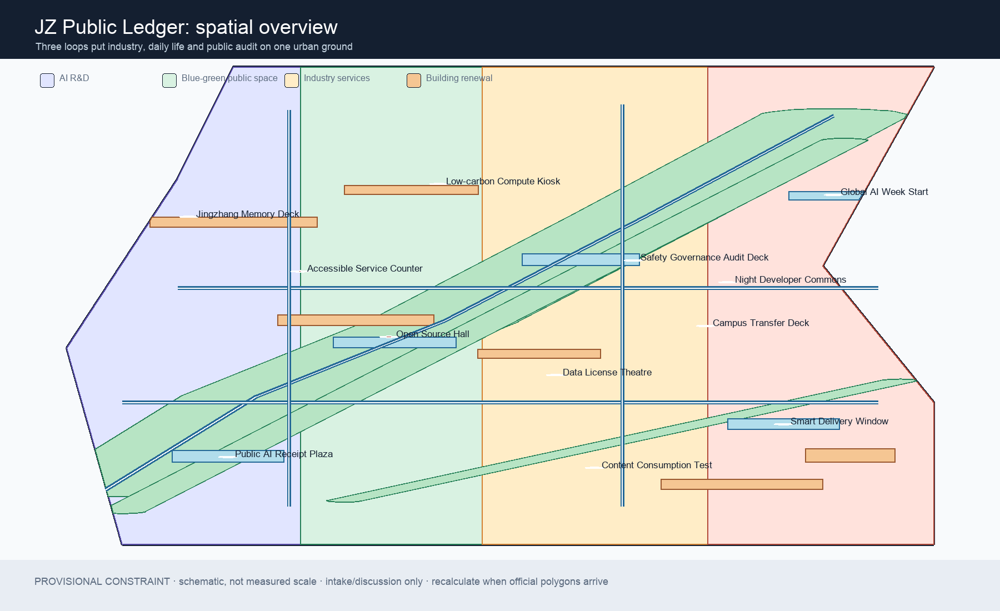
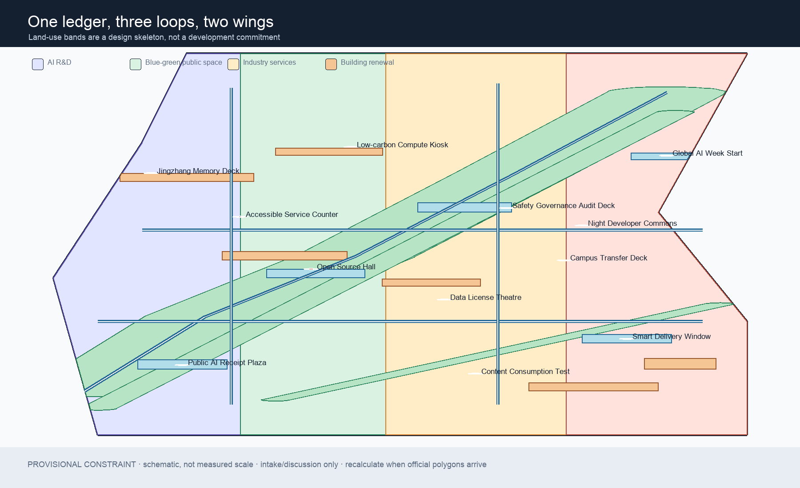
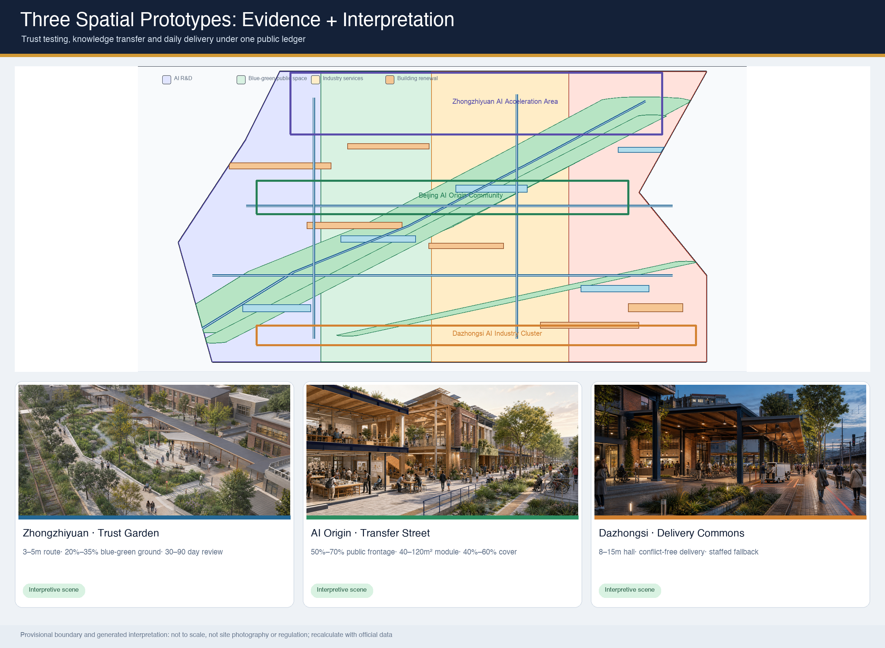
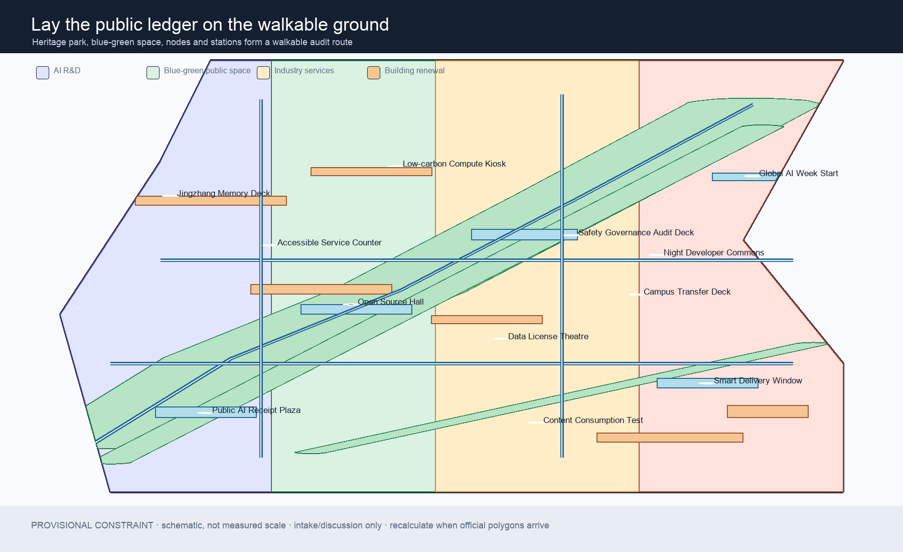
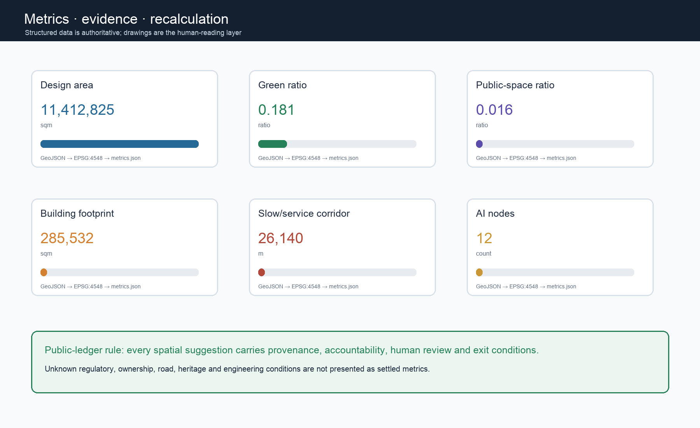

# JZ Public Ledger: A Verifiable AI Urban Loop

> **Core proposition:** An AI innovation belt should show not only where technology happens, but also who provides it, what evidence supports it, who reviews it, how it can be stopped, and how public value returns. This proposal turns the Jingzhang heritage park and its everyday surroundings into a civic ledger that people can read and question.

## Design Basis and Source List

The official prequalification announcement sets the scope, tasks and deliverable context. The cleared agent taskbook supplies requirements agent.1 through agent.6. The repository source registry, site package, processed fact pack and explicitly provisional boundary provide the auditable working basis for this formal package.[source:OFFICIAL-ANNOUNCEMENT] [source:AGENT-TASKBOOK] [source:SOURCE-REGISTRY]

The repository does not yet contain organizer-supplied official SITE_BOUNDARY or KEY_AREA polygons. This package therefore uses an explicitly provisional constraint for generation, intake visualization and discussion. It is not an official redline, regulatory plan, ownership boundary or engineering boundary.[source:SITE-PACKAGE] [source:BOUNDARY-SOURCE] [depth:existing_conditions_diagnosis]

The announcement is used for the three scopes, key areas and design tasks; the taskbook is used for agent participation requirements; the site package is used for schemas, rules and data gaps; comparative cases are background research leads only. No private map, personal data, commercial map tile, remote image or uncleared corporate mark is used.[source:PROCESSED-FACT-PACK] [source:COMPARATIVE-CASES]

The professional boundary follows the registered announcement, agent taskbook, urban-design, regulatory-planning, land-use-classification and architectural-depth references. The local architectural-depth snapshot is marked as awaiting an official source file and is used only as a limitation notice.[standard:PROJECT-OFFICIAL-ANNOUNCEMENT] [standard:PROJECT-AGENT-OPEN-CALL-TASKBOOK] [standard:MOHURD-URBAN-DESIGN-MEASURES]

## Three-Level Scope Framework

The announcement defines a coordinated research area of about 43.6 km² for the AI ecosystem, the three-areas/two-wings relationship and future urban form; an overall design area of about 11.4 km² for renewal, industry, mobility, municipal support, the heritage-park vitality belt and urban character; and a detailed area of about 368.4 hectares covering Zhongzhiyuan, Beijing AI Origin Community and Dazhongsi.[depth:three_level_scope_framework] [data:geometry/site_boundary.geojson#SITE-001]

The public ledger is not a new planning redline. It is a working framework linking the scopes: the coordinated layer records the innovation chain and public interest, the overall layer translates them into space and projects, and the key-area layer tests them through reversible interfaces. The boundary and key areas remain provisional and must be recalculated when official polygons arrive.[data:geometry/key_areas.geojson#PROV-KEY-001] [source:KEY-AREA-SOURCE] [depth:overall_spatial_structure]

| Layer | Design judgment | Spatial and operating output |
| --- | --- | --- |
| Coordinated research | AI innovation is also public-service and trustworthy-governance capacity | Brand, cases, innovation loops, talent and scenario strategy |
| Overall design | Use the heritage park as civic ground connecting industry, campus, community and rail | Land use, blue-green space, slow/service corridors, projects and phases |
| Key areas | Three areas carry trust testing, knowledge transfer and daily delivery | Interface cards, renewal logic, public rooms and AI nodes |

## Coordinated Research Area: Industry and Future City Research

### 1. Concept, name and spatial loops

The name is **JZ Public Ledger / 京张公共账本**. Its subtitle is “Give every intelligent innovation a readable civic receipt.” The identity combines railway tickets, station numbering and modern data cards. Every spatial suggestion can be located, reviewed, corrected and withdrawn.[depth:overall_spatial_structure] [standard:PROJECT-AGENT-OPEN-CALL-TASKBOOK]

The logo direction is an open square: two horizontal rails, three short vertical marks for the key areas, and a reversible check mark for “reviewed, not permanently correct.” Deep blue means evidence, mint means blue-green public space, ochre means culture and industry, and coral means a point requiring human intervention. No uncleared font, portrait, historic photograph or corporate mark is used.

The three positions work as one loop: the Centennial Jingzhang Culture Belt provides time and memory; the Urban AI Life Experience Belt returns intelligence to commuting, learning, care, consumption and leisure; the AI Integrated Innovation Belt connects research, transfer, public testing and global communication. Conceptually, Zhongzhiyuan is trust testing, AI Origin is knowledge transfer, Dazhongsi is daily delivery; the Zhongguancun service wing supports standards and enterprise services, while the Xiaoyuehe scenario wing receives public-facing experiments.[data:geometry/key_areas.geojson#PROV-KEY-002] [source:AGENT-TASKBOOK]

### 2. AI ecosystem and comparative cases

The ecosystem is organized around eight resource desks: models, compute and energy, data and permissions, standards and safety, open source and community, space and equipment, talent and everyday life, and scenarios and public return. Seven comparative prompts for later professional verification are Barcelona 22@, Helsinki Oodi, Singapore Punggol Digital District, Seoul Digital Media City, MIT Living Lab, Amsterdam Smart City and the Barcelona Fab Lab network. Their design questions concern everyday innovation districts, shared civic interiors, campus-industry testing, content and communication, living labs, open collaboration and shared equipment.[source:COMPARATIVE-CASES] [standard:PROJECT-AGENT-OPEN-CALL-TASKBOOK]

These case names are background prompts, not Haidian facts, performance claims or direct copies. Full source, rights and fact checking remain a professional research task.

### 3. Five functions and innovation resources

The five functions become five civic interfaces: the safety-governance audit deck for full-stack autonomy; the open-source hall for a world-class ecosystem; the data-license theatre for AI+ scenarios; the public AI receipt plaza for an intelligent lively city; and the annual public-value review for global AI-governance voice. They connect space, industry, capital, talent, compute, data, scenarios and rules without assuming a supplier, investment, fiscal program or government commitment.[standard:MNR-LAND-USE-CLASSIFICATION-GUIDE] [depth:municipal_new_infrastructure]

## Overall Design Area: Urban Renewal and Regulatory-Plan-Level Urban Design

### 1. Design skeleton and land use

The overall design uses four replaceable spatial bands: AI R&D and trust testing, Jingzhang blue-green public space, industry services and shared exchange, and daily life and community interfaces. Shared cut lines create a gap-free, non-overlapping land-use partition. These are design suggestions, not statutory land-use lines. The land-use classification reference provides language only; official control and ownership data must recalibrate the layer.[data:geometry/land_use.geojson#LU-001] [standard:MNR-LAND-USE-CLASSIFICATION-GUIDE] [depth:land_use_layout]

Buildings are described through retain/renovate priority, reversible renewal, conceptual new-build and pending official conditions. Six footprints only express civic interfaces and renewal types. Floor area, FAR, density, height, setback, fire, utilities, heritage and engineering conditions remain pending.[data:geometry/buildings.geojson#BLDG-ZZY-01] [depth:development_intensity_controls] [depth:height_massing_character]

### 2. Detailed design of the three key areas

- **Zhongzhiyuan AI Acceleration Area — trust testing:** a garden innovation district with a safety-governance audit deck, low-carbon compute kiosk, river interface and public-facing platform research. It is observable, bookable and stoppable; no platform list or technical maturity is presented as fact.[data:geometry/key_areas.geojson#PROV-KEY-001]
- **Beijing AI Origin Community — knowledge transfer:** a near-campus interface with an open-source hall, campus-transfer deck and accessible service counter. Campus data, research outputs, intellectual property and housing data require separate authorization.[data:geometry/key_areas.geojson#PROV-KEY-002]
- **Dazhongsi AI Industry Cluster — daily delivery:** an urban interface with a data-license theatre, content test ground, smart-delivery window and station-city delivery hall. Corporate buildings and ownership spaces are not assumed available for alteration.[data:geometry/key_areas.geojson#PROV-KEY-003]

All three key areas use provisional polygons and cannot support precise parcel scoring. A professional team should rebuild land use, buildings, roads, blue-green layers and phasing from official geometry.[depth:three_key_area_detailed_design] [standard:MOHURD-CONTROL-DETAILED-PLANNING]

### Key-Area Spatial Prototypes and Non-Statutory Design Targets

The following three scenes translate the structured proposal into discussable spatial experience. They were independently generated by the declared agent from this proposal text, without external photographs, map screenshots, portraits or corporate material. Buildings, planting, people and equipment are interpretive prototypes—not site photographs, precise designs, official boundaries or implementation commitments. GeoJSON, metrics and matrices remain authoritative for boundaries, areas and indicators.[source:AI-VISUAL-INTERPRETATION] [depth:three_key_area_detailed_design]

#### Zhongzhiyuan: Trust Testing Garden

Retained and adapted buildings frame an observable courtyard; the public green spine runs beside the heritage rail alignment; test equipment remains lightweight and staffed. Non-statutory targets are a 3–5 m clear accessible public route, rain-garden and tree/shrub planting across 20%–35% of pilot public ground, and one public review after each reversible test unit operates for 30–90 consecutive days. These comparison targets do not replace formal road, fire, accessibility, green-space or park conditions.

#### AI Origin Community: Knowledge Transfer Street

Open-source release, prototyping, community service and daily walking share one ground-floor interface. Non-statutory targets are public or semi-public interfaces along 50%–70% of the main ground-floor frontage, combinable shared prototype units of 40–120 m², and shade or rain cover along 40%–60% of the principal public interface. Research outputs, intellectual property and campus space still require rights-holder confirmation.

#### Dazhongsi: Station-City Daily Delivery Commons

A walk-through civic hall links transit, active ground floors and Jingzhang civic ground, while delivery handoff occupies an observable and closable time-window zone. Non-statutory targets are an effective public-hall depth of 8–15 m, full conflict separation between delivery handoff and the primary pedestrian flow through space or time, and staffed service whenever automated service is available. Formal transport, ownership, fire and operating conditions must verify them.[data:geometry/public_space.geojson#PUBLIC-ROOM-03] [depth:traffic_rail_slow_parking]

All targets, stages, review triggers and non-regulatory disclaimers are recorded in `visual/assets/key-area-design-targets.json`; tool, input and rights provenance for the generated scenes is recorded in `visual/assets/scene-provenance.json`.

### 3. Transport, rail, municipal systems and blue-green space

The “Public Receipt Spine” and four east-west stitches prioritize the heritage route, walking, cycling, wayfinding, AI scenarios and public services. The road layer represents conceptual slow-mobility and service corridors, not road redlines. Wudaokou, Qinghua East Road West, Dazhongsi, the Fifth Ring Road and crossing points require formal transport and engineering review.[data:geometry/roads.geojson#ROAD-001] [depth:traffic_rail_slow_parking]

The blue-green system combines one continuous green ground, ecological fingers and five public rooms. Green space supports cooling, stormwater, walking and biodiversity; public rooms support reading receipts, open-source release, human review, daily delivery and cultural memory. They share one evidence chain with buildings, roads and AI nodes.[data:geometry/green_space.geojson#GREEN-LEDGER-SPINE-01] [data:geometry/public_space.geojson#PUBLIC-ROOM-01] [depth:blue_green_public_space]

New infrastructure follows “light, visible and reversible.” Edge compute, sensors, wayfinding and service terminals are conceptual prototypes only. Data minimization, human review, accessibility and parallel traditional service are prerequisites. Utilities, energy, drainage, fire, heritage and rail interfaces need official attachments.[depth:municipal_new_infrastructure] [standard:MOHURD-URBAN-DESIGN-MEASURES]

## AI Innovation Ecosystem, Personas, and AI+ Scenarios

### 1. Six user personas

The six synthetic design personas are an open-source developer, an early-stage team, a university researcher or student, a corporate visitor, a neighboring resident or caregiver, and an older, disabled or low-digital-literacy user. Their shared requirements are readable access, everyday services, human fallback and no personal tracking. These are not personal data.[source:AGENT-TASKBOOK] [standard:BARRIER-FREE-ENVIRONMENT-LAW]

### 2. Twelve AI scenario cards

The cards are: public AI receipt; walkability audit; safety sandbox; data-license theatre; open-source hall; campus transfer; accessible service counter; low-carbon compute kiosk; smart-delivery window; industry proving ground; Jingzhang memory route; and global AI week route. Each card has a user, a space, a source boundary, a human reviewer, a public-return field and an exit condition. The cards are indexed by the narrative and public-room layer; nodes are concepts, not approved deployments.[data:geometry/public_space.geojson#PUBLIC-ROOM-01] [metric:scenario_card_count] [metric:ai_node_count]

### 3. Three industry test/validation packages

The first package tests explainability, bias notices, human review and rollback for models in Zhongzhiyuan; the second tests the path from research to open documentation, intellectual property and community feedback in AI Origin; the third tests low-speed delivery, terminal interaction, content and data permissions in Dazhongsi. All retain human control, authorized data and a stop-test mechanism. They are reference packages for professional and community review, not approved operations.[metric:industry_test_scenario_count] [depth:overall_spatial_structure]

## Land Use, Building Scale, and Retain-Renovate-Demolish Strategy

The land-use layer covers the submission boundary without gaps. Buildings express reversible renewal and civic interfaces only. Retain before demolish, renovate before new-build, and obtain official ownership, heritage, fire, structure and utility information before any action.[data:geometry/land_use.geojson#LU-002] [data:geometry/buildings.geojson#BLDG-AIO-01] [depth:retain_renovate_demolish]

The architectural direction is an accessible ground floor, adaptable shared levels and a legible roofline, with shade, nighttime safety and cultural material. No unsupported height, massing, FAR, setback or demolition conclusion is made. The footprint is recalculable; total floor area, FAR, density and height remain pending.[metric:building_footprint_area_sqm] [metric:total_floor_area_sqm] [metric:floor_area_ratio] [depth:development_intensity_controls]

## Transport, Rail, Municipal Infrastructure, and Public Services

The transport strategy repairs the civic ground before adding intelligence: walking and cycling first, readable station connections, managed bicycle storage, timed low-speed delivery and human takeover. The road layer is a conceptual service and slow-mobility network; road redlines, rail interfaces, parking, fire and evacuation conditions need official review.[data:geometry/roads.geojson#ROAD-003] [depth:traffic_rail_slow_parking]

Services are grouped into industry, innovation, talent-life, accessible-service and new-infrastructure interfaces. Each has a public entry, human alternative, data-minimization rule and stop mechanism. Edge compute, energy, smart wayfinding and sensing are reversible prototypes, not municipal engineering designs.[depth:municipal_new_infrastructure] [standard:MOHURD-URBAN-DESIGN-MEASURES]

## Blue-Green Network, Public Space, and Urban Character

Railway culture is not a technology decoration: station, ticket, mileage, dispatch and maintenance become the narrative grammar of the public ledger. Zhongguancun culture contributes openness, experimentation, collaboration and intellectual-property awareness. AI culture adds explainability, rollback, attribution and care. The heritage resources and the park require further official cultural and heritage verification.[source:OFFICIAL-ANNOUNCEMENT] [depth:height_massing_character]

Three conceptual AI pilgrimage landmarks are Origin Receipt Plaza, Audit Deck and Night Commons Deck. They let the public read service provenance, observe human review, and meet across developer and everyday communities. They do not claim to alter heritage, green-space, blue-line or ownership controls.[metric:landmark_count] [data:geometry/public_space.geojson#PUBLIC-ROOM-03] [depth:blue_green_public_space]

## Renewal Projects, Implementation Policy, and Phasing

Six reversible projects are proposed: public receipts and walkability audit; the Zhongzhiyuan safety-governance deck; the AI Origin open-source and transfer street; the Dazhongsi station-city delivery hall; five AI public-service prototypes; and a global public-value review week. Each requires road, accessibility, ownership, privacy, heritage, activity-safety and rights review before implementation.[data:geometry/phasing.geojson#PHASE-01] [depth:renewal_project_list] [depth:phasing_implementation]

Phasing is a light pilot for receipts and walkability, a middle phase for the three interfaces, and a long-term phase for the global AI community and public knowledge base. `phasing.geojson` is a conceptual phase layer, not a construction commitment.[source:AGENT-TASKBOOK]

## Metrics, Area Recalculation, and Compliance Matrix

Exchange geometry uses EPSG:4326 and area calculation uses EPSG:4548. The design-layer metrics include site area [metric:site_area_sqm], green area [metric:green_space_area_sqm], green ratio [metric:green_ratio], public-space area [metric:public_space_area_sqm], public-space ratio [metric:public_space_ratio], building footprint [metric:building_footprint_area_sqm], slow/service corridor length [metric:road_length_m], phase area [metric:phase_area_sqm], key-area count [metric:key_area_count], AI-node count [metric:ai_node_count], scenario-card count [metric:scenario_card_count], industry-test count [metric:industry_test_scenario_count], persona count [metric:persona_count] and landmark count [metric:landmark_count]. Each has a source file, formula, confidence and assumptions.

Total floor area, FAR and building density remain pending official data, rather than becoming guessed controls.[metric:total_floor_area_sqm] [metric:floor_area_ratio] [metric:building_density] [source:SITE-PACKAGE]

The compliance matrix covers all required announcement and agent.1-agent.6 tasks. The standard matrix contains six registered references. The design-depth matrix marks 15 items complete as package evidence, which does not mean the boundary or professional approval is complete.[source:OFFICIAL-ANNOUNCEMENT] [source:AGENT-TASKBOOK] [depth:metrics_recalculation]

Depth evidence is grouped as scope and diagnosis [depth:existing_conditions_diagnosis] [depth:three_level_scope_framework] [depth:overall_spatial_structure]; land use and buildings [depth:land_use_layout] [depth:development_intensity_controls] [depth:height_massing_character] [depth:retain_renovate_demolish]; mobility, systems and blue-green [depth:traffic_rail_slow_parking] [depth:municipal_new_infrastructure] [depth:blue_green_public_space]; and key areas, renewal and risk [depth:three_key_area_detailed_design] [depth:renewal_project_list] [depth:phasing_implementation] [depth:risk_missing_data].

## Risk, Copyright, and Compliance

The package distinguishes formal sources, provisional constraints, background cases and conceptual suggestions. The provisional boundary, key areas and derived spatial layers are not official redlines. Missing regulatory, ownership, road, utility, fire, heritage, rail and engineering data are listed in `assumptions.json` and trigger full-package recalculation when supplied.[data:geometry/constraints.geojson#CONSTRAINT-RAILWAY-AXIS] [depth:risk_missing_data]

AI scenarios use data minimization, public or authorized data, human review, accessibility, parallel traditional service and a pause mechanism. They do not support surveillance, unauthorized profiling, automatic approvals or irreversible alteration. Specific services still require legal and operational review.[standard:GENERATIVE-AI-INTERIM-MEASURES] [standard:BARRIER-FREE-ENVIRONMENT-LAW]

All drawings, images, HTML, GeoJSON and text are generated in this package or derived from the registered public/cleared materials. No remote asset, uncleared font, portrait, trademark, historic photo or corporate marketing material is embedded.[source:SOURCE-REGISTRY] [standard:MOHURD-ARCH-DESIGN-DEPTH-2016]

This is a `COMMUNITY-DISPLAY-ONLY` AI-agent concept proposal. It is not government approval, statutory planning, engineering design, investment commitment or a built project. Final judgment belongs to humans and professional teams.[source:SITE-PACKAGE]

## References

The proposal's main evidence and limitations are supported by the official announcement and the registered sources.[source:OFFICIAL-ANNOUNCEMENT] [source:SOURCE-REGISTRY]

- Beijing Municipal Commission of Planning and Natural Resources, Haidian Branch: official prequalification announcement for the Centennial Jingzhang AI Innovation Belt urban-design call.
- open-city-ai/haidian: `brief/site-package/`, `data/source_registry.json` and `data/processed/agent_fact_pack.md`.
- Cleared taskbook excerpt for global agents participating in the Centennial Jingzhang AI Innovation Belt call.
- Ministry of Housing and Urban-Rural Development: urban design management and regulatory-plan preparation references.
- Ministry of Natural Resources: land-use classification guide.
- National People’s Congress: Law on the Construction of a Barrier-Free Environment; CAC and ministries: Interim Measures for Generative AI Services.
