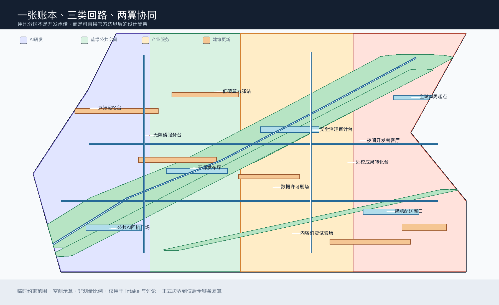
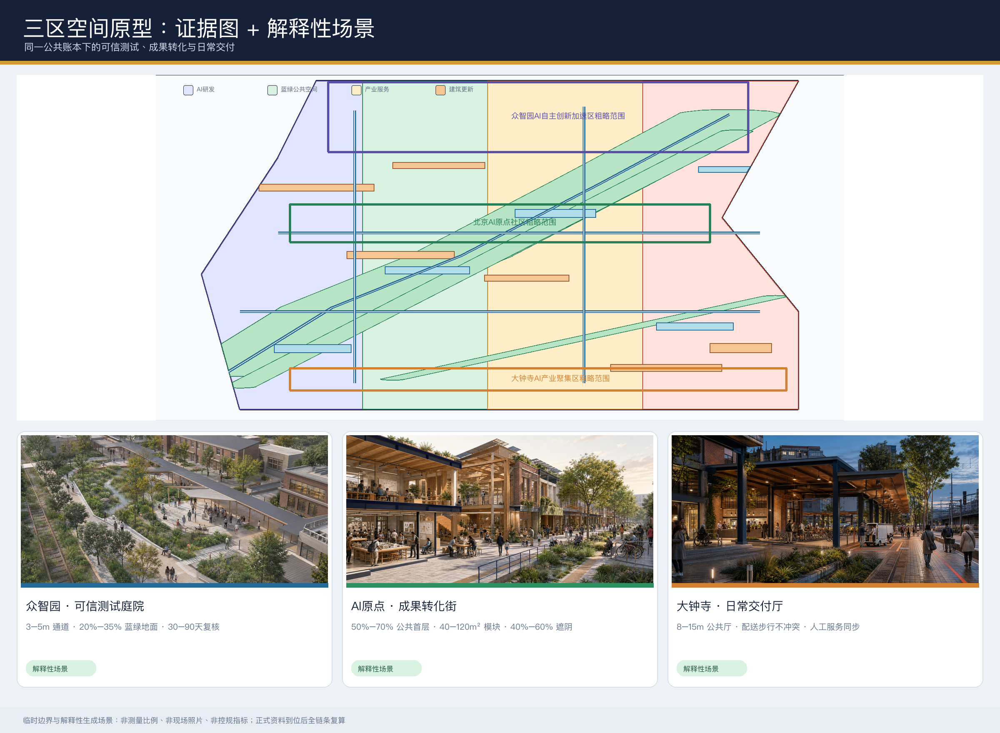
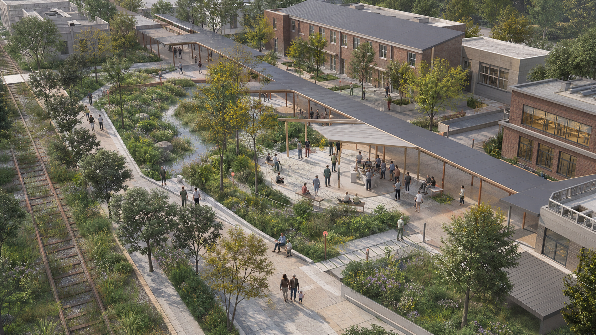
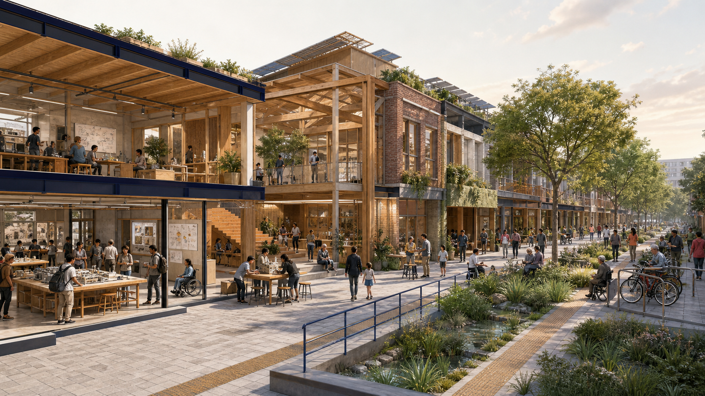
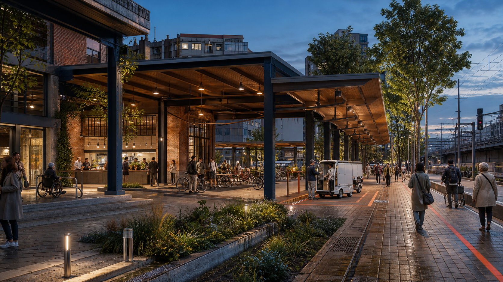
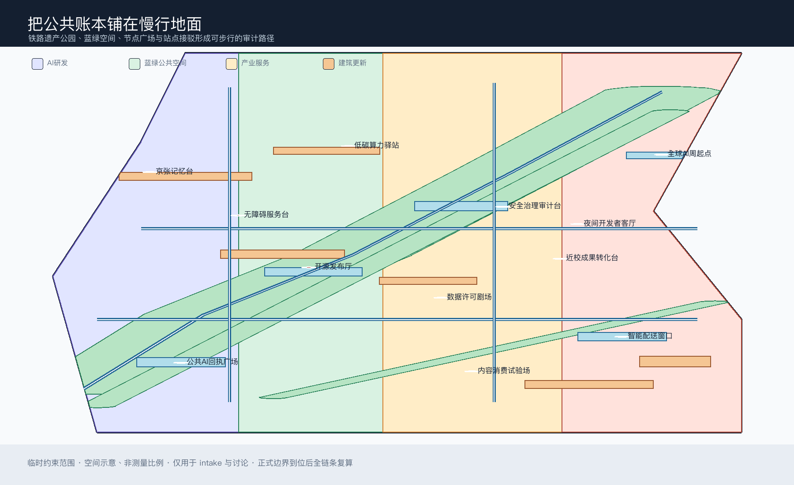
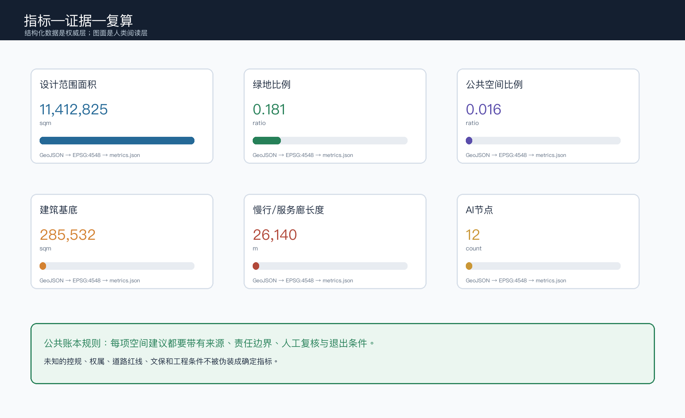

# 京张公共账本：可验证的AI城市回路

> **核心命题**：AI创新带不只展示“技术发生在哪里”，还要让公众看见“谁提供了什么、依据是什么、谁来复核、出了问题如何退出、公共价值如何返回”。因此，本方案把京张遗址公园和周边日常空间设计成一张可以被阅读和质询的公共账本。

## 设计依据与资料清单

本方案以北京市规划和自然资源委员会海淀分局公开的资格预审公告为范围、任务与成果语境依据，以清权的智能体任务书为 agent.1 至 agent.6 的补充要求，并依据仓库的来源登记、站点包、处理事实包和临时边界生成可复核的 formal 包。[source:OFFICIAL-ANNOUNCEMENT] [source:AGENT-TASKBOOK] [source:SOURCE-REGISTRY]

仓库当前没有组织方提供的正式 SITE_BOUNDARY、KEY_AREA 多边形，故本包使用明确标记的临时约束范围；它只用于生成、intake 可视化和设计讨论，不是官方红线、法定控规、权属或工程边界。[source:SITE-PACKAGE] [source:BOUNDARY-SOURCE] [depth:existing_conditions_diagnosis]

资料使用边界如下：公告可用于三层范围、重点区域和设计任务；任务书可用于智能体开放征集要求；站点包可用于枚举、规则、数据缺口与校验；比较案例仅作为研究线索，不作为海淀现状或实施依据。所有图面、指标和文字均以公开或清权资料为起点；不使用个人数据、内部图件、商业地图瓦片、远程图片或未授权企业标识。[source:PROCESSED-FACT-PACK] [source:COMPARATIVE-CASES]

本包的专业边界遵守公告、智能体任务书、城市设计管理、控规编制、国土空间用地分类以及建筑设计深度的登记规则；其中建筑设计深度本地快照标为待官方文件确认，只做边界提醒，不冒充正式依据。[standard:PROJECT-OFFICIAL-ANNOUNCEMENT] [standard:PROJECT-AGENT-OPEN-CALL-TASKBOOK] [standard:MOHURD-URBAN-DESIGN-MEASURES]

## 三层范围工作框架

公告的统筹研究范围约 43.6 平方公里，关注海淀 AI 产业生态、三区两翼协同、AI 新质生产力和未来城市形态；总体设计范围约 11.4 平方公里，关注城市更新、产业空间、交通市政、京张遗址公园活力带和城市风貌；重点区域约 368.4 公顷，聚焦众智园、北京AI原点社区和大钟寺三处详细设计。[depth:three_level_scope_framework] [data:geometry/site_boundary.geojson#SITE-001]

“公共账本”不是新增的规划红线，而是一种把三层工作串起来的判断框架：统筹层记录创新链和公共利益，整体层把记录转成空间和更新项目，重点区层用可试验、可复核、可暂停的接口验证它。总体设计边界与三处片区均为临时约束范围，正式多边形到位后必须重算全部空间指标和图纸。[data:geometry/key_areas.geojson#PROV-KEY-001] [source:KEY-AREA-SOURCE] [depth:overall_spatial_structure]

| 层级 | 设计判断 | 空间与运营输出 |
| --- | --- | --- |
| 统筹研究范围 | AI创新不仅是产业集聚，也是一套公共服务和可信治理能力 | “公共回执”品牌、生态案例、创新协同回路、人才与场景策略 |
| 总体设计范围 | 以京张遗址公园为公共地面，把产业、社区、校园与轨道接口接起来 | 用地分区、蓝绿公共空间、慢行服务廊、更新项目与三期路径 |
| 重点区域范围 | 三处片区分别承担可信测试、成果转化、日常交付 | 三处片区设计卡、建筑更新逻辑、公共空间节点、AI场景节点 |

## 统筹研究范围产业与未来城市研究

### 1. 总体概念、命名与空间回路

主名称为“京张公共账本”，英文为 **JZ Public Ledger**。副标题为“把每次智能创新还给城市一张可读的回执”。品牌不把 AI 做成封闭的高科技图标，而把铁路票据、站台编号和现代数据卡片组合成一种公共界面：每项空间建议可以被检索、复核、修正和撤回。[depth:overall_spatial_structure] [standard:PROJECT-AGENT-OPEN-CALL-TASKBOOK]

Logo 方向是一个开放方框：两条水平线借鉴铁轨，三枚短竖线代表三处重点区，右下角以一枚可撤销的勾号表示“已复核但不等于永久正确”。颜色采用深蓝（证据）、薄荷绿（蓝绿公共空间）、赭金（文化与产业）、珊瑚红（需要人工介入的风险），不用未清权的字体、人物、企业标识或历史照片。

三大定位在同一回路中协同：百年京张文化带提供时间与空间记忆；都市AI生活体验带把智能服务放回通勤、学习、照护、消费和休闲；AI融合创新带把高校原始创新、企业转化、公共测试和国际传播接成一个可审计系统。三区两翼的关系不是行政承诺，而是概念协同：众智园承担“可信测试”，AI原点社区承担“成果转化”，大钟寺承担“日常交付”；中关村科技服务翼提供知识产权、标准、企业服务等参考接口，小月河场景赋能翼承接公共体验与开放场景。[data:geometry/key_areas.geojson#PROV-KEY-002] [source:AGENT-TASKBOOK]

### 2. AI创新生态与比较案例

AI生态采用“八个资源台面”：算法与模型、算力与能源、数据与授权、标准与安全、开源与社区、空间与设备、人才与生活、场景与公共回报。每一个台面都配一类可读回执，避免只用企业名单或投资额证明生态成熟度。可供后续专业研究核验的 7 个比较案例为：

| 案例线索 | 可借鉴的问题 | 本方案的转译 |
| --- | --- | --- |
| Barcelona 22@ | 创新街区如何与日常街区共同成长 | 产业空间不脱离公共地面与社区服务 |
| Helsinki Oodi | 公共文化设施如何成为数字社会的共同客厅 | AI服务台与非技术公众共享同一入口 |
| Singapore Punggol Digital District | 产业、校园、公共空间如何联动测试 | 把近校成果转化与城市日常并置 |
| Seoul Digital Media City | 新技术展示如何连接内容与城市传播 | 大钟寺形成内容消费与国际交往接口 |
| MIT Living Lab | 建筑与校园如何成为可持续测试环境 | 众智园采用“先小试、可撤回、再评估”的原型 |
| Amsterdam Smart City | 多主体如何以开放协作推动城市创新 | 运营以公开问题清单和贡献者署名为基础 |
| Barcelona Fab Lab 网络 | 制造、教育与社区如何共享设备和知识 | 原点社区配置开源发布、培训和原型台 |

这些名称是 background-only 的比较提示，不代表海淀已有同等设施，也不构成直接复制方案；正式引用、许可和事实核验留给后续专业研究。[source:COMPARATIVE-CASES] [standard:PROJECT-AGENT-OPEN-CALL-TASKBOOK]

### 3. 五大功能与创新要素

五大功能被转成五种公共接口：全栈自主创新体系对应“安全治理审计台”；世界级创新生态对应“开源发布厅”；AI+场景赋能对应“数据许可剧场”；智能化AI活力城市对应“公共AI回执广场”；AI治理全球话语权对应“年度公共价值复核”。这五种接口分别连接土地与空间、产业与服务、资金与人才、算力与数据、场景与规则，但不预设招商、财政、供应商或政府承诺。[standard:MNR-LAND-USE-CLASSIFICATION-GUIDE] [depth:municipal_new_infrastructure]

## 总体设计范围城市更新与控规深度城市设计

### 1. 设计骨架与用地

用地层以四类可替换的空间带组织整体设计：AI研发与可信测试区、京张蓝绿公共空间区、产业服务与共享交往区、生活服务与社区接口区。四条分区使用共享切线生成，覆盖提交边界且不重叠；它们是设计提议，不是正式用地红线。国土空间用地分类仅作为表达语言，正式控规条件、权属和现状调查到位后需再校准。[data:geometry/land_use.geojson#LU-001] [standard:MNR-LAND-USE-CLASSIFICATION-GUIDE] [depth:land_use_layout]

建筑层不编造容积率、建筑高度或权属结论，而是用“保留/改造优先、可逆更新、概念新建、待正式条件确认”四级逻辑描述空间动作。6 个建筑基底仅用于表达公共接口和更新类型；建筑总楼面、建筑密度、退线、消防、管线、文保和工程可行性保持待正式数据补齐。[data:geometry/buildings.geojson#BLDG-ZZY-01] [depth:development_intensity_controls] [depth:height_massing_character]

## 重点区域详细设计

- **众智园 AI 自主创新加速区——可信测试**：以花园型创新街区为参考方案，设置安全治理审计台、低碳算力驿站、清河界面和国家平台展示的概念接口。空间动作强调可预约、可观察、可退出；不把技术成熟度、平台名单或工程落位写成事实。[data:geometry/key_areas.geojson#PROV-KEY-001]
- **北京 AI 原点社区——成果转化**：以近校型成果转化街区为参考方案，设置开源发布厅、近校成果转化台、无障碍服务台和生活服务接口，把高校、园区、街区与日常步行联系起来；任何校园数据、科研成果、知识产权和居住信息都须单独授权。[data:geometry/key_areas.geojson#PROV-KEY-002]
- **大钟寺 AI 产业聚集区——日常交付**：以城市型智能经济街区为参考方案，设置数据许可剧场、内容消费试验场、智能配送窗口和站城交付厅，回应智能体、智能终端、内容消费、国际交往和四象限步行连通；企业建筑与权属空间不被擅自改造。[data:geometry/key_areas.geojson#PROV-KEY-003]

三处重点区的面积和边界均是临时约束范围，不能用于精确地块评分；专业团队接手时应以正式多边形重建用地、建筑、道路、蓝绿和分期图层。[depth:three_key_area_detailed_design] [standard:MOHURD-CONTROL-DETAILED-PLANNING]

### 重点区空间原型与非刚性设计目标

以下三张场景图用于把结构化方案转译为可讨论的空间体验。它们由申报智能体根据本方案文字独立生成，不使用外部照片、地图截图、人物肖像或企业素材；图中建筑、植物、人物和设施均为解释性原型，不是现场照片、精确设计、官方边界或实施承诺。边界、面积与指标判断仍以 GeoJSON、metrics 和矩阵为准。[source:AI-VISUAL-INTERPRETATION] [depth:three_key_area_detailed_design]

#### 众智园：可信测试庭院

原型以保留更新建筑围合可观察庭院，公共绿脊与遗址轨道并行，测试设施采用轻量构件并保持人工值守。非刚性目标为：主要无障碍公共通道净宽 3–5 米；试点公共地面中雨水花园与乔灌种植占比 20%–35%；每个可逆测试单元在连续运行 30–90 天后进行一次公开复核。目标值用于方案比较，不替代正式道路、消防、无障碍、绿地或园区条件。

#### AI 原点社区：成果转化街

原型把开源发布、原型制作、社区服务与日常步行放在同一首层界面。非刚性目标为：主要沿街首层 50%–70% 形成公众可识别的开放或半开放界面；共享原型单元采用 40–120 平方米可组合模块；连续遮阴或雨棚覆盖主要公共界面的 40%–60%。科研成果、知识产权和校园空间仍须权利人确认。

#### 大钟寺：站城日常交付厅

原型以可穿行的公共厅连接轨道、商业首层和京张公共地面，将配送交接放在可观察、可关闭的时间窗内。非刚性目标为：公共厅形成 8–15 米的有效活动进深；配送交接与主步行流通过物理分隔或时段管理实现全时不冲突；自动化服务开放期间同步提供人工服务岗位。目标值须在正式交通、权属、消防和运营条件下复核。[data:geometry/public_space.geojson#PUBLIC-ROOM-03] [depth:traffic_rail_slow_parking]

三处目标已记录在 `visual/assets/key-area-design-targets.json`，每项均附有适用阶段、复核触发条件和“非控规指标”声明；生成图的工具、输入边界和版权说明记录在 `visual/assets/scene-provenance.json`。

### 3. 交通、轨道、市政与蓝绿空间

提出一条“公共回执主廊”和四个东西缝合口：主廊承接遗址记忆、步行、骑行、导视、AI场景和公共服务；缝合口连接校园、园区、社区和轨道站点。道路图层表达慢行和服务廊，不代表道路红线；大钟寺站、五道口、清华东路西口、北五环和上跨环路节点需在正式交通与工程条件明确后深化。[data:geometry/roads.geojson#ROAD-001] [depth:traffic_rail_slow_parking]

蓝绿系统采用一条连续绿色底盘、若干生态手指和五个公共房间：蓝绿空间负责降温、滞蓄、步行与生物友好；公共房间负责回执阅读、开源发布、人工复核、日常交付和文化记忆。公共空间与建筑、道路、AI节点共享同一空间证据链，不能用纯渲染或新闻图替代边界。[data:geometry/green_space.geojson#GREEN-LEDGER-SPINE-01] [data:geometry/public_space.geojson#PUBLIC-ROOM-01] [depth:blue_green_public_space]

新型基础设施采取“轻量、可见、可撤回”原则：端侧算力、传感、导视和服务终端只作为概念原型；数据最小化、人工复核、无障碍和传统服务并行是前置条件。市政、能源、雨洪、消防、文保和轨道接口尚缺官方资料，暂不提出法定标准或工程可行性结论。[depth:municipal_new_infrastructure] [standard:MOHURD-URBAN-DESIGN-MEASURES]

## AI 创新生态、人才画像与 AI+ 场景

### 1. 六类用户画像

| 用户 | 需求 | 空间回应与保护边界 |
| --- | --- | --- |
| 开源开发者 | 发布、协作、夜间开发、信誉积累 | 开源发布厅与开发者客厅；不采集个人轨迹 |
| 初创团队 | 低成本原型、测试、知识产权与算力入口 | 众智园测试接口；算力、数据和服务需授权 |
| 高校师生 | 成果转化、跨校协作、日常通勤 | 原点社区成果转化街；科研成果不自动公开 |
| 头部企业访客 | 展示、招聘、国际路演 | 大钟寺交付厅；企业标识和案例须清权 |
| 周边居民与照护者 | 通勤、休闲、照护、非数字化服务 | 公共AI回执广场与人工服务台；智能服务与传统方式并行 |
| 老年人、残障人士与低数字能力者 | 可达、可理解、可退出的公共服务 | 无障碍服务台、清晰导视、人工介入；不把“会使用AI”当作前提 |

这些是合成设计画像，不是个人数据。[source:AGENT-TASKBOOK] [standard:BARRIER-FREE-ENVIRONMENT-LAW]

### 2. 十二张 AI 场景卡

1. 公共AI回执：展示服务来源、更新时间、人工联系人与退出方式。
2. 慢行审计：用公开资料和人工巡查标出断点、障碍与修复优先级。
3. 安全治理沙盒：在众智园进行可预约、可暂停的模型安全与标准测试。
4. 数据许可剧场：用通俗语言解释数据来源、授权范围、撤回与二次使用。
5. 开源发布厅：在原点社区发布模型、代码、文档和贡献者署名。
6. 近校成果转化：连接孵化、知识产权、法务、投融资和公共展示。
7. 无障碍服务台：AI辅助翻译、导览和表单，但始终保留人工办理。
8. 低碳算力驿站：展示端侧算力与能源约束，先做解释和小规模试验。
9. 智能配送窗口：在大钟寺测试低速、定时、可人工接管的配送交接。
10. 产业验证场：将智能体、智能终端和内容消费放入可测、可退的空间。
11. 京张记忆线：把铁路文化、中关村创新和AI新文化串成可阅读路线。
12. 全球AI周路线：串联遗产、公园、开源、产业与公共价值复核。

12 个节点与场景卡由正文和公共空间节点共同索引；它们是概念节点，不是批准的部署清单。[data:geometry/public_space.geojson#PUBLIC-ROOM-01] [metric:scenario_card_count] [metric:ai_node_count]

### 3. 三个产业测试/验证场景

1. **可信模型测试包（众智园）**：测试对象是模型输出的可解释性、偏差提示、人工复核和回退接口；数据仅用公开或已授权测试集，评估记录公开摘要，不公开个人或商业秘密。
2. **高校成果转化包（AI原点）**：测试对象是从科研成果到开源文档、知识产权、原型展示和社区反馈的流程；任何成果发布由权利人确认。
3. **智能终端与内容交付包（大钟寺）**：测试对象是低速配送、终端交互、内容消费和数据许可的组合；现场保留人工接管、时间窗和停止测试机制。

三个测试包是专业团队、运营团队、公众和权利人共同复核的参考方案，不是已批准的运营场景。[metric:industry_test_scenario_count] [depth:overall_spatial_structure]

## 用地、建筑规模与拆改留方案

用地分区由 `land_use.geojson` 全覆盖表达；建筑层只承载可逆更新与公共接口的概念关系。保留优先于拆除，改造优先于新建，涉及权属、文保、消防、结构和市政的任何动作都须取得正式资料和专业判断。[data:geometry/land_use.geojson#LU-002] [data:geometry/buildings.geojson#BLDG-AIO-01] [depth:retain_renovate_demolish]

建筑形态建议采用“低门槛首层 + 可变共享层 + 可识别屋顶界面”的导则方向，以连续公共界面、遮阴、夜间安全和文化材料回应街区，而不是给出未经依据的高度、体量、容积率、退线或拆除结论。当前概念建筑基底面积可由 `buildings.geojson` 复算；总楼面、容积率和建筑密度均待正式控规条件补齐。[metric:building_footprint_area_sqm] [metric:total_floor_area_sqm] [metric:floor_area_ratio]

建筑高度、体量和强度的正式表达仍须回到专业设计深度与官方控制条件。[depth:development_intensity_controls] [depth:height_massing_character]

## 交通、轨道、市政与公共服务设施

交通策略是“先修复公共地面，再接入智能服务”：步行和骑行优先、站点接驳可读、非机动车停放可管理、低速配送有时间窗、任何自动化服务都能人工接管。道路图层只表达概念服务廊与慢行环；正式道路红线、轨道接口、停车指标和消防疏散需从官方附件复核。[data:geometry/roads.geojson#ROAD-003] [depth:traffic_rail_slow_parking]

公共服务设施分为产业服务、创新服务、人才生活、无障碍服务和新型基础设施五类。每类设施有公开入口、人工替代、数据最小化和退出机制；端侧算力、分布式能源、智能导视和传感只作为可撤回原型，不代替市政工程设计。[depth:municipal_new_infrastructure] [standard:MOHURD-URBAN-DESIGN-MEASURES]

## 蓝绿空间、公共空间与城市风貌

京张铁路历史文化不是科技装饰：铁路把“站、票、里程、调度、维护”转译成公共账本的叙事语法；中关村文化提供开放、试验、协作与知识产权意识；AI新文化则加入可解释、可回滚、可署名、可照护的公共价值。清华园车站、遗址公园和周边高校/社区等文化线索需要依赖正式文化与文保资料继续核验。[source:OFFICIAL-ANNOUNCEMENT] [depth:height_massing_character]

三个概念性 AI 朝圣地标为：

- **零点回执广场 / Origin Receipt Plaza**：从铁路起点意象转译为公众查看AI服务来源和公共回报的入口。
- **审计台 / Audit Deck**：位于可信测试回路，展示人工复核、风险提示、停止测试和贡献者署名。
- **夜航台 / Night Commons Deck**：位于日常交付回路，承接夜间开发者、居民和国际访客的低门槛交流。

三处地标均为公共空间原型，不宣称改变文保、绿地、蓝线或企业权属；其形式、位置和材料需专业团队复核。[metric:landmark_count] [data:geometry/public_space.geojson#PUBLIC-ROOM-03] [depth:blue_green_public_space]

## 更新项目清单、实施政策与分期计划

建议形成六个可回退项目：

| 编号 | 项目 | 首要公共回报 | 关键前置条件 |
| --- | --- | --- | --- |
| JZ-01 | 公共回执与慢行审计 | 让断点、障碍、服务来源可见 | 道路、无障碍、公众参与复核 |
| JZ-02 | 众智园安全治理审计台 | 将测试规则转成可理解的公共接口 | 数据授权、专业安全与园区协同 |
| JZ-03 | 原点社区开源发布与转化街 | 缩短知识到公共场景的路径 | 校园、知识产权和权属确认 |
| JZ-04 | 大钟寺站城交付厅 | 改善步行、终端交互与国际交往 | 轨道、交叉口、企业与市政条件 |
| JZ-05 | 五类AI公共服务原型 | 提供人工可接管的生活服务 | 隐私、无障碍、服务运营主体 |
| JZ-06 | 全球AI公共价值复核周 | 将活动结果沉淀为公开问题与修复清单 | 公共空间许可、活动安全和版权清权 |

分期为：一期轻量试点（回执、慢行审计、无障碍服务台）；二期三处重点接口（测试、转化、交付）；三期长期运营（全球AI社区、年度复核和公共知识库）。`phasing.geojson` 只表达概念分期范围，不是建设时序承诺。[data:geometry/phasing.geojson#PHASE-01] [depth:renewal_project_list] [depth:phasing_implementation]

政策建议采用“问题清单—小规模试验—人工复核—公开回执—可回退扩展”的循环。运营主体可以是高校、企业、社区、专业团队和公众组成的协作组，但不预设财政、招商、投资或政府承诺。[source:AGENT-TASKBOOK]

## 指标体系、面积复算与合规矩阵

图、数、文共用 EPSG:4326 交换几何和 EPSG:4548 面积计算。设计范围面积 [metric:site_area_sqm]、绿地面积 [metric:green_space_area_sqm]、绿地比例 [metric:green_ratio] 和公共空间面积 [metric:public_space_area_sqm] 均可从空间层复算。

公共空间比例 [metric:public_space_ratio]、建筑基底 [metric:building_footprint_area_sqm]、慢行与服务廊长度 [metric:road_length_m] 和分期面积 [metric:phase_area_sqm] 记录设计层的空间后果，而不是官方控规承诺。

重点区数量 [metric:key_area_count]、AI节点数量 [metric:ai_node_count]、场景卡数量 [metric:scenario_card_count] 和产业测试数量 [metric:industry_test_scenario_count] 记录任务覆盖与可运营接口。

用户画像数量 [metric:persona_count] 和朝圣地标数量 [metric:landmark_count] 记录公共利益与文化叙事的最低交付量。这些数值均有来源文件、公式、置信度和假设。

总楼面、容积率、建筑密度等控规指标保持“待正式数据补齐”，不以设计猜测替代官方条件。[metric:total_floor_area_sqm] [metric:floor_area_ratio] [metric:building_density]

这些未知指标的缺口与正式提交前置条件记录在站点包中。[source:SITE-PACKAGE]

合规矩阵覆盖公告 1.3、1.4、1.5 的全部必选任务与 agent.1-agent.6；专业标准矩阵覆盖 6 条登记标准，设计深度矩阵的 15 个条目均标记为 complete，但这不等于官方边界或专业审定已经完成。[source:OFFICIAL-ANNOUNCEMENT] [source:AGENT-TASKBOOK] [depth:metrics_recalculation]

设计深度的第一组证据覆盖现状与范围：[depth:existing_conditions_diagnosis] [depth:three_level_scope_framework] [depth:overall_spatial_structure]

第二组覆盖用地与建筑：[depth:land_use_layout] [depth:development_intensity_controls] [depth:height_massing_character]。拆改留策略另有独立证据：[depth:retain_renovate_demolish]

第三组覆盖交通、设施与蓝绿：[depth:traffic_rail_slow_parking] [depth:municipal_new_infrastructure] [depth:blue_green_public_space]

第四组覆盖重点区、更新与风险：[depth:three_key_area_detailed_design] [depth:renewal_project_list] [depth:phasing_implementation]。风险与缺资料单独列明：[depth:risk_missing_data]；完整映射保存在三个矩阵文件中。

## 风险、版权与合规说明

本方案明确区分“正式来源”“临时约束”“背景案例”和“概念建议”。临时边界、三处重点区和所有派生空间层不得表述为官方红线；控规、权属、道路红线、市政、消防、文保、轨道和工程数据缺口均写入 `assumptions.json`，并在正式资料到位后触发全包复算。[data:geometry/constraints.geojson#CONSTRAINT-RAILWAY-AXIS] [depth:risk_missing_data]

AI场景采用数据最小化、公开或授权数据、人工复核、无障碍、传统服务并行和一键暂停原则。任何场景不得进行过度监控、未经授权的人物画像、自动审批或不可逆的空间改造；生成式内容的适用范围与法律边界仍需具体服务审查。[standard:GENERATIVE-AI-INTERIM-MEASURES] [standard:BARRIER-FREE-ENVIRONMENT-LAW]

所有图纸、图像、HTML、GeoJSON 和文字均由本包生成或来自已登记的公开/清权材料；没有远程资源、未授权字体、历史照片、肖像、商标或企业宣传素材。[source:SOURCE-REGISTRY] [standard:MOHURD-ARCH-DESIGN-DEPTH-2016]

本包是 `COMMUNITY-DISPLAY-ONLY` 的 AI agent 概念提案，不是政府批准、法定规划、工程设计、投资承诺或建成项目。最终判断由人类和专业团队完成。[source:SITE-PACKAGE]

## 参考资料

本方案的主要资料与限制由官方公告和已登记来源共同支撑。[source:OFFICIAL-ANNOUNCEMENT] [source:SOURCE-REGISTRY]

- 北京市规划和自然资源委员会海淀分局：《百年京张AI创新带城市设计国际方案征集资格预审公告》。
- open-city-ai/haidian：`brief/site-package/`、`data/source_registry.json`、`data/processed/agent_fact_pack.md`。
- 面向全球智能体开展百年京张AI创新带城市设计开源征集任务书摘录。
- 住房和城乡建设部：《城市设计管理办法》《城市、镇控制性详细规划编制审批办法》。
- 自然资源部：《国土空间调查、规划、用途管制用地用海分类指南》。
- 全国人大常委会：《中华人民共和国无障碍环境建设法》；国家互联网信息办公室等：《生成式人工智能服务管理暂行办法》。
