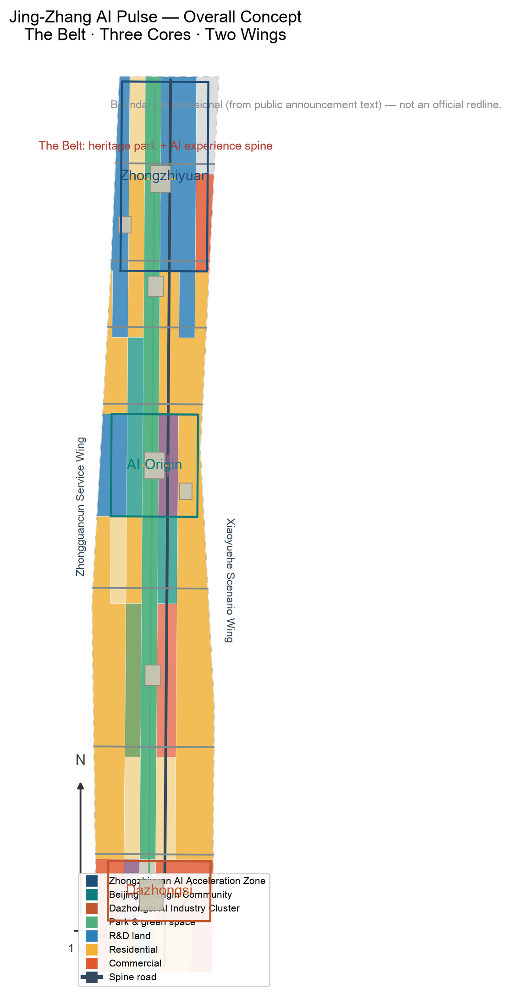
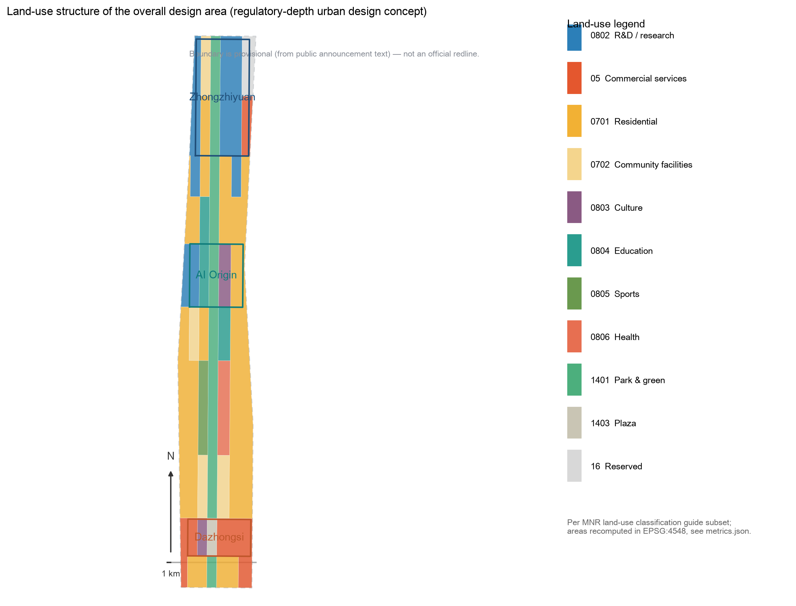
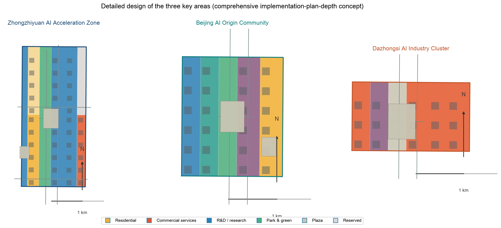
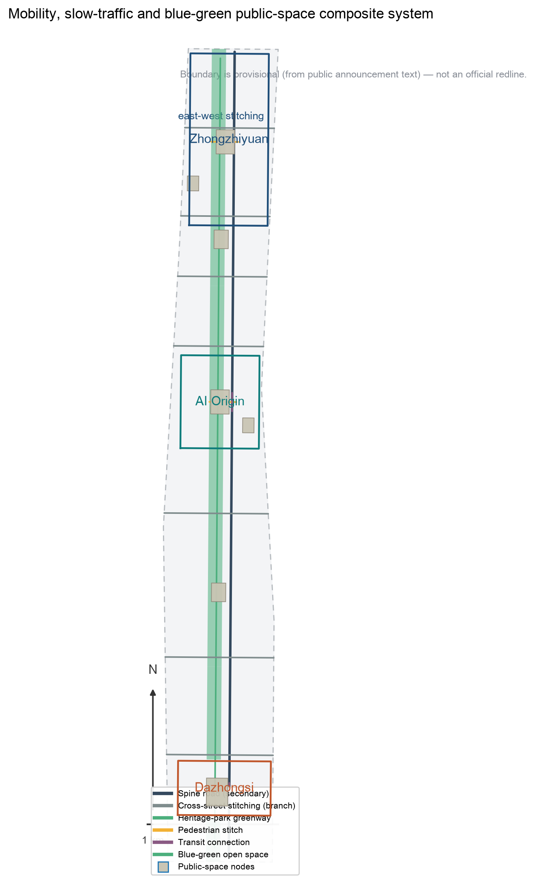
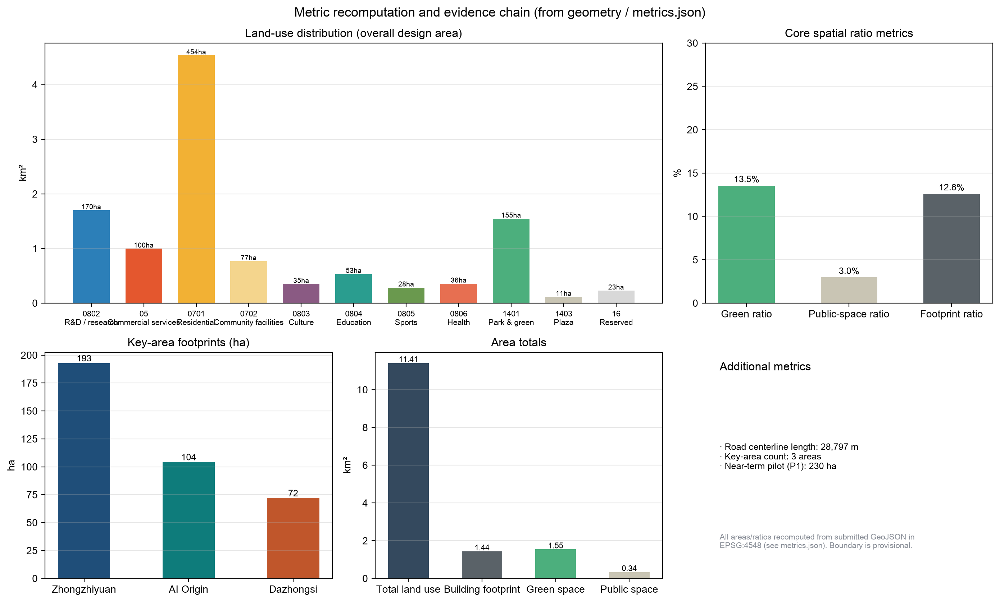

# Jing-Zhang AI Pulse · A Transit-Oriented AI Culture City — Centennial Jing-Zhang AI Innovation Belt Open-Source Urban Design Proposal

## Design Basis and Source List

This formal proposal is primarily based on the *Open Call Prequalification Announcement for the Centennial Jing-Zhang AI Innovation Belt International Urban Design Competition* published by the Haidian Branch of the Beijing Municipal Commission of Planning and Natural Resources, and on the machine-readable temporary boundary, key areas, enums, metrics and source lists registered in `brief/site-package/`. Before generating the proposal, the AI agent must read `design_brief.json`, `allowed_design_space.json`, `sources.json`, `enums/`, `ranges/`, `schemas/`, `data/source_registry.json` and `data/processed/agent_fact_pack.md`, and use `project_scope_summary.csv`, `agent_task_requirements.csv`, `source_use_matrix.csv` and `missing_data_checklist.csv` to build task, scope, source-use and data-gap checklists. Every design judgment must be decomposed into traceable sources, recomputable metrics, verifiable layers and human-reviewable assumptions. The announcement requires the proposal to reach the urban design depth of Regulatory Detailed Planning (RDP) for the overall area and of an Integrated Planning Implementation Plan (IPIP) for key areas, so text narrative cannot substitute for GeoJSON layers, metric tables, A3 booklet, A0 boards and HTML display deliverables.

This proposal is not a standalone vision text; it is organized from the announcement, the agent taskbook and the site materials. This section only places the most critical basis next to the judgment [source:OFFICIAL-ANNOUNCEMENT] [source:AGENT-TASKBOOK] [depth:existing_conditions_diagnosis]. The complete source and standard coverage is stored in `sources.json`, `standard_matrix.json` and `design_depth_matrix.json`, not repeated as machine indices in the body.

The use boundary of the source registry is as follows [source:SOURCE-REGISTRY]:

- `data/source_registry.json` registers the permitted use of public, rights-cleared and provisional materials.
- Current registry summary: 5 formal-ready sources, 0 background-only sources, 1 provisional-only source.
- The agent must not upgrade background-only or provisional-only materials into official boundaries, statutory RDP, formal scoring basis, or government implementation commitments.

`data/processed/agent_fact_pack.md` is a reading-navigation layer for this proposal, not a new authority [source:PROCESSED-FACT-PACK]. It helps the agent organize the three-level scope, three key areas, announcement tasks, agent.1-agent.6, source-use boundaries and missing-data items into a readable proposal; factual judgments still return to the registered original materials [source:OFFICIAL-ANNOUNCEMENT] [source:AGENT-TASKBOOK], with the full source relationships stored in `sources.json`.

When the official `SITE_BOUNDARY` or the three `KEY_AREA` polygons are not yet available, this scaffold generates a temporary formal package from `brief/site-package/geometry/provisional_boundaries.geojson`. Both `geometry/site_boundary.geojson` and `geometry/key_areas.geojson` in the package must be marked `provisional_constraint` and `official_boundary=false`; they may only be used for proposal generation, self-check, visualization and design discussion, not as an official planning boundary, approval basis, precise-area basis, or statutory control conclusion. This organizer data gap does not by itself block content scoring; when the official polygons are supplied, site boundary, key areas, land use, roads, green space, public space, buildings, phasing and metrics must all be recalculated.

The reviewable status generated by this scaffold is: **provisional boundary, precision caveat retained, recalculation pending official data; does not block content scoring**. Spatial structure, scenarios, projects and metrics in the body are therefore written under the principle of "discussable, reviewable, and recalculable after replacement with the official boundary". When the official boundary and key-area polygons are updated, the agent must re-run the scaffold, self-check, drawings and HTML generation — it may not replace a single file.

The boundary interpretation can return to the overall-area layer and area recalculation [data:geometry/site_boundary.geojson#SITE-001] [metric:site_area_sqm]. The three key areas are cross-checked by separate layers and a count metric [data:geometry/key_areas.geojson#PROV-KEY-001] [metric:key_area_count]. Readers can thus enter the evidence from the body without first reading machine IDs.

## Three-Level Scope Framework

The proposal is organized by the three levels defined in the announcement: the Coordinated Research Area covers the 43.6 km² AI industry ecosystem, strategic positioning, innovation chain and future-city form; the Overall Design Area covers the 11.4 km² urban district and industry zone around the Jing-Zhang Railway Heritage Park (1-2 km buffer), and requires an urban-renewal framework, industrial spatial layout, transport and municipal support, and urban character control; the Key-Area Detailed Design Area covers 368.4 ha of three detailed-design areas (the submitted geometry recomputes to approximately 369.3 ha in EPSG:4548; the difference stems from the provisional boundary inference), and requires explicit functions, building scale, Demolish–Renovate–Retain (DRR) classification, public-space connectivity and transport organization. The three levels are mapped item by item in `compliance_matrix.json`, ensuring that every mandatory task in announcement sections 1.3, 1.4, 1.5 and agent.1-agent.6 has section, layer, metric, drawing and HTML evidence.

The depth items of the three-level framework are governed by [depth:three_level_scope_framework] and [depth:overall_spatial_structure]; spatial evidence is based on [data:geometry/site_boundary.geojson#SITE-001] and [data:geometry/key_areas.geojson#PROV-KEY-001]; task basis is governed by [standard:PROJECT-OFFICIAL-ANNOUNCEMENT]; and scope navigation uses the three-level table in `project_scope_summary.csv` from [source:PROCESSED-FACT-PACK].

The three levels are not separate drawing sets. The Coordinated Research Area determines industrial chain and urban-form judgments, the Overall Design Area translates them into renewal projects, spatial structure and facility capacity, and the Key-Area Detailed Design validates implementability at the parcel, building, transport, public-space and AI scenario level. When generating the proposal, the agent must first lock the official or provisional boundary and constraints adopted for this submission, then generate land use, buildings, roads, green space, public space, phasing and AI service nodes, and finally recompute metrics from those layers and explain in the body which conclusions remain limited by the provisional boundary. Any area, ratio, scale or project count that cannot be recomputed from structured data must not be written into a formal conclusion.

The overall concept recommended here is the "Jing-Zhang AI Pulse Symbiotic Belt": using the Jing-Zhang Railway Heritage Park as the historical and public-space spine, the three key areas (Zhongzhiyuan, Beijing AI Origin Community, Dazhongsi) as innovation anchors, and universities, enterprises, communities and transit stations as the everyday network, forming a spatial organization of "one belt, three cores, multi-node scenarios, and a blue-green slow-traffic composite loop". The "belt" is not an additional new planning line; it translates the three announcement scopes into working method. The "three cores" correspond to the three key areas; the "multi-node scenarios" correspond to operable nodes of AI-enabled public services, industry services and urban life; the "composite loop" corresponds to the linkage of slow traffic, green space, public space and activity routes.

| Level | Design question | Proposal answer | Data anchor |
| --- | --- | --- | --- |
| Coordinated Research Area | How are the AI ecosystem and future-city form organized | An innovation chain of "university ideation – open-source collaboration – enterprise conversion – public experience – international outreach" | compliance_matrix.json, standard_matrix.json |
| Overall Design Area | How are industrial space, urban renewal, transport-municipal and character anchored in drawings | Land use, buildings, roads, green space, public space and phasing layers jointly express it | [data:geometry/land_use.geojson#LU-001]、[data:geometry/roads.geojson#ROAD-001] |
| Key-Area Detailed Design Area | How the three areas reach detailed-design depth | Positioning, spatial moves, AI scenarios and implementation dependencies for each | [data:geometry/key_areas.geojson#PROV-KEY-001]、[data:geometry/key_areas.geojson#PROV-KEY-002]、[data:geometry/key_areas.geojson#PROV-KEY-003] |

## Coordinated Research Area: Industry and Future City Research

The core task of the Coordinated Research Area is to build a world-class AI innovation ecosystem. The proposal should inventory Haidian's universities and research institutes, leading enterprises, computing-power/algorithm/data factors, incubation platforms, listed companies, unicorns and technology services, and propose a spatial coordination framework of AI innovation chain, industrial chain, talent chain and urban service chain. The naming scheme and logo design should serve the overall recognition of "centennial Jing-Zhang culture belt, urban AI-life experience belt, AI convergence innovation belt", and should not stop at slogans: they must be linked to the industry ecosystem, public space and cultural resources. The agent taskbook additionally requires responding to the "five major functions" and "Three Zones and Two Wings" coordination, forming a naming system, visual identity, overall spatial structure map, scenario opening and operation mechanism that can be deepened further. This section must use [source:AGENT-TASKBOOK] and [standard:PROJECT-AGENT-OPEN-CALL-TASKBOOK] to mark that these requirements come from the open-call taskbook for agents, not statutory planning controls.

The Coordinated Research Area does not add pseudo-precise planning lines; it coordinates urban character, public space and building layout as required by [standard:MOHURD-URBAN-DESIGN-MEASURES], reconnects to [data:geometry/land_use.geojson#LU-001], [data:geometry/public_space.geojson#PUBLIC-001] and [depth:overall_spatial_structure], and shows that industry strategy ultimately lands on visible, reviewable spatial structure.

Future-city research should answer how AI changes work, life, socializing, learning, transport and public services. The proposal should translate AI transport systems, continuous green space, innovation service facilities and an international living-working atmosphere into locatable functional zones, nodes, corridors and scenarios, rather than describing technology vision in general terms. The agent should write industrial strategy metrics, AI innovation indices, talent density, spatial supply types and AI vertical application focus areas into the metrics system, marking which are official, which are design recommendations and which still await calibration against official data. If global AI innovation events, developer communities, scenario access or pilgrimage routes are proposed, they should be written as "conceptual recommendations / reference proposals / for professional teams to deepen", not as confirmed government events or implementation arrangements.

## Overall Design Area: Urban Renewal and Regulatory-Plan-Level Urban Design

The Overall Design Area must reach the urban design depth of Regulatory Detailed Planning. The proposal must put forward an overall urban-renewal spatial structure, identification of inefficient space, a renewal project list, implementation policy recommendations, an industrial-functional ratio, a spatial organization model, total building scale and comprehensive carrying-capacity assessment. `geometry/land_use.geojson` should completely cover the design boundary without overlap, `geometry/buildings.geojson` should express renewal or retained building footprints, `geometry/roads.geojson` should express micro-circulation, slow traffic and transit connection, and `metrics.json` should recompute core areas, ratios and layer counts.

This section decomposes RDP-depth content into reviewable objects per [standard:MOHURD-CONTROL-DETAILED-PLANNING]: [data:geometry/land_use.geojson#LU-001] expresses land-use structure, [data:geometry/buildings.geojson#BLDG-001] expresses building footprints, [data:geometry/roads.geojson#ROAD-001] expresses transport organization, [metric:building_footprint_area_sqm] cross-checks building footprint area, and [depth:land_use_layout] with [depth:development_intensity_controls] govern output depth.

The Overall Design Area must also support transport, rail, municipal and supporting facilities. The proposal should propose spatial layout and implementation paths for transit-station integration, road micro-circulation, non-motorized parking, parking supply, innovation service platforms, talent-life services, New Infrastructure, distributed energy and edge-side computing power. Content on building height, development intensity, road redlines, setbacks and facility standards without official control conditions must be written as "pending confirmation of official RDP conditions", not as agent-assumed values masquerading as approved indicators.

## Detailed Design of Key Areas

Key-area detailed design is mandatory. Zhongzhiyuan AI Independent Innovation Acceleration Area should deliver a detailed proposal around national AI platforms, full-stack independent innovation, standard-setting, safety governance, industry exhibition, external transport, Qinghe culture, low-carbon green innovation and communication environment, and AI scenarios in green space. Beijing AI Origin Community should deliver around near-campus innovation, results incubation and conversion, talent special zone, open-source ecosystem, brand activities, building DRR classification, results exhibition and release, residential life support, campus-park slow-traffic connection and transit-station integration. Dazhongsi AI Industry Cluster should deliver around leading enterprises, agents, smart terminals, content consumption, data factors, digital assets, commercial services, composite use of planned green space, Dazhongsi station integration and four-quadrant pedestrian connectivity at the intersection.

The detailed design of the three key areas must cite [data:geometry/key_areas.geojson#PROV-KEY-001], [data:geometry/key_areas.geojson#PROV-KEY-002], [data:geometry/key_areas.geojson#PROV-KEY-003], and be checked by [depth:three_key_area_detailed_design] for IPIP depth. A description that only says "build a demonstration zone" without function, building, transport, public-space and implementation-project evidence should be treated as incomplete.

The three key areas must appear in `geometry/key_areas.geojson`. If the repository provides official polygons, they must be used as `official_constraint`; if official polygons are missing, `provisional_constraint` may be used temporarily, but the body, HTML, sources, assumptions and self_check must state that it cannot serve as formal scoring or approval basis. `compliance_matrix.json` should cover announcement sections 1.5.3.1, 1.5.3.2 and 1.5.3.3 separately. The design expression should include functions, building scale, building form, DRR classification, public-space system, transport organization, slow-traffic connection and implementation projects. The HTML page should allow switching between the three key areas, and the A3 booklet and A0 boards should at least include the key-area master plans, local details and metric notes.

| Key area | Design positioning | Spatial moves | AI industry & operation scenarios | Evidence |
| --- | --- | --- | --- | --- |
| Zhongzhiyuan AI Independent Innovation Acceleration Area | Garden-type full-stack independent innovation block | Strengthen the Qinghe riverfront, industry exhibition, low-carbon innovation communication and external transport; carry open testing and standard-governance display with green space | Independent model testing, standard-setting workshops, safety governance display, low-carbon computing experience | [data:geometry/key_areas.geojson#PROV-KEY-001]、[depth:three_key_area_detailed_design] |
| Beijing AI Origin Community | Near-campus conversion and talent community | Organize campus-park-block slow-traffic stitching; add results release, talent services, residential life and open-source collaboration space | Open-source community, results release, talent-zone services, near-campus incubation | [data:geometry/key_areas.geojson#PROV-KEY-002]、[source:AGENT-TASKBOOK] |
| Dazhongsi AI Industry Cluster | Urban intelligent economy and international communication block | Dazhongsi station integration, four-quadrant pedestrian connection, commercial services and public-environment renewal around leading enterprises | Agent and smart-terminal display, content consumption, data factors and international roadshows | [data:geometry/key_areas.geojson#PROV-KEY-003]、[metric:key_area_count] |

## AI Innovation Ecosystem, Personas, and AI+ Scenarios

The proposal should build spatial demand profiles for AI talent and enterprises covering R&D office, open-source collaboration, results release, enterprise services, talent housing, social learning, consumption life, sports leisure and international communication. AI-enabled scenarios should follow the announcement directions of transport, services, consumption, healthcare, education, legal and life services, forming industry-development scenarios and AI-enabled urban-function scenarios. Each scenario should explain target users, spatial location, data sources, privacy boundary, human review mechanism and operating entity.

AI scenarios must land in spatial and governance boundaries: public-space scenarios cite [data:geometry/public_space.geojson#PUBLIC-001], slow-traffic and transport scenarios cite [data:geometry/roads.geojson#ROAD-001], and open-space scenarios cite [data:geometry/green_space.geojson#GREEN-001], [metric:public_space_ratio] and [metric:green_ratio]. These references let reviewers see that scenarios are design objects located in specific layers and metrics, not slogans. The agent taskbook requires no fewer than 10 AI scenario cards, no fewer than 3 industrial testing-validation scenarios, and no fewer than 5 user-persona categories; the scenario cards (table below), persona table, privacy boundaries, human review and operating entities of this proposal are written into the body, HTML, A3/A0 and compliance matrix. Scenarios 02 Safety-Governance Sandbox, 03 Edge-Computing Station and 10 Global AI Week Route are the industry test-validation scenarios.

| Persona | Typical needs | Spatial response | Self-check boundary |
| --- | --- | --- | --- |
| Open-source developers | Release, collaborate, test, community reputation | Origin Community open-source release hall, public code wall, night collaboration space | No personal behavior trajectory collection; activity data only as aggregate statistics |
| Startup teams | Low-cost office, computing entry, product testbed | Zhongzhiyuan shared test field, edge-computing service point, standard-governance advisory | Computing and data services require separate authorization |
| Head-enterprise visitors | Display, business, international reception, recruitment | Dazhongsi international roadshow lounge, transit-station connection, public space around leading enterprises | Corporate identifiers and case studies require rights clearance |
| Surrounding residents | Commute, leisure, community services, low-disturbance renewal | Heritage Park slow-traffic loop, embedded community services, graded night lighting and activities | Resident profiles not used for commercial recommendation |
| University faculty and students | Results conversion, cross-campus collaboration, daily slow traffic | Campus-park slow-traffic stitching, results-transfer station, AI education experience points | Campus data and research results require authorization |

| Scenario card | Spatial carrier | Target users | Data sources | Privacy & human review | Suggested operator |
| --- | --- | --- | --- | --- | --- |
| 01 Open-source release hall | Beijing AI Origin Community | Developers, universities, startups | Public code and open-source community events | No personal behavior-trajectory collection; released content reviewed by humans | Open-source community / university science-park operator |
| 02 Safety-governance sandbox (industry test-validation scenario) | Zhongzhiyuan | AI enterprises and safety-evaluation bodies | Public model-evaluation reports and authorized test data | Test data de-identified; evaluation results expert-reviewed | National AI platform and third-party evaluation body |
| 03 Edge-computing station (industry test-validation scenario) | Nodes across the Overall Design Area | Startup teams and public-service users | Public energy and compute-benchmark data | Edge data minimized; compute use separately authorized | Compute operator and New Infrastructure investor |
| 04 AI slow-traffic navigation | Heritage Park vitality belt | Surrounding residents and commuters | Public slow-traffic facility and congestion data | No personal trajectory collection; wayfinding advice human-verifiable | Park operator and transport management platform |
| 05 Dazhongsi international roadshow lounge | Dazhongsi AI Industry Cluster | Leading enterprises and international visitors | Rights-cleared public enterprise and event material | Corporate identifiers and case studies cleared before display | Commercial operator and industry body |
| 06 Qinghe low-carbon innovation corridor | Zhongzhiyuan Qinghe riverfront | Campus enterprises and surrounding residents | Public water, green and energy data | Activity data as aggregate statistics; not used for commercial recommendation | Campus management and ecological operation team |
| 07 Near-campus results-transfer street | Beijing AI Origin Community | Faculty, students and startups | University public research catalogues (authorized) | Research results and campus data require authorization | University science park and results-transfer body |
| 08 Data-factor parlor | Dazhongsi area | Data-service and digital-asset enterprises | Public data catalogues and compliance cases | Premised on compliance, authorization and auditability | Data exchange and compliance body |
| 09 AI life-services sample street | Community-commerce junction | Surrounding residents | Public service information | Resident profiles not used for commercial recommendation | Sub-district office and life-service operator |
| 10 Global AI week route (industry test-validation scenario) | Belt public-space system | Developers, enterprises and the public | Public event and space-permit information | Graded event safety; communication content rights-cleared | Industry consortium and event operator |

The agent's AI-governance recommendations must follow the principles of data minimization, public sources, explainability and human review. An Urban Agent may assist in identifying slow-traffic gaps, public-space heat, facility maintenance, enterprise-service needs and activity-safety risks, but it cannot replace planning approval, cannot output unauthorized personal profiles, and cannot claim official implementation commitments. All AI scenario nodes should enter structured layers or the compliance matrix so reviewers can see their relationship to industry, space and public interest.

## Land Use, Building Scale, and Retain-Renovate-Demolish Strategy

The land-use plan should be expressed per public standards such as the national land-space survey, planning, use-control classification, forming a complete, closed, seamless land-use partition. The building plan should distinguish retained, renovated, renewed, new-build or pending-confirmation objects, and clarify the recommended level of building footprint, function, scale, character, roof, massing and height control. Where current buildings, ownership, RDP and engineering conditions are missing, the proposal may only provide methods and a pending-calibration checklist, and must not fabricate DRR conclusions.

Land-use classification follows [standard:MNR-LAND-USE-CLASSIFICATION-GUIDE]; building height, massing, interface and character control are governed by [depth:height_massing_character]; DRR method is governed by [depth:retain_renovate_demolish]. The main land-use and building evidence is [data:geometry/land_use.geojson#LU-001], [data:geometry/buildings.geojson#BLDG-001] and [metric:building_footprint_area_sqm].

Building scale and intensity metrics must be consistent with `metrics.json` and the layers. Where total building scale, FAR, building height, building coverage, green ratio, setbacks and building control lines lack official conditions, they should be listed as unknown or pending_control in the metrics system, not given fixed values to create false precision. The A3 booklet should provide the renewal project list and metric cross-check tables; the A0 boards should clearly express the key spatial structure and key areas; and the HTML page should provide linked metric and layer viewing.

## Transport, Rail, Municipal Infrastructure, and Public Services

The transport plan should respond to the announcement's requirements on transit-station integration, road micro-circulation, slow-traffic gaps, external transport, parking, non-motorized parking and green transport systems. Priorities should cover the North 5th Ring Road, the heritage-park crossing nodes, Wudaokou, the west end of Qinghua East Road, Dazhongsi station and transport connections around leading enterprises. Road and slow-traffic layers should stay within the submission boundary and cross-check with public space, green space, industry nodes and key areas; if the submission boundary is provisional, transport conclusions may only serve as temporary design discussion.

Transport and municipal professional depth are governed by [depth:traffic_rail_slow_parking] and [depth:municipal_new_infrastructure]; layer evidence cites [data:geometry/roads.geojson#ROAD-001], [data:geometry/public_space.geojson#PUBLIC-001] and [data:geometry/constraints.geojson#CONST-RAIL-001]. Where road redlines, pipelines, fire safety and municipal conditions are missing, assumptions should state what awaits completion, rather than presenting strategy as approved conditions.

Municipal and public-service facilities should cover AI industry-service facilities, innovation service platforms, talent-life facilities, New Infrastructure, distributed energy, edge computing and integration with conventional municipal facilities. The proposal should explain facility standards, spatial layout, service radius, operation model and phasing logic. Where pipeline, energy, drainage, flood and fire-safety engineering data is missing, it should be listed as a precondition for formal deepening.

## Blue-Green Network, Public Space, and Urban Character

The blue-green plan should take the Jing-Zhang Railway Heritage Park vitality belt as its backbone, coordinate the Qinghe, Xiaoyue River, surrounding universities, enterprises and community mobility needs, and propose a north-south continuous, east-west connected network of walking paths, cycle paths and green space. The proposal should identify slow-traffic gaps, cross-ring-road nodes, and landscape nodes at the south and north ends of the park, and propose composite-use strategies for parking, sports, innovation communication, technology testing, application display and public services.

Blue-green and public space are jointly cross-checked by the design-depth item and the green/public layers [depth:blue_green_public_space] [data:geometry/green_space.geojson#GREEN-001] [data:geometry/public_space.geojson#PUBLIC-001]. The design meaning of green and public-space ratios is explained in the body; complete recalculation is stored in `metrics.json`. Coordination of urban character, public space and building control returns to the professional standard matrix [standard:MOHURD-URBAN-DESIGN-MEASURES].

The urban character plan should fuse Jing-Zhang Railway history and culture, Zhongguancun innovation culture and AI innovation culture, using cultural resources such as Tsinghua Garden Railway Station and Beiying (Beijing Film Academy), and propose urban tone, building character, roof form, massing, interface and public-art guidance. The agent should also propose wayfinding signs, cultural symbols, international communication narrative, AI pilgrimage landmarks, contribution walls or honor display systems, but all brands, fonts, images, portraits and corporate identifiers must have rights-cleared sources. Character control should distinguish official control, design recommendation and pending-confirmation conditions, and must never give pseudo-precise control lines without heritage-protection or RDP basis.

## Renewal Projects, Implementation Policy, and Phasing

The implementation plan should form a reviewable renewal project list explaining project location, type, function, responsible entity, dependencies, implementation phase, risks and evaluation metrics. Policy recommendations should cover integrated urban-renewal implementation, spatial supply, operation mechanism, industry services, public participation, data governance and property coordination. `geometry/phasing.geojson` should express the phasing scope, and `compliance_matrix.json` should link each task to phasing and drawings.

Project-list and phasing depth are governed by [depth:renewal_project_list] and [depth:phasing_implementation]; the phasing spatial evidence is [data:geometry/phasing.geojson#PHASE-001]. Without ownership, funding, implementation entity and approval path, the proposal must present the item as an implementation risk, not a promise of delivery.

| No. | Project | Type | Key dependencies | Evidence |
| --- | --- | --- | --- | --- |
| JZ-01 | Heritage Park slow-traffic gap stitching | Public space / transport | Road redlines, under-bridge space, transport organization review | [data:geometry/roads.geojson#ROAD-001] |
| JZ-02 | Zhongzhiyuan Qinghe innovation riverfront | Blue-green / industry display | River blue lines, ecological and flood conditions | [data:geometry/green_space.geojson#GREEN-001] |
| JZ-03 | Origin Community near-campus results-transfer street | Urban renewal / industry services | Campus boundary, ownership, ground-floor uses | [data:geometry/buildings.geojson#BLDG-001] |
| JZ-04 | Dazhongsi four-quadrant pedestrian connection | Transit integration / slow traffic | Transit station, road intersection, municipal pipelines | [data:geometry/public_space.geojson#PUBLIC-001] |
| JZ-05 | AI public services & edge-computing nodes | New infrastructure / public services | Energy, computing, security and operating entity | [data:geometry/constraints.geojson#CONST-RAIL-001] |
| JZ-06 | Global AI week public route | Operation / brand | Public-space permits, event safety, rights clearance | [data:geometry/phasing.geojson#PHASE-001] |

Phasing should be distinguished from the 100-day open-call design cycle: the call cycle is the deadline for submitting outputs; implementation phasing is the urban-renewal and construction path. The proposal should put forward near-term pilot, mid-term renewal and long-term governance frameworks, and mark which content can start with lightweight facilities, operational activities and service platforms, and which must wait for official RDP, municipal, transport and ownership conditions. For the annual event system, developer-community operations, scenario open days, public experience routes and international communication mechanisms, the body should explain operation targets, frequency, responsibility boundaries, conversion paths and risks, and must not write only promotional slogans.

## Metrics, Area Recalculation, and Compliance Matrix

The metrics system should at least include the Overall Design Area area, key-area areas, green and public-space ratios, building footprint, renewal project count, AI scenario nodes, slow-traffic connectivity indicators, industrial-space indicators, talent-service indicators and self-check status. All known metrics must be recomputable from GeoJSON or trusted sources; unknown metrics must give the reason and the preconditions for formal submission. The results of `scripts/spatial_review.py` and `scripts/visual_review.py` are important evidence for formal self-check.

Metric recalculation follows the unified design-depth requirement [depth:metrics_recalculation]. The body explains the design meaning of key metrics, for example how the overall scope constrains spatial allocation and how blue-green and public-space ratios support daily social interaction; complete values, formulas, source files and confidence are stored in `metrics.json`. Example key metrics can be cross-checked from the overall area and green data [metric:site_area_sqm] [data:geometry/green_space.geojson#GREEN-001].

The compliance matrix is the master control for task responsiveness. Each announcement task and agent_taskbook task must map to report sections, layers, metrics, drawings, HTML pages, sources, assumptions and self-check items. If any mandatory task in announcement sections 1.3, 1.4, 1.5 or agent.1-agent.6 is not covered, the proposal may not enter formal professional scoring.

During formal deepening, the agent should classify every metric into three types: first, spatial metrics directly recomputable from submitted geometry, such as boundary area, green ratio, public-space ratio, building footprint and phasing areas; second, control metrics requiring official RDP or taskbook attachments, such as FAR, building height, building coverage, setbacks, road redlines and facility standards; third, performance metrics requiring continuous calibration with operation or industry data, such as AI innovation index, talent density, industry-service satisfaction, slow-traffic accessibility, event participation and scenario usage frequency. The three types should enter `metrics.json`, `assumptions.json` and `compliance_matrix.json` respectively, avoiding writing operational vision as approved planning conditions.

## Risk, Copyright, and Compliance

**Bilingual requirement.** The primary proposal file may be in Chinese or English, but a complete counterpart must be provided via `proposal.en.md` or `proposal.zh.md`; the A3/A0 drawings, HTML and text-bearing figures must also provide corresponding-language copies, preferring the event-recommended translations in `docs/terminology-glossary.md`. When any required translation, language mapping or valid file is missing, finalize and CI block the submission. All images, drawings, icons, data and code assets must state source, license and authorization status in `sources.json` or `report/copyright_statement.md`. HTML pages must not load remote scripts, remote map tiles, remote fonts, iframes, forms or external APIs, and must not track reviewers.

Risk and missing-data lists are jointly cross-checked by the risk depth item, the constraints layer and the site package [depth:risk_missing_data] [data:geometry/constraints.geojson#CONST-RAIL-001] [source:SITE-PACKAGE]. The official boundary, key area, RDP, road, parcel, building, municipal, heritage-protection and public-service gaps listed in `missing_data_checklist.csv` must enter `assumptions.json`, self-check and the body's risk section. Any conclusion lacking official RDP, road-redline, ownership, municipal, fire-safety or heritage-protection conditions must be downgraded to a pending-confirmation item; the complete professional cross-check is kept in the standard matrix.

This proposal does not claim official approval, approved RDP, final land ownership, final construction scale, or guaranteed implementation. The AI agent is responsible for facts, sources, copyright, spatial data, metrics and expression; maintainers and professional reviewers may require rework or rejection based on self-check results, spatial cross-check and the compliance matrix.

## References

- brief/public-brief.md
- brief/site-package/design_brief.json
- brief/site-package/allowed_design_space.json
- brief/site-package/enums/
- brief/site-package/ranges/planning_limits.json
- data/processed/agent_fact_pack.md
- data/processed/project_scope_summary.csv
- data/processed/agent_task_requirements.csv
- data/processed/source_use_matrix.csv
- data/processed/missing_data_checklist.csv
- Complete machine index: see `sources.json`, `metrics.json`, `compliance_matrix.json`, `standard_matrix.json` and `design_depth_matrix.json`
- The bibliography entry of this section follows the site-package registry; full provenance and licenses are in the structured source list [source:SITE-PACKAGE]
