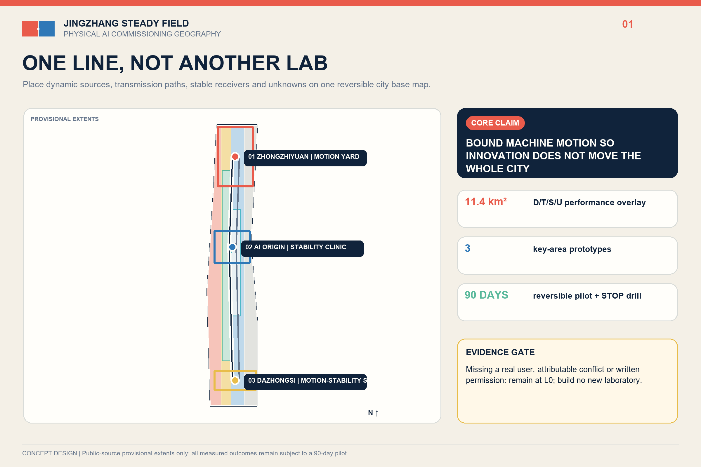
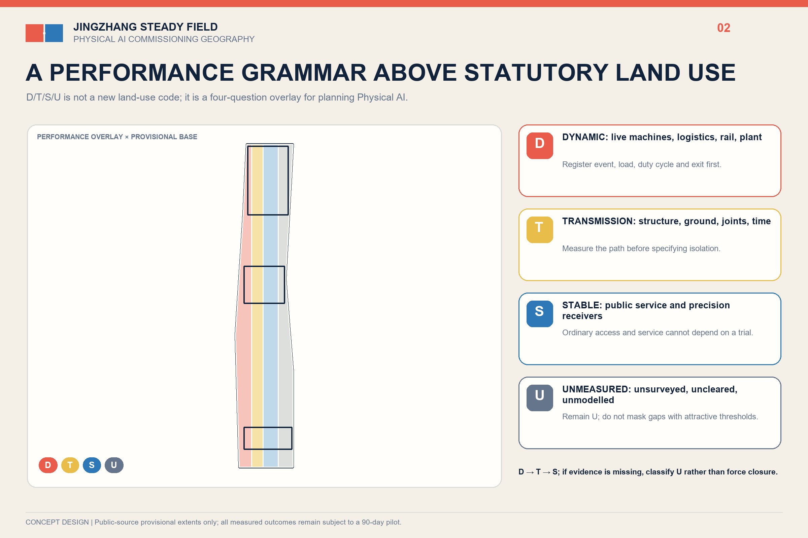
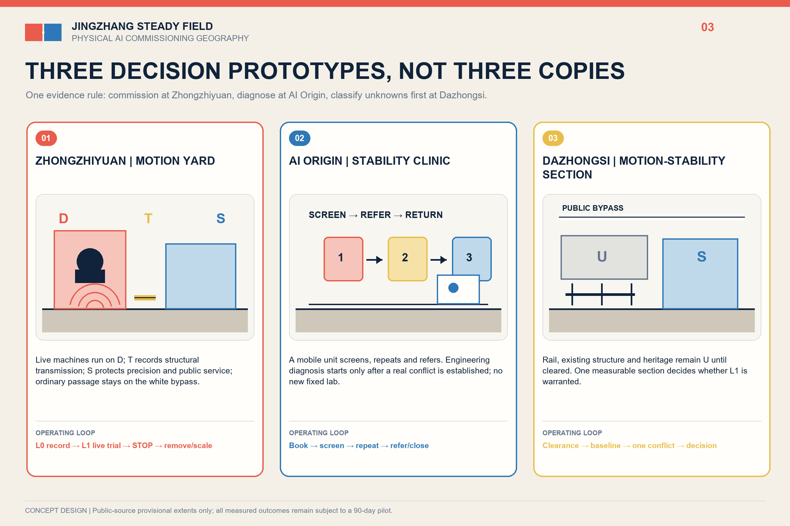
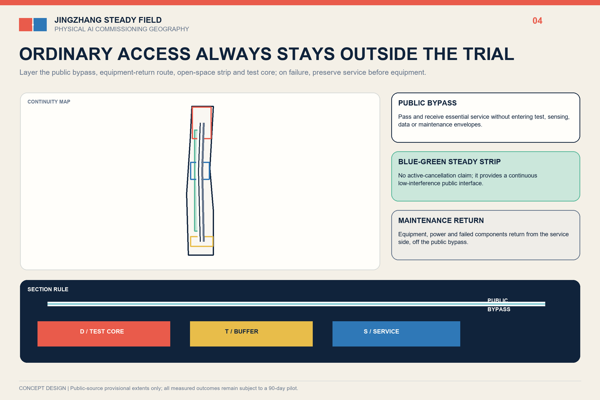
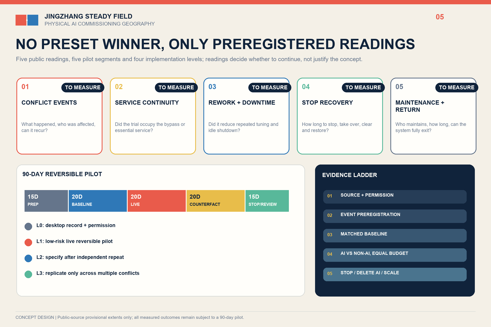

# JINGZHANG STEADY FIELD / 京张稳场

**Let machines move without making the whole city move.**

A century ago, the Jing-Zhang Railway organised movement with rails. In the age of Physical AI, the corridor must also organise the structural externalities of movement. Robots, rail, logistics, mechanical plant and events need places that can move. Precision instruments, pre-installation screening, care, waiting and sensitive cultural uses need places that can remain stable. Steady Field is neither a vibration-free city nor an isolation product. It is an urban-design sequence: investigate first, relocate first, reschedule first, repair first, and consider structural intervention last.

## Design Basis and Source Register

The official announcement, Agent Taskbook and repository site package define the brief. The 43.6 km² research scope, approximately 11.4 km² overall design scope and approximately 368.4 ha of key areas come from the announcement. The submitted site and key-area polygons remain provisional constraints: they support concept generation and internal checks, but are not statutory redlines or approval boundaries.[source:OFFICIAL-ANNOUNCEMENT] [data:geometry/site_boundary.geojson#SITE-001]

Three official evidence strands make the problem locally real. Haidian's embodied-intelligence platform matrix is explicitly linked to the Jing-Zhang AI Belt. A Xisanqi science park chose no underground space to avoid vibration interference with precision instruments and reported nearly ten committed tenants and 63% pre-leasing. A RMB 4.396899 million procurement confirms paid demand for joint, whole-machine and real-robot data workstations. These are demand proxies, not site measurements or partnership commitments.[source:BEIJING-EMBODIED-2026] [source:XISANQI-ENGINEERING-2026] [source:HAIDIAN-ROBOT-PROCUREMENT-2026]

## Three-Level Scope Framework

At 43.6 km², the proposal links controlled testing, mobile screening, referral and public-city handoff. At 11.4 km², a non-statutory `D/T/S/U` performance overlay guides investigation. At the three key areas, Motion Yard, Stability Clinic and Motion-Stability Section provide distinct prototypes. An ordinary accessible route, emergency access and basic services remain outside every test envelope.[standard:PROJECT-AGENT-OPEN-CALL-TASKBOOK] [depth:three_level_scope_framework]

## Regional Industry and Future-City Strategy

Steady Field is a commissioning geography for Physical AI: controlled tests in the north, R&D and shared instruments along the corridor, and public-city handoff at the key areas. The two wings provide conceptual referral rather than invented partnerships. Seven precedents contribute mechanisms only: graded stability at NIST, service interfaces at MIT.nano, bounded testing at CMU and Mcity, specialised districts at one-north, and regional shared infrastructure at imec and Brainport.[source:NIST-AML] [source:MIT-NANO] [depth:overall_spatial_structure]

The identity is a Field Joint Mark: an offset cinnabar plate, an aligned indigo plate, a paper-white negative joint, and one uninterrupted ordinary path. It avoids heartbeat, waveform, neural-globe and neon AI clichés.

## Overall Urban Renewal and Control-Plan-Depth Design

The overlay does not replace land-use codes. `D` marks movement-producing or movement-tolerant candidates; `T` marks transition candidates; `S` marks stability-sensitive candidates; `U` means unmeasured. Different evaluation methods apply to precision equipment, human comfort and heritage. The fixed decision ladder is relocation or cancellation, then time/path adjustment, then equipment-side repair or reversible work, and only then professional consideration of permanent structure.[source:DB11-938-2022] [standard:MOHURD-CONTROL-DETAILED-PLANNING]

## Detailed Design of the Three Key Areas

**Zhongzhiyuan - Motion Yard.** A bounded, reversible surface, stable reference, preparation and maintenance edge, physical emergency stop and ordinary visitor route support joint/whole-machine setup, real-robot data collection and embodied-control robustness tests. No active excitation occurs in open public space.[data:geometry/constraints.geojson#PROT-ZZY]

**AI Origin - Stability Clinic.** A booking desk, mobile measurement kit, reusable reference base and sample/equipment handoff provide pre-purchase and pre-installation screening. High-grade tasks are referred to qualified existing facilities. No new low-vibration laboratory and no assumed university partnership are required.[data:geometry/constraints.geojson#PROT-ORIGIN]

**Dazhongsi - Motion-Stability Section.** This remains an `U/unmeasured` type section across rail, underground space, surface activity, interchange, waiting and cultural sensitivities. It makes no site-specific impact or permanent-engineering claim without official geometry, structural information and authorised measurements.[data:geometry/constraints.geojson#PROT-DZS]

## AI Ecosystem, User Profiles and AI+ Scenarios

AI is native in two ways: Physical AI is the planning object, and embodied control is the test object. The only optional algorithm is multi-point event attribution. It must use event-level train/test separation and beat equal-budget spectrum, log and fixed-rule baselines on held-out events, or be deleted.[source:BEIJING-VIBRATION-CLASSIFICATION] [depth:overall_spatial_structure]

Seven user groups change space or operation: robot test engineers, hardware start-ups, students, residents and carers, accessible-mobility users, logistics/night workers, and maintenance/professional reviewers. Twelve scenario cards use the same contract: real user, conflict, spatial component, AI input, non-AI baseline, human decision, stop condition, privacy/safety boundary and missing data.[metric:scenario_card_count] [source:AGENT-TASKBOOK]

## Land Use, Building Capacity, Retain-Renovate-Remove

Statutory land-use categories remain unchanged; `D/T/S/U` is an overlay. Buildings are handled through four methods: retain ordinary services and paths, renovate equipment-side operation, add dry reversible interfaces, and consider permanent structure only after measured evidence, professional design and approval. Three conceptual footprints are typologies, not existing buildings or development redlines.[data:geometry/buildings.geojson#BLDG-ZZY] [standard:MNR-LAND-USE-CLASSIFICATION-GUIDE]

## Transport, Rail, Municipal and Public Services

The first layer is continuous walking, accessibility and emergency access. The second is rail, testing, night logistics and event windows. The third is maintenance and sample handoff. No joint, pad, threshold, equipment base or test boundary may block wheelchairs, canes, prams or evacuation. Sensors collect only environmental time-series and authorised event times, never faces, device IDs or personal traces.[data:geometry/roads.geojson#ROAD-PUBLIC-CONTINUOUS] [depth:traffic_rail_slow_parking]

## Blue-Green, Public Space and Urban Character

The heritage park, Qinghe and Xiaoyue River retain public and ecological primacy. Five falsifiable public readings are reported without preset targets: ordinary-path closure time, dynamic operating windows, maintenance hours, complaint-response time, and relocation/referral/cancellation decisions after screening. If these show no public improvement, exhibition language cannot substitute for public value.[data:geometry/public_space.geojson#PUBLIC-001] [metric:public_reading_count]

## Renewal Projects, Policy and Phasing

The implementation ladder is L0 operational action, L1 authorised measurement/mobile screening, L2 reversible local work, and L3 permanent engineering only after evidence, professional design and approval. The 90-day pilot secures permission and a real user, records natural events, freezes AI/baseline tests, trials reversible actions, and ends with a human `PASS/REVISE/STOP`. No decision-relevant conflict or no real user means STOP.[data:geometry/phasing.geojson#PHASE-L1] [metric:pilot_duration_days]

Annual proposals - a demand season, controlled test week, field-joint forum, negative-results and maintenance yearbook, and quarterly Stability Clinic - are concepts, not confirmed government programmes.[source:AGENT-TASKBOOK]

## Metrics, Recalculation and Compliance

Area, green-space, public-space and footprint metrics only test internal consistency of provisional geometry. Official polygons trigger full recalculation. Project-controlled counts are three prototypes, twelve scenario cards, five public readings, one deletable algorithm role, four implementation levels and a 90-day pilot. Performance outcomes remain unknown until a real pilot produces data.[metric:site_area_sqm] [depth:metrics_recalculation]

## Risk, Copyright and Compliance

The proposal never claims existing exceedance, harm, equipment failure, partnership, confirmed threshold, selected structure, cost, approval or AI authority over structural safety, statutory compliance, heritage safety or public-space release. The hero image is an explicitly conceptual AI-generated visual; diagrams, web pages and PDFs are produced locally from submitted data, without copying peer graphics.[source:RISK-BOUNDARY-LEDGER] [depth:risk_missing_data]

## References

`sources.json` records publisher, URL, retrieval date, use and limitation for every source. The readable text keeps short claim-adjacent anchors while full coverage remains in the structured evidence package.[source:SOURCE-REGISTRY] [source:OFFICIAL-ANNOUNCEMENT]

Sources are separated into fact, transferable mechanism and unresolved gap. The call and taskbook establish scope and deliverables only. Local standards and published engineering records show that micro-vibration classification, professional measurement and isolation services exist, but do not prove an exceedance or failure in the Jingzhang area. Universities, test platforms and international cases explain controlled testing, shared-service interfaces, booking, referral and operations; they do not supply Beijing thresholds, permissions, partners or project effects.[source:BEIJING-VIBRATION-CLASSIFICATION] [source:XISANQI-ISOLATION]

The geometry is a provisional public-source base. Design layers represent only the D/T/S/U overlay, three prototypes, an ordinary public bypass and a candidate 90-day pilot. Area, green-space, public-space and conceptual facility-footprint values check package consistency; they are not statutory controls or approved capacity. Official boundaries, road redlines, rail and heritage controls, title and existing-building data trigger full GeoJSON and metric recalculation. On-site baseline, real users, attributable conflicts, equipment tolerances, cost and maintenance ownership remain unknown.[data:geometry/site_boundary.geojson#SITE-001] [metric:site_area_sqm]

The evidence register therefore supports a falsifiable decision, not a finished engineering claim. L0 records permission, demand and natural events. L1 begins only if an attributable conflict could change operation, location or equipment decisions. If public readings show no improvement, or optional event attribution cannot outperform equal-budget conventional baselines on held-out events, the proposal stops, deletes the algorithm or returns to operational adjustment.[source:RISK-BOUNDARY-LEDGER] [metric:public_reading_count]
