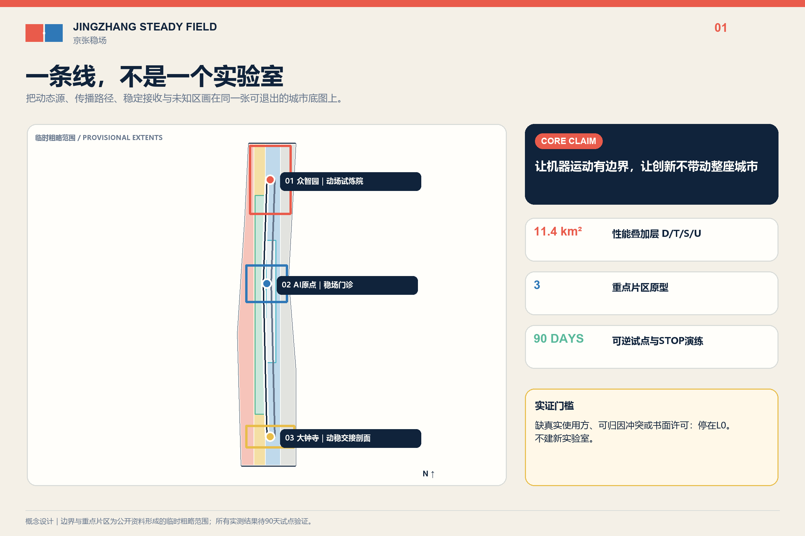
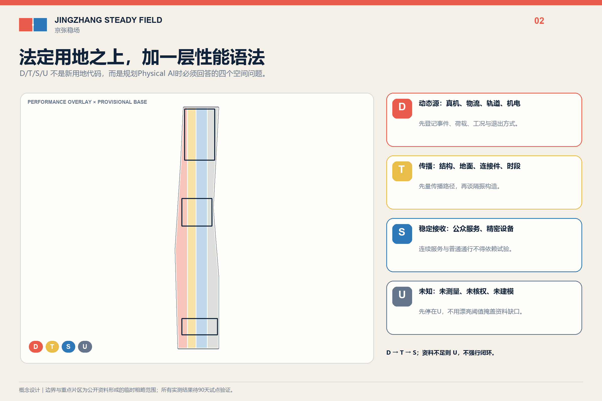
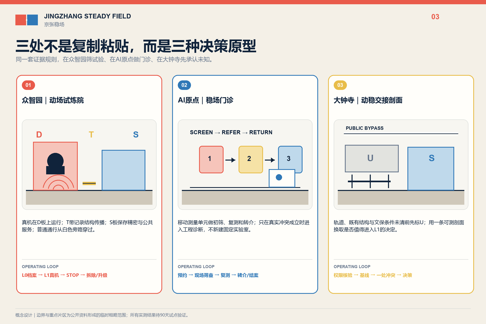
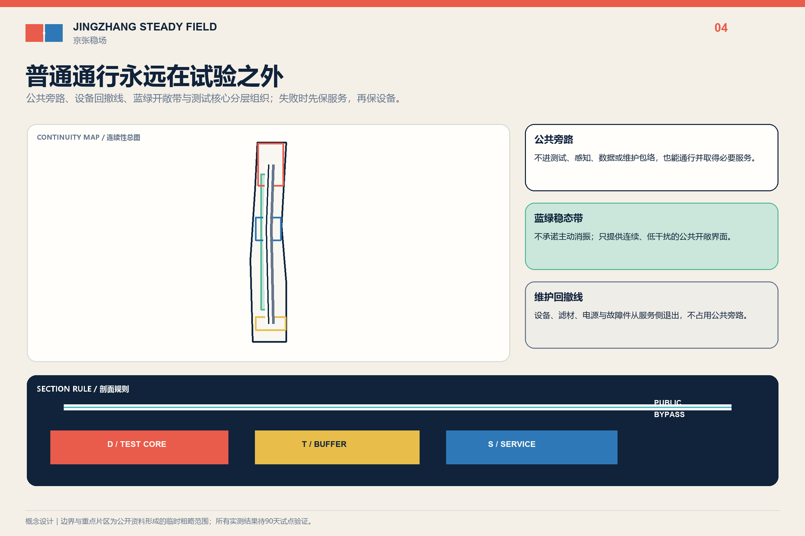
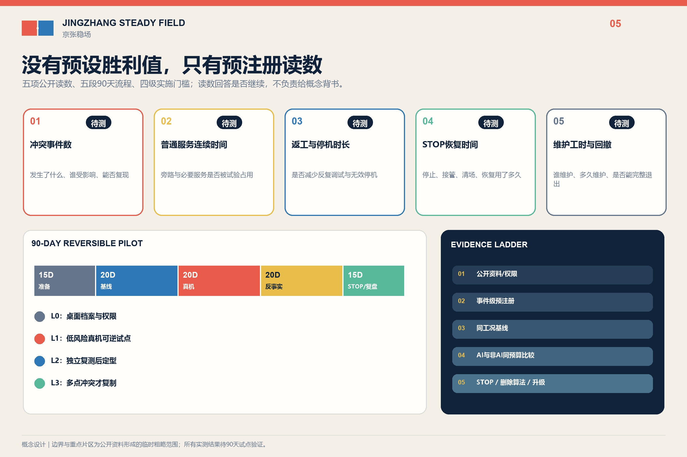

# 京张稳场 / JINGZHANG STEADY FIELD

**让机器运动有边界，让创新不带动整座城市。**  
**Let machines move without making the whole city move.**

百年前，京张铁路用轨道组织运动；AI时代的京张，还要组织运动产生的结构外部性。Physical AI 首先以重量、步态、冲击、装调工位、真机数据采集和维护路径进入城市。机器人测试、轨道、物流、机电与活动需要“能动”的场地；精密仪器、安装前预检、学习照护、公共等候和文化敏感空间需要“能稳”的场地。`京张稳场`不是一座无振动城市，也不是一项隔振产品，而是一套先调查、先换位、先分时、先维修，最后才考虑结构措施的城市设计系统。

## 设计依据与资料清单

本方案以公开征集公告、面向智能体任务书和仓库场地包为任务依据。统筹研究约43.6平方公里、总体设计约11.4平方公里、三处重点区域合计约368.4公顷均取自公告；提交的 `SITE_BOUNDARY` 与三处 `KEY_AREA` 仍是组织方提供的临时粗略几何，只能用于概念生成、自检和替换后复算，不能作为法定红线、审批边界或精确面积结论。[source:OFFICIAL-ANNOUNCEMENT] [data:geometry/site_boundary.geojson#SITE-001]

三条公开证据把命题从工程常识推进到海淀现实。第一，海淀已形成“4个产学研平台＋1个整机平台＋N条企业中试线”，具身智能中试平台选址西三旗，并明确“深度衔接百年京张AI创新带”。第二，西三旗金隅生命科学创新中心以无地下空间设计规避震动对精密仪器干扰，公开披露近十家确定入驻、63%预租率，证明动态相容性能够改变早期建筑与招商决策。第三，一项439.6899万元具身智能实训中心成交采购包含关节、整机及多类真机数据采集工位，证明Physical AI装调与测试存在真实付费需求。[source:BEIJING-EMBODIED-2026] [source:XISANQI-ENGINEERING-2026] [source:HAIDIAN-ROBOT-PROCUREMENT-2026]

这些证据只证明“问题类型在海淀真实存在、京张与具身中试链直接关联”，不证明三重点区已有振动超限、设备失效、居民受损或任何合作主体。北大、清华等共享仪器平台只用来证明本地存在高价值设备与开放服务生态，不表示其已接入本方案。[source:PKU-MICRONANO] [source:TSINGHUA-SHARED-EQUIPMENT]

## 三层范围工作框架

| 层级 | 核心问题 | 稳场回答 | 证据状态 |
| --- | --- | --- | --- |
| 43.6 km²统筹研究 | AI研发、中试、共享仪器与城市应用如何协同 | 建立“动场测试—稳场门诊—既有设施转介—公共城市交接”的区域服务链 | 只画公开设施能力与概念转介，不写合作承诺 |
| 11.4 km²总体设计 | 动态活动与稳定用途如何提前相容 | 叠加 `D/T/S/U` 动—稳性能谱，不替代法定用地 | provisional boundary；没有现场谱就保持U |
| 368.4 ha重点区域 | 三处片区如何形成不同空间原型 | 众智园动场、AI原点稳场门诊、大钟寺动稳交接剖面 | 全部为类型设计，待正式polygon与专业复核 |

一条底线贯穿三层：普通无障碍路径、应急和基本公共服务不进入测试包络。即使停电、断网、删除算法或终止试点，非AI城市仍能工作。[standard:PROJECT-AGENT-OPEN-CALL-TASKBOOK] [depth:three_level_scope_framework]

## 统筹研究范围产业与未来城市研究

`京张稳场`把百年铁路“组织运动”的工程文化转译为Physical AI时代的投产地理：北部具身中试、沿线研发与共享设施、三处重点区和普通公共城市不复制同一种园区，而按测试、筛查、转介和交接分工。中关村科技服务翼可承担需求诊断、知识产权和设备服务转介；小月河场景赋能翼只承接受控测试通过门槛后的低风险应用。未来科学城、怀柔科学城、经开区及京津冀仅作为公开能力转介方向，不构造设备清单、协议或流量。[source:AGENT-TASKBOOK] [depth:overall_spatial_structure]

案例只转译机制：NIST AML说明稳定条件需按用途分级；MIT.nano说明共享精密设施需要清晰的服务界面。二者支持“先判断接收方和服务责任，再讨论构造”，不提供可直接移植到北京的阈值。[source:NIST-AML] [source:MIT-NANO]

CMU Robotics Innovation Center与Mcity说明危险测试应处于受控、可重复环境；one-north、imec与Brainport只用于理解专业片区、前后级服务和区域转介。任何国外尺度、投资、阈值和治理权限都不移植为北京结论。[source:CMU-RIC] [source:MCITY]

品牌采用“**双场接缝印 / FIELD JOINT MARK**”：左侧朱红错位场板表示可控运动，右侧深蓝对齐场板表示稳定用途，中间是纸白负形接缝，底部一条普通路径连续跨越。它不使用心电、脉冲、波形、神经网络球或霓虹AI图标。

## 总体设计范围城市更新与控规深度城市设计

总体图在现有用地之上叠加四种非statutory规划状态，而不是创造新用地代码：

- `D / 动场候选`：轨道、机器人试验、物流、机电、运动与活动等可能产生或容许较强动态作用的类型。
- `T / 转换候选`：可能需要换位、分时、维修、退距、设备侧处理或结构脱开的界面。
- `S / 稳场候选`：精密预检、敏感研发、学习照护、公共等候或文化敏感用途。
- `U / 未测`：缺授权基线、真实主体或对象阈值时保持未知，AI不得补值。

`S`不是统一的“越稳越好”等级。精密设备、人体舒适和遗产保护分别使用相称的专业方法；不得把最严实验室条件铺满公共城市。北京标准确认轨道、道路、设备和人致振动属于结构设计需要考虑的环境作用，但13号线回龙观—霍营研究不能外推为大钟寺现状。[source:DB11-938-2022] [source:BEIJING-LINE13-STUDY]

设计决策固定为四级：①换位或取消；②分时与路径调整；③设备维修、脚垫或局部可逆措施；④只有前三项不足且专业复核通过，才研究独立基础、结构接缝或其他永久工程。用地、建筑高度、强度、道路红线与地下条件仍按 `unknown/pending professional confirmation` 管理。[standard:MOHURD-CONTROL-DETAILED-PLANNING] [depth:development_intensity_controls]

## 重点区域详细设计

### 1. 众智园｜动场试炼院 / MOTION YARD

众智园制造可控动态条件，而不是把机器人带到开放广场表演。平面由可逆测试面、稳定参考台、准备/维修区、物流边界、实体急停和普通访客外环组成；公众不是默认受试者。产业测试覆盖关节/整机装调、真机数据采集及机器人在不同地面条件下的IMU、视觉与控制鲁棒性。最低版本只使用获批既有测试空间、便携测量和可拆表面，不新挖基础，不在公共环境主动激振。[data:geometry/constraints.geojson#PROT-ZZY] [depth:three_key_area_detailed_design]

### 2. AI原点｜稳场门诊 / STABILITY CLINIC

AI原点不新建低振动实验室。首期以预约台、移动测量包、可复用参考基座、设备/样品交接面和普通学习界面，提供购买、搬运或安装前的环境筛查、方法咨询与失败转介。需要高等级条件的任务转介至具备资质的既有设施；本案不预设北大、清华或西三旗平台参与。价值在于设备进入昂贵共享平台或错误楼板之前改变决策，而不是用一栋新建筑证明概念。[data:geometry/constraints.geojson#PROT-ORIGIN] [source:PKU-MICRONANO]

### 3. 大钟寺｜动稳交接剖面 / MOTION-STABILITY SECTION

大钟寺只做多层叠置的调查类型：高架轨道、地下空间、地面活动、接驳物流、公共等候、周边居住与文化敏感对象如何交接。图件只画连续普通路径、动态运行窗口、维护路线和在证据触发后才可能出现的结构接缝/独立基座。没有正式polygon、结构资料和实测谱前，不落具体站口、不宣称超限、不提出永久工程，所有要素保持 `U/待测`。[data:geometry/constraints.geojson#PROT-DZS] [source:BEIJING-DAZHONGSI-STACK]

## AI 创新生态、人才画像与 AI+ 场景

AI有两个不可替代的身份：规划对象是Physical AI的动态荷载、测试边界、维护与真机数据链；测试对象是具身机器人的感知和控制鲁棒性。唯一保留的可选算法角色是多点时序事件归因，用来提出“先查轨道、机电、物流还是测试设备”的候选。训练/测试必须按完整物理事件分组，并与传统频谱、事件日志和固定规则同预算比较；留出事件无稳定增益即删除算法。[source:BEIJING-VIBRATION-CLASSIFICATION] [depth:overall_spatial_structure]

七类人物分别改变空间或运营：具身测试工程师需要受控面与急停；初创硬件团队需要安装前稳检和失败转介；高校学生需要普通学习接口；居民与照护者需要不承担产业外部性；轮椅、盲杖和推车使用者需要连续跨缝；物流与夜班人员需要路线、时窗和停机权；维护与专业人员需要设备侧服务、备件、日志和复测。文化访客与遗产管理者只作为第八类待核对象。

十二张场景卡共享同一字段：`真实用户—当前冲突—空间构件—AI输入—非AI基线—人类决定—停止条件—隐私/安全边界—待补数据`。三项产业测试为机器人动态地面鲁棒性、IMU多源扰动辨识、稳场门诊；九项城市/公共场景为轨道事件、机电启停、夜间物流、自动泊车与接驳、体育活动、学习照护、无障碍跨缝、遗产复核、停机撤除。完整结构化卡片见 `visual/assets/scenario-cards.json`。[metric:scenario_card_count] [source:AGENT-TASKBOOK]

## 用地、建筑规模与拆改留方案

法定用地分类保持仓库临时图层的科研、商业服务、教育居住和公园绿地结构；`D/T/S/U`只是性能叠加层。建筑不做逐栋拆改留断言，而按四类方法进入深化：保留普通服务与公共路径；改造设备侧维护和运行窗口；以干式、可逆方式增设预检/测试接口；永久结构仅在L1/L2证据、专业设计和审批共同通过后研究。三处概念建筑基底只表达动场、门诊和交接剖面的类型位置，不是现状建筑或建设红线。[data:geometry/buildings.geojson#BLDG-ZZY] [standard:MNR-LAND-USE-CLASSIFICATION-GUIDE]

西三旗“无地下空间”是早期结构选择产生市场价值的本地先例，不是本案默认答案。京张三处原型可能采用换位、地面独立设备基座、局部弹性构造或完全不建设；选择取决于真实设备、工况、结构和专业阈值。[source:XISANQI-ENGINEERING-2026] [depth:retain_renovate_demolish]

## 交通、轨道、市政与公共服务设施

总体交通图把普通慢行/无障碍与应急连续线放在第一层，把轨道、测试、夜间物流和活动窗口放在第二层，把设备维护和样品交接放在第三层。任何测试围挡、隔离垫、构造缝、门槛或设备基座不得阻断轮椅、盲杖、推车和疏散；自动泊车与接驳不由AI决定放行。[data:geometry/roads.geojson#ROAD-PUBLIC-CONTINUOUS] [depth:traffic_rail_slow_parking]

市政策略优先处理设备源：风机、水泵和其他机电启停先核对维护、基座、管线与运行时间，再研究相邻空间。测量设备只采环境级三轴时序与经授权事件时刻，不采人脸、设备ID或个人轨迹。失电、失网和模型停用时，普通照明、通行、应急与人工调度继续存在。[depth:municipal_new_infrastructure] [source:DB11-938-2022]

## 蓝绿空间、公共空间与城市风貌

京张遗址公园、清河和小月河保持公共空间与生态主权，不成为实验专用地。首期测量只记录自然发生事件；受控激振仅能在获批测试环境进行。动态活动的成本不能默认由居民、学生、照护者、候车者、维护者和文化环境承担，真实不适与投诉不能被模型否定。[data:geometry/public_space.geojson#PUBLIC-001] [depth:blue_green_public_space]

公共收益以五类可失败读数核验：普通路径关闭时长、动态运行窗口、维护工时、投诉响应时长、预检后发生的换位/转介/取消决策。首期不预设漂亮目标值；如果这些读数没有公共改善，公共利益维度不得靠展陈叙事补分。[metric:public_reading_count]

风貌不是“科技感装置”。接缝以纸白/金属原色、干式构造和连续普通路径表达；动态朱红与稳定深蓝只用于候选状态和导视。主视觉为概念轴测剖面，明确标注 `conceptual visualization`，不得被读成现状照片或已批准工程。

## 更新项目清单、实施政策与分期计划

实施阶梯严格遵循“能不建就不建”：

| 层级 | 动作 | 触发条件 | 退出 |
| --- | --- | --- | --- |
| L0 无建设 | 清单、换位、分时、维修、维护路径和普通通路调整 | 真实主体与运营许可 | 可立即恢复；即使无振动冲突也有运营价值 |
| L1 测量/预检 | 自然事件成对测量、移动稳检、传统基线 | 书面许可、专业测量计划 | 90天无决策性冲突或无真实用户即STOP |
| L2 可逆局部 | 可拆测试面、设备脚垫、临时参考基座 | L1测出真实冲突且可逆措施有理由 | 同工况复测失败即撤除恢复 |
| L3 永久工程 | 独立基础、结构接缝等专项工程 | L1/L2证据、专业设计、审批和预算共同通过 | 不在本次概念稿承诺 |

90天首期分五段：0-15日取得许可和真实需求；16-35日记录自然事件；36-55日冻结事件并比较AI/传统方法；56-75日试用L0/L2可逆动作；76-90日复测并由人作 `PASS/REVISE/STOP`。无真实使用主体、无会改变选址/运营/设备决策的冲突，或出现安全/公共伤害时，停止并恢复场地。[data:geometry/phasing.geojson#PHASE-L1] [metric:pilot_duration_days]

年度运营建议包括春季需求季、夏季受控测试周、秋季百年接缝论坛、冬季负结果与维护年鉴、季度稳场门诊。三处工作型荣誉节点只记录经授权的测试版本、负结果、维护、转介和贡献者；不是自动排名碑，也不是已确定政府活动。[source:AGENT-TASKBOOK]

## 指标体系、面积复算与合规矩阵

面积、绿地率、公共空间率和建筑基底面积来自临时几何复算，只能验证提交包内部一致性，不能当作官方指标。正式边界到位后，site boundary、key areas、land use、roads、green/public space、buildings、phasing和全部派生指标必须整体重算。[metric:site_area_sqm] [depth:metrics_recalculation]

项目自己的可核查指标不伪造效果值：3类原型、12张场景卡、5类公共读数、1个可删除算法角色、90天首期、4级实施阶梯。冲突事件数、算法相对基线增益、路径关闭时长、维护工时、投诉响应、预检转介和费用均保持 `unknown`，直到真实试点产生数据。矩阵把23项任务、6项专业标准和15项设计深度逐条映射到正文、GeoJSON、图件、指标和自检。[metric:prototype_count] [metric:optional_ai_role_count]

## 风险、版权与合规说明

不得进入正式结论的断言包括：京张沿线或大钟寺已振动超限；居民、设备或遗产已受损；13号线其他区段数据代表大钟寺；西三旗、中试平台、北大、清华、企业或政府部门已同意合作；任何隔振构造、阈值、距离、效果、总造价或审批已确认；AI能够给出结构安全、法定达标、文保安全或公共空间放行结论。[source:RISK-BOUNDARY-LEDGER] [depth:risk_missing_data]

主视觉由OpenAI图像生成工具按本方案描述生成，五张规划图、网页、Logo和PDF由提交者本地脚本基于本包数据制作；没有抓取或复制其他投稿图件。外部网页只作为事实与方法来源，图片不进入成果。字体使用系统许可字体并在PDF内嵌/转曲；完整用途和局限见 `sources.json` 与 `report/copyright_statement.md`。

## 参考资料

正文只保留判断旁的短引用；`sources.json` 登记发布者、URL、访问日、用途和局限。核心入口包括公开征集公告、面向智能体任务书、海淀具身智能平台报道、西三旗工程先例、具身测试采购、北大/清华共享设施、北京标准与轨道振动研究，以及七个机制案例。[source:SOURCE-REGISTRY] [source:OFFICIAL-ANNOUNCEMENT]

资料使用遵循“事实、转译、缺口”三分法。公告和任务书只确定范围、重点片区与成果要求；地方标准和公开工程资料只证明微振动分类、专业测量与隔振服务在现实中存在；高校、测试平台和国际案例只用于解释共享设施、受控测试、预约转介和运维界面的组织机制。上述资料均不能证明京张沿线已经超限、某处设备已经受损、任何单位愿意合作，亦不能代替现场勘察、结构核验和法定审批。[source:BEIJING-VIBRATION-CLASSIFICATION] [source:XISANQI-ISOLATION]

几何证据采用公开信息形成的临时粗略边界，设计图层只表达 D/T/S/U 性能叠加、三处原型、公共旁路和90天候选试点。面积、绿地率、公共空间率与概念设施基底用于检查提交包内部一致性，不是控规指标或建设量；收到官方边界、道路红线、轨道、文保、权属和现状建筑资料后，所有 GeoJSON 与派生指标必须整体复算。现场振动基线、真实使用方、冲突事件、设备容限、实施费用与维护责任仍登记为未知，不以案例数值补齐。[data:geometry/site_boundary.geojson#SITE-001] [metric:site_area_sqm]

因此，参考资料最终服务于一个可失败的决策：先在 L0 完成权限、需求和自然事件档案；只有形成可归因且会改变运营、选址或设备决策的冲突，才进入 L1 可逆试点。若五项公开读数没有公共改善，或可选事件归因算法不能在留出事件上稳定优于同预算传统基线，方案应停止、删除算法或退回运营调整，而不是用图面完成度掩盖证据不足。[source:RISK-BOUNDARY-LEDGER] [metric:public_reading_count]
