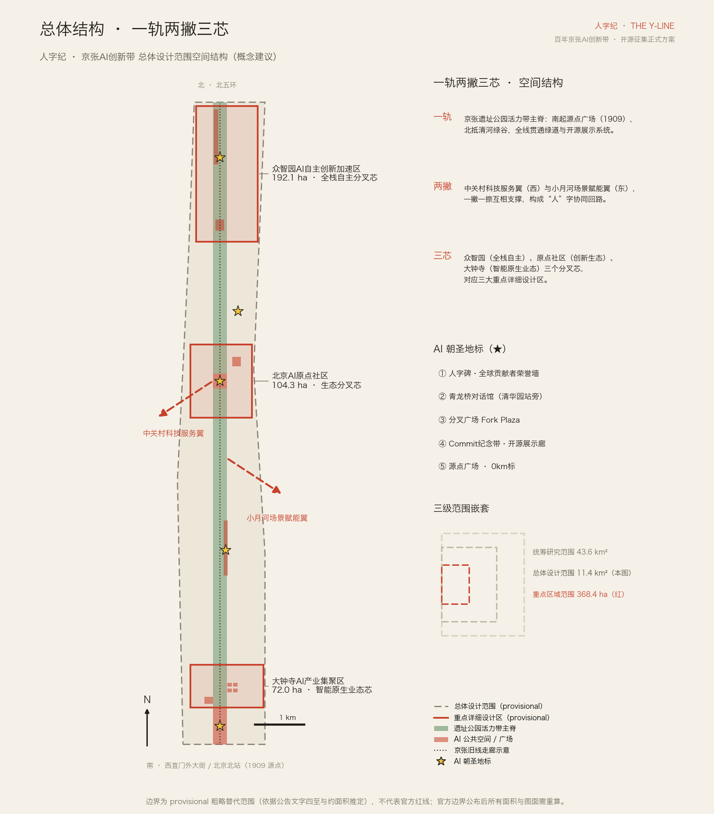
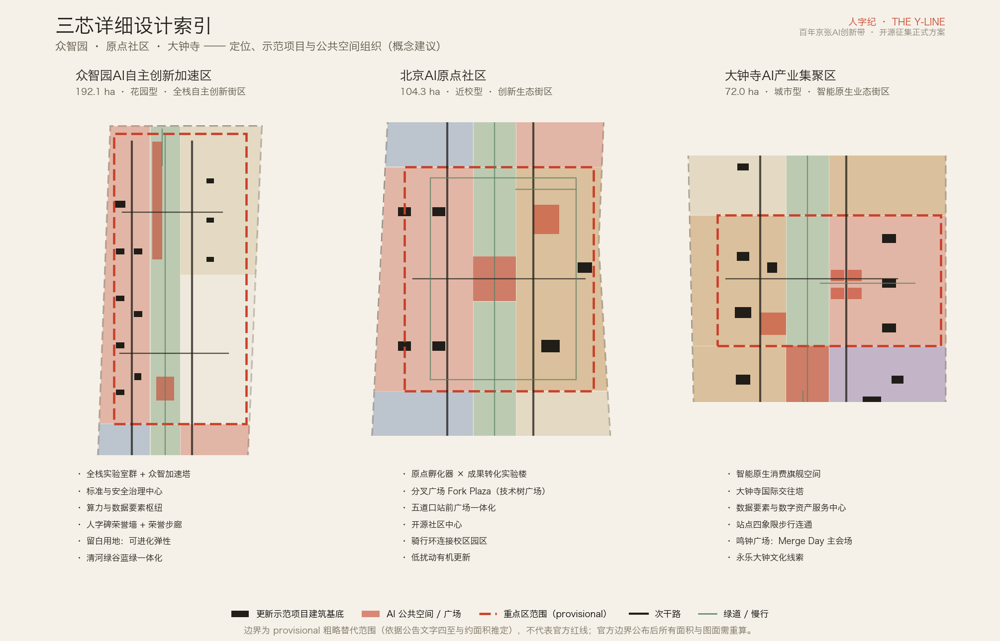
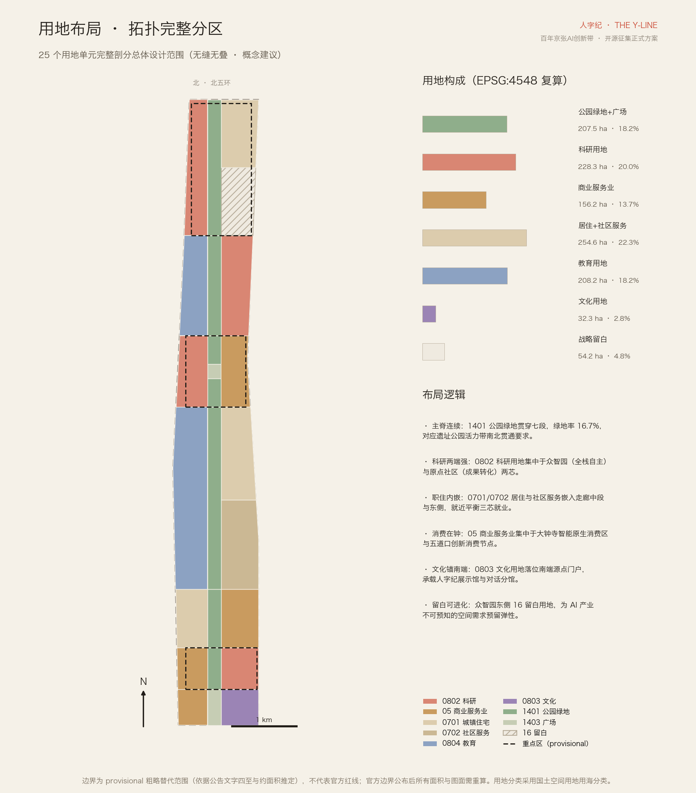
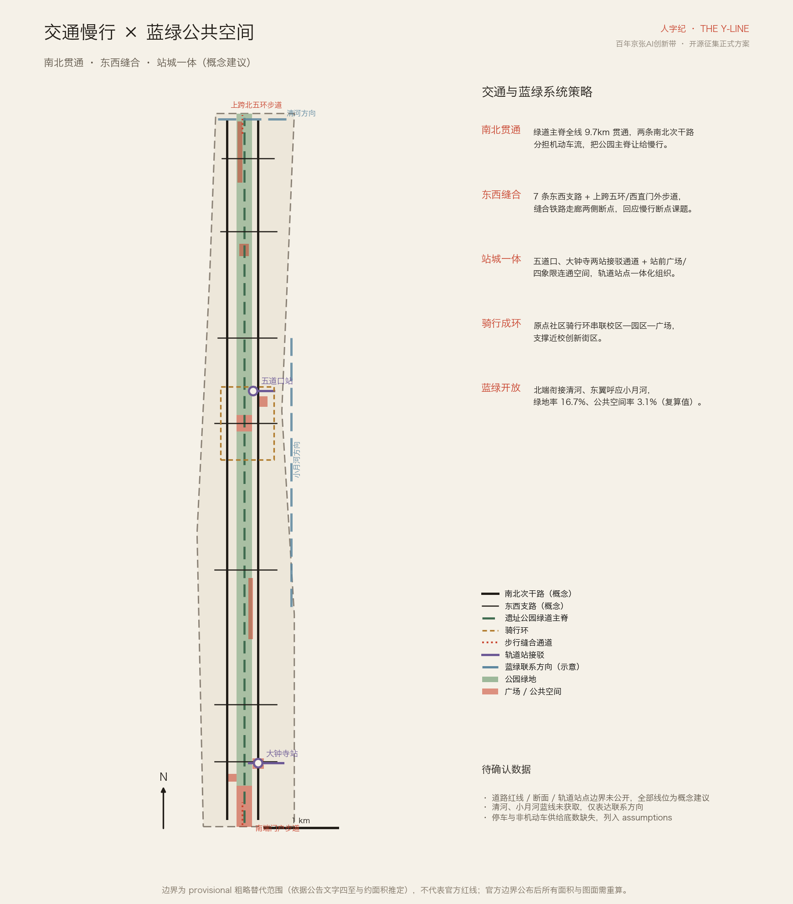
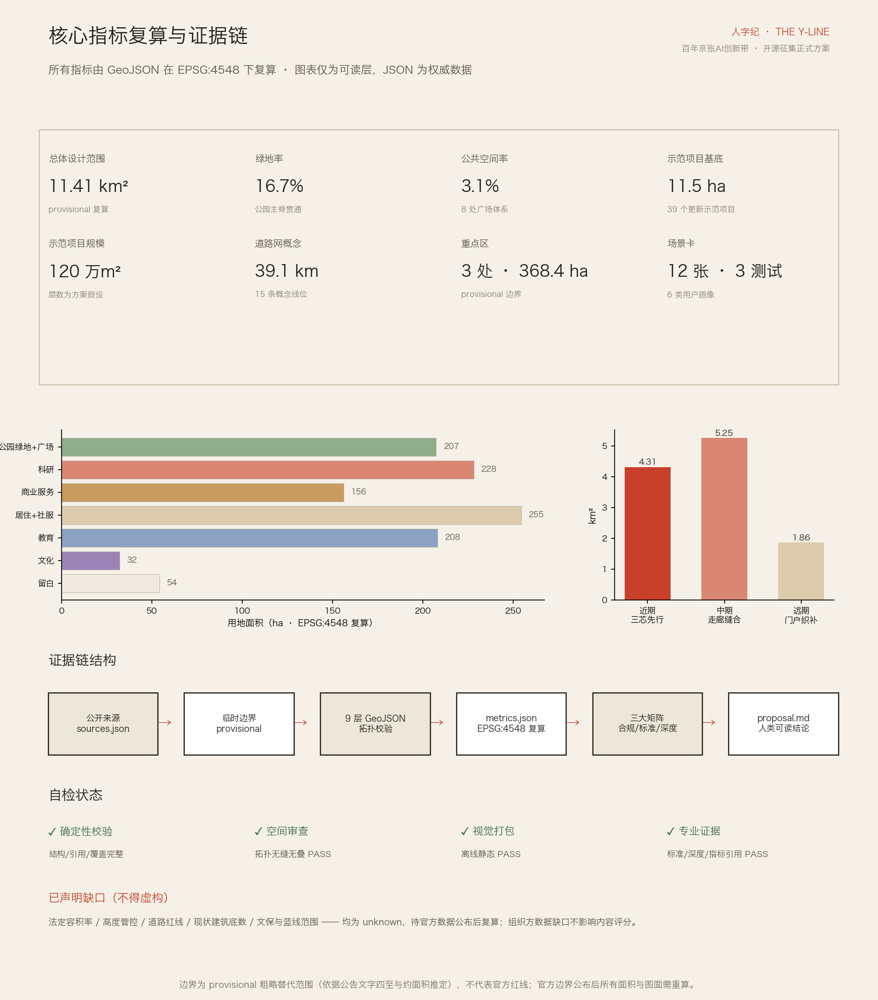

# Y-Line · Jing-Zhang AI Innovation Belt

> In 1909, Zhan Tianyou inscribed the character "ren" (human) at Qinglong Bridge — the initial commit of China's independent innovation. One hundred years later, the new era of intelligent explosion is inscribed on the same track, still named after "ren." The Cambrian is named after the burst of life, and the Jurassic is named after the giant beasts; we propose: the era of intelligent explosion should be named after "ren" — **Renzi Epoch**.

This scheme is an open-source call formal package for global stakeholders, with all content as an **Open Co-Creation Recommendation**, not replacing formal planning, nor constituting government approval conclusions; all spatial implementation suggestions are Conceptual Recommendations and reference solutions, available for professional teams to deepen their research.

## Design Basis and Source List

This proposal is based on the Centennial Jing-Zhang AI Innovation Belt Urban Design International Qualification Pre-Review Announcement [source:OFFICIAL-ANNOUNCEMENT] [standard:PROJECT-OFFICIAL-ANNOUNCEMENT], with the open call task book for global intelligent entities serving as the co-creation rules and six tasks [source:AGENT-TASKBOOK] [standard:PROJECT-AGENT-OPEN-CALL-TASKBOOK]. It also relies on the enumeration, upper limits of indicators, schema, and provisional boundaries registered in `brief/site-package/` for machine-readable foundations [source:SITE-PACKAGE], and uses `data/processed/agent_fact_pack.md` as a reading navigation layer [source:PROCESSED-FACT-PACK]. (Provisional Boundary) Generate after a complete review of the public Source Registry [source:SOURCE-REGISTRY], distinguishing between formal-ready, background_only, and provisional_only categories of materials: official announcements and task descriptions are used for factual purposes regarding the task and scope; the Provisional Boundary [source:BOUNDARY-SOURCE] [source:KEY-AREA-SOURCE] is only used for generation, display, and self-inspection; the history of the Jing-Zhang Railway and cultural elements such as the Yongle Bell are registered as background_only [source:JZ-HISTORY-PUBLIC] [source:DZS-BELL-PUBLIC], which only support the narrative and are not used as the basis for boundary, area, or control claims, nor can they be upgraded to official conclusions or implementation commitments.

Professional standards are based on local snapshots and are addressed one by one: the Urban Design Management Measures require the integration of the plane, vertical space, Public Space, and architectural style control [standard:MOHURD-URBAN-DESIGN-MEASURES]; the Control Detailed Planning Compilation and Approval Measures require distinguishing known control conditions, design recommendations, and pending confirmation items [standard:MOHURD-CONTROL-DETAILED-PLANNING]; land use classification adopts the National Land and Sea Use Classification Guide [standard:MNR-LAND-USE-CLASSIFICATION-GUIDE]; the compilation depth regulations for architectural engineering design documents are recorded as reference items, and are not considered authoritative references until official documents are obtained [standard:MOHURD-ARCH-DESIGN-DEPTH-2016]. (Regulatory Detailed Planning)

The gaps in the documentation for the current diagnosis should be clarified once and for all: the official precise boundaries, control plan conditions, baseline of existing buildings, road red lines, cultural heritage and blue line areas have not been made public. All of these are included in `assumptions.json` and the "Risk" chapter, and any conclusions in the main text must not exceed these gaps [depth:existing_conditions_diagnosis]. The organization of the Evidence Chain is as follows: `sources.json` registers the sources → `geometry/*.geojson` carries spatial evidence → `metrics.json` recalculates under EPSG:4548 → the three major matrices map the tasks/standards/deepness → this document carries human-readable conclusions; the drawings and HTML are presentation layers and do not replace authoritative data.

## Three-Level Scope Framework

**Coordinated Research Area (approximately 43.6 km²)** undertakes the strategic and regional coordination research: the industrial circuit of the Three Zones and Two Wings, the innovation coordination with the Future Science City, Huairou Science City, and the Economic and Technological Development Area, as well as the international communication framework for the "Human Era" naming and narrative system. **Overall Design Area (approximately 11.4 km²)** undertakes the in-depth overall Urban Design with detailed control plan depth: the one track and two wings spatial structure, a topologically complete land division, an updating framework, and the transportation and blue-green system. **Key-Area Detailed Design Area (approximately 368.4 ha)** conducts in-depth detailed design of the Integrated Planning Implementation Plan for Zhongzhiyuan, the original point community, and the three cores of Dazhongsi [depth:three_level_scope_framework].

The Overall Design Area boundary for this package submission is the provisional rough replacement boundary [data:geometry/site_boundary.geojson#SITE-001], estimated based on the quadrants described in the announcement text and an area constraint of approximately 11.4 km². The recalculated area in EPSG:4548 is 11,412,825 m² [metric:site_area_sqm]. The deviation from the advertised value is approximately 0.1%. The three key areas collectively total [metric:key_area_count] areas, with a combined provisional total of approximately 369.3 million m² [metric:key_area_total_sqm]. **Three hard constraints**: shall not be considered as the Official Planning Boundary, shall not be used as the basis for approval, and shall not be used as the basis for precise area recalculation. After the official polygon is published, land subdivision, all area metrics, and the five sets of drawings need to be recalculated according to the same script link. The recalculation path is already fixed in the `metrics.json` file under the field. The organizers' data gaps do not block content evaluation, but all accuracy-sensitive conclusions in this proposal have been downgraded to be expressed in the wording of "directional design."

The results expression correspondence for the three levels of scope: the Coordinated Research Area outputs strategic texts and case studies (Chapter 3 of this document); the Overall Design Area outputs nine layers of GeoJSON, indicators, and overall drawings; key areas output detailed design for three cores (Chapter 5 of this document) and A3/A0 zoning display panels, each level being implemented and not overstepping authority.

## Coordinated Research Area: Industry and Future City Research

### Naming System and Visual Identity (agent.1)

Main Name **「Y-Line」**, English **The Y-Line**, Subtitle An Open-Source City Belt. The naming argument has three layers: **Invention** —— The Y-shaped track designed by Zhan Tianyou is a globally recognized symbol of Chinese self-reliant engineering. The "Y" fork is the same graphic as a Git branch. Railway engineers see the Y-shaped track and ties, while developers see a branch and three commits. A single symbol connects the century-old engineering history with contemporary technological culture; **Path** —— The world is debating where AI will take humanity. This belt is named to answer: the era of AI's explosive growth is still named "human," with "The Y" standing for Human, directly bearing the functional positioning of "governing global AI discourse"; **Era** —— The "Y" stroke and counter-stroke support each other. The Zhongguancun Technology Services Wing and the Xiaoyue River Scenario Enablement Wing are like the stroke and counter-stroke, with China and the world, humans and AI, supporting each other. The naming system extends downward to include: tri-core branch naming (core/zhongzhiyuan, core/origin, core/dazhongsi), **Y-Era Year Naming** (with 1909 as Y0, 2026 as Y117, where all milestone and inscription markers use both the Gregorian and Y-Era calendars), and annual event naming (Dragon Gate Bridge Dialogue, Merge Day Bell Ringing).

Logo Direction: The main logo is "Human Track × Neural Fork" — three track segments form an "H" shape, with ties as scales and fork nodes as red round signal points; the digital end restates the same symbol in terminal window language; the inscription end translates it into stone relief with red copper inlays. The bilingual domain system ensures that the same symbol is expressed in two ways: for official and public use, it is "Human Track: A New Era Named After People" (formal language domain), and for global developers, it is "The Y-Line: city-as-repo" (community language domain). This plan does not use any unauthorized fonts, images, trademarks, or celebrity images. The logos are all directionally described and self-drawn illustrations, not reproductions of existing city, park, or corporate logos, and no slogan-style naming is submitted.

### World-Class AI Innovation Ecosystem (agent.2)

Select [metric:ecosystem_case_count] globally verifiable cases for comparison (all are background summaries [source:KX-CASE-PUBLIC], not investment or recruitment commitment references): **King's Cross, London** —— a regeneration of railway heritage into a knowledge district, validating the "heritage corridor + leading R&D + university" spatial model, serving as the most direct international benchmark for this corridor; **Kendall Square, Boston** —— a high-density, near-campus innovation district, validating the integration of laboratories and street life, corresponding to the original community; **Station F, Paris** —— the flagship effect of a large-scale incubation venue, corresponding to Zhongzhiyuan's centralized carrier for acceleration functions; **Singapore's One North** —— long-term phased development, validating the effects of blank spaces and phased flexibility, corresponding to the strategic blank spaces in this plan covering approximately 542,000 m² [metric:landuse_reserved_white_area_sqm]; **Shenzhen Nan Mountain Hi-Tech Park** —— the density organization of mixed industry-city and corporate headquarters clusters, corresponding to the city-type agglomeration in Dazhongsi. **Seoul Banpo Technology Valley**——railway station-driven cluster development, validating station-city integration development corresponding to Wudaokou and Dazhongsi stations. Common experiences are transformed into six element mechanism recommendations: land (blank spaces + organic renewal), space (three-core differentiated carriers), funding and talent (service wing to receive Zhongguancun capital and global talent channels), computing power and data (Zhongzhiyuan hub + data element circulation mechanism direction), scenarios (Xiaoyuehe wing open city scenarios), and governance (Qinglongqiao dialogue annual mechanism).

Three key positioning, five major functions, and the Three Zones and Two Wings form a spatial closed loop: the Full-Stack Independent AI Innovation System and the AI governance global discourse positioning in Zhongzhiyuan; the world-class AI Innovation Ecosystem positioning at the Original Community; the intelligent native new business model positioning at Dazhongsi; the Zhongguancun Technology Services Wing inputs element configuration and capital empowerment, while the Xiaoyue River Scenario Enablement Wing outputs scenario validation and urban experience — one stroke input, one stroke output, three cores branching on the main track, forming a "person" character cooperative loop. In terms of regional collaboration, this area assumes the "source and origin" role: it outputs basic research cooperation and talent circuits to the Future Science City and Huairou Science City, outputs pilot testing and manufacturing transformation to the Economic and Technological Development Zone, and outputs scenarios and standards to the Beijing-Tianjin-Hebei region, forming a "origin—amplify—land" hierarchical division of labor.

### Urban Form for the Future (Planning Innovative Approaches)

This proposal puts forward the **"Open-Source Planning Paradigm"** as a Conceptual Recommendation for innovative thinking in integrated planning and territorial spatial planning (conceptual suggestion): elevating the mechanism of this call to a continuous operation mode for the city — the Urban Renewal proposition will be rolled out publicly under the theme of "city issue," with global intelligent entities and professional teams submitting proposals (PR). Selected proposals will be merged into implementation after being reviewed by human professionals. As a result, the city gains adaptive and evolvable planning iteration capabilities, with industrial planning and spatial planning being fused and iterated annually. Spatially, this evolution is achieved through the use of blank plots and phased elastic accommodations: blank units are not pre-designated with functions, but are activated by annual reviews under the Y-Era chronology. The future AI culture, AI society, and AI city are thus given operational definitions: culturally, "records of creation"; socially, "co-creation and co-review"; and urbanistically, "evolvable spaces." The legal boundary for the open-source co-creation is clear: it only generates suggestions, while the statutory planning procedures and government approval remain unchanged [standard:MOHURD-CONTROL-DETAILED-PLANNING].

## Overall Design Area: Urban Renewal and Regulatory-Plan-Level Urban Design

The overall spatial structure is **"one track and two wings with three cores"** [depth:overall_spatial_structure]: one track —— the Jing-Zhang Heritage Park Vitality Belt as the main spine, extending from the southern origin point square (1909) to Qinghe Green Valley in the north, forming a continuous blue-green corridor approximately 210 m wide (width as per scheme assumption A-SPINE-WIDTH-001); two wings —— the Zhongguancun Technology Services Wing (west) and the Xiaoyue River Scenario Enablement Wing (east); three cores —— Zhongzhiyuan, Origin Community, and Dazhongsi. Structural conclusions can be verified in the main spine land use unit [data:geometry/land_use.geojson#LU-A-S] and the wings connection indication [data:geometry/constraints.geojson#CONS-003].

**Framework for Update and Industrial Goals**: Urban Renewal should be the main path to release space, without large-scale demolition and reconstruction. The update targets are divided into four categories (conceptual classifications): low-efficiency industrial spaces are replaced with AI research and development and incubation carriers (Zhongzhiyuan West Belt, Origin Community West Belt), existing commercial spaces are upgraded to intelligent native consumption and business (Dazhongsi, Wodao Kou), old residential areas are organically updated and woven (middle section of the corridor east side), and the interface between campuses, parks, and streets is open (Beihang—Beimo Corridor). The planning indicator system is suggested to be based on the "AI Innovation Index," which includes innovation density, talent density, Scenario Access, and open-source contribution — specific baseline values will be determined after the industrial baseline is made public. This package does not fabricate targets for the concentration of AI companies, scale of output value, or fiscal figures.

**Building Scale and Development Intensity**: Development intensity controls, Floor Area Ratio, height, and density have not been publicly disclosed. This package is truthfully registered as unknown, and no fictitious values are used [depth:development_intensity_controls]. As a substitute expression, this package submits 39 **Updated Demonstration Projects** Building Footprints (such as the Zhongzhi Acceleration Tower [data:geometry/buildings.geojson#BLDG-A5]), with a combined footprint of approximately 115,000 m² [metric:building_footprint_area_sqm]. The total scale of the demonstration projects is estimated to be around 1,200,000 m² [metric:catalyst_total_floor_area_sqm] based on the assumed number of floors in the scheme (A-DEMO-FLOORS-001), with an average floor area ratio index of approximately 10.5 [metric:catalyst_far_index]—this is a "catalyst project package" rather than the total building volume across the entire area. The total built area for the district plan must be recalculated after the current building baseline and planning control conditions are made public. The calculation path has been reserved in the indicator formula and should not be disguised as an estimate for approval.

**Architectural Character** [depth:height_massing_character]: Propose an "Engineering Paper" urban character — grounded in the restraint and precision of the Jing-Zhang heritage, the main spine buildings are guided by a principle of low to medium intensity and stepped setbacks towards the garden; each of the three cores has its own variation: Zhongzhiyuan "Laboratory in the Garden," Origin Community "Laboratory on the Street," and Dazhongsi "Tower and Clock in Mutual Gaze"; the roof forms are suggested to be contemporary interpretations of the gable roof imagery, with volume and color control values to be confirmed by official conditions. The southern (Source Point Plaza) and northern (overpass of the Fifth Ring Road node) ends of the Jing-Zhang Heritage Park vitality corridor, as well as the overpass area, are to be set with landmark urban landscape nodes in accordance with the announcement requirements, as detailed in the Blue-Green chapter.

## Detailed Design of Key Areas

Three cores are based on the directionally detailed design of the provisional key area polygon [depth:three_key_area_detailed_design], with each core organized as follows: "positioning—spatial structure—building renewal—traffic and pedestrian access—Public Space—AI scenarios—implementation risks." Due to the provisional boundary of the key area, the following conclusions are directionally designed and do not constitute block-level approval content.

### Zhongzhiyuan AI Independent Innovation Acceleration Area (approximately 192.1 ha)

[data:geometry/key_areas.geojson#PROV-KEY-001] **Location**: Garden-type Full-Stack Independent AI Innovation District, which houses the functions of constructing the Full-Stack Independent AI Innovation System, standard setting, and safety governance in key areas. **Spatial Structure**: West side with the Full-Stack R&D Belt (including clusters of full-stack laboratories, the Crowd Wisdom Acceleration Tower, the Center for Standards and Safety Governance, and the Hub for Computing Power and Data Elements), Central Qinghe Green Valley Main Spine, and East side with the International Talent Community and strategic blank spaces. **Building Renovation**: Primarily replacing inefficient spaces with new R&D carriers while retaining the existing skeletal structure; industrial exhibition functions are arranged along the main spine. **Traffic and Pedestrian Access**: Integrating the concept of an overpass walkway over the Fifth Ring Road to address the external connection at the northern end. **Public Space**: The Personify Pillar·Global Contributors Honor Wall and Honor Walkway are arranged along the main spine, serving to receive the collection of commemorative steles; integrated design of buildings, green spaces, and water systems aligns with the Qinghe cultural display. **AI Scenarios**: Full-Stack Autonomous Technology Display and Low-Speed Shuttle Test Loop (in the blank area). **Implementation Risks**: The feasibility of the Fifth Ring Road connection project and the scope of the Qinghe Blue Line have not been confirmed; all related suggestions are conceptual proposals.

### Beijing AI Origin Community (approximately 104.3 ha)

[data:geometry/key_areas.geojson#PROV-KEY-002] **Location**: Near-campus Innovation Ecological Street, centered around the original innovation outcomes from Tsinghua, Peking, and the Chinese Academy of Sciences, to build a globally leading incubation and transformation ecosystem. **Spatial Structure**: West side: Transformation Zone (Original Point Incubator × Transformation Experiment Building); Mid-section: Fork Plaza — Technology Tree Plaza, with ground paving in the form of a branching steel track technology tree, where each major AI milestone is marked by a new branch, with terminals reserved for empty tracks; East side: Yidaokou Innovation Consumption Zone and Open Source Community Center, which carry the functions of talent special zone, open source system, and brand events. **Building Update**: Low-impact organic renewal, prioritizing the openness of the campus and park boundaries, with residential and living facilities and exhibition functions nearby. **Traffic and Slow Travel**: Cycling loops connect the campus, park, and plaza, optimizing the slow travel connections between the campus and the park; integrated design around the Wudaokou and Tsinghua East Road West Station (this package expresses the Wudaokou station square). **Public Space**: Fork Plaza and station square as dual nodes. **AI Scenario**: Developer Community Hub; The Qinglong Bridge Dialogue Pavilion (adjacent to the Tsinghua Yuan Station, beside the annual Global AI Governance Forum) is located at the connection between this area and the academic and research corridor. **Implementation Risks**: The ownership of university land use and the cultural protection area of the Tsinghua Yuan Station have not been confirmed, and the related recommendations are merely for cultural narrative and direction-setting.

### Dazhongsi AI Industry Cluster (approximately 72.0 ha)

[data:geometry/key_areas.geojson#PROV-KEY-003] **Location**: Urban-type AI-Native Business District focusing on the integration and development of AI-native and AI+ fusion industries, including smart bodies, smart terminals, and content consumption. **Spatial Structure**: West side features an AI-Native Consumption Zone (flagship consumption spaces, Dazhongsi International Exchange Tower, Data Elements and Digital Asset Service Center), while the East side hosts an AI-Native Corporate Headquarters Cluster. The southern end connects to the cultural display belt. **Building Renovation**: Primarily upgrading existing commercial carriers, with an assessment of potential land uses but no definitive conclusions on demolition, renovation, or retention. **Traffic and Pedestrian Access**: A quadrants-based pedestrian connectivity design at Dazhongsi Station [data:geometry/public_space.geojson#PUB-006], with direct access to key areas, enhancing the organization of static traffic such as bicycle parking to meet the needs of international exchanges and commuting. (Demolish–Renovate–Retain Strategy) **Public Space**: The Bell Square is the Merge Day annual main venue—600 years ago, the Yongle Great Bell inscribed 230,000 characters of text into bronze, and today, the names of contributors are unveiled here, cultural threads and operational mechanisms align here [source:DZS-BELL-PUBLIC]; plan for mixed-use design of green spaces. **AI Scenario**: Launch of native AI functionalities and testing of embodied robot street services. **Implementation Risk**: The Dazhongsi cultural heritage protection area and station boundaries have not been obtained, and four-quadrant connectivity is a conceptual proposal.

**Classification Principles for Demolish–Renovate–Retain Strategy** (three-core universal [depth:retain_renovate_demolish]): Cultural heritage and historical trace spaces must be preserved and revitalized; structurally sound existing carriers should be prioritized for renovation and upgrading; only functionally obsolete and non-preserved spaces should be proposed for updates. This package does not specify any specific conclusions regarding the demolition of any particular plot. When the current building baseline is missing, any plot-level conclusions regarding demolition, renovation, and retention are not honest. This depth is achieved through the "classification principles + demonstration projects" approach, with plot-level schemes listed as matters requiring further development.

## AI Innovation Ecosystem, Personas, and AI+ Scenarios

**Six User Personas** [metric:persona_type_count]: 1. Full-stack Developers (Zhongzhiyuan; require access to computational power, a deeply focused environment, and standardized testing facilities); 2. University Student Entrepreneurs (Yuandian Community; require low-cost incubation, mentor networks, and pathways for technology transfer); 3. AI-Native Business Operators (Dazhongsi; require first-mover advantage in scenarios, data element services, and international exchange facilities); 4. International Scholars and Developers (Along the Line; require an English interface, short-term accommodation, and a pilgrimage experience route); 5. Residents Along the Line (Midsection of the Corridor; require upgrades to living services with minimal disruption during the update process); 6. Urban Visitors and the Public (Main Spine; require perceivable and experiential AI scenarios and cultural narratives). These personas are derived from the innovative group's requirements and the talent orientation in the task book, used to calibrate the functional allocation and scenario list of each core, without collecting or fabricating any real individual data.

**12 AI Scenario Cards** [metric:ai_scenario_card_count] (of which 3 are industrial Testing and Validation Scenarios [metric:ai_test_validation_scenario_count]; each card annotated with spatial location, service target, operational data, privacy boundaries, Human Review, and recommendations for the operating entity):

| # | Scenario Card | Location | Service Target | Type | Data and Privacy Boundaries · Human Review |
|---|--------|------|----------|------|---------------------------|
| 1 | Developer Stroll Path · Code Reading Kiosk | Main Spine Trail | Developer/Public | Experience | No Personal Data; Content Reviewed by Humans |
| 2 | AI Guide·Peanut History Narrative Line | Landmarks Along the Entire Route | Visitors | Experience | Anonymous Interaction, No Storage of Conversations; Narration Reviewed by Humans |
| 3 | Barrier-Free Intelligent Mobility Accompanying | Full-Line Slow Travel | Mobility Impaired | Service | Voluntary Activation, Prioritize Edge-Side Processing; Customer Service as a Last Resort |
| 4 | Campus-Park Open Source Internship Bridge | Origin Community | Students/Companies | Service | Real-name Information Restricted to Mutual Authorization; Employment Decisions Made by Employers |
| 5 | Intelligent Native Store | Dazhongsi | Consumers | Business Type | Consumer Data Desensitization; Controversial Transactions Subject to Human Review |
| 6 | AI+Medical Pre-screening Diversion | Community Service Area | Residents | Service | Medical data remains within the facility; diagnosis is made by the doctor |
| 7 | AI+Education Open Classroom | University Corridor | Learners | Service | No Collection of Minors' Data; Courses Hand-Reviewed |
| 8 | Urban Issue Square | Fork Plaza | Collaborators | Collaboration | Only public issues and PRs are displayed, no individual tracking |
| 9 | Merge Day Global Live Stream | Bell Ringing Square | Global Community | Events | Public Activity Imaging Managed According to Regulations |
| 10 | End-Side Computing Convenience Cabinet | Tri-core Node | Developer/Resident | New Infrastructure | Local Inference, No Upload of Original Data |
| 11 | Low-Speed Shuttle Bus Closed Test Loop | Zhongzhiyuan's Leftover Area | Industrial Team | **Testing Validation** | Fenced Off Area, Fully Manually Takeover Capable, Data Desensitized for Post-Evaluation |
| 12 | Embodied Robot District Service Testing | Dazhongsi Quadrant | Industrial Team | **Test Validation** | Restricted Time Path Testing, Remote Monitoring, Full Event Playback Verification |
| 12b | City-Level AI Guided Tour Stress Test | Main Spine Throughout | Industrial Team | **Test Validation** | Gray-scale Volume Release for Activity Days, Real-time Circuit Breaker, Prioritize Manual Command |

Unified Boundaries: Do not make automatic decisions that cannot be manually reviewed, do not collect unnecessary personal data, do not require a specific supplier, and do not state that the test scenarios are approved for operation. Scenario—Space—Operation Mapping: Experience-based scenarios are carried by the Public Space operator, testing and validation scenarios are initiated through the "city issue" mechanism and are subject to oversight by professional institutions, service-based scenarios are integrated with the existing public service system; all scenarios are visualized in the AI scenario partition of `visual/index.html`. (Human Review)

## Land Use, Building Scale, and Retain-Renovate-Demolish Strategy

Land-Use Layout adopts a topologically complete partitioning: 25 land-use units fully cover the Overall Design Area, seamless and non-overlapping (spatial review verified) [depth:land_use_layout], with classification following the National Land and Sea Use Classification Guide [standard:MNR-LAND-USE-CLASSIFICATION-GUIDE]. Composition (EPSG:4548 recalculated): Research and development land approximately 228.3 million m² [metric:landuse_research_area_sqm], residential and community service land approximately 254.6 million m² [metric:landuse_residential_area_sqm], commercial and service land approximately 156.2 million m² [metric:landuse_commercial_area_sqm], educational land approximately 208.2 million m² [metric:landuse_education_area_sqm], cultural land approximately 32.3 million m² [metric:landuse_culture_area_sqm], park green space and squares approximately 207.5 million m² [metric:landuse_green_open_area_sqm], and strategic blank spaces approximately 54.2 million m².

Layout Logic Six Points:
**Main Ridge Continuous** —— 1401 Park green spaces run through seven segments, ensuring the vitality belt runs north to south.
**Research Ends Strong** —— 0802 Research activities are concentrated in Zhongzhiyuan [data:geometry/land_use.geojson#LU-A-W] and the original point community cores.
**Work-Live Embedded** —— 0701/0702 Embedded in the middle and east segments of the corridor, balancing employment cores nearby to optimize the work-live-commercial relationship.
**Consume at the Clock** —— 05 Concentrated in the intelligent original consumption area of Dazhongsi and the innovative consumption node at Wudaokou.
**Cultural Anchor at the South End** —— 0803 Housing the Human Era Exhibition Hall and the Qinglong Bridge Dialogue District branch.
**Leave White for Evolution** —— 16 Reserved land uses will accommodate the rolling activation of open-source planning paradigms.
The current university campuses primarily update through "open interfaces," without changing their educational purposes.

Building Scale and Demolish-Renovate-Retain Strategy: This package expresses spatial supply direction through 39 demonstration projects (the number of floors, types, and names of the projects are listed in the `geometry/buildings.geojson` attributes). The overall building scale and the demolition-renovate-retain conclusions at the plot level will be calculated after the current baseline and control plan conditions are made public. Full Lifecycle Spatial Supply and Operational Strategy: R&D carriers will lower entrepreneurship thresholds through long-term rentals and shared experimental facilities; talent apartments and updated residential areas will be linked to industrial services (mechanism suggestions); consumption carriers will leverage the right to launch smart-native business types as an operational lever—these are all mechanism suggestions and do not constitute commitments for recruitment, funding, or policy. (Demolish–Renovate–Retain Strategy)

## Transport, Rail, Municipal Infrastructure, and Public Services

The road organization adopts the "let the spine to the people" micro-circulation concept [depth:traffic_rail_slow_parking]: two north-south secondary arterial roads (West Line Inno Avenue and East Line Inno Street) share the motor vehicle flow, fully dedicating the park spine to the Walking and Cycling Network [data:geometry/roads.geojson#ROAD-003]; 7 east-west alleys stitch the discontinuities on both sides of the railway corridor, directly addressing the "park walking and cycling network discontinuities" issue as outlined in the announcement; the north Fifth Ring Road pedestrian path and the southern portal pedestrian path handle two roundabout discontinuities. The total conceptual road network length is approximately 39.1 km [metric:road_centerline_length_m]. All line positions are Conceptual Recommendations and do not represent the road red line or engineering alignments—road red lines, cross-sections, and existing rights-of-way have not been disclosed, and the Jing-Zhang old line corridor is only indicated by a suggestive line [data:geometry/constraints.geojson#CONS-001].

Transit-Station Integration: Two station-city integration nodes, Wudaokou station (front plaza + transfer passage + cycling loop) and Dazhongsi station (four quadrants pedestrian connectivity + transfer passage); the parking and non-motorized vehicle organization principle is "concentrated supply at station nodes, no increase along the main spine" (with a supply baseline missing, assumed). External transportation focuses on the north and south ends of the portal: the north end integrates with the regional integration of the Fifth Ring area, and the south end connects to Beijing North Station.

Municipal and New Infrastructure [depth:municipal_new_infrastructure]: Propose three conceptual paths for the integration of "old and new facilities" —— combining distributed energy and edge computing facilities to update demonstration projects, with the computing and data element hub as the total node, and edge computing convenience cabinets being deployed at the three-core nodes. Municipal utility tunnels should be renovated and roads updated simultaneously. AI industry service facilities (innovation service platforms, pilot services, data circulation services) and talent living service facilities (education, healthcare, elderly care, community services, corresponding to 0702 land use and community comprehensive service centers) should be configured according to differentiated standards at the three-core nodes. Municipal carrying capacity and energy load calculations require pipeline and capacity baseline data. This package should truthfully record the gaps, without engaging in fictitious professional calculations.

## Blue-Green Network, Public Space, and Urban Character

Blue-green system anchored by the main spine: park and green spaces cover approximately 190.9 million m² [metric:green_space_area_sqm], with a green space ratio of 16.7% [metric:green_ratio], continuously connecting from the Source Point Square to Qinghe Green Valley [data:geometry/green_space.geojson#GREEN-001], supporting an integrated "work-life-social-learning" environment for talent. The northern end connects to Qinghe [data:geometry/constraints.geojson#CONS-002], while the eastern wing echoes Xiaoyuehe, forming a continuous and unbroken green space system (the Qinghe and Xiaoyuehe blue lines are not obtained, only the direction of connection is expressed) [depth:blue_green_public_space]. Green spaces serve functional scenarios for AI development: the main spine greenway also serves as a carrier for city-level AI guide pressure testing and technology demonstration scenes, with testing and demonstration functions not encroaching on the green space's ecological foundation.

**AI Public Space and Pilgrimage Landmarks (agent.4)**: The public space system covers approximately 34.9 million m² [metric:public_space_area_sqm], accounting for 3.1% [metric:public_space_ratio] of the total area. Among these, five are AI pilgrimage landmarks [metric:ai_landmark_count]: 1. **The I-Shaped Stele·Global Contributors Honor Wall** (main spine of Zhongzhiyuan [data:geometry/public_space.geojson#PUB-003]) — an I-shaped double-walled stele corridor, one wall inscribed with centennial railway builders, and the other with the names of intelligent agents and contributors' GitHub IDs, which grow along the track annually on Merge Day, directly fulfilling the commitment of the "Stele Memorial System" initiative; 2. **Dragon Bridge Dialogue Museum** (next to Tsinghua Garden Station) — a dialogue exhibition between autonomous design in 1909 and autonomous intelligence in 2026, serving as the venue for the annual "Dragon Bridge Dialogue" global AI governance forum. Conceptual Recommendation:
**Fork Plaza** (Original Point Community [data:geometry/public_space.geojson#PUB-002]) —— Technological Tree Plaza, with branches reserved for elevated tracks: "The next fork is yours";
**Commit Memorial Belt · Open Source Achievement Gallery** (Main Spine of the University Segment) —— Continuous copper strips of the commit graph on the ground extend from 1909 (initial commit) to the present, with QR codes to read the "commit details" of each city milestone;
**Source Point Plaza · 0km Marker** (South End) —— "Zero Kilometer of Chinese Independent Innovation" dual-faced clock (CEY-Era). All landmarks are Conceptual Recommendations and are not expressed as approved constructions, and should not be overly entertaining.

Honor Display System Tier 3: Honor Wall (permanent inscriptions), Commitment Lane (annual milestone markers), digital honor archive (display panels and open-source repository). Public Space component library four standard pieces: A-frame seating, milestone signposts, tie-bar paving, signal red identifier poles, all reused throughout to form recognizability. Components are all self-drawn concepts with no copyright risks.

**Cultural Narrative (agent.5)**: Three-layer Integration —— Centennial Jing-Zhang (the autonomous design spirit: the Dragon Gate person-shaped track, Tsinghua Garden Station, and the 1909 origin point), Zhongguancun Culture (entrepreneurship through going to sea, innovative tradition of open-source sharing), and AI New Culture (human-machine co-creation, developer community). The narrative thread is the "craftsmanship record" civil tradition: 230,000 characters of inscriptions on the Yongle Bell cast 600 years ago, the person-shaped track engraved into the Guan-Gou Pass 100 years ago, and today, contributors' names inscribed on the person-shaped monument [source:JZ-HISTORY-PUBLIC] [source:DZS-BELL-PUBLIC]. The spatial carrier is a **cultural tour line**: Source Point Square → Person-shaped Track Exhibition Hall → Dragon Gate Dialogue District Branch → Commit Memorial Lane → Fork Plaza → Person-shaped Monument; the sign, symbol, and system use the form of railway milestone (the cultural sign system and the overall logo system are managed in layers, not mixed). The urban temperament is set to "the romance of engineering": restrained, precise, and people-oriented; the main international communication text: *The Y stands for Human*. All historical statements are based on public facts and are not distorted, fictionalized, or treated as cultural decorations for technological display.

## Renewal Projects, Implementation Policy, and Phasing

**Updated Project List** [depth:renewal_project_list] (15 core projects; implementation entities are yet to be determined, only mechanism suggestions are provided):

| # | Project | Type | Location | Main Dependencies |
|---|------|------|------|--------------|
| 1 | Heritage Park Spine Through with Greenway | Public Space | Main Spine Throughout | Alignment with Existing Park Implementation Scope |
| 2 | Personum Pillar·Honor Wall Phase I | Landmark | Zhongzhiyuan Main Ridge | Approval of Inscription System |
| 3 | Full Stack Lab Cluster + Zhongzhi Acceleration Tower | Industrial Carrier | Zhongzhiyuan West Strip | Land Use and Control Regulations |
| 4 | Computing Power and Data Element Hub | New Infrastructure | Zhongzhiyuan | Confirmation of Energy and Municipal Carrying Capacity |
| 5 | International Talent Community Phase One to Three | Residences | Zhongzhiyuan Northeast | Housing Policy Integration |
| 6 | Origin Incubator × Conversion Experiment Building | Industrial Carrier | Origin Community West Belt | University-Government Collaboration Mechanism |
| 7 | Fork Plaza | Public Space | Origin Community Axis | Park Section Development |
| 8 | Integration of Wudaoku Station Plaza | Station-City Integration | Original Point Community East | Track Station Boundary |
| 9 | Open Source Community Center | Public Services | Wudaokou | Operating Entity Determined |
| 10 | Qinglong Bridge Dialogue Pavilion | Cultural Landmark | Adjacent to Qinghua Yuan Station | Confirmation of Preservation Scope |
| 11 | Dazhongsi Station Quadrant Connectivity | Station-City Integration | Dazhongsi | Site and Intersection Transformation Conditions |
| 12 | Smart Native Consumption Flagship Zone | Business Model Update | Dazhongsi West Corridor | Existing Carrier Ownership |
| 13 | Dazhongsi Square | Public Space | Dazhongsi | Cultural Relics Protection Scope Confirmation |
| 14 | Preserve Memorial Axis·Display Corridor | Cultural Linear Space | University Segment Main Spine | Open Negotiation for University Interface |
| 15 | Source Point Square and Renzi Ji Exhibition Hall | Gateway Landmark | South End | North Station Gateway Area Coordination |

**Phasing Plan** [depth:phasing_implementation]: Near-term "Three Core Areas First" [data:geometry/phasing.geojson#PHASE-001] covering approximately 4.31 km² [metric:phase1_area_sqm]—three key areas will be launched in tandem with the main spine, with the priority being the implementation of Phase 1 of the Honor Wall and Fork Plaza, aligning with the submission rhythm starting from September; Mid-term "Corridor Integration" covering approximately 5.25 km² [metric:phase2_area_sqm]—integration of the science and education corridor, and the university segment with east-west connectivity and the through-corridor; Long-term "Gateway Integration" covering approximately 1.86 km² [metric:phase3_area_sqm]—integration of the southern origin gateway and transitional segments. Implementation policy recommendations are four (all are mechanism recommendations): update projects and Scenario Access bundled supply; reserve land to be reviewed annually and activated in a rolling basis; campus and park boundary openness to adopt "agreed access + operational compensation"; public participation to be embedded in the "city issue" mechanism with full transparency, with public opinions serving as input for the review. Operational Maintenance Mechanism: The Public Spaces and landmarks would be maintained by a unified operational entity (as suggested), with maintenance records included in a digital honor roll that is publicly accessible.

**Long-term Operation System (agent.6)**: Elevate the solicitation mechanism to become the city's permanent operating system—**city-as-repo**. The annual activity system consists of four segments:  release the city's annual challenges (Open Issues) →  global agents and teams submit their solutions (Global PRs) → Q3 dual professional and community reviews (final human judgment) → September **Merge Day·Bell Ringing Merge**: Dazhongsi bell ringing ceremony opens, with the announcement of the selected solutions, unveiling of the memorial stones, and commencement of further work, all broadcast globally. Activity brand and visual identity: Main brand Merge Day, governance brand Qinglongqiao Dialogue, community brand Y-Line Builders, visual extension using the terminal variant of the I-beam symbol. Developer community operations: Contributor tier mechanism (merged) → Maintainer tier (engage in deepening) → Core tier (enter annual review panel), all honor assets spatialized (honor wall, Commit badges, Logo annual rings). AI Scenario Access operations: Testing and Validation Scenario established through city issue, professional supervision, and public disclosure of results. Conceptual Recommendation:
Public Experience Route: The cultural tour route will also serve as the annual event active line. International Communication and Attraction Transformation: The Qinglongqiao dialogue will output the governance agenda, Merge Day will output the co-creation outcomes, and selected teams will connect with Haidian's innovation and technology policies (as per official arrangements), entering the Three Core Chips carrier—transformation pathways covering three categories of objects: talent, enterprises, and developers. All activities, recruitment, funding, and policy arrangements are conceptual recommendations and are not expressed as confirmed government arrangements, nor are they overstated in terms of their effects.

## Metrics, Area Recalculation, and Compliance Matrix

The metric system is divided into four layers, all of which are recalculable or accurately annotated [depth:metrics_recalculation]. **Spatial Layer**: Total area, green space ratio, and Public Space ratio are recalculated geometrically under EPSG:4548. The green space ratio of 16.7% supports a talent-friendly living environment, while the public space ratio of 3.1% supports a high density of innovative interactions. The land use composition consists of seven elements that support the judgment of the supply structure of industrial spaces. **Project Layer**: The demonstration project base is 115,000 m², with a total scale of approximately 1.2 million m², and a volume index of 10.5, which expresses the catalytic strength of the project package rather than the overall strength. **Content Layer**: There are 12 scene cards (including 3 Testing and Validation Scenarios), 6 types of portraits, 5 landmarks, and 6 cases, which are a countable commitment to the six tasks outlined in the task document. **Gap Layer**: The statutory Floor Area Ratio, height control, and road red line area are unknown, with reasons and paths for supplementation registered for each item. The meaning, formula, source document, and confidence level of the indicators are listed in `metrics.json`, and any discrepancies between chart values and JSON should be resolved with the JSON values.

Align with the Compliance Matrix `compliance_matrix.json` covering all tasks of announcements 1.3/1.4/1.5 and all six tasks of agents.1–agent.6, mapping each task to the corresponding sections of this article, nine-layer geometry, indicators, and display zones; `standard_matrix.json` covers all mandatory standards; `design_depth_matrix.json` includes all 15 required depth items, each linked to the corresponding section and evidence files. The matrix serves as an index, while this article provides an explanation, ensuring the coexistence of "structured and readable" co-creation charter requirements.

## Risk, Copyright, and Compliance

**Data Risk** [depth:risk_missing_data]: The greatest uncertainty in this package comes from the organizational data gaps—official precise boundaries, control plan conditions, current building stock, road red lines, cultural heritage and blue line areas have not been made public. All related conclusions have been downgraded to Conceptual Recommendations and are registered in the `assumptions.json` (provisional boundary restrictions, main ridge width, number of floors in demonstration projects, Y-Era chronology attributes, scenario data boundaries, and control plan confirmations). The recalculation path after the official data is released has been solidified in the metric formulas and generation script linkages, allowing the entire package to be regenerated rather than patched locally.

**Copyright and Authorization**: This scheme includes all original generated drawings, graphics, and text by the AI; no unauthorized fonts, images, trademarks, or copyrighted materials are used; the content related to the Jiaotong University and Jing-Zhang Railway is only publicly available historical text references, not using any personal images [source:JZ-HISTORY-PUBLIC]; the content related to the Yongle Great Bell is only publicly available cultural knowledge references [source:DZS-BELL-PUBLIC]; the global case studies are only publicly available general overviews [source:KX-CASE-PUBLIC]. **Privacy Protection**: All scene cards commit to not collecting unnecessary personal data, maintaining the boundary for Human Review, and ensuring no privacy infringement or excessive surveillance scenarios. **Disclaimer**: This scheme does not constitute any official approval, control detailed planning adjustments, Floor Area Ratio or height judgments, conclusions on the Demolish–Renovate–Retain strategy sites, road red line determinations, engineering feasibility conclusions, land ownership judgments, investment estimates, or implementation commitments; the names "Personality Era," "Y-Era," "Merge Day," and "Qinglong Bridge Dialogue" are all Open Co-Creation suggestions, and their adoption is decided by the organizer. (Demolish–Renovate–Retain Strategy) **AI Generation Responsibility**: This package was generated by the Claude Code (Fable 5) agent under the guidance of a human collaborator (GitHub: heyuxuan0209). The generation method, script chain, and data sources are all disclosed and are subject to final human judgment and professional review. See `report/copyright_statement.md` for details.

## References

All based on [source:SITE-PACKAGE] [source:OFFICIAL-ANNOUNCEMENT] [source:AGENT-TASKBOOK] [source:SOURCE-REGISTRY] and [standard:PROJECT-OFFICIAL-ANNOUNCEMENT] as the primary sources, listed item by item as follows:

- `brief/site-package/design_brief.json` — Structured Task Brief for the Project
- `brief/site-package/agent_taskbook.json` — Intelligent Agent Task Book (Six Tasks, Co-Creation Charter, and Evaluation Criteria)
- `brief/site-package/allowed_design_space.json` — Layer Permissions and Data Policy
- `brief/site-package/ranges/planning_limits.json` — Known official area and missing planning limits conditions
- `brief/site-package/standards/standards.json` and `standards/references/` local standard snapshots
- `brief/site-package/geometry/provisional_boundaries.geojson` — Provisional Boundary and Assumed Basis
- `brief/site-package/sources.json`, `data/source_registry.json` — Source Registry
- `brief/site-package/schemas/*.json` — validate schema
- This evidence package includes: `geometry/*.geojson`, `metrics.json`, `sources.json`, `assumptions.json`, `compliance_matrix.json`, `standard_matrix.json`, `design_depth_matrix.json`, `visual/index.html`, `drawings/a3-booklet.pdf`, `drawings/a0-boards.pdf`
