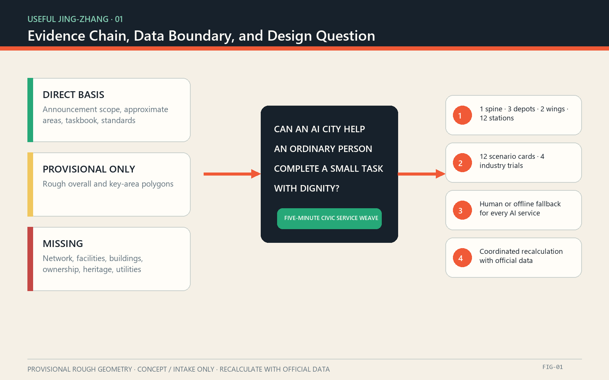
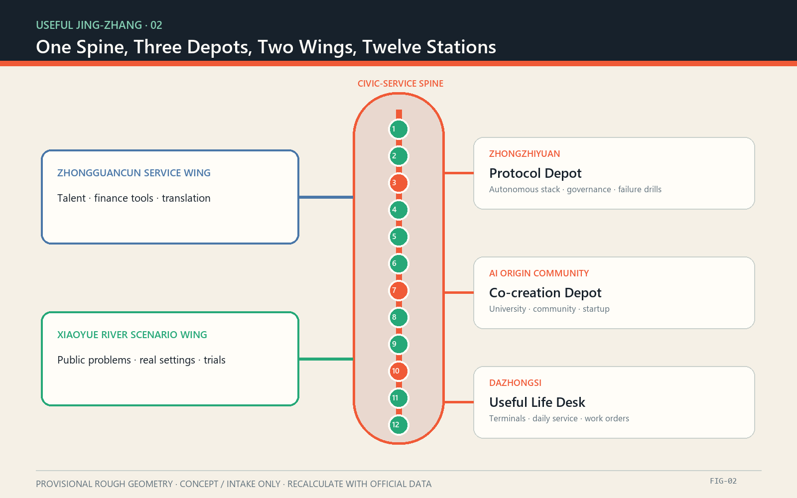
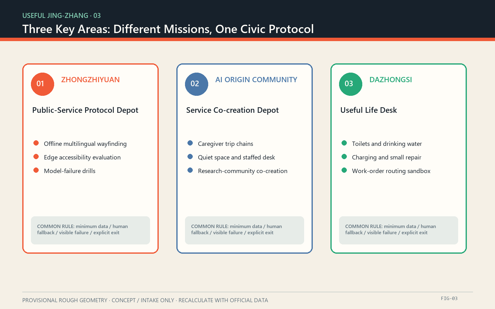
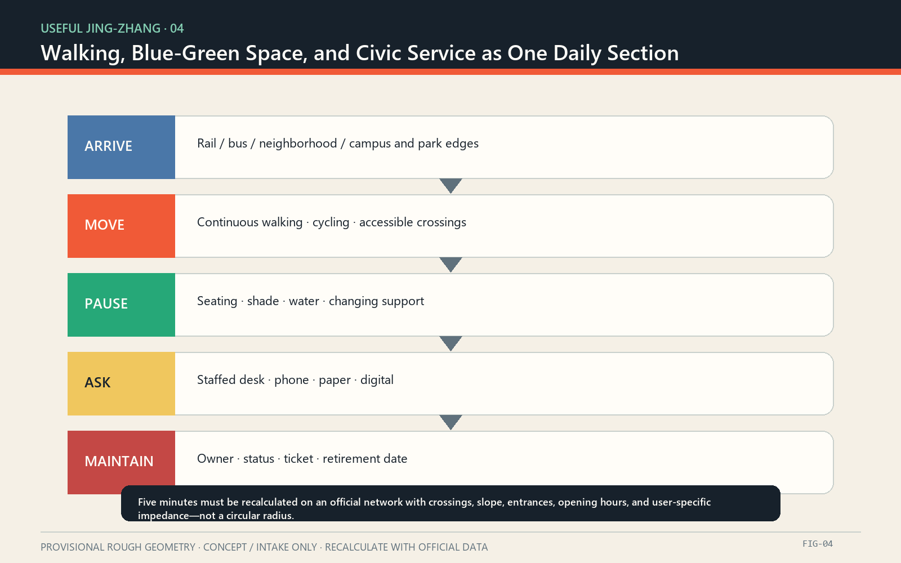
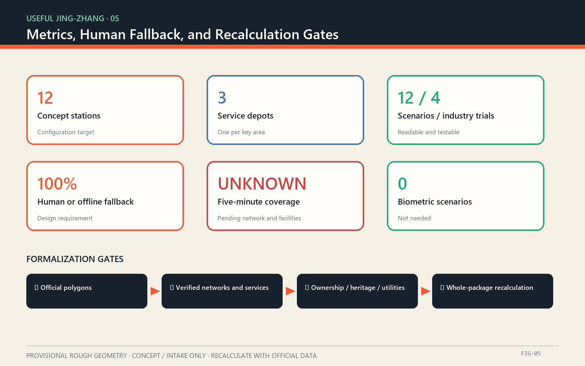

# USEFUL JING-ZHANG: A Five-Minute Civic Service Weave for the AI City

## Design Basis and Source List

The direct basis consists of the public open-call announcement, the cleared agent taskbook extract, and the repository’s structured site package. The announcement provides the 43.6 km² coordinated research area, the 11.4 km² overall design area, the three key areas totaling 368.4 hectares, and the work required at each level. The taskbook adds the three positionings, five functions, three areas and two wings, six agent tasks, and a common boundary clause. The package does not contain official exact boundaries, road redlines, parcel ownership, existing-building surveys, public-facility inventories, municipal utilities, or heritage control lines. This proposal therefore makes no approved FAR, height, demolition, engineering alignment, investment, or government-commitment claim. [source:OFFICIAL-ANNOUNCEMENT] [source:AGENT-TASKBOOK]

The submitted overall boundary and three key-area polygons are the repository’s provisional rough geometries. They support generation, visualization, discussion, and intake checks only. They are not official redlines and their calculated areas are not approval evidence. The design layers are “concept containers” for testing relationships and package completeness; they do not prove the location of real roads, buildings, green space, or facilities. Once official polygons arrive, service catchments, walkability, land-use coverage, building footprints, public-space areas, phases, and all derived ratios must be recalculated together. [data:geometry/site_boundary.geojson#SITE-001] [depth:existing_conditions_diagnosis]

“Five minutes” is currently a service-experience target, not a verified isochrone. The formal method is to inventory toilets, water, seating and shade, accessibility, human help, charging, and small repair, recording location, opening hours, condition, owner, accessibility, and non-digital alternative. Coverage is then computed with official pedestrian links, crossings, slope, entrances, and operating hours. Helsinki Service Map, Singapore OneService, and Paris public-toilet data inform service cataloguing, routing, and open-data mechanisms only; none describes existing Jing-Zhang conditions. [source:HELSINKI-SERVICE-MAP] [source:PARIS-TOILETS]

## Three-Level Scope Framework

“USEFUL JING-ZHANG” changes the test of an AI city from “how much technology is deployed” to “whether an ordinary person can complete a small task with dignity.” Its spatial grammar is One Spine, Three Depots, Two Wings, Twelve Stations. The spine is a civic-service and cultural walking structure associated with the Jing-Zhang Heritage Park. A service co-creation depot is proposed in each key area. The Zhongguancun Technology Service Wing and the Xiaoyue River Scenario Empowerment Wing supply expertise and test settings. Twelve replaceable station modules fill service gaps. Twelve is a conceptual design count, not a fixed location plan or public construction promise. [source:AGENT-TASKBOOK] [data:geometry/public_space.geojson#PUBLIC-001]

The coordinated research area organizes institutions and resources: an open service directory, talent and developer collaboration, trial admission, data minimization, and procurement or exit. The overall design area organizes the network: the service spine links walking, blue-green space, three depots, and transit access. The key areas organize verification: Zhongzhiyuan tests full-stack and governance capabilities; the AI Origin Community tests university-community-startup collaboration; Dazhongsi tests everyday and consumer-facing AI-native services. A loop of problem discovery, open challenge, controlled trial, human review, and procurement or retirement connects all three levels. [depth:three_level_scope_framework] [standard:PROJECT-AGENT-OPEN-CALL-TASKBOOK]

The three positionings become three operating lines. The Centennial Jing-Zhang Cultural Belt means “time made visible”; the Metropolitan AI Life Experience Belt means “small tasks made possible”; and the AI Integrated Innovation Belt means “technology that can be tested, reviewed, and withdrawn.” The five functions map to autonomous-stack trials, a global innovation ecosystem, AI+ scenarios, lively civic services, and public governance protocols. The identity uses the grid of the Chinese character 用, two parallel railway lines, and an open bracket. Charcoal, rail orange, service green, and warm paper form an original visual system without corporate marks, portraits, or restricted typefaces. [source:AGENT-TASKBOOK] [depth:overall_spatial_structure]

| Level | Primary subject | USEFUL JING-ZHANG output | Precision boundary |
| --- | --- | --- | --- |
| 43.6 km² coordinated research | Industry, talent, compute, data, finance, governance | Useful Ecosystem Protocol and open problem bank | Mechanism research only; no new redline |
| 11.4 km² overall design | Urban and industrial areas around the heritage park | One service spine, two support wings, service directory | Concept structure inside provisional geometry |
| 368.4 ha key areas | Zhongzhiyuan, AI Origin Community, Dazhongsi | Three depots and differentiated trial missions | Provisional polygons pending official replacement |

## Coordinated Research Area: Industry and Future City Research

The six global cases are compared by how innovation becomes public value, not by visual similarity. Mila’s open science and inter-university network suggest reproducible outputs and research residencies. Vector’s independent non-profit bridge between research, talent, and adoption suggests a neutral translation layer. Helsinki’s city innovation company suggests that public actors retain control of problem definition and trial responsibility. Seoul AI Hub combines space, talent, enterprise support, and a specialist network, showing that depots need permanent operations rather than one-off exhibition halls. Punggol Digital District places education, industry, and community near one another, supporting mixed learning, work, and service. Barcelona BIT Habitat uses open challenges, pilots, measurement, and diffusion, indicating that adoption should start with a public problem and tested outcome. [source:ECOSYSTEM-MILA] [source:ECOSYSTEM-BARCELONA]

| Case | Verified mechanism | Transferable Jing-Zhang action | What is not copied |
| --- | --- | --- | --- |
| Montréal / Mila | Open science, multi-university research, knowledge transfer | Open baselines, residencies, reproducibility | Institutional scale and brand |
| Toronto / Vector Institute | Neutral bridge for research, talent, and adoption | Service translators, joint validation, talent matching | Funding and company lists as promises |
| Helsinki / Forum Virium | City-owned innovation company and real-world trials | Public problem bank, trial permits, maintenance participation | Trial does not equal approved deployment |
| Seoul AI Hub | Space, training, enterprise support, AI network | Long-term menu for the Zhongzhiyuan depot | No inference that Jing-Zhang has identical resources |
| Singapore / Punggol Digital District | Proximity of education, industry, community, and digital platforms | Learning-work-service mix in the AI Origin Community | Land intensity and management stack |
| Barcelona / BIT Habitat | Open challenge, pilot, measurement, diffusion | Small validation grants, published outcomes, adoption/exit gates | Grant levels and local procurement law |

The ecosystem map has eight resources and one public-value chain. Land enables authorized trials; space hosts three depots and twelve stations; industry proposes testable capabilities; finance remains a menu of possible instruments; talent includes researchers, service designers, maintainers, and community mentors; compute is tiered by need and favors minimum edge processing; data is public or cleared; scenarios originate in resident and maintenance problems. Governance controls admission, data, accessibility, safety, review, and retirement. The value chain starts with a public problem, proceeds through open challenge, sandbox, independent review, and public experience, and ends in a service contract, an open component, or a documented stop decision—not a count of demonstrations. [depth:municipal_new_infrastructure] [source:AMSTERDAM-AI]

## Overall Design Area: Urban Renewal and Regulatory-Plan-Level Urban Design

The overall design does not divide a provisional boundary into pseudo-precise parcels. It defines four interfaces for later professional development. The Service Spine organizes walking, pause, orientation, and service discovery along the heritage park and its urban edges. Service Stitches connect transit, neighborhoods, campus and park edges to the spine. Three Depots favor adaptive use of suitable existing space. Twelve Stations are small, replaceable components that address verified gaps. Until road, crossing, and entrance data are supplied, all lines indicate connection intent rather than engineering alignment. [data:geometry/roads.geojson#ROAD-001] [depth:overall_spatial_structure]

Land use is represented as functional adaptation rather than statutory change. Research and validation, public open space, industrial and everyday services, and community support are diagrammatic roles used to test whether the service network reaches more than technology workplaces. They do not establish existing land use or request a planning change. The building sequence is survey first, adaptation second, new construction last. Without ownership, age, structure, use, heritage, fire, and regulatory data, no building is assigned a final retain, renovate, or demolish category. Depots prioritize reversible interiors, shared ground floors, and light service equipment. [data:geometry/land_use.geojson#LU-001] [depth:land_use_layout]

Renewal priorities follow service gaps rather than land value or architectural spectacle. Candidate work begins with a facility inventory, accessibility audit, heat-comfort observation, night-lighting check, and human-service-hours survey. One segment and one depot then host a low-cost trial. Expansion occurs only after safety, equity, maintenance time, failure recovery, and public-feedback gates are passed. The digital layer stores only where a service is, when it opens, whether it works, who owns the response, and how to obtain it offline. It does not build personal trajectories, emotion profiles, or persistent identity recognition. [standard:MOHURD-URBAN-DESIGN-MEASURES] [depth:renewal_project_list]

## Detailed Design of Key Areas

Zhongzhiyuan AI Autonomous Innovation Acceleration Area receives a conceptual Public-Service Protocol Depot. It supports autonomous-stack evaluation, safety governance, and standards through an isolated test environment, edge-device bench, accessibility route, failure-drill table, and public demonstration desk. Initial validations avoid personal biometrics: multilingual offline wayfinding with human correction; local facility-status inference on low-power devices; and human takeover when a model, network, or power supply fails. Its location and building adaptation remain subject to official boundaries, surveys, heritage, utilities, and approvals. [data:geometry/key_areas.geojson#PROV-KEY-001] [depth:three_key_area_detailed_design]

The Beijing AI Origin Community receives a Service Co-creation Depot. Researchers, founders, residents, frontline service staff, and maintainers share one problem table for caregiver trips, accessibility, learning, incubation, and near-campus life. The menu includes bookable co-creation rooms, a visible service-ledger wall, a prototype repair bench, a quiet rest area, and a staffed front desk that works without a device. Campus, park, neighborhood, and rail links are subjects for walking studies only; the proposal claims neither ownership consent nor station-integration approval. [data:geometry/key_areas.geojson#PROV-KEY-002] [source:ECOSYSTEM-PUNGGOL]

Dazhongsi AI Industry Cluster receives the Useful Life Desk. It tests whether smart terminals, content services, and commercial services work in frequent everyday tasks: locating toilets and water, finding an accessible route, borrowing power, completing a small repair, reaching human help, and reporting a broken facility. Four-quadrant walking links and static traffic are conceptual studies pending official network, crossing, pedestrian-flow, fire, and station data. All three depots share one admission checklist, service directory, failure vocabulary, and retirement rule so vendors can change without removing the basic service. [data:geometry/key_areas.geojson#PROV-KEY-003] [source:ECOSYSTEM-SEOUL]

Detailed design is carried by five auditable tables rather than landmark renderings: spatial dependencies, scenario responsibility, data minimization, failure and human takeover, and missing official information. The rough agreement between provisional areas and announced approximate areas only checks intake geometry; it does not verify the real locations. Prior repository discussion has questioned the Dazhongsi provisional position, so professional development must return to organizer-supplied drawings before any site decision. [source:BOUNDARY-SOURCE] [metric:key_area_count]

## AI Innovation Ecosystem, Personas, and AI+ Scenarios

Six personas define “useful.” Wheelchair users and people with visual impairments need continuous accessibility information and non-visual alternatives. Caregivers with children need toilets, water, changing, and rest in one trip. Older adults and first-time visitors need comprehensible wayfinding, human enquiry, and frequent seating. Researchers and developers need real constraints and test protocols. Maintainers and public-service workers need clear tickets, responsibility, and manual takeover. Small traders, cyclists, and couriers need water, charging, repair, and stopping places that do not block movement. Every persona connects to a scenario, space, operator, and non-digital alternative; the default citizen is not a young person with an app. [source:HELSINKI-SERVICE-MAP] [depth:existing_conditions_diagnosis]

| ID | Scenario card | Main space | Limited role of AI | Human/offline fallback | Validation |
| --- | --- | --- | --- | --- | --- |
| S01 | Find an open toilet and water | Stations, depots | Combine hours, condition, accessibility | Printed directory, signs, staffed desk | Field audit and update delay |
| S02 | Accessible arrival | Service stitches | Suggest and explain a route on official networks | Text directions, human guide | Walk-through by disability type |
| S03 | Seating and shade | Service spine | Summarize heat comfort and availability without face recognition | Fixed shade and visible seat map | Hot-day observation and survey |
| S04 | Multilingual human help | Depots | Translate common questions and flag uncertainty | Bilingual cards and interpreter handoff | Error tiers and human review |
| S05 | Facility-fault routing | Network | Suggest an owner category from anonymous reports | Phone, paper, field inspection | Routing accuracy and closure time |
| S06 | Caregiver trip chaining | Service spine | Combine toilet, changing, rest, destination | Printable caregiver route | Co-walk with caregivers |
| S07 | Visible night service | Stations and connectors | Report light or equipment faults without tracking people | Patrol, emergency phone, reflective signs | Night safety audit |
| S08 | Charging and small repair | Stations | Show equipment condition and queues without profiling | Ordinary outlet and staffed tool bench | Recovery time and equitable use |
| S09 | Multilingual wayfinding evaluation | Zhongzhiyuan, industry trial | Compare models on names, history, and requests for help | Approved terminology and human rewrite | Blind test, published errors, rollback |
| S10 | Edge accessibility check | Zhongzhiyuan, industry trial | Locally flag sign readability and possible obstructions | Human audit; no raw-image upload | Privacy review, recall, false positives |
| S11 | Work-order routing sandbox | Dazhongsi, industry trial | Recommend responsibility from synthetic or de-identified cases | Manual dispatch | Misrouting, explanation, stop test |
| S12 | Model failure drill | Three depots, industry trial | Expose outage, bias, and vendor-exit conditions | Paper ledger, staffed service, static signs | Quarterly recovery exercise |

Six gates control admission: the public problem is demonstrated; data is minimal; an equivalent non-digital service exists; a responsible owner is named; failure is visible and recoverable; and the trial can delete data and remove equipment. Passing the gate allows only a controlled trial, not permanent operation. Industry teams receive reproducible problems, test protocols, and published results—not automatic access to city data, land, or procurement. Residents receive more reliable basic service, not compulsory participation in a technology exhibit. [source:ECOSYSTEM-BARCELONA] [standard:PROJECT-AGENT-OPEN-CALL-TASKBOOK]

## Land Use, Building Scale, and Retain-Renovate-Demolish Strategy

The provisional land-use layer is a conceptual partition, not an existing-conditions survey or statutory plan. Four roles—research and validation, public open space, industry and daily service, and community support—cover the design container to test whether public service is distributed beyond technology space. Areas come from provisional geometry and carry low confidence. They must be recalculated with the official boundary. No area is converted into development intensity, floor area, investment, or a request to change existing land use. [data:geometry/land_use.geojson#LU-001] [metric:site_area_sqm]

Buildings follow retain, light retrofit, reversible addition, and only then necessary new construction. At present this is a decision process, not a parcel list. Retention depends on structural safety, heritage value, use fit, and ownership. Light work prioritizes accessible entry, shade and ventilation, shared ground floors, and shared opening hours. Reversible additions hold service lockers, water, power, tools, and signs. New construction can be considered only after surveys, ownership, heritage, fire, utility, and regulatory conditions are complete. The submitted building geometry is a conceptual prototype footprint and does not identify a real building or final category. [data:geometry/buildings.geojson#BLDG-001] [depth:retain_renovate_demolish]

Depots are intentionally compact. Their menu contains a public desk, quiet waiting, accessible toilet and changing support, co-creation and training, prototype testing, maintenance storage, and a visible operations ledger. A depot may occupy a compliant existing building or public-space interface. Stations share an interface but not a fixed equipment list: real gaps determine whether they provide toilet guidance, water, seating and shade, accessibility information, a human call point, charging, repair, or storage. No module may reduce legal access, green space, fire safety, heritage protection, or traffic safety. [standard:MOHURD-CONTROL-DETAILED-PLANNING] [depth:height_massing_character]

The future building schedule assigns one code per building and records source, ownership, date, structure, current use, heritage, embodied carbon, accessibility, fire, utilities, proposed action, and approval dependencies. Every current row remains “survey required.” AI image interpretation cannot replace field measurement, legal records, or professional appraisal. Keeping uncertainty explicit prevents an attractive plan from manufacturing an irreversible decision before the evidence exists. [source:PROCESSED-FACT-PACK] [depth:development_intensity_controls]

## Transport, Rail, Municipal Infrastructure, and Public Services

Movement design aims for “arrive, pause, ask, and return to an ordinary mode.” The Service Spine prioritizes continuous walking and cycling; Service Stitches study connections from rail, bus, campus, park, and neighborhood edges; stations offer rest, orientation, and help. The current road layer is a conceptual connection only. Road redlines, sections, signals, pedestrian flows, parking, and station engineering are absent, so the proposal makes no bridge, tunnel, underground connection, intersection construction, or feasibility claim. [data:geometry/roads.geojson#ROAD-001] [depth:traffic_rail_slow_parking]

The five-minute target measures door-to-service walking time rather than a circular radius. Formal assessment requires a traversable network, crossing delays, slopes, steps, lifts, entrances, and opening hours, with separate results for wheelchair users, visual impairment, caregivers, and night conditions. Priority services are toilets, drinking water, seating and shade, accessible routes and facilities, human help, charging, small repair, and basic changing support. When a service cannot meet the target, the ledger must display the gap, temporary alternative, and candidate owner instead of hiding scarcity behind a recommendation algorithm. [source:PARIS-TOILETS] [source:HELSINKI-SERVICE-MAP]

Municipal and digital infrastructure follows “basic service before smart service.” Water, drainage, power, communications, fire, and flood requirements await official specialist data. Edge devices remain usable offline by default; cloud systems receive only necessary condition signals or governed ticket data. Every component displays purpose, data, retention, owner, manual alternative, failure state, and retirement date. Cross-agency issue routing learns from OneService, but Jing-Zhang responsibilities, response times, and organizational arrangements require separate confirmation. [source:SINGAPORE-ONESERVICE] [depth:municipal_new_infrastructure]

An operating team maintains the service ledger, the public can correct it, and responsible entities confirm records. AI may deduplicate, classify, and reveal persistent gaps; it may not make enforcement, welfare eligibility, access restriction, or personal-risk decisions. Emergencies always point to a defined human channel. Ordinary issues can enter by phone, paper, staffed desk, or digital channel, and receive anonymized public status. [source:AMSTERDAM-AI] [standard:PROJECT-AGENT-OPEN-CALL-TASKBOOK]

## Blue-Green Network, Public Space, and Urban Character

The Jing-Zhang Heritage Park is not a technology display rack. It is a linear civic space where time, daily life, and service meet. The cultural narrative has three layers: the railway’s centennial engineering and urban memory, using verified dates, places, and remains; Zhongguancun’s culture of research, education, and industrial collaboration; and an AI culture of explanation, correction, and shared maintenance. Ground markers, station numbers, oral and written material, and public maintenance records connect the layers. Heritage facts require specialist verification before permanent interpretation. [source:OFFICIAL-ANNOUNCEMENT] [depth:blue_green_public_space]

Blue-green design depends on existing-condition verification. The temporary green-space layer expresses continuity, shade, water sensitivity, and rest; it does not prove a park boundary or green ratio. Previous public-data checking found that an open-map park object did not intersect the provisional site geometry, demonstrating why rough geometry cannot support construction. Official park, water, heritage, tree, sponge-city, and utility data must be overlaid before tree pits, rain gardens, foundations, or event loads are located. [data:geometry/green_space.geojson#GREEN-001] [metric:green_ratio]

Three pilgrimage landmarks are civic-service components rather than oversized icons. Useful Mile Zero uses railway mileage language to show the service network’s origin, version, and daily condition. The Service Commons Hall is an enterable place to rest, ask for help, and read governance rules. The Open Maintenance Observatory makes repair, recovery, energy, and material replacement visible. All are conceptual proposals; site, massing, structure, heritage, and safety need professional development. None uses naming rights, corporate logos, or borrowed landmark imagery. [source:AGENT-TASKBOOK] [data:geometry/public_space.geojson#PUBLIC-001]

The character system favors durable, repairable, low-glare materials. Wayfinding combines Chinese, English, symbols, tactile information, and high-contrast text. Rail orange signals time and connection; service green signals help; charcoal carries text and boundaries; warm paper evokes historic documents. Dynamic screens are optional. During a power loss, direction, service type, and help routes remain understandable. Night lighting provides basic path safety without purchasing “vitality” through persistent camera analysis or behavioral profiling. [standard:MOHURD-URBAN-DESIGN-MEASURES] [depth:height_massing_character]

## Renewal Projects, Implementation Policy, and Phasing

Seven candidate projects require legal process, official data, and named responsibility before development. P0 Useful Baseline inventories service, accessibility, network, hours, and owners. P1 Station Kit designs reversible modules and offline signs. P2 Three Depot Adaptation screens existing space and studies ownership, fire, and operations. P3 Service Stitches repairs verified walking gaps. P4 Civic Work-order Protocol creates anonymous intake, classification, human review, and visible status. P5 Industry Validation Sandbox runs four trials. P6 Useful Year operates the problem call, co-creation week, failure drills, and public-service audit. [data:geometry/phasing.geojson#PHASE-001] [depth:renewal_project_list]

Phasing does not bind public commitments. Phase A, Know and Agree, begins after authorization with data inventory, resident-maintainer walks, a service baseline, and one test segment. Phase B, Small and Reversible, tests one depot and a limited number of stations. Phase C, Expand Only after Gates, scales components that pass safety, accessibility, privacy, maintenance, and public-value review. Phase D, Maintain or Retire, studies clear contracts and budgets for successful services, while failed technology is removed, its data deleted, and the reason published. [depth:phasing_implementation] [source:ECOSYSTEM-HELSINKI]

The annual program is work, not footfall theatre. A spring Useful Problem Call receives issues from residents and maintainers. A summer Civic Service Co-creation Week tests reversible prototypes. An autumn Failure Open Class rehearses outage, error, and vendor exit. A winter Civic Service Ledger publishes coverage, faults, fallbacks, and retirement decisions. Developers complete data-minimization and accessibility training before entering a scenario; methods and failures are reproducible. International communication presents the problem, failure, and correction—not only the success image. [source:ECOSYSTEM-BARCELONA] [source:ECOSYSTEM-VECTOR]

Three conversion paths follow. Open components enter a public code and design manual; mature services enter lawful procurement or cooperative research; useful but immature findings return to the next problem bank. Funding, space, compute, and procurement are candidate mechanisms rather than commitments. Long-term roles include a civic-service product owner, accessibility lead, data-protection lead, field-maintenance coordinator, and community reviewer. No AI system is allowed to become an “automatic city” with no accountable person. [source:AMSTERDAM-AI] [depth:risk_missing_data]

## Metrics, Area Recalculation, and Compliance Matrix

Metrics have three classes. Announcement values—43.6 km², 11.4 km², 368.4 hectares, and approximate key-area sizes—describe the task. Provisional geometry values—overall calculated area, green and public-space ratios, and prototype footprint—check file structure and relative relations only and have low confidence. Design-operation measures—twelve conceptual stations, three depots, twelve scenario cards, six personas, four industry trials, and a human/offline fallback for every AI service—are configuration and review targets, not existing-condition statistics. [metric:site_area_sqm] [depth:metrics_recalculation]

| Measure | Current status | Definition | Formalization action |
| --- | --- | --- | --- |
| Official overall area | Unknown | Official polygon calculated in EPSG:4548 | Replace SITE-001 and recalculate derivatives |
| Five-minute service coverage | Unknown | Door-to-service time by user and opening period | Add official network, service, hours, accessibility |
| Concept stations | 12 | Design configuration count | Adjust to verified gaps and owners |
| Service depots | 3 | One conceptual node per key area | Verify ownership, building, fire, operations |
| Scenarios / industry trials | 12 / 4 | Readable cards in the proposal | Apply admission and exit review to each |
| Human or offline fallback | 100% design requirement | Every AI scenario has an equivalent alternative | Quarterly operating audit |
| Personal biometric identification | 0 | No face, gait, voiceprint, or identity matching is needed | Any change requires new ethics and legal review |

Area recalculation preserves source files and hashes, confirms coordinate reference systems, converts official exchange data to EPSG:4326, calculates area in EPSG:4548, documents transformation and error, and then updates GeoJSON, metrics, figures, HTML, PDFs, assumptions, and manifest hashes. A diagrammatic land role must never be confused with an official control, and a ratio change must not be interpreted as a planning approval metric. [standard:MNR-LAND-USE-CLASSIFICATION-GUIDE] [data:geometry/constraints.geojson#]

The compliance matrix covers required announcement tasks and agent.1 through agent.6. The standard matrix distinguishes local references from missing official documents. The design-depth matrix connects claims to prose, geometry, metrics, drawings, checks, and assumptions. A machine PASS means the package and evidence chain can be inspected; it does not mean that the design is superior, spatially precise, or approved. [standard:PROJECT-OFFICIAL-ANNOUNCEMENT] [depth:risk_missing_data]

## Risk, Copyright, and Compliance

The highest risk is treating rough geometry as the real city. Official boundaries, key areas, roads, parcels, buildings, heritage, green-blue systems, utilities, and service inventories are incomplete; every spatial move is therefore a concept or a reference for professional development. A second risk is that digitization hides missing facilities. The ledger must expose gaps rather than replace toilets, water, seating, or staff with recommendations. A third risk is data expansion. Identity, biometrics, continuous trajectories, and private communications are excluded by default; image-based tests favor local processing, short retention, and human review. [source:PROCESSED-FACT-PACK] [depth:risk_missing_data]

Every AI scenario displays seven responsibilities: purpose, input, output, retention, owner, human alternative, and retirement date. High-impact decisions are outside this proposal. Misleading, discriminatory, persistently broken, unmaintained, or low-value systems can be stopped immediately while the underlying service remains. A person can correct a service record in person, by phone, on paper, or digitally and receive a human response. Children, disabled people, caregivers, and visitors do not receive an inferior service because they avoid smart devices. [source:AMSTERDAM-AI] [source:SINGAPORE-ONESERVICE]

The proposal, diagrams, HTML, and drawings are original to this submission. They copy no case-study image, map, trademark, portrait, or third-party layout. External pages are paraphrased and recorded only in References. The Paris dataset is registered under ODbL, but no dataset record is redistributed here. System fonts are rasterized locally and no font file is included. Dependencies, generation, and asset rights are recorded in report/copyright_statement.md; the proposal text is released under CC BY 4.0. [source:PARIS-TOILETS] [standard:PROJECT-AGENT-OPEN-CALL-TASKBOOK]

Machine and human review remain separate. Local checks cover format, topology, bilingual pairing, offline safety, drawings, and evidence references. Human review still evaluates historical accuracy, public value, feasibility, accessibility, privacy, and spatial sense. When official material arrives, the entire package should be regenerated rather than patched one file at a time, keeping both languages, geometry, metrics, visuals, and risk statements synchronized. [depth:metrics_recalculation] [data:geometry/site_boundary.geojson#SITE-001]

## References

[source:OFFICIAL-ANNOUNCEMENT] Beijing Municipal Commission of Planning and Natural Resources, Haidian Branch, Centennial Jing-Zhang AI Innovation Belt International Urban Design Open Call Prequalification Announcement, 9 May 2026, https://ghzrzyw.beijing.gov.cn/zhengwuxinxi/tzgg/hd/202605/t20260509_4643047.html

[source:AGENT-TASKBOOK] Cleared local extract of the agent open-call taskbook, brief/site-package/agent_taskbook.json. The extract is neither an official redline nor an approved planning decision.

[source:ECOSYSTEM-MILA] Mila, About Mila, open science, university collaboration, and knowledge transfer, https://mila.quebec/en/about/about-mila

[source:ECOSYSTEM-VECTOR] Vector Institute, About, an independent non-profit bridge among research, talent, and adoption, https://vectorinstitute.ai/about/

[source:ECOSYSTEM-HELSINKI] Forum Virium Helsinki, About, city innovation company and real-world experimentation, https://forumvirium.fi/en/about/

[source:ECOSYSTEM-SEOUL] Seoul Metropolitan Government, Seoul AI Hub, space, talent, enterprise support, and collaboration, https://english.seoul.go.kr/seoul-policy-archive/seoul-ai-hub/

[source:ECOSYSTEM-PUNGGOL] JTC, Punggol Digital District, proximity among education, industry, and community, https://www.jtc.gov.sg/punggoldigitaldistrict

[source:ECOSYSTEM-BARCELONA] BIT Habitat, Urban Challenges, open problems, pilots, measurement, and diffusion, https://bithabitat.barcelona/es/proyectos/retos-urbanos/

[source:HELSINKI-SERVICE-MAP] City of Helsinki, Service Map brings Helsinki’s services to your fingertips, service directory and accessibility-first design, https://www.hel.fi/en/news/service-map-brings-helsinkis-services-to-your-fingertips

[source:SINGAPORE-ONESERVICE] Municipal Services Office, OneService App and Chatbot / OneService Work, municipal issue intake and routing, https://www.oneservice.gov.sg/oneservice/oneservice-app-and-chatbot/

[source:PARIS-TOILETS] Ville de Paris, Toilettes publiques, ODbL data for locations, operating status, and accessibility, https://opendata.paris.fr/explore/dataset/sanisettesparis/

[source:AMSTERDAM-AI] City of Amsterdam, AI Innovation, reliable, transparent, human-centered municipal AI, https://www.amsterdam.nl/innovatie/ai-innovatie/
