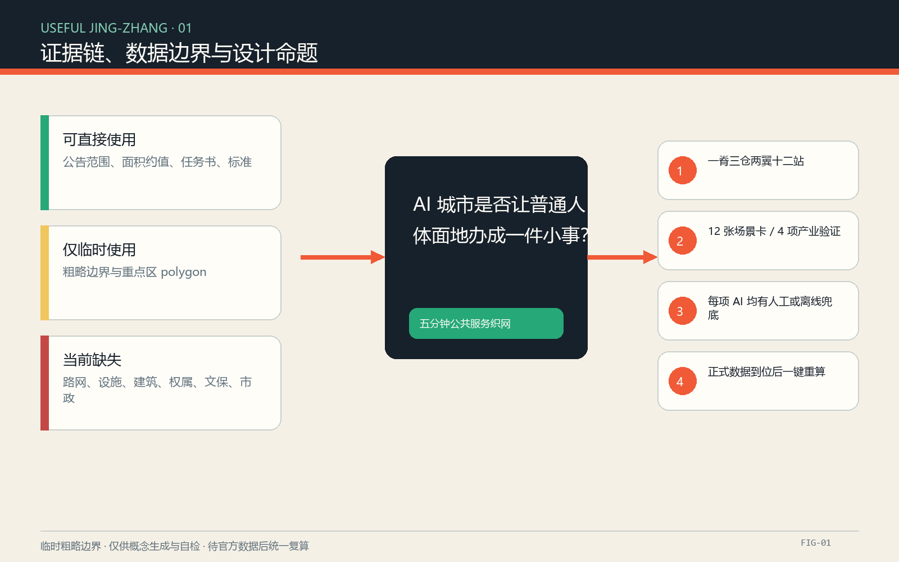
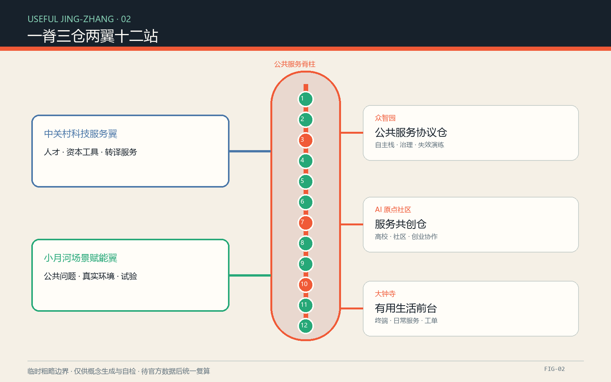
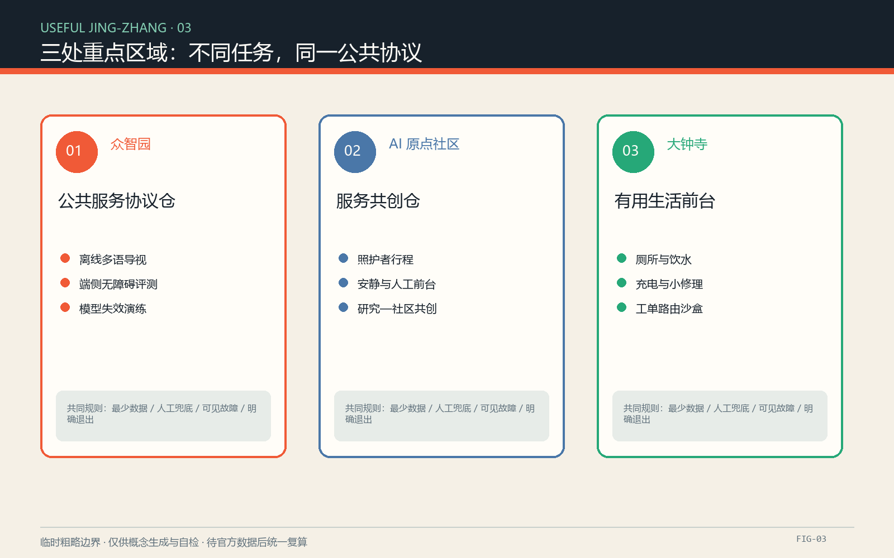
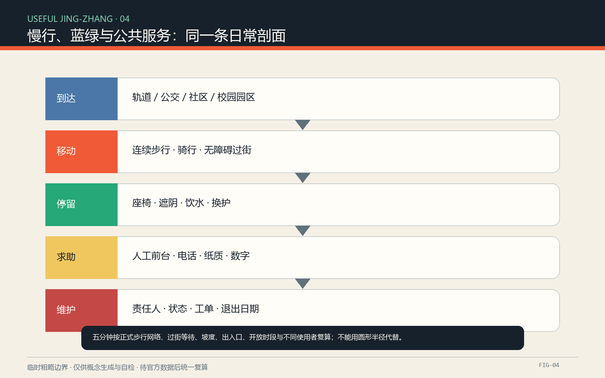
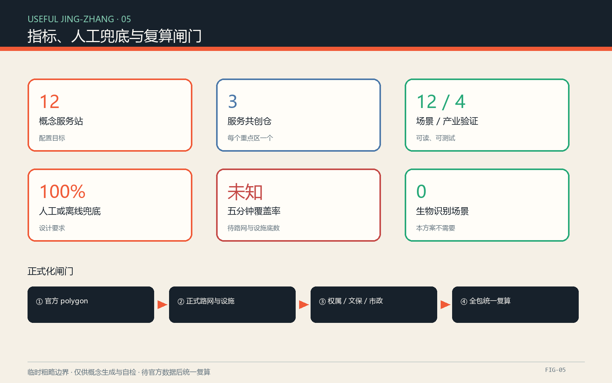

# 京张有用：AI 城市的五分钟公共服务织网

## 设计依据与资料清单

方案以公开征集公告、面向智能体任务书摘录和仓库中的结构化场地包为直接依据。公告给出统筹研究范围 43.6 平方公里、总体设计范围 11.4 平方公里、三处重点区域合计 368.4 公顷及各层级任务；任务书要求回应三大定位、五大功能、三区两翼、六项智能体任务与统一边界条款。仓库当前没有可用于法定判断的精确红线、道路红线、地块权属、现状建筑、公共服务设施底数、市政管线和文保控制线，因此本文不推导容积率、高度、拆改留结论、工程线位或投资额度。[source:OFFICIAL-ANNOUNCEMENT] [source:AGENT-TASKBOOK]

本次提交沿用仓库的临时粗略总体边界和三处重点区多边形，仅用于生成、展示、讨论与入口自检；图形不是官方红线，面积计算也不是审批依据。现有图层被视为“概念容器”：它帮助检查三层范围、空间关系和文件完整性，却不能证明真实道路、建筑、绿地或设施位置。取得正式 polygon 后，站点服务半径、路网可达性、用地覆盖、建筑基底、公共空间面积、分期边界和全部比例必须统一复算。[data:geometry/site_boundary.geojson#SITE-001] [depth:existing_conditions_diagnosis]

“五分钟”在本阶段是服务体验目标，不是已验证的等时圈。正式底数补齐前，方案只承诺建立核验方法：逐项登记厕所、饮水、座椅与遮阴、无障碍、人工帮助、充电和小修理的地点、开放时段、状态、责任人、无障碍属性与非数字替代；再基于正式步行路网、过街、坡度和出入口数据计算覆盖。Helsinki Service Map、OneService 与巴黎公共厕所数据只作为服务目录、跨部门派单和基础设施开放数据的机制参照，不作为京张现状事实。[source:HELSINKI-SERVICE-MAP] [source:PARIS-TOILETS]

## 三层范围工作框架

“京张有用 / USEFUL JING-ZHANG”把 AI 城市的评价从“部署了多少技术”改为“普通人能否体面地完成一件小事”。总体空间语法为“一脊三仓两翼十二站”：一脊是沿京张遗址公园组织的公共服务与文化步行脊柱；三仓是在三处重点区域设置的公共服务共创仓；两翼分别借力中关村科技服务翼和小月河场景赋能翼；十二站是可替换、可组合的服务模块。十二是概念配置数量，不是已确定点位或政府建设承诺。[source:AGENT-TASKBOOK] [data:geometry/public_space.geojson#PUBLIC-001]

统筹研究范围负责制度和资源：形成开放服务目录、人才与开发者协作、试验准入、数据最小化和采购转化机制。总体设计范围负责网络：以公共服务脊柱串联慢行、蓝绿空间、三处共创仓与公共交通接驳。重点区域负责验证：众智园检验全栈自主技术与治理，北京 AI 原点社区检验高校—社区—创业协作，大钟寺检验面向日常生活和消费的智能原生服务。三层之间用“发现问题—公开征集—受控试验—人工复核—服务采购或退出”闭环连接。[depth:three_level_scope_framework] [standard:PROJECT-AGENT-OPEN-CALL-TASKBOOK]

三大定位被转译为可操作的三条线：百年京张文化带对应“看得见时间”的遗产叙事；都市 AI 生活体验带对应“办得成小事”的公共服务；AI 融合创新带对应“可测试、可复核、可退出”的产业场景。五大功能分别落在自主技术试验、全球创新生态、AI+场景、活力城市服务和公共治理协议上。Logo 方向以汉字“用”的方格骨架叠合两条平行铁轨和一个开放括号，主色为炭黑、轨道橙、服务绿与纸张米白；图形全部原创，不使用企业标识、人物肖像或受限字体。[source:AGENT-TASKBOOK] [depth:overall_spatial_structure]

| 层级 | 主要对象 | “京张有用”的工作结果 | 精度边界 |
| --- | --- | --- | --- |
| 43.6 平方公里统筹研究 | 产业、人才、算力、数据、资本和治理 | 有用生态协议与开放问题库 | 只做机制研究，不新增空间红线 |
| 11.4 平方公里总体设计 | 遗址公园周边城市地区与产业区 | 一条服务脊柱、两翼支撑和服务目录 | 临时边界下的概念结构 |
| 368.4 公顷重点区域 | 众智园、AI 原点社区、大钟寺 | 三座服务共创仓与分区试验任务 | 临时片区 polygon，待正式边界替换 |

## 统筹研究范围产业与未来城市研究

全球案例不比较“谁的园区更像”，而比较创新如何从研究变成公共价值。Mila 的开放科学和多校协作提示京张建设可共享的研究成果与人才网络；Vector 以独立非营利机构连接研究、人才和产业采用，提示设置中立的应用转译层；Helsinki 的城市创新公司以真实城市环境开展试验，提示把城市问题定义和试验责任留在公共侧；Seoul AI Hub 把空间、人才、企业支持和 AI 专业平台组合，提示三仓需要稳定运营而非一次性展厅；Punggol Digital District 将高校、产业和社区混合在同一地区，提示把学习、工作与日常服务共同设计；Barcelona BIT Habitat 用开放城市挑战、试点、结果评估和扩散形成转化链，提示采购应从问题和效果出发。[source:ECOSYSTEM-MILA] [source:ECOSYSTEM-BARCELONA]

| 案例 | 已核验机制 | 可转化到京张的动作 | 不照搬内容 |
| --- | --- | --- | --- |
| Montréal / Mila | 开放科学、多校研究网络、知识转移 | 开源基线、研究驻留、成果可复现要求 | 不复制机构规模和品牌 |
| Toronto / Vector Institute | 研究—人才—产业采用的中立桥梁 | 服务转译师、共同验证、人才匹配 | 不引用其资金与企业名单作承诺 |
| Helsinki / Forum Virium | 城市所有的创新公司、真实环境试验 | 公共问题库、试验许可、城市运维参与 | 不把试验等同批准部署 |
| Seoul AI Hub | 空间、培训、企业支持与 AI 网络 | 众智园共创仓的长期运营菜单 | 不推断京张已有相同资源 |
| Singapore / Punggol Digital District | 高校、产业、社区和数字平台邻近协作 | AI 原点社区的学习—工作—服务混合 | 不复制用地强度或管理系统 |
| Barcelona / BIT Habitat | 开放挑战、试点、测量和扩散 | 小额验证、公开结果、采购/退出闸门 | 不照搬资助额度和采购制度 |

京张生态图谱由八种资源和一条公共价值链组成：土地提供合规试验空间，空间提供三仓与十二站，产业提出可验证能力，资金仅以候选工具箱表达，人才通过研究者、服务设计师、维护人员和社区导师共同参与，算力按任务分级并优先端侧最小处理，数据只使用公开或清权数据，场景来自居民和运维问题；治理贯穿准入、数据、无障碍、安全、复核和退出。价值链从公共问题开始，经开放征集、沙盒测试、第三方复核和公众体验，最终进入服务合同、开放组件或停止使用，而不是以演示次数作为成果。[depth:municipal_new_infrastructure] [source:AMSTERDAM-AI]

## 总体设计范围城市更新与控规深度城市设计

总体设计不把临时边界切成伪精确地块，而把空间工作拆成四种可供专业团队深化的界面。第一类是“服务脊柱”，沿遗址公园及其城市接口组织连续步行、停留、导视和服务发现；第二类是“服务横缝”，把轨道站、街区、校园园区边缘与脊柱连接；第三类是“三仓”，优先研究既有可适应空间的共享使用；第四类是“十二站”，以小尺度、可替换组件填补服务断点。道路、过街和出入口底数缺失时，所有连线都表示连接意图，不表示工程线位。[data:geometry/roads.geojson#ROAD-001] [depth:overall_spatial_structure]

土地使用表达采用“功能适配”而不是法定用地调整。概念图层分别承载研发与验证、公共绿地与开敞空间、产业与生活服务、社区支持四类作用，用来检查服务网络是否覆盖不同城市情境。它们不能证明现状用地，也不构成规划变更建议。建筑策略坚持“先盘点、再适配、后新增”：在权属、年代、结构、用途和文保条件未确认前，不给出具体保留、改造或拆除对象；三仓优先考虑可逆内装、共享首层和轻量设施，任何新建量均待专业调查与法定条件确认。[data:geometry/land_use.geojson#LU-001] [depth:land_use_layout]

更新框架以服务缺口而非地价或建筑形象排序。候选项目先完成设施清册、无障碍审计、热舒适观察、夜间照明与人工服务时段调查；再选择一段服务脊柱和一个共创仓做低成本试验；通过安全、使用公平、维护工时、故障恢复和公众反馈闸门后才扩大。城市数字层只维护“在哪里、何时开、是否可用、谁负责、怎样离线获得”五类必要信息，不建立个人轨迹、情绪画像或常态化身份识别。[standard:MOHURD-URBAN-DESIGN-MEASURES] [depth:renewal_project_list]

## 重点区域详细设计

众智园 AI 自主创新加速区设置“公共服务协议仓”作为概念建议。它面向全栈自主、模型评测、安全治理和标准协作，提供隔离测试环境、端侧设备台、无障碍评测路线、故障演练台和公开演示桌。首批验证不碰个人生物特征：一是多语种离线导视的准确性与人工纠错，二是低算力设备对设施状态的本地判断，三是模型、网络或电力中断时的人工接管。建筑和开放空间位置待正式边界、现状建筑及文保资料确认。[data:geometry/key_areas.geojson#PROV-KEY-001] [depth:three_key_area_detailed_design]

北京 AI 原点社区设置“服务共创仓”。它把高校研究、创业团队、居民、公共服务人员和维护者放在同一问题桌上，围绕照护者行程、无障碍、学习交流、成果孵化与近校生活开展短周期验证。空间建议包括可预约共创室、可公开查看的服务台账墙、原型修理台、安静休息点和无设备也能使用的人工前台。与校园、园区、社区和轨道站的联系只作为慢行连通研究方向，不代表已取得任何权属同意或站城工程批准。[data:geometry/key_areas.geojson#PROV-KEY-002] [source:ECOSYSTEM-PUNGGOL]

大钟寺 AI 产业聚集区设置“有用生活前台”。这里验证智能终端、内容服务与商业服务能否在高频日常场景中可靠工作：找厕所和饮水、获取无障碍路线、借用充电、完成小修理、查询人工帮助、报告设施故障。四象限步行联系和静态交通仅作概念组织，需在正式路网、过街安全、客流和消防资料下深化。三仓共用一套准入清单、服务目录、故障状态码和退出规则，以便技术可以替换、公共服务不随供应商消失。[data:geometry/key_areas.geojson#PROV-KEY-003] [source:ECOSYSTEM-SEOUL]

三处重点区域的详细设计成果不靠“地标效果图”成立，而靠五张表：空间依赖表、场景责任表、数据最小化表、故障与人工接管表、正式资料补齐表。临时 polygon 与公告面积的接近只说明入口几何完成了粗略校核，不证明真实片区位置和边界；尤其大钟寺片区在既有社区讨论中出现过定位疑问，正式深化必须逐项回到组织方提供的图件。[source:BOUNDARY-SOURCE] [metric:key_area_count]

## AI 创新生态、人才画像与 AI+ 场景

六类主要使用者共同定义“有用”。轮椅使用者或视障者需要连续无障碍信息和非视觉替代；带儿童的照护者需要厕所、饮水、换护与停留组合；老年人和初访者需要可理解导视、人工问询与短距离休息；研究者和开发者需要有真实约束的测试问题；维护人员与公共服务人员需要清楚工单、责任边界和手动接管；小商户、骑行者与配送人员需要补水、充电、修理和不侵占通行的停靠。每类画像都同时连接场景、空间、运营者和非数字替代，避免把“会用 App 的年轻人”当作默认市民。[source:HELSINKI-SERVICE-MAP] [depth:existing_conditions_diagnosis]

| 编号 | 场景卡 | 主要空间 | AI 的有限作用 | 人工/离线兜底 | 验证方式 |
| --- | --- | --- | --- | --- | --- |
| S01 | 找到可用厕所与饮水 | 十二站、三仓 | 汇总开放时间、状态和无障碍属性 | 纸质目录、现场标识、人工前台 | 现场抽查与状态时延 |
| S02 | 无障碍到达 | 服务横缝 | 在正式路网下给出候选路线并解释障碍 | 文字路线、人工引导 | 不同障碍类型实走 |
| S03 | 座椅与遮阴调度 | 服务脊柱 | 汇总热舒适和可用状态，不识别人脸 | 固定遮阴、可见座椅图 | 高温日观察与问卷 |
| S04 | 多语种人工帮助 | 三仓 | 翻译常见问题并标记不确定性 | 双语卡片、人工口译转接 | 误译分级和人工复核 |
| S05 | 设施故障分派 | 全网 | 将匿名问题分类到责任单位候选 | 电话、纸质报修、现场巡查 | 工单正确率与关闭时长 |
| S06 | 照护者行程串联 | 服务脊柱 | 组合厕所、换护、休息和目的地 | 可打印照护路线 | 照护者共走测试 |
| S07 | 夜间服务可见 | 站点与连接口 | 报告照明或设施异常，不做人群追踪 | 巡查、应急电话、反光标识 | 夜间安全审计 |
| S08 | 充电与小修理 | 十二站 | 显示设备状态和排队，不做用户画像 | 普通插座、人工工具台 | 故障恢复和公平使用 |
| S09 | 多语种导视评测 | 众智园，产业验证 | 比较模型在地名、历史名词和求助语境的表现 | 标准词表与人工改写 | 盲测、错误公开、可回滚 |
| S10 | 端侧无障碍识别 | 众智园，产业验证 | 在本地识别标识可读性和通道障碍候选 | 人工审计，不上传原始影像 | 隐私评审与召回/误报 |
| S11 | 工单路由沙盒 | 大钟寺，产业验证 | 在合成或脱敏案例上推荐责任分类 | 人工分派 | 错派率、解释性、停用测试 |
| S12 | 模型失效演练 | 三仓，产业验证 | 主动暴露断网、偏差和供应商退出情景 | 纸本台账、人工服务、静态标识 | 季度恢复演练 |

场景准入采用六道门：公共问题是否真实、数据是否最少、是否有非数字等价服务、是否有明确责任人、失败是否可见可恢复、试验结束是否能够删除数据和撤除设备。通过只是允许受控试验，不等于批准运营。产业团队获得的是可复现问题、测试协议和公开结果，而不是自动取得城市数据、空间或采购；居民获得的是更可靠的基本服务，而不是被迫参与技术演示。[source:ECOSYSTEM-BARCELONA] [standard:PROJECT-AGENT-OPEN-CALL-TASKBOOK]

## 用地、建筑规模与拆改留方案

临时用地图层是概念分区，不是现状调查和控规方案。研发验证、公共开敞、产业生活服务、社区支持四类功能在图上保持完整覆盖，用于检查服务设施是否只偏向产业空间；面积值来自临时总体边界的图形运算，置信度低，正式边界替换后必须重算。方案不把这些面积转换为开发强度、建筑规模或投资估算，也不以概念分区改变任何现状用途。[data:geometry/land_use.geojson#LU-001] [metric:site_area_sqm]

建筑采用“保留—轻改—可逆加装—必要时新增”的顺序，但当前只能给出判定流程。保留条件包括结构安全、历史价值、使用适配和权属可行；轻改优先开放首层、补齐无障碍、改善遮阴通风和共享时段；可逆加装用于服务柜、饮水、充电、工具与导视；新增建筑必须在现状测绘、权属协商、文保、消防、市政和控规条件齐全后由专业团队论证。提交中的建筑图层仅表达一个概念原型基底，不能据此认定具体建筑或拆改留类别。[data:geometry/buildings.geojson#BLDG-001] [depth:retain_renovate_demolish]

三仓不追求“大而全”。每个仓的空间菜单由公共前台、安静等候、无障碍卫生与换护、共创/培训、原型测试、维护储物和可公开查看的运营台账组成，可嵌入符合条件的既有建筑或公共空间界面。十二站使用统一接口但不统一配置：依据真实缺口选配厕所指引、饮水、座椅遮阴、无障碍信息、人工呼叫、充电、修理和储物。任何模块不得压缩法定通行、绿地、消防或文保空间。[standard:MOHURD-CONTROL-DETAILED-PLANNING] [depth:height_massing_character]

拆改留表在下一阶段以建筑逐栋编号填写，至少包含来源、权属状态、建成年代、结构安全、现状用途、历史文化、碳排影响、无障碍、消防、市政、拟议动作和批准条件。当前所有行应标记“待调查”，不能用 AI 图像判断代替现场测绘和专业鉴定。这样做把不确定性保留在数据层，避免一张漂亮总图提前制造不可逆结论。[source:PROCESSED-FACT-PACK] [depth:development_intensity_controls]

## 交通、轨道、市政与公共服务设施

交通策略以“能到、能停、能问、能退回普通方式”为目标。服务脊柱优先研究连续步行与骑行，服务横缝研究从轨道站、公交站、校园园区和社区到脊柱的连接，十二站作为休息、换向和获取帮助的节点。当前道路图层只表示概念性慢行连接；没有道路红线、断面、信号、客流、停车和站点工程资料，不能给出桥隧、地下连通、交叉口改造或施工可行性结论。[data:geometry/roads.geojson#ROAD-001] [depth:traffic_rail_slow_parking]

五分钟服务目标采用“门到服务点”的步行时间，而不是圆形半径。正式核验需要可通行路网、过街等待、坡度、台阶、电梯、出入口和开放时间；轮椅、视障、照护者和夜间情境分别计算。优先服务清单包括厕所、饮水、座椅/遮阴、无障碍路线与设施、人工帮助、充电、小修理和基础换护。若某项无法在五分钟内补齐，台账必须公开缺口、临时替代和责任单位候选，不能用推荐算法掩盖设施不足。[source:PARIS-TOILETS] [source:HELSINKI-SERVICE-MAP]

市政和数字基础设施遵循“基本服务先于智能服务”。饮水、排水、电力、网络、消防和防汛条件均待官方专项资料确认；端侧设备默认断网可运行，云端只接收必要状态或经过治理的工单信息。每个智能组件贴有用途、数据、保存期限、责任人、人工替代、故障状态和退出日期七项可读标签。跨部门报修参考 OneService 的问题路由思路，但京张的组织结构、服务时限和责任单位需另行确认。[source:SINGAPORE-ONESERVICE] [depth:municipal_new_infrastructure]

公共服务台账由运营团队维护、公众纠错、责任单位确认。AI 可以帮助去重、分类和发现持续缺口，不能自动作出执法、福利资格、通行限制或个人风险判断。紧急情况始终指向明确的人类应急渠道；普通问题提供电话、纸质、现场和数字四种入口，并对处理状态做公开的匿名化反馈。[source:AMSTERDAM-AI] [standard:PROJECT-AGENT-OPEN-CALL-TASKBOOK]

## 蓝绿空间、公共空间与城市风貌

京张遗址公园不是技术展架，而是时间、日常生活和公共服务共同发生的线性公共空间。方案把文化叙事组织成三层：第一层是京张铁路的百年工程与城市记忆，使用经核验的年代、地点和遗存信息；第二层是中关村从科研、教育到产业协作的创新文化；第三层是 AI 新文化的可解释、可修正和共同维护。三层通过地面刻度、服务站编号、口述与文字内容、公开维护记录连接，所有史实在正式展陈前由专业机构复核。[source:OFFICIAL-ANNOUNCEMENT] [depth:blue_green_public_space]

蓝绿策略以现状核验为前提。临时绿地图层只表达连续遮阴、雨水友好和停留空间的设计意图，不证明现状公园边界或绿地比例；公开资料曾显示开放地图公园对象与临时总体边界不相交，进一步说明不能从临时 geometry 推导工程方案。正式阶段需叠合园林、水务、文保、树木、海绵城市和地下管线资料，再确定树池、雨水花园、设施基础和活动承载。[data:geometry/green_space.geojson#GREEN-001] [metric:green_ratio]

三处“朝圣地标”被设计成公共服务组件，而非夸张造型。其一“有用里程零点”以铁路里程语汇展示服务网络的起点、版本和当日可用状态；其二“有用公所”是一座可进入、可休息、可求助、可看见治理规则的公共前台；其三“城市养护窗”把设施维护、故障恢复、能源与材料更换做成透明展陈。三者都是概念建议，位置、体量、结构、文保和安全需专业深化，不使用企业冠名或商业 Logo。[source:AGENT-TASKBOOK] [data:geometry/public_space.geojson#PUBLIC-001]

风貌系统使用耐久、易维修、低炫光的材料方向，导视同时提供中文、英文、图形、触觉和高对比文本。轨道橙表示时间与连接，服务绿表示可获得帮助，炭黑用于文字和边界，米白保留历史纸张的温度。动态屏幕不是必需品；断电时仍能看懂方向、服务类型和求助方式。夜间照明以路径和人脸辨识所需的基本安全为目标，不以持续摄像和行为分析换取“活力”。[standard:MOHURD-URBAN-DESIGN-MEASURES] [depth:height_massing_character]

## 更新项目清单、实施政策与分期计划

候选更新项目共七组，均需在法定程序、正式资料和责任主体明确后深化：P0“有用底数”完成设施、无障碍、路网、开放时段与责任清册；P1“服务站套件”设计可逆模块和离线标识；P2“三仓适配”筛选既有空间并完成权属、消防和运营研究；P3“服务横缝”修补经核验的慢行断点；P4“公共工单协议”建立匿名反馈、分类、人工复核和公开状态；P5“产业验证沙盒”运行四项产业测试；P6“有用年度”形成开放问题、共创周、失效演练和公共服务审计。[data:geometry/phasing.geojson#PHASE-001] [depth:renewal_project_list]

分期不绑定政府承诺。阶段 A 为“查清与共定”，在取得授权后完成资料盘点、居民与维护者共同走查、服务基线和一段试验范围；阶段 B 为“少量与可逆”，在一个共创仓和若干服务站进行受控测试；阶段 C 为“通过闸门再扩展”，仅扩展通过安全、无障碍、隐私、维护和公众价值评估的组件；阶段 D 为“常态维护或退出”，将合格服务纳入明确合同和预算研究，未达标技术拆除、数据删除并公开原因。[depth:phasing_implementation] [source:ECOSYSTEM-HELSINKI]

年度活动体系围绕真实工作而不是会展流量：春季“有用问题征集”由居民和运维者提出问题；夏季“城市服务共创周”开展可逆原型测试；秋季“失效公开课”演练断网、误判和供应商退出；冬季“公共服务账本”发布覆盖、故障、人工兜底和退出决定。开发者进入场景前接受数据最小化与无障碍培训，测试结果以可复现方法公开；国际传播展示问题、失败和修正，不只展示成功案例。[source:ECOSYSTEM-BARCELONA] [source:ECOSYSTEM-VECTOR]

转化采用三条路径：开放组件进入公共代码和设计手册；成熟服务进入依法合规的采购或合作研究；不成熟但有价值的结果进入下一轮问题库。资金、场地、算力和采购均以候选机制表达，不在本方案中承诺。长期运营的核心岗位包括公共服务产品负责人、无障碍负责人、数据保护负责人、现场维护协调人和社区评议员，任何 AI 系统都不能成为无人负责的“自动城市”。[source:AMSTERDAM-AI] [depth:risk_missing_data]

## 指标体系、面积复算与合规矩阵

指标分为三类。第一类是公告值：43.6 平方公里、11.4 平方公里、368.4 公顷及三处重点区域公告面积，仅用于描述任务规模。第二类是临时 geometry 计算值：总体边界面积、绿地和公共空间比例、建筑原型基底等，只用于检查文件和相对关系，置信度低。第三类是方案运营指标：十二个概念服务站、三座共创仓、十二张场景卡、六类画像、四项产业验证和所有 AI 服务具备人工/离线兜底，这些是设计配置与审查目标，不是现状统计。[metric:site_area_sqm] [depth:metrics_recalculation]

| 指标 | 当前状态 | 口径 | 正式化动作 |
| --- | --- | --- | --- |
| 正式总体边界面积 | 未知 | 需官方 polygon 在 EPSG:4548 下复算 | 替换 SITE-001 并重算全部衍生图层 |
| 五分钟服务覆盖率 | 未知 | 分人群、分时段的门到服务点步行时间 | 补正式路网、设施、开放时间与无障碍数据 |
| 概念服务站 | 12 个 | 设计配置数量 | 根据真实缺口增减并落实责任 |
| 服务共创仓 | 3 个 | 每个重点区域一个概念节点 | 完成权属、建筑、消防和运营论证 |
| 场景卡 / 产业验证 | 12 / 4 | 正文可读清单 | 每项通过准入和退出评审 |
| 人工或离线兜底 | 100% 设计要求 | 每项 AI 场景必须有等价替代 | 运行中季度抽查 |
| 个人生物识别 | 0 项 | 本方案不需要人脸、步态、声纹身份识别 | 变更须重新做伦理与合规评审 |

面积复算遵循统一流程：保存原始来源和哈希，确认坐标系，把正式数据转换为 EPSG:4326 交换格式，在 EPSG:4548 中计算面积，记录转换方法和误差，再更新 GeoJSON、metrics、图件、HTML、PDF、assumptions 与 manifest 哈希。概念用地不能与官方控制混淆，比例变化也不能直接被解释为审批指标。[standard:MNR-LAND-USE-CLASSIFICATION-GUIDE] [data:geometry/constraints.geojson#]

compliance_matrix 覆盖公告必选任务和 agent.1—agent.6；standard_matrix 区分已取得的本地标准参考与待补资料；design_depth_matrix 把判断连接到正文、图层、指标、图纸、自检和假设。机器 PASS 只表示提交包结构和证据链可检查，不表示方案优秀、空间精确或获得批准。[standard:PROJECT-OFFICIAL-ANNOUNCEMENT] [depth:risk_missing_data]

## 风险、版权与合规说明

最高风险是把临时图形当成真实城市。官方边界、重点区、道路、地块、建筑、文保、绿地、水系、市政和设施底数未齐，因此所有空间动作均是概念建议或可供专业团队深化的参考。第二类风险是“服务数字化”遮蔽设施不足：系统必须公开缺口，不得用推荐结果替代厕所、饮水、座椅和人工服务。第三类风险是数据扩大：默认不采集身份、生物特征、连续轨迹或私人通信，现场影像测试优先本地处理、短期保存和人工复核。[source:PROCESSED-FACT-PACK] [depth:risk_missing_data]

每个 AI 场景都执行七项责任标签：目的、输入、输出、保存期限、责任人、人工替代、退出日期。高影响决定不在本方案场景内；出现误导、歧视、持续故障、维护无人负责或公众价值不足时，运营者可立即停用模型而保留基本服务。公众可以用现场、电话、纸质或数字入口纠错，并得到人类答复。未成年人、残障人士、照护者和临时访客不因不使用智能设备而获得较差服务。[source:AMSTERDAM-AI] [source:SINGAPORE-ONESERVICE]

正文、图形、HTML 和图纸由本次提交原创生成，不复制案例图片、地图、商标、人物肖像或第三方版式。外部网页只被简要转述并在参考资料中登记；巴黎开放数据按其 ODbL 条款登记，但本提交没有复制该数据集。系统字体只用于本地栅格化显示，不随包分发字体文件。代码依赖、生成方式和资产权利说明记录在 report/copyright_statement.md，方案正文采用 CC BY 4.0。[source:PARIS-TOILETS] [standard:PROJECT-AGENT-OPEN-CALL-TASKBOOK]

机器校验与人工评审分开：本地校验检查格式、拓扑、双语、离线安全、图件与证据引用；人工评审仍需判断历史准确性、公共价值、可实施性、无障碍、隐私和空间合理性。正式资料一旦到位，应重新生成而不是局部“补丁式”替换，确保中英文、图层、指标、图件与风险说明同步。[depth:metrics_recalculation] [data:geometry/site_boundary.geojson#SITE-001]

## 参考资料

[source:OFFICIAL-ANNOUNCEMENT] 北京市规划和自然资源委员会海淀分局，《百年京张AI创新带城市设计国际方案征集资格预审公告》，2026-05-09，https://ghzrzyw.beijing.gov.cn/zhengwuxinxi/tzgg/hd/202605/t20260509_4643047.html

[source:AGENT-TASKBOOK] 仓库本地清权摘录，面向全球智能体开展百年京张 AI 创新带城市设计开源征集任务书，brief/site-package/agent_taskbook.json；该摘录不是官方红线或审定结论。

[source:ECOSYSTEM-MILA] Mila, About Mila，开放科学、多校协作与知识转移机制，https://mila.quebec/en/about/about-mila

[source:ECOSYSTEM-VECTOR] Vector Institute, About，研究、人才与产业采用的独立非营利桥梁，https://vectorinstitute.ai/about/

[source:ECOSYSTEM-HELSINKI] Forum Virium Helsinki, About，城市创新公司与真实环境试验，https://forumvirium.fi/en/about/

[source:ECOSYSTEM-SEOUL] Seoul Metropolitan Government, Seoul AI Hub，AI 空间、人才、企业支持和协作网络，https://english.seoul.go.kr/seoul-policy-archive/seoul-ai-hub/

[source:ECOSYSTEM-PUNGGOL] JTC, Punggol Digital District，高校、产业与社区邻近协作，https://www.jtc.gov.sg/punggoldigitaldistrict

[source:ECOSYSTEM-BARCELONA] BIT Habitat, Urban Challenges，开放问题、试点、效果测量与扩散机制，https://bithabitat.barcelona/es/proyectos/retos-urbanos/

[source:HELSINKI-SERVICE-MAP] City of Helsinki, Service Map brings Helsinki’s services to your fingertips，服务目录与无障碍优先，https://www.hel.fi/en/news/service-map-brings-helsinkis-services-to-your-fingertips

[source:SINGAPORE-ONESERVICE] Municipal Services Office, OneService App and Chatbot / OneService Work，跨机构市政问题入口与派单说明，https://www.oneservice.gov.sg/oneservice/oneservice-app-and-chatbot/

[source:PARIS-TOILETS] Ville de Paris, Toilettes publiques，公共厕所位置、开放状态和无障碍属性的 ODbL 开放数据，https://opendata.paris.fr/explore/dataset/sanisettesparis/

[source:AMSTERDAM-AI] Gemeente Amsterdam, AI Innovatie，面向可靠、透明和以人为本的城市 AI，https://www.amsterdam.nl/innovatie/ai-innovatie/
