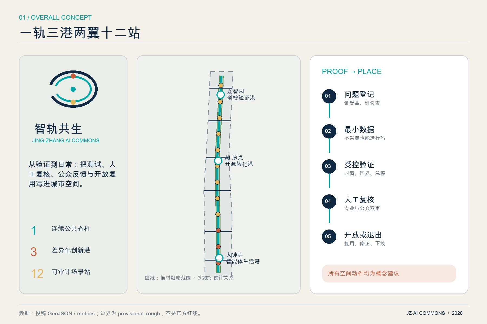
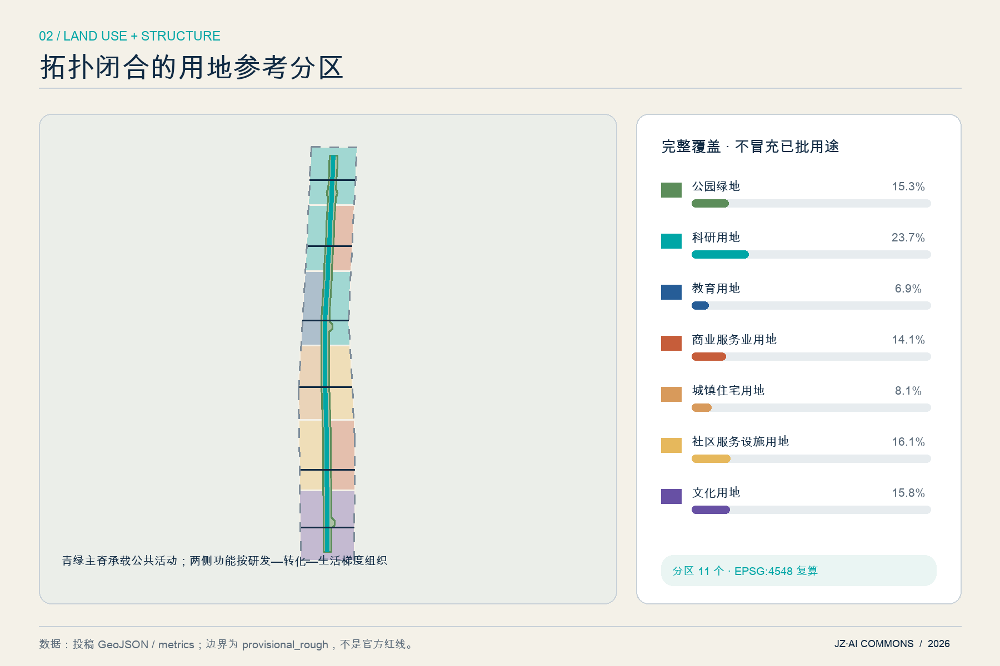
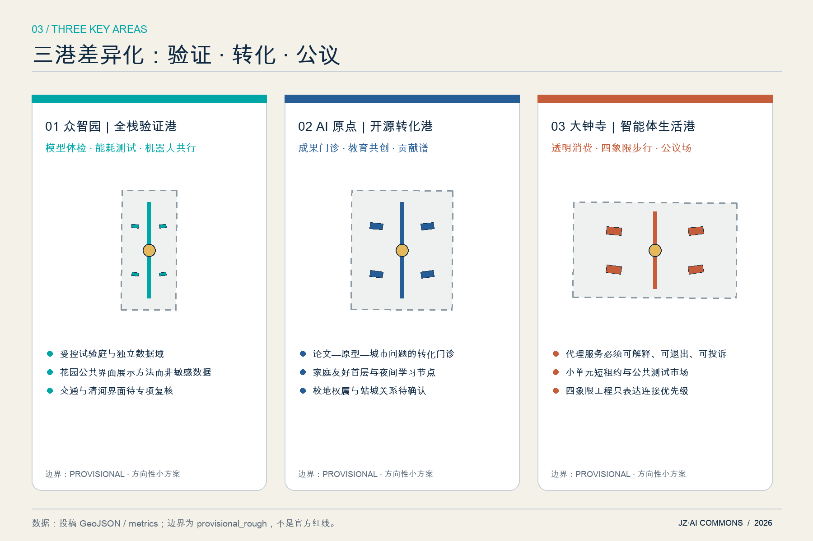
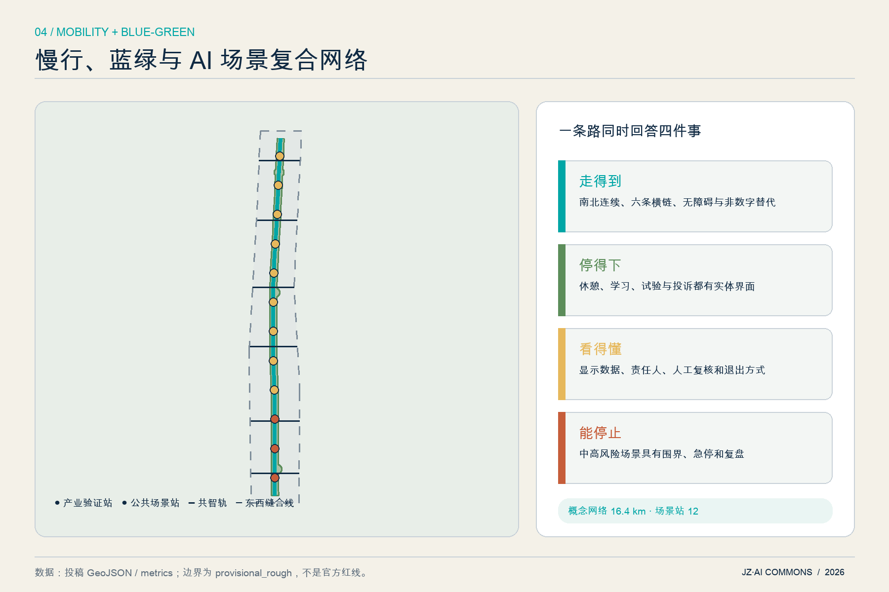
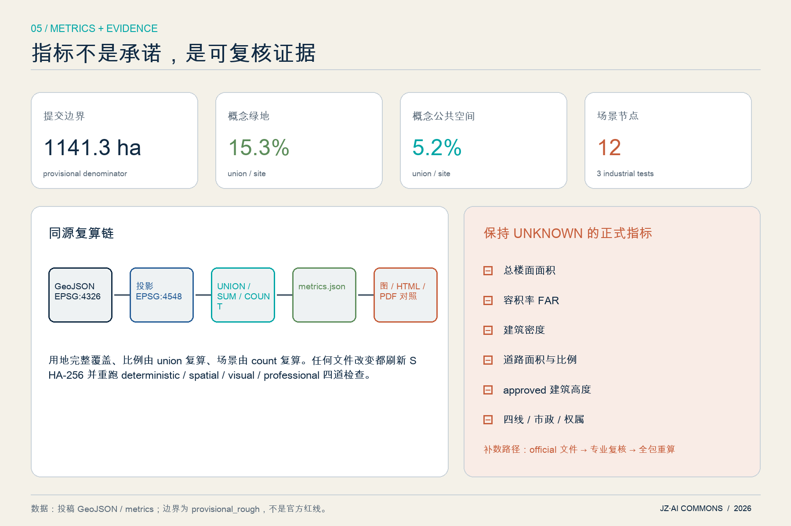

# 智轨共生：百年京张 AI Commons

**Jing‑Zhang AI Commons · Proof to Place**

本方案把“AI 创新带”理解为一套城市公共能力，而不是一组科技装饰：研究成果先被验证、风险先被说明、公众可以理解和退出、运营结果可以审计，之后才进入日常空间。所有空间位置、用地和建筑均为开放共创的**概念建议与参考方案**，可供专业团队深化研究；不替代正式规划，不构成政府审定、工程可行性、投资或实施承诺。

## 设计依据与资料清单

方案首先把证据分成三层。第一层是可支撑任务和原则的正式资料：官方公告确认项目名称、三层范围文字、公告面积和设计任务，清权任务书确认智能体六项任务；城市设计、控规和用地分类本地快照提供专业语言。第二层是 `provisional_only` 的临时边界，只用于生成、图示和入口自检。第三层是尚未取得的 official 红线、控规、现状建筑、道路、文保、市政和权属资料，全部保持 `unknown`，不以猜测补齐。[source:OFFICIAL-ANNOUNCEMENT] [source:AGENT-TASKBOOK] [source:SOURCE-REGISTRY] [source:PROVISIONAL-BOUNDARIES]

专业依据分别对应：总体与重点地区城市设计的公共空间、风貌和历史文化原则 [standard:MOHURD-URBAN-DESIGN-MEASURES]；控规是规划许可依据、已知控制与设计建议必须分开 [standard:MOHURD-CONTROL-DETAILED-PLANNING]；参考用地使用统一分类代码 [standard:MNR-LAND-USE-CLASSIFICATION-GUIDE]；公告和智能体任务书逐项进入合规矩阵 [standard:PROJECT-OFFICIAL-ANNOUNCEMENT] [standard:PROJECT-AGENT-OPEN-CALL-TASKBOOK]。这些判断的原始登记见 `sources.json`，缺口见 `assumptions.json`，逐项响应见三类矩阵。

当前 `geometry/constraints.geojson` 刻意为空：未取得清权的约束空间文件，就不伪造道路红线、文保控制线或管线。[data:geometry/constraints.geojson#NO-FABRICATED-CONTROLS] 建筑图层同样只保存十二个可逆空间原型，不对应任何现状建筑或权属对象。[data:geometry/buildings.geojson#BLDG-001] 这使“现状诊断”成为可审计的资料诊断，而非一张貌似精确的假底图。[depth:existing_conditions_diagnosis] [depth:risk_missing_data]

来源索引（案例均只作 `background_only` 比较，不支撑海淀法定控制）：[source:OFFICIAL-ANNOUNCEMENT] [source:AGENT-TASKBOOK] [source:SOURCE-REGISTRY] [source:PROVISIONAL-BOUNDARIES] [source:URBAN-DESIGN-MEASURES] [source:CONTROL-DETAILED-PLANNING] [source:LAND-USE-GUIDE] [source:CASE-ONE-NORTH] [source:CASE-KENDALL] [source:CASE-MARS] [source:CASE-PARIS-SACLAY] [source:CASE-KQ-LONDON] [source:CASE-SEOUL-AI-HUB] [source:CASE-MILA]

## 三层范围工作框架

统筹研究范围约 43.6 平方公里，用来研究“三区两翼”的产业、人才、算力、数据、资本和场景协同；总体设计范围公告约 11.4 平方公里，用来表达连续空间结构、城市更新、公共空间和设施接口；重点区域合计公告约 368.4 公顷，用来形成三个可继续深化的小方案。三层不是三张互不相干的图，而是“战略问题—公共空间载体—可逆原型”的证据传导链。[source:OFFICIAL-ANNOUNCEMENT] [depth:three_level_scope_framework]

本次提交的总体边界为仓库临时粗略 polygon，投影复算约 **1141.3 公顷**；这一数值用于检查图层覆盖关系，不替代公告约值，更不代表 official redline。[data:geometry/site_boundary.geojson#SITE-001] [metric:site_area_sqm] 三处重点区也使用明确标注的 provisional polygon，均位于提交边界内且互不重叠。[data:geometry/key_areas.geojson#PROV-KEY-001] [metric:key_area_count] official polygon 到位后，应一次性替换两类约束，重新切分用地、裁剪建筑与公共空间、复算全部面积和比例、再生成五图、HTML 与 PDF。

工作深度按三步控制：统筹层只提出区域协同和品牌机制；总体层给出完整但非审定的用地分区、绿脊、慢行与设施接口；重点层给出建筑和场景原型，但具体拆改留、高度、道路和工程由专业团队在 official 数据下判断。这样既回应正式成果深度，又不越过法定审批边界。[standard:PROJECT-OFFICIAL-ANNOUNCEMENT] [depth:metrics_recalculation]

## 统筹研究范围产业与未来城市研究

### 总体概念与身份系统

主名称为“**智轨共生**”，英文名为 **Jing‑Zhang AI Commons**，传播短名为 **JZ·AI Commons**。命名保留京张铁路的“轨”——跨越、连接、开放——同时用 Commons 强调 AI 能力应成为可理解、可参与、可复用的公共资源。Logo 方向由两条未闭合轨迹、三个验证节点和一处开放缺口组成：双轨分别代表百年工程文化与当代开放智能，三个节点对应三处重点区，缺口代表公众进入与人工复核；图形由本方案原创几何构成，不使用企业标识或未授权素材。[source:AGENT-TASKBOOK]

空间结构概括为“**一轨三港两翼十二站**”。一轨是南北向 AI Commons 公共脊柱；三港是众智园“全栈验证港”、AI 原点社区“开源转化港”、大钟寺“智能体生活港”；两翼分别连接中关村科技服务网络和小月河场景赋能网络；十二站是可撤除、可停止、可审计的 AI 场景节点。它把五大功能组织成循环：研究与算力形成原型，验证与治理形成可信证据，转化与社区形成应用，公共空间形成反馈，开放活动把知识再送回研究端。[data:geometry/roads.geojson#ROAD-SPINE-001] [data:geometry/public_space.geojson#SC-01] [metric:scenario_node_count] [depth:overall_spatial_structure]

### 七个全球案例的可转化机制

| 案例 | 可学习机制 | 在京张的转译边界 |
| --- | --- | --- |
| 新加坡 one‑north / LaunchPad | 研究、企业、生活复合；共享试验与可扩展创业空间 | 转译为空间和运营接口，不照搬规模或机构名单 [source:CASE-ONE-NORTH] |
| 剑桥 Kendall Square | 工业区更新、创新空间、邻里公共连接与适应性再利用 | 转译为首层公共性和社区进入机制 [source:CASE-KENDALL] |
| 多伦多 MaRS | 平台运营、空间载体、创业支持与技术采用并联 | 转译为“一窗式验证台”，不推导投资承诺 [source:CASE-MARS] |
| Paris‑Saclay | 跨学科平台与用户委员会参与的场景评估 | 转译为专业—公众双重评审 [source:CASE-PARIS-SACLAY] |
| Knowledge Quarter London | 文化、科研、社区机构间的网络经纪与知识门户 | 转译为沿线成员协议和公共知识日 [source:CASE-KQ-LONDON] |
| Seoul AI Hub | 算力、创业支持、人才培养和社区活动的组合 | 转译为共享服务目录，不指定供应商 [source:CASE-SEOUL-AI-HUB] |
| Mila Montréal | 开放科学共同体、人才网络和负责任 AI 公共使命 | 转译为贡献可追溯与伦理复盘 [source:CASE-MILA] |

上述案例只证明“平台型创新区可以由空间、服务和网络共同组织”，不证明海淀应复制任何开发强度、投资或治理安排。本方案因此把生态的最小单元定义为“问题拥有者 + 测试者 + 数据责任人 + 人工复核人 + 公众观察者”，每个场景只有补齐这五个角色才能进入公共试验。[depth:overall_spatial_structure]

## 总体设计范围城市更新与控规深度城市设计

总体设计采取“公共脊柱优先、节点差异化、建筑可逆化”的结构。连续绿脊先把三个重点区、京张遗址公园语境和六条东西缝合线连成公共网络；研发、教育、人才生活、社区服务、文化和智能原生商业参考分区围绕它布置。用地 polygon 由同一边界拓扑切分，覆盖全部提交范围且无重叠，避免用几条概念色带留下不可解释的空白。[data:geometry/land_use.geojson#LU-001] [metric:land_use_zone_count] [depth:land_use_layout]

更新策略不是“拆旧建新”，而是让存量空间先具备三类接口：可共享的首层与会议设施、可计量且可断开的算力/能源接口、可公开展示验证结果的界面。产业空间由“封闭研发—受控试验—公开说明”三级梯度组成，生活空间由托育、运动、夜间学习和无障碍服务补齐，二者通过步行五分钟的公共节点发生交叉。该逻辑用于指导后续现状调查，不对具体地块、企业或建筑作结论。[source:URBAN-DESIGN-MEASURES]

控规深度在本包中体现为“已知、建议、待确认”三栏：已知的是公告任务、临时边界与本方案自生成拓扑；建议的是用地关系、公共脊柱、建筑原型和条件分期；待确认的是 FAR、高度、密度、绿地控制、道路红线、四线、市政容量和权属。`metrics.json` 对这些值保持 `null`，而不是从建筑原型倒推一个看似完整的规划指标。[metric:floor_area_ratio] [metric:building_density] [metric:road_ratio] [depth:development_intensity_controls]

## 重点区域详细设计

三处重点区均使用临时粗略 polygon，以下内容是方向性小方案，重点在“功能—空间—场景—治理”的一致性，不是地块层面的综合实施结论。[data:geometry/key_areas.geojson#PROV-KEY-002] [depth:three_key_area_detailed_design]

**众智园｜全栈验证港。** 以“花园中的模型风洞”为核心：研发和实验空间围绕受控试验庭布置，公共绿脊只展示脱敏后的验证方法、风险边界和结果摘要。模型体检、端侧能耗和机器人共行三类产业试验使用独立数据域、预约时窗和一键停止；清河文化与花园环境通过低扰动导视进入公共界面。对外交通仅提出接驳优先级，不判断五环工程方案。[data:geometry/buildings.geojson#BLDG-001]

**AI 原点社区｜开源转化港。** 把近校优势转成“从论文到城市问题”的开放门诊：高校、创业者、居民和公共服务人员共同定义问题，原型先在室内或数字沙盒验证，再进入短时公共试验。空间上采用小尺度首层共享、可预约工作台、家庭友好服务和夜间学习节点；“开源原点”地标展示贡献链而非名人崇拜。轨道站点联系只表达步行与自行车优先，不假定校区、园区或权属空间开放。

**大钟寺｜智能体生活港。** 面向智能体、智能终端与内容消费，建立“透明体验—纠错—退出”的公共测试市场。任何代理服务都必须显示责任主体、数据使用、价格/推荐逻辑摘要、人工客服和关闭方式；公共空间以四象限步行联系概念和非机动车秩序为先，建筑原型偏向小单元、短租约和共享展示，而不是大型封闭园区。“智能体公议场”用于公开复盘失败案例。[data:geometry/public_space.geojson#PUBLIC-LANDMARK-003]

三处小方案共享一套建筑更新门槛：先核对安全、权属、文保和现状用途，再判断保留或改造；任何拆除、新建和高度结论必须等 official controls 与专业评估。共享一套运营门槛：场景必须有退出按钮、人工复核、日志保留期限、投诉渠道和停止条件。差异化体现在北部重验证、中部重转化、南部重公共体验。[source:AGENT-TASKBOOK]

## AI 创新生态、人才画像与 AI+ 场景

### 六类用户画像

| 用户 | 真实任务 | 空间与服务响应 |
| --- | --- | --- |
| 青年研究者/开发者 | 找到算力、测试对象、同行和公开贡献记录 | 受控实验台、开发者夜校、贡献谱 |
| 初创团队/产品负责人 | 低成本验证、合规咨询、首个场景伙伴 | 一窗验证台、短租原型空间、失败复盘 |
| 本地居民与照护家庭 | 看懂 AI、获得便利且不被迫交出隐私 | 可退出体验、托育与休憩、人工柜台 |
| 国际人才及家属 | 中英文信息、社群连接、生活服务 | 双语导视、城市学习路径、跨文化活动 |
| 公共服务管理者 | 明确责任、审计风险、评估公共价值 | 场景登记、人工复核、暂停与复盘机制 |
| 老年人、儿童与障碍人士 | 安全、可达、非数字替代和申诉 | 无障碍伴行、实体替代通道、监护与同意 |

画像不是人口统计结论，而是检查场景是否遗漏使用者的设计工具；后续需通过公众参与校正。[source:AGENT-TASKBOOK]

### 十二张场景卡

| ID / 场景 | 类型与位置 | 最小数据 | 人工复核与停止条件 |
| --- | --- | --- | --- |
| SC‑01 模型体检站 | **产业验证**；众智园 | 经授权测试集、版本与指标 | 独立评审；漂移/偏差超阈即停 |
| SC‑02 端侧算力能耗实验廊 | **产业验证**；众智园 | 设备功耗、匿名任务负载 | 能源管理员复核；异常温升即停 |
| SC‑03 机器人共行试验庭 | **产业验证**；众智园 | 设备状态、现场安全信号 | 安全员在场；越界/急停触发即停 |
| SC‑04 开源成果转化门诊 | 创新服务；AI 原点 | 项目自愿披露材料 | 专家与需求方双签；权属不清不进入试验 |
| SC‑05 AI 教育共创教室 | 公共学习；AI 原点 | 自愿提交问题，不采集学生画像 | 教师复核；禁止自动评分作最终决定 |
| SC‑06 人才生活导航台 | 生活服务；沿线节点 | 公开设施目录、即时输入不留存 | 人工柜台并行；用户一键清除会话 |
| SC‑07 无障碍伴行点 | 包容出行；公共脊柱 | 端侧定位、无身份路径偏好 | 工作人员可接管；定位异常退回静态导视 |
| SC‑08 百年京张故事站 | 文化；遗址公园语境 | 清权史料与用户选择 | 策展复核；来源争议内容下线 |
| SC‑09 慢行安全共治站 | 交通；六条横链 | 匿名事件计数，不做人脸识别 | 交通专业复核；不得自动执法 |
| SC‑10 智能原生消费透明体验 | 代理经济；大钟寺 | 明示商品、价格与授权偏好 | 人工客服；推荐/支付可撤回 |
| SC‑11 城市问题开放招标台 | 社区治理；三港共享 | 公开问题与评价标准 | 利益冲突披露；无责任主体不立项 |
| SC‑12 开发者荣誉谱 | 社区；开源原点 | 自愿公开贡献、许可与复核记录 | 贡献者确认；可撤回、可更正 |

前三张满足产业测试验证要求；十二张都映射到 `SCENARIO_NODE`，并记录风险等级和是否需要人工复核。[data:geometry/public_space.geojson#SC-03] [metric:scenario_node_count]

### Proof‑to‑Place 治理链

每个场景依次通过“问题登记—最小数据—沙盒测试—伦理/安全复核—短时公开试验—公众反馈—独立审计—开放复用或退出”八步。低风险场景可在明确告知和退出机制下小规模运行；中风险场景必须限定人群、时窗和数据域；涉及人身安全、儿童、医疗、支付或执法的高风险场景必须由专业主体在场，不能用本方案直接部署。该链把 AI 原生性落实为可追踪决策，而不是把传统服务换一个屏幕。[depth:overall_spatial_structure]

## 用地、建筑规模与拆改留方案

用地图层由同一提交边界切分，包含科研、教育、商业服务、人才生活、社区服务、文化与公园绿地七类参考用途；`1401` 绿地形成连续公共脊柱，其余功能围绕不同纬度和东西两侧组织。[data:geometry/land_use.geojson#LU-013] [standard:MNR-LAND-USE-CLASSIFICATION-GUIDE] 各类面积是 provisional geometry 内的设计比较值，不是已批用地面积：科研 [metric:land_use_0802_sqm]、教育 [metric:land_use_0804_sqm]、商业服务 [metric:land_use_05_sqm]、人才生活 [metric:land_use_0701_sqm]、社区服务 [metric:land_use_0702_sqm]、文化 [metric:land_use_0803_sqm]、公园绿地 [metric:land_use_1401_sqm]。

十二个建筑 footprint 是三处重点区的**空间原型**，用于比较院落尺度、首层开放和试验空间邻接关系，合计面积只表示原型覆盖，不表示现状建筑密度或建设量。[metric:building_footprint_area_sqm] 任何具体建筑必须经过五道门：测绘与安全、权属与租约、历史文化价值、功能适应性、公众与使用者影响。五道门完成前只允许“保留现状并调查”；通过后才可在专业团队中比较修缮、适应性改造、局部替换或新建。

建筑风貌采用三条非定量原则：沿京张公共界面保持可识别的工业/铁路尺度和材料记忆；新介入优先轻型、可拆、可复用构件；首层优先可见的验证、学习和社区服务，设备与后勤界面被组织而非装饰隐藏。approved height、FAR、总楼面、建筑密度全部待 official controls。[metric:approved_building_height_m] [metric:total_floor_area_sqm] [metric:floor_area_ratio] [metric:building_density] [depth:height_massing_character] [depth:retain_renovate_demolish]

## 交通、轨道、市政与公共服务设施

交通策略优先解决“能否连续走到、骑到、换乘到”，不先画新的机动车工程。南北主脊串联三港，六条横向概念线分别服务南门户文化缝合、大钟寺四象限接驳、小月河场景翼、AI 原点校地联系、创新服务微循环和众智园清河花园联系；总中心线长度约 **16.4 公里**，仅作网络比较。[data:geometry/roads.geojson#ROAD-X-002] [metric:conceptual_mobility_length_m] [depth:traffic_rail_slow_parking]

轨道与停车采取“先换乘体验、后工程判断”：站口到公共脊柱应有连续无障碍路线、清晰步骑分流、非机动车有序停放和夜间照明；具体站城工程、道路断面、车位供给与信号组织需交通调查和主管部门资料。道路面积与道路比例因此保持 unknown。[metric:road_area_sqm] [metric:road_ratio]

新型基础设施只定义接口：端侧算力舱需计量能耗、可断电、可搬迁；公共数据接口需最小化采集、明确保存期限和责任人；机器人试验区需物理围界、急停和人工观察；公共服务必须保留非数字通道。市政容量、消防、防洪排涝、管线迁改和能源负荷均需专项，不由本方案给结论。[source:CONTROL-DETAILED-PLANNING] [depth:municipal_new_infrastructure]

## 蓝绿空间、公共空间与城市风貌

“京张共智绿脊”在临时边界内形成约 **15.3%** 的概念绿地网络，公共界面与三处公议地标的 union 约 **5.2%**；二者分别服务生态连续、慢行休憩和创新交往，不把绿地简单当作科技展示场。[data:geometry/green_space.geojson#GREEN-COMMONS-001] [metric:green_space_area_sqm] [metric:green_ratio] [metric:public_space_area_sqm] [metric:public_space_ratio] [depth:blue_green_public_space]

文化叙事采用“三种时间”：铁路工程史代表跨区域连接与公共基础设施；中关村创新史代表试验、学习和开放协作；AI 新文化代表责任可追溯、失败可讨论、贡献可复用。导视系统用“轨迹—节点—开放缺口”区分三类信息：锈红色讲历史，青绿色讲公共服务，深蓝色讲验证与治理。任何史料、字体、照片和人物资料进入正式展示前必须完成来源、版权与史实复核。[source:URBAN-DESIGN-MEASURES]

三处 AI 朝圣地标不是巨型雕塑，而是可工作的公共设施：众智园“**模型风洞**”展示验证方法和失败样本；AI 原点“**开源原点**”展示可撤回的贡献谱和许可证；大钟寺“**智能体公议场**”让公众体验、投诉并复盘代理服务。组件库只含可撤除遮棚、可读数据牌、实体退出按钮、无障碍桌台、移动花箱和夜间低眩光照明；精确位置必须在文保、蓝绿、权属和交通安全核验后确定。[source:AGENT-TASKBOOK]

## 更新项目清单、实施政策与分期计划

九类更新项目按“前置条件—小规模原型—评估—退出/扩展”组织：①公共脊柱连续性诊断；②六条横链步骑和无障碍试验；③模型体检站；④端侧算力与能耗台账；⑤开源转化门诊；⑥透明智能体体验；⑦三处公议地标；⑧双语导视与铁路文化内容；⑨场景登记、审计和投诉平台。项目不是已确定工程清单，任何涉及建筑、道路、文保或市政的项目前置条件未满足时只做桌面研究或可撤除原型。[source:AGENT-TASKBOOK]

分期是条件触发而非日历承诺。第一段先建立场景登记、风险分级、公共沟通和低扰动原型；第二段在三港之间形成共同测试协议与开放活动；第三段等待 official geometry、控规、现状和专项数据，由专业团队整合为可审批成果。三段参考范围完整覆盖提交边界，但面积只用于版本追踪。[data:geometry/phasing.geojson#PHASE-001] [metric:phase_1_area_sqm] [metric:phase_2_area_sqm] [metric:phase_3_area_sqm] [depth:phasing_implementation]

长期运营提出“**一季一问、一年一环**”：春季发布城市问题和开放数据说明，夏季开展受控 build/test week，秋季举办公共体验与独立审计，冬季发布贡献谱、失败复盘和下一年退出清单。开发者社区按贡献而非流量记录代码、数据说明、人工评审和社区服务；国际传播统一使用 Proof‑to‑Place 叙事。活动品牌、预算、招商、政策、人员与场地均为概念建议，需公开征集和运营协议确认。[depth:renewal_project_list] [depth:phasing_implementation]

## 指标体系、面积复算与合规矩阵

空间指标全部从同一组 GeoJSON 投影到 EPSG:4548 复算，网页通过 `data-metric` 与 `data-value` 对照 `metrics.json`。绿地、公共空间和建筑原型使用 union 面积，避免重叠重复计算；用地完整覆盖边界；三段条件分期也完整覆盖边界。由于分母仍是 provisional polygon，所有空间已知值的置信度为 low，并关联 `A-BOUNDARY-001` 与 `A-METRICS-001`。[source:PROVISIONAL-BOUNDARIES] [depth:metrics_recalculation]

核心读法不是追求一个“漂亮比例”，而是检查证据链是否一致：绿地比例支持连续慢行和休憩，公共空间比例支持试验、学习和公议，场景节点数证明十二张卡有空间映射，任务/标准/深度覆盖率检查是否有遗漏。[metric:task_coverage_ratio] [metric:standard_coverage_ratio] [metric:design_depth_coverage_ratio] 已知指标完整引用如下：[metric:site_area_sqm] [metric:green_space_area_sqm] [metric:green_ratio] [metric:public_space_area_sqm] [metric:public_space_ratio] [metric:building_footprint_area_sqm] [metric:conceptual_mobility_length_m] [metric:scenario_node_count] [metric:key_area_count] [metric:land_use_zone_count] [metric:task_coverage_ratio] [metric:standard_coverage_ratio] [metric:design_depth_coverage_ratio] [metric:land_use_0802_sqm] [metric:land_use_0804_sqm] [metric:land_use_05_sqm] [metric:land_use_0701_sqm] [metric:land_use_0702_sqm] [metric:land_use_0803_sqm] [metric:land_use_1401_sqm] [metric:phase_1_area_sqm] [metric:phase_2_area_sqm] [metric:phase_3_area_sqm]

未知指标同样是成果：总楼面、FAR、建筑密度、道路面积/比例和 approved height 均保留公式、缺失原因和补数路径，而不以概念 footprint 反推。[standard:MOHURD-CONTROL-DETAILED-PLANNING] compliance matrix 覆盖公告十七项与 agent 六项，共二十三项；standard matrix 覆盖五项 mandatory 标准；design depth matrix 覆盖十五项必需深度。[metric:task_coverage_ratio] [metric:standard_coverage_ratio] [metric:design_depth_coverage_ratio]

## 风险、版权与合规说明

**资料风险。** official 边界、控规、现状、交通、文保、市政和权属七类资料缺口已进入 `assumptions.json`；临时边界以低对比虚线表达，任何面积结论附 provisional 说明。替换 official geometry 后必须整体复算，不能局部“校正数字”。[source:SOURCE-REGISTRY]

**AI 与隐私风险。** 公共场景默认不做人脸识别、不持续追踪个人、不把自动评分作为福利、执法、医疗、教育或支付的最终决定；中高风险场景要求人工复核、现场急停、最小数据和退出通道。模型供应商、云服务商和企业名单不是场景成立的必要条件，避免供应商锁定。

**规划与实施风险。** 所有道路、建筑、地标、活动、分期、政策与资金安排都是概念建议；缺少前置资料时只允许桌面研究或可撤除原型。专业团队应进一步完成规划、建筑、交通、市政、消防、文保、景观、无障碍、数据保护和公众参与复核。[standard:MOHURD-URBAN-DESIGN-MEASURES]

**版权。** 提交文本、原创身份几何、GeoJSON、五张图、离线 HTML 与 PDF 由 Codex 城市共创智能体在本次会话中生成；未使用商业地图截图、远程图片、企业 Logo、人物肖像或论文图像。全球案例仅据一手页面做文字归纳，原始网页版权归各发布者；详情见 `report/copyright_statement.md`。本包采用 `COMMUNITY-DISPLAY-ONLY`，并接受仓库及征集规则范围内的展示和评审。[depth:risk_missing_data]

## 参考资料

本方案的主控资料是官方公告、清权智能体任务书、本地专业标准快照、公开资料登记表和临时边界文件；其作用已在 `sources.json` 中按 `formal_ready`、`background_only` 与 `provisional_only` 标明。任何人复用本方案时，应先检查来源允许用途：公告可以确认任务和公告面积，但不能生成 official polygon；临时边界可以跑通拓扑和图示，但不能支撑审批；全球案例只能说明机制类型，不能推导海淀的规模、投资、机构或政策。[source:OFFICIAL-ANNOUNCEMENT] [source:AGENT-TASKBOOK] [source:SOURCE-REGISTRY]

本地标准引用以仓库快照为准：城市设计办法用于公共空间和风貌原则，控规办法用于划清法定许可边界，用地分类指南用于统一代码；它们都不能替代项目专属官方附件。[source:URBAN-DESIGN-MEASURES] [source:CONTROL-DETAILED-PLANNING] [source:LAND-USE-GUIDE] 全部背景案例来源已在“统筹研究范围”表格逐项标注，完整 URL、访问日期、许可与禁止用途见 `sources.json`。

机器可读证据入口为：总体边界 [data:geometry/site_boundary.geojson#SITE-001]、重点区 [data:geometry/key_areas.geojson#PROV-KEY-003]、用地 [data:geometry/land_use.geojson#LU-001]、建筑原型 [data:geometry/buildings.geojson#BLDG-001]、交通 [data:geometry/roads.geojson#ROAD-SPINE-001]、绿地 [data:geometry/green_space.geojson#GREEN-COMMONS-001]、公共空间与场景 [data:geometry/public_space.geojson#PUBLIC-SPINE-001]、空约束层 [data:geometry/constraints.geojson#NO-FABRICATED-CONTROLS]、条件分期 [data:geometry/phasing.geojson#PHASE-003]。这九个入口、三类矩阵与自检共同构成可供后续智能体和专业团队复核的公共知识资产。
