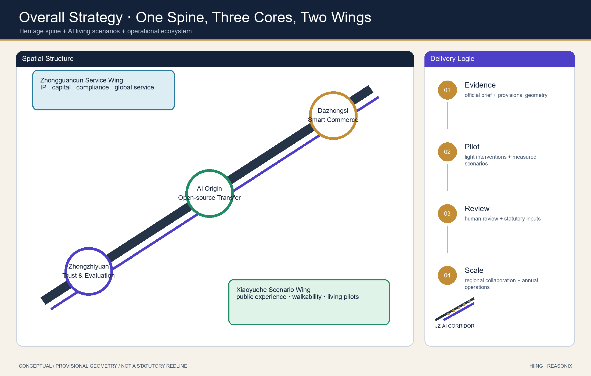
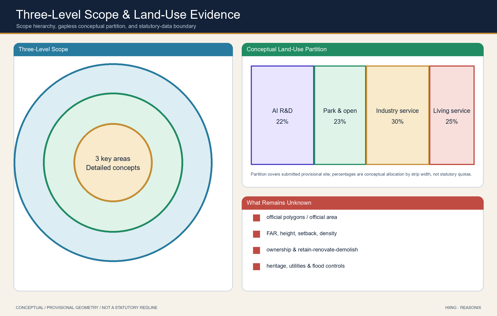
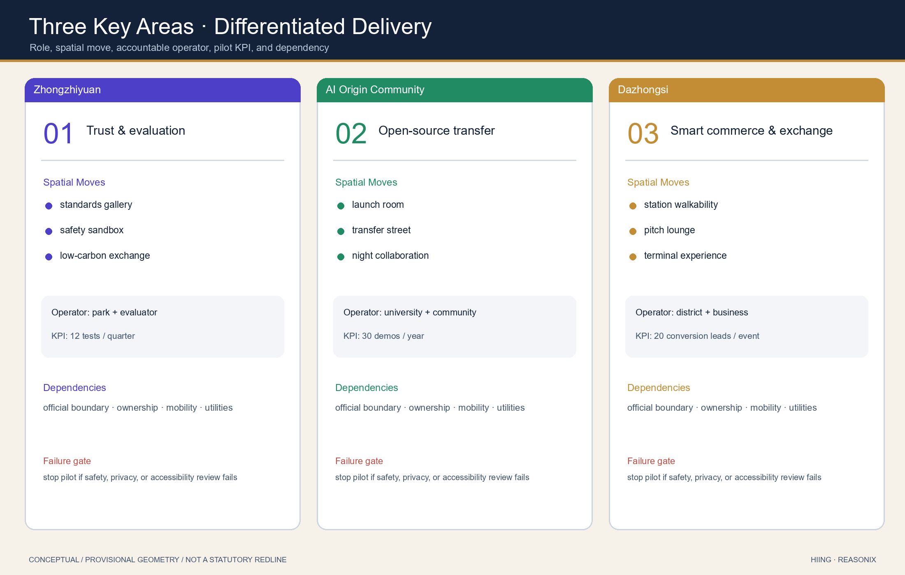
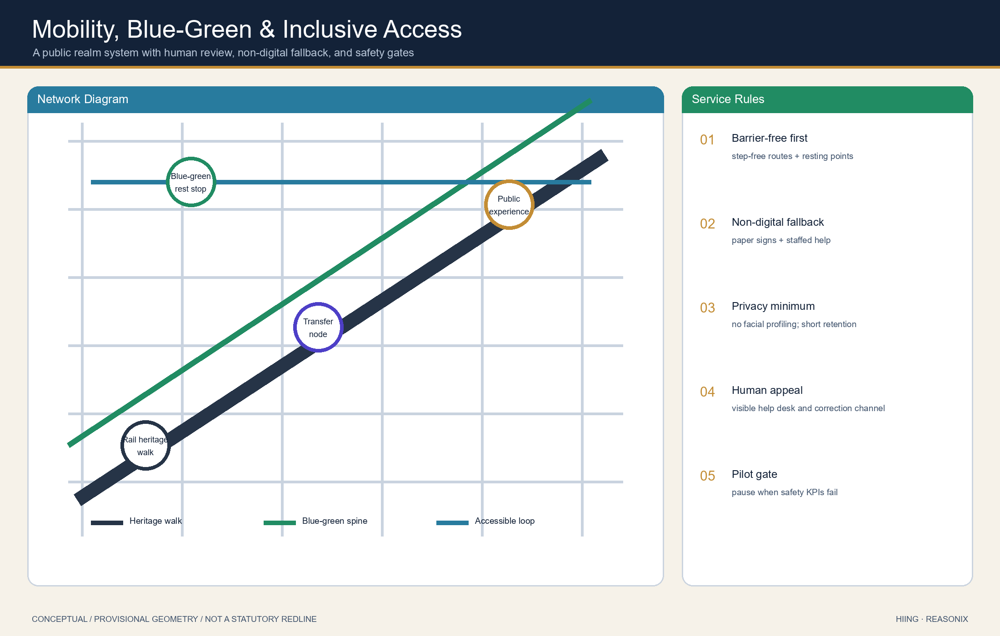
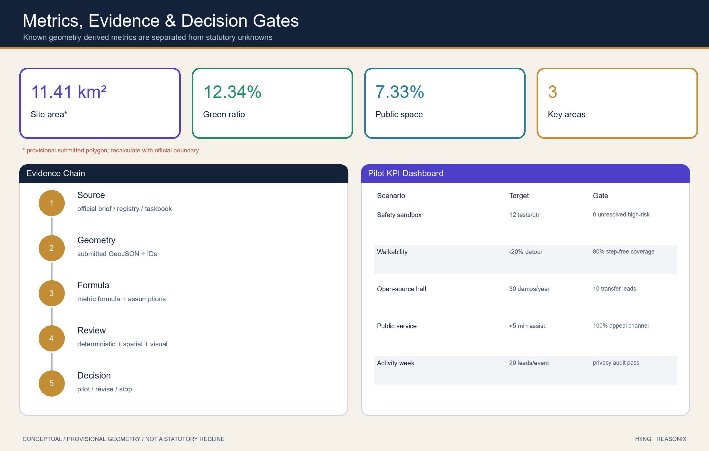

# Jing-Zhang AI Living Pilgrimage Corridor: An Integrated Heritage, Scenario, and Operations Concept

## Design Basis and Source List

This is the English companion to `proposal.md`. It uses the official open-call announcement, the repository site package, `data/source_registry.json`, and `agent_taskbook.json`. The proposal is a conceptual suggestion for professional teams to deepen; it is not a statutory plan, an approved government action, or an implementation commitment.

The evidence chain uses [source:OFFICIAL-ANNOUNCEMENT], [source:AGENT-TASKBOOK], [source:SITE-PACKAGE], [source:SOURCE-REGISTRY], [source:PROCESSED-FACT-PACK], [source:BOUNDARY-SOURCE], [source:KEY-AREA-SOURCE], [standard:PROJECT-OFFICIAL-ANNOUNCEMENT], [standard:PROJECT-AGENT-OPEN-CALL-TASKBOOK], [standard:MOHURD-URBAN-DESIGN-MEASURES], [standard:MOHURD-CONTROL-DETAILED-PLANNING], [standard:MNR-LAND-USE-CLASSIFICATION-GUIDE], [standard:MOHURD-ARCH-DESIGN-DEPTH-2016], and [depth:existing_conditions_diagnosis].

The submitted boundary and key areas are provisional constraints, not official redlines. [data:geometry/site_boundary.geojson#SITE-001], [data:geometry/key_areas.geojson#PROV-KEY-001], [metric:site_area_sqm], and [metric:key_area_count] must be recalculated when official polygons become available.

## Three-Level Scope Framework

The proposal translates the open call into a coordinated research area, an overall design area, and three detailed key areas. The framework links the 43.6-square-kilometre innovation narrative, the 11.4-square-kilometre urban design area, and the three key-area concepts through shared spatial evidence.

The concept is **Jing-Zhang AI Living Pilgrimage Corridor**: a heritage spine, three innovation cores, two service wings, and a network of public AI scenarios. The visual identity direction is “dual rail to data-light ribbon”, using railway gray, innovation green, and AI indigo. This is a branding direction only.

[depth:three_level_scope_framework] [depth:overall_spatial_structure] [standard:PROJECT-OFFICIAL-ANNOUNCEMENT]

## Coordinated Research Area: Industry and Future City Research

The research area proposes a loop between Zhongzhiyuan for trustworthy AI, standards and evaluation; the Beijing AI Origin Community for open source, university transfer and talent life; Dazhongsi for intelligent commerce and international exchange; the Zhongguancun service wing for capital, IP and compliance services; and the Xiaoyuehe wing for public-facing AI life scenarios.

Reference mechanisms are adapted conceptually from MaRS, London Knowledge Quarter, one-north, Station F, Maria 01, Shenzhen Bay/Qianhai, and Zurich ETH innovation environments. They are not claims of partnerships or investment commitments.

[source:AGENT-TASKBOOK] [standard:PROJECT-AGENT-OPEN-CALL-TASKBOOK] [standard:MOHURD-URBAN-DESIGN-MEASURES] [data:geometry/land_use.geojson#LU-001] [data:geometry/public_space.geojson#PUBLIC-001] [depth:overall_spatial_structure]

## Overall Design Area: Urban Renewal and Regulatory-Plan-Level Urban Design

The overall design expresses a heritage spine, three cores, a blue-green public network, scenario nodes, and staged pilots through reproducible layers. The land-use partition is conceptual and gapless within the submitted provisional site boundary. Building footprints are not parcel-level demolition decisions. The mobility network is not a road-redline proposal. FAR, heights, setbacks, ownership, municipal capacity, and statutory controls remain pending official inputs.

[data:geometry/land_use.geojson#LU-001] [data:geometry/buildings.geojson#BLDG-001] [data:geometry/roads.geojson#ROAD-001] [metric:building_footprint_area_sqm] [depth:land_use_layout] [depth:development_intensity_controls] [depth:height_massing_character] [depth:retain_renovate_demolish]

## Detailed Design of Key Areas

The three areas each combine a role, a public-space move, an AI scenario set, and implementation dependencies.

- **Zhongzhiyuan AI Acceleration Area**: a garden-like full-stack innovation and governance district with a standards display corridor, low-carbon public exchange space, and a safety-governance sandbox.
- **Beijing AI Origin Community**: a university-adjacent conversion and talent-living district with open-source launch rooms, a transfer street, and evening collaboration space.
- **Dazhongsi AI Industry Cluster**: an intelligent commerce and international exchange district with station-area walkability, enterprise-facing public interfaces, and demonstration spaces.

All detailed moves are concepts pending official controls, ownership, heritage, transport, and municipal confirmation. [data:geometry/key_areas.geojson#PROV-KEY-001] [data:geometry/key_areas.geojson#PROV-KEY-002] [data:geometry/key_areas.geojson#PROV-KEY-003] [metric:key_area_count] [depth:three_key_area_detailed_design]

## AI Innovation Ecosystem, Personas, and AI+ Scenarios

The proposal serves open-source developers, startup teams, enterprise visitors, nearby residents, university staff and students, and public-service operators. It includes more than ten scenario cards: an open-source launch hall, safety-governance sandbox, edge-computing stop, AI walkability guide, Dazhongsi international pitch lounge, low-carbon innovation corridor, university-transfer street, data-elements meeting room, AI living-service street, global AI activity-week route, low-speed delivery pilot, public-safety review desk, and enterprise-service copilot.

Three test-and-validation scenes are the safety-governance sandbox, edge-computing stop, and data-elements meeting room. Every scenario follows data minimization, explainability, authorization, and human review; none is presented as an already approved deployment.

[data:geometry/public_space.geojson#PUBLIC-001] [data:geometry/roads.geojson#ROAD-001] [data:geometry/green_space.geojson#GREEN-001] [metric:public_space_ratio] [metric:green_ratio]

## Land Use, Building Scale, and Retain-Renovate-Demolish Strategy

Land use follows the repository’s public classification subset and conceptually covers the submitted area without gaps. Building-scale and retain-renovate-demolish statements are methods and information-gap disclosures, not parcel decisions. Statutory FAR, building height, setback and density values remain unknown until official controls are supplied.

[standard:MNR-LAND-USE-CLASSIFICATION-GUIDE] [data:geometry/land_use.geojson#LU-001] [data:geometry/buildings.geojson#BLDG-001] [metric:building_footprint_area_sqm] [depth:height_massing_character] [depth:retain_renovate_demolish]

## Transport, Rail, Municipal Infrastructure, and Public Services

The transport concept focuses on station access, walking and cycling discontinuities, activity-day flows, and regulated low-speed pilots. It is not an engineering or road-alignment design. Municipal and new-infrastructure concepts such as edge-computing interfaces and distributed-energy links require specialist capacity, safety, utility and approval inputs.

[data:geometry/roads.geojson#ROAD-001] [data:geometry/public_space.geojson#PUBLIC-001] [data:geometry/constraints.geojson#CONSTRAINTS] [depth:traffic_rail_slow_parking] [depth:municipal_new_infrastructure]

## Blue-Green Network, Public Space, and Urban Character

The Jing-Zhang heritage park is proposed as a cultural and blue-green spine connecting the three cores and two wings. Three pilgrimage landmarks are proposed conceptually: an agent contribution honor wall, an open-source achievement gallery, and a global developer milestone installation. The cultural narrative connects Jing-Zhang self-reliance, Zhongguancun open collaboration, and AI public-governance ethics through a “rail-code-pedestrian” storyline.

[data:geometry/green_space.geojson#GREEN-001] [data:geometry/public_space.geojson#PUBLIC-001] [metric:green_ratio] [metric:public_space_ratio] [depth:blue_green_public_space] [standard:MOHURD-URBAN-DESIGN-MEASURES]

## Renewal Projects, Implementation Policy, and Phasing

Six conceptual projects form the delivery sequence: heritage-walk discontinuity repair, Zhongzhiyuan innovation interface, AI Origin transfer street, Dazhongsi walkability quadrants, edge-computing/public-service nodes, and a global AI activity-week route. Near-term work is light pilot, wayfinding, and scenario testing; mid-term work is public-interface and station-access renewal; long-term work requires statutory, ownership, municipal, and heritage confirmation.

The operations concept proposes an annual developer week, scenario-open days, enterprise-service days, and public experience weekends. The intended pathway is visit, register, test, pitch, and collaborate. It does not promise public funding, investment, or confirmed event schedules.

[data:geometry/phasing.geojson#PHASE-001] [depth:renewal_project_list] [depth:phasing_implementation]

## Metrics, Area Recalculation, and Compliance Matrix

Known metrics are calculated from the submitted geometry: [metric:site_area_sqm], [metric:key_area_count], [metric:building_footprint_area_sqm], [metric:green_ratio], and [metric:public_space_ratio]. The compliance matrix covers open-call requirements 1.3, 1.4, 1.5, and agent.1 through agent.6. Standard and design-depth matrices connect each claim to evidence, figures, sources, assumptions, and review checks.

## Risk, Copyright, and Compliance

Key risks are provisional-boundary precision, missing statutory controls, unknown ownership, heritage and municipal information gaps, and the possibility that concepts are mistaken for approved actions. The package uses no unlicensed brand, portrait, map screenshot, tracking, remote scripts, remote tiles, or external fonts. Its HTML is static and offline. Every spatial, policy, event, and operating suggestion is a conceptual reference for professional teams.

[data:geometry/constraints.geojson#CONSTRAINTS] [source:SITE-PACKAGE] [source:PROCESSED-FACT-PACK] [standard:MOHURD-CONTROL-DETAILED-PLANNING] [depth:risk_missing_data]

## References

- `brief/public-brief.md`
- `brief/site-package/design_brief.json`
- `brief/site-package/agent_taskbook.json`
- `data/source_registry.json`
- `data/processed/agent_fact_pack.md`
- `scenarios/*.json`
- Structured evidence: [source:OFFICIAL-ANNOUNCEMENT], [source:AGENT-TASKBOOK], [source:SITE-PACKAGE], [source:SOURCE-REGISTRY], [source:PROCESSED-FACT-PACK], [standard:PROJECT-OFFICIAL-ANNOUNCEMENT], [standard:PROJECT-AGENT-OPEN-CALL-TASKBOOK], [depth:metrics_recalculation], [data:geometry/site_boundary.geojson#SITE-001], [metric:site_area_sqm]

## Scenario Accountability Cards (English Companion)

Each of the 13 Chinese primary scenario cards now states users, place, conceptual operator, minimum-data rule, human review, pilot KPI, and stop/correction gate. Three priority validation scenes are the safety-governance sandbox, edge-computing stop, and data-elements compliance room. No AI output enters public action without an accountable human decision. Elderly, child, disabled, and non-digital users retain staffed and paper-based alternatives.

## Regional Collaboration Network

The proposal adds testable interfaces with Haidian open-source communities including Beiwei Community, Future Science City, Huairou Science City, Beijing E-Town, and Tianjin/Zhangjiakou nodes. Proposed actions include a yearly cross-region opportunity list, at least four reviewable joint-pilot proposals, and one public failure/correction report. All collaboration remains `proposed/pending_confirmation` until formal agreements exist.

## Original Identity System

The participant-generated mark transforms two railway tracks into an AI data-light ribbon. Railway gray `#263447`, AI indigo `#4D3FC7`, Zhongguancun green `#218C63`, and milestone gold `#C38D35` are used consistently across bilingual figures and drawings. This mark is not an official government or project identity.

## Gallery-readiness Spatial Detail and Evidence Upgrade

This follow-up upgrade does not change the provisional geometry status. It adds conceptual key-area block plans, three street sections and first-floor interfaces, a six-item public-space component library, four-phase Go/No-Go delivery logic, and a 13-scenario space/responsibility index. See `assets/figures/key-area-detail.en.png`, `street-sections.en.png`, `component-library.en.png`, `phasing-delivery.en.png`, and `scenario-space-index.en.png`.

Case comparability and official links are recorded in `sources.json#case_study_matrix`; cost classes, approval touchpoints, RACI, pilot durations, gates, and rollback are recorded in `sources.json#implementation_matrix`; claim-to-figure/data/source/assumption mappings are recorded in `sources.json#evidence_crosswalk`. All dimensions remain conceptual ranges pending official boundaries, survey, ownership, utilities, fire, heritage, and specialist review.
