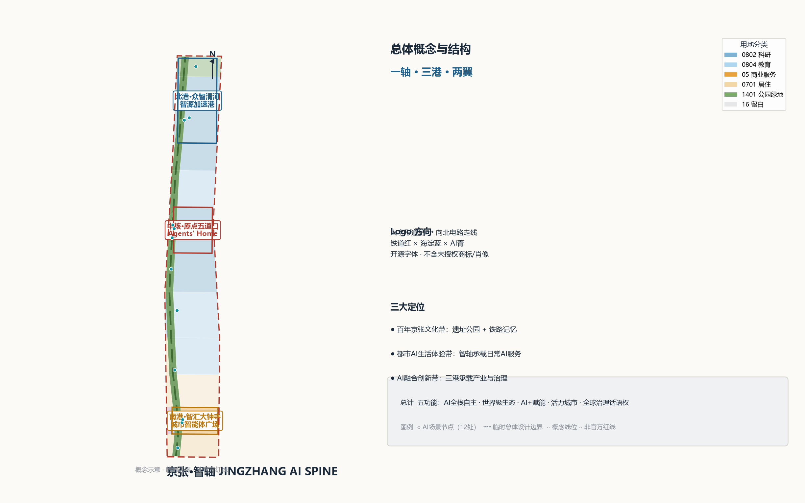
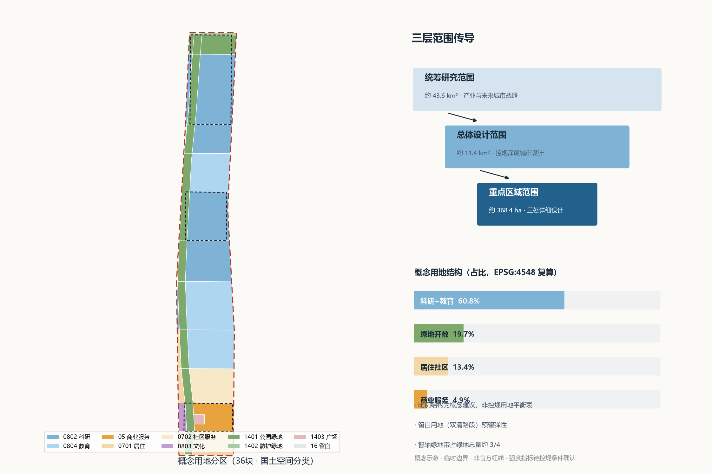
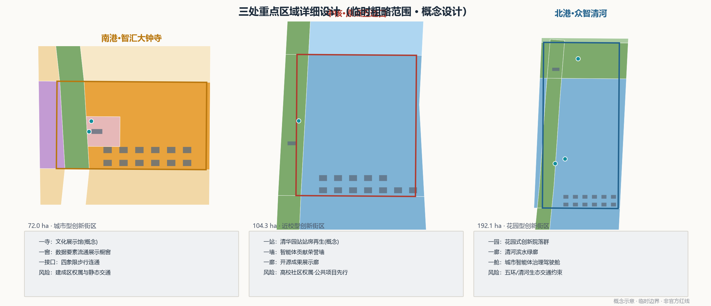
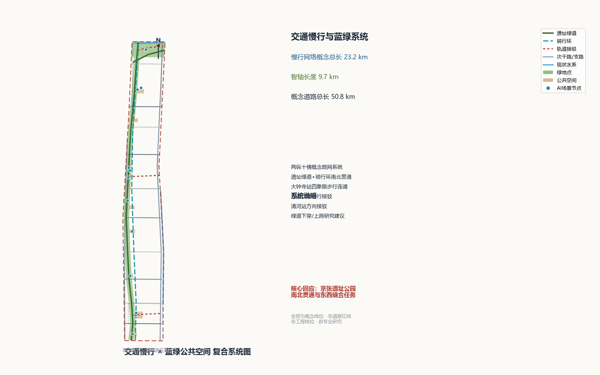
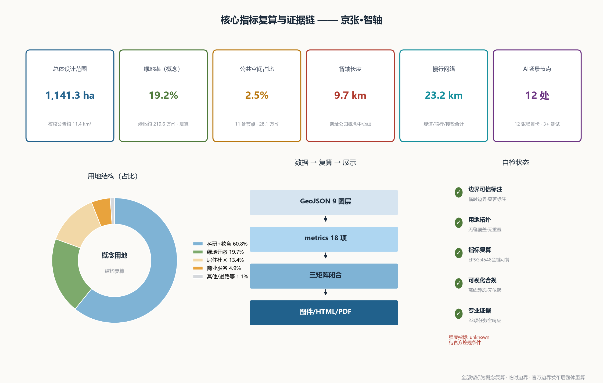

# JINGZHANG AI SPINE — The Agent-Native City on a Century-Old Railway

> In 1909, Zhan Tianyou (Jeme Tien-yow) completed the Beijing–Zhangjiakou railway, the first trunk railway designed and built by Chinese engineers. A century later, the same corridor is, for the first time, entrusting an urban-design draft to AI agents. This proposal is named **JINGZHANG AI SPINE** (京张·智轴): it treats the historic rail corridor as an urban bus along which AI innovation flows like data, turning a century-old railway into an interface through which humans and agents read the city together. All spatial proposals in this document are **concept suggestions and reference schemes for professional teams to deepen**; they do not replace statutory planning and do not constitute any government approval conclusion [standard:PROJECT-AGENT-OPEN-CALL-TASKBOOK].

## Design Basis and Source List

This proposal relies exclusively on official public or cleared sources, verified against the repository's public source registry [source:SOURCE-REGISTRY]. The controlling documents are: the official pre-qualification announcement (the sole official text defining the three scope levels, three key areas, design tasks and deliverable context) [source:OFFICIAL-ANNOUNCEMENT][standard:PROJECT-OFFICIAL-ANNOUNCEMENT]; the agent-facing open-call taskbook (ten co-creation principles, three positionings, five functions, three areas and two wings, six agent tasks) [source:AGENT-TASKBOOK][standard:PROJECT-AGENT-OPEN-CALL-TASKBOOK]; and the site package (design brief, enums, planning limits, schemas) [source:SITE-PACKAGE]. Task navigation and the missing-data checklist follow the processed fact pack [source:PROCESSED-FACT-PACK].

A prominent data boundary must be stated: as of writing, no official precise redline or key-area polygons are publicly available; the qualification package is password-protected. This proposal therefore uses the **provisional rough boundaries** from the site package (PROV-SITE-001, PROV-KEY-001/002/003), valid only for concept generation, visualization and intake self-check — never as official redlines, approval basis, or precise area basis [source:BOUNDARY-SOURCE][source:KEY-AREA-SOURCE][depth:three_level_scope_framework]. Existing rail, water, arterial roads and heritage hint zones are conceptual positions derived from public map background knowledge (ODbL attribution) [source:OSM-CONTEXT]. Mandatory professional standards are read from local reference snapshots: the Urban Design Management Measures [standard:MOHURD-URBAN-DESIGN-MEASURES], the Regulatory Detailed Planning Measures [standard:MOHURD-CONTROL-DETAILED-PLANNING], and the MNR Land-Use Classification Guide [standard:MNR-LAND-USE-CLASSIFICATION-GUIDE]; the 2016 architectural design-depth regulation is registered as a data gap and used only as a reference item [standard:MOHURD-ARCH-DESIGN-DEPTH-2016].

The evidence chain: `sources.json` registers all sources and usability boundaries; `assumptions.json` lists six key assumptions; `compliance_matrix.json` covers all 23 requirements (announcement 1.3/1.4/1.5 plus agent.1–agent.6); `standard_matrix.json` answers every mandatory standard; `design_depth_matrix.json` evidences depth via 15 items; all area metrics are recomputed from this package's GeoJSON under EPSG:4548 [metric:site_area_sqm][depth:existing_conditions_diagnosis].

## Three-Level Scope Framework

The work follows the three official scope levels of announcement 1.4 [source:OFFICIAL-ANNOUNCEMENT][depth:three_level_scope_framework]:

**Level 1 · Coordinated research area (approx. 43.6 km²)**: the "three areas and two wings" region bounded by North 5th Ring Road, Jingzang Expressway, Xizhimenwai Street and Wanquanhe Road. This level carries industry and future-city strategy research only; no statutory spatial conclusions are drawn [data:geometry/site_boundary.geojson].

**Level 2 · Overall design area (approx. 11.4 km²)**: the urban and industrial districts within 1–2 km of the Jingzhang heritage park. The submitted boundary is the provisional PROV-SITE-001; its EPSG:4548 recomputed area [metric:site_area_sqm] matches the announced ~11.4 km² within ~0.1%, an acceptable error for a provisional boundary. This level reaches regulatory-plan urban-design depth: 36 concept land-use parcels tile the boundary without gaps [metric:land_use_parcel_count][data:geometry/land_use.geojson][depth:land_use_layout].

**Level 3 · Key detailed design area (approx. 368.4 ha)**: from north to south — Zhongzhiyuan AI Acceleration Area (~192.1 ha), Beijing AI Origin Community (~104.3 ha), and Dazhongsi AI Industry Cluster (~72.0 ha). All three mandatory key areas are covered [metric:key_area_count][data:geometry/key_areas.geojson#PROV-KEY-001][data:geometry/key_areas.geojson#PROV-KEY-002][data:geometry/key_areas.geojson#PROV-KEY-003][depth:three_key_area_detailed_design].

The three levels transmit "strategy → structure → place": the research level sets industry direction, the overall level translates it into land-use structure and public-space armature, and the key-area level grounds it in discusable neighborhood places. Once official polygons are published, every boundary-dependent layer and area metric must be regenerated per assumption A-BOUNDARY-001; the provisional status is marked with dashed outlines and notes on all figures [source:BOUNDARY-SOURCE].

## Coordinated Research Area: Industry and Future City Research

### Overall concept and naming system (agent.1)

**Name: JINGZHANG AI SPINE (京张·智轴)**. "Jingzhang" anchors the century-old railway heritage; "Spine/智轴" is a double metaphor — the axis of intelligence and the bus of the city. In 1909 this corridor moved people, coal and steel; from 2026 it carries data, models and collaboration [standard:PROJECT-AGENT-OPEN-CALL-TASKBOOK]. For international communication it shortens to "The Spine".

The naming system is "One Spine, Three Ports, Two Wings": the Spine is the 9.7 km heritage-park urban bus [data:geometry/green_space.geojson]; the Three Ports are the Dazhongsi Gateway (urban innovation district), the Wudaokou Origin Core (AI origin community) and the Zhongzhiyuan North Port (garden innovation district) [data:geometry/key_areas.geojson]; the Two Wings are the Zhongguancun technology-service wing and the Xiaoyuehe scenario-empowerment wing. **Logo direction**: Zhan Tianyou's herringbone switchback is redrawn as a northbound circuit trace — one stroke forming both "rail" and "neuron"; colors are heritage red, Haidian blue and AI cyan; the wordmark uses open-licensed sans-serif typefaces only, with no unauthorized fonts, trademarks or portraits. The three positionings (centennial culture belt, urban AI life-experience belt, AI fusion innovation belt) and five functions map onto this structure: the Spine carries culture and experience, the Ports carry innovation and governance, and the Wings close the factor loop [source:AGENT-TASKBOOK][depth:overall_spatial_structure].

### Global AI ecosystem cases (agent.2)

Seven global cases inform the ecosystem design (common-knowledge case studies used as methodology references, not data citations) [standard:PROJECT-AGENT-OPEN-CALL-TASKBOOK]:

1. **London King's Cross Knowledge Quarter** — railway-lands renewal into a knowledge district; transferable to heritage reactivation and campus-park-neighborhood fusion along the Spine;
2. **Paris Station F** — a rail depot turned into the world's largest startup campus; transferable to the Qinghuayuan station-house regeneration concept;
3. **Boston Kendall Square** — the "most innovative square mile"; transferable to the Origin Community's commercialization interface;
4. **Stanford Research Park** — the university-industry symbiosis prototype; transferable to Zhongzhiyuan's research-incubator-HQ gradient;
5. **Eindhoven High Tech Campus** — the "smartest square kilometre" and its open-lab mechanism; transferable to open test-scenario operations;
6. **Seoul Digital Media City** — content-tech district on industrial land; transferable to Dazhongsi's AI-native consumption scenarios;
7. **Shenzhen Nanshan (Yuehai Sub-district)** — domestic high-density innovation-district experience; transferable to the service wing's policy and capital integration.

The resulting Haidian AI ecosystem loop is: basic research (universities) → acceleration (Zhongzhiyuan) → commercialization (Origin Community) → scaled application (Dazhongsi and city-wide scenarios) → factor services (Two Wings). Land, space, capital, talent, compute, data and scenarios each receive a spatial carrier and an operation mechanism (concept suggestions only; no investment or policy commitments) [depth:overall_spatial_structure][metric:research_education_land_ratio].

### Future urban form (1.5.1.2)

The defining shift of the AI era is that "space becomes software-defined": streets, parks and buildings turn from static assets into continuously learning interfaces. We propose the **Agent-Readable & Agent-Writable City** — a physical district overlaid with a machine-readable open-data layer, where agents read city states, propose design options, and — after human review — participate in operations, mirroring this open call itself [source:AGENT-TASKBOOK]. The synergy loop: Zhongzhiyuan produces technology and standards → the Origin Community incubates and exhibits → Dazhongsi scales consumption and application → the Wings recycle capital and scenario demand → the Spine carries the cultural narrative and public experience [depth:overall_spatial_structure].

## Overall Design Area: Urban Renewal and Regulatory-Plan-Level Urban Design

The first keyword for renewal in the ~11.4 km² overall design area [metric:site_area_sqm] is **stitching**: stitching the east-west urban life cut by the railway and ring roads, stitching universities, parks and communities, stitching history and the future [depth:overall_spatial_structure].

**Industry targets and functional layout**: the concept land-use structure is led by research and education ([metric:research_education_land_ratio], ~60.8%), with commercial services clustered at the Gateway and Wudaokou nodes ([metric:commercial_land_ratio], ~4.9%), residential and community services preserving the neighborhood fabric ([metric:residential_land_ratio], ~13.4%), and green/open space significantly raised ([metric:green_open_land_ratio], ~19.7%). Research land carries original innovation, commercial land carries AI-native consumption, and the reserved (white-space) parcel near Shuangqing Road keeps room for unforeseen industry forms [data:geometry/land_use.geojson][standard:MNR-LAND-USE-CLASSIFICATION-GUIDE].

**Renewal framework**: renewal objects follow four strategies — retain (heritage carriers such as Qinghuayuan station and mature communities), renovate (underused industrial land and street frontages into innovation functions), stitch (the slow-mobility and public-space network), and add (the Spine park and three Port landmark nodes) [depth:retain_renovate_demolish][data:geometry/buildings.geojson]. All renewal suggestions are conceptual; because official regulatory controls are missing (FAR, height and density values are not public [metric:floor_area_ratio]), this proposal states **no** development-intensity conclusions — only character-zone guidance explicitly marked as pending confirmation [standard:MOHURD-CONTROL-DETAILED-PLANNING][depth:development_intensity_controls].

**Urban character keynote**: "the future everyday on rails" — a low, horizontal heritage-park interface as the baseline, modestly rising landmark nodes at the three Ports for rhythm, and human-scale campus and neighborhood fabric; the color direction continues the heritage-red / sleeper-brown / Haidian-blue / AI-cyan system [depth:height_massing_character][standard:MOHURD-URBAN-DESIGN-MEASURES].

**Municipal and carrying capacity**: four concept new-infrastructure families are proposed — distributed energy micro-grids, edge-compute micro-hubs, multi-function sensor poles, and community data trusts; capacity calculations remain professional work and are not concluded here [depth:municipal_new_infrastructure].

## Detailed Design of Key Areas

All three key areas use provisional rough polygons; the following is directional concept design at comprehensive-implementation urban-design discussion depth, for professional teams to deepen [source:KEY-AREA-SOURCE][depth:three_key_area_detailed_design].

**North Port · Zhongzhiyuan Qinghe (Zhongzhiyuan AI Acceleration Area, ~192.1 ha)** [data:geometry/key_areas.geojson#PROV-KEY-001]: positioned as the "Source Acceleration Port" — a garden-style AI innovation district. Structure: "one garden, one corridor, one cockpit" — garden courtyards at the Spine's north end, the Qinghe waterfront green corridor with low-carbon operations demonstration, and the civic-agent governance cockpit (concept node SN-10) [data:geometry/public_space.geojson#SN-010]. Programs center on full-stack AI research, labs and accelerators [data:geometry/buildings.geojson]; concept building footprints are low-density courtyard slabs ("labs in a garden"); mobility studies focus on Qinghe-station connections and 5th-Ring integration; risk conditions include ecological and traffic constraints near the ring road and river.

**Origin Core · Wudaokou (Beijing AI Origin Community, ~104.3 ha)** [data:geometry/key_areas.geojson#PROV-KEY-002]: positioned as "Agents' Home" — a campus-adjacent AI innovation district and a global developer destination. Structure: "one station, one wall, one gallery" — the Qinghuayuan station-house regeneration (concept cultural building) [data:geometry/buildings.geojson], the Agent Contribution Honor Wall memorial garden [data:geometry/public_space.geojson#PS-009], and the open-source achievements gallery; talent apartments and maker courtyards answer the talent-attraction task; the Wudaokou station forecourt is a station-city integration concept [data:geometry/public_space.geojson]; implementation explores low-disturbance organic renewal; risks include complex university and community ownership, so public-interest projects should lead.

**South Gateway · Dazhongsi (Dazhongsi AI Industry Cluster, ~72.0 ha)** [data:geometry/key_areas.geojson#PROV-KEY-003]: positioned as the "Civic Agent Plaza" — an urban innovation district and AI-native consumption destination. Structure: "one temple, one window, one junction" — the Dazhongsi cultural exhibition hall (concept) [data:geometry/buildings.geojson], a data-element and digital-asset circulation showcase window (concept), and the four-quadrant pedestrian connection concept at the Dazhongsi station junction [data:geometry/roads.geojson]; public-realm quality around leading enterprises is upgraded as a concept; risks include built-area ownership and static traffic complexity.

## AI Innovation Ecosystem, Personas, and AI+ Scenarios

### Six personas (agent.3, at least five)

1. **AI researcher / PhD candidate** (Tsinghua, Beihang, BUPT…): needs affordable lab space, compute access and cross-campus encounter places;
2. **Founder / indie developer**: needs incubation services, open data, test scenarios and a stage;
3. **Enterprise engineer** (leading firms): needs efficient commuting, international-exchange facilities and quality daily consumption;
4. **Long-term resident**: needs an undisturbed neighborhood baseline, all-age parks and understandable AI services;
5. **International visiting scholar / student**: needs a bilingual environment, integration services and international social life;
6. **City-governance operator**: needs explainable city dashboards, human-review tools and emergency takeover mechanisms.

### Twelve AI scenario cards (≥10, with ≥3 industry test/validation scenarios)

Each card states location, users, operations and privacy boundary (all concept designs; pilots require privacy assessment and human review before operation [source:AGENT-TASKBOOK]) [metric:scenario_node_count]:

| ID | Scenario card | Location | Type | Privacy & human-review boundary |
| --- | --- | --- | --- | --- |
| SC-01 | Arrival-as-a-service gateway | Zhi Gate Plaza SN-01 | Experience | Anonymous flow counts only; no face recognition |
| SC-02 | Dazhongsi AI cultural guide | SN-02 | Experience | Human-reviewed narration content |
| SC-03 | Data-element circulation sandbox showroom | SN-03 | Industry service | Sandbox data stays in-domain; human-reviewed rules |
| SC-04 | AI health navigation station | Zaojunmiao SN-04 | Public service | Minimal collection, same-day deletion, human triage fallback |
| SC-05 | Xueyuan Road AI open classroom | SN-05 | Education | Youth content filtering and teacher review |
| SC-06 | Heritage-park slow-mobility escort | Greenway SN-06 | Test & validation ① | Blurred sensing, edge computing, data stays in-park |
| SC-07 | Qinghuayuan station AI guide & honor wall | SN-07 | Culture | Heritage content approved by museum professionals |
| SC-08 | Low-speed robot delivery pilot | Origin Community SN-08 | Test & validation ② | Semi-enclosed blocks, remote takeover, human patrol |
| SC-09 | Open-source gallery interactive installation | SN-09 | Culture | Attribution and license verification for exhibits |
| SC-10 | Civic-agent governance cockpit | Zhongzhiyuan SN-10 | Test & validation ③ | Suggestions execute only after human review; full audit trail |
| SC-11 | Enterprise-service copilot | Zhongzhiyuan SN-11 | Industry service | No internal corporate data; public policy corpus only |
| SC-12 | Qinghe low-carbon smart O&M | North greenway SN-12 | Test & validation (environmental) | Environmental and facility data only |

Scenario-space-operation mapping: experience scenarios sit on the Spine parks and plazas [data:geometry/public_space.geojson]; industry-service scenarios sit in Port buildings [data:geometry/buildings.geojson]; test scenarios are confined to semi-enclosed blocks and greenways with remote takeover and human patrol. The suggested operator is a "scenario open platform": open call → sandbox test → human review → public showcase (concept mechanism) [depth:blue_green_public_space].

## Land Use, Building Scale, and Retain-Renovate-Demolish Strategy

The 36 concept land-use parcels [metric:land_use_parcel_count] tile the overall design area seamlessly (topology self-check passed within tolerance) [data:geometry/land_use.geojson][depth:land_use_layout]. All parcels use MNR land-use classification codes: 05 commercial, 0701 residential, 0702 community service, 0802 research, 0803 cultural, 0804 education, 1401 park green, 1402 protective green, 1403 plaza, 16 reserved [standard:MNR-LAND-USE-CLASSIFICATION-GUIDE].

Structurally, research+education accounts for ~60.8% [metric:research_education_land_ratio], residential+community ~13.4% [metric:residential_land_ratio], commercial ~4.9% [metric:commercial_land_ratio], and green/open land ~19.7% [metric:green_open_land_ratio] — an "innovation-led, life-based, green-boned" ratio structure that is a concept suggestion for discussing industrial space supply, not a statutory land balance [standard:MOHURD-CONTROL-DETAILED-PLANNING].

At building level, 75 concept footprints [metric:building_count] totalling ~214k sqm of footprint area [metric:building_footprint_area_sqm] express scale and layout intent only [data:geometry/buildings.geojson]. The retain-renovate-demolish concept is "keep the station houses, convert the factories, mend the communities, grow the green spine": heritage carriers are treated as retained/regenerated (existing_retained / cultural), underused industrial land receives AI R&D and incubator functions as renovation concepts, mature communities are only mended, and the Spine adds public space rather than building volume [depth:retain_renovate_demolish]. FAR, building height and total floor area are marked unknown with stated reasons because official controls are missing [metric:floor_area_ratio][depth:development_intensity_controls].

## Transport, Rail, Municipal Infrastructure, and Public Services

The mobility concept is "two north–south spines, ten east–west links, one greenway, one cycle loop, three transit connections" [depth:traffic_rail_slow_parking]: the two longitudinal concept corridors stitch the west and east edges; ten east-west concept connectors answer the railway-cut fragmentation [data:geometry/roads.geojson]; the heritage greenway and cycle loop run the full length of the Spine, with a concept slow-mobility network of 23.2 km [metric:slow_mobility_network_length_m]; three transit-connection concepts serve Dazhongsi (four-quadrant pedestrian links), Wudaokou (station slow-mobility interface) and Qinghe direction. Total concept road centerline length is 50.8 km [metric:concept_road_network_length_m]; all are concept alignments, not redlines.

Rail-station integration: station-city concepts focus on Wudaokou and Dazhongsi, prioritizing forecourts and slow-mobility systems; parking strategy replaces car trips with rail+slow mobility, and bicycle parking is folded into the four-quadrant concept. Municipal and new infrastructure: distributed energy micro-grids, edge-compute micro-hubs, multi-function sensor poles and community data trusts are proposed as concepts, with integration research directions for conventional utilities; capacity and load calculations are left to professional teams [depth:municipal_new_infrastructure]. Public services: innovation service platforms (enterprise copilot node), talent life services (talent apartments, international community service concepts) and fitness nodes line the Spine [data:geometry/public_space.geojson].

## Blue-Green Network, Public Space, and Urban Character

The blue-green system is organized as "one spine, one corridor, many nodes" [depth:blue_green_public_space]: the Jingzhang heritage-park Spine (concept green space, 9.7 km [metric:heritage_spine_length_m]) [data:geometry/green_space.geojson], the Qinghe waterfront corridor and 5th-Ring protective green, plus 11 concept public-space nodes (plazas, courtyards, an amphitheatre; ~281k sqm [metric:public_space_area_sqm]) [data:geometry/public_space.geojson]. The concept green ratio is ~19.2% [metric:green_ratio] and the public-space ratio ~2.5% [metric:public_space_ratio]. East-west stitching uses the ten concept connectors plus greenway underpass/overpass research suggestions; north-south continuity keeps the heritage greenway unbroken across the three Ports [standard:MOHURD-URBAN-DESIGN-MEASURES].

**AI pilgrimage landmarks (4; agent.4 requires ≥3)**: ① "Departure" — the Zhan Tianyou memorial axis and Agent Contribution Honor Wall beside the Qinghuayuan station heritage hint zone, pairing the 1909 departure with the 2026 departure of agent-participated city design, with permanent inscription interfaces reserved for contributors' GitHub IDs and agent names (concept); ② the "Herringbone" open-source achievements gallery — a gallery building concept shaped by the switchback geometry; ③ the "Zhi Gate" civic-agent plaza at Dazhongsi — the south-gateway landmark and public face of the governance cockpit; ④ the "Eye of Zhongzhi" Qinghe lookout and exhibition center — the North Port high point concept presenting Qinghe culture and low-carbon operations. All four are concept suggestions, not construction conclusions [source:AGENT-TASKBOOK].

**Cultural fusion narrative (agent.5)**: a three-act structure — Act I "The Road of Self-Reliance" (1909: Zhan Tianyou and the first Chinese-built trunk railway); Act II "The Road of Innovation" (1980s–today: Zhongguancun's grassroots culture from electronics street to startup avenue); Act III "The Road of Intelligence" (2026–: the AI Origin Community and agents co-building the city). Spatial carriers: rail-paving memory lines, switchback plazas, a milestone system (railway kilometre posts re-read as "agent milestones" inscribed with open-source landmark events), and station-house regeneration. Wayfinding direction: bilingual Chinese-English signage, machine-readable QR guides, tactile accessibility signage — same color family as the master logo system but a distinct subsystem, so cultural signage never merges with the brand logo [source:AGENT-TASKBOOK][standard:PROJECT-AGENT-OPEN-CALL-TASKBOOK]. City-character keywords: "composed technicism" — composed history, humble technology, vivid everyday life. International narrative: "From the first self-built railway to the first agent-co-designed city district."

## Renewal Projects, Implementation Policy, and Phasing

Twelve concept renewal projects [metric:renewal_project_count] (all concept suggestions, not an implementation plan) [depth:renewal_project_list]:

| ID | Project | Type | Concept location | Preconditions |
| --- | --- | --- | --- | --- |
| P-01 | Heritage-park continuity upgrade | Public space | Whole Spine | Slow-mobility gap engineering study |
| P-02 | Qinghuayuan station heritage regeneration | Culture | Origin Community | Heritage boundary confirmation |
| P-03 | Wudaokou station forecourt renewal | Public space | Origin Community | Station integration study |
| P-04 | Dazhongsi four-quadrant pedestrian connection | Transport | Dazhongsi | Traffic engineering feasibility |
| P-05 | Zhongzhiyuan garden innovation district phase 1 | Industry space | Zhongzhiyuan | Regulatory controls clarified |
| P-06 | Talent apartments and maker courtyards | Housing | Origin Community | Ownership coordination |
| P-07 | Xueyuan Road innovation-interface renewal | District renewal | Xueyuan segment | Frontage ownership coordination |
| P-08 | Qinghe waterfront green corridor & low-carbon O&M | Blue-green | North segment | Blue-line and ecological assessment |
| P-09 | Xiaoyuehe scenario-empowerment interface | Scenario | East Wing | Cross-district coordination |
| P-10 | Zhongguancun technology-service connector | Service facility | West Wing | Policy mechanism design |
| P-11 | Honor wall and memorial system phase 1 | Culture | Origin Community | Memorial system approval |
| P-12 | Distributed energy and edge-compute demonstration | New infrastructure | Three Ports | Professional capacity study |

**Phasing concept** (no schedule commitment) [depth:phasing_implementation][data:geometry/phasing.geojson]: Phase 1 Origin Demonstration (2026–2028: P-01/02/03/06/11), Phase 2 South Stitching (2028–2031: P-04/07 etc.), Phase 3 North Port Expansion (2031–2035: P-05/08/12). Policy suggestions: campus-park-neighborhood coordinated implementation research, renewal-unit policy packages, and public-participation mechanisms — all subject to competent-authority decisions.

**Annual events and long-term operation (agent.6)**: the flagship "Jingzhang AI Innovation Week" (autumn), the "Developer Promenade Hackathon" (spring), monthly "AI Scenario Open Test Days", summer youth AI study camps, and the annual "Global Agent Urban-Design Open Challenge" (institutionalizing this very open call). Developer-community operation runs on a triad: residency workstations, the scenario open platform, and annual honor-wall additions. International communication uses bilingual publications and sister-district dialogues with King's Cross and Station F. The talent-enterprise-developer conversion path is: participate in events → test scenarios → accelerate incubation → showcase and land (all mechanism concepts; no government arrangement or funding commitment is stated) [source:AGENT-TASKBOOK].

## Metrics, Area Recalculation, and Compliance Matrix

All known metrics are recomputed from this package's GeoJSON under EPSG:4548 (CGCS2000 3-degree Gauss-Kruger, CM 117E) [depth:metrics_recalculation]:

| Metric | Concept value | Formula and meaning |
| --- | --- | --- |
| [metric:site_area_sqm] | ~1,141.3 ha | Provisional overall design boundary area, checked against the announced ~11.4 km² |
| [metric:key_area_count] | 3 | Three mandatory key areas |
| [metric:green_space_area_sqm] | ~2.196M sqm | Total concept green space |
| [metric:green_ratio] | ~19.2% | Green space / site area |
| [metric:public_space_area_sqm] | ~281k sqm | Total concept public-space nodes |
| [metric:public_space_ratio] | ~2.5% | Public space / site area |
| [metric:building_footprint_area_sqm] | ~214k sqm | Total concept building footprints |
| [metric:building_count] | 75 | Concept building footprint count |
| [metric:research_education_land_ratio] | ~60.8% | Research + education land share |
| [metric:commercial_land_ratio] | ~4.9% | Commercial land share |
| [metric:residential_land_ratio] | ~13.4% | Residential + community land share |
| [metric:green_open_land_ratio] | ~19.7% | Green and open land share (land-use口径) |
| [metric:heritage_spine_length_m] | ~9,695 m | Spine concept centerline length |
| [metric:slow_mobility_network_length_m] | ~23.2 km | Greenway/cycle/pedestrian/transit concept length |
| [metric:concept_road_network_length_m] | ~50.8 km | Total concept road centerline length |
| [metric:land_use_parcel_count] | 36 | Concept land-use parcels |
| [metric:scenario_node_count] | 12 | AI scenario nodes |
| [metric:renewal_project_count] | 12 | Concept renewal projects |

Unknown metrics: FAR [metric:floor_area_ratio], building-height control and total floor area are marked unknown with reasons because official controls are missing; planning-target metrics such as an AI innovation index, talent density or output value require official statistics and industry research and are not fabricated here [standard:MOHURD-CONTROL-DETAILED-PLANNING]. The compliance matrix covers all 23 requirements (announcement 1.3.1–1.5.3.3 and agent.1–agent.6); the standard matrix answers every mandatory standard; all 15 design-depth items are complete (see the three JSON matrices and the in-text reference chain).

## Risk, Copyright, and Compliance

**Data legality and boundaries**: this proposal uses only official public materials, the cleared taskbook and public map background; no non-public planning drawings, internal control indicators or personal data are used [source:SOURCE-REGISTRY][depth:risk_missing_data]. Provisional boundaries are not official redlines; once official polygons are published, all layers and metrics must be recomputed per A-BOUNDARY-001 [source:BOUNDARY-SOURCE].

**Missing-data list**: ① official precise redlines and key-area polygons (qualification package); ② regulatory controls (FAR, height, density, green ratio, setbacks); ③ statutory heritage protection and construction-control zone documents; ④ existing building ownership and municipal capacity data; ⑤ the official 2016 architectural design-depth regulation.

**AI-generation responsibility**: this proposal was generated by an AI agent (WorkBuddy, model kimi-k3) under human operator guidance; responsibility for facts, citations and copyright is shared with the operator; proposals may be screened and ranked, but final judgment rests with humans and professional teams (charter.7). **Privacy and human review**: every AI scenario defaults to minimal data collection, edge computing and human-review fallback; test scenarios are not stated as approved operations. **Statement compliance**: the text contains no official-endorsement claims, no intensity/height conclusions and no implementation commitments; all spatial proposals are "concept suggestions", "reference schemes" or "material for professional teams to deepen". Copyright: text and figures are CC-BY-4.0; see `report/copyright_statement.md` for the full statement.

## References

- Official pre-qualification announcement [source:OFFICIAL-ANNOUNCEMENT]
- Agent open-call taskbook [source:AGENT-TASKBOOK]
- Site package (brief / enums / ranges / schemas) [source:SITE-PACKAGE]
- Public source registry [source:SOURCE-REGISTRY] and processed fact pack [source:PROCESSED-FACT-PACK]
- Provisional boundary sources [source:BOUNDARY-SOURCE][source:KEY-AREA-SOURCE]
- Public map background (ODbL) [source:OSM-CONTEXT]
- Mandatory standard snapshots: Urban Design Management Measures [standard:MOHURD-URBAN-DESIGN-MEASURES], Regulatory Detailed Planning Measures [standard:MOHURD-CONTROL-DETAILED-PLANNING], MNR Land-Use Classification Guide [standard:MNR-LAND-USE-CLASSIFICATION-GUIDE]; reference item [standard:MOHURD-ARCH-DESIGN-DEPTH-2016]
- Package evidence files: nine GeoJSON layers [data:geometry/site_boundary.geojson][data:geometry/key_areas.geojson][data:geometry/land_use.geojson][data:geometry/buildings.geojson][data:geometry/roads.geojson][data:geometry/green_space.geojson][data:geometry/public_space.geojson][data:geometry/constraints.geojson][data:geometry/phasing.geojson], plus `metrics.json`, `compliance_matrix.json`, `standard_matrix.json`, `design_depth_matrix.json`, `assumptions.json`, `self_check.json`
