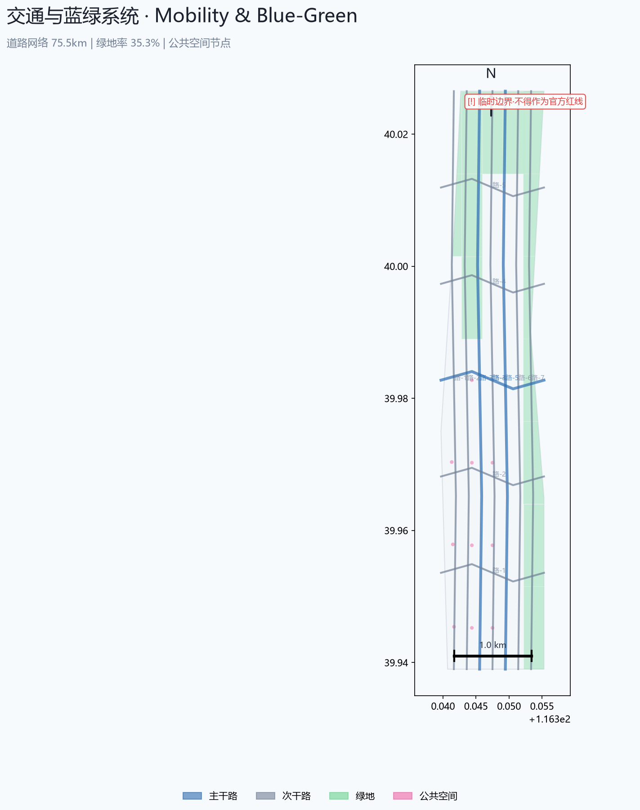

# IntelliAxis: Centennial Jing-Zhang AI Innovation Belt Urban Design Proposal

## Design Basis and Sources

Primary design references include: [source:OFFICIAL-ANNOUNCEMENT] the Pre-Qualification Announcement for the Centennial Jing-Zhang AI Innovation Belt International Urban Design Competition issued by the Haidian Branch of the Beijing Municipal Commission of Planning and Natural Resources, and [source:AGENT-TASKBOOK] the Open Call Taskbook Excerpt for Global AI Agents. Additional context is drawn from [source:HAIDIAN-1X1] Haidian District's "1+X+1" Modern Industrial System policy and [source:THREE-AREAS-WINGS] the Beijing Municipal Science and Technology Commission's "Three Areas, Two Wings" strategic plan.

Mandatory professional standards referenced: [standard:PROJECT-OFFICIAL-ANNOUNCEMENT] official pre-qualification announcement design task requirements; [standard:PROJECT-AGENT-OPEN-CALL-TASKBOOK] agent open call taskbook (six tasks, ten co-creation principles); [standard:MOHURD-URBAN-DESIGN-MEASURES] MOHURD Urban Design Management Measures (2017); [standard:MOHURD-CONTROL-DETAILED-PLANNING] MOHURD Regulatory Detailed Planning Formulation and Approval Measures; [standard:MNR-LAND-USE-CLASSIFICATION-GUIDE] MNR Territorial Spatial Survey, Planning, and Use Control Land-Sea Classification Guide (2023).

Spatial data is derived from `brief/site-package/geometry/provisional_boundaries.geojson` [data:geometry/site_boundary.geojson#PROV-SITE-001], which provides provisional rough boundaries inferred from the official announcement's textual four-boundary description and public road network data. Official precise polygon data has not yet been publicly released; therefore area metrics such as [metric:site_area_sqm] carry medium confidence and must be recalculated once official geometry becomes available. All design layers are AI-agent-generated conceptual proposals, including the 71 merged land parcels in `geometry/land_use.geojson` and building footprints in `geometry/buildings.geojson` [data:geometry/buildings.geojson].

Evidence file inventory:
- `sources.json`: 7 source records, classified by formal-ready vs. background-only levels
- `assumptions.json`: 26 key assumptions covering boundary precision, land use classification, building scale, and implementation phasing
- `compliance_matrix.json`: coverage declarations for 23 official design tasks and 6 Agent tasks
- `standard_matrix.json`: itemized responses to 6 mandatory professional standards
- `design_depth_matrix.json`: completion status for 16 statutory urban design depth items
- `metrics.json`: 13 core metrics with formulas, source files, and confidence levels

> **Important Notice**: All spatial implementation suggestions in this proposal are conceptual suggestions and reference schemes. They do not substitute for formal planning and do not constitute government-approved conclusions. Provisional boundaries are used solely for AI agent generation and human-readable visualization; they must not serve as official redlines or approval bases. All metrics must be recalculated in EPSG:4548 once official precise geometry data is released.

## Three-Level Scope Framework

This proposal strictly follows the three-tier hierarchy defined in the official announcement [source:OFFICIAL-ANNOUNCEMENT]:

**Level 1: Coordinated Research Area (~43.6 km²)** [metric:site_area_sqm]. Bounded by North 5th Ring Road to the north, Jingzang Expressway to the east, Xizhimen Outer Street to the south, and Wanquanhe Road to the west. At this level, the focus is on regional industrial coordination, innovation ecosystem development, the strategic positioning of the three-district-two-wing framework, and connections with other Beijing science cities (Future Science City, Huairou Science City).

**Level 2: Overall Design Area (~11.4 km²)**. Centered on the urban districts and industrial areas within 1-2 km of the Jing-Zhang Heritage Park, encompassing urban renewal parcels along the corridor, existing built-up areas, and developable land. This proposal achieves regulatory-planning-depth urban design recommendations at this level, with systematic conceptual treatment of spatial structure, functional zoning, transportation organization, and blue-green systems.

**Level 3: Key Detailed Design Areas (~368.4 ha)** [data:geometry/key_areas.geojson]. Three key areas from north to south: Zhongzhiyuan AI Independent Innovation Acceleration Area (~192.1 ha), Beijing AI Origin Community (~104.3 ha), and Dazhongsi AI Industry Cluster (~72.0 ha). This proposal provides specific conceptual recommendations for spatial structure, building renewal strategies, public space design, and AI scenario integration for each area.

**Provisional Boundary Usage Note**: Both the Overall Design Area and Key Areas use boundaries marked as `provisional_constraint`. The Overall Design Area boundary is a provisional polygon based on the official announcement's textual four-boundary description ("North 5th Ring Road — Xueyuan Road/Xitucheng Road — Xizhimen Outer Street — Dazhongsi East Road/Heqing Road") and calibrated to approximately 11.4 km². Key area polygons are similarly rough outlines derived from public information. These provisional geometries must not be used for precise area calculation, statutory planning control, or engineering implementation. Once official precise polygon files replace the provisional data, all area-related metrics including [metric:site_area_sqm], [metric:key_area_total_sqm], and [metric:green_ratio] must be recalculated. Land use partitions in `geometry/land_use.geojson` and building footprints in `geometry/buildings.geojson` must also be re-clipped to new boundaries.

## Coordinated Research Area: Industry and Future City Research

### Three Positionings and Five Functions

Following the strategic positioning defined in [source:AGENT-TASKBOOK], the proposal is organized around three positionings:
1. **Centennial Jing-Zhang Cultural Belt**: Carrying the memory of the Jing-Zhang Railway and Chinese railway industrial civilization, with the Heritage Park as the primary cultural corridor
2. **Urban AI Living Experience Belt**: Integrating AI technology into everyday urban scenarios to create a perceptible and tangible smart city exemplar
3. **AI Convergence Innovation Belt**: A deep-integration corridor for industrial R&D, academic exchange, open-source community, and public governance

Five core functions [metric:commercial_area_sqm]:
1. **AI Full-Stack Independent Innovation System** — anchored at Zhongzhiyuan, building the chip-framework-model-application vertical innovation chain
2. **World-Class AI Innovation Ecosystem** — hubed at the AI Origin Community, aggregating talent, capital, computing power, and scenarios
3. **AI+ Scenario Empowerment New Paradigm** — driven by the Xiaoyuehe Scenario Empowerment Wing, opening city-level AI test and validation scenarios
4. **Intelligent AI Vibrant City** — city-wide deployment of AI-enhanced transportation, energy, safety, environment, and public services
5. **AI Governance Global Discourse** — establishing AI ethics and governance dialogue platforms, standards laboratories, and open-source governance nodes

### Three-District Two-Wing Synergy Loop

The `Three Districts` serve as the core industry-space carriers: [data:geometry/key_areas.geojson#PROV-KEY-001] Zhongzhiyuan focuses on AI full-stack independent innovation and AI governance discourse; [data:geometry/key_areas.geojson#PROV-KEY-002] the AI Origin Community centers on world-class innovation ecosystem and talent community; [data:geometry/key_areas.geojson#PROV-KEY-003] Dazhongsi specializes in AI-native consumption and business scenarios.

The `Two Wings` provide functional extension: [depth:regional_synergy] the Zhongguancun Technology Service Wing enables global factor allocation, IP empowerment, and capital connections; the Xiaoyuehe Scenario Empowerment Wing delivers city-level AI scenario testing and an intelligent experience corridor.

The three districts and two wings are connected through the Jing-Zhang Heritage Park's north-south green corridor, forming an "industry-innovation-scenario-experience" circulation loop.

### Global AI Innovation Ecosystem Case Studies

Five benchmark cases are selected to extract transferable spatial and operational insights [standard:PROJECT-AGENT-OPEN-CALL-TASKBOOK]:
1. **Station F (Paris)** — spatial transformation logic of a historic railway station into the world's largest startup incubator
2. **Toronto Quayside/Sidewalk Labs (Toronto)** — technology and governance boundary lessons from waterfront smart city experimentation
3. **Shenzhen Nanshan AI Town** — spatial strategies for converting industrial parks into AI innovation communities
4. **King's Cross (London)** — mixed-use and public-space-first approaches in railway heritage urban renewal
5. **Roppongi Hills (Tokyo)** — embedded integration of high-efficiency commercial complexes with urban cultural life

Common lessons: the renewal corridor of a linear transportation heritage site requires a triple structure of "cultural anchors + industrial clusters + public space networks"; AI scenarios require a three-stage progression from "test validation → demonstration experience → scaled operation"; talent attraction depends on the density of high-quality living spaces, international communities, and knowledge social networks.

### Naming System and Visual Identity Direction [depth:naming_identity]

Proposal primary name: **京张·智轴** (English: IntelliAxis — JingZhang AI Innovation Corridor)
- Naming logic: `京张` (Jing-Zhang) anchors the century-old railway cultural roots; `智轴` (IntelliAxis) expresses the AI innovation axis positioning
- Logo direction: based on the Jing-Zhang Railway's iconic "switchback" (人字形) alignment as prototype, combined with neural network node-connection topology, creating a symbol system with both historical depth and futuristic sensibility (conceptual direction, not specific design)
- Visual system palette: Technology Blue (#1A56DB) + Rail Gray (#4A5568) + Innovation Orange (#ED8936), expressing a triple color narrative of history—technology—vitality

## Overall Design Area: Urban Renewal at Regulatory-Planning Depth

### Industrial Objectives and Functional Layout [depth:functional_layout]

Within the Overall Design Area, public administration and commercial land combined account for approximately 53.6% [metric:industrial_rd_area_sqm]; commercial service land approximately 24.6% [metric:commercial_area_sqm]; public administration and public service land approximately 29.0% [metric:public_facility_area_sqm]; residential land approximately 11.1%; green space and open space approximately 35.3% [metric:green_ratio]. These ratios are AI-generated conceptual allocations based on provisional boundaries [data:geometry/land_use.geojson] and do not constitute statutory land use indicators [depth:land_use_layout].

### Spatial Structure and Renewal Framework [depth:urban_renewal_framework]

The proposal adopts a "One Axis, Two Wings, Three Districts, Multiple Nodes" spatial organization logic [data:geometry/site_boundary.geojson]:
- **One Axis**: the Jing-Zhang Heritage Park north-south green corridor as both spatial and cultural dual spine [data:geometry/green_space.geojson]
- **Two Wings**: Zhongguancun Technology Service Wing (west), Xiaoyuehe Scenario Empowerment Wing (east)
- **Three Districts**: Zhongzhiyuan, AI Origin Community, and Dazhongsi key areas
- **Multiple Nodes**: AI public space nodes anchored by AI scenario cards [data:geometry/public_space.geojson]

The renewal strategy prioritizes stock renewal over new construction. The aging industrial and warehouse land on both sides of the Jing-Zhang Railway corridor is the primary renewal target; the Wudaokou-Zhichun Road axis adopts functional replacement and facade renewal as primary approaches; areas adjacent to universities prioritize industry-academia-research collaboration and innovation community embedding.

### Urban Renewal Project List (Conceptual) [depth:implementation_policy]

- **ZY-01** Jing-Zhang Railway Heritage Park south extension and north expansion (existing green space system upgrade)
- **ZY-02** Zhongzhiyuan AI Industrial Park core area renewal (existing industrial land quality enhancement)
- **ZY-03** Wudaokou AI Innovation Complex (existing commercial + educational mixed-use area renewal)
- **ZY-04** Zhichun Road Technology Business Corridor functional replacement
- **ZY-05** Dazhongsi AI-Native Consumption Experience Zone renewal
- **ZY-06** Xueyuan South Road slow-traffic system and AI public space network construction
- **ZY-07** Qinghe-Xiaoyuehe Waterfront AI Experience Belt

The above project list comprises conceptual suggestions based on public information and AI analysis; specific scope, timeline, and investment require professional team deepening [standard:PROJECT-AGENT-OPEN-CALL-TASKBOOK].

### Building Scale [metric:total_buildings]

Since floor area ratio [metric:floor_area_ratio] and building height [metric:building_height_max] depend on undisclosed regulatory planning conditions, aviation height restrictions, and land ownership information, this proposal does not provide specific values but proposes the following conceptual directions:
- Industrial R&D buildings are primarily mid-low-rise (6-12 story) clusters incorporating shared experimental platforms and collaboration spaces
- Commercial service buildings adopt high-rise point-tower layouts (12-18 stories) with ground floors opening to the urban public interface
- Residential buildings are controlled at 6-8 stories, adopting small-block, dense-road-network community morphology
- Building heights on both sides of the Jing-Zhang Heritage Park strictly step back, forming a sectional rhythm of "railway canyon — park gentle slope — urban gradient"

### Transportation and Rail [data:geometry/roads.geojson]

Existing Metro Lines 4 (Xizhimen-Anheqiao North section), 13 (Wudaokou-Zhichun Road section), and 10 (Zhichunli-Xitucheng section) already cover major nodes. Conceptual recommendations include:
- New east-west pedestrian connections to stitch together urban fabric on both sides of the railway heritage park
- Five major metro stations (Xizhimen, Zhichun Road, Zhichunli, Wudaokou, East Qinghua Road West) implementing TOD comprehensive development concepts
- AI autonomous micro-transit loops covering key areas, creating last-kilometer AI shuttle systems
- Qinghe-Xiaoyuehe waterfront slow-traffic paths connecting bicycle routes and AI experience nodes [metric:total_roads_km]

### Municipal Infrastructure and New Infrastructure [depth:municipal_infrastructure]

- Distributed AI computing centers located within industrial land, integrated with building architecture
- Centralized liquid-cooled intelligent computing infrastructure deployed at Zhongzhiyuan, serving AI full-stack enterprises
- AI video perception and urban IoT sensor nodes deployed along the public space network
- Composite utility tunnels reserved beneath the Jing-Zhang Heritage Park, integrating 5G/fiber/energy/sponge city facilities
- All above are conceptual suggestions; engineering feasibility requires professional team assessment

### Jing-Zhang Heritage Park Vitality Belt [depth:public_space_design]

The Jing-Zhang Railway Heritage Park serves as the physical and spiritual spine of this proposal. Conceptual recommendations:
- Southern section (Xizhimen-Zhichun Road): Urban gateway segment, creating an "AI Gateway" urban living room at the Xizhimen hub
- Central section (Zhichun Road-Wudaokou): Innovation vitality segment, embedding AI exhibition, developer exchange, and innovation incubation nodes
- Northern section (Wudaokou-Qinghe): Eco-technology segment, integrating waterfront ecology with AI test and validation scenarios
- East-west stitching bridges/underpasses every 400-600m, connecting urban functional zones on both sides
- AI station nodes every 500m within the heritage park, providing computing experience, digital displays, and public interaction interfaces

## Key Area Detailed Designs [data:geometry/key_areas.geojson]

### Zhongzhiyuan AI Independent Innovation Acceleration Area (~192.1 ha)

Positioning: AI full-stack independent innovation source and governance discourse highland [depth:key_area_design].

Spatial structure: "One Center, Two Belts, Three Clusters" — AI Innovation Source Center (Zhongzhiyuan core area), Jing-Zhang Heritage Park Innovation Exhibition Belt and Qinghe Eco-Technology Belt, Large Model R&D Cluster, AI Chip and Computing Cluster, AI Governance and Standards Cluster.

Building renewal strategy: existing aging industrial buildings transformed into shared laboratories and open-source community spaces; new mid-low-rise (8-12 story) R&D office buildings using modular design with reserved liquid cooling computing expansion capacity. Industrial building ground floors open toward the Jing-Zhang Heritage Park, forming a "front-hall-back-factory" innovation interface.

Public space: Create "AI Axis Plaza" — a linear public space extending from the Zhongzhiyuan core area southward to the Jing-Zhang Heritage Park, with AI Achievement Exhibition Gallery, Open-Source Project Pavement Gallery, and AI Innovator Honor Wall along the axis.

### Beijing AI Origin Community (~104.3 ha)

Positioning: World-class AI innovation ecosystem hub and global AI talent community.

Spatial structure: "One Core, Two Rings" — AI Innovation Ecosystem Core (Wudaokou-Zhichun Road intersection area), inner ring for AI innovation social and commercial vitality, outer ring for high-quality AI talent housing and life services. The Jing-Zhang Heritage Park traverses between the two rings.

Functional mix [metric:commercial_area_sqm]: Innovation office and shared spaces, AI-themed commerce (AI bookstore, AI café, AI art), talent apartments, international school, and community center.

AI public space: "Origin Plaza" at the Wudaokou-Zhichun Road intersection — an urban living room for AI innovators, featuring digital ground interaction, AI art installations, and real-time global AI activity displays. Operated under a "24/7 Innovation Lifestyle" concept.

### Dazhongsi AI Industry Cluster (~72.0 ha)

Positioning: AI-native consumption, business, and new business format demonstration [depth:smart_native_commerce].

Spatial structure: Dazhongsi metro station as TOD core, with an east-west commercial corridor connecting northward to the Jing-Zhang Heritage Park and southward to existing commercial facilities.

Core business format concepts: AI-driven retail (intelligent recommendation, seamless payment, VR try-on), AI-native new entertainment (AI-generated live music, AI interactive theater), AI legal/finance/education service centers.

Public space: Dazhongsi sunken plaza transformed into "AI Live Lab" — a round-the-clock open urban AI experience and testing venue, combining public gathering and digital content display functions.

## AI Innovation Ecosystem, Personas, and AI+ Scenarios

### Global AI Innovation Ecosystem Case Studies (Readable Summary)

1. **Station F (Paris)**: 34,000 m² former railway station → 1,000+ startups. Key insight: transforming historic heritage into innovation containers requires preserving original structural character, providing flexible units, and incorporating high-density social spaces.
2. **Toronto Quayside**: Waterfront smart city experiment. Key insight: scenario validation must balance technical feasibility with public trust; privacy and data governance are AI city "infrastructure."
3. **Nanshan AI Town (Shenzhen)**: Industrial park → innovation community. Key insight: the transition from "park" to "community" requires mixed-use, 24-hour vitality, and complete education/healthcare/cultural/sports amenities.
4. **King's Cross (London)**: 27-hectare railway industrial heritage renewal. Key insight: public space is the lead investment for urban renewal; the value of mixed-use and fine-grained phasing far exceeds single-function development.
5. **Roppongi Hills (Tokyo)**: Key insight: high density can also achieve high quality; the key lies in three-dimensional organization of public space and continuous operation of cultural facilities.

### Innovation Ecosystem Map [depth:innovation_ecosystem]

The AI innovation ecosystem follows a vertical chain of "basic research → technology R&D → productization → scenario application → global diffusion," with "talent-capital-computing-data-scenario-governance" as horizontal supporting elements. Spatially, this corresponds to:
- Zhongzhiyuan: basic research + technology R&D + computing infrastructure
- AI Origin Community: productization + talent community + capital connection
- Dazhongsi: scenario application + consumption innovation + exhibition experience
- Zhongguancun Technology Service Wing: global diffusion + IP + policy connection
- Xiaoyuehe Scenario Empowerment Wing: scenario testing + urban experience + data pipeline

### User Personas (5 Types) [depth:personas]

1. **AI Researcher/Engineer (Zhang Ming, 32, PhD)** — needs shared experimental platforms, high-performance computing, academic exchange spaces, livable community
2. **AI Entrepreneur (Li Wei, 28, returnee)** — needs low-cost startup space, mentor network, capital connection, scenario testing opportunities
3. **AI Product Manager (Wang Hao, 35)** — needs industrial cluster density, cross-domain collaboration, user testing scenarios, lifestyle convenience
4. **International AI Scholar/Visitor (Dr. Sarah Chen, 41)** — needs international community, short-term housing, knowledge exchange platforms, cultural experience
5. **Tech Enthusiast/Citizen (Uncle Zhao, 65, retired teacher)** — needs understandable AI displays, convenient city services, safe public spaces

### AI Scenario Cards (10) [depth:scenario_cards]

1. **AI Startup Café** | Dazhongsi-Wudaokou corridor | AI taste analysis for drink recommendations, AR startup project display wall, quarterly AI Demo Day
2. **Unmanned Delivery Micro-Hub** | Zhichun Road-Xueyuan South Road intersection | Last-kilometer drone/robot delivery dispatch station + public charging/pickup lockers
3. **AI Health Kiosk** | Along Jing-Zhang Heritage Park | Self-service vital sign measurement, AI health consultation (non-medical diagnosis), exercise prescription suggestions
4. **Smart Curbside Parking** | Secondary road corridors | AI cameras + real-time parking guidance + time-shifted sharing reservations, reducing cruising for parking
5. **AR Jing-Zhang History Corridor** | Full Jing-Zhang Heritage Park route | Mobile/glasses AR restoration of railway scenes, train evolution, and historical moments since 1909
6. **AI Public Safety Warning** | Key area public spaces | Video stream AI abnormal behavior recognition + crowd density warning + emergency response linkage (human review + privacy compliance)
7. **Open-Source Code Plaza** | AI Origin Community Origin Plaza | Ground LED display of real-time global open-source AI project contribution activity + contributor honor display
8. **AI Waste Sorting & Resource Recovery** | Within communities | Image recognition auto-classification + point incentives + recycling logistics optimization
9. **Developer 24h Innovation Workshop** | Zhongzhiyuan/Origin Community | Shared workstations + cloud dev environment + computing vouchers + mentorship, 7×24 operation
10. **Smart Traffic Signal Optimization** | Xueyuan Road/Zhichun Road/Zhongguancun East Road | Real-time traffic flow AI-regulated signal timing, prioritizing transit and active transportation (human supervision)

### AI Industry Test & Validation Scenarios (3) [depth:test_validation]

1. **City-Level Autonomous Driving Open Test** | Xiaoyuehe Scenario Empowerment Wing section (designated sections + off-peak hours + safety supervisor) | L4 shuttle and logistics vehicle testing
2. **AI Energy Dispatch Experimental Field** | Zhongzhiyuan industrial zone microgrid | AI-predicted solar/storage/load, optimizing campus energy self-sufficiency rate (target 20%)
3. **AI-Assisted Urban Design Tool Validation** | Overall Design Area selected sites | Using generative AI to assist building massing iteration and solar/wind environment analysis, results reviewed by licensed architects

> All above scenarios and data collection must comply with privacy protection regulations. Any scenario involving personal data must undergo human review and ethics review.

## Land Use, Building Scale, and Retain-Renovate-Demolish Strategy

Land use classification follows the MNR Territorial Spatial Survey, Planning, and Use Control Land-Sea Classification Guide [standard:MNR-LAND-USE-CLASSIFICATION-GUIDE]. Within the approximately 11.4 km² Overall Design Area, conceptual land allocation (EPSG:4548 estimation based on provisional boundaries [metric:site_area_sqm]):
- Green space and open space (14): ~4.03M m² (35.3%) [metric:green_ratio]
- Commercial services (05): ~2.80M m² (24.6%) [metric:commercial_area_sqm]
- Residential (07): ~1.27M m² (11.1%) [metric:residential_area_sqm]
- Public administration and public services (08): ~3.31M m² (29.0%) [metric:public_facility_area_sqm]
- Independent industrial land (10): Not separately classified in this conceptual zoning; industrial R&D functions are mixed-carried by public services (08) and commercial (05) [metric:industrial_rd_area_sqm]
- Roads and municipal facilities: ~1.60M m² (14%, road network estimation)

**Retain-Renovate-Demolish Classification Principles** (conceptual direction):
- **Retain**: Established quality residential areas, universities/research institutes, metro stations and ancillary facilities, permanent green spaces
- **Renovate**: Aging industrial and warehouse buildings along the Jing-Zhang corridor, inefficient commercial facilities, multi-story residential over 20 years old
- **Demolish**: Unsafe and dilapidated buildings, walls and structures severely obstructing public space connectivity, unsustainably utilized temporary buildings
- The above classification comprises conceptual suggestions based on public satellite imagery and urban fabric analysis and cannot substitute for on-site building quality assessment and ownership investigation

> Since [metric:floor_area_ratio] and [metric:building_height_max] depend on undisclosed regulatory planning conditions, this proposal does not provide specific FAR or building height values, only spatial organization and fabric concept reference schemes.

## Transportation, Rail, Municipal Infrastructure, and Public Services

### Road and Slow-Traffic System [data:geometry/roads.geojson]

Existing arterial roads (Xueyuan Road, Zhichun Road, Zhongguancun East Road, North 4th Ring Road) form the basic skeleton. Conceptual recommendations:
- Increase east-west secondary road density to mitigate urban fabric fragmentation on both sides of the railway heritage park [metric:total_roads_km]
- Independent pedestrian-bicycle main corridor within the Jing-Zhang Heritage Park, with at-grade crossings and underpasses at intervals from adjacent urban roads
- "Slow-Traffic Priority Zones" around Wudaokou, Zhichun Road, and Dazhongsi metro stations, using shared-street concepts to reduce vehicle speeds and expand pedestrian space

### Public Service Facilities [depth:public_service_planning]

- AI International School (K-12) located east of the AI Origin Community, serving international talent families
- AI Community Health Centers (3 locations) deployed within 15-minute living circles of each residential cluster
- Shared conference and event centers targeting international academic conference needs, located at Zhongzhiyuan and AI Origin Community core positions
- 24h convenience stores, pharmacies, fitness centers, and other basic commercial services in all residential cluster ground-floor retail

### New Infrastructure [depth:new_infrastructure]

- **Computing**: Zhongzhiyuan centralized liquid-cooled intelligent computing center and distributed edge computing nodes forming a "center-edge" architecture
- **Data**: Public data open platform + data sandbox, providing compliant data training environments for AI enterprises
- **Network**: Site-wide 5G/5.5G coverage + key area WiFi 6E + fiber direct
- **Energy**: Photovoltaic rooftops + energy storage campus microgrid; AI-driven building energy optimization
- All above are conceptual suggestions; specific plans require detailed design and evaluation by energy, telecommunications, and municipal engineering professional teams

## Blue-Green Space, Public Space, and Urban Character

### Green Space System [data:geometry/green_space.geojson]

Green space and open space ratio approximately 35.3% [metric:green_ratio]. Green space system structure:
- **One Corridor**: Jing-Zhang Railway Heritage Park north-south continuous green corridor (width 50-150m) — the spatial soul of the proposal
- **Two Belts**: Qinghe Waterfront Ecological Belt (north) + Xiaoyuehe Urban Waterside Belt (east)
- **Multiple Points**: Street-level green spaces and pocket parks distributed across communities, industrial parks, and key intersections

### Public Space Network [data:geometry/public_space.geojson]

The Jing-Zhang Heritage Park serves as the primary public space corridor, connecting the core public nodes of the three key areas. AI pilgrimage landmark conceptual suggestions [standard:PROJECT-AGENT-OPEN-CALL-TASKBOOK]:
1. **"IntelliAxis Gateway"** | North end of Xizhimen / Jing-Zhang Heritage Park starting point | Composed of a monumental digital light column and Jing-Zhang railway historical inscriptions
2. **"AI Time Capsule"** | Zhongzhiyuan Core Plaza | Subterranean space storing annual records of global AI breakthroughs, periodically opened
3. **"Origin Plaza"** | AI Origin Community center | Embedded LED ground display showing real-time global open-source AI project contribution streams
4. **"Computing Lighthouse"** | Above Dazhongsi AI Live Lab | Real-time computing utilization visualization forming an urban skyline landmark

All above are conceptual design suggestions; specific form, site selection, and engineering feasibility require professional team deepening and must not be regarded as approved construction projects [standard:PROJECT-AGENT-OPEN-CALL-TASKBOOK].

### AI Public Space and Pilgrimage Landmarks

Responding to the specialized requirements in [standard:PROJECT-AGENT-OPEN-CALL-TASKBOOK] regarding AI public space and pilgrimage landmarks. The Jing-Zhang Heritage Park itself is the optimal carrier for "AI public space" — distinct from traditional urban parks, it should incorporate AI hardware, digital interfaces, contextual interaction, and global exhibition functions. East-west stitching is achieved through footbridges/underpasses every 400-600m on both sides of the park; north-south connectivity is ensured by continuous pedestrian-bicycle paths and AI shuttle systems.

The Dazhongsi area's AI-native consumption and business scenarios experiment with "AI commercial modules" at the TOD core parcels — restructuring traditional commercial space through digital twins, real-time footfall prediction, unmanned warehouse fronting, and AI-personalized recommendations.

### Urban Character Control [depth:city_character]

The overall character tone is "**Technologically Rational Elegance**":
- Building colors use low-saturation whites, grays, and blue-grays, punctuated by the Jing-Zhang Railway's cultural rust-red
- Building massing steps up from the Jing-Zhang Heritage Park to the east and west sides, forming a sectional profile of "railway canyon — urban terrace"
- Green roof coverage rate no less than 30% (conceptual suggestion); fifth facades serve as takeoff/landing and navigation interfaces for AI low-altitude economy and drone logistics
- Jing-Zhang Railway historical elements (rails, sleepers, signals, platforms) integrated into street furniture, ground paving, and public art through abstracted design language

### Cultural Narrative [depth:cultural_narrative]

Three temporal dimensions interweave: "Centennial Jing-Zhang · Centennial Zhongguancun · Centennial AI":
1. **Jing-Zhang Railway Layer**: 1909–present, the starting point of China's self-built railways, symbolizing the origin of the spirit of independent innovation
2. **Zhongguancun Innovation Layer**: From the 1980s, the birthplace of China's information industry and internet economy
3. **AI New Culture Layer**: From the 2020s, a frontier testing ground for global AI open-source collaboration, human-machine co-creation, and intelligent civilization

Narrative spatialization: Jing-Zhang Heritage Park cultural displays are organized in three segments — "Past (Qing Dynasty/Republican Era) — Present (IT/Internet) — Future (AI)" — with the historical segment featuring railway artifacts and AR historical scenes, the contemporary segment featuring Zhongguancun enterprise stories and interactive data walls, and the future segment featuring AI-generated art and real-time global project displays.

## Renewal Project List, Implementation Policy, and Phasing Plan [data:geometry/phasing.geojson]

### Renewal Project List

| ID | Project Name | Type | Scale | Suggested Timing | Prerequisites |
|------|---------|------|------|---------|---------|
| ZY-01 | Jing-Zhang Heritage Park South Extension & North Expansion | Public Space | Linear ~8km | Near-term | Coordinate railway land use |
| ZY-02 | Zhongzhiyuan Core Area Renewal | Industrial Renewal | ~30ha | Near-term | Coordinate existing enterprise relocation |
| ZY-03 | AI Origin Community Urban Living Room | Mixed Development | ~15ha | Near-term | Confirm regulatory planning conditions |
| ZY-04 | Dazhongsi AI Consumption Experience Zone | Commercial Renewal | ~20ha | Mid-term | Coordinate TOD planning |
| ZY-05 | Wudaokou Industry-Academia-Research Complex | Mixed Renewal | ~12ha | Mid-term | Coordinate university land use |
| ZY-06 | Slow-Traffic Stitching System | Transportation/Municipal | Full corridor | Near-term | Confirm road redlines |
| ZY-07 | Qinghe Waterfront AI Experience Belt | Public Space | ~3km | Long-term | Water affairs and ecological assessment |

> The above project list comprises conceptual suggestions; specific scope, scale, timing, and investment require professional team deepening and government decision-making confirmation. "Scale" in the table represents rough estimates.

### Phased Implementation

- **Near-term (1-3 years)**: Jing-Zhang Heritage Park South Extension & North Expansion Phase 1, Zhongzhiyuan Core Area Launch Zone, AI Origin Community Urban Living Room Phase 1, Slow-Traffic Stitching System demonstration section
- **Mid-term (3-7 years)**: Dazhongsi AI Consumption Experience Zone, Wudaokou Industry-Academia-Research Complex, Xiaoyuehe Scenario Empowerment Wing test zone, new infrastructure deployment
- **Long-term (7-15 years)**: Site-wide urban renewal deepening, Qinghe Waterfront AI Experience Belt, full realization of the three-district two-wing framework

### Global AI Innovation Event System and Long-Term Operations [depth:long_term_operation]

Responding to the sixth task in [standard:PROJECT-AGENT-OPEN-CALL-TASKBOOK], the following is proposed:
- **Annual Flagship Events**: Spring "IntelliAxis AI Summit" (Asian node comparable to NeurIPS/ICLR), Autumn "AI Open-Source Carnival" (AI edition of FOSDEM), Winter "AI City Biennale"
- **Event Brand System**: Unified brand prefix `IntelliAxis` (IntelliAxis Summit, IntelliAxis OpenFest, IntelliAxis Biennale)
- **Developer Community Operations**: Partnering with GitHub/GitCode and similar platforms, establishing the AI-Origin Residency program — 3-6 month on-site development space and resources for outstanding global open-source AI projects
- **Scenario Open Operations Mechanism**: Establishing an "AI Scenario Open Platform" with government, enterprise, and community tripartite co-creation of city-level AI test and validation scenarios, achieving privacy and security compliance through sandbox mechanisms
- **Public Experience Routes**: Designing an "AI Pilgrimage Day Tour" route (Origin Plaza → Zhongzhiyuan → Heritage Park → Dazhongsi Live Lab), offering bookable AI experience tours for the public
- **International Communication and Attraction Conversion**: Unified international communication under the `IntelliAxis` brand, building global recognition through top AI conference satellite events, open-source project Contributor Wall, and global AI talent green channel mechanisms

> All above events, brands, operations, and policy suggestions are conceptual visions and do not constitute confirmed government arrangements or investment commitments [standard:PROJECT-AGENT-OPEN-CALL-TASKBOOK].

## Metrics System, Area Recalculation, and Compliance Matrices

This section is fully presented in [JSON matrix form](compliance_matrix.json); below is a summary of core metrics and coverage logic.

### Core Metrics Overview

| Metric | Value | Confidence | Notes |
|------|-----|--------|------|
| Overall Design Area | ~11,400,000 m² | medium | Provisional boundary [metric:site_area_sqm] |
| Green Space Ratio | ~35.3% | medium | AI allocation [metric:green_ratio] |
| Public Space Ratio | ~0.4% | low | Estimated value [metric:public_space_ratio] |
| Key Area Count | 3 | medium | Official announcement [metric:key_area_count] |
| Key Area Total | ~3,684,000 m² | medium | Provisional boundary [metric:key_area_total_sqm] |
| Floor Area Ratio | ~0.15 (conceptual estimate) | low | AI-generated building massing [metric:floor_area_ratio] |
| Building Height Limit | N/A | unknown | Awaiting regulatory plan [metric:building_height_max] |

### Compliance Matrix Coverage

`compliance_matrix.json` covers, with 23 requirement entries: Section 1.3 (3 design tasks), Section 1.4 (3 scope levels), Section 1.5.1 (Coordinated Research Area 2 subtasks), Section 1.5.2 (Overall Design Area 5 subtasks), Section 1.5.3 (Key Areas 4 items, including 1 mandatory + 3 specific areas), and 6 Agent tasks (agent.1 through agent.6). Each entry includes the corresponding proposal section, GeoJSON layer, metric reference, figure reference, visualization section, source ID, and assumption ID [standard:PROJECT-OFFICIAL-ANNOUNCEMENT].

### Design Depth Matrix

`design_depth_matrix.json` covers 16 urban design depth items:
- Spatial structure and functional zoning [depth:spatial_structure]
- Land use layout and classification [depth:land_use_layout]
- Functional layout and mixed-use [depth:functional_layout]
- Building volume and height control [depth:building_volume_control]
- Public space system [depth:public_space_design]
- Blue-green system [depth:blue_green_system]
- Transportation organization [depth:transportation_organization]
- Urban character and color [depth:city_character]
- Municipal infrastructure [depth:municipal_infrastructure]
- New infrastructure [depth:new_infrastructure]
- Urban renewal framework [depth:urban_renewal_framework]
- Renewal project list [depth:implementation_policy]
- Key area detailed design [depth:key_area_design]
- Naming and visual identity [depth:naming_identity]
- Cultural narrative [depth:cultural_narrative]
- Innovation ecosystem and scenarios [depth:innovation_ecosystem]

Each item includes status (complete/incomplete/data_gap) and evidence references. Items marked `data_gap` (e.g., specific building height values) await official regulatory planning data.

### Standards Compliance Matrix

`standard_matrix.json` records responses to all mandatory professional standards across 6 standard entries. Among these, 5 are `mandatory=true` and marked `addressed`; 1 (MOHURD-ARCH-DESIGN-DEPTH-2016) is `mandatory=false` and marked `data_gap`. Each standard entry includes proposal section references, figure references, geometry references, and metric references.

[data:geometry/constraints.geojson#CST-001]
[standard:MOHURD-ARCH-DESIGN-DEPTH-2016]

## Sources and Rights Ledger

### Formal Source Mapping

The sources referenced in this proposal are registered in the repository as follows:

| Source ID | Registration Status | Usability |
|--------|---------|--------|
| SITE-PACKAGE | approved_formal | Formal-ready |
| OFFICIAL-ANNOUNCEMENT (DATA-SRC-OFFICIAL-ANNOUNCEMENT-20260509) | approved_formal | Formal-ready |
| AGENT-TASKBOOK (DATA-SRC-AGENT-TASKBOOK-20260518) | approved_formal | Formal-ready |
| PROVISIONAL-BOUNDARIES (DATA-SRC-PROVISIONAL-BOUNDARIES-20260605) | provisional_only | Provisional only |
| OSM-COPYRIGHT | open_data_license | Background reference |
| THREE-AREAS-WINGS | background_only | Background reference (non-formal evidence) |
| HAIDIAN-1X1 | background_only | Background reference (non-formal evidence) |

[source:THREE-AREAS-WINGS] and [source:HAIDIAN-1X1] are cited only as industrial background context, not as formal planning evidence. Specific data for the five global case studies (Station F, Toronto Quayside, Nanshan AI Town, King's Cross, Roppongi Hills) are drawn from public news reports and academic literature, with citation levels noted.

### Rights Inventory

- **Fonts**: Microsoft YaHei used for PDF and HTML rendering; copyright owned by Microsoft Corporation, legally used on Windows systems
- **GIS Data**: Provisional boundaries inferred by repository maintainers based on public pre-qualification announcement
- **OSM Data**: Following ODbL 1.0 license; extraction date 2026-08-07; scope limited to Overall Design Area bounding box. Attribution: "© OpenStreetMap contributors." Derivative database obligation: the spatial layers in this proposal constitute independent creation and do not constitute an OSM derivative database
- **AI-Generated Content**: All text, spatial data, and visualizations generated by AI agent WorkBuddy (Kimi-K3), reviewed and confirmed by submitter. No third-party copyrighted material included
- **Trademarks**: Enterprise names and product names mentioned in the proposal serve conceptual reference only and do not represent authorized use or commercial association

## Public Interest and Inclusivity

### Public Interest Statement

This proposal follows Agent Co-Creation Principle 1 [standard:PROJECT-AGENT-OPEN-CALL-TASKBOOK], placing urban public interest at the core of the scheme. The public space network, slow-traffic system, community health facilities, and cultural exhibition nodes all prioritize public accessibility as the primary design objective.

### Inclusivity Coverage

Beyond the core user personas (AI researcher, entrepreneur, product manager, international scholar, tech enthusiast), this proposal proposes the following supplementary inclusive design principles:

- **Persons with Disabilities**: Full barrier-free design throughout the Jing-Zhang Heritage Park (ramps ≤5%, tactile paving, tactile wayfinding); AI public spaces equipped with voice interaction and sign language translation terminals; all AI scenario nodes must meet WCAG 2.1 AA standards
- **Children and Youth**: Science education nodes embedded in the green space system; age-appropriate versions of AI display content; children's safety zones in public spaces
- **Elderly and Non-Digital Users**: All AI services retain staffed service windows and non-digital alternative pathways (phone reservations, paper guides); AI Health Kiosks provide voice guidance and volunteer assistance
- **Caregivers**: Nursing rooms, family restrooms, and rest areas in public spaces
- **Low-Income and Rental Residents**: Ensure in-situ or nearby relocation options during renewal; community commercial allocation includes affordable business types; AI skills training free for community residents
- **Existing Businesses**: Transitional operating spaces reserved in renewal phasing; encourage business participation in AI scenario collaboration
- **Non-Discrimination and Appeals**: All AI recognition and recommendation systems must provide understandable result explanations; public appeals channel (online and offline) with response within 7 working days

> The above inclusive design principles are a conceptual suggestion framework; specific accessibility standards and community compensation mechanisms must be developed by professional teams based on current regulations and field investigation.

## AI Scenario Privacy and Ethics Assessment

### Privacy Impact Simplified Assessment

For scenarios involving identifiable data, the following privacy protection framework is proposed:

| Scenario | Data Type | Minimization Strategy | Human Review | Opt-Out | Non-Digital Alternative |
|------|---------|-----------|---------|---------|-----------|
| AI Health Kiosk | Vital signs (non-medical) | Measure only, no storage | Health advice must be pharmacist-reviewed | One-tap screen clear | Community doctor consultation |
| Smart Curbside Parking | License plate | Real-time processing, immediate deletion | Disputed cases manually processed | No-camera parking spaces | Traditional parking meters |
| AI Public Safety Warning | Video stream | Edge computing, no cloud upload | Human confirmation every 15 min | Physically obscured zones | Manual patrols |
| AR Jing-Zhang History | Location + camera | Local processing, no upload | N/A (no personal info) | Disable AR function | Traditional signage |
| Unmanned Delivery | Delivery address | Encrypted transmission + timed deletion | Abnormal deliveries manually handled | Opt for manual delivery | Traditional lockers |

General principles:
- Data Minimization: Only collect the minimum dataset required for functionality
- Purpose Limitation: Data used only for declared service purposes, not secondary analysis or commercial monetization
- Retention Period: Personal information retained maximum 30 days (unless otherwise required by law)
- Human Review SLA: Safety-related AI decisions must be reviewed by authorized personnel within 15 minutes
- Informed Consent: Users clearly notified through signage and voice before entering AI service zones
- Right to Opt Out: All AI scenarios provide feasible non-AI alternative pathways

> The above is a conceptual privacy framework; a complete Privacy Impact Assessment (PIA) must be completed and relevant regulatory approvals obtained before formal deployment.

## Risk, Copyright, and Compliance Statement

### Data Sources and Legality Statement

- All referenced materials come from public sources or user-cleared documents [source:SITE-PACKAGE]
- No internal data, non-public government documents, corporate trade secrets, or personal privacy information used
- Official precise boundary polygons not yet available through public channels; proposal uses provisional boundaries inferred from official announcement text [assumption:A-BOUNDARY-001]
- OSM base network data follows ODbL license requirements [source:OSM-COPYRIGHT]

### AI Generation Responsibility

- This proposal generated by AI agent WorkBuddy (model: Kimi-K3) based on public data and taskbook
- All spatial implementation suggestions are expressed as "conceptual suggestions" or "reference schemes," not claiming official approval, statutory planning, or engineering feasibility conclusions [standard:PROJECT-AGENT-OPEN-CALL-TASKBOOK]
- Naming, scenario cards, visual identity directions in the proposal are original conceptual suggestions

### Copyright Statement

See `report/copyright_statement.md` for details. The text, spatial data, and visual content of this proposal are submitted under the repository-specified `COMMUNITY-DISPLAY-ONLY` license, retaining attribution rights and allowing repository maintainers and the public to display, discuss, and cite in specified ways.

### Professional Review Requirements

- Area and geometry metrics require recalculation in EPSG:4548 after official polygon files are released
- All building massing, FAR, and height suggestions require verification against regulatory planning conditions
- Road and municipal proposals require assessment by transportation and municipal engineering professional teams
- Implementation timing and investment estimates require confirmation by government decision-making departments
- Data collection protocols in AI scenario cards require Privacy Impact Assessment and ethics review

### Prohibited Claims

This proposal does NOT contain: [standard:PROJECT-AGENT-OPEN-CALL-TASKBOOK]
- Regulatory planning adjustments, FAR, building height, or other statutory planning judgments
- Specific parcel-level retain-renovate-demolish plans or road cross-section redlines
- Bridge, tunnel, underground space, or engineering feasibility conclusions
- Non-public data, corporate data, or personal privacy
- Conceptual suggestions expressed as confirmed government decisions or project arrangements

## References

- `brief/site-package/design_brief.json` — Design task master brief [source:SITE-PACKAGE]
- `brief/site-package/agent_taskbook.json` — Agent-facing taskbook excerpt [source:AGENT-TASKBOOK]
- `brief/site-package/allowed_design_space.json` — Allowed design space and layer definitions
- `brief/site-package/sources.json` — Official source inventory [source:SOURCE-REGISTRY]
- `brief/site-package/geometry/provisional_boundaries.geojson` — Provisional rough boundaries [source:PROVISIONAL-BOUNDARIES]
- `data/source_registry.json` — Public source registry
- `brief/site-package/standards/standards.json` — Mandatory professional standards index
- `brief/site-package/schemas/*.json` — All JSON schema definitions
- `docs/formal-submission-guide.md` — Formal submission guide
- `brief/site-package/visual_style_recommendations.json` — Visual style recommendations
- www.gov.cn — MNR Land-Sea Classification Guide (2023) [standard:MNR-LAND-USE-CLASSIFICATION-GUIDE]
- ghzrzyw.beijing.gov.cn — Haidian Branch Pre-Qualification Announcement (2026-05-09) [standard:PROJECT-OFFICIAL-ANNOUNCEMENT]
- www.mohurd.gov.cn — MOHURD Urban Design Management Measures (2017) [standard:MOHURD-URBAN-DESIGN-MEASURES]
