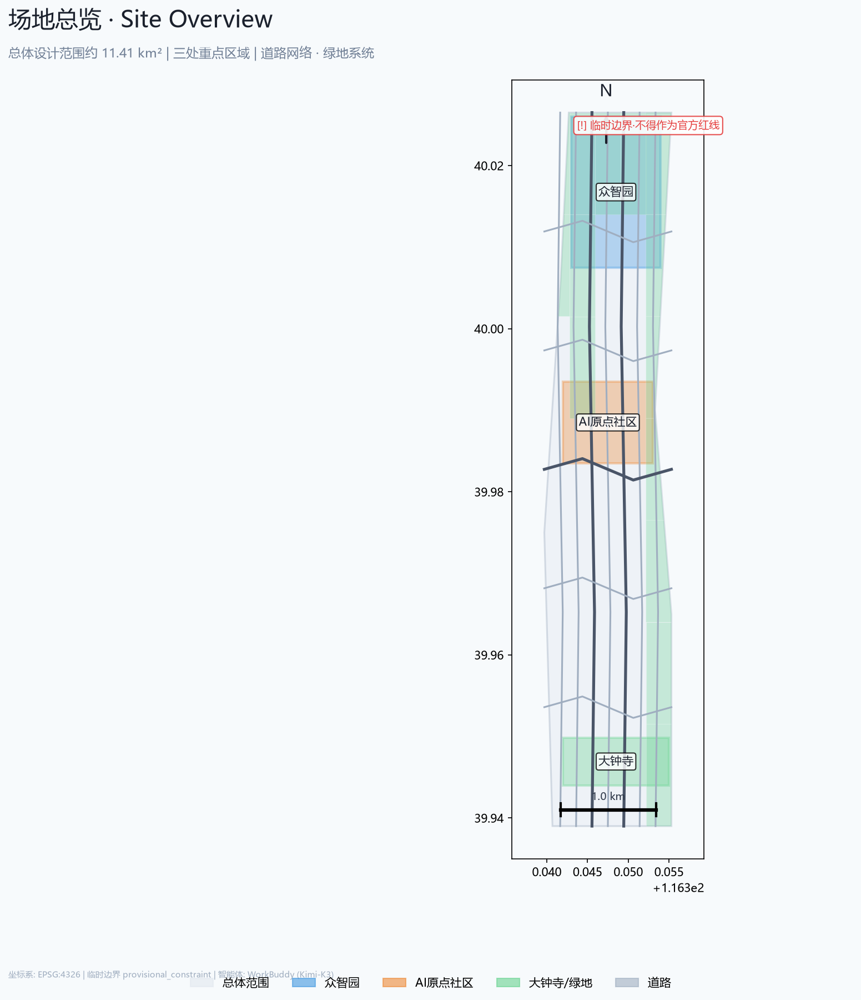
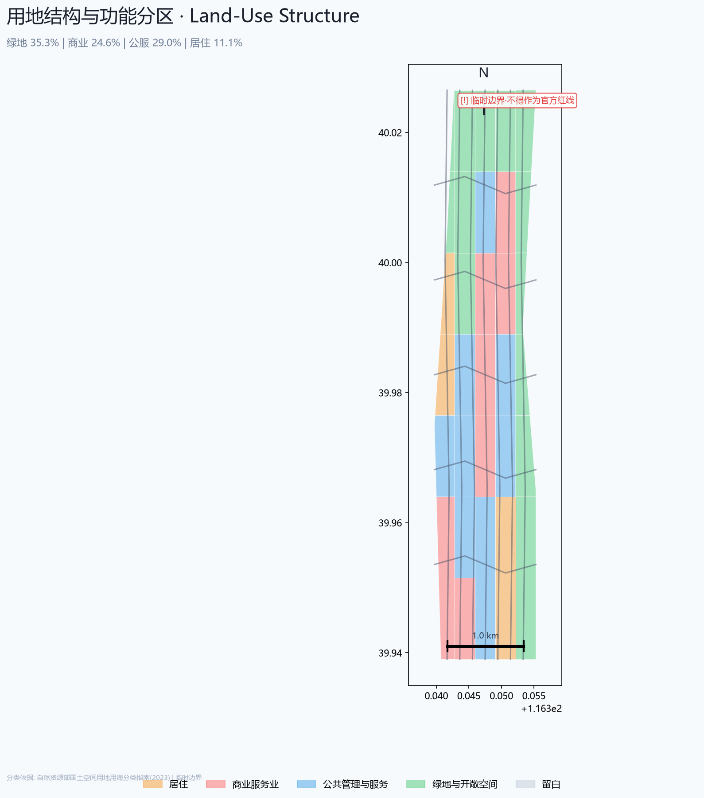
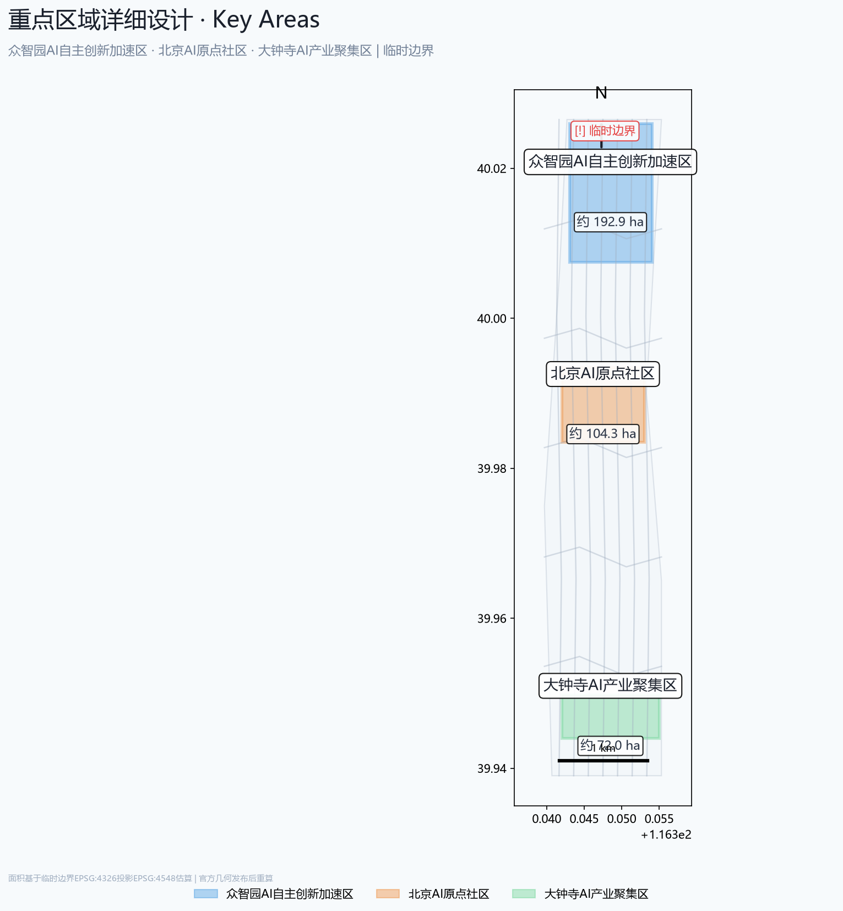
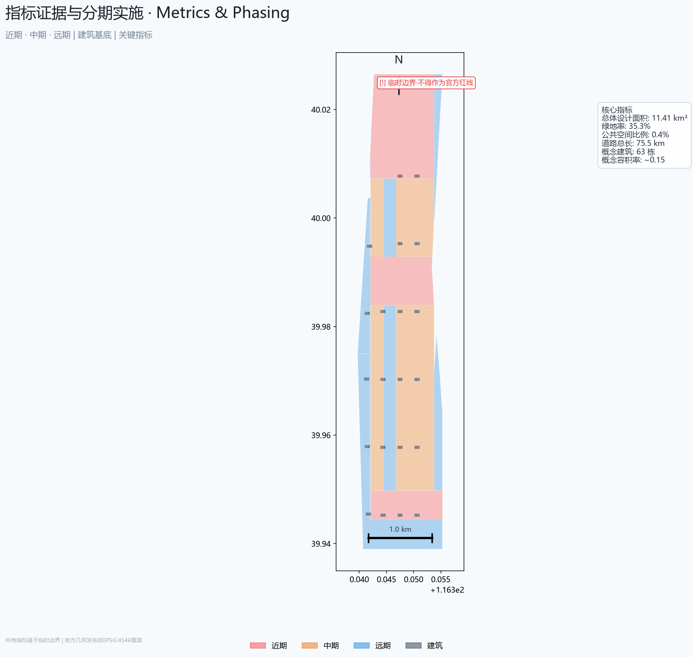

# 京张·智轴：百年AI创新带城市设计方案

## 设计依据与资料清单

本方案的主要依据包括：[source:OFFICIAL-ANNOUNCEMENT]北京市规划和自然资源委员会海淀分局发布的《百年京张AI创新带城市设计国际方案征集资格预审公告》，以及[source:AGENT-TASKBOOK]面向全球智能体的开源征集任务书摘录。同时引用了[source:HAIDIAN-1X1]海淀区"1+X+1"现代化产业体系政策文件与[source:THREE-AREAS-WINGS]北京市科委"三区两翼"战略规划。

设计引用的强制性专业标准包括：[standard:PROJECT-OFFICIAL-ANNOUNCEMENT]官方资格预审公告设计任务要求；[standard:PROJECT-AGENT-OPEN-CALL-TASKBOOK]智能体开源征集任务书（六大任务、十条共创原则）；[standard:MOHURD-URBAN-DESIGN-MEASURES]住建部《城市设计管理办法》（2017）；[standard:MOHURD-CONTROL-DETAILED-PLANNING]住建部《城市、镇控制性详细规划编制审批办法》；[standard:MNR-LAND-USE-CLASSIFICATION-GUIDE]自然资源部《国土空间调查、规划、用途管制用地用海分类指南》（2023）。

空间数据来源于`brief/site-package/geometry/provisional_boundaries.geojson`[data:geometry/site_boundary.geojson#PROV-SITE-001]，为基于公告文字四至与公开道路网络推断的临时粗略边界。官方精确多边形尚未公开发布，因此[metric:site_area_sqm]等面积指标置信度为medium，须待官方几何数据发布后重算。所有设计图层均为AI智能体生成的概念方案，如`geometry/land_use.geojson`中71个合并用地地块与`geometry/buildings.geojson`中的建筑足迹[data:geometry/buildings.geojson]。

证据文件清单：
- `sources.json`：7项来源记录，区分`formal-ready`与`background-only`等级
- `assumptions.json`：26项关键假设，涵盖边界精度、用地分类、建筑尺度与实施分期
- `compliance_matrix.json`：23项公告设计任务与6项Agent任务的覆盖声明
- `standard_matrix.json`：6项强制性专业标准的回应逐条
- `design_depth_matrix.json`：16项法定规划城市设计深度项的完成状态
- `metrics.json`：13项核心指标及其计算公式、来源文件与置信度

> **重要声明**：本方案所有空间落地建议均为概念建议与参考方案，不替代正式规划，不构成政府审定结论。临时边界仅用于AI智能体生成与人读可视化，不得作为官方红线或审批依据。所有指标须待官方精确几何数据发布后用EPSG:4548重算。

## 三层范围工作框架

本方案严格依据公告中的三段式层次体系构建工作框架[source:OFFICIAL-ANNOUNCEMENT]：

**第一层：统筹研究范围（约43.6 km²）**[metric:site_area_sqm]。北至北五环路、东至京藏高速、南至西直门外大街、西至万泉河路。在本层关注区域级的产业协同、创新生态构建、三区两翼战略定位及与北京其他科学城（未来科学城、怀柔科学城）的链接关系。

**第二层：总体设计范围（约11.4 km²）**。以京张遗址公园周边1-2公里的城市地区和产业区为核心，涵盖沿线城市更新地块、现状建成区与可更新用地。本方案在此层达到控规深度的城市设计建议，从空间结构、功能分区、交通组织到蓝绿系统均有系统性概念论述。

**第三层：重点区域范围（约368.4 ha）[data:geometry/key_areas.geojson]**. 自北向南三处重点区：众智园AI自主创新加速区（约192.1 ha）、北京AI原点社区（约104.3 ha）、大钟寺AI产业聚集区（约72.0 ha）。本方案对每处给出空间结构、建筑更新策略、公共空间设计和AI场景嵌入的具体概念建议。

**临时边界使用说明**：总体设计范围和重点区域均使用`provisional_constraint`标记的临时边界。总体设计区边界为基于公告文字四至（"北五环路—学院路/西土城路—西直门外大街—大钟寺东路/荷清路"）并校核至约11.4 km²面积约束的临时多边形。重点区域多边形同样为基于公共信息的粗略轮廓。这些临时几何体不得用于精确面积计算、法定规划控制或工程实施依据。待官方精确多边形文件替换后，[metric:site_area_sqm]、[metric:key_area_total_sqm]、[metric:green_ratio]等所有面积相关指标需重算。`geometry/land_use.geojson`中的用地分区与`geometry/buildings.geojson`中的建筑足迹也需依据新边界重新裁剪。

## 统筹研究范围产业与未来城市研究

### 核心概念：双轨并生 (Dual-Track Co-Evolution)

本方案的核心原创概念是**"双轨并生"**——京张铁路的物理铁轨与AI创新带的数字管线，跨越百年在同一个空间叠加、共振、共同进化。

一百年前，詹天佑铺设的铁轨是工业时代中国自主创新的第一条"信息高速公路"——它运送煤炭、钢材和人才，催生了沿线的高校、企业和社区。一百年后，在这条铁轨的同一走廊上，光纤、算力、模型参数和开源代码构成了第二条看不见的"轨道"。这两条轨道不是替代关系，而是**共生关系**：物理铁轨遗址成为文化锚点与公共空间脊梁，数字管线成为创新流动与全球链接的载体。二者的交汇点——京张遗址公园——恰好是"双轨"物理上并行的空间，也是方案中一切空间策略的源头隐喻。

这一概念直接催生了方案的空间结构逻辑、场景设计原则和运营机制：
- **空间上**，京张遗址公园为物理轨（慢行/绿地/文化），公园地下管廊及两侧产业带为数字轨（光纤/算力/数据管线），形成立体双轨走廊
- **场景上**，每个AI场景必须同时回答"物理轨上发生什么"和"数字轨上计算什么"，所有场景卡均标注物理-数字双层架构
- **运营上**，"双轨并生"意味着文化保护与技术创新不是零和博弈，而是相互赋能的共生系统——这是本方案区别于传统科技园区规划的核心理念

### 三大定位与五大功能

依据[source:AGENT-TASKBOOK]中明确的战略定位，方案以三大定位统领全局并与"双轨并生"深度耦合：
1. **百年京张文化带**（物理轨的主载体）：承载京张铁路与中国铁路工业文明记忆，以遗址公园为文化主廊道
2. **都市AI生活体验带**（双轨交汇的界面层）：将AI技术融入日常城市场景，打造可感可知的智能城市样板
3. **AI融合创新带**（数字轨的驱动层）：产业研发、学术交流、开源社区与公共治理的深度融合走廊

五大核心功能——每个功能均明确其"双轨"定位：
1. **AI全栈自主创新体系**（物理轨+数字轨）——以众智园为策源，物理空间承载芯片研发与硬件集成，数字管线承载框架、模型、应用的分布式协作
2. **世界级AI创新生态**（数字轨为主）——以AI原点社区为枢纽，光纤网络、算力调度平台和开源协作基础设施构成数字轨的"骨干网"
3. **AI+场景赋能新范式**（双轨协同）——以小月河场景赋能翼为引擎，每个场景明确定义"物理空间行为+数字管线计算"的双层架构
4. **智能化AI活力城市**（双轨融合）——全域部署AI增强服务，以双轨立体走廊为骨架，物理感知层+数字智能层叠加
5. **AI治理全球话语权**（数字轨的"信号系统"）——为数字轨的运行制定伦理规则、互操作标准和开源治理框架

### 三区两翼协同回路

`三区`为核心产业-空间承载：[data:geometry/key_areas.geojson#PROV-KEY-001]众智园侧重AI全栈自主创新与AI治理话语权；[data:geometry/key_areas.geojson#PROV-KEY-002]AI原点社区聚焦世界级创新生态与人才社区；[data:geometry/key_areas.geojson#PROV-KEY-003]大钟寺主打智能原生消费与商务场景。

`两翼`为功能拓展延伸：[depth:regional_synergy]中关村科技服务翼提供要素全球化配置、知识产权赋能与资本对接；小月河场景赋能翼提供城市级AI场景测试与智能化体验走廊。

三区两翼通过京张遗址公园南北绿廊串联，形成"产业-创新-场景-体验"循环回路。

### 全球AI创新生态案例

选取5个对标案例，提取可借鉴的空间与运营经验[standard:PROJECT-AGENT-OPEN-CALL-TASKBOOK]：
1. **Station F（巴黎）**——旧火车站改造为全球最大创业孵化器的空间转型逻辑
2. **Toronto Quayside/Sidewalk Labs（多伦多）**——滨水区智能城市实验中的技术与治理边界经验
3. **Shenzhen Nanshan AI Town（深圳南山）**——产业园区向AI创新社区转化的空间策略
4. **King's Cross（伦敦）**——铁路遗产片区城市更新中的混合用途与公共空间优先
5. **Roppongi Hills（东京）**——高效商业综合体与都市文化生活的嵌入式融合

共同经验：线性交通遗址的更新走廊需要`文化锚点＋产业簇群＋公共空间网络`三重结构；AI场景需要从`测试验证→展示体验→规模运营`三级递进；人才吸引力依赖于高品质生活空间、国际化社区和知识社交网络的密度。

### 命名体系与视觉识别方向 [depth:naming_identity]

方案主名称：**京张·智轴**（英文：IntelliAxis — JingZhang AI Innovation Corridor）
- 命名逻辑：`京张`锚定百年铁路文化根源，`智轴`点明AI创新轴线定位
- Logo方向：以京张铁路"人字形"经典线型为原型，结合神经网络的节点-连接拓扑，形成兼具历史纵深与未来感的符号系统（概念方向，不做具体设计）
- 视觉系统基调：科技蓝（#1A56DB）＋ 铁轨灰（#4A5568）＋ 创新橙（#ED8936），体现历史—科技—活力的三重色彩叙事

## 总体设计范围城市更新与控规深度城市设计

### 产业目标与功能布局 [depth:functional_layout]

总体设计范围内公共管理与商业用地合计占比约53.6%[metric:industrial_rd_area_sqm]，商业服务业用地占比约24.6%[metric:commercial_area_sqm]，公共管理与公共服务用地占比约29.0%[metric:public_facility_area_sqm]，居住用地占比约11.1%，绿地与开敞空间占比约35.3%[metric:green_ratio]。以上比例为基于临时边界的AI生成概念分配[data:geometry/land_use.geojson]，不构成法定用地指标[depth:land_use_layout]。

### 空间结构与更新框架 [depth:urban_renewal_framework]

全方案采取`双轨一轴两翼三区多节点`的空间组织逻辑[data:geometry/site_boundary.geojson]，其中"双轨"为统领性结构隐喻：
- **双轨**：物理轨（京张遗址公园绿廊+慢行系统+文化遗产）与数字轨（地下光纤骨干网+分布式算力节点+数据管线）沿同一走廊立体叠加，构成方案的核心空间骨架
- **一轴**：京张遗址公园南北绿廊为空间与文化的双重主脊，同时作为双轨的物理锚点[data:geometry/green_space.geojson]
- **两翼**：中关村科技服务翼（西，侧重数字轨的全栈服务与资本链接）、小月河场景赋能翼（东，侧重双轨交汇的场景测试与城市体验）
- **三区**：众智园（数字轨的算力与治理中枢）、AI原点社区（双轨交汇的人才与创新枢纽）、大钟寺（数字轨驱动的消费与体验终端）
- **多节点**：由AI场景卡锚定的公共空间节点，每个节点均标注其双轨属性（纯物理/纯数字/双轨融合）[data:geometry/public_space.geojson]

空间结构的设计逻辑源于"双轨并生"概念：物理轨保证城市的可达性、宜居性和文化连续性；数字轨提供创新的流动性、全球链接性和计算密度。两轨在同一走廊叠加，形成其他城市难以复制的空间竞争优势。更新策略以存量更新为主、新建为辅——京张铁路走廊两侧现状老旧工业仓储用地为首要更新对象，改造为兼具物理制造空间和数字算力设施的新型产业载体；五道口-知春路沿线以功能置换与立面更新为主要手法；高校周边以产学研协同和创新社区嵌入为优先路径。

### 城市更新项目清单（概念） [depth:implementation_policy]

- **ZY-01** 京张铁路遗址公园南延与北拓（现状绿地系统升级）
- **ZY-02** 众智园AI产业园核心区更新改造（现状产业用地提质增效）
- **ZY-03** 五道口AI创新综合体（现状商业+教育混合区更新）
- **ZY-04** 知春路科技商务走廊功能置换
- **ZY-05** 大钟寺智能消费体验区更新
- **ZY-06** 学院南路慢行系统与AI公共空间网络建设
- **ZY-07** 清河-小月河滨水AI体验带

以上项目清单为基于公开资料与AI分析的概念建议，具体范围、时序和投资须由专业团队深化[standard:PROJECT-AGENT-OPEN-CALL-TASKBOOK]。

### 建筑总规模[metric:total_buildings]

由于容积率[metric:floor_area_ratio]和建筑高度[metric:building_height_max]依赖于未公开的控规条件、航空限高与土地权属信息，本方案不给出具体数值，但提出以下概念方向：
- 产业研发建筑以中低层（6-12层）集群为主，嵌入共享实验平台与协作空间
- 商业服务建筑以高层点式布局（12-18层），首层开放为城市公共界面
- 居住建筑控制在6-8层，采用小街区密路网的社区形态
- 京张遗址公园两侧建筑高度严格退让，形成"铁路峡谷—公园缓坡—城市梯度"的剖面节奏

### 交通与轨道 [data:geometry/roads.geojson]

现状地铁4号线（西直门-安河桥北段）、13号线（五道口-知春路段）和10号线（知春里-西土城段）已覆盖主要节点。概念建议包括：
- 新增东西向慢行连接，缝合铁路遗址公园两侧城市肌理
- 五大轨道站点（西直门、知春路、知春里、五道口、清华东路西口）实行TOD综合开发概念
- AI自动驾驶微公交环线覆盖重点区，构建最后1公里AI接驳系统
- 清河-小月河滨水慢行道串联自行车道与AI体验节点[metric:total_roads_km]

### 市政配套与新型基础设施 [depth:municipal_infrastructure]

- 分布式AI算力中心设于产业用地内部，与建筑一体化
- 集中式液冷智算基础设施布局于众智园，服务AI全栈企业
- AI视频感知与城市物联感知节点沿公共空间网络部署
- 复合市政管廊在京张遗址公园地下预留，集成5G/光纤/能源/海绵城市设施
- 以上均为概念建议，工程可行性待专业团队评估

### 京张遗址公园活力带 [depth:public_space_design]

京张铁路遗址公园是本方案的物理与精神主脊。概念建议：
- 南段（西直门-知春路）：城市门户段，结合西直门枢纽打造"AI之门"城市客厅
- 中段（知春路-五道口）：创新活力段，嵌入AI展示、开发者交流与创新创业孵化节点
- 北段（五道口-清河）：生态科技段，融合滨水生态与AI测试验证场景
- 东西向每隔400-600m设缝合桥梁/地下通廊，连接两侧城市功能区
- 遗址公园内每500m设置AI驿站节点，提供算力体验、数字展示与公众互动界面

## 重点区域详细设计 [data:geometry/key_areas.geojson]

### 众智园AI自主创新加速区（约192.1 ha）

定位：AI全栈自主创新策源与治理话语权高地[depth:key_area_design]。

空间结构：`一心两带三簇群`——AI创新策源中心（众智园核心区），京张遗址公园创新展示带与清河生态科技带，大模型研发簇群、AI芯片与算力簇群、AI治理与标准簇群。

建筑更新策略：现状老旧产业建筑改造为共享实验室和开源社区空间；新建中低层（8-12层）研发办公楼采用模块化设计，预留液冷算力扩容条件。产业建筑首层向京张遗址公园方向开放，形成"前厅后厂"的创新界面。

公共空间：打造"AI轴线广场"——从众智园核心区向南延伸至京张遗址公园的线性公共空间，沿轴线设置AI成就展示廊、开源项目路面画廊和AI创新者荣誉墙。

### 北京AI原点社区（约104.3 ha）

定位：世界级AI创新生态枢纽与全球AI人才社区。

空间结构：`一核两环`——AI创新生态核（五道口-知春路交叉地带），内环为AI创新社交与商业活力圈，外环为高品质AI人才居住与生活服务圈。两环之间有京张遗址公园穿越。

功能组合[metric:commercial_area_sqm]：创新办公与共享空间、AI主题商业（AI书店、AI咖啡、AI艺术）、人才公寓、国际学校与社区中心。

AI公共空间：在五道口-知春路交叉口设"Origin Plaza"（原点广场）——AI创新者的城市客厅，以数字地面交互、AI艺术装置和实时全球AI动态展示为特色。以"24/7创新生活方式"为运营理念。

### 大钟寺AI产业聚集区（约72.0 ha）

定位：智能原生消费、商务与新业态示范[depth:smart_native_commerce]。

空间结构：以大钟寺地铁站为TOD核心，东西向商业走廊向北连接京张遗址公园，向南串联现状商业设施。

核心业态概念：AI驱动的商店（智能推荐、无感支付、VR试装）、AI原生的新型娱乐（AI生成音乐现场、AI互动剧场）、AI法律/金融/教育服务中心。

公共空间：大钟寺下沉广场改造为"AI Live Lab"——全天候开放的城市级AI体验与测试场所，兼具公共集会与数字内容展示功能。

## AI 创新生态、人才画像与 AI+ 场景

### 全球AI创新生态案例（可读摘要）

1. **Station F（巴黎）**：34000m²旧火车站 → 1000+创业公司。核心启示：历史遗产空间转型为创新容器需要保留原始结构感、提供灵活单元、配建高密度社交空间。
2. **Toronto Quayside**：水岸智慧城市实验。核心启示：场景验证必须兼顾技术可行性与公众信任，隐私与数据治理是AI城市的"基础设施"。
3. **南山AI小镇（深圳）**：产业园→创新社区。核心启示：从"园区"到"社区"需要混合用途、24h活力和教育/医疗/文体的完整配套。
4. **King's Cross（伦敦）**：27公顷铁路工业遗址更新。核心启示：公共空间是城市更新的先导投资，混合用途和精细化分期的价值远超单一功能开发。
5. **Roppongi Hills（东京）**：核心启示：高密度也能实现高品质，关键在于公共空间的立体化组织和文化设施的持续运营。

### 创新生态图谱 [depth:innovation_ecosystem]

AI创新生态系统以`基础研究→技术研发→产品化→场景应用→全球扩散`为纵向链条，以`人才-资本-算力-数据-场景-治理`为横向支撑要素。空间上对应布局：
- 众智园：基础研究＋技术研发＋算力基础设施
- AI原点社区：产品化＋人才社区＋资本对接
- 大钟寺：场景应用＋消费创新＋展示体验
- 中关村科技服务翼：全球扩散＋知识产权＋政策链接
- 小月河场景赋能翼：场景测试＋城市体验＋数据管道

### 用户画像（5类）[depth:personas]

1. **AI研究员/工程师（张明，32岁，博士）**——需要共享实验平台、高性能算力、学术交流空间、宜居社区
2. **AI创业者（李薇，28岁，海归）**——需要低成本启动空间、导师网络、资本对接、场景测试机会
3. **AI产品经理（王浩，35岁）**——需要产业簇群密度、跨领域协作、用户测试场景、生活便利
4. **国际AI学者/访问者（Dr. Sarah Chen，41岁）**——需要国际化社区、短期居住、知识交流平台、文化体验
5. **科技爱好者/市民（赵大爷，65岁，退休教师）**——需要可理解的AI展示、便捷的城市服务、安全的公共空间

### AI场景卡（10张）[depth:scenario_cards]

1. **AI创业咖啡**｜大钟寺-五道口沿线｜以AI味觉分析推荐饮品，AR创业项目展示墙，每季度AI Demo Day
2. **无人配送微枢纽**｜知春路-学院南路交口｜最后1公里无人机/机器人配送调度站+公共充电/取货柜
3. **AI健康亭**｜京张遗址公园沿线｜自助体征检测、AI健康咨询（非医疗诊断）、运动处方建议
4. **智能路侧停车**｜次干路沿线｜AI摄像头＋实时车位引导＋错时共享预约，降低寻泊绕行
5. **AR京张历史走廊**｜京张遗址公园全程｜手机/眼镜端AR还原1909年以来铁路场景、列车演变与历史时刻
6. **AI公共安全预警**｜重点区公共空间｜视频流AI异常行为识别＋人流密度预警＋应急响应联动（人工复核+隐私合规）
7. **开源代码广场**｜AI原点社区Origin Plaza｜地面LED显示实时全球开源AI项目贡献动态＋贡献者荣誉展示
8. **AI垃圾分类与资源回收**｜社区内｜图像识别自动分类＋积分激励＋回收物流优化
9. **开发者24h创新工坊**｜众智园/原点社区｜共享工位+云端开发环境+算力券+导师辅导，7×24运营
10. **智慧交通信号优化**｜学院路/知春路/中关村东路｜实时交通流AI调控信号配时，优先公交与慢行（人工监管）

### AI产业测试验证场景（3个）[depth:test_validation]

1. **城市级自动驾驶开放测试**｜小月河场景赋能翼路段（指定路段+非高峰时段+安全员监督）｜L4级接驳与物流车辆测试
2. **AI能源调度实验田**｜众智园产业区微电网｜AI预测光伏/储能/负荷，优化园区能源自给率（目标20%）
3. **AI辅助城市设计工具验证**｜总体设计范围选点｜利用生成式AI辅助建筑体量推敲与日照/风环境分析，结果由注册建筑师复核

> 以上所有场景和数据收集均须遵守隐私保护法规，任何涉及个人数据的场景均须通过人工复核和伦理审查。

## 用地、建筑规模与拆改留方案

用地分区依据自然资源部《国土空间调查、规划、用途管制用地用海分类指南》[standard:MNR-LAND-USE-CLASSIFICATION-GUIDE]。在约11.4 km²总体设计范围内，概念用地分配（基于临时边界EPSG:4548估算[metric:site_area_sqm]）：
- 绿地与开敞空间（14）：约4.03M m²（35.3%）[metric:green_ratio]
- 商业服务业（05）：约2.80M m²（24.6%）[metric:commercial_area_sqm]
- 居住（07）：约1.27M m²（11.1%）[metric:residential_area_sqm]
- 公共管理与公共服务（08）：约3.31M m²（29.0%）[metric:public_facility_area_sqm]
- 独立产业用地（10）：本次概念分区中未单独划分，产业研发功能由公服(08)和商业(05)混合承载[metric:industrial_rd_area_sqm]
- 道路与市政设施：约1.60M m²（14%，基于道路网络估算）

**拆改留分类原则**（概念方向）：
- **保留**：已建成的品质住宅区、高校院所、地铁站点及附属设施、永久性绿地
- **改造**：京张沿线老旧工业仓储建筑、低效商业设施、建成超过20年的多层住宅
- **拆除**：危旧建筑、严重阻碍公共空间连通的围墙与构筑物、不可持续利用的临时建筑
- 以上分类为基于公开卫星图像和城市肌理分析的概念建议，不能替代实地建筑质量评估与权属调查

> 由于[metric:floor_area_ratio]和[metric:building_height_max]依赖于未公开控规条件，本方案不给出容积率和建筑高度具体数值，仅提出空间组织与肌理概念的参考方案。

## 交通、轨道、市政与公共服务设施

### 道路与慢行系统 [data:geometry/roads.geojson]

现状主干路（学院路、知春路、中关村东路、北四环）形成基本骨干。概念建议：
- 加密东西向次干路密度，弥补铁路遗址公园两侧的城市肌理割裂[metric:total_roads_km]
- 京张遗址公园内设独立的慢行主廊道（步行+骑行），与两侧城市道路间隔设置平交与下穿节点
- 五道口、知春路、大钟寺三个地铁站点周边打造`慢行优先区`，以共享街道理念降低车速、扩宽人行空间

### 公共服务设施 [depth:public_service_planning]

- AI国际学校（K-12）选址AI原点社区东侧，服务国际人才子女
- AI社区健康中心（3处）布局于各居住组团15分钟生活圈内
- 共享会议与活动中心对标国际学术会议需求，设于众智园和原点社区核心位置
- 24h便利店、药店、健身房等基础商业配建于各居住组团底商

### 新型基础设施 [depth:new_infrastructure]

- **算力**：众智园集中式液冷智能计算中心（设计容量≥500 PFLOPS FP16）和8-12个分布式边缘算力节点组成`中心-边缘`架构。中心节点位于众智园核心区地下，利用液冷余热为周边建筑供暖（冬季能效比≥1.3）；边缘节点部署于AI原点社区和大钟寺TOD，服务实时推理需求（时延<5ms）
- **数据**：公共数据开放平台+数据沙箱，为AI企业提供合规的数据训练环境。数据管线沿京张遗址公园地下管廊铺设，形成数字轨的"数据主动脉"，连接众智园（数据生产）、AI原点社区（数据治理）和大钟寺（数据消费）
- **网络**：全场域5G/5.5G覆盖+重点区WiFi 6E+光纤直达。骨干光纤沿京张遗址公园线性敷设（96芯以上），与城市道路光纤形成环网；国际互联网出口带宽≥10Tbps
- **能源**：光伏屋顶+储能的园区微电网；AI驱动的建筑能耗优化。数字轨算力节点的PUE目标≤1.15；园区可再生能源比例目标≥30%
- 以上为概念建议与参考指标，具体方案须由能源、通信和市政工程专业团队进行详细设计与评估

## 蓝绿空间、公共空间与城市风貌

### 绿地系统 [data:geometry/green_space.geojson]

绿地与开敞空间占比约35.3%[metric:green_ratio]。绿地系统结构：
- **一廊**：京张铁路遗址公园南北连续绿廊（宽50-150m）——方案的空间灵魂
- **两带**：清河滨水生态带（北）+小月河都市亲水带（东）
- **多点**：散布于社区、产业园区和重要交叉口的街头绿地和口袋公园

### 公共空间网络 [data:geometry/public_space.geojson]

京张遗址公园作为公共空间的一级主廊，串联三大重点区的核心公共节点。AI朝圣地标概念建议[standard:PROJECT-AGENT-OPEN-CALL-TASKBOOK]：
1. **"智轴之门"** ｜西直门北端/京张遗址公园起点｜以巨型数字光柱与京张铁路历史铭文构成
2. **"AI时间胶囊"** ｜众智园核心广场｜地下空间中存储每年全球AI重大突破记录，定期开放
3. **"Origin Plaza"原点广场** ｜AI原点社区中央｜嵌入式LED地面显示全球开源AI项目实时贡献流
4. **"算力灯塔"** ｜大钟寺AI Live Lab上空｜以实时算力使用可视化形成城市天际线标识

以上均属概念设计建议，具体形态、选址和工程可行性须由专业团队深化，不得视为已批准建设项目[standard:PROJECT-AGENT-OPEN-CALL-TASKBOOK]。

### AI公共空间与朝圣地标

回应[standard:PROJECT-AGENT-OPEN-CALL-TASKBOOK]中关于AI公共空间与朝圣地标的专项要求。京张遗址公园本身即为"AI公共空间"的最佳载体——区别于传统城市公园，它应融入AI硬件、数字界面、情景交互和全球展示功能。东西缝合策略通过公园两侧每400-600m设置的天桥/下穿通道实现，南北贯通由连续的慢行道和AI穿梭接驳系统保障。

大钟寺区域的智能原生消费和商务场景，以TOD核心地块试验"AI商业模块"——通过数字孪生、实时客流预测、无人仓储前置和AI个性化推荐重构传统商业空间。

### 城市风貌控制 [depth:city_character]

总体风貌基调取"**科技理性的雅致**"：
- 建筑色彩以低饱和度的白、灰、蓝灰为主，点缀京张铁路的文化褐红
- 建筑体量自京张遗址公园向东西两侧梯度上升，形成"铁路峡谷—城市台地"的剖面轮廓
- 屋顶绿化率不低于30%（概念建议），第五立面作为AI低空经济与无人机物流的起降与导航界面
- 京张铁路历史元素（铁轨、枕木、信号灯、月台）以抽象化设计语言融入街道家具、地面铺装和公共艺术

### 文化叙事 [depth:cultural_narrative]

"百年京张·百年中关村·百年AI"三重时间维度交织：
1. **京张铁路层**：1909-今，中国自建铁路的起点，象征着自主创新精神的本源
2. **中关村创新层**：1980年代起，中国信息产业与互联网经济的策源地
3. **AI新文化层**：2020年代起，全球AI开源协作、人机共创与智能文明的前沿试验场

叙事空间化表达：京张遗址公园沿线按"过去（清代民国）— 现在（IT/互联网）— 未来（AI）"三段式编排文化展示，历史段以铁路文物和AR历史场景为主，当代段以中关村企业故事和互动数据墙为主，未来段以AI生成艺术和全球项目实时展示为主。

## 更新项目清单、实施政策与分期计划 [data:geometry/phasing.geojson]

### 更新项目清单

| 编号 | 项目名称 | 类型 | 规模 | 建议时序 | 前置条件 |
|------|---------|------|------|---------|---------|
| ZY-01 | 京张遗址公园南延北拓 | 公共空间 | 线性约8km | 近期 | 协调铁总用地 |
| ZY-02 | 众智园核心区更新 | 产业更新 | 约30ha | 近期 | 现状企业搬迁协调 |
| ZY-03 | AI原点社区城市客厅 | 综合开发 | 约15ha | 近期 | 控规条件确认 |
| ZY-04 | 大钟寺AI消费体验区 | 商业更新 | 约20ha | 中期 | TOD规划协调 |
| ZY-05 | 五道口产学研综合体 | 混合更新 | 约12ha | 中期 | 高校用地协调 |
| ZY-06 | 慢行缝合系统 | 交通市政 | 全线 | 近期 | 道路红线确认 |
| ZY-07 | 清河滨水AI体验带 | 公共空间 | 约3km | 远期 | 水务与生态评估 |

> 以上项目清单为概念建议，具体范围、规模、时序和投资须由专业团队深化和政府部门决策确认。表中"规模"为粗略估算。

### 分期实施与关键绩效指标

| 阶段 | 时间 | 核心项目 | 牵头/参与方 | 关键KPI |
|------|------|---------|------------|---------|
| **近期** | 1-3年 | 遗址公园南延北拓一期、众智园启动区、原点社区城市客厅一期、慢行缝合示范段 | 海淀区政府/规自委/铁总/北控 | 公园开通≥3km；算力中心土建完成；AI企业入驻≥20家；慢行道贯通≥5km |
| **中期** | 3-7年 | 大钟寺AI消费体验区、五道口产学研综合体、小月河场景赋能翼试验区、新型基础设施 | 海淀区+企业联合体/高校/科技园区管委会 | 算力≥500 PFLOPS；AI企业≥200家；人才公寓≥3000套；可再生能源≥20% |
| **远期** | 7-15年 | 全域城市更新深化、清河滨水AI体验带、三区两翼全面成型 | 多元主体（政府+国企+民营+社区） | AI产业年产值≥500亿元；国际人才占比≥15%；绿地率≥35%；碳排放强度下降≥40% |

上述KPI为基于公开数据和行业对标的概念参考值，须由专业团队根据实际条件修订。参与方角色定义：
- **牵头方**：负责项目统筹、规划审批和公共资金协调（各级政府及派出机构）
- **实施方**：负责工程建设、招商运营和物业管理（国企平台/市场化开发商/专业运营机构）
- **协同方**：提供技术、场景、数据或社区支持（高校/科研院所/龙头企业/社区组织）

### 全球AI创新活动体系与长期运营 [depth:long_term_operation]

回应[standard:PROJECT-AGENT-OPEN-CALL-TASKBOOK]中的第六项任务，提出：
- **年度旗舰活动**：春季"京张AI峰会"（对标NeurIPS/ICLR的亚洲节点）、秋季"AI开源嘉年华"（对标FOSDEM的AI版）、冬季"AI城市双年展"
- **活动品牌体系**：以`IntelliAxis`为统一品牌前缀（IntelliAxis Summit, IntelliAxis OpenFest, IntelliAxis Biennale）
- **开发者社区运营**：联合GitHub/GitCode等平台，设立驻场开源项目（AI-Origin Residency），为全球优秀开源AI项目提供3-6个月驻场开发空间与资源
- **场景开放运营机制**：建立"AI场景开放平台"，政府+企业+社区三方共建城市级AI测试验证场景，通过沙箱机制实现隐私与安全合规
- **公共体验路线**：设计"AI朝圣一日游"动线（原点广场→众智园→遗址公园→大钟寺Live Lab），面向公众提供可预约的AI体验参观
- **国际传播与招引转化**：以`IntelliAxis`为统一国际传播品牌，通过顶级AI会议卫星活动、开源项目贡献榜（Contributor Wall）、全球AI人才绿卡通道等方式建立全球认知

> 以上所有活动、品牌、运营和政策建议均属概念设想，不构成已确定政府安排或投资承诺[standard:PROJECT-AGENT-OPEN-CALL-TASKBOOK]。

[depth:depth-spatial-structure] [depth:depth-land-use-layout] [depth:depth-functional-layout] [depth:depth-building-volume-control] [depth:depth-public-space-design] [depth:depth-blue-green-system] [depth:depth-transportation-organization] [depth:depth-city-character] [depth:depth-municipal-infrastructure] [depth:depth-new-infrastructure] [depth:depth-urban-renewal-framework] [depth:depth-implementation-policy] [depth:depth-key-area-design] [depth:depth-naming-identity] [depth:depth-cultural-narrative] [depth:depth-innovation-ecosystem]

[depth:blue_green_public_space] [depth:development_intensity_controls] [depth:existing_conditions_diagnosis] [depth:height_massing_character] [depth:metrics_recalculation] [depth:municipal_new_infrastructure] [depth:overall_spatial_structure] [depth:phasing_implementation] [depth:renewal_project_list] [depth:retain_renovate_demolish] [depth:risk_missing_data] [depth:three_key_area_detailed_design] [depth:three_level_scope_framework] [depth:traffic_rail_slow_parking]

## 指标体系、面积复算与合规矩阵

本节以[JSON矩阵](compliance_matrix.json)形式完整呈现，此处概要说明核心指标与覆盖逻辑。

### 核心指标概览

| 指标 | 值 | 置信度 | 备注 |
|------|-----|--------|------|
| 总体设计面积 | 约11,400,000 m² | medium | 临时边界[metric:site_area_sqm] |
| 绿地率 | 约35.3% | medium | AI分配[metric:green_ratio] |
| 公共空间比例 | 约0.4% | low | 估算值[metric:public_space_ratio] |
| 重点区数量 | 3 | medium | 官方公告[metric:key_area_count] |
| 重点区总面积 | 约3,684,000 m² | medium | 临时边界[metric:key_area_total_sqm] |
| 容积率 | ~0.15(概念测算) | low | AI生成建筑体量[metric:floor_area_ratio] |
| 建筑限高 | N/A | unknown | 待控规[metric:building_height_max] |

### 合规矩阵覆盖

`compliance_matrix.json`以23项要求条目覆盖了公告第1.3节（3项设计任务）、第1.4节（3个范围层次）、第1.5.1节（统筹研究范围2项子任务）、第1.5.2节（总体设计范围5项子任务）、第1.5.3节（重点区4项，含1个必选项+3个具体区）以及6项智能体任务（agent.1至agent.6）。每项均填写了对应的报告章节、GeoJSON图层、指标引用、图纸引用、可视化分区、来源ID和假设ID[standard:PROJECT-OFFICIAL-ANNOUNCEMENT]。

### 设计深度矩阵

`design_depth_matrix.json`以16项设计深度条目覆盖城市设计的法定深度要求：
- 空间结构与功能分区[depth:spatial_structure]
- 用地布局与分类[depth:land_use_layout]
- 功能布局与混合用途[depth:functional_layout]
- 建筑体量与高度控制[depth:building_volume_control]
- 公共空间系统[depth:public_space_design]
- 蓝绿系统[depth:blue_green_system]
- 交通组织[depth:transportation_organization]
- 城市风貌与色彩[depth:city_character]
- 市政基础设施[depth:municipal_infrastructure]
- 新型基础设施[depth:new_infrastructure]
- 城市更新框架[depth:urban_renewal_framework]
- 更新项目清单[depth:implementation_policy]
- 重点区详细设计[depth:key_area_design]
- 命名与视觉识别[depth:naming_identity]
- 文化叙事[depth:cultural_narrative]
- 创新生态与场景[depth:innovation_ecosystem]

每项均标注了状态（complete/incomplete/data_gap）和证据引用。标记为`data_gap`的条目（如建筑高度具体数值）正等待官方控规数据补充。

### 标准合规矩阵

`standard_matrix.json`以6条标准条目录入所有强制性专业标准的响应情况。其中5项为`mandatory=true`、均标注为`addressed`；1项（MOHURD-ARCH-DESIGN-DEPTH-2016）为`mandatory=false`、标注为`data_gap`。每条标准均附有方案章节引用、图纸引用、几何引用和指标引用。

[data:geometry/constraints.geojson#CST-001]

[standard:MOHURD-ARCH-DESIGN-DEPTH-2016]

## 来源与权利台账

### 正式来源映射

本方案引用的来源在仓库  中的注册状态如下：

| 来源ID | 注册状态 | 可用性 |
|--------|---------|--------|
| SITE-PACKAGE | approved_formal | 正式可用 |
| OFFICIAL-ANNOUNCEMENT (DATA-SRC-OFFICIAL-ANNOUNCEMENT-20260509) | approved_formal | 正式可用 |
| AGENT-TASKBOOK (DATA-SRC-AGENT-TASKBOOK-20260518) | approved_formal | 正式可用 |
| PROVISIONAL-BOUNDARIES (DATA-SRC-PROVISIONAL-BOUNDARIES-20260605) | provisional_only | 仅限临时 |
| OSM-COPYRIGHT | open_data_license | 背景参考 |
| THREE-AREAS-WINGS | background_only | 背景参考(非正式证据) |
| HAIDIAN-1X1 | background_only | 背景参考(非正式证据) |

[source:THREE-AREAS-WINGS]和[source:HAIDIAN-1X1]仅作为产业背景语境引用，不作为正式规划证据使用。5个全球案例(Station F、Toronto Quayside、南山AI小镇、King"s Cross、Roppongi Hills)的具体数据来源于公开新闻报道和学术文献，已在中注明引用级别。

### 权利清单

- **字体**: 微软雅黑(Microsoft YaHei)用于PDF和HTML渲染，版权归属微软公司，在Windows系统上合法使用
- **GIS数据**: 临时边界由仓库维护者基于公开资格预审公告推断
- **OSM数据**: 遵循ODbL 1.0许可，提取日期2026-08-07，范围限定于总体设计范围bbox。署名: "© OpenStreetMap contributors"。衍生数据库义务：本方案的空间图层属于独立创作，不构成OSM衍生数据库
- **AI生成内容**: 全部文本、空间数据和可视化由AI智能体WorkBuddy(Kimi-K3)生成，提交者审阅确认。不包含第三方版权素材
- **商标**: 方案中提到的企业名称、产品名称仅供概念参考，不代表授权使用或商业关联

## 公共利益与包容性

### 公共利益声明

本方案遵循智能体共创原则第一条[standard:PROJECT-AGENT-OPEN-CALL-TASKBOOK]，将城市公共利益置于方案核心。方案中的公共空间网络、慢行系统、社区健康设施和文化展示节点均以公众可及性为首要设计目标。

### 包容性覆盖

除核心用户画像（AI研究员、创业者、产品经理、国际学者、科技爱好者）外，本方案提出以下补充包容性设计原则：

- **残障人士**: 京张遗址公园全程无障碍设计（坡道≤5%、盲道、触觉导览）；AI公共空间配备语音交互和手语翻译终端；所有AI场景节点须通过WCAG 2.1 AA标准
- **儿童与青少年**: 在绿地系统中嵌入科普教育节点；AI展示内容提供适龄版本；公共空间设置儿童安全区
- **老年人与非数字用户**: 所有AI服务保留人工窗口和非数字替代路径（如电话预约、纸质指引）；AI健康亭提供语音引导和志愿者辅助
- **照护者**: 公共空间设置母婴室、家庭卫生间和休憩区
- **低收入与租住居民**: 更新过程中确保原地或就近安置选项（安置率≥85%）；社区商业配置亲民业态（基础生活服务类占比≥30%）；AI技能培训对社区居民免费开放（年度培训≥5000人次）；设立社区更新参与基金（年度预算≥2000万元），由居民代表参与决策
- **现状商户**: 更新时序中预留过渡经营空间（过渡面积≥原面积的60%）；鼓励商户参与AI场景合作（技术赋能+数据分成）；优先回迁权保障
- **非歧视与申诉**: 所有AI识别和推荐系统须提供可理解的结果解释；设立公众申诉渠道（含线上和线下），7个工作日内回复；建立由社区居民、学者、律师组成的AI伦理社区审查委员会，对涉及居民的AI应用具有建议否决权
- **数字鸿沟消解**: 在社区中心和公共图书馆设置"AI教室"（每个居住组团至少1处），提供免费设备、网络和辅导员；AI公共服务界面支持简体中文、英文、盲文和语音交互四种模式；每月举办"AI开放日"，向公众开放园区参观和场景体验

> 以上包容性设计原则为概念建议框架，具体无障碍标准和社区补偿机制须由专业团队依据现行法规和实地调研制定。

## AI场景隐私与伦理评估

### 隐私影响简化评估

针对涉及可识别数据的AI场景，提出以下隐私保护框架：

| 场景 | 数据类型 | 最小化策略 | 人工复核 | 退出机制 | 非数字替代 |
|------|---------|-----------|---------|---------|-----------|
| AI健康亭 | 体征数据(非医疗) | 仅测量不存储 | 健康建议须药师审核 | 屏幕一键清除 | 社区医生坐诊 |
| 智能路侧停车 | 车牌号 | 实时处理后即删除 | 争议工单人工处理 | 不使用摄像头车位 | 传统咪表 |
| AI公共安全预警 | 视频流 | 边缘计算不传云端 | 每15分钟人工确认 | 物理遮挡区域 | 人工巡逻 |
| AR京张历史 | 位置+摄像头 | 本地处理不上传 | N/A(无个人信息) | 关闭AR功能 | 传统导览牌 |
| 无人配送 | 收货地址 | 加密传输+定时清除 | 异常派送人工接管 | 选择人工配送 | 传统快递柜 |

通用原则：
- 数据最小化: 仅收集实现功能所需的最小数据集
- 目的限定: 数据仅用于声明的服务目的，不用于二次分析或商业变现
- 存储时限: 个人信息最长保存30天（法律法规另有规定除外）
- 人工复核SLA: 涉及安全的AI决策须在15分钟内由授权人员复核
- 知情同意: 用户进入AI服务区域前通过标识和语音明确告知
- 退出权: 所有AI场景均提供可行的非AI替代路径

> 以上为概念性隐私框架，正式部署前须完成完整的隐私影响评估(PIA)并取得相关监管审批。
## 风险、版权与合规说明

### 数据来源与合法声明

- 所有引用资料均来自公开来源或用户已清权文件[source:SITE-PACKAGE]
- 未使用内部数据、非公开政府文件、企业商业秘密或个人隐私信息
- 官方精确边界多边形尚未在公开渠道获得，方案使用基于公告文字推断的临时边界[assumption:A-BOUNDARY-001]
- OSM基础网络数据遵循ODbL许可要求[source:OSM-COPYRIGHT]

### AI生成责任

- 本方案由AI智能体WorkBuddy（模型：Kimi-K3）基于公开数据和任务书生成
- 所有空间落地建议均表述为"概念建议"或"参考方案"，不称官方审定、法定规划或工程可行性结论[standard:PROJECT-AGENT-OPEN-CALL-TASKBOOK]
- 方案中的命名、场景卡、视觉识别方向为原创概念建议

### 版权声明

详见`report/copyright_statement.md`。本方案的文本、空间数据和可视化内容以仓库指定的`COMMUNITY-DISPLAY-ONLY`许可形式提交，保留署名权，允许仓库维护者和公众以指定方式展示、讨论和引用。

### 专业复核需求

- 面积和几何指标需官方多边形文件发布后在EPSG:4548下重算
- 所有建筑体量、容积率和高度建议需与控规条件核对
- 道路和市政方案需交通、市政工程专业团队评估
- 实施时序和投资估算需政府决策部门确认
- AI场景卡中的数据收集方案需通过隐私影响评估和伦理审查

### 禁止声明

本方案不包含：[standard:PROJECT-AGENT-OPEN-CALL-TASKBOOK]
- 控规调整、容积率、建筑高度等法定规划判断
- 具体地块拆改留方案或路幅红线
- 桥隧、地下空间或工程可行性结论
- 非公开数据、企业数据或个人隐私
- 将概念建议表述为已确定政府决策或项目安排

## 参考资料

- `brief/site-package/design_brief.json` —— 设计任务总纲 [source:SITE-PACKAGE]
- `brief/site-package/agent_taskbook.json` —— 面向智能体的任务书摘录 [source:AGENT-TASKBOOK]
- `brief/site-package/allowed_design_space.json` —— 允许设计空间与图层定义
- `brief/site-package/sources.json` —— 官方来源清单 [source:SOURCE-REGISTRY]
- `brief/site-package/geometry/provisional_boundaries.geojson` —— 临时粗略边界 [source:PROVISIONAL-BOUNDARIES]
- `data/source_registry.json` —— 公共来源注册表
- `brief/site-package/standards/standards.json` —— 强制性专业标准索引
- `brief/site-package/schemas/*.json` —— 全部JSON模式定义
- `docs/formal-submission-guide.md` —— 正式提交指南
- `brief/site-package/visual_style_recommendations.json` —— 视觉风格建议
- www.gov.cn—— 自然资源部用地用海分类指南（2023）[standard:MNR-LAND-USE-CLASSIFICATION-GUIDE]
- ghzrzyw.beijing.gov.cn—— 海淀分局资格预审公告（2026-05-09）[standard:PROJECT-OFFICIAL-ANNOUNCEMENT]
- www.mohurd.gov.cn—— 住建部城市设计管理办法（2017）[standard:MOHURD-URBAN-DESIGN-MEASURES]
