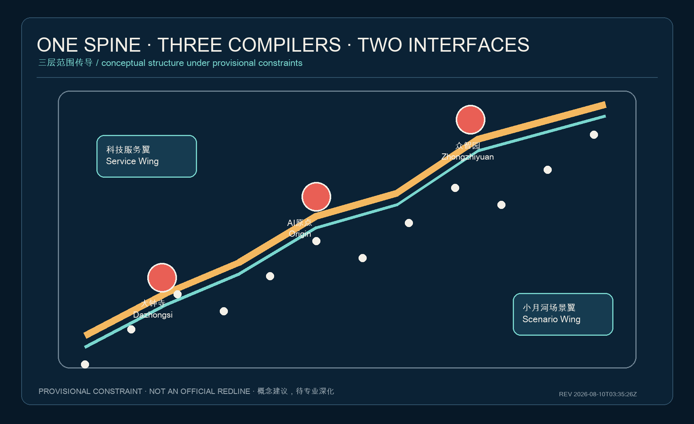
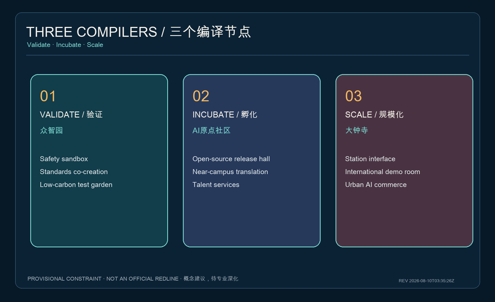
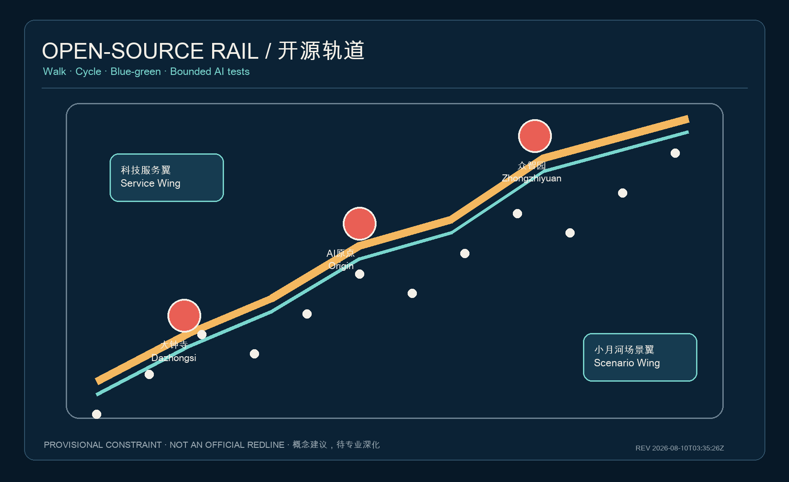
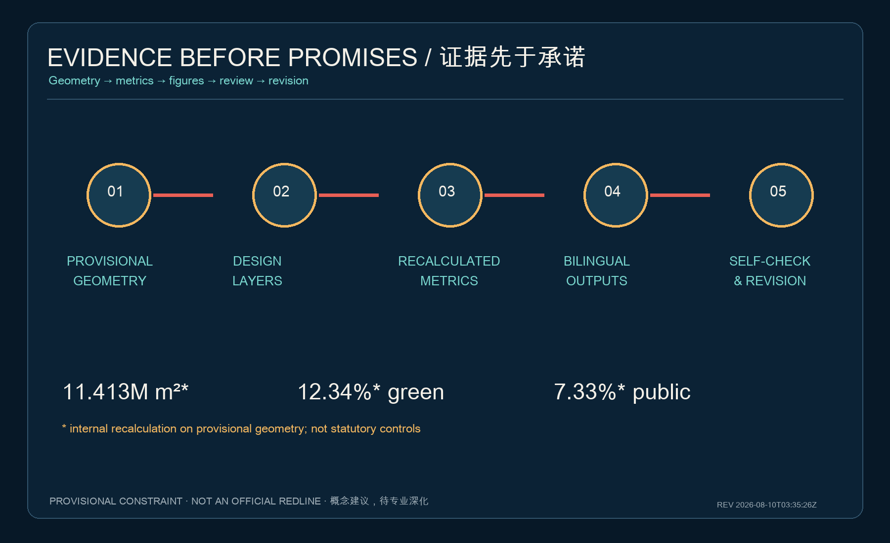

# RailMind Commons: An Open Urban Operating System for the Centennial Jing-Zhang AI Belt

## Design Basis and Source List

This proposal treats the Jing-Zhang railway heritage as walkable, testable, and continuously operated civic infrastructure—not as decoration for another technology park. Its basis is the official prequalification announcement, the Agent taskbook, the site package, the public source registry, and local snapshots of professional standards [source:OFFICIAL-ANNOUNCEMENT] [source:AGENT-TASKBOOK] [standard:PROJECT-OFFICIAL-ANNOUNCEMENT]. The site and three key-area geometries are repository-provided provisional rough constraints. They support concept generation and intake checks only, not official redlines, statutory planning, or precise area claims [data:geometry/site_boundary.geojson#SITE-001]. All layers and metrics must be recalculated when official geometry arrives.

The design principles are “heritage as spine, open source as law, scenarios as evidence, and everyday life first.” Every spatial move is a conceptual reference for professional development. FAR, height, density, setbacks, ownership, and engineering alignments remain pending official data [depth:existing_conditions_diagnosis].

## Three-Level Scope Framework

The 43.6 km² coordinated research area frames regional innovation; the roughly 11.4 km² overall design area organizes renewal, mobility, blue-green systems, and industry; and the roughly 368.4 ha key-area scope tests spatial, scenario, and operating mechanisms [metric:site_area_sqm] [depth:three_level_scope_framework]. “One Spine, Three Compilers, Two Interfaces, One Hundred Nodes” transfers decisions across the three levels: the heritage park is the open-source rail; Zhongzhiyuan, the AI Origin Community, and Dazhongsi compile validation, incubation, and scaling; the Zhongguancun service wing and Xiaoyuehe scenario wing provide resources and real-city tests.

This structure creates no new redline. It translates the taskbook’s “three areas and two wings” into a collaborative urban-design protocol [source:AGENT-TASKBOOK] [data:geometry/key_areas.geojson#PROV-KEY-001].

## Coordinated Research Area: Industry and Future City Research

The ecosystem follows a research–open-source–validation–incubation–scaling–public-feedback loop. Reference mechanisms include university adjacency at MIT Kendall Square, translation at Toronto MaRS, shared services at Station F, real-district testing at Helsinki Jätkäsaari Mobility Lab, mixed-use renewal at Barcelona 22@, content-industry clustering at Seoul DMC, and park-community linkage at Singapore one-north. These are mechanism references only and require local professional and rights-holder verification.

For Jing-Zhang, the proposal uses public test permits, shared evaluation facilities, near-campus incubation, enterprise-service interfaces, contributor reputation, and resident feedback—not copied park forms. Full-stack innovation is validated at Zhongzhiyuan, incubated at the Origin Community, tested along Xiaoyuehe, experienced along the heritage park, and made internationally legible through public audit [standard:PROJECT-AGENT-OPEN-CALL-TASKBOOK] [depth:overall_spatial_structure].

## Overall Design Area: Urban Renewal and Regulatory-Plan-Level Urban Design

Renewal follows “retain useful structures, open ground floors, stitch breaks, then assess increments,” rather than wholesale demolition. Land-use geometry fully partitions the provisional boundary for internal recalculation; the building layer is demonstrative and makes no parcel-specific demolition claim [data:geometry/land_use.geojson#LU-001] [data:geometry/buildings.geojson#BLDG-001] [depth:land_use_layout].

Three interfaces organize the plan: a public-knowledge edge facing railway heritage, an everyday-service edge facing neighborhoods, and a controlled-test edge facing industry. Development intensity, height, and density remain pending official regulatory conditions [standard:MOHURD-CONTROL-DETAILED-PLANNING] [depth:development_intensity_controls].

## Detailed Design of Key Areas

Zhongzhiyuan is the “validation compiler,” with model and robotics safety sandboxes, a standards co-creation hall, and a low-carbon test garden along the Qinghe. The AI Origin Community is the “open-source incubator,” stitching campus, park, and neighborhood through slow mobility, a release hall, shared evaluation benches, and talent services. Dazhongsi is the “scaling interface,” combining station-area walkability, intelligent-terminal display, international demo space, compliant data services, and urban commerce [data:geometry/key_areas.geojson#PROV-KEY-001] [data:geometry/key_areas.geojson#PROV-KEY-002] [data:geometry/key_areas.geojson#PROV-KEY-003].

All three share a scenario protocol: admission, time-boxed testing, public feedback, independent evaluation, and exit or expansion. Roads, buildings, waterways, fire safety, and ownership require professional development [depth:three_key_area_detailed_design].

## AI Innovation Ecosystem, Personas, and AI+ Scenarios

Five personas guide the work: open-source developers; start-ups; leading enterprises and international visitors; university students and researchers; and nearby residents including older and disabled users. Each receives a spatial response, a service, and a right to opt out of algorithmic mediation [standard:BARRIER-FREE-ENVIRONMENT-LAW].

Ten scenario cards are: (1) open-model evaluation station (industry validation); (2) robot co-mobility test loop (industry validation); (3) edge-computing and low-carbon dispatch bench (industry validation); (4) accessible AI wayfinding; (5) multilingual heritage guide; (6) near-campus translation copilot; (7) enterprise compliance desk; (8) community health, education, and legal navigation; (9) human-reviewed event-flow desk; and (10) contributor honor graph. Each records users, minimum data, human review, spatial boundary, operator, and exit mechanism. The first three are bounded tests, not approved operations [standard:GENERATIVE-AI-INTERIM-MEASURES] [data:geometry/public_space.geojson#PUBLIC-001].

The civic contract defaults to anonymous or aggregated data, prohibits persistent face-based tracking, retains human review for consequential decisions, provides emergency shutdown, and explains results and complaints channels.

## Land Use, Building Scale, and Retain-Renovate-Demolish Strategy

Four conceptual land-use families—innovation R&D, public open space, industry services, and community support—form a gap-free partition [data:geometry/land_use.geojson#LU-001] [standard:MNR-LAND-USE-CLASSIFICATION-GUIDE]. Buildings follow “retain structure, open ground floor, add services, and limit increments.” Safety, ownership, heritage, energy, and utilization must be professionally assessed before classification. The building footprint is demonstrative; total floor area, FAR, density, height, and parcel decisions remain undetermined [metric:building_footprint_area_sqm] [depth:retain_renovate_demolish].

## Transport, Rail, Municipal Infrastructure, and Public Services

The open-source rail is first a continuous, safe, and legible walking and cycling space. Actions include diagnosing ring-road breaks, station last-mile links, campus–park interfaces, time-separated low-speed robots, bicycle order, and end-to-end accessibility. AI detects conflicts and assists navigation; it does not replace transport approval [data:geometry/roads.geojson#ROAD-001] [depth:traffic_rail_slow_parking].

Municipal infrastructure uses plug-in “urban compute cabins” combining edge compute, energy metering, environmental sensing, and emergency shutdown. Energy, fire safety, cybersecurity, privacy, and operator responsibility must be verified before deployment [data:geometry/constraints.geojson#CONSTRAINTS] [depth:municipal_new_infrastructure].

## Blue-Green Network, Public Space, and Urban Character

The heritage park, Qinghe, and Xiaoyuehe form a low-carbon mobility and sponge-space framework. Provisional limits remain low-contrast dashed lines; continuous paths, east–west stitches, dwell nodes, and key-area interfaces carry visual priority [data:geometry/green_space.geojson#GREEN-001] [metric:green_ratio] [metric:public_space_ratio].

Three pilgrimage landmarks are proposed: the Qinghuayuan “Time Switch,” narrating engineering and open science; the Origin Community “Open-Source Signal Box,” displaying consented and verifiable contributions; and the Dazhongsi “World-Model Platform,” hosting international demos and public dialogue. The honor system displays voluntary, verifiable contributions and never substitutes commercial ranking for public value [standard:MOHURD-URBAN-DESIGN-MEASURES] [depth:blue_green_public_space]. A double railway line branching like code forms the RailMind Commons identity without using unauthorized corporate marks.

## Renewal Projects, Implementation Policy, and Phasing

Near-term concept pilots prioritize a walkability audit, open-scenario protocol, movable contribution kiosks, and three bounded tests. Medium-term work—only after regulatory, ownership, and engineering confirmation—addresses station interfaces, open ground floors, and blue-green stitching. Long-term work forms a cross-area operating alliance and annual evaluation [data:geometry/phasing.geojson#PHASE-001] [depth:phasing_implementation].

An annual cycle publishes urban challenges in spring, runs controlled tests in summer, holds a Global AI City Week in autumn, and issues evaluation and exit lists in winter. Problem claims, data cards, resident co-review, and reproducible records become community assets. Events, funding, policy, and investment are suggested mechanisms, not government commitments.

## Metrics, Area Recalculation, and Compliance Matrix

Known values are recalculated from submission geometry: provisional site area is about 11.413 million m², conceptual green ratio about 12.34%, conceptual public-space ratio about 7.33%, and key-area count is three. They are internal consistency checks, not official area or statutory controls [metric:site_area_sqm] [metric:green_ratio] [metric:public_space_ratio].

FAR, height, density, and setbacks remain unknown. The compliance matrix links every announcement task and all six Agent tasks to chapters, geometry, drawings, and checks; the standards and design-depth matrices preserve the exhaustive audit trail [depth:metrics_recalculation].

## Risk, Copyright, and Compliance

The first risk is missing official geometry, regulatory controls, building conditions, ownership, roads, utilities, heritage, and flood data; all spatial results are therefore conceptual suggestions under provisional constraints. Algorithmic bias, privacy harm, failure, and vendor lock-in are mitigated through minimum data, human review, open interfaces, opt-out, and independent evaluation. Cultural and image rights are managed by using original diagrams, local fonts, and cleared repository text only [source:SITE-PACKAGE] [depth:risk_missing_data].

The proposal claims no official approval, engineering feasibility, secured investment, or confirmed event. PDFs, HTML, and figures are explanation layers; GeoJSON, JSON, and source records form the audit layer.

## References

Primary references include the official prequalification announcement, Agent taskbook, site package, public source registry, Measures for Urban Design Administration, regulatory-plan procedures, land-use classification guidance, accessibility law, and interim generative-AI measures. Full provenance, licenses, dates, and limitations are recorded in `sources.json` [source:SOURCE-REGISTRY].

---

Package revision / 成果修订时间：2026-08-10T03:35:26Z
