# Jingzhang New Track: AI Open Creation City

**Positioning: turn a century-old railway into next-generation innovation infrastructure.** The proposal links railway heritage, university research, enterprise R&D, community life, and public space through a walkable and testable open-innovation spine. Every spatial move is a conceptual recommendation for professional development, not a statutory plan, engineering conclusion, or government commitment.
## Design Basis and Source List

The evidence base combines the official call, the Agent taskbook, the repository site package, the public source registry, and a user-provided professional case library. Repository geometry is currently provisional and may support concept generation and topology review only [source:OFFICIAL-ANNOUNCEMENT] [source:SITE-PACKAGE] [depth:existing_conditions_diagnosis]. The local case library is used for method transfer rather than republication: headquarters campuses inform R&D organization, competition projects inform drawing hierarchy, and low-carbon references inform blue-green and operational metrics. GeoJSON is the spatial authority, metrics.json is the recalculation layer, and the three matrices carry exhaustive compliance. Official boundary, regulatory, ownership, utility, heritage, and engineering data remain incomplete; affected quantities and alignments must be recalculated when cleared data are released.

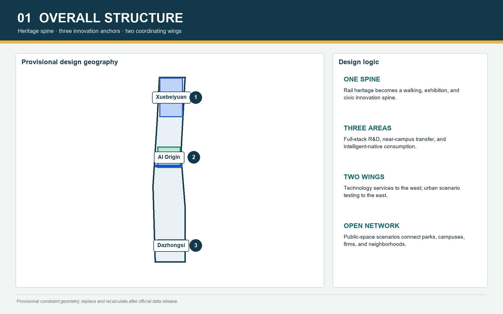

## Three-Level Scope Framework

The framework progresses from coordinated-area research, to overall urban design, to detailed design of three key areas. The regional level structures industry, talent, service, and city-life chains; the overall level translates them into land use, mobility, public space, renewal, and facilities; the key-area level tests spatial and operational specificity [standard:PROJECT-OFFICIAL-ANNOUNCEMENT] [depth:three_level_scope_framework]. The proposed structure is one heritage-and-AI spine, three innovation districts, two coordinating wings, and a network of public scenarios. The wings describe service relationships rather than new development boundaries. Submitted layers share one provisional boundary and must be rebuilt and recalculated in EPSG:4548 when official polygons arrive [data:geometry/site_boundary.geojson#SITE-001] [metric:site_area_sqm].

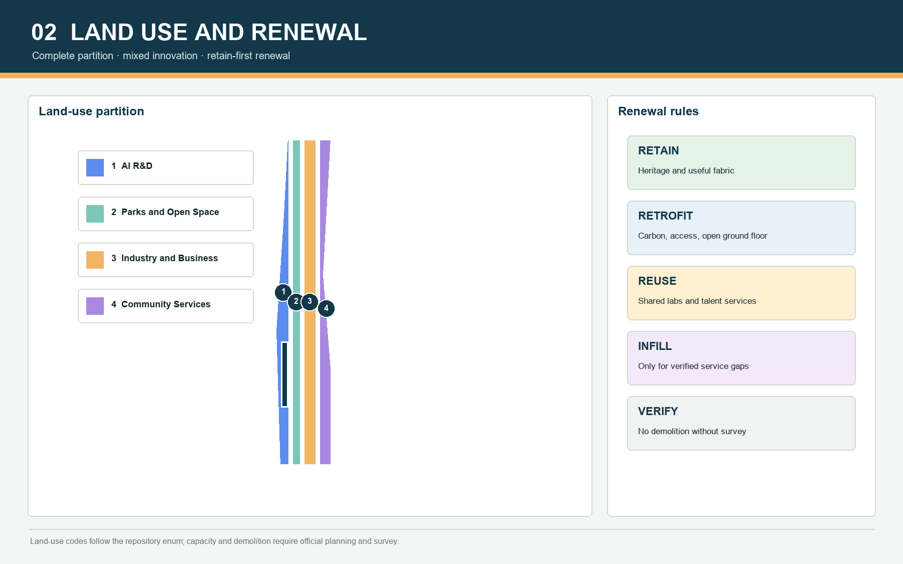

## Coordinated Research Area: Industry and Future City Research

The industry strategy is an innovation cycle rather than a tenant list. The north focuses on models, algorithms, safety, and standards; the middle on university transfer, open-source collaboration, incubation, and talent services; the south on intelligent devices, agent applications, content, and global presentation. Seven transferable ecosystem cases connect each program to a spatial carrier, opening mechanism, governance boundary, and evaluation method [source:AGENT-TASKBOOK] [standard:PROJECT-AGENT-OPEN-CALL-TASKBOOK]. Future-city form uses adaptable ground floors, shared courtyards, continuous walking, low-carbon landscape infrastructure, and all-day public service. Regulatory intensity and municipal capacity remain pending official confirmation [depth:overall_spatial_structure].

## Overall Design Area: Urban Renewal and Regulatory-Plan-Level Urban Design

The overall design partitions the provisional site into a complete, gap-free land-use structure using official land-use codes, while project labels describe AI R&D, near-campus innovation, heritage public space, and intelligent-device activity [standard:MNR-LAND-USE-CLASSIFICATION-GUIDE] [data:geometry/land_use.geojson#LU-001]. Renewal is organized as retain, retrofit, adaptive reuse, selective infill, and pending survey. No parcel-level demolition claim is made without building survey, ownership, structural, and heritage evidence [depth:retain_renovate_demolish]. Station nodes may explore mixed intensity, while the heritage spine keeps permeability and avoids continuous bulky frontage. Heights, FAR, density, setbacks, and utility loads are data gaps [depth:development_intensity_controls] [depth:height_massing_character].

## Detailed Design of Key Areas

Xuebeiyuan is framed as a full-stack autonomous-innovation accelerator, with a Qinghe public interface, testing courtyards, model-safety and standards facilities, and a visitor exchange hub [data:geometry/key_areas.geojson#PROV-KEY-001]. The Beijing AI Origin Community is a near-campus open-source transfer district linking university, park, neighborhood, and rail access through a release hall, transfer street, talent commons, and daily services [data:geometry/key_areas.geojson#PROV-KEY-002]. Dazhongsi is an intelligent-native consumption and global roadshow gateway, organized around four station quadrants, device experience, data-compliance services, and evening culture [data:geometry/key_areas.geojson#PROV-KEY-003] [depth:three_key_area_detailed_design]. Crossings and underground links require separate engineering review.

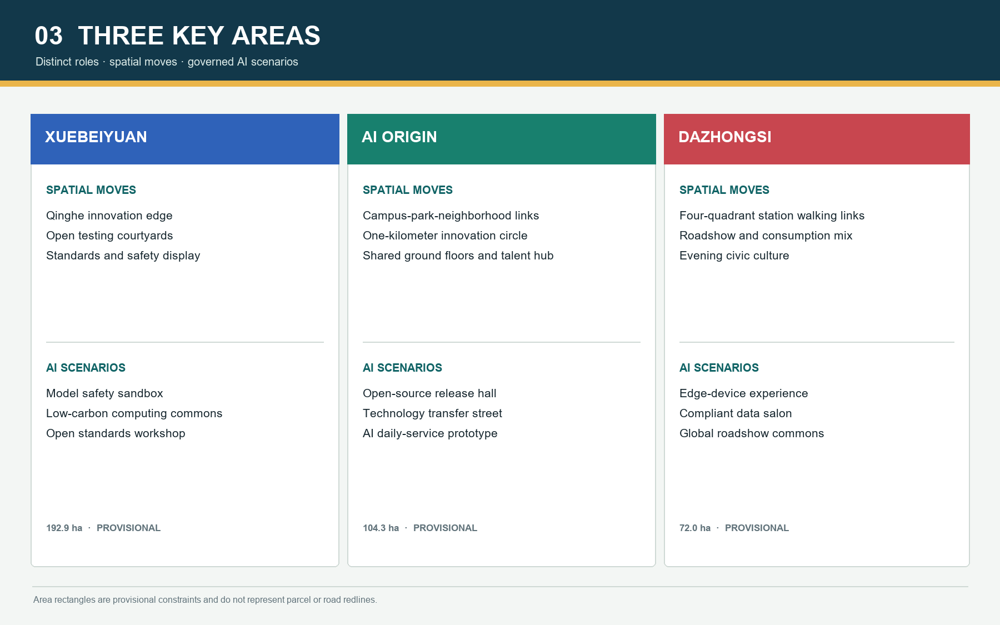

## AI Innovation Ecosystem, Personas, and AI+ Scenarios

Primary personas are university researchers, open-source developers and startups, enterprise R&D teams, nearby residents, and international visitors; facility operators and public stewards form a supporting group. Each persona maps arrival, daily rhythm, spatial needs, data boundary, and conversion path [source:AGENT-TASKBOOK]. Twelve scenario cards cover open-source releases, model-safety sandboxes, edge-computing stations, explainable walking guidance, low-carbon innovation landscapes, near-campus transfer, global roadshows, compliant data services, AI daily services, embodied-AI field testing, railway digital storytelling, and a global AI week route. Three industrial validation settings require booking, graded access, minimum data collection, human review, and visible safety management [standard:PROJECT-AGENT-OPEN-CALL-TASKBOOK] [depth:three_key_area_detailed_design].

## Land Use, Building Scale, and Retain-Renovate-Demolish Strategy

Land-use geometry fully covers the submitted boundary. R&D and mixed programs cluster around innovation nodes; public services sit within the walking network; green and civic space form a continuous armature. Current quantities describe conceptual design layers, not existing-condition inventory or statutory capacity [depth:land_use_layout] [metric:building_footprint_area_sqm]. Building intervention follows survey first, classification second, intervention third. Retention protects heritage and useful fabric; retrofit improves carbon, accessibility, and ground-floor openness; adaptive reuse hosts shared labs and talent services; infill only addresses verified gaps. Height, FAR, demolition share, and investment timing remain non-statutory [standard:MOHURD-CONTROL-DETAILED-PLANNING].

## Transport, Rail, Municipal Infrastructure, and Public Services

Rail stations, the Jing-Zhang heritage walking spine, and east-west stitching streets create a layered network. Regional trips prioritize public transport; internal trips prioritize walking and cycling; station interfaces add shared mobility, bicycle parking, and accessible transfers. Bridge or tunnel positions are conceptual objectives, not engineering findings [data:geometry/roads.geojson#ROAD-001] [depth:traffic_rail_slow_parking]. Distributed edge computing, energy and carbon monitoring, sponge infrastructure, and minimum-data scenario networks form a scalable infrastructure strategy; load, utility, fire, and flood standards remain pending [depth:municipal_new_infrastructure]. Public services combine innovation support, childcare, health, short-stay housing, culture, sports, and all-day safety through scheduled sharing.

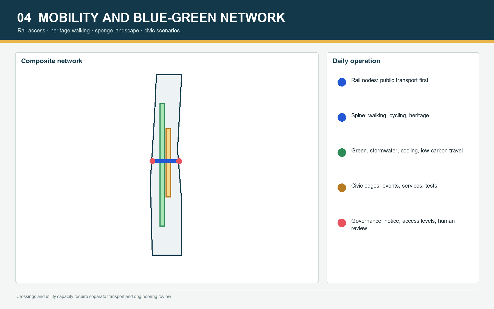

## Blue-Green Network, Public Space, and Urban Character

Qinghe, Xiaoyue River, and the Jing-Zhang Heritage Park form the ecological and civic armature. Green infrastructure supports stormwater, thermal comfort, low-carbon travel, outdoor collaboration, and controlled testing. Green and public-space ratios are provisional geometry calculations and must be recomputed after boundary replacement [metric:green_ratio] [metric:public_space_ratio]. Public space alternates heritage narrative, innovation exchange, neighborhood daily life, and industry presentation. Three pilgrimage and honor nodes are proposed: the Jing-Zhang Zero-Mile Open Source Marker, the AI Origin Contribution Ring, and the Dazhongsi Future Device Beacon. Their content remains updateable and transparent, avoiding commercial ranking or entertainment-led treatment of heritage [standard:MOHURD-URBAN-DESIGN-MEASURES] [depth:blue_green_public_space].

## Renewal Projects, Implementation Policy, and Phasing

Six pilot packages organize implementation: heritage-walk discontinuity repair, the Xuebeiyuan-Qinghe innovation edge, the Origin Community transfer street, four-quadrant Dazhongsi station walking links, AI public-service and edge-computing nodes, and a public route for Global AI Week [depth:renewal_project_list] [data:geometry/phasing.geojson#PHASE-001]. Near-term actions are reversible and measurable: wayfinding, events, shared ground floors, walking improvements, and governed sandboxes. Medium-term work covers building retrofit, station interfaces, and blue-green infrastructure. Long-term development waits for regulatory, utility, ownership, and funding certainty [depth:phasing_implementation]. Policy tools include an open-scenario register, time-shared public space, benefit reinvestment, data agreements, developer-community governance, and independent annual evaluation.

## Metrics, Area Recalculation, and Compliance Matrix

Metrics are separated into geometry-derived quantities, controls pending official planning, and performance indicators requiring operational data. Current known metrics include submitted site area, building footprint, green ratio, public-space ratio, and key-area count; FAR, heights, and utility capacities are not promoted into statutory claims [depth:metrics_recalculation] [metric:site_area_sqm]. compliance_matrix.json maps all official and Agent tasks; standard_matrix.json maps mandatory professional references; design_depth_matrix.json maps fifteen formal depth items. Figures, PDFs, and offline HTML display the same metric values and provisional warning. Boundary replacement triggers topology rebuilding, EPSG:4548 calculation, figure regeneration, and all four validation gates.

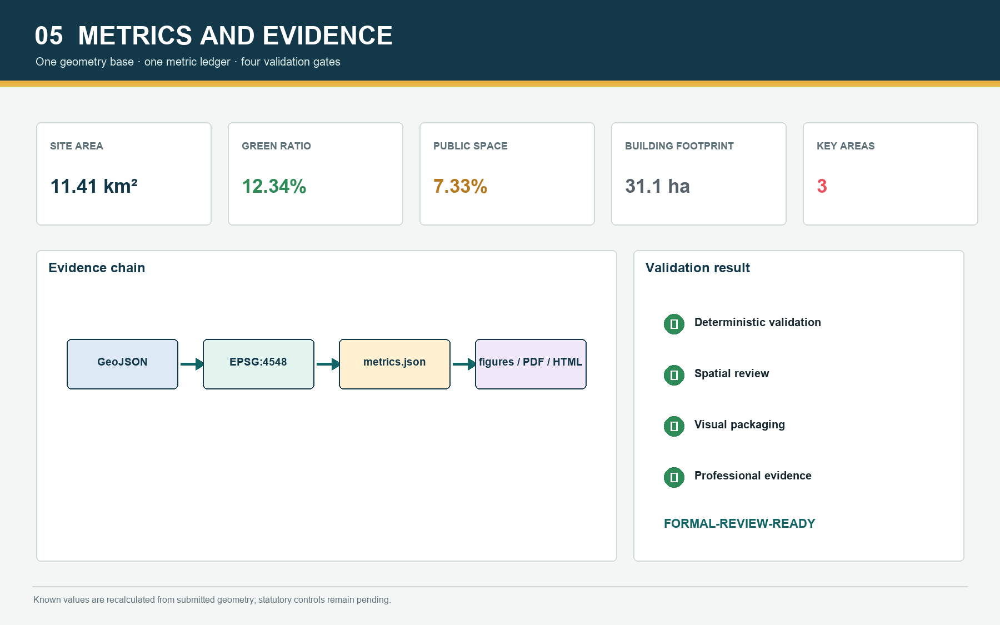

## Risk, Copyright, and Compliance

The first risk is incomplete official geometry, building survey, ownership, road, utility, heritage, and engineering data; affected conclusions remain conceptual and unsuitable for approval or investment decisions [source:BOUNDARY-SOURCE] [depth:risk_missing_data]. The second risk is AI privacy and misuse. Scenarios require minimum data, notice, human review, graded access, opt-out routes, and audit logs; model output never becomes the sole basis for enforcement, planning approval, or public-resource allocation. The third risk is copyright. Public-package drawings are generated for this proposal, while local case references are not republished. Names, identity, and honor nodes remain concepts pending rights review [standard:PROJECT-AGENT-OPEN-CALL-TASKBOOK].

## References

Primary references are the official call, repository site package, Agent taskbook, local snapshots of mandatory standards, the public source registry, and verifiable Beijing government information. Publisher, URL or repository path, retrieval date, permitted use, and limitations are recorded in sources.json [source:OFFICIAL-ANNOUNCEMENT] [source:SOURCE-REGISTRY]. The professional case library informs method only and is not redistributed. Human-readable outputs and the machine-audit layer together form a reviewable, recalculable, and accountable open urban-design package [standard:PROJECT-OFFICIAL-ANNOUNCEMENT].

<!-- V2-VISUAL-EVIDENCE:START -->

## V2 Visual Evidence and Spatial Prototypes

Four concept renders test public-space character, everyday users, and material language. They are not accurate existing-condition views, statutory plans, or engineering designs. The overall perspective compresses three districts into one narrative image to explain corridor coordination; GeoJSON and metrics.json remain the auditable sources for geometry and quantities.

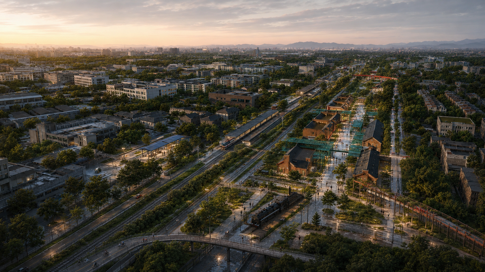

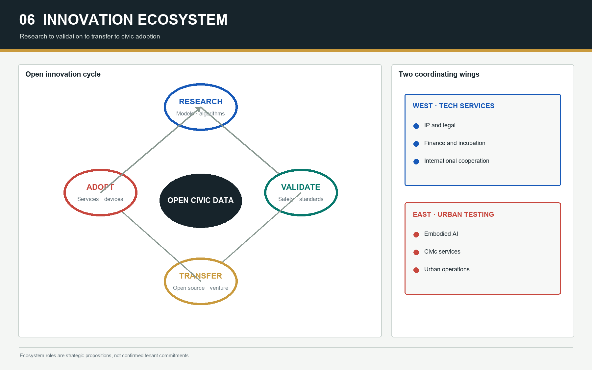

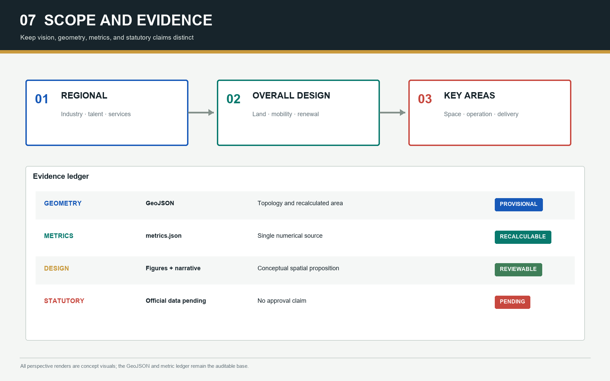

### Xuebeiyuan: Blue Test Commons

Open testing courtyards, the Qinghe interface, a restrained blue civic canopy, and a quiet R&D loop make validation visible without overwhelming daily life. The central track in the render is a retired heritage landscape. Robot tests use booking, zoned access, visible notice, human safety staff, and opt-out paths.

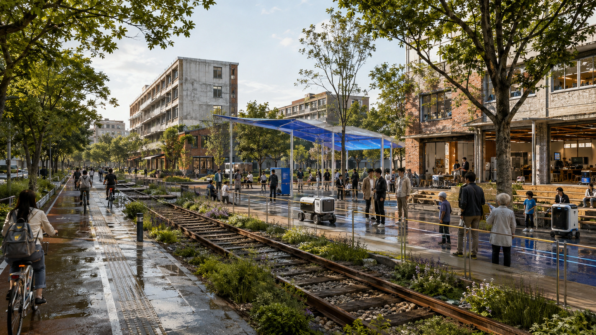

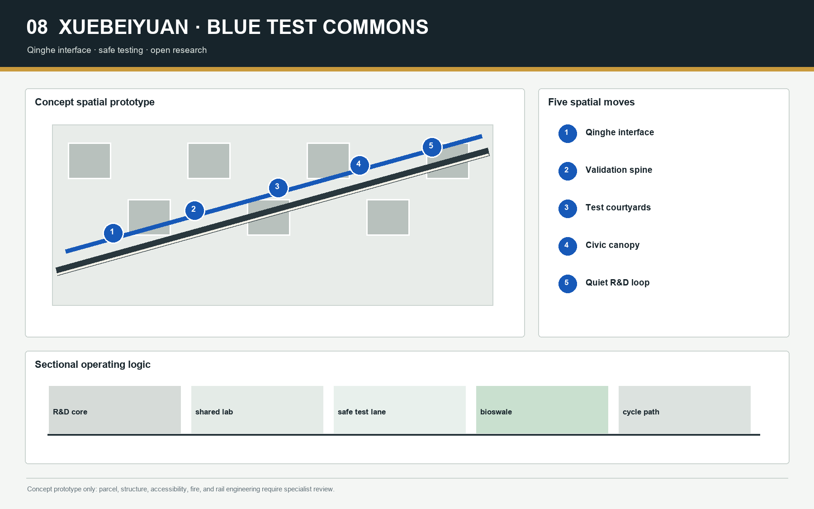

### AI Origin: Open-Source Agora

Retained brick halls, an open-source release venue, a transfer street, a talent commons, and all-day services form a one-kilometer walking loop. Event-day density is not presented as an everyday condition; regular operation prioritizes community services, shared labs, and small-group collaboration.

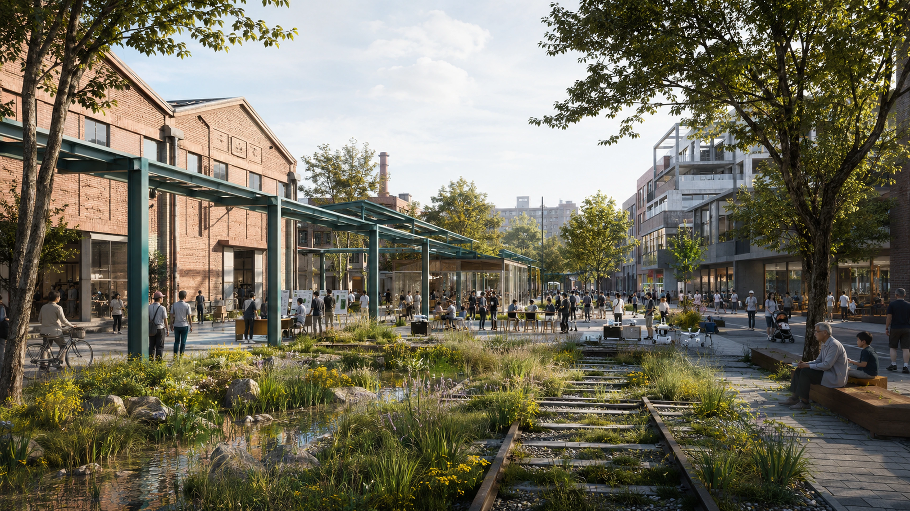

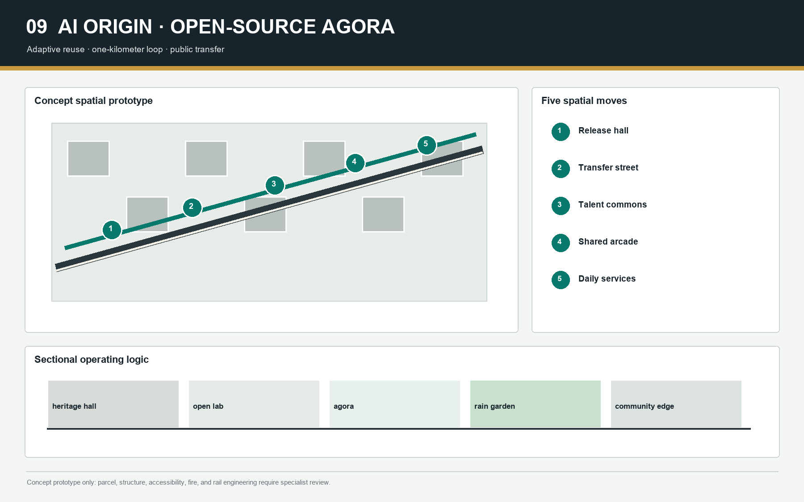

### Dazhongsi: Rail Lantern Forum

A four-quadrant walking loop, a vermilion rail-lantern arcade, a roadshow commons, and a heritage-night route connect transit with public exchange. The arcade is a reversible lightweight connector. Rail crossing, fire, accessibility, lifts, and underground-space feasibility require specialist engineering review.

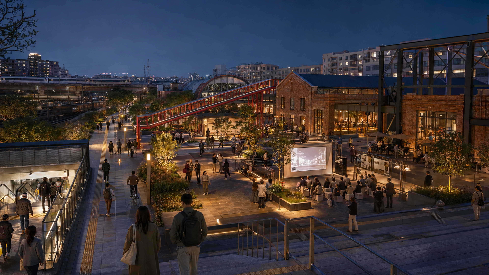

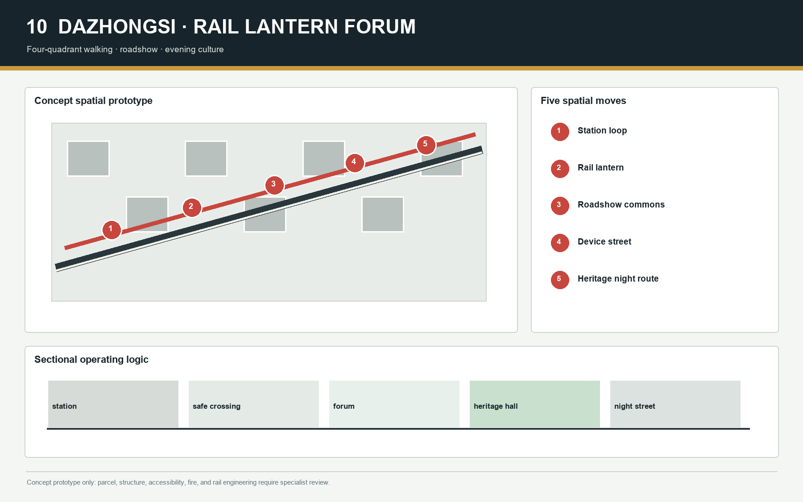

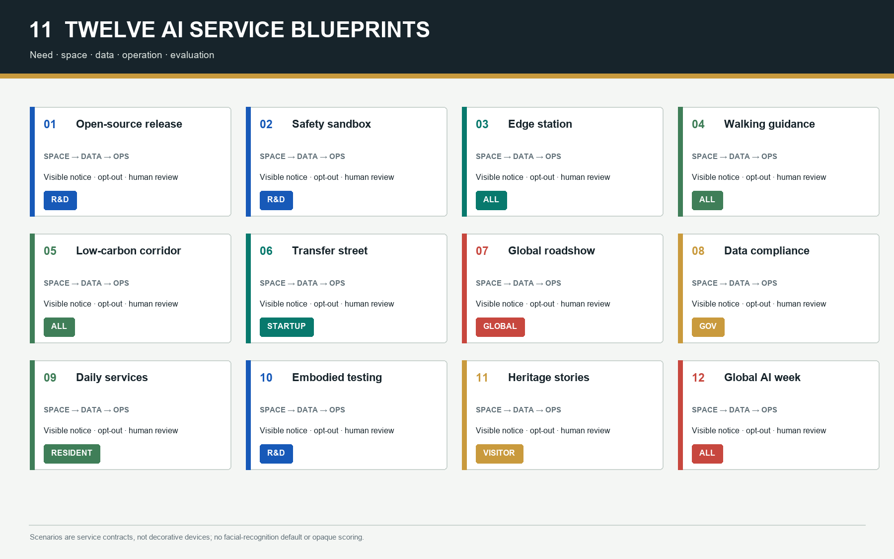

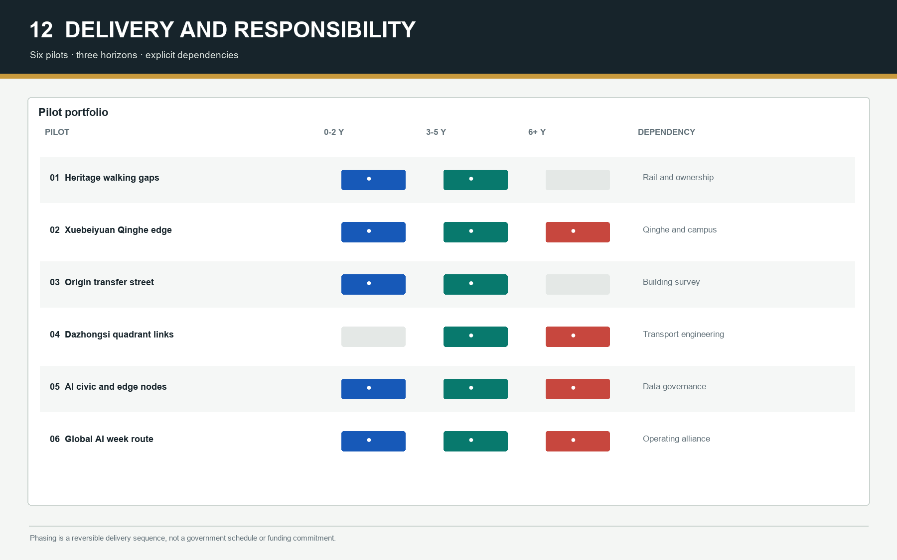

<!-- V2-VISUAL-EVIDENCE:END -->
