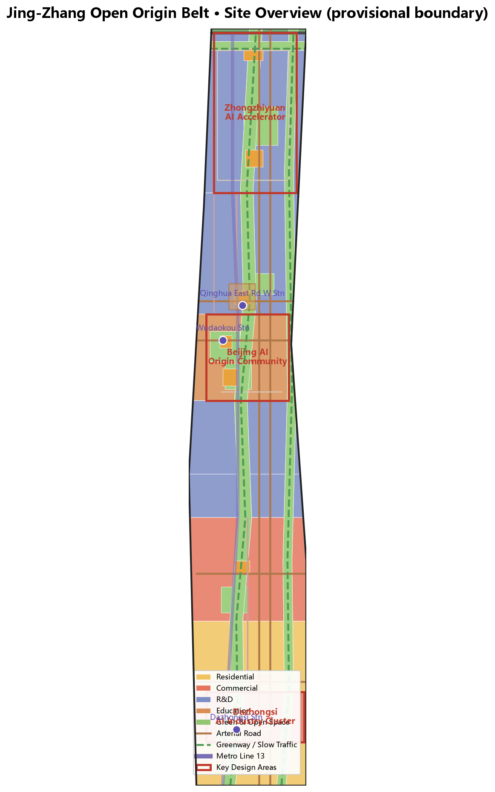
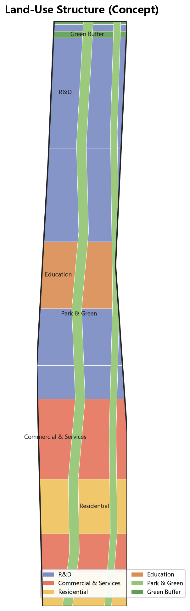
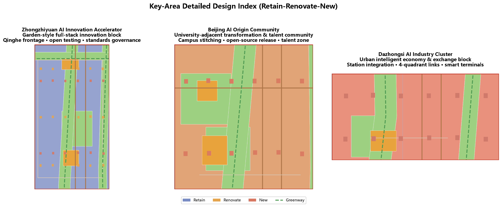
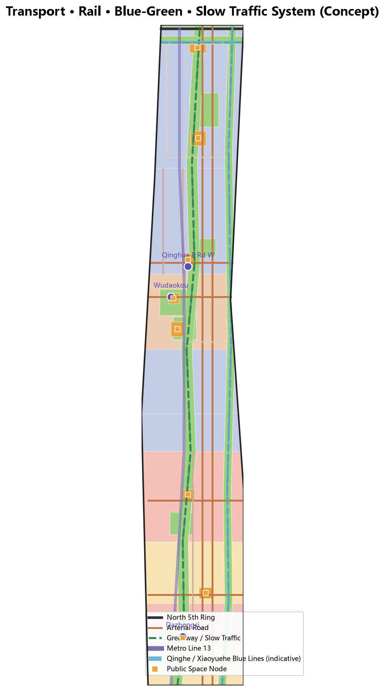
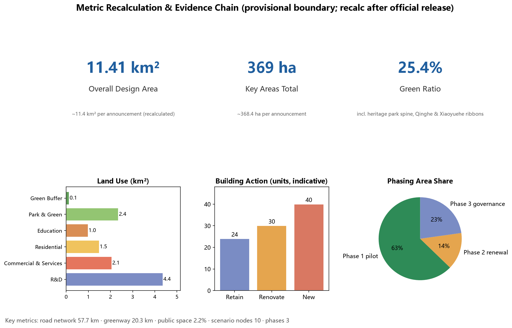

# Jing-Zhang Open Origin Belt: From the Herringbone Railway to an Open-Source AI Urban Operating System

## Design Basis and Source Inventory

This formal design package is prepared in response to the **Centennial Jing-Zhang AI Innovation Belt Urban Design Open Call**, announced by the Beijing Municipal Commission of Planning and Natural Resources, Haidian Sub-bureau. It uses the provisional rough boundaries, key areas, enumerations, metrics, and source registry maintained in `brief/site-package/` as machine-readable references.

Before generating this proposal, the AI agent read `design_brief.json`, `allowed_design_space.json`, `sources.json`, the `enums/`, `ranges/`, and `schemas/` directories, `data/source_registry.json`, and `data/processed/agent_fact_pack.md`. The agent also used `project_scope_summary.csv`, `agent_task_requirements.csv`, `source_use_matrix.csv`, and `missing_data_checklist.csv` to establish task lists, scope boundaries, source usage, and data gaps. The official announcement requires a design depth equivalent to Regulatory Detailed Planning and Implementation Planning; therefore, all spatial conclusions in this package are supported by recalculable GeoJSON layers, metric tables, A3 booklets, A0 boards, and an HTML exhibit. Narrative text does not substitute for drawings and data.

The proposal is not a standalone vision statement; it is organized from the official announcement, the agent taskbook, and site data. This section places the most critical sources next to key judgments [source:OFFICIAL-ANNOUNCEMENT] [source:AGENT-TASKBOOK] [depth:existing_conditions_diagnosis]. Full source and standard coverage is stored in `sources.json`, `standard_matrix.json`, and `design_depth_matrix.json`.

Source registry usage boundaries [source:SOURCE-REGISTRY]:

- `data/source_registry.json` registers public, cleared, and provisional sources.
- Current registry summary: 7 formal sources, 1 background source, 1 provisional-only source.
- The agent must not promote background_only or provisional_only sources to official boundary, statutory regulatory plan, formal scoring basis, or government implementation commitment.

`data/processed/agent_fact_pack.md` is a navigation layer, not a new authority [source:PROCESSED-FACT-PACK]. It helps the agent organize the three scopes, three key areas, announcement tasks, agent.1-agent.6, source availability, and missing data into a readable proposal. Factual judgments still return to the registered original materials [source:OFFICIAL-ANNOUNCEMENT] [source:AGENT-TASKBOOK].

Because the official `SITE_BOUNDARY` polygons and the three `KEY_AREA` polygons are not yet publicly released, this package uses `brief/site-package/geometry/provisional_boundaries.geojson` as a temporary formal basis. `geometry/site_boundary.geojson` and `geometry/key_areas.geojson` are explicitly tagged `provisional_constraint` with `official_boundary=false`. They may only be used for scheme generation, self-check, visualization, and design discussion. They may not be used as an official redline, approval basis, precise area calculation, or statutory planning control. This organizer data gap does not block content scoring; once official polygons are released, the site boundary, key areas, land use, roads, green space, public space, buildings, phasing, and metrics must all be recalculated.

The current submission is therefore scored as: **provisional boundary, precision warnings retained, awaiting recalculation after official data release; content scoring is not blocked**. All spatial structures, scenarios, projects, and metrics in the main text are written under the principle of "discussable, reviewable, and recalculable after official boundary replacement." When official boundaries and key-area polygons are updated, the agent must rerun scaffolding, self-check, and drawing/HTML generation—not merely replace individual files.

Boundary interpretation can return to the overall scope layer and area recalculation [data:geometry/site_boundary.geojson#SITE-001] [metric:site_area_sqm]. The three key areas are checked by independent layers and count metrics [data:geometry/key_areas.geojson#PROV-KEY-001] [metric:key_area_count].

## Three-Level Scope Framework

The proposal is organized around the three levels defined in the official announcement: the comprehensive research scope covers the 43.6 km² AI industrial ecology, strategic positioning, innovation chain, and future urban form; the overall design scope covers the 11.4 km² urban area and industrial zone within 1–2 km of the Jing-Zhang Heritage Park, requiring an overall urban renewal framework, industrial spatial layout, transportation and municipal support, and urban character control; the key area scope covers the 368.4 ha of three detailed-design areas, requiring clear functional programs, building scale, retain/renovate/demolish classification, public space connectivity, and transportation organization. The three levels are mapped item-by-item in `compliance_matrix.json`, ensuring that all mandatory tasks under Announcement Sections 1.3, 1.4, 1.5 and agent.1-agent.6 have corresponding chapters, layers, metrics, drawings, and HTML evidence.

The three-level framework is governed by [depth:three_level_scope_framework] and [depth:overall_spatial_structure]. Spatial evidence is anchored in [data:geometry/site_boundary.geojson#SITE-001] and [data:geometry/key_areas.geojson#PROV-KEY-001]; task basis is anchored in [standard:PROJECT-OFFICIAL-ANNOUNCEMENT].

The three levels are not isolated drawing sets. The comprehensive research scope determines industrial chain and urban form judgments; the overall design scope translates those judgments into renewal projects, spatial structure, and facility capacity; the key area detailed design verifies the implementability of specific parcels, buildings, transportation, public space, and AI application scenarios.

This proposal proposes the overall concept **"Jing-Zhang Open Origin Belt: From the Herringbone Railway to an Open-Source AI Urban Operating System."** The core narrative uses an **"open source + branch"** metaphor: in 1909, Jeme Tien-yow used the "herringbone railway" to overcome the steep grade at Badaling—China's first autonomous solution to a national engineering challenge, the "open-source moment" of modern China. Today, global AI innovation is organized around **commits, branches, and merges**. The Jing-Zhang Innovation Belt is therefore structured as a **"City Operating System"**: the Jing-Zhang Heritage Park vitality belt is the **main branch (main)**, carrying a century of railway heritage and public life; the three key areas are **three feature branches**—Zhongzhiyuan (the full-stack autonomy branch), Beijing AI Origin Community (the origin/main, open-source provenance branch), and Dazhongsi (the commerce branch); the two wings are the **contributor community**—the Zhongguancun Technology Service Wing and the Xiaoyuehe Scenario Empowerment Wing; the AI scenario nodes are **individual commits**, continuously merged into the main branch through public space, events, and operating mechanisms. This metaphor unifies the three chosen tracks—Jing-Zhang cultural heritage, AI origin community, and youth-friendly public space—into a single experiential spatial narrative: cultural heritage is not static exhibition, but an **open, committable, and evolvable repository**.

"One belt" is not a newly drawn redline, but the translation of the three-level scope into a working method; "three cores" correspond to the three key areas; "two wings" correspond to the Zhongguancun Technology Service Wing and the Xiaoyuehe Scenario Empowerment Wing in the taskbook; "multi-point scenarios" correspond to operable nodes for AI+ public services, industrial services, and urban life; the "composite loop" corresponds to the integration of slow-traffic, green space, public space, and event routes.

| Level | Design Question | Proposal Answer | Data Anchor |
| --- | --- | --- | --- |
| Comprehensive Research | How to organize AI industrial ecology and future urban form | Establish an innovation chain: "University Provenance → Open-Source Collaboration → Enterprise Translation → Public Experience → International Communication" | compliance_matrix.json, standard_matrix.json |
| Overall Design | How to map industrial space, urban renewal, transportation, and character | Joint expression via land use, buildings, roads, green space, public space, and phasing layers | [data:geometry/land_use.geojson#LU-001], [data:geometry/roads.geojson#ROAD-001] |
| Key Area Scope | How to achieve detailed design depth in the three areas | Define positioning, spatial moves, AI scenarios, and implementation dependencies for each | [data:geometry/key_areas.geojson#PROV-KEY-001], [data:geometry/key_areas.geojson#PROV-KEY-002], [data:geometry/key_areas.geojson#PROV-KEY-003] |

## Comprehensive Research: Industry and Future City Studies

The core task of the comprehensive research scope is to build a world-class AI innovation ecosystem. This proposal organizes the industrial spatial structure along a five-stage innovation chain: universities and institutes (e.g., Tsinghua) undertake provenance (education land 0804, along the western side of the Origin Community and Qinghua East Road); open-source communities, incubators, and developer ecosystems undertake collaboration (community-oriented organization of research land 0802); leading enterprises and smart-terminal manufacturers undertake translation (commercial and industrial space in Dazhongsi); the Jing-Zhang Heritage Park and public squares undertake public experience (cultural narrative and scenario nodes); and international roadshows and brand events undertake communication (the Dazhongsi International Roadshow Living Room and the Global AI Week route). This innovation chain simultaneously addresses all five functions in the taskbook: AI full-stack autonomy system, world-class AI innovation ecosystem, AI+ scenario empowerment, intelligent and vibrant AI city, and global AI governance discourse [source:AGENT-TASKBOOK].

"Three Areas and Two Wings" synergy forms the spatial backbone at this level [source:AGENT-TASKBOOK]: the three areas are the Zhongzhiyuan AI Autonomous Innovation Acceleration Area, the Beijing AI Origin Community, and the Dazhongsi AI Industry Cluster; the two wings are the Zhongguancun Technology Service Wing (west, handling global resource allocation, Zhongguancun IP, and capital empowerment) and the Xiaoyuehe Scenario Empowerment Wing (east, handling AI scenario empowerment and the intelligent AI city). In this proposal, the two wings are not separately bounded; they are functional corridors on the east and west sides of the overall design scope: the west relies on the Xueyuan Road–Zhongguancun technology service resources to organize "service wing" nodes, while the east relies on the Xiaoyuehe waterfront belt to organize "scenario wing" nodes. The two wings connect horizontally through slow-traffic links that intersect the Jing-Zhang main belt.

Naming and visual identity recommendations (conceptual, to be deepened by a professional team): the "Jing-Zhang Open Origin Belt" naming system contains three levels—the main axis "JZ-Main" (heritage and public life); the three cores "Open Branch" (Zhongzhiyuan = Full-stack, Origin Community = Origin, Dazhongsi = Commerce); and events and scenarios unified as the "Commit" series (e.g., "Open Night," "Commit Fest"). The logo concept uses the isomorphism of the herringbone railway line and the git branch line: two lines converge at the Qinghuayuan Station and then fork—both rails and branch topology. All branding elements are conceptual drafts; full clearance and professional design are required before formal use.

Future urban form studies: AI will change work, life, social interaction, learning, transportation, and public services. The proposal translates AI traffic systems (transit-oriented development, slow-traffic navigation, low-speed shuttle pilots), continuous green space (Jing-Zhang Park + Qinghe + Xiaoyuehe), innovation service facilities (release hall, roadshow living room, sandbox exhibition), and an international living/working atmosphere into locatable functional zones, nodes, corridors, and scenarios [depth:overall_spatial_structure]. Industrial strategy indicators, AI innovation index, talent density, spatial supply types, and AI+ vertical application priority areas are entered into the `metrics.json` indicator system, with clear labeling of which are official, which are design proposals, and which await formal data calibration. Any proposals for global AI innovation events, developer communities, open scenarios, or pilgrimage routes are written as "conceptual proposals / reference schemes / available for professional team deepening," not as already-confirmed government activities or implementation arrangements.

## Overall Design: Urban Renewal and Regulatory Detailed Planning

The overall design scope requires the design depth of Regulatory Detailed Planning. This proposal uses **"mainline suture, branch growth, commit staging"** as the overall renewal framework:

- **Mainline suture**: The Jing-Zhang Heritage Park vitality belt has multiple slow-traffic breaks (crossing the North Fifth Ring, underpasses at the North Third Ring, and station access gaps). The renewal strategy focuses on "suturing" to form a continuous 20.7 km greenway–slow-traffic system ([metric:greenway_length_m]), comprising the Jing-Zhang Park main axis, the Xiaoyuehe cycling path, and the Qinghe waterfront promenade.
- **Branch growth**: The three key areas each grow around core projects, avoiding homogeneous development; new buildings inside key areas are organized in small, iterative block modules with reserved space for functional iteration.
- **Commit staging**: Along the main belt, several small留白 (blank/staging) parcels (squares, pocket parks, temporary event sites) are reserved as **staging areas** for AI scenarios and community activities. Functions are validated through operations before being solidified—echoing the gray-release logic of open-source software.

`geometry/land_use.geojson` provides complete coverage of the design boundary with no overlaps (35 parcels, gap area 0 m²; see `generated_metrics.json` and [metric:land_use_parcel_count]), expressing the land-use structure [data:geometry/land_use.geojson#LU-001]. `geometry/buildings.geojson` expresses building footprints (94 buildings, including retain/renovate/new categories; see [data:geometry/buildings.geojson#BLDG-001] and [metric:building_count]). `geometry/roads.geojson` expresses micro-circulation, slow traffic, and rail connectivity [data:geometry/roads.geojson#ROAD-001]. `metrics.json` recalculates core areas, ratios, and layer counts.

Land-use structure (recalculated from provisional boundary; to be recalculated after official boundary release): research land 4.35 km², commercial and service land 2.05 km², residential land 1.49 km², education land 0.99 km², park green space 2.35 km², protective green space 0.16 km². Green ratio: 25.8%; public space ratio: 2.2% ([metric:green_ratio], [metric:public_space_ratio]). Combined research and education land accounts for more than half of buildable land, consistent with the "AI Innovation Belt" industrial positioning. Green and open space uses the Jing-Zhang Park main axis as the core spine, forming a north-south ecological-cultural composite corridor [depth:land_use_layout] [depth:development_intensity_controls].

The overall design must support transportation, rail, municipal, and public service facilities. This proposal addresses transit-oriented development around Wudaokou Station, Qinghua East Road West Entrance Station, and Dazhongsi Station; road micro-circulation (Zhongzhiyuan loop road, Origin Community slow-traffic main street, Dazhongsi Station front road); non-motorized parking; parking supply; innovation service platforms; talent life services; new infrastructure; distributed energy; and edge computing nodes. Because official control conditions for building heights, development intensity, road redlines, setbacks, and facility standards are not yet available, these are uniformly written as "awaiting confirmation of formal regulatory plan conditions," without substituting agent-estimated values for approved indicators (see `assumptions.json` A-CONTROLS-001).

## Key Area Detailed Design

Key area detailed design is mandatory. The three key areas correspond to PROV-KEY-001/002/003 in `geometry/key_areas.geojson`, all as provisional_constraint. Design expression includes functional programs, building scale, building form, retain/renovate/demolish classification, public space system, transportation organization, slow-traffic connectivity, and implementation projects [depth:three_key_area_detailed_design].

### Zhongzhiyuan AI Autonomous Innovation Acceleration Area (PROV-KEY-001, ~192.0 ha)

**Positioning**: A garden-style full-stack autonomous innovation district—the "exhibition branch" for AI governance and full-stack autonomy.

- **Functional program**: Research land as the main body, with inserted industry exhibition, standard-setting workshops, safety evaluation showcases, low-carbon computing experiences, and open testbeds; along the Qinghe waterfront, science-innovation亲水 platforms and innovation interaction spaces are arranged [data:geometry/key_areas.geojson#PROV-KEY-001].
- **Spatial moves**: Strengthen the Qinghe interface (the northern boundary of the 0.16 km² protective green space), organize the Zhongzhiyuan loop road ([data:geometry/roads.geojson#ROAD-011]), and form a park-in-park structure around the "Zhongzhiyuan Innovation Green Core" ([data:geometry/green_space.geojson#GREEN-004]); the industry exhibition plaza serves as a portal node ([data:geometry/public_space.geojson#PUBLIC-004]).
- **Retain/renovate/demolish**: Primarily renovation and new construction (building footprint sequences BLDG-001/002 in [data:geometry/buildings.geojson#BLDG-001]), retaining landmark factory/park interfaces with industrial memory; new buildings are controlled at low-to-medium intensity to ensure landscape transparency along the Qinghe interface.
- **AI scenarios**: Autonomous model testing sandbox (safety governance showcase), standard-setting workshops, low-carbon computing experience points, and the Qinghe Low-Carbon Innovation Corridor ([data:geometry/green_space.geojson#GREEN-004] combined with PUBLIC-008).
- **Implementation dependencies**: River blue line review, ecological and flood conditions, and North Fifth Ring external traffic organization (see `assumptions.json`).

### Beijing AI Origin Community (PROV-KEY-002, ~103.8 ha)

**Positioning**: A university-adjacent成果 transformation and talent community—**"origin/main,"** the open-source provenance branch.

- **Functional program**: Organized toward university成果 transformation, including incubation, exhibition, legal, IP, and investment/financing services; equipped with talent apartments and youth housing (mixed residential and education land); open-source cultural facilities such as a release hall, contribution wall, and public code wall.
- **Spatial moves**: The "Origin Community Slow-Traffic Main Street" ([data:geometry/roads.geojson#ROAD-012]) sutures campus, park, and block; the "Origin Community Open-Source Release Plaza" ([data:geometry/public_space.geojson#PUBLIC-005]) and the "Origin Community Tree-Lined Plaza Belt" ([data:geometry/green_space.geojson#GREEN-006]) organize community public life; the Qinghua East Road West Entrance Station TOD zone ([data:geometry/constraints.geojson#CONSTRAINT-004]) serves as a rail connection anchor.
- **Retain/renovate/demolish**: Primarily retention and renovation (BLDG-003/004/005 sequences), preserving the low-rise texture and courtyard scale around universities, updating ground-floor commercial programs to innovation service interfaces.
- **AI scenarios**: Open-source release hall, university-adjacent成果 transformation street, contribution wall / honor display, talent special-zone service station, AI education experience points (linked with the Qinghuayuan Station Cultural Plaza, [data:geometry/public_space.geojson#PUBLIC-001]).
- **Implementation dependencies**: Campus boundaries and ownership, ground-floor use conversion permits, and rail station TOD boundary confirmation (see `assumptions.json`).

### Dazhongsi AI Industry Cluster (PROV-KEY-003, ~71.6 ha)

**Positioning**: An urban smart economy and international exchange district—the "commerce branch."

- **Functional program**: Organized around leading enterprises, intelligent agents, smart terminals, content consumption, data elements, digital assets, and commercial services; commercial and service land is the primary carrier ([data:geometry/land_use.geojson#LU-005] and surroundings).
- **Spatial moves**: Dazhongsi Station four-quadrant pedestrian connectivity ([data:geometry/constraints.geojson#CONSTRAINT-002] linked with [data:geometry/public_space.geojson#PUBLIC-003]); planned green space composite use; the station front road ([data:geometry/roads.geojson#ROAD-013]) serves as the east-west pedestrian main street; the North Third Ring underpass space is converted into a youth vitality space ([data:geometry/public_space.geojson#PUBLIC-007]).
- **Retain/renovate/Demolish**: Equal emphasis on retention and new construction (BLDG-006/007 sequences), updating street interfaces and public environments, with new buildings reinforcing the TOD intensity gradient around the station.
- **AI scenarios**: Dazhongsi International Roadshow Living Room, intelligent agent and smart terminal showcases, data elements living room, youth night vitality district.
- **Implementation dependencies**: Rail station redline and TOD plan, road intersection renovation, and municipal pipeline conditions (see `assumptions.json`).

| Key Area | Design Positioning | Spatial Moves | AI Industry & Operations | Evidence |
| --- | --- | --- | --- | --- |
| Zhongzhiyuan AI Autonomous Innovation Acceleration Area | Garden-style full-stack autonomous innovation district | Strengthen Qinghe interface, industry exhibition, low-carbon innovation interaction, and external traffic organization | Autonomous model testing, standard-setting workshops, safety governance showcase, low-carbon computing experience | [data:geometry/key_areas.geojson#PROV-KEY-001], [depth:three_key_area_detailed_design] |
| Beijing AI Origin Community | University-adjacent成果 transformation and talent community | Suture campus, park, and block; add成果 release, talent services, housing, and open-source collaboration spaces | Open-source community,成果 release, talent special-zone services, university-adjacent incubation | [data:geometry/key_areas.geojson#PROV-KEY-002], [source:AGENT-TASKBOOK] |
| Dazhongsi AI Industry Cluster | Urban smart economy and international exchange district | TOD around Dazhongsi Station, four-quadrant pedestrian connectivity, commercial services, and leading enterprise public environment renewal | Intelligent agent and smart terminal showcases, content consumption, data elements, international roadshows | [data:geometry/key_areas.geojson#PROV-KEY-003], [metric:key_area_count] |

## AI Innovation Ecology, Talent Personas, and AI+ Scenarios

The proposal establishes spatial demand personas for AI talent and enterprises, covering R&D offices, open-source collaboration,成果 release, enterprise services, talent housing, social learning, consumer life, sports and leisure, and international exchange [depth:scenario_evidence]. AI+ scenarios follow the directions proposed in the announcement—transportation, services, consumption, healthcare, education, legal, and life services—forming industrial development scenarios and AI-empowered urban function scenarios. Each scenario specifies its service targets, spatial location, data sources, privacy boundaries, human review mechanisms, and operating entities, and enters structured layers or the compliance matrix.

All AI scenarios are grounded in spatial and governance boundaries: public space scenarios reference [data:geometry/public_space.geojson#PUBLIC-001]; slow-traffic and transportation scenarios reference [data:geometry/roads.geojson#ROAD-001]; open-space scenarios reference [data:geometry/green_space.geojson#GREEN-001] and [metric:public_space_ratio], [metric:green_ratio]. The scenario node count (10) is entered into the indicator system [metric:scenario_node_count].

| Persona | Typical Needs | Spatial Response | Self-Check Boundary |
| --- | --- | --- | --- |
| Open-source developer | Publish, collaborate, test, community reputation | Origin Community open-source release hall, public code wall, night collaboration spaces | No individual behavioral trajectory collection; event data is aggregate only |
| Startup team | Low-cost office, computing access, product testbed | Zhongzhiyuan shared testbed, edge computing service points, standard governance consultation | Computing and data services require separate authorization |
| Leading enterprise visitor | Exhibition, business, international reception, recruitment | Dazhongsi International Roadshow Living Room, rail station access, public space around key enterprises | Corporate logos and cases require clearance |
| Surrounding residents | Commuting, leisure, community services, low-disturbance renewal | Jing-Zhang Heritage Park slow-traffic loop, embedded community services, night lighting and activity grading | Resident personas not used for commercial recommendation |
| University faculty/students |成果 transformation, cross-university collaboration, daily slow-traffic | Campus-park slow-traffic suture,成果 transformation station, AI education experience points | Campus data and research成果 require authorization |
| Youth creative group | Third space, night vitality, social learning, self-display | Wudaokou Youth Vitality Plaza, North Third Ring underpass space, contribution wall and display positions | Content publishing and event safety are the responsibility of operating entities |

| Scenario Card | Spatial Carrier | Design Description |
| --- | --- | --- |
| 01 Open-Source Release Hall | Beijing AI Origin Community | For universities, open-source communities, and startup teams; provides成果 release, code contribution display, and small roadshow space |
| 02 Safety Governance Sandbox | Zhongzhiyuan | Translates standard-setting, safety evaluation, and model red-team testing into visitable, bookable, and supervisable exhibition and collaboration nodes |
| 03 Edge Computing Station | Overall design scope nodes | Combines public services, enterprise services, and low-carbon energy strategies; a prototype for deepening new infrastructure |
| 04 AI Slow-Traffic Navigation | Jing-Zhang Heritage Park vitality belt | Uses explainable wayfinding and low-intrusion sensing to identify slow-traffic breaks, congestion nodes, and accessibility needs |
| 05 Dazhongsi International Roadshow Living Room | Dazhongsi AI Industry Cluster | Serves intelligent agents, smart terminals, and content consumption enterprises for exhibition, negotiation, media release, and international exchange |
| 06 Qinghe Low-Carbon Innovation Corridor | Zhongzhiyuan Qinghe interface | Combines green space, stormwater, walking/cycling, and AI exhibition as the district's public living room |
| 07 University-Adjacent成果 Transformation Street | Beijing AI Origin Community | For university成果 transformation; organizes incubation, exhibition, legal, IP, and investment/financing services |
| 08 Data Elements Living Room | Dazhongsi district | A city service interface for compliant, authorized, and auditable data elements and digital asset circulation |
| 09 Youth Night Vitality Belt | Wudaokou–North Third Ring underpass | A operable street interface combining youth third space, night lighting, activity grading, and safety governance |
| 10 Global AI Week Route | Belt public space system | A walkable, shareable experience route from heritage culture, open-source community, industry exhibition to international roadshows |

AI governance recommendations generated by the agent comply with data minimization, public sources, explainability, and human review principles [source:AGENT-TASKBOOK] (charter.2/charter.4/charter.6). Urban intelligent agents may assist in identifying slow-traffic breaks, public space heatmaps, facility maintenance, enterprise service needs, and event safety risks, but cannot substitute for planning approvals, output unauthorized individual profiles, or claim official implementation commitments.

## Land Use, Building Scale, and Retain/Renovate/Demolish Scheme

The land-use plan follows the public classification standard in the "Guidelines for Land-Sea Use Classification in Territorial Spatial Survey, Planning, and Use Control" (2023) [standard:MNR-LAND-USE-CLASSIFICATION-GUIDE], forming a complete, closed, and seamless land-use partition ([data:geometry/land_use.geojson#LU-001]; 35 parcels, covering the full boundary, no overlaps, no gaps; see `generated_metrics.json` and [metric:land_use_parcel_count]). Land-use codes use the project subset from `enums/land_use_codes.json`: 0701 urban residential, 0501 commercial and service, 0802 research, 0804 education, 1401 park green space, 1402 protective green space, 1403 plaza land.

The building plan distinguishes four types of处置 objects—retain, renovate, update, and new (94 representative footprints, [metric:building_count], [data:geometry/buildings.geojson#BLDG-001]): retention concentrates around university surroundings in the Origin Community and existing Dazhongsi blocks (preserving low-rise texture and courtyard scale); renovation concentrates on existing Zhongzhiyuan park interfaces and ground-floor street fronts; new construction concentrates on incremental parcels in key areas and "commit staging" zones along the main belt. Building height, massing, interface, and character control are managed by [depth:height_massing_character]; the retain/renovate/demolish method is managed by [depth:retain_renovate_demolish].

Building scale and intensity indicators must be consistent with `metrics.json` and layers. Because total building scale, floor area ratio, building height, building density, green ratio, setbacks, and building control lines lack official conditions, they uniformly use `status=unknown`, with reasons and assumptions in `assumptions.json` describing the missing conditions, current assumptions, and recalculation paths after formal data release. No pseudo-precise values are fabricated. The A3 booklet provides a renewal project list and indicator review table; the A0 boards express key spatial structures and key areas; the HTML page provides linked indicator and layer browsing.

## Transportation, Rail, Municipal, and Public Service Facilities

The transportation plan responds to the announcement requirements for transit-oriented development, road micro-circulation, slow-traffic breaks, external traffic, parking, non-motorized parking, and green transportation systems [depth:traffic_rail_slow_parking]. Key coverage includes the North Fifth Ring ([data:geometry/roads.geojson#ROAD-001]), Jing-Zhang Heritage Park crossing nodes, Wudaokou, Qinghua East Road West Entrance, Dazhongsi Station, and transportation links around key enterprises:

- **Transit-oriented development**: Wudaokou Station ([data:geometry/constraints.geojson#CONSTRAINT-003]), Qinghua East Road West Entrance Station (CONSTRAINT-004), and Dazhongsi Station (CONSTRAINT-002) serve as TOD anchors for the Origin Community, Qinghua East Road Innovation Zone, and Dazhongsi district, respectively, organizing walking circles, non-motorized parking, and transfer connections around each station.
- **Road micro-circulation**: Zhongzhiyuan loop road (ROAD-011), Origin Community slow-traffic main street (ROAD-012), and Dazhongsi Station front road (ROAD-013) supplement the branch road network; Heqing Road (ROAD-009) and Qinghuayuan branch road (ROAD-010) handle north-south relief.
- **Slow-traffic break suture**: The greenway–slow-traffic system totals 20.7 km ([metric:greenway_length_m]), comprising the Jing-Zhang Park main axis (ROAD-014), Xiaoyuehe cycling path (ROAD-015), and Qinghe waterfront promenade (ROAD-016); crossings of the North Fifth Ring and the North Third Ring underpasses are key suture nodes.
- **External traffic**: The North Fifth Ring and Xueyuan/Xitucheng Roads (ROAD-002/003) form the external skeleton; Zhongzhiyuan external traffic is temporarily linked at the Qinghe interface.

Road and slow-traffic layers are kept within the submitted boundary and cross-checked with public space, green space, industrial nodes, and key areas [data:geometry/roads.geojson#ROAD-001] [data:geometry/public_space.geojson#PUBLIC-001] [data:geometry/constraints.geojson#CONSTRAINT-009]. Because the submitted boundary is provisional, transportation conclusions can only serve as temporary design discussion. Where road redlines, pipelines, fire protection, and municipal conditions are missing, these are noted in `assumptions.json` rather than written as approved conditions.

Municipal and public service facilities cover AI industrial service facilities (release hall, roadshow living room, innovation service platform), talent life service facilities (talent apartments, embedded community services), new infrastructure (edge computing stations, distributed energy), and integration with traditional municipal facilities. The proposal specifies facility standards, spatial layout, service radius, operating model, and phasing logic [depth:municipal_new_infrastructure]; where pipeline, energy, drainage, flood control, and fire engineering data are missing, these are listed as formal deepening preconditions.

## Blue-Green Space, Public Space, and Urban Character

The blue-green space plan uses the Jing-Zhang Heritage Park vitality belt as its backbone [depth:blue_green_public_space], coordinating Qinghe, Xiaoyuehe, and the surrounding universities, enterprises, and community travel needs into a north-south贯通, east-west connected pedestrian, cycling, and green space system:

- **Jing-Zhang Heritage Park vitality belt (main axis)**: A continuous green belt from Qinghe in the north to Dazhongsi in the south, carrying heritage display, slow traffic, public activities, and AI scenarios; crossings of the North Fifth Ring and the North Third Ring underpasses are critical suture nodes.
- **Qinghe waterfront belt (north side)**: Protective green space combined with亲水 platforms, serving as the ecological interface and low-carbon innovation interaction space for Zhongzhiyuan (near [data:geometry/green_space.geojson#GREEN-004] and [data:geometry/public_space.geojson#PUBLIC-008]).
- **Xiaoyuehe Scenario Empowerment Wing (east side)**: Cycling paths and waterfront green space form the east wing ecological spine, connecting scenario empowerment nodes.
- **Community park network**: Wudaokou Youth Park (GREEN-001), Zhichunli Community Park (GREEN-002), Dazhongsi Pocket Park Cluster (GREEN-003), Qinghua East Road Corner Garden (GREEN-005), and Origin Community Tree-Lined Plaza Belt (GREEN-006) supplement the 15-minute living circle green space service.

Green and public space ratios are explained in the main text for their design significance (green ratio 25.8%, public space ratio 2.2%; [metric:green_ratio], [metric:public_space_ratio]); full recalculation is stored in `metrics.json`. Urban character, public space, and building control are coordinated through the professional standards matrix [standard:MOHURD-URBAN-DESIGN-MEASURES].

The urban character plan integrates Jing-Zhang railway historical culture, Zhongguancun innovation culture, and AI innovation culture: using the Qinghuayuan Station historic site ([data:geometry/constraints.geojson#CONSTRAINT-008]), Beijing Film Academy, and other cultural resources, it proposes an urban keynote (brick-red / gray-green / rusted rail elements + modern glass / low-carbon materials), building character (interface continuity along the main belt in key areas), roof forms (encouraging fifth-façade and photovoltaic composites), massing (TOD intensity gradient), interfaces (transparent and open ground floors), and public art guidance ("herringbone" and "branch" themed art installations). Wayfinding, cultural symbols, international communication narratives, AI pilgrimage landmarks, contribution walls, and honor display systems all adopt the "herringbone → branch" visual motif. All brands, fonts, images, portraits, and corporate logos require clearance sources (see `sources.json` and `report/copyright_statement.md`). Character controls distinguish official regulation, design proposals, and pending conditions; pseudo-precise control lines are strictly prohibited without heritage or regulatory plan basis.

## Renewal Project List, Implementation Policy, and Phasing Plan

The implementation plan forms a reviewable renewal project list [depth:renewal_project_list], specifying project location, type, function, responsible entity, dependencies, implementation stage, risk, and evaluation indicators. `geometry/phasing.geojson` expresses the three-phase scope [data:geometry/phasing.geojson#PHASE-001] [metric:phase_count]; `compliance_matrix.json` maps each task to phases and drawings [depth:phasing_implementation].

| Project ID | Project Name | Type | Main Dependencies | Evidence |
| --- | --- | --- | --- | --- |
| JZ-01 | Jing-Zhang Heritage Park Slow-Traffic Break Suture | Public space / Transport | Road redlines, underpass space, traffic organization review | [data:geometry/roads.geojson#ROAD-001] |
| JZ-02 | Zhongzhiyuan Qinghe Innovation Interface | Blue-green / Industry exhibition | River blue line, ecological and flood conditions | [data:geometry/green_space.geojson#GREEN-004] |
| JZ-03 | Origin Community University-Adjacent成果 Transformation Street | Urban renewal / Industry services | Campus boundaries, ownership, ground-floor use | [data:geometry/buildings.geojson#BLDG-001] |
| JZ-04 | Dazhongsi Station Four-Quadrant Pedestrian Connectivity | TOD / Slow traffic | Rail station, road intersection, municipal pipelines | [data:geometry/public_space.geojson#PUBLIC-003] |
| JZ-05 | AI Public Services and Edge Computing Nodes | New infrastructure / Public services | Energy, computing, safety, and operating entities | [data:geometry/constraints.geojson#CONSTRAINTS] |
| JZ-06 | Global AI Week Public Route | Operations / Brand | Public space permits, event safety, copyright clearance | [data:geometry/phasing.geojson#PHASE-001] |
| JZ-07 | Wudaokou Youth Vitality Plaza and Night District | Youth-friendly / Public space | Commercial operations, activity grading, night lighting | [data:geometry/public_space.geojson#PUBLIC-002] |
| JZ-08 | Qinghuayuan Station Cultural Plaza Renewal | Culture / Heritage display | Heritage controls, building renovation permits | [data:geometry/public_space.geojson#PUBLIC-001] |

Phasing is explicitly distinguished from the 100-day open-call design cycle: the call cycle is the time requirement for submitting成果; the implementation phases are the推进 paths for urban renewal and construction [depth:phasing_implementation].

- **Near-term pilot (2026–2028, ~7.1 km² coverage)**: Jing-Zhang Heritage Park slow-traffic break suture, Qinghuayuan Station Cultural Plaza, Wudaokou Youth Vitality Plaza, Dazhongsi Station four-quadrant pedestrian connectivity, Origin Community Open-Source Release Plaza. Launched first with light facilities, operational activities, and service platforms.
- **Mid-term renewal (2028–2031, ~1.6 km² coverage)**: Zhongzhiyuan Qinghe Innovation Interface, university-adjacent成果 transformation street, data elements living room, Zhichun Road Innovation Living Room, Zhongzhiyuan Industry Exhibition Plaza. Driven by renovation projects advancing building and spatial transformation.
- **Long-term governance (2031+, ~2.6 km² coverage)**: Xiaoyuehe Scenario Empowerment Wing overall improvement, Zhongguancun Technology Service Wing synergy, community-level public service network and operating governance framework. Solidified after formal regulatory plan, municipal, transportation, and ownership conditions are confirmed.

Policy recommendations cover urban renewal coordination, spatial supply, operating mechanisms, industrial services, public participation, data governance, and property synergy [standard:MOHURD-CONTROL-DETAILED-PLANNING]. For the annual event system (Global AI Week), developer community operations, scenario open days, public experience routes, and international communication mechanisms, the main text specifies operating targets, frequency, responsibility boundaries, transformation paths, and risks—not merely promotional slogans. Projects without ownership, funding, implementing entities, or approval pathways are written as implementation risks rather than落地 commitments.

## Indicator System, Area Recalculation, and Compliance Matrix

The indicator system includes overall design scope area ([metric:site_area_sqm]), key area areas ([metric:key_area_count] and sub-items), green and public space ratios ([metric:green_ratio], [metric:public_space_ratio]), building footprints ([metric:building_footprint_area_sqm], [metric:building_count]), renewal project count, and AI scenario nodes ([metric:scenario_node_count]).

Slow-traffic connectivity indicators ([metric:greenway_length_m]), industrial space indicators, talent service indicators, and self-check status complete the evaluation. All known indicators are recalculable from GeoJSON or credible sources; unknown indicators provide reasons and formal submission preconditions [depth:metrics_recalculation]. Results from `scripts/spatial_review.py` and `scripts/visual_review.py` are important formal self-check evidence.

Indicators are divided into three classes: **Class 1** (directly recalculable from submitted geometry: boundary area, green ratio, public space ratio, building footprint area, phasing area, road and greenway lengths); **Class 2** (requiring official regulatory plan or taskbook attachments: floor area ratio, building height, building density, setbacks, road redlines, and facility standards—currently `status=unknown`); **Class 3** (requiring continuous operational or industrial data calibration: AI innovation index, talent density, industrial service satisfaction, slow-traffic accessibility, event participation, and scenario usage frequency). The three classes are entered into `metrics.json`, `assumptions.json`, and `compliance_matrix.json` respectively, avoiding conflating operational vision with approved regulatory plan conditions.

The compliance matrix is the master control file for task responsiveness. Each announcement task and agent_taskbook task is mapped to report chapters, layers, indicators, drawings, HTML pages, sources, assumptions, and self-check items. All mandatory tasks under Announcement Sections 1.3, 1.4, 1.5 and agent.1-agent.6 are fully covered (see `compliance_matrix.json` and `standard_matrix.json`); any missing mandatory task would prevent the proposal from entering formal professional scoring.

## Risk, Copyright, and Compliance Statement

**Bilingual requirement.** The main file is in Chinese; a full English translation is provided via `proposal.en.md`. A3/A0 boards, HTML, and text-bearing drawings include corresponding language copies, with preferred terminology from `docs/terminology-glossary.md`. All images, drawings, icons, data, and code assets are documented in `sources.json` and `report/copyright_statement.md` for source, license, and authorization status. The HTML page does not load remote scripts, remote map tiles, remote fonts, iframes, forms, or external APIs, and does not track reviewer behavior.

Major risks and missing data:

- **Boundary precision risk**: Official SITE_BOUNDARY and KEY_AREA polygons are not public; all geometry and areas in this proposal are based on provisional boundaries and must be recalculated after official data release ([metric:site_area_sqm], etc.).
- **Regulatory plan risk**: Floor area ratio, building height, building density, setbacks, road redlines, and facility standards await formal regulatory plan confirmation (`assumptions.json` A-CONTROLS-001); this proposal does not provide pseudo-precise control values.
- **Engineering risk**: Pipeline, energy, drainage, flood control, and fire engineering data are missing and listed as formal deepening preconditions (`missing_data_checklist.csv`).
- **Heritage and rail risk**: Qinghuayuan Station historic site protection scope and rail station redlines and TOD boundaries require professional department confirmation ([data:geometry/constraints.geojson#CONSTRAINT-008], etc.).
- **Copyright and clearance risk**: Brands, fonts, images, portraits, corporate logos, and event IPs require clearance before use.

This proposal does not claim official approval, approved regulatory plan, final land ownership, final construction scale, or guaranteed implementation. The AI agent is responsible for facts, sources, copyright, spatial data, indicators, and expression. Maintainers and professional reviewers may request rework or rejection based on self-check results, spatial review, and compliance matrix requirements.

## References

- brief/public-brief.md
- brief/site-package/design_brief.json
- brief/site-package/allowed_design_space.json
- brief/site-package/agent_taskbook.json
- brief/site-package/enums/land_use_codes.json
- brief/site-package/geometry/provisional_boundaries.geojson
- data/processed/agent_fact_pack.md
- data/processed/project_scope_summary.csv
- data/processed/agent_task_requirements.csv
- data/processed/source_use_matrix.csv
- data/processed/missing_data_checklist.csv
- Full machine indexes: see `sources.json`, `metrics.json`, `compliance_matrix.json`, `standard_matrix.json`, and `design_depth_matrix.json`
- Bibliographic entries are based on the site-package registry; full citations and licenses are in the structured source list [source:SITE-PACKAGE]
