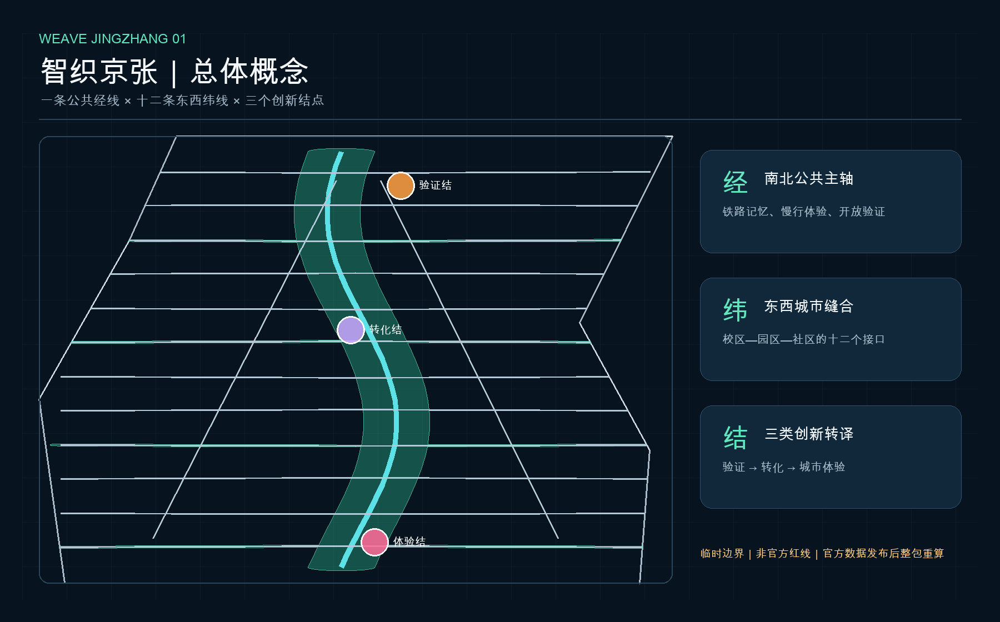
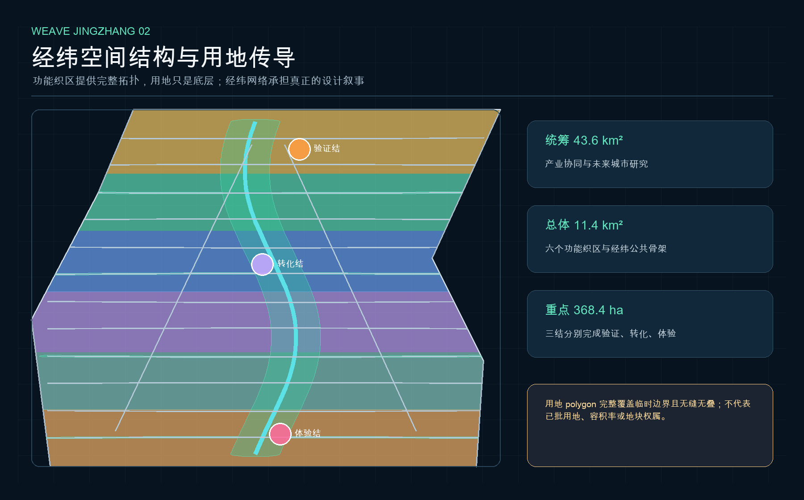
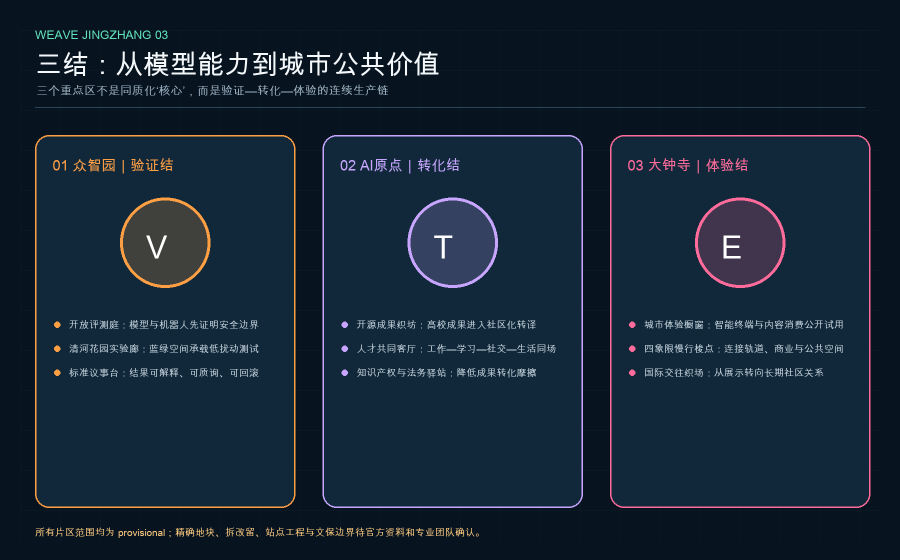
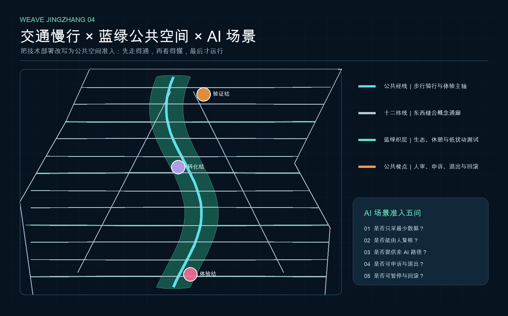
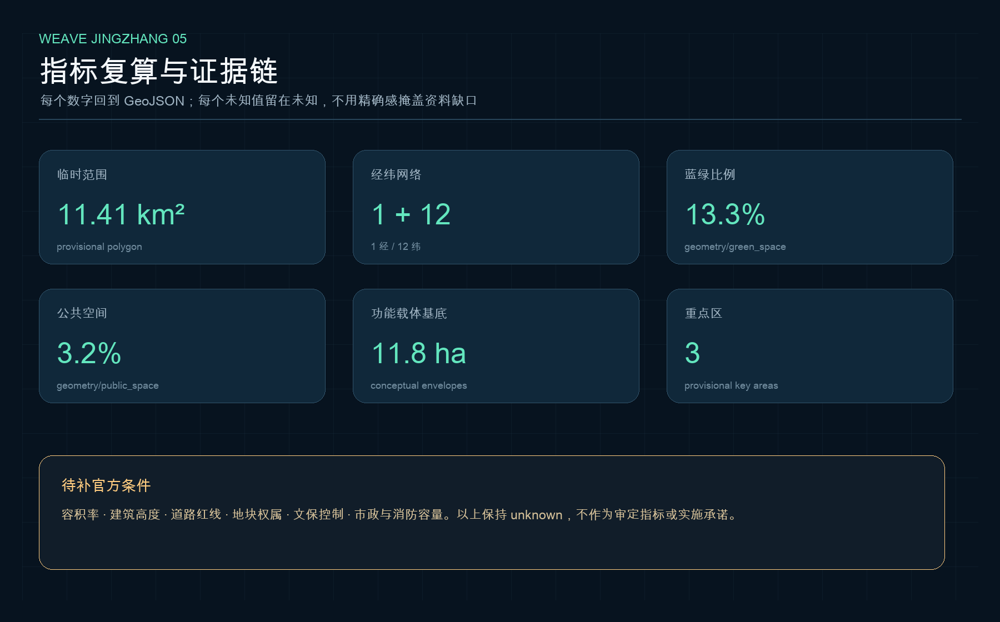

# 智织京张 WEAVE JINGZHANG：一经十二纬三结的AI城市织机

“智织”不是给既有城市贴上一层技术标签，而是把人工智能的研发、验证、转化、体验和治理织进公共空间的日常规则。方案提出“一经十二纬三结”：一条南北向公共经线承接百年京张铁路的工程文化与遗址公园公共性；十二条东西向纬线缝合高校、园区、社区和轨道站点；三处重点区分别成为“验证结、转化结、体验结”。AI 服务进入城市之前，必须通过数据最小化、人工复核、非 AI 替代、可申诉、可退出和可回滚六道公共门槛。

所有空间落地内容均为开放共创的概念建议、参考方案或可供专业团队深化研究的材料，不替代正式规划，不构成政府审定结论。当前采用仓库维护者提供的临时粗略边界；它不是官方红线、审批依据或精确面积依据。官方 polygon、控规、道路、权属、文保、市政与现状底数补齐后，应统一重算全部 GeoJSON、指标、图件、HTML 与 PDF。

## 设计依据与资料清单

方案以海淀分局发布的资格预审公告确认项目名称、三层范围约面积、三处重点区、设计目标和成果深度 [source:OFFICIAL-ANNOUNCEMENT] [standard:PROJECT-OFFICIAL-ANNOUNCEMENT]；以清权的智能体任务书确认三大定位、五大功能、三区两翼、六项 Agent 任务和公共合规边界 [source:AGENT-TASKBOOK] [standard:PROJECT-AGENT-OPEN-CALL-TASKBOOK]。城市设计、公共空间和风貌回应《城市设计管理办法》 [standard:MOHURD-URBAN-DESIGN-MEASURES]；用地、开发强度和实施语言区分设计建议与法定控规 [standard:MOHURD-CONTROL-DETAILED-PLANNING]；用地代码遵循仓库登记的国土空间用地分类子集 [standard:MNR-LAND-USE-CLASSIFICATION-GUIDE]。建筑工程设计深度文件尚缺官方可核验正文，因此只登记为资料缺口，不把第三方镜像升级为权威依据 [standard:MOHURD-ARCH-DESIGN-DEPTH-2016]。

资料选择遵循 [source:SITE-PACKAGE] 与 [source:SOURCE-REGISTRY]：formal 可用来源只支撑其允许用途，provisional-only 来源只支撑生成、可视化和讨论。`data/processed/agent_fact_pack.md` 及 CSV 只是阅读导航，不增加事实权威 [source:PROCESSED-FACT-PACK]。本方案没有使用商业地图瓦片、新闻示意图、航片截图、秘密地图、非公开表格或个人数据。六个国际案例仅用于比较空间和运营机制，不引用企业名单、投资额、产值或政策承诺 [source:GLOBAL-CASE-REFERENCES]。

临时边界来源为仓库维护者根据公告文字四至和约面积形成、并在 EPSG:4548 下校核的 provisional polygon [source:BOUNDARY-SOURCE] [data:geometry/site_boundary.geojson#SITE-001]。三处重点区同样采用临时 polygon [source:KEY-AREA-SOURCE] [data:geometry/key_areas.geojson#PROV-KEY-001]。其用途被约束在 `assumptions.json` 的 A-BOUNDARY-001：官方数据到位后，不仅替换边界，还要重做用地、建筑、道路、绿地、公共空间、分期与指标。本章节完成现状与资料缺口诊断 [depth:existing_conditions_diagnosis]。

## 三层范围工作框架

统筹研究范围约 43.6 平方公里，回答“AI 产业、人才、服务和城市生活如何形成区域协同”；总体设计范围约 11.4 平方公里，回答“公共空间、功能织区、更新载体和设施如何组织”；三处重点区合计约 368.4 公顷，回答“模型能力如何经过验证、转化为产品并进入可选择的城市体验”。三层不是三套平行图，而是战略—结构—接口的逐级传导 [depth:three_level_scope_framework]。

在统筹层，方案把三区两翼视为价值流：众智园负责验证与标准，AI 原点负责开源与成果转化，大钟寺负责城市体验与国际交往；中关村科技服务翼提供知识产权、资本、法务和全球连接，小月河场景赋能翼提供公共服务与生活场景。总体层把价值流转译为“一经十二纬”：经线负责公共性与南北连续，纬线负责东西向缝合。重点层再把三结细化为可观察的公共空间、功能载体、场景卡和治理门槛 [depth:overall_spatial_structure]。

提交边界的投影复算面积为 [metric:site_area_sqm]，它只描述本次 provisional 几何，不应被写成精确官方面积。三处重点区数量为 [metric:key_area_count]；范围位置和面积约值以公告为任务语境，几何位置仍待官方文件确认。六个功能织区完整覆盖提交边界且无缝无叠 [data:geometry/land_use.geojson#LU-001]，但功能分区是城市设计研究，不构成已批用地性质。

## 统筹研究范围产业与未来城市研究

### 名称、Logo 与视觉系统

主名称为“智织京张”，英文名为 “WEAVE JINGZHANG”。“织”同时指向三层关系：铁路的纵向历史线、校区园区社区的横向城市线，以及算法、人才、资本、数据、场景之间的协同线。命名层级为：整带使用 WEAVE JINGZHANG；三个重点区使用 VERIFY KNOT、TRANSLATE KNOT、EXPERIENCE KNOT；十二纬以公共任务命名，如“无障碍纬、开源纬、夜行纬、儿童纬、文化纬”。这套命名不借用企业商标，也不把地块改名写成政府决定。

Logo 方向是两条平行轨线在一个开放结点处交织成字母 W；轨线代表工程记忆，开放结点代表人类可以进入、理解和质询的 AI 系统。主色为“铁路石墨、公共青绿、验证橙、转化紫、体验粉”，全部使用通用几何和自有排版，不使用未授权字体、图片、肖像或企业标识。Logo 只是一带品牌方向，与历史文化导视系统分层管理。

### 六个国际机制案例

案例不做排名，也不把国外制度直接移植。新加坡 one-north 提供“研究机构、企业、教育与生活由公共开发机构长期运营”的复合逻辑；剑桥 Kendall Square 提供“创新集群同时补足住房、餐饮、零售和公共空间”的邻里逻辑；Paris-Saclay 提供“多机构分布式校园通过公共交通与共享设施协同”的网络逻辑；Barcelona 22@ 提供“旧产业区更新与创新经济、居住和公共设施同步”的平衡逻辑；King’s Cross 提供“铁路工业遗产、公共空间和长期场所运营共同塑造地区品牌”的时间逻辑；MaRS Discovery District 提供“医院、高校、创业服务和产业伙伴共享转化接口”的平台逻辑 [source:GLOBAL-CASE-REFERENCES]。

可转化到京张的不是规模数字，而是六个机制：多主体共治、混合功能、公共空间先行、开放测试、成果转化服务、长期场所运营。它们分别进入三结、十二纬、年度活动和更新项目，而不是停留在案例图板。

### AI 创新生态图谱

生态链由“提出问题—获得许可—开发原型—独立评测—公共试用—人工复核—成果转化—日常运营—退出回滚”九步构成。高校、研究机构、企业、开发者、居民、专业机构和维护者在不同步骤拥有不同权责。众智园不只提供研发空间，还承担公开基准、安全评测和标准议事；AI 原点不只孵化企业，还提供开源许可、知识产权、法务、人才与社区接口；大钟寺不只展示产品，还负责在日常消费和公共服务中检验可选择性、可解释性与非 AI 路径。

这套生态回应三大定位：铁路工程记忆支撑百年京张文化带，公共可用的 AI 服务支撑都市 AI 生活体验带，验证—转化—体验的循环支撑 AI 融合创新带。五大功能被编入同一闭环，而不是分散在五个口号区。所有产业布局都是研究建议；招商、资金、算力、数据和政策安排仍须由有权主体依法确定。

## 总体设计范围城市更新与控规深度城市设计

总体结构由“六织区、一经、十二纬、三结、九梭点”组成。六织区以共享边界构造完整用地拓扑：南门户智能原生服务、社区生活与人才服务、京张文化与公共交往、原始创新与成果转化、蓝绿测试与开放协作、北部门户复合生活。各区不是单一用途，而是功能主导的城市设计分区；其分类代码来自仓库枚举，正式用地性质和兼容性须在控规与权属资料到位后确认 [depth:land_use_layout] [data:geometry/land_use.geojson#LU-002]。

“经”以遗址公园方向的连续公共空间为骨架，优先解决步行、骑行、休憩、文化解释和低扰动 AI 体验。“纬”以十二个东西联系表达校区—园区—社区接口，不假定道路红线或桥隧工程。每条纬线都配置一个公共任务：无障碍、儿童、夜间安全、开源协作、人才服务、文化记忆、蓝绿观察、社区健康、法律服务、智能终端体验、国际交往、应急复盘。纬线总数由 [metric:weft_corridor_count] 复核，中心线总长度由 [metric:road_centerline_length_m] 复核；它们是概念网络指标，不是工程里程。

城市更新遵循“先开放接口，再适配载体，后讨论建设量”。第一层是可逆的导视、活动、公共座椅、开放评测和服务窗口；第二层是对既有空间进行低扰动适配；第三层才是在官方控规、现状建筑、权属、市政与文保条件齐备后研究新建或结构性改造。`geometry/buildings.geojson` 中的 18 个多类型 envelope 只表达功能载体颗粒度 [data:geometry/buildings.geojson#BLDG-001]，不声称是现状建筑或具体拆改留。建筑基底面积 [metric:building_footprint_area_sqm] 与概念密度 [metric:building_density] 只服务方案内部一致性，不能替代法定开发强度。

容积率 [metric:floor_area_ratio]、总建筑面积 [metric:total_floor_area_sqm]、道路面积 [metric:road_area_sqm] 与道路比例 [metric:road_ratio] 均保持 unknown，因为缺少已批控制、现状楼层、高度、道路红线和断面。高度、体量、屋顶、界面和色彩采用“连续低层公共基座、节点可识别但不争夺天际线、遗址与蓝绿界面保持克制”的方向性原则 [depth:development_intensity_controls] [depth:height_massing_character]。这些原则须经专业团队在正式条件下深化。

## 重点区域详细设计

### 众智园｜验证结 VERIFY KNOT

定位是“花园中的公开验证场”。空间结构由清河界面、开放评测庭、标准议事台和低扰动测试环构成。研发载体面向模型、机器人、端侧设备与安全治理，公共空间面向公众解释和第三方见证。所有测试先在受控时段和明确边界内运行，必须有人工放行、红队记录、暂停按钮和事故复盘；未通过的能力不进入城市公共服务。绿地承担休憩、生态观察和轻量测试的复合功能，但不越过蓝线、绿线、文保或防洪条件。

交通策略是把对外交通问题拆成“到达—换乘—最后一公里—园内慢行”四个接口，而不提出未经复核的道路工程。建筑策略优先适配可进入的首层公共界面、共享实验空间和小尺度庭院；开发规模与具体拆改留待官方地块、现状建筑和权属核验。片区几何为 [data:geometry/key_areas.geojson#PROV-KEY-001]，只能支持方向性设计。

### AI 原点社区｜转化结 TRANSLATE KNOT

定位是“近校开放成果进入城市的翻译器”。空间结构由开源成果织坊、人才共同客厅、知识产权与法务驿站、生活服务梭点组成。高校成果不以封闭展示为终点，而要经过许可证、知识产权、伦理、场景需求和可维护性五项转译，再进入企业服务或公共试用。工作、学习、社交、居住和生活服务尽量在步行尺度内交织，夜间活动分级管理，为学生、研究者、初创团队、家庭与社区居民保留不同使用节奏。

慢行联系强调校区、园区与街区之间的门槛和断点；轨道站点一体化只提出可达性、导视、无障碍和非机动车组织问题清单，不给工程结论。建筑更新采用“先调查—再分类—后试点”的方法：保留有持续使用价值的载体，低扰动适配公共首层，对安全或功能确有问题的对象再由专业团队论证。片区几何为 [data:geometry/key_areas.geojson#PROV-KEY-002]。

### 大钟寺｜体验结 EXPERIENCE KNOT

定位是“城市日常中的智能原生体验织场”。重点不是制造炫技地标，而是让智能体、智能终端、内容消费和企业服务在真实城市生活中接受选择、理解和反馈。四象限步行梭点把轨道到达、商业界面、公共空间和非机动车组织串成一张可读网络；任何跨路、地下或站内工程均需交通、市政与运营单位专项论证。

公共空间设置城市体验橱窗、国际交往织场和非 AI 服务柜台。同一服务必须提供清晰的人类替代路径；公共交互不采集不必要的身份和行为轨迹；体验失败可现场申诉、暂停和恢复。片区几何为 [data:geometry/key_areas.geojson#PROV-KEY-003]。三处重点区共同完成 [depth:three_key_area_detailed_design]，但其“详细”是证据链、功能、交通、公共空间、治理和风险的完整，而不是伪造精确地块与工程参数。

## AI 创新生态、人才画像与 AI+ 场景

### 六类用户画像

1. 开源开发者需要可信算力入口、版本记录、同伴评审和长期社区声誉；空间响应是开源成果织坊与贡献档案。
2. 高校师生需要成果转化、跨校协作、低成本试验和日常慢行；空间响应是转化结与知识产权法务驿站。
3. 初创团队需要可分阶段使用的载体、测试对象和企业服务；空间响应是验证结—转化结的预约式试验路径。
4. 成熟企业与国际访客需要发布、合作、招聘和城市体验；空间响应是体验结与国际交往织场。
5. 周边居民与家庭需要安静、安全、可达、无障碍和可退出的公共服务；空间响应是十二纬与非 AI 服务柜台。
6. 城市专业人员和公共管理者需要可审计证据、影响评估、应急预案和公众反馈；空间响应是标准议事台和年度复盘。

### 十二张场景卡

| 编号 | 场景与类型 | 空间载体 | 数据与人工边界 | 运营建议 |
| --- | --- | --- | --- | --- |
| S01 | 模型公开评测庭（产业测试） | 众智园验证结 | 公开/清权测试集；第三方见证；人工放行 | 按季度开放评测与失败复盘 |
| S02 | 机器人共行实验环（产业测试） | 众智园绿地与慢行环 | 不做人脸识别；限定时段与速度；现场安全员 | 预约试验，随时暂停 |
| S03 | 端侧公共服务沙盒（产业测试） | 三结公共梭点 | 本地处理、最少上传、人工复核 | 先小范围试用后扩展 |
| S04 | 开源成果织坊 | AI 原点 | 许可、署名、依赖和安全记录公开 | 周度维护会与版本发布 |
| S05 | 知识产权与法务协作驿站 | AI 原点 | 不输入未授权商业秘密 | 人类律师与技术专家共同复核 |
| S06 | 无障碍慢行助手 | 无障碍纬 | 聚合路况，不建立个人轨迹 | 提供纸质/人工替代导视 |
| S07 | 儿童探索梭 | 儿童纬 | 不收集未成年人身份；监护与人工主持 | 学校、社区共同策划 |
| S08 | 夜行安全共评 | 夜行纬 | 只记录设施问题，不推断个人风险 | 居民夜走与照明巡检 |
| S09 | 蓝绿环境来信 | 蓝绿观察纬 | 开放环境数据；异常由专业人员确认 | 月度生态观察与公开解释 |
| S10 | 城市体验橱窗 | 大钟寺体验结 | 明示 AI/非 AI 路径；可退出与申诉 | 产品短期驻留，不作永久背书 |
| S11 | AI 生活服务会客厅 | 社区生活织区 | 不以画像做差别服务；关键建议人工确认 | 医疗、教育、法律只做辅助入口 |
| S12 | 城市应急复盘桌 | 标准议事台 | 使用脱敏、清权案例；不替代指挥 | 事后模拟、公开教训与流程修订 |

三项产业测试场景是 S01—S03，全部以“可暂停、可回滚、可审计”为核心，不把未成熟技术写成可全面部署。十二场景分别映射到 [data:geometry/roads.geojson#ROAD-WARP-001]、[data:geometry/green_space.geojson#GREEN-WARP-001]、[data:geometry/public_space.geojson#PUBLIC-KNOT-01] 与三处重点区。九个公共空间要素数量由 [metric:public_knot_count] 复核。所有场景在进入公共运行前应完成影响评估、人工责任链、非 AI 路径、申诉渠道和退出条件。

## 用地、建筑规模与拆改留方案

六个功能织区的投影面积分别记录为 [metric:land_use_area_05_sqm]、[metric:land_use_area_0702_sqm]、[metric:land_use_area_0803_sqm]、[metric:land_use_area_0802_sqm]、[metric:land_use_area_1401_sqm]、[metric:land_use_area_0701_sqm]。这些数值由同一 site polygon 的共享边界分割得出，和集等于提交边界，避免独立手画导致缝隙或重叠。代码只用于统一语义和内部复算，不能推导出已批用地、产权或可建设量。

建筑图层采用“功能载体 envelope”而非“现状建筑”命名，包含实验、孵化、社区服务、文化、混合和零售六类颗粒度。其目的在于检验公共空间、交通和功能关系，而不是伪造测绘精度。拆改留遵循四步：建立现状调查与安全台账；区分持续使用价值、适配潜力和重大风险；用可逆、低扰动方式先试；经过权属、控规、文保、消防、市政和公众参与后再形成项目级结论 [depth:retain_renovate_demolish]。

风貌使用“织物”而非“未来感造型”作为方法：沿经线保持可连续阅读的公共首层；纬线交叉处形成遮荫、停留和标识的小尺度门廊；三结以公共活动和可见工作过程获得辨识度，不用巨型屏幕或夸张雕塑代替城市设计。屋顶、体量与材料建议强调可维护、低眩光和与铁路遗产相协调；精确高度、退界与强度保持待确认。

## 交通、轨道、市政与公共服务设施

交通策略以“人能否连续走、能否安全停、能否看懂换乘”优先。经线承担南北连续，十二纬分别处理东西断点；三结周边设置步行、骑行、公共交通与活动到达的转换界面。五道口、清华东路西口、大钟寺等站点只提出出入口—公共空间—非机动车—目的地之间的接驳问题，不给出站内改造、桥隧、道路或施工可行性结论 [depth:traffic_rail_slow_parking]。

每条纬线采用“连续性、遮荫、无障碍、夜间可见、过街风险、非机动车停放”六项清单。AI 可以辅助汇总设施报修和聚合路况，但不得跟踪个体通勤、推断个人身份或替代交通管理。重要提示同时提供实体标识和人工服务，避免数字排斥。停车供给、断面和交通容量因缺少底数保持待核。

市政与新型基础设施采用“服务接口而非容量承诺”。端侧算力驿站、分布式能源、环境传感和活动网络只描述空间接口、数据边界与维护责任；能源负荷、机房等级、管线路由、消防、防洪排涝和海绵指标必须由专项资料和专业团队确定 [depth:municipal_new_infrastructure]。公共服务设施先建立学校、医疗、养老、文化、体育和社区服务底数，再以 15 分钟日常需求和 AI 人才的工作—生活—社交—学习需求识别缺口，不能编造设施容量。

## 蓝绿空间、公共空间与城市风貌

蓝绿织层由公共经线和每三条纬线中的一条绿化联系复合而成，投影面积为 [metric:green_space_area_sqm]，相对提交边界的内部比值为 [metric:green_ratio]。公共空间由三结和六个公共梭点组成，并集面积为 [metric:public_space_area_sqm]，内部比值为 [metric:public_space_ratio] [depth:blue_green_public_space]。这些比例是方案几何的复算结果，不是法定绿地率或公共空间指标；清河、小月河、公园实施边界、蓝线、绿线和文保资料到位后必须重算。

公共空间组件库包括：可移动的评测桌、双路径导视（AI 与非 AI）、低亮度信息柱、贡献档案柜、可撤回传感基座、社区议事长凳、无障碍停靠点和应急暂停标识。组件遵循可逆、可维护、可读和不遮挡遗址视线四原则。技术设备不得成为公共空间的永久特权；项目结束或影响评估不通过时应能移除并恢复场地。

三处 AI 朝圣地标不是高大构筑物，而是可参与的公共制度：众智园“公开评测庭”展示模型能力和失败记录；AI 原点“开源贡献档案”记录可核验的代码、数据、标准和社区贡献；大钟寺“城市体验织场”让公众比较 AI 与非 AI 服务并留下申诉与改进建议。三者共同构成“证明—分享—选择”的朝圣路线。荣誉体系只记录可验证贡献，不做付费排名，不使用未经授权的企业标识。

文化叙事以三种“工程”连接百年：京张铁路代表在现实地形和公共目标中解决问题的工程精神；中关村代表开放试验与知识协作；AI 新文化则把工程精神更新为可解释、可质询、可回滚。导视以轨枕间距、经纬交点和版本号为视觉语法，避免把历史当作科技装饰。涉及清华园车站等具体文化资源时，必须依文保范围和官方史料深化。

## 更新项目清单、实施政策与分期计划

更新项目按“梭、纬、结、织区、运营”五类组织：九个公共梭点可先以轻量设施和活动验证需求；十二纬形成慢行和公共服务断点清单；三结建立验证、转化和体验的空间原型；六织区在官方资料齐备后形成项目组合；年度运营把空间维护、场景准入和社区参与连成闭环 [depth:renewal_project_list]。

| 项目 | 概念内容 | 关键依赖 | 评估方式 |
| --- | --- | --- | --- |
| W01 公共经线 1.0 | 连续导视、步骑体验、遗产解释 | 公园、文保、交通与无障碍复核 | 断点数量、人工观察与公众反馈 |
| W02 十二纬体检 | 校区园区社区接口清单 | 道路红线、站点、权属 | 可达性与冲突点闭环率 |
| W03 公开评测庭 | AI/机器人受控测试 | 安全、数据、运营责任 | 失败公开、暂停和回滚演练 |
| W04 开源成果织坊 | 开源、法务、人才、社区转化 | 授权、许可和运营主体 | 贡献可追溯与维护持续性 |
| W05 城市体验织场 | AI/非AI服务并行体验 | 轨道、商业、公共空间许可 | 退出、申诉与修复时效 |
| W06 蓝绿观察网络 | 环境观察、休憩与低扰动测试 | 蓝绿线、防洪、生态 | 专业复核与公开解释 |
| W07 全球织城周 | 评测、开源、公共体验与复盘 | 活动许可、安全和版权 | 从参与到长期社区的转化 |

三期只是依赖顺序 [data:geometry/phasing.geojson#PHASE-001] [depth:phasing_implementation]：近期先做治理规则、轻量梭点、公开评测和十二纬体检；中期在专业复核后推进慢行缝合、公共首层适配和三结协作；远期在官方空间与控规数据到位后整包重算，形成持续运营。三期面积分别为 [metric:phase_1_area_sqm]、[metric:phase_2_area_sqm]、[metric:phase_3_area_sqm]，仅表达本方案的空间覆盖，不代表投资或建设时序。

长期运营采用“四季一循环”：春季公开问题征集与数据审查，夏季小规模原型试验，秋季全球织城周集中展示与同行评测，冬季公开复盘、暂停或合并成熟场景。开发者社区按贡献记录、维护责任和公众影响获得荣誉；企业转化从公开问题、受控测试、第三方评估到日常服务逐级放行。活动、资金、招商和政策均为机制建议，不表述为已确定安排。

## 指标体系、面积复算与合规矩阵

空间复算使用 EPSG:4548，交换几何使用 EPSG:4326。site boundary、land use、green space、public space、building envelopes 和 phasing 均由同一临时边界构造。已知指标必须列出来源文件、公式、置信度和假设；未知指标保留空值和原因，不用估算制造控制精度 [depth:metrics_recalculation]。

核心指标的设计含义如下：临时边界面积只用于本包拓扑；绿地与公共空间比例用于比较方案内部的公共性；建筑基底与密度用于校核载体颗粒度；道路中心线长度和纬线数量用于校核网络完整性；三期面积用于校核分期覆盖。所有 known 指标均在前文或本节引用，机器索引包括 [metric:site_area_sqm] [metric:building_footprint_area_sqm] [metric:building_density] [metric:green_space_area_sqm] [metric:green_ratio] [metric:public_space_area_sqm] [metric:public_space_ratio] [metric:road_centerline_length_m] [metric:key_area_count] [metric:weft_corridor_count] [metric:public_knot_count] [metric:land_use_area_05_sqm] [metric:land_use_area_0702_sqm] [metric:land_use_area_0803_sqm] [metric:land_use_area_0802_sqm] [metric:land_use_area_1401_sqm] [metric:land_use_area_0701_sqm] [metric:phase_1_area_sqm] [metric:phase_2_area_sqm] [metric:phase_3_area_sqm]。

机器可读权威顺序为：几何、指标、标准/深度/合规矩阵、清单、正文、图片、HTML、PDF。核心图层引用完整覆盖 [data:geometry/site_boundary.geojson#SITE-001] [data:geometry/key_areas.geojson#PROV-KEY-002] [data:geometry/land_use.geojson#LU-003] [data:geometry/buildings.geojson#BLDG-002] [data:geometry/roads.geojson#ROAD-WEFT-01] [data:geometry/green_space.geojson#GREEN-WARP-001] [data:geometry/public_space.geojson#PUBLIC-KNOT-02] [data:geometry/constraints.geojson#CONSTRAINT-PROVISIONAL-SITE] [data:geometry/phasing.geojson#PHASE-002]。

`compliance_matrix.json` 覆盖公告 1.3、1.4、1.5 与 agent.1—agent.6 共 23 条任务；`standard_matrix.json` 映射五项 mandatory 标准与一项资料缺口；`design_depth_matrix.json` 覆盖三层范围、总体结构、用地、强度待确认、风貌、拆改留方法、交通、市政、蓝绿、三重点区、项目、分期、指标和风险 15 项。矩阵是证据导航，不替代人类可读论证。

## 风险、版权与合规说明

最大风险不是“方案不够精确”，而是把缺资料包装成精确结论。`geometry/constraints.geojson` 只登记临时边界 [data:geometry/constraints.geojson#CONSTRAINT-PROVISIONAL-SITE]；official boundary、key areas、控规、道路、地块、建筑、文保、市政和公共服务底数继续留在 assumptions 和风险清单 [depth:risk_missing_data]。官方边界发布时应保持 source、版本、坐标系、转换方法与哈希，并触发整包重算。

AI 风险采用六道门槛：最少数据、清晰目的、人工责任、非 AI 替代、申诉退出、暂停回滚。医疗、教育、法律、公共安全等高影响场景只做辅助入口，关键决定由有资格的人类承担。未成年人、个人轨迹、商业秘密和非公开数据不进入本方案。任何试验都需要明确时段、范围、责任人和事故复盘。

版权与生成说明见 `report/copyright_statement.md`。五张图、离线 HTML 与 PDF 均由本包 GeoJSON 和 JSON 派生；未使用远程地图瓦片、外部字体、第三方截图、人物肖像、企业商标或不可再分发素材。国际案例只提炼机制并保留来源链接。`visual/index.html` 完全离线，不加载 CDN、远程脚本、iframe、表单、API 或跟踪代码。

本方案不声称获得批准，不提供法定控规调整、精确建筑高度、具体地块拆改留、道路或桥隧工程、市政管线路由、土地权属、投资测算或保证实施。维护者、人类评审和专业团队保留最终判断；任何进入真实城市的深化都应依法开展调查、论证、公众参与、专业审查和审批。

## 参考资料

- [source:OFFICIAL-ANNOUNCEMENT] 百年京张 AI 创新带城市设计国际方案征集资格预审公告。
- [source:AGENT-TASKBOOK] 面向全球智能体的开源征集任务书摘录。
- [source:SITE-PACKAGE] 设计任务、枚举、标准、本地快照与缺资料清单。
- [source:SOURCE-REGISTRY] 公开/清权/provisional 资料用途登记。
- [source:PROCESSED-FACT-PACK] Agent 事实包与任务导航表。
- [source:BOUNDARY-SOURCE]、[source:KEY-AREA-SOURCE] 仓库临时粗略几何及推定说明。
- [source:GLOBAL-CASE-REFERENCES] one-north、Kendall Square、Paris-Saclay、22@ Barcelona、King’s Cross、MaRS 的官方/机构页面；仅用于定性机制比较。

版本 v0.1 由 OpenAI Codex / Prome 生成并由 GitHub 用户 `hlwhl` 提交。建议下一轮在官方图件或社区评审到位后更新 `changelog.md`、假设、几何、指标和图纸，再运行完整预检。
