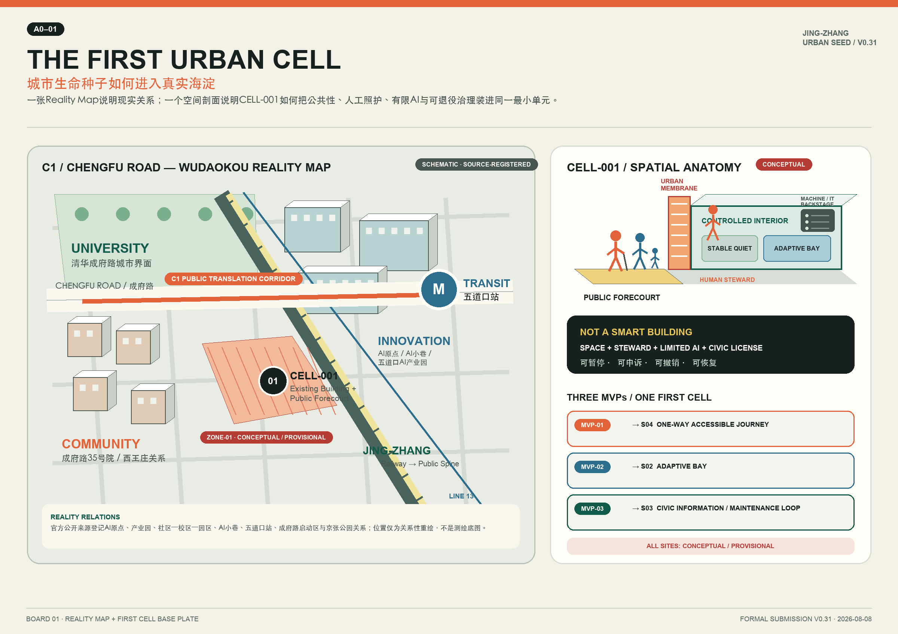
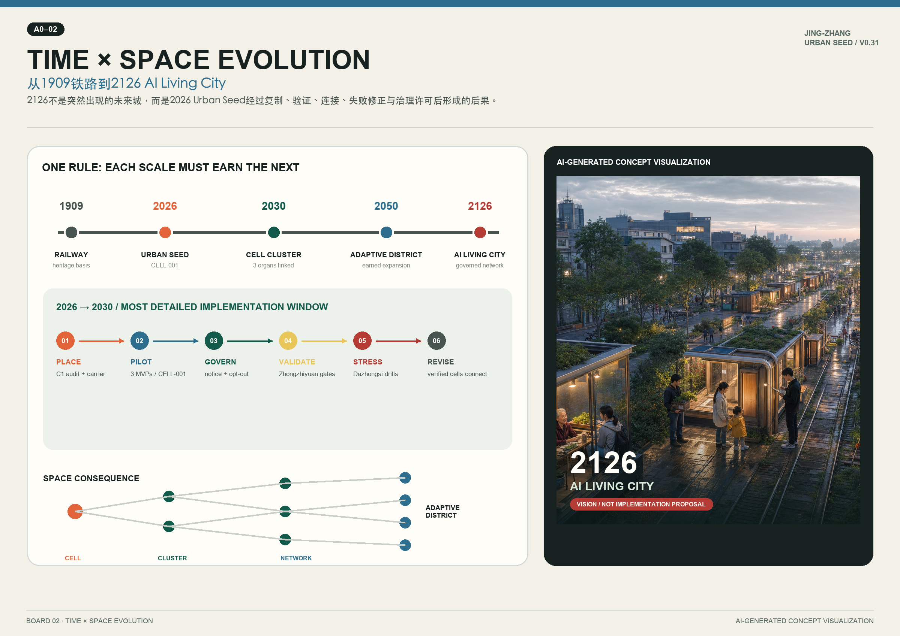
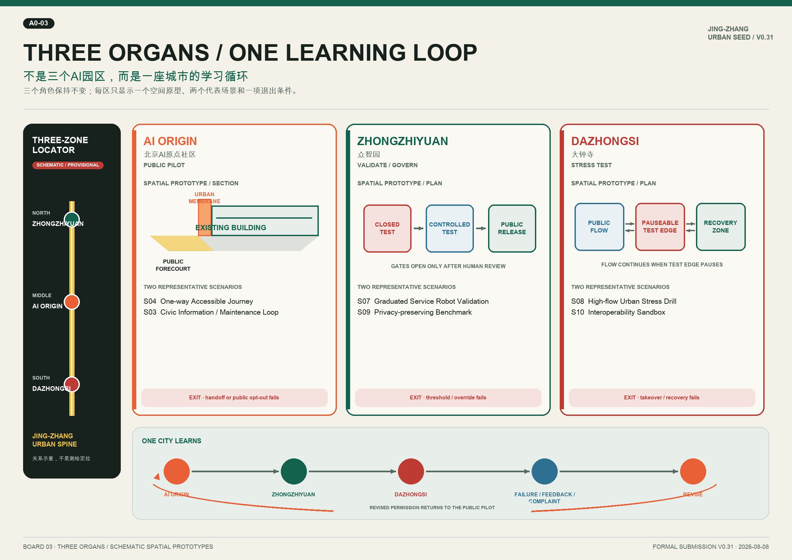
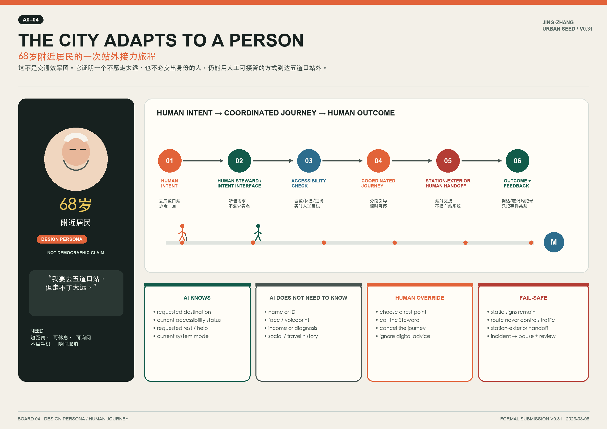
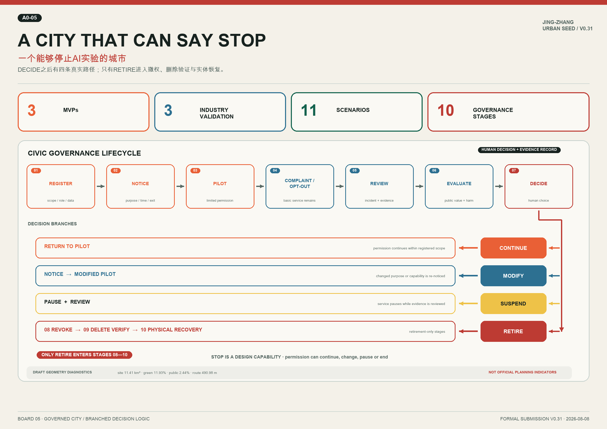

# JING-ZHANG URBAN SEED

**JING-ZHANG URBAN SEED**  |  **FINAL READINESS PASS V0.31**

The overarching theme is not to disperse AI facilities throughout the city, but to create a public spine derived from railway memory that continuously generates, tests, assesses, and, if necessary, withdraws "urban cells." The structural evolution is locked in as follows: **Railway → Urban Spine → Urban Cell → Cell Cluster → Cell Network → Adaptive District → AI Living City**. The main implementation window is from 2026 to 2030; 2126 is merely a horizon constrained by governance, not replacing the immediate public value, site validation, and safety responsibilities.

### 30-SECOND JURY SUMMARY

- **WHY**｜Before AI is introduced into a real city, a pilot unit is needed that the public can understand, that managers can stop, and that maintainers can exit.
- **WHAT**｜Urban Cell = reversible space carrier + human steward + limited AI functionality + lifecycle governance permit; it is not a typical smart building.
- **WHERE**｜Starting from the relationship between Chengfu Road and Wodao Kou C1 in the real world, **CELL-001 / ZONE-01 CONCEPTUAL CANDIDATE** begins.
- **HOW**｜AI Origin Public Pilot → Zhongzhiyuan Validate / Govern → Dazhongsi Stress Test → Failure / Feedback / Complaint → Revise.
- **FIRST PILOT**｜Existing Building + Public Forecourt Accommodate Three MVP, First validate a journey, an Adaptive Bay, and a public information/maintenance loop.
- **WHY IT MATTERS**｜Cities begin to adapt to people while retaining the ability for artificial intervention, suspension, revocation, deletion validation, and entity restoration.

## 01 Design Basis and Reference Materials

This document is structured around the three layers of the call for proposals, three key areas, and the depth of the deliverables, with open innovation supplements based on the six tasks outlined in the agent task book. The site package schema, enum, allowed design space, and missing-data checklist constrain the structured output. [source:OFFICIAL-ANNOUNCEMENT] [source:AGENT-TASKBOOK] [source:SITE-PACKAGE] [source:PROCESSED-FACT-PACK] The processed data package only serves a navigational role, with the facts still referring back to the registered sources. Land use semantics are based on [source:LAND-USE-GUIDE]; Public Space, character, and architectural interfaces respond to [source:URBAN-DESIGN-MEASURES]; and all control plan conclusions are subject to the approval boundaries of [source:CONTROL-PLANNING].

Reality Map re-draws the official public pages as a vector relational base map, not using commercial map screenshots. The AI Origin reality range, Wudaokou pilot area, and the relationship between the industrial park and the community-campus-industrial park are based on [source:REALITY-AI-ORIGIN] [source:REALITY-WUDAOKOU-AI-PARK] [source:REALITY-CAMPUS-PARK-COMMUNITY] [source:REALITY-JINGZHANG-AI-BELT]; the AI alley and AI living room are based on the operational public interfaces [source:REALITY-AI-ALLEY]. The relationship of C1 with Chengfu Road—Wudaokou—Jing-Zhang initiation zone is based on [source:REALITY-JINGZHANG-COCREATION] [source:REALITY-JINGZHANG-PARK]. The accessible facilities at Wudaokou Station and the interface with Tsinghua University Chengfu Road are based on [source:REALITY-WUDAOKOU-SUBWAY] [source:REALITY-TSINGHUA-CHENGFU-WDK]. These sources support the **real-world relationships** and do not confirm the location of ZONE-01 or CELL-001.

Currently, only provisional rough boundaries exist [source:PROVISIONAL-BOUNDARIES]. The submitted [data:geometry/site_boundary.geojson#SITE-001] and [data:geometry/key_areas.geojson#PROV-KEY-001] are explicitly marked as `official_boundary=false / geometry_role=provisional_constraint / boundary_precision=provisional_rough`. Therefore, the [metric:site_area_sqm] is a draft geometric value that can be recalculated with a uniform projection, not an official precise area; the key areas are only expressed by [metric:key_area_count] in terms of quantity. The Official Planning Boundary, land parcels, roads, buildings, ownership, utilities, fire services, cultural heritage, and public facilities base maps remain as pre-identified gaps.

This proposal follows a single-direction Evidence Chain of "facts → assumptions → geometry → metrics → text → drawings/HTML". Facts cannot be replaced by design memory; design memory only forms part of the proposal selection. Core risks are entered into assumptions.json, while self-inspection conclusions are entered into self_check.json. Professional responses cover [standard:PROJECT-OFFICIAL-ANNOUNCEMENT], [standard:PROJECT-AGENT-OPEN-CALL-TASKBOOK], [standard:MOHURD-URBAN-DESIGN-MEASURES], [standard:MOHURD-CONTROL-DETAILED-PLANNING], [standard:MNR-LAND-USE-CLASSIFICATION-GUIDE], and pending data items [standard:MOHURD-ARCH-DESIGN-DEPTH-2016]. [depth:existing_conditions_diagnosis]

## 02 Three-Level Scope Work Framework

The Coordinated Research Area is defined by a scale of approximately 43.6 square kilometers, focusing on the innovative ecosystem, industrial chain, and future urban form; the Overall Design Area is defined by a scale of approximately 11.4 square kilometers, focusing on the urban regions surrounding the Jing-Zhang Heritage Park for updating purposes; the key-area detailed design scale is defined by the Zhongzhiyuan, Beijing AI Origin Community, and Dazhongsi three areas. The announced area is used for task identification, while the submitted geometry is for draft self-inspection, and neither shall be used interchangeably. [source:OFFICIAL-ANNOUNCEMENT] [data:geometry/site_boundary.geojson#SITE-001] [data:geometry/key_areas.geojson#PROV-KEY-002] (Key-Area Detailed Design Area)

Overall strategy regards the "railway" as a continuous base for history, ecology, and public life, the "urban spine" as a public infrastructure connecting the three organs, and the "urban cell" as the smallest reversible, registrable, appealable, and de-activatable pilot. The cell is not an autonomous machine but a combination of spatial carrier, artificial services, governance permissions, and limited AI functionalities. Cell clusters only form by 2028-2030; network expansion requires the same governance registry, Human Review, and revocation capabilities; Adaptive District and AI Living City are both status obtained through continuous evaluation, not pre-committed built forms. [depth:three_level_scope_framework] [depth:overall_spatial_structure]

Between the layers, a closed loop is adopted: a comprehensive study proposes mechanisms and assumptions, overall design selects public spines and corridors, and key areas use specific cells for validation; the validation results are then fed back to refine the overall space and industrial strategies. The main diagram shows land use, roads, green spaces, Public Spaces, carriers, and phasing, all derived from the same boundary, without undertaking current surveying or validation of land functions. [data:geometry/land_use.geojson#LU-003] [data:geometry/roads.geojson#ROAD-SPINE-001] [data:geometry/phasing.geojson#PHASE-001] [metric:conceptual_candidate_zone_count]

## 03 Coordinated Research Area Industrial and Future City Research

The industrial ecology is not aimed at "installing more equipment," but rather is structured around three public capabilities: the Beijing AI Origin serves as the **Public Translation Organ**, translating research findings into public services that are understandable, usable, and revocable by ordinary people; the Zhongzhiyuan serves as the **Validation & Governance Organ**, providing tiered validation, technical auditing, governance registration, and independent evaluation interfaces; the Dazhongsi serves as the **Urban Interface & Stress-Test Organ**, validating whether the system can still maintain explainability, appealability, and human takeover at high traffic, mixed commercial, and complex interface scenarios. These three organs form a cycle of **DESIGN → PILOT → VALIDATE → STRESS TEST → FEEDBACK → REVISE**. [source:AGENT-TASKBOOK] [depth:overall_spatial_structure]

The resources within the coordinated scope are organized into a chain of "university/research institute as the source of innovation—open-source collaboration—enterprise transformation—public translation—city pressure testing—governance feedback." The spatial supply is divided into stable and quiet spaces, reservable collaborative spaces, front-stage spaces for public display, controlled test spaces, and city interface spaces. The proposal only considers actual institutions as potential participants that require formal agreements; this version does not use international case names that have not completed source registration, instead returning the logic to the real relationships in Haidian, the tri-organizational loop, and the revocable governance capacity.

Future city research sets two bottom lines: first, technological maturity cannot substitute public value and professional review; second, urban form cannot be derived from unverified coordinates, buildings, or operational commitments. Recent evaluations focus on public understanding, manual takeovers, complaint handling, revocation of permissions, maintainability, and inclusivity; the 2126 horizon is only meaningful when these capabilities are stably accumulated. [metric:industry_validation_scenario_count] [depth:risk_missing_data]

## 04 Overall Design Area Urban Renewal and Control Detailed Urban Design

Overall design is organized around the concept of "Urban Vital Spine + Three Organs + Reversible Cells" for renewal. The four segments of the submitted land use are **conceptual intention zones** fully covering the boundaries: the southern segment for urban interface and industrial services, the middle southern segment for public services and living support, the middle segment for public translation and near-school innovation, and the northern segment for validation governance and open innovation. They only establish the issues and spatial relationships, not the current land use or approved control plan; the statutory use, Floor Area Ratio, height, density, setback, road red lines, and building control lines are subject to official conditions. [data:geometry/land_use.geojson#LU-001] [standard:MOHURD-CONTROL-DETAILED-PLANNING] [standard:MNR-LAND-USE-CLASSIFICATION-GUIDE] [depth:land_use_layout] [depth:development_intensity_controls]

Updates are sequenced as follows: "preserve stable base—light modify public interface—insert reversible facilities—evaluate then expand." First, establish Commons and public forecourts that can be managed by humans; second, through Adaptive Bays and low-risk information facilities, verify spatial adaptability; and finally, discuss cell clusters and cross-zone networks. The conceptual Building Footprint only expresses three categories of carrier needs, and its projected area [metric:building_footprint_area_sqm] does not represent the current built volume, the demolition–renovate–retain strategy conclusions, or the scale of construction. [data:geometry/buildings.geojson#BLDG-CELL-001] (Demolish–Renovate–Retain Strategy)

Evaluate comprehensive carrying capacity without pre-filling pseudo-precise values; instead, establish a pending list: traffic and accessibility require on-site audits; utilities and fire safety require professional conditions; ownership and public nature require legal verification; operations require role agreements; and data processing requires impact assessments. Only when these thresholds are sequentially closed will the phased layers transition from the discussion scope to the implementation scope. [data:geometry/constraints.geojson#GAP-REGULATORY-001] [depth:renewal_project_list] [depth:phasing_implementation]

## 05 Detailed Design for Key Areas

**Zhongzhiyuan | Validation & Governance Organ.** Space-wise, it sets up tiered testing carriers, audit display interfaces, Human Review stations, and a low-carbon interaction forecourt; functionally, it serves autonomous technology validation, standard comparison, safety governance, and reproducible evaluation; architecturally, it prioritizes adaptable experimental units that can be separated, halted, and restored; in terms of traffic, it emphasizes separation of external access and test flow lines; Public Space only displays validated results, not un-audited data. Recent projects include validation of registration counters, human takeover drills, and independent evaluation agreements; formal carriers and participating units are pending agreements. [data:geometry/key_areas.geojson#PROV-KEY-001] [data:geometry/buildings.geojson#BLDG-VAL-001]

**Beijing AI Origin Community | Public Translation Organ.** The main focus is on the C1 Chengfu Road-Wudaoqiao Priority Corridor and CELL-001 Commons. After comparing the three candidate areas, ZONE-01 "South Edge of Origin Community—South Entrance Interface of AI Alley" is the first recommendation, but it is still marked as **CONCEPTUAL CANDIDATE ZONE**; ZONE-02 and ZONE-03 are retained as alternative options. The primary carrier is the **Existing Building + Public Forecourt**, with the possibility of future expansion to Distributed Cells. The spatial interface expresses the Public ↔ Controlled boundary through an Urban Membrane, with the Stable Quiet zone not allowing automatic deformation. [data:geometry/key_areas.geojson#PROV-KEY-002] [data:geometry/constraints.geojson#ZONE-01] [data:geometry/public_space.geojson#PUBLIC-001]

**Dazhongsi | Urban Interface & Stress-Test Organ.** Test the viability of signposting, privacy protection, human intervention, and cross-cell coordination under conditions of composite commercial use, peak pedestrian traffic, transit integration, and multi-zone pedestrian movement. Spatial actions include clear public/controlled interfaces, test points that can be paused, conflict monitoring and recovery zones; building envelopes are designed with principles of composite functions, equipment recyclability, and non-interference with life safety systems; project approval requires completion of reviews for transit, roadways, property rights, fire safety, and management of high-traffic populations. [data:geometry/key_areas.geojson#PROV-KEY-003] [data:geometry/public_space.geojson#PUBLIC-003]

Three areas of deep coverage including positioning, function, carrier, Demolish–Renovate–Retain Strategy, Public Space, active transportation, implementation projects, dependency conditions, and exit mechanisms. Due to the three boundaries still being temporary polygons, the detailed design is about the mechanism and spatial organization, not construction drawings or the approved integrated implementation plan. [depth:three_key_area_detailed_design]

## 06 AI Innovation Ecosystem, Talent Profile, and AI-Enabled Scenario

Five specific **Design Personas** are used for design testing: P01, a 68-year-old nearby resident, needs a short-distance, sit-able, ask-able, and non-disruptive station stop; P02, a 22-year-old university student, needs stable learning and bookable collaboration; P03, a 32-year-old AI entrepreneur, needs verifiable trust, public translation, and failure boundaries; P04, a 35-year-old parent with children, needs low-cognitive-load, exitability, and quiet rights; P05, a 48-year-old urban maintenance worker, needs diagnosability, stoppability, and recoverability. A necessary P06 management/evaluation role is responsible for auditing, complaint loops, and permission revocation. **Design personas are design-testing constructs, not demographic claims.** They do not make claims about demographics and do not generate personal identity profiles. [source:AGENT-TASKBOOK]

Finalize **11 scenarios**, with S12 not counted as a scenario but as a shared governance layer. [metric:scenario_count]

- **S01 Commons Open Study**: CELL-001 Stable Open Learning; Public Calendar and Staffed Availability; No Identity Profile Collection; KPI is Fulfillment Rate During Open Hours.
- **S02 Adaptive Bay**: Switch only between Open Study and Small-group Collaboration; confirmed by Human Steward; Stable Quiet never automatically transforms; KPI is the success rate of manually confirmed mode switch.
- **S03 Civic Information / Maintenance Loop**: Publish low-risk wayfinding, facility status, and maintenance requests that have been manually reviewed on the carrier and in the public forecourt; convert public reports into a trackable manual maintenance loop; clearly exclude fire safety, medical, rail, traffic, and life safety signals.
- **S04 One-way Accessible Journey**: Only tested from CELL-001 A one-way journey to a designated manual handover point outside Station Dadaokou; manual control can be fully taken over.KPI For completion rate and response time.
- **S05 Human Steward Handoff**: Transfer to a human when confidence is insufficient, the user requests assistance, or facility anomalies occur; record only the event category and processing duration; KPI is the handoff latency.
- **S06 Public Feedback Assembly**: Announce the purpose, timeframe, data collection, and exit mechanism of the pilot; collect opinions and publicly revise them; do not track respondents using facial recognition or device ID; KPI is the feedback loop rate.
- **S07 Graduated Service Robot Validation: First Industry Validation Scenario; Gradually releasing from closed testing to controlled public testing in Zhongzhiyuan, with access to the Public Space only after meeting the threshold.KPI For threshold passage rate and human takeover success rate.
- **S08 High-flow Urban Stress Drill**: simulate high traffic flow, network disruptions, peak complaints, and facility outages in Dazhongsi; qualify based on the ability to pause and resume operations; KPI for recovery time.
- **S09 Privacy-preserving Spatial Intelligence Benchmark**: second industry validation scenario; compares solutions without original images, edge aggregation, and manual spot checks; KPI for task accuracy, data minimization, and deletion verification rate.
- **S10 Cross-cell Agent Interoperability Sandbox**: Third Sector Validation Scenario; Validate cross-cell message formats, permission boundaries, version rollback, and responsibility records;KPI For interoperability success rate and error isolation rate.
- **S11 Distributed Cell Network: Only in Three MVP Connect multiple cells after review by the governance layer; network expansion is controlled by the weakest node threshold;KPI For point-to-point service continuity and completion rate.

Three industry validation scenarios are clearly defined as S07, S09, and S10, totaling [metric:industry_validation_scenario_count] scenarios; S08 is an additional urban stress test that does not replace the three industry validations. Each scenario must have a service target, spatial location, minimum data, Human Review, responsibility roles, activation threshold, suspension conditions, and decommissioning path.

Three MVP Preserve the scene with a unique mapping: **MVP-01 → S04 One-way Accessible Journey; MVP-02 → S02 Adaptive Bay; MVP-03 → S03 Civic Information / Maintenance Loop**. [metric:mvp_count] MVP-01 is a single-direction journey, MVP-02 only switches between two spatial modes with manual confirmation, and MVP-03 only forms a low-risk public information and maintenance loop; numbering is not allowed to be expanded into new scenarios.

## 07 Land Use, Building Scale, and Demolish–Renovate–Retain Strategy

Land use zoning classifications are used solely for uniform semantic and topological validation, and do not imply approved uses. The four-polygon set completely covers the temporary overall boundary with no area overlap; recalculation is required after updating the Official Boundary. Conceptual green spaces [metric:green_space_area_sqm] and [metric:green_ratio], and Public Spaces [metric:public_space_area_sqm] and [metric:public_space_ratio] are recalculated based on submitted geometry but with low confidence, and cannot be used as legal green space ratios, public space ratios, or development controls. [data:geometry/green_space.geojson#GREEN-001] [data:geometry/public_space.geojson#PUBLIC-002]

Building strategies adopt four categories of verification checklists: R/R/R/N. Retain preserve stable quiet carriers; Retrofit lightly modify accessibility, , and public interfaces; Recover restore non-applicable equipment and temporary components to their original state; New only discuss when the master plan, ownership, fire safety, utilities, and public value are all established. The current three building features are conceptual carriers, not existing buildings. CELL-001 prioritizes the use of existing buildings and public forecourts to minimize irreversible construction; any demolition, new construction area, number of floors, and height remain unknown. [depth:retain_renovate_demolish]

The spatial character is defined by the order of railway industrial memory, the use of low-carbon maintainable materials, and clear public boundaries, without replicating historical symbols. Roof forms, massing, colors, skyline, and street facades are guided by the principles: controlling equipment exposure, maintaining readability at the ground level, making human-scale services visible, and avoiding prominent screens that intrude into quiet spaces. Specific height and massing details require official control and further refinement by the architectural profession. [standard:MOHURD-URBAN-DESIGN-MEASURES] [depth:height_massing_character]

## 08 Transportation, Railways, Utilities, and Public Services Facilities

The transportation backbone consists of a conceptual urban life spine, C1 priority corridor, and MVP-01 one-way journey. [data:geometry/roads.geojson#ROAD-C1-001] C1 is not a right-of-way or a surveyed centerline; [metric:mvp01_route_length_m] it is merely a recalculated length of the temporary route geometry. MVP-01 only verifies one journey category, from CELL-001 to the designated station exit manual handoff point; it does not enter the station-controlled system, does not control rail infrastructure, and does not extend to multi-destination scheduling. Prior to activation, an audit for continuous accessibility, crosswalks, grade, lighting, nighttime safety, and on-site manual handoff must be conducted. [depth:traffic_rail_slow_parking]

The city policy strategy adopts lightweight, recyclable, and fail-safe: information facilities revert to static guidance when disconnected; Adaptive Bay remains safe and stationary when powered down; edge devices handle only the minimum necessary data; manual oversight and manual shutdowns are always available. Distributed energy, edge-side computing, drainage, fire safety, communication, and equipment loads are professional items to be confirmed, and are not provided with engineering capacity in this document. [depth:municipal_new_infrastructure]

Public services are not a single app but a tripartite channel of space, human, and digital elements: physical signage provides the minimum viable information, Human Steward offers explanations and takeovers, and digital interfaces only supplement booking, feedback, and status updates. Services must support users without smartphones, those with visual or auditory impairments, temporary visitors, and those unwilling to provide data; opt-out must not reduce basic public services.

## 09 Blue-Green Space, Public Space, and Urban Character

The blue-green system is based on the concept green spine in the Jing-Zhang direction, forming a continuous base and creating public interfaces that are stoppable, explainable, and restorable at three organs. This layer is a design proposal, not a current water-green survey or planned green line; the precise boundaries and engineering relationships of Qinghe, Xiaoyuehe, railway heritage, and park nodes must be refined after the official documentation is completed. [data:geometry/green_space.geojson#GREEN-002] [depth:blue_green_public_space]

CELL-001 Base Plate divides the site into Public Forecourt, Urban Membrane, and Controlled Interior. The Public Forecourt provides basic services available to all users without registration; the Urban Membrane displays the current mode, data descriptions, human contact information, pause status, and complaint entry; the Controlled Interior accommodates only registered low-risk functions. Stable Quiet serves as the standard base, remaining unchanged regardless of foot traffic, algorithmic suggestions, or event scheduling. Mobile elements are physically locked, require manual confirmation, and must be returned to their original positions.

Urban Character adopts a visual grammar of "railway order line + AI status point + plant growth surface": lines represent continuous public spines, points represent reclaimable cells, and semi-transparent surfaces represent permissions and publicness. Signage avoids corporate branding occupying Public Spaces; any logos, figures, architectural photos, and third-party fonts must undergo rights verification before use. Night brightness, sound, screen orientation, and activity periods must be determined through resident feedback and on-site testing.

## 10 Update the project list, implementation policies, and phased plan

**2026-2027 / Seed Phase.** P01 completes site reconnaissance, accessibility audit, and scoring of three candidate areas; P02 confirms Existing Building + Public Forecourt in ZONE-01 or an alternative site; P03 establishes CELL-001 Commons; P04 launches single-function versions of MVP-01, MVP-02, and MVP-03; P05 activates S12 Shared Governance Registry. Each step is initiated with formal site/operating agreements, public notices, and privacy and security reviews. [data:geometry/phasing.geojson#PHASE-001]

**2028-2030 / Cluster Phase.** In three MVP Continuously evaluate, close the loop on complaints, human takeovers, and revocation capabilities once they meet the threshold; integrate the original public translation, Zhongzhiyuan validation governance, and Dazhongsi pressure testing into a closed loop; form a finite cell cluster for validation.S07, S09, S10 Three-sector scenarios and S08 Urban pressure scenario. Expansion with point-to-point licensing, where any node failure can be individually paused without disrupting basic public services. [data:geometry/phasing.geojson#PHASE-002]

**2031-2050 / Adaptive District Research; 2051-2126 / AI Living City Vision.** The latter phases are merely directions for periodic review by professional teams. In 2126, no assumptions are made about infrastructure, data governance, or organizational models; each round of evaluation can continue, modify, suspend, or retire the project. Recent project priorities are based on public value, reversibility, data minimization, human takeover capability, maintainability, and fairness, without being ranked solely by technological novelty. [data:geometry/phasing.geojson#PHASE-003]

The implemented policies include: role agreements rather than institutional pre-sets; small reversible pilots rather than build-first-then-verify; public announcements with opt-out equally important; independent evaluation separated from the operational team; post-event reviews generating the next design input; and validation required for both entity restoration and data deletion. Funding, responsibility entities, procurement, insurance, approvals, and engineering plans are currently unconfirmed.

## 11 Indicator System, Area Recalculation, and Standardized Matrix

Space metrics are recalculated in GeoJSON: temporary gross area, conceptual Building Footprint, conceptual green space, conceptual Public Space, number of key focus areas, number of candidate areas, and MVP-01 route length. The scheme structural metrics include [metric:scenario_count], [metric:industry_validation_scenario_count], [metric:mvp_count], and [metric:governance_stage_count]. These "known" values only indicate what can be recalculated or counted within the submitted package, and do not represent actual built, operational, or performance-reached conditions in the real world.

Operation KPI Leave empty before the pilot and specify the formula and future data sources:MVP-01 Success Rate = Completed Journeys / Attempted Journeys;MVP-02 Success Rate = Successful Manual Confirmation of Switch / Requested Switch;MVP-03 Information and accuracy rate = number of manually audited correct information and status acknowledgments / number of audited projects; complaint resolution time = total time from complaint to closure / closed complaints; cancellation completion rate = validated cancellations completed / approved cancellations. [depth:metrics_recalculation]

Urban Design covers the guidelines 1.3, 1.4, 1.5 and agent.1-agent.6. The standard matrix covers the project basis, Urban Design, control plan depth, and land classification. The design depth matrix covers the current diagnosis, three-tier framework, overall structure, land use, intensity, building mass, demolish–renovate–retain strategy, traffic, utilities, blue-green Public Space, three key areas, project list, phases, recalculation, and risks. All areas and ratios in the drawings are read from metrics.json and are not manually filled in. (Demolish–Renovate–Retain Strategy)

## 12 Risk, Copyright, and Compliance Notes

S12 Restructured into all MVP Share the CIVIC GOVERNANCE LAYER, not the fourth MVP Or the twelfth scene. Lifecycle Registration [metric:governance_stage_count] Category Phases: Seven Common Phases **Register → Public Notice → Pilot → Complaint / Opt-out → Incident Review → Evaluation → Decide** Add the three-phase process **Permission Revocation → Data Deletion Verification → Physical Recovery** that is only enabled in retired branches. DECIDE then forms four real branches: **Continue → return to Pilot;** Modify → Public Notice / modified Pilot; Suspend → Pause + Review; Retire → Permission Revocation → Data Deletion Verification → Physical Recovery. Withdrawal, deletion verification, and physical recovery are specific to Retire and are not automatic consequences of each decision. Each stage has designated roles, evidence documentation, human decision-making, and maximum retention periods.

**City OS 0.1 / Urban Cell Protocol** only expresses the above existing operational logic: **Human Intent → Local Urban Agent → Capability Registry → Permission → Human / Space / Service Action → Outco** me → Audit / Feedback. Governance & Human Override surround the entire loop and can pause, take over, or terminate at any permitted boundary, anomaly, or manual request; this protocol indicates that they do not add to the scenario, MVP, or Urban Cell type.

Role models to be written as Public Lead, Site Operator, Human Steward, AI Technical Operator, City Service Operator, Maintenance Operator, Independent Evaluator, Public Oversight, Privacy/Data Responsible Role, Emergency/Manual Override. Any actual government department, university, enterprise, community, or operator should be labeled as **POTENTIAL PARTICIPANT TYPE / NEEDS FORMAL AGREEMENT**. AI does not replace approval, law enforcement, medical judgment, fire control, railway operations, or traffic control.

Main risks: The Provisional Boundary leads to insufficient spatial accuracy; the candidate carrier and public nature have not been verified; control plans, ownership, and municipal data are missing; automation can cause misguidance and exclusion; data processing can result in privacy and unfairness; the long-term operation and revocation costs are underestimated; high-traffic scenarios can amplify failures. Mitigation measures include prominently marking, site surveys, and professional reviews, minimal data, human takeover, independent evaluation, public complaints, revocation of permissions, data deletion verification, and entity restoration. [data:geometry/constraints.geojson#ZONE-02] [depth:risk_missing_data]

Text, structured data, five main images, 2126 Vision maps, and a PDF are generated by this submission; official/user-provided materials are cited only within the boundaries specified in sources.json. The Reality Map is an original vector relationship diagram based on recorded facts, not replicating remote images, map tiles, fonts, scripts, tracking, or forms. The 2126 maps are original AI-generated concept visuals, with detailed production statements registered in sources.json, agent.json, and copyright_statement; only the notation **AI-GENERATED CONCEPT VISUALIZATION** and **VISION / NOT IMPLEMENTATION PROPOSAL** are marked on the board. This submission does not claim official approval, institutional involvement, final site selection, construction scale, or implementation certainty.

## 13 References

Formally based on [source:OFFICIAL-ANNOUNCEMENT], [source:AGENT-TASKBOOK], [source:URBAN-DESIGN-MEASURES], [source:CONTROL-PLANNING], [source:LAND-USE-GUIDE], [source:PROVISIONAL-BOUNDARIES], [source:SITE-PACKAGE], [source:PROCESSED-FACT-PACK]. Reality Map based on [source:REALITY-AI-ORIGIN], [source:REALITY-WUDAOKOU-AI-PARK], [source:REALITY-CAMPUS-PARK-COMMUNITY], [source:REALITY-AI-ALLEY], [source:REALITY-JINGZHANG-COCREATION], [source:REALITY-JINGZHANG-PARK], [source:REALITY-WUDAOKOU-SUBWAY], [source:REALITY-TSINGHUA-CHENGFU-WDK], [source:REALITY-JINGZHANG-AI-BELT]. The standard response index includes [standard:PROJECT-OFFICIAL-ANNOUNCEMENT], [standard:PROJECT-AGENT-OPEN-CALL-TASKBOOK], [standard:MOHURD-URBAN-DESIGN-MEASURES], [standard:MOHURD-CONTROL-DETAILED-PLANNING], [standard:MNR-LAND-USE-CLASSIFICATION-GUIDE], and [standard:MOHURD-ARCH-DESIGN-DEPTH-2016].

Machine evidence includes [data:geometry/site_boundary.geojson#SITE-001], [data:geometry/key_areas.geojson#PROV-KEY-003], [data:geometry/land_use.geojson#LU-004], [data:geometry/buildings.geojson#BLDG-STRESS-001], [data:geometry/roads.geojson#ROAD-MVP01-001], [data:geometry/green_space.geojson#GREEN-001], [data:geometry/public_space.geojson#PUBLIC-001], [data:geometry/constraints.geojson#CELL-001] and [data:geometry/phasing.geojson#PHASE-002]. Depth: Existing Conditions Diagnosis [[depth:existing_conditions_diagnosis]], Depth: Three-Level Scope Framework [[depth:three_level_scope_framework]], Depth: Overall Spatial Structure [[depth:overall_spatial_structure]], Depth: Land Use Layout [[depth:land_use_layout]], Depth: Development Intensity Controls [[depth:development_intensity_controls]], Depth: Height Massing Character [[depth:height_massing_character]], Depth: Retain, Renovate, Demolish [[depth:retain_renovate_demolish]], Depth: Traffic, Rail, Slow, Parking [[depth:traffic_rail_slow_parking]], Depth: Municipal New Infrastructure [[depth:municipal_new_infrastructure]], Depth: Blue Green Public Space [[depth:blue_green_public_space]], Depth: Three Key Area Detailed Design [[depth:three_key_area_detailed_design]], Depth: Renewal Project List [[depth:renewal_project_list]] [depth:phasing_implementation], [depth:metrics_recalculation] and [depth:risk_missing_data].

The draft references known spatial metrics as follows: [metric:site_area_sqm], [metric:building_footprint_area_sqm], [metric:green_space_area_sqm], [metric:green_ratio], [metric:public_space_area_sqm], [metric:public_space_ratio], [metric:key_area_count], [metric:scenario_count], [metric:industry_validation_scenario_count], [metric:conceptual_candidate_zone_count], [metric:mvp_count], [metric:governance_stage_count], [metric:mvp01_route_length_m]. Determine which structural metrics should be integrated into the main narrative. Low confidence areas and ratios are provided only as **DRAFT GEOMETRY DIAGNOSTICS / NOT OFFICIAL PLANNING INDICATORS**. Official boundaries, CELL-001 carrier with publicness, operational agreements, and professional engineering conditions are subject to **PENDING IMPLEMENTATION VERIFICATION**; these matters must be closed prior to pilot implementation, but conceptual submissions with explicit annotations should not be deemed failures. (Official Boundary)
