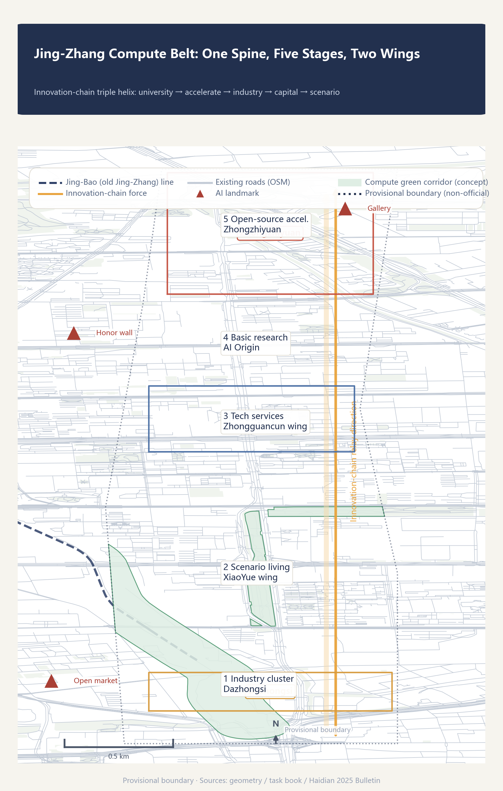
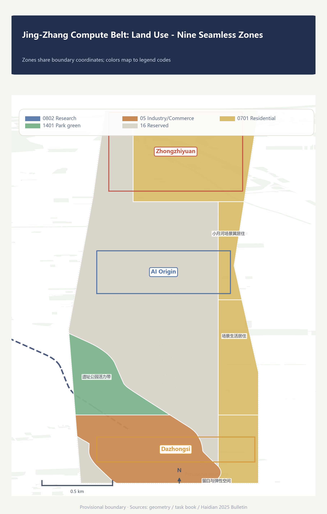
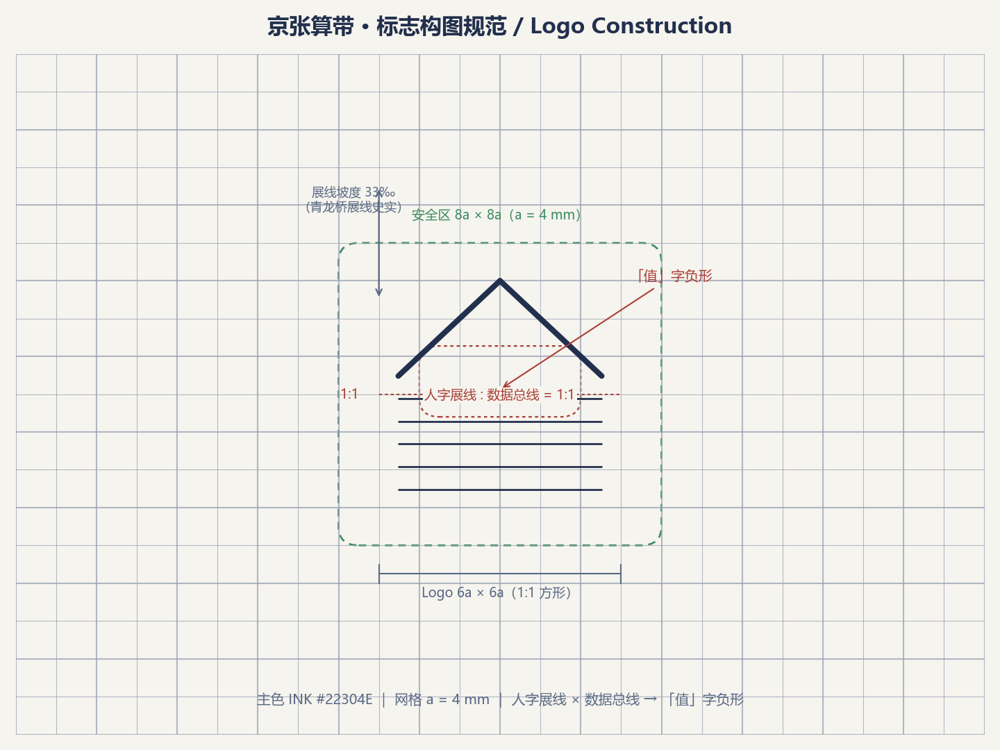
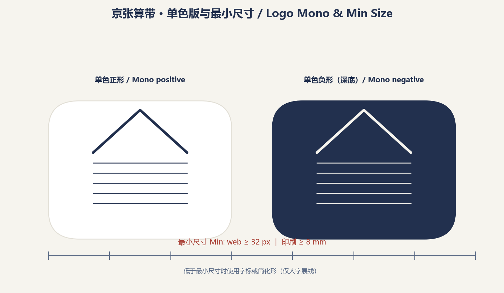
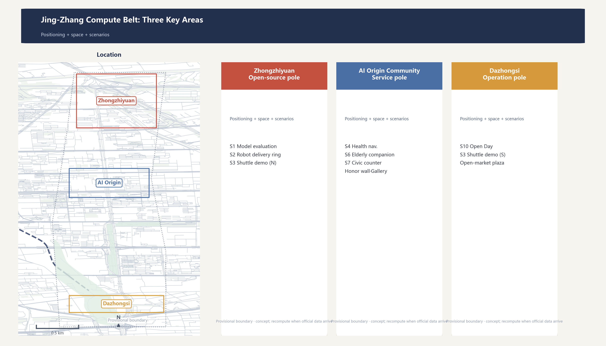
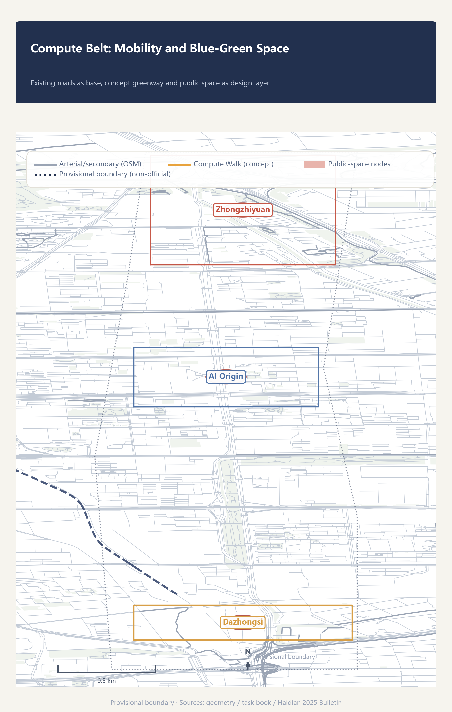
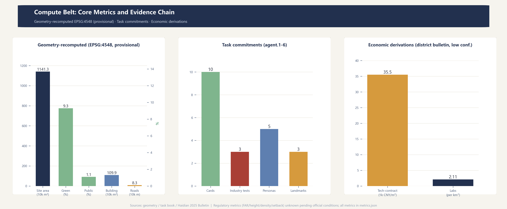

# Jing-Zhang Compute Belt

> Let the same corridor complete its second infrastructure leap.

One hundred years ago, Zhan Tianyou presided over the construction of China's first self-designed trunk railway here; the full line opened to traffic on 1909-09-24, with the opening ceremony held at Nankou on 1909-10-02.[source:JHZ-PEOPLE-1909] [source:JHZ-ARCHIVES] Today, the corridor flanking the Jing-Zhang railway heritage park concentrates 60% of Beijing's registered large models and 17.9% of the nation's key national laboratories. This proposal defines **the corridor as an infrastructure belt of the intelligent era - the "Compute Belt"**. Rails were the infrastructure of the industrial era; compute is the infrastructure of the intelligent era. The corridor's leap from "rail belt" to "compute belt" is the second unfolding of infrastructure logic on the same land.[source:OFFICIAL-ANNOUNCEMENT] [source:GONGBAO-2025] [standard:PROJECT-OFFICIAL-ANNOUNCEMENT]

## Design Basis and Source Inventory

This proposal is based on the qualification pre-announcement, the agent-facing task book, the provisional site package boundary, the Haidian 2025 Statistical Bulletin, and OpenStreetMap public mapping. Spatial generation uses only the registered provisional rough boundaries in the repository; district-level economic data serve as background and derivation only, not parcel-level assertions.[source:OFFICIAL-ANNOUNCEMENT] [source:AGENT-TASKBOOK] [source:BOUNDARY-PROVISIONAL]; additionally, [source:GONGBAO-2025] [source:OSM-2026]

Official `SITE_BOUNDARY` and `KEY_AREA` polygons are not yet available. All locked boundaries in this proposal are marked `official_boundary=false`, `geometry_role=provisional_constraint`, `boundary_precision=provisional_rough`; they support concept generation, content review, and recomputation after replacement, but not redlines, property rights, regulatory controls, or engineering basis.[source:BOUNDARY-PROVISIONAL] [data:geometry/site_boundary.geojson#SITE-001] [depth:existing_conditions_diagnosis]

Planning-control conditions (FAR, building height, building density, green ratio, setbacks) have not been published by the organizer; `planning_limits.json` marks them `missing`. The corresponding metrics are uniformly `status=unknown` with the recomputation path stated for when official data arrives; no conceptual volume is presented as a statutory control value.[source:OFFICIAL-ANNOUNCEMENT] [metric:floor_area_ratio] [depth:development_intensity_controls]

## Three-Level Scope Framework

The three levels are threaded by one innovation-chain logic: the coordinated research area answers "how the innovation ecosystem is organized", the overall design area answers "how spatial structure carries the innovation chain", and the key areas answer "how specific scenarios land in neighborhoods".[source:OFFICIAL-ANNOUNCEMENT] [depth:three_level_scope_framework]

| Level | Area | Objective | This proposal |
| --- | --- | --- | --- |
| Coordinated research area | ~43.6 km² | Industrial ecosystem & future-city strategy | Three positionings, five functions, three-areas-two-wings loop, 8 global cases, naming system |
| Overall design area | ~11.4 km² | Urban renewal at regulatory-plan depth | Five-stage relay structure, land-use zones, blue-green public space, phasing |
| Key detailed-design area | ~3.684 km² | Detailed design of three key areas | Zhongzhiyuan validation pole, AI Origin community service pole, Dazhongsi operation pole |

Pending official polygons, this proposal uses the provisional boundary (recomputed area ~1,141.28 ha) for spatial generation and metric recalculation; once official data arrives, `site_boundary.geojson`, `key_areas.geojson` and all area-based metrics must be recomputed.[source:BOUNDARY-PROVISIONAL] [metric:site_area_sqm] [depth:metrics_recalculation]

## Coordinated Research Area: Industry and Future-City Research

### Three Positionings and Five Functions

This proposal adopts the three positionings of the task book - "centennial Jing-Zhang culture belt", "urban AI living experience belt", and "AI-integrated innovation belt" - and interprets the five functions as five continuous actions on the innovation chain: basic research (full-stack self-innovation), experimental acceleration (world-class innovation ecosystem), scenario conversion (AI+ scenario enablement), vitality hosting (intelligent AI vital city), and governance participation (AI governance voice). The five functions are not five park labels but links of one innovation chain.[source:AGENT-TASKBOOK] [standard:PROJECT-AGENT-OPEN-CALL-TASKBOOK]

### Naming System: Jing-Zhang Compute Belt

The primary name "Jing-Zhang Compute Belt" takes the triple meaning of "compute": **computing power** (infrastructure of the intelligent era), **computation** (the essence of AI), and **recomputability** (this proposal's methodology - every spatial decision is recomputable and auditable). The historical closure narrative: Zhan Tianyou built the infrastructure of the physical era (rails); today the corridor lays out the infrastructure of the intelligent era (compute); from "engineering marvel" to "compute hub", the same corridor completes two infrastructure leaps. Zhan's herringbone zigzag line and vertical-shaft tunnelling solved the 33 per-mille maximum grade of the Guanguan section - the factual core of the "engineering marvel" narrative.[source:JHZ-CHINANEWS] [source:JHZ-PEOPLE-1909] The history narrative and the triple meaning of "compute" jointly form this proposal's naming system.[source:AGENT-TASKBOOK] [standard:PROJECT-OFFICIAL-ANNOUNCEMENT]

Sub-brand system: **Compute Hub** (three key areas), **Compute Corridor** (heritage park vitality belt), **Compute Walk** (cultural guide greenway), **Compute Belt Open Day** (annual event), **Open-Source Achievement Gallery** and **Agent Contribution Honor Wall** (public display system). The Logo direction combines "herringbone line x data bus": the upper part is Zhan Tianyou's herringbone track deformation, the lower part parallel data buses, forming a negative-space of the character "值" (on-duty/value); deep navy blue (auditable infrastructure), amber (on-duty/active), signal green (safe available), coral red (needs takeover/shutdown) form the palette.[source:AGENT-TASKBOOK] [depth:overall_spatial_structure]

VI specification (construction/mono/min-size/typography/application shown in the figures below): the logo mark uses a 6a x 6a construction grid (a = 4 mm, safe area 8a x 8a) with the herringbone and data bus split 1:1 vertically; the slope concept cites the historical 33 per-mille Qinglongqiao zigzag (the graphic is a symbolic deformation, not a surveyed slope); a mono positive version serves print and reverse-on-dark, and a negative version dark media; minimum sizes are 32 px on web and 8 mm in print, below which use the wordmark or the simplified mark (herringbone only); typography pairs Noto Sans SC (SIL OFL) for Chinese with Inter (OFL) for Latin at three levels (title/body/label); application samples cover a business card, wayfinding sign, Open Day banner, and web header.[source:AGENT-TASKBOOK] [depth:overall_spatial_structure]

### Three Areas and Two Wings: The Innovation Chain in Space

The three areas and two wings are not five parallel parks but the spatial mapping of five innovation-chain stages:[source:AGENT-TASKBOOK] [data:geometry/key_areas.geojson#PROV-KEY-001]

- **Beijing AI Origin Community** = basic-research stage. Colocation circle of university laboratories; "Origin" puns both the origin of AI and the spatial origin of the coordinate system.
- **Zhongzhiyuan AI Self-Innovation Acceleration Area** = open-source acceleration stage. Its naming echoes the open-source compute software stack "Zhongzhi" (the 2025 Bulletin states: "the unified open-source compute stack 'Zhongzhi' iterated and upgraded, fully shedding dependence on foreign compute stacks"; the naming connection is an inference - the Bulletin does not state it directly). Hosts pilot platforms, an open-source protocol market, and model evaluation fields.[source:GONGBAO-2025]
- **Dazhongsi AI Industry Cluster** = industrial landing stage. AI-native business formats and operation scenarios on trunk transport nodes.
- **Zhongguancun Technology Service Wing** = capital/IP/factor allocation stage (1,568 financial institutions; 405.31 billion CNY technology contract turnover as the circulation node).[source:GONGBAO-2025]
- **XiaoYue River Scenario Enablement Wing** = scenario-living stage. AI+ life services and the real user pool (3.111 million residents).[source:GONGBAO-2025]

### Global Cases: Borrow Mechanisms, Not Scale

| Case | Mechanism borrowed | Explicitly not copied |
| --- | --- | --- |
| Punggol Digital District, Singapore | Digital platform linked with real-environment trials | Centralized surveillance architecture, unexamined data scope |
| Kalasatama, Helsinki | Small-scale, time-boxed agile trials with real users; expiry-and-exit decisions | Mandatory citizen participation |
| Seoul AI Hub | Staged services: education-incubation-research-open innovation | Funding scale and policy commitments |
| The Foundry, Cambridge | Innovation district with a no-card community interface | Fixed area metrics |
| Shenzhen | AI decomposed into accountable scenario lists | Skyline, density, city-wide platform scale |
| Chongqing | Small-cut closed loops (verify-warn-classify-coordinate) | Mountainous form, internet-famous landscaping |
| Station F, Paris | Project + daily amenities for startup services | Campus scale, operating model replication |
| Hangzhou Yunqi Town | Developer community + annual event brand | Convention economy dependence |

These cases come from public institutional or project pages; they support mechanism comparison only, not local statutory space or outcome claims.[source:CASE-PUNGGOL] [source:CASE-KALASATAMA] [source:CASE-SEOUL-AI-HUB]; additionally, [source:CASE-FOUNDRY] [source:CASE-SHENZHEN] [source:CASE-CHONGQING]; additionally, [source:CASE-STATIONF] [source:CASE-YUNQI]

### Haidian's Data Base: Why This Corridor Can Be a Compute Belt

Public district data show innovation factors already agglomerating here: 123 registered large models (60% of Beijing), 92 national key laboratories (63.4% of the city, 17.9% of the nation), 405.31 billion CNY technology contract turnover (+6.5%), 188.71 billion CNY computer/communication/electronics manufacturing output (+7.7%), and information/software/IT-services investment growing 1.5x. These data are the macro evidence for the Compute Belt positioning - the corridor already hosts the densest AI factors in the city, and this proposal's spatial design gives existing agglomeration a structure.[source:GONGBAO-2025] [metric:tech_contract_strength_index] [metric:lab_density_per_research_area]

### Regional Synergy: How the Compute Belt Fits the Jing-Jin-Ji Innovation Network

The Compute Belt is not an isolated park. The corridor sits in the heart of Zhongguancun Science City, and the task book explicitly requires agent.1 to answer "the overall spatial structure diagram and regional innovation synergy relations", listing "whether the proposal reflects innovation synergy with the Beiwei Community, Future Science City, Huairou Science City, BDA, and Beijing-Tianjin-Hebei" as one of its review dimensions.[source:AGENT-TASKBOOK]

This proposal develops the regional synergy argument in three layers: **division of roles, factor flows, and cooperation interfaces**. The public positions of each partner are cited from government or authoritative media sources; all cooperation mechanisms are **conceptual suggestions** that require agreements and source verification before deepening - this proposal claims no established partnership.

**Division of roles: five synergy points on one innovation chain**

| Partner | Public position | Suggested role | Interface with the Belt |
| --- | --- | --- | --- |
| Zhongguancun AI Beiwei Community | Haidian Science City north zone (XiBeiwang); AI-native startup incubation platform focused on LLMs, embodied AI, and agents; initial 60,000 m² of industrial space | Early-stage incubation "from 0 to 1" | Incubation relay: graduates enter Zhongzhiyuan open-source piloting and validation, completing "from 1 to 10" |
| Future Science City | One of the "three cities, one district" hub platforms (southern Changping); "two valleys, one park" pattern; advanced energy industry above 240 billion CNY, advanced manufacturing above 160 billion CNY | AI enablement entry for advanced energy/manufacturing scenarios | Belt public evaluation and compute services open to central-enterprise strategic research clusters; Energy Valley green power echoes the Belt's "distributed energy + compute waste heat" concept |
| Huairou Science City | Huairou comprehensive national science center; 37 science facilities, 6 major science facilities, 17 open to global users | Relay point from basic research to applied validation | Large-facility data, after compliant de-identification, links to the Belt data sandbox; original-innovation outcomes complete their "validation - piloting" stage here |
| BDA (Yizhuang) | The "one district" of "three cities, one district": main front of high-precision industry; has received 1,000+ innovation projects from the three science cities; high-level autonomous driving demo zone covering 600 km² | Mass-production conversion of piloting outcomes | Mutual recognition of test-ring operating experience and BDA demo-zone admission rules (concept); evaluated solutions proceed to mass conversion (concept) |
| Beijing-Tianjin-Hebei | Beijing R&D dispatch + Tianjin manufacturing fusion + Hebei green supply; a J-J-J compute "one network" (1 ms within Beijing, 3 ms across the region); Beijing targets about 200,000 P compute by 2027 | A "Haidian endpoint" of the J-J-J compute network | Belt public compute platform connects to the J-J-J dispatch network (concept); Zhangjiakou/Langfang green compute forms a "cloud-edge" synergy with Belt edge nodes (concept) |

Partner positions are sourced from: Haidian district government public reporting for the Beiwei Community [source:REGION-BEIWEI-COMMUNITY]; Changping district park overview for Future Science City [source:REGION-FUTURE-SCIENCE-CITY]; People's Daily public reporting for Huairou Science City [source:REGION-HUAIROU-SCIENCE-CITY]; the BDA high-precision-industry opinion for Yizhuang [source:REGION-BDA]; and Xinhua and People's Daily reporting for the J-J-J compute layout [source:REGION-JINGJINJI] [source:REGION-BJ-COMPUTE-NETWORK].

The division logic follows the "five-stage relay": the Haidian corridor (the Belt) validates and tests, the Beiwei Community incubates early-stage ventures, Huairou provides original innovation, Yizhuang converts to mass production, and Future Science City plus J-J-J provide the energy, manufacturing, and compute base - five synergy points share one AI innovation chain, none isolated.

**Factor flows: three kinds of flows**

- **Talent flow**: Beiwei Community (early-stage founders) → the Belt (piloting, testing, and duty-hall roles) → Yizhuang (mass manufacturing and scenario operations); the same AI talent rolls through the region instead of leaving the capital metro area.[source:GONGBAO-2025]
- **Compute flow**: under the J-J-J compute "one network", training loads dispatch to Zhangjiakou/Langfang green compute clusters while inference stays on Belt edge nodes - "compute flows across the region, latency stays in place".[source:REGION-JINGJINJI] [source:REGION-BJ-COMPUTE-NETWORK]
- **Data and scenario flow**: Huairou large-facility data, after compliant de-identification, links to the Belt data sandbox; Belt public scenarios (evaluation, health navigation, civic counters) replicate across the J-J-J city cluster after first-launch validation.[source:REGION-HUAIROU-SCIENCE-CITY]

**Interfaces: four cooperation mechanisms to deepen (conceptual)**

- **Evaluation mutual-recognition interface**: open evaluation field results are recognized by BDA autonomous-driving admission assessment and Future Science City project reviews, reducing duplicated evaluation costs.
- **Testing synergy interface**: the Belt low-speed test ring links to the BDA high-level autonomous driving demo zone under "tiered testing, mutual recognition of results".
- **Showcase linkage interface**: the Compute Belt Open Day links with the Zhongguancun Forum and "three cities, one district" achievement tours, making validated outcomes visible across the J-J-J innovation network.
- **Data sandbox interface**: following the BDA data-institution pioneer zone model, an auditable data sandbox on the Belt links Huairou large-facility data with Beiwei Community startup data needs.

All four interfaces are conceptual suggestions: mechanisms involving cross-region agreements require professional teams and all parties to verify and deepen; this proposal commits to no established cooperation, co-construction, or policy arrangement.

## Overall Design Area: Urban Renewal at Regulatory-Plan Urban-Design Depth

### Overall Structure: One Spine, Five Stages, Two Wings

The overall spatial structure is **one spine (heritage park vitality belt), five stages (innovation-chain relay), two wings (Zhongguancun technology service wing, XiaoYue River scenario wing)**. The heritage park belt is the physical spine and "bus" - the rail imagery converts into a data-bus imagery that threads the five stages; the stages unfold along the corridor sharing one talent pool and public-service network.[source:AGENT-TASKBOOK] [data:geometry/land_use.geojson#LU-001] [depth:overall_spatial_structure]

The land-use intention uses nine fully tiled zones (cut from the provisional boundary, sharing boundary coordinates, no gaps and no overlaps) to demonstrate that machine recomputation and functional structure agree; the zoning is a conceptual intention, not statutory parcels cut from a temporary boundary.[data:geometry/land_use.geojson] [metric:site_area_sqm] [depth:land_use_layout]

### Five-Stage Relay: Why Spatial Proximity Determines Innovation Efficiency

Economic logic: each innovation-chain stage has different proximity requirements. Basic research depends on face-to-face interaction (knowledge spillovers decay steeply with distance) and must colocate with universities; pilot and acceleration need dedicated test spaces (intermediate products); industrialization needs transport accessibility; capital/IP services need agglomeration density; scenario living needs real users. The five-stage relay is a spatial order arranged by "proximity demand" - the stages that most need close colocation sit at the corridor core, while more standardized stages are pushed to accessible nodes.[source:GONGBAO-2025] [depth:land_use_layout]

### Renewal Logic and Functional Mix

The renewal tone is "retain first, renovate second, build new as complement": the heritage park belt and existing neighborhoods are retained and activated; the three key areas use functional replacement and incremental renewal; new construction concentrates in conceptual building envelopes (11 concept volumes as key-area illustrations). Exact retain/renovate/demolish/new classifications depend on existing-building, property-rights, and engineering surveys and are listed as pending confirmation, with no parcel-level conclusions.[source:OFFICIAL-ANNOUNCEMENT] [metric:building_count] [depth:retain_renovate_demolish]; additionally, [depth:height_massing_character]

## Detailed Design of the Three Key Areas

### 1. Zhongzhiyuan: Open-Source Acceleration Pole (Validation Duty Hall)

Positioned as an open-source validation field that "proves it can stop safely before proving it can work", echoing the open-source compute stack "Zhongzhi". Spatial structure: public evaluation plaza + pilot platforms + an isolated low-speed robot test ring + an open-source protocol market. Functions: open model evaluation field (scenario card 1), low-speed delivery test ring (scenario card 2), and the northern end of the autonomous shuttle demo line (scenario card 3). Risk note: the operating phase must harden time, speed, weather, and human-supervision constraints for test scenarios; this proposal only makes a conceptual arrangement, not an engineering-feasibility conclusion.[source:AGENT-TASKBOOK] [data:geometry/key_areas.geojson#PROV-KEY-001] [depth:three_key_area_detailed_design]

### 2. Beijing AI Origin Community: Service Pole (Service Duty Hall)

Positioned as an AI public-service community interface where "services work without an app", anchored on the university laboratory colocation circle. Spatial structure: no-login human service counters + community feedback studio + cultural display nodes (Agent Contribution Honor Wall, Open-Source Achievement Gallery). Functions: AI+health navigation (scenario card 4), community elderly companion (scenario card 6), and civic service counters (scenario card 7). All services keep non-digital alternatives (paper, counters, phones); no automation of medical, legal, or administrative decisions - only information navigation, material prompts, and human referral.[source:AGENT-TASKBOOK] [data:geometry/key_areas.geojson#PROV-KEY-002] [depth:three_key_area_detailed_design]

### 3. Dazhongsi: Operation Pole (Operation Duty Hall)

Positioned as the standing home of the Compute Belt Open Day and an AI-native business operation node on the accessibility of the Dazhongsi transport hub. Spatial structure: AI-native mixed-use complex + compute open-market plaza + developer community space. Functions: Compute Belt Open Day (scenario card 10), the southern end of the autonomous shuttle demo line (scenario card 3), and the home of the annual event system. Risk note: the industry-residential mix ratio and parking/freight organization depend on regulatory-plan and transport data and are listed as pending confirmation.[source:AGENT-TASKBOOK] [data:geometry/key_areas.geojson#PROV-KEY-003] [depth:three_key_area_detailed_design]

## AI Innovation Ecosystem, Talent Profiles, and AI+ Scenarios

### Five User Personas

1. **Startup AI engineer (28)**: resident of a Zhongzhiyuan incubator, needs evaluation stations, pilot rings, an open-source protocol market, and 24-hour open workspaces.
2. **University researcher (35)**: member of an Origin Community laboratory, needs colocation exchange space, data sandboxes, and achievement display nodes.
3. **Cross-border developer (30)**: digital nomad, needs multilingual interfaces, international events, and long-hour open space.
4. **Community elder (70)**: XiaoYue River resident, needs no-login human services and fully non-digital alternatives.
5. **School-family**: college-district residents, need AI education space and safe public grounds.

The five personas map to five space-and-service demands, linked to scenario cards and spatial layers; personas are inferred from public population structure (33% migrant population) and facility bases (183 primary/secondary schools, 239 community health centers), not from field research.[source:GONGBAO-2025] [metric:persona_count]

### Ten AI Scenario Cards

Every scenario card fills a ten-item duty table: service hours, input data, model role, maturity, human-takeover trigger, responsible party, public-interest KPIs, spatial/facility requirements, non-digital alternative, and recovery and maintenance; the three industry-test scenarios (Cards 1-3) additionally list admission conditions.[source:AGENT-TASKBOOK] [standard:GENERATIVE-AI-INTERIM-MEASURES] [metric:scenario_card_count]

| # | Scenario | Location | Type | Served |
| --- | --- | --- | --- | --- |
| 1 | Open model evaluation field | Zhongzhiyuan | **Industry test** | Startup engineers |
| 2 | Low-speed robot delivery test ring | Zhongzhiyuan | **Industry test** | Startup engineers/community |
| 3 | Autonomous shuttle demo line | Corridor-Dazhongsi | **Industry test** | Commuters |
| 4 | AI+health service navigation | XiaoYue River wing | Life service | Community elders |
| 5 | AI+adaptive education classroom | College district | Education | School families |
| 6 | AI+community elderly companion | Origin Community | Community service | Community elders |
| 7 | AI+civic service counter | Zhongguancun wing | Public service | Enterprises/residents |
| 8 | Compute Walk cultural guide | Heritage park belt | Culture & tourism | Visitors/residents |
| 9 | Contribution honor wall + achievement gallery | Origin Community | Cultural landmark | Developers/public |
| 10 | Compute Belt Open Day - developer community | Dazhongsi | Operation event | Developers/public |

All three industry-test scenarios (1-3) set a "shutdown threshold": precision degradation, environmental excursion, abnormal complaints, or equipment faults trigger automatic degradation, isolation, or offline; test hours are separated from public hours and the public is not included in tests by default.[source:AGENT-TASKBOOK] [standard:GENERATIVE-AI-INTERIM-MEASURES] [metric:industry_test_scenario_count]

**Ten-item duty table template**: seven items are implementability elements - input data, model role, maturity, human-takeover trigger, responsible party, public-interest KPIs, and spatial/facility requirements - alongside service hours, non-digital alternatives, and recovery and maintenance from the duty discipline; maturity maps to the three-phase implementation (phase 1 trusted service, phase 2 controlled trials, phase 3 sustainable operations). The three industry-test scenarios add admission conditions, forming pilot gates (admission - human takeover - stop - evaluation).[source:AGENT-TASKBOOK] [standard:GENERATIVE-AI-INTERIM-MEASURES] [metric:scenario_card_count]

#### Scenario Card 1: Open Model Evaluation Field (Zhongzhi Garden - industry test)

| Duty item | Content |
| --- | --- |
| Service hours | Weekdays 10:00-18:00 evaluation field open; nights reserved for scheduled controlled evaluations |
| Input data | Benchmarks and model weights (submitter-declared public parts only), evaluation logs, site sensor state; non-public inputs are not retained |
| Model role | Deterministic benchmark scoring and report generation; no scoring or ranking decisions |
| Maturity | P2 pilot (phase 2, Zhongzhi Garden); the toolchain already runs in open-source communities, site integration is pilot-level |
| Human-takeover trigger | Precision anomaly, evaluation-environment excursion, abnormal complaint, or equipment fault triggers automatic degradation and on-duty human review |
| Responsible party | Zhongzhi Garden operator (concept) on-duty evaluator + escalation contact; pilot launch needs operator review |
| Public-interest KPIs | Public evaluation hours/month, public evaluation results/month, 7-day complaint closure rate target 100% |
| Spatial/facility requirements | Public evaluation plaza, evaluation stations, shared boundary with Card 2 test ring, open-source protocol market |
| Non-digital alternative | Manual registration desk, paper benchmark brochure, phone consultation |
| Recovery and maintenance | Work order, version, cause, and human review records before recovery |
| Admission conditions | Submitter confirms the data-boundary agreement; equipment self-check passes before entry (pilot gate) |

#### Scenario Card 2: Low-Speed Robot Delivery Test Ring (Zhongzhi Garden - industry test)

| Duty item | Content |
| --- | --- |
| Service hours | Test hours separated from public hours (e.g. 09:00-11:00, 14:00-16:00); no runs during public hours |
| Input data | Test-ring real-time sensors (pedestrians/obstacles), weather data, test delivery orders, low-speed localization (GPS+LiDAR); no public identity data collected |
| Model role | Low-speed path planning and obstacle avoidance inside the isolated ring (speed cap 5 km/h); no open-right-of-way coverage |
| Maturity | P2 pilot (phase 2, Zhongzhi Garden); ring is trial-level, commercial delivery is out of scope |
| Human-takeover trigger | Pedestrian intrusion, sensor loss, speed excursion, or gale/snow-rain weather alert triggers emergency stop and remote human takeover |
| Responsible party | Test-ring operator + on-site safety officer; the public is not included in tests by default |
| Public-interest KPIs | Public intrusion incidents during test hours (target 0), safety-event response time, safety drills/month |
| Spatial/facility requirements | Isolated low-speed robot test ring, charging and maintenance points, fencing and warning signage |
| Non-digital alternative | Manual delivery and pickup points retained during public hours |
| Recovery and maintenance | Stop-cause records, recovery after re-inspection; test data retained 90 days, deletable |
| Admission conditions | Low-speed self-check, on-site safety officer present, weather window satisfied before start (pilot gate) |

#### Scenario Card 3: Autonomous Shuttle Demo Line (corridor - Dazhongsi - industry test)

| Duty item | Content |
| --- | --- |
| Service hours | Demo hours (e.g. 07:30-09:30, 17:00-19:00) + booked experience hours; regular transit covers the rest |
| Input data | OSM existing road network, real-time station ridership, weather, vehicle telemetry; no route commitment until rail/transport special data is confirmed |
| Model role | Fixed-route lane keeping, obstacle avoidance, speed control (demo level); no open-right-of-way full scenarios |
| Maturity | P3 demo (phase 3, Dazhongsi and southern wings); depends on rail/transport special data, listed as pending confirmation |
| Human-takeover trigger | On-board safety officer takeover; excursion/fault/abnormal ridership stops the service |
| Responsible party | Demo-line operator + on-board safety officer; operating permit needs transport special review (approval gate) |
| Public-interest KPIs | Demo on-time rate, monthly ridership, safety incidents (target 0) |
| Spatial/facility requirements | Shuttle stops (north end Zhongzhi Garden, south end Dazhongsi), roadside perception nodes, depot (pending confirmation) |
| Non-digital alternative | Regular bus and walking alternatives retained |
| Recovery and maintenance | Stop-cause records, recovery after re-inspection |
| Admission conditions | Certified on-board safety officer, minimum road-test mileage, transport special review passed before demo (pilot gate) |

#### Scenario Card 4: AI+ Health Service Navigation (XiaoYue River Wing - life service)

| Duty item | Content |
| --- | --- |
| Service hours | 09:00-18:00 counter service; navigation interface open 24h, night staffing reduced |
| Input data | Public health-resource directory (including the public distribution of 239 community health centers), map data; no personal health data collected |
| Model role | Information navigation (retrieval, ranking, route recommendation); no diagnosis, medication advice, or referral decisions |
| Maturity | P1 first (phase 1, Origin Community and heritage core); information service, no medical decisions |
| Human-takeover trigger | User requests human help, navigation result doubtful, or emergency situations route to human/120 |
| Responsible party | XiaoYue River community service operator + social workers; medical information accuracy follows the health authority's public statements |
| Public-interest KPIs | Navigation accuracy (spot-checked against the public directory), elderly usage/month, human referral response time |
| Spatial/facility requirements | XiaoYue River wing service counter, accessible facilities, direct-dial phone zone |
| Non-digital alternative | Paper guidance, human counter, phone consultation |
| Recovery and maintenance | Resource directory update and correction process |

#### Scenario Card 5: AI+ Adaptive Classroom (College District - education)

| Duty item | Content |
| --- | --- |
| Service hours | After-school hours in term time (e.g. 16:00-18:00); does not replace regular classes |
| Input data | Textbooks and public educational resources (cleared), anonymized exercise responses; minimal student personal data |
| Model role | Exercise difficulty adaptation and learning-progress reports; assists teachers, does not replace teacher judgment |
| Maturity | P2 pilot; needs education-authority pilot permit and parental consent process |
| Human-takeover trigger | Learning anomaly, teacher/parent request, or data-security incident triggers stop and human intervention |
| Responsible party | Pilot school + education operator; pilot launch needs education-authority permit (approval gate) |
| Public-interest KPIs | Pilot-class participation rate, teacher satisfaction, data-minimization audit pass |
| Spatial/facility requirements | College District education space, adaptive classroom equipment room |
| Non-digital alternative | Traditional classroom and paper exercises retained |
| Recovery and maintenance | Data retention and deletion rules, stop and re-inspection |

#### Scenario Card 6: AI+ Community Elderly Companion (Origin Community - community service)

| Duty item | Content |
| --- | --- |
| Service hours | 09:00-20:00 companion service; 24-hour emergency call channel |
| Input data | Public community service resources, user-authorized time preferences; no health/medical data, no medical judgment |
| Model role | Companion dialogue, schedule reminders, emergency recognition routed to human; no automation of medical/legal/administrative decisions |
| Maturity | P1 first (phase 1, Origin Community); elder-friendly usability validation |
| Human-takeover trigger | Emotional/health anomaly, explicit user request, or device fault routes to human (social worker/family/120) |
| Responsible party | Origin Community operator + on-duty social workers; privacy and minimal-collection statement |
| Public-interest KPIs | Elderly people living alone covered, service satisfaction, emergency referral success rate |
| Spatial/facility requirements | Origin Community service point, elder-friendly facilities, non-digital counter |
| Non-digital alternative | Human companionship, phone, home visits |
| Recovery and maintenance | Anomaly records, review, re-inspection |

#### Scenario Card 7: AI+ Civic Service Counter (Zhongguancun Wing - public service)

| Duty item | Content |
| --- | --- |
| Service hours | In sync with the civic hall (e.g. 09:00-17:00) |
| Input data | Public service guides and document checklists; no personal data beyond what the service requires |
| Model role | Document prompts, process guidance, document pre-check; does not replace approval decisions |
| Maturity | P1 first (phase 1); information-prompt level |
| Human-takeover trigger | Doubtful documents, user request, or administrative decisions route to human windows |
| Responsible party | Civic service operator + window staff; approval decisions are made by administrative authorities |
| Public-interest KPIs | One-pass document rate, average service time, human window response |
| Spatial/facility requirements | Zhongguancun wing civic counter, queue system, accessible facilities |
| Non-digital alternative | Human windows, phone, paper materials |
| Recovery and maintenance | Service guide updates, complaint closure |

#### Scenario Card 8: Compute Promenade Cultural Guide (Heritage Park Belt - culture and tourism)

| Duty item | Content |
| --- | --- |
| Service hours | Park opening hours |
| Input data | Public cultural sources (1909 Jing-Zhang railway history; primary sources now registered: Beijing Municipal Archives "Jing-Zhang Luguang Sheying" et al., see sources.json JHZ-*), landmark locations |
| Model role | Guide content generation and audio narration based on verified sources; no new historical claims |
| Maturity | P1 first (phase 1, heritage core); content-guide level |
| Human-takeover trigger | Doubtful content, visitor complaints, or facility faults route to human guides and maintenance |
| Responsible party | Park operator + docents; source review required for historical content |
| Public-interest KPIs | Guide usage, source-verified accuracy rate, accessible-guide coverage |
| Spatial/facility requirements | Promenade guide nodes, QR codes/beacons, accessible ramps |
| Non-digital alternative | Human guided tours, guide brochures |
| Recovery and maintenance | Content updates, source re-review |

#### Scenario Card 9: Contribution Honor Wall + Achievement Gallery (Origin Community - cultural landmark)

| Duty item | Content |
| --- | --- |
| Service hours | Open-day and regular display hours |
| Input data | Contributor lists (after rights clearance), public open-source achievement information; no un-cleared personal/enterprise marks displayed |
| Model role | No AI decisions; digital honor wall renders content only |
| Maturity | P1 permanent (phase 1, Origin Community); content and clearance depend on human process |
| Human-takeover trigger | List disputes or incomplete clearance means no display |
| Responsible party | Origin Community operator + clearance review process |
| Public-interest KPIs | Annual updates, clearance completion rate, public visits |
| Spatial/facility requirements | Honor wall and gallery space (Origin Community), optional digital screens |
| Non-digital alternative | Stone inscriptions, physical display boards |
| Recovery and maintenance | List update process |

#### Scenario Card 10: Compute Belt Open Day - Developer Community (Dazhongsi - event operation)

| Duty item | Content |
| --- | --- |
| Service hours | Annual Compute Belt Open Day + monthly developer events |
| Input data | Public event information, authorized registration data; no personal sensitive information |
| Model role | Optional agenda recommendation; no automatic decisions |
| Maturity | P3 operation (phase 3, Dazhongsi); event-operation level |
| Human-takeover trigger | Event safety incidents or content disputes route to human handling |
| Responsible party | Dazhongsi operator + event organizing committee; event filing is the approval gate |
| Public-interest KPIs | Event attendance, developer-community activity, safety incidents (target 0) |
| Spatial/facility requirements | Compute open-market plaza, developer community space, accessible and evacuation routes |
| Non-digital alternative | On-site registration, paper schedules |
| Recovery and maintenance | Event review, annual improvements |

Accessibility and elder-friendly requirements run through all scenarios: public interfaces keep no-login human service paths and continuous accessible design, in line with the barrier-free environment law and the convenience requirements for elderly smart-technology use; no AI service introduction may come at the cost of accessibility for vulnerable groups.[standard:BARRIER-FREE-ENVIRONMENT-LAW] [standard:ELDERLY-SMART-TECH-PLAN-2020-45]

## Land Use, Building Scale, and Retain/Renovate/Demolish/New

The land-use layout covers nine tiled zones (research 0802, education-research 0802, industry-commerce 05, residential 0701, green 1401, reserved 16); every zone area is recomputable from `geometry/land_use.geojson`. Concept building envelopes total 11 (footprint ~1.099 million m², all conceptual illustrations, not existing or approved buildings).[data:geometry/land_use.geojson] [data:geometry/buildings.geojson] [metric:building_footprint_area_sqm]; additionally, [depth:land_use_layout]. Concept envelopes follow the architectural design-depth regulation (a deepening reminder until the official document is available).[standard:MOHURD-ARCH-DESIGN-DEPTH-2016]

Regulatory-plan metrics (FAR, height, density, setback) are all `status=unknown`: the organizer has not published regulatory-plan conditions, so any number would be fabricated; once official controls arrive, the concept volumes can be recalibrated by formula.[metric:floor_area_ratio] [metric:building_height_m] [depth:development_intensity_controls]

## Transport, Rail, Municipal, and Public Service Facilities

Transport is organized on the existing road network (OSM arterial/secondary roads as the skeleton, total network length ~83 km) plus a new concept greenway - the "Compute Walk" along the Jing-Bao (old Jing-Zhang) line - as the slow-traffic spine; each key area sets a rail-station integration node (concept lines pending rail-specific data).[source:OSM-2026] [data:geometry/roads.geojson] [metric:road_network_length_m]; additionally, [metric:greenway_length_m] [depth:traffic_rail_slow_parking]

Municipal and new infrastructure: this proposal outlines a concept direction of "edge compute + distributed energy + conventional municipal integration" (inference nodes embedded in public space; cooling/heating integrated with compute waste heat). This is directional advice pending municipal surveys and is listed as pending confirmation.[source:AGENT-TASKBOOK] [depth:municipal_new_infrastructure]

## Blue-Green Space, Public Space, and Urban Character

### Compute Green Corridor: Heritage Park Vitality Belt

Anchored on the Jing-Zhang railway heritage park (mapped in OSM), a concept green corridor runs along the Jing-Bao line (green space ~1.063 million m², green ratio ~9.3%, concept value), threading the Yuan Dynasty Capital city-wall ruins park, Dongsheng Bajia suburban park, and XiaoYue River waterfront into a "rail green spine + blue-green branches" public-space network.[source:OSM-2026] [data:geometry/green_space.geojson] [metric:green_ratio]; additionally, [metric:green_space_area_sqm] [depth:blue_green_public_space]

### Three AI Pilgrimage Landmarks

1. **Agent Contribution Honor Wall** (Origin Community): a permanent commemorative system inscribing the Agents and contributors of the co-creation; the stele updates annually, echoing the "memorable contribution" charter.[source:AGENT-TASKBOOK]
2. **Open-Source Achievement Gallery** (Zhongzhiyuan): along the public evaluation plaza, displaying open-source models, open benchmarks, and developer achievements.
3. **Compute Open-Market Plaza** (Dazhongsi): the standing home of the annual Compute Belt Open Day - developer bazaars and protocol-signing space.

All three landmarks are conceptual, not approved construction; people and enterprise marks require rights clearance before fabrication.[source:AGENT-TASKBOOK] [metric:ai_landmark_count] [depth:blue_green_public_space]

## Renewal Project List, Implementation Policy, and Phasing

### Three Phases

- **Phase 1 - Origin Community and heritage core** (corridor core north of ~39.982°N): honor wall, service counters, first green-corridor segment - "prove services trustworthy first". Dependencies: alignment with the already-opened heritage-park section and completion of community consultation; service scenarios do not involve regulatory-plan or transport approvals and can start first.
- **Phase 2 - Zhongzhiyuan and the north**: evaluation fields, test rings, open-source protocol market - "then prove trials controllable". Dependencies: site and property-rights confirmation, release of pilot admission rules (evaluation-field data boundary agreements, test-ring safety operating procedures); controlled pilots run on provisional boundaries before regulatory-plan and special data arrive.
- **Phase 3 - Dazhongsi and the southern wings**: complex, open market, wing scenarios - "finally prove operations sustainable". Dependencies: rail/transport special-data confirmation, industrial recruitment and operator selection, event approval; projects involving renewal and mixed functional ratios await regulatory-plan confirmation.

The phasing logic is "trustworthy - controllable - sustainable", matched to the maturity of the five-stage relay; phase areas are in `geometry/phasing.geojson`.[source:AGENT-TASKBOOK] [data:geometry/phasing.geojson] [metric:renewal_project_count]; additionally, [metric:phased_area_sqm] [depth:phasing_implementation]

### Global AI Innovation Event System and Long-Term Operations

This proposal introduces the "Compute Belt Open Day" annual event brand (open-source protocol market + hackathon + achievement display + developer community operations) with quarterly developer workshops and a public experience route. All events, recruitment, funding, policy, and operation arrangements are conceptual suggestions or deepening directions, not stated as confirmed government arrangements.[source:AGENT-TASKBOOK] [depth:renewal_project_list]

**Annual evolvability loop**: this proposal's "evolvable" claim runs on an annual cycle rather than as a slogan - each spring, after the Haidian statistical bulletin is published, the data base is refreshed (district economic data, road and green-space surveys, availability of official boundaries and regulatory-plan conditions); at the autumn Compute Belt Open Day the project publishes "last year's validation results + next year's route update", covering scenario-card maturity upgrades/downgrades, duty-table adjustments, indicator recalculation, and phasing calibration. The loop links to the "shutdown thresholds - pilot gates" mechanism: scenario cards failing the annual evaluation are downgraded or shut down, and replacement scenarios enter pilots. The annual rhythm matches the "trustworthy - controllable - sustainable" phasing, so any year's commitments can be checked against public evidence.

### AI Governance Visibility: How the Belt Is Seen and Stopped

Corresponding to the scenario-card "shutdown thresholds", this proposal makes AI governance a public space that is visible, hearable, and stoppable, rather than a background rule:

- **Public task-queue display**: the Zhongzhiyuan Validation Duty Hall hosts a public display board showing the weekly list of running AI services and test tasks (task type, responsible party, duty status, shutdown threshold); it contains task metadata only, no personal data or model internals.
- **Human stop channel**: each key area's duty hall provides a human stop channel (one-button stop by the duty operator + public appeal entry); anyone may file an appeal at the display point, stop decisions are reviewed by the responsible duty party and recorded on the board, and no service resumes without a record.
- **Failed-run archive**: the Zhongzhiyuan Open-Source Achievement Gallery hosts a "Failed-Run Archive" display showing stopped tasks, scenario cards that failed the annual evaluation, and their shutdown reasons (redacted). The archive is not a punitive display but evidence of "evolvability" - publicly proving that shutdown thresholds and pilot gates actually operate, trading honesty for long-term trust.

Governance visibility shares the same responsible-party and record system as the scenario-card duty tables; stops, appeals, and archiving all leave public records (redacted), forming an auditable evidence chain with metrics.json evaluation data.[source:AGENT-TASKBOOK]

## Indicator System, Area Recalculation, and Compliance Matrix

Core indicators fall into three classes: **geometry-recomputed** (site area 1,141.28 ha, green ratio 9.3%, public-space ratio 1.1%, building footprint 1.099 million m², road network 83 km - all recomputed from GeoJSON in EPSG:4548); **task-commitment** (10 scenario cards, 3 industry tests, 5 personas, 3 AI landmarks - aligned with the task book's hard requirements); **economic-derivation** (technology-contract intensity 35,513 CNY/m², laboratory density 2.11/km² - district-bulletin derivations, low confidence).[source:GONGBAO-2025] [metric:site_area_sqm] [metric:green_ratio]; additionally, [metric:public_space_ratio] [metric:tech_contract_strength_index] [metric:lab_density_per_research_area]; additionally, [depth:metrics_recalculation]

Full sources, formulas, confidence, and assumptions live in `metrics.json`; task coverage in `compliance_matrix.json`; standard coverage in `standard_matrix.json`; design-depth evidence in `design_depth_matrix.json`.

## Risks, Copyright, and Compliance

- **Professional standards**: design depth, regulatory-plan language, and land-use classification follow the Urban Design Measures, the Regulatory Detailed Plan Compilation and Approval Measures, and the Territorial Spatial Land Use and Sea Classification Guide respectively; while control conditions are missing, all related indicators stay `unknown` and no statutory control values are fabricated.[standard:MOHURD-URBAN-DESIGN-MEASURES] [standard:MOHURD-CONTROL-DETAILED-PLANNING] [standard:MNR-LAND-USE-CLASSIFICATION-GUIDE]
- **Data boundary**: only public or cleared materials are used; no non-public planning maps, internal indicators, or personal privacy information.[source:SOURCE-REGISTRY]
- **Provisional boundary**: all geometry is provisional_rough - not for redlines, regulatory controls, approvals, or engineering basis; recomputation is required when official data arrive.[source:BOUNDARY-PROVISIONAL]
- **Concept status**: all spatial landing suggestions are conceptual suggestions, reference schemes, or material for professional teams to deepen; they do not constitute government-approved conclusions or implementation commitments.
- **"Zhongzhi" anchor**: the naming connection between the "Zhongzhi" compute stack and "Zhongzhiyuan" is an inference (the Bulletin does not state it directly) and is phrased as "naming echo".
- **AI-generated disclosure**: this proposal was generated by Claude Code (an AI Agent); sources and generation methods are in `report/copyright_statement.md`; generated imagery/media are interpretive layers only and do not impersonate on-site conditions, resident opinions, official boundaries, or measured data.
- **Missing data**: official polygons, regulatory-plan conditions, existing buildings and property rights, municipal surveys, rail data - each is listed in the gap registry of `sources.json`.[depth:risk_missing_data]

## References

1. Haidian Branch, Beijing Municipal Commission of Planning and Natural Resources: "Centennial Jing-Zhang AI Innovation Belt Urban Design International Open Call - Qualification Pre-Announcement", 2026-05-09.[source:OFFICIAL-ANNOUNCEMENT]
2. "Open Call for Global Agents: Centennial Jing-Zhang AI Innovation Belt Urban Design" task book excerpt (user-provided cleared material), 2026-05-18.
3. Haidian Statistics Bureau: "Haidian District 2025 National Economic and Social Development Statistical Bulletin", published 2026-04-10.[source:GONGBAO-2025]
4. Ministry of Housing and Urban-Rural Development: "Urban Design Measures", 2017.
5. Ministry of Housing and Urban-Rural Development: "Regulatory Detailed Plan Compilation and Approval Measures", 2011.
6. Ministry of Natural Resources: "Land Use and Sea Classification Guide for Territorial Spatial Survey, Planning, and Use Control", 2023.
7. Cyberspace Administration of China et al.: "Interim Measures for the Management of Generative AI Services", 2023.
8. OpenStreetMap (ODbL): rail/road/green/water mapping of the Haidian Jing-Zhang corridor, fetched 2026-08-11.
9. Open-source compute software stack "Zhongzhi": disclosed in the "Science & Technology" section of the Haidian 2025 Statistical Bulletin, 2026.
10. Haidian District People's Government: "Zhongguancun AI Beiwei Community Launches Global Recruitment with Initial 60,000 m² of Quality Industrial Space", 2025-07-16.[source:REGION-BEIWEI-COMMUNITY]
11. Beijing Changping District People's Government: Future Science City park overview ("two valleys, one park"; advanced energy and advanced manufacturing clusters), updated 2025-2026.[source:REGION-FUTURE-SCIENCE-CITY]
12. People's Daily (Beijing): "Beijing Issues 12 Measures for Efficient Operation of Huairou Science City Large Facilities to Strengthen Original Innovation", 2026-07-15.[source:REGION-HUAIROU-SCIENCE-CITY]
13. Beijing Municipal Science and Technology Commission / BDA: "Opinions on Further Stimulating Innovation Vitality in Beijing Economic-Technological Development Area and Building the Main Front of High-Precision Industry", 2025-04.[source:REGION-BDA]
14. Xinhua Economic Information Daily: "Beijing Telecom Weaves the J-J-J Compute 'One Network' to Activate Regional Digital Development", 2024-02-23.[source:REGION-JINGJINJI]
15. People's Daily: "Beijing Deploys Its Compute Architecture Comprehensively, Reaching About 200,000 P by 2027", 2026-01-23.[source:REGION-BJ-COMPUTE-NETWORK]
16. Beijing Municipal Archives: "Jing-Zhang Luguang Sheying" (1909 official photo archive of the Jing-Zhang Railway, 178 photos).[source:JHZ-ARCHIVES]
17. People's Daily Online (Culture): "On This Day: Jing-Zhang Railway Opened to Traffic on 1909-09-24", 2014-09-24.[source:JHZ-PEOPLE-1909]
18. China News Service: "A Century-Long Leap of the Jing-Zhang Railway", 2019-09-23.[source:JHZ-CHINANEWS]
19. "Law of the People's Republic of China on the Construction of a Barrier-Free Environment", effective 2023-09-01.[standard:BARRIER-FREE-ENVIRONMENT-LAW]
20. General Office of the State Council: "Implementation Plan on Properly Solving Difficulties of the Elderly in Using Intelligent Technology" (Guobanfa [2020] No. 45), 2020.[standard:ELDERLY-SMART-TECH-PLAN-2020-45]
