# 京张入城：让每一次抵达成为共同建设的开始

> **LANDING JINGZHANG**｜让每一次抵达，成为共同建设的开始。

本方案由黄舸洋（厦门，GitHub `hosuke`）与 OpenAI Codex 共同生成。它不是把异地经验贴到北京，而是从“第一次来到京张的人，怎样由访客成为共同建设者”发问：把人才服务、AI 测试、居民共益与百年京张叙事组织成可步行、可体验、可退出、可交接的城市基础设施。全文所述空间、政策、招商、活动与投资皆为概念建议，供后续专业团队依法依规深化。

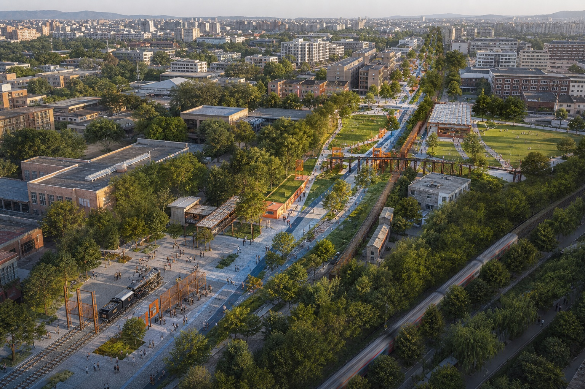

## 设计依据与资料清单

依据分四级管理。第一层是公开公告，用于确认 43.6 平方公里统筹研究、11.4 平方公里总体设计、368.4 公顷三处重点区域及设计任务；第二层是仓库已清权任务书，用于展开 agent.1—agent.6；第三层是城市设计、控规编制与用地分类标准，用于限定表达深度；第四层是仓库临时几何，仅供概念生成、复算与展示。[source:OFFICIAL-ANNOUNCEMENT] [source:AGENT-TASKBOOK] [source:PROJECT-STANDARDS] [standard:PROJECT-OFFICIAL-ANNOUNCEMENT] [standard:PROJECT-AGENT-OPEN-CALL-TASKBOOK] [standard:MOHURD-URBAN-DESIGN-MEASURES] [standard:MOHURD-CONTROL-DETAILED-PLANNING] [standard:MNR-LAND-USE-CLASSIFICATION-GUIDE]

结构化导航来自项目任务包、公开资料登记表与事实包；三者负责定位来源及缺口，不替代其指向的原始材料。[source:SITE-PACKAGE] [source:SOURCE-REGISTRY] [source:PROCESSED-FACT-PACK] 本稿未取得项目 official polygon、重点区精确 polygon、现状地块与建筑、文保控制、市政管网、道路红线、权属及法定开发强度，故使用仓库 `provisional_boundaries.geojson` 形成统一底板。[source:PROVISIONAL-BOUNDARY] 该底板被明标为 provisional；所有面积、比例与 400 米覆盖须在正式数据到位后由 EPSG:4548 重算，且不得作为审批、征拆、权属或工程线位依据。[depth:existing_conditions_diagnosis] [depth:risk_missing_data] [data:geometry/site_boundary.geojson#SITE-001] [data:geometry/constraints.geojson#DATA-GAP-001]

资料使用遵循“事实可引用、图像不搬用、品牌不借用、限制须登记”。全球案例只抽取机制并在 `sources.json` 记录访问日期、发布者与许可限制；本包五图、HTML、PDF、图标、图表及全部几何均由本方案代码和结构化数据生成。方案唯一主体文本为本文件；若图纸、HTML 与本文件冲突，以 GeoJSON、metrics 和各矩阵在其权威范围内为准。

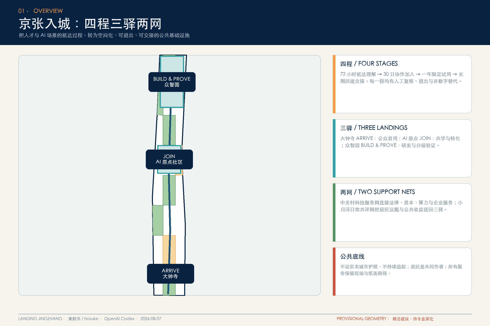

## 三层范围工作框架

三层不是三套割裂成果，而是同一“抵达—共同建设”链的不同尺度。43.6 平方公里统筹层回答：如何令海淀科研、产业、资本、服务和社区形成面向全球新来者又回馈本地居民的生态；11.4 平方公里总体层回答：如何以京张遗址公园及两侧城市地区承载步行抵达、测试转化与公共生活；三处重点区则回答：每一程在哪里发生、谁维护、失败时如何回退。[standard:PROJECT-OFFICIAL-ANNOUNCEMENT] [depth:three_level_scope_framework] [depth:overall_spatial_structure]

空间语法为“四程三驿两网”。四程是 72 小时“看懂城市”、30 日“形成协作”、一年“完成试用与共益评估”、长期“回返并交接”；三驿是大钟寺 ARRIVE（城市入口与公众首用）、北京 AI 原点社区 JOIN（高校转化、共学与人才生活）、众智园 BUILD & PROVE（全栈研发、安全评测与限定场景验证）；两网是中关村科技服务网与小月河日常共评网。两翼不只是向企业输送资源，也把法律、融资、算力、数据合规和居民反馈送回三驿，防止“人才走廊”成为单向招商漏斗。[source:AGENT-TASKBOOK]

重点区合计面积沿用公告文字口径 368.4 公顷，其中众智园 192.1 公顷、AI 原点社区 104.3 公顷、大钟寺 72.0 公顷；图上三个 polygon 仅作位置代理，不用其几何面积替代公告值。[data:geometry/key_areas.geojson#PROV-KEY-001] 当前总体概念边界复算为 [metric:site_area_sqm]，三处重点区对象数为 [metric:key_area_count]。正式 polygon 发布后，依次替换 site/key areas，再裁切 land use、green/public space、buildings、roads、phasing，最后更新五图与所有派生指标。

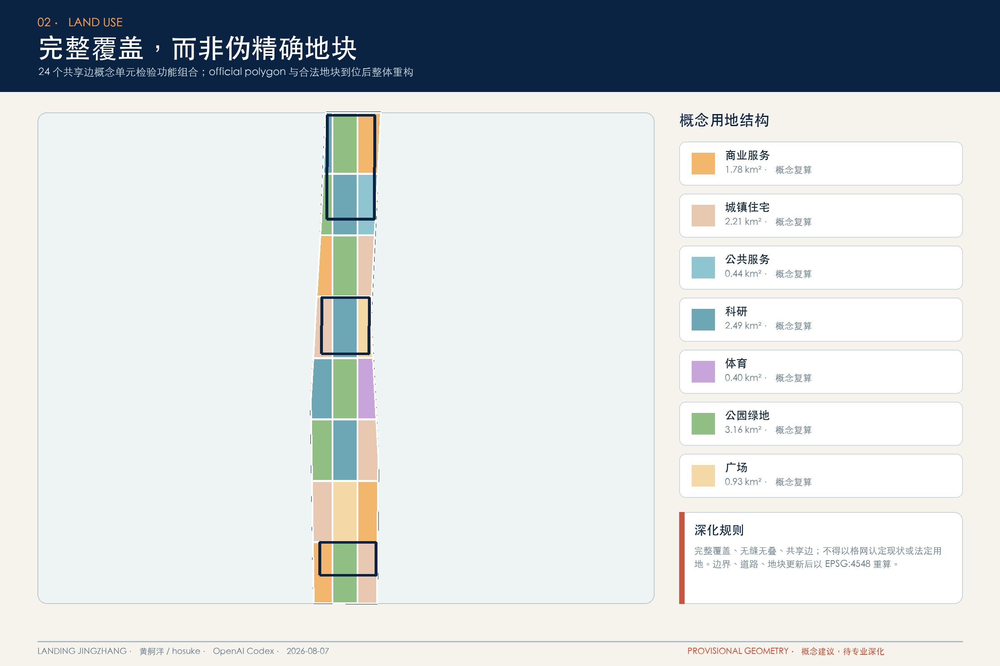

## 统筹研究范围产业与未来城市研究

总体命名为“京张入城 / LANDING JINGZHANG”。“入城”不是门禁，而是开放门槛：无论是初次抵京的开发者、回访校友、社区居民、照护者、国际访客，还是准备进入真实环境的 AI 场景，都须经历可理解的欢迎、限定试用、公共评议和责任交接。Logo 概念由一个开放门槛与三枚递进印记组成；三枚印记对应 ARRIVE、JOIN、BUILD & PROVE，避免使用铁路、人字轨或科技脑等惯常符号。VI 以深蓝表可信公共底座、橙色表抵达行动、青绿表居民共益，并在导视中同时使用中文、英文、图形与触觉/高对比版本。该命名、Logo 与 VI 仅为竞赛概念设计。[source:AGENT-TASKBOOK]

八个全球案例组成“机制而非形象”的案例库：新加坡 Punggol Digital District 提示数字孪生应先模拟后部署，并把校园与产业共享底座连接；巴塞罗那 Innova Lab 提示试验先资格审查、再以限期协议和跨部门复核进入城市；赫尔辛基 Smart Kalasatama 证明小额敏捷试点可以让居民、企业、研究者共创，失败或转向亦应留下结项知识；伦敦 Queen Elizabeth Olympic Park Testbed 将无障碍使用者纳入共同测试。[source:CASE-SG-PDD-ODP] [source:CASE-ES-BCN-INNOVA-LAB] [source:CASE-FI-SMART-KALASATAMA] [source:CASE-UK-QEOP-TESTBED]

欧盟 CitCom.ai TEF 的“虚拟—受控—真实”阶梯，适合转译为模型、机器人与端侧设备的三级入城门；JRC Living Labs 强调稳健性、互操作与使用者接受度；Mila 的开放科学与责任 AI 显示人才生态须把研究合作和知识转移连成循环；Woven City 的车库、隔离试验场与真实生活区可作空间分级参照，但其企业自述不视为独立成效证据。[source:CASE-EU-CITCOM-TEF] [source:CASE-EU-JRC-LIVING-LABS] [source:CASE-CA-MILA-AI-ECOSYSTEM] [source:CASE-JP-WOVEN-CITY] 案例数由 [metric:global_case_count] 登记。

生态图谱以土地提供可逆载体、产业提出问题、资金支持小额试验、人才跨界组队、算力分级开放、数据最小化、场景由居民与机构共评为七个接口。每个接口都必须留下“谁可申请、谁复核、何时退出、如何转公共收益”的可读条款；Host Council 由居民、无障碍使用者、园区运营者、研究机构及一线服务者共同组成，居民不是全球人才的背景，而是问题定义者、测试否决者与收益共同作者。[depth:phasing_implementation]

## 总体设计范围城市更新与控规深度城市设计

总体结构以京张遗址公园为公共记忆与慢行骨架，三驿为密度与服务锚点，两翼为知识、资本和日常测试接口。概念用地以 24 个共享边界单元完整覆盖 provisional 总体范围，分为商业服务业、居住、公共管理与公共服务、教育科研、绿地及广场等七类；其作用是检验功能比例和图层拓扑，而不是指认现实地块性质。[data:geometry/land_use.geojson#LU-001] [depth:land_use_layout] 分区完整覆盖且无重叠；后续必须以依法提供的用地、地块与道路数据重构，不采用当前格网作为控规图则。

城市更新从“先使用、再建设”入手：存量建筑优先做 90 天可逆空间试验，验证开放工位、合规诊所、共学桌、公众首用庭的真实需求；通过复核者再进入建筑更新与公共空间深化。概念建筑脚印只显示可承载的混合研发单元，未判定保留、改造或拆除。[data:geometry/buildings.geojson#BLDG-001] [depth:retain_renovate_demolish] 建筑基底指标 [metric:building_footprint_area_sqm] 与 [metric:building_density] 仅用于图层内部一致性，容积率和高度保持 unknown，待控规、现状测绘、日照、消防、文保及权属资料齐备后由专业团队论证。[depth:development_intensity_controls] [depth:height_massing_character]

总体设计设置“入城门槛”而非封闭园区：公共层全天或按公示时段可达，试验层须有清楚边界和现场责任人，研发层依法控制访问。慢行连接先表达大钟寺—原点—众智园的方向性连续关系，再由交通调查确定穿越、接驳、停车和路缘配置。[data:geometry/roads.geojson#ROAD-001] 市政与新基建遵守共沟、共站、可维护原则，端侧算力、传感设备和数字标识均须有断网模式、人工替代和退役清单；不得因“智能化”挤占基本照明、座椅、厕所、树荫和无障碍连续通行。[depth:municipal_new_infrastructure]

## 重点区域详细设计

**大钟寺 ARRIVE｜城市入口、文化理解、公众首用。** 入口不设实名“城市护照”，而以现场服务台、纸面地图、可下载离线包和多语导览提供平等起点。第一日论坛沿公共空间布置可移动长桌、城市权利卡和 AI 场景说明牌，访客可在不注册的情形下理解可用服务、数据边界及人工窗口；智能原生业态优先选择可当面解释、可现场退出的文化导览、服务导航和小型展示。[data:geometry/key_areas.geojson#PROV-KEY-003] [data:geometry/public_space.geojson#SCN-01]

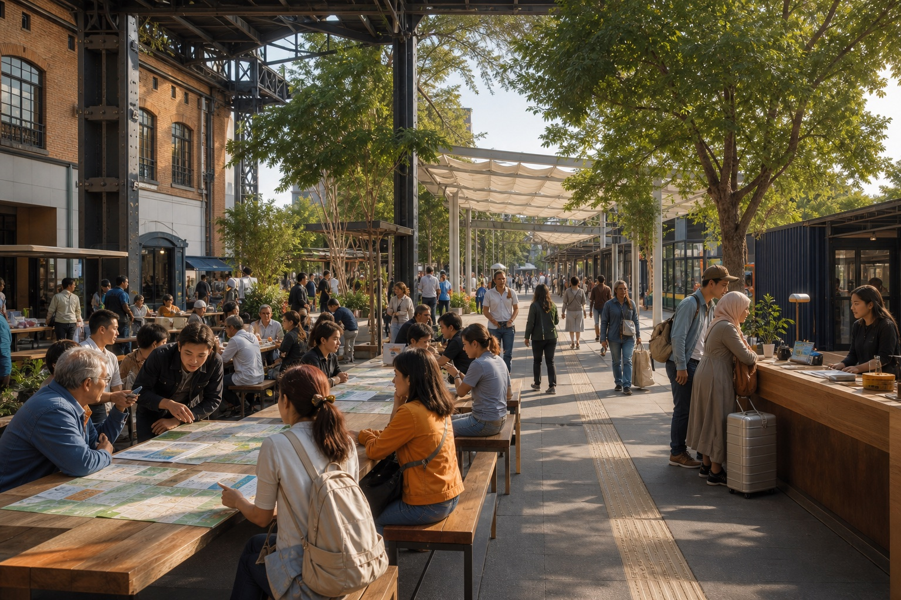

**北京 AI 原点社区 JOIN｜成果转化、共学生活、社区归属。** 空间以共享首层、邻里客厅、照护友好步行环和短期工作台为骨架。高校团队、外地开发者与居民围绕真实问题组成 30 日小组；Host Council 在立项、过程和结项三次审阅公共收益、数据最小化及非数字替代。共学长桌既可讲模型，也可交换照护、维修、口述史等居民技能，防止知识只按技术等级排序。[data:geometry/key_areas.geojson#PROV-KEY-002] [depth:three_key_area_detailed_design]

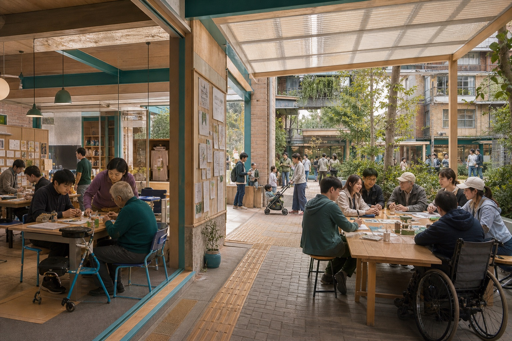

**众智园 BUILD & PROVE｜全栈研发、分级验证、责任交接。** 设虚拟评测室、受控试验庭与限定真实场景三层门槛；模型、机器人、端侧设备和慢行路缘协同先证明安全边界、人工接管、无障碍影响和退役方式，方可提出扩大试点。技术入城门以开放审查台而非纪念高塔表达“可解释地进入城市”；测试报告同时给研发者、运营者与公众可读版本。[data:geometry/key_areas.geojson#PROV-KEY-001]

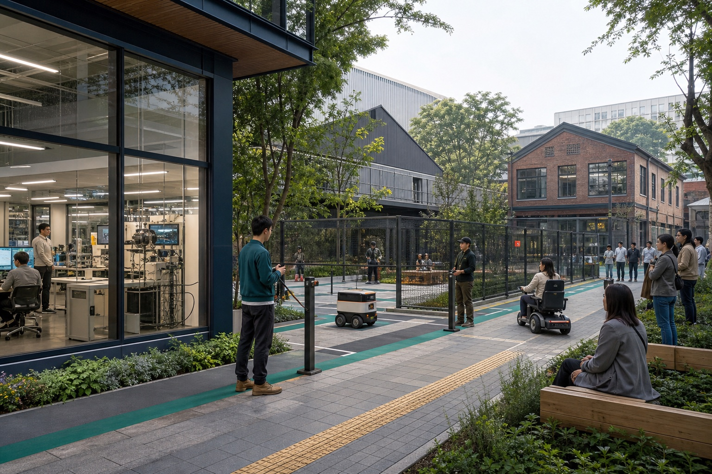

三处详细设计均采用“公共前场—共同工作层—限定测试层”递进剖面，位置和形态供深化；文化节点遇文保控制缺口须暂停精确落位，交通节点遇客流与道路资料缺口须暂停容量判断。重点图使用 provisional polygon 醒目标注，公告面积与图形代理分列，避免视觉上造成精确红线错觉。

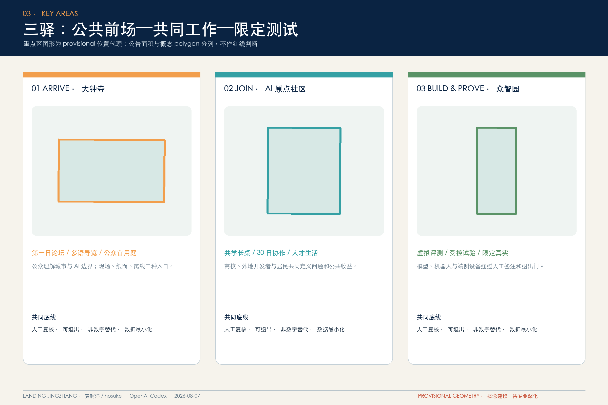

## AI 创新生态、人才画像与 AI+ 场景

六类画像贯穿设计：①初次抵京的外地开发者，需要低门槛工位、城市权利说明与可信合作方；②国际研究者，需要多语、时差友好与制度可读性；③社区长者与照护者，需要现场人工窗口、少步行及纸面替代；④行动、视觉或听觉障碍使用者，是路径和界面的共同测试者；⑤海淀高校学生与青年研究者，需要从原型到首个真实问题的路径；⑥园区一线运营者，需要可接管、可维修、可退役的工具。画像数由 [metric:persona_count] 记录，且均不建立持续个人画像。

十二张场景卡全部落在 `public_space.geojson`，并逐卡指定阶段、空间、责任者、最小数据、人工复核和非数字路径：[metric:landing_scenario_node_count]

1. **多语第一日城市导览**（抵达/大钟寺）：离线地图与现场志愿者并行，不记录连续轨迹。
2. **无障碍连续路径助手**（抵达/原点）：障碍反馈经人工核验，纸面无障碍路线常备。
3. **公共服务权利导航**（理解/众智园）：只给办事入口与解释，不代替工作人员作资格结论。
4. **科研资源与开放工位匹配**（理解/大钟寺）：由用户主动提交最少需求，可现场查询。
5. **模型合规入城测试**（试用/原点）：虚拟、受控、限定真实三级，结论须人工签注。
6. **机器人限定场景入城测试**（试用/众智园）：设物理边界、现场安全员和手动停机。
7. **端侧设备公共界面入城测试**（试用/大钟寺）：本地处理优先，断网时保留基本服务。
8. **慢行与路缘分时协同测试**（试用/原点）：先模拟再短时围合，保留人工疏导。
9. **社区共学与技能互换**（归属/众智园）：居民与开发者双向授课，线下公告同等有效。
10. **健康服务人工复核导航**（归属/大钟寺）：只做资源导航，急症与判断回到专业人员。
11. **京张文化多语叙事**（回馈/原点）：史实由馆藏或专业人员核校，现场导览可替代设备。
12. **公共空间问题回馈与交接**（回馈/众智园）：匿名提交可选，纸面工单进入公开交接会。

其中第 5—8 卡为产业测试验证场景，[metric:test_validation_scenario_count]；每卡均要求人工复核与非数字回退，[metric:human_review_coverage_ratio] [metric:non_digital_fallback_coverage_ratio]。运营建议采用“问题公开—小额试验—居民共评—知识结项—扩大或退役”闭环，失败亦须说明原因并沉淀可复用知识。节点 400 米欧氏缓冲覆盖率 [metric:landing_node_400m_coverage_ratio] 仅检查分布，不能替代真实步行网络、坡度、过街和无障碍调查。[data:geometry/public_space.geojson#SCN-12]

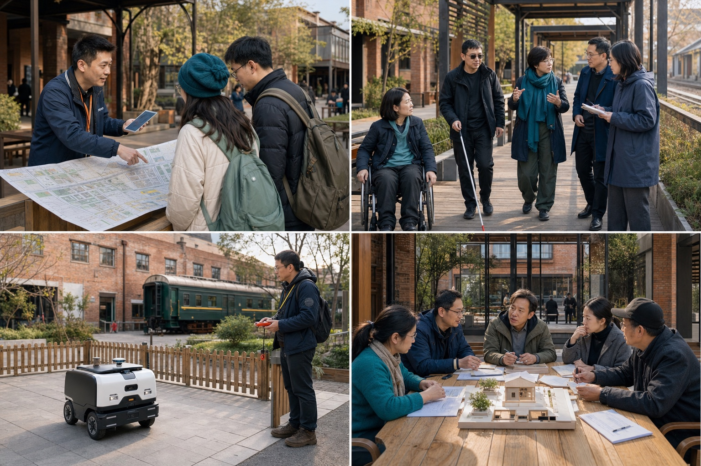

## 用地、建筑规模与拆改留方案

概念用地面积由同一 EPSG:4548 几何复算：商业服务业设施 [metric:land_use_05_area_sqm]，城镇住宅 [metric:land_use_0701_area_sqm]，公共管理与公共服务设施 [metric:land_use_08_area_sqm]，科研 [metric:land_use_0802_area_sqm]，体育 [metric:land_use_0804_area_sqm]，公园绿地 [metric:land_use_1401_area_sqm]，广场 [metric:land_use_1403_area_sqm]。这些数值用于检验功能组合和完整覆盖，不是对现状或法定用地的认定；official boundary、合法地块和控规条件更新后须重新分类、共享边拓扑检查与面积汇总。[standard:MNR-LAND-USE-CLASSIFICATION-GUIDE] [depth:metrics_recalculation]

建筑规模采用“已知脚印、未知强度”的诚实表达。`buildings.geojson` 由非绿地/广场概念单元内缩生成，代表可承载混合研发、公共服务或居住配套的容量测试载体；它不表示现实建筑轮廓，也不触发具体建设动作。拆改留采取四步：先补现状年代、结构、用途、权属和价值评估；再完成文保、消防、日照与低碳审查；随后以保留优先、轻改优先、可逆先行为原则形成逐栋台账；最后把拟拆除项交专业团队与利益相关者复核。当前所有 feature 的拆改留字段均为 pending，避免以生成式几何替代现场调查。

空间供给建议将首层和公共前场优先给共学、文化、照护、公共说明与首用测试，将设备密集研发置于可控层；人才居住不设置封闭专享区，而与既有社区服务共享增量设施。建筑高度、容积率、住宅比例、停车配建和市政容量均待资料确认；后续专业团队需以同一地块 ID 把现状证据、价值判断、公众意见、碳排影响和最终动作关联起来，确保方案可追溯而非仅有效果图。

## 交通、轨道、市政与公共服务设施

交通概念由一条南北慢行意图和三条重点区横向连接组成，长度 [metric:concept_road_length_m]、密度 [metric:concept_road_density_km_per_sqkm] 仅用于验证网络表达非空；它们不是道路中心线、红线或工程设计。[data:geometry/roads.geojson#ROAD-001] [depth:traffic_rail_slow_parking] 深化顺序为：取得轨道站点出入口、公交、客流、路口、停车和无障碍资料；现场走查断点；按“步行—骑行—公交/轨道接驳—必要机动车”排序；最后才确定路缘分时、过街与停车调整。所有测试应保留正常通行和现场疏导。

公共服务以“人人可用的底座 + 需要时才启动的 AI”配置。大钟寺设多语与权利说明，原点社区强化照护、共学和青年生活，众智园强化合规、测试和企业服务；厕所、饮水、树荫、座椅、母婴及无障碍设施先于数字屏。AI 导航只提供信息线索，教育、健康、政务、法律与安全事项均回到有职责的人类机构复核；无智能手机者可使用固定服务台、电话、纸面地图与现场人员。

市政和新基础设施建议采用可拆卸设备带、统一电源/通信接口、边缘计算与最小化传感。每个组件建立编号、维护者、断网行为、人工替代、能耗记录和退役日期；夜间照明兼顾安全与生态，机器人测试设低速区、人工停机和物理隔离。因缺管线、容量、防洪、海绵、能源与消防资料，本包不作容量和线位结论；这些缺口列入 assumptions、constraints 和 self-check，待专业单位补齐后再校核。[data:geometry/constraints.geojson#DATA-GAP-001]

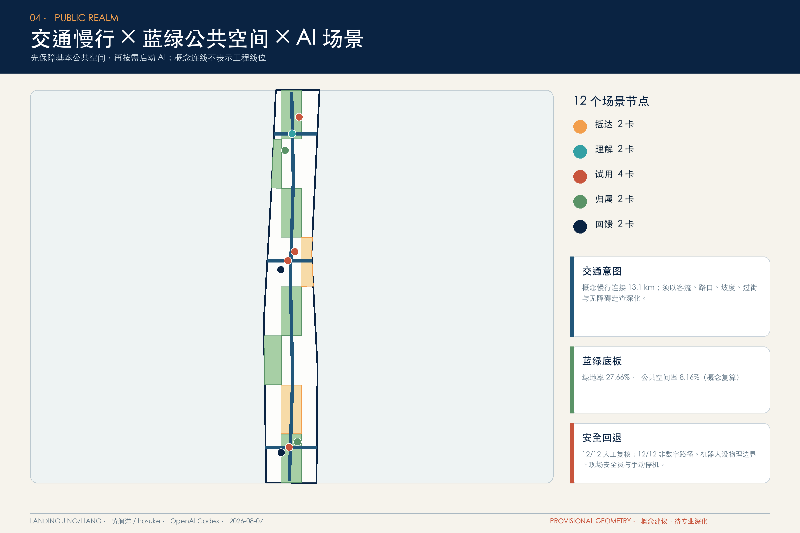

## 蓝绿空间、公共空间与城市风貌

绿地与公共空间从 land-use 共享边单元派生：绿地面积 [metric:green_space_area_sqm]、绿地率 [metric:green_ratio]，公共空间面积 [metric:public_space_area_sqm]、公共空间率 [metric:public_space_ratio]。[data:geometry/green_space.geojson#GREEN-001] [data:geometry/public_space.geojson#PUBLIC-001] [depth:blue_green_public_space] 这些是概念结构比例；后续须区分现状与新增、公共可达与附属、生态与硬质空间，并结合径流、冠层、生境、热环境和维护成本重算。

公共空间以连续日常使用而非大型地标消费为主。四个“朝圣与荣誉节点”皆低体量、可复用：①大钟寺“第一日论坛”，展示新来者第一项公共贡献；②原点社区“共学长桌”，记录居民导师与开源贡献者；③众智园“技术入城门/公众首用庭”，公开测试边界、失败结项和人工接管；④沿园“回馈档案”，以可更新铭牌和离线档案记录维护、修复与交接。节点数 [metric:pilgrimage_landmark_count]；荣誉按公共贡献、维护和教学评议，不按资本规模或流量排序。

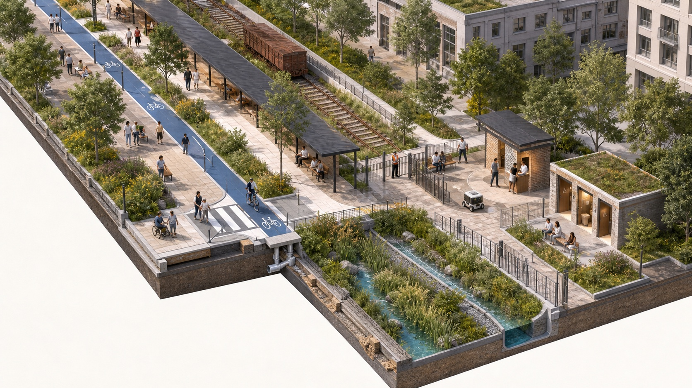

风貌语言从京张铁路“曾缩短人与知识的抵达距离”出发，而非把铁路机械比作代码。新构筑物采用开放门槛、长桌、雨棚、低位信息面和可替换组件，保持历史空间的可读性；高塔、大屏和仿古符号均不作为默认答案。导视形成“百年京张—中关村创新—AI 新文化”三层叙事：史实层须可核验，创新层标明年代与主体，未来层清楚写为设计建议。精确落位须待文保范围和建设控制资料确认，并接受遗产、景观、无障碍与社区共同审阅。

## 更新项目清单、实施政策与分期计划

项目清单分三期映射于 `phasing.geojson`。近期“看见并试用”包括 provisional 数据补齐、第一日论坛、共学长桌、三类测试门槛、12 场景的低成本原型与 Host Council；中期“连接并转化”包括三驿公共首层、慢行断点修补、统一设备接口、案例与失败知识库；远期“回馈并交接”包括年度 Return Week、开发者/校友回返网络、维护者荣誉、组件退役与跨区域知识输出。[data:geometry/phasing.geojson#PHASE-001] [depth:renewal_project_list]

四程运营建议：72 小时 Welcome Sprint 提供多语城市理解、公共服务入口和第一次社区会面；30 日 City Residency 让跨界小组围绕居民提出的问题形成可逆原型；一年周期完成虚拟—受控—限定真实测试、公共收益评估和结项；长期通过 Return Week 邀请离开者回来教学、维护或交接。年度活动可称“Global Landing Week”，但活动名称、经费、主办关系与日期均待各主体协商；不作落户、签证、资金或持续运营许诺。

实施机制采用五张公开表：场景申请表、数据最小化表、无障碍与社区影响表、人工接管/非数字回退表、结项与退役表。Host Council 对公共空间试验拥有暂停建议权；专业运营者承担现场安全和设施维护；高校与企业承担技术责任；独立评估者记录成效与负面结果。每期均设置“可逆—评估—扩大/退出”门，不以设备数量或招商数量作为单一绩效，而以被解决问题、居民受益、无障碍、知识开放和维护成本共同判断。[depth:phasing_implementation]

## 指标体系、面积复算与合规矩阵

指标遵循“几何先于图、公式先于口号、unknown 不补造”。site、land use、green、public space、building 均先投影 EPSG:4548 计算，再写入 `metrics.json`；道路以投影长度计算；比例以相同边界分母计算。核心证据图将总体面积、绿地、公共空间、建筑脚印、场景与回退覆盖放在同一页，便于人工复核。三矩阵把公告 1.3/1.4/1.5 和 agent.1—6、五项 mandatory 标准、十五项设计深度逐项映射到章节、图层、指标及图纸。[standard:MOHURD-URBAN-DESIGN-MEASURES]

当前已知几何指标为：总体面积 [metric:site_area_sqm]；建筑脚印与密度 [metric:building_footprint_area_sqm] [metric:building_density]；绿地面积/率 [metric:green_space_area_sqm] [metric:green_ratio]；公共空间面积/率 [metric:public_space_area_sqm] [metric:public_space_ratio]；概念道路长度/密度 [metric:concept_road_length_m] [metric:concept_road_density_km_per_sqkm]。用地七类面积已在“用地、建筑规模与拆改留方案”逐项引用；重点区、场景、测试、案例、画像与地标数量已在相应章节引用。几何图层权威顺序为 site boundary、key areas、land use、buildings、roads、green space、public space、constraints、phasing；每个 feature 具有 id、layer、source_type、confidence、geometry_role，polygon 含声明面积。

空间质量指标不把技术运行等同于公共价值：400 米节点覆盖只是分布检查；人工复核率和非数字回退率是进入试点的底线；未来还需补充真实步行可达、无障碍连续率、居民议题占比、负面结果公开率、设备故障恢复时间、维护能耗与社区收益分配。容积率、建筑高度、道路面积率保持 unknown，原因和补数路径同时登记。边界替换后须运行 topology、declared area、metric formula、HTML/PDF/visual 一致性及完整 self-check，不允许只改展示数字。

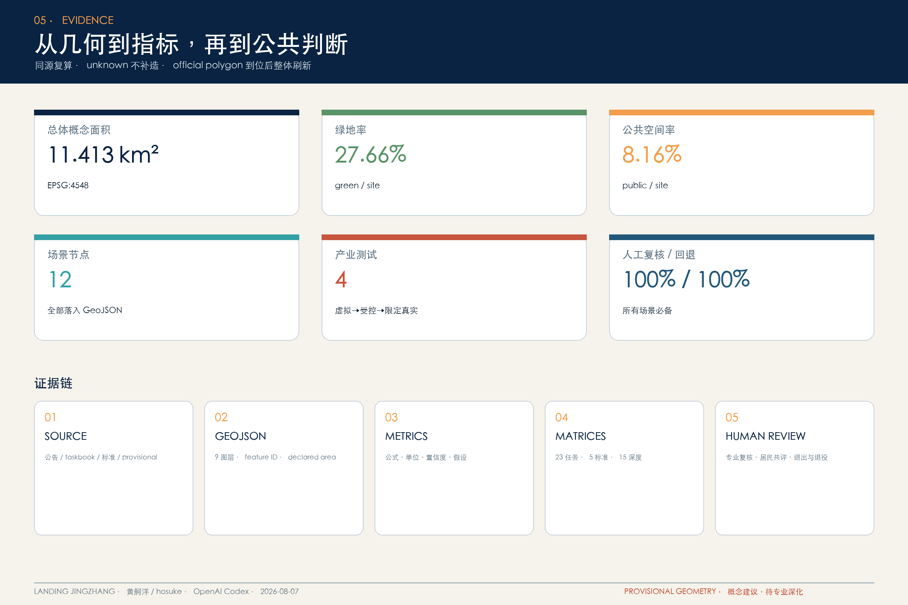

## 风险、版权与合规说明

首要空间风险是 provisional 几何被误读为精确控制：因此正文、五图、visual、sources、assumptions、self-check 同时提示，并把 official polygon 到位后的重算对象列全。第二是“入城”滑向人才特权或监控：本方案不建实名护照，不持续追踪位置，不推断身份、情绪或资格；居民经 Host Council 共同定义问题和收益，任何人可退出并走纸面/现场路径。第三是技术外溢：机器人、模型、端侧设备均先虚拟或受控测试，设现场责任人、人工停机、日志最小化和退役门。[source:AGENT-TASKBOOK]

第四是健康、政务、法律、安全等高影响事项被自动化替代，本方案只作信息导航、辅助整理或限定试验，最终判断由有职责的专业人员作出。第五是文化叙事失真与文保冲突，故历史事实须由公开馆藏或专业机构校核，节点待文保资料确认。第六是活动和运营空转，故每项活动均绑定空间、维护者、退出条件和结项知识，不把概念建议写成既定安排。风险清单见 `risk.json`，假设见 `assumptions.json`，合规响应见三矩阵与 `self_check.json`。

版权方面，方案正文采用 `COMMUNITY-DISPLAY-ONLY`；投稿人黄舸洋（GitHub `hosuke`）保留其贡献权利，并同意按该许可供征集展示。文本、代码、图表、五图、离线 HTML 与 PDF 由 OpenAI Codex 在人工目标、选择和复核下生成；地图不加载外部瓦片，案例不复用图片、Logo、UI 或网页版式。PDF 使用 ReportLab 与其内置 CID 字体接口，网页使用系统字体回退；全部来源、限制和工具记录于版权声明。若维护者或专业深化团队希望改用开放许可，须由投稿人另行确认，不在本稿中推定。

## 参考资料

项目依据包括：公开征集公告、仓库结构化任务包、清权的 Agent 任务书摘录、公开资料登记表、事实包和 mandatory 专业标准；其中公告支持项目目的、三层范围和任务，Agent 任务书支持三定位、五功能、三区两翼与六项必答，provisional geometry 只支持概念生成和复算。[source:OFFICIAL-ANNOUNCEMENT] [source:SITE-PACKAGE] [source:AGENT-TASKBOOK] [source:SOURCE-REGISTRY] [source:PROCESSED-FACT-PACK] [source:PROJECT-STANDARDS] [source:PROVISIONAL-BOUNDARY] 仓库公开草案 `brief/public-brief.md` 仅作背景与资料边界导航，不支撑法定控制或精确空间结论。

国际机制参照来自 JTC Singapore Punggol Digital District ODP、Barcelona Innova Lab、Forum Virium Helsinki Smart Kalasatama、London Queen Elizabeth Olympic Park Testbed、European Commission CitCom.ai TEF、European Commission JRC Living Labs、Mila 责任 AI 研究生态及 Toyota Woven City Inventors。每个网页均于 2026-08-07 访问，正文仅作归纳，不将其制度直接移植为北京结论，也不暗示发布者参与或认可本方案。[source:CASE-SG-PDD-ODP] [source:CASE-ES-BCN-INNOVA-LAB] [source:CASE-FI-SMART-KALASATAMA] [source:CASE-UK-QEOP-TESTBED] [source:CASE-EU-CITCOM-TEF] [source:CASE-EU-JRC-LIVING-LABS] [source:CASE-CA-MILA-AI-ECOSYSTEM] [source:CASE-JP-WOVEN-CITY]

完整题名、发布者、网址、访问日期、用途和许可限制见 `sources.json`；几何来源逐 feature 记录于 GeoJSON。凡无 official 空间资料支撑者，本文均转为假设、unknown 或待专业确认，而不以新闻图片、远程地图瓦片、文本四至或推测 bbox 补成精确图形。后续引用时应以原始网页和仓库当时版本复核，尤其检查公告、任务书、schema、PR 模板和校验脚本是否在截止前更新。[depth:risk_missing_data]
