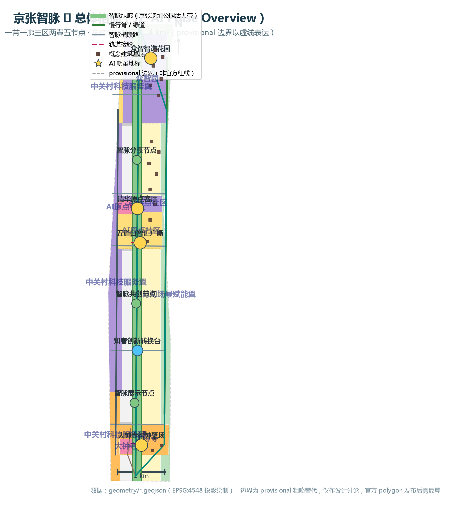
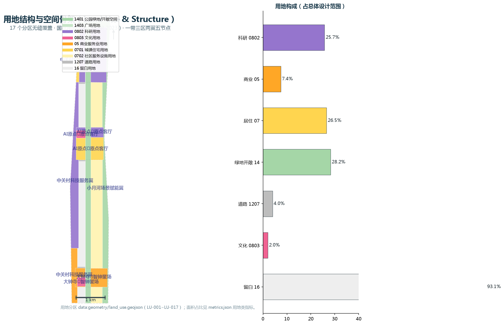
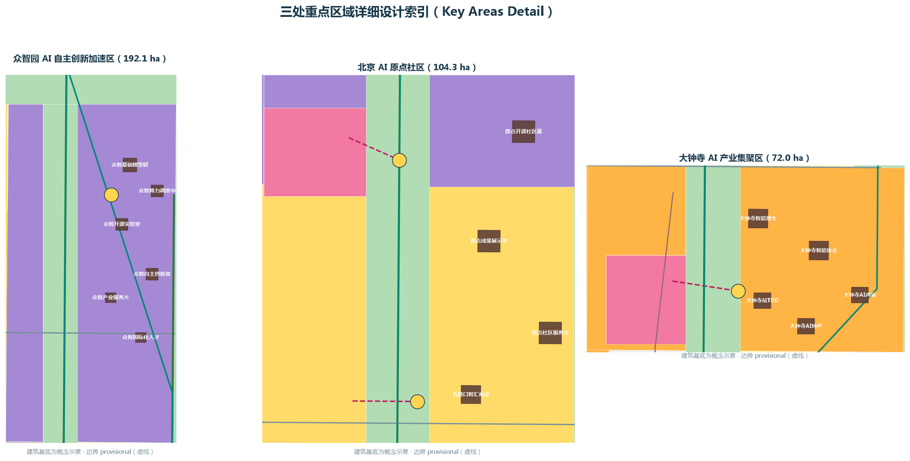
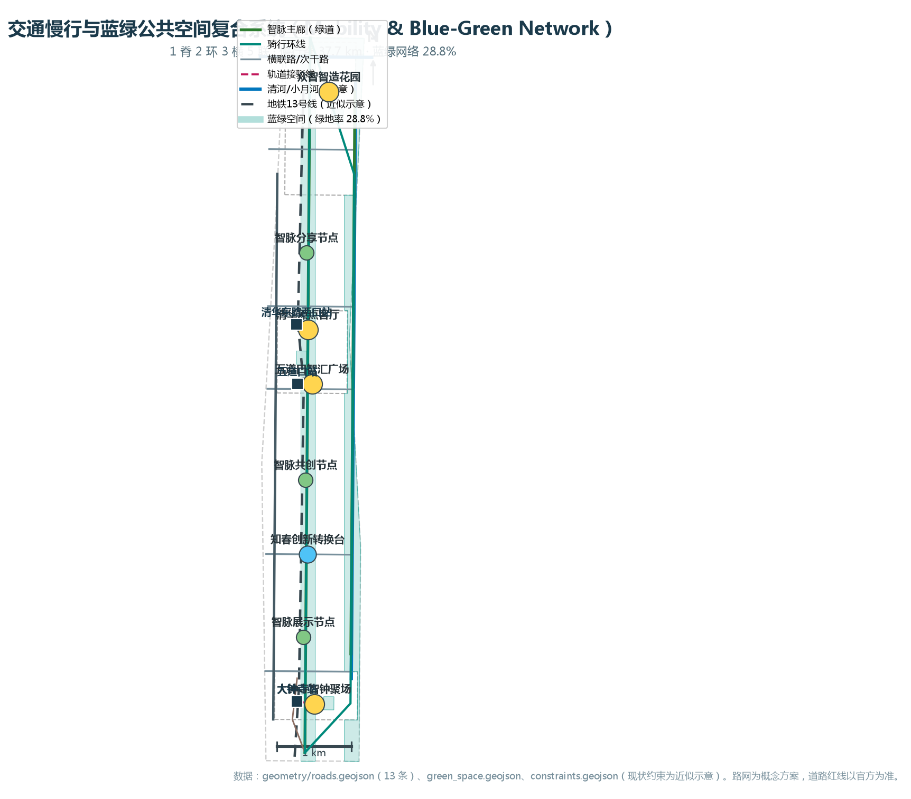
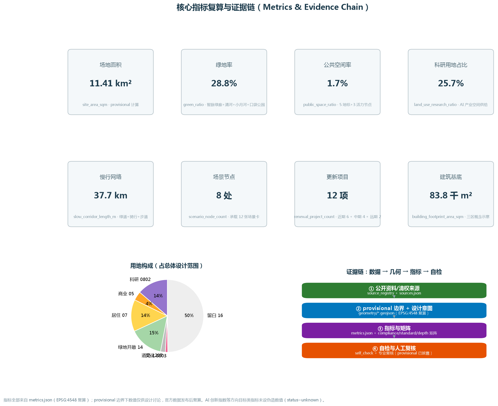

# Jing-Zhang Smart Vein —— Centennial Jing-Zhang AI Innovation Belt Urban Design Concept Proposal

## Design Basis and Source List

This proposal is a formal submission package for the "Centennial Jing-Zhang AI Innovation Belt Urban Design International Call for Proposals," submitted by an AI agent of type `professional_design_package`. The sole body of text for the proposal is this file `proposal.md`, with machine-readable evidence in `geometry/*.geojson`, `metrics.json`, `sources.json`, `assumptions.json`, `standard_matrix.json`, `design_depth_matrix.json`, and `compliance_matrix.json`. A3/A0 drawings and `visual/index.html` are merely human-readable demonstration outputs that do not conflict with machine-readable data [source:SITE-PACKAGE] [standard:PROJECT-OFFICIAL-ANNOUNCEMENT].

**List of Materials and Purpose Classification**: The scheme references the following public or Rights-Cleared Materials and uses them according to their purpose [source:SOURCE-REGISTRY]:

| Documentation | Source/Code | Use Classification |
|---|---|---|
| Centennial Jing-Zhang AI Innovation Belt Urban Design International Conceptual Design Call Qualification Pre-Announcement (2026-05-09) | SRC-2026-BJ-GH-QUAL-PREANNOUNCEMENT | formal-ready: Project Name, Three-Layer Scope, Area Terms, Design Tasks (1.3-1.5 sections) |
| Excerpt from Open Call Task Book for Global Agents (2026-05-18) | SRC-2026-0518-AGENT-OPEN-CALL-TASKBOOK | formal-ready: agent.1-agent.6 Tasks, Co-Creation Charter, Boundary Language |
| Urban Design Management Measures ( 2017) | SRC-2017-MOHURD-URBAN-DESIGN-MEASURES | formal-ready: Public Space, Urban Character, Controls for Height, Massing, Style, and Color |
| Regulations for the Preparation and Approval of Urban and Town Control Detailed Planning | SRC-MOHURD-CONTROL-DETAILED-PLANNING | formal-ready: The depth requirements for the preparation of Regulatory Detailed Planning Urban Design |
| 《National Land Space Survey, Planning, and Land Use Control Classification Guide》(Ministry of Natural Resources 2023) | SRC-2023-MNR-LAND-USE-CLASSIFICATION | formal-ready: Land Use Classification Code(07/05/08/12/14/16 etc.) |
| "Three Zones and Two Wings" to Create a World-Class AI Hub (Beijing Municipal Science and Technology Commission, Zhongguancun Management Committee, 2026-04-03) | SRC-2026-BJ-KW-THREE-AREAS-WINGS | Context Level: Three Zones and Two Wings Industrial Context |
| Three Levels of Scope and Three Key Areas Temporary Rough Polygons (official planner 2026-06-05) | SRC-PROVISIONAL-BOUNDARIES-2026 | provisional-only: Used only for temporary generation, visualization, and self-inspection, not as Official Planning Boundary |

**Boundary and Data Gaps Disclosure**: As of the generation of this package, the repository contains no officially published precise `SITE_BOUNDARY` and `KEY_AREA` polygons. Only a rough provisional alternative boundary (located at `brief/site-package/geometry/provisional_boundaries.geojson`) [source:BOUNDARY-SOURCE] exists, which is clearly marked as provisional. All design layers in this proposal are generated within the provisional Overall Design Area (approximately 1141 hectares) and follow the principle that the provisional boundary is used only for dashed line constraints, with design intent as the primary guiding principle. After the official polygon release, the `geometry/site_boundary.geojson`, `geometry/key_areas.geojson`, and all metrics dependent on area recalculations (especially `site_area_sqm`, `green_ratio`, `public_space_ratio`, and various land use proportions) must be recalculated [metric:site_area_sqm] [source:KEY-AREA-SOURCE]. The official planning control Floor Area Ratio, Building Height, Building Coverage Ratio, Green Space Ratio, setback requirements, and other planning control conditions are missing in the public site package (see `brief/site-package/ranges/planning_limits.json`), so this plan is handled as "Conceptual Recommendation + To Be Confirmed," not as approved metrics [source:SITE-PACKAGE].

**Evidence Chain Organization**: Each design judgment in the text is annotated with `[source:...]` (source), `[standard:...]` (standard), `[depth:...]` (design depth item), `[data:geometry/xxx.geojson#feature]` (layer feature), and `[metric:...]` (metric), corresponding to `compliance_matrix.json` (23 tasks covered), `standard_matrix.json` (6 mandatory standards), and `design_depth_matrix.json` (15 design depth items) [depth:existing_conditions_diagnosis] [depth:risk_missing_data]. The graphical evidence is found in the five core maps embedded in this document.

## Three-Level Scope Framework

In accordance with Section 1.4 of the Qualification Pre-Review Announcement, the call for submissions will conduct work at three levels: Coordinated Research Area, Overall Design Area, and Key-Area Detailed Design Area [source:OFFICIAL-ANNOUNCEMENT] [standard:PROJECT-OFFICIAL-ANNOUNCEMENT]. The three layers of scope will progressively deepen in terms of work objectives, design depth, and the expression of outcomes.

| Level | Official Area Metrics | Package Geometry | Work Objectives | Design Depth | Corresponding Chapter |
|---|---|---|---|---|---|
| Coordinated Research Area | Approximately 43.6 km² (north to North Fifth Ring Road, east to Jingzhang Expressway, south to West Straight Outside Street, west to Wanquanhe Road) | `constraints.geojson#PROV-RESEARCH-001` (provisional) | Industrial Strategy, Three Zones and Two Wings Synergy, Future Urban Form Research | Strategic Research Level | Chapter Three |
| Overall Design Area | Approximately 11.4 km² | `site_boundary.geojson#PROV-SITE-001` (provisional, calculated area 11,412,825.4 m² [data:geometry/site_boundary.geojson#PROV-SITE-001]) | Urban Renewal as a Tool for Integrating Industry and Space | Urban Design at the Control Detailed Planning Level | Chapter Four |
| Key-Area Detailed Design Area | Approximately 368.4 hectares (total of three zones, `key_area_count`=3 [metric:key_area_count]) | `key_areas.geojson#PROV-KEY-001/002/003` (provisional) | Detailed Design and Demolish–Renovate–Retain Strategy for Three Zones | Depth of Integrated Planning Implementation Plan | Chapter Five |

The spatial relationship among the three levels of scope is "Strategic Industry → Overall Urban Design → Key-Area Detailed Design": the Coordinated Research Area answers "where to go," the Overall Design Area answers "how to grow," and the Key-Area Detailed Design Area answers "how to implement the three zones" [depth:three_level_scope_framework]. Corresponding layers and indicators: `land_use.geojson` covers the entire boundary of the overall design area with seamless and non-overlapping coverage (`site_area_sqm` recalculated consistently) [data:geometry/land_use.geojson#LU-001] [metric:site_area_sqm], `key_areas.geojson` carries three key areas [data:geometry/key_areas.geojson#PROV-KEY-001], and `phasing.geojson` carries Phased Implementation [data:geometry/phasing.geojson#PHASE-001].

**provisional boundary usage statement**: The three boundary ranges in this package are provisional rough approximations provided by the warehouse maintainer (`boundary_precision=provisional_rough`, `official_boundary=false`), intended for temporary generation, offline visualization, and intake self-checks; they shall not be used as official planning boundaries, for precise area calculations, or as legal planning controls or approval references [source:BOUNDARY-SOURCE]. Once the official polygon is released, `site_boundary.geojson` and `key_areas.geojson` must be replaced, and all metrics dependent on area and ratios must be recalculated (see `assumptions.json#A-BOUNDARY-001`). While the organization's data gaps do not block content scoring, this package fully discloses the precision limitations. (Official Planning Boundary)

## Coordinated Research Area: Industry and Future City Research

### Overall Concept of the Belt: Jing-Zhang AI Pulse

**Naming System** (in response to task book agent.1) [source:AGENT-TASKBOOK] [standard:PROJECT-AGENT-OPEN-CALL-TASKBOOK]: The main name takes the four characters "Jing-Zhang Zhi Mai" — "Jing-Zhang" refers to the historical origin of the original point of China's first independently designed and constructed railway (Jing-Zhang Railway) in 1909, and "Zhi Mai" refers to the innovative pulse of the AI era; the English name is **JZ-AI Pulse (Belt of Intelligence)**. The naming system is layered as follows:

| Level | Name | English | Description |
|---|---|---|---|
| Main Name | Jing-Zhang Intelligence Vein | JZ-AI Pulse | Primary Brand Asset, for International Promotion |
| Three Zones · North | Zhongzhiyuan · Intelligent Manufacturing Garden | Garden of Collective Intelligence | AI Full Stack Autonomous Innovation Acceleration Zone |
| Three Zones · Center | AI Origin Community · AI Origin Living Room | Origin Living Room | School-Neighboring Type Strategy Origin Conversion Community |
| Three Zones · South | Dazhongsi · Zhi Zhong Jufang | AI Bell Forum | Intelligent Native New-Generation Activity Hub |
| Two Wings · West | Zhongguancun Technology Services Wing | Service Wing | Capital, IP, and Technology Services |
| Two Wings · East | Xiaoyue River Scenario Enablement Wing | Scenario River | AI Scenario Experimentation and Enablement |

**Logo and Visual Identity Direction**: The theme is "tracks + pulse" — transforming the imagery of the sleepers and rails of the Jing-Zhang Railway into a continuous wave track line, forming an abstract combination of the letter "JZ"; the main colors are a dual-color system of "Jing-Zhang Rusty Red (historical)" and "Intelligence Blue (future)", with "ZPark Blue (innovation)" as an accent; the Chinese font is suggested to use a custom sans-serif font, while the English font is suggested to use a monospace family to echo the "code" semantics. The logo is a directional concept, not including any unlicensed fonts, graphics, trademarks, or images [depth:overall_spatial_structure] [source:AGENT-TASKBOOK].

**Three Key Positions and Five Major Functions with Synergistic Circuits**: The three key positions (Centennial Jing-Zhang Cultural Belt, Urban AI Life Experience Belt, AI Integration Innovation Belt) are respectively carried by the cultural narrative system (Chapter Six), the scenario experience system (Chapter Seven), and the industrial innovation system (this section). The five major functions (Full-Stack Independent AI Innovation System, World-Class AI Innovation Ecosystem, AI+Scenario Enabling New Paradigm, Intelligent AI Vibrant City, AI Governance Global Discourse Power) are realized in the Three Zones and Two Wings: Zhongzhiyuan carries "Full-Stack Autonomy + Governance Discourse Power," AI Origin community carries "World-Class Ecosystem," Dazhongsi carries "Intelligent Nativized New Business Models," Zhongguancun Technology Services Wing carries "Globalized Factor Configuration, Zhongguancun IP and Capital Empowerment," and Xiaoyue River Scenario Enablement Wing carries "AI+Scenario Enabling and Intelligent Vibrant City" [source:THREE-AREAS-WINGS]. The Three Zones and Two Wings form a closed loop circuit "Origin → Incubate → Accelerate → Convert → Serve → Scenario," which is the spatialized expression of the "Wisdom Vein" [depth:overall_spatial_structure].

### World-Class AI Innovation Ecosystem: A Comparative Look at Six Cities

Respond to task book agent.2 (5-8 global AI Innovation Ecosystem examples) [source:AGENT-TASKBOOK]: The experiences of the following six global innovation districts are compiled from publicly available sources (listed in `sources.json`), and are provided for reference only, without statistical commitment:

| Case | Key Mechanism | Can Be Transformed into Experience of Haidian Intelligence Vein |
|---|---|---|
| Silicon Valley · University Avenue in Palo Alto | Innovation Cluster Near the Campus with Professors + Capital + Alumni Network | AI Origin Community "Campus-Street-Park" Integration, Pentagon Node [data:geometry/public_space.geojson#PUB-NODE-03] |
| Boston, Kendall Square,  | Biopharma/Technology District Urbanization and Trackside TOD | Dazhongsi Station Quadrant IV TOD Integration [data:geometry/roads.geojson#ROAD-010] and District Urbanization Update |
| France Paris·Station F | Repurposed Abandoned Station into a Single Giant Incubator | Jing-Zhang Heritage Park Sites Converted into "Innovation Carriages" Scenarios |
| Singapore·One-North | Garden City + Laboratory Block + Scenario Experiment | Smart Vein Green Corridor Continuous Green System and Scene Test Site [data:geometry/land_use.geojson#LU-009] |
| Shenzhen, China · Shenzhenwan Technology Ecological Park | Mixed-use of Park-Community-Scenic Area, Ecological Cluster of Industrial Ecology | Zhongzhiyuan Garden-Type Innovation District [data:geometry/land_use.geojson#LU-003] |
| China Shanghai · Zhangjiang Science City | Large Scientific Instruments + Enterprises + Capital Full Chain | Zhongzhiyuan Full Stack Autonomous Innovation System and Computing Node |

**AI Innovation Ecosystem Map and Elements Mechanism**: Zhi Mai ecosystem is composed of "five elements and five mechanisms" — land (Urban Renewal releases industrial space, `land_use.geojson` with research land accounting for 25.7% [metric:land_use_research_ratio]), space (Zhi Mai Green Corridor + three zones + two wings spatial organization), industry (AI full stack: foundational models - computing power - data - open source - applications), funding (Zhangzhuan Garden service wing capital and intellectual property services [data:geometry/land_use.geojson#LU-010]), and talent and scenarios (Xia Yuehe wing scenario test field [data:geometry/land_use.geojson#LU-009]). All of the above are conceptual mechanism suggestions and do not constitute a commitment to investment or revenue [source:AGENT-TASKBOOK].

### New Urban Forms for AI and Visionary Conceptions of Future Cities

Around the three levels of "AI Culture, AI Society, AI City" (responding to announcement 1.5(1)) [source:OFFICIAL-ANNOUNCEMENT]: **AI Culture**, through the symbol system of "Zhi Mai" to connect the Jing-Zhang Railway culture, the Zhongguancun innovation culture, and open-source culture; **AI Society,** propose "public life through human-machine collaboration" — all AI scenarios retain Human Review and exit mechanisms (see Chapter 7). **AI City**, propose "Adaptive and Evolvable Cities": `phasing.geojson`'s recent-mid-term-future phasing serves as the mechanized expression of the city's "learning evolution" —— leaving blank land (`LU-017`, approximately 9.4% [metric:land_use_green_ratio]) as the future elastic space, Provide dynamic supply in response to industrial evolution [depth:phasing_implementation]. Perceivable and interactive "AI+Transport" systems and a continuous unbounded green space system are discussed in Chapters Eight and Nine.
## Overall Design Area: Urban Renewal and Regulatory-Plan-Level Urban Design

### Industrial Objectives and Functional Layout (In Response to Announcement 1.5(2))

Overall Design Area (provisional, calculated area 11,412,825.4 m²) uses Urban Renewal as a means to achieve "deep integration of industry and space" [source:OFFICIAL-ANNOUNCEMENT] [depth:land_use_layout]. The Land-Use Layout adopts a "one belt one corridor Three Zones and Two Wings" structure, with 17 land-use zones seamlessly covering the entire boundary (`land_use.geojson`, coverage difference 0 m²) [data:geometry/land_use.geojson#LU-001] [depth:overall_spatial_structure]:

| Land Use Major Category (National Standard Code) | Area Proportion | Main Function | Corresponding Zone |
|---|---|---|---|
| Research and Development Land (0802) | 25.7% [metric:land_use_research_ratio] | AI Research and Development, Open Source Laboratories, Innovation Platforms | LU-003/005/011 |
| Green Spaces and Open Areas (1401/1403) | 28.2% [metric:land_use_green_ratio] | Zhi Mai Green Corridor, Qing River Waterfront, Xiao Yue River Wing | LU-001/002/009 |
| Residential Land (0701/0702) | 26.5% [metric:land_use_residential_ratio] | Livable Community for Talent, Upgrading Residential Amenities | LU-006/012/013 |
| Commercial and Business Service Land Use (05) | 7.4% [metric:land_use_commercial_ratio] | Technology Services, Intelligent Native Consumption | LU-008/010 |
| Road Land Use (1207) | Approximately 4% | Zhi Mai Heng Lian Road | LU-014/015/016 |
| Cultural Land Use (0803) | Approximately 2% | Cultural Living Room at Qinghua Yuan Railway Station, Dazhongsi Cultural District | LU-004/007 |
| Vacant Land (16) | Approximately 9% | Long-term Flexible Supply | LU-017 |

Conceptual Recommendation for the Proportions of Industrial Functions: The proportion of innovative industry space (research and development + industrial services) is approximately 33%, the living space (residential + community services) is approximately 27%, and blue-green open spaces account for about 28%. The remaining areas are for roads, culture, and blank spaces. In response to Haidian's "1+X+1" industrial system, this plan will implement the "AI+" vertical applications (AI+ software and information technology, AI+ healthcare, AI+ education, AI+ law, AI+ life services) in the key vertical application areas of Dazhongsi and the small month river wing [source:THREE-AREAS-WINGS].

### Urban Renewal Overall Framework and Update Project Structure

Conceptual Recommendation for updating logic: "preserve-rehabilitate-demolish-rebuild" (20 concept buildings in `buildings.geojson`, categorized by `status` field as `proposed_new` or `retained_concept`) [depth:retain_renovate_demolish] [data:geometry/buildings.geojson#BLG-011]: preserve and revitalize cultural heritage elements such as the old Tsinghua Garden Railway Station (refer to `constraints.geojson#HER-001`); rehabilitate and infuse innovative functions into the inefficient spaces adjacent to the Jing-Zhang Heritage Park; conceptually recommend demolition and reconstruction of hazardous and inefficient industrial spaces as AI industry carriers; and leave blank lands for flexible new construction in the long term [source:OFFICIAL-ANNOUNCEMENT]. The updated project list includes 12 items, see Chapter 10 `renewal_project_count` [metric:renewal_project_count].

**Campus-Park-Street Integration**: Drawing from the AI Origin Community as a model, propose three strategies—Softening the Perimeter, Co-Constructing Interfaces, and Seamless Pedestrian Connectivity. University research outcomes (Tsinghua, Peking, and  system) are channeled through the Origin Living Room and the Technology Transfer Building (BLG-007/013) into the park, with park services providing reverse support to the campus. The Wudaokou Smart Plaza (PUB-NODE-03) serves as the public interface between the campus and the street [data:geometry/public_space.geojson#PUB-NODE-03] [depth:three_key_area_detailed_design].

### Building Scale and Development Intensity (Conceptual Scope, Pending Zoning)

Due to the absence of the control plan Floor Area Ratio/height/density conditions in the open site package [source:SITE-PACKAGE], this plan does not provide a definitive total building scale; only a conceptual Building Footprint and form intention are given within the three key areas (see `buildings.geojson`, with a combined building footprint of 83,835.2 m² [metric:building_footprint_area_sqm]; conceptual height of 18-60 m, as indicated by the `height_m_concept` attribute) [depth:development_intensity_controls] [depth:height_massing_character]. All values are "Conceptual Recommendations + to be confirmed" and should not be used as definitive indicators [source:AGENT-TASKBOOK].

### Support traffic, transit, utilities, and supporting infrastructure for AI development (in response to  1.5(2))

Traffic organization is detailed in Chapter Eight; here are the structural conclusions: arrange the full pedestrian/bicycle "slow spine" (ROAD-001, greenway) along the Intermural Green Corridor. ROAD-013(Cycling Loop), at the Dazhongsi Station, Wudaoku Station, and Qinghua Donglu Xi Kou Station, three metro stations are located.`transit_connection` Transfer Lines (ROAD-010/011/012)[data:geometry/roads.geojson#ROAD-010] [depth:traffic_rail_slow_parking]. Municipal and New Infrastructure propose the concept of "three integrations": the integration of distributed energy, edge-side computing power, and AI industry service facilities into the traditional water, electricity, gas, and heating facility system. The specific capacity requirements need to be assessed on a case-by-case basis [depth:municipal_new_infrastructure].

### Jing-Zhang Relic Park Vitality Corridor and Urban Character (Response to Announcement 1.5(2))

**Intelligent Vein Green Corridor** (LU-002, approximately 130 m wide and spanning about 9.7 km north-south) is the core spatial asset of this scheme: extending the implemented segment of the Jing-Zhang Heritage Park northward to Qinghe and southward to Dazhongsi, forming an "active spine with three segments and eight nodes" structure [data:geometry/land_use.geojson#LU-002] [depth:blue_green_public_space]:

- North Segment "Intelligent Manufacturing" Theme: The Shangdi-Zhongzhiyuan segment, connecting to the Qinghe Waterfront (LU-001), features the Zhongzhi Intelligent Manufacturing Garden (PUB-NODE-01).
- Middle segment "Origin" theme: Tsinghua Garden Railway Station - Wudaokou segment, featuring Tsinghua Origin Living Room (PUB-NODE-02) and Wudaokou Wisdom Plaza (PUB-NODE-03).
- South segment "Echo" theme: Zhichun-Dazhongsi segment, featuring the Zhichun Innovation Transformation Platform (PUB-NODE-04) and the Dazhongsi Smart Clock Gathering Place (PUB-NODE-05).
- Conceptualize "over-ring" landscape nodes across the fifth and third ring roads as a direction for deepening iconic urban landscape nodes.[source:OFFICIAL-ANNOUNCEMENT].

**Urban Character Tone**: Propose an "Rust Red Memory + Blue-Grey Wisdom Future" urban character tone — retain the rust red texture for the historical railway structures, adopt a blue-grey to white color scheme and modular facades for new AI industry buildings, encourage green and equipment integration on the "fifth facade" rooftops, and control building massing with stepped setbacks along the Smart Pulse Green Corridor (conceptual guidance, height control to be official). [depth:height_massing_character]

## Detailed Design of Key Areas

Three key areas have reached the depth of the Integrated Planning Implementation Plan for Urban Design, with each area providing "location + spatial structure + building renewal + traffic and pedestrian facilities + Public Space + AI scenarios + implementation risks" (responding to announcement 1.5(3) mandatory options and task book agent.3/agent.4) [source:OFFICIAL-ANNOUNCEMENT] [source:AGENT-TASKBOOK] [depth:three_key_area_detailed_design].

### Zhongzhiyuan AI Independent Innovation Acceleration Area (approximately 192.1 hectares, provisional)

**Location**: Garden-type AI Autonomous Innovation District—"Smart, Futuristic, Low-Carbon Green" national-level AI cluster area, hosting the Full-Stack Independent AI Innovation System and safety governance [source:OFFICIAL-ANNOUNCEMENT]. **Spatial Structure**: Research and development land use as the main component (LU-003) [data:geometry/land_use.geojson#LU-003], with waterfront R&D clusters arranged along Qinghe, and the central area featuring the Intelligent Manufacturing Garden (PUB-NODE-01) and a cluster of R&D centers (BLG-001/002 for basic model R&D and computational resource scheduling) [data:geometry/buildings.geojson#BLG-001]. **Building Renovation**: Conceptualized around the idea of "transforming inefficient factories into laboratories and constructing new R&D buildings," the architectural forms encourage modular and combinable laboratory units. **Traffic Slow Zone**: Integrate the external traffic optimization direction (concept) proposed in the unified planning of the North Fifth Ring with the connection of the ZhiZhong Horizontal Link Road (ROAD-007) and the cycling loop [data:geometry/roads.geojson#ROAD-007]. **Public Space**: Integrated design of the Intelligent Manufacturing Garden + Qinghe River Waterfront Belt (LU-001), exploring functional scenarios for green spaces serving AI development (outdoor testing, display, interaction). **AI Scenarios**: National Artificial Intelligence Platform display, Large Model Safety Evaluation Center, Edge Side Computing Power Test Field (see Chapter Seven Scenario Cards S-03/S-06). **Implementation Risks**: The current ownership and distribution of inefficient spaces need to be verified. The enhancement of external traffic involves the unified planning of the Fifth Ring, which requires specialized research [depth:risk_missing_data].

### Beijing AI Origin Community (approximately 104.3 hectares, provisional)

**Location**: School-adjacent AI Innovation District—centered around the original innovation source of Tsinghua, Peking, and the Chinese Academy of Sciences, forming a zone for the incubation and transfer of scientific and technological achievements [source:OFFICIAL-ANNOUNCEMENT]. **Spatial Structure**: North side: Innovation Research Belt (LU-005); Central: Tsinghua University Station Cultural Living Room (LU-004, incorporating the site of the former Tsinghua University Station, HER-001) [data:geometry/land_use.geojson#LU-004]; South side: Talent Livable Community (LU-006) [data:geometry/land_use.geojson#LU-006]; Core nodes: Tsinghua Origin Point Living Room (PUB-NODE-02) for result display and release (BLG-013), Open Source Community Base (BLG-012), and Youth Talent Apartments (BLG-010) [data:geometry/buildings.geojson#BLG-010]. **Building Update**: Low-disturbance, organic updates—primarily renovations that retain the cultural imagery of the Tsinghua Garden Railway Station (BLG-011 `retained_concept`)[data:geometry/buildings.geojson#BLG-011]. **Traffic Slow-Travel**: Integrated design around the West End of Qinghua East Road Station and Wudaokou Station (ROAD-011/012) to optimize pedestrian and bicycle connections between the campus and the park. **Public Space**: Original Point Lounge, Wudaokou Smart Plaza (PUB-NODE-03) and Original Point Gathering Pocket Park (GREEN-005)[data:geometry/green_space.geojson#GREEN-005]. **AI Scenarios**: Acceleration Camp for Technology Transfer and Talent Special Zone Services (see scenario cards S-02/S-05). **Implementation Risk**: Complex coordination with the campus interface requires collaborative discussion with the university and community to implement low-disturbance updates [depth:risk_missing_data].

### Dazhongsi AI Industry Cluster (approximately 72.0 hectares, provisional)

**Location**: Urban-type AI Innovation District—"more influential in the world and vibrant for urban development," focusing on AI-Native and AI+ integrated new business models such as intelligent agents, smart terminals, and content consumption [source:OFFICIAL-ANNOUNCEMENT]. **Spatial Structure**: Commercial and service land use as the main component (LU-008) [data:geometry/land_use.geojson#LU-008], with cultural land use (LU-007) supporting the Dazhongsi AI Bell Cultural Area (combined with HER-002 Dazhongsi Ancient Bell Museum) [data:geometry/land_use.geojson#LU-007]; the core node, Dazhongsi Smart Bell Convergence Plaza (PUB-NODE-05), and the TOD integration center (BLG-019) [data:geometry/buildings.geojson#BLG-019]. **Building Renovation**: Intelligent Native Hybrid Complex (BLG-016, with a conceptual height of 60 m as the highest point of the three zones, serving as the southern portal) [data:geometry/buildings.geojson#BLG-016], Intelligent Entity Headquarters (BLG-017), AI Content Consumption Street (BLG-018). **Traffic Slow Zone**: Four Quadrant Pedestrian Connectivity Design at Dazhongsi Station (ROAD-010 connection + Dazhongsi Horizontal Link Road ROAD-003), enhancing the organization of non-motorized vehicle parking and other static traffic management [data:geometry/roads.geojson#ROAD-003]. **Public Space**: Intelligent Clock Gathering Place + Echo Green Pocket Park (GREEN-006) [data:geometry/green_space.geojson#GREEN-006]. **AI Scenarios**: Intelligent Entity Application Headquarters, Data Element Circulation Experiment, AI Content Consumption (scene cards S-04/S-08/S-09). **Implementation Risks**: Adjacent to the Third Ring Road and rail transit stations, special plans are needed for construction disturbances and traffic management. The planning for the composite use of green spaces should align with the management requirements of park green spaces [depth:risk_missing_data].

## AI Innovation Ecosystem, Personas, and AI+ Scenarios

### User Profiles (at least 5 categories, responding to task book agent.3)

Based on the AI talent, enterprise, and resident structure in Haidian, this plan defines 6 user profiles and maps them to space and services [source:AGENT-TASKBOOK] [depth:three_key_area_detailed_design]:

| Image | Core Needs | Main Spatial Locations | Service Scenarios |
|---|---|---|---|
| P-1 AI Entrepreneurs | Low-Cost Launch, Capital, Computing Power, Scenario Validation | AI Origin Incubation Building (BLG-008), Wisdom Accelerator (BLG-004) | Incubation Camp, Demo Day, Scenario Sandbox |
| P-2 University Research Staff | Research and Development, Interdisciplinary Exchange, Experimental Conditions | Origin Innovation Hub (LU-005), Technology Transfer Building (BLG-007) | Acceleration Camp, Origin Forum |
| P-3 Developer/Open Source Contributor | Open Data, Computing Power, Community Belonging | Open Source Community Hub (BLG-012), Wisdom Pulse Sharing Node (PUB-NODE-06) | Hackathons, Open Source Week, Code Nights |
| P-4 Corporate Employees Commuters | Commute Efficiency, Midday Vitality, Work-Life Balance | Wudaokou Smart Hub Plaza (PUB-NODE-03), Talent Apartments (BLG-006/010) | Smart Hub Morning Shuttle, Midday Market |
| P-5 Community Residents | Public Services, Intergenerational Harmony, Digital Inclusion | Livable Community Origin (LU-006), Community Service Building (BLG-014) | AI Health Kiosks, Age-Friendly Services |
| P-6 International Visitors/Developers | Cultural Experiences, International Events, Accessibility | Tsinghua Original Point Living Room (PUB-NODE-02), Wisdom Clock Gathering Place (PUB-NODE-05) | Bilingual Guiding, AI Clock Performance |

### AI Scenario Cards (at least 10 cards, including at least 3 for Testing and Validation Scenario)

Each scene card includes: spatial location, service target, operational data boundaries, privacy boundaries, Human Review mechanism, suggested operating entity, visualization layers, and risk [source:AGENT-TASKBOOK] [standard:PROJECT-AGENT-OPEN-CALL-TASKBOOK]. The following 12 scene cards are all registered under agent.3 in the `compliance_matrix.json`.

**S-01 Smart Pulse Autonomous Shuttle (AI+Transport)**: A low-speed autonomous shuttle loop within the Smart Pulse Green Corridor, connecting Dazhongsi Station, Wodao Kou, and Qinghua Donglu Xi Kou. Service targets: commuters, visitors. Spatial context: ROAD-001/013 along the route [data:geometry/roads.geojson#ROAD-001]. Data boundaries: vehicle operation trajectories desensitized; privacy boundaries: no collection of pedestrian biometric features; Human Review: safety officer on board + remote take-over; operational entity: transportation operator + AI company joint venture; risks: low-speed designated sections, weather contingency plans [depth:traffic_rail_slow_parking].

**S-02 Origin Conversion Acceleration Camp (Testing and Validation Scenario 1)**: A full-service "validation-conversion-funding" process for university research outcomes, including an open-source data sandbox. Space: BLG-007/013 [data:geometry/buildings.geojson#BLG-007]. Data boundary: Non-public research outcomes are not included in public data; Human Review: Expert Review Committee; Risk: Ownership and confidentiality of outcomes [depth:retain_renovate_demolish].

**S-03 Large Model Safety Evaluation and Standard Validation Scenario (Testing and Validation Scenario for Industrial Testing 2)**: Public testing field within Zhongzhiyuan for evaluating the safety, alignment, and trustworthiness of large models, supporting standard formulation and safety governance (in response to the task book agent.2 Zhongzhiyuan full-stack autonomous system). Space: BLG-001/003 [data:geometry/buildings.geojson#BLG-003]. Data boundaries: Graded authorization for evaluation datasets; Human Review: security auditors + red team exercises; risks: content safety and evaluation fairness [depth:development_intensity_controls].

**S-04 Application Incubation and Digital Asset Experimentation (Industrial Testing and Validation Scenario 3)**: In the vicinity of Dazhongsi Smart Entity Corporate Headquarters (BLG-017), explore the compliance of smart entity applications and mechanisms for the circulation of data elements (responding to Announcement 1.5(3) on the circulation of data elements and digital assets at Dazhongsi). Space: LU-008 [data:geometry/land_use.geojson#LU-008]. Data boundaries: Circulating data must be anonymized and authorized; Human Review: Compliance review + complaint channel; Risk: Data assetization policy is not yet determined, must be expressed in a Conceptual Recommendation [depth:risk_missing_data].

**S-05 One-Stop Service for Talent Special Zones**: Integrated service window for AI talent relocation, housing, children's education, visas, etc. (digital + human review). Space: BLG-010/014 [data:geometry/buildings.geojson#BLG-014]. Privacy Boundary: Minimized data collection, localized storage; Human Review: Final approval by service specialists; Risk: Personal information protection.

**S-06 Outdoor Robot Test Corridor (Robot Scenario)**: A limited test corridor for low-speed robot delivery, inspection, and cleaning is set in the northern segment of the Zhi Mai Green Corridor (Zhong Zhi segment) and is physically or time-segmented from the Walking and Cycling Network. Space: LU-002 North Segment [data:geometry/land_use.geojson#LU-002]. Data Boundary: No pedestrian images are collected; Human Review: Operator inspection + emergency stop; Risk: Human-robot conflict, must be limited to low speed and time segments [depth:traffic_rail_slow_parking].

**S-07 Smart Guiding and Urban Narratives (AI + Culture)**: Multi-lingual AI-guided tours deployed at Tsinghua Yuan Dian Living Room and Zhi Zhong Gathering Place (based on publicly available historical records and authorized content). Space: PUB-NODE-02/05 [data:geometry/public_space.geojson#PUB-NODE-05]. Data boundaries: Only publicly available or authorized historical records are used; Human Review: Content Audit Committee; Risks: Historical narrative accuracy, must be reviewed by experts (aligning with agent.5 not to distort history) [source:AGENT-TASKBOOK].

**S-08 AI Content Consumption Street (AI+Life Services)**: Dazhongsi AI Content Consumption Street (BLG-018) — digital content experience, smart retail, and pilot unmanned convenience stores. Space: BLG-018 [data:geometry/buildings.geojson#BLG-018]. Privacy boundary: anonymous aggregation of in-store behavior data; Human Review: staff + customer service; risk: age classification of minor content.

**S-09 Smart Natively Integrated Office and Meeting Complex**: Smart Clock Plaza surrounding smart meetings, multilingual simultaneous interpretation, and AI office assistant pilot. Space: BLG-016/017 [data:geometry/buildings.geojson#BLG-016]. Data boundaries: Meeting content is not collected by default; Human Review: administrator + legal compliance; Risk: protection of trade secrets.

**S-10 Community AI Health Kiosk (AI+Healthcare)**: The original Yijiu Community sets up an AI health consultation kiosk (blood pressure, body fat, health Q&A, connected to formal medical institutions). Space: BLG-014 [data:geometry/buildings.geojson#BLG-014]. Privacy boundary: Health data encryption, patient records not entered into public databases; Human Review: community doctors + online consultations; Risk: must not replace professional diagnosis and treatment, must be prominently marked.

**S-11 AI Classroom and Science Popularization Base (AI+Education)**: Conduct AI science popularization and youth programming camps based on the cultural living room of Tsinghua Garden Railway Station. Space: BLG-011/020 [data:geometry/buildings.geojson#BLG-011]. Human Review: Teacher + Volunteer; Risk: Safety of Youth Content.

**S-12 Urban Agent Governance Sandbox (AI+Governance)**: An intelligent agent collaboration sandbox for urban governance—using only publicly available information and simulated data to model urban scenarios (in response to the nature of this open call: an AI agent participating in an open-source urban governance initiative). **Space**: Co-Creation Node (PUB-NODE-07) of the Smart Vein and the online platform [data:geometry/public_space.geojson#PUB-NODE-07]. **Data Boundaries**: Only publicly available/cleared data; **Human Review**: by governance experts and public feedback channels; **Risk**: must not replace statutory decision-making, and outputs must be labeled as "Conceptual Recommendation" [standard:PROJECT-AGENT-OPEN-CALL-TASKBOOK].

**Scenario-Space-Operation Mapping**: 12 scenario cards S-01/02/03/06 are for industrial Testing and Validation Scenarios (meeting at least 3 requirements); all scenario cards are mapped to the `public_space.geojson`, `buildings.geojson`, and `land_use.geojson` elements. The operational mechanisms and activity systems are described in Chapter 10 [metric:scenario_node_count] [depth:phasing_implementation]. All testing and validation scenarios are expressed as "pilot/trial directions," and do not constitute approved operations [source:AGENT-TASKBOOK].
## Land Use, Building Scale, and Retain-Renovate-Demolish Strategy

### Land-Use Layout (corresponding to `land_use.geojson`)

The Land-Use Layout follows the principle of "spine by the Intelligent Vein Green Corridor, core by three zones, support by two wings, and retention by blank spaces," with a seamless coverage of 17 partitions over the provisional Overall Design Area (coverage difference of 0 m², see `design_depth_matrix.json#land_use_layout` [depth:land_use_layout] [data:geometry/land_use.geojson#LU-017]). Research and development land use (0802) accounts for 25.7% [metric:land_use_research_ratio], concentrated in Zhongzhiyuan (LU-003), the Origin Core Innovation Belt (LU-005), and the Zhongguancun Innovation Service Platform (LU-011); commercial and service land use (05) accounts for 7.4% [metric:land_use_commercial_ratio], concentrated in Dazhongsi (LU-008) and the Technology Service Belt (LU-010). Residential (0701/0702) 26.5% [metric:land_use_residential_ratio] is distributed across the Livable Community (LU-006), Quality Enhancement Zone (LU-012), and Upgraded Residential Amenities (LU-013); Cultural (0803) elements include two historical and cultural features (LU-004/007); Roads (1207) consist of three Smart Axis Corridors (LU-014/015/016); and the remaining open spaces (16) amount to approximately 9% for future flexibility [depth:development_intensity_controls].

### Building Scale and Demolish–Renovate–Retain Strategy

The Building Footprint is expressed through a cluster of buildings under the concept of three key areas (`buildings.geojson`, 20 buildings, footprint totaling 83,835.2 m² [metric:building_footprint_area_sqm]) [depth:retain_renovate_demolish]:

| District | Retained (retained_concept) | Proposed New | Conceptual Height Range |
|---|---|---|---|
| Zhongzhiyuan | — | R&D Center, Computing Power Dispatching, Open Source Laboratory, Accelerator, Industry Services, Talent Apartments (BLG-001~006) | 30-54 m |
| AI Origin | Tsinghua Garden Railway Station Cultural Living Room (BLG-011) | Results Conversion, Incubation, Idea Source Composite Body, Talent Apartment, Open Source Base, Display and Release, Community Services, Commercial Streets (BLG-007~015) | 18-48 m |
| Dazhongsi | — | smart native integrated complex, corporate headquarters, content consumption street, TOD integration, chime culture museum (BLG-016~020) | 18-60 m |

The conclusions of the demolish–renovate–retain strategy are Conceptual Recommendations. The ownership, current conditions of the buildings, and engineering conditions are pending verification (see `assumptions.json#A-CONTROLS-001`); the control plan Floor Area Ratio, height, and density are missing, hence no definitive building scale is provided [source:SITE-PACKAGE] [depth:development_intensity_controls]. (Demolish–Renovate–Retain Strategy)

## Transport, Rail, Municipal Infrastructure, and Public Services

### Microcirculation of Roads and Slow-Travel Networks

This plan does not alter the existing main road network (Jingzhang Expressway, North Fifth Ring Road, Xisi Street, Wanquan River Road, University Road/Xitucheng Road as `constraints.geojson#ROAD-EX-01~05` status quo constraints retained) [data:geometry/constraints.geojson#ROAD-EX-01], but adds a conceptual road network organized by "1 Spine 2 Loops 3 Horizontal 5 Connectors" [depth:traffic_rail_slow_parking]: **1 Spine** —— Smart Pulse Main Corridor Slow Spine (ROAD-001 Greenway) [data:geometry/roads.geojson#ROAD-001]; **2 Loops** —— Smart Pulse Cycling Loop (ROAD-013) [data:geometry/roads.geojson#ROAD-013] and Zhichun - Wudaoqiao Internal Slow Spine Loop. **3 Horizontal**——Dazhongsi (ROAD-003), Wudaokou (ROAD-005), Zhongzhi (ROAD-007) horizontal connecting roads [data:geometry/roads.geojson#ROAD-005]; **5 Connections**——Cultural Pathway (ROAD-002), Xiaoyuehe Greenway (ROAD-008), Service Wing Concourse (ROAD-009) and 3 track connection lines (ROAD-010/011/012) [data:geometry/roads.geojson#ROAD-008]. The conceptual road network totals 51,423.6 m [metric:road_length_m], of which the slow travel category (greenway + pathway + cycling) is 37,732.0 m [metric:slow_corridor_length_m].

### Transit-Station Integration

Relying on the metro Line 13 (`constraints.geojson#RAIL-001`, an approximate indicative line position) [data:geometry/constraints.geojson#RAIL-001], the Dazhongsi, Zhichunlu, Wodaokou, and Qinghua Donglu Xikou stations along the Zhi Mai are being developed for integrated station-city concept design: Dazhongsi Station quadrants connected by pedestrian paths + TOD transfer hub (BLG-019) [data:geometry/buildings.geojson#BLG-019], and seamless integration of the Qinghua Donglu Xikou Station - Origin Living Room (ROAD-012). All integrated schemes are conceptual directions, and station body renovations and engineering feasibility require specialized studies [depth:traffic_rail_slow_parking] [source:OFFICIAL-ANNOUNCEMENT].

### Municipal and New Infrastructure

Propose the concept of "integration of distributed energy, edge-side computing power, AI industry service facilities, and traditional three major facilities": reserve directions for a combined utility corridor and computing power fiber channel beneath the Smart Vein Green Corridor; encourage photovoltaic integration in public buildings; and layout edge-side computing power nodes in the three zones' industrial buildings (concept). The capacity and engineering conditions must be subject to a specialized assessment, which does not serve as an implementation commitment [depth:municipal_new_infrastructure].

## Blue-Green Network, Public Space, and Urban Character

### Blue-Green Space System

"Yijie San dai Duoyuan" blue-green network (corresponding to `green_space.geojson`, green space ratio 28.8% [metric:green_ratio]) [depth:blue_green_public_space]: **Yijie** —— Wisdom Vein Green Corridor (GREEN-001~003 continuous park green spaces) [data:geometry/green_space.geojson#GREEN-001]; **San dai** —— Qinghe River waterfront belt (LU-001) [data:geometry/land_use.geojson#LU-001], Xiaoyuehe River green belt (LU-009) [data:geometry/land_use.geojson#LU-009], cultural pedestrian belt (ROAD-002). **Multiple Gardens**——Crowd Wisdom Manufacturing Garden(GREEN-004), Origin Confluence Plaza(GREEN-005), Dazhongsi Echo Green Space(GREEN-006)three pocket parks [data:geometry/green_space.geojson#GREEN-004]. The Walking and Cycling Network is integrated with the blue-green system: the cycling loop(ROAD-013)connects Qinghe, Zhi Mai, and Xiao Yuehe Rivers, achieving a "continuous and boundaryless" green space system [source:OFFICIAL-ANNOUNCEMENT].

### AI Public Space, Intelligent Natively Generated New Business Models and Pilgrimage Landmark (Responding to  agent.4)

**At Least 3 AI Holy Sites or Honor Display Nodes for Public Spaces** (`public_space.geojson`, Public Space Rate 1.7% [metric:public_space_ratio]):

| Landmark | Location | Spatial Carrier | Honor Display Function |
|---|---|---|---|
| Tsinghua Yuidian Living Room | "Chinese Autonomous Innovation Origin" Narrative Anchor | PUB-NODE-02, combined with the site of the former Tsinghua Garden Railway Station (HER-001) [data:geometry/public_space.geojson#PUB-NODE-02] | China Railway History + Zhongguancun Innovation History + AI Milestone Honor Wall |
| Dazhongsi ZhiZhong Jiyang | "AI Era Bell" Cultural Landmark | PUB-NODE-05, combined with the Dazhongsi Ancient Bell Museum (HER-002) [data:geometry/public_space.geojson#PUB-NODE-05] | Annual AI Milestone "Ringing the Bell" Ceremony, Global Developer Honor Roll |
| CitizenMakers Garden | "Full-stack Autonomous" Industry Pilgrimage Site | PUB-NODE-01 [data:geometry/public_space.geojson#PUB-NODE-01] | Open Source Contribution Leaderboard, National Platform Achievements Display |

There are also the Wudaokou Intelligence Hub Plaza (PUB-NODE-03) as an "Campus-Street" honor display node, and the Zhichun Innovation Transformation Platform (PUB-NODE-04) as an innovation hub node, together with three holy sites forming the "5 Nodes" honor display system. **Public Space Component Library** (concept): Intelligent Pulse Columns (information + navigation), Smart Benches (charging + air quality), Programmable Ground (projection interaction), Modular Exhibition Kiosks (activity reuse), and Accessible Guide Columns — all components follow the principle of "manual shutdown, minimal data, local processing" and do not constitute over-monitoring [source:AGENT-TASKBOOK].

### Urban Character and Historical Cultural Display

The urban design tone is "Rust Red Memory + Qing Wisdom Future" (see Chapter Four); historical displays are layered with the Jing-Zhang Railway culture (such as the Tsinghua Garden Railway Station and the railway heritage line), the Zhongguancun innovation culture (from Electronic Street to the AI Origin narrative), and the new AI culture (open-source, agents, and large models). These layers are connected through the signage system, ground paving narrative lines, and cultural pathways (ROAD-002) [depth:blue_green_public_space] [source:AGENT-TASKBOOK]. The architectural style control is concept-driven, with height and intensity controlled according to the official control plan.
## Renewal Projects, Implementation Policy, and Phasing

### Update project list (12 items, corresponding to `phasing.geojson`, `renewal_project_count`, and design depth item `renewal_project_list`) [depth:renewal_project_list]

| Sequence Number | Project | Location | Type | Dependent Conditions | Implementation Subject Suggestion | Phases |
|---|---|---|---|---|---|---|
| R-01 | Smart Pulse Green Corridor Pilot Segment (Wodao Kou - Qinghua Dong) | LU-002 Middle Segment [data:geometry/land_use.geojson#LU-002] | Public Space Activation | Slow Travel Discontinuity Coordination | District Government + Rail Operator | Near Term |
| R-02 | Qinghua Yuanchuan Living Room Revitalization | PUB-NODE-02 [data:geometry/public_space.geojson#PUB-NODE-02] | Cultural Update | Cultural Heritage Approval | Culture+Community | Recent |
| R-03 | Origin Conversion Tower Cluster | BLG-007/013 [data:geometry/buildings.geojson#BLG-007] | New Industrial Carrier | University Interface Protocol | Public Platform + University | Near Term |
| R-04 | Wudaoqiao Zhuihui Plaza Renovation | PUB-NODE-03 [data:geometry/public_space.geojson#PUB-NODE-03] | District Update | Traffic Organization Plan | Streets+Business | Near Term |
| R-05 | Dazhongsi TOD Connector Center | BLG-019 [data:geometry/buildings.geojson#BLG-019] | Station-City Integration | Rail Project Specialization | Rail+Development Entity | Near-Term |
| R-06 | Smart Clock Gathering Place and Clock Sound Cultural Pavilion | PUB-NODE-05, BLG-020 [data:geometry/buildings.geojson#BLG-020] | Culture + Commerce | Heritage Integration | Cultural Operator | Near Term |
| R-07 | Collective Wisdom Manufacturing Garden and Research & Development Cluster | PUB-NODE-01, BLG-001~003 [data:geometry/buildings.geojson#BLG-001] | New Industrial Park | Land Reutilization | Park Operating Entity | Short-term |
| R-08 | Smart Vein Green Corridor Fully Connected | LU-002 Fully Connected | Public Space | Cross-Ring Node Strategy | District Government + Municipal Departments | Mid-Term |
| R-09 | Xiao Yuehe Scene Test Site | LU-009/1403 [data:geometry/land_use.geojson#LU-009] | Scene Facilities | River Management Integration | Scene Operations Joint Venture | Mid-term |
| R-10 | Zhongguancun Technology Services Wing Concourse | ROAD-009 [data:geometry/roads.geojson#ROAD-009] | Transportation + Services | Along-line Update Coordination | Streets + Enterprises | Medium-term |
| R-11 | Cycling Loop and Walking and Cycling Spine | ROAD-001/013 [data:geometry/roads.geojson#ROAD-013] | Walking and Cycling Network | Road Alignment Coordination | Transportation Department | Mid-term |
| R-12 | Vacant Land Flexible Development | LU-017 [data:geometry/land_use.geojson#LU-017] | Long-term Reserve | Industrial Evolution Assessment | Government Coordination | Long-term |

### Implement policies and phased plans

Scenario Access `phasing.geojson` three phases [depth:phasing_implementation] [data:geometry/phasing.geojson#PHASE-001]: **Near-term (2026-2028)** three zones core and Zhima sample segment (PHASE-001, i.e., three key areas, approximately 368.4 hectares); **Mid-term (2028-2031)** full Zhima line connectivity and two wings formation (PHASE-002); **Long-term (2031-2035)** flexible blank areas (LU-017) dynamically supplied with evolving industry. Policy recommendations (concepts): incentives for low-efficiency industrial land updates, AI Scenario Access "negative list + sandbox," integrated services for talent special zones, developer community public budget mechanism — all as deepening directions, not constituting determined government arrangements [source:AGENT-TASKBOOK].

### Global AI Innovation Ecosystem and Long-Term Operational Design (In Response to  agent.6)

**Annual Activity Framework** (Concept): Spring·AI Pulse Week (Open Source + Launch), Summer·Origin Developers Conference and Hackathon, Autumn·Jing-Zhang International Forum (Governance and Standards), Winter·Bell Ring Ceremony AI Art Festival; overlay monthly "AI Pulse Open Days." **Activity Branding and Visual Communication**: Uniformly use the "Jing-Zhang AI Pulse JZ-AI Pulse" brand system (Chapter  Naming/Logo), with sub-brands such as "Origin Talks" and "Bell Ring Ceremony." **Developer Community Operations**: Open-source community base (BLG-012) [data:geometry/buildings.geojson#BLG-012] provides open workstations, computational credits, and data sandboxes (S-02). Community contributors are included in the honor roll (PUB-NODE-01 Honor Wall). **Scenario Open Operations**: Scenario cards S-01~S-12 are opened according to the process of "Application-Evaluation-Prototype-Assessment," with Human Review running throughout. **Public Experience and Urban Landmark Operations**: Holy landmarks (PUB-NODE-01/02/05) implement a dual-track system of "public welfare as the main focus + special operation." (Scenario Access) **International Promotion and Attraction Transformation**: With "China's First Autonomous Railway Meets the Next Generation of Smart World" as the core promotional narrative (Chapter Six), the activities-community-scenario-service pathway will convert global developers, businesses, and talents into on-ground stakeholders [depth:phasing_implementation]. All activities and operational arrangements are Conceptual Recommendations and must not be expressed as confirmed plans or government commitments [source:AGENT-TASKBOOK].

## Metrics, Area Recalculation, and Compliance Matrix

### Core Indicator System

The metrics are divided into two categories: "Geometric Recalculation" and "Directional Goal" (all registered in `metrics.json`)[depth:metrics_recalculation]:

| Indicator | Value | Type | Meaning and Design Support |
|---|---|---|---|
| site_area_sqm | 11,412,825.4 | geometric recalculated [metric:site_area_sqm] | provisional Overall Design Area calculated area (official document figure 11,400,000) |
| green_ratio | 0.288 | [metric:green_ratio] | Green Ratio 28.8%, supporting a continuous blue-green environment that attracts talent (Intelligent Vein Green Corridor + Qinghe + Xiaoyuehe + Pocket Parks) |
| public_space_ratio | 0.017 | geometric recalculation [metric:public_space_ratio] | Public Space Ratio 1.7% (5 landmarks + 3 vitality nodes), supporting innovative interactions and pilgrimage experiences |
| land_use_research_ratio | 0.257 | Geometric Recalculation [metric:land_use_research_ratio] | 25.7% Research Land, Supporting "AI Full Stack Autonomous" Industrial Space Supply |
| building_footprint_area_sqm | 83,835.2 | geometric recalculation [metric:building_footprint_area_sqm] | three-zone conceptual Building Footprint, not as-built survey |
| road_length_m / slow_corridor_length_m | 51,423.6 / 37,732.0 | Geometric Recalculation [metric:road_length_m] | Scale of the Conceptual Road Network and Slow Travel Network |
| scenario_node_count | 8 | Geometric Recalculation [metric:scenario_node_count] | Public Space Nodes Accommodate 12 Scenario Cards |
| renewal_project_count | 12 | List Statistics [metric:renewal_project_count] | Update Project List (Chapter Ten) |
| official_site_area_sqm | 11,400,000 | official_site_area_sqm [metric:official_site_area_sqm] | Announced text area, not polygon calculated |
| ai_innovation_index_target | pending official guidance | Directional Goal (unknown) [metric:ai_innovation_index_target] | The AI Innovation Index is for directional discussion and does not set fabricated values |
| floor_area_ratio / building_height_m | To Be Zoned | Data Gap (unknown) [metric:floor_area_ratio] | Official zoning conditions missing, see planning_limits.json |

### Area Recalculation and Compliance Coverage

All geometric metrics are recalculated from `geometry/*.geojson` under EPSG:4548, with `site_boundary.geojson` calculating an area with a deviation of approximately 0.1% from the official text (due to provisional boundaries, disclosed) [depth:metrics_recalculation]; the provisional polygon must be recalculated after its release (`assumptions.json#A-BOUNDARY-001`). Compliance coverage: `compliance_matrix.json` covers 17 announcements for task 17 (1.3.1~1.5.3.3) and 6 tasks for the agent (agent.1~agent.6), all with mandatory=true; `standard_matrix.json` covers 6 mandatory standards. `design_depth_matrix.json` covers 15 design depths, with all required=true and the status complete/data_gap accurately marked [standard:PROJECT-OFFICIAL-ANNOUNCEMENT] [standard:PROJECT-AGENT-OPEN-CALL-TASKBOOK] [standard:MOHURD-URBAN-DESIGN-MEASURES] [standard:MOHURD-CONTROL-DETAILED-PLANNING] [standard:MNR-LAND-USE-CLASSIFICATION-GUIDE] [standard:MOHURD-ARCH-DESIGN-DEPTH-2016].

## Risk, Copyright, and Compliance

**Legality of Documentation**: This plan only uses publicly available or Rights-Cleared Materials (`sources.json` is item-by-item registered), with no non-public drawings or internal materials listed in the sources; provisional boundaries are clearly marked and do not purport to be official planning boundaries [source:SOURCE-REGISTRY]. **Copyright Authorization**: Logos, names, and images are original concepts of this intelligent entity, and no unlicensed fonts, trademarks, or copyrighted materials are used; embedded images are generated by the plan's geometry and metrics (`assets/figures/*.png`), and copyright statements are found in `report/copyright_statement.md`. **Privacy Protection**: All AI scenarios comply with data minimization, anonymization, and Human Review (scene cards in Chapter Seven are individually annotated with privacy boundaries), and there are no scenarios of over-monitoring or those that cannot be reviewed by humans [source:AGENT-TASKBOOK]. **AI Generated Responsibility**: This package is generated by an AI entity, and human contributors (hotraygroup) are responsible for the content; the generation method, model, and limitations are disclosed in `agent.json`. (Official Planning Boundary) **Prohibited Language:** This proposal does not contain any official endorsement, implementation commitment, or investment commitment language; all spatial recommendations are Conceptual Recommendations, reference schemes, or materials for professional teams to further develop [standard:PROJECT-AGENT-OPEN-CALL-TASKBOOK]. **Pending Data:** Official precise boundaries, regulatory control conditions, current buildings and ownership, and engineering conditions (see `assumptions.json` and `missing-data.md` corresponding items) [depth:risk_missing_data]. **Professional Review Requirements:** Prior to formal endorsement, this must be reviewed by urban planning, transportation, municipal, and cultural heritage professional teams.

## References

The following is the machine-readable list of evidence references for this proposal, corresponding to the citation format in `compliance_matrix.json`, `standard_matrix.json`, and `design_depth_matrix.json` [source:SITE-PACKAGE] [source:SOURCE-REGISTRY] [source:OFFICIAL-ANNOUNCEMENT] [source:AGENT-TASKBOOK] [source:BOUNDARY-SOURCE] [source:KEY-AREA-SOURCE] [source:THREE-AREAS-WINGS] [source:MOHURD-URBAN-DESIGN-MEASURES] [source:MOHURD-CONTROL-DETAILED-PLANNING] [source:MNR-LAND-USE-CLASSIFICATION] [source:MOHURD-ARCH-DESIGN-DEPTH-2016] [standard:PROJECT-OFFICIAL-ANNOUNCEMENT] [standard:PROJECT-AGENT-OPEN-CALL-TASKBOOK] [standard:MOHURD-URBAN-DESIGN-MEASURES] [standard:MOHURD-CONTROL-DETAILED-PLANNING] [standard:MNR-LAND-USE-CLASSIFICATION-GUIDE] [standard:MOHURD-ARCH-DESIGN-DEPTH-2016] [depth:metrics_recalculation] [metric:site_area_sqm]:

- `brief/site-package/design_brief.json`
- `brief/site-package/allowed_design_space.json`
- `brief/site-package/agent_taskbook.json`
- `brief/site-package/sources.json`
- `brief/site-package/geometry/provisional_boundaries.geojson`
- `brief/site-package/ranges/planning_limits.json`
- `brief/site-package/standards/standards.json` and `standards/references/*.md`
- `data/source_registry.json`
- `brief/site-package/schemas/*.json`
- `docs/formal-submission-guide.md`
