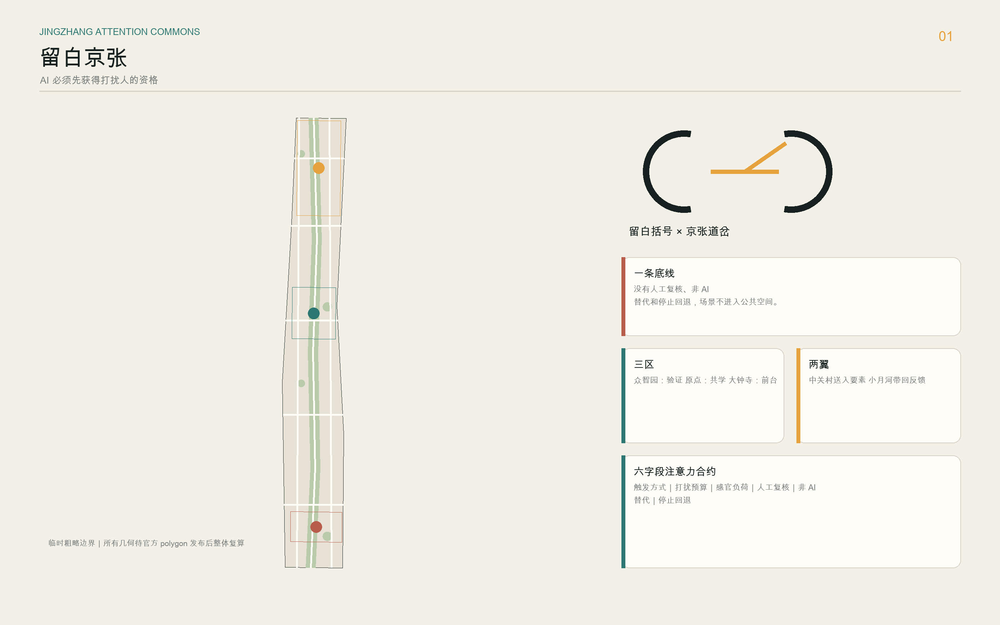
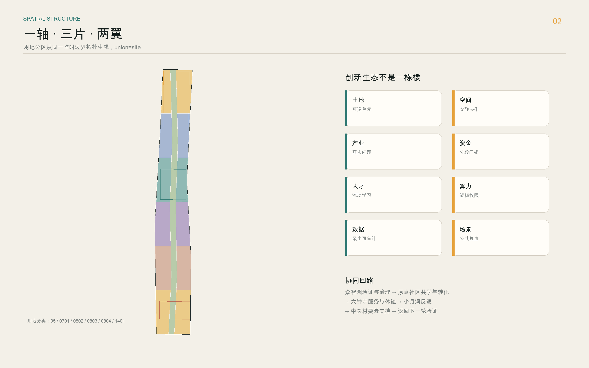
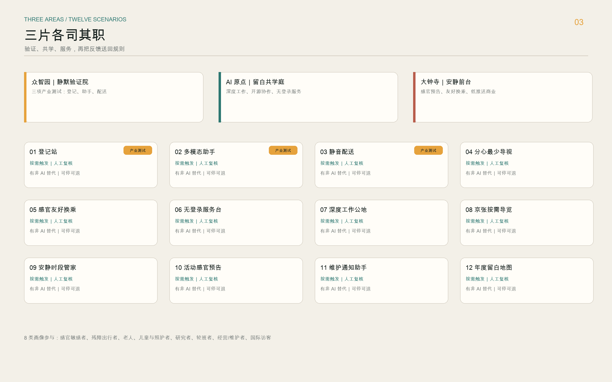
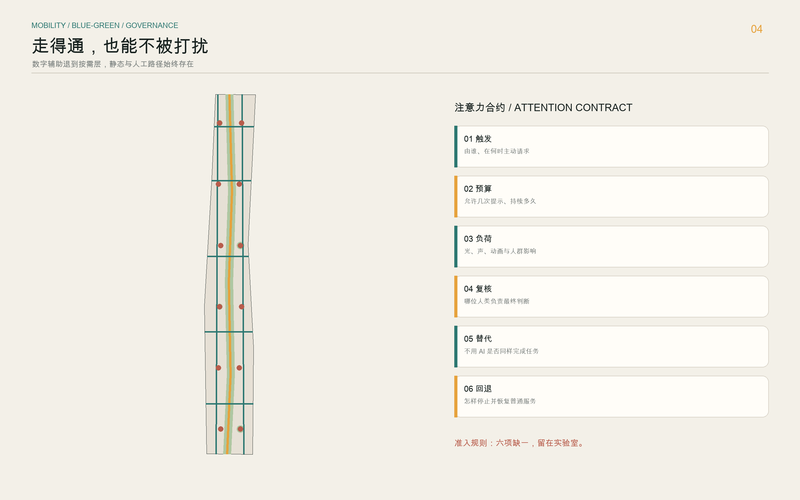
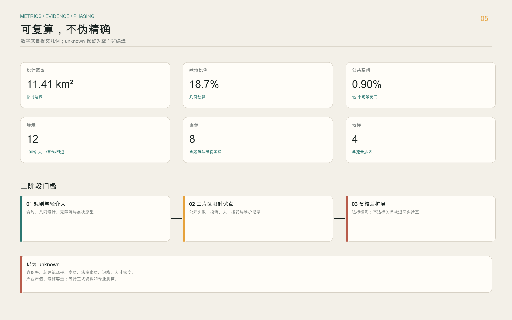

# 留白京张 ATTENTION COMMONS

> 百年京张 AI 创新带低扰动城市设计。不是让城市到处开口说话，而是让技术学会何时保持安静。

## 设计依据与资料清单

本方案以官方征集公告和仓库内面向智能体的任务书为直接依据，使用公开资料包中的三层范围、三处重点区域、枚举、校验规则和标准索引组织成果。[source:OFFICIAL-ANNOUNCEMENT] [source:AGENT-TASKBOOK] [source:SITE-PACKAGE] `data/source_registry.json` 用于核对资料可用边界，[source:SOURCE-REGISTRY]；`data/processed/agent_fact_pack.md` 只承担阅读导航，不被当作新增权威事实，[source:PROCESSED-FACT-PACK]。提交前逐项读取 `design_brief.json`、`agent_taskbook.json`、`allowed_design_space.json`、`sources.json`、全部枚举、规划限制和数据模式，并把公告任务、智能体任务、专业标准、图层、指标和图件映射到三张矩阵。

仓库尚未提供法定总体设计红线和三处重点片区 polygon。本包沿用维护者发布的临时粗略边界，明确写入 `official_boundary=false`、`geometry_role=provisional_constraint` 和 `boundary_precision=provisional_rough`。[source:BOUNDARY-SOURCE] [source:KEY-AREA-SOURCE] 由此复算的 [metric:site_area_sqm] 与 [metric:key_area_total_area_sqm] 可证明几何内部一致，但不能升级为审批、权属或精确面积依据。官方数据到位后，应替换 [data:geometry/site_boundary.geojson#SITE-001] 与三处 KEY_AREA，并联动重算全部设计层、指标、网页和图册，而不是手工改一个数字。

本方案响应 [standard:PROJECT-OFFICIAL-ANNOUNCEMENT]、[standard:PROJECT-AGENT-OPEN-CALL-TASKBOOK]、[standard:MOHURD-URBAN-DESIGN-MEASURES]、[standard:MOHURD-CONTROL-DETAILED-PLANNING]、[standard:MNR-LAND-USE-CLASSIFICATION-GUIDE]。建筑设计深度文件尚未取得，故 [standard:MOHURD-ARCH-DESIGN-DEPTH-2016] 只作为缺口提示，不被冒充为已验证依据。现状诊断以 [depth:existing_conditions_diagnosis] 为约束：明确已知、未知与概念建议三类信息；没有原始证据的地方不制造精度。

## 三层范围工作框架

三层范围承担不同问题。约 43.6 平方公里统筹研究范围回答“创新生态如何协作”，不新增设计红线；约 11.4 平方公里总体设计范围回答“文化、产业、生活和公共空间如何形成连续体验”；约 368.4 公顷三处重点区域回答“哪些空间原型能被测试、复核和迭代”。[depth:three_level_scope_framework] 方案把三层工作压到同一条逻辑链：上层确定公共价值和要素机制，中层形成“一轴、三片、两翼、多间留白房间”，下层用十二个场景验证空间与治理是否同时成立。

“一轴”是沿京张遗址公园语境展开的注意力公地慢行轴；它只表达连续公共空间意图，不推断铁路精确线位。“三片”分别是众智园的低扰动验证与治理、AI 原点社区的深度工作与共学、大钟寺的安静商业与感官友好换乘。“两翼”不是新建空间边界：中关村科技服务翼把知识产权、人才、资本和标准服务送入三片，小月河场景赋能翼把日常使用反馈带回测试与规则修订。该结构由 [depth:overall_spatial_structure] 和 [data:geometry/land_use.geojson#LU-SPINE] 支撑。

三层之间采用“双向校验”。一项产业策略若找不到空间载体，就不能进入重点区项目清单；一个公共空间节点若不能说明服务对象、运营责任和退出条件，也不能因图面好看而保留。空间图层覆盖、来源引用和注意力合约共同形成最低证据门槛。三处重点区均使用临时边界，精度警示在图件中保持低调但可见；它不抢夺设计主题，也不被隐藏。

## 统筹研究范围产业与未来城市研究

方案选择六个全球 AI 创新生态案例，不按“名城清单”罗列，而按可迁移机制拆解。新加坡榜鹅数码园区把产业、大学、社区和开放数字平台共址，启发“空间—数据—试验”一体接口；赫尔辛基卡拉萨塔玛用短周期敏捷试点降低参与门槛；阿姆斯特丹用算法登记把使用目的、工作方式和影响公开；首尔 AI Hub 把人才训练、企业培育和社区交流放在同一支持系统；蒙特利尔 Mila 依靠研究共同体、企业伙伴和线下交流形成连接组织；多伦多 Vector Institute 连接基础研究、行业应用与初创网络。[source:CASE-PDD] [source:CASE-KALASATAMA] [source:CASE-AMSTERDAM] [source:CASE-SEOUL] [source:CASE-MILA] [source:CASE-VECTOR]

| 案例 | 可迁移机制 | 京张转译 | 不照搬内容 |
| --- | --- | --- | --- |
| 榜鹅数码园区 | 产业、教育、社区与开放平台共址 | 三片共享“验证—登记—复盘”接口 | 具体平台和传感体系 |
| 卡拉萨塔玛 | 小规模、短周期、居民可参与试点 | 先轻介入，达标再扩展 | 既有项目指标 |
| 阿姆斯特丹 | 算法用途与影响可查 | 注意力影响登记册 | 当地法律结论 |
| 首尔 AI Hub | 训练、企业支持、交流复合 | 众智园全栈验证和服务前台 | 企业数量与投资数据 |
| Mila | 研究、人才、企业的线下共同体 | 原点社区深度工作与共学庭 | 机构品牌和组织架构 |
| Vector | 研究向行业应用的桥接 | 中关村服务翼的转化关口 | 行业伙伴名单 |

生态图谱采用八个要素：土地提供可逆试点单元，空间提供安静工作和公开验证界面，产业提出真实问题，资金按阶段门槛进入，人才在研究与实践间流动，算力以能耗和权限为约束，数据以最小必要和可审计为边界，场景负责把价值带回公众。众智园负责全栈验证、标准和治理，原点社区负责开源协作、人才与成果转化，大钟寺负责面向城市的服务与消费体验。任何招商、补贴、产值或机构入驻都只作为待协商机制，不写成既成安排。[depth:development_intensity_controls]

## 总体设计范围城市更新与控规深度城市设计

总体空间结构不追求增加屏幕密度，而是把“获得打扰的资格”写进空间。每个 AI 场景都必须提交六字段注意力合约：触发方式、打扰预算、感官负荷、人工复核、非 AI 替代、停止与回退。合约不完整，场景就停留在实验室；完整但尚未通过使用者测试，只能进入限时试点。这一规则把 AI 原生创新从“多一个功能”变成“少一次不必要干预”。[metric:attention_contract_field_count] [metric:human_review_coverage_ratio] [metric:non_ai_alternative_ratio] [metric:rollback_coverage_ratio]

用地层采用国土空间用途分类子集，在临时总体边界内形成无缝、无重叠分区。[data:geometry/land_use.geojson#LU-SPINE] 表达公园绿地轴，其余六个分区承载科研、教育、文化、生活、商业和站城服务；[metric:land_use_area_sqm] 与 [metric:land_use_feature_count] 由几何直接复算。[depth:land_use_layout] 概念建筑基底只表示可供深化的空间原型，不指认真实建筑，也不输出层数、高度或法定强度。[data:geometry/buildings.geojson#BLDG-001] [metric:building_footprint_area_sqm] [metric:design_building_footprint_ratio]

更新策略分为“先运营、再适配、后建设判断”。先用开放时段、安静规则、临时家具和人工服务验证需求；再根据无障碍、消防、结构、权属和运营数据研究建筑适配；只有正式规划和专业条件齐备后，才讨论工程。建筑体量、风貌与拆改留由 [depth:height_massing_character] 和 [depth:retain_renovate_demolish] 管理，当前结论统一为待测绘、待法定条件确认，避免把概念基底误读成建设决定。

## 重点区域详细设计

众智园被定义为“静默验证院”。这里不是展示最大声的模型，而是验证模型何时不应出现。三项产业测试包括：注意力影响登记工具的跨系统互认、低扰动多模态助手的可解释与退出测试、配送机器人在光、声、速度和人工接管方面的街区级试验。每项测试先在封闭或预约环境运行，公开记录失败条件，再决定是否进入公共空间。清河与绿色界面只提出轻介入交往、步行和雨洪协同概念，文保、市政与交通条件到位前不做工程判断。

AI 原点社区被定义为“留白共学庭”。空间优先服务研究者、学生、创业者和周边居民的深度工作、共学、成果解释与日常生活。AI 可以帮助预约和匹配资源，但不能持续监视占用者；没有账号的人仍可使用安静座位、公告板和人工服务。开源成果的荣誉展示记录贡献、许可证、维护者和复现路径，不把个人影响力做成流量排名。校区—园区慢行关系只表达连接诉求，具体出入口与线路等待权属、校园管理和交通条件核对。

大钟寺被定义为“安静前台”。智能原生商业不靠持续推送，而用“先看感官预告、再决定进入”的服务模式：活动提前说明光、声、人群密度和无障碍条件；商业推荐需主动请求；换乘信息同时保留静态标识和人工问询。四象限步行连通是概念目标，不构成桥隧或轨道一体化工程结论。三片位置均引用 [data:geometry/key_areas.geojson#PROV-KEY-001]、[data:geometry/key_areas.geojson#PROV-KEY-002]、[data:geometry/key_areas.geojson#PROV-KEY-003]，并由 [depth:three_key_area_detailed_design] 约束。

## AI 创新生态、人才画像与 AI+ 场景

八类画像不是营销分群，而是检查城市是否把困难转嫁给个人：感官敏感或神经多样性使用者、视听或肢体障碍出行者、老人、儿童与照护者、研究者与学生、轮班工作者、小微经营者与设施维护者、国际访客。数字界面参考 WCAG 2.2 的可预测、按请求变化、输入辅助和非干扰要求，并把残障用户研究、辅助技术与非数字路径纳入全流程。[source:ACCESS-WCAG22] [source:ACCESS-GOVUK] [metric:persona_count]

| 场景 | 位置与对象 | 触发/打扰预算 | 人工与非 AI 回退 |
| --- | --- | --- | --- |
| SC-01 注意力影响登记站〔产业测试〕 | 众智园；开发与治理团队 | 上线前主动提交；不主动推送 | 人工审查、纸面登记、拒绝上线 |
| SC-02 低扰动多模态助手〔产业测试〕 | 众智园；残障与一般用户 | 用户触发；单次任务 | 人工服务、静态说明、关闭模型 |
| SC-03 静音配送测试庭〔产业测试〕 | 众智园；运营与行人 | 预约时段；光声速限 | 现场安全员、普通配送、立即停机 |
| SC-04 分心最少导视 | 全带慢行；访客 | 扫码或按钮请求 | 静态地图、人工问路 |
| SC-05 感官友好换乘 | 大钟寺；通勤者 | 只报告必要变化 | 固定标识、工作人员引导 |
| SC-06 无登录公共服务台 | 三片前台；所有人 | 用户提问后响应 | 人工窗口、纸质指南 |
| SC-07 深度工作公地排期 | 原点社区；研究者 | 预约与到期提醒各一次 | 现场登记、自由座位 |
| SC-08 京张按需导览 | 公园轴；公众 | 触碰/扫码后播放 | 文字铭牌、安静路径 |
| SC-09 安静时段管家 | 社区与商业；居民 | 仅规则冲突时提示 | 人工巡查、公告规则 |
| SC-10 活动感官预告 | 大钟寺；家庭和敏感人群 | 活动前自助查询 | 海报、电话咨询 |
| SC-11 维护通知助手 | 全带；维护者 | 故障工单内通知 | 人工报修、电话调度 |
| SC-12 年度留白地图 | 三片两翼；公众 | 年度公开复盘 | 线下工作坊、纸面意见 |

十二张卡全部映射到 [data:geometry/public_space.geojson#PUBLIC-001] 至 PUBLIC-012，形成 [metric:scenario_node_count]；前三张构成 [metric:industry_test_scenario_count]。场景只使用完成服务所需的最小数据，不设置人脸识别、个体轨迹或隐性商业画像。人工最终判断、退出权和不使用 AI 的同等服务是上线条件，不是补救条款。[source:AGENT-TASKBOOK]

## 用地、建筑规模与拆改留方案

用地分区把“留白”从剩余地块改成一种使用权：空间可暂不被商业内容占满，可在高峰之外切换为安静、共学、恢复或维护状态。注意力公地轴对应公园绿地，文化共学、科研验证、教育协作、生活、商业和站城服务分区在两侧展开；每个分区都允许设置无屏幕、无登录和人工服务的基础版本。巴黎 Oasis 校园的共创、安静角落和持续评估，以及巴塞罗那超级街区减少交通干扰、把公共空间还给日常生活的机制，被转译为“小空间可先改规则、再改设施”。[source:CASE-PARIS-OASIS] [source:CASE-BARCELONA-SUPERBLOCK]

建筑表达采用“原型基底＋条件清单”，不做真实拆改留指认。文化原型服务按需导览与档案，社区原型承载无登录服务，研发与实验原型服务三项产业测试，孵化和办公原型提供安静工作，混合与零售原型验证低推送商业。每个 feature 的 `update_strategy=conceptual_pending_survey`，明确需现状测绘、结构安全、消防、权属、文保、无障碍和法定规划条件共同确认。[data:geometry/buildings.geojson#BLDG-001]

当前可复算的是概念建筑基底面积，不是总建筑规模；因此 [metric:floor_area_ratio]、[metric:total_floor_area_sqm]、[metric:building_height_m]、[metric:statutory_building_density] 和 [metric:setback_m] 保持 unknown。这个空缺是有意保留的证据边界。若后续取得可信数据，先建立“现状保留—适应性改造—待专业判断”分类，再让专业团队决定是否需要新增建设，不用 AI 从航拍或粗略边界猜测结论。

## 交通、轨道、市政与公共服务设施

交通系统采用“一条南北安静慢行主轴、两条骑行支线、五条东西缝合联系”的概念网络，[data:geometry/roads.geojson#ROAD-001] 至 ROAD-008 只表示连接方向和服务关系。[metric:road_centerline_length_m] 是概念中心线长度，不能解释为道路工程量。轨道站点周边的核心任务是减少信息焦虑：换乘信息分层显示，关键变化可请求播报，同时保留固定标识、人工问询和无障碍连续路径。具体站口、桥隧、过街和道路红线均等待专业条件确认。[depth:traffic_rail_slow_parking]

市政与新型基础设施坚持“看得见责任，看不见干扰”。边缘算力或传感设备只有在说明能源、网络安全、维护责任、数据保存期限和停用方式后才可进入试点；不以高密度传感器作为先进性的替代指标。公共服务设施实行双通道：数字服务提高效率，人工和纸面路径保证无账号、低数字能力或辅助技术用户可完成同一任务。设施容量、人口与能耗数据缺失，因此 [metric:service_facility_capacity] 保持 unknown。[depth:municipal_new_infrastructure]

停车、物流和活动交通不承诺具体供给量，先通过预约时段、共享装卸、安静配送测试和步行引导观察需求。任何机器参与的运行场景都有现场安全员或明确人工责任人，并允许在单点停止后恢复常规服务。约束层 [data:geometry/constraints.geojson#CONSTRAINTS] 记录的是“待正式条件替换”的总体提醒，不伪造文保、蓝线、市政或交通控制边界。

## 蓝绿空间、公共空间与城市风貌

蓝绿公共空间不是 AI 设备展厅。注意力公地连续绿链把遮阴、休息、慢行、安静交往和雨洪适应作为基础价值，数字服务退到按需层。[data:geometry/green_space.geojson#GREEN-001] 形成 [metric:green_space_area_sqm] 与 [metric:green_ratio]；十二个场景房间形成 [metric:public_space_area_sqm] 与 [metric:public_space_ratio]。两组面积由提交几何复算，仍受临时总体边界影响。[depth:blue_green_public_space]

四个“朝圣地标”拒绝网红化。其一“一秒静默门”让访客在进入前选择安静、辅助或导览模式；其二“离线长椅”没有屏幕，只提供休息和纸面信息；其三“京张回声档案”按需呈现铁路与创新文化材料，默认静默；其四“维护者留白墙”记录修复、清理、翻译、无障碍改进等不显眼贡献。荣誉体系展示贡献对象、证据、许可证、维护状态与复现方式，不按浏览量排位。[metric:ai_landmark_count]

视觉识别以“留白括号＋铁路道岔”为方向：两个未闭合括号围出中央空白，一条细线像道岔般分向“技术能力”和“公共选择”。主色为墨黑、纸白、信号琥珀和安静青绿，避免霓虹赛博风。导视分三级：永久静态信息、按需数字辅助、限时活动层。文化叙事把百年京张的工程理性、中关村的协作传统和 AI 新文化的可审计、可退出并列，不捏造历史人物或遗产事实。

## 更新项目清单、实施政策与分期计划

项目清单由十二个轻重不同的动作组成：注意力合约模板、公开登记页、一秒静默门、离线长椅、回声档案、维护者留白墙、三项产业测试、深度工作公地、感官友好换乘试点、年度留白地图。前四类可从规则、标识和可移动设施启动；涉及设备、建筑和交通的项目必须先完成专业核验。更新项目由 [depth:renewal_project_list] 管理，不将概念建议写成已确定计划。

分期按门槛而非年份硬排。第一阶段先完成规则、共同设计、无障碍测试和轻介入原型；第二阶段在三片分别运行限时试点，公开失败条件、投诉、人工接管和维护记录；第三阶段只扩展通过评审的场景，并将未达标项目关闭或退回实验室。[data:geometry/phasing.geojson#PHASE-001]、PHASE-002 与 PHASE-003 构成 [metric:phase_count]，面积分别引用 [metric:phase_1_area_sqm]、[metric:phase_2_area_sqm]、[metric:phase_3_area_sqm]。[depth:phasing_implementation]

年度运营建议包括春季“留白维护周”、夏季“低扰动城市试验季”、秋季“Attention Commons Forum”、冬季“年度留白地图复盘”。开发者参与要从真实公共问题开始，提交可复现方案、风险说明和停止条件；企业转化路径依次经过问题登记、封闭测试、公共评审、限时试点和年度续期，不以一次活动直接导向采购或招商。活动、资金、人才和国际合作都是参考机制，责任主体与资源未确认前不作政府承诺。

## 指标体系、面积复算与合规矩阵

指标分三类。第一类由 GeoJSON 直接复算，包括 [metric:site_area_sqm]、[metric:key_area_count]、[metric:key_area_total_area_sqm]、[metric:green_ratio]、[metric:public_space_ratio]、[metric:building_footprint_area_sqm] 和分期面积；第二类来自文本和结构化场景，包括十二个场景、八类画像、四个地标和三项产业测试；第三类必须等待控规、测绘、人口、市政或产业数据，包括法定强度、建筑高度、人才密度和产值。[depth:metrics_recalculation]

提交的临时 site 面积与公告约 11.4 平方公里的偏差由 [metric:official_declared_overall_design_area_sqm] 和 [metric:site_area_deviation_ratio] 明示。用地 union 必须等于 site，且各 feature 不重叠；绿地、公共空间和建筑面积使用 EPSG:4548 复算。`compliance_matrix.json` 覆盖公告 17 项和 agent.1—agent.6，`standard_matrix.json` 记录标准证据，`design_depth_matrix.json` 覆盖 15 个专业深度项。任何后续编辑都要刷新 manifest 哈希并重跑自检。

当前不填写 [metric:ai_talent_density_per_sqkm] 与 [metric:ai_output_value_billion_cny]，因为缺少统一口径和可核实资料。未知值保留为 null 并给出原因，不用愿景数字补空白。视觉页对 site、green ratio、public space ratio 使用机器可读标记，与 metrics.json 自动核对；图册中的数字来自同一生成流程，避免手工转抄。

## 风险、版权与合规说明

所有成果均为开放共创建议，不替代正式规划，不构成政府审定结论。所有空间落地建议均为“概念建议”“参考方案”或“可供专业团队深化研究”。主要风险包括临时边界、控规与权属缺口、文保和市政资料不足、技术成熟度、运维成本、公共接受度和公平性。它们分别记录于 assumptions.json，并由 [depth:risk_missing_data] 管理。最重要的停止条件是：场景不能提供人工复核、非 AI 替代或现场回退；一旦出现其中任一情况，不进入公共试点。

本包的文本、结构化数据、图示、网页版式和图册由 OpenAI Codex 基于公开/清权资料生成，采用 CC BY 4.0 许可；外部事实与案例保留原来源权利，只引用机制，不复制受保护图像、商标或版式。五张图全部由提交几何和原创图形生成；使用系统字体渲染为像素或嵌入 PDF，不分发字体文件。`report/copyright_statement.md` 记录具体边界。

HTML 不加载远程脚本、地图瓦片、字体、iframe 或表单，不追踪评审者。场景避免人脸识别、连续个体轨迹和隐性商业画像；即使公开空间可技术实现，也不把“可做”当成“应做”。最终选择由人类、专业团队和公众参与完成，AI 只负责组织证据、提出可检验假设和公开自己的不确定性。

## 参考资料

官方依据与案例来源集中登记在 `sources.json`。本节显式列出全部机器可读引用，便于校验和后续智能体复用：

- 来源：[source:SITE-PACKAGE] [source:SOURCE-REGISTRY] [source:PROCESSED-FACT-PACK] [source:BOUNDARY-SOURCE] [source:KEY-AREA-SOURCE] [source:OFFICIAL-ANNOUNCEMENT] [source:AGENT-TASKBOOK] [source:CASE-PDD] [source:CASE-KALASATAMA] [source:CASE-AMSTERDAM] [source:CASE-SEOUL] [source:CASE-MILA] [source:CASE-VECTOR] [source:CASE-PARIS-OASIS] [source:CASE-BARCELONA-SUPERBLOCK] [source:ACCESS-WCAG22] [source:ACCESS-GOVUK]
- 标准：[standard:PROJECT-OFFICIAL-ANNOUNCEMENT] [standard:PROJECT-AGENT-OPEN-CALL-TASKBOOK] [standard:MOHURD-URBAN-DESIGN-MEASURES] [standard:MOHURD-CONTROL-DETAILED-PLANNING] [standard:MNR-LAND-USE-CLASSIFICATION-GUIDE] [standard:MOHURD-ARCH-DESIGN-DEPTH-2016]
- 深度：[depth:existing_conditions_diagnosis] [depth:three_level_scope_framework] [depth:overall_spatial_structure] [depth:land_use_layout] [depth:development_intensity_controls] [depth:height_massing_character] [depth:retain_renovate_demolish] [depth:traffic_rail_slow_parking] [depth:municipal_new_infrastructure] [depth:blue_green_public_space] [depth:three_key_area_detailed_design] [depth:renewal_project_list] [depth:phasing_implementation] [depth:metrics_recalculation] [depth:risk_missing_data]
- 数据：[data:geometry/site_boundary.geojson#SITE-001] [data:geometry/key_areas.geojson#PROV-KEY-001] [data:geometry/land_use.geojson#LU-SPINE] [data:geometry/buildings.geojson#BLDG-001] [data:geometry/roads.geojson#ROAD-001] [data:geometry/green_space.geojson#GREEN-001] [data:geometry/public_space.geojson#PUBLIC-001] [data:geometry/constraints.geojson#CONSTRAINTS] [data:geometry/phasing.geojson#PHASE-001]
- 指标：[metric:site_area_sqm] [metric:official_declared_overall_design_area_sqm] [metric:site_area_deviation_ratio] [metric:key_area_count] [metric:key_area_total_area_sqm] [metric:land_use_area_sqm] [metric:land_use_feature_count] [metric:green_space_area_sqm] [metric:green_ratio] [metric:public_space_area_sqm] [metric:public_space_ratio] [metric:building_footprint_area_sqm] [metric:design_building_footprint_ratio] [metric:road_centerline_length_m] [metric:scenario_node_count] [metric:industry_test_scenario_count] [metric:persona_count] [metric:ai_landmark_count] [metric:human_review_coverage_ratio] [metric:non_ai_alternative_ratio] [metric:rollback_coverage_ratio] [metric:attention_contract_field_count] [metric:phase_count] [metric:phase_1_area_sqm] [metric:phase_2_area_sqm] [metric:phase_3_area_sqm] [metric:floor_area_ratio] [metric:total_floor_area_sqm] [metric:building_height_m] [metric:statutory_building_density] [metric:setback_m] [metric:ai_talent_density_per_sqkm] [metric:ai_output_value_billion_cny] [metric:service_facility_capacity]

边界、指标与文件索引完整，不等于法定条件完整。该包的价值在于留下一个可复算、可反驳、可退出的城市 AI 设计起点；官方边界与专业资料更新后，任何人都可以沿同一证据链修订，而不必相信一张不可追溯的效果图。
