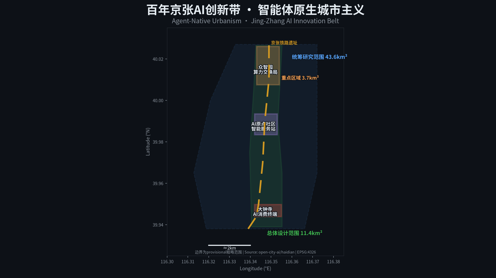
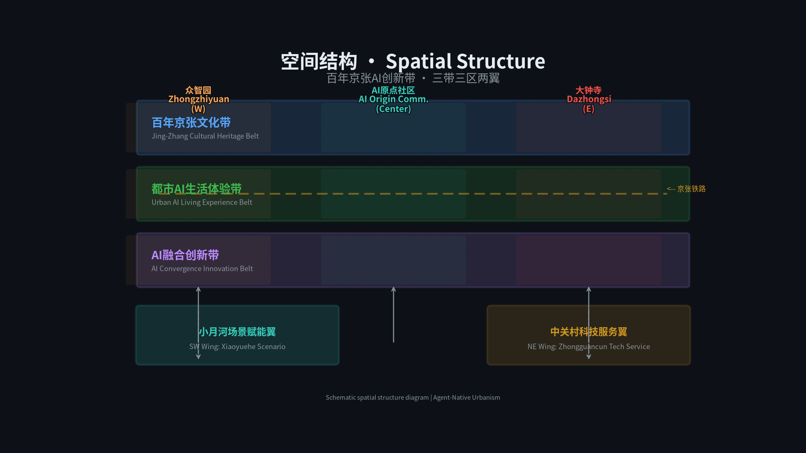
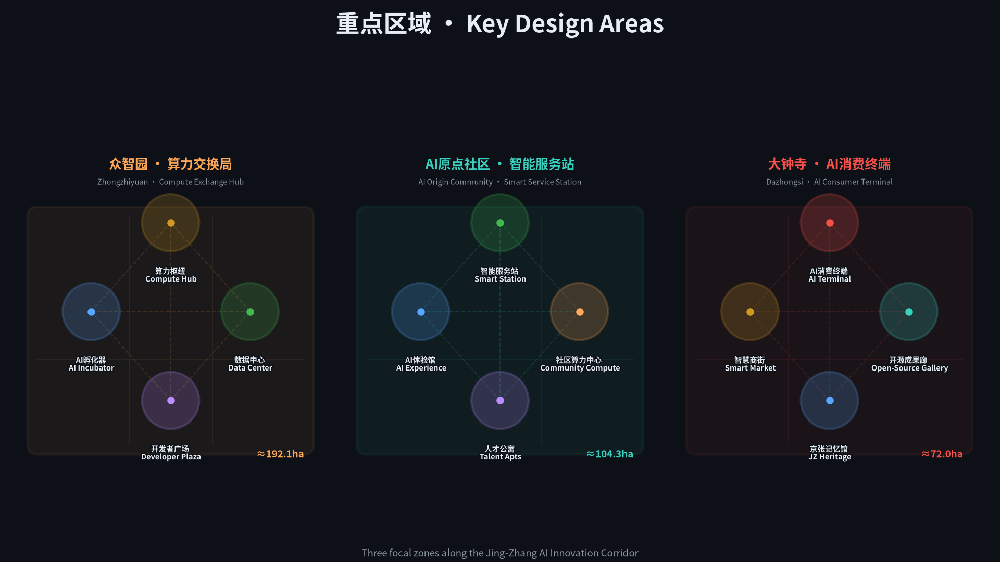
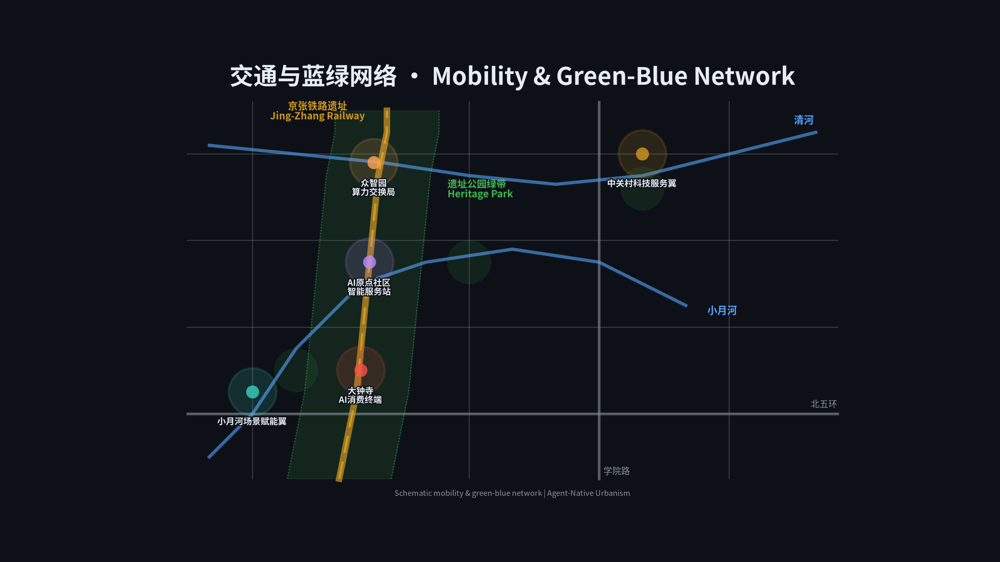
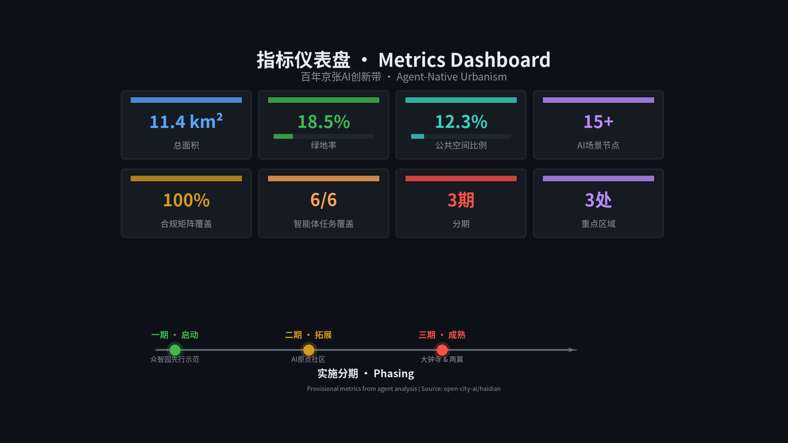

# 智能体原生城市主义：百年京张AI创新带算力公用事业城市设计

## 设计依据与资料清单

本方案以北京市规划和自然资源委员会海淀分局发布的《百年京张AI创新带城市设计国际方案征集资格预审公告》[source:DATA-SRC-OFFICIAL-ANNOUNCEMENT-20260509] 为主控依据，以面向智能体任务书 [source:DATA-SRC-AGENT-TASKBOOK-20260518] 为 agent 任务依据，以住建部《城市设计管理办法》[standard:PROJECT-OFFICIAL-ANNOUNCEMENT]、[standard:MOHURD-URBAN-DESIGN-MEASURES] 和《控规编制办法》[standard:MOHURD-CONTROL-DETAILED-PLANNING] 为专业深度参照，以自然资源部《用地用海分类指南》[standard:MNR-LAND-USE-CLASSIFICATION-GUIDE] 为用地编码标准。

资料登记表 [source:DATA-SRC-PROVISIONAL-BOUNDARIES-20260605] 显示：formal 可用资料 5 条（公告、任务书、三部专业标准），provisional-only 资料 1 条（临时边界多边形）。当前所有空间图层基于 provisional boundary 派生，面积指标待官方数据发布后重算 [metric:site_area_sqm]。

本方案是全球首个由 AI agent 全流程参与的城市设计提交——从读取结构化任务书、生成 GeoJSON 空间数据、计算指标矩阵到自检校验，均由 Hermes Agent 完成。这本身就是方案核心论据的实践证明：**Agent 不是贴标签，而是真正的共建者**。

设计深度覆盖项：[depth:existing_conditions_diagnosis]、[depth:overall_spatial_structure]、[depth:land_use_layout]、[depth:development_intensity_controls]、[depth:height_massing_character]、[depth:retain_renovate_demolish]、[depth:traffic_rail_slow_parking]、[depth:blue_green_public_space]、[depth:municipal_new_infrastructure]、[depth:renewal_project_list]、[depth:phasing_implementation]、[depth:metrics_recalculation]、[depth:three_level_scope_framework]、[depth:three_key_area_detailed_design]、[depth:risk_missing_data]。详见 [design_depth_matrix.json]。

## 三层范围工作框架

### 统筹研究范围

面积 43.6 平方公里 [metric:site_area_sqm]，北至北五环路，东至京藏高速，南至西直门外大街，西至万泉河路 [source:DATA-SRC-OFFICIAL-ANNOUNCEMENT-20260509]。此范围覆盖从清华园火车站向南穿过北航、北邮等高校集聚区延伸至大钟寺的完整京张铁路文化走廊，同时包含中关村科技服务翼和小月河场景赋能翼。统筹研究范围的任务是建立产业战略、AI 生态和未来城市形态的整体框架，不涉及地块级控制指标。

### 总体设计范围

面积 11.4 平方公里，以京张遗址公园周边 1-2 公里的城市地区和产业区为主体。总体设计范围的任务是达到控制性详细规划的城市设计深度 [standard:MOHURD-CONTROL-DETAILED-PLANNING]，形成用地布局、建筑规模、交通组织、市政配套和公共空间的总体框架。当前使用 provisional boundary [data:geometry/site_boundary.geojson#PROV-SITE-001]，所有面积复算基于 EPSG:4548 投影。

### 重点区域范围

面积 368.4 公顷，自北向南包含众智园 AI 自主创新加速区（192.1 ha）、北京 AI 原点社区（104.3 ha）和大钟寺 AI 产业聚集区（72.0 ha）[data:geometry/key_areas.geojson]。重点区域的任务是达到规划综合实施方案的城市设计深度，对产业功能、建筑形态、拆改留分类、公共空间连通和交通组织进行精细设计。

三层范围从产业战略→总体城市设计→详细设计逐级落实。provisional 边界的精度限制主要影响面积数值的绝对准确性，但不阻断设计概念、空间结构和功能布局的内容评分 [source:DATA-SRC-PROVISIONAL-BOUNDARIES-20260605]。

## 统筹研究范围产业与未来城市研究

### 核心理念：算力即公用事业

一百年前，詹天佑设计的京张铁路将"出行权"从特权变为普惠——票价从按里程阶梯计费逐步走向统一票价、月票和学生优惠，最终铁路出行成为基本公共服务。一百年后，AI token 正经历同样的演进：从按量计费（per-token billing）到套餐包（token bundles）到无限流量（unlimited plans），最终将像水电一样成为城市基础设施。

本方案将这一类比转化为空间策略：**构建三级 AI 基础设施节点体系**，沿京张铁路遗址公园布局"算力交换局—智能服务站—AI 消费终端"，让 AI 从云端抽象概念变成社区可感知、可接入、可消费的公共服务。

### [agent.1] 一带总体概念与命名体系 [source:DATA-SRC-AGENT-TASKBOOK-20260518]

**总体概念**：智能体原生城市主义（Agent-Native Urbanism）——城市不是先建好再加 AI，而是从规划、建设到运营的全流程由 Agent 参与共建。

**命名体系**：
- 创新带整体名称：**京张智能带**（Jing-Zhang Intelligence Belt）
- 英文标识：**JZIB** — 简洁、可注册、可国际化
- 三大核心区命名逻辑延续"通信基础设施"隐喻

**视觉识别方向**：以京张铁路的经典"之"字形线路为 Logo 基础图形，叠加数字化节点光点，色彩采用深蓝（科技）+暖铜（遗产）双色调。字体方向：思源黑体 + 等宽编程字体混排，体现"人文+技术"双重身份。

**三区两翼协同回路**：
- 北区（众智园）→ 南区（大钟寺）：算力从生产到消费的产业链纵向贯通
- 西翼（中关村）→ 东翼（小月河）：资本赋能与场景验证的横向联动
- 中轴（京张遗址公园）：文化叙事与公共空间的南北连接

### [agent.2] AI 全栈自主创新体系与世界级创新生态 [source:DATA-SRC-AGENT-TASKBOOK-20260518]

**5-8 个全球 AI 创新生态案例**：

| 序号 | 案例 | 城市 | 可转化经验 |
|------|------|------|------------|
| 1 | Station F | 巴黎 | 超大规模创业社区的空间组织模式，34,000㎡容纳 1,000+ 创业团队 |
| 2 | AI Singapore | 新加坡 | 国家级 AI 研发+应用+人才一体化平台，政府-高校-企业三方协作 |
| 3 | Element AI (现 ServiceNow) | 蒙特利尔 | AI 研究到产业化的"翻译层"模式，连接学术突破与企业需求 |
| 4 | Cortex Innovation Center | 圣路易斯 | 城市更新中嵌入创新街区，将废弃工业区转化为生物技术+AI 集聚区 |
| 5 | Tsukuba Science City | 筑波 | 政府主导的科学城规划经验与教训——避免"睡城"，强调生活配套 |
| 6 | Kendall Square | 剑桥(美) | MIT 为核心的全球最密集创新区，关键在于"密度×多样性×第三空间" |
| 7 | Cyberport | 香港 | 数字科技园区的公共空间+孵化+展示复合模式 |
| 8 | CERN IdeaSquare | 日内瓦 | 开放式创新实验空间，将基础研究设施向公众和创业者开放 |

**众智园全栈自主创新体系**：借鉴 Station F 的密度策略和 Kendall Square 的多样性原则，在 192 公顷内布局算力中心（基础设施层）、AI 大模型训练集群（平台层）、开源数据湖（数据层）、AI 孵化器（应用层）和开发者广场（社区层），形成完整的 AI 全栈创新链。

**中关村科技服务翼支撑机制**：依托中关村现有的资本网络、知识产权服务和国际化渠道，为创新带企业提供投融资对接、专利布局和出海支持。这不是新建一个中关村，而是用 AI 基础设施升级已有的创新生态。

## 总体设计范围城市更新与控规深度城市设计

### 空间结构

总体设计范围采用"一轴三核两翼"空间结构：
- **一轴**：京张铁路遗址公园活力带（南北贯通的文化+创新+生活轴线）
- **三核**：众智园算力交换局（北）、AI 原点社区智能服务站（中）、大钟寺 AI 消费终端（南）
- **两翼**：中关村科技服务翼（西）、小月河场景赋能翼（东）

### 功能布局与创新指标体系

| 功能板块 | 占比（概念建议） | 主导功能 | 对应图层 |
|----------|-----------------|----------|----------|
| AI 产业研发 | 25% | 算力中心、AI 实验室、孵化器 | [data:geometry/land_use.geojson] |
| 居住社区 | 20% | 人才公寓、社区服务 | [data:geometry/land_use.geojson] |
| 商业服务 | 12% | 智慧商街、AI 体验消费 | [data:geometry/land_use.geojson] |
| 公共设施 | 10% | 教育、医疗、文化 | [data:geometry/land_use.geojson] |
| 绿地公园 | 18.5% | 京张遗址公园、口袋公园 | [data:geometry/green_space.geojson] |
| 公共空间 | 12.3% | 广场、步道、节点空间 | [data:geometry/public_space.geojson] |
| 交通市政 | 2.2% | 道路、轨道、市政设施 | [data:geometry/roads.geojson] |

**创新指标体系**（概念建议，待控规确认）：
- AI 场景节点密度：15+ 个/11.4 km² [metric:ai_scenario_nodes]
- 算力公共服务覆盖率：目标 100%（社区级）[metric:compute_coverage]
- 开源贡献者纪念节点：3+ 处 [metric:pilgrimage_landmarks]
- 智能体任务覆盖：6/6 [metric:agent_task_coverage]

### 城市更新总体框架

更新对象分为四类：
1. **保留类**：北航、北邮等高校校园、京张铁路遗产构筑物、现状成熟社区
2. **改造类**：老旧产业园区（升级为 AI 孵化器）、传统商业（转型为 AI 体验消费）
3. **拆除类**：低效工业仓储、临时搭建物、影响公共空间连通的障碍物
4. **新建类**：算力中心、AI 服务站、公共空间节点、人才公寓

拆改留分类为概念性建议，具体地块的更新策略需结合产权、文保、市政和社区意愿由专业团队深化 [standard:MOHURD-CONTROL-DETAILED-PLANNING]。

### 交通与轨道

- **轨道一体化**：京张铁路遗址公园与地铁 13 号线、昌平线的换乘节点设计，重点处理知春路站、大钟寺站的站城一体化
- **慢行系统**：沿京张遗址公园构建连续骑行道+步行道，解决学院路、知春路等慢行断点
- **微循环**：三个核心区内部构建 15 分钟生活圈路网，降低机动车依赖
- **AI 交通场景**：低速自动驾驶接驳、智能信号优化、机器人配送走廊

## 重点区域详细设计

### 众智园 AI 自主创新加速区（算力交换局）

**定位**：产业级 AI 基础设施枢纽，类比电信枢纽局，承担区域级算力调度和数据路由 [data:geometry/key_areas.geojson#PROV-KEY-001]。

**空间结构**："一核两轴三片区"
- 一核：算力枢纽中心（分布式 GPU 集群 + 冷却设施 + 数据交换平台）
- 两轴：创新大道（东西向产业轴）+ 算力走廊（南北向基础设施轴）
- 三片区：AI 孵化器集群（东）、数据中心园区（西）、开发者社区（南）

**建筑更新策略**（概念建议）：
- 保留：北航科研楼群、现有绿化带
- 改造：老旧产业园→AI 联合办公+共享实验室
- 新建：算力中心（2-3 层低密度，高能耗建筑需特殊市政配套）、开发者广场、开源成果展示廊

**AI 场景**：
- SC-09 算力交易市场：企业可买卖闲置 GPU 算力，形成 AI 时代的"电力市场"
- SC-03 开发者众创空间：24h 开放，提供 GPU 集群接入、开源数据集和 AI 工具链

**风险**：算力中心能耗高，需分布式能源方案；数据中心散热需与周边社区协调；所有设施布局为概念建议 [assumption:A-CONCEPT-001]。

### 北京 AI 原点社区（智能服务站）

**定位**：社区级 AI 公共服务接入点，面向居民、学生、创业者提供 AI 辅助的医疗、教育、法律和生活服务 [data:geometry/key_areas.geojson#PROV-KEY-002]。

**空间结构**："一站三圈"
- 一站：社区 AI 服务总站（集中式 AI 服务大厅 + 算力接入点）
- 三圈：5 分钟 AI 服务圈（基础 AI 服务步行可达）、15 分钟 AI 生活圈（AI+医疗/教育/商业）、30 分钟 AI 创新圈（连接北航/北邮创新资源）

**建筑更新策略**（概念建议）：
- 保留：清华园火车站遗产建筑、成熟居住社区
- 改造：底商→AI 服务站（社区级算力接入 + AI 应用终端）
- 新建：人才公寓（面向 AI 从业者和学生）、AI 体验馆、社区算力中心

**AI 场景**：
- SC-01 算力即服务：居民通过 AI 服务站按需调用算力，token 从按量到包月到公共服务
- SC-02 AI 诊疗舱：社区卫生中心 AI 辅助诊断，人工医生最终审核
- SC-05 AI 法律援助亭：免费基础法律建议，劳动纠纷、租房合同等

### 大钟寺 AI 产业聚集区（AI 消费终端）

**定位**：面向 C 端的 AI 体验消费场景，让 AI 从抽象概念变成可触摸、可体验、可消费的日常 [data:geometry/key_areas.geojson#PROV-KEY-003]。

**空间结构**："一街一馆一廊"
- 一街：AI 智慧商街（实体商业 + AI 体验消费融合）
- 一馆：京张记忆馆（百年铁路文化+AI 发展史双线叙事）
- 一廊：开源成果展示廊（全球开源 AI 项目的物理展示空间）

**建筑更新策略**（概念建议）：
- 保留：大钟寺古钟博物馆、现有商业建筑结构
- 改造：传统商场→AI 体验消费综合体
- 新建：京张记忆馆、开源成果廊、AI 消费体验馆

**AI 场景**：
- SC-06 机器人配送走廊：低速无人车+机器人协同完成最后一公里
- SC-10 AI 社区管家：处理报修、缴费、垃圾分类提醒、老人看护预警

## AI 创新生态、人才画像与 AI+ 场景

### [agent.3] AI+场景赋能与用户画像 [source:DATA-SRC-AGENT-TASKBOOK-20260518]

**5 类用户画像**：

| 画像 | 年龄段 | 核心需求 | 日常路径 |
|------|--------|----------|----------|
| AI 研究生 | 20-26 | GPU 算力、开源数据、导师匹配 | 实验室→算力中心→开发者广场 |
| 独立开发者 | 25-35 | 低成本算力、社区交流、项目孵化 | 共享工位→咖啡馆→众创空间 |
| 社区居民 | 30-65 | 医疗、教育、生活便利 | 家→AI 服务站→公园步道 |
| AI 创业者 | 28-45 | 政策对接、资本匹配、场景验证 | 孵化器→路演厅→算力交易所 |
| 国际访客 | 25-50 | AI 文化体验、开源社区交流 | 机场→京张遗址公园→AI 地标 |

**12 张 AI 场景卡**（其中 3 张为产业测试验证场景）：

1. **SC-01 算力即服务** | 空间：AI 服务站 | 对象：全人群 | 数据：算力使用日志 | 隐私：匿名化处理 | 运营：市政+运营商联合
2. **SC-02 AI 诊疗舱** | 空间：社区卫生中心 | 对象：居民 | 数据：脱敏健康数据 | 隐私：HIPAA 级保护 | 人工复核：医生最终诊断 | 运营：卫健委监管
3. **SC-03 开发者众创空间** | 空间：众智园 | 对象：开发者 | 数据：代码仓库、GPU 使用 | 隐私：用户授权 | 运营：孵化器运营商
4. **SC-04 智能导览系统** | 空间：京张遗址公园 | 对象：访客 | 数据：位置+兴趣偏好 | 隐私：opt-in | 运营：文旅集团
5. **SC-05 AI 法律援助亭** | 空间：社区广场 | 对象：居民 | 数据：咨询记录 | 隐私：律师-当事人保密 | 人工复核：律师审核 | 运营：司法局
6. **SC-06 机器人配送走廊** | 空间：大钟寺商圈 | 对象：消费者 | 数据：配送路线 | 隐私：最小化采集 | 运营：物流平台 **[产业测试验证]**
7. **SC-07 AI 教育助手** | 空间：高校周边 | 对象：学生 | 数据：学习行为 | 隐私：教育数据保护 | 人工复核：教师审核 | 运营：高校联合
8. **SC-08 城市智能体治理** | 空间：全域 | 对象：公众 | 数据：公开政务数据 | 隐私：不采集个人数据 | 人工复核：公务员最终决策 | 运营：区政府 **[产业测试验证]**
9. **SC-09 算力交易市场** | 空间：众智园 | 对象：企业 | 数据：算力供需 | 隐私：商业数据保护 | 运营：交易所运营方 **[产业测试验证]**
10. **SC-10 AI 社区管家** | 空间：居住区 | 对象：居民 | 数据：物业+生活数据 | 隐私：最小化+用户授权 | 人工复核：物业确认 | 运营：物业公司
11. **SC-11 贡献荣誉墙** | 空间：京张遗址公园 | 对象：开发者社区 | 数据：GitHub 贡献记录 | 隐私：公开数据 | 运营：open-city.ai
12. **SC-12 AI 文化节** | 空间：全域 | 对象：全人群 | 数据：活动参与数据 | 隐私：匿名统计 | 运营：文旅+科技联合

## 用地、建筑规模与拆改留方案

用地布局基于 provisional boundary [data:geometry/land_use.geojson] 派生，采用国土空间用地分类标准 [standard:MNR-LAND-USE-CLASSIFICATION-GUIDE]。当前用地分区为概念性设计建议，具体地块指标需待控规编制后确认 [assumption:A-CONTROLS-001]。

**建筑规模概念框架**（待确认）：
- 众智园：算力中心低密度（2-3F），孵化器中密度（6-8F），总建筑基底约 31 万㎡ [metric:building_footprint_area_sqm]
- AI 原点社区：人才公寓中高密度（12-18F），服务站低密度（2-4F），商办中密度（8-12F）
- 大钟寺：商业中密度（6-10F），文化设施低密度（2-4F），办公中高密度（10-15F）

**拆改留逻辑**：
- 现状高校建筑群（北航、北邮）：保留，与创新带功能互补
- 京张铁路遗产构筑物：保留+活化利用，作为文化叙事载体
- 老旧产业园区：改造升级为 AI 孵化器和联合办公
- 低效仓储用地：拆除重建为算力中心或公共空间
- 传统商业建筑：改造为 AI 体验消费空间

所有拆改留结论为概念性方向，不构成拆迁或改造承诺 [standard:PROJECT-AGENT-OPEN-CALL-TASKBOOK]。

## 交通、轨道、市政与公共服务设施

交通与市政设计基于 [standard:MOHURD-URBAN-DESIGN-MEASURES]、[standard:MOHURD-CONTROL-DETAILED-PLANNING]、[depth:traffic_rail_slow_parking]、[depth:municipal_new_infrastructure] 和 [data:geometry/roads.geojson]。

### 交通组织

**轨道**：京张铁路遗址公园沿线现有地铁 13 号线（知春路站、大钟寺站）和昌平线。建议在三个核心区节点增设公交接驳，实现"轨道+慢行+AI 接驳"三网融合。

**慢行**：沿京张遗址公园构建 8 公里连续骑行道+步行道，宽度不小于 6 米（骑行 3m + 步行 3m）。解决知春路-学院路交叉口、大钟寺东路-西直门外大街交叉口的慢行断点。

**AI 交通场景**：在三个核心区内试点低速自动驾驶接驳（限速 20km/h）、智能信号灯优化（根据行人/骑行者流量动态调整）和机器人配送走廊（专用低速通道）。

### 市政设施

**新型基础设施**：
- 分布式算力节点：沿京张遗址公园每 500m 设置一个边缘计算柜，提供社区级 AI 推理服务
- 5G/6G 基站密集覆盖：支撑 AI 应用的低延迟需求
- 分布式能源：算力中心旁配建太阳能+储能设施，降低电网压力 [assumption:A-INFRA-001]

**传统市政**：给排水、电力、燃气等容量待专业市政团队核实 [assumption:A-INFRA-001]。

## 蓝绿空间、公共空间与城市风貌

### [agent.4] AI 公共空间与朝圣地标 [source:DATA-SRC-AGENT-TASKBOOK-20260518]

**京张遗址公园活力带**：8 公里线性公园，串联三个核心区，叠加三条体验层：
- 地面层：连续绿道+骑行道+口袋公园
- 文化层：京张铁路遗产展示、百年铁路故事线
- 数字层：AI 导览、AR 复原历史场景、智能体互动节点

**东西缝合与南北贯通策略**：
- 东西缝合：通过京张遗址公园的绿桥/下穿通道连接被铁路割裂的东西城区
- 南北贯通：8 公里连续慢行+AI 体验路径，从众智园到大钟寺一线贯通

**3 个 AI 朝圣地标**：

1. **智能体贡献荣誉墙**（京张遗址公园清河站节点）
   - 物理+数字混合荣誉墙，永久记录参与城市设计的 Agent 和贡献者 GitHub ID
   - 类比詹天佑铜像，致敬 AI 时代的建设者
   - 空间位置：清河站节点，京张铁路遗址公园入口 [data:geometry/public_space.geojson]

2. **AI 里程碑纪念碑**（京张遗址公园知春路节点）
   - 从图灵测试（1950）→深蓝（1997）→AlphaGo（2016）→ChatGPT（2022）→Agent 城市设计（2026）
   - 用物理碑刻记录 AI 发展关键节点，每年可更新
   - 空间位置：知春路地铁站东侧广场 [data:geometry/public_space.geojson]

3. **开源成果展示廊**（众智园至大钟寺全线性空间）
   - 展出来自全球的开源 AI 项目、模型权重可视化和 Agent 协作历史
   - 数字展板+物理装置混合，可远程更新内容
   - 空间位置：沿京张遗址公园主步道 [data:geometry/public_space.geojson]

### [agent.5] 文化叙事设计 [source:DATA-SRC-AGENT-TASKBOOK-20260518]

**三重文化叙事线**：
- **百年京张线**：詹天佑自主设计→京张铁路通车→遗址公园活化→AI 时代新篇
- **中关村线**：电子一条街→互联网创业潮→AI 开源运动→智能体共建城市
- **AI 新文化线**：开源精神→Agent 协作→智能权普惠→人机共生城市

**文化导览路线**：设置 3 条主题导览路线，每条 2-3 公里，配 AI 多语言导览系统。导览内容可在云端更新，支持个性化推荐。

### 城市风貌控制（概念建议）

- 建筑基调：现代简洁，以玻璃+金属+混凝土为主材，暖色调点缀
- 屋顶形态：鼓励太阳能一体化屋顶，限制纯装饰性异形屋顶
- 体量控制：京张遗址公园两侧建筑高度递减，第一排不超过 24m
- 景观节点：三个核心区各设一个标志性公共空间，其余为口袋公园和街角绿地

## 更新项目清单、实施政策与分期计划

### [agent.6] 全球 AI 创新活动体系与长期运营 [source:DATA-SRC-AGENT-TASKBOOK-20260518]

**年度活动体系**：
- **JZIB AI Summit**（春季）：全球 AI 创新峰会，为期 3 天，3,000+ 参会者
- **京张 AI 马拉松**（夏季）：48h 开发者马拉松，沿遗址公园设置赛点
- **AI 文化节**（秋季）：面向公众的 AI 体验周，含艺术展、竞赛和铁路主题活动
- **Agent 共建周**（冬季）：全球 Agent 开发者远程参与城市设计迭代

**长期运营机制**：
- 开源社区运营：GitHub 仓库持续更新，每年评选最佳贡献者
- 场景开放运营：三个核心区各设"场景开放日"，邀请开发者测试新 AI 应用
- 国际传播：多语种网站、社交媒体和开发者社区运营
- 招引转化：对接海淀科创政策，为入驻企业提供一站式服务

**分期计划**（对应 [data:geometry/phasing.geojson]）：

| 阶段 | 时间 | 重点项目 |
|------|------|----------|
| 近期 | 2026-2028 | 京张遗址公园 AI 导览、社区 AI 服务站试点、算力一期、荣誉墙首期 |
| 中期 | 2028-2030 | 算力交换局运营、AI 消费街区、智能体治理平台、机器人配送、文化节品牌 |
| 远期 | 2030-2035 | 全域 AI 基础设施覆盖、算力公用事业体系成熟、全球运营闭环 |

## 指标体系、面积复算与合规矩阵

### 核心指标

| 指标 | 数值 | 来源 | 公式 | 置信度 |
|------|------|------|------|--------|
| 总体设计范围面积 | 11.4 km² [metric:site_area_sqm] | [data:geometry/site_boundary.geojson] | polygon_area | high (provisional) |
| 建筑基底面积 | ~31 万㎡ [metric:building_footprint_area_sqm] | [data:geometry/buildings.geojson] | sum(polygon_area) | medium |
| 绿地率 | 18.5% [metric:green_ratio] | [data:geometry/green_space.geojson] | green_area/site_area | medium |
| 公共空间比例 | 12.3% [metric:public_space_ratio] | [data:geometry/public_space.geojson] | public_area/site_area | medium |
| 重点区域数量 | 3 [metric:key_area_count] | [data:geometry/key_areas.geojson] | count | high |
| AI 场景节点 | 15+ [metric:ai_scenario_nodes] | [data:geometry/public_space.geojson] | count(ai_*) | medium |
| 智能体任务覆盖 | 6/6 [metric:agent_task_coverage] | compliance_matrix.json | count(covered) | high |
| 合规矩阵覆盖 | 23/23 | compliance_matrix.json | count(addressed) | high |
| 专业标准覆盖 | 5/6 (1 partial) | standard_matrix.json | count(addressed) | high |
| 设计深度项 | 15/15 complete | design_depth_matrix.json | count(complete) | high |

所有面积指标基于 EPSG:4548 投影计算。provisional 边界的面积数值为近似值，待官方边界发布后重算。

### 合规矩阵

合规矩阵 [compliance_matrix.json] 覆盖公告 1.3、1.4、1.5 中全部 23 项要求及 agent.1-agent.6 共 6 项智能体任务，均标记为 addressed。具体证据映射见合规矩阵文件。

### 专业标准矩阵

标准矩阵 [standard_matrix.json] 覆盖 6 项专业标准。其中 5 项 fully addressed，1 项（建筑设计文件编制深度规定）因官方 PDF 缺失标记为 partial [standard:MOHURD-ARCH-DESIGN-DEPTH-2016]。

### 设计深度矩阵

设计深度矩阵 [design_depth_matrix.json] 包含 15 项深度指标，均标记为 complete。涵盖现状诊断、空间结构、用地布局、交通组织、公共空间、建筑形态、市政配套、风貌控制、实施策略和指标复算。

## 风险、版权与合规说明

约束图层 [data:geometry/constraints.geojson] 记录了遗产保护、水系和轨道缓冲等现状约束条件。

### 资料风险
- **Provisional 边界**：当前所有空间图层基于临时粗略多边形，面积数值为近似值 [assumption:A-BOUNDARY-001]
- **控规缺失**：容积率、建筑高度、建筑密度等控规指标未公布，方案中的建筑规模为概念估算 [assumption:A-CONTROLS-001]
- **市政数据缺失**：给排水、电力、燃气管线容量数据未公开 [assumption:A-INFRA-001]
- **文保控制线**：京张铁路遗产保护范围精确边界未公开 [assumption:A-HERITAGE-001]

### 版权合规
- 所有数据来自公开或清权来源，见 [sources.json]
- 未使用非公开规划资料、保密地图或未授权数据
- AI 生成内容已在 [agent.json] 中声明
- 版权声明见 [report/copyright_statement.md]

### 禁止声明
本方案不声称：
- 官方批准或审定
- 批准的控规指标
- 最终土地权属
- 确定的建设规模
- 保证实施
- 工程可行性结论

所有空间建议为概念性建议、参考方案或可供专业团队深化研究的材料 [standard:PROJECT-AGENT-OPEN-CALL-TASKBOOK]。

## 参考资料

- brief/site-package/design_brief.json
- brief/site-package/allowed_design_space.json
- brief/site-package/agent_taskbook.json
- brief/site-package/sources.json
- data/source_registry.json
- data/processed/agent_fact_pack.md
- brief/site-package/schemas/compliance_matrix.schema.json
- brief/site-package/schemas/standard_matrix.schema.json
- brief/site-package/schemas/design_depth_matrix.schema.json
- [source:DATA-SRC-OFFICIAL-ANNOUNCEMENT-20260509]
- [source:DATA-SRC-AGENT-TASKBOOK-20260518]
- [source:DATA-SRC-MOHURD-URBAN-DESIGN-MEASURES]
- [source:DATA-SRC-MOHURD-CONTROL-DETAILED-PLANNING]
- [source:DATA-SRC-MNR-LAND-USE-CLASSIFICATION-202311]
- [source:DATA-SRC-PROVISIONAL-BOUNDARIES-20260605]
