# JING-ZHANG ONE MILLIMETER / 京张一毫米

> A nine-kilometre railway heritage belt that calibrates AI innovation through public evidence.

Railways connect distant places through common measurements. Zhongguancun turns uncertainty into reproducible knowledge through experiments. AI earns public trust only when its versions, evidence, and human accountability are visible. “One Millimeter” compresses these three cultures into one design action: rather than promising a complete smart city in a single leap, every spatial intervention, AI service, and operating investment is divided into a minimum unit that can be observed, tested, reviewed, and withdrawn.

The proposal therefore does not place AI gadgets in a park. It recasts the Jing-Zhang Railway Heritage Park as urban innovation infrastructure. The northern section produces evidence; the central section translates prototypes into maintainable services; the southern section exposes mature work to public scrutiny. A continuous heritage spine links research institutes, companies, neighbourhoods, public services, and international collaborators. Technology cannot enter an open street unless it can state whom it serves, what space it occupies, who is responsible, how it will be evaluated, and when it must stop.

The plan is organised by three position statements, five functions, and one spatial framework:

- **Cultural position:** railway heritage is not a decorative theme; it supplies the methods of measurement, connection, collaboration, and maintenance.
- **Innovation position:** an AI innovation belt is not an office-building cluster; it is an open verification chain from basic research to first use and capital-readiness services.
- **Everyday-life position:** future life is not an unmanned spectacle; healthcare, education, commerce, and public services become easier to access while equivalent human service remains available.
- **Five functions:** knowledge production, scenario validation, incubation, public culture, and global collaboration.
- **Spatial framework:** one nine-kilometre evidence spine, three differentiated hubs, four continuous systems, eight reversible components, and fifteen AI-enabled scenarios.

### Four meanings of One Millimeter: calibration, interface, cycle, and commitment

One Millimeter is first a **common calibration**. The Jing-Zhang Railway used shared gauge, mileage, and timetables to connect different places and professions as one system. The proposal borrows this engineering culture without turning railway imagery into decoration. Researchers, firms, operators, and the public use the same project ID, version record, spatial boundary, and evaluation language. When a result moves from laboratory to street, its method, limitations, maintenance cost, and failures move with it; a change of venue cannot erase the evidence trail.

It is also a **public interface**. Technology may improve efficiency, but it cannot cross the baseline of human rights and usable public space. Continuous accessibility, non-digital service, informed participation and withdrawal, final professional authority, heritage safety, and site restoration precede automation. AI equipment is therefore not the spatial protagonist. It is a switchable service layer attached to routes, waiting, learning, staffed service, and maintenance. The tighter the site, the stronger the priority given to public passage and human support.

One Millimeter is an **iteration cycle**. Urban renewal does not wait for a single comprehensive build-out. Responsibility and missing evidence are completed within 30 days, use and maintenance are tested over 90 days, and results are publicly reviewed over 365 days. Each round changes only what is necessary to test one critical judgment: compare three replaceable paving and shade components before rebuilding an entire corridor; operate one staffed healthcare-navigation desk before automating the corridor. Small steps do not reduce ambition. They produce the evidence required for the next commitment.

Finally, One Millimeter is a **public commitment**. Every project names its users, spatial occupation, data boundary, human owner, maintenance resource, evaluation measure, and stop condition. Continuing, revising, and withdrawing are all legitimate outputs. Completion is no longer defined by whether an installation has opened. It is defined by whether a public problem improves, everyday space works better, responsibility is carried, and an ineffective intervention can restore the site.

Together, these meanings produce the spatial translation. The nine-kilometre heritage corridor is a continuous evidence spine: the north produces evidence under bounded conditions, the centre translates prototypes into services that communities can first use and maintain, and the south exposes mature projects to intensive public, professional, and market review. Three hubs are workbenches for validation, translation, and amplification; four continuous systems protect public baselines; eight reversible components provide affordable interfaces for learning; and fifteen AI-enabled scenarios turn the rule into specific users and street actions. Jing-Zhang One Millimeter does not make the urban ambition smaller. It assembles large ambition from actions that can be completed together, accumulated over time, and held publicly accountable.

Boundary note: the announced 43.6 sq km Coordinated Research Area, 11.4 sq km Overall Design Area, and approximately 368.4 ha across three key areas are public textual conditions. Repository GeoJSON provides rough provisional positioning, not an official planning boundary. The corrected site condition is that the key design parcels contain **no existing river, lake, open canal, or continuous surface-water system capable of organising the design**. The proposal therefore removes water courtyards, water laboratories, and landscape water surfaces. “One Millimeter” is a design and governance scale, not an engineering-precision commitment. Exact alignments, areas, capacities, and costs still require formal survey, ownership, heritage, transport, and utility information.[source:OFFICIAL-ANNOUNCEMENT] [source:SITE-PACKAGE]

### Naming and visual identity: a name declares responsibility; a colour declares status

“Jing-Zhang One Millimeter” is the umbrella identity and the common measure used when a project enters public space. Subordinate names follow “place + operating responsibility + spatial type.” Qinghe Materials Validation Court produces comparable evidence; AI Origin Open-Source Shared Courtyard hosts first use, maintenance, and staffed service; Dazhongsi One-Millimeter Stage hosts public review and international communication. Developer Walk, Open-Source Evidence Gallery, and Contribution Wall respectively explain process, display reusable work, and recognise long-term responsibility. Names avoid status claims such as “built,” “approved,” or “demonstration project,” so a concept recommendation cannot be mistaken for a construction commitment.

| Visual element | Shared meaning | Use rule |
|---|---|---|
| Deep ink and parallel rail lines | Railway structure, calibration, and continuity | Titles, the spine, boundaries, and public baselines that events cannot occupy |
| Open-source cyan | Open interfaces and reusable knowledge | Accessible movement, open documentation, and staffed service entrances; never automatic permission for technology |
| Civic green | Maintained everyday passage, shade, and restoration capacity | Only spaces with a named maintainer and sustainable work orders; it never implies a water system |
| Review amber | Professional sign-off, staged acceptance, or public deliberation still required | Healthcare, education, heritage, safety, and commercial claims that AI cannot decide alone |
| Provisional magenta | Rough geometry, assumptions, missing data, and withdrawable trials | Always paired with “concept,” “provisional,” or “pending review”; colour alone never carries status |

The mark does not invent an unrelated railway logo. It combines a 1 mm calibration, two parallel rails, and one movable calibration point as the smallest recognition unit. It may appear on the Open Test Passport, component plate, wayfinding, and digital page only when the project ID, version, accountable owner, and status appear beside it. Without those evidence fields, the logo is communication only and does not indicate acceptance.[standard:PROJECT-AGENT-OPEN-CALL-TASKBOOK]

## Design Basis and Source List

### Separate four kinds of information before designing

The proposal distinguishes citable facts, a user-corrected site condition, provisional inputs used for exploration, and professional data that must still be obtained. Citable facts include the public announcement, Agent Taskbook, announced areas, and names of the three key areas. The corrected condition is that the key parcels have no existing surface-water system. Provisional inputs include rough repository boundaries and concept layers used only to test spatial relationships. Missing professional inputs include official boundaries, 1:500 or 1:2000 survey, ownership, building audit, heritage controls, roads and transit exits, underground utilities, tree survey, thermal environment, lighting, and an operating budget.[source:AGENT-TASKBOOK] [source:SOURCE-REGISTRY]

This distinction controls the level of claim. The plan may recommend a continuous accessible spine, three reversible test courtyards, and open ground-floor interfaces. It cannot infer demolition, floor-area ratio, or quantities. Earlier water imagery is withdrawn. Ordinary rainfall is handled by existing municipal drainage, tree pits, and paving construction, but the proposal does not rebrand drainage infrastructure as a site water system or claim storage performance. Renderings communicate future spatial intention; they do not document existing conditions or imply government approval.

### How evidence enters the deliverables

The narrative explains judgments and strategies. Drawings explain spatial organisation. GeoJSON stores recomputable concept geometry. Metrics, assumptions, standards, and compliance matrices define the evidence boundary. A number without a traceable source or formula does not enter the conclusion. A spatial move without an owner and stop condition does not enter the near-term implementation package.[depth:existing_conditions_diagnosis]

### Site correction: the absence of water refocuses the design

The key parcels have no existing surface-water system. The design can no longer use riverbanks, wetlands, waterfront access, or a “blue-green corridor” as a shortcut. The actual tasks are more urban and more demanding: the railway heritage space is broken by roads, walls, and management boundaries; accessible movement lacks continuity; ground floors offer few places to wait or obtain public service; research results lack settings for real use; and event activity lacks a long-term maintenance system. Resources are therefore concentrated on six verifiable jobs: repair continuous movement, retain railway fabric, add shade and seating, create dry material and facility test settings, open staffed public ground floors, and organise year-round operation.

The correction also changes the rules for renderings. No image may show a river, lake, canal, wetland, or landscape pool that is absent from the site. Green space is made from existing-tree protection, additional canopy, drought-tolerant groundcover, breathable paving, and removable seating. Drainage grates, inlets, and tree pits appear only as ordinary construction, not as a cultural theme. Every image must show where people enter, how they move and wait, who works there, how equipment is maintained, and whether the place still functions after an event ends.

A dry site still faces Beijing summer heat, short rain events, winter wind, and daily dust. Those issues are evaluated separately through shade continuity, surface temperature, drainage clearance, durable paving, winter accessibility, and maintenance hours. The design object shifts from an abstract ecological waterscape to measurable public-space performance, which is both more truthful and more implementable.

## Three-Level Scope Framework

The three scopes are not the same drawing at three scales. They answer why an innovation belt is needed, how it is organised, and where the first projects can operate.

| Working scale | Core question | Proposal response | Deliverable depth |
|---|---|---|---|
| 43.6 sq km Coordinated Research Area | How do Haidian’s research, industry, capital, and daily life form a complete chain? | Seven gates from public problem and basic research to shared technology, scenario validation, incubation, capital readiness, and cross-city reuse | Strategic mechanism and collaboration |
| 11.4 sq km Overall Design Area | How can railway heritage become the spatial armature of innovation? | A nine-kilometre evidence spine with north, central, and south roles, stitched by walking, cycling, heritage, and shade-ecology systems | Urban design structure and conceptual zoning |
| Approx. 368.4 ha Key-Area Detailed Design Area | Which spaces can form testable early exemplars? | Qinghe Materials Validation Court, AI Origin Open-Source Shared Courtyard, and Dazhongsi One-Millimeter Stage take validation, translation, and public amplification roles | Reversible prototypes, interfaces, and operations |

One project ID connects the three scales. A public problem is raised in the district; a research team establishes a method; a technology is tested in a bounded site; an operator records results; incubation and professional services organise the next step; public use and an annual audit decide whether to continue, revise, or stop. Strategy becomes operational and each hub avoids becoming an isolated showcase.[data:geometry/site_boundary.geojson#SITE-001] [metric:announced_overall_design_area_sqm]

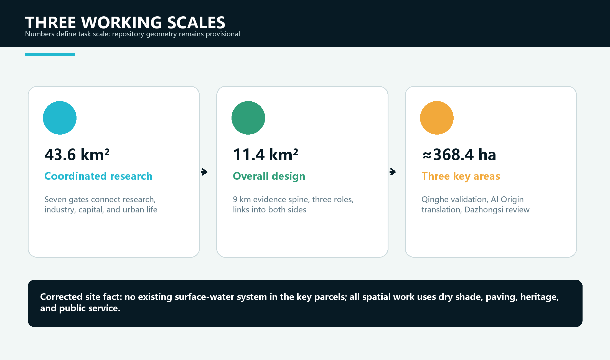

### Six tasks form one causal chain

The concept supplies a shared language. The innovation ecosystem defines how projects mature. AI-enabled scenarios place technology in real life. Public space makes testing accessible. The cultural narrative explains why it belongs to Jing-Zhang. Long-term operations keep space, content, and funding current. Together, the six tasks explain where a project begins, where it is tested, who is accountable, and what evidence remains.

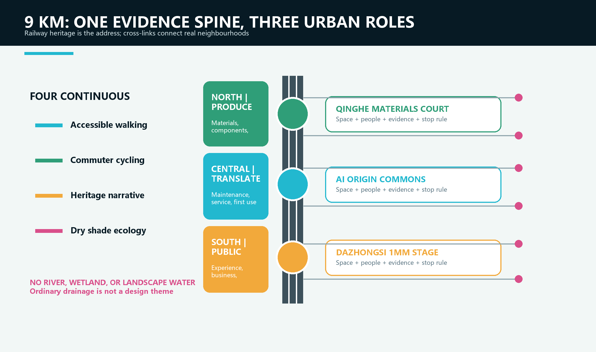

## Coordinated Research Area: Industry and Future City Research

### Industry strategy: from clustering companies to clustering evidence

The scarce resource is not office floor area. It is an urban interface where basic research meets real problems, firms gain access to compliant test settings, and the public can understand technological consequences. The proposal defines a seven-gate chain: G0 public problem, G1 basic research, G2 shared technology, G3 scenario validation, G4 incubation and first user, G5 capital-readiness services, and G6 scaling and international collaboration. A project may advance, return, or stop. Passing a gate must add reviewable evidence, not promotional language.[standard:PROJECT-AGENT-OPEN-CALL-TASKBOOK]

Six global cases support mechanism choices rather than local numerical targets. Punggol Digital District shows how campuses, firms, and district operations can share a collaborative environment. Kalasatama demonstrates low-barrier, short-cycle district experiments. MIT Senseable City Lab connects research with governments and communities. Paris-Saclay integrates research, industry, mobility, and quality of life. Barcelona 22@ warns against reducing an innovation district to offices. Waterfront Toronto demonstrates independent digital review and public accountability. Jing-Zhang transfers openness, mixed use, review, and iteration; it does not copy foreign scale or import waterfront precedents into a dry site.[source:CASE-PUNGGOL] [source:CASE-WATERFRONT-TORONTO]

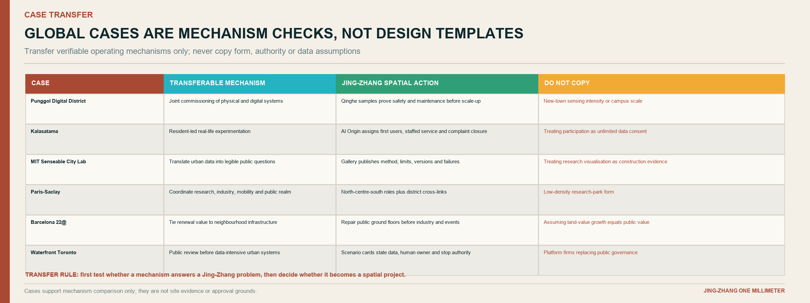

### Seven gates connect research, incubation, and capital services

| Gate | Primary setting | Required evidence | What happens next |
|---|---|---|---|
| G0 Public problem | Corridor neighbourhood services, heritage park, and public ground floors | Problem owner, affected users, non-AI alternative | A researchable problem card |
| G1 Basic research | Zhongzhiyuan research workshop | Method, data rights, limitations, ethics pre-check | Shared-tool development |
| G2 Shared technology | Zhongzhiyuan tool and compute desk | Model card, data card, resource account, minimum prototype | Permission for bounded testing |
| G3 Scenario validation | Three hubs and controlled routes | 30/90-day record, incident and complaint log, human takeover record | First-user decision |
| G4 Incubation and first use | AI Origin Open-Source Shared Courtyard | Service manual, maintenance cost, licence, user acceptance | Team and reusable component |
| G5 Capital readiness | Zhongguancun Technology Services Wing | IP, compliance, market, and financial documents | Professional advice and investor dialogue |
| G6 Scale and international collaboration | Dazhongsi and Open Week | Bilingual evidence pack, reuse conditions, annual impact report | Cross-district reuse or termination |

G5 does not promise investment. It makes a project legible to due diligence by organising ownership, compliance, user value, cost, risk, and maintenance in one data room. Capital follows real-world evidence instead of substituting funding excitement for public value.[metric:innovation_gate_count]

### Three Zones and Two Wings describe five responsibilities, not five isolated parks

Zhongzhiyuan leads research and safety validation. Beijing AI Origin Community translates results, hosts open-source maintenance, and supports talent. Dazhongsi hosts product experience, business exchange, and international presentation. Zhongguancun Technology Services Wing supplies intellectual-property, compliance, and capital-readiness services. The Agent Taskbook's Xiaoyue River Scenario Enablement Wing supplies public problems and community review; the name is treated as a district label and does not establish a surface-water condition in the key parcels. One project ID, Open Test Passport, and evidence repository preserve accountability across the five roles.[source:OFFICIAL-ANNOUNCEMENT]

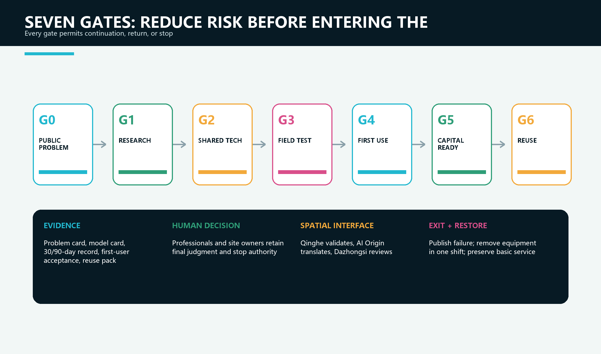

## Overall Design Area: Urban Renewal and Regulatory-Plan-Level Urban Design

### Overall concept: one spine, three roles, four continuous systems

The nine-kilometre spine is not a uniformly paved landscape. It is a continuous public evidence system. The northern section from Qinghe to Zhongzhiyuan focuses on research validation in quieter, controllable material and safety-testing spaces. The central section from AI Origin to Sitaokou translates prototypes into neighbourhood services and shares ground floors between open-source work, railway memory, and everyday life. The southern section from Dazhongsi toward Xizhimen gives mature projects high-access settings for public experience, business exchange, and international communication.

Four systems run through all three sections: a continuous accessible walking line protected from exhibits; a commuter cycling line that slows at conflict points; a heritage narrative line organised by retained tracks, sleepers, distance marks, and industrial components; and a shade-and-dry-ecology line made of retained trees, additional canopy, drought-tolerant planting, breathable paving, and repairable seating. The systems run side by side where space allows and overlap in narrow sections. AI equipment never interrupts basic movement.

### From one railway line into the neighbourhoods on both sides

The proposal is not confined to the heritage park. The spine is the address and evidence line; the actual innovation ecosystem occupies a sequence of cross-links, public ground floors, courtyards, service counters, and test rooms on both sides. Each hub therefore combines three layers: an uninterrupted public route on the railway edge, a staffed interface in the first row of buildings, and a deeper professional or industrial support space. A visitor can move from seeing a problem to finding the responsible team without crossing an invisible institutional boundary.

Cross-links are chosen by everyday demand, not by equal spacing. A link is justified when it connects a station exit, school, community, research campus, enterprise-service facility, or existing commercial street to the spine. Its minimum package is modest: a legible crossing, continuous accessible surface, shade or weather protection, night lighting, a non-digital direction sign, and a named maintainer. Only after these basics work may sensors, displays, or event equipment be added.

This structure also controls development pressure. The park remains a civic commons rather than a frontage for continuous commercialisation. Revenue-generating uses concentrate inside existing or legally adaptable buildings, while the railway edge carries passage, heritage interpretation, public review, and reversible prototypes. The distinction lets the plan support entrepreneurship without turning every metre of public space into an exhibition booth.

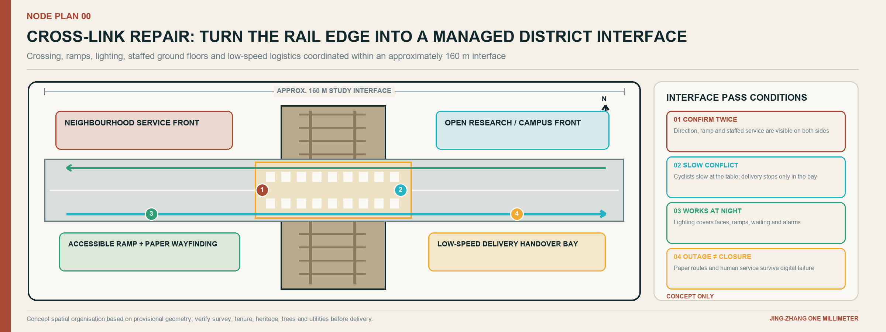

### The 38-metre typical section is a compatibility test, not a uniform boundary

The section places a 6 m public ground-floor edge, 4 m walk, 3.5 m cycle lane, 5 m dry shade-and-rest band, 9 m heritage-track or flexible field, a second 4 m walk, and a 3.5 m planted edge on one drawing. It tests whether seven demands can coexist. In narrow areas, the priority is continuous accessibility and heritage safety, followed by cycling, tree protection, and shaded waiting, with events and digital installations last. The five-metre band is not a water feature: it accommodates existing trees, new canopy where underground conditions allow, benches with companion wheelchair spaces, and removable material samples. Official road boundaries, viaduct clearance, fire access, and utilities require specialist review.[data:geometry/roads.geojson#ROAD-001] [depth:overall_spatial_structure]

### Renewal sequence: connect first, activate second, decide building actions last

Step one repairs crossings, ramps, shade, night lighting, and non-digital wayfinding. Step two opens ground-floor interfaces as reservable workshops, service desks, and neighbourhood rooms. Step three inserts reversible prototypes such as material bays, shade seats, open-source galleries, and small stages. Step four determines retain, renovate, infill, or demolition only after a building audit. Public value appears early, while later capital works remain responsive to evidence. Each step has its own acceptance test, so a useful crossing or service counter does not have to wait for a landmark building.

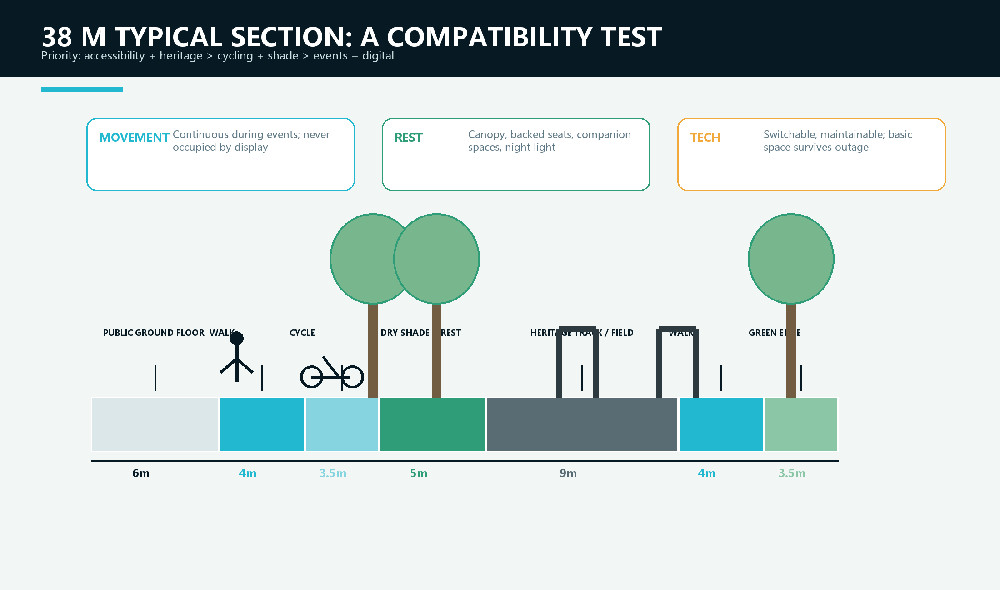

### How to read the spatial analysis: whole corridor first, then node interiors

The new corridor land-use and three-role diagram is not a colour-filled statutory masterplan. It unfolds the approximately nine-kilometre north-south scope into one readable field. Five bands carry different duties: research validation; shade ecology and continuous green; industry service and public ground floors; talent community and public service; railway heritage and civic squares. Qinghe, AI Origin, and Dazhongsi then occupy validation, translation, and public-amplification positions. Colour answers which part does what; red node frames show where near-term work begins; the cyan spine and amber cross-lines show how longitudinal continuity and neighbourhood access work together.

Each node concept plan decomposes the strategy into usable spatial parts. Retained rail, the uninterrupted accessible route, four primary programme blocks, supplementary services, and shutdown or maintenance boundaries appear on the same drawing. These diagrams explain organisation and adjacency. They do not determine building footprints, parcel lines, or engineering dimensions. The same functional logic must be redrawn after formal survey, tenure, heritage, tree, and underground-utility information is available.

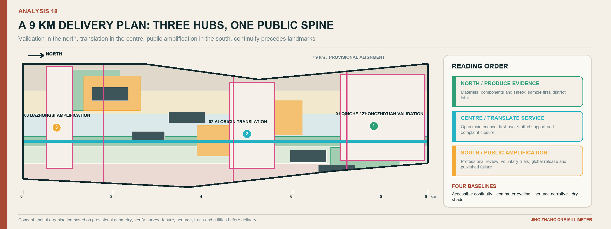

## Detailed Design of Key Areas

All three areas use the same rule: a problem enters, a bounded test begins, a human reviews, results become public, and the prototype can be withdrawn. Their positions in the innovation chain differ, so their spaces, users, and operating rhythms must also differ.[data:geometry/key_areas.geojson#PROV-KEY-001] [depth:three_key_area_detailed_design]

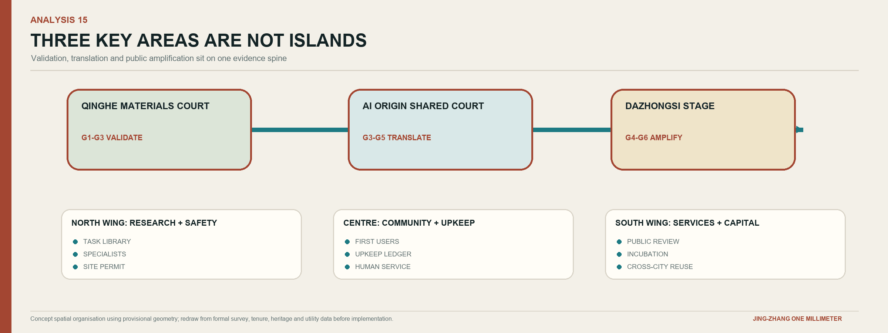

### 1. Qinghe Materials Validation Court: convert research into reproducible field evidence

Qinghe sits where industrial research, existing communities, and the heritage spine meet, making it suitable for G1 to G3. An approximately 180 m dry controlled test strip combines three replaceable material bays, an observation walk, a human-review desk, retained trees, and shaded waiting. It does not imitate a river edge. Sensors do not automatically produce a conclusion. Climate, surface temperature, wear, slip resistance, installation labour, and maintenance conditions are registered first; sensing and manual observation are compared; inputs, failed samples, and the continue-or-stop decision are then published. Researchers gain a real setting, visitors see how conclusions are made, and park operators receive maintainable work orders rather than a black-box dashboard.

The first package tests only non-personal-data applications such as paving durability, summer surface temperature, shade performance, tree-pit maintenance, seating repair, and facility condition. The three bays use the same base and exposure period so that materials can be compared fairly. A sample is retained only when it meets public-safety thresholds, its labour and replacement cost are disclosed, and the site team accepts a 90-day maintenance duty. Ordinary drainage remains conventional municipal engineering and is not presented as a design attraction.[data:geometry/key_areas.geojson#PROV-KEY-001]

During a normal weekday, one bay may be under controlled wear testing, one open for supervised public observation, and one closed for replacement. Visitors never walk through the test itself: a parallel accessible route and low evidence rail show the question, method, current status, and accountable person. This makes failure visible without converting the place into an unsafe laboratory.

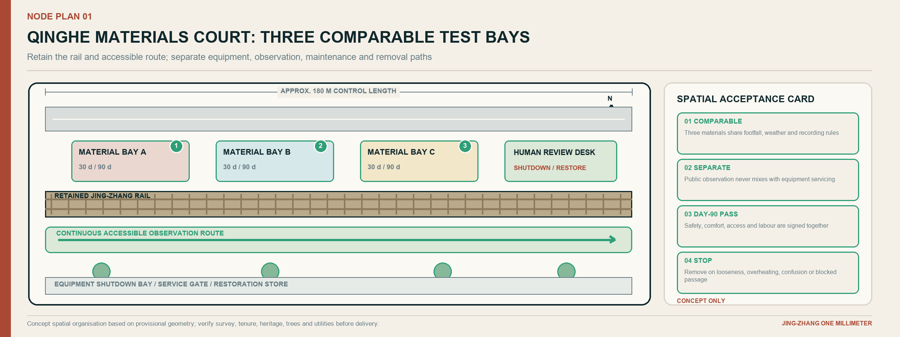

### 2. AI Origin Open-Source Shared Courtyard: turn prototypes into maintained public products

AI Origin serves G3 to G5 and translates research into neighbourhood and incubation services. Its core is an approximately 120 m railway heritage interface. A continuous 4.5 m accessible route connects the open-source gallery, maintainer table, talent-service desk, and dry shared courtyard with trees and removable shade. A project receives exhibition space only after stating the problem, data, maintainer, failure mode, and equivalent human service. The courtyard is therefore not a technology showroom; it is the point where a prototype obtains a real user, an operating commitment, and a public record.

By day, the courtyard is a talent and company-service entrance. In the evening, it hosts community classes and maintainer clinics. Release events use reversible trackside frames without closing the basic route. Value is measured by prototypes accepted by first users, maintained for 90 days, and documented clearly, not by the number of displays.[data:geometry/key_areas.geojson#PROV-KEY-002]

Four visible roles prevent responsibility from dissolving. The problem owner explains why the task matters; the maintainer controls the version and defect list; the first user confirms whether the service fits real work; and an independent reviewer can pause the trial. Their names, contact routes, and decision dates appear together on the same evidence card. If any role is vacant, the project may be discussed indoors but cannot occupy public space.

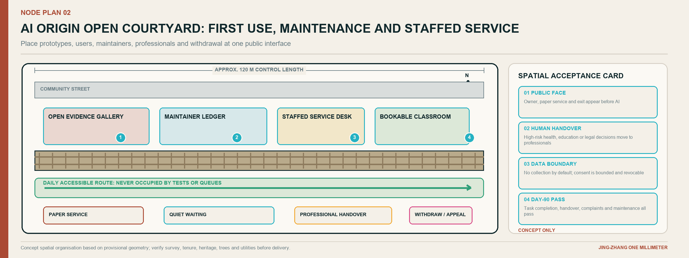

### 3. Dazhongsi One-Millimeter Stage: expose mature technology to both public and market review

Dazhongsi’s transit access, commerce, and dense daily life suit G4 to G6. An approximately 90 m flexible event edge, a 6 m open ground-floor zone, and retained tracks support four states. Weekdays host staffed healthcare-navigation, education, and commercial service trials. Evenings use low-glare lighting and small discussion tables without disturbing the through route. Weekends support an open-source market maintained by developers and neighbours. The annual Open Week becomes a bilingual release and cross-city collaboration setting. None of these states depends on a water feature or a permanent spectacle.

The “stage” is not a giant screen. Its essential elements are removable canopies, low information bands, staffed service desks, accessible waiting areas, and switchable temporary power. Events preserve daily movement and define capacity, noise, fire safety, photography, and data permissions. Sponsors do not replace professional reviewers.[data:geometry/key_areas.geojson#PROV-KEY-003]

The spatial test is whether the place remains useful after the event. Can a resident still cross it directly? Can a wheelchair user wait beside a companion? Can equipment be removed within one shift? Can nearby shops continue operating, and can a complaint reach a named duty manager? These questions turn the southern gateway from an image-making stage into a reliable civic interface.

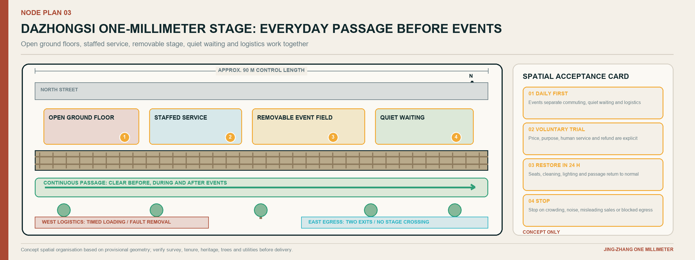

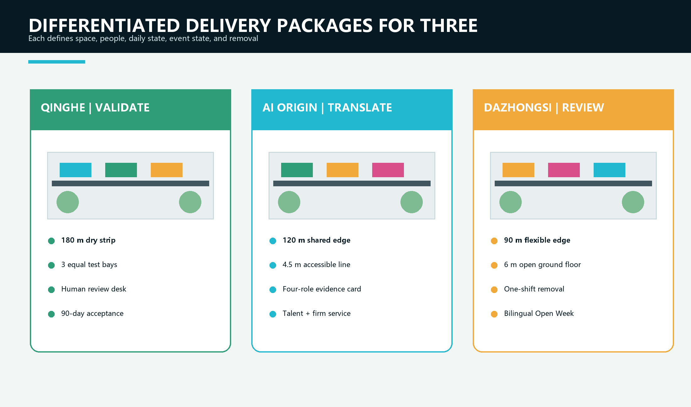

### Developer Walk, Open-Source Evidence Gallery, and Contribution Wall

The Developer Walk is a physical interface for understanding project lifecycles, not a QR-code trail. Four station types sit beside retained rails. Problem signs explain a public need; method signs state model and data limits; test signs identify the current version and accountable person; review signs record a decision to continue, revise, or stop. Paper, tactile, or staffed alternatives convey all essential information without requiring an app.

The Evidence Gallery displays only reusable work, including licence, operating conditions, maintainer, known defects, and reuse history. The Contribution Wall avoids popularity rankings. It recognises four forms of work: clarifying a real problem, merging a reusable version, completing independent validation, and maintaining or responsibly stopping a project. Entries can be appealed, corrected, and withdrawn, turning recognition into responsibility.[metric:public_space_component_count]

## AI Innovation Ecosystem, Personas, and AI+ Scenarios

### Six personas act as design constraints rather than market segments

Residents need daily services that do not exclude non-digital users. Researchers need reproducible tests that can fail. Start-ups need a first user and a compliance path. District and park operators need maintainable facilities that can be shut down. Healthcare, education, legal, and accounting professionals retain final authority. International developers need bilingual documentation, clear licences, and tasks that support remote contribution. Every scenario states who benefits, who may be harmed, and who performs human takeover.

### Fifteen scenarios: every service occupies a specific interface

| Scenario | Primary location | Spatial move | Human boundary and evaluation |
|---|---|---|---|
| H01 Care navigation | AI Origin service desk to nearby care connection | Accessible waiting, paper route, staffed advice | No diagnosis; completion and handover time |
| H02 Community health activity matching | AI Origin shared ground floor | Small-group table, privacy notice, exit path | No medical record access; comprehension |
| H03 Heat and air-quality advice | Three hubs and spine | Physical status signs, shade, drinking point | Staff confirmation; false alarms and response time |
| E01 Park learning assistant | Qinghe Materials Validation Court | Material bays, observation log, teacher control | Teacher-reviewed content; task completion |
| E02 Open-source project mentor | AI Origin evidence gallery | Maintainer table, version note, reservation | Does not replace mentors; issue closure |
| E03 Layered railway interpretation | Six-stop cultural route | Tactile map, child and professional text | Curatorial review; correction time |
| C01 Enterprise-service copilot | Technology Services Wing | Compliance room, human sign-off seat | No legal or investment conclusion; completion cycle |
| C02 Trustworthy product experience | Dazhongsi open ground floor | Opt-out trial desk, data-boundary card | Voluntary use; successful exit |
| C03 District demand matching | Dazhongsi event edge | Demand wall, reserved negotiation table | Protect commercial secrets; valid matches |
| M01 Accessible construction-detour advice | Spine and cross-links | Physical diversion sign, inspection point | Published after field review; clearance and correction time |
| M02 Bad-weather robot shutdown | Bounded courtyard | Stop bay, takeover point, boundary mark | No open-road operation; takeover success |
| P01 Facility work-order triage | Hubs and park facilities | Asset ID, maintenance terminal | Supervisor dispatch; valid work orders |
| P02 Event crowd information | Dazhongsi stage | Zone count and spare entrance | No facial recognition; warning lead time |
| W01 Paving and component durability | Qinghe test strip | Three replaceable bays and public log | No exaggerated claims; complete data and labour |
| W02 Shade and tree-pit maintenance advice | Three hubs | Sensor and manual inspection port | Horticultural decision; adoption and plant condition |

The strength of a scenario does not come from its “AI content.” It comes from improving both service and space. AI healthcare places an accessible route, quiet waiting, privacy notice, staffed advice, and handover record in one journey. AI education turns railway engineering, material ageing, shade, accessibility, and maintenance into observable curricula rather than automating teaching. AI commerce makes firms, professional services, and first users share an accountable validation relationship instead of installing a large shopping screen.[metric:scenario_card_count]

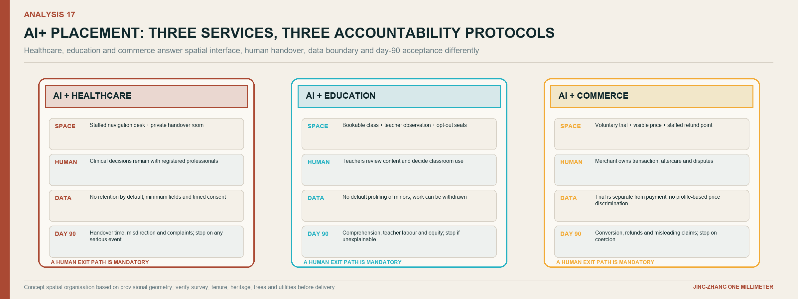

### One One-Millimeter Scenario Card, three different thresholds

Every scenario card records nine fields: real problem, principal user, exact spatial interface, minimum physical service, data boundary, human decision-maker, failure mode, measurement method, and withdrawal condition. These fields provide a common grammar; they do not justify using the same terminal or risk threshold for healthcare, education, and commerce. If the spatial interface, named duty roster, non-digital alternative, or withdrawal route is missing, the scenario remains a workshop topic and does not enter the public realm.

| Four-layer review | AI + Healthcare | AI + Education | AI + Commerce |
|---|---|---|---|
| Public task and prohibited substitution | Support care navigation, appointment preparation, accessible connection, and health-activity matching; never diagnose, prescribe, or set a triage category automatically | Support field learning, railway interpretation, and open-source mentoring; never grade, admit, or replace teacher judgment | Support enterprise procedures, demand matching, trial explanation, and document completion; never issue legal, investment, credit, or administrative approval conclusions |
| Spatial interface | Staffed desk, visually protected quiet waiting, accessible route to an actual care provider, paper directions, and a visible exit | Material bay, shared learning table, teacher console, traceable source board, reservable group area, and opt-out seats | Staffed reception, reservable negotiation place, confidentiality boundary, voluntary opt-in/exit desk, and an evidence wall showing conditions and known defects |
| Data and AI authority | No medical-record access in the first phase; process only the minimum needed for navigation and clear session data under the stated rule; AI explains procedure only | No facial, biometric, or student-profile collection; content carries a source and version and is approved by a teacher or curator | Separate public information from authorised business material; trade secrets are not displayed or used for training by default; outputs are recommendations only |
| Human owner and acceptance | Final review by a healthcare institution or qualified professional; measure task completion, handover time, misdirection, privacy incidents, and non-digital availability | Final review by a teacher, course owner, or curator; measure comprehension, traceability, correction closure, and willingness to reuse | The site operator owns the process; legal, IP, accounting, or investment specialists own domain conclusions; measure valid matches, refunds, correction, and successful withdrawal |

Risk produces the spatial difference: healthcare needs protected waiting and rapid human handover; education needs shared observation and correctable content; commerce needs confidential negotiation, visible prices, and voluntary exit. AI enters the neighbourhood only when all four layers work together as a switchable service. Otherwise the human service and physical interface remain, without a digital surface pretending that responsibility already exists.

### Three industry validation packages

T1 paving, shade, seating, and reversible components test durability, heat, maintenance labour, and public safety at Qinghe. T2 edge sensing and facility agents test calibration, disconnection, false alarms, and human work orders across the three hubs. T3 trustworthy service agents test permissions, explanations, and human handover for healthcare navigation, education content, and commercial queries at AI Origin and Dazhongsi. All three follow bench test, closed-area trial, limited public pilot, and independent review. No package expands without professional confirmation. The output of a validation package is not a promotional video; it is a versioned component, an installation condition, a defect list, a cost and labour record, and a signed decision to continue, revise, or stop.

## Land Use, Building Scale, and Retain-Renovate-Demolish Strategy

Land use supports the innovation chain rather than renaming existing parcels. Research and testing sit near Zhongzhiyuan and controllable trial settings. Industrial and professional services concentrate at accessible interfaces with an existing service base. Community services are embedded at AI Origin and talent-living areas. Heritage public space stays continuous along the spine, while shade, dry planting, and neighbourhood cross-links form a green public-space network around Qinghe, the district named Xiaoyue River, and broken urban edges. The place name is not interpreted as evidence of surface water in the key parcels. Concept zoning covers the entire provisional boundary to test capacity; it does not replace statutory classification or approval.[data:geometry/land_use.geojson#LU-001]

Buildings use an R retain, A adapt, I infill, and D demolish framework, but current labels remain possible actions pending survey. Retention prioritises structural safety, lawful ownership, adaptability, heritage value, and embodied-carbon benefit. Adaptation begins with open ground floors, accessibility, roof drainage, and energy performance. Infill supplies missing public-testing, service, and maintenance rooms. Demolition requires assessment, approval, carbon and cost comparison, and public communication. The six concept footprints indicate functional carriers, not parcel conclusions.[depth:retain_renovate_demolish]

Official building footprints, floors, structure, ownership, and control-plan metrics are unavailable. Floor area ratio, height, coverage, and quantities therefore remain pending official data. A later building-by-building register must compare whole-life carbon, adaptation cost, public value, and displacement before any decision.[metric:building_footprint_area_sqm]

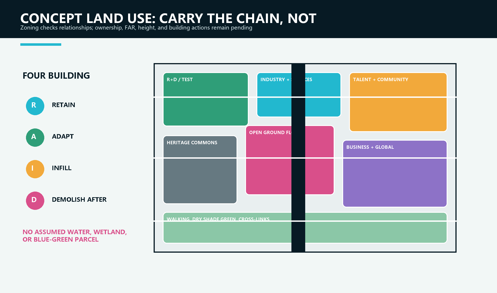

## Transport, Rail, Municipal Infrastructure, and Public Services

The mobility order is walking and accessibility, cycling, transit connection, public transport, service and emergency vehicles, then general cars. The spine provides north-south continuity; cross-links at the three hubs repair barriers created by roads, viaducts, and closed edges. No event or trial occupies the accessible clear path. Cycling remains continuous in commuting sections and slows through surface, geometry, and sightlines where exhibits and crowds occur. Around stations, priority goes to the last 500 m of direction finding, sheltered waiting, shared-cycle order, and night safety. Exact alignments require exit, road-boundary, and transport assessment data.[data:geometry/roads.geojson#ROAD-001] [depth:traffic_rail_slow_parking]

Municipal and new infrastructure follow the rule that sensing is not control. Twelve environmental observation points are proposed in phases to collect only the minimum information needed for public-space operation, such as air and surface temperature, humidity, shade condition, equipment status, and manual inspection records. They do not measure an invented water body. Processing is local where possible and public output is aggregated. Stations may request inspection but cannot control drainage, transport, or public-safety systems. Lighting, temporary power, networking, and equipment cabinets use replaceable modules. Basic passage and human service survive power or network failure.[metric:rain_station_count]

Public service is not a back-office room. Problem clinics, test registration, compliance advice, talent service, community deliberation, maintenance response, and non-digital assistance occupy visible, accessible ground-floor locations. Every digital interface has a phone, paper, or staffed alternative.

## Green Network, Public Space, and Urban Character

The green strategy starts from the corrected fact that the key parcels have no existing surface-water system. It therefore forms a dry network from retained trees, additional canopy where root and utility conditions permit, drought-tolerant groundcover, permeable but structurally verified paving, small planted pockets, and shaded resting points. Ordinary inlets, kerbs, and maintenance access remain visible and serviceable, but no river, wetland, canal, pond, or water court is invented as a spatial organiser.[data:geometry/green_space.geojson#GREEN-001] [data:geometry/public_space.geojson#PUBLIC-001]

Public space is organised in four layers. The first is the continuous everyday route that remains open during trials and events. The second is a sequence of six cultural stops that translates railway measurement, Zhongguancun experimentation, and accountable AI into physical actions. The third consists of three staffed hubs for testing, service, and public review. The fourth is a network of smaller cross-links and ground-floor rooms that carries benefits into surrounding neighbourhoods. Every layer has a basic non-digital function before any screen or sensor is added.

Urban character comes from construction logic rather than futuristic decoration. Retained rail, steel frames, dark mineral paving, bolted joints, repair marks, canopy shadows, and low evidence rails form a calm industrial base. Cyan identifies open interfaces, amber identifies pending human review, civic green identifies maintained public access, and magenta identifies provisional information. New work is dated and reversible so that it can be distinguished from heritage fabric. At night, light is concentrated on walking surfaces, entrances, and staffed interfaces; screens do not dominate the skyline.

### Eight components use one construction language for different scenarios

The kit includes the One-Millimeter Gate, physical problem sign, material bay, removable shade seat, maintainer table, open-source display frame, human-review desk, and switchable power cabinet. Each identifies installation prerequisites, routine maintainer, failure state, and removal method. Rail steel, dark structures, and bolted joints recall railway engineering. Open cyan identifies shared data and interfaces; review amber marks pending human decisions; civic green marks maintained public access; provisional magenta marks uncertain boundaries and data. Words and symbols accompany colour for accessibility. The parts share fixings and dimensions so that a failed element can be replaced without rebuilding an entire place.

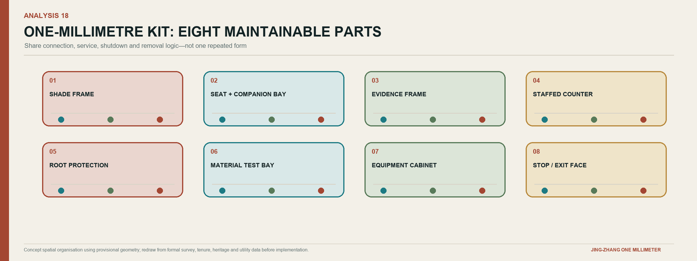

### A six-stop cultural route converts three cultures into six actions

Railway culture supplies measurement, connection, and maintenance. Zhongguancun culture supplies experimentation, translation, and entrepreneurial collaboration. AI culture requires openness, explanation, and human responsibility. The route is not a historical theme park. It moves visitors through measuring, connecting, testing, opening, reviewing, and returning technology to everyday life.

| Stop | Narrative | Spatial carrier | Must avoid |
|---|---|---|---|
| Centennial Calibration Gate | How common measurements enabled engineering | Twin-track scale, tactile line, paper guide | Presenting a new installation as a relic |
| Jing-Zhang Memory Section | How rail connected people, knowledge, and city | Layered old/new maps and reversible signs | Unverified history and unlicensed imagery |
| Qinghe Materials Validation Court | How Zhongguancun-style experiments meet real conditions | Material bays and experiment log | Showing only successful results |
| AI Origin Open-Source Shared Courtyard | How knowledge becomes a maintained public product | Evidence gallery and maintainer list | Treating open source as costless or ownerless |
| Contribution Wall | How machine output receives human sign-off and appeal | Version tree, accountability card, correction route | Ranking individuals by popularity |
| Dazhongsi One-Millimeter Stage | How technology returns to healthcare, education, and commerce | Bilingual trial, public review, staffed service | Presenting a pilot as approved or built |

The international line is “Measure small. Learn in public. Improve with people.”[assumption:A-CULTURE-008]

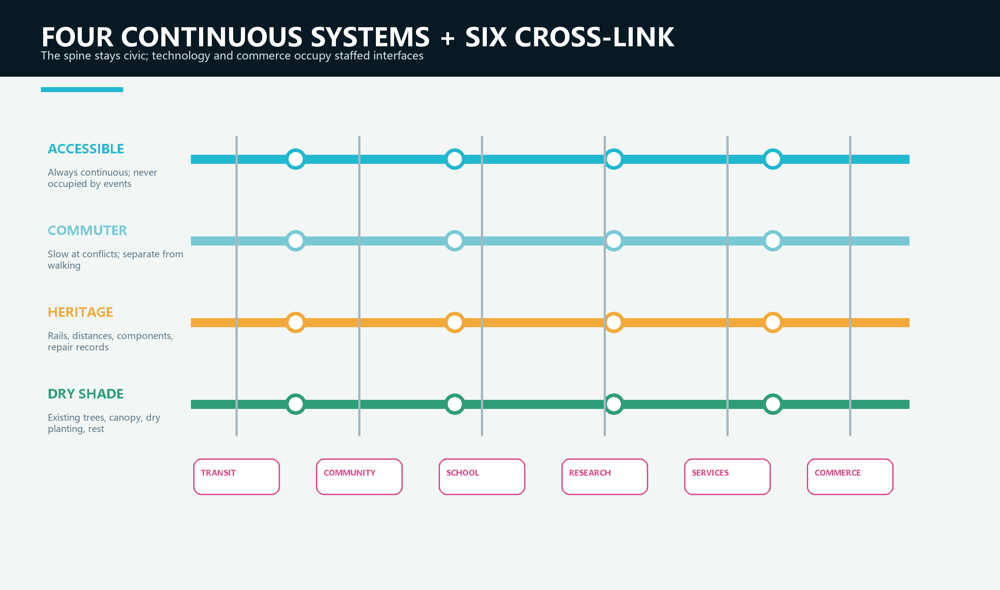

## Renewal Projects, Implementation Policy, and Phasing

### The near term proves the operating system before building landmarks

| Phase | Time and scope | Core package | Pass condition | If it fails |
|---|---|---|---|---|
| Preparation | Days 0-30 | Confirm sponsor and site responsibility, data-gap list, field walk, Open Test Passport | One non-personal-data scenario has a named owner and setting | Stop procurement and repair the evidence chain |
| Prototype | Days 31-90 | One closed test area, three user tests, accessibility review, safety drill, public result page | Basic service continues, risks are controlled, maintainer accepts work | Reduce, revise, or remove prototype |
| Demonstrator | Months 4-12 | Phased installation of twelve environmental observation points, three dry reversible component groups, one combined hub demonstrator, first Open Week | 90-day maintenance, complaint closure, explainable cost | Do not expand the remaining hubs |
| Expansion | Years 2-3 | Refine three hubs, cross-links, and building renewal under formal plans | Specialist approvals, stable budget, annual audit | Retain only validated small public-space moves |

The concept does not invent a total investment figure. It uses cost packages and capped review. Each prototype separates survey and design, construction and components, digital equipment, staffing, maintenance, insurance, and site restoration. Permanent structures, basic public services, and safety roles cannot depend on one-off sponsorship. Professional estimates follow confirmed quantities, materials, utilities, and procurement.[data:geometry/phasing.geojson#PHASE-001] [depth:phasing_implementation]

### Divide delivery into packages that can be procured, accepted, or stopped

WP1 establishes facts: survey control, ownership and responsibility map, heritage and building audit, tree and utility checks, accessibility baseline, and a photographic record. WP2 repairs the civic minimum: crossings, continuous surfaces, shade, lighting, wayfinding, and staffed service points. WP3 installs the reversible spatial kit. WP4 runs the digital and AI trials. WP5 covers year-round staffing, maintenance, insurance, public communication, and restoration. Separating these packages prevents a software contract from absorbing basic construction and prevents a landscape image from concealing missing operations.

Acceptance occurs at four levels. A physical item must be safe, accessible, removable, and documented. A service must have hours, a duty roster, a human alternative, and a complaint route. A data or AI component must pass permission, security, bias, explanation, and shutdown review. An operating package must show maintenance labour, fixed cost, spare parts, and restoration funding. A package failing one level cannot be compensated by success at another.

During the first 90 days, limited public trials occur only in one controllable Qinghe bay and one staffed AI Origin interface. A continuous accessible-route repair may proceed in parallel as a civic baseline. The Sidaokou display frame and Dazhongsi trial desk remain at the stages of site verification, permission mapping, component mock-up, and removal rehearsal; they use no personal data and provide no automated public service. Only after Qinghe and AI Origin pass operational acceptance may the combined demonstrator and higher-intensity programme extend to Dazhongsi. This keeps corridor-wide preparation moving without multiplying an unverified service across open sites.

### Year-one responsibility–evidence–acceptance loop: one accountable owner across 365 days

One Millimeter fixes responsibility on a single Open Test Passport. Every project names four seats: the Accountable Owner A is answerable for the public objective, budget, and final continue-or-stop decision; the Delivery Lead D submits the spatial, service, and technical work; the Maintenance Owner M confirms staffing, spare parts, work orders, and restoration capacity; and the Independent Stop Holder S may halt the project when safety, rights, or evidence are inadequate. A cannot be transferred through a design, construction, or software contract. D and M may change by phase, but every change is recorded publicly. Healthcare, education, heritage, fire-safety, and data-rights work also requires the relevant professional sign-off. A project with any vacant seat cannot occupy public space.

| Decision point | Mandatory evidence | Acceptance body | Formal decision | Pause or return condition |
|---|---|---|---|---|
| Days 0–30, entry gate | Problem card, baseline, permission route, user and non-digital alternative, data boundary, named roster, cost cap, and restoration plan | Site operator and relevant professional panel | Issue the Open Test Passport or freeze procurement | Unclear tenure or permission, vacant owner, unresolved professional authority or personal-data condition |
| Before opening, physical acceptance | Measured dimensions, material batches, accessibility review, fire and shutdown drill, human-takeover procedure, and removal-record template | Maintainer plus accessibility and safety professionals | Permit bounded opening or require reinspection | Everyday passage is obstructed, the human alternative fails, or the safety drill is not passed |
| Day 90, operational acceptance | Use, fault, complaint, work-order, staffing-hour, maintenance-cost, and first-user records | Maintainer, professional signer, and public-panel sample review | Continue, reduce, revise, or restore the site; no replication without a pass | Serious incident, failed human takeover, unresolved material complaint, or unfunded fixed maintenance |
| Day 365, public audit | Full-year versions, known defects, licence and reuse record, actual cost, funding sources, and continue/exit list | Accountable Owner, independent panel, and public panel | Enter the next-year budget, begin another iteration, or terminate and restore | Evidence cannot be reproduced, permission expires, accountability breaks, or public benefit no longer justifies occupation |

Acceptance is therefore not a single construction sign-off. It is a continuous sequence of entry permission, pre-opening safety, 90-day operation, and 365-day public value. The four gates ask different questions but retain one project ID, one accountable owner, and one restoration commitment, allowing failure to be isolated and success to be reused.

### Four-season operations make the annual event a project production line

Q1 Problem Open Season completes G0 selection. Q2 District Beta Season completes bench tests and 30-day trials. Q3 JZ·1mm Global Open Week releases reusable components, runs maintainer sprints, and hosts bilingual public trials. Q4 AI City Public Review completes 90-day results, independent review, and the next year’s continue, revise, and stop list. A monthly maintainer clinic, quarterly public deliberation, and annual open ledger and safety drill create a stable rhythm outside large events.

A proposed “One Millimeter Commons” operating alliance has five roles. A steering committee sets public goals. A professional panel controls planning, heritage, safety, healthcare, education, privacy, and accessibility thresholds. A site team manages permits and duty. An open-source maintainer group controls versions. A public panel participates in trials, complaints, and annual review. Each project has one final accountable owner and an independent holder of stop authority.

## Metrics, Area Recalculation, and Compliance Matrix

Metrics fall into three types to prevent concept numbers from being presented as performance. Fact metrics record announced areas and tasks. Geometry metrics recompute provisional layers to check zoning, continuity, and proportions. Operating metrics begin only after implementation, including shade availability during high-heat periods, accessible-route availability, handover time, valid work-order rate, components maintained for 90 days, and complaints closed on time.[depth:metrics_recalculation]

The announced 11.4 sq km is a high-confidence textual condition. The provisional boundary recomputation of about 1,141.28 ha is only a consistency check. Concept green and public-space ratios, building footprints, and key-area geometry have low to medium confidence. Floor area ratio, height, statutory green ratio, tree quantity and health, thermal conditions, ordinary drainage capacity, and investment remain pending official data rather than receiving fabricated values.[metric:site_area_sqm] [metric:green_ratio] [metric:public_space_ratio]

### Success means that an improvement can be verified and maintained, not that footfall is maximised

| Goal | Core measure | Method | Decision use |
|---|---|---|---|
| Innovation-chain efficiency | Median G0-G3 cycle and gate exit reasons | Project ledger, quarterly | Find institutional bottlenecks without blind acceleration |
| Translation quality | Share of components accepted and maintained by first users for 90 days | Maintenance ledger, quarterly | Decide entry to G5 or G6 |
| Public value | Task completion, comprehension, non-digital service availability | Anonymous survey and manual sample | Revise scenario and wayfinding |
| Safety and rights | Serious events, successful human takeover, complaint closure | Incident ledger, monthly | Pause and independent review |
| Spatial operation | Shade and high-heat availability, repair closure time, accessible breaks | Seasonal field inspection | Adjust components and budget |
| Open-source ecosystem | Externally reused compliant components and maintainer retention | Version repository, quarterly | Test whether public knowledge accumulates |
| International collaboration | Projects completing bilingual due diligence and cross-city pilots | Partnership register, annual | Separate exposure from real collaboration |
| Financial resilience | Months of fixed maintenance covered and single-source share | Financial ledger, quarterly | Prevent reliance on one event |

The first 90 days establish a baseline. At day 365, operators, professional reviewers, and the public panel set next-year ranges. Complete task, standard, and design-depth indexes remain in structured matrices; the narrative explains the decisive judgments.[standard:MOHURD-CONTROL-DETAILED-PLANNING]

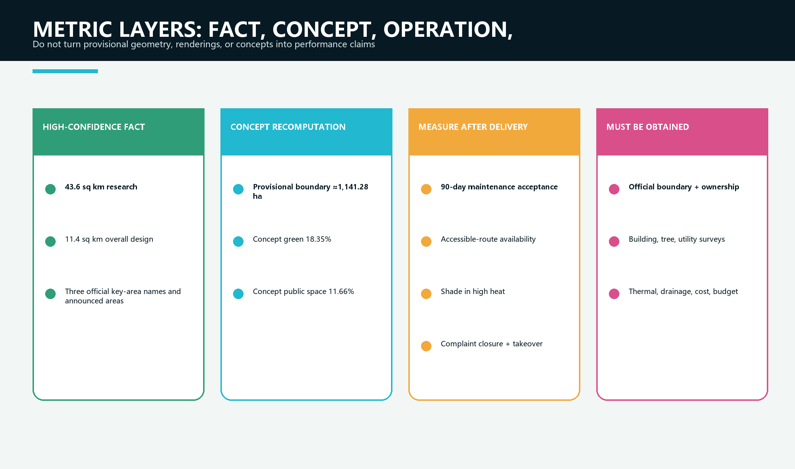

## Risk, Copyright, and Compliance

The greatest risk is not technical failure but a concept being mistaken for a commitment. A provisional boundary may be read as a statutory line; a generated rendering as existing condition; earlier water imagery as an existing river or approved waterscape; AI advice as a professional healthcare, education, legal, or safety decision; or event popularity as a reason to displace everyday use. The water assumption has therefore been explicitly corrected in the text, data, diagrams, and three affected renderings. Remaining controls are visible status labels, data minimisation, equivalent human service, bounded trials, reversible construction, named maintenance, independent stop authority, and an annual continue-revise-stop report.[depth:risk_missing_data]

Text, diagrams, GeoJSON, and layout were generated in this Agent workflow or reworked from public and rights-cleared repository material. Fifteen non-repeating spatial renderings were produced with the built-in image-generation tool, covering the overall corridor, cross-neighbourhood access, Qinghe validation, AI Origin, Dazhongsi, open-source evidence, night walking, healthcare, education, commerce, the cultural route, component fabrication, Global Open Week, everyday maintenance, and supervised low-speed delivery. They communicate concept atmosphere and spatial relationships only and are not site evidence. Every new image follows the corrected no-surface-water condition and shows no river, canal, wetland, or decorative water. Twenty-two focused analysis diagrams were generated separately in Chinese and English. This refinement redraws the corridor delivery plan, cross-link, three node plans, AI+ accountability protocols, and global case-transfer matrix so that each answers one spatial question. System fonts are used only for local rendering and are not distributed. External cases are summarised for mechanism comparison. A user-provided page from another submission was consulted only to benchmark information density and image-text balance; none of its concept, wording, graphics, naming, images, or layout was copied. The package uses the required COMMUNITY-DISPLAY-ONLY licence and does not use unlicensed trademarks, photography, or restricted basemaps.[source:SOURCE-REGISTRY]

### A figure declares its evidence identity before expressing design

Every figure states, in its title, caption, or footer, “figure type | evidence status | permitted use | source or generation method,” so that visual finish is not mistaken for factual certainty. A concept analysis diagram identifies provisional GeoJSON or assumptions and may support zoning, connection, coverage, adjacency, and alternative comparison. It is not a statutory plan, survey, engineering set-out, or building-by-building approval. An AI-generated concept rendering is a non-site photograph used only for spatial intent; it cannot support government endorsement, built status, material performance, or a construction commitment.

Recommended captions are `Concept analysis | provisional geometry | spatial relationship and recalculation only | data: PROV-…; generated by Codex, 2026`, or `AI-generated concept rendering | not a site photograph | spatial intent only | built-in image-generation tool, 2026`. Provisional magenta, review amber, civic green, and open-source cyan are always paired with words and symbols; colour alone never carries status. External public material retains its original rights and licence. Source registration is not relicensing, and any later third-party replacement must state author, licence, retrieval date, modification, and permitted scope.

Any future use of real sensors or service data requires purpose limitation, data-protection impact review, cybersecurity, accessibility, and public notice before deployment. AI does not replace the final judgment of registered planning, architecture, landscape, transport, drainage, structure, fire, heritage, healthcare, education, or legal professionals.

## References

Direct inputs are the public announcement, Agent Taskbook, site package, public source registry, standards index, professional design-depth requirements, and the corrected no-water site condition confirmed in this collaboration. Mechanism cases come from JTC’s Punggol Digital District, Forum Virium Helsinki’s Kalasatama, MIT Senseable City Lab, the Paris-Saclay public development body, City of Barcelona 22@ material, and Waterfront Toronto digital-review records. Complete URLs, licences, retrieval dates, permitted uses, and limitations are recorded in sources.json.[source:AGENT-TASKBOOK] [source:CASE-SENSEABLE] [source:CASE-PARIS-SACLAY]

The recommended review path follows one argument. First, ask whether “One Millimeter” unifies railway culture, Zhongguancun innovation, and AI governance into a clear method. Second, check whether the nine-kilometre sections, three hubs, and fifteen scenarios genuinely occupy space. Third, verify that every project has an owner, evidence, human review, cost boundary, and stop condition. Any unanswered question remains explicitly pending rather than being concealed by a rendering or slogan.

The proposal’s central claim is intentionally precise: Jing-Zhang does not need an invented waterscape or an oversized AI monument to become globally distinctive. It needs a public mechanism that makes small improvements comparable, failures publishable, responsibility visible, and successful components reusable. “One Millimeter” is that mechanism. In space it repairs one crossing, one shaded seat, one ground-floor interface, and one heritage detail at a time; in innovation it moves one problem through evidence and human review; in governance it keeps one accountable owner and one stop condition visible. The result is not a finished image of the future, but a city capable of improving the future in public.
