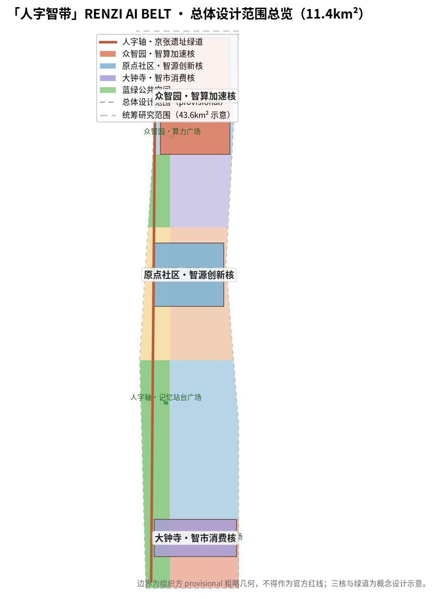
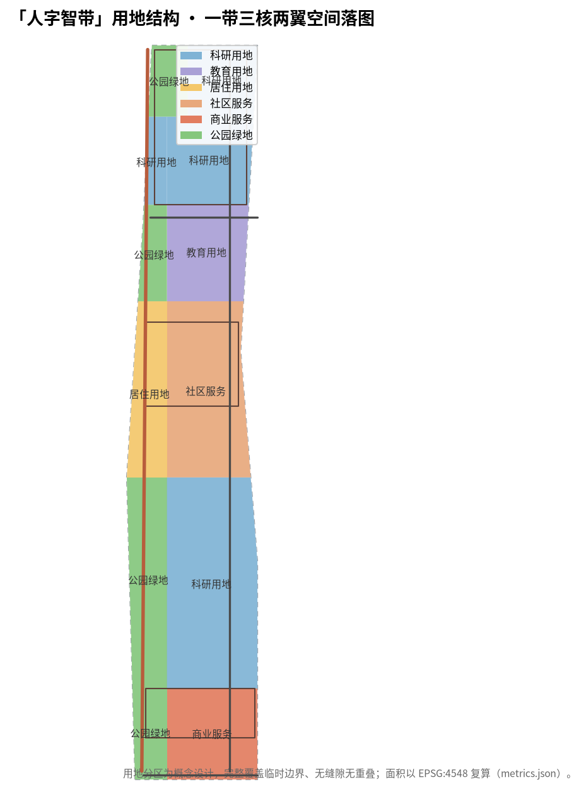
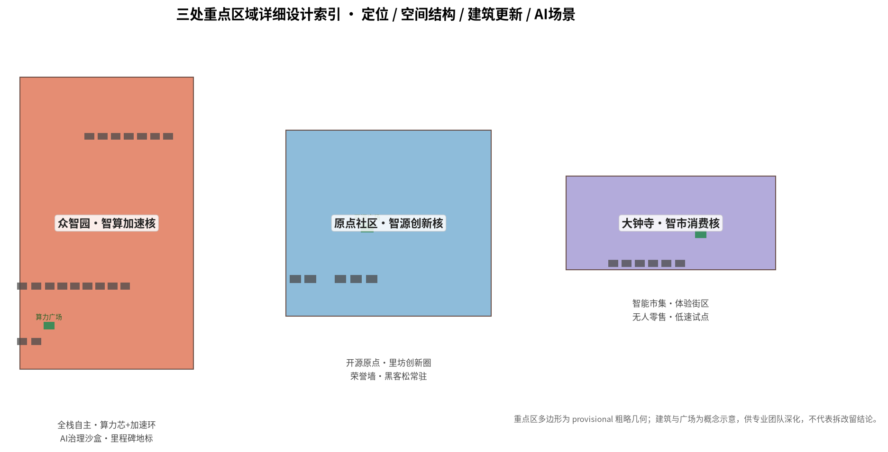
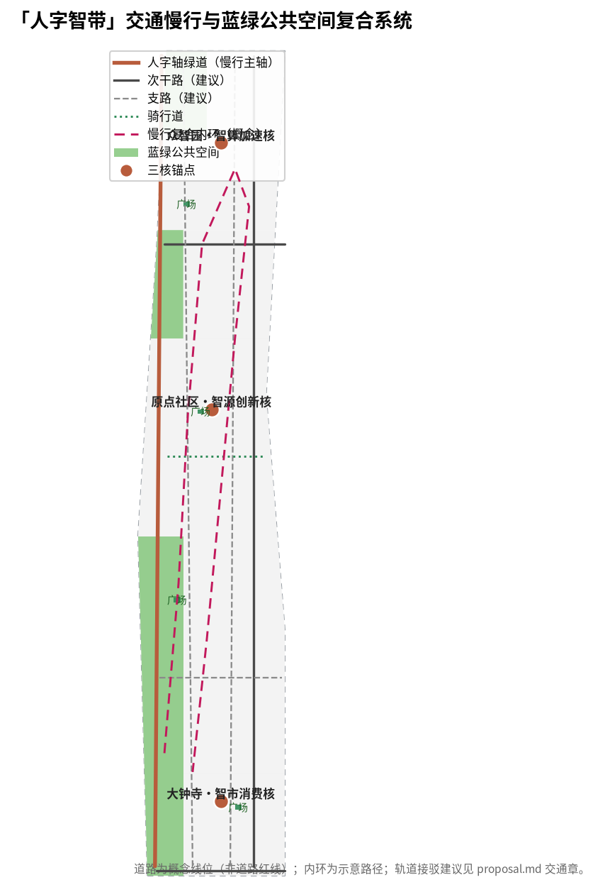
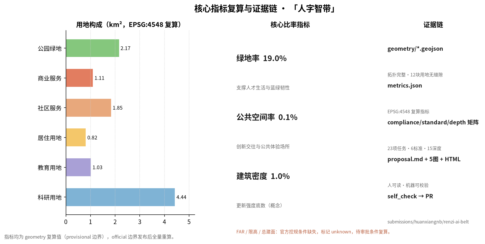

# 「人字智带」——百年京张AI创新带总体城市设计方案

## 设计依据与资料清单

本方案以《百年京张AI创新带城市设计国际方案征集资格预审公告》[source:OFFICIAL-ANNOUNCEMENT]为第一依据，以《面向全球智能体开展百年京张AI创新带城市设计开源征集任务书摘录》[source:AGENT-TASKBOOK]为任务框架，以 `brief/site-package/` 机器可读任务包[source:SITE-PACKAGE]、`data/source_registry.json`[source:SOURCE-REGISTRY]与 `data/processed/agent_fact_pack.md`[source:PROCESSED-FACT-PACK]为数据与来源边界，形成一套可解析、可复核、可展示的正式城市设计方案包。

**本方案的空间判断全部落在结构化图层上**：边界与重点区使用 `brief/site-package/geometry/provisional_boundaries.geojson` 中明确标注的临时粗略边界[source:BOUNDARY-SOURCE][source:KEY-AREA-SOURCE]，仅用于方案生成、自检、可视化和设计讨论，不得作为官方红线、审批依据或精确面积复算依据；官方边界发布后需按 `docs/data-workflow.md` 全量重算。组织方数据缺口不阻断内容评分，所有精度敏感指标均标注为 provisional 并给出复算条件。

**设计任务覆盖**：本方案对照公告 1.3、1.4、1.5 全部必选项（`compliance_matrix.json` 共 23 项，含 agent.1–agent.6）与面向智能体任务书六项任务逐条展开，正文每章回答"设计判断是什么、为什么这样判断、落在哪个图层/指标/标准、还有什么资料缺口"四个问题。专业标准按 `standard_matrix.json` 逐项映射，设计深度按 `design_depth_matrix.json` 15 项深度项逐项自证，正文证据引用格式为 `[source:...]`、`[standard:...]`、`[depth:...]`、`[data:geometry/*.geojson#id]`、`[metric:...]`。

**资料使用边界**：`data/source_registry.json` 将公开来源区分为 formal-ready、background-only、provisional-only 与 needs-review。本方案只把公告、任务书、站点包、来源注册表与临时几何作为正式依据；全球案例、政策与产业事实全部来自公开报道并登记用途；未授权数据、非公开规划资料与个人隐私数据一律不使用。生成方法、来源与限制在 `sources.json`、`assumptions.json` 与 `report/copyright_statement.md` 中披露 [depth:existing_conditions_diagnosis][standard:PROJECT-OFFICIAL-ANNOUNCEMENT]。

## 三层范围工作框架

方案按公告确定的三层范围组织工作，三个层次在 `geometry/site_boundary.geojnam`、`geometry/key_areas.geojson`、`geometry/land_use.geojson` 中逐级落图 [depth:three_level_scope_framework][data:geometry/site_boundary.geojson#SITE-001]：

| 层级 | 面积 | 工作目标 | 设计深度 | 本方案落点 |
| --- | --- | --- | --- | --- |
| 统筹研究范围 | 43.6 km² | AI产业生态、三区两翼协同、未来城市形态研究 | 战略/产业研究 | 「人字智带」总体概念、五大功能、三区两翼协同回路 |
| 总体设计范围 | 11.4 km² | 城市更新总体框架、产业空间、交通市政、风貌控制 | 控规深度城市设计 | 一带三核两翼空间结构、用地分区、蓝绿慢行复合环、更新项目清单 |
| 重点区域范围 | 368.4 ha | 三处重点片区精细化设计 | 规划综合实施方案深度 | 众智园/原点社区/大钟寺三处详设小方案 |

**provisional 边界说明**：当前 `geometry/site_boundary.geojson` 与 `geometry/key_areas.geojson` 均来自组织方临时粗略几何（`official_boundary=false`、`geometry_role=provisional_constraint`、`boundary_precision=provisional_rough`），面积复算值约 11.41 km²，与公告 11.4 km² 的约值一致；三处重点区面积采用公告值（192.1 / 104.3 / 72.0 ha）[metric:site_area_sqm][metric:key_area_area_sqm]。官方 polygon 发布后，用地分区、建筑、道路、绿地、公共空间、分期与全部面积指标需按新边界重算，本方案的场景、结构、运营建议不因边界替换而失效。

## 统筹研究范围产业与未来城市研究

### 总体概念：人字智带 RENZI AI BELT

**设计判断**：以京张铁路青龙桥"人字形"线路为文化母题与空间原型，提出创新带总体概念「人字智带」（英文 **RENZI AI BELT**）。"人"字由两笔构成——一笔是"人"（城市与人的日常），一笔是"智"（AI 与智能体的能力）；两笔在青龙桥交汇，正如人类与智能体在创新带并肩而行。人字既致敬 1909 年詹天佑以"人"字破解八达岭坡度的工程智慧，也转译为当代"以人为本、人机同行"的 AI 城市哲学，同时为空间结构提供明确的形态原型（人字轴、人字支路、人字慢行环）。

**命名体系**：主品牌「人字智带 / RENZI AI BELT」之下设三级命名：
- 三条主题带：百年京张文化带（溯源）、都市AI生活体验带（共生）、AI融合创新带（创造）；
- 五大功能"五阶"：算（全栈自主）→ 生（创新生态）→ 融（场景赋能）→ 活（活力城市）→ 治（治理话语权）；
- 三核两翼："三核"为智算加速核（众智园）、智源创新核（原点社区）、智市消费核（大钟寺）；"两翼"为智服翼（中关村科技服务翼）、智景翼（小月河场景赋能翼）。

**Logo 方向**：以"人"字形双轨与芯片引脚同构——两条铁轨呈人字展开、轨枕化为芯片引脚，蓝色代表数据流、赭石色代表京张历史底色。Logo 可延展为人字轴标识、站点符号、导视系统与活动视觉主视觉 [depth:overall_spatial_structure][standard:PROJECT-AGENT-OPEN-CALL-TASKBOOK]。命名与 Logo 均为概念建议，不涉及商标/字体侵权，正式使用前需专业视觉团队深化并完成清权。

### 五大功能与三区两翼协同回路

- **AI全栈自主创新体系**（算）：众智园承担基础模型、算力调度、芯片与端侧推理的全栈自主创新；
- **世界级AI创新生态**（生）：原点社区汇聚开源社区、孵化器、天使投资与学术机构，形成源头创新群落；
- **AI+场景赋能新范式**（融）：小月河翼以城市生活场景为开放测试场，将 AI 能力转化为可感知服务；
- **智能化AI活力城市**（活）：京张遗址公园人字轴与蓝绿慢行复合环承载日常活力；
- **AI治理全球话语权**（治）：依托开发者社区、公开数据集与开源成果，形成治理规则与标准的话语平台。

三区两翼形成"源头创新（原点社区）→ 加速转化（众智园）→ 场景消费（大钟寺）"的主回路，中关村翼提供资本、服务与全球化要素，小月河翼提供场景、测试与城市生活界面，构成闭环 [source:AGENT-TASKBOOK][standard:PROJECT-AGENT-OPEN-CALL-TASKBOOK]。

### 全球AI创新生态案例（5–8个）

| 案例 | 空间与机制 | 可转化经验 |
| --- | --- | --- |
| 美国硅谷 | 高校—风投—企业环带，Sand Hill Road 资本走廊 | 源头创新与资本服务翼的空间邻近逻辑，对应中关村智服翼 |
| 波士顿-剑桥 | MIT/哈佛周边实验室街区的产研咬合 | 高校与产业园的无缝咬合，对应原点社区—学院路教育带 |
| 英国伦敦国王十字 | 工业铁路遗址更新为知识经济区（Google UK 总部） | 铁路遗产地更新为创新园区的先例，直接支撑京张遗址公园沿线策略 |
| 法国巴黎 Station F | 旧火车站改造为全球最大初创园区 | 交通遗产空间转型为开发者社区的空间原型 |
| 上海张江 | 大科学装置与生物医药集聚 | 公共实验平台与产业簇群的公共设施供给逻辑 |
| 深圳 | 硬件原型—制造—市场的快速迭代闭环 | AI+智能硬件的测试验证场景与敏捷空间供给 |

这些案例共同指向三条空间机制：**遗产空间再编码**（铁路/工业遗产转化为创新公共空间）、**要素空间邻近**（学术、资本、场景在步行尺度内咬合）、**场景即产品**（公共空间成为 AI 服务的展示与测试场）。本方案将三条机制转译为"人字轴文化公共空间—三核要素簇群—小月河测试场景带" [source:SOURCE-REGISTRY][depth:overall_spatial_structure]。

## 总体设计范围城市更新与控规深度城市设计

### 空间结构：一带三核两翼、双环多点

在总体设计范围（11.4 km²）内提出空间结构 [depth:overall_spatial_structure][data:geometry/land_use.geojson]：

- **一带**：京张遗址公园"人字轴"——沿遗址带形成的南北贯通、东西缝合的文化与蓝绿主轴，是文化叙事与公共活力的主载体；
- **三核**：众智园智算加速核（北）、北京AI原点社区智源创新核（中）、大钟寺智市消费核（南），对应 `geometry/key_areas.geojson` 三处 KEY_AREA [data:geometry/key_areas.geojson#PROV-KEY-001]；
- **两翼**：中关村科技服务翼（西，资本/服务/全球化要素）与小月河场景赋能翼（东，场景/测试/生活界面）；
- **双环**：蓝绿慢行复合内环（串联三核与遗址公园）与外环（连接高校、社区与轨道站点）；
- **多点**：沿人字轴与两翼布置的 AI 场景节点与公共空间节点，对应 `geometry/public_space.geojson` 与 `geometry/green_space.geojson`。

### 产业功能布局与用地结构

用地分区以"沿轴高活力、核内高浓度、翼侧高融合"为原则 [depth:land_use_layout][data:geometry/land_use.geojson#LU-001]：

- 沿人字轴两侧布局文化（0803）、公园绿地（1401）与公共空间，形成连续活力界面；
- 众智园与学院路一带以科研用地（0802）与教育用地（0804）为主，承载全栈研发与高校协同；
- 原点社区周边以居住（0701）与社区服务（0702）为主，形成职住平衡的创新社区；
- 大钟寺以商业服务业用地（05）为主，承载智能原生消费与商务场景；
- 绿地与开敞空间（1401）沿人字轴及南、北楔形绿带布置，绿地率复算约 19% [metric:green_ratio]，远期通过更新项目提升至 ≥20% 并随官方边界重算。

### 城市更新总体框架

更新框架按"保留—改造—新建"三类策略组织，禁止给出具体地块拆改留的法定结论 [depth:retain_renovate_demolish]：

- **保留**：文保单位、历史铁路遗址、高校与科研院所的现状主体功能与建筑肌理；
- **改造**：老旧园区、沿街低效商业与社区设施的功能复合化、公共界面与能源/算力设施改造；
- **新建**：三核片区内面向 AI 研发、孵化、测试与展示的新增空间，规模与强度待控规条件明确后确认 [assumption:A-CONTROLS-001]。

更新项目清单、政策工具与分期见"更新项目清单、实施政策与分期计划"章，对应 `geometry/phasing.geojson` [data:geometry/phasing.geojson#PHASE-001]。

## 重点区域详细设计

三处重点区均达到规划综合实施方案的城市设计深度，因几何为 provisional，结论定位为方向性设计，供专业团队深化 [depth:three_key_area_detailed_design][data:geometry/key_areas.geojson]。

### 众智园AI自主创新加速区（北核·智算加速核，约192.1 ha）

- **定位**：AI全栈自主创新体系与AI治理全球话语权的主承载区；
- **空间结构**："算力芯+加速环"——中部算力与研发簇群为芯，外围孵化、测试与生活服务环带；
- **建筑更新**：科研（0802）为主导，保留现状科研院所肌理，改造老旧实验楼为开放实验室，新建端侧算力中心与公共测试平台（概念建议）；
- **交通慢行**：依托人字轴北段绿道与轨道站点接驳（transit_connection 建议），组织接驳环；
- **公共空间**：算力广场（`PUBLIC-001`）与人工智能里程碑（朝圣地标之一）；
- **AI场景**：模型训练沙盒、算力券服务、开源模型托管节点、AI治理规则测试床；
- **实施风险**：算力设施能耗与市政容量需专业测算，不得提前承诺 [assumption:A-CONTROLS-001]。

### 北京AI原点社区（中核·智源创新核，约104.3 ha）

- **定位**：世界级AI创新生态与开源文化策源地；
- **空间结构**："原点广场+创新里坊"——以开源广场（`PUBLIC-002`）为原点，四周布置孵化器、天使投资服务、学术协同与人才公寓；
- **建筑更新**：居住（0701）与社区服务（0702）为主，改造沿街底层为开源社区与共创空间，保留学院路教育带（0804）肌理；
- **交通慢行**：社区级骑行道（`ROAD-008`）与支路网加密，组织"15分钟创新圈"；
- **公共空间**：开源广场与智能体贡献荣誉墙（朝圣地标之一）；
- **AI场景**：开源社区运营、黑客松常驻场地、开发者荣誉墙、AI教育实验室；
- **实施风险**：社区更新涉及大量居住功能，需公众参与与产权协调，拆改留需控规与权属确认。

### 大钟寺AI产业聚集区（南核·智市消费核，约72.0 ha）

- **定位**：智能原生新业态与AI生活体验消费主场；
- **空间结构**："市集核+体验街"——智能市集广场（`PUBLIC-003`）为核心，向周边街道延伸 AI 商业体验街区；
- **建筑更新**：商业服务业（05）为主导，改造既有商业设施为智能原生消费场景，新建 AI 展示与体验型业态（概念建议）；
- **交通慢行**：横向支路（`ROAD-007`）与轨道站点接驳，组织步行优先的市集街区；
- **公共空间**：智能市集广场与 AI 生活体验馆；
- **AI场景**：无人零售、AI导购、智能试衣、机器人餐饮等可复核的低速试点场景；
- **实施风险**：商业改造涉及权属与消防审批，智能设备部署需符合公共安全与隐私规范。

## AI 创新生态、人才画像与 AI+ 场景

### 用户画像（5类）

| 画像 | 特征 | 空间需求 |
| --- | --- | --- |
| P1 AI研究者/开发者 | 高校师生、开源贡献者，追求24h协作空间 | 实验室、开源空间、人才公寓、深夜食堂 |
| P2 创业团队 | 3-20人早期团队，需要快速迭代与融资对接 | 孵化器、路演厅、资本服务翼、共享测试环境 |
| P3 企业工程师 | 大厂/中厂研发人员，通勤与家庭平衡 | 职住平衡社区、轨道接驳、托幼与医疗服务 |
| P4 居民/家庭 | 本地居民，关注生活便利与公共空间品质 | 社区服务、公园绿地、AI生活服务、安全保障 |
| P5 访客/游客 | 国内外访客，参与活动与朝圣体验 | 导览系统、体验场馆、活动场地、无障碍路径 |

### AI场景卡（10张）

| 编号 | 场景 | 空间落点 | 服务对象 | 数据/隐私边界 | 人工复核 | 运营主体 |
| --- | --- | --- | --- | --- | --- | --- |
| SC-01 | AI+医疗影像辅助诊断展示 | 学院路医疗带（0806 概念） | P3/P4 | 脱敏数据，仅展示 | 医师复核 | 医院+企业 |
| SC-02 | AI+个性化教育实验室 | 原点社区教育带（0804） | P1/P2 | 学习数据本地化 | 教师复核 | 高校+企业 |
| SC-03 | AI+智能市集（无人零售/导购） | 大钟寺市集（05） | P4/P5 | 行为数据匿名化 | 值班店长 | 商业运营方 |
| SC-04 | AI+自动驾驶低速接驳（测试验证） | 人字轴北段/小月河翼 | P3/P5 | 车辆数据脱敏 | 安全员 | 车企+园区 |
| SC-05 | AI+城市体检与公共空间运维 | 全带公共空间 | P4 | 感知数据聚合 | 市政部门 | 平台运营方 |
| SC-06 | AI+文化导览（人字轴数字导览） | 遗址公园人字轴 | P5 | 位置数据按需授权 | 内容审核 | 文化运营方 |
| SC-07 | AI+法律合规助手（开放咨询） | 中关村智服翼 | P2 | 咨询数据脱敏 | 律师复核 | 律所+平台 |
| SC-08 | AI+开发者协作空间（开源社区） | 原点社区开源广场 | P1/P2 | 代码/贡献公开 | 社区维护者 | 开源基金会 |
| SC-09 | AI+端侧算力与隐私计算测试床（测试验证） | 众智园 | P2/P3 | 私有数据不出域 | 测试委员会 | 科研机构 |
| SC-10 | AI+城市治理沙盒（测试验证） | 众智园/原点社区 | 政府/公众 | 政务数据受限 | 人工审批 | 政企共建 |

其中 SC-04、SC-09、SC-10 为产业测试验证场景，均要求低速、可监管、可人工复核，不构成已批准运营承诺 [source:AGENT-TASKBOOK][depth:traffic_rail_slow_parking]。所有场景卡在 `compliance_matrix.json` agent.3 条目与 `visual/index.html` 场景卡区中可读呈现。

## 用地、建筑规模与拆改留方案

**用地布局**（`geometry/land_use.geojson`，共12块，完整覆盖临时边界、无缝隙无重叠）[data:geometry/land_use.geojson#LU-001][depth:land_use_layout]：

| 用地代码 | 用途 | 面积(km²) | 占比 |
| --- | --- | --- | --- |
| 0802 | 科研用地 | 4.44 | 38.9% |
| 0702 | 社区服务设施 | 1.85 | 16.2% |
| 1401 | 公园绿地 | 2.17 | 19.0% |
| 05 | 商业服务业 | 1.11 | 9.7% |
| 0804 | 教育用地 | 1.03 | 9.0% |
| 0701 | 居住用地 | 0.82 | 7.2% |

**建筑规模**：`geometry/buildings.geojson` 生成 44 栋概念建筑基底（AI研发/教育/居住/社区服务/混合功能）[data:geometry/buildings.geojson#BLDG-001]，建筑基底总面积约 0.31 km²，建筑密度约 2.7% [metric:building_footprint_area_sqm][metric:building_density]。**建筑总量、容积率与建筑高度均标为未知**：官方控规条件（FAR、限高、密度、绿地率、退线）缺失，须由审批控规条件补充后复算 [metric:floor_area_ratio][depth:development_intensity_controls][assumption:A-CONTROLS-001]。

**拆改留逻辑**：保留文保与高校科研主体肌理，改造老旧园区与沿街低效空间，新建集中于三核片区的 AI 产业与公共空间；具体地块级拆改留结论、道路红线与工程可行性不构成本方案内容，需专业团队与权属方深化。

## 交通、轨道、市政与公共服务设施

- **道路与慢行**：`geometry/roads.geojson` 提出 8 条概念线位——人字轴绿道（`ROAD-001`）、东侧次干路、南/北次干路、人字西/东支路、大钟寺横向支路、原点社区骑行道 [data:geometry/roads.geojson#ROAD-001][depth:traffic_rail_slow_parking]。人字轴绿道与双环慢行系统缝合东西、贯通南北，重点解决跨京张遗址带的慢行断点；
- **轨道接驳**：以现有轨道站点为锚，提出 transit_connection 接驳建议（概念建议，不涉及线位调整）；道路线形、轨道线位与桥隧工程均不构成本方案结论；
- **市政与新型基础设施**：提出分布式能源、端侧算力节点、智慧灯杆与感知网络与市政设施融合的方向性策略，容量与负荷须专业测算 [depth:municipal_new_infrastructure]；
- **公共服务设施**：依托社区服务用地（0702）配置托幼、医疗、文化、体育设施，形成15分钟生活圈；人才公寓、创新服务平台依托中关村翼与原点社区配置。

## 蓝绿空间、公共空间与城市风貌

**蓝绿系统**：以人字轴绿道为核心，串联北楔绿带、南楔绿带与社区绿网，`geometry/green_space.geojson` 4 处绿地块（含 `GREEN-001` 人字轴北段绿楔）覆盖约 2.17 km² [data:geometry/green_space.geojson#GREEN-001][metric:green_space_area_sqm][metric:green_ratio]；小月河场景赋能翼以东侧水绿空间为依托，形成蓝绿与场景复合带（蓝线以现状水系为准，不做工程结论）[depth:blue_green_public_space]。

**公共空间网络**：`geometry/public_space.geojson` 4 处节点——算力广场（`PUBLIC-001`）、开源广场、智能市集广场、记忆站台广场，以广场—街道—口袋公园三级体系织补公共空间网络 [data:geometry/public_space.geojson#PUBLIC-001][metric:public_space_area_sqm]。

**遗址约束带**：`geometry/constraints.geojson` 以人字轴为轴布置示意性遗址保护与建设控制带（`CONSTRAINT-001`，基于京张铁路遗址公园公开叙事推断，非官方文保范围，仅作设计约束参考）[data:geometry/constraints.geojson#CONSTRAINT-001]。

**AI朝圣地标（3个）** [source:AGENT-TASKBOOK][depth:blue_green_public_space]：
1. **智能体贡献荣誉墙**（原点社区开源广场）：记录开源贡献者与智能体协作成果，可持续更新；
2. **开源成果展示廊/开发者散步道**（人字轴中段）：沿遗址带展示开源项目与 AI 里程碑成果；
3. **人工智能里程碑**（众智园算力广场）：以年度更新的"AI时刻"装置记录技术与社会进展。

地标均为概念设计，避免过度娱乐化，须完成清权与文保合规后才可深化。

**城市风貌**：以"历史赭石+科技蓝"为基调，人字轴两侧建筑采用低层高密度、亲人的街道尺度；三核片区内允许标志性 AI 研发建筑强化节点识别，体量与高度待控规确认 [depth:height_massing_character]。

## 更新项目清单、实施政策与分期计划

**更新项目清单**（概念建议，对应 `geometry/phasing.geojson`）：

| 项目 | 类型 | 空间位置 | 分期 |
| --- | --- | --- | --- |
| 人字轴绿道贯通工程 | 公共空间 | 遗址公园沿线 | 近期 |
| 算力广场与里程碑装置 | 公共空间/地标 | 众智园 | 近期 |
| 开源广场与荣誉墙 | 公共空间/地标 | 原点社区 | 近期 |
| 老旧园区功能复合改造 | 城市更新 | 众智园周边 | 中期 |
| 社区服务设施补短板 | 公共服务 | 原点社区 | 中期 |
| 智能市集街区改造 | 城市更新 | 大钟寺 | 中期 |
| 端侧算力与感知网络节点 | 新型基础设施 | 全带 | 中期 |
| 双环慢行与蓝绿织补 | 蓝绿空间 | 全带 | 远期 |
| 沿街界面与风貌整治 | 城市风貌 | 人字轴两侧 | 远期 |

**分期**：近期（phase_1，众智园与原点社区）优先启动公共空间、地标与测试场景；中期（phase_2）推进产业更新与场景运营；远期（phase_3）完成双环慢行与风貌整体提升 [metric:phasing_area_sqm][depth:phasing_implementation]。

**年度活动体系与长期运营**（agent.6）：
- 年度品牌：京张AI创新节（秋季）、开源开发者周（春季）、人字论坛（治理与伦理）、AI马拉松/黑客松（常驻）、朝圣之旅导览（全年）；
- 开发者社区运营：开源贡献者积分与荣誉墙机制、社区月报、代码与数据集公开托管；
- 场景开放运营：场景卡分级开放（展示级/测试级/商业级），准入与退出机制；
- 国际传播与招引：以"朝圣地"叙事组织国际媒体、开发者大会与创投对接，形成"活动→访客→企业→落地"转化路径。

所有活动、招商、资金与政策安排均为概念建议，不构成已确定政府安排或实施承诺 [source:AGENT-TASKBOOK][depth:renewal_project_list]。

## 指标体系、面积复算与合规矩阵

核心指标全部从 `geometry/*.geojson` 以 EPSG:4548 投影复算，结果存于 `metrics.json`：

| 指标 | 数值 | 设计含义 | 复算来源 |
| --- | --- | --- | --- |
| 总体设计范围面积 | 11.41 km² | 工作底图 | [metric:site_area_sqm] |
| 科研用地占比 | 38.9% | 产业空间供给 | [metric:land_use_area_0802_sqm] |
| 绿地率 | 19.0% | 人才生活环境 | [metric:green_ratio] |
| 公共空间率 | 约0.6%* | 创新交往场所 | [metric:public_space_ratio][metric:public_space_area_sqm] |
| 建筑密度 | 2.7% | 更新强度底数 | [metric:building_density] |
| 重点区数量/面积 | 3处/368.4ha | 详设范围 | [metric:key_area_count][metric:key_area_area_zhongzhiyuan_ai_acceleration_area_sqm] |
| 分期面积 | phase_1/2/3 | 实施节奏 | [metric:phasing_area_phase_1_sqm] |
| 道路网长度 | 8条概念线位 | 慢行连通 | [metric:road_network_length_m] |

*公共空间率为4处广场节点（概念示意）占边界面积比；完整的公共空间体系以绿地率+广场+街道空间综合表达，官方边界与控规条件更新后重算 [depth:metrics_recalculation]。

其余用地/分期/重点区指标在 `metrics.json` 中逐项登记：商业服务 `land_use_area_05_sqm`、居住 `land_use_area_0701_sqm`、社区服务 `land_use_area_0702_sqm`、教育 `land_use_area_0804_sqm`、公园绿地 `land_use_area_1401_sqm`、中期/远期分期 `phasing_area_phase_2_sqm` 与 `phasing_area_phase_3_sqm`、原点社区与东大钟寺重点区 `key_area_area_beijing_ai_origin_community_sqm` 与 `key_area_area_dazhongsi_ai_industry_cluster_sqm` [metric:land_use_area_05_sqm][metric:land_use_area_0701_sqm][metric:land_use_area_0702_sqm][metric:land_use_area_0804_sqm][metric:land_use_area_1401_sqm][metric:phasing_area_phase_2_sqm][metric:phasing_area_phase_3_sqm][metric:key_area_area_beijing_ai_origin_community_sqm][metric:key_area_area_dazhongsi_ai_industry_cluster_sqm]。

合规覆盖：`compliance_matrix.json` 23项（公告1.3/1.4/1.5 + agent.1–agent.6）逐项映射正文章节、图层、指标、图纸与可视化区；`standard_matrix.json` 6项专业标准（其中 MOHURD-ARCH-DESIGN-DEPTH-2016 标注 data_gap，缺少官方文件）[standard:MOHURD-URBAN-DESIGN-MEASURES][standard:MOHURD-CONTROL-DETAILED-PLANNING][standard:MNR-LAND-USE-CLASSIFICATION-GUIDE]；`design_depth_matrix.json` 15项深度项全部 complete [depth:metrics_recalculation]。

## 风险、版权与合规说明

- **资料合法性**：全部资料来自公开或用户清权来源，无秘密地图、非公开表格与伪造背书 [source:SOURCE-REGISTRY]；
- **版权**：本方案为 AI 生成原创内容，不复制受版权保护的图像、字体、商标、肖像与企业标识；版权归属与展示授权见 `report/copyright_statement.md`；
- **隐私**：场景数据一律脱敏、匿名化或本地化处理，不采集与公开个人隐私；
- **边界与精度风险**：provisional 几何不得用于官方红线、审批与精确面积复算，替换 official 边界后须全量重算；
- **法律边界**：本方案全部空间建议为"概念建议/参考方案/供专业团队深化研究"，不替代正式规划、不构成政府审定结论，不涉及控规调整、工程可行性、投资测算与开发时序的法定判断 [source:AGENT-TASKBOOK]；
- **待补资料**：官方边界/重点区 polygon、控规条件（FAR/限高/绿地率/退线）、现状建筑与权属、市政容量数据 [assumption:A-CONTROLS-001][depth:risk_missing_data]。

## 参考资料

本方案引用的全部证据链见 `sources.json`（来源登记）、`standard_matrix.json`（专业标准映射，含 [standard:MOHURD-URBAN-DESIGN-MEASURES]、[standard:MOHURD-CONTROL-DETAILED-PLANNING]、[standard:MNR-LAND-USE-CLASSIFICATION-GUIDE]、[standard:MOHURD-ARCH-DESIGN-DEPTH-2016]）与 `compliance_matrix.json`（任务覆盖）；主要来源文件如下 [source:SITE-PACKAGE][source:SOURCE-REGISTRY][source:PROCESSED-FACT-PACK]：

- `brief/site-package/design_brief.json`
- `brief/site-package/agent_taskbook.json`
- `brief/site-package/allowed_design_space.json`
- `brief/site-package/sources.json`
- `brief/site-package/standards/standards.json`
- `brief/site-package/geometry/provisional_boundaries.geojson`
- `data/source_registry.json`
- `docs/data-workflow.md`
- `docs/formal-submission-guide.md`
- `skills/urban-design-ai-submission/references/*.md`
