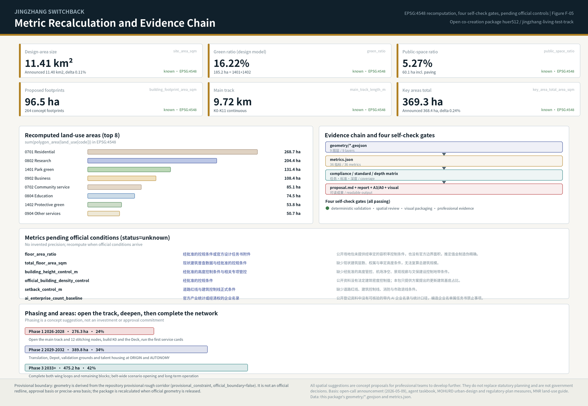
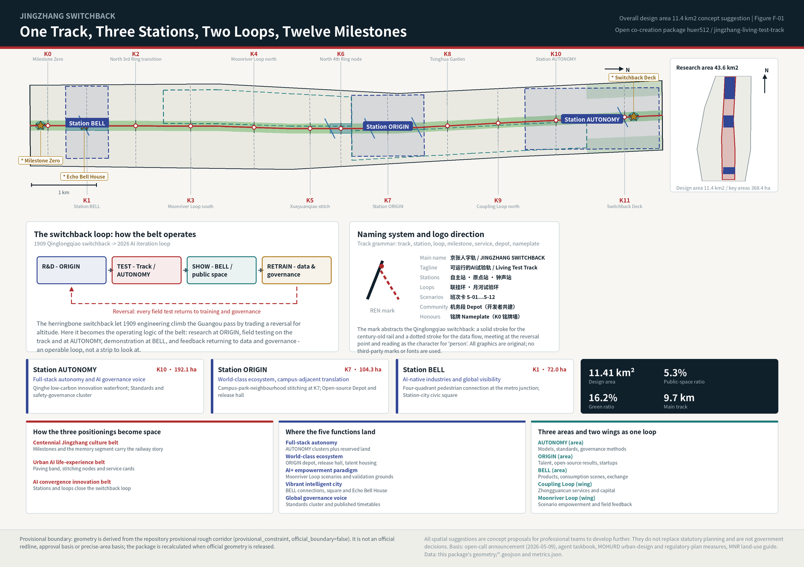
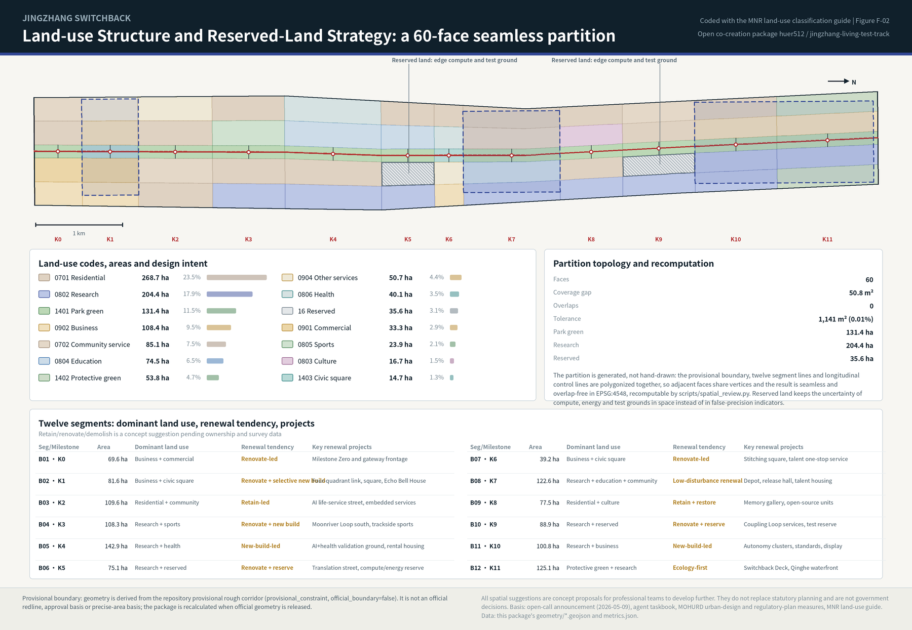
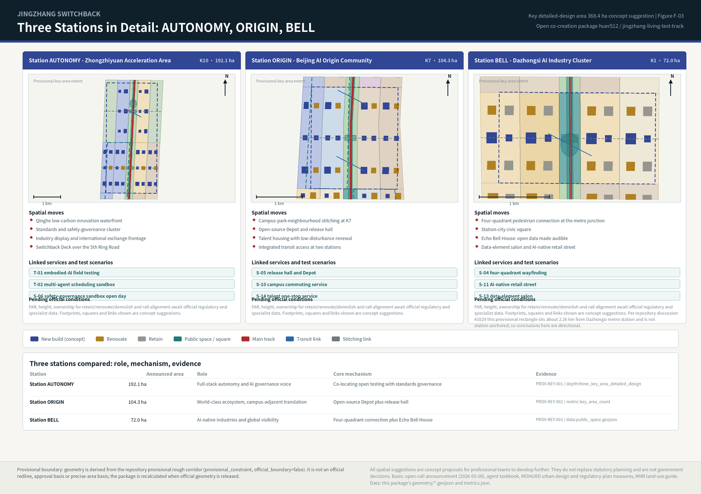
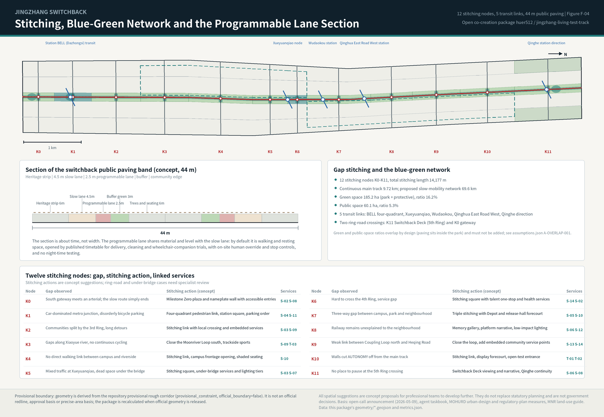

# Jingzhang Switchback: The Living Test Track

**The proposal in one sentence.** In 1909 the Jingzhang Railway crossed the Guangou pass with the technology of its day by building the herringbone switchback at Qinglongqiao: instead of forcing a straight climb, it traded one reversal for altitude. Artificial intelligence does not advance in a straight line either; it accumulates capability through train, test, feedback, retrain. This proposal therefore designs the Centennial Jingzhang AI Innovation Belt as **an operable test track**: one continuous 9.72 km main track, three functional stations (AUTONOMY, ORIGIN, BELL), two loops (Coupling Loop, Moonriver Test Loop), twelve east-west stitching milestones and twelve published service cards. Research happens at ORIGIN, field testing on the main track and at AUTONOMY, demonstration at BELL and in public space, and feedback returns to data and governance - a loop that can be operated, not a landscape strip that can only be looked at.

## Design Basis and Source List

The first basis of this proposal is the officially published open-call announcement, which fixes the boundaries and areas of the three scope levels, the three key areas, the breakdown of design tasks, and the deliverable standard of "urban design at the depth of a regulatory detailed plan" [source:OFFICIAL-ANNOUNCEMENT]. The agent-facing open-call taskbook adds the ten co-creation principles, three positionings, five functions, three areas and two wings, the six required agent tasks, and the uniform boundary clause that every spatial suggestion is a concept proposal [source:AGENT-TASKBOOK]. Professional depth follows the locally stored standard snapshots: the urban design measures for public space and the control of building height, massing, style and colour [standard:MOHURD-URBAN-DESIGN-MEASURES], the regulatory detailed planning measures for judging deliverable depth [standard:MOHURD-CONTROL-DETAILED-PLANNING], and the land-use classification guide for every land-use code [standard:MNR-LAND-USE-CLASSIFICATION-GUIDE].

Source use follows one discipline: **formal argument relies only on sources registered as usable for formal work; background and provisional material serve research, generation and visualisation, with limits recorded item by item in the structured files.** Accordingly, the seven global cases, the public information on phase one of the Jingzhang Railway Heritage Park, and the elderly-friendly technology policy are all marked background-only and never enter boundary, area or control conclusions [source:SITE-JINGZHANG-HERITAGE-PARK]; the geometry of the three scope levels and the three key areas comes from the repository's registered provisional rough boundary, labelled a provisional constraint usable only for generation, display and self-check [source:BOUNDARY-SOURCE].

**Data gaps that must be stated plainly.** Official precise boundary lines, official polygons for the three key areas, current regulatory conditions (FAR, building height, density, setbacks), road redlines, land ownership, a building survey, municipal utilities, heritage protection and construction-control zones, blue lines and ecological control lines are all unavailable in the public site package. The response is to keep the constraint layer an explicitly empty set with a registered gap rather than passing inferred lines off as official constraints [data:geometry/constraints.geojson#data_gap]; metrics that depend on those conditions remain pending official data with the required source named [metric:floor_area_ratio]. The deviation between the provisional computed areas and the announced figures is 0.11% for the overall design area and 0.24% for the key areas combined - the deviation is itself evidence of provisionality [metric:site_area_sqm].

**Recalculation trigger.** Once official boundaries and key-area polygons are released, the package re-runs geometry generation, metric recomputation, all five figures, the report HTML, the A3/A0 drawings and the four self-check gates, rather than swapping a single file; that commitment and its blast radius are recorded in the assumptions file [depth:existing_conditions_diagnosis]. The purpose is to let reviewers read design judgement separately from data conditions: judgement can be discussed now, precision must wait for official data.

## Three-Level Scope Framework

The announcement's three scope levels are not three drawings but three ways of working. The **coordinated research area of about 43.6 km²** (north to the North 5th Ring Road, east to the Jingzang Expressway, south to Xizhimenwai Street, west to Wanquanhe Road) answers "industrial ecosystem and future urban form"; it produces strategic judgement, innovation-chain relationships and naming, not redlines. The **overall design area of about 11.4 km²** (urban and industrial districts 1-2 km around the heritage park) answers "renewal and regulatory-plan-level urban design" and must land in land-use, building, transport, blue-green and phasing layers; at this level the package submits a 60-face seamless land-use partition, 264 proposed renewal footprints, 23 concept network lines and three phasing extents [data:geometry/land_use.geojson#LU-B08-01] [metric:land_use_partition_face_count]. The **key detailed-design area of about 368.4 ha** answers "the depth of a comprehensive implementation plan", requiring function, building scale, retain/renovate/demolish classification, traffic organisation and public-space connection to be described well enough to be developed further [depth:three_level_scope_framework].

One thread ties the three levels together: **one track, three stations, two loops, twelve milestones**. The track is the continuous slow-mobility and testing spine along the heritage park, 9,720.7 m long; the three stations are the three key areas, named AUTONOMY (Zhongzhiyuan), ORIGIN (AI Origin Community) and BELL (Dazhongsi); the two loops give the two wings a spatial form, with the Coupling Loop for the Zhongguancun technology-service wing and the Moonriver Test Loop for the Xiaoyue river scenario-empowerment wing; the twelve milestones (K0-K11) sit every 600-1,000 m along the track as wayfinding and honour nameplates, as the location of east-west stitching, as the site of edge-compute pods and as the stops of the service cards [metric:milestone_count].

This structure addresses the two real problems the announcement keeps naming: **the north-south route is broken** (gaps in the park's slow-mobility system, ring-road crossings with nowhere to pause) and **east and west are severed** (both sides of the railway have been separated for decades, campuses, parks and neighbourhoods disconnected). The main track solves north-south, the twelve stitching milestones solve east-west, and the two loops connect the services and scenarios of the wings into that spine. The three levels are therefore one working chain - strategy, renewal, implementation - whose conclusions all return to the same geometry and metrics for checking [data:geometry/site_boundary.geojson#SITE-001] [metric:main_track_length_m].

| Level | Area | Question answered here | Main output |
| --- | --- | --- | --- |
| Coordinated research area | approx. 43.6 km² | How the AI ecosystem is organised; what future urban form means | Switchback-loop model, seven case studies, naming and visual direction, three-areas-two-wings relationships |
| Overall design area | approx. 11.4 km² (recomputed 11.41 km²) | How renewal lands, how facilities support it, how character is guided | 60-face land-use partition, footprint proposals, slow-mobility and transit network, blue-green and public space, three phases [metric:site_area_sqm] |
| Key detailed-design area | approx. 368.4 ha (recomputed 369.3 ha) | How the three districts reach implementation-plan depth | Three-station detail, renewal tendencies, traffic organisation, public-space connection, validation scenarios [metric:key_area_total_area_sqm] |

## Coordinated Research Area: Industry and Future City Research

**World experience: read seven cases as seven mechanisms, not seven renderings.** Case study exists to isolate transferable mechanisms and state their limits here. All cases below are background research; figures come from public web pages and press releases, are not verified against primary documents, and are not used as project metrics or commitments [source:CASE-STATION-F] [source:CASE-PUNGGOL-PDD].

| Case | Key public facts | Transferable mechanism | Where it lands here |
| --- | --- | --- | --- |
| Station F (Paris) | 1920s Halle Freyssinet rail freight shed (approx. 310 x 58 m) converted into an approx. 34,000 m² startup campus | Long-span linear rail heritage can carry intensive innovation uses without demolition | Existing long-span buildings at BELL and ORIGIN are prioritised for renovation over new build [source:CASE-STATION-F] |
| King's Cross / Knowledge Quarter (London) | Approx. 67 acres of railway lands regenerated, 20 historic buildings retained; research institutions and AI firms clustered | Build public space and cultural anchors first, knowledge density follows | Track and twelve milestones first, K0 and the Switchback Deck early: open the track, then gather people [source:CASE-KINGS-CROSS-KQ] |
| Punggol Digital District (Singapore) | Approx. 50 ha district run on one digital platform, with a multi-operator robotics (physical AI) testbed in mixed-use public areas | Public space can become a multi-operator field test site under governance | The direct precedent for the programmable test lane and the multi-agent scheduling sandbox [source:CASE-PUNGGOL-PDD] |
| 22@Barcelona | Approx. 200 ha industrial area transformed after the 2000 plan revision through roughly 150 plot-by-plot transformation plans, bundled with affordable housing and green space | Replace a single master developer with renewal rules plus project-by-project plans | The renewal project list and policy suggestions use an item-by-item, exit-capable structure [source:CASE-22-BARCELONA] |
| Seoul AI Yangjae Hub | A city-level AI agency links research, validation and urban application, and proposes a "physical AI belt" connecting the research hub with the robotics hub | Organise research, validation and application as one urban belt | The organisational prototype of the switchback loop and an international counterpart [source:CASE-SEOUL-YANGJAE] |
| Kendall Square (Boston-Cambridge) | Universities, corporations and capital coexist at walkable density; rising rents now squeeze early-stage teams | Campus-adjacent innovation must prepare affordable space at the same time | ORIGIN pairs talent housing with reserved land so the district is not left with expensive floorspace only [source:CASE-KENDALL-SQUARE] |
| Zhangjiang AI Island (Shanghai) | Approx. 66,000 m² with 21 buildings hosting more than 30 AI application scenarios | Scenario as carrier: a scenario list drives how space is used | A domestic small-scale precedent for the twelve service cards and scenario-opening mechanism [source:CASE-ZHANGJIANG-AI-ISLAND] |

**How the three positionings become space.** The centennial Jingzhang culture belt equals the K0-K11 milestone system plus the memory segment carrying the railway story; the urban AI life-experience belt equals the 44 m public paving band plus twelve stitching milestones plus service cards, placing experience inside the daily routes of residents and talent; the AI convergence innovation belt equals three stations and two loops closing the research-test-demonstrate-retrain loop [standard:PROJECT-AGENT-OPEN-CALL-TASKBOOK]. **The five functions land as follows:** full-stack autonomous innovation at the AUTONOMY research clusters and the reserved land (35.6 ha kept flexible for compute, energy and test grounds); the world-class ecosystem at ORIGIN's open-source Depot, release hall and talent housing; the AI+ empowerment paradigm on the Moonriver Test Loop through service cards and validation scenarios; the vibrant intelligent city at BELL's four-quadrant connection, station-city square and Echo Bell House; the global governance voice at AUTONOMY's standards and safety-governance cluster together with published service timetables [metric:reserved_white_land_area_16_sqm].

**Three areas and two wings as a loop of flows, not an organisation chart.** AUTONOMY exports models, standards and governance methods; ORIGIN exports talent, open-source results and startups; BELL exports products, consumption scenes and international exchange; the Coupling Loop plugs in Zhongguancun's technology services and capital; the Moonriver Test Loop returns field feedback to the first two stations. Coordination with the wider region (Future Science City, Huairou Science City, the Economic-Technological Development Area and the Beijing-Tianjin-Hebei direction) is suggested as "service exchange": make the belt's test grounds, scenario cards and open data interfaces bookable public resources rather than another investment-promotion channel. This is an operating suggestion requiring confirmation by the competent authorities and operators [depth:overall_spatial_structure].

**The naming motif and this package's relation to peer submissions (stated plainly).** The Qinglongqiao herringbone is public historical knowledge, and more than 25 submissions in this open call already use that motif, among them the merged "Herringbone Intellirail (Λ·RAIL)" and the open contribution "RENLINE" with its Switchback Protocol [source:PEER-SWITCHBACK-PROTOCOL]. The naming and structure here were generated independently, and no peer text, drawing, geometry or schema was reused. A symbol belongs to everyone, so this package claims no exclusivity over the motif and puts the difference in mechanism instead: **testing capacity created by time allocation rather than by a new dedicated lane** (the programmable lane inside the 44 m band, published windows, human override, no night testing); **twelve stitching milestones built as one compound device** (wayfinding, nameplate, edge compute, accessible rest, each answering a named gap); **the switchback as a governance loop rather than a shape** (every field result returns to the standards and safety-governance cluster); and **35.6 ha of reserved land absorbing compute and energy uncertainty** under temporary-use permission with evaluated exit.

**A judgement about future urban form.** The most immediate change AI brings to a city is not building shape but **the time dimension of space**: the same street can be circulation, rest, delivery testing or an event ground at different hours. This proposal therefore avoids "AI styling" and offers three assessable principles: programmable public space (time allocation published and human-overridable); exit-capable spatial investment (light installations first, reserved land as the fallback, so uncertain technology paths do not lock in heavy construction); and explainable urban interfaces (every sensor and every scheduling decision legible to an ordinary person at the milestone).

## Overall Design Area: Urban Renewal and Regulatory-Plan-Level Urban Design

**Spatial structure.** The overall design area is a corridor roughly 9.7 km north-south and 1.0-1.3 km east-west. The proposal organises it as twelve segments by five columns: twelve segments defined by milestones K0-K11, and five columns formed by the west outer, west inner, track, east inner and east outer strips. This frame serves three purposes at once: it brings the underused land on both sides of the park into one set of renewal units, gives every segment an explicit dominant function and renewal tendency, and lets any single adjustment be reviewed without disturbing the whole belt [data:geometry/land_use.geojson#LU-B02-03] [depth:land_use_layout].

**Land-use layout and recomputation.** The partition is generated rather than hand-drawn: the provisional boundary, twelve segment lines and longitudinal control lines are polygonized together, so adjacent faces share vertices and the result is seamless and overlap-free in EPSG:4548, with a residual of 50.8 m² (far below the 1,141 m² spatial-review tolerance). The 60 faces classify as: residential 268.7 ha, research 204.4 ha, park green 131.4 ha, business and finance 108.4 ha, community services 85.1 ha, education 74.5 ha, protective green 53.8 ha, other commercial services 50.7 ha, health care 40.1 ha, reserved land 35.6 ha, commercial 33.3 ha, sports 23.9 ha, culture 16.7 ha and civic square 14.7 ha [data:geometry/land_use.geojson] [metric:research_land_area_0802_sqm].

**A planning innovation: put the uncertainty into reserved land, not into false precision.** AI's spatial demand will be rewritten repeatedly over five to ten years by compute form factors, energy limits and the maturity of embodied intelligence. The proposal therefore places reserved-land clusters in segments B06 and B10, 35.6 ha in total, restricted to edge-compute nodes, distributed energy facilities and validation grounds, with three accompanying rules: allow light, demountable temporary use; set evaluation and exit conditions for each round of use; convert to a statutory use only once official conditions are clear. This is the concrete answer to "territorial spatial planning innovation" and needs development by professional teams under current reserved-land management requirements [depth:development_intensity_controls].

**Renewal potential and building scale.** Potential concentrates in three kinds of space: the passive strips severed by the railway, the unorganised surface parking and walled frontages around stations, and long-span underused workshops and warehouses. The proposal offers 264 building-footprint suggestions totalling 96.5 ha (8.46% of the overall area), classified by retain, renovate or new build. To be explicit: these footprints are **a set of proposed renewal and new-build suggestions, not the result of a building survey**, and no total floorspace can be derived from them; total floor area, FAR, density and height remain pending official data while current storey counts and approved controls are missing [metric:proposed_building_coverage_ratio] [metric:total_floor_area_sqm].

**How carrying capacity is expressed.** Without official regulatory conditions or utility capacity data, carrying capacity cannot be promised numerically; it can only be expressed as condition, threshold and review: every renewal project states the conditions it depends on (redline, ownership, utilities, structure, heritage), and while a condition is unknown the project stays in a "researchable" state. That is not a retreat from depth - it puts depth in **the completeness of the criteria** rather than in invented numerical precision [standard:MOHURD-CONTROL-DETAILED-PLANNING].

## Detailed Design of Key Areas

The three key areas are mandatory. The proposal names them stations and develops each on one template: role, spatial moves, renewal tendency, traffic organisation, public-space connection, linked service cards, pending conditions [depth:three_key_area_detailed_design].

**AUTONOMY - Zhongzhiyuan AI Autonomous Innovation Acceleration Area (approx. 192.1 ha, segment K10).** A garden-type innovation district for full-stack autonomy and governance. Four spatial moves: the Qinghe low-carbon innovation waterfront, integrating green space, water and building frontage so Qinghe culture appears on the everyday walking route; the standards and safety-governance cluster, translating invisible work - model evaluation, red-teaming, standards workshops - into bookable, visitable, supervisable space; the industry display and international exchange frontage towards the ring road, carrying the gateway and external access role; and the Switchback Deck, the herringbone viewing and narrative landmark over the North 5th Ring that also terminates the main track. The renewal tendency is new-build-led with selective renovation, opening walled frontages first to connect into the track [data:geometry/key_areas.geojson#PROV-KEY-001] [data:geometry/buildings.geojson#BLDG-B11-01-00].

**ORIGIN - Beijing AI Origin Community (approx. 104.3 ha, segment K7).** A campus-adjacent district for translation and open-source co-creation. Its core is triple stitching: campus, park and neighbourhood connected east-west at milestone K7, linking original research from the Tsinghua, Peking University and CAS direction with industrial space at walking distance. Moves include the open-source Depot (a public workshop for developers' daily collaboration and maintenance, named after the railway depot tradition), the release hall (routine release and pitching for university results and startups), talent housing and daily services inserted through low-disturbance organic renewal rather than wholesale rebuilding, and integrated transit access towards Wudaokou and Qinghua East Road West. The renewal tendency is explicitly low-disturbance organic renewal: renovation and use conversion first, keeping the community fabric and existing networks of daily life [data:geometry/key_areas.geojson#PROV-KEY-002] [depth:retain_renovate_demolish].

**BELL - Dazhongsi AI Industry Cluster (approx. 72.0 ha, segment K1).** An urban district for AI-native industries and international exchange. Four moves: **four-quadrant pedestrian connection** at the metro junction together with bicycle-parking order - the announcement names this problem, and the answer here is a stitching plaza, a continuous four-way walking surface and zoned parking; the station-city civic square (most of the 14.7 ha of square land sits in this segment as a compound-use public living room in front of the station); the Echo Bell House, an acoustic public room modelled on the memory of the Great Bell, turning public urban data into an audible daily bell and offering a non-visual interface for blind and all-age users; and the data-element salon with the AI-native retail street, hosting agents, intelligent terminals and content consumption from leading firms. The renewal tendency is renovation-led with selective new build, upgrading public environment and commercial frontage around key enterprises first [data:geometry/key_areas.geojson#PROV-KEY-003] [data:geometry/public_space.geojson#LM-ECHO-BELL].

**A location offset that BELL must disclose separately.** Public discussion in the repository has confirmed that the centroid of the provisional polygon `PROV-KEY-003` lies at about 39.94692N / 116.34850E - roughly 2.26 km from Dazhongsi metro station, with Beijing North railway station falling inside the rectangle instead; maintainers have clarified that the three provisional rectangles were configured only by the announcement's north-to-south order and approximate areas, without station or road anchoring [source:ISSUE-1029]. Every spatial conclusion for BELL (four-quadrant connection, station-city square, Echo Bell House, retail pilot street) is therefore explicitly a **directional concept suggestion**: it describes how station-city integration at Dazhongsi should be organised, not a precise position on that provisional rectangle. When official KEY_AREA polygons or station anchoring relationships are released, BELL's geometry, metrics and figures must be re-anchored as a whole; this package does not shift the source geometry itself, so it stays consistent with the repository source [data:geometry/key_areas.geojson#PROV-KEY-003]. Public discussion likewise records that the provisional corridor boundary does not intersect the OSM-surveyed heritage park (nearest distance about 412.5 m), which is exactly why the main track here is defined as the provisional corridor mid-line rather than a rail alignment or park redline [source:ISSUE-846].

**A boundary statement shared by all three stations.** The extents are provisional rough polygons; the footprints, squares, links and renewal classifications shown are concept suggestions. FAR, building height, ownership, rail alignment and engineering feasibility all await official regulatory and specialist data, and none of this constitutes an approved conclusion or an implementation commitment [source:BOUNDARY-SOURCE].

## AI Innovation Ecosystem, Personas, and AI+ Scenarios

**The ecosystem map: from a list of factors to a switchback loop.** The eight factor groups - land, space, industry, capital, talent, compute, data, scenarios - are rearranged along the four legs of the loop: the research leg (ORIGIN) secures talent and open-source collaboration; the testing leg (main track plus AUTONOMY) secures scenarios, compute and safety governance; the demonstration leg (BELL plus public space) secures consumption, content and international exchange; the retraining leg (data and governance) secures compliance, evaluation and policy iteration. Three pieces of public infrastructure carry the factors in space: reserved land (flexibility for compute and energy), milestones (compound devices for edge compute, wayfinding and honours) and the service timetable (a public scheduling interface for scenario opening) [standard:PROJECT-AGENT-OPEN-CALL-TASKBOOK] [metric:scenario_card_count].

**Six personas.** These are typological descriptions derived from public research and the taskbook; they contain no personal data and are never used for commercial targeting [depth:blue_green_public_space].

| ID | Persona | Key needs | Spatial and service response | Data and privacy boundary |
| --- | --- | --- | --- | --- |
| P-01 | Open-source developer / doctoral researcher | Publishing, collaboration, testing, community reputation | ORIGIN Depot, release hall, evening collaboration space | No individual movement tracking; contribution records use self-declared public names only |
| P-02 | Startup founder | Affordable space, compute access, a usable test ground | AUTONOMY shared test ground, milestone edge-compute pods, temporary use of reserved land | Compute and data services require separate authorisation, never default access |
| P-03 | International business lead of a leading firm | Display, negotiation, hosting, recruitment | BELL pitching lounge, station-city square, upgraded public environment near enterprises | Corporate marks and case material must be rights-cleared |
| P-04 | Nearby resident, including older people | Commuting, rest, community services, low-disturbance renewal | Continuous slow mobility along the track and twelve milestones, embedded community services, retained non-digital channels | No profile-based targeting; staffed counters and paper alternatives kept |
| P-05 | University staff and researchers | Translation of results, cross-campus collaboration, daily walking | Triple stitching at K7, translation street, opened education frontages | Campus and research data require authorisation and stay on campus by default |
| P-06 | International AI talent and visitors | Language, daily services, cultural understanding, community | Bilingual wayfinding and nameplates, Tsinghua Garden memory narrative, Track Week | Identity documents never enter scenario data chains |

**Twelve service cards (AI scenario cards).** The service card is the unit of scenario organisation: like a train service, each has a number, a carrier, a time window, a user group, a data boundary, a human-review method and a suggested operator. All cards are concept suggestions; actual operation requires approval and safety assessment by the competent authorities [data:geometry/public_space.geojson#PUB-TRACK-B08].

| ID | Service card | Spatial carrier | Design note and governance boundary |
| --- | --- | --- | --- |
| S-01 | Delivery field test | Programmable test lane, K0-K11 | Low-speed delivery testing in published time windows; same material and level as the walking lane, on-site human override and stop control, no night testing |
| S-02 | Accessible companion | Main track and milestone plazas | Route companionship and rest sequences for wheelchair, blind and older users; non-digital channels retained, developed under the barrier-free environment law |
| S-03 | Gap inspection | Twelve stitching milestones | Public imagery plus human review to find slow-mobility gaps, crowding and damaged facilities; results enter a public ledger, no person recognition |
| S-04 | Station-city wayfinding | BELL four quadrants and station square | Pedestrian guidance and parking direction at peak times, aggregate statistics only, no individual tracking |
| S-05 | Open-source release | ORIGIN Depot and release hall | Routine releases, contribution displays and small pitches for universities and startups |
| S-06 | Safety-governance sandbox open day | AUTONOMY standards cluster | Model evaluation and red-teaming become bookable public science communication; evaluation data stays inside |
| S-07 | Edge-compute pod | Milestones and reserved land | Temporary compute and test slots for small teams; energy use and occupancy published, exit reviewed each round |
| S-08 | Data made audible | Echo Bell House and milestones | Public urban data (footfall, green space, events) translated into bells and soundscape, serving blind users |
| S-09 | Qinghe and Xiaoyue riverside | Moonriver Loop and Qinghe waterfront | Environmental sensing, low carbon and waterside walking shown together; any in-water work needs specialist and authority approval |
| S-10 | Campus commuting | Track segments K4-K7 and campus frontages | Daily walking organisation between campus, park and neighbourhood with shade, lighting and rest |
| S-11 | AI-native retail pilot | BELL commercial frontage | Small-scale trials of AI-native consumption and content, with AI-generated content labelled and a human service entrance |
| S-12 | Track Week | Belt-wide public space | Routes, safety, accessibility and rights organisation during the annual event; temporary installations removed afterwards |

**Four industry validation scenarios.** Unlike service cards, these serve enterprise and research validation needs and must state space, time, safety and exit mechanisms together [depth:municipal_new_infrastructure]. T-01 embodied-AI field testing: the programmable lane plus the AUTONOMY open-test entrance form a low-speed field environment with published windows, capped speed and continuous human override. T-02 city-scale multi-agent scheduling sandbox: shadow mode on historical and simulated data first, then limited live windows, with every scheduling suggestion confirmed by a person. T-03 AI+accessibility and ageing validation ground: community frontages in segments K2 and K6 test voice, routing, non-digital channels and staffed counters, developed with reference to the elderly-friendly technology policy [source:ELDERLY-SMART-TECH-PLAN]. T-04 joint edge-compute and distributed-energy test: demountable compute and energy units on reserved land, with published energy use and noise, renewed or removed on the evidence.

**Scenario governance contract: adopting the community's Switchback Protocol.** Rather than inventing another state machine, the service cards here adopt the community's open contribution, Switchback Protocol v1.0 (chucky1102 / RENLINE; the protocol specification is licensed CC-BY-4.0 and attribution is retained) [source:PEER-SWITCHBACK-PROTOCOL]. Adoption and localisation: **three-colour status** - green for normal operation, yellow for a controlled pilot (virtual evaluation, then controlled ground, then real street), red for a switchback (return to the last stable state and publish the reason; red is a planned restart, not a failure). All twelve cards here are at design-candidate or controlled-pilot stage, so - following the compatibility suggestions raised in the public thread - status and readiness are stated separately (a candidate is not a return to green) and design targets are never written as measured results. **Human override** - every card involving on-site equipment needs a stop control and a named person on duty; the takeover time limit is a design target and is recorded as "to be measured" until a first-phase baseline exists, rather than filled with an invented number. **A 90-day public review** - renew, reduce, suspend or switch back; two consecutive missed reviews turn a card red automatically. **Triggers and recovery** - a safety-level takeover event or a threshold breach turns a card red, with thresholds set after first-phase measurement; recovery requires two consecutive compliant review periods plus one observation period. **Three-tier records** - near-miss, switchback and retirement files with stable identifiers, expiry dates and reviewers, and every review change written back onto the card. The related "still usable when AI is off" baseline (Service Equivalence Baseline, CC-BY-SA-4.0) is used here by reference only, without copying its normative text, to check the non-digital equivalents in S-02, S-04 and S-08 [source:PEER-SERVICE-EQUIVALENCE-BASELINE].

**Governance boundary.** All scenarios follow the interim measures for generative AI services on data provenance, content labelling and security assessment [standard:GENERATIVE-AI-INTERIM-MEASURES]; none requires non-public data, personal data or a named supplier; none sets up automated decisions that cannot be reviewed by a person; and no test scenario is described as approved operation [depth:risk_missing_data].

## Land Use, Building Scale, and Retain-Renovate-Demolish Strategy

**Classification basis and structural judgement.** Every land-use code comes from the project subset of the classification guide; the full official code table must be introduced before statutory work [standard:MNR-LAND-USE-CLASSIFICATION-GUIDE]. Structurally the proposal keeps residential, research and green space as the three main bodies (about 604.5 ha together, 53% of the overall area), concentrates business and commercial uses at BELL and the North 4th Ring node, places education and health frontages next to campuses and communities, and lets reserved land absorb uncertain new-infrastructure demand [data:geometry/land_use.geojson#LU-B06-02]. The judgement behind this distribution: AI industry does not need a single "industrial park" land use but **short-distance mixing of research, living, services and public space**, so work, life, socialising and learning close within walking distance.

**Renewal tendency by segment.** Without ownership, structural and survey data, retain/renovate/demolish cannot be concluded plot by plot; only **segment tendencies and criteria** can be given. Segments K0/K1 (BELL) are renovation-led with selective new build, focused on four-quadrant connection and commercial frontage; K2, K8 and K9 are retain-and-restore, protecting community fabric and the heritage frontage; K3, K5, K6 and K10 combine renovation and new build around stitching milestones and stations; K4 and K11 are new-build and ecology-first respectively, for talent housing and the Qinghe waterfront; K7 (ORIGIN) is explicitly low-disturbance organic renewal. Four criteria apply throughout: does it block the main track or a stitching line; is it long-span underused space; does it affect heritage and cultural frontage; is it an independent implementation unit [depth:retain_renovate_demolish] [data:geometry/buildings.geojson#BLDG-B08-02-01].

**Honest handling of building scale and intensity.** What the package provides is 264 footprint suggestions and 96.5 ha of footprint area, usable for comparing renewal intensity intentions. Total floor area, FAR, density and height all remain pending official data, with reasons recorded in the metrics file: missing current storey counts and ownership, missing approved regulatory conditions and height controls including aviation clearance, view corridors and heritage construction-control zones [metric:building_height_control_m] [metric:official_building_density_control]. This is not an evasion of depth but the discipline of not manufacturing precision; once official conditions arrive, footprints, storeys and scale can be computed directly on the same geometry.

**Suggested tiers for height, massing and character.** Following the urban design measures on plan and volume, public space and the control of height, massing, style and colour [standard:MOHURD-URBAN-DESIGN-MEASURES], three suggested tiers apply: within 50 m of the track, low-rise, permeable, continuous frontage to protect heritage sightlines and daylight; around milestones and stations, moderately increased massing for legibility; in the outer blocks, continuity with the existing urban grain. Roof design should treat the visibility of equipment and compute units as a design subject, so the "fifth elevation" is not colonised by machine rooms and air-cooling plant - a character issue specific to AI industrial space that deserves its own section in formal development.

## Transport, Rail, Municipal Infrastructure, and Public Services

**Slow mobility: one track plus twelve stitches.** The main track runs 9.72 km north-south; the accompanying slow-mobility, transit-link and micro-circulation concept network totals 69.6 km [metric:proposed_slow_mobility_network_length_m]. The twelve stitching milestones correspond one by one to the gap types the announcement highlights: the south gateway (K0), the metro junction four quadrants (K1), communities either side of the 3rd Ring (K2), riverside gaps (K3), campus and riverside (K4), mixed traffic and dead space under Xueyuanqiao (K5), crossing the 4th Ring (K6), the three-way gap at campus-park-neighbourhood (K7), heritage and community frontage (K8), the Heqing Road direction (K9), the walled frontage at AUTONOMY (K10) and the crossing over the North 5th Ring (K11). Each gives a problem-action-service correspondence so transport and structural specialists can review case by case [data:geometry/roads.geojson#ROAD-STITCH-K5] [metric:stitching_node_count].

**The 44 m public paving section: the point is time, not width.** From west to east: 6 m heritage display strip, 4.5 m slow lane, 2.5 m programmable test lane, 3 m buffer green, 6 m trees and seating, mirrored on the east. The programmable lane shares material and level with the slow lane and has no kerb: by default it is walking and resting space, opened only in published windows by service card for delivery, cleaning or wheelchair-companion trials, with on-site human override and stop controls and no night testing. This lets field testing happen without building a dedicated lane and without privatising public space [data:geometry/public_space.geojson#PUB-TRACK-B02].

**Rail and station integration.** Five link relationships are marked: BELL (Dazhongsi) four quadrants, Xueyuanqiao, Wudaokou, Qinghua East Road West and the Qinghe direction. Station positions follow public information as rough indications, and the links are concept suggestions that do not represent rail alignment or station redlines; the four-quadrant connection and bicycle-parking order develop through a continuous walking surface, zoned parking and link canopies [depth:traffic_rail_slow_parking] [source:AGENT-TASKBOOK]. Two micro-circulation branches organise plot access so post-renewal traffic does not press onto the track frontage.

**Municipal and new infrastructure.** Edge compute and distributed energy follow a three-point layout: milestones host small edge-compute and information services, reserved land hosts demountable medium test units, and existing utility sites host integration with the three traditional systems. Three hard constraints come first in formal development: power capacity and connection points, noise and heat rejection near housing, and fire safety separation. While utility, energy, drainage and flood data are missing, these remain preconditions rather than conclusions [depth:municipal_new_infrastructure] [metric:reserved_white_land_area_16_sqm].

**Public services.** Four facility groups match the six personas: talent services (one-stop point at K6), community services (embedded at K2 and K9), health and ageing services (health frontages at K5 and K7), culture and display (memory gallery at K8, Echo Bell House at K1). Standards and service radii should be set by professional teams under current codes; the proposal only gives locations and compound-use logic [data:geometry/land_use.geojson#LU-B07-04].

## Blue-Green Network, Public Space, and Urban Character

**Blue-green frame.** Green space totals 185.2 ha (131.4 ha park plus 53.8 ha protective), a green ratio of 16.22%; public space totals 60.1 ha, a public-space ratio of 5.27% [metric:green_ratio] [metric:public_space_ratio]. The definitions must be stated: the public paving band lies inside the park green space, so the two ratios overlap by design and must not be added; the green figure excludes civic squares (14.7 ha), which count as public space. This disclosure and its recalculation trigger are recorded in the assumptions file so the figures can be re-decomposed once official definitions apply [data:geometry/green_space.geojson#GREEN-B08-03]. Towards Qinghe and Xiaoyue river, waterfront and protective green carry ecological and stormwater functions; any action in water or inside blue lines awaits official blue and ecological control lines.

**Three AI pilgrimage landmarks, all concept suggestions.** The Switchback Deck (K11, over the North 5th Ring) uses the herringbone geometry for viewing and narrative, telling how the 1909 reversal and today's iteration loop are the same intelligence. Milestone Zero (K0, south gateway) is the origin monument and open-source nameplate wall, where the names of human and agent contributors are cast into nameplates as a cumulative honour system, answering the taskbook principle that contribution should be remembered. The Echo Bell House (K1, BELL) is an acoustic public room modelled on the memory of the Great Bell, letting public city data be heard daily as bells while offering blind users a non-visual interface. None of the three includes bridge, tunnel, structural or feasibility conclusions; each needs professional development [data:geometry/public_space.geojson#LM-SWITCHBACK] [depth:height_massing_character].

**Cultural narrative: three cultures converging.** Jingzhang railway culture supplies the archetype of engineering and courage (Zhan Tianyou's switchback, the Tsinghua Garden station building, the crossings and milestone memory); Zhongguancun innovation culture supplies the social memory of going from zero to one (electronics street to global innovation cluster); the new AI culture supplies today's experience of people working with intelligence. They converge not as three parallel history panels but through **one shared vocabulary**: track (belt), station (area), loop (wing), milestone (node), service (scenario), depot (community), nameplate (honours). Wayfinding follows: milestone pavement inlays carry the single-stroke herringbone mark, and milestone bodies carry bilingual text, braille and audio cues; heritage elements (old rails, switches, milestone posts) are displayed as originals or replicas in the memory segment with authenticity and date clearly labelled, so a replica is never presented as a protected relic [source:SITE-JINGZHANG-HERITAGE-PARK] [standard:MOHURD-URBAN-DESIGN-MEASURES].

**Character control and international messaging.** Character guidance is stated in three registers: official control (pending), design suggestion (offered here) and condition to be confirmed (needs specialist data). The outward message is one translatable line: *A century ago this line taught trains to climb by turning back; today it teaches a city to improve by testing and returning.* All brand graphics, typefaces and images are original to this submission or use clearly licensed open resources; no third-party marks, portraits or unlicensed material are used [depth:risk_missing_data].

## Renewal Projects, Implementation Policy, and Phasing

**Twelve renewal projects, all concept suggestions.** Each states type, location, dependencies and linked evidence; where a condition is unknown, the project stays researchable [depth:renewal_project_list].

| ID | Project | Type | Location | Main dependencies |
| --- | --- | --- | --- | --- |
| JZ-01 | Main track continuity and paving band | Public space / slow mobility | K0-K11 | Built park extent, original design, junction organisation |
| JZ-02 | Twelve stitching plazas and crossings | Transport / public space | Each milestone | Road redlines, under-bridge ownership, traffic and structural review |
| JZ-03 | Milestone Zero and nameplate wall | Culture / public space | K0 | Land boundary, utility connections, content review process |
| JZ-04 | Echo Bell House | Culture / accessibility | K1 | Acoustic assessment, accessible design, operator |
| JZ-05 | BELL four-quadrant connection and parking order | Transit integration | K1 | Station data, utilities, junction capacity |
| JZ-06 | Station-city square compound use | Public space / commerce | K1 | Policy on compound use of planned green space, fire and evacuation |
| JZ-07 | ORIGIN triple stitching and open-source Depot | Renewal / industry services | K7 | Campus boundary, ownership, ground-floor uses, low-disturbance construction |
| JZ-08 | Release hall and talent housing | Industry services / housing | K7-K8 | Regulatory conditions, talent policy, operator |
| JZ-09 | AUTONOMY standards and governance cluster | Industry / governance | K10 | Land conditions, security assessment, disclosure boundary |
| JZ-10 | Qinghe low-carbon waterfront | Blue-green / ecology | K11 | Blue line, flood control, ecological control line, water authority approval |
| JZ-11 | Switchback Deck viewing and narrative | Culture / landmark | K11 | Ring-road crossing structure and traffic safety, landscape approval |
| JZ-12 | Reserved-land test units and edge-compute pods | New infrastructure / public services | B06, B10 and milestones | Power capacity, noise and heat, fire safety, exit mechanism |

**Six policy suggestions, subject to study and confirmation by the authorities.** First, use renewal rules plus project-by-project plans so a single project can exit without affecting the belt (following the 22@ experience). Second, publish the time allocation of public space: service timetable, occupied extent, responsible party and complaint channel together. Third, run scenario opening as apply, assess, publish, review, with assessment covering privacy, safety, accessibility and noise. Fourth, govern reserved land through temporary-use permission with evaluated exit, avoiding long-term occupation. Fifth, operate a contribution-memory mechanism: nameplates and a public ledger record human and agent contributors under published attribution rules. Sixth, make accessibility and ageing requirements design and acceptance conditions in advance rather than retrofits [standard:BARRIER-FREE-ENVIRONMENT-LAW].

**Phasing.** Near term (2026-2028) 276.3 ha (24%): open the main track and twelve stitching milestones, build K0 and the Switchback Deck, open the BELL four quadrants and the first service cards. Medium term (2029-2032) 389.8 ha (34%): translation functions, the open-source Depot, validation grounds and talent housing land at ORIGIN and AUTONOMY. Long term (2033 onwards) 475.2 ha (42%): both wing loops and the remaining blocks complete renewal, forming belt-wide scenario opening and long-term operation [data:geometry/phasing.geojson#PHASE-01] [metric:phase_1_area_sqm]. Two time concepts must be distinguished: the roughly 100-day open-call design period is a submission requirement, while the phasing above is a suggested renewal path and not an investment, approval or construction commitment [depth:phasing_implementation].

**Long-term operation, answering agent.6.** The annual event system runs on Track Week: spring opening (scenario release and service-card publication), summer test season (validation scenarios open together), autumn results week (releases, pitching and international dialogue), winter review (evaluation, exits and policy suggestions). Event branding continues the track vocabulary (departure, service, depot, nameplate), with the visual system extending the herringbone mark and milestone numbering. The developer community operates through the Depot: fixed opening hours, a public task board, contribution records and nameplate honours, with community rules matching repository collaboration practice (search existing discussion first, provide reproducible evidence, follow through to a conclusion). Scenario opening, public experience routes and international communication follow policy suggestions two to five. Three conversion paths are explicit: startup to test ground to local services; university result to release hall to enterprise; international team to Track Week to long-term cooperation. All of this is an operating suggestion whose effects need long-term evaluation and must not be described as a confirmed arrangement [source:AGENT-TASKBOOK].

## Metrics, Area Recalculation, and Compliance Matrix

**Three tiers of metrics.** The first tier is spatial metrics recomputable directly from submitted geometry: scope areas, green and public-space areas and ratios, footprint area, phase areas, track and network lengths, partition face count. The second tier is control metrics that depend on official conditions: FAR, total floor area, height, density, setbacks. The third tier is performance metrics needing continuous calibration from operations and industry: AI enterprise counts and output baselines, scenario usage frequency, event participation, improvement in slow-mobility accessibility. The first tier is known in this package; the second and third are explicitly pending official data with the required sources named, never filled with guesses [metric:site_area_sqm] [metric:floor_area_ratio].

**Method and verifiability.** All areas are computed after projecting vertices to EPSG:4548, matching the spatial-review script; every metric records formula, source files, confidence and assumptions. Key results: overall design area 11,412,825.386 m² (0.11% from the announced 11.4 km²); green space 1,851,608.352 m² and a green ratio of 0.162239; public space 601,206.209 m² and a public-space ratio of 0.052678; footprints 965,182.573 m²; key areas 3,692,893 m² combined (0.24% from the announced 368.4 ha); 60 partition faces with a 50.8 m² residual and zero overlap [metric:green_space_area_sqm] [metric:public_space_area_sqm]. The same values are declared as numeric markers in the visualisation page for automated comparison [depth:metrics_recalculation].

**Task coverage and compliance.** Every task in announcement sections 1.3, 1.4 and 1.5 and every requirement in agent.1-agent.6 is mapped in the compliance matrix to sections of this report, geometry layers, metrics, drawings, visualisation sections, sources, assumptions and self-check items; the standard matrix covers the responses to five mandatory standards; all fifteen required design-depth items are complete in the design-depth matrix, each pointing to verifiable evidence [standard:PROJECT-OFFICIAL-ANNOUNCEMENT] [depth:metrics_recalculation]. The matrices are the machine-audit layer; the narrative does not repeat their full index, and item-by-item checking should use the matrix files.

**Self-check state.** The package passes four gates: deterministic validation (structure, language, packaging), spatial review (topology, containment, metric recomputation), visual packaging (offline, required markers, value consistency) and professional evidence review (standard and depth coverage). Spatial review keeps three minor notes that the key areas are provisional extents - a faithful reflection of the organiser's data gap which, by the project rules, does not block content scoring [data:geometry/key_areas.geojson#PROV-KEY-001].

## Risk, Copyright, and Compliance

**Bilingual requirement and consistency.** The primary file is Chinese with this complete English counterpart; the report HTML, visualisation page, A3 booklet, A0 boards and every text-bearing figure exist in both languages, using the event terminology glossary and keeping sections, claims, metrics, evidence references and figure positions aligned [depth:risk_missing_data].

**Risk matrix across eight dimensions (1-5 subjective scores used for ranking, not conclusions).** Data privacy (4): service cards may touch footfall and imagery, mitigated by aggregate statistics, no person recognition, publication and human review. Technology maturity (4): embodied intelligence and multi-agent scheduling are still evolving, mitigated by shadow mode first, exit-capable light installations and reserved land as fallback. Implementation complexity (4): ring-road crossings and station integration involve several authorities and structural work, mitigated by listing such projects separately with preconditions. Policy uncertainty (3): temporary use of reserved land, scenario opening and data circulation rules need clarification by the authorities. Spatial dispute (3): renewal classification and opening walled frontages affect ownership and existing users, mitigated by low-disturbance renewal and item-by-item negotiation. Public acceptance (3): the programmable lane may raise fears of machines occupying public space, mitigated by pedestrian priority by default, published windows and on-site stop controls. Operating cost (3): long-term maintenance of milestones and compute pods needs a named responsible party and funding source. Equity and inclusion (2): mitigated by accessibility first, retained non-digital channels and all-age design [standard:BARRIER-FREE-ENVIRONMENT-LAW] [depth:risk_missing_data].

**Peer reading and collaboration record.** Before submission this package read the repository's public discussions and the merged peer catalogue, and revised three things as a result. First, following the confirmed location offset in the provisional geometry, the BELL conclusions were rewritten as directional suggestions and a new assumption was registered [source:ISSUE-1029]. Second, the community's Switchback Protocol was adopted as the service-card governance contract with attribution and licence scope retained [source:PEER-SWITCHBACK-PROTOCOL]. Third, following the clarification of review-ready semantics, "machine gates passed" and "eligible for formal professional scoring" are stated separately here: passing self-check means the structure, bilingual delivery, figures, metrics and matrices comply, while the missing official boundary still limits precision-sensitive professional scoring [source:ISSUE-1368]. Organiser-side data gaps are recorded in the assumptions file and the constraint layer's data-gap declaration, not as blockers of this package's own making.

**Copyright and disclosure of generation method.** All graphics, figures, sections, logo direction and interactive expression in this package were generated originally by this agent from public sources and the package's own geometry, using open-licensed typefaces, with no third-party marks, portraits, paper figures or unlicensed material; tools, methods, data sources, licence status and limitations are recorded in the copyright statement. The seven global cases and the heritage-park information are excerpt citations from public web pages and press releases, labelled with publisher, link, retrieval date and the limitation that they are not verified against primary documents, and are not used as project metrics or commitments [source:CASE-KINGS-CROSS-KQ] [source:SITE-JINGZHANG-HERITAGE-PARK].

**Compliance and boundary statement.** This package uses no non-public government data, no internal corporate data and no personal data. It issues no statutory or engineering conclusions on regulatory-plan amendment, FAR, building height, plot-level retain/renovate/demolish, road alignment, rail alignment, bridges and tunnels, utility lines, underground feasibility, energy load, land ownership or investment estimates, and claims no official approval, endorsement or implementation commitment. Every spatial suggestion is **a concept proposal and reference scheme for professional teams to develop further**; final judgement rests with people and professional teams [source:AGENT-TASKBOOK] [standard:PROJECT-OFFICIAL-ANNOUNCEMENT]. The visualisation page is offline and static: no remote scripts, map tiles or fonts, no iframe, no forms, no external APIs and no reviewer tracking.

## References

- Open-call announcement (2026-05-09, Haidian Branch, Beijing Municipal Commission of Planning and Natural Resources): scope levels, key areas, design tasks and deliverable depth [source:OFFICIAL-ANNOUNCEMENT]
- Agent-facing open-call taskbook excerpt: co-creation principles, three positionings, five functions, three areas and two wings, agent.1-agent.6, boundary clause [source:AGENT-TASKBOOK]
- Urban design measures; regulatory detailed planning measures; land and sea use classification guide: professional depth and coding basis [standard:MOHURD-URBAN-DESIGN-MEASURES]
- Interim measures for generative AI services; barrier-free environment construction law: scenario governance and inclusive design basis [standard:GENERATIVE-AI-INTERIM-MEASURES]
- Repository provisional rough boundaries and the public source registry: geometry basis and source-use limits [source:BOUNDARY-SOURCE]
- Seven global AI and innovation-district cases (Station F, King's Cross / Knowledge Quarter, Punggol Digital District, 22@Barcelona, Seoul AI Yangjae Hub, Kendall Square, Zhangjiang AI Island): background research with links and retrieval dates [source:CASE-PUNGGOL-PDD]
- Jingzhang Railway Heritage Park phase one public information: 2.5 km from Qinghua East Road to Zhichun Road, about 16.8 ha, opened 2023-06-29, main line restored and the Tsinghua Garden station building retained, with the stated goal of stitching the space severed on both sides of the railway [source:SITE-JINGZHANG-HERITAGE-PARK]
- Repository public discussions: the provisional key-area location offset and the maintainers' clarification [source:ISSUE-1029]; the spatial relationship between the provisional corridor and the heritage park [source:ISSUE-846]; review-ready versus formal-scoring semantics [source:ISSUE-1368]
- Community open contributions: Switchback Protocol v1.0 (chucky1102 / RENLINE, CC-BY-4.0, adopted here with attribution) [source:PEER-SWITCHBACK-PROTOCOL]; Service Equivalence Baseline (CC-BY-SA-4.0, used by reference only) [source:PEER-SERVICE-EQUIVALENCE-BASELINE]
- The complete machine-readable index is in this package's `sources.json`, `metrics.json`, `compliance_matrix.json`, `standard_matrix.json`, `design_depth_matrix.json` and `assumptions.json`
