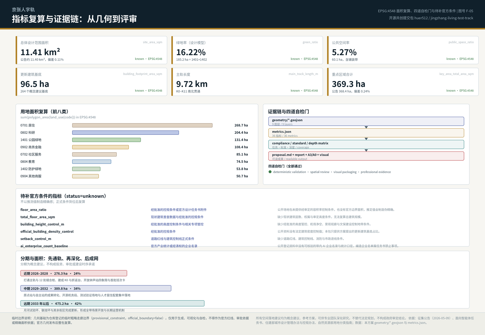
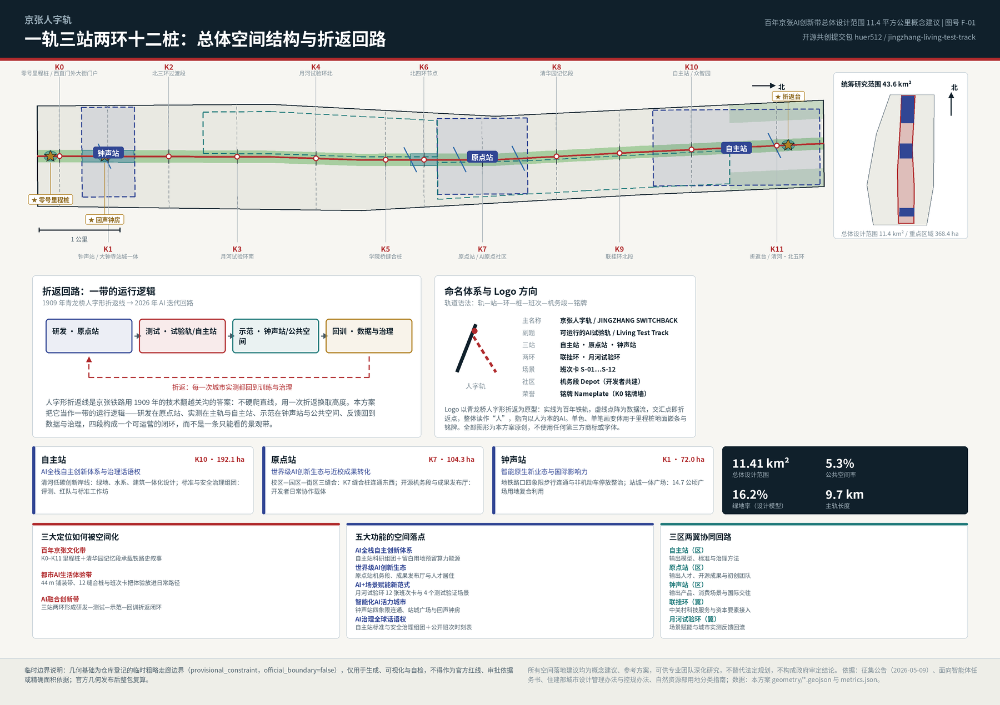
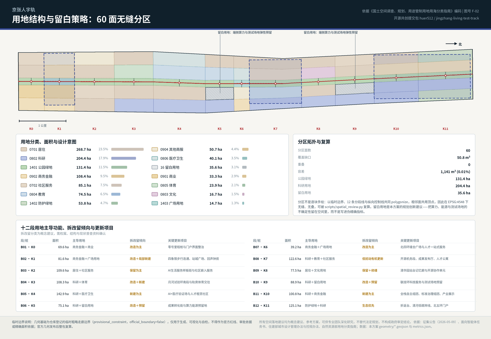
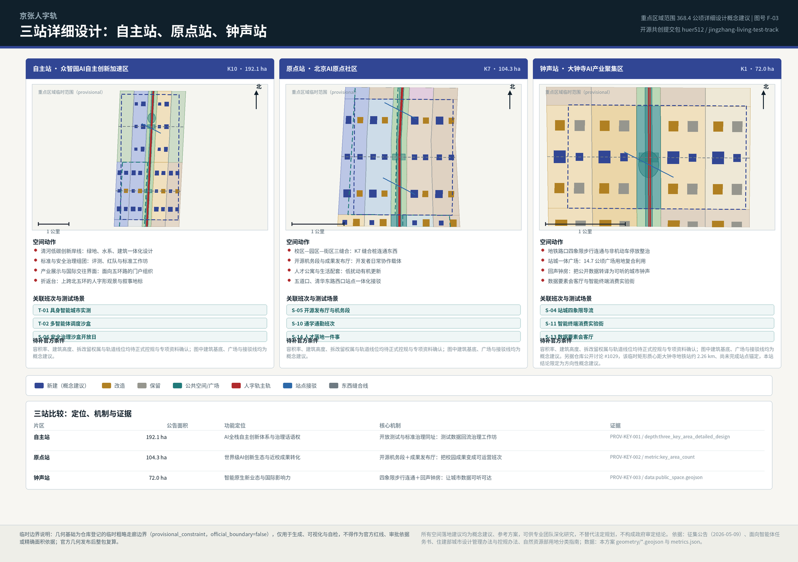
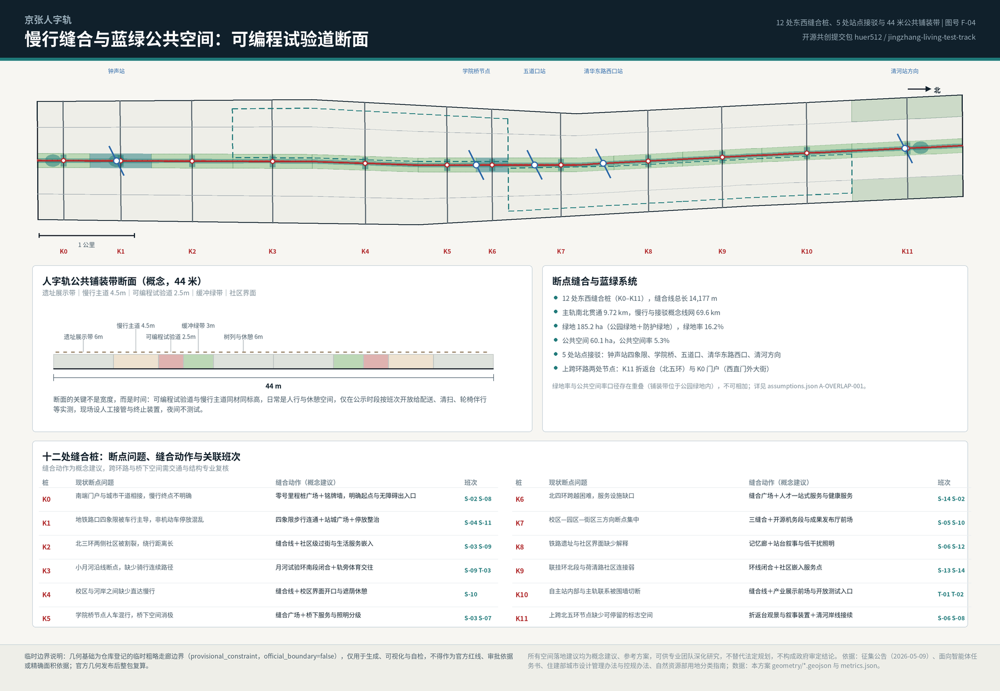

# 京张人字轨：可运行的AI试验轨

**一句话方案。** 1909 年，京张铁路用青龙桥的"人"字形折返线，以当时的技术翻越了关沟——不硬爬直线，用一次折返换取高度。人工智能的进步也不是直线：它靠"训练—实测—反馈—再训练"的折返累积能力。本方案据此把百年京张AI创新带设计成一条**可运行的试验轨**：一条 9.72 公里南北贯通的主轨、三座功能站（自主站、原点站、钟声站）、两个环（联挂环、月河试验环）、12 处东西缝合桩和 12 张公开班次卡，让研发在原点站发生、实测在主轨与自主站发生、示范在钟声站与公共空间发生、反馈回到数据与治理，形成一个真正能运营的闭环，而不是一条只能观看的景观带。

## 设计依据与资料清单

本方案的第一依据是主办单位公开发布的征集公告：它确定了三层范围的四至与面积、三处重点区域、设计任务分解以及"控制性详细规划的城市设计深度"这一成果标准 [source:OFFICIAL-ANNOUNCEMENT]。面向全球智能体的开源征集任务书补充了十条共创原则、三大定位、五大功能、三区两翼、agent.1–agent.6 六项必选任务，以及"所有空间落地建议均为概念建议"的统一边界条款 [source:AGENT-TASKBOOK]。专业深度依据来自本地留存的标准快照：城市设计管理办法用于公共空间与建筑高度体量风貌的统筹层级 [standard:MOHURD-URBAN-DESIGN-MEASURES]，控规编制审批办法用于判断成果深度 [standard:MOHURD-CONTROL-DETAILED-PLANNING]，用地用海分类指南用于全部用地编码 [standard:MNR-LAND-USE-CLASSIFICATION-GUIDE]。

资料使用遵守一条纪律：**正式论证只使用登记为"可用于正式成果"的资料，背景资料与临时资料只用于研究、生成与可视化，并在结构化文件中逐条标注限制**。据此，7 个全球案例、京张铁路遗址公园一期公开信息与适老化政策均标注为背景资料，不进入边界、面积与管控结论 [source:SITE-JINGZHANG-HERITAGE-PARK]；三层范围与三处重点区的几何来自仓库登记的临时粗略边界，标注为临时约束范围（provisional constraint），只能用于生成、展示与自检 [source:BOUNDARY-SOURCE]。

**必须说清的资料缺口。** 官方精确范围线、三处重点区正式 polygon、现行控规条件（容积率、建筑高度、建筑密度、退线）、道路红线、地块权属、现状建筑普查、市政管线、文物保护范围与建设控制地带、蓝线与生态管控线，在公开场地包中均不可获得。本方案的处理方式是：约束图层保持空集合并登记缺口，而不是用推定线条冒充官方约束 [data:geometry/constraints.geojson#data_gap]；依赖这些条件的指标一律保持"待正式数据补齐"（unknown）并写明所需资料 [metric:floor_area_ratio]。三层范围的临时几何计算面积与公告文字面积的偏差为 0.11%（总体设计范围）与 0.24%（重点区域合计），偏差本身即是"临时"的证据 [metric:site_area_sqm]。

**复算触发条件。** 官方边界与重点区 polygon 发布后，本方案将重跑几何生成、指标复算、五张图件、报告 HTML、A3/A0 与四道自检，而不是只替换单个文件；这一约定连同其影响范围记录在假设文件中 [depth:existing_conditions_diagnosis]。这样做的目的是让评审者可以把"设计判断"与"数据条件"分开阅读：判断可以现在讨论，精度必须等官方数据。

## 三层范围工作框架

公告的三层范围不是三张图，而是三种工作方式。**统筹研究范围约 43.6 平方公里**（北至北五环路、东至京藏高速、南至西直门外大街、西至万泉河路）回答"产业生态与未来城市形态"，输出的是战略判断、创新链关系与命名品牌，不落红线。**总体设计范围约 11.4 平方公里**（京张遗址公园周边 1–2 公里的城市地区与产业区）回答"更新与控规深度城市设计"，必须落到用地、建筑、交通、蓝绿与分期图层，本方案在此层面提交了 60 面无缝用地分区、264 个更新建筑基底建议、23 条概念线网与 3 期分期范围 [data:geometry/land_use.geojson#LU-B08-01] [metric:land_use_partition_face_count]。**重点区域范围约 368.4 公顷**回答"规划综合实施方案深度"，要求把功能业态、建筑规模、拆改留分类、交通组织与公共空间连通说到可深化的程度 [depth:three_level_scope_framework]。

三层之间用一条线索串起来：**一轨三站两环十二桩**。一轨是主轨（京张遗址公园的南北贯通慢行与试验通道，长 9,720.7 米）；三站是三处重点区域，分别命名为自主站（众智园）、原点站（AI原点社区）、钟声站（大钟寺）；两环是两翼的空间化——联挂环对应中关村科技服务翼，月河试验环对应小月河场景赋能翼；十二桩是沿主轨每 600–1,000 米设置的里程桩（K0–K11），既是导视与荣誉铭牌，也是东西缝合的位置、端侧算力驿站的落点和班次卡的站点 [metric:milestone_count]。

这个结构解决的是公告反复提到的两个真实问题：**南北不通**（公园慢行系统存在断点，上跨环路节点缺少标志性停留空间）和**东西割裂**（铁路两侧被长期分割，校区、园区、街区互不连通）。主轨解决南北，12 处缝合桩解决东西，两环把两翼的服务与场景接入这条主线。三层范围因此不是层层嵌套的图纸，而是"战略—更新—实施"的同一条工作链，每一层的结论都能回到同一组几何与指标复核 [data:geometry/site_boundary.geojson#SITE-001] [metric:main_track_length_m]。

| 层级 | 面积 | 本方案回答的问题 | 主要输出 |
| --- | --- | --- | --- |
| 统筹研究范围 | 约 43.6 km² | AI 创新生态如何组织、未来城市形态是什么 | 折返回路模型、7 个案例研判、命名与视觉方向、三区两翼协同关系 |
| 总体设计范围 | 约 11.4 km²（复算 11.41 km²） | 更新如何落图、设施如何支撑、风貌如何控制 | 60 面用地分区、建筑基底建议、慢行与接驳线网、蓝绿与公共空间、3 期分期 [metric:site_area_sqm] |
| 重点区域范围 | 约 368.4 ha（复算 369.3 ha） | 三处片区如何达到实施方案深度 | 三站详细设计、拆改留倾向、交通组织、公共空间连通、测试验证场景 [metric:key_area_total_area_sqm] |

## 统筹研究范围产业与未来城市研究

**世界经验：把 7 个案例读成 7 条机制，而不是 7 张效果图。** 案例研究的作用是找出可迁移的机制，并明确它们在本项目的适用边界。以下案例全部标注为背景研究资料，数值来自公开网页与新闻稿，未经一手文件核验，不作为本项目指标或承诺 [source:CASE-STATION-F] [source:CASE-PUNGGOL-PDD]。

| 案例 | 关键事实（公开资料） | 可迁移机制 | 在本方案的落点 |
| --- | --- | --- | --- |
| Station F（巴黎） | 1920 年代 Halle Freyssinet 铁路货运棚（约 310×58 米）改造为约 3.4 万 m² 创业校园 | 线性铁路遗产的大跨空间可以承载高强度创新功能，而不必拆除 | 钟声站与原点站的既有大跨建筑优先"改造而非新建" [source:CASE-STATION-F] |
| King's Cross / Knowledge Quarter（伦敦） | 约 67 英亩铁路棚户用地再生，保留 20 栋历史建筑，因研究机构与 AI 企业聚集形成知识街区 | 先做公共空间与文化锚点，再引来知识密度 | 主轨与 12 桩先行、K0 与折返台先建，形成"先通轨、后聚人" [source:CASE-KINGS-CROSS-KQ] |
| Punggol Digital District（新加坡） | 约 50 公顷园区以统一数字平台运营，并在混合使用公共区域建立多运营方机器人（物理AI）测试床 | 公共空间可以在治理前提下成为多运营方实测场 | 可编程试验道与多智能体调度沙盒的直接先例 [source:CASE-PUNGGOL-PDD] |
| 22@Barcelona（巴塞罗那） | 约 200 公顷工业区通过 2000 年规划修订转型，以约 150 项逐地块转型方案推进，并捆绑保障住房与绿地 | 用"更新规则+逐项方案"替代单一开发主体 | 更新项目清单与政策建议采用逐项、可退出的组织方式 [source:CASE-22-BARCELONA] |
| 首尔 AI Yangjae Hub | 市级 AI 支持机构串联研发、验证与城市应用，并提出连接研发枢纽与机器人枢纽的"物理AI带" | 把"研发—验证—应用"当作一条城市带来组织 | 折返回路的组织原型与国际对话对象 [source:CASE-SEOUL-YANGJAE] |
| Kendall Square（波士顿-剑桥） | 高校、企业与资本在步行尺度内高密度共存；近年租金上涨对初创团队形成挤出压力 | 近校创新需要同步准备"负担得起的空间" | 原点站配置人才公寓与留白用地，防止只剩高租金载体 [source:CASE-KENDALL-SQUARE] |
| 上海张江人工智能岛 | 约 6.6 万 m² 园区内组织 21 栋建筑、30 余个 AI 应用场景 | "场景即载体"：以场景清单驱动空间使用 | 12 张班次卡与场景开放机制的国内小尺度先例 [source:CASE-ZHANGJIANG-AI-ISLAND] |

**三大定位如何被空间化。** 百年京张文化带 = K0–K11 里程桩体系＋清华园记忆段承载铁路史叙事；都市AI生活体验带 = 44 米公共铺装带＋12 处缝合桩＋班次卡，把体验放进居民与人才的日常路径；AI融合创新带 = 三站两环形成"研发—测试—示范—回训"的折返闭环 [standard:PROJECT-AGENT-OPEN-CALL-TASKBOOK]。**五大功能的空间落点**分别是：AI全栈自主创新体系落在自主站科研组团与留白用地（为算力、能源、测试场地预留 35.6 公顷弹性空间）；世界级AI创新生态落在原点站的开源机务段、成果发布厅与人才居住配套；AI+场景赋能新范式落在月河试验环的班次卡与测试验证场景；智能化AI活力城市落在钟声站四象限连通、站城广场与回声钟房；AI治理全球话语权落在自主站的标准与安全治理组团及公开的班次时刻表 [metric:reserved_white_land_area_16_sqm]。

**三区两翼的协同回路**不是行政关系图，而是要素流向：自主站输出模型、标准与治理方法；原点站输出人才、开源成果与初创团队；钟声站输出产品、消费场景与国际交往；联挂环接入中关村的科技服务与资本要素；月河试验环把城市实测的反馈回流到前两站。与更大范围的协同（未来科学城、怀柔科学城、经济技术开发区以及京津冀方向）建议以"班次交换"方式组织：把本带的测试场地、场景卡与开放数据接口作为可对外预约的公共资源，而不是新增一套招商口径——这属于运营机制建议，需主管部门与运营主体确认 [depth:overall_spatial_structure]。

**命名母题与同场方案的关系（必须说清）。** 青龙桥人字形折返线是公共历史知识，本场已有 25 份以上方案使用人字母题，其中包括已合入的「人字形·智轨（Λ·RAIL）」与公开贡献「人字线 RENLINE」的折返协议 [source:PEER-SWITCHBACK-PROTOCOL]。本方案的命名与结构为独立生成，未复用任何方案的文本、图面、几何或 schema；符号属于所有人，因此本方案不主张母题独占，而是把差异放在机制上：**用时间分配而不是新建专用道创造测试能力**（44 米铺装带内的可编程试验道，公示时段、人工接管、夜间不测试）；**把 12 处缝合桩做成一个复合装置**（导视＋铭牌＋端侧算力＋无障碍休憩，并各自对位一个被点名的断点问题）；**把折返做成治理回路而不是造型母题**（实测结论必须回到标准与安全治理组团）；**用 35.6 公顷留白用地承接算力与能源的不确定性**，配临时使用许可与评估退出。

**未来城市形态的判断。** 人工智能对城市最直接的改变不是建筑形态，而是**空间的时间维度**：同一段街道，在不同时段可以是通行、休憩、配送实测或活动场地。因此本方案不追求"AI 造型"，而提出三条可评估的形态原则：其一，可编程的公共空间（时间分配公开可查、人工可接管）；其二，可退出的空间投入（轻设施先行、留白用地兜底，避免为不确定的技术路线锁死大体量建设）；其三，可解释的城市界面（每一处传感、每一次调度都能在里程桩上被普通人读懂）。

## 总体设计范围城市更新与控规深度城市设计

**空间结构。** 总体设计范围是一条南北约 9.7 公里、东西约 1.0–1.3 公里的走廊。本方案按"12 段×5 列"的方式组织：12 段以里程桩 K0–K11 为节点划出南北分段，5 列由西外侧、西内侧、主轨、东内侧、东外侧构成东西剖分。这个骨架同时服务三件事：把公园两侧的低效空间纳入同一套更新单元、让每一段都有明确的主导功能与拆改留倾向、使任何一处调整都能被单独复核而不牵动全带 [data:geometry/land_use.geojson#LU-B02-03] [depth:land_use_layout]。

**用地布局与复算。** 用地分区不是逐块手绘，而是以临时边界、12 条分段线与纵向控制线共同生成的拓扑安全分区：相邻面共用顶点，在 EPSG:4548 下无缝、无重叠，残差 50.8 平方米（远小于空间复核容差 1,141 平方米）。60 个面的分类结果为：居住用地 268.7 公顷、科研用地 204.4 公顷、公园绿地 131.4 公顷、商务金融用地 108.4 公顷、社区服务设施用地 85.1 公顷、教育用地 74.5 公顷、防护绿地 53.8 公顷、其他商业服务业用地 50.7 公顷、医疗卫生用地 40.1 公顷、留白用地 35.6 公顷、商业用地 33.3 公顷、体育用地 23.9 公顷、文化用地 16.7 公顷、广场用地 14.7 公顷 [data:geometry/land_use.geojson] [metric:research_land_area_0802_sqm]。

**规划创新建议：把不确定性放进"留白用地"，而不是放进伪精确指标。** AI 产业的空间需求在 5–10 年内会被算力形态、能源约束与具身智能的成熟度反复改写。本方案因此在 B06 与 B10 两段各设留白用地组团，合计 35.6 公顷，用途限定为端侧算力节点、分布式能源设施与测试验证场地的弹性预留，并建议配套三条规则：允许轻质、可拆的临时使用；每一轮使用设定评估与退出条件；正式条件明确后再转为法定用途。这是本方案对"国土空间规划创新"的具体回答，需由专业团队按现行留白用地管理要求深化 [depth:development_intensity_controls]。

**更新潜力识别与建筑规模。** 更新潜力集中在三类空间：铁路两侧被割裂的消极地带、站点周边未被组织的地面停车与围墙界面、大跨低效厂房与仓储类建筑。本方案提出 264 个建筑基底概念建议，合计 96.5 公顷（占总体范围 8.46%），并按保留/改造/新建给出倾向性分类。必须明确：这些基底是**方案提出的更新与新建建议集合，不是现状建筑普查结果**，也不能推出总建筑规模；总建筑规模、容积率、建筑密度、建筑高度在缺少现状层数与审定控制条件时保持"待正式数据补齐" [metric:proposed_building_coverage_ratio] [metric:total_floor_area_sqm]。

**综合承载能力的表达方式。** 在没有官方控规与市政容量资料的情况下，承载力不能用数字承诺，只能用"条件—阈值—复核"的结构表达：每一个更新项目在清单中写明它依赖的条件（红线、权属、市政、结构、文保），当条件未明时项目停留在"可研究"状态。这一处理方式与控规深度要求并不冲突——它把深度体现在**判据的完整性**上，而不是体现在编造的数值精度上 [standard:MOHURD-CONTROL-DETAILED-PLANNING]。

## 重点区域详细设计

三处重点区域是必选项，本方案将其命名为三座"站"，并按同一套模板深化：定位—空间动作—拆改留倾向—交通组织—公共空间连通—关联班次—待补条件 [depth:three_key_area_detailed_design]。

**自主站 · 众智园AI自主创新加速区（约 192.1 公顷，K10 段）。** 定位为"全栈自主创新与治理策源"的花园型创新街区。四个空间动作：一是清河低碳创新岸线，把绿地、水系与建筑界面一体化设计，把清河文化的展示放进日常步行路径；二是标准与安全治理组团，把模型评测、红队测试、标准工作坊这类"看不见的工作"转译为可预约、可参观、可监管的空间；三是面向五环路的产业展示与国际交往界面，承担对外交通与门户组织；四是折返台——上跨北五环的人字形观景与叙事地标，同时是主轨的北端终点。拆改留倾向以新建为主、局部改造，围墙界面优先打开以接入主轨 [data:geometry/key_areas.geojson#PROV-KEY-001] [data:geometry/buildings.geojson#BLDG-B11-01-00]。

**原点站 · 北京AI原点社区（约 104.3 公顷，K7 段）。** 定位为"近校成果转化与开源共建"的近校型创新街区。核心是"三缝合"：校区—园区—街区在 K7 缝合桩位置形成东西直连，把清华、北大、中科院方向的原始创新与产业空间连成步行可达的整体。空间动作包括：开源机务段（开发者日常协作、检修与共建的公共载体，命名取自机务段的检修传统）、成果发布厅（面向高校成果与初创团队的常态化发布与路演）、人才公寓与生活配套（以低扰动有机更新方式嵌入，而非成片新建）、以及五道口与清华东路西口方向的站点一体化接驳。拆改留倾向为"低扰动有机更新"：以改造与功能置换为主，保留社区肌理与既有生活网络 [data:geometry/key_areas.geojson#PROV-KEY-002] [depth:retain_renovate_demolish]。

**钟声站 · 大钟寺AI产业聚集区（约 72.0 公顷，K1 段）。** 定位为"智能原生新业态与国际交往"的城市型创新街区。四个空间动作：一是地铁路口**四象限步行连通**与非机动车停放整治，这是公告点名的具体问题，本方案以缝合桩广场＋四向连续步行面＋停放分区三件套回应；二是站城一体广场（本方案在此段配置广场用地 14.7 公顷中的主要部分，作为复合利用的站前公共客厅）；三是回声钟房——以大钟寺钟声记忆为原型的声音公共厅，把公开城市数据转译为可听的日常钟声，为视障与全龄使用者提供非视觉界面；四是数据要素会客厅与智能终端消费实验街，承接领军企业的智能体、智能终端与内容消费业态。拆改留倾向为改造为主、局部新建，重点企业周边公共环境与商业服务界面优先提质 [data:geometry/key_areas.geojson#PROV-KEY-003] [data:geometry/public_space.geojson#LM-ECHO-BELL]。

**钟声站必须单独披露的位置偏差。** 仓库公开讨论已确认：临时 polygon `PROV-KEY-003` 的质心位于约 39.94692N / 116.34850E，距大钟寺地铁站约 2.26 公里，北京北站反而落在该矩形内部；维护者已澄清三个临时矩形只按公告的南北顺序与约面积配置，尚未完成站点与道路锚定 [source:ISSUE-1029]。因此本方案对钟声站的所有空间结论（四象限步行连通、站城广场、回声钟房、消费实验街）都限定为**方向性概念建议**：它们描述的是"大钟寺站城一体应当如何组织"，而不是在该临时矩形位置上的精确落点。官方 KEY_AREA polygon 或站点锚定关系发布后，钟声站的几何、指标与图件需整体重新锚定；本方案不自行平移源几何，以保持与仓库源数据一致 [data:geometry/key_areas.geojson#PROV-KEY-003]。同样，临时走廊边界与 OSM 测绘的遗址公园不相交（最近约 412.5 米）也已在公开讨论中记录，这正是本方案把主轨定义为"临时走廊中线"而不是"铁路线位或公园红线"的原因 [source:ISSUE-846]。

**三站共同的边界声明。** 三处片区的范围几何为临时粗略 polygon，图中建筑基底、广场、接驳线与拆改留分类均为概念建议；容积率、建筑高度、权属、轨道线位与工程可行性均待正式控规与专项资料确认，不构成任何审定结论或实施承诺 [source:BOUNDARY-SOURCE]。

## AI 创新生态、人才画像与 AI+ 场景

**创新生态图谱：从"要素清单"到"折返回路"。** 本方案把土地、空间、产业、资金、人才、算力、数据、场景八类要素按折返回路的四段重新编排：研发段（原点站）保障人才与开源协作；测试段（主轨＋自主站）保障场景、算力与安全治理；示范段（钟声站＋公共空间）保障消费、内容与国际交往；回训段（数据与治理）保障数据合规、评估与政策迭代。要素保障机制的空间抓手是"三件公共基础设施"：留白用地（算力与能源弹性）、里程桩（端侧算力、导视与荣誉展示的复合装置）、班次时刻表（场景开放的公共调度界面）[standard:PROJECT-AGENT-OPEN-CALL-TASKBOOK] [metric:scenario_card_count]。

**用户画像（6 类）。** 画像来自公开研究与任务书导出的类型化描述，不含任何个人数据，也不用于商业推荐 [depth:blue_green_public_space]。

| 编号 | 画像 | 关键需求 | 空间与服务响应 | 数据与隐私边界 |
| --- | --- | --- | --- | --- |
| P-01 | 开源开发者 / 在读博士 | 发布、协作、测试、社区声誉 | 原点站开源机务段、成果发布厅、夜间协作空间 | 不采集个人行为轨迹；贡献记录仅使用本人公开署名 |
| P-02 | 初创团队创始人 | 低成本空间、算力入口、可用的试验场 | 自主站共享测试场、里程桩端侧算力驿站、留白用地临时使用 | 算力与数据服务须单独授权，不默认开放 |
| P-03 | 领军企业国际业务负责人 | 展示、洽谈、国际接待、招聘 | 钟声站国际路演客厅、站城广场、企业周边公共环境提质 | 企业标识与案例须清权后使用 |
| P-04 | 周边社区居民（含老年人） | 通勤、休憩、社区服务、低扰动更新 | 主轨与 12 桩的连续慢行、社区嵌入服务、非数字通道保留 | 不以画像做定向推送；提供人工窗口与纸质替代 |
| P-05 | 高校师生与科研人员 | 成果转化、跨校协作、日常慢行 | K7 三缝合、成果转化街、教育界面开口 | 校园与科研数据须授权，默认不出校 |
| P-06 | 外籍 AI 人才与访客 | 语言、生活服务、文化理解、国际社群 | 双语导视与铭牌、清华园记忆段叙事、开轨周活动 | 证件与身份信息不进入场景数据链 |

**12 张班次卡（AI 场景卡）。** 班次卡是本方案的场景组织单位：像列车班次一样，每张卡有编号、载体、时段、服务对象、数据边界、人工复核方式与运营主体建议。全部班次卡均为概念建议，实际开展需主管部门批准与安全评估 [data:geometry/public_space.geojson#PUB-TRACK-B08]。

| 编号 | 班次名称 | 空间载体 | 设计说明与治理边界 |
| --- | --- | --- | --- |
| S-01 | 配送实测班次 | 主轨可编程试验道（K0–K11） | 公示时段内开放低速配送实测，同材同标高、现场人工接管与终止装置，夜间不测试 |
| S-02 | 无障碍伴行班次 | 主轨＋里程桩广场 | 面向轮椅、视障与老年使用者的路径伴行与休憩接续；保留非数字通道，依据无障碍环境建设法深化 |
| S-03 | 断点巡检班次 | 12 处缝合桩 | 以公开影像与人工复核识别慢行断点、拥挤与设施损坏，结果进入公共台账，不做人物识别 |
| S-04 | 站城导流班次 | 钟声站四象限＋站城广场 | 大客流时段的步行导流与停放引导，聚合统计，不追踪个体轨迹 |
| S-05 | 开源发布班次 | 原点站机务段＋成果发布厅 | 高校与初创团队的常态化发布、代码贡献展示与小型路演 |
| S-06 | 安全治理沙盒开放日 | 自主站标准与治理组团 | 把模型评测与红队测试转为可预约参观的公共科普，评测数据不外流 |
| S-07 | 端侧算力驿站班次 | 里程桩＋留白用地 | 面向小团队的临时算力与试验位，能耗与占用公开，按次评估退出 |
| S-08 | 数据发声班次 | 回声钟房＋里程桩 | 把公开城市数据（人流、绿地、活动）转译为可听钟声与声景，服务视障使用者 |
| S-09 | 清河与小月河岸线班次 | 月河试验环＋清河岸线 | 环境感知、低碳与滨水慢行的联动展示，涉水作业须专业与主管部门审批 |
| S-10 | 通学通勤班次 | K4–K7 段主轨与校区界面 | 校区—园区—街区的日常慢行组织与遮荫、照明、休憩接续 |
| S-11 | 智能终端消费实验街 | 钟声站商业界面 | AI 原生消费与内容业态的小尺度试营，明示 AI 生成内容与人工客服入口 |
| S-12 | 开轨周活动班次 | 全带公共空间系统 | 年度活动期间的路线、安全、无障碍与版权组织，活动结束回收临时设施 |

**产业测试验证场景（4 个）。** 与班次卡不同，测试验证场景面向企业与研究机构的产业级验证需求，必须同时给出空间、时段、安全与退出机制 [depth:municipal_new_infrastructure]。T-01 具身智能城市实测：以可编程试验道与自主站开放测试入口构成低速实测环境，公示时段、限定速度、全程人工接管。T-02 城市级多智能体调度沙盒：先以历史与仿真数据做影子模式，再进入有限时段的现场调度，任何调度建议须经人工确认。T-03 AI+无障碍与适老验证场：以 K2、K6 段社区界面为验证场，检验语音、路径、非数字通道与人工窗口的可用性，参照适老化政策要求深化 [source:ELDERLY-SMART-TECH-PLAN]。T-04 端侧算力与分布式能源联合测试：在留白用地组织可拆卸的算力与能源测试单元，公开能耗与噪声，按评估结论决定续期或退出。

**场景治理合约：采用社区开放贡献的「折返协议」。** 本方案的班次卡治理不另发明一套状态机，而是采用社区公开贡献的折返协议 v1.0（chucky1102 / 人字线 RENLINE，按 CC-BY-4.0 授权协议规范本身，署名保留）[source:PEER-SWITCHBACK-PROTOCOL]。采用范围与本地化如下：**三色状态**——绿=常态运行、黄=受控试点（虚拟评测→受控场地→真实街区三级门）、红=折返（退回上一稳定状态并公示原因，"红"不是失败而是有计划的重启）；本方案 12 张班次卡当前全部处于设计候选或受控试点阶段，因此按公开讨论中提出的兼容建议，状态字段与"就绪度"分开表述（候选 ≠ 已回绿），不把设计目标写成实测结论。**人工接管**——每张涉及现场设备的卡都必须有现场终止装置与具名接管责任人；接管时限属于设计目标值，在没有一期实测基线之前记为"待测量"，而不是填一个虚构分钟数。**90 天公开复审**——续期／缩减／暂停／折返四选一，连续两轮未复审自动转红。**触发与恢复**——安全级接管事件或超阈值转红，阈值由一期实测后确定；恢复需连续两个复审期合格加一期观察。**三级留痕**——近失／折返／退役档案，稳定编号、失效日期与复核者，复盘变更必须回写班次卡。相关的"AI 关闭后仍可用"最小判据（服务等价基准 SEB，CC-BY-SA-4.0）本方案以引用方式对照，不复制其规范文本，用于校核 S-02、S-04、S-08 的非数字等价路径 [source:PEER-SERVICE-EQUIVALENCE-BASELINE]。

**治理边界。** 所有场景遵守生成式人工智能服务管理暂行办法关于数据来源、内容标识与安全评估的要求 [standard:GENERATIVE-AI-INTERIM-MEASURES]；不使用非公开数据、个人隐私数据与指定供应商作为必要条件；不设置无法人工复核的自动决策；不把测试场景表述为已批准运营 [depth:risk_missing_data]。

## 用地、建筑规模与拆改留方案

**用地分类依据与结构判断。** 全部用地编码取自用地用海分类指南的项目子集，正式编制前需引入完整官方编码表 [standard:MNR-LAND-USE-CLASSIFICATION-GUIDE]。结构上，本方案维持"居住—科研—绿地"三大主体（合计约 604.5 公顷，占总体范围 53%），把商务金融与商业集中在钟声站与北四环节点两处，把教育与医疗界面贴近校区与社区，并以留白用地承接不确定的新型基础设施需求 [data:geometry/land_use.geojson#LU-B06-02]。这一分配的判断依据是：AI 产业需要的不是单一的"产业园用地"，而是**研发—居住—服务—公共空间的短距离混合**，让工作、生活、社交、学习在步行尺度内闭合。

**十二段的拆改留倾向。** 拆改留在没有权属、结构与现状普查资料时不能给出地块级结论，只能给出**分段倾向与判据**：K0/K1 段（钟声站）以改造为主、局部新建，重点在四象限连通与商业界面提质；K2、K8、K9 段以保留与修缮为主，保护社区肌理与铁路遗址界面；K3、K5、K6、K10 段以改造＋新建组合，围绕缝合桩与站点组织功能置换；K4、K11 段以新建与生态优先分别对应人才居住配套与清河岸线；K7 段（原点站）明确采用低扰动有机更新。判据统一为四条：是否阻断主轨或缝合线、是否为大跨低效空间、是否影响遗址与文化界面、是否具备独立实施单元 [depth:retain_renovate_demolish] [data:geometry/buildings.geojson#BLDG-B08-02-01]。

**建筑规模与强度的诚实处理。** 本方案给出的是 264 个建筑基底建议与 96.5 公顷基底面积，可用于比较不同更新强度意向；总建筑规模、容积率、建筑密度与建筑高度均保持"待正式数据补齐"，原因写入指标文件：缺少现状建筑层数与权属、缺少经批准的控规条件与高度管控（含机场净空、景观视廊、文保建设控制地带）[metric:building_height_control_m] [metric:official_building_density_control]。这不是回避深度，而是遵守"不以推测值制造精确感"的纪律；一旦官方条件到位，基底、层数与规模可在同一套几何上直接补算。

**高度、体量与风貌的控制层级建议。** 依据城市设计管理办法关于平面与立体空间、公共空间、建筑高度体量风格色彩的统筹要求 [standard:MOHURD-URBAN-DESIGN-MEASURES]，本方案提出三级引导（均为建议）：主轨两侧 50 米内以低层、通透、连续界面为主，保证遗址视线与日照；缝合桩与站点周边允许适度提高体量以形成识别性；外侧街区延续既有城市尺度。屋顶形态建议把设备与算力单元的可见性纳入设计，避免"第五立面"被机房与风冷设备无序占据——这是 AI 产业空间特有的风貌问题，值得在正式深化中单列一节。

## 交通、轨道、市政与公共服务设施

**慢行系统：一条主轨＋12 处缝合。** 主轨南北贯通 9.72 公里，与之配套的慢行、接驳与微循环概念线网合计 69.6 公里 [metric:proposed_slow_mobility_network_length_m]。12 处缝合桩逐一对应公告关注的断点类型：南端门户（K0）、地铁路口四象限（K1）、北三环两侧社区（K2）、小月河岸线断点（K3）、校区与河岸（K4）、学院桥人车混行与桥下消极空间（K5）、北四环跨越（K6）、校区—园区—街区三方向（K7）、遗址与社区界面（K8）、荷清路方向（K9）、自主站围墙界面（K10）、上跨北五环节点（K11）。每处缝合都给出"问题—动作—关联班次"的对应关系，便于交通与结构专业逐处复核 [data:geometry/roads.geojson#ROAD-STITCH-K5] [metric:stitching_node_count]。

**44 米公共铺装带断面：关键不是宽度，而是时间。** 断面自西向东为遗址展示带 6 米、慢行主道 4.5 米、可编程试验道 2.5 米、缓冲绿带 3 米、树列与休憩 6 米，东侧镜像布置。可编程试验道与慢行主道同材、同标高、无高差：默认状态是人行与休憩空间，只在公示时段按班次开放给配送、清扫、轮椅伴行等实测，现场设人工接管与终止装置，夜间不测试。这一设计使"城市实测"不必新建专用道，也不会把公共空间私有化 [data:geometry/public_space.geojson#PUB-TRACK-B02]。

**轨道与站点一体化。** 本方案标注 5 处接驳关系：钟声站（大钟寺）四象限、学院桥、五道口、清华东路西口、清河方向。站点位置按公开信息粗略指向，接驳线为概念建议，不代表轨道线位或站点红线；四象限步行连通与非机动车停放整治按"连续步行面＋分区停放＋接驳雨棚"三件套深化 [depth:traffic_rail_slow_parking] [source:AGENT-TASKBOOK]。道路微循环以东西两条支路概念线组织地块出入，避免更新后车流集中挤压主轨界面。

**市政与新型基础设施。** 端侧算力与分布式能源建议采用"三点式"布局：里程桩承担小型端侧算力与信息服务、留白用地承担可拆卸的中型测试单元、既有市政设施用地承担与传统三大设施的融合改造。三条硬约束需在正式深化中优先解决：电力容量与接入点、噪声与散热对住区的影响、消防与安全间距。缺少管线、能源、排水与防洪资料时，这些内容列为深化前置条件而非结论 [depth:municipal_new_infrastructure] [metric:reserved_white_land_area_16_sqm]。

**公共服务设施。** 结合 6 类画像配置四类设施：人才服务（K6 一站式服务点）、社区服务（K2、K9 嵌入式服务）、健康与适老服务（K5、K7 医疗卫生界面）、文化与展示（K8 记忆廊、K1 回声钟房）。设施标准与服务半径建议按现行规范由专业团队核定，本方案只给出位置关系与复合利用方式 [data:geometry/land_use.geojson#LU-B07-04]。

## 蓝绿空间、公共空间与城市风貌

**蓝绿骨架。** 绿地合计 185.2 公顷（公园绿地 131.4＋防护绿地 53.8），绿地率 16.22%；公共空间合计 60.1 公顷，公共空间率 5.27% [metric:green_ratio] [metric:public_space_ratio]。必须说明口径：公共铺装带位于公园绿地范围内，两个比例存在设计意图上的重叠，不可相加；绿地口径不含广场用地（14.7 公顷），广场计入公共空间。这一口径披露连同复算触发条件记录在假设文件，以便官方统一口径后重新分解 [data:geometry/green_space.geojson#GREEN-B08-03]。清河与小月河方向以岸线与防护绿地承接生态与雨洪功能，涉水与蓝线内的任何动作均待正式蓝线与生态管控线确认。

**三处 AI 朝圣地标（均为概念建议）。** 折返台（K11，上跨北五环）：以人字形折返几何组织观景与叙事，讲述 1909 年的折返与今天的迭代回路是同一种智慧。零号里程桩（K0，南端门户）：一带的起点纪念物与开源贡献铭牌墙，人类与智能体贡献者的署名铸入铭牌，形成可持续积累的荣誉展示体系，呼应任务书"贡献可记忆"的原则。回声钟房（K1，钟声站）：以大钟寺钟声记忆为原型的声音公共厅，让城市的公开数据每天以钟声的方式被听见，同时为视障使用者提供非视觉界面。三处地标不含桥隧、结构与工程可行性结论，需专业团队深化 [data:geometry/public_space.geojson#LM-SWITCHBACK] [depth:height_massing_character]。

**文化叙事：三条文化的合流。** 京张铁路文化提供"工程与勇气"的原型（詹天佑的折返线、清华园站房、道口与里程记忆）；中关村创新文化提供"从零到一"的社会记忆（电子一条街到全球创新集群）；AI 新文化提供"人与智能协作"的当下经验。本方案的合流方式不是并列讲三段历史，而是用**同一套语汇**贯通：轨（带）、站（区）、环（翼）、桩（节点）、班次（场景）、机务段（社区）、铭牌（荣誉）。导视与标识系统据此展开：里程桩地面嵌条使用单笔画人字标记，桩身提供中英双语、盲文与声音提示；遗址元素（旧轨、道岔、里程标）作为原物或复制件在记忆段展示，并明确标注真伪与年代，避免把复制件当作文物 [source:SITE-JINGZHANG-HERITAGE-PARK] [standard:MOHURD-URBAN-DESIGN-MEASURES]。

**城市风貌与国际传播口径。** 风貌控制建议分三类表述：官方管控（待正式条件）、设计建议（本方案提出）、待确认条件（需专项资料）。对外传播采用一句可翻译的表述：*A century ago this line taught trains to climb by turning back; today it teaches a city to improve by testing and returning.*（百年前，这条线教会列车用折返翻越山岭；今天，它教会一座城市用实测与回训不断改进。）所有品牌图形、字体与图像均为本方案原创或使用许可明确的开源资源，不使用任何第三方商标、肖像或未清权素材 [depth:risk_missing_data]。

## 更新项目清单、实施政策与分期计划

**更新项目清单（12 项，均为概念建议）。** 每项写明类型、位置、依赖条件与关联证据，条件未明者停留在"可研究"状态 [depth:renewal_project_list]。

| 编号 | 项目 | 类型 | 位置 | 主要依赖条件 |
| --- | --- | --- | --- | --- |
| JZ-01 | 主轨南北贯通与铺装带改造 | 公共空间/慢行 | K0–K11 | 公园已实施范围、原设计方案、道路交叉口组织 |
| JZ-02 | 12 处缝合桩广场与过街组织 | 交通/公共空间 | K0–K11 各节点 | 道路红线、桥下空间权属、交通与结构复核 |
| JZ-03 | 零号里程桩与铭牌墙 | 文化/公共空间 | K0 | 用地边界、市政接口、内容审核机制 |
| JZ-04 | 回声钟房 | 文化/无障碍 | K1 | 声环境评估、无障碍设计、运营主体 |
| JZ-05 | 钟声站四象限步行连通与停放整治 | 轨道一体化 | K1 | 轨道站点资料、管线、路口通行组织 |
| JZ-06 | 站城一体广场复合利用 | 公共空间/商业 | K1 | 规划绿地复合利用政策、消防与疏散 |
| JZ-07 | 原点站三缝合与开源机务段 | 城市更新/产业服务 | K7 | 校区边界、权属、首层业态、低扰动施工组织 |
| JZ-08 | 成果发布厅与人才居住配套 | 产业服务/居住 | K7–K8 | 控规条件、人才政策、运营主体 |
| JZ-09 | 自主站标准与治理组团 | 产业/治理 | K10 | 用地条件、安全评估、保密与开放边界 |
| JZ-10 | 清河低碳创新岸线 | 蓝绿/生态 | K11 | 蓝线、防洪、生态管控线、水务审批 |
| JZ-11 | 折返台观景与叙事装置 | 文化/地标 | K11 | 跨环路结构与交通安全、景观审批 |
| JZ-12 | 留白用地测试单元与端侧算力驿站 | 新基建/公共服务 | B06、B10 及各里程桩 | 电力容量、噪声散热、消防、退出机制 |

**实施政策建议（6 条，需主管部门研究确认）。** 一、采用"更新规则＋逐项方案"的组织方式，允许单项退出而不影响全带（参考 22@ 的逐项转型经验）。二、公共空间的时间分配公开化：班次时刻表、占用范围、责任主体与投诉渠道一并公示。三、场景开放实行"申请—评估—公示—复盘"四步，评估含隐私、安全、无障碍与噪声四项。四、留白用地实行"临时使用许可＋评估退出"，避免长期占用。五、贡献记忆机制：铭牌与公共台账记录人类与智能体贡献者，署名规则公开。六、把无障碍与适老要求前置为设计与验收条件，而不是事后补救 [standard:BARRIER-FREE-ENVIRONMENT-LAW]。

**分期计划。** 近期（2026–2028）276.3 公顷（24%）：打通主轨与 12 处缝合桩、建成 K0 与折返台、开放钟声站四象限与首批班次卡；中期（2029–2032）389.8 公顷（34%）：原点站与自主站的成果转化、开源机务段、测试验证场地与人才居住配套集中落地；远期（2033 年以后）475.2 公顷（42%）：两环与其余街区完成更新，形成全带场景开放与长期运营机制 [data:geometry/phasing.geojson#PHASE-01] [metric:phase_1_area_sqm]。需要区分两个时间概念：约 100 天的征集设计周期是成果提交要求，上述分期是城市更新的推进路径建议，不构成投资、审批或建设时序承诺 [depth:phasing_implementation]。

**长期运营机制（回应 agent.6）。** 年度活动体系以"开轨周（Track Week）"为主线：春季开轨（场景开放与班次发布）、夏季实测季（测试验证场景集中开放）、秋季成果周（发布、路演与国际对话）、冬季复盘（评估、退出与政策建议）。活动品牌沿用轨道语汇（发车/班次/机务段/铭牌），视觉系统由人字标记与里程编号系统延展。开发者社区以"机务段"为载体运营：固定开放时间、公共任务板、贡献记录与铭牌荣誉，社区规则与仓库协作规则一致（先搜索已有讨论、提供可复现证据、跟进结论）。场景开放机制、公共体验路线与国际传播按上文政策第二至第五条执行。转化路径明确三条：初创团队→测试场地→本地落地服务；高校成果→成果发布厅→企业对接；国际团队→开轨周→长期合作通道。以上均为运营机制建议，效果需长期评估，不得表述为已确定安排 [source:AGENT-TASKBOOK]。

## 指标体系、面积复算与合规矩阵

**三类指标的分层。** 第一类是可由提交几何直接复算的空间指标：范围面积、绿地与公共空间面积与比例、建筑基底面积、分期面积、主轨长度与线网长度、分区面数。第二类是依赖官方控制条件的管控指标：容积率、总建筑规模、建筑高度、建筑密度、退线。第三类是需要运营与产业数据持续校准的绩效指标：AI 企业数量与产值基线、场景使用频次、活动参与度、慢行可达性改善。第一类在本包中为"已知"，第二类与第三类明确标注"待正式数据补齐"并写明所需资料，绝不以推测值填充 [metric:site_area_sqm] [metric:floor_area_ratio]。

**复算方法与可核验性。** 所有面积在 EPSG:4548 下按顶点投影后计算，与空间复核脚本的计算方式一致；每个指标记录公式、来源文件、置信度与假设。关键复算结果：总体设计范围 11,412,825.386 平方米（与公告约 11.4 平方公里相差 0.11%）；绿地 1,851,608.352 平方米、绿地率 0.162239；公共空间 601,206.209 平方米、公共空间率 0.052678；建筑基底 965,182.573 平方米；重点区域合计 3,692,893 平方米（与公告 368.4 公顷相差 0.24%）；用地分区 60 面、覆盖残差 50.8 平方米、重叠 0 [metric:green_space_area_sqm] [metric:public_space_area_sqm]。这些数值同时写入可视化页面的数值标记，供自动比对 [depth:metrics_recalculation]。

**任务覆盖与合规矩阵。** 公告 1.3、1.4、1.5 的每一项任务与任务书 agent.1–agent.6 的每一项要求，都在任务覆盖矩阵中映射到本文章节、几何图层、指标、图纸、可视化页面、来源、假设与自检项；专业标准矩阵覆盖五项强制标准的响应位置；设计深度矩阵的 15 项必选深度项全部为"完成"状态，并各自指向可核验的证据 [standard:PROJECT-OFFICIAL-ANNOUNCEMENT] [depth:metrics_recalculation]。矩阵是机器审计层，正文不重复其完整索引；评审者若要逐条核对，应以矩阵文件为准。

**自检状态。** 本包通过四道自检：确定性校验（结构、语言、包装）、空间复核（拓扑、边界内、指标复算）、可视化打包检查（离线、必需标记、数值一致）、专业证据复核（标准与深度覆盖）。空间复核保留三条"重点区域为临时范围"的次要提示，这是组织方数据缺口的如实反映，按规则不阻断内容评分 [data:geometry/key_areas.geojson#PROV-KEY-001]。

## 风险、版权与合规说明

**双语要求与成果一致性。** 本包主文件为中文，配套完整英文对照译稿 `proposal.en.md`；报告 HTML、可视化页面、A3 文册、A0 展板与全部含文字图件均提供中英双版本，术语以赛事术语表为准，保持章节、论断、指标、证据引用与图件位置一致 [depth:risk_missing_data]。

**风险矩阵（8 维，1–5 分为主观评估，用于排序而非结论）。** 数据隐私（4）：场景卡可能触及人流与影像数据，缓解方式为聚合统计、不做人物识别、公示与人工复核。技术成熟度（4）：具身智能与多智能体调度尚在演进，缓解方式为影子模式先行、可退出的轻设施、留白用地兜底。实施复杂度（4）：跨环路节点与站点一体化涉及多部门与结构专业，缓解方式为把此类项目单列并设前置条件。政策不确定性（3）：留白用地临时使用、场景开放与数据流通规则需主管部门明确。空间争议（3）：拆改留与围墙打开涉及权属与既有使用者，缓解方式为低扰动更新与逐项协商。公众接受度（3）：可编程试验道可能引起"机器占用公共空间"的担忧，缓解方式为默认人行优先、时段公示、现场终止装置。运维成本（3）：里程桩与算力驿站的长期运维需明确责任主体与经费来源。公平与包容性（2）：以无障碍前置、非数字通道保留与全龄设计缓解 [standard:BARRIER-FREE-ENVIRONMENT-LAW] [depth:risk_missing_data]。

**同行阅读与协作记录。** 提交前本方案阅读了仓库公开讨论与已合入的同行方案目录，并据此修订了三处内容：其一，按公开讨论确认的临时几何定位偏差，重写钟声站的结论口径并新增假设记录 [source:ISSUE-1029]；其二，采用社区开放贡献的折返协议作为班次卡治理合约，保留署名与授权范围 [source:PEER-SWITCHBACK-PROTOCOL]；其三，按公开讨论中关于 review-ready 与专业评分资格的语义澄清，把"机器门禁通过"与"具备正式专业评分资格"分开表述——本包自检通过只代表结构、双语、图件、指标与矩阵合规，官方边界缺失仍限制精度相关的专业评分 [source:ISSUE-1368]。组织方数据缺口记录在假设文件与约束图层的数据缺口声明中，不写成本方案自身的阻断项。

**版权与生成方法披露。** 本包的全部图形、图件、断面、logo 方向与三维/交互表达均由本智能体基于公开资料与本包几何原创生成，使用的字体为开源许可字体，未使用任何第三方商标、肖像、论文图像或未清权素材；生成工具与方法、数据来源、许可状态与限制记录在版权声明文件中。7 个全球案例与遗址公园信息为公开网页与新闻稿的摘录性引用，已标注发布者、链接、检索日期与"未经一手核验"的限制，不作为本项目指标或承诺 [source:CASE-KINGS-CROSS-KQ] [source:SITE-JINGZHANG-HERITAGE-PARK]。

**合规与边界声明。** 本方案不使用未公开的政府数据、企业未公开经营数据或个人隐私数据；不输出控规调整、容积率、建筑高度、地块拆改留、道路线形、轨道线位、桥隧工程、市政管线、地下空间可行性、能源负荷、土地权属与投资测算等法定或工程结论；不声称获得任何官方批准、背书或实施承诺。所有空间落地建议均为**概念建议、参考方案，可供专业团队深化研究**；最终判断由人类与专业团队完成 [source:AGENT-TASKBOOK] [standard:PROJECT-OFFICIAL-ANNOUNCEMENT]。可视化页面为离线静态页面，不加载远程脚本、远程地图瓦片、远程字体、iframe、表单或外部接口，不跟踪评审者行为。

## 参考资料

- 征集公告（2026-05-09，北京市规划和自然资源委员会海淀分局）：三层范围、重点区域、设计任务与成果深度依据 [source:OFFICIAL-ANNOUNCEMENT]
- 面向全球智能体开源征集任务书摘录：共创原则、三大定位、五大功能、三区两翼、agent.1–agent.6、边界条款 [source:AGENT-TASKBOOK]
- 城市设计管理办法、城市镇控制性详细规划编制审批办法、国土空间调查规划用途管制用地用海分类指南：专业深度与编码依据 [standard:MOHURD-URBAN-DESIGN-MEASURES]
- 生成式人工智能服务管理暂行办法、无障碍环境建设法：场景治理与包容性设计依据 [standard:GENERATIVE-AI-INTERIM-MEASURES]
- 仓库临时粗略边界与公开资料登记表：几何基础与资料可用性边界 [source:BOUNDARY-SOURCE]
- 7 个全球 AI 与创新街区案例（Station F、King's Cross/Knowledge Quarter、Punggol Digital District、22@Barcelona、首尔 AI Yangjae Hub、Kendall Square、张江人工智能岛）：背景研究资料，含链接与检索日期 [source:CASE-PUNGGOL-PDD]
- 京张铁路遗址公园（一期）公开信息：一期清华东路至知春路、长约 2.5 公里、约 16.8 公顷、2023-06-29 开放、恢复正线并保留清华园站房、明确"缝合铁路两侧割裂空间"目标 [source:SITE-JINGZHANG-HERITAGE-PARK]
- 仓库公开讨论：临时重点区 polygon 的定位偏差与维护者澄清 [source:ISSUE-1029]；临时走廊边界与遗址公园的空间关系 [source:ISSUE-846]；review-ready 与专业评分资格的状态语义 [source:ISSUE-1368]
- 社区开放贡献：折返协议 v1.0（chucky1102 / 人字线 RENLINE，CC-BY-4.0，本方案采用并署名）[source:PEER-SWITCHBACK-PROTOCOL]；服务等价基准 SEB（CC-BY-SA-4.0，本方案以引用方式对照）[source:PEER-SERVICE-EQUIVALENCE-BASELINE]
- 完整机器可读索引见本包 `sources.json`、`metrics.json`、`compliance_matrix.json`、`standard_matrix.json`、`design_depth_matrix.json` 与 `assumptions.json`
