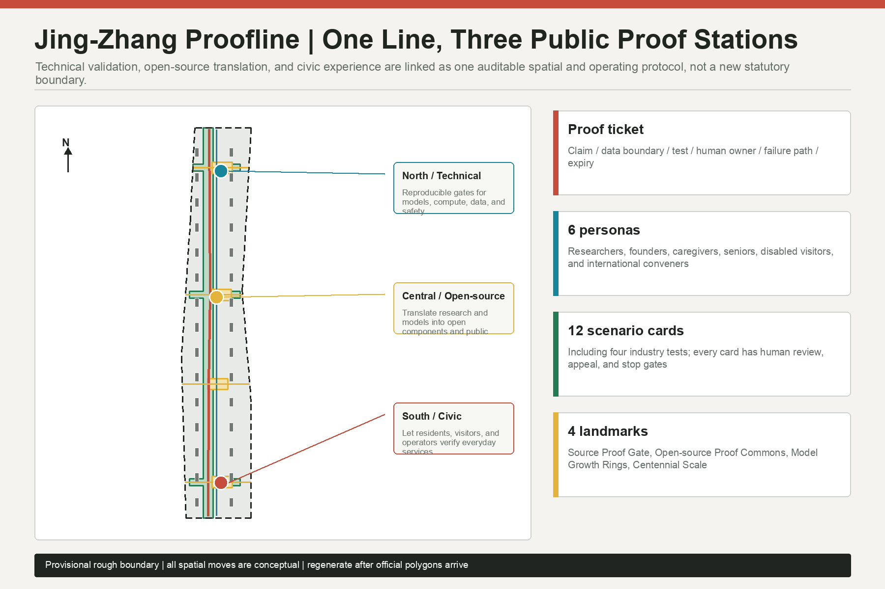
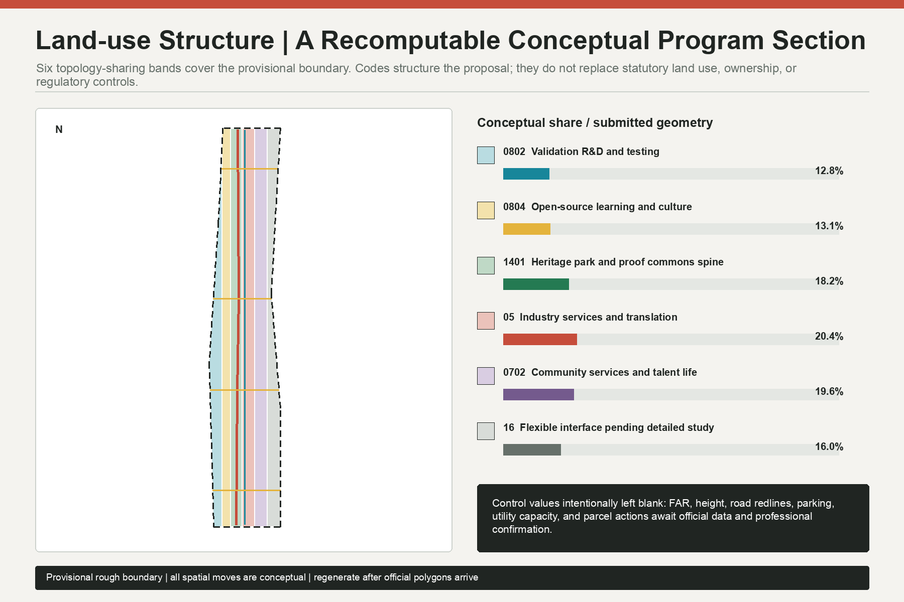
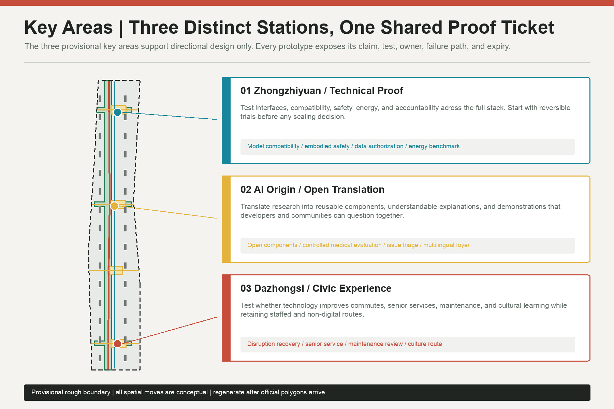
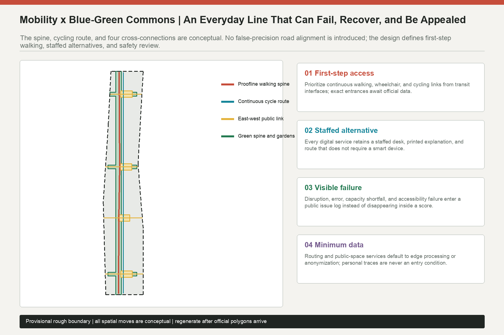
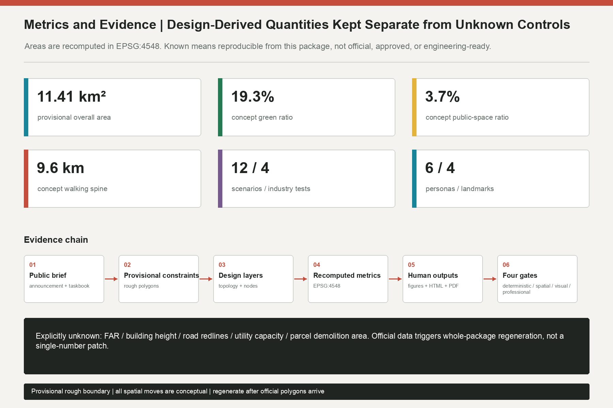

# Jing-Zhang Proofline: An AI Innovation Urban Commons for Public Verification

## Design Basis and Source List

This proposal asks what the available material can support before deciding what to draw. Its task boundary comes from the official open-call announcement, the repository's Agent taskbook, and local snapshots of relevant professional standards. Land-use codes, editable layers, source status, and metric structures come from the repository enums, `allowed_design_space.json`, `data/source_registry.json`, and the JSON schemas. `data/processed/agent_fact_pack.md` is treated as a reading aid, not as a new authority. Formal judgments use registered formal-ready public or cleared material; external cases are mechanism-level background only, and provisional polygons are limited to generation, presentation, and local intake checks [source:OFFICIAL-ANNOUNCEMENT] [source:SOURCE-REGISTRY].

Organizer-supplied exact `SITE_BOUNDARY` and three `KEY_AREA` polygons are not available. To make a complete proposal discussable, the package uses the repository's registered provisional rough geometry and repeats its restrictions in `geometry/site_boundary.geojson`, `geometry/key_areas.geojson`, `sources.json`, and `assumptions.json`. Projected to EPSG:4548, the submitted rough boundary measures 11,412,825.386 square meters. That number proves internal reproducibility only. It is not an official redline area, parcel area, approval basis, or statutory control [data:geometry/site_boundary.geojson#SITE-001] [metric:site_area_sqm].

All outputs share one generation chain: lock the provisional constraints; partition the full boundary with shared topology; generate conceptual program envelopes, mobility lines, green and public space, scenario nodes, and phases; recompute metrics in one projection; then derive paired Chinese/English figures, HTML, and PDFs. When official polygons arrive, the response is not to swap a basemap. All nine GeoJSON files, every metric, five figure pairs, both HTML pairs, and four PDFs must be regenerated. FAR, height, road redlines, utility capacity, ownership, building survey, and parcel intervention therefore remain pending official data rather than being filled with guessed values [depth:existing_conditions_diagnosis] [standard:PROJECT-OFFICIAL-ANNOUNCEMENT].

## Three-Level Scope Framework

The three scopes carry different decisions; they are not one drawing at three zoom levels. The coordinated research area, approximately 43.6 square kilometers, asks how university research, open collaboration, enterprise translation, public testing, and international exchange can form a complete innovation ecology. The overall design area, approximately 11.4 square kilometers, asks how industry, daily life, mobility, public space, and renewal projects can become a reviewable spatial framework. The three key areas, approximately 368.4 hectares in the announcement, ask how a specific prototype meets a place, user, operator, and failure response. Each level sets questions for the next, and detailed testing feeds lessons back upward [source:OFFICIAL-ANNOUNCEMENT] [depth:three_level_scope_framework].

| Scope | Core question | Proofline output | Data boundary |
| --- | --- | --- | --- |
| Coordinated research area | How can the innovation chain serve public value? | Three positionings, five functions, three areas and two wings, six international case comparisons | Announcement and public mechanisms only; no invented scope line |
| Overall design area | How can one line and three stations become continuous space and projects? | Six-band topology, a 9.63 km conceptual walking spine, green/public space, and program envelopes | Directional design inside a provisional boundary; controls and engineering pending |
| Key areas | How are technology, open source, and civic experience verified differently? | Technical Proof at Zhongzhiyuan, Open Translation at AI Origin, Civic Experience at Dazhongsi | All three polygons are provisional and cannot support parcel conclusions |

The concept is named “Jing-Zhang Proofline.” “Line” refers to Jing-Zhang cultural memory, continuous walking, and the movement of knowledge. “Proof” is not a certification claim or a blockchain slogan. It is a public rule: every AI prototype entering urban space must disclose its claim, data boundary, test, human owner, failure path, and expiry. The northern station tests technology, the central station translates it into open and understandable capability, and the southern station lets people test it in everyday life. All three use the same proof ticket so a result can be reused and challenged at the next station [source:AGENT-TASKBOOK] [data:geometry/roads.geojson#ROAD-001].

The provisional overall boundary remains a low-contrast dashed constraint in every visual. Corridors, nodes, scenarios, and evidence relationships carry the visual emphasis. The number of key areas is a firm task fact, but their submitted shapes are not precise official evidence. The land-use topology fully covers the rough boundary without gaps or overlaps, yet it remains a conceptual program section rather than a statutory plan [data:geometry/land_use.geojson#LU-001] [metric:key_area_count].

## Coordinated Research Area: Industry and Future City Research

The three positionings become operational through the proof mechanism. The Centennial Jing-Zhang Cultural Belt preserves temporal evidence and shared memory. The Urban AI Life Experience Belt allows residents, commuters, seniors, and visitors to test services. The AI Integrated Innovation Belt connects models, compute, data, scenarios, and governance through reviewable translation. The five functions do not become five fenced parks. Full-stack innovation is tested in the north, the world-class ecosystem is translated in the center, AI+ scenarios and an active city are experienced in the south, and global governance credibility comes from open test rules, issue logs, and exit procedures [standard:PROJECT-AGENT-OPEN-CALL-TASKBOOK] [depth:overall_spatial_structure].

The “three areas and two wings” operate as an exchange of capabilities rather than an administrative collage. Zhongzhiyuan supplies testable technical components. AI Origin Community translates them into open tools, public explanations, and venture support. Dazhongsi tests whether AI-native services improve ordinary urban life. The Zhongguancun technology-service wing brings legal, standards, capital, talent, and international communication interfaces; the Xiaoyuehe scenario-empowerment wing brings continuous public space and real but controlled urban questions. The wings send problems and support to the stations, while the stations return disclosed boundaries, reproducible results, and failure lessons.

The visual identity uses two parallel tracks, three open rings, and a crossing scale. Parallel tracks connect railway memory with public verification; the three incomplete rings remain enterable and challengeable; the scale links a century of history with prototype expiry. The palette combines railway brick red, public green, verification cyan, open-source yellow, and neutral black and white rather than relying on a single “technology blue.” Chinese and English names have equal status. The direction uses original geometry and system-font rendering only; it does not reuse company logos, unlicensed fonts, portraits, or historical images.

Six international cases provide mechanism lenses, not site controls, scale parameters, or templates for copying [source:CASE-MARS] [source:CASE-STATION-F]:

| Background case | Mechanism observed | Proofline translation | What is not imported |
| --- | --- | --- | --- |
| MaRS Discovery District | Connections among research, ventures, and support | A cross-disciplinary translation desk and proof archive at the central station | Institutional scale and recruitment data |
| STATION F | Concentrated startup programs and shared services | A common proof ticket connecting different programs | A closed mega-campus as the default spatial answer |
| one-north | Research, business, and urban life in one district | Public space, rather than walls, connects the stations | Its land-use metrics or governance system |
| Tokyo Innovation Base | Open collaboration and public convening | Recurring public checks and an international developer foyer | Any claim that events are already government commitments |
| UnternehmerTUM | University-linked venture building and prototyping | A north-station chain of testing, translation, and retrospective review | Invented partnerships or investment commitments |
| Kendall Square | Dense research-industry fabric and district stewardship | Public benefit, infrastructure, and operator responsibility as entry gates | Unverified output, rent, or investment figures |

The future-city judgment is “small-step, open, and reversible.” AI facilities first enter existing service touchpoints and removable prototypes. Giant screens, fenced compute campuses, and mandatory apps are not treated as urban identity. Each prototype passes through technical evidence, open explanation, and civic experience; failures also enter the knowledge base. The belt's durable asset is therefore not a one-off architectural image but a city protocol that continuously produces credible tests, reusable components, public questions, and human collaboration.

## Overall Design Area: Urban Renewal and Regulatory-Plan-Level Urban Design

The overall structure is one proof commons green spine, three stations, four east-west public interfaces, and six conceptual program bands. `land_use.geojson` partitions the provisional boundary with shared coordinates and full coverage. `roads.geojson` contains conceptual walking, cycling, and cross-connection relationships only. `green_space.geojson` and `public_space.geojson` form a continuous green spine and four public rooms. The thirty gray modules in `buildings.geojson` test program distribution; they do not describe surveyed buildings or confirmed construction [data:geometry/land_use.geojson#LU-003] [depth:land_use_layout].

Renewal begins with missing public capabilities rather than a demolition target. Four gaps guide the proposal: no shared ticket or reusable record across stations; discontinuous walking, accessibility, and east-west connection; weak translation from research into venture, resident, and public-institution use; and demonstrations that show success while hiding failure or appeal. The corresponding spatial moves are proof-ticket desks, a continuous slow-mobility line, open translation rooms, and public issue walls. They begin as reversible and replaceable prototypes.

The conceptual program-envelope footprint is 478,039.035 square meters, the union of thirty low-confidence design modules. It helps compare where spatial supply might sit. It cannot derive total floor area, FAR, investment, or construction volume. FAR, height, setback, parking, road redlines, and public-service standards remain unknown until regulatory plans, surveys, ownership, and professional studies are available [metric:building_footprint_area_sqm] [standard:MOHURD-CONTROL-DETAILED-PLANNING].

Urban character follows three rules: restrained base interfaces, legible public nodes, and replaceable prototype components. No skyline or massing claim is invented without control conditions. Later professional work should compare heritage views, daylight, wind, ground-floor publicness, rooftop equipment, embodied carbon, and street scale. Brick red marks cultural time, cyan marks verification, green marks accessible commons, and yellow marks open collaboration, preventing the whole corridor from becoming a one-note technology theme [standard:MOHURD-URBAN-DESIGN-MEASURES] [depth:height_massing_character].

## Detailed Design of Key Areas

All three key-area studies use provisional rough polygons. Their straight edges must not be interpreted as roads, parcels, or ownership. Each station includes positioning, spatial structure, a building-decision gate, mobility, public space, AI scenarios, and implementation risk, but it does not state statutory FAR, height, parcel action, or engineering feasibility. Official polygons trigger complete recalculation of each sub-plan and every dependent metric [data:geometry/key_areas.geojson#PROV-KEY-001] [depth:three_key_area_detailed_design].

**Zhongzhiyuan AI Autonomous Innovation Acceleration Area: Technical Proof Station.** The northern green spine, validation plaza, and removable program modules form a sequence of test gate, retrospective desk, and public-results walk. Open-model compatibility, embodied-AI pedestrian safety, trusted-data authorization, and algorithm energy benchmarking begin in controlled environments. Only summaries that protect confidential and personal data reach public display. Building work first asks whether existing space can support tests, meetings, standards work, and public explanation; new construction remains an option for professional teams only after official controls and engineering review. Primary risks are safety, energy use, vendor lock-in, and treating a test score as certification [data:geometry/constraints.geojson#SCN-01] [source:AGENT-TASKBOOK].

**Beijing AI Origin Community: Open Translation Station.** This is not simply an exhibition hall. It translates papers, models, and test results into open components, public language, venture support, and community questions. The Open-source Proof Commons, controlled medical-AI evaluation, community issue triage, and multilingual developer foyer surround a central public room. Each service displays its input boundary, human owner, and exit. East-west walking links services without requiring digital registration for access. Building development first tests ground-floor visibility, accessibility, acoustics, and shared schedules before considering physical intervention [data:geometry/key_areas.geojson#PROV-KEY-002] [standard:BARRIER-FREE-ENVIRONMENT-LAW].

**Dazhongsi AI Industry Cluster: Civic Experience Station.** Commute recovery, low-digital senior service, public-space maintenance review, and a cultural-memory route test whether technology improves an ordinary day. The civic plaza retains staffed desks, printed explanation, and a route that uses no smart device. Retail and business prototypes require clear pricing, exit, and limits on profiling. A temporal scale links rail memory with the Model Growth Rings honor node without reducing culture to technology decoration. Risks include commercial display displacing public use, accessibility breaks, excessive collection, and conceptual landmarks being misreported as approved projects [data:geometry/key_areas.geojson#PROV-KEY-003] [source:ELDERLY-TECH-PLAN].

## AI Innovation Ecosystem, Personas, and AI+ Scenarios

Six personas test whether the innovation ecosystem serves only technology providers. They are design-review lenses, not invented population statistics. Researchers need reproducible tests; founders and operators need clear integration cost and liability; resident caregivers need daily reliability; seniors and low-digital users need staffed alternatives; wheelchair users and blind visitors need first-step accessibility; international developers and community conveners need multilingual terminology, open licensing, and cultural explanation [source:AGENT-TASKBOOK] [metric:persona_count].

| Persona | Core task | Commonly hidden failure | Design response |
| --- | --- | --- | --- |
| Research engineer | Reproduce a test and understand failure | Only the successful score is published | Publish conditions, version, and failure log |
| Founder or operator | Integrate a component into a real service | Responsibility and exit cost are unclear | Proof ticket, sandbox, and expiry review |
| Resident caregiver | Complete care work under time pressure | No accountable handover after failure | Staff transfer, incident log, and remedy |
| Senior or low-digital user | Receive equal service without a smart device | Forced scanning and complex explanation | Staff desk, print, and plain language |
| Wheelchair user or blind visitor | Enter and understand space continuously | Physical and digital accessibility diverge | First-step route, tactile/audio alternatives, on-site help |
| International developer or community convener | Participate and reuse across languages | Terms, licenses, and context are lost | Bilingual records, license explanation, community host |

Each scenario card maps place, user, operating data, privacy boundary, human review, a conceptual operator, and primary risk. `constraints.geojson` records twelve conceptual nodes, with the first four designated as industry testing and validation. A point never means approved deployment. Lawful data, professional safety, accessibility, accountable operation, and public-interest review are preconditions [data:geometry/constraints.geojson#SCN-01] [metric:scenario_node_count].

| ID | Scenario and place | Users / operating data | AI task | Conceptual owner | Privacy boundary | Human review, appeal, exit | Main risk |
| --- | --- | --- | --- | --- | --- | --- | --- |
| SCN-01★ | North: open-model compatibility | Researchers; public test sets, versions, logs | Compare interfaces and reproducibility | Independent test team + provider | No secret weights or personal data | Human-signed summary; retest at expiry | Score misread as certification |
| SCN-02★ | North: embodied-AI pedestrian safety sandbox | Pedestrians, wheelchair users; simulation or consented events | Detect conflict and test stop behavior | Safety officer + accessibility advisor | Synthetic by default; consent for physical tests | Safety officer stop; appealable incidents | Physical injury, surveillance expansion |
| SCN-03★ | North: trusted-data authorization desk | Data stewards, developers; license and purpose records | Check use and expiry | Data trust team + legal counsel | Minimum fields, purpose limitation, revocation | Human access approval; automatic closure | Secondary-use drift |
| SCN-04★ | North: algorithm energy benchmark | Model teams, operators; energy and task quality | Compare resource use per task | Test lab + energy advisor | No personal content; task summary only | Human method review; ranking may be rejected | Inconsistent methods, greenwashing |
| SCN-05 | Central: accessible route co-pilot | Disabled visitors; facility status, anonymous feedback | Multimodal route advice | Public-space operator | No continuous trace retention | On-site confirmation and offline route | Wrong routing, facility failure |
| SCN-06 | Central: controlled medical-AI evaluation | Clinicians, resident representatives; synthetic/de-identified cases | Test explanation, consistency, refusal | Qualified medical body + ethics review | No live care unless lawfully approved | Professionals decide; clearly non-diagnostic | Diagnostic implication, sensitive leak |
| SCN-07 | Central: community issue triage | Residents, community staff; voluntary issue text | Cluster, route, explain progress | Community service team | No emotion profiling or personal score | Human priority; edit and withdraw | Minority issues suppressed |
| SCN-08 | Central: multilingual developer foyer | International developers, conveners; terminology and license metadata | Translate, search, match collaborators | Open-source community host | No hidden talent profile | Human term review; report bias | Translation and license error |
| SCN-09 | South: commute disruption recovery | Commuters; public operations and anonymous choice | Explain alternative routes | Transport information service + staff | No identity or history required | Broadcast and print in parallel | Crowd transfer, stale information |
| SCN-10 | South: low-digital senior desk | Seniors, caregivers; current service request | Assisted lookup and form prefill | Trained service staff | No unrelated retention or mandatory face scan | Staff confirms each field; AI optional | Exclusion, incorrect proxy action |
| SCN-11 | South: public-space maintenance review | Users and maintenance teams; incidents and work orders | Rank and explain maintenance | Public-space operator | No face or individual behavior tracking | Human schedule; public backlog and appeal | Low-frequency needs ignored |
| SCN-12 | South: learning and cultural-memory route | Students, visitors; cleared history and optional interaction | Age-appropriate multilingual narration | Cultural body + educators | No child behavior profile | Historical review and correction channel | Historical distortion, copyright misuse |

The proof ticket is the minimum governance unit across scenarios. `claim` states the intended improvement; `data boundary` states what is not used; `test` explains how error is found; `human owner` names the person responsible for explanation and remedy; `failure path` defines stop, appeal, and recovery; `expiry` prevents a trial from becoming permanent by default. A missing field blocks progression from display to pilot. Passing a pilot still does not mean government approval or unrestricted deployment [standard:GENERATIVE-AI-INTERIM-MEASURES] [depth:risk_missing_data].

## Land Use, Building Scale, and Retain-Renovate-Demolish Strategy

The provisional boundary is partitioned once into six conceptual program bands with shared topology. Their areas add to the submitted boundary. The shares compare public, research, service, and flexible space; they are not a statutory land-use balance [data:geometry/land_use.geojson#LU-004] [standard:MNR-LAND-USE-CLASSIFICATION-GUIDE].

| Code | Conceptual band | Approximate package share | Design role |
| --- | --- | ---: | --- |
| 0802 | Validation R&D and testing | 12.8% | Controlled tests, retrospectives, standards discussion |
| 0804 | Open-source learning and culture | 13.1% | Courses, public explanation, and cultural narrative |
| 1401 | Heritage park and proof commons spine | 18.2% | Continuous public framework and cross-station route |
| 05 | Industry services and translation | 20.4% | Venture, legal, IP, and translation support |
| 0702 | Community services and talent life | 19.6% | Care, daily service, and diverse talent life |
| 16 | Flexible interface pending detailed study | 16.0% | Space for formal controls, facilities, and public negotiation |

The thirty modules in `buildings.geojson` total 47.80 hectares of footprint and are all marked `conceptual_program_envelope` with low confidence. They are not existing buildings, cannot count stock, and cannot identify demolition. Later retain-renovate-demolish work uses four gates: verify safety and ownership; assess heritage, memory, and embodied carbon; test program fit and public benefit; then compare reuse, reinforcement, renovation, and new construction over the life cycle. Retention and adaptive reuse are the starting assumption. Demolition becomes a parcel conclusion only after official data, professional assessment, public process, and approval [data:geometry/buildings.geojson#BLDG-001] [depth:retain_renovate_demolish].

Development intensity uses “explicit unknown plus a recomputation trigger.” `floor_area_ratio`, `building_height_m`, and `parcel_demolition_area_sqm` remain unknown. When official boundaries, controls, building surveys, ownership, and engineering conditions arrive, professional teams regenerate program envelopes, massing comparisons, daylight and wind tests, parking, and service capacity. The current footprint is a design quantity, not confirmed construction scale [metric:building_footprint_area_sqm] [depth:development_intensity_controls].

## Transport, Rail, Municipal Infrastructure, and Public Services

The mobility strategy does not invent exact roads or rail alignments. `ROAD-001` is a 9,627.3-meter conceptual public walking spine inside the provisional boundary. `ROAD-002` is a parallel cycling verification route, and four cross-lines express east-west public connection at the stations and Centennial Scale Garden. They test continuity and service interfaces. They are not road redlines, rail lines, bridges, tunnels, or construction geometry. Intersections, station entrances, fire access, loading, parking, and capacity require official transport data and professional study [data:geometry/roads.geojson#ROAD-001] [metric:proofline_length_m].

Mobility places the first step before the algorithm. Continuous walking, wheelchair, and cycling access from transit interfaces to public services comes before real-time information. Any route assistant runs alongside staff, legible signs, and printed alternatives. Disruption recovery uses public operations data and anonymous choices; identity, travel history, and device ownership are never access conditions. Bicycle parking, shared mobility, ride-hail pickup, and freight windows require formal survey and must not transfer congestion into residential streets.

Municipal and digital infrastructure are specified as interfaces only. Scenario equipment needs metered energy, offline degradation, edge processing, minimum data, replaceable hardware, and safe stop. Public spaces require professional checks for power, communications, drainage, fire safety, sanitation, and accessible maintenance. Verified networks, capacities, loads, underground conditions, and resilience data are unavailable, so `municipal_capacity_index` remains unknown. No distributed-energy percentage, compute capacity, or underground engineering feasibility is claimed [depth:municipal_new_infrastructure] [source:SITE-PACKAGE].

Public services combine stations with mobile staff. Technical Proof needs safety officers, test engineers, and standards advice. Open Translation needs open-source hosts, legal and license support, medical ethics, and community coordination. Civic Experience needs transport information, senior assistance, cultural education, and maintenance staff. Shared schedules and removable modules test demand before any professional team considers permanent space.

## Blue-Green Network, Public Space, and Urban Character

The conceptual green-space union is 2,203,386.315 square meters, or 19.3062% of the provisional area. Four public rooms total 426,827.020 square meters, or 3.7399%. These are recomputed proposal quantities, not an existing green-space survey or statutory green ratio. The proof commons spine structures shade, walking, cycling, rain gardens, and cultural scales, while three transverse gardens connect key stations to everyday interfaces on both sides [data:geometry/green_space.geojson#GREEN-001] [metric:green_ratio].

“Blue” is a pending condition, not an imagined waterway. Official water, blue-line, flood, sponge-city, groundwater, and drainage data are absent. The proposal requires later professional verification of runoff paths, existing water, ecological continuity, and maintenance, but it does not draw precise banks, bridges, or underground links. Public space first provides barrier-free entry, seating, nighttime safety, thermal comfort, and non-commercial use. Digital interaction remains optional and never displaces ordinary use [standard:BARRIER-FREE-ENVIRONMENT-LAW] [depth:blue_green_public_space].

Four AI pilgrimage and honor nodes are restrained public knowledge devices, not entertainment megastructures. **Source Proof Gate** publishes model-entry conditions and version. **Open-source Proof Commons** shows reusable components, contributor credit, and unresolved issues. **Model Growth Rings** record capability, energy, errors, and retirement over time instead of ranking only success. **Centennial Scale** places Jing-Zhang railway memory, Zhongguancun innovation culture, and emerging AI culture on one timeline. All four are conceptual identity and event directions, not approved buildings [data:geometry/constraints.geojson#LM-01] [metric:landmark_count].

The cultural narrative shifts from speed to traceable progress. Rail connects city and knowledge; open source connects contribution and reuse; public proof connects technology and responsibility. Wayfinding has three levels: the overall identity marks the belt, station colors distinguish technical/open/civic roles, and proof tickets identify individual prototypes. Historical facts, imagery, fonts, trademarks, and portraits require separate clearance. Generated content remains labeled as conceptual.

## Renewal Projects, Implementation Policy, and Phasing

Projects follow “protocol first, temporary next, permanent only after evidence.” Each has entry and exit gates. Operator names are suggested roles, not confirmed institutions [data:geometry/phasing.geojson#PHASE-001] [depth:renewal_project_list].

| Project | Conceptual content | Entry condition | Exit or review condition |
| --- | --- | --- | --- |
| P1 Public spatial baseline | Official boundary, controls, survey, ownership, transport, utilities, heritage list | Publication and professional sign-off | Any source change triggers regeneration |
| P2 Proof-ticket protocol | Six fields, issue log, version, expiry | Legal, ethics, accessibility, operating review | Stop when no owner or appeal exists |
| P3 North technical pilots | Four industry tests and removable modules | Independent test, safety officer, energy metering | Stop for incident, data overreach, or method distortion |
| P4 Central open-translation pilots | Component library, license desk, community review, multilingual foyer | Clear license, host, public explanation | Remove until license or community harm is resolved |
| P5 South civic pilots | Mobility, senior, maintenance, and cultural services | Staff alternative, accessibility, on-site operation | Revert for exclusion, deception, or maintenance failure |
| P6 Green spine and four public rooms | Walking, shade, seating, rainwater, cultural scale | Official geometry and green/water/transport development | Adjust if publicness or ecology misses the gate |
| P7 Edge and municipal interfaces | Metered energy, offline mode, replacement, safe stop | Capacity, cybersecurity, maintenance budget | Reduce if capacity or maintenance fails |
| P8 Long-term stewardship | Events, developer community, scenario access, contribution memory | Multi-party charter, transparent funds, annual review | Redesign or close after two cycles without public value |

The phasing map uses south, center, and north as a conceptual sequence, not a construction schedule. A suggested 0-18 month phase establishes the data baseline, proof protocol, removable desks, and one minimum pilot at each station. A 2-4 year phase develops walking continuity, public rooms, and adaptation of existing space only after official data and professional design. Stable facilities, cross-regional networks, and international events are discussed only beyond five years. Every phase can shrink, move, or stop [data:geometry/phasing.geojson#PHASE-002] [depth:phasing_implementation].

Long-term operations use three rhythms: a monthly “City Debug Day” to collect ordinary failures; a quarterly “Open Checkpoint” to publish tests, fixes, and exits; and an annual “Proofline Week” for developers, residents, professionals, and international peers to review public value. Brands, recruitment, funding, and partners are co-creation directions, not government or investment commitments. Contributor credit, open licenses, resolved issues, and follow-on support enter a durable record so events produce shared knowledge rather than one-time promotion.

## Metrics, Area Recalculation, and Compliance Matrix

Metrics fall into three groups. Design-derived quantities are the provisional area of 11,412,825.386 square meters, conceptual green area of 2,203,386.315 square meters, public space of 426,827.020 square meters, conceptual footprint of 478,039.035 square meters, and a 9,627.3-meter walking spine. Structural counts are three key areas, six land-use units, twelve scenarios, four industry tests, six personas, four landmarks, and three conceptual phases. Explicitly unknown controls are FAR, height, road redlines, utility capacity, and parcel demolition area [metric:public_space_ratio] [depth:metrics_recalculation].

All areas are calculated by projecting WGS84 geometry to EPSG:4548. Green, public-space, and building values use union area, and each ratio uses the same submitted boundary denominator. `known` means only that the value can be reproduced from current files. Boundary-related values have medium confidence because the boundary is provisional; conceptual building footprint has low confidence. Official polygons trigger geometry, figures, HTML, PDF, manifest hashes, and the full four-gate run rather than a hand-edited number.

The compliance matrix covers seventeen announcement tasks under sections 1.3, 1.4, and 1.5 plus agent.1 through agent.6, for twenty-three records. The standard matrix covers five mandatory standards and four additional governance/accessibility references. The design-depth matrix covers fifteen items. `complete` means that the proposal provides a readable answer, data location, and gap treatment; it never means missing official data has been obtained. Final author self-check must pass deterministic validation, spatial review, visual packaging, and professional evidence [standard:MOHURD-URBAN-DESIGN-MEASURES] [source:SOURCE-REGISTRY].

## Risk, Copyright, and Compliance

The first risk is mistaking provisional geometry and conceptual quantities for official work. Every figure, table, HTML page, and PDF retains a provisional, conceptual, and regeneration notice. The narrative does not claim approval, guaranteed implementation, or confirmed investment. Before official GIS/CAD, controls, ownership, building surveys, transport, utilities, heritage, and engineering conditions are available, this package makes no parcel intervention, total construction, bridge, tunnel, underground-space, or pipeline conclusion [source:BOUNDARY-SOURCE] [depth:risk_missing_data].

AI scenario risk is controlled through purpose limitation, minimum data, human accountability, appeal, stop, and expiry. Face data, continuous traces, health information, children's data, and hidden profiles cannot be conditions for public-space access or basic service. High-impact medical, transport, safety, and accessibility scenarios require qualified professionals to make final decisions. A passed test reports a bounded result; it is not certification, procurement approval, or permission for universal deployment [standard:GENERATIVE-AI-INTERIM-MEASURES] [source:BARRIER-FREE-LAW].

Generation and rights are disclosed in `report/copyright_statement.md`. Narrative, GeoJSON, metrics, HTML, figure layout, and PDFs are original to this entry. Visuals use only package data and locally rasterized system fonts; they contain no third-party map tiles, news imagery, company logos, portraits, or scraped media. External cases contribute organization names, official URLs, and brief mechanism summaries only; no images, trademarks, page layouts, or extended passages are copied. The participating account is `hunya-ops`; model disclosure is in `agent.json`.

This is an open co-creation proposal. It does not replace formal planning or constitute government approval, investment, recruitment, construction, operation, or engineering-feasibility commitments. Human maintainers and professional teams retain final judgment. Any later user should inspect sources, assumptions, formulas, and self-check records rather than extracting a single presentation image.

## References

The following materials materially shaped the task boundary, spatial method, or governance. Complete URLs, paths, use permissions, access dates, and limitations are recorded in `sources.json` [source:OFFICIAL-ANNOUNCEMENT] [source:AGENT-TASKBOOK].

1. Haidian Branch of the Beijing Municipal Commission of Planning and Natural Resources, official prequalification announcement for the Centennial Jing-Zhang AI Innovation Belt urban-design call.
2. Project repository, Agent open-call taskbook excerpt for the Centennial Jing-Zhang AI Innovation Belt.
3. Ministry of Housing and Urban-Rural Development, local public snapshot of the Measures for Urban Design Management.
4. Ministry of Housing and Urban-Rural Development, local public snapshot of control detailed-planning preparation and approval measures.
5. Ministry of Natural Resources, local public snapshot of the national land-use and sea-use classification guide.
6. Cyberspace Administration of China and other authorities, local public snapshot of the Interim Measures for Generative AI Services.
7. Barrier-Free Environment Construction Law of the People's Republic of China, local public snapshot.
8. Official pages of MaRS Discovery District and STATION F, used only for background comparison of innovation-support mechanisms.
9. Official pages of JTC one-north, Tokyo Innovation Base, and UnternehmerTUM, used only for spatial and operating-mechanism comparison.
10. Kendall Square Association official page, used only for background comparison of district stewardship.
