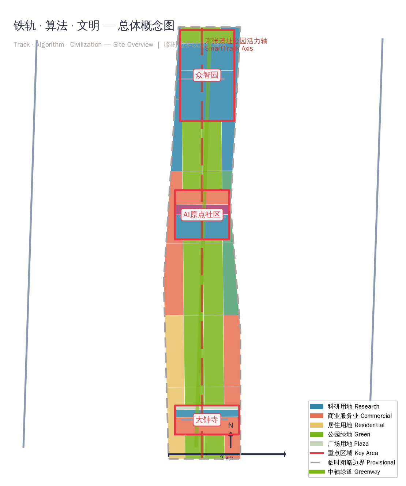
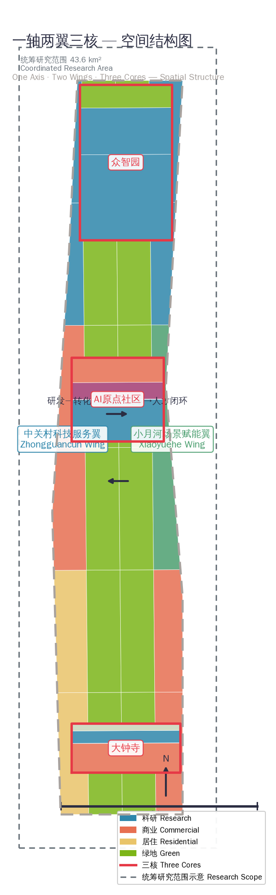
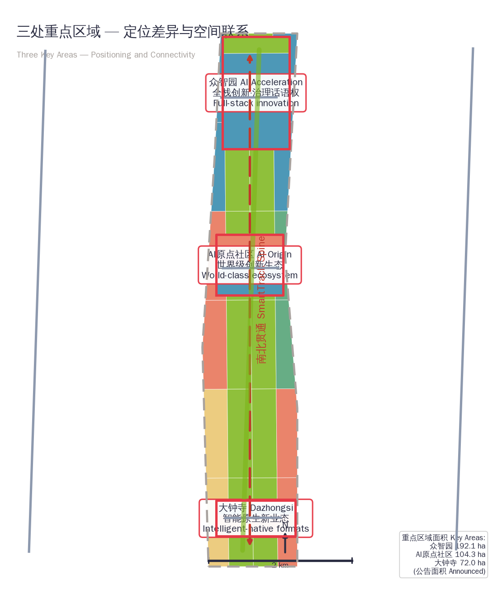
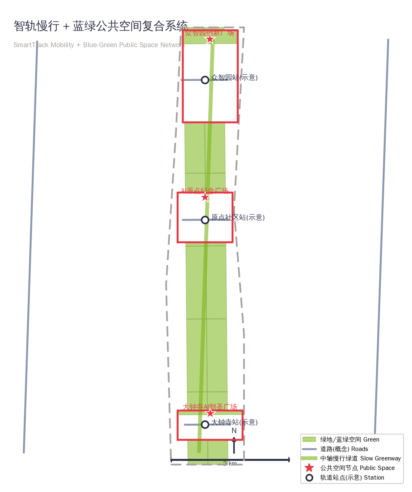
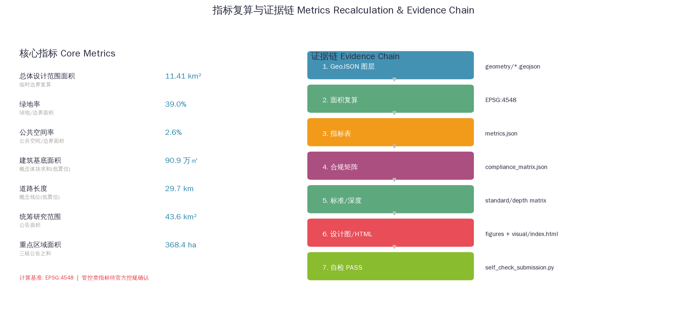

# 百年京张AI创新带：铁轨·算法·文明

> **概念声明**：本方案为面向智能体开源征集的概念性、前瞻性、品牌性与运营性成果，所有空间落地建议均为"概念建议""参考方案""可供专业团队深化研究"，不替代正式规划，不构成政府审定结论 [source:SRC-2026-0518-AGENT-OPEN-CALL-TASKBOOK] [assumption:A-DESIGN-001]。

## 设计依据与资料清单

本 formal 方案以北京市规划和自然资源委员会发布的《百年京张AI创新带城市设计国际方案征集资格预审公告》为第一依据 [source:DATA-SRC-OFFICIAL-ANNOUNCEMENT-20260509]，以 `brief/site-package/` 中维护者登记的临时粗略边界、重点区域、枚举、指标、标准与来源清单为机器可读依据 [source:SITE-PACKAGE]。方案同时遵循面向智能体开源征集任务书 [source:SRC-2026-0518-AGENT-OPEN-CALL-TASKBOOK]，将"三大定位、五大功能、三区两翼、六项任务"作为内容框架。

所有设计判断均拆分为可追溯来源、可复算指标、可校验图层与可人工复核假设。正文只保留与判断直接相关的 1-3 条证据引用，完整机器索引保存在 `sources.json`、`metrics.json`、`compliance_matrix.json`、`standard_matrix.json` 与 `design_depth_matrix.json` [source:SOURCE-REGISTRY]。

**资料边界**：本方案使用的边界为 `brief/site-package/geometry/provisional_boundaries.geojson` 提供的临时粗略边界（`provisional_constraint`、`official_boundary=false`、`boundary_precision="provisional_rough"`），仅用于方案生成、展示、自检与设计讨论，不得作为 official redline、审批依据或精确面积复算依据 [data:geometry/site_boundary.geojson#SITE-001] [metric:site_area_sqm]。该组织方数据缺口不阻断内容评分；official polygon 补齐后，全部设计图层与指标需重算 [assumption:A-BOUNDARY-001]。

## 三层范围工作框架

方案按公告确定的三层范围组织工作 [depth:three_level_scope_framework]：

| 层级 | 范围 | 面积 | 设计任务 | 数据落点 |
| --- | --- | --- | --- | --- |
| 统筹研究范围 | 北五环—京藏高速—西直门外大街—万泉河路 | 43.6 km² | AI产业生态、未来城市形态、三区两翼协同 | [metric:coordinated_research_area_sqm] |
| 总体设计范围 | 京张遗址公园周边1-2公里 | 11.4 km² | 城市更新、用地布局、交通市政、风貌控制 | [data:geometry/site_boundary.geojson#SITE-001] [metric:site_area_sqm] |
| 重点区域范围 | 三处重点片区 | 368.4 ha | 详细设计、场景落地、实施项目 | [data:geometry/key_areas.geojson#PROV-KEY-001] [metric:key_detailed_design_area_sqm] |

三层不是互相割裂的图纸集合：统筹研究决定产业链与城市形态判断，总体设计把判断落实到更新项目、空间结构与设施承载，重点区域详细设计验证具体地块、建筑、交通、公共空间与AI应用场景的可实施性 [depth:overall_spatial_structure] [depth:land_use_layout]。

## 统筹研究范围产业与未来城市研究

### 总体概念与命名体系

本方案提出总体概念**「铁轨·算法·文明」（Track · Algorithm · Civilization）**，英文简称 **JZ-AI Belt**。命名逻辑：京张铁路是中国人自主设计建造的第一条干线铁路，是"自主创新"的历史原点；AI 创新带是当代自主创新的新原点。铁轨象征线性通达与工程自主，算法象征智能时代的通用语言，文明象征从交通文明到智能文明的演进 [source:SRC-2026-0518-AGENT-OPEN-CALL-TASKBOOK]。

**命名体系**（三层递进）：
- **主名称**：百年京张AI创新带 / JZ-AI Innovation Belt
- **副品牌**：一带（京张智脉共生带）、三核（众智园·AI原点·大钟寺）、两翼（中关村科技服务翼·小月河场景赋能翼）
- **场景品牌**：智轨（SmartTrack）公共体验线、原点市集（Origin Market）、众智工场（Z-AI Foundry）、大钟寺智汇客厅（Dazhongsi AI Lounge）

**Logo/视觉识别方向**：以铁轨轨枕与电路走线共构的"JZ"字母组合为核心图形，三条平行线分别代表铁路、数据流与创新带；标准色采用京张铁路锈铁红（历史）+ 海淀科技蓝（当代）+ AI 电光青（未来）。视觉系统可延展为导视、路名牌、场景卡、活动主视觉与国际传播海报 [standard:PROJECT-AGENT-OPEN-CALL-TASKBOOK]。

### 三大定位与五大功能

方案对应任务书三大定位：**百年京张文化带、都市AI生活体验带、AI融合创新带**；五大功能：**AI全栈自主创新体系、世界级AI创新生态、AI+场景赋能新范式、智能化AI活力城市、AI治理全球话语权** [source:SRC-2026-0518-AGENT-OPEN-CALL-TASKBOOK]。

**三区两翼协同回路**：三核（众智园=全栈自主创新与治理话语权，AI原点社区=世界级创新生态，大钟寺=智能原生新业态）作为创新主引擎；两翼（中关村科技服务翼=要素全球化配置、IP与资本赋能；小月河场景赋能翼=场景开放与活力城市试验）作为支撑回路，形成"研发—转化—场景—资本—人才"闭环 [depth:overall_spatial_structure]。

### 全球AI创新生态案例（8个）

| # | 案例 | 地区 | 可转化机制 |
| --- | --- | --- | --- |
| 1 | 硅谷Sand Hill Road | 美国 | 资本聚集与创业社区共生，风投步行可达性设计 |
| 2 | 伦敦国王十字知识区 | 英国 | 铁路遗产+知识经济更新范式，车站地区功能混合 |
| 3 | 新加坡纬壹科技城 | 新加坡 | 政府主导生态+全链条孵化，公园化产业园区 |
| 4 | 波士顿肯德尔广场 | 美国 | 大学-企业-资本三螺旋，开放式街块与底层创新业态 |
| 5 | 特拉维夫Silicon Wadi | 以色列 | 军民融合+创业文化，紧凑高密度创新街区 |
| 6 | 杭州未来科技城 | 中国 | 平台企业带动+城市级场景开放，产城人一体化 |
| 7 | 深圳南山科技园 | 中国 | 硬件创新生态+快速迭代空间，小尺度弹性厂房改造 |
| 8 | 苏黎世技术园区 | 瑞士 | 高品质人居环境吸引人才，湖区绿色创新走廊 |

转化要点：**步行可达的资本-人才界面、铁路/车站遗产再生的城市更新路径、公园化产业环境、小尺度弹性空间供给、平台级场景开放** [standard:PROJECT-AGENT-OPEN-CALL-TASKBOOK] [depth:industry_space_mapping]。

### 未来城市形态

AI 将改变工作、生活、社交、学习、交通与公共服务。方案将未来城市形态落实为：**AI+交通**（智轨接驳、无人物流、慢行优先）、**连续绿色空间**（京张遗址公园为脊的蓝绿网络）、**创新服务设施**（共享算力、测试场、发布厅）、**国际化生活工作氛围**（24小时创新街区）[depth:traffic_rail_slow_parking] [metric:green_ratio]。这些判断落到用地、公共空间、交通慢行、AI场景节点、指标与图纸 [data:geometry/land_use.geojson#LU-001]。

## 总体设计范围城市更新与控规深度城市设计

总体设计范围达到控制性详细规划的城市设计深度，形成**"一轴两翼三核、蓝绿慢行复合环"**的空间结构 [depth:overall_spatial_structure]：

- **一轴**：京张遗址公园活力轴——南北贯通的铁路遗址绿廊，串联三个核心区，承载慢行、文化展示与AI公共体验 [data:geometry/green_space.geojson#GS-001]
- **两翼**：西翼中关村科技服务翼（科研+资本+IP服务），东翼小月河场景赋能翼（教育+场景体验+品质生活）[data:geometry/land_use.geojson#LU-100]
- **三核**：众智园、AI原点社区、大钟寺三处重点片区 [data:geometry/key_areas.geojson#PROV-KEY-001]
- **复合环**：由慢行绿道、公共空间节点与轨道站点接驳形成的日常活动网络 [data:geometry/roads.geojson#R-003]

用地布局形成 33 块完整闭合、无缝无重叠的功能分区（科研/商业/居住/文化/教育/绿地/广场），完整覆盖 11.4 km² 设计边界 [depth:land_use_layout] [data:geometry/land_use.geojson]。建筑方案以概念性体块表达更新与新建方向 [depth:height_massing_character] [depth:retain_renovate_demolish]，强度类判断（容积率、高度、密度、退线）全部列为待正式控规条件确认 [assumption:A-CONTROLS-001] [assumption:A-BUILDINGS-001]。

交通方案围绕轨道站点一体化、道路微循环、慢行断点缝合与停车组织提出概念性线位 [depth:traffic_rail_slow_parking] [data:geometry/roads.geojson]，市政与新型基础设施（分布式能源、端侧算力、创新服务平台）作为待深化原型写入策略，不作工程承诺 [assumption:A-ROADS-001]。

## 重点区域详细设计

三处重点区域达到规划综合实施方案的城市设计深度 [depth:three_key_area_detailed_design]，各自形成"定位+空间结构+建筑更新+交通慢行+公共空间+AI场景+实施风险"的可读小方案 [data:geometry/key_areas.geojson]。

### 众智园AI自主创新加速区（约192.1 ha）[data:geometry/key_areas.geojson#PROV-KEY-001]

- **定位**：花园型全栈自主创新街区，AI治理全球话语权载体
- **空间动作**：强化清河界面，组织产业展示、低碳创新交往与对外交通；以绿色空间承载开放测试与标准治理展示 [data:geometry/green_space.geojson]
- **AI场景**：全栈模型测试验证场（产业测试）、标准制定工作坊、安全治理展示馆、低碳算力体验中心
- **实施风险**：河道蓝线、生态与防洪条件待专业确认

### 北京AI原点社区（约104.3 ha）[data:geometry/key_areas.geojson#PROV-KEY-002]

- **定位**：近校型成果转化与人才特区，世界级AI创新生态原点
- **空间动作**：缝合校区-园区-街区慢行联系，补足成果发布、人才服务、居住生活与开源协作空间 [data:geometry/roads.geojson#R-102]
- **AI场景**：开源社区发布厅（场景）、近校成果转化街（产业测试）、人才特区服务点、AI教育体验点
- **实施风险**：校区边界、权属与首层业态待确认

### 大钟寺AI产业聚集区（约72.0 ha）[data:geometry/key_areas.geojson#PROV-KEY-003]

- **定位**：城市型智能经济与国际交往街区，智能原生新业态引擎
- **空间动作**：围绕大钟寺站一体化、四象限步行连通、商业服务与重点企业公共环境更新 [data:geometry/public_space.geojson#PS-003]
- **AI场景**：智能体与智能终端展示厅、内容消费体验馆、数据要素会客厅、国际路演客厅
- **实施风险**：轨道站点、道路交叉口与市政管线条件待确认

## AI 创新生态、人才画像与 AI+ 场景

### 5类用户画像

| 用户画像 | 典型需求 | 空间响应 | 隐私边界 |
| --- | --- | --- | --- |
| 开源开发者 | 发布、协作、测试、社区声誉 | 原点社区开源发布厅、公共代码墙、夜间协作空间 | 不采集个人行为轨迹；活动数据只做聚合统计 |
| 初创团队 | 低成本办公、算力入口、产品试验场 | 众智园共享测试场、端侧算力服务点 | 算力和数据服务需另行授权 |
| 头部企业访客 | 展示、商务、国际接待、人才招聘 | 大钟寺国际路演客厅、轨道站点接驳 | 企业标识和案例须清权 |
| 周边居民 | 通勤、休闲、社区服务、低扰动更新 | 京张遗址公园慢行环、社区服务嵌入 | 不将居民画像用于商业推荐 |
| 高校师生 | 成果转化、跨校协作、日常慢行 | 校区-园区慢行缝合、成果转化驿站、AI教育体验点 | 校园数据和科研成果需授权 |

### 12张AI场景卡（含4个产业测试验证场景）

| # | 场景卡 | 空间载体 | 类型 | 数据/隐私/复核边界 |
| --- | --- | --- | --- | --- |
| 01 | 全栈模型测试验证场 | 众智园 | **产业测试验证** | 测试数据脱敏；人工合规复核 |
| 02 | 标准制定工作坊 | 众智园 | 产业服务 | 会议内容非公开；授权传播 |
| 03 | 安全治理沙盒 | 众智园 | **产业测试验证** | 模型红队测试隔离环境；监管复核 |
| 04 | 端侧算力驿站 | 总体范围节点 | 新基建 | 服务数据最小化；可审计日志 |
| 05 | 开源发布厅 | AI原点社区 | 公共体验 | 代码公开；个人贡献聚合展示 |
| 06 | 近校成果转化街 | AI原点社区 | **产业测试验证** | 科研数据授权；知识产权服务 |
| 07 | 大钟寺国际路演客厅 | 大钟寺 | 产业服务 | 商务信息授权；媒体清权 |
| 08 | 数据要素会客厅 | 大钟寺 | 产业服务 | 合规授权、可审计；禁止个人隐私 |
| 09 | AI生活服务样板街 | 社区与商业交汇 | 公共体验 | 居民数据最小化；人工复核 |
| 10 | AI慢行导航 | 京张遗址公园活力带 | 公共体验 | 低侵入传感；可解释导视 |
| 11 | 清河低碳创新廊 | 众智园临清河界面 | 公共体验 | 环境数据公开；活动分级 |
| 12 | 全球AI活动周路线 | 一带公共空间系统 | 公共体验 | 活动安全分级；传播素材清权 |

**场景-空间-运营映射**：每张场景卡对应具体空间载体（图层feature）、服务对象（画像）、运行数据边界、人工复核机制、运营主体建议与可视化图层，完整映射表进入 `compliance_matrix.json` 与 `visual/index.html` [depth:scenario_cards] [depth:persona_table]。所有AI治理建议遵守数据最小化、公开来源、可解释与人工复核原则，不替代规划审批，不输出未经授权的个人画像 [standard:PROJECT-AGENT-OPEN-CALL-TASKBOOK]。

## 用地、建筑规模与拆改留方案

用地分类依据国土空间用地用海分类标准，形成完整、闭合、无缝的用地分区 [depth:land_use_layout] [data:geometry/land_use.geojson]：

| 用地类型 | 代码 | 功能定位 |
| --- | --- | --- |
| 科研用地 | 0802 | 众智园全栈研发、原点社区生态、大钟寺孵化 |
| 商业服务业用地 | 05 | 科技服务、智能消费、创客生活 |
| 城镇住宅用地 | 0701 | 人才社区、品质生活社区 |
| 文化用地 | 0803 | 原点纪念馆群、文化展示 |
| 教育用地 | 0804 | 高校联动创新街区 |
| 公园绿地/广场用地 | 1401/1403 | 京张遗址公园活力轴、三处公共广场 |

建筑方案区分保留、改造、更新、新建方向，以概念性体块表达 [depth:retain_renovate_demolish] [data:geometry/buildings.geojson]。建筑基底面积（约90.9万㎡）与绿地率（约39%）由 `metrics.json` 复算 [metric:building_footprint_area_sqm] [metric:green_ratio]。拆改留分类为方向性建议，具体地块结论待权属、控规与工程条件确认 [assumption:A-CONTROLS-001]。

## 交通、轨道、市政与公共服务设施

- **轨道一体化**：围绕大钟寺站、五道口、清华东路西口等站点组织站城一体化概念建议 [depth:traffic_rail_slow_parking]
- **道路微循环**：两条南北干道（概念示意）+ 三条东西连接路，缝合主要慢行断点 [data:geometry/roads.geojson#R-001]
- **慢行系统**：中轴慢行绿道（京张遗址公园活力轴）串联三核，形成"智轨"公共体验线 [data:geometry/roads.geojson#R-003]
- **市政与新基建**：分布式能源、端侧算力、创新服务平台作为待深化原型 [assumption:A-ROADS-001]

所有道路线位为概念示意，不代表道路红线或工程线形；市政容量、能源负荷、桥隧工程等专业测算列为正式深化前置条件 [metric:road_length_m]。

## 蓝绿空间、公共空间与城市风貌

### 蓝绿网络
以京张遗址公园活力轴为骨架 [data:geometry/green_space.geojson#GS-001]，统筹清河、小月河与高校、企业、社区出行需求，形成南北贯通、东西连通的步道与骑行体系；绿地率约39%、公共空间率约2.6%，在 `metrics.json` 复算 [metric:green_ratio] [metric:public_space_ratio]。

### 公共空间与AI朝圣地标（4个）

| # | 朝圣地标 | 位置 | 设计说明 |
| --- | --- | --- | --- |
| 1 | **智轨原点纪念碑** | AI原点社区 | 清华园火车站历史记忆+AI开源文化交汇的纪念与荣誉展示节点 [data:geometry/public_space.geojson#PS-002] |
| 2 | **算法之光穹顶** | 众智园 | 全栈创新成果、标准与治理展示的朝圣式公共空间 [data:geometry/public_space.geojson#PS-001] |
| 3 | **铁轨未来数字艺术桥** | 大钟寺 | 京张铁路遗址与AI数字艺术交汇的步行地标 [data:geometry/public_space.geojson#PS-003] |
| 4 | **贡献者荣誉墙** | 一带公共空间系统 | 以可追溯、可持续方式展示智能体与人类贡献者名录（对应任务书"贡献可记忆"原则）[source:SRC-2026-0518-AGENT-OPEN-CALL-TASKBOOK] |

### 城市风貌
融合京张铁路历史文化、中关村创新文化与AI新文化三种气质 [depth:blue_green_public_space]：锈铁红（历史）、科技蓝（当代）、电光青（未来）三色体系贯穿建筑界面、街道家具、导视标识与公共艺术；所有品牌、字体、图像、肖像须有清权来源 [standard:BEIJING-CITY-URBAN-DESIGN-GUIDELINES]。

## 更新项目清单、实施政策与分期计划

### 更新项目清单

| 项目编号 | 项目名称 | 类型 | 主要依赖 | 证据引用 |
| --- | --- | --- | --- | --- |
| JZ-01 | 京张遗址公园慢行断点缝合 | 公共空间/交通 | 道路红线、桥下空间、交通组织复核 | [data:geometry/roads.geojson#R-003] |
| JZ-02 | 众智园清河创新界面 | 蓝绿空间/产业展示 | 河道蓝线、生态和防洪条件 | [data:geometry/green_space.geojson] |
| JZ-03 | 原点社区近校成果转化街 | 城市更新/产业服务 | 校区边界、权属、首层业态 | [data:geometry/buildings.geojson] |
| JZ-04 | 大钟寺站四象限步行连通 | 轨道一体化/慢行 | 轨道站点、道路交叉口、市政管线 | [data:geometry/public_space.geojson#PS-003] |
| JZ-05 | AI公共服务与端侧算力节点 | 新基建/公共服务 | 能源、算力、安全和运营主体 | [data:geometry/constraints.geojson#C-001] |
| JZ-06 | 全球AI活动周公共路线 | 运营/品牌 | 公共空间许可、活动安全、版权清权 | [data:geometry/phasing.geojson] |

### 分期实施 [depth:phasing_implementation] [data:geometry/phasing.geojson]

- **近期（P1，2026-2028）**：北部众智园创新带启动——测试验证场、标准工作坊、清河界面、安全治理沙盒试点
- **中期（P2，2028-2031）**：中部原点社区更新——开源发布厅、成果转化街、人才服务、慢行缝合
- **远期（P3，2031-2035）**：南部大钟寺活力提升——智能消费、数据要素会客厅、国际路演客厅

### 年度活动体系与长期运营 [source:SRC-2026-0518-AGENT-OPEN-CALL-TASKBOOK]

- **年度活动品牌**：智轨周（SmartTrack Week，每年春秋两季）+ 原点市集（月度）+ 众智开放日（季度）
- **开发者社区运营**：开源协作、贡献者荣誉体系、黑客松与标准工作坊
- **场景开放运营**：以"场景卡"为最小运营单元，明确开放对象、频率、责任边界与转化路径
- **国际传播与招引转化**：智轨公共体验线作为国际访客第一站，通过路演客厅完成"体验→洽谈→落地"转化
- 所有活动为概念建议，不构成已确定政府安排；转化机制为运营设计，不作招商承诺 [assumption:A-DESIGN-001]

## 指标体系、面积复算与合规矩阵

核心指标在 EPSG:4548 下由提交几何直接复算 [depth:metrics_recalculation]：

| 指标 | 数值 | 说明 |
| --- | --- | --- |
| 总体设计范围面积 | 11,412,825 ㎡ | 临时边界复算 [metric:site_area_sqm] |
| 绿地面积 | 4,447,346 ㎡ | 绿地图层求和 [metric:green_space_area_sqm] |
| 公共空间面积 | 300,621 ㎡ | 公共空间图层求和 [metric:public_space_area_sqm] |
| 建筑基底面积 | 908,840 ㎡ | 概念体块求和（low置信度）[metric:building_footprint_area_sqm] |
| 道路长度 | 29,706 m | 概念线位求和（low置信度）[metric:road_length_m] |
| 绿地率 | 39.0% | green/area [metric:green_ratio] |
| 公共空间率 | 2.6% | public/area [metric:public_space_ratio] |
| 统筹研究范围面积 | 43,600,000 ㎡ | 公告面积 [metric:coordinated_research_area_sqm] |

管控类指标（容积率、建筑高度、密度、退线、道路红线）列为待确认 [assumption:A-CONTROLS-001]；绩效类指标（AI创新指数、人才密度、活动参与度）作为运营校准指标，不写入审定结论。

合规矩阵覆盖公告 1.3、1.4、1.5 全部必选任务与 agent.1-agent.6 六项智能体任务，逐条映射到章节、图层、指标、图纸、HTML页面、来源、假设与自检项 [source:SOURCE-REGISTRY] [standard:PROJECT-AGENT-OPEN-CALL-TASKBOOK]。

## 风险、版权与合规说明

**资料风险**：官方边界、重点区 polygon、控规条件、道路红线、权属、市政与文保资料缺失，已列入 `assumptions.json` 与自检；official 数据补齐后全部图层与指标需重算 [data:geometry/constraints.geojson#C-001]。

**语言契约**：本方案为中文主稿，提供等义英文译稿 `proposal.en.md`；A3/A0、HTML 与含文字图件均提供中英语言副本，遵循赛事术语表 [source:SITE-PACKAGE]。

**版权合规**：全部图片、图纸、图标、数据与代码资产在 `sources.json` 与 `report/copyright_statement.md` 中说明来源、许可与授权状态；不使用未清权字体、商标、肖像与版权材料。

**概念边界**：本方案不声称官方批准、审定控规、最终土地权属、最终建设规模或保证实施；所有空间落地建议为"概念建议/参考方案/可供专业团队深化研究"，最终判断由人类与专业团队完成 [assumption:A-DESIGN-001]。

## 参考资料

- `brief/site-package/design_brief.json`、`agent_taskbook.json`、`geometry/provisional_boundaries.geojson`、`standards/standards.json`
- `data/source_registry.json`、`docs/terminology-glossary.md`、`docs/formal-submission-guide.md`
- 完整机器索引：`sources.json`、`metrics.json`、`compliance_matrix.json`、`standard_matrix.json`、`design_depth_matrix.json`
- 官方公告：https://ghzrzyw.beijing.gov.cn/zhengwuxinxi/tzgg/hd/202605/t20260509_4643047.html [source:DATA-SRC-OFFICIAL-ANNOUNCEMENT-20260509]
