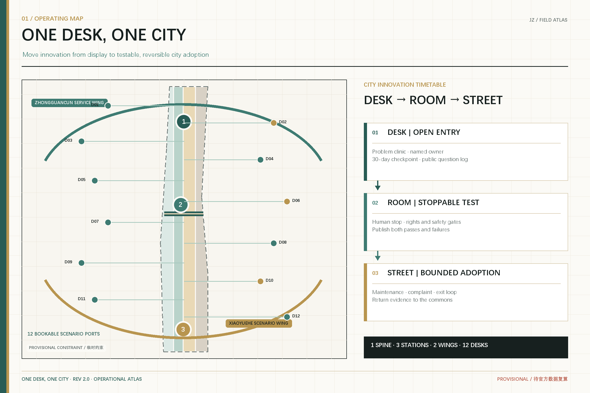
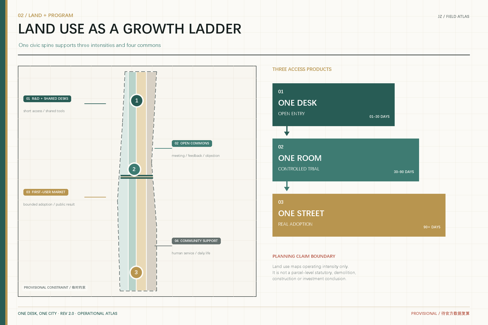
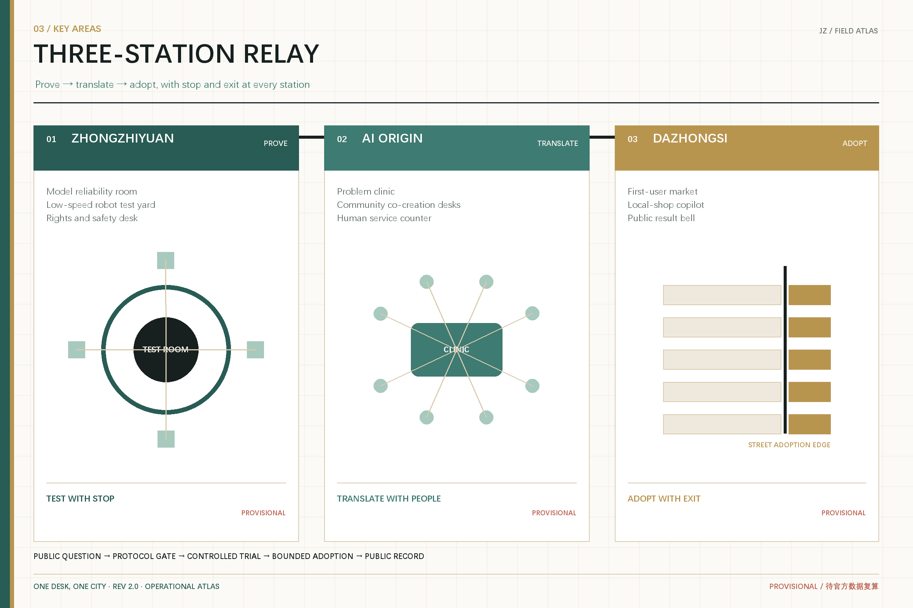
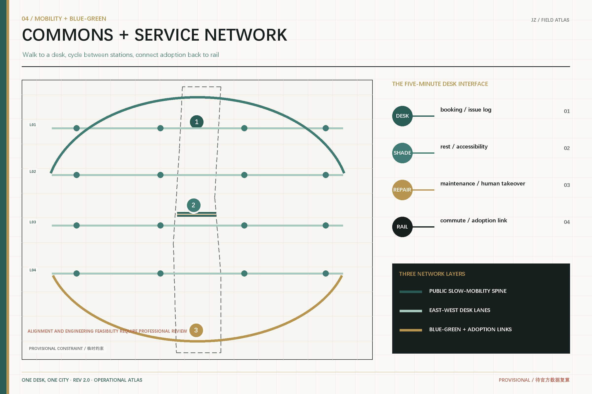
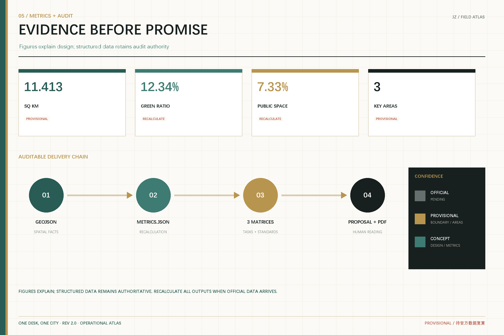

# ONE DESK, ONE CITY

**A Small-Team Innovation Belt from One Desk to One Street**

The scarce resource is not another AI showroom. It is a path that lets a small team turn an idea into a prototype, lets real users test it safely, and gives city organizations a way to adopt and maintain it. This proposal treats Jing-Zhang as shared urban innovation infrastructure: **start at one desk, test in one room, and earn adoption on one street**. Entry is determined by problem value, evidence, and public return rather than company size.

All spatial moves are conceptual suggestions based on the repository's provisional geometry. They are not statutory plans, approvals, investment commitments, or implementation decisions. The full package must be recalculated when official boundaries, regulatory controls, ownership, and existing-condition data become available.

## Design Basis and Source List

The official announcement and the cleared Agent taskbook govern the task. Local standard snapshots, the public source registry, and the structured site package define the evidence boundary [source:OFFICIAL-ANNOUNCEMENT] [source:AGENT-TASKBOOK] [standard:PROJECT-OFFICIAL-ANNOUNCEMENT]. The site and key-area polygons are provisional constraints used only for generation, discussion, and intake checks.

Official and cleared materials support task judgments; professional standards guide method; provisional geometry supports only conceptual layers and recalculable metrics. Global cases contribute transferable mechanisms, not local construction ratios. Full provenance and limitations are recorded in `sources.json`; data gaps and recalculation triggers are recorded in `assumptions.json`.

## Three-Level Scope Framework

The 43.6 sq km coordinated research area asks how innovation resources collaborate; the 11.4 sq km overall design area asks how innovation enters daily urban life; the three key areas ask how a small team moves from prototype to first urban user [depth:three_level_scope_framework] [data:geometry/site_boundary.geojson#SITE-001]. Together they form a spatial ladder: **desk - room - street**.

The structure is one public spine, three stations, two wings, and twelve desks. The heritage park is the commons spine; Zhongzhiyuan is the Prove Station, the AI Origin Community is the Translate Station, and Dazhongsi is the Adopt Station. The Zhongguancun wing supplies talent, capital, legal, and IP services; the Xiaoyuehe wing supplies real-world scenarios and community feedback.

## Coordinated Research Area: Industry and Future City Research

### Growth interfaces instead of leasing thresholds

AI may let smaller teams build complex products, while cities still require long leases, complete corporate credentials, and large one-off spaces. The proposal therefore offers three products: a **Desk Pass** for short collaboration, a **Test Room** for controlled trials, and a **Street Adoption Order** for real users and public feedback. Each records responsibility, data boundaries, acceptance tests, human takeover, and exit.

### Six transferable cases

| Case | Transferable mechanism | Jing-Zhang move |
| --- | --- | --- |
| STATION F, Paris | Heritage reuse, graded public access, program-based entry, shared services | Combine heritage interpretation with a desk-to-room growth ladder [source:CASE-STATION-F] |
| Maria 01, Helsinki | Incremental reuse of a former hospital and a member community | Start with a corridor and shared rooms before district-scale rebuilding [source:CASE-MARIA01] |
| LaunchPad, Singapore | Coworking, incubators, testbeds, and international nodes | Connect the two wings and three stations through one adoption protocol [source:CASE-LAUNCHPAD] |
| MaRS, Toronto | Co-location of research, startups, capital, corporate and civic partners | Make the Origin Community the translation layer between research and users [source:CASE-MARS] |
| Newlab Brooklyn | Industrial heritage, prototyping shops, and urban-scale test environments | Create bookable controlled rooms for agents, hardware, and robotics [source:CASE-NEWLAB] |
| CIC Fukuoka | Flexible desks, multidisciplinary events, and a global network | Extend product launch into a market interface for actual adoption [source:CASE-CIC] |

The brand is **ONE DESK, ONE CITY**. A gold dot represents the first desk; a teal path opens northward from prototype to city. An incomplete ring signals open collaboration. The address system uses desk, room, and street codes so every contribution, test state, and complaint returns to a real place.

## Overall Design Area: Urban Renewal and Regulatory-Plan-Level Urban Design

The overall design avoids invented statutory controls and instead defines interfaces that professional teams can deepen [standard:MOHURD-CONTROL-DETAILED-PLANNING] [data:geometry/land_use.geojson#LU-001] [depth:overall_spatial_structure]. The partition retains R&D, open green space, industry/commercial services, and community support, each linked to desk, room, or street intensity.

Desks occupy existing foyers, libraries, ground floors, and service points. Rooms are enclosed, observable, and reversible. Street pilots accept only scenarios that pass safety, data, accessibility, maintenance, and exit checks. Existing buildings, ownership, height, FAR, road redlines, and municipal capacity remain pending official data; design layers are conceptual and recalculable.

## Detailed Design of Key Areas

### Zhongzhiyuan: PROVE

The concept is a small-team verification garden. Bookable rooms support model/data evaluation, intelligent hardware prototyping, and low-speed human-machine tests. Every trial needs an accountable person, isolation boundary, manual stop, and public summary [data:geometry/key_areas.geojson#PROV-KEY-001].

### Beijing AI Origin Community: TRANSLATE

The Origin Community translates between research language, developer language, and resident problems through a Problem Clinic, Co-creation Desks, and Human Service Counter. Public or authorized data supports prototypes; independent observers record differences between human and machine outcomes [data:geometry/key_areas.geojson#PROV-KEY-002].

### Dazhongsi: ADOPT

Dazhongsi becomes a first-user market. Businesses, community institutions, and service organizations publish small, short, reversible needs; teams that pass verification run bounded street pilots. Four-quadrant walking links and station access remain conceptual, not engineering alignments [data:geometry/key_areas.geojson#PROV-KEY-003] [depth:three_key_area_detailed_design].

## AI Innovation Ecosystem, Personas, and AI+ Scenarios

The ecosystem links problem owners, small teams, validators, first users, and maintainers. Five personas are independent builders/small teams, university translators, community service workers, local businesses/small institutions, and residents without smart devices or with accessibility needs.

| # | Scenario | Place | Test and exit |
| --- | --- | --- | --- |
| 01 | Founder clinic | Public foyers | Human mentor review; archive after 30 inactive days |
| 02 | Civic problem desk | Origin Community | Minimum necessary data only |
| 03 | Model reliability room * | Zhongzhiyuan | Red-team, bias, and human review gates |
| 04 | Low-speed robot yard * | Zhongzhiyuan | Bounded time/area and on-site stop |
| 05 | Generated-content rights desk * | Zhongzhiyuan | Provenance, rights, labeling, complaint channel |
| 06 | Local-shop copilot | Dazhongsi | Business can stop; no mandatory profiling |
| 07 | No-phone service counter | Origin Community | Human, paper, and cash-accessible routes |
| 08 | Accessible route co-test | Public spine | Real users verify; AI only records |
| 09 | AI learning partner | Origin Community | Adult responsibility and time boundaries |
| 10 | Maintenance work-order assistant | Whole belt | Human confirms dispatch |
| 11 | First urban user day | Dazhongsi | Short adoption, public result and issues |
| 12 | Global small-team residency | Three stations | Public challenges; no funding or visa promises |

Starred items are industry verification scenarios. Public-facing generative AI services remain subject to applicable provider duties [standard:GENERATIVE-AI-INTERIM-MEASURES]. Accessibility continuity and human-service boundaries are release gates [standard:BARRIER-FREE-ENVIRONMENT-LAW].

## Land Use, Building Scale, and Retain-Renovate-Demolish Strategy

Land-use codes follow the repository enums and national classification logic [standard:MNR-LAND-USE-CLASSIFICATION-GUIDE] [data:geometry/buildings.geojson#BLDG-001] [depth:land_use_layout]. The decision order is use first, adapt second, build last. Time-sharing precedes permanent change; reversible interiors precede structural work; any construction follows verification of ownership, structure, fire safety, heritage, controls, and need.

The current footprint metric describes only concept geometry [metric:building_footprint_area_sqm]. Total floor area, FAR, height, density, and parcel-specific retain/renovate/demolish decisions remain pending official data.

## Transport, Rail, Municipal Infrastructure, and Public Services

The conceptual priority is walk to a desk, cycle between stations, and connect adoption to rail. The heritage spine carries continuous slow mobility and public experience; east-west Desk Lanes connect communities, campuses, parks, and stations. Crossings, bridges, tunnels, and underground works remain questions for professional study [data:geometry/roads.geojson#ROAD-001] [depth:traffic_rail_slow_parking].

Shared service points combine edge-compute booking, model evaluation tools, data-rights advice, accessibility testing equipment, and human help. Energy, communications, fire, water, and municipal capacities require professional calculation.

## Blue-Green Network, Public Space, and Urban Character

Green and public space are common ground where people can encounter a trial, understand it, and object to it [standard:MOHURD-URBAN-DESIGN-MEASURES] [data:geometry/public_space.geojson#PUBLIC-001] [metric:green_ratio]. Teal paths signal public access, gold dots signal contribution and adoption, and black ticks identify boundaries still awaiting verification.

Three pilgrimage landmarks are public-knowledge devices: the **First Desk** archives reproducible experiments; the **Human Handover Pavilion** shows takeover and resident feedback; the **First-Use Bell** lights only after real adoption and public reporting. Credit includes problem owners, testers, maintainers, and affected users, not only model or company names.

## Renewal Projects, Implementation Policy, and Phasing

The conceptual sequence is not a government funding or development commitment [data:geometry/phasing.geojson#PHASE-001] [depth:phasing_implementation]. **Open Desks** identifies 12 shared foyers and establishes responsibility templates. **Enter Rooms** creates reversible trial rooms at three stations. **Go to Street** lets verified teams answer bounded first-user orders with maintenance, complaint, exit, and asset-disposition records.

An annual cycle includes spring problem calls, summer residencies, autumn First Urban User Week, and winter maintenance/failure reviews. Issues record questions and evidence; Adoption Orders record responsibility; communications distinguish submitted, tested, adopted, and implemented status.

## Metrics, Area Recalculation, and Compliance Matrix

The current provisional geometry measures about 11.413 sq km, with a concept green ratio of about 12.34%, a concept public-space ratio of about 7.33%, and three key areas [metric:site_area_sqm] [metric:public_space_ratio] [metric:key_area_count]. These are submitted-layer measurements, not official planning controls.

Task coverage, professional standards, and design depth are stored in their three matrices. Prose explains judgments, JSON/GeoJSON supports machine review, and figures/PDFs support spatial communication [depth:metrics_recalculation].

## Risk, Copyright, and Compliance

The primary risks are missing official boundaries, regulatory controls, existing buildings, road/utility data, ownership, and engineering evidence. A second risk is treating small-team innovation as a reason to displace existing life or labor. Low disturbance, reversibility, human final judgment, and real-user participation remain binding limits [source:SOURCE-REGISTRY] [depth:risk_missing_data].

The declared AI agent generated all text, structured data, figures, PDFs, and offline HTML. External cases use public facts from official sites without copying restricted images or trademarks. The visual language uses original geometry and no remote fonts, tiles, trackers, or third-party images. This is an open co-creation proposal; human and professional teams retain final judgment.

## References

Sources are organized into four layers: task control, professional method, case inspiration, and provisional spatial constraints. The official announcement and cleared Agent taskbook define the required scopes, key areas, six Agent tasks, and boundary clause [source:OFFICIAL-ANNOUNCEMENT] [source:AGENT-TASKBOOK]. Urban-design, regulatory-planning, and land-use references distinguish conceptual suggestions from professional or statutory conclusions [standard:MOHURD-URBAN-DESIGN-MEASURES]. Official public pages from STATION F, Maria 01, JTC LaunchPad, MaRS, Newlab, and CIC provide transferable mechanisms only; they do not establish local demand, scale, investment, or performance. The provisional GeoJSON supports only the current spatial package and must be replaced and fully recalculated after official geometry arrives [data:geometry/site_boundary.geojson#SITE-001] [metric:site_area_sqm].

Full URLs, publishers, access dates, allowed uses, and limitations are recorded in `sources.json`; missing existing-condition and statutory inputs are recorded in `assumptions.json`. This structure lets professional teams identify what is fact, concept, recomputable evidence, or still undecidable, and then update every affected chapter, metric, figure, HTML page, and PDF when trusted new material becomes available.
