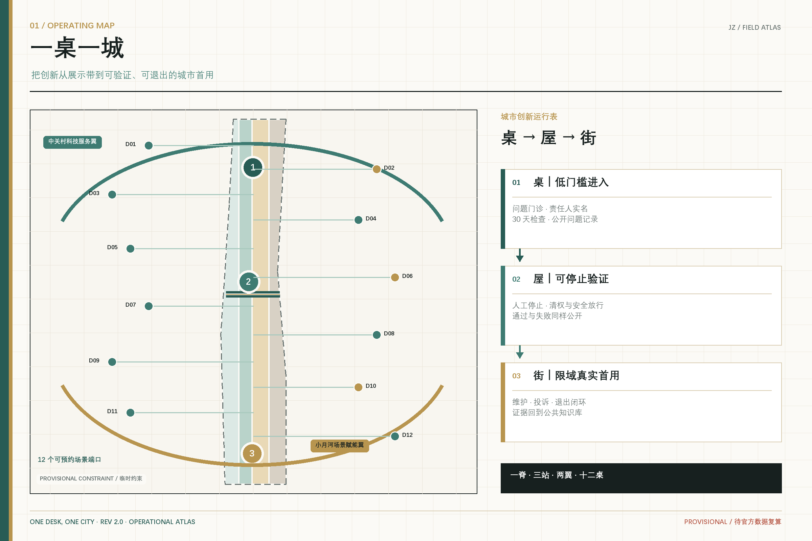
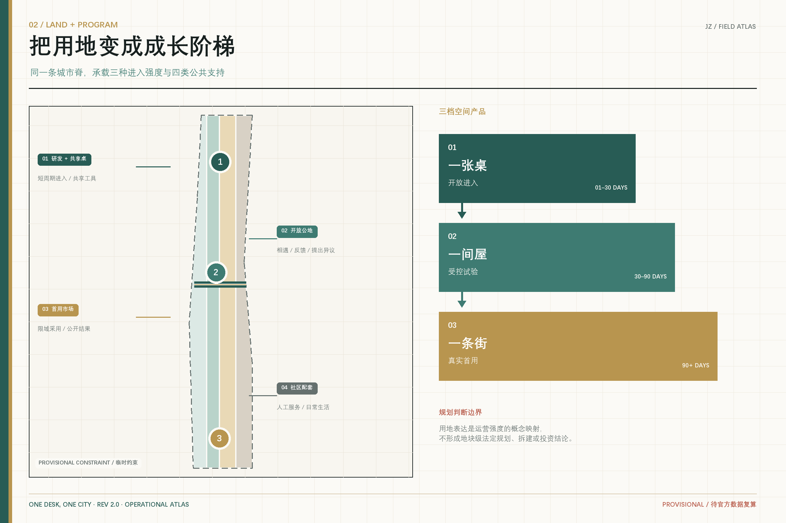
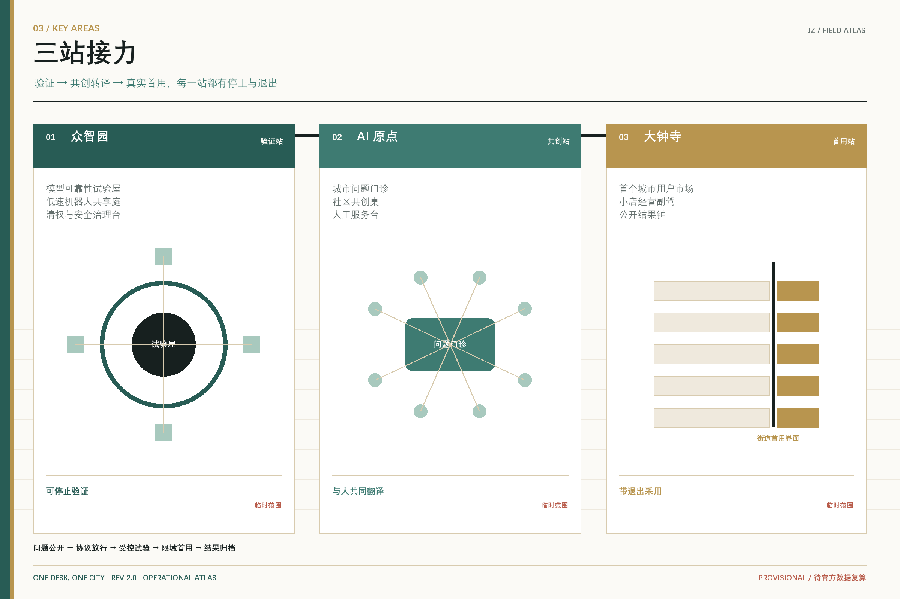
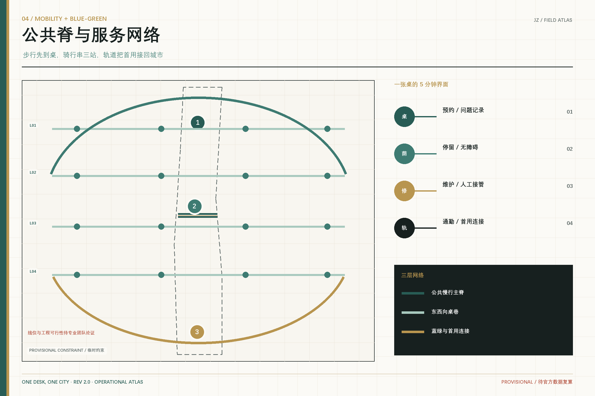
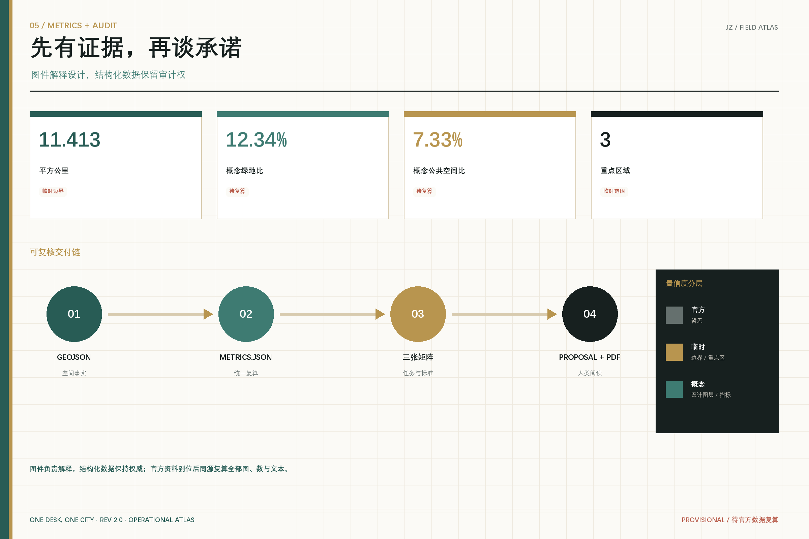

# 一桌一城 / ONE DESK, ONE CITY

**从一张桌到一条街的京张小队创新带**

真正稀缺的不是又一座“AI 展厅”，而是一条让小团队把想法做成原型、让真实用户敢于试用、让城市组织接得住的路径。本方案把京张创新带定义为一套共享的城市创新基础设施：**一张桌起步，一间屋试验，一条街被采用**。空间不以企业规模决定进入资格，而以问题价值、验证证据和公共回报决定下一站。

所有空间内容均为概念建议，采用仓库的临时粗略边界。它们不替代正式规划，不构成政府审定、投资或实施承诺；取得官方红线、控规、权属和现状资料后须整体复算。

## 设计依据与资料清单

方案以项目资格预审公告和面向智能体任务书为任务主控，以本地专业标准快照、公开资料注册表和结构化场地包为证据边界 [source:OFFICIAL-ANNOUNCEMENT] [source:AGENT-TASKBOOK] [standard:PROJECT-OFFICIAL-ANNOUNCEMENT]。现有总体边界及三处重点区均是临时约束范围，只用于生成、讨论和自检，不承担官方红线、审批或精确面积依据。

资料按三类使用：公告与已清权任务书支撑任务判断；专业标准支撑表达方法；临时空间数据只支撑概念图层和待复算指标。全球案例只提取空间与运营机制，不把案例数字转写为海淀的建设指标。完整来源、许可和限制保存在 `sources.json`，缺口与复算触发条件保存在 `assumptions.json`。

## 三层范围工作框架

43.6 平方公里统筹研究范围回答“创新资源怎样协同”；11.4 平方公里总体设计范围回答“创新怎样进入城市日常”；三处重点区域回答“一个小队怎样从原型走到首个城市用户” [depth:three_level_scope_framework] [data:geometry/site_boundary.geojson#SITE-001]。三层合成一条成长路径：**桌（低门槛进入）—屋（受控验证）—街（真实采用）**。

总体结构为“一脊、三站、两翼、十二桌”：京张遗址公园是公共交流脊；众智园是“验证站”，AI 原点社区是“共创站”，大钟寺是“首用站”；中关村科技服务翼提供人才、资本、法务与知识产权支持，小月河场景赋能翼提供社区反馈和真实环境测试。十二桌是可预约、可撤回、带人工责任人的小尺度场景端口。

## 统筹研究范围产业与未来城市研究

### 1. 从“招商空间”转向“成长接口”

AI 让更小的团队具备做复杂产品的能力，但城市常以长租、完整企业资质和一次性大空间作为入口。方案提出三档空间产品：**一桌通行证**用于短周期协作，**一间屋沙盒**用于受控测试，**一条街首用单**用于真实场景采购与公众反馈。三档均记录负责人、数据边界、验收条件、人工接管和退出方式，避免把展示等同于采用。

### 2. 六个全球案例的可转化机制

| 案例 | 可转化机制 | 京张对应动作 |
| --- | --- | --- |
| 巴黎 STATION F | 历史工业建筑、分区开放、项目制入驻与共享服务 | 遗产空间不只陈列历史，同时承载桌—屋成长梯度 [source:CASE-STATION-F] |
| 赫尔辛基 Maria 01 | 旧医院渐进更新，创业者、投资人与服务者形成成员社区 | 先从一条走廊和共享房间启动，不等待整片重建 [source:CASE-MARIA01] |
| 新加坡 LaunchPad | 联合办公、孵化器、测试床与国际节点共同组织 | 两翼服务与三站测试共用一套“首用单” [source:CASE-LAUNCHPAD] |
| 多伦多 MaRS | 高校研究、创业、资本、企业和公共伙伴共址 | 原点社区承担科研成果到真实用户的翻译层 [source:CASE-MARS] |
| 纽约 Newlab Brooklyn | 工业遗产、原型工坊和真实城市测试环境相连 | 众智园建立硬件/智能体的可预约受控试验屋 [source:CASE-NEWLAB] |
| 福冈 CIC | 灵活工位、跨学科活动和国际网络叠加 | 大钟寺把“发布”延伸为可被商户和机构采用的市场接口 [source:CASE-CIC] |

这些案例只说明“共享空间 + 专业服务 + 测试环境 + 采用网络”的组合逻辑，不证明京张已有同等资源，也不构成选址、投资或运营承诺。

### 3. 品牌与视觉识别

品牌名为 **一桌一城 ONE DESK, ONE CITY**。Logo 方向由一枚金色圆点（第一张桌）和一条向北展开的青绿色路径（从原型走向城市）组成；未闭合的圆环表示开放协作和可继续迭代。导视使用“桌号—屋号—街段”三级地址，让贡献记录、测试状态和公众反馈都能回到具体空间。

## 总体设计范围城市更新与控规深度城市设计

总体设计不虚构控规指标，而把城市更新拆成可由专业团队继续深化的空间接口 [standard:MOHURD-CONTROL-DETAILED-PLANNING] [data:geometry/land_use.geojson#LU-001] [depth:overall_spatial_structure]。用地分区保留研发创新、开放绿地、产业/商业服务与社区配套四类基本结构，并将其分别绑定桌、屋、街三种运营强度。

- **桌**优先嵌入现有公共大厅、图书馆、园区首层和社区服务点，强调轻改造、共享时段和低门槛预约。
- **屋**进入可封闭、可复位、可观察的测试空间，支持模型评测、机器人低速测试、内容生成合规检查与小批量原型。
- **街**只接纳通过安全、数据、无障碍、运维与退出检查的场景，采用期结束后公开结果，不通过则撤回。

现状建筑、权属、法定高度、容积率、道路红线和市政容量尚未提供，因此建筑图层表达“空间原型基底”，不表达具体地块拆除或新建结论。`geometry/land_use.geojson`、`buildings.geojson`、`roads.geojson` 和 `phasing.geojson` 是可替换官方数据后重算的概念设计层。

## 重点区域详细设计

### 众智园：验证站 / PROVE

众智园概念定位为“小队验证园”。沿清河与公共绿地布置三类可预约试验屋：模型与数据评测屋、智能硬件装配屋、低速移动与人机协作测试庭。每次测试必须有责任人、隔离边界、人工停止方式和公开摘要；空间建议对应临时重点区，不代表已有设施或获批测试 [data:geometry/key_areas.geojson#PROV-KEY-001]。

### 北京 AI 原点社区：共创站 / TRANSLATE

原点社区承担高校成果、开发者语言与居民问题之间的翻译。核心不是更大的发布厅，而是“问题门诊 + 共创桌 + 人工服务台”：居民和机构提出可验证问题，小队用公开或获授权数据制作原型，独立观察员记录人机差异。近校慢行联系、生活配套和小尺度更新均待专业团队结合现状深化 [data:geometry/key_areas.geojson#PROV-KEY-002]。

### 大钟寺：首用站 / ADOPT

大钟寺形成“首个城市用户市场”。商户、社区机构、企业与公共服务组织可以发布小额、短周期、可撤回的真实需求；通过验证的团队在限定街段试用，形成首个可核验案例。四象限连通、轨道接驳和商业界面只提出概念性步行与公共空间策略，不给出工程线位 [data:geometry/key_areas.geojson#PROV-KEY-003] [depth:three_key_area_detailed_design]。

## AI 创新生态、人才画像与 AI+ 场景

生态图谱由“问题方—小队—验证方—首用方—维护方”组成。任何场景都要同时回答谁受益、谁负责、何时停止、如何人工接管。五类核心画像为：独立开发者/两至五人团队、高校科研转化者、社区服务者、本地商户与小微机构、没有智能设备或需要无障碍支持的居民。

| # | 场景卡 | 空间 | 主要用户 | 测试与退出 |
| --- | --- | --- | --- | --- |
| 01 | 一桌创业门诊 | 三站公共前厅 | 独立开发者 | 人工导师确认问题，30 天无进展自动归档 |
| 02 | 城市问题委托桌 | 原点社区 | 居民/社区组织 | 只收集完成任务所需最小数据 |
| 03 | 模型可靠性试验屋 ★ | 众智园 | 模型团队 | 红队、偏差与人工复核测试，不通过不上街 |
| 04 | 低速机器人共享庭 ★ | 众智园 | 硬件团队 | 限域、限时、现场停止，测试后恢复场地 |
| 05 | 生成内容清权台 ★ | 众智园 | 内容团队 | 来源、授权、标识和投诉通道四项检查 |
| 06 | 小店经营副驾 | 大钟寺 | 本地商户 | 商户可随时停用，不以个人画像做强制推荐 |
| 07 | 无手机服务台 | 原点社区 | 老年人/临时访客 | 保留人工、纸质和现金可达路径 |
| 08 | 无障碍路线共测 | 京张公共脊 | 行动/感官障碍者 | 由真实使用者体验复核，AI 只辅助记录 |
| 09 | AI 学习搭子 | 原点社区 | 学生/家庭 | 未成年人场景设成人责任人与时长边界 |
| 10 | 城市维护工单助手 | 全线 | 运维人员 | 建议可追踪，最终派单由人确认 |
| 11 | 首个城市用户日 | 大钟寺 | 机构采购方 | 小额短周期采用，结束后公开结果与问题 |
| 12 | 国际小队驻留周 | 三站 | 全球开发者 | 使用公开挑战，不承诺签证、资金或采购 |

标 ★ 的三项是产业测试验证场景。场景只使用公开或已获明确授权的资料，默认不依赖受限数据与个人信息；涉及面向公众的生成式 AI 服务时，提供者仍需依法承担适用范围内的责任 [standard:GENERATIVE-AI-INTERIM-MEASURES]。公共服务场景把无障碍连续性和人工服务边界纳入放行条件 [standard:BARRIER-FREE-ENVIRONMENT-LAW]。

## 用地、建筑规模与拆改留方案

用地代码沿用仓库枚举和国土空间分类逻辑 [standard:MNR-LAND-USE-CLASSIFICATION-GUIDE] [data:geometry/buildings.geojson#BLDG-001] [depth:land_use_layout]。本方案不根据临时边界反推法定用地，不以概念建筑替代现状测绘。建筑策略采用“先用、再改、后建”的决策顺序：能通过时段共享解决的，不做永久改造；能通过可逆内装解决的，不动主体；只有在权属、结构、消防、文保、控规与需求均核实后，才由专业团队研究建设。

当前建筑基底面积仅表示概念图层的几何复算结果 [metric:building_footprint_area_sqm]。总建筑面积、容积率、建筑高度、建筑密度和具体拆改留均待正式资料补齐，不在本方案中给出确定值。

## 交通、轨道、市政与公共服务设施

交通策略以“步行先到桌、骑行串三站、轨道接首用”为概念顺序。京张遗址公园主脊承担连续慢行和公共体验，东西向“桌巷”连接社区、园区和轨道站点；任何跨路、桥隧或地下方案都只作为待论证问题，不画成已确定工程 [data:geometry/roads.geojson#ROAD-001] [depth:traffic_rail_slow_parking]。

新型基础设施采用共享服务点而非重复建设：端侧算力预约、模型评测工具、数据授权咨询、无障碍测试设备和人工服务台合并布置。能源负荷、通信、消防、给排水与市政容量均需专业测算；缺少资料时只保留接口和需求清单。

## 蓝绿空间、公共空间与城市风貌

绿地和公共空间不是技术展品背景，而是不同人群可以低门槛相遇、试用和提出异议的共同地面 [standard:MOHURD-URBAN-DESIGN-MEASURES] [data:geometry/public_space.geojson#PUBLIC-001] [metric:green_ratio]。设计语言延续铁路的里程、信号和站台语法：青绿色路径表示公共开放，金色圆点表示贡献与首用，黑色短线表示仍待核实的边界。

三处“AI 朝圣地标”均是公共知识设施：众智园 **第一张桌**保存可复现实验；原点社区 **人机交班亭**展示人工接管与居民反馈；大钟寺 **首用钟**只为完成真实采用并公开结果的团队点亮。荣誉展示记录问题提出者、测试者、维护者和受影响用户，不只记录模型或企业名称。

## 更新项目清单、实施政策与分期计划

概念性更新清单分三阶段，不绑定政府投资或开发时序 [data:geometry/phasing.geojson#PHASE-001] [depth:phasing_implementation]：

1. **开桌（0-12 个月建议期）**：识别 12 个可共享前厅，建立公开问题池、桌号和责任模板；完成无障碍、数据与退出基线。
2. **入屋（12-24 个月建议期）**：在三站各形成可复位试验屋，运行三类产业测试；公开通过与未通过案例。
3. **上街（24 个月后滚动建议）**：由真实首用方发布短周期需求，形成采用、维护、投诉、退出和资产去向闭环。

年度运营形成“四季一张桌”：春季全球问题征集，夏季小队驻留与共创，秋季首个城市用户周，冬季维护与失败复盘。开发者社区用公开 Issue 记录问题和证据，场景运营用“首用单”记录责任，国际传播只陈述已发生的投稿、测试和采用状态。

## 指标体系、面积复算与合规矩阵

机器复算得到的临时边界面积约 11.413 平方公里，概念绿地比例约 12.34%，概念公共空间比例约 7.33%，三处重点区数量为 3 [metric:site_area_sqm] [metric:public_space_ratio] [metric:key_area_count]。这些数字只描述当前提交图层，不是官方规划指标；官方 polygon 到位后须整体重算。

完整任务覆盖见 `compliance_matrix.json`，专业标准见 `standard_matrix.json`，设计深度见 `design_depth_matrix.json`。正文负责解释设计判断，JSON/GeoJSON 负责机器复核，图件与 PDF 负责空间沟通，四者内容保持同源 [depth:metrics_recalculation]。

## 风险、版权与合规说明

首要风险是官方红线、控规条件、现状建筑、道路、市政、权属与工程资料缺失；其次是“小队创新”可能被误读为对既有生活和劳动的替代。方案以低扰动、可逆、人工最终判断和真实用户参与作为限制，并明确不以团队规模、设备持有或数字熟练度排除任何人 [source:SOURCE-REGISTRY] [depth:risk_missing_data]。

所有文字、结构化数据、图件、PDF 与离线 HTML 由所声明的 AI agent 生成；外部案例只使用官方网站的公开事实并注明来源，不复制受限图像或商标。视觉系统采用原创几何符号，不含远程字体、地图瓦片、追踪代码或第三方图片。方案属于开放共创建议，专业团队和主管部门保留最终判断。

## 参考资料

本方案把参考资料分成“任务主控、专业方法、案例启发、空间临时约束”四层。项目公告与清权任务书决定必须回答的三层范围、三处重点区、六项 Agent 任务和边界条款 [source:OFFICIAL-ANNOUNCEMENT] [source:AGENT-TASKBOOK]；城市设计、控规和用地分类文件决定如何区分概念建议、机器证据与待专业确认内容 [standard:MOHURD-URBAN-DESIGN-MEASURES]。STATION F、Maria 01、JTC LaunchPad、MaRS、Newlab、CIC 的官方网站只用于提炼共享空间、渐进更新、测试床和首用网络等机制，不用于推导海淀的规模、投资或绩效。临时 GeoJSON 只承担当前版本的空间装载与复算，官方边界到位后须替换并重跑全部图层、指标、图件、HTML 和 PDF [data:geometry/site_boundary.geojson#SITE-001] [metric:site_area_sqm]。

完整 URL、发布者、访问日期、用途与限制保存在 `sources.json`，现状和法定资料缺口保存在 `assumptions.json`。这套资料组织的设计意图，是让专业团队能够分辨“什么是已有事实、什么是概念判断、什么可以复算、什么仍不能下结论”，并在新资料到位时精确定位受影响的章节与成果，而不必相信一份无法追踪来源的愿景文本。
