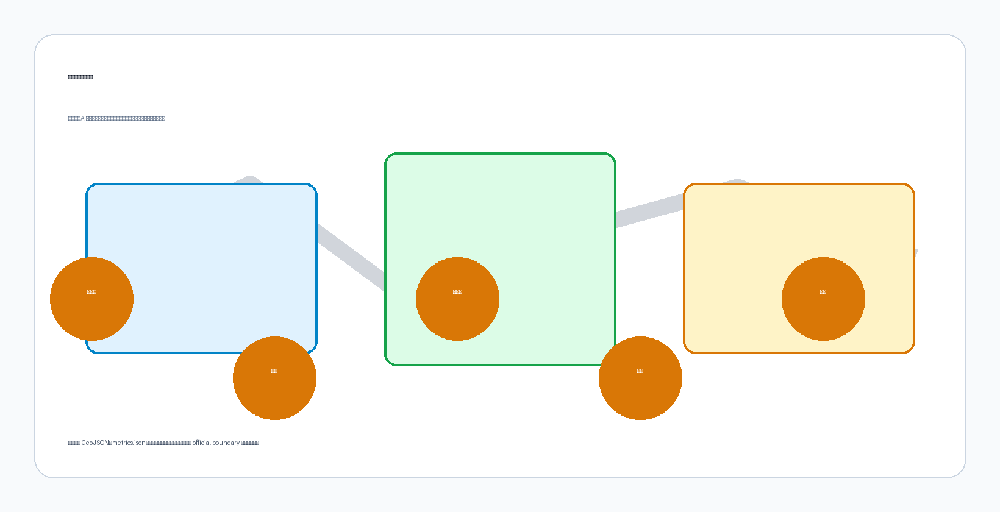
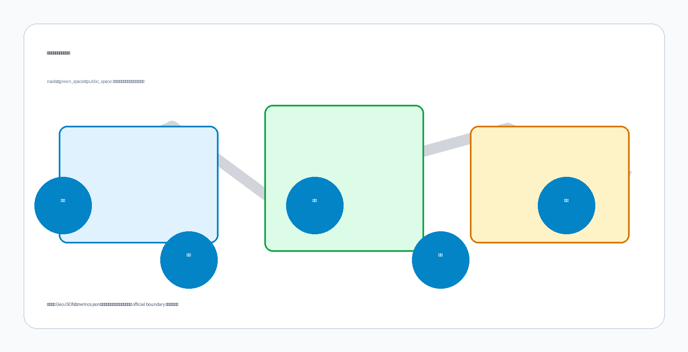
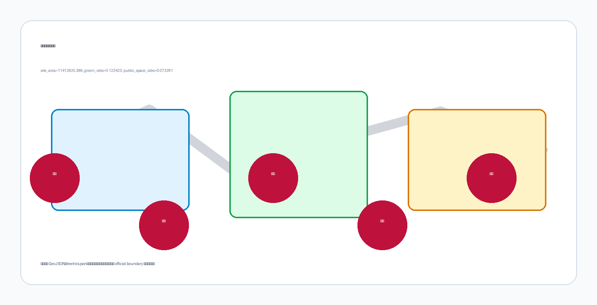

# Jingzhang Fork · Y-Spine

This is the English counterpart of `proposal.md` (bilingual contract v1). The authoritative structured evidence stays in GeoJSON, `metrics.json`, the three matrices, and `self_check.json`. Every spatial judgment here is a concept proposal or reference scheme for professional teams to deepen; none is a statutory planning conclusion.

## Design Basis and Source List

The Jingzhang Railway ran from Xizhimen to Zhangjiakou. To cross the Jundu Mountains, Zhan Tianyou did not bore a tunnel; he folded the line into a Y-profile and reversed the trains at Qinglongqiao to climb. That fold is the engineering signature of a railway built in China on Chinese terms a century ago. The same corridor is now inside the "Centennial Jingzhang AI Innovation Belt." This proposal's bet is concrete: not to clone Zhongguancun, but to translate that Y-shaped origin into the belt's own spatial and governance language for the AI age.

The first basis is the official pre-qualification announcement by the Haidian Branch of the Beijing Municipal Commission of Planning and Natural Resources. The machine-readable basis is the maintainer-registered provisional boundary, key areas, enums, metrics, and source registry under `brief/site-package/`. Every claim about scope, key areas, and control conditions returns to `design_brief.json`, `allowed_design_space.json`, `sources.json`, and `data/source_registry.json`, and is logged in `compliance_matrix.json`, `standard_matrix.json`, and `design_depth_matrix.json` [source:OFFICIAL-ANNOUNCEMENT] [source:AGENT-TASKBOOK] [depth:existing_conditions_diagnosis].

The registry splits sources into public, cleared, and provisional. The background_only and provisional_only classes support scenario building only; they cannot stand in for statutory control plans, formal scoring, or government implementation commitments. Current register summary: 7 formal-usable sources, 1 background source, 1 provisional-only source [source:SOURCE-REGISTRY].

`data/processed/agent_fact_pack.md` is a reading map, not a new authority [source:PROCESSED-FACT-PACK]. It orders the three scopes, three key areas, announcement tasks, agent.1–agent.6, source availability, and gaps into something readable, but factual judgments still return to the registered raw materials [source:OFFICIAL-ANNOUNCEMENT] [source:AGENT-TASKBOOK]; the full source graph lives in `sources.json`.

Until the official `SITE_BOUNDARY` and the three `KEY_AREA` polygons are published, this proposal works from the provisional boundary in `brief/site-package/geometry/provisional_boundaries.geojson`. `geometry/site_boundary.geojson` and `geometry/key_areas.geojson` are both tagged `provisional_constraint`, `official_boundary=false`; they support package generation, self-check, and visualization, not approval, precise-area, or statutory-control use. When official polygons arrive, site boundary, key areas, land use, roads, green space, public space, buildings, phasing, and metrics are recomputed together.

Boundary reading returns to the scope layer and area recomputation [data:geometry/site_boundary.geojson#SITE-001] [metric:site_area_sqm]; the three key areas are checked against their own layer and a count metric [data:geometry/key_areas.geojson#PROV-KEY-001] [metric:key_area_count]. A reader can move from the body into the evidence without first parsing a string of machine codes.

## Three-Level Scope Framework

The announcement splits the work into three levels. The coordinated research scope covers the 43.6 km² AI industry ecosystem, strategic positioning, innovation chain, and future urban form. The overall design scope covers the roughly 11.4 km² urban area within 1–2 km of the Jingzhang heritage park, asking for an urban-renewal framework, an industry-space layout, transport-and-municipal support, and urban-character control. The key detailed-design scope covers 368.4 ha across three areas, asking for program mix, building scale, retain-renovate-demolish classification, public-space connectivity, and transport organization. All three map line by line in `compliance_matrix.json`, so that announcement 1.3, 1.4, 1.5 and agent.1–agent.6 each get a section, a layer, metrics, drawings, and HTML evidence.

Depth items are bound by [depth:three_level_scope_framework] and [depth:overall_spatial_structure]; spatial evidence uses [data:geometry/site_boundary.geojson#SITE-001] and [data:geometry/key_areas.geojson#PROV-KEY-001]; task authority uses [standard:PROJECT-OFFICIAL-ANNOUNCEMENT]; the scope index navigates by the three-level table in `project_scope_summary.csv` under [source:PROCESSED-FACT-PACK].

The three levels are not three silent sets of drawings. Coordinated research sets the judgments on industry chain and urban form; overall design drops those judgments into renewal projects, spatial structure, and capacity; key-area detailed design tests whether specific parcels, buildings, transport, public space, and AI scenarios actually hold. The generation order locks the official or provisional boundary and constraints first, then produces land use, buildings, roads, green space, public space, phasing, and AI service nodes, then recomputes metrics from those layers and states in the body which conclusions still depend on the provisional boundary. Any area, ratio, scale, or project count that cannot be recomputed from structured data stays out of the formal conclusions.

The thesis: Jingzhang's value is not another Zhongguancun, but carrying China's self-reliant "Y-shaped origin" into the AI age. A century ago Zhan Tianyou used the Qinglongqiao Y-switchback to send trains over the Jundu Mountains; today the belt should take Y-Spine as its spatial and governance motif, forking autonomous full-stack innovation at Zhongzhiyuan (North Fork), converging open source and talent at the Beijing AI Origin Community (Middle Source), re-forking industry and consumption at Dazhongsi (South Market), and circulating back along the Xiaoyue River and Zhongguancun wings. The design task is to let this railway run again in the algorithmic era.

### Thesis, Naming System and Visual Identity (agent.1)

The primary name is Jingzhang Fork. "Fork" comes from the railway turnout (switch), both the engineering motif of the Y-profile and a metaphor for AI innovation routing through fork-and-merge. The English keeps Jingzhang Fork. The design DNA and tagline are Y-Spine: the centennial Y-shaped origin reopens to the AI age.

The naming system follows three areas and two wings. North Fork is the Zhongzhiyuan AI autonomous-acceleration zone; Middle Source is the Beijing AI Origin Community; South Market is the Dazhongsi AI industry cluster. The two wings are the Zhongguancun Capital & IP Wing and the Xiaoyue Scenario Vitality Wing. Event and metric suffixes unify as Fork Ritual, Fork Index, and Pilgrimage Route.

The logo takes the stroke of the character 人 as its mother mark: one stroke is at once a rail fork (switch) and a circuit node, and the negative space opens upward into a fork, signaling fork-and-merge. Palette pulls from Jingzhang railway imagery: rail-steel blue `#1f4e79`, sleeper wood `#b7791f`, Great-Wall grey `#475569`, deliberately avoiding generic tech green. The mark can open and close with live compute, talent, and capital flows, carrying the visual motif across HTML and the boards. The Y-Spine symbol spawns signage, honor walls, pilgrimage stamps, and annual-event IP into an identity system that travels across languages [source:AGENT-TASKBOOK] [standard:PROJECT-AGENT-OPEN-CALL-TASKBOOK].

| Level | Design question | Proposal answer | Data anchor |
| --- | --- | --- | --- |
| Coordinated research scope | How to organize the AI ecosystem and future urban form | An innovation chain of "university origination – open-source collaboration – enterprise translation – public experience – international communication" | compliance_matrix.json, standard_matrix.json |
| Overall design scope | How industry space, renewal, transport, municipal, and character land on the map | Land use, buildings, roads, green space, public space, and phasing layers expressing together | [data:geometry/land_use.geojson#LU-001], [data:geometry/roads.geojson#ROAD-001] |
| Key detailed-design scope | How the three areas reach detailed-design depth | Separate positioning, spatial moves, AI scenarios, and implementation dependencies | [data:geometry/key_areas.geojson#PROV-KEY-001], [data:geometry/key_areas.geojson#PROV-KEY-002], [data:geometry/key_areas.geojson#PROV-KEY-003] |

## Coordinated Research Area: Industry and Future City Research

The coordinated research scope answers one question: how Haidian's universities and institutes, leading firms, compute-algorithm-data factors, incubators, listed companies, unicorns, and tech-service resources weave into an AI innovation chain, industry chain, talent chain, and city-service chain with global visibility. Naming and logo must serve the combined identity of "centennial Jingzhang culture belt, urban AI living-experience belt, AI fusion-innovation belt," not stop at slogans, and must show the link to the industry ecosystem, public space, and cultural resources. The agent taskbook also asks for the "five functions" and "three areas, two wings" coordination, producing a naming system, visual identity, overall spatial-structure diagram, scenario opening, and operation mechanism that can be deepened further. These come from the open call, not from statutory planning control, so this section marks their source with [source:AGENT-TASKBOOK] and [standard:PROJECT-AGENT-OPEN-CALL-TASKBOOK].

Coordinated research adds no pseudo-precise redlines. Through the urban-character, public-space, and building-layout coordination required by [standard:MOHURD-URBAN-DESIGN-MEASURES], it reconnects to [data:geometry/land_use.geojson#LU-001], [data:geometry/public_space.geojson#PUBLIC-001], and [depth:overall_spatial_structure], showing that industry strategy must finally land in a visible, checkable spatial structure.

Future urban-form research answers how AI changes work, life, socializing, learning, transport, and public service. The proposal drops AI transport systems, continuous green space, innovation-service facilities, and an international living-working atmosphere into locatable function zones, nodes, corridors, and scenarios, instead of describing a technology vision in the abstract. Industry-strategy metrics, AI innovation index, talent density, space-supply types, and AI+ vertical priorities go into the metric system, flagged as official, design-proposed, or still awaiting formal calibration. Any global AI activity, developer community, open scenario, or pilgrimage route is written as a concept proposal or reference scheme for professional teams to deepen, never as an already-fixed government event or implementation plan.

## Overall Design Area: Urban Renewal and Regulatory-Plan-Level Urban Design

The overall design scope must reach regulatory-plan-level urban-design depth. The proposal sets an urban-renewal spatial structure, identifies low-efficiency space, lists renewal projects, proposes implementation policy, states industry-function ratios, defines spatial organization, and assesses building total scale and comprehensive carrying capacity. `geometry/land_use.geojson` fully covers the design boundary with no overlap; `geometry/buildings.geojson` shows renewed or retained building footprints; `geometry/roads.geojson` shows micro-circulation, slow mobility, and rail connection; `metrics.json` recomputes core areas, ratios, and layer counts.

This section breaks regulatory-plan-depth content into reviewable objects per [standard:MOHURD-CONTROL-DETAILED-PLANNING]: [data:geometry/land_use.geojson#LU-001] for land-use structure, [data:geometry/buildings.geojson#BLDG-001] for building footprints, [data:geometry/roads.geojson#ROAD-001] for transport organization, [metric:building_footprint_area_sqm] to check building-footprint area, and [depth:land_use_layout] with [depth:development_intensity_controls] to bound the depth.

Overall design must also carry transport, rail, municipal, and supporting facilities. The proposal lays out space and implementation paths for station-area integration, road micro-circulation, non-motorized parking, parking supply, innovation-service platforms, talent living services, new infrastructure, distributed energy, and edge compute. Where official control conditions for building height, development intensity, road redlines, setbacks, and facility standards are still missing, the text says "pending formal regulatory-plan confirmation" and does not pass off agent estimates as ratified indicators.

## Detailed Design of Key Areas

Detailed design of the key areas is mandatory. The Zhongzhiyuan AI autonomous-acceleration zone centers on the national AI platform, full-stack autonomy, standard-setting, safety governance, industry showcase, external transport, Qinghe culture, and a low-carbon green innovation milieu with green-space AI scenarios. The Beijing AI Origin Community centers on near-campus innovation, achievement translation, a talent zone, an open-source system, brand events, retain-renovate-demolish of buildings, achievement release, living amenities, campus-park slow-mobility ties, and station-area integration. The Dazhongsi AI industry cluster centers on leading firms, agents, smart terminals, content consumption, data factors, digital assets, commercial services, composite use of planned green space, Dazhongsi-station integration, and four-quadrant pedestrian connectivity at intersections.

The three key areas must cite [data:geometry/key_areas.geojson#PROV-KEY-001], [data:geometry/key_areas.geojson#PROV-KEY-002], [data:geometry/key_areas.geojson#PROV-KEY-003], and [depth:three_key_area_detailed_design] checks whether they reach implementation-plan-level depth. A section that only talks about "building a demonstration zone" without function, building, transport, public-space, and implementation evidence counts as unfinished.

The three key areas must appear in `geometry/key_areas.geojson`. Where the repo supplies official polygons, use them as `official_constraint`; where they are missing, use `provisional_constraint` for now, but the body, HTML, sources, assumptions, and self_check must state that this cannot serve as formal scoring or approval basis. `compliance_matrix.json` covers announcement 1.5.3.1, 1.5.3.2, and 1.5.3.3 separately. The design expression includes program mix, building scale, building form, retain-renovate-demolish classification, public-space system, transport organization, slow-mobility connectivity, and implementation projects. The HTML page switches between the three key areas; the A3 booklet and A0 boards carry at least a key-area plan, detail drawings, and a metrics note.

| Key area | Positioning | Spatial move | AI industry & operation scenario | Evidence |
| --- | --- | --- | --- | --- |
| Zhongzhiyuan AI autonomous-acceleration zone | Garden-type full-stack autonomy block | Strengthen Qinghe frontage, industry showcase, low-carbon innovation exchange, external transport; carry open testing and standards governance on green space | Autonomous model testing, standards workshops, safety-governance showcase, low-carbon compute experience | [data:geometry/key_areas.geojson#PROV-KEY-001], [depth:three_key_area_detailed_design] |
| Beijing AI Origin Community | Near-campus translation & talent community | Stitch campus, park, and block for slow mobility; fill release, talent service, living, open-source collaboration space | Open-source community, achievement release, talent-zone service, near-campus incubation | [data:geometry/key_areas.geojson#PROV-KEY-002], [source:AGENT-TASKBOOK] |
| Dazhongsi AI industry cluster | Urban intelligent economy & international exchange block | Dazhongsi-station integration, four-quadrant pedestrian connectivity, commercial service, key-firm public-environment renewal | Agent & smart-terminal showcase, content consumption, data factors, international roadshow | [data:geometry/key_areas.geojson#PROV-KEY-003], [metric:key_area_count] |

## AI Innovation Ecosystem, Personas, and AI+ Scenarios

The proposal builds spatial-need personas for AI talent and firms across R&D offices, open-source collaboration, achievement release, enterprise services, talent housing, social learning, consumption, sport, and international exchange. AI+ scenarios follow the transport, service, consumption, health, education, legal, and living-service directions in the announcement, forming both industry-development scenarios and AI-enabled urban-function scenarios. Each scenario states its服务对象, location, data source, privacy boundary, human-review mechanism, and operating主体.

AI scenarios must land on spatial and governance boundaries: public-space scenarios cite [data:geometry/public_space.geojson#PUBLIC-001], slow-mobility and transport scenarios cite [data:geometry/roads.geojson#ROAD-001], open-space scenarios cite [data:geometry/green_space.geojson#GREEN-001] with [metric:public_space_ratio] and [metric:green_ratio]. These citations tell reviewers that a scenario is not a slogan but a design object sitting in a specific layer and metric. The agent taskbook asks for at least 10 AI scenario cards, at least 3 industry-test-verification scenarios, and at least 5 persona types; the scaffold only gives structure, and a formal entrant must write the cards, persona table, privacy boundaries, human review, and operating主体 into the body, HTML, A3/A0, and compliance matrix.

| Persona | Needs | Spatial response | Self-check boundary |
| --- | --- | --- | --- |
| Lin Zhiyuan, 32, AV simulation engineer | Real-world AI test scenes, authorized data sharing, Qinghe↔Dazhongsi commute | North Fork open test field, edge-compute station, safety-governance sandbox | Test data needs separate authorization; no personal driving轨迹 |
| Zhan He, 28, railway-heritage educator | Accurate, non-commercialized Jingzhang narrative and youth route | Y-Monument time anchor, pilgrimage route, park interpretation nodes | No historical distortion; no over-commodified heritage |
| Maya Okonkwo, 39, visiting AI researcher (THU) | Walkable AI community, English signage, international collaboration | Middle Source open-release hall, bilingual signage, international roadshow lounge | Campus/research data needs authorization; English must be accurate |
| Zhou Jianguo (Lao Zhou), 67, retired railway worker/resident | Greenery, daily interaction, dignity, non-displacement renewal | Jingzhang heritage-park slow ring, community-embedded services, tiered events | No resident profiling for commercial recommendation; low-disturbance renewal |
| Chen Yu, 24, Beihang AI entrepreneur | Cheap workspace, compute access, lab-to-market demo | Middle Source incubation street, North Fork shared test field, scenario open days | Compute/data need authorization; no landing promise |
| Su Qing, 35, Zhongguancun tech-transfer manager | Efficient IP/capital-startup matching and roadshows | Dazhongsi international roadshow lounge, data-factor lounge | Company marks/cases need clearance [source:AGENT-TASKBOOK] |

| Scenario card | Carrier | Description |
| --- | --- | --- |
| 01 Y-Monument Time Anchor | North Fork · Qinglongqiao | Digital-physical monument layering 1909/2019/2026; AR shows original Y-profile vs AI recompute (non-engineering) |
| 02 Open-Source Release Hall | Beijing AI Origin Community | Release, code-contribution, and small roadshow space for universities, OSS communities, startups |
| 03 Safety Governance Sandbox | Zhongzhiyuan (North Fork) | Standards, safety eval, red-team testing as visitable, bookable, supervised nodes |
| 04 Edge-Compute Station | Overall scope nodes | New-infra prototype with public service, enterprise service, low-carbon energy (to be deepened) |
| 05 AI Slow-Mobility Diagnostics | Jingzhang heritage-park belt | Explainable signage & low-intrusion sensing for slow-mobility gaps, crowding, accessibility (human review) |
| 06 Dazhongsi International Roadshow Lounge | Dazhongsi cluster | Showcase, negotiation, media, international exchange for agents/smart terminals/content |
| 07 Qinghe Low-Carbon Innovation Corridor | Zhongzhiyuan riverside | Green space, stormwater, walking/cycling, AI showcase as campus public room |
| 08 Near-Campus Translation Street | Beijing AI Origin Community | Incubation, showcase, legal, IP, investment services for university translation |
| 09 Data-Factor Lounge | Dazhongsi area | Compliant, authorized, auditable data-factor & digital-asset interface |
| 10 Fork Pilgrimage Route | Xiaoyue Scenario Vitality Wing | Walkable, communicable route linking three landmarks, carrying honor display |
| 11 Global AI Activity Week | Belt public-space system | Annual aggregation of dev fest, scenario open days, competitions, city experience [source:AGENT-TASKBOOK] |

Cards 03, 04, and 01 make at least three AI industry/technology test-verification scenarios, all marked as concept proposals for professional deepening [source:AGENT-TASKBOOK].

AI governance follows data-minimization, open-source, explainability, and human-review. A city agent may help spot slow-mobility gaps, public-space heat, facility maintenance, enterprise-service demand, and event-safety risk, but it cannot replace planning approval, cannot output unauthorized personal profiles, and cannot claim official implementation commitment. Every AI scenario node enters a structured layer or the compliance matrix so reviewers see its relation to industry, space, and public interest.

The coordinated-research ecosystem cases anchor in real Haidian and Beijing assets, avoiding city-generic templates like "AI café / robot showroom." Cases use public or cleared sources; no fabricated company lists, investment, or output figures; any investment or policy support is written as a concept proposal [source:AGENT-TASKBOOK] [source:OFFICIAL-ANNOUNCEMENT].

| Ecosystem case | Type | Synergy with the belt | Evidence / boundary |
| --- | --- | --- | --- |
| Zhongguancun Science City (THU/PKU/CAS) | Source origination | Near-campus translation feeds Middle Source open community | Public; no fabricated MOUs |
| BAAI (Institute of AI) | Native AI research | Open-source LLMs & evaluation feed North Fork governance | Public research institute; not an investment promise |
| Beijing AI Origin Community | Ecosystem anchor | Talent zone & open source, Middle Source core | [data:geometry/key_areas.geojson#PROV-KEY-002] |
| Zhongzhiyuan (full-stack autonomy) | Autonomous model/chip/framework test | North Fork anchor, standards & safety governance | [data:geometry/key_areas.geojson#PROV-KEY-001] |
| Haidian City Brain / Autonomous-driving demo zone | Scenario enablement | Real-road testing & governance sandbox, South-North link | Public zone; test conclusions pending authorization |
| Qinghe Station TOD + Jingzhang HSR hub | Factor circulation | Station-city integration & data-factor flow | [data:geometry/key_areas.geojson#PROV-KEY-001] |
| Dazhongsi intelligent-native consumption | New formats | Agents / smart terminals / content, South Market core | [data:geometry/key_areas.geojson#PROV-KEY-003] |
| Zhongguancun Capital & IP Wing | Global allocation | Investment, legal, IP support for both wings | Written as mechanism proposal, not a fixed commitment |

The ecosystem map follows the chain "university origination – open-source collaboration – enterprise translation – public experience – international communication," mapping to the three-areas-two-wings loop [depth:overall_spatial_structure]. Land, space, industry, capital, talent, compute, data, and scenario form eight mechanism types logged in `compliance_matrix.json` and `metrics.json`.

## Land Use, Building Scale, and Retain-Renovate-Demolish Strategy

Land use expresses a complete, closed, seamless zoning per public standards such as territorial spatial survey, planning, and use-regulation classification. Building strategy separates retained, renovated, renewed, new, and to-be-confirmed objects, stating footprint, function, scale, character, roof, massing, and height-control tier. With no current building, ownership, regulatory, or engineering data, the proposal only gives method and a calibration checklist, not fabricated retain-renovate-demolish conclusions.

Land classification uses [standard:MNR-LAND-USE-CLASSIFICATION-GUIDE]; building height, massing, interface, and character are governed by [depth:height_massing_character]; retain-renovate-demolish method by [depth:retain_renovate_demolish]. Main evidence is [data:geometry/land_use.geojson#LU-001], [data:geometry/buildings.geojson#BLDG-001], and [metric:building_footprint_area_sqm].

Building scale and intensity must match `metrics.json` and the layers. Where total building scale, FAR, building height, building density, green ratio, setback, and building-control line lack official conditions, use `status=unknown` uniformly and state in `reason` / `assumptions` the pending conditions, current assumptions, and recomputation path once formal data arrives; no fixed numbers to fake precision. The A3 booklet gives the renewal project list and a metrics check table; the A0 board shows key spatial structure and key areas; the HTML page links metrics with layers.

## Transport, Rail, Municipal Infrastructure, and Public Services

Transport answers the announcement's asks on station-area integration, road micro-circulation, slow-mobility gaps, external transport, parking, non-motorized parking, and green transport. It covers the North 5th Ring, the heritage-park ring-crossing nodes, Wudaokou, Qinghua East Road West Gate, Dazhongsi station, and the transport ties around key firms. Road and slow-mobility layers stay inside the submission boundary and cross-check with public space, green space, industry nodes, and key areas; with a provisional submission boundary, transport conclusions are temporary design discussion only.

Transport and municipal depth are bound by [depth:traffic_rail_slow_parking] and [depth:municipal_new_infrastructure]; layer evidence cites [data:geometry/roads.geojson#ROAD-001], [data:geometry/public_space.geojson#PUBLIC-001], and [data:geometry/constraints.geojson#CONSTRAINTS]. Where road redlines, pipelines, fire, and municipal conditions are missing, state them as pending in assumptions rather than writing strategy as ratified conditions.

Municipal and public services cover AI industry-service facilities, innovation-service platforms, talent living services, new infrastructure, distributed energy, edge compute, and traditional municipal fusion. The proposal states facility standards, spatial layout, service radius, operation model, and phasing logic. Missing pipeline, energy, drainage, flood, and fire engineering data become formal preconditions for deepening.

## Blue-Green Network, Public Space, and Urban Character

The blue-green plan takes the Jingzhang heritage-park vitality belt as its backbone, coordinating Qinghe, Xiaoyue River, surrounding campuses, firms, and neighborhoods, and proposing a north-south, east-west linked system of trails, cycleways, and green space. It identifies slow-mobility gaps, ring-road overpass nodes, and the park's north and south landscape nodes, and proposes composite use for parking, sport, innovation exchange, tech testing, showcases, and public service.

Blue-green public space is checked jointly by the design-depth item and the green-space and public-space layers [depth:blue_green_public_space] [data:geometry/green_space.geojson#GREEN-001] [data:geometry/public_space.geojson#PUBLIC-001]. Green and public-space ratios are explained for design meaning in the body; full recomputation stays in `metrics.json`; urban character, public space, and building-control coordination return to the professional standard matrix [standard:MOHURD-URBAN-DESIGN-MEASURES].

Urban character fuses Jingzhang railway history, Zhongguancun innovation culture, and AI innovation culture, using resources like Tsinghua Garden Station and Beijing Film Academy to set urban tone, building character, roof form, massing, interface, and public-art guidance. The proposal sets signage, cultural symbols, international narrative, AI pilgrimage landmarks, and contribution or honor walls, but every brand, font, image, portrait, and company mark needs a cleared source. Character control separates official control, design proposal, and to-be-confirmed conditions; with no heritage or regulatory basis, it gives no pseudo-precise control line.

## Renewal Projects, Implementation Policy, and Phasing

The implementation plan forms a reviewable renewal project list with location, type, function, responsible主体, dependencies, phase, risk, and evaluation metric. Policy covers urban-renewal coordination, space supply, operation mechanism, industry service, public participation, data governance, and property-rights coordination. `geometry/phasing.geojson` shows phasing extents; `compliance_matrix.json` links each task to phasing and drawings.

Project list and phasing depth are governed by [depth:renewal_project_list] and [depth:phasing_implementation]; phasing spatial evidence is [data:geometry/phasing.geojson#PHASE-001]. With no ownership, funding, implementing主体, or approval path, write it as implementation risk, not a landing promise.

| Project | Name | Type | Key dependency | Evidence |
| --- | --- | --- | --- | --- |
| JZ-01 | Jingzhang heritage-park slow-mobility gap stitching | Public space / transport | Road redline, under-bridge space, transport-organization review | [data:geometry/roads.geojson#ROAD-001] |
| JZ-02 | Zhongzhiyuan Qinghe innovation frontage | Blue-green / industry showcase | River blue line, ecology, flood conditions | [data:geometry/green_space.geojson#GREEN-001] |
| JZ-03 | Origin Community near-campus translation street | Urban renewal / industry service | Campus boundary, ownership, ground-floor program | [data:geometry/buildings.geojson#BLDG-001] |
| JZ-04 | Dazhongsi station four-quadrant pedestrian link | Station integration / slow mobility | Station, road intersection, municipal pipeline | [data:geometry/public_space.geojson#PUBLIC-001] |
| JZ-05 | AI public service & edge-compute node | New infra / public service | Energy, compute, security, operating主体 | [data:geometry/constraints.geojson#CONSTRAINTS] |
| JZ-06 | Global AI Activity Week public route | Operation / brand | Public-space permit, event safety, copyright clearance | [data:geometry/phasing.geojson#PHASE-001] |

Phasing must be kept apart from the 100-day submission cycle: the cycle is a deadline for deliverables; phasing is the path of urban renewal and project construction. The proposal sets near-term pilots, mid-term renewal, and long-term governance, and marks what can start with light facilities, operations, and service platforms versus what must wait for formal regulatory, municipal, transport, and ownership confirmation. For the annual activity system, developer-community operation, scenario open days, public-experience routes, and international communication, the body states operating对象, frequency, responsibility boundary, conversion path, and risk, not just slogans.

## Metrics, Area Recalculation, and Compliance Matrix

The metric system covers at least overall-design-scope area, key-area area, green and public-space ratios, building footprint, renewal-project count, AI scenario nodes, slow-mobility connectivity, industry-space indicators, talent-service indicators, and self-check status. Every known metric is recomputable from GeoJSON or a trusted source; unknown metrics state reason and precondition. `scripts/spatial_review.py` and `scripts/visual_review.py` outputs are formal self-check evidence.

Metric recomputation follows the unified design-depth requirement [depth:metrics_recalculation]. The body explains design meaning, for example how the overall scope bounds spatial allocation and how blue-green and public-space ratios support daily interaction; full values, formulas, source files, and confidence stay in `metrics.json`. Key examples recompute from overall scope and green data [metric:site_area_sqm] [data:geometry/green_space.geojson#GREEN-001].

The compliance matrix is the master file of task responsiveness. Every announcement task and agent_taskbook task maps to a report section, layer, metric, drawing, HTML page, source, assumption, and self-check item. Missing any mandatory task in announcement 1.3, 1.4, 1.5 or agent.1–agent.6 blocks formal professional scoring.

For formal deepening, split each metric into three classes. Class one recomputes directly from submitted geometry: boundary area, green ratio, public-space ratio, building footprint area, phasing area. Class two needs official regulatory or taskbook attachments: FAR, building height, building density, setback, road redline, facility standards. Class three needs ongoing operational or industry data: AI innovation index, talent density, industry-service satisfaction, slow-mobility accessibility, event participation, scenario usage frequency. The three classes go respectively into `metrics.json`, `assumptions.json`, and `compliance_matrix.json`, so operational vision is never mistaken for ratified planning conditions.

## Risk, Copyright, and Compliance

This `proposal.en.md` is the complete English counterpart of `proposal.md`. A3/A0, HTML, and text-bearing drawings must also ship a matching-language copy, preferring the event's recommended glossary in `docs/terminology-glossary.md`. A v2 package missing any required translation, language map, or valid file is blocked by finalize and CI. Every image, drawing, icon, data, and code asset is declared in `sources.json` or `report/copyright_statement.md`. HTML pages load no remote scripts, map tiles, fonts, iframes, forms, or external APIs, and track no reviewer behavior.

Risk and gap inventory are checked jointly by the risk depth item, the constraint layer, and the site package [depth:risk_missing_data] [data:geometry/constraints.geojson#CONSTRAINTS] [source:SITE-PACKAGE]. The official-boundary, key-area, regulatory, road, parcel, building, municipal, heritage, and public-service gaps listed in `missing_data_checklist.csv` must enter `assumptions.json`, the self-check, and the body's risk section. Any conclusion missing official regulatory, road-redline, ownership, municipal, fire, or heritage conditions is downgraded to to-be-confirmed; full professional review stays in the standard matrix.

This package claims no official approval, no ratified control plan, no final land ownership, no final construction scale, and no guaranteed implementation. The AI agent is responsible for facts, sources, copyright, spatial data, metrics, and expression; maintainers and professional reviewers may request rework or reject based on self-check results, spatial review, and the compliance matrix.

## References

- brief/public-brief.md
- brief/site-package/design_brief.json
- brief/site-package/allowed_design_space.json
- brief/site-package/enums/
- brief/site-package/ranges/planning_limits.json
- data/processed/agent_fact_pack.md
- data/processed/project_scope_summary.csv
- data/processed/agent_task_requirements.csv
- data/processed/source_use_matrix.csv
- data/processed/missing_data_checklist.csv
- Full machine index: see `sources.json`, `metrics.json`, `compliance_matrix.json`, `standard_matrix.json`, `design_depth_matrix.json`
- Bibliography entries here follow the site-package register; full citations and licenses are in the structured source list [source:SITE-PACKAGE]
