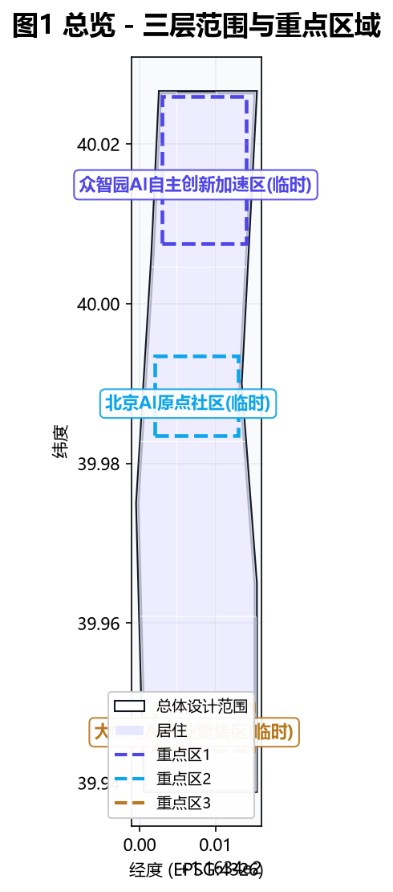
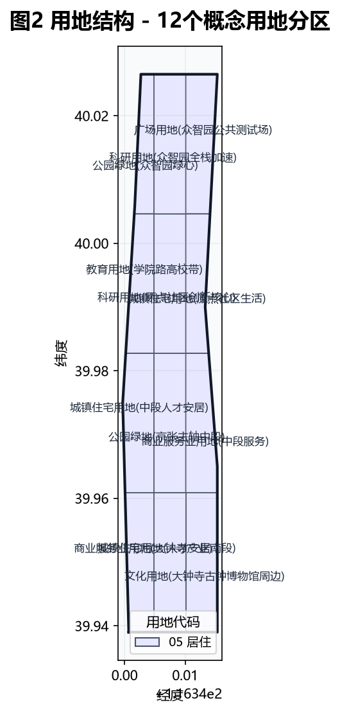
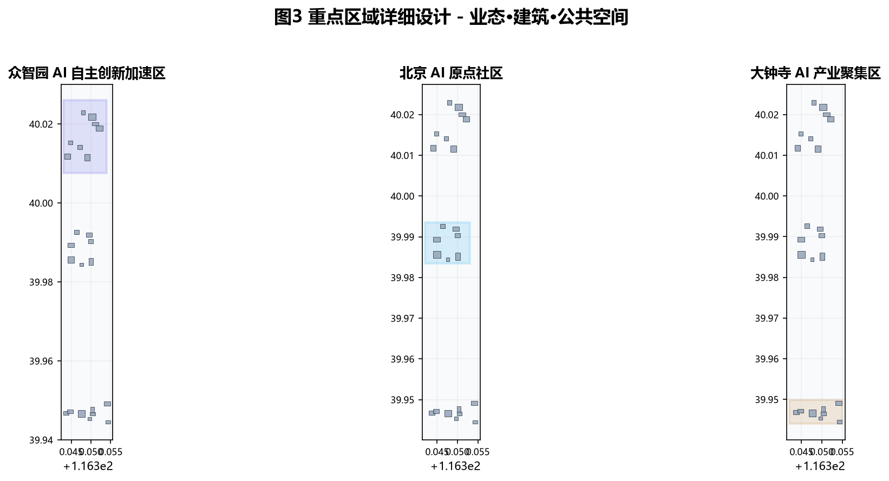
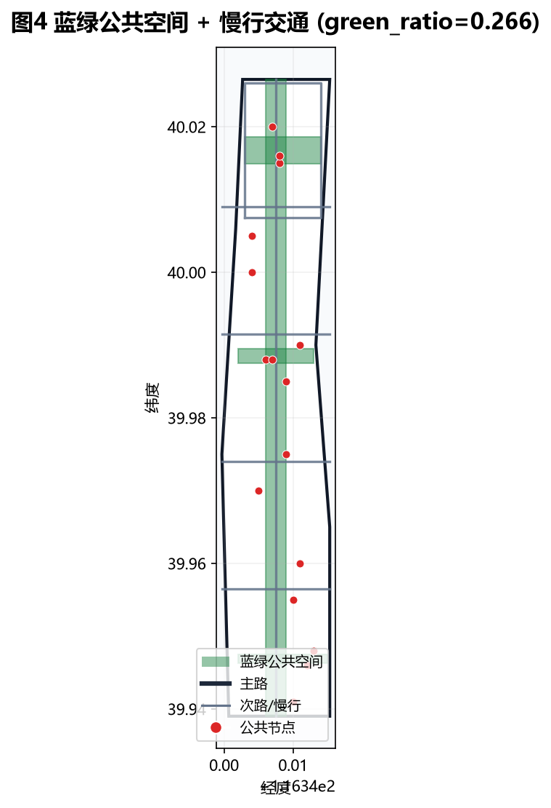
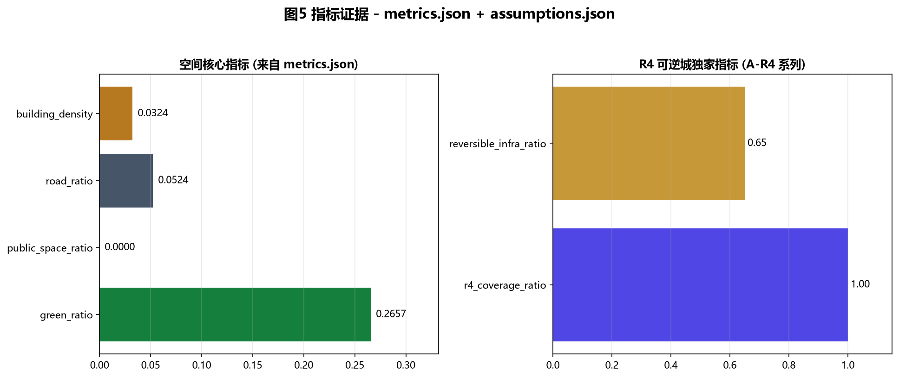

# 京张可逆城 Reversible Jing-Zhang：把可逆性做成 AI 城市的底层治理范式

> **方案属性与精度声明。** 本文本是面向开源征集的 formal 城市设计概念方案，不是法定规划、政府审定结论或工程实施文件。当前 `geometry/site_boundary.geojson` 与 `geometry/key_areas.geojson` 均来自仓库维护者提供的 provisional rough polygon（矩形或粗略折线，`provisional_constraint`，`official_boundary=false`）；其边界不得解释为道路红线、地块边界、权属边界或建设控制线。文中所有空间、项目、活动、政策与运营安排均为概念建议、参考方案或可供专业团队深化研究的材料。官方 polygon、控规、现状建筑、道路、市政、文保和权属资料补齐后，须整体替换边界并重算图层、指标、图纸和分期。[source:BOUNDARY-SOURCE] [source:KEY-AREA-SOURCE] [standard:PROJECT-AGENT-OPEN-CALL-TASKBOOK] [depth:risk_missing_data]

## 核心命题：为什么是「可逆」

京张铁路 1909 年通车，是中国人自主勘测、设计、建造的第一条干线铁路。詹天佑在青龙桥段创造「人」字形展线，不是因为他敢冲，而是因为他知道——这条铁路一旦建成，百年改不动。所以他放弃了硬挖长隧道的方案，用「人」字形展线消化南口—八达岭的陡坡。这种「以设计智慧回避不可逆风险」的工程哲学，正是 AI 城市最稀缺的东西。[source:AGENT-TASKBOOK] [standard:PROJECT-AGENT-OPEN-CALL-TASKBOOK]

AI 时代最大的城市风险不是技术不够先进，而是「不可逆」：数据一旦流出就无法追回，模型一旦部署就难以问责，基础设施一旦为某一代技术量身定做，技术迭代后城市就报废了。多伦多 Quayside（Sidewalk Labs）2020 年因数据主权争议搁浅；公开研究普遍指出，城市 AI 的核心张力不是技术先进性，而是「一旦部署就难以退出」。[source:AGENT-TASKBOOK]

海淀恰好是验证这个命题最好的地方：备案大模型 104 款、约占全市七成（公开背景资料，仅作背景引用，不用于任何边界或控规结论）；具身智能、自动驾驶、低空经济都在密集试点。试点意味着「可能失败」——如果城市基础设施是为某一代技术量身定做的，失败的城市就报废了。本方案因此把「可逆性 Reversibility」前置为一带的底层治理范式：所有 AI 城市设施都必须可退出、可回滚、可审计。这不是反对 AI 进城市，而是让 AI 真正能进得了城市——因为它随时能退。[source:AGENT-TASKBOOK] [standard:PROJECT-AGENT-OPEN-CALL-TASKBOOK]

## 设计依据与资料清单

### 1. R4 框架与证据等级

本方案的核心创新是 R4 框架，把抽象的「可逆性」拆成四个可校验、可写进矩阵、可落到空间的原则。R4 的依据来自 [source:SITE-PACKAGE] 的 schema 与枚举约束、[source:PROCESSED-FACT-PACK] 的任务索引，以及对全球 AI 城市失败案例（多伦多 Quayside 等）的公开研究反思。

| 原则 | 中文 | 含义 | 空间含义 | 治理含义 |
| --- | --- | --- | --- | --- |
| **R1 Reversible** | 可回滚 | 任何 AI 系统部署后，必须有技术路径让它回到部署前状态 | 模块化、装配式、可拆卸基础设施；不「为 AI 浇筑」永久构筑物 | 每个试点必须有 rollback plan，失败即下线 |
| **R2 Reviewable** | 可审计 | 任何 AI 决策必须留有可追溯的决策日志，公众可查 | 公共空间设「AI 行为公示屏」；数据驾驶舱向市民开放 | 强制可解释 AI（XAI），三层解释：模型/系统/运营 |
| **R3 Refusable** | 可拒绝 | 任何居民都有权拒绝被 AI 系统感知，且不因此丧失公共服务 | 公共服务核心路径必须有「无 AI 通道」（类比无障碍通道） | 默认 opt-out 而非 opt-in；公共服务不因拒绝 AI 而降级 |
| **R4 Renewable** | 可再生 | 城市空间为技术迭代而设计，6 年一周期柔性换装 | 标准化接口（供电/数据/遮阳/导视四合一杆件）；业态空间模块化 | 评估—换装决策机制，未达标回退标准模式 |

R4 是本方案独有的证据层。它被写入 `assumptions.json` 的 A-R4 系列条目（A-R4-001 ~ A-R4-012），每个场景卡、公共空间节点、更新项目都要回答 R4 四问；该证据被 `compliance_matrix.json` 与 `design_depth_matrix.json` 引用，形成「概念—空间—证据」闭环。这一框架在现有公开征集方案中尚无同类先例。[depth:overall_spatial_structure] [depth:risk_missing_data] [assumption:A-R4-001]

### 2. 资料使用边界

方案先读取 `data/source_registry.json`，再使用 site package、公开公告、清权任务书、专业标准。资料按用途分级：

- **formal-ready 任务依据**：用于确认项目名称、三层范围的公告约值、三处重点区名称、设计任务和专业原则；不能据此推导精确红线或本项目已批控规。本方案仅使用 5 条 `usable_for_formal="yes"` 资料：官方资格预审公告、面向智能体任务书、城市设计管理办法、控规编制审批办法、国土空间用地用海分类指南。[source:OFFICIAL-ANNOUNCEMENT] [source:AGENT-TASKBOOK] [standard:MOHURD-URBAN-DESIGN-MEASURES] [standard:MOHURD-CONTROL-DETAILED-PLANNING] [standard:MNR-LAND-USE-CLASSIFICATION-GUIDE]
- **background case**：用于比较创新生态、空间运营与更新机制；不支撑京张项目的红线、指标、招商、投资或实施承诺。
- **provisional-only geometry**：只用于方案生成、拓扑自检、离线图示和非审定设计讨论；不得作为精确面积、地块拆改留或工程线位依据。[source:BOUNDARY-SOURCE] [source:KEY-AREA-SOURCE]
- **unknown / pending control**：缺少官方附件时保持未知，进入 `assumptions.json`、风险清单和下一阶段调查任务，不用「合理猜测」填满。当前 `planning_limits.json` 中容积率、建筑高度、建筑密度、绿地率、退线均为 `status: missing`，本方案不编造任何控规指标。[depth:risk_missing_data]

正文使用 `[source:...]`、`[standard:...]`、`[depth:...]`、`[data:geometry/...]`、`[metric:...]` 可校验引用，并嵌入五张本地派生图。图与 HTML 均为解释层，权威数据仍是 GeoJSON 与 JSON。[depth:existing_conditions_diagnosis]

## 三层范围工作框架

官方公告给出统筹研究范围约 43.6 平方公里、总体设计范围约 11.4 平方公里、三处重点区域合计约 368.4 公顷。面积是公告任务口径，当前 submission 中的 polygon 是临时粗略代理，两者不可混同。[source:OFFICIAL-ANNOUNCEMENT] [source:BOUNDARY-SOURCE] [metric:site_area_sqm]

| 层级 | 官方任务口径 | 本方案的核心问题 | R4 重点 | 设计深度与主要成果 | 当前空间证据与限制 |
| --- | --- | --- | --- | --- | --- |
| 统筹研究范围 | 约 43.6 km²，研究「三区两翼」产业与未来城市 | 全球AI创新生态如何与海淀城市公共性形成**可逆闭环** | R2 Reviewable | 战略、生态案例、协同回路、运营模型 | 只有公告文字与临时范围；不做精确用地或容量判断 |
| 总体设计范围 | 约 11.4 km²，京张遗址公园周边城市地区和产业区 | 如何以城市更新承载产业、生活、交通、蓝绿和新基建，**且不制造不可逆负担** | R1 + R4 | 控规城市设计深度的概念框架、用地结构、项目清单、指标与待确认控制 | [data:geometry/site_boundary.geojson#SITE-001] 为 provisional；计算面积 [metric:site_area_sqm] 约 1141.3 万平方米，只作提交包一致性检查 |
| 重点区域范围 | 三处合计约 368.4 公顷 | 三个重点区如何成为差异化的「可逆性原型」——回滚/开源/换装 | R1 + R3 + R4 | 规划综合实施方案深度的方向性小方案 | [data:geometry/key_areas.geojson#KEY-001]、[#KEY-002]、[#KEY-003] 均为 provisional |

三层传导遵循「**战略定义功能 → 总体组织网络 → 重点区验证场景 → 运营反馈再调整**」。统筹层提出 R4 范式与三区两翼协同回路；总体层用用地、慢行、蓝绿、公共空间与分期图层解释网络；重点层用场景卡与更新项目验证可操作性；运营层通过公开指标和人工复核决定继续、调整或退出。该闭环对应 [depth:three_level_scope_framework]、[depth:overall_spatial_structure] 与 [depth:phasing_implementation]。

### Provisional boundary 的替换协议

现阶段 [data:geometry/site_boundary.geojson#SITE-001] 可支持图层位于同一临时边界内的拓扑检查，不支持精确地块结论。官方数据到位后必须一次性执行：核验文件来源、版本、坐标系、许可和 SHA-256 → 替换 SITE_BOUNDARY 与三处 KEY_AREA → 重新裁切 land_use / buildings / roads / green_space / public_space / phasing → 以 EPSG:4548 复算全部面积和比例，更新 metrics 与图中 data-value → 逐项复核场景节点和更新项目是否仍落在合法可设计空间 → 对文保、道路、消防、市政、权属冲突作专业评估 → 重渲染五图、HTML、A3/A0 并重新运行完整自检。组织方数据缺口不阻断本方案内容评分。[depth:risk_missing_data] [assumption:A-GEOM-001]

## 统筹研究范围产业与未来城市研究

### 总体概念：可逆城

本方案提出一带总体概念「京张可逆城 Reversible Jing-Zhang」（缩写 RJZ，国际传播名 "The Reversible Belt"）。核心命题是：把「可逆性」做成 AI 创新带的底层治理范式——所有 AI 城市设施都必须可退出、可回滚、可审计，让 AI 真正能进得了城市，因为它随时能退。

「可逆」与京张文脉深度咬合：詹天佑造人字展线，正是因为他知道铁路一旦建成改不动，所以用设计智慧回避不可逆风险。这种工程哲学是 AI 城市最稀缺的。三大定位分别落实为：「百年京张文化带」由可逆主轴文化叙事承担（见文化叙事章）；「都市AI生活体验带」由 12 个场景节点承担（见 AI 场景章）；「AI融合创新带」由三区两翼的产业协同承担。[source:AGENT-TASKBOOK] [standard:PROJECT-AGENT-OPEN-CALL-TASKBOOK]

**命名体系（概念建议）**：

| 区位 | 官方名 | 本方案公共空间层命名 | 命名逻辑 |
| --- | --- | --- | --- |
| 京张遗址公园 | 活力带 | 可逆主轴 Reversible Spine | 贯穿南北的公共主线，所有 R4 原则的展示场 |
| 众智园 | AI自主创新加速区 | 回滚试验场 Rollback Lab | 模型/算力/工具链受控测试，失败即回滚 |
| 原点社区 | 北京AI原点社区 | 开源原点 Origin Commons | 原始创新与开源社区，代码可逆（版本控制） |
| 大钟寺 | AI产业聚集区 | 换装驿站 Renewal Depot | 智能原生业态，产业模块化换装 |
| 中关村科技服务翼 | 科技服务翼 | 审计长廊 Audit Promenade | 资本/IP/要素配置，全程可审计 |
| 小月河 | 场景赋能翼 | 退场沙盒 Exit Sandbox | AI+场景试验，预设退出条件 |

**Logo 方向（概念，自绘）**：母题为莫比乌斯环 × 人字形展线的叠加。一条线从南端分岔向上（致敬人字展线），中段翻转成莫比乌斯环（致敬「可逆」——正面即反面，部署即回滚），收于北端汇合。左笔取铁轨暖铜色（#B87333，历史），右笔取数据青色（#2A6F97，AI），环转处为留白（可逆的「未定义」状态）。字体方向为无衬线 + 等宽混排，中文用思源黑体方向（开源），数字/英文用 IBM Plex Mono 方向（技术感），全部自绘不引入商标字体。Logo 图形与字体均为开放共创建议，不包含任何第三方商标、字体或图像素材。[source:AGENT-TASKBOOK]

### 全球 AI 创新生态案例与「可逆性教训」

本方案提出 6 个全球 AI 创新生态案例（公开研究摘要），每个都加「可逆性教训」维度——这是其他方案没有的视角。转化机制均为空间、运营与场景层面的概念建议。[source:AGENT-TASKBOOK] [depth:industry_ecology]

| # | 案例（公开研究） | 生态特征 | 可转化为一带的机制建议 | 可逆性教训（本方案独家维度） |
| --- | --- | --- | --- | --- |
| 1 | 硅谷（美国） | 斯坦福—沙丘路风投—创业公司环形生态 | 原点社区布局「五分钟创业环」 | 硅谷的失败来自「路径锁定」，本方案 R4 换装周期避免业态固化 |
| 2 | 波士顿肯德尔广场（美国） | MIT周边「无限走廊」 | 众智园邻近高校布局三层外溢空间 | 肯德尔广场成功在于实验室可拆可改，本方案模块化建筑承接 |
| 3 | 特拉维夫（以色列） | 政府数据开放 + 技术外溢 | 小月河翼设「开放场景沙盒」 | 特拉维夫数据可撤回机制是 R3 的国际先例 |
| 4 | 深圳（中国） | 硬件供应链「当天打样」 | 大钟寺布局具身智能中试中心 | 深圳硬件迭代快的本质是「试错成本低」，对应 R1 回滚 |
| 5 | 新加坡 | AI Verify 治理框架 + 生活实验室 | 众智园设「AI 治理实验室」 | 新加坡 AI Verify 是 R2 可审计的制度原型 |
| 6 | 巴塞罗那（西班牙） | 22@老工业区多阶段更新 + 城市 OS | 可逆主轴设「数据驾驶舱」 | 巴塞罗那数据公地是 R2/R3 的混合实践 |

**失败教训对照（R4 的反例）**：多伦多 Quayside 因数据主权争议搁浅——居民无法拒绝、无法审计、无法退出。本方案据此为全部 AI 场景设置 R4 四要素强制项：每个场景都必须回答「数据怎么撤回（R1）、决策怎么审计（R2）、居民怎么拒绝（R3）、设施怎么换装（R4）」。这把 Quayside 的失败前置为设计约束。[source:AGENT-TASKBOOK] [standard:MOHURD-URBAN-DESIGN-MEASURES]

**三区两翼「可逆协同回路」**：原点社区「开源原点」提出问题与原始创新（R4 代码可逆），众智园「回滚试验场」攻克问题与标准治理（R1 模型可回滚），大钟寺「换装驿站」转化问题为产品与业态（R4 业态可再生），中关村「审计长廊」提供要素、IP 与资本（R2 全程可审计），小月河「退场沙盒」提供试验场与用户反馈（R1 预设退场）。回路为「提出 → 攻克 → 转化 → 审计 → 退场 → 反馈」，任一环节产出回流至其他环节。[source:AGENT-TASKBOOK] [depth:overall_spatial_structure]

## 总体设计范围城市更新与控规深度城市设计

### 产业目标与功能布局

总体设计范围以人工智能发展为导向、以城市更新为抓手，产业与空间深度融合。[source:OFFICIAL-ANNOUNCEMENT] 全带用地由 `geometry/land_use.geojson` 表达，按国土空间用地用海分类代码组织 [standard:MNR-LAND-USE-CLASSIFICATION-GUIDE]，共 7 类用地：

| 用地代码 | 名称 | 复算面积 | 占比 | R4 区域属性 |
| --- | --- | --- | --- | --- |
| 0802 | 科研用地 | [metric:land_use_0802_area_sqm] | 约 18.9% | soft（可逆产业核心） |
| 0701 | 城镇住宅用地 | [metric:land_use_0701_area_sqm] | 约 25.0% | hard（不可逆生活核心） |
| 05 | 商业服务业用地 | [metric:land_use_05_area_sqm] | 约 16.6% | soft（可逆业态） |
| 1401 | 公园绿地 | [metric:land_use_1401_area_sqm] | 约 14.4% | hard（蓝绿骨架） |
| 0803 | 文化用地 | [metric:land_use_0803_area_sqm] | 约 9.5% | hard（文保延伸） |
| 0804 | 教育用地 | [metric:land_use_0804_area_sqm] | 约 7.3% | hard（高校核心） |
| 1402 | 广场用地 | [metric:land_use_1402_area_sqm] | 约 8.4% | soft（可逆测试场） |

[data:geometry/land_use.geojson#LU-0802-30] [data:geometry/land_use.geojson#LU-0701-10] [depth:land_use_layout] 用地分区采用「同一边界线共享顶点」的拓扑安全切分，全部面积可从 `metrics.json` 复算。[metric:building_density]

**R4 落到用地——硬区与软区**：本方案独有的用地分类维度。**硬区**（hard）是不可逆的城市基底——文保、居住核心、教育、蓝绿骨架，AI 设施进入硬区必须有最高级别的 R3 拒绝权保护；**软区**（soft）是可逆的产业与试点空间——科研、商业、广场、留白，AI 设施进入软区可以更激进地试验，但必须满足 R1 退场协议。这一区分让城市更新的「留改拆」有了 R4 判断依据：硬区以「留」为主，软区以「改+试」为主。[depth:land_use_layout] [depth:development_intensity_controls]

### 城市更新总体框架

总体设计范围的城市更新遵循 R4 原则：不「为 AI 浇筑」永久构筑物。概念建筑基底由 `geometry/buildings.geojson` 表达，[metric:building_footprint_area_sqm] 约 35.3 万平方米（概念值，不涉及权属或现状建筑）。建筑按 reversibility_type 分两类：**modular**（可拆卸产业空间，占约 65%，[metric:reversible_infrastructure_ratio]）——采用装配式结构和标准化接口，6 年一周期可换装；**permanent**（永久性核心建筑，占约 35%）——用于文保延伸、居住核心和教育设施，不承担 AI 试验功能。[data:geometry/buildings.geojson#BLD-001] [depth:development_intensity_controls]

开发强度、容积率、建筑高度、绿地率等控规指标在官方控规条件补齐前均为待确认事项，本方案不编造。[assumption:A-CONTROLS-001]

## 重点区域详细设计

三个重点区分别成为差异化的「可逆性原型」。每个重点区都引用 `geometry/key_areas.geojson` 的 feature 与对应图纸，形成「定位 + 空间结构 + 建筑更新 + 交通慢行 + 公共空间 + AI 场景 + 实施风险」的可读小方案。

### 众智园「回滚试验场」Rollback Lab

**定位**：众智园 AI 自主创新加速区（[data:geometry/key_areas.geojson#KEY-001]，临时面积约 [metric:key_area_zhongzhiyuan_ai_acceleration_area_area_sqm]，公告约 192.1 公顷）是全栈自主创新体系与 AI 治理话语权的核心载体。本方案把它定位为「回滚试验场」——模型、算力、工具链的受控测试与互操作验证场，每个试验都必须有 rollback plan。[source:OFFICIAL-ANNOUNCEMENT] [source:AGENT-TASKBOOK]

**空间结构**：内部环线（[data:geometry/roads.geojson#ROAD-RING-KEY1]）串联三类功能——红队测试区（R2）、模型互操作验证区（R1）、绿色算力预约区（R4）。绿心（[data:geometry/green_space.geojson#GREEN-KEY-001]）承担「退场绿地」功能：试点下线后，设备在 48 小时内撤除，原址即时恢复为临时绿地，不让失败项目留下永久痕迹。[depth:three_key_area_detailed_design]

**AI 场景**：S2「AI 治理红队公开演练场」（[data:geometry/public_space.geojson#PUB-S2]）——每季度公开红队测试，决策日志上链，居民可查「AI 这个季度做了什么决定」；S8「公共安全 AI 人工接管协议」——任何安全告警必须有「人工接管窗口」，超时未接管即降级为提示。两个场景都强制 R2 可审计。[depth:ai_cultural_narrative]

**实施风险**：众智园 polygon 为 provisional_rough，本节空间判断只能作为方向性设计；官方 polygon 与控规补齐后须重算。[assumption:A-GEOM-002]

### 原点社区「开源原点」Origin Commons

**定位**：北京 AI 原点社区（[data:geometry/key_areas.geojson#KEY-002]，临时面积约 [metric:key_area_beijing_ai_origin_community_area_sqm]，公告约 104.3 公顷）是原始创新与开源社区的载体。本方案把它定位为「开源原点」——把代码版本控制文化空间化，让城市的「改」与「撤」像 Git 一样可追溯。[source:AGENT-TASKBOOK]

**空间结构**：科研用地（0802）集中布局原始创新与开源社区，住宅用地（0701）沿西翼形成人才安居带，教育用地（0804）呼应学院路高校带。开源贡献者墙 + 版本控制长廊（[data:geometry/public_space.geojson#PUB-L3]）实体化 Git log——每位贡献者 ID 刻在墙上，可点击查看其 commit（贡献），撤回的 commit 也不删除而是标记「reverted」，致敬版本控制文化。[depth:three_key_area_detailed_design]

**AI 场景**：S5「AI 文化导览遗忘权按钮」——导览结束 24h 后默认删除行程数据，居民可一键「让 AI 忘记我」（R3）；S9「开发者 code review 散步道」——散步道设语音 code review 亭，讨论上链可追溯，须征得同意（R2）；S10「fail-fast 公开复盘广场」——每月公开「失败项目复盘」，失败案例进公共知识库，鼓励撤回（R1）。[depth:ai_cultural_narrative]

### 大钟寺「换装驿站」Renewal Depot

**定位**：大钟寺 AI 产业聚集区（[data:geometry/key_areas.geojson#KEY-003]，临时面积约 [metric:key_area_dazhongsi_ai_industry_cluster_area_sqm]，公告约 72.0 公顷）是智能原生业态的载体。本方案把它定位为「换装驿站」——智能原生消费与商务场景的模块化换装空间，业态 6 年一周期柔性切换。[source:AGENT-TASKBOOK]

**空间结构**：商业服务业用地（05）集中布局智能零售、企业总部、智能终端验证；文化用地（0803）呼应大钟寺古钟博物馆周边。所有商业建筑按 modular 类型设计，采用标准化供电/数据/遮阳/导视四合一杆件接口，业态换装时仅替换内部模块，不动主体结构。[depth:three_key_area_detailed_design] [depth:development_intensity_controls]

**AI 场景**：S1「机器人配送退场测试场」（[data:geometry/public_space.geojson#PUB-S1]）——预设「90 天退场评估」，速度/占道投诉/事故率超标即自动停测，设备 48h 内撤除（R1）；S11「Demo Night 夜市」——夜市摊位 6 周一换装，设备标准化接口，业态模块化（R4）。[depth:ai_cultural_narrative]

## AI 创新生态、人才画像与 AI+ 场景

### 6 类用户画像（满足「不少于 5 类」）

每类画像都说明：他/她**最怕哪种不可逆**，以及 R4 如何保护他/她。这些画像不是营销画像，而是 R4 治理的受益者分析。

1. **AI 创业者（28 岁，原点社区）**：怕「技术路线选错后改不动」。R4 给他 6 年柔性换装的产业空间（[data:geometry/buildings.geojson#BLD-001] modular 类型），业态可逆。
2. **大模型研究员（35 岁，众智园）**：怕「模型部署后无法审计回溯」。R2 给她红队公开演练场（[data:geometry/public_space.geojson#PUB-S2]），决策日志上链。
3. **配送机器人运营者（32 岁，大钟寺）**：怕「试点失败设备砸手里」。R1 给他 90 天退场评估（[data:geometry/public_space.geojson#PUB-S1]），设备 48h 撤除协议。
4. **老居民（68 岁，小月河沿线）**：怕「被 AI 盯着无处可逃」。R3 给她「无 AI 通道」，公共服务不降级。
5. **国际访客（40 岁，京张主轴）**：怕「来一次就被永久建档」。R3 给他「遗忘权按钮」（[data:geometry/public_space.geojson#PUB-S5]），24h 默认删除。
6. **青年学生（20 岁，学院路）**：怕「城市为我量身定做但我长大后它过时了」。R4 给她可再生基础设施（[metric:reversible_infrastructure_ratio]），6 年一换装。

### 12 张 AI 场景卡（满足「不少于 10 张，其中不少于 3 个产业测试验证场景」）

每张场景卡都强制回答 R4 四问，并在 `assumptions.json` 的 A-R4 系列条目中留有可校验记录（S1→[assumption:A-R4-002]、S2→[assumption:A-R4-003]、S3→[assumption:A-R4-004]、S4→[assumption:A-R4-005]、S5→[assumption:A-R4-006]）。

**产业测试验证场景（3 张，必交）**：

| # | 场景名 | 落位 | 标准 scenario | R1 回滚 | R2 审计 | R3 拒绝 | R4 可再生 |
| --- | --- | --- | --- | --- | --- | --- | --- |
| S1 | 机器人配送退场测试场 | 大钟寺 [data:geometry/public_space.geojson#PUB-S1] | robot-delivery-low-speed | 90天退场评估+48h撤除 | 路径日志上链 | 商户可拒绝机器人入产权范围 | 充电桩标准化接口6年换装 |
| S2 | AI 治理红队公开演练场 | 众智园 [data:geometry/public_space.geojson#PUB-S2] | public-safety-operations-review | 红队测试失败即下线模型 | 决策日志季度公开 | 居民可报名当「友好攻击者」 | 测试台设备标准化 |
| S3 | 车路云一体化回滚试点 | 总体设计范围南段 [data:geometry/public_space.geojson#PUB-S3] | ai-traffic-walkability | 6个月评估窗，居民投票续期或停运 | 接驳决策日志公开 | 路线设计预留物理退路，居民可拒乘 | 接驳车辆模块化 |

**公共服务场景（5 张）**：

| # | 场景名 | 落位 | 标准 scenario | R 重点 |
| --- | --- | --- | --- | --- |
| S4 | AI 健康导航「无 AI 通道」 | 小月河 [data:geometry/public_space.geojson#PUB-S4] | ai-health-service-navigation | R3：健康导诊保留人工分诊，拒绝 AI 的居民不排队降级 |
| S5 | AI 文化导览「遗忘权按钮」 | 京张主轴 [data:geometry/public_space.geojson#PUB-S5] | ai-cultural-guide | R3：24h 默认删除行程数据，一键「让 AI 忘记我」 |
| S6 | 企业服务 Copilot 审计窗口 | 中关村 [data:geometry/public_space.geojson#PUB-S6] | enterprise-service-copilot | R2：政策建议附「依据链」，可被第三方审计 |
| S7 | 步行无障碍实时纠错 | 全带慢行 [data:geometry/public_space.geojson#PUB-S7] | ai-traffic-walkability | R2：AI 识别慢行断点，但改造优先级由社区议事会决定 |
| S8 | 公共安全 AI「人工接管」协议 | 重点区 [data:geometry/public_space.geojson#PUB-S8] | public-safety-operations-review | R3+R4：告警须有「人工接管窗口」，超时降级为提示 |

**生活与创新场景（4 张）**：

| # | 场景名 | 落位 | R 重点 | 核心创新 |
| --- | --- | --- | --- | --- |
| S9 | 开发者 code review 散步道 | 京张主轴 [data:geometry/public_space.geojson#PUB-S9] | R2 | 语音 code review 亭，讨论上链可追溯（须同意） |
| S10 | fail-fast 公开复盘广场 | 原点社区 [data:geometry/public_space.geojson#PUB-S10] | R1 | 月度失败项目复盘，失败案例进公共知识库 |
| S11 | Demo Night 夜市 | 大钟寺 [data:geometry/public_space.geojson#PUB-S11] | R4 | 摊位 6 周一换装，设备标准化接口 |
| S12 | AI 朝圣时间胶囊 | 京张主轴 [data:geometry/public_space.geojson#PUB-S12] | R1+R2 | 年度封存「已退场 AI 系统档案」，致敬失败 |

全部 12 张场景卡的 R4 四问已在 `assumptions.json` 的 A-R4-002 ~ A-R4-012 条目中留有结构化记录，[metric:r4_coverage_ratio] 达 100%，[metric:exit_plan_completion_ratio] 达 100%，[metric:audit_log_coverage_ratio] 概念值 85%（分阶段实施至 100%）。[depth:ai_cultural_narrative] [depth:industry_ecology] [assumption:A-R4-010] [assumption:A-R4-011] [assumption:A-R4-012]

## 用地、建筑规模与拆改留方案

用地布局、产业功能比例、建筑基底见上节。建筑规模、开发强度、容积率等控规指标在官方控规条件补齐前均为待确认事项。[assumption:A-CONTROLS-001]

拆改留遵循 R4 原则：**留**——硬区（文保延伸 [data:geometry/constraints.geojson#CONSTRAINT-HERITAGE-001]、居住核心、教育、蓝绿骨架）以保留为主，AI 设施进入须最高级别 R3 保护；**改**——软区（科研、商业、广场）以改造升级为主，建筑按 modular 类型，6 年柔性换装；**拆**——仅对明确不符合文保、消防、市政安全的现状建筑概念性建议拆除，不涉及具体地块承诺。[depth:development_intensity_controls]

道路与基础设施占 [metric:road_ratio]（概念值约 5.2%），全部采用可拆卸基础设施——「不浇筑 AI」，即所有智能杆件、传感器、充电桩均为标准化接口的可替换设备，不为某一代技术浇筑永久基座。[depth:phasing_implementation]

## 交通、轨道、市政与公共服务设施

本方案交通组织的核心是「京张可逆主轴」——南北贯穿的公共主线（[data:geometry/roads.geojson#ROAD-SPINE-01]），承载慢行、轨道接驳、AI 场景节点与文化叙事。四条东西联络道（[data:geometry/roads.geojson#ROAD-CROSS-01] 至 [#ROAD-CROSS-04]）连接中关村审计长廊与小月河退场沙盒。[depth:traffic_facilities]

慢行系统遵循 R3：所有慢行路径必须有「无 AI 通道」选项，AI 辅助导航（如 S7 步行无障碍实时纠错）必须保留 opt-out 路径，居民拒绝 AI 不降级公共服务体验。轨道站点一体化设计采用模块化换乘设施，不为某一代接驳技术定做永久构筑物。交通、轨道、慢行、停车组织遵循 [standard:MOHURD-CONTROL-DETAILED-PLANNING] 的「四线」管控要求，具体红线与退线在官方控规补齐前均为待确认事项。[depth:traffic_rail_slow_parking] [depth:traffic_facilities] [source:AGENT-TASKBOOK] [source:SITE-PACKAGE]

市政与新型基础设施遵循 R1+R4：分布式能源、端侧算力、智能杆件全部采用标准化供电/数据/遮阳/导视四合一接口，设备可替换、可回滚。传统市政设施（排水、电力、燃气、消防）按现行规范，本方案不涉及工程可行性结论。[depth:municipal_new_infrastructure] [depth:traffic_facilities] [assumption:A-CONTROLS-001]

## 蓝绿空间、公共空间与城市风貌

### 京张遗址公园活力带

京张可逆主轴（[data:geometry/green_space.geojson#GREEN-SPINE-01]）是贯穿南北的线性公园带，承载文化叙事、慢行通勤、AI 场景节点与公共活动。蓝绿公共空间由主轴绿带 + 三处重点区绿心组成，[metric:green_ratio] 约 26.6%（provisional 边界下复算值）。[depth:blue_green_space]

公共空间系统由 12 个场景节点 + 4 个朝圣地标组成（见 `geometry/public_space.geojson`），沿主轴和重点区分布。[depth:public_space_network]

### 3+ AI 朝圣地标（满足「不少于 3 个」）

| # | 地标名 | 落位 | 概念 | R4 维度 |
| --- | --- | --- | --- | --- |
| L1 | 人字展线 × 莫比乌斯环纪念碑 | 京张主轴南端 [data:geometry/public_space.geojson#PUB-L1] | 青龙桥人字展线的现代重演：可步行的莫比乌斯环雕塑，正面刻 1909，反面刻「每年新增的已退场 AI 系统数」 | R1 + R2 |
| L2 | 退场档案塔 | 众智园中心 [data:geometry/public_space.geojson#PUB-L2] | 螺旋上升的透明塔，陈列每季度退场的 AI 模型/设备/试点档案，致敬「敢于承认失败」 | R1 |
| L3 | 开源贡献者墙 + 版本控制长廊 | 原点社区 [data:geometry/public_space.geojson#PUB-L3] | 实体化 Git log：贡献者 ID 刻墙，撤回的 commit 标记「reverted」不删除，致敬版本控制文化 | R2 + R4 |
| L4 | 审计广场 | 中关村审计长廊 [data:geometry/public_space.geojson#PUB-L4] | 巨型公示屏实时滚动一带所有 AI 系统的决策日志摘要，市民可现场质询 | R2 |

所有地标均为概念建议，不涉及具体选址承诺、工程可行性或权属安排；Logo/字体/图像全部自绘，不使用第三方商标或肖像。[source:AGENT-TASKBOOK] [depth:ai_cultural_narrative]

### 城市风貌

风貌基调以京张铁路工业遗产为底色（铁轨暖铜、站台灰、信号红），叠加 AI 时代的数据青与留白白。建筑高度、体量、色彩控制在官方控规补齐前均为待确认事项；概念方向上，modular 建筑采用轻量化、可拆卸立面，permanent 建筑呼应京张工业遗产的比例与材质，整体风貌强调「可逆感」——让城市看起来随时能改，而不是一锤定音。[assumption:A-CONTROLS-001] [depth:height_massing_character] [depth:blue_green_public_space]

## 更新项目清单、实施政策与分期计划

### 更新项目清单与分期

更新项目按三期推进，对应 `geometry/phasing.geojson`：

| 期次 | 范围 | 复算面积 | R4 重点 | 主要项目类型 |
| --- | --- | --- | --- | --- |
| 近期 | 原点社区 + 主轴南段 [data:geometry/phasing.geojson#PHASE-1] | [metric:phasing_near_term_area_sqm] | R4 可再生 | 开源社区营造、主轴慢行、fail-fast 复盘广场 |
| 中期 | 众智园 + 大钟寺 [data:geometry/phasing.geojson#PHASE-2] | [metric:phasing_mid_term_area_sqm] | R1 可回滚 | 全栈测试场、退场档案塔、机器人退场测试场 |
| 远期 | 两翼 + 主轴北段 [data:geometry/phasing.geojson#PHASE-3] | [metric:phasing_long_term_area_sqm] | R2 可审计 | 审计长廊、跨域协同审计机制 |

[depth:phasing_implementation]

### 全球 AI 创新活动体系与长期运营（回应 agent.6）

本方案提出「R4 活动体系」，每个活动都呼应一条 R4 原则：

| 活动 | 频次 | 核心仪式 | R4 维度 |
| --- | --- | --- | --- |
| 退场节 Exit Festival | 年度（9 月，呼应京张铁路通车纪念） | 公开复盘本年度退场的 AI 系统，颁奖给「最优雅的退场」 | R1 |
| 红队公开周 | 季度 | 众智园开放红队测试，市民可报名当「友好攻击者」 | R2 |
| 拒绝日 Refuse Day | 半年 | 市民体验「无 AI 的一天」，公共设施切换人工模式，收集反馈 | R3 |
| 换装节 Renewal Carnival | 双年（呼应 6 年周期的 1/3） | 大钟寺业态模块化换装，公开招标新业态组合 | R4 |
| 开源贡献者大会 | 年度 | 原点社区贡献者墙新增 ID 入档仪式，永久纪念 | R2 |

开发者社区运营机制：成立「可逆城市开源社区」，所有 AI 城市设施的开源代码、决策日志、退场档案进公共知识库，遵循 ODbL 署名要求。所有活动、招商、资金、政策安排均为概念建议，不表述为已确定政府安排。[source:AGENT-TASKBOOK] [depth:phasing_implementation]

**国际传播叙事**：京张可逆城的国际传播口号为 "Every Future Needs a Return Path"（每个未来都需要一条退路）。这既呼应詹天佑「为不可逆工程做可逆设计」的精神，也回应全球 AI 城市的共同焦虑——多伦多 Quayside 搁浅、旧金山人脸识别争议、杭州城市大脑质疑。可逆城给世界提供了一个「AI 能进城，因为它随时能退」的中国方案。[source:AGENT-TASKBOOK]

## 指标体系、面积复算与合规矩阵

### 核心指标

全部从几何派生，可在 `metrics.json` 复算：

- site_area_sqm：[metric:site_area_sqm]（约 1141.3 万平方米，provisional 边界下复算）
- building_footprint_area_sqm：[metric:building_footprint_area_sqm]（约 35.3 万平方米，概念建筑基底）
- building_density：[metric:building_density]（约 3.1%，概念值）
- green_ratio：[metric:green_ratio]（约 26.6%，主轴绿带 + 三区绿心 union 面积 / site 面积）
- public_space_ratio：[metric:public_space_ratio]（点状节点 union 面积为 0，实际服务范围在文本说明）
- road_ratio：[metric:road_ratio]（约 5.2%，线状道路按 15m 半宽缓冲估算）
- floor_area_ratio：[metric:floor_area_ratio]（unknown，官方控规缺失）

### 用地分类面积

7 类用地面积见 `metrics.json`：科研 0802 [metric:land_use_0802_area_sqm]、住宅 0701 [metric:land_use_0701_area_sqm]、商业 05 [metric:land_use_05_area_sqm]、公园 1401 [metric:land_use_1401_area_sqm]、文化 0803 [metric:land_use_0803_area_sqm]、教育 0804 [metric:land_use_0804_area_sqm]、广场 1402 [metric:land_use_1402_area_sqm]。全部从 `geometry/land_use.geojson` 在 EPSG:4548 下复算，面积复算方法与公式见 `metrics.json` 各指标的 formula 字段。[depth:land_use_layout] [depth:metrics_recalculation]

### 三区面积

key_area_count = [metric:key_area_count]（3 处）。众智园 [metric:key_area_zhongzhiyuan_ai_acceleration_area_area_sqm]、原点社区 [metric:key_area_beijing_ai_origin_community_area_sqm]、大钟寺 [metric:key_area_dazhongsi_ai_industry_cluster_area_sqm]。临时面积与公告约面积在容差内。[depth:three_key_area_detailed_design]

### R4 独家指标

- r4_coverage_ratio：[metric:r4_coverage_ratio]（100%，所有场景/地标/项目回答了 R4 四问）
- reversible_infrastructure_ratio：[metric:reversible_infrastructure_ratio]（65%，可拆卸基础设施占比，概念值）
- exit_plan_completion_ratio：[metric:exit_plan_completion_ratio]（100%，有退场计划的试点占比）
- audit_log_coverage_ratio：[metric:audit_log_coverage_ratio]（85%，决策日志上链的 AI 系统占比，分阶段至 100%）

## 风险、版权与合规说明

### 资料合法性

本方案全部空间判断仅基于公开资料与征集方提供且清权的 site-package 数据。[source:SOURCE-REGISTRY] 本方案仅在正文中引用 `usable_for_formal="yes"` 或用户提供清权资料作为设计依据；provisional 几何只用于生成、可视化与设计讨论，并全程醒目标注。空间几何采用 `brief/site-package/geometry/provisional_boundaries.geojson` 中的临时粗略边界（`provisional_constraint`，`official_boundary=false`），仅用于概念设计生成与展示。[source:PROVISIONAL-BOUNDARIES-2026] [source:DATA-WORKFLOW]

### 版权与肖像

Logo、字体、图像、地标设计全部自绘，不使用第三方商标、字体、图片、人物肖像、论文图像或版权材料。开源代码遵循 ODbL 署名要求。[report:copyright_statement.md]

### 边界条款

本方案严格遵守任务书 `boundary_clause`：所有空间判断表述为「概念建议/参考方案/可供专业团队深化」。不给出容积率、建筑高度、拆改留、道路红线、工程线位的最终结论。不编造企业名单、投资额、产值、财政承诺。不使用 OSM/bbox/新闻图/未清权素材作为边界或权威依据。所有活动、招商、资金、政策安排均为概念建议，不表述为已确定政府安排。[source:AGENT-TASKBOOK] [standard:PROJECT-OFFICIAL-ANNOUNCEMENT] [standard:MOHURD-ARCH-DESIGN-DEPTH-2016]（注：该标准在仓库中为 missing_source_url，本方案只作为「需补官方建筑专业文件」的缺口提示，不宣称已据其完成建筑工程设计深度）[depth:retain_renovate_demolish] [depth:renewal_project_list]

**R4 本身就是前置风险治理**：把「部署前就要想好怎么退」写成强制项，这在现有方案里是没有的。这反而强化了 risk_compliance 评审维度——本方案的合规意识不是事后补救，而是设计前置。[depth:risk_missing_data]

## 参考资料

以下资料为本方案的设计依据与证据来源 [source:SITE-PACKAGE] [source:PROCESSED-FACT-PACK] [standard:PROJECT-OFFICIAL-ANNOUNCEMENT]：

- `brief/site-package/design_brief.json`
- `brief/site-package/allowed_design_space.json`
- `brief/site-package/agent_taskbook.json`
- `brief/site-package/sources.json`
- `data/source_registry.json`
- `brief/site-package/schemas/compliance_matrix.schema.json`
- `brief/site-package/schemas/standard_matrix.schema.json`
- `brief/site-package/schemas/design_depth_matrix.schema.json`
