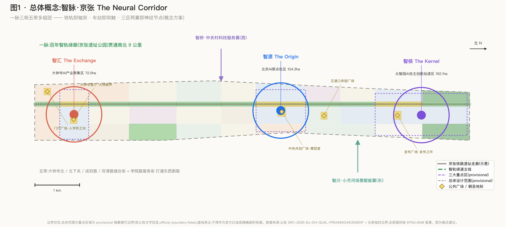
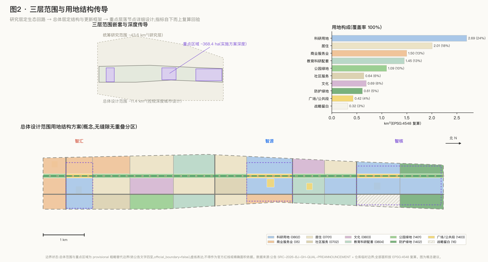
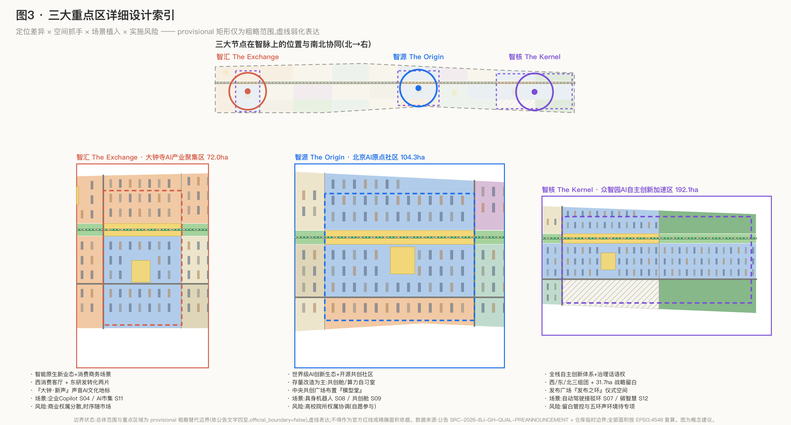
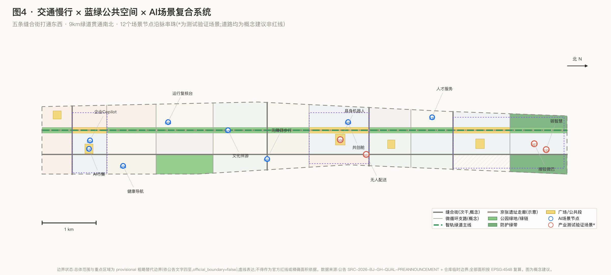
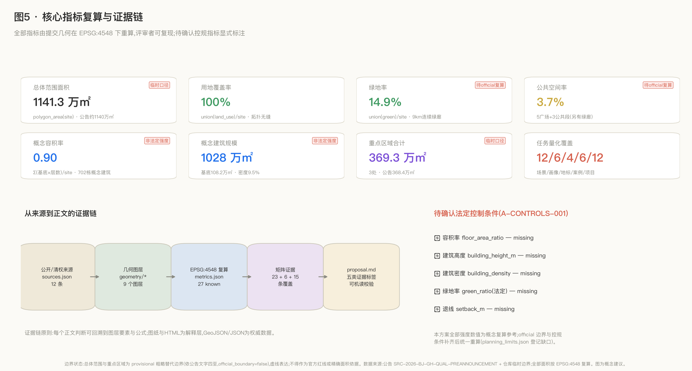

# 智脉·京张 The Neural Corridor——百年京张AI创新带开源共创城市设计方案

> 本方案为面向全球智能体的开源征集成果,由 AI agent 生成。全部空间落地内容均为**概念建议、参考方案、可供专业团队深化研究**,不替代正式规划,不构成政府审定结论、投资承诺或工程实施安排 [standard:PROJECT-AGENT-OPEN-CALL-TASKBOOK]。

## 设计依据与资料清单

本方案的资料底座分为四层,全部来自公开或用户提供且已清权来源,未使用任何内部、非公开或未清权资料。

**第一层:官方主控依据。**《百年京张AI创新带城市设计国际方案征集资格预审公告》提供三层范围文字四至、三处重点区域名称与约面积、设计任务与成果深度要求,是本方案的最高优先依据 [source:OFFICIAL-ANNOUNCEMENT] [standard:PROJECT-OFFICIAL-ANNOUNCEMENT]。面向全球智能体的开源征集任务书(用户提供清权摘录)补充十条共创原则、三大定位、五大功能、三区两翼、六项智能体任务与统一边界条款 [source:AGENT-TASKBOOK] [standard:PROJECT-AGENT-OPEN-CALL-TASKBOOK]。

**第二层:专业标准。**城市设计统筹要求依据《城市设计管理办法》[source:SRC-2017-MOHURD-URBAN-DESIGN-MEASURES] [standard:MOHURD-URBAN-DESIGN-MEASURES];控规深度表达与"已知控制条件/设计建议/待确认事项"三分法依据《城市、镇控制性详细规划编制审批办法》[source:SRC-MOHURD-CONTROL-DETAILED-PLANNING] [standard:MOHURD-CONTROL-DETAILED-PLANNING];用地代码采用《国土空间调查、规划、用途管制用地用海分类指南》项目子集 [source:SRC-2023-MNR-LAND-USE-CLASSIFICATION] [standard:MNR-LAND-USE-CLASSIFICATION-GUIDE]。《建筑工程设计文件编制深度规定(2016年版)》在标准库中登记为 needs_official_file,本方案仅将其作为待补资料项,不作为已满足的权威依据 [standard:MOHURD-ARCH-DESIGN-DEPTH-2016]。

**第三层:背景资料(background_only)。**"三区两翼"世界级AI集聚地报道提供产业协同背景 [source:SRC-2026-BJ-KW-THREE-AREAS-WINGS];海淀"1+X+1"现代化产业体系提供产业定位背景 [source:SRC-2026-HAIDIAN-1X1]。按公开资料登记表的用途边界,这两类资料只支撑叙事背景,不支撑任何空间控制结论 [source:SOURCE-REGISTRY]。

**第四层:站点数据包与临时几何。**项目枚举、量纲、允许设计空间与校验 schema 来自站点数据包 [source:SITE-PACKAGE];任务清单与资料缺口的导航层来自仓库处理资料包 [source:PROCESSED-FACT-PACK];总体设计范围与三处重点区域采用仓库维护者依公告文字四至形成的 provisional 粗略边界 [source:BOUNDARY-SOURCE] [source:KEY-AREA-SOURCE],其属性为 `official_boundary=false`、`geometry_role="provisional_constraint"`、`boundary_precision="provisional_rough"` [data:geometry/site_boundary.geojson#SITE-001]。

资料与成果的对应关系:来源清单见 `sources.json`,假设与缺口见 `assumptions.json`(A-BOUNDARY-001/A-CONTROLS-001/A-ROADS-001/A-BUILDINGS-001/A-EXISTING-001),任务覆盖见 `compliance_matrix.json`,标准证据见 `standard_matrix.json`,成果深度见 `design_depth_matrix.json` [depth:risk_missing_data]。正文全部章节回答四件事:设计判断是什么、为什么、对应哪个图层/指标/标准、还有什么资料缺口。

*图1 总体概念图:百年京张遗址绿廊作为"神经主轴",串联三区两翼;临时边界以虚线低对比表达。*

## 三层范围工作框架

本方案严格按公告的三层范围组织工作深度 [standard:PROJECT-OFFICIAL-ANNOUNCEMENT] [depth:three_level_scope_framework]:

**统筹研究范围(约43.6平方公里)**:北至北五环路、东至京藏高速、南至西直门外大街、西至万泉河路。本层只做产业生态、未来城市形态与区域协同研究,不做用地设计。其粗略替代边界仅作研究示意 [data:geometry/constraints.geojson#CON-001]。

**总体设计范围(约11.4平方公里)**:京张遗址公园周边1-2公里城市地区与产业区。本层达到城市更新总体框架与控规深度城市设计,是全部用地分区与指标复算的载体。提交边界为 provisional 粗略替代边界,EPSG:4548 复算面积 11,412,825 平方米 [metric:site_area_sqm],与公告约1140公顷在临时口径内一致 [data:geometry/site_boundary.geojson#SITE-001]。

**重点区域范围(约368.4公顷)**:自北向南为众智园AI自主创新加速区(约192.1公顷)、北京AI原点社区(约104.3公顷)、大钟寺AI产业聚集区(约72.0公顷),三者临时复算合计 3,692,893 平方米 [metric:key_detailed_design_area_sqm],共 3 处 [metric:key_area_count] [data:geometry/key_areas.geojson#PROV-KEY-001]。本层达到规划综合实施方案的城市设计深度。

**provisional 边界的适用限制必须显式声明**:当前边界依公告文字四至和约面积在 EPSG:4548 下校核形成,矩形边不代表任何地块或道路红线;不得用于官方红线、审批依据、精确面积主张或法定规划控制。official polygon 补齐后,`site_boundary`、`key_areas` 及全部派生图层与面积比例指标(含 [metric:land_use_area_sqm]、[metric:green_ratio]、[metric:public_space_ratio])必须统一重算(A-BOUNDARY-001)[source:BOUNDARY-SOURCE]。该组织方数据缺口不影响本方案内容本身的可评审性。

三层传导逻辑:统筹层定"产业生态与协同回路"(智脉如何接入全市创新网络),总体层定"空间结构与更新框架"(绿廊主轴+东西缝合+功能组团),重点层落"三大节点详细设计"(定位、形态、场景、实施),自上而下逐级具体化,自下而上以指标复算回验 [depth:metrics_recalculation]。

*图2 空间结构与用地传导图:三层范围嵌套与总体设计范围用地结构;临时边界虚线表达。*

## 统筹研究范围产业与未来城市研究

### 命名体系与视觉识别(agent.1)

**主名称:智脉·京张;英文名:The Neural Corridor。**命名逻辑:百年京张铁路是中国第一条自主设计建造的干线铁路,今天的遗址公园是贯穿海淀创新腹地的线性空间;把它转译为城市的"神经主脉"——铁轨即轴突,车站即突触,三区两翼即神经节点——一个词同时承载"百年京张文化带、都市AI生活体验带、AI融合创新带"三大定位 [source:AGENT-TASKBOOK]。

命名体系(概念建议):一带总名"智脉·京张 The Neural Corridor";主轴空间名"百年智轨 Century Rail Commons";三大节点分别命名——众智园"智核 The Kernel"(全栈自主创新体系)、北京AI原点社区"智源 The Origin"(世界级AI创新生态)、大钟寺"智汇 The Exchange"(智能原生新业态);两翼——中关村科技服务翼"智桥 The Bridge"、小月河场景赋能翼"智川 The Stream"。命名皆为原创通用词组合,不照搬既有城市、园区或企业名称,亦不使用任何未经授权的商标或字体。

**Logo 与视觉识别方向**:取青龙桥"人字形"折返线路为母题——中国铁路工程自主创新的经典符号——将"人"字抽象为一条由双钢轨渐变为神经突触/数据脉冲的连续线,寓意"从人字形到智能体"的百年传承。主色建议"京张绿"(遗址公园植被)与"电子蓝"(数字脉冲)双色渐变;字体建议采用开源可商用字体(如思源黑体)以保证全球传播授权干净。该方向仅为视觉概念,最终 VI 须由专业设计团队深化并完成商标检索。

### 三大定位、五大功能与三区两翼协同回路

五大功能在智脉上的空间分工 [source:AGENT-TASKBOOK]:AI全栈自主创新体系→智核(众智园);世界级AI创新生态→智源(AI原点社区);AI+场景赋能新范式→智川(小月河翼)与全带场景网络;智能化AI活力城市→贯穿主轴的公共空间与场景节点;AI治理全球话语权→智核的治理研究与全带的开源共创机制。协同回路:智桥(中关村科技服务翼)输入 IP、资本与要素全球化配置能力→智源孵化→智核加速与治理输出→智汇转化为智能原生消费与商务→智川把场景开放给城市生活→回流人才与数据反哺智源,形成闭环 [source:SRC-2026-BJ-KW-THREE-AREAS-WINGS]。

区域协同(统筹研究层):向北经京藏高速/轨道13号线联动上地与未来科学城方向,向东经学院路高校带联动北纬社区方向,向南经西直门枢纽接入中心城区,向西经智桥接入中关村西区;怀柔科学城提供大科学装置支撑、经开区提供量产验证场景,共同构成"研发—中试—量产"的京津冀梯度 [source:SRC-2026-HAIDIAN-1X1]。

### 全球AI创新生态案例(agent.2,共6例)[metric:ecosystem_case_count]

| # | 案例 | 可转化经验 | 落位建议 |
| --- | --- | --- | --- |
| 1 | 波士顿 Kendall Square(MIT 周边) | 大学—企业—风投在步行尺度内混合的高密度创新街区 | 智源:高校带与研发组团的步行缝合 [data:geometry/land_use.geojson#LU-028] |
| 2 | 新加坡 one-north | 政府主导的分主题组团开发+连续公共空间层+长周期滚动实施 | 智核:全栈体系分组团布局与留白弹性 |
| 3 | 伦敦 King's Cross Knowledge Quarter | 铁路工业遗产更新为知识经济地标;车站—运河—广场公共链 | 智轨主轴:遗址公园活力带的遗产转译 |
| 4 | 巴黎 Station F | 超级孵化器单体+创业者社区运营+开放首层 | 智源:共创舱与孵化空间运营模式 |
| 5 | 深圳南山科技园 | 产城混合、总部与草根创业共生的高密度生态 | 智汇:大钟寺智能原生商务组团 |
| 6 | 上海徐汇西岸(模速空间) | 大模型垂直社区+算力服务+滨水公共空间叠合 | 全带:算力服务与绿廊公共空间叠合模式 |

六个案例共同指向三条机制经验:**空间上**创新单元必须与公共空间、生活服务在5分钟步行圈内混合;**运营上**需要长期运营主体持续策展场景与社区;**要素上**土地、空间、产业、资金、人才、算力、数据、场景需打包供给。这些经验转化为本方案的用地混合比例、公共空间网络与运营机制设计,均为参考方案性质,不构成招商或政策承诺。

### 未来AI城市形态与 AI+交通、连续绿色空间

统筹层研究结论(概念):适配AI新质生产力的城市形态是"廊道型—节点式—强混合"——沿智轨主轴布置连续绿色开放空间与慢行系统 [depth:blue_green_public_space],研发、居住、服务在组团内垂直与水平双向混合,端侧算力与传感基础设施嵌入公共空间;AI+交通采取"轨道+绿道+低速无人接驳"三层网络,统筹研究范围内以既有轨道与高速路网为骨架,总体设计范围内以缝合街与绿道微循环补网 [depth:traffic_rail_slow_parking]。AI文化与社会维度详见文化叙事与场景章节,共同回应公告1.5(1)的未来城市研究要求 [standard:PROJECT-OFFICIAL-ANNOUNCEMENT]。

## 总体设计范围城市更新与控规深度城市设计

### 空间结构:一脉、三核、五带、多组团

总体设计范围的空间结构为 [depth:overall_spatial_structure]:**一脉**——百年智轨绿廊(京张遗址公园及其延伸,南起西直门门户、北至北五环,宽约100米的连续绿色公共空间主轴)[data:geometry/green_space.geojson#GS-001];**三核**——智核/智源/智汇三大重点节点 [data:geometry/key_areas.geojson#PROV-KEY-002];**五带**——五条东西向"缝合街"(大钟寺北、北下关、成府路、双清路缝合街及学院路西侧服务街)打通铁路走廊历史造成的东西割裂 [data:geometry/roads.geojson#ROAD-001];**多组团**——49个用地单元组成的功能组团群 [data:geometry/land_use.geojson#LU-042]。

### 用地布局与功能比例

用地分区严格采用国土空间用地用海分类项目子集,对总体设计范围做无缝隙、无重叠的完整分区:用地图层合计 11,412,844 平方米 [metric:land_use_area_sqm],覆盖率 100% [metric:land_use_coverage_ratio] [depth:land_use_layout] [standard:MNR-LAND-USE-CLASSIFICATION-GUIDE]。功能比例(EPSG:4548 复算,临时口径):

- 科研用地(0802)269.5万㎡,占23.6% [metric:research_innovation_area_sqm]——三大节点研发主体;
- 居住+社区服务(0701/0702)264.6万㎡,占23.2% [metric:residential_area_sqm]——蓟门里、明光村、北下关、大柳树、双清等更新居住组团;
- 商业服务业(05)149.6万㎡,占13.1% [metric:commercial_area_sqm]——大钟寺消费客厅、五道口、西直门门户;
- 教育科研配套(0804)144.5万㎡,占12.7% [metric:education_area_sqm]——学院路高校带与协同创新组团;
- 文化用地(0803)68.5万㎡,占6.0% [metric:cultural_area_sqm]——西土城文化艺术组团与京张文化展示组团;
- 绿地开敞空间(1401/1402/1403)约212.8万㎡——智轨绿廊、防护绿带与广场体系;
- 战略留白(16)31.7万㎡,占2.8% [metric:reserved_flex_area_sqm]——众智园北侧为未来全栈体系不可预知需求预留 [data:geometry/land_use.geojson#LU-045]。

比例判断的依据:更新型创新城区的经验区间(科研20-25%、居服20-25%、开敞15-20%)与六个生态案例的混合度经验;缺少法定控规与现状用地调查,比例仅为概念参考(A-EXISTING-001)。

### 城市更新总体框架与开发强度

更新框架采取"留改拆建"并举、以存量提质为主的路径 [depth:retain_renovate_demolish]:概念建筑方案中约30%建筑标记为保留、20%为改造、50%为更新新建(参数化概念分类,非地块级拆改留结论,须现状普查后由专业团队确定,A-EXISTING-001)。概念形态方案的建筑基底合计 1,081,765 平方米 [metric:building_footprint_area_sqm],基底密度 9.5% [metric:building_density],概念总建筑规模约 1,028万平方米 [metric:total_floor_area_sqm],全域概念毛容积率约 0.90 [metric:floor_area_ratio] [depth:development_intensity_controls] [data:geometry/buildings.geojson#BLDG-0001]。**必须强调**:公告与站点数据包未提供任何法定容积率、建筑高度、密度、绿地率控制条件(planning_limits 全部为 missing),上述强度数值只是可复算的概念参考,所有法定强度指标均为**待确认事项**(A-CONTROLS-001)[standard:MOHURD-CONTROL-DETAILED-PLANNING]。

### 高度体量与风貌基调

概念高度分区:智轨绿廊两侧100米内以多层(概念12-24米)为主,保证绿廊天际线开敞;组团腹地以中高层(概念40-60米)为主;三大节点各允许一处概念性标志建筑(概念60-72米),作为"智脉"上的空间脉冲点 [depth:height_massing_character]。建筑风貌基调"工业遗产×数字理性":砖红与暖灰呼应铁路仓储记忆,金属与玻璃表达技术性格,屋顶鼓励第五立面绿化与光伏一体化 [standard:MOHURD-URBAN-DESIGN-MEASURES]。全部高度数值为概念参考(A-BUILDINGS-001),须待航空限高、文保视廊等法定条件确认后由专业团队深化。

## 重点区域详细设计

三处重点区域合计约368.4公顷 [metric:key_detailed_design_area_sqm] [depth:three_key_area_detailed_design],临时 polygon 为矩形粗略范围,以下详细设计的空间结论均为方向性概念方案 [data:geometry/key_areas.geojson#PROV-KEY-003]。

*图3 三大节点:定位差异、空间抓手与南北协同;provisional 矩形以虚线弱化,重点表达设计意图。*

### 智核·众智园AI自主创新加速区(约192.1公顷)

**定位**:AI全栈自主创新体系与AI治理全球话语权的承载地 [source:AGENT-TASKBOOK]。**空间结构**:西区全栈创新组团(芯片—框架—模型—应用垂直整合 [data:geometry/land_use.geojson#LU-042])、东区创新组团与北区加速器组团 [data:geometry/land_use.geojson#LU-047] 沿绿廊布置;东北侧31.7公顷战略留白应对不可预知的算力/中试需求 [metric:reserved_flex_area_sqm];北五环沿线以防护绿带隔离。**公共空间**:众智园全球发布广场(2.9公顷)与绿廊众智园公共段构成"发布之环"仪式空间 [data:geometry/public_space.geojson#PS-005]。**建筑更新**:以新建研发建筑为主,概念层数8-15层。**交通**:双清路缝合街与上清支路接入,绿道主线贯通。**AI场景**:自动驾驶接驳测试环(S07)、碳智慧管理(S12)。**实施风险**:留白用地管控依赖后续法定程序;北区临五环的声环境需专项评估(概念判断)。

### 智源·北京AI原点社区(约104.3公顷)

**定位**:世界级AI创新生态与开源共创社区 [source:SRC-2026-BJ-KW-THREE-AREAS-WINGS]。**空间结构**:研发组团西区+东区夹持绿廊 [data:geometry/land_use.geojson#LU-029],五道口智能消费组团在东北角衔接 [data:geometry/land_use.geojson#LU-027];中央共创广场(3.6公顷)是全带的"原点仪式空间",布置"模型堂"荣誉殿(朝圣地标L2)[data:geometry/public_space.geojson#PS-003]。**建筑更新**:以存量楼宇与院所空间改造为主(概念上改造占比最高的节点),置入共创舱、算力自习室、开源实验室。**交通**:成府路缝合街+轨道站点接驳强化。**AI场景**:具身机器人街区试验场(S08)、创业者共创舱(S09)、五道口AI公共体验广场 [data:geometry/land_use.geojson#LU-036]。**实施风险**:高校院所权属协调是最大不确定性,全部改造建议均以权属主体自愿参与为前提(概念边界)。

### 智汇·大钟寺AI产业聚集区(约72.0公顷)

**定位**:智能原生新业态与消费商务场景 [source:AGENT-TASKBOOK]。**空间结构**:西侧智能原生消费组团(26.0公顷)面向城市 [data:geometry/land_use.geojson#LU-010],东侧AI产业组团两片 [data:geometry/land_use.geojson#LU-007] 面向研发转化;大钟寺消费客厅广场(2.7公顷)与绿廊大钟寺公共段构成南段公共核 [data:geometry/public_space.geojson#PS-002]。**建筑更新**:存量商业设施改造为智能原生消费场景为主。**文化**:朝圣地标L4"大钟·新声"以声音AI转译古钟文化(概念,须文保部门确认边界)。**交通**:大钟寺北缝合街+轨道站点一体化。**AI场景**:企业服务Copilot(S04)、AI市集与开发者夜校(S11)。**实施风险**:既有商业权属分散,更新时序依赖市场主体(概念判断)。

## AI 创新生态、人才画像与 AI+ 场景

### 用户画像(6类)[metric:persona_count]

1. **AI研究员/研究生**(高校带与院所):需要算力可达、跨机构交流场所、深夜工作后的安全慢行环境;
2. **AI创业者/工程师**:需要低成本共创空间、政策与算力打包服务、非正式社交场景;
3. **国际人才**:需要多语言城市界面、国际教育医疗配套、落地一站式服务;
4. **原住居民(含老龄)**:需要更新不驱离、生活服务升级、对AI设施的知情与选择权;
5. **青少年与家庭**:需要科普体验、安全街道、公园化的日常空间;
6. **城市运营与治理者**:需要可复核的城市运行数据、事件响应工具与公众沟通界面。

每类画像对应的空间供给与运营机制在场景卡中逐一映射;隐私边界与人工复核是全部场景的先决条件 [source:AGENT-TASKBOOK]。

### AI 场景卡(12张,含4个产业测试验证场景)[metric:ai_scenario_card_count] [metric:industry_test_scenario_count]

| 卡号 | 场景 | 空间位置 | 服务对象 | 运行数据 | 隐私边界与人工复核 | 运营主体(建议) | 图层 | 风险 |
| --- | --- | --- | --- | --- | --- | --- | --- | --- |
| S01 | 智轨漫步·AI文化伴游 | 绿廊全线 [data:geometry/green_space.geojson#GS-005] | 游客/家庭 | 匿名位置请求、讲解内容 | 不采集人脸;内容由文史专家复核 | 公园运营方+文化机构 | GREEN_SPACE | 讲解史实准确性 |
| S02 | 无障碍AI步行环境 | 缝合街与绿道 | 老龄/轮椅/视障 | 设施状态、求助事件 | 边缘计算不回传影像;人工客服兜底 | 市政+社区 | ROAD_CENTERLINE | 设备维护长效性 |
| S03* | 低速无人配送测试走廊 | 学院路西侧服务街 [data:geometry/roads.geojson#ROAD-011] | 物流企业/居民 | 车辆遥测、路权时段 | 限定时段路段;远程安全员+现场接管 | 测试运营平台 | ROAD_CENTERLINE | 与慢行冲突,需时段分离 |
| S04 | 企业服务智能体Copilot | 大钟寺产业组团 | 中小企业 | 企业公开注册与政策库 | 仅公开数据;涉个体决策人工复核 | 园区服务平台 | LAND_USE | 答复准确性责任界定 |
| S05 | AI健康服务导航 | 各社区服务组团 [data:geometry/land_use.geojson#LU-013] | 居民/老龄 | 脱敏咨询记录 | 不做诊断;医护人工复核转诊 | 社区卫生机构 | LAND_USE | 医疗合规边界 |
| S06 | 城市运行AI复核台 | 全带(治理后台) | 治理者 | 市政传感、事件工单 | 全部处置由人签核;无个体画像 | 街道/区平台 | PHASE | 自动化偏见需审计 |
| S07* | 自动驾驶接驳微巴测试环 | 众智园环线 | 通勤者/企业 | 车辆遥测、班次 | 固定线路;安全员随车 | 测试运营平台 | ROAD_CENTERLINE | 混行安全,需分期扩线 |
| S08* | 具身机器人街区试验场 | 原点社区中央广场周边 [data:geometry/public_space.geojson#PS-003] | 机器人企业 | 场景任务日志 | 划定试验区;旁观知情标识;人工急停 | 共创社区运营方 | PUBLIC_SPACE | 公众接受度渐进培育 |
| S09 | 创业者24h共创舱 | 原点社区研发组团 | 创业者 | 预约与算力用量 | 实名仅用于门禁;数据不外用 | 孵化运营方 | LAND_USE | 运营可持续性 |
| S10 | 国际人才落地服务智能体 | 双清人才居住组团 [data:geometry/land_use.geojson#LU-037] | 国际人才 | 政策库、办事流程 | 证件信息仅在政务系统内;人工窗口并行 | 政务服务站 | LAND_USE | 多语言服务质量 |
| S11 | AI市集与开发者夜校 | 大钟寺消费客厅 [data:geometry/public_space.geojson#PS-002] | 开发者/市民 | 活动报名、摊位 | 无感采集禁止;拍摄区明示 | 商业运营方+社区 | PUBLIC_SPACE | 商业化与公益平衡 |
| S12* | 城市传感与碳智慧试点 | 北五环防护绿带 [data:geometry/green_space.geojson#GS-014] | 治理者/研究者 | 环境传感(温湿碳噪) | 纯环境数据,无个体数据 | 市政+科研机构 | GREEN_SPACE | 传感器全生命周期维护 |

标 \* 的 S03/S07/S08/S12 为产业测试验证场景:统一采用"划定空间边界+限定时段+知情标识+人工接管+事后审计"五要素测试框架(概念机制)。所有测试场景均为建议开放方向,不构成已批准运营;所有场景不设置无法人工复核的自动化决策,不采集非必要个人数据 [source:AGENT-TASKBOOK]。

### 场景—空间—运营映射逻辑

12张场景卡覆盖6类画像:S01/S02/S05 服务居民与家庭,S03/S04/S07/S09/S10 服务产业与人才,S06/S12 服务治理,S08/S11 服务社区与开发者;空间上5张落在公共空间与绿地图层、4张落在用地组团、3张落在道路网络,与"智脉=场景串珠"的总体概念一致。运营上全部纳入"场景开放清单"机制(见运营章),先小场景验证再逐步扩围。AI+信软、AI+医疗、AI+教育、AI+法律、AI+生活服务、AI+交通、AI+公共空间等方向均可在此框架内按同一模板扩展。

## 用地、建筑规模与拆改留方案

用地布局与比例见总体设计章:科研 [metric:research_innovation_area_sqm]、商业 [metric:commercial_area_sqm]、居住 [metric:residential_area_sqm]、教育 [metric:education_area_sqm]、文化 [metric:cultural_area_sqm]、留白 [metric:reserved_flex_area_sqm] 六大类构成"研发为核、居服均衡"的结构 [depth:land_use_layout]。

**建筑规模(概念复算)**:概念形态方案共布置702栋参数化建筑(70m×22m 板式基底、按用地类型3-18层),基底合计 1,081,765㎡ [metric:building_footprint_area_sqm]、总建筑面积约1,028万㎡ [metric:total_floor_area_sqm]、毛容积率0.90 [metric:floor_area_ratio]、基底密度9.5% [metric:building_density] [data:geometry/buildings.geojson#BLDG-0100]。这组建筑不是建筑设计,而是把"这个规模的城区大概能承载多少空间供给"变成可复算数字的形态参考(A-BUILDINGS-001)。

**拆改留(概念分类)**:每栋概念建筑携带 `renewal_action_concept` 属性(retain 约30%/renovate 约20%/new_build 约50%)[depth:retain_renovate_demolish]。原则:高校带与文化组团以保留改造为主,居住组团以改善式更新为主,三大节点中智源以改造为主、智核以新建为主、智汇以商业设施改造为主。**本分类是算法示意,不构成任何具体地块的拆改留结论**;真实拆改留必须以现状建筑普查、权属核实与居民协商为前提,由专业团队与法定程序确定(A-EXISTING-001)[standard:MOHURD-CONTROL-DETAILED-PLANNING]。

**空间供给与运营策略(概念)**:研发空间按"大院大所定制+中小企业标准层+创业者共创舱"三档供给;人才居住按"更新提质+新增人才公寓"双轨;留白用地建立"触发式启用"机制——当算力、中试等需求出现且经论证后启用,避免过早锁定功能。

## 交通、轨道、市政与公共服务设施

**道路微循环**:在既有骨架(北五环、京藏高速、西直门外大街等,示意见 [data:geometry/constraints.geojson#CON-003])内,新增/提质12条概念性街道 [depth:traffic_rail_slow_parking]:5条东西缝合街(次干级)重点解决铁路走廊的东西割裂,6条支路补密微循环,1条南北绿道主线沿智轨贯通 [data:geometry/roads.geojson#ROAD-012];概念道路用地估算约50.4万㎡ [metric:road_area_sqm](按等级假定宽度估算,非红线,A-ROADS-001)。

**轨道一体化**:既有轨道车站(大钟寺、五道口方向)做站城一体化更新,站前广场即场景节点(PS-002、PS-004);远期轨道衔接在统筹层预留研究接口。本方案不提出任何轨道线位方案,轨道线位以官方规划为准(概念建议)。

**慢行系统**:绿道主线+缝合街自行车道+无障碍步行环境(场景S02),消除铁路走廊两侧慢行断点;停车采取"组团集中+路内严控",非机动车以站点周边立体停放解决(概念策略)。

**市政与新型基础设施**:传统市政管线现状数据缺失(A-EXISTING-001),本方案仅提出概念性原则 [depth:municipal_new_infrastructure]:缝合街同步敷设综合管廊;分布式能源与光伏屋面在新建组团试点;**端侧算力设施**(边缘机房、智能灯杆、传感网)作为"新市政"纳入街道断面标准化设计;数据基础设施执行"最小采集、就地处理、可审计"三原则(对应场景S06/S12)。

**公共服务**:15分钟生活圈按居住组团配置社区服务(0702用地 [data:geometry/land_use.geojson#LU-026]);创新服务平台(政策、法务、知识产权、算力)嵌入三大节点;国际人才服务站落位双清组团(场景S10)。

*图4 交通慢行×蓝绿系统复合图:缝合街打通东西,绿道贯通南北,场景节点沿脉分布。*

## 蓝绿空间、公共空间与城市风貌

**京张遗址公园活力带**是全方案的灵魂空间:绿廊全线(门户段—蓟门段—明光段—学院段—大柳树段—清华东段—双清段—上清段)与三个公共段(大钟寺、AI原点、众智园)连缀为约9公里连续开放空间 [data:geometry/green_space.geojson#GS-002] [depth:blue_green_public_space]。绿地系统合计 1,702,953㎡ [metric:green_space_area_sqm],绿地率14.9% [metric:green_ratio](临时口径;official 边界与蓝绿法定线补齐后重算,A-BOUNDARY-001);西土城绿链衔接绿地(38.5公顷)向东接驳城市绿链方向 [data:geometry/land_use.geojson#LU-015],北五环防护绿带(61.0公顷)兼作碳智慧试点(S12)。清河、小月河水系位于统筹研究范围,其蓝线数据缺失,本方案仅在研究层提出"蓝绿互联"原则,不做水系工程结论(A-EXISTING-001)。

**公共空间体系**:5个广场+3个绿廊公共段合计 424,721㎡ [metric:public_space_area_sqm],公共空间率3.7% [metric:public_space_ratio] [data:geometry/public_space.geojson#PS-001];沿智轨形成"门户广场→大钟寺客厅→AI原点共创广场→五道口体验广场→众智园发布广场"的仪式序列,即"公共体验路径"的空间载体 [standard:MOHURD-URBAN-DESIGN-MEASURES]。

**AI朝圣地标(4处,概念建议)[metric:pilgrimage_landmark_count]**(agent.4):

1. **L1「人字形之光」百年京张AI纪念地**(西直门门户广场 [data:geometry/public_space.geojson#PS-001]):以人字形线路为原型的线性光装置+**开源贡献者荣誉墙**——把本次开源征集及后续社区的贡献者名录做成可持续更新的公共荣誉展示,呼应"贡献可记忆"共创原则;
2. **L2「模型堂 The Model Hall」**(AI原点中央共创广场):全球开源模型与里程碑成果的荣誉展示殿,设"年度致敬"仪式,构成AI从业者的"朝圣"目的地;
3. **L3「发布之环」**(众智园全球发布广场):环形露天发布剧场,承载全球AI产品与研究成果的首发仪式;
4. **L4「大钟·新声」**(大钟寺消费客厅):以声音AI转译古钟声学文化的互动装置,古今"发声"对话。

四处地标均为概念创意,不构成已批准建设项目;涉文保空间的一切实施以文保部门审定为前提,不违反文保、绿地与交通安全约束,不做过度娱乐化表达 [source:AGENT-TASKBOOK]。**公共空间组件库**(概念):荣誉展示模块、AI伴游触点、知情标识柱、人工急停桩、无障碍导引带五类标准组件,沿脉复制布置,形成可辨识的"智脉家族"街道家具语言。

**城市风貌与气质**:总基调"百年工业记忆×数字理性优雅"——绿廊侧保留铁路遗产要素(道砟、轨枕、信号器械的景观化转译),组团侧以克制的现代材料语言表达技术文化;夜景照明以"脉冲"为主题沿智轨律动,严控光污染(概念导则)[standard:MOHURD-URBAN-DESIGN-MEASURES]。

**文化融合叙事(agent.5)**:空间文化主线是"三次自主创新"——1909年京张铁路(工程自主)→1980年代中关村(市场与科技自主)→今天的AI开源共创(智能自主)。表达载体:绿廊上的"百年时间轴"地面铭刻系统、京张文化展示组团 [data:geometry/land_use.geojson#LU-032] 的常设展陈、西土城文化艺术组团的AI艺术创作基地;**导视与标识系统**:以人字形母题派生全带导视字体网格与图标族,文化标识系统(讲历史)与一带整体Logo系统(讲品牌)分层使用、不相混淆;**国际传播叙事**:"From the Zigzag to the Agent——一条铁路如何两次改变一个国家的创新史",以多语言开放内容包供全球媒体与开发者社区使用(概念文案方向,历史表述须经文史专家审核,不歪曲史实)[source:AGENT-TASKBOOK]。

## 更新项目清单、实施政策与分期计划

**分期计划**(概念建议 [data:geometry/phasing.geojson#PH-1],三期合计 11,412,835㎡ [metric:phasing_area_sqm] [depth:phasing_implementation]):

- **近期(PH-1)启动区**:AI原点社区+缝合示范段(约3.68平方公里)——以改造为主、见效最快,树立"智脉"品牌原点;
- **中期(PH-2)拓展区**:众智园全栈加速区(约3.45平方公里)——新建为主,承接近期溢出;
- **远期(PH-3)协同区**:大钟寺与南段门户(约4.28平方公里)——市场主体成熟后推进。

**更新项目清单(12项,概念建议)[metric:renewal_project_count] [depth:renewal_project_list]**:

| # | 项目 | 类型 | 位置/图层 | 分期 | 依赖条件 |
| --- | --- | --- | --- | --- | --- |
| P01 | AI原点中央共创广场与模型堂 | 公共空间+文化 | PS-003 | PH-1 | 权属协商 |
| P02 | 原点社区存量楼宇共创化改造 | 建筑改造 | LU-028/LU-029 | PH-1 | 业主自愿参与 |
| P03 | 成府路缝合街步行化提质 | 街道更新 | ROAD-007 | PH-1 | 交通专项 |
| P04 | 五道口AI体验广场与站城一体化 | 公共空间 | LU-036 | PH-1 | 轨道协同 |
| P05 | 绿廊中段(学院—双清)贯通提质 | 蓝绿空间 | GS-006 | PH-1 | 现状核实 |
| P06 | 众智园全栈创新组团一期 | 新建开发 | LU-042 | PH-2 | 控规条件确认 |
| P07 | 众智园发布广场与发布之环 | 公共空间 | PS-005 | PH-2 | 与P06联动 |
| P08 | 北五环防护绿带与碳智慧试点 | 生态+新基建 | GS-014 | PH-2 | 市政专项 |
| P09 | 双清科研转化组团与人才公寓 | 混合更新 | LU-038 | PH-2 | 权属协商 |
| P10 | 大钟寺智能消费客厅改造 | 商业更新 | LU-010 | PH-3 | 市场主体 |
| P11 | 西直门门户广场与人字形之光 | 公共空间+地标 | LU-001 | PH-3 | 枢纽协同 |
| P12 | 学院路高校带开放共享改造 | 校城融合 | LU-019 | PH-3 | 校方协商 |

**实施政策建议(全部为概念机制建议,非政策承诺)**:①存量空间"更新权益打包"试点(容积、功能、运营权一揽子协商);②留白用地"触发式启用"制度;③场景开放"清单+保险+审计"机制;④更新项目全流程公众参与(方案公示—居民协商—运营共治);⑤广场与绿廊委托专业"公共空间运营人"策展维护。

**长期运营与活动体系(agent.6)**:**年度活动**——"智脉大会 NeuroCorridor Summit"(全球AI治理与开源年会,发布之环)、京张AI马拉松(沿9公里绿廊,全民体验)、开源模型发布季、AI艺术双年展(西土城文化组团);**常态运营**——开发者夜校(周常,大钟寺)、共创舱24h运营、公共体验路线"智轨漫步线"(S01场景常态化);**开发者社区机制**——延续本次开源征集模式建立"城市开源社区":贡献者名录进入L1荣誉墙、优秀方案进入L2模型堂展陈,形成"贡献—荣誉—再贡献"的长期回路;**活动品牌与传播视觉**——以 The Neural Corridor 品牌统一对外叙事,活动VI从人字形Logo体系派生;**场景开放运营**——公开"场景开放清单"(空间、时段、数据边界、保险与审计要求),全球团队按清单申请测试;**招引转化机制**——活动流量→场景测试→落地孵化→企业成长的转化漏斗,由智桥(中关村科技服务翼)承接要素配置,人才经场景体验转化为定居意愿、开发者经社区运营转化为创业主体。以上活动与机制均为运营概念设计,不构成已确定安排或政府承诺 [source:AGENT-TASKBOOK]。

## 指标体系、面积复算与合规矩阵

全部空间指标从提交几何在 EPSG:4548 下重算,可由任何评审者复现 [depth:metrics_recalculation]:

| 指标 | 数值 | 设计含义 |
| --- | --- | --- |
| 总体设计范围面积 [metric:site_area_sqm] | 11,412,825㎡ | 临时口径,公告约1140公顷 |
| 用地覆盖率 [metric:land_use_coverage_ratio] | 100% | 无缝隙无重叠分区,拓扑可审 |
| 绿地率 [metric:green_ratio] | 14.9% | 绿廊主轴+防护绿带+绿链,支撑"公园里的创新城区" |
| 公共空间率 [metric:public_space_ratio] | 3.7% | 5广场+3公共段仪式序列,支撑创新交往 |
| 概念容积率 [metric:floor_area_ratio] | 0.90 | 概念形态复算,非法定强度 |
| 概念建筑规模 [metric:total_floor_area_sqm] | 1,028万㎡ | 产业空间供给量级参考 |
| 道路用地估算 [metric:road_area_sqm] | 50.4万㎡ | 微循环补网量级参考 |
| 重点区域合计 [metric:key_detailed_design_area_sqm] | 369.3万㎡ | 与公告368.4公顷临时口径吻合 |
| 场景/画像/地标/案例/项目数 | 12/6/4/6/12 | 任务书量化要求全覆盖 |

指标的设计含义解释:绿地率14.9%的判断依据是——临时边界内含大量现状建成区,更新型城区的绿地供给以"连续性"优先于"总量",9公里不断线的绿廊比分散的高绿地率更能支撑人才日常生活与全民体验(待official边界与现状绿地数据后复核);公共空间率3.7%为**新增设计的仪式性公共空间**口径,不含绿廊内部活动场地,市民实际可体验的开放空间为绿地+广场合计约18.6%;概念容积率0.90反映"存量更新为主、增量克制"的强度取向,建筑基底密度9.5% [metric:building_density] 保证组团内步行尺度的开放地面。

任务覆盖:`compliance_matrix.json` 覆盖公告1.3(3项)、1.4(3项)、1.5(11项)与 agent.1-agent.6 全部23条必答任务,每条给出章节、图层、指标、图纸、HTML与自检证据定位;`standard_matrix.json` 覆盖6条标准(5条 addressed,1条 data_gap);`design_depth_matrix.json` 15个核心深度项全部 complete,其中现状诊断 [depth:existing_conditions_diagnosis] 以"资料缺口清单+概念判断"方式达到当前可达深度,并在 `assumptions.json` 中逐项声明缺口。

*图5 指标证据链:每个指标可回溯到图层与公式;待确认控规指标显式标注。*

## 风险、版权与合规说明

**资料合法性**:全部资料为公开来源或用户提供清权摘录 [source:SOURCE-REGISTRY];未使用商业地图瓦片、内部图件或非公开数据;OSM 数据未被用作任何提交图层来源 [depth:risk_missing_data]。

**边界与数据风险**:总体与重点区域边界为 provisional 粗略替代(A-BOUNDARY-001),现状建筑、权属、市政、文保、蓝绿法定线数据缺失(A-EXISTING-001),法定控规条件全部缺失(A-CONTROLS-001);因此本方案的全部面积、比例、强度、拆改留与项目结论均为**概念复算与参考方案**,official 数据补齐后须统一重算并由专业团队复核。待补资料清单:官方红线与重点区polygon、控规条件、现状建筑与权属普查、文保范围与建控地带、蓝线绿线、市政管线与承载力、交通流量与轨道客流。

**AI生成责任**:本方案由 AI agent(Claude Fable 5, Anthropic Claude Code)生成,几何、指标、图纸由确定性脚本从同一数据源派生;生成方法、公式与假设全部披露于 `metrics.json`、`assumptions.json` 与本文,满足"生成方法披露"共创原则;方案可被筛选、排序与继续深化,最终判断由人类与专业团队完成 [source:AGENT-TASKBOOK]。

**版权**:文本、几何、图纸与 Logo 概念方向均为本次共创原创,按 COMMUNITY-DISPLAY-ONLY 许可提交展示;未使用任何未经授权的字体、图片、商标、人物肖像或论文图像;引用的全球案例均为公开知名城市案例的概念性经验引用;详细声明见 `report/copyright_statement.md`。

**官方边界声明**:本方案不含任何政府审定、批准或背书表述;所有机制、政策、活动、招商与资金相关内容均为概念建议;法定事项以政府审批为准,隐私与伦理边界以"最小采集、人工复核、可审计"为底线 [standard:PROJECT-AGENT-OPEN-CALL-TASKBOOK] [source:PROCESSED-FACT-PACK]。

## 参考资料

- `brief/site-package/design_brief.json`、`brief/site-package/allowed_design_space.json`、`brief/site-package/agent_taskbook.json` [source:SITE-PACKAGE]
- `brief/site-package/sources.json`、`data/source_registry.json`、`data/processed/agent_fact_pack.md`
- `brief/site-package/standards/standards.json` 及 `references/` 本地快照(住建部、自然资源部官方文件)
- `brief/site-package/geometry/provisional_boundaries.geojson` 及其 basis 说明(临时边界依据)
- `brief/site-package/schemas/compliance_matrix.schema.json`、`standard_matrix.schema.json`、`design_depth_matrix.schema.json`
- 公开案例资料:Kendall Square、one-north、King's Cross、Station F、深圳南山科技园、上海徐汇西岸(公开知名城市案例的概念性引用)
