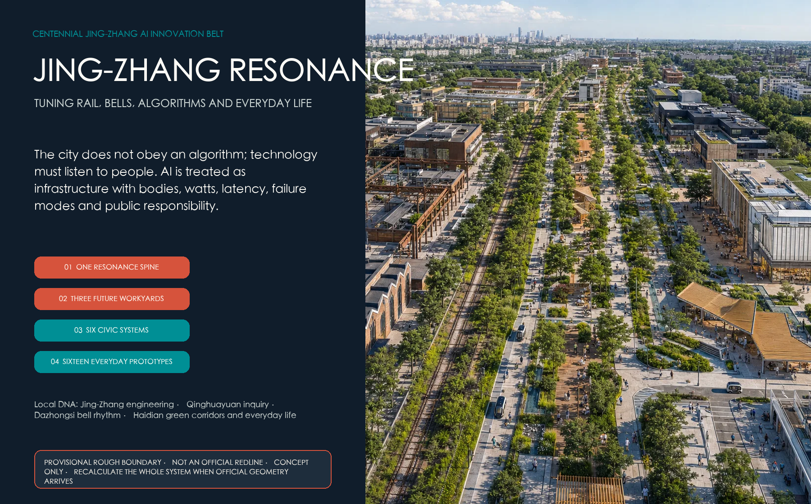
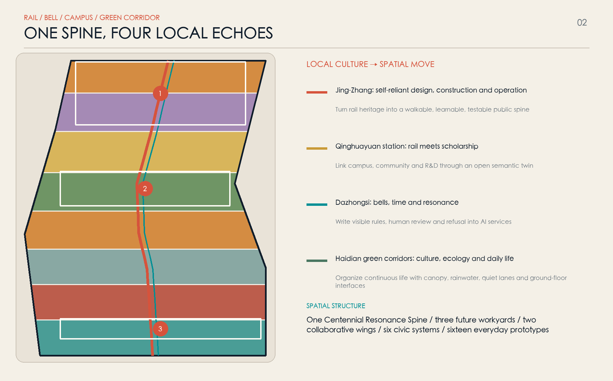
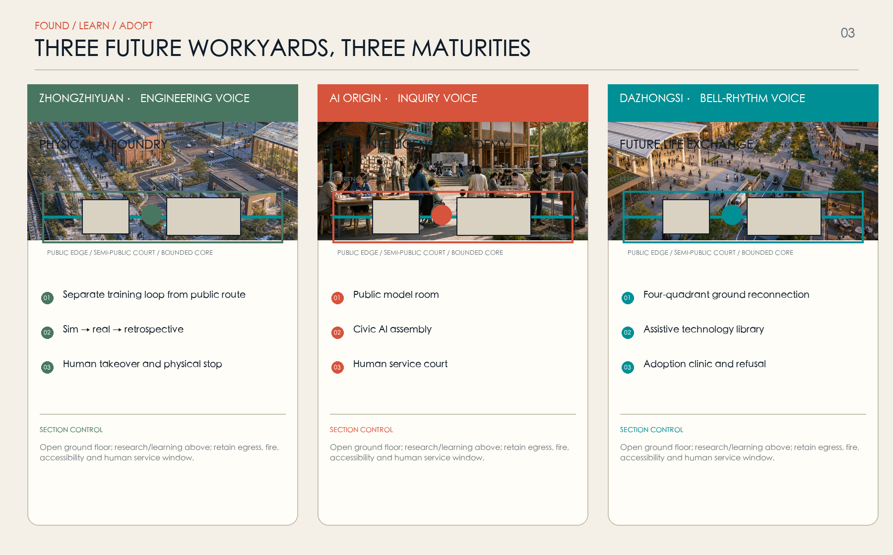
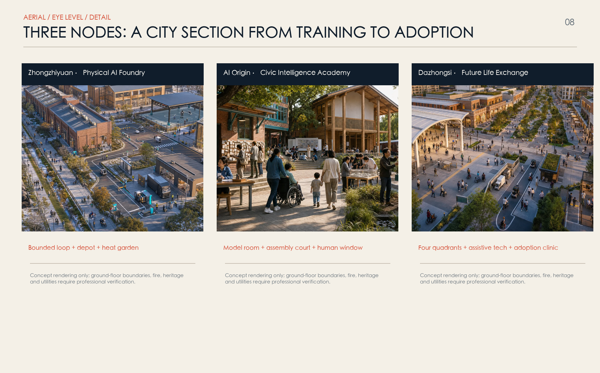
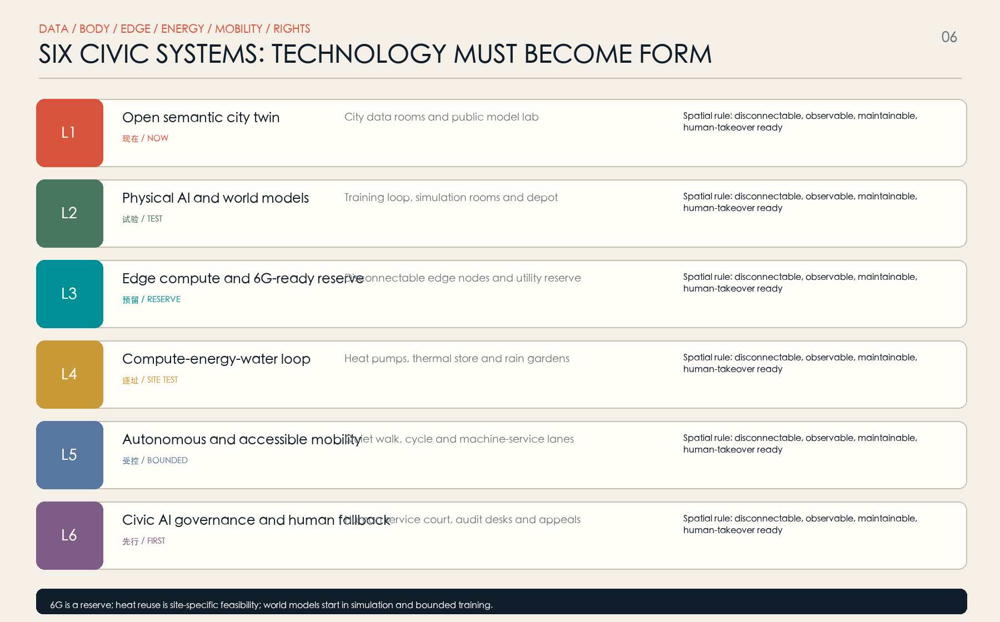
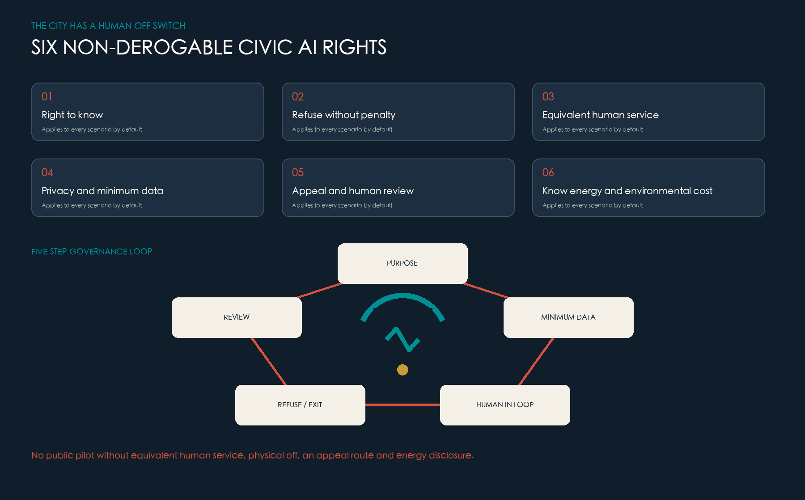
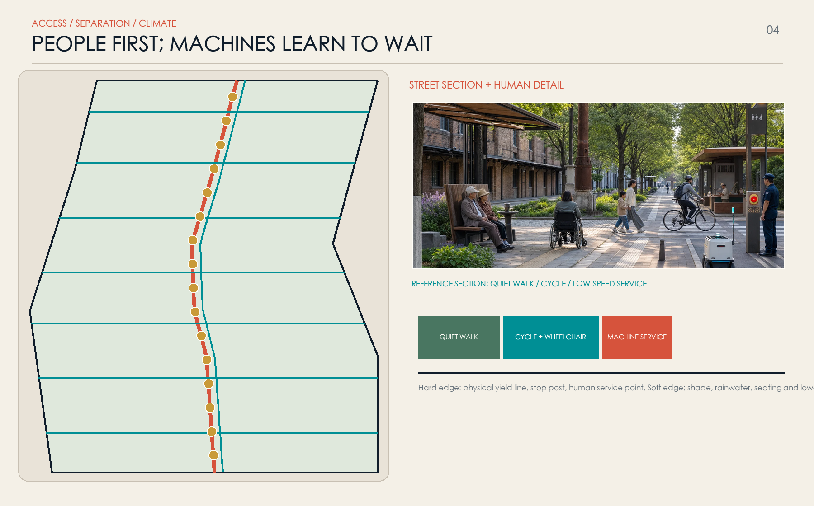
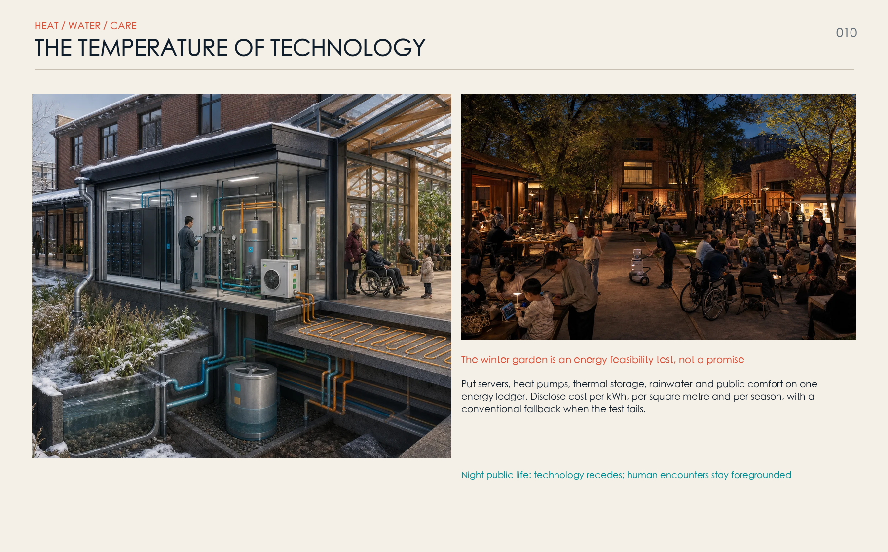
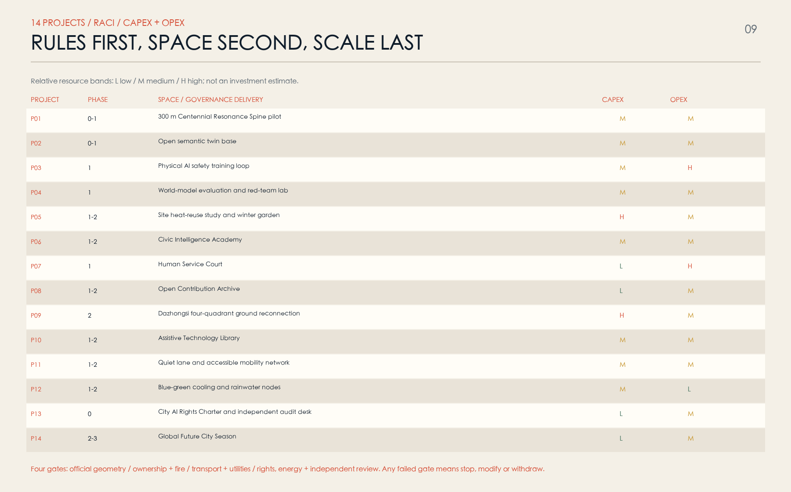
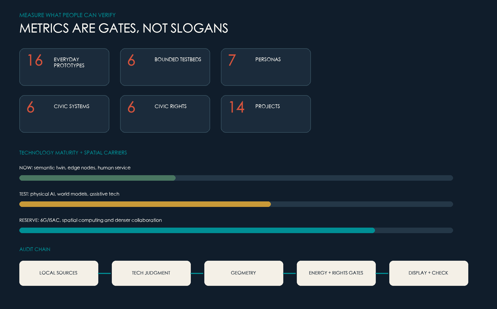

# JING-ZHANG RESONANCE / 京张和鸣

> The city does not obey an algorithm; technology must listen to people.

“Resonance” is not a decorative slogan. It grows from the Jing-Zhang railway's legacy of self-directed surveying, design, construction and operation; from Qinghuayuan Station, where rail and scholarship met; and from Dazhongsi, where bell craft linked time, public ritual and social harmony. The proposal translates rail, bell rhythm, academic inquiry, green corridors and neighbourhood life into a future-city operating system: technology is heard, seen and questioned before it enters daily life; systems can run and can stop; innovation is supported without excluding people who cannot or choose not to use AI [source:CULTURE-JINGZHANG-HAIDIAN] [source:CULTURE-QINGHUAYUAN-STATION] [source:CULTURE-DAZHONGSI-BELL].

**Status.** This is a concept proposal for open review and professional development. It does not replace statutory planning or constitute an approved government decision. Site and key-area geometry remains repository provisional rough geometry with `official_boundary=false`. Boundaries, areas, routes, buildings, costs and facilities must be recalculated together when official redlines, controls, ownership, utilities, transport, heritage, ecology and measured surveys become available [source:BOUNDARY-SOURCE] [data:geometry/site_boundary.geojson#SITE-001].

## Design basis and source register

The primary basis is the Haidian qualification announcement, the Agent taskbook and the repository site package. The announcement defines three working scales: 43.6 km² for coordinated research, approximately 11.4 km² for overall design and approximately 368.4 ha for detailed key areas. The taskbook additionally asks for an industry ecosystem, future-city thinking, three zones and two wings, AI scenarios, identity and long-term operations. These are coverage requirements, not implementation authority [source:OFFICIAL-ANNOUNCEMENT] [source:AGENT-TASKBOOK].

The current package lacks statutory overall and key-area polygons, a complete building and ownership survey, road redlines, utility capacity, heritage controls, old-tree records and green/blue lines. `geometry/site_boundary.geojson` and `geometry/key_areas.geojson` support concept topology and later replacement only. `metrics.json` therefore keeps floor area ratio, total floor area, statutory density, height and road area unknown instead of deriving false precision from renderings [source:KEY-AREA-SOURCE] [metric:floor_area_ratio].

External material is registered in four groups: local history, professional references, technology scans and international methods. Local cultural sources support interpretation only; CityGML, MEC, AI-risk, energy and age-friendly sources support method; vendor pages indicate direction only. Publisher, link, date, rights, use and limitation are recorded in `sources.json`; no third-party image, chart, brand or page code is copied [source:SOURCE-REGISTRY] [source:AI-RENDER-SERIES-2026].

## Three-scale working framework

The three scales form one audit chain. Coordinated research maps the roles of universities, laboratories, firms, communities and wider regional collaboration. Overall design organizes land use, renewal, walking, blue-green space, public services and new infrastructure. The three key areas test the framework through ground floors, courtyards, sections, operations and stop conditions. Announced areas check task scope; submitted geometry checks this concept package only [standard:PROJECT-OFFICIAL-ANNOUNCEMENT] [metric:site_area_sqm].

| Scale | Professional question | Resonance response | Main deliverable |
| --- | --- | --- | --- |
| Coordinated research | How does invention become public value? | A loop of problem, simulation, training, adoption and review | Actor map, value chain, maturity and comparative methods |
| Overall design | How do dispersed resources become one city experience? | One Centennial Resonance Spine, three workyards and two collaborative wings | Land use, mobility, blue-green, prototypes and six systems |
| Key areas | How can technology enter place without damaging daily life? | Public edge, semi-public court and bounded core | Reference plan, ground floor, section, operation and gates |

The spine follows the railway heritage park as a continuous, barrier-free north-south civic ground. Three future workyards cover training and validation, public governance and everyday adoption. Two collaborative wings link west to Xueyuan Road and Zhongguancun knowledge services, and east to neighbourhoods, rivers and real urban problems. Six civic systems layer data, bodies, networks, energy, mobility and rights in one spatial framework [data:geometry/roads.geojson#ROAD-01] [depth:three_level_scope_framework].

## Coordinated research: industry and the future city

The missing piece is not another R&D building. It is a trusted interface between technology supply and public adoption. Universities and laboratories generate knowledge, companies productize it, and city operators and communities hold real problems. Yet problem definition, consent, safety validation, accessibility co-testing, pre-procurement evidence and failure review are often institutionally separated. A future city's advantage therefore depends not only on compute and models, but on its ability to make technology enterable, contestable, repairable and reversible [source:CASE-MARS] [source:CASE-KALASATAMA].

The proposal creates a five-part innovation chain: (1) communities, facility workers and firms frame real problems; (2) an open semantic twin and world models simulate them first; (3) physical AI is trained and red-teamed in bounded settings; (4) a Civic Intelligence Academy discloses purpose, risk, energy and human alternatives; and (5) the Dazhongsi adoption end allows people to experience, compare, refuse or assemble pre-procurement evidence. Failed trials enter the archive; exhibition, pilot and pitch are never described as adoption [source:MIIT-PHYSICAL-AI-2026] [source:NIST-AI-RMF-GAI].

| Resource | Spatial carrier | Operating interface | What is never assumed |
| --- | --- | --- | --- |
| Land and buildings | Reversible ground floor, shared court, bounded core | Use agreements, fire and heritage gates | Demolition, acquisition or high-intensity development |
| Compute and network | Disconnectable edge nodes, model room, depot | Metering, logs, isolation and takeover | Guaranteed latency, 6G coverage or unlimited energy |
| Data and models | Semantic twin, data room, red-team lab | Minimum data, purpose, version and accountable person | Open personal data or unbounded cross-system access |
| Talent and services | Workyards, academy, clinic and repair workshop | Contribution records, training and community seats | Rewarding only model authors and headline firms |
| Real settings | Streets, stations, campuses and blue-green nodes | Geofencing, risk cards and independent review | Turning public space into an unbounded laboratory |

International cases are translated as mechanisms, not copied as masterplans. Punggol suggests co-location and district testing; Barcelona links knowledge transfer with renewal; Kalasatama favours small, time-bounded pilots; Rotterdam makes sensor purpose visible and works with residents; Seoul makes public AI interpretation free and understandable. Foreign land regimes, governance, targets and vendor platforms are not transferred [source:CASE-PUNGGOL] [source:CASE-ROTTERDAM-SENSOR-LAB] [source:CASE-SEOUL-AI-CENTER].

## Overall design: renewal and control-plan-depth urban design

The structure is one Centennial Resonance Spine, three future workyards, two collaborative wings, six civic systems and sixteen everyday prototypes. The spine is not a single landscape path. It combines railway heritage interpretation, quiet walking, cycle commuting, universal access, public service, climate regulation and bounded machine service. Four local motifs become four spatial actions: Jing-Zhang engineering becomes build-test-repair; Qinghuayuan inquiry becomes open models and visible failure; Dazhongsi rhythm becomes visible rules and collective calibration; Haidian green corridors become continuity of canopy, water, heat and daily life [source:CULTURE-HAIDIAN-GREEN-CORRIDOR] [depth:overall_spatial_structure].

The concept partition uses complete, gap-free topology. Physical-AI research and training concentrate toward the north; civic-intelligence research, education and community services occupy the middle; culture, everyday adoption and commercial services concentrate toward the south; continuous parkland runs through them. Colours are not parcels, statutory use or development quantum. Public space, green space, building prototypes and routes remain separate overlays so the complete system can be recalculated when official geometry arrives [data:geometry/land_use.geojson#LU-01] [standard:MNR-LAND-USE-CLASSIFICATION-GUIDE].

Renewal follows retain first, open ground floors, connect courts, add reversibly, and prove any necessary replacement. Walls, residual land, lobbies, station exits and undercrofts are interface opportunities, not pre-judged properties. Building prototypes test the relationship among public edge, semi-public court, bounded core and vertical mix. Total floor area, FAR, height, density, setbacks and parking remain pending official controls and professional calculation [data:geometry/buildings.geojson#BLDG-01] [depth:retain_renovate_demolish] [metric:total_floor_area_sqm].

## Detailed design of the three key areas

The workyards are not three identical “AI parks.” Each uses a public edge, semi-public court and bounded core. The public edge is free, face-recognition-free and supported by a human desk; the court supports booked learning and co-testing; the core contains controlled data, equipment, robotics and safety work. An open ground floor does not erase research security: hours, access, noise, fire, egress and privacy require building-by-building confirmation [data:geometry/key_areas.geojson#PROV-KEY-001] [depth:three_key_area_detailed_design].

### Zhongzhiyuan: the voice of engineering / Physical AI Foundry

- **Reference plan:** a visitor gallery, engineering-history line and observable test windows sit on the public edge. Inside are a segmented training loop, variable-scene hall, depot, red-team room, logistics entrance and isolated parking. The loop never shares ordinary walking space except at controlled crossings.
- **Ground floor and section:** level 0–6 m holds repair, equipment transfer, public learning and physical stop points; upper levels hold simulation, evaluation and R&D. Public, semi-public and bounded zones have separate egress and network domains.
- **Technical task:** world models produce traceable edge cases before supervised physical training. Real operation requires task scope, data review, collision, loss-of-link, localization drift, takeover and withdrawal tests.
- **Operation:** the site operator owns place safety; test bodies own method and logs; firms own equipment; community and accessibility representatives validate outcomes; an independent desk can stop the trial. Any unresolved near miss or failed stop closes the loop [source:MIIT-PHYSICAL-AI-2026] [source:BEIJING-EMBODIED-2025].

### AI Origin: the voice of inquiry / Civic Intelligence Academy

- **Reference plan:** connect station, campus, park and neighbourhood first, then place the Open Semantic Twin Room, model window, Civic AI Assembly, Inclusive Co-test Workshop, Open Contribution Archive and Human Service Court along that route.
- **Ground floor and section:** the ground floor is an all-weather public passage with free human service; mezzanines host small learning and collaboration; research and operations sit above. Data rooms and device stores are separated from public space; every screen has a paper explanation and a non-data-collecting route.
- **Technical task:** a CityGML 3.0 semantic model connects planning, mobility, energy and robotics objects with only authorized minimum datasets. Every output exposes version, time, scope, uncertainty and accountable person.
- **Operation:** a quarterly assembly decides what should be tested, which data cannot be used and which trials should exit. Residents, elders, disabled people, young people and frontline workers receive paid co-test roles [source:OGC-CITYGML-3] [source:UNESCO-AI-ETHICS].

### Dazhongsi: the voice of bell rhythm / Future Life Exchange

- **Reference plan:** repair surface walking and accessible arrival across the station's four quadrants; connect an Assistive Technology Library, Device Adoption Clinic, multilingual city room, small pitch spaces and night public learning. Bridges, tunnels or station works remain needs for study, not feasibility claims.
- **Ground floor and section:** station level provides orientation, human advice and borrowing; street level compares products without a single-brand bias; upper levels support training and enterprise services. Heritage, sight lines, bell environment and crowd safety take priority over new landmark mass.
- **Technical task:** spatial computing and assistive devices use declared zones, short permissions and local processing where possible. Recommendations cannot become hidden advertising; machine translation is labelled and human-correctable.
- **Operation:** the clinic treats adopt, modify, refuse and withdraw as equally valid outcomes. Older and disabled participants help define the task and decide whether it scales [source:CULTURE-DAZHONGSI-BELL] [source:WHO-AGE-FRIENDLY-2023].

## AI innovation ecosystem, personas and AI+ scenarios

“Talent” is resolved into seven people with concrete daily work: physical-AI engineers need bounded training and repair; open-source developers need real problems and durable contribution credit; startups need early users, compliance and shared equipment; students and faculty need pathways from coursework to urban problems; firms and buyers need comparable evidence; residents, elders, children and disabled people need low-disturbance space, human service and refusal; operators and frontline workers need explainable alerts, handover and final authority [source:AGENT-TASKBOOK] [standard:BARRIER-FREE-ENVIRONMENT-LAW].

| Persona | Daily task | Space and service | Non-negotiable boundary |
| --- | --- | --- | --- |
| Physical-AI engineer and technician | Simulate, train, repair and review incidents | Loop, depot and red-team room | No first training in unbounded public space |
| Open-source developer | Find problems, collaborate, publish and maintain | Problem library, model room and archive | No face, movement or popularity scoring |
| Startup team | Find first users, test and ask compliance questions | Adoption clinic and shared equipment | Failed tests do not expose trade secrets by default |
| Student and faculty | Course practice, research transfer and exchange | Twin room and Urban Skills Academy | Research and campus data require authorization |
| Firm and buyer | Compare, validate and assess adoption | Test cards, evidence pack and pitch | Display and trial are not procurement endorsement |
| Resident, elder, child and disabled user | Commute, rest, seek help and co-test | Quiet lane, assistive library and human court | Anonymous, off and non-digital options exist |
| Operator and frontline worker | Detect, dispatch, maintain and review | Explainable console, handover and workshop | AI does not replace enforcement or final judgment |

The sixteen prototypes use proposal maturity bands R1–R4: R1 simulation research; R2 bounded training; R3 small public pilot; R4 mature human service or governance base. These are not certified TRLs. Every prototype records purpose, user, authorized data, spatial boundary, time, accountable human, energy, stop condition and review date [metric:scenario_node_count] [data:geometry/public_space.geojson#SCENE-01].

| ID | Everyday prototype | Primary place and users | System / band | Human fallback and stop condition |
| --- | --- | --- | --- | --- |
| N01 | World Model Sandbox | Zhongzhiyuan; engineers and operators | World model / R1 | Simulation evidence only; no direct real-world actuation |
| N02 | Physical AI Real-scene Training Loop | Zhongzhiyuan; robotics teams | Physical AI / R2 | Marshal, fence, stop; breach or link loss closes trial |
| N03 | Robot Safety Certification Street | Zhongzhiyuan; testers and public representatives | Physical AI / R2 | Booked closure and surrogate obstacles first; near miss stops test |
| N04 | Compute-to-Climate Winter Garden | Zhongzhiyuan; facilities and visitors | Energy / R2 | Conventional backup; failed efficiency or comfort exits |
| N05 | Municipal Robot Depot | Zhongzhiyuan; sanitation, landscape and repair workers | Physical AI / R2 | Frontline dispatch; no automated labour evaluation |
| C01 | Open Semantic Twin Room | AI Origin; planners, students and residents | CityGML / R3 | Version and uncertainty shown; sensitive layers closed |
| C02 | Civic AI Assembly | AI Origin; all seven personas | Governance / R3 | Human chair, public minutes and conflict disclosure |
| C03 | Human Service Court | AI Origin; everyone | Human service / R4 | Equivalent to digital service, without penalty |
| C04 | Inclusive Co-test Workshop | AI Origin; disabled and older users, designers | Inclusive design / R3 | Paid participation; unresolved barriers block launch |
| C05 | Open Contribution Archive | AI Origin; developers and community | Governance / R3 | Permission, attribution and withdrawal; no permanent ranking |
| C06 | Urban Skills Academy | AI Origin; students, frontline workers and career changers | Education / R3 | Teachers and paper material remain available |
| S01 | Assistive Technology Library | Dazhongsi; elders, disabled people and carers | Assistive tech / R3 | Human fitting; no medical diagnosis |
| S02 | Spatial Computing Everyday Street | Dazhongsi; visitors and merchants | Spatial computing / R2 | Declared zone, short consent and local-first processing |
| S03 | Smart Device Adoption Clinic | Dazhongsi; startups and early users | Edge intelligence / R2 | Comparable and refusable; no default promotion |
| S04 | Four-quadrant Transit Hall | Dazhongsi; commuters and visitors | Accessible mobility / R3 | Human desk and static signs always work |
| S05 | Global Future City Season | Whole belt; public and international teams | Public learning / R3 | Open curation and sources; events do not replace daily service |

Six civic AI rights apply to every prototype: know; refuse without penalty; obtain equivalent human service; privacy and minimum data; appeal and human review; know environmental and energy cost. A public pilot missing any one of them cannot start [source:UNESCO-AI-ETHICS] [depth:risk_missing_data].

## Land use, building quantum and retain-adapt-replace strategy

The concept uses a checkable subset of national land-use codes in a complete, gap-free partition. R&D (0802), culture (0803), education (0804), community service (0702), commercial service (05), mixed living support (0701) and park green space (1401) support the train-govern-adopt chain. Areas can be recalculated from submitted geometry but describe only this concept; they are not statutory use, title or land-supply conditions [standard:MNR-LAND-USE-CLASSIFICATION-GUIDE] [metric:land_use_0802_area_sqm].

Buildings follow four levels: A retains and maintains heritage, community or embodied-carbon value; B adapts ground floors and courts; C adds ramps, shade, equipment and public service through reversible, lightweight assemblies; D considers replacement only after title, structure, fire, sunlight, heritage, cost and life-cycle carbon assessment. No complete building survey exists, so no real building is labelled for demolition. Every submitted footprint remains `conceptual_prototype=true` [data:geometry/buildings.geojson#BLDG-01] [depth:height_massing_character].

Reference massing uses a low public base, mid-rise research/learning space and distributed service plant. It prioritizes continuous ground floors, daylight courts, wind comfort and repairability instead of an out-of-scale high-rise icon. Dazhongsi protects heritage views and crowd safety; AI Origin respects campus and neighbourhood scale; Zhongzhiyuan can host larger-span test space with acoustic and logistics buffers. Statutory height, FAR, density, setback, parking and facilities remain for approved controls and specialist study [standard:MOHURD-CONTROL-DETAILED-PLANNING] [metric:building_height_m].

Six suggested ground-floor controls are tested later by architecture, fire, transport, access and operations professionals: a continuous step-free route; a free rest/help point every 300–500 m; dual access for public and sensitive research; visitor/logistics separation; egress and maintenance clearance; and a screen-free alternative beside every digital service. These are design suggestions, not statutory numbers.

## Mobility, rail, utilities and public facilities

Mobility uses three parallel speeds. The slowest is quiet walking and non-commercial rest for children, elders, wheelchair users and everyday strolling. The middle layer is a continuous level surface for cycles, wheelchairs and micromobility. A machine-service layer operates only at low speed, limited times and fixed routes, with a physical yield line, stop post, visible/audible state and human takeover at crossings. Machines learn to wait for people [data:geometry/roads.geojson#ROAD-01] [standard:BARRIER-FREE-ENVIRONMENT-LAW].

Stations are first civic-service interfaces. Dazhongsi studies four-quadrant surface repair and accessible interchange; AI Origin studies the station-campus-park-neighbourhood walking relay; Zhongzhiyuan separates transit visitors from test logistics. Bridges, tunnels, station works, autonomous shuttles and parking capacity remain pending counts, redlines, rail operations and emergency egress review [depth:traffic_rail_slow_parking] [metric:road_area_sqm].

Six civic systems turn technology into visible space, energy and responsibility:

| Layer | System | Spatial carrier | Current band | Professional floor |
| --- | --- | --- | --- | --- |
| L1 | Open semantic city twin | Data rooms, public model room and version archive | Small prototype now | Open standards, minimum data, visible owner and update time |
| L2 | Physical AI and world models | Simulation, loop, depot and red-team room | Simulation and bounded training | Geofence, stop, marshal, loss-of-link fallback |
| L3 | Edge compute and 6G reserve | Disconnectable MEC, conduit interfaces and cabinets | MEC may be tested; 6G reserve only | No coverage, latency, spectrum, date or vendor promise |
| L4 | Compute-energy-water loop | Heat pumps, storage, cooling, rain gardens and meters | Site feasibility required | Hourly load, temperature, distance, backup and life-cycle ledger |
| L5 | Autonomous and accessible mobility | Quiet walk, cycle, machine lane and station | Low-speed bounded pilot | People first, physical separation, takeover and co-test |
| L6 | Civic AI governance and human fallback | Human court, audit desk and appeal | Before any public pilot | Six rights, physical off, independent review and withdrawal |

CityGML 3.0 is the open semantic backbone across planning, buildings, energy, mobility and robotics. MEC nodes are local, disconnectable and observable. 6G/ISAC is only a long-term reserve for conduits, power, heat rejection and spectrum coordination: no dedicated purchase, coverage or latency claim is made before standards, spectrum, network plans and a justified use case exist [source:OGC-CITYGML-3] [source:ETSI-MEC-003] [source:ITU-IMT2030-2026].

Compute infrastructure receives an urban identity in watts, temperature and water. Each node discloses IT load, cooling load, PUE/WUE definitions, peaks, backup, noise and retirement. A compute-heat winter garden proceeds only if source temperature, concurrent demand, distance, heat-pump performance, storage, conventional backup, carbon and economics all pass site-specific review; failure returns the space to conventional service [source:IEA-ENERGY-AI-2025] [metric:human_fallback_coverage_ratio].

Public facilities remain dual digital-and-human services. Screen-free wayfinding, a staffed desk, drinking water, backed seating, toilet directions, emergency call, child-friendly points and assistive-device loans are not removed by digitization. Large type, voice, sign and multilingual interfaces are welcome, but camera, voiceprint or phone ownership cannot become prerequisites for basic service.

## Blue-green space, public realm and urban character

Blue-green space is not decoration for a technology park. It regulates heat, water, wind, sound and crowd stress. The heritage park, river ecologies, continuous canopy, rain gardens and three cool islands form a seasonal network: shade, infiltration and night cooling in summer; wind protection, sun and low-grade heat tests in winter; distributed detention during storms; and non-commercial public rest every day. Submitted areas remain concept layers, not statutory green/blue lines or river controls [data:geometry/green_space.geojson#GREEN-01] [metric:green_ratio].

Materials draw from Beijing's railway-industrial heritage and academic restraint without imitation. Weathering steel is limited to durable structure and detail; reused-brick textures provide touch and scale; replaceable timber gives warmth; permeable surfaces and adapted planting provide climate performance. The identity mark combines two rails, a bell waveform and a human opening: continuity, civic calibration and the right to exit. Night lighting is warm, low-glare and restrained; cyan communicates system state rather than creating a luminous cyber spectacle [source:CULTURE-JINGZHANG-HAIDIAN] [depth:blue_green_public_space].

Details follow “sit, hold, hear, switch off, repair.” Seats have backs, arms and varied heights; ramps, tactile paths and wheelchair turns are never occupied by exhibits; cabinets have physical off and a named owner; sensors show purpose, data, retention and appeal; robot routes have tactile boundaries; ordinary maintenance crews can replace components. Heritage structures, old trees, views and soundscapes require specialist survey before placement.

## Renewal projects, policy and phasing

Implementation follows rules before space, and space before scale. Phase 0 establishes rights, data and energy ledgers. Phase 1 tests a 300 m pilot and three bounded workyards. Phase 2 repairs station, blue-green and ground-floor continuity after formal gates pass. Phase 3 alone considers wider diffusion. Submitted phases express logic, not approval, investment or construction timing [data:geometry/phasing.geojson#PHASE-01] [depth:phasing_implementation].

CAPEX/OPEX are relative L/M/H resource bands, not cost estimates. In RACI, A is accountable, R responsible, C consulted and I informed; named institutions must replace generic bodies during implementation.

| Project | Core delivery | Phase | CAPEX/OPEX | A / R / C | Start gate | Stop or modify when |
| --- | --- | --- | --- | --- | --- | --- |
| P01 300 m Resonance Spine pilot | Quiet walk, cycle, canopy, human service and machine yield line | 0–1 | M/M | Site owner / design-operator / community, traffic | Permission, fire, access and maintenance | Passage blocked, incident or unsustainable upkeep |
| P02 Open semantic twin base | Minimum data, object vocabulary, version and access | 0–1 | M/M | Data owner / technical team / planning, community | Inventory, authorization and cyber review | Purpose drift or sensitive data cannot be isolated |
| P03 Physical AI safety loop | Segmented loop, stops, repair and event log | 1 | M/H | Test body / site and firm / safety representatives | Insurance, fence, takeover and withdrawal drill | Breach, loss of link or unresolved near miss |
| P04 World-model evaluation and red-team lab | Edge cases, model cards and simulation-reality gap | 1 | M/M | Evaluator / research team / operators | Traceable data, benchmark and independent review | Bias unexplained or simulation directly controls reality |
| P05 Heat study and winter garden | Hourly energy model, heat pump and normal backup | 1–2 | H/M | Facility owner / energy team / landscape, public | Temperature, concurrency, distance, carbon and cost pass | Efficiency, comfort, noise or cost misses threshold |
| P06 Civic Intelligence Academy | Assembly, model room, human service and courses | 1–2 | M/M | Civic body / academy-operator / seven personas | Stable budget, curriculum and service responsibility | Exhibition remains but human service disappears |
| P07 Human Service Court | Equivalent counter, phone, paper route and appeal | 1 | L/H | Service body / frontline team / law, community | Standards, staff and referral mechanism | Wait or price becomes materially worse than digital |
| P08 Open Contribution Archive | Retractable code, documentation, failure and civic credit | 1–2 | L/M | Governance body / archive team / contributors | License, attribution, deletion and dispute rules | Permanent personal ranking or unapproved release |
| P09 Dazhongsi surface reconnection | Shorter crossings, accessible continuity and human station info | 2 | H/M | Transport body / design-build / rail, heritage | Counts, egress, heritage and utility study | Safety, heritage or station conditions fail |
| P10 Assistive Technology Library | Loan, fitting, repair and training | 1–2 | M/M | Operator / specialist team / older and disabled users | Co-design, liability, hygiene and referral | Becomes sales channel or medical misdirection |
| P11 Quiet and accessible mobility network | Level route, rest points and machine separation | 1–2 | M/M | City operator / mobility-landscape / users | Rights-of-way, access and safety review | Conflict rises or vulnerable users are displaced |
| P12 Blue-green cooling and rainwater nodes | Canopy, infiltration, detention and seasonal monitoring | 1–2 | M/L | Landscape-water body / design team / community | Soil, utilities, sponge-city and care review | Old tree, ecology or drainage is harmed |
| P13 Civic AI Rights Charter and audit desk | Six rights, register, appeals and public review | 0 | L/M | Governance board / independent audit / law, public | Legal review, budget and real stop power | Independence fails or complaints go unanswered |
| P14 Global Future City Season | Open-source show, failure review, courses and exchange | 2–3 | L/M | Curatorial body / culture-learning team / community | Open sources, access and daily-service link | Commercialization, disturbance or event substitutes service |

Every project runs a 90-day loop: days 0–15 publish the problem and actors; 16–30 pass rights, data, energy and spatial gates; 31–75 run narrowly; 76–90 receive independent review and a decision to stop, modify, extend or scale. Only two passed cycles plus complete professional conditions permit expansion. Attendance, press and model scores cannot replace safety, access, energy or lived-experience evidence [source:CASE-KALASATAMA] [source:NIST-AI-RMF-GAI].

## Metrics, recalculation and compliance matrices

Metrics have four classes: announced scope areas; concept spatial metrics recalculated from provisional geometry; design commitments such as sixteen prototypes, six rights and fourteen projects; and statutory or engineering values that must remain unknown. Geometry metrics stay low-confidence, commitments are not built performance, and missing statutory inputs never receive invented numbers [metric:public_space_ratio] [metric:renewal_project_count] [metric:floor_area_ratio].

| Metric group | What can be reported now | What cannot be claimed | Recalculation or acceptance |
| --- | --- | --- | --- |
| Spatial topology | Concept site, land, green, public-space, route and phase geometry | Official redline, parcel or statutory ratio | Replace official geometry and rerun every layer and document |
| Urban experience | Continuous-access intent, human-service coverage and prototype locations | Actual access, satisfaction or safety performance | Site audit, co-test, conflict and waiting-time study |
| Technical system | Six-layer architecture, maturity, disconnection and takeover | Product performance, 6G latency or heat benefit | Test reports, network/energy studies and independent validation |
| Civic rights | Design commitment to six rights in all scenarios | Formal legal or institutional adoption | Service sampling, appeals, exit and non-digital route tests |
| Development and cost | Relative L/M/H bands | FAR, height, floor area, investment and return | Controls, survey, cost consultancy and life-cycle model |

All machine scenarios target design coverage `physical_stop_coverage_ratio=1.0`; all public AI scenarios target `human_fallback_coverage_ratio=1.0`. These are proposal conditions, not completion certificates. Compliance, standards and design-depth matrices link task, standard, drawing, GeoJSON, metric, source, assumption and self-check; any mismatch between display and structured data should block submission [metric:physical_stop_coverage_ratio] [standard:GENERATIVE-AI-INTERIM-MEASURES].

## Risk, copyright and compliance

The highest spatial risk is reading rough geometry as an official redline. When official boundary, ownership, controls, building, traffic, utility, heritage, tree and ecological data arrive, GeoJSON, metrics, figures, web pages and all four PDFs are recalculated together. A prototype that conflicts with statutory control moves, shrinks or stops; source wording is not edited to preserve it [source:BOUNDARY-SOURCE] [depth:risk_missing_data].

Technical risks include hallucination, world-model reality gaps, collision and loss of link, cyberattack, sensor purpose drift, bias, digital exclusion and vendor lock-in. Responses are maturity bands, simulation first, bounded training, red teams, minimum data, open interfaces, version records, physical stop, equivalent human service, appeal and independent review. For enforcement, approval, health, care, minors and public safety, AI remains assistive and cannot make the final rights-affecting decision alone [source:NIST-AI-RMF-GAI] [source:UNESCO-AI-ETHICS].

Energy is not secondary. AI infrastructure has real electricity, cooling, water, noise and retirement costs; every node discloses its method and conventional fallback. Heat reuse is site-specific feasibility, not branding. 6G is reserve, not deployment. Vendor model pages establish only that a technical direction exists, not local performance, purchase or certification [source:IEA-ENERGY-AI-2025] [source:GOOGLE-ROBOTICS-ER-16] [source:NVIDIA-COSMOS-3].

Seven media images were created by OpenAI's built-in image generator from separate project prompts. People, buildings, planting and devices are synthetic. The images express atmosphere and system intent only; they are not photographs, surveys, engineering renderings, public opinion or spatial fact and never support boundaries, areas, existing conditions, accessibility performance or feasibility. Rights, provenance and reuse are recorded in `report/copyright_statement.md` and `sources.json` [source:AI-RENDER-SERIES-2026].

## References

The bibliography uses nearby evidence markers plus a structured source register. The announcement, taskbook and site package control task facts; repository status fields control geometry interpretation; standards and institutional material support professional method; technology scans support architecture, maturity and risk boundaries; international cases support comparison only. Full links, rights, access dates, uses and limits appear in `sources.json` [source:SITE-PACKAGE] [source:SOURCE-REGISTRY].

- Haidian Branch, Beijing Municipal Commission of Planning and Natural Resources: open-call qualification announcement.
- Haidian District Government, Tsinghua University History Museum and Beijing heritage authorities: Jing-Zhang heritage park, Qinghuayuan Station and Dazhongsi bell culture.
- Open City AI: `brief/site-package/`, `data/source_registry.json` and the Agent taskbook.
- MIIT and Beijing public material on real-scene training and physical-AI development.
- OGC CityGML 3.0, ETSI MEC, ITU IMT-2030, IEA *Energy and AI*, NIST AI RMF, UNESCO AI Ethics and WHO Age-friendly Cities.
- JTC Punggol Digital District, Barcelona 22@, MaRS, Smart Kalasatama, Seoul AI Smart City Center and Rotterdam Sensible Sensor Lab.

**Final proposition.** A future city is not the city with the most automation. It is the city where technology, history, ecology, bodies, labour and civic rights can hear one another. Jing-Zhang Resonance defines progress as something ordinary people can verify: understand it, enter it, afford it, refuse it without penalty, reach a human when it fails, and hold every watt of compute accountable to the city.
