# 京张和鸣 / JING-ZHANG RESONANCE

> 不是让城市服从算法，而是让技术听见人的声音。

“和鸣”不是装饰性口号。它来自京张铁路自主勘察、设计、施工与运营的工程精神，来自清华园车站所见证的铁路与学术相遇，也来自大钟寺以钟律组织时间、公共仪式与“以谐万民”的文化记忆。方案把轨道、钟声、学院、绿廊与社区日常转译为一套未来城市操作系统：技术先被听见、看见和质疑，再被允许进入生活；系统能运行，也能停下；空间支持创新，也保护不会或不愿使用 AI 的人 [source:CULTURE-JINGZHANG-HAIDIAN] [source:CULTURE-QINGHUAYUAN-STATION] [source:CULTURE-DAZHONGSI-BELL]。

**成果性质。** 本成果是开源征集中的概念建议，供社区评审和专业深化；不替代正式规划，不构成政府审定结论。提交场地与重点区均为仓库临时粗略几何，持续保持 `official_boundary=false`。所有边界、面积、道路、建筑、投资和设施判断须在官方红线、控规、权属、市政、交通、文保、生态与现状测绘补齐后整体复算 [source:BOUNDARY-SOURCE] [data:geometry/site_boundary.geojson#SITE-001]。

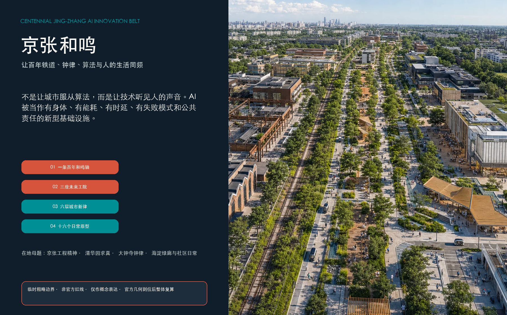

## 设计依据与资料清单

方案以海淀分局资格预审公告、面向智能体任务书和仓库场地包为主依据。公告明确 43.6 平方公里统筹研究、约 11.4 平方公里总体设计和约 368.4 公顷重点区域三个工作层级；任务书要求回应产业生态、未来城市、三区两翼、AI 场景、品牌与长期运营。上述内容用于判断方案覆盖度，不代表任何项目获得实施授权 [source:OFFICIAL-ANNOUNCEMENT] [source:AGENT-TASKBOOK]。

当前资料不包含可供法定规划使用的精确总红线、三处重点区四至、完整现状建筑、权属、道路红线、市政容量、文保、古树、绿线与蓝线。`geometry/site_boundary.geojson` 和 `geometry/key_areas.geojson` 仅用于概念拓扑、图层自检与后续替换；`metrics.json` 对容积率、总建筑规模、法定密度、高度与道路面积保持 `unknown`，拒绝用渲染图制造伪精确结论 [source:KEY-AREA-SOURCE] [metric:floor_area_ratio]。

外部材料按“在地史料—专业标准—技术趋势—国际方法”四组登记。京张铁路、清华园车站、大钟寺和海淀绿廊只支持文化解释；CityGML、MEC、AI 风险框架、能源与适老资料支持方法；企业技术页面仅用于扫描方向。所有发布者、链接、日期、许可和限制见 `sources.json`，不复制第三方图像、图表、品牌或页面代码 [source:SOURCE-REGISTRY] [source:AI-RENDER-SERIES-2026]。

## 三层范围工作框架

三个层级形成同一条证据链：统筹研究范围识别高校、科研、企业、社区与京津冀协作的角色；总体设计范围组织用地、更新、慢行、蓝绿、公共服务和新型基础设施；三处重点区域用首层、院落、断面、运营与停止条件检验总体结构是否真正可用。公告面积只校核任务层级，提交几何面积只校核当前概念图层 [standard:PROJECT-OFFICIAL-ANNOUNCEMENT] [metric:site_area_sqm]。

| 层级 | 专业问题 | 京张和鸣的回答 | 核心交付 |
| --- | --- | --- | --- |
| 统筹研究 | 创新怎样从实验走向公共价值 | “问题—仿真—实训—采用—复盘”的区域闭环 | 角色图谱、产业链、技术成熟度、国际方法 |
| 总体设计 | 分散资源怎样形成连续城市 | 一条百年和鸣轴、三座未来工院、两翼协同网 | 用地、慢行、蓝绿、建筑原型、六层系统 |
| 重点区域 | 技术怎样进入具体场所而不伤害日常 | 公共边—半公共院—受控核的三级空间 | 参考总平、首层、剖面、运营和专业闸门 |

“一条轴”沿京张遗址公园组织连续、无门槛的南北公共生活；“三座未来工院”分别承担训练验证、公共治理和生活采用；“两翼协同网”向西连接学院路与中关村知识服务，向东连接社区、河流和真实城市问题；“六层城市新律”把数据、身体、网络、能源、移动和权利叠合在同一张空间图上 [data:geometry/roads.geojson#ROAD-01] [depth:three_level_scope_framework]。

## 统筹研究范围产业与未来城市研究

京张创新带的缺口不是“再多一栋研发楼”，而是从技术供给到公共采用之间缺少可信接口。高校与实验室产生知识，企业完成产品化，城市运营者和社区掌握真实问题；但需求定义、数据授权、安全验证、无障碍共测、采购前评估、失败复盘常被分散在不同机构。未来城市的竞争力因此不只来自算力和模型，更来自能否把复杂技术变成可进入、可质疑、可维修、可退出的公共制度 [source:CASE-MARS] [source:CASE-KALASATAMA]。

方案建立五段创新链：①社区、设施运营者与企业共同提出问题；②开放语义孪生和世界模型先做仿真；③具身智能在有界实景中训练、测试与红队；④公民智能学院公开目的、风险、能源和人工替代；⑤大钟寺采用端进行体验、比较、拒绝或形成采购前证据。每一段都留下可审计记录，失败结论也进入开源档案，不把展示、试点或路演包装成已采用成果 [source:MIIT-PHYSICAL-AI-2026] [source:NIST-AI-RMF-GAI]。

| 资源 | 空间载体 | 运营接口 | 不能被默认的事项 |
| --- | --- | --- | --- |
| 土地与建筑 | 可逆首层、共享院落、受控测试核 | 使用权协议、消防和文保核验 | 不默认拆除、征收或高强度开发 |
| 算力与网络 | 可断开边缘节点、模型室、设备库 | 计量、日志、网络隔离、人工接管 | 不默认低时延、6G 覆盖或无限能耗 |
| 数据与模型 | 语义孪生、数据舱、红队室 | 最少数据、用途限定、版本与责任人 | 不默认开放个人数据或跨系统调用 |
| 人才与服务 | 工院、学院、采用门诊、维修工坊 | 贡献记录、培训、企业服务、社区席位 | 不只奖励模型作者和明星企业 |
| 真实场景 | 街道、园区、站点、社区与蓝绿节点 | 时空围栏、风险卡、独立复盘 | 不把公众空间变成无边界实验场 |

全球案例只转译机制：榜鹅数字园区提供产学研社区共址与真实城区测试的启示；巴塞罗那提示知识转移需与城市更新同步；卡拉萨塔玛提示小规模、短周期、可停止试点；鹿特丹提示公共传感器必须公开用途并与居民协作；首尔提示 AI 公共体验应免费、易懂、有人工解释。不同土地制度、治理结构和绩效数字一律不移植 [source:CASE-PUNGGOL] [source:CASE-ROTTERDAM-SENSOR-LAB] [source:CASE-SEOUL-AI-CENTER]。

## 总体设计范围城市更新与控规深度城市设计

总体结构为“一条百年和鸣轴、三座未来工院、两翼协同网、六层城市新律、十六个日常原型”。和鸣轴不是单一景观步道，而是同时容纳铁路文化阅读、安静步行、骑行通勤、无障碍移动、公共服务、环境调节和受控机器服务的城市公共骨架。四种在地文化被转译为四个空间动作：京张工程精神转化为“可建、可修、可验证”；清华园求真转化为“公开模型与失败”；大钟寺钟律转化为“可见规则与共同校准”；海淀绿廊转化为“树冠、水、热与生活连续性” [source:CULTURE-HAIDIAN-GREEN-CORRIDOR] [depth:overall_spatial_structure]。

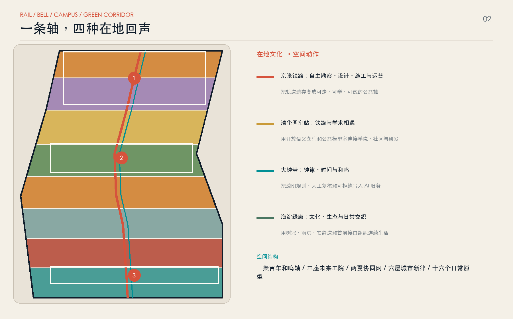

用地以完整、无缝、无重叠的概念分区表达功能重心：北部偏具身智能研发与实训，中部偏公民智能研发、教育和社区服务，南部偏文化展示、生活采用与商业服务，连续公园绿地贯穿其间。色块不是权属地块、法定用地或开发强度结论；公共空间、绿地、建筑原型和线路作为独立叠加层复核，以便官方几何到位后整体重算 [data:geometry/land_use.geojson#LU-01] [standard:MNR-LAND-USE-CLASSIFICATION-GUIDE]。

城市更新遵循“保留优先—首层打开—院落缝合—可逆加建—必要更新待证”。围墙、闲置边角、门厅、站口和桥下空间被识别为五类接口机会，但不预判具体产权或拆改。建筑原型只检验公共边、半公共院、受控核和垂直混合是否可能；总建筑规模、容积率、高度、密度、退线和停车均保持待官方控制和专业测算 [data:geometry/buildings.geojson#BLDG-01] [depth:retain_renovate_demolish] [metric:total_floor_area_sqm]。

## 重点区域详细设计

三座未来工院不是三个同质“AI 园区”，而是创新链上的三种城市机构。每座工院都采用“公共边—半公共院—受控核”的平面梯度：公共边永久免费、无需刷脸并有人工窗口；半公共院承载预约学习、共测和交流；受控核用于数据、设备、机器人和安全测试。首层开放不等于研发边界失守，开放时间、门禁、噪声、消防、疏散和隐私均须逐栋确认 [data:geometry/key_areas.geojson#PROV-KEY-001] [depth:three_key_area_detailed_design]。

### 众智园：工程之声 / 具身智能铸造场

- **参考总平：**沿公共边布置访客廊、工程史展线和可观察测试窗；内部形成 300 米级可分段实训环、可变场景仓、维修库、红队室、物流口与隔离停车。测试环与普通步行不混行，只在指定交叉点以实体门、灯号和安全员控制。
- **首层与剖面：**首层 0—6 米容纳维修、设备转运、公众学习和人工急停；上层容纳仿真、模型评测和研发；屋面只在结构、消防与眩光论证后布置光伏或热回收设备。公共边、半公共院与受控核分别设置独立疏散和网络分区。
- **技术任务：**世界模型先生成可追踪的极端情境，具身智能再在有界场地训练；真实部署必须完成任务定义、数据审查、碰撞风险、网络失联、定位漂移、人工接管和撤场演练。
- **运营：**建议由园区运营方负责场地，测试机构负责安全与日志，企业负责设备，社区与无障碍代表参与验证，独立审计台拥有停止权。任何近失事件未闭环、急停无效或风险外溢即停测 [source:MIIT-PHYSICAL-AI-2026] [source:BEIJING-EMBODIED-2025]。

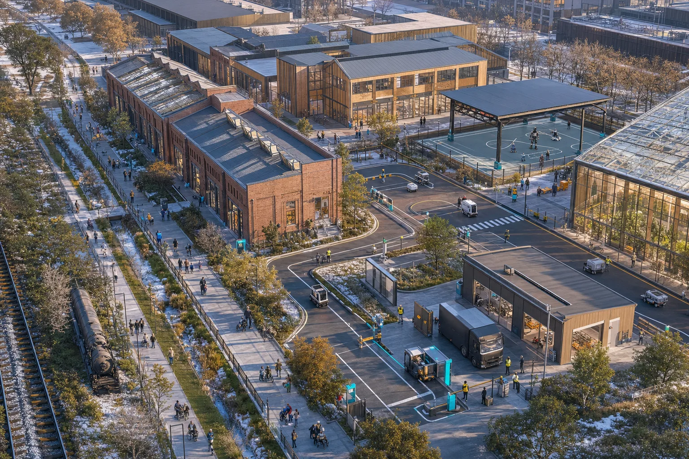

### AI 原点：求真之声 / 公民智能学院

- **参考总平：**以站点—校区—园区—社区的步行缝合为先，设置开放语义孪生室、模型观察窗、公民 AI 议事院、无障碍共测工坊、开源贡献档案馆与人工兜底服务院。
- **首层与剖面：**一层是全天候公共穿廊和可免费进入的人工服务；夹层提供小型教学与协作；上层为研究和运营。数据机房、设备库与公共空间分区，所有屏幕旁保留纸面说明、现场人员与不采集个人数据的路径。
- **技术任务：**用 CityGML 3.0 语义模型连接规划、移动、能源和机器人对象，但只开放经授权的最小数据集；模型输出必须显示版本、时间、适用范围、不确定性和人工责任人。
- **运营：**季度公民议会决定哪些问题值得试、哪些数据不可用、哪些场景应退出；居民、老人、残障者、青少年与一线运营人员获得有偿共测席位，而不是仅作为被观察对象 [source:OGC-CITYGML-3] [source:UNESCO-AI-ETHICS]。

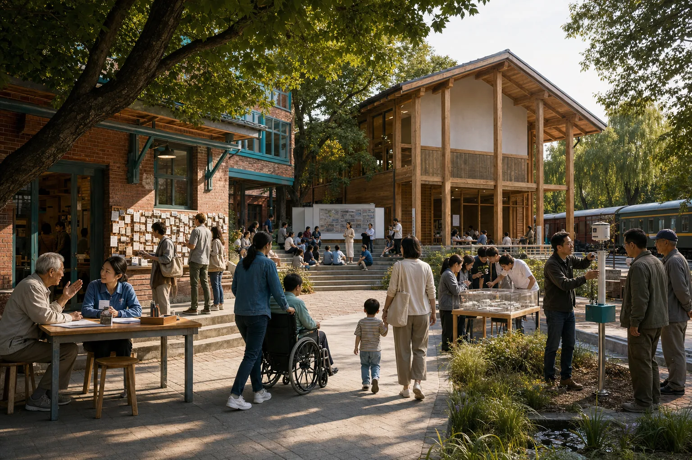

### 大钟寺：钟律之声 / 未来生活交换站

- **参考总平：**优先缝合轨道站点四象限的地面步行和无障碍到达，串联辅助科技图书馆、智能终端采用诊所、多语言城市客厅、小型路演与夜间公共学习。跨路桥隧、地下连通或站体改造只记录需求，不作工程可行性结论。
- **首层与剖面：**站口层提供方向、人工咨询、借用与归还；沿街层布置可比较而非单品牌的产品体验；上层承载培训与企业服务。文保建筑、视廊、钟声环境和人流安全优先于新地标体量。
- **技术任务：**空间计算与辅助设备可以在明确区域、短时授权和本地处理下试用；推荐系统不得把体验变成隐性广告，机器翻译必须标注并提供人工纠错。
- **运营：**采用门诊记录“采用、修改、拒绝、撤回”四种等价结论；老人和残障使用者参与定义任务、验证界面和决定是否扩大，而不是在产品完成后被动试用 [source:CULTURE-DAZHONGSI-BELL] [source:WHO-AGE-FRIENDLY-2023]。

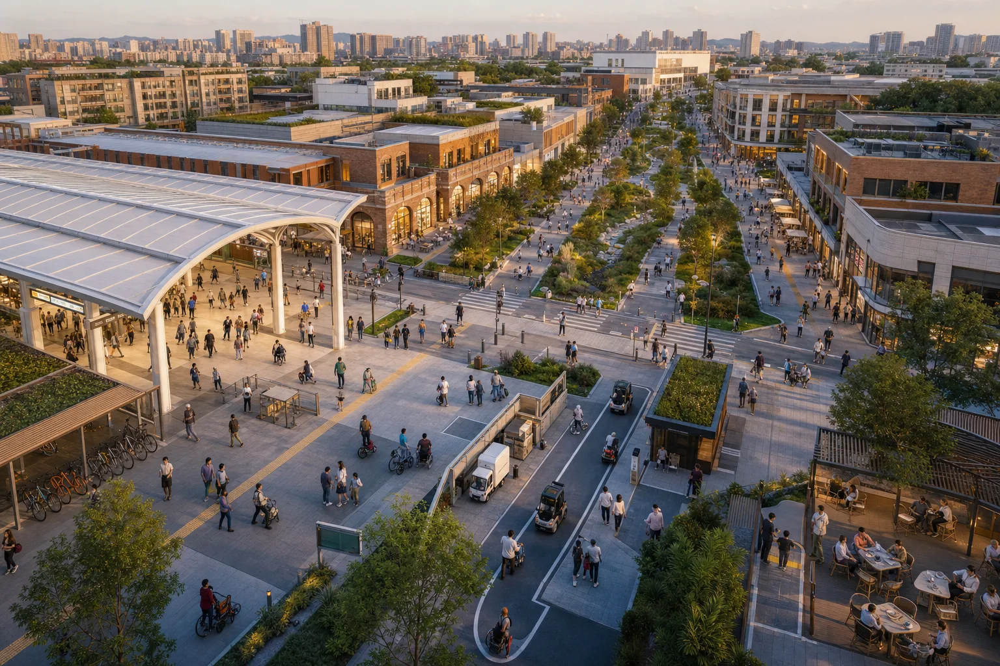

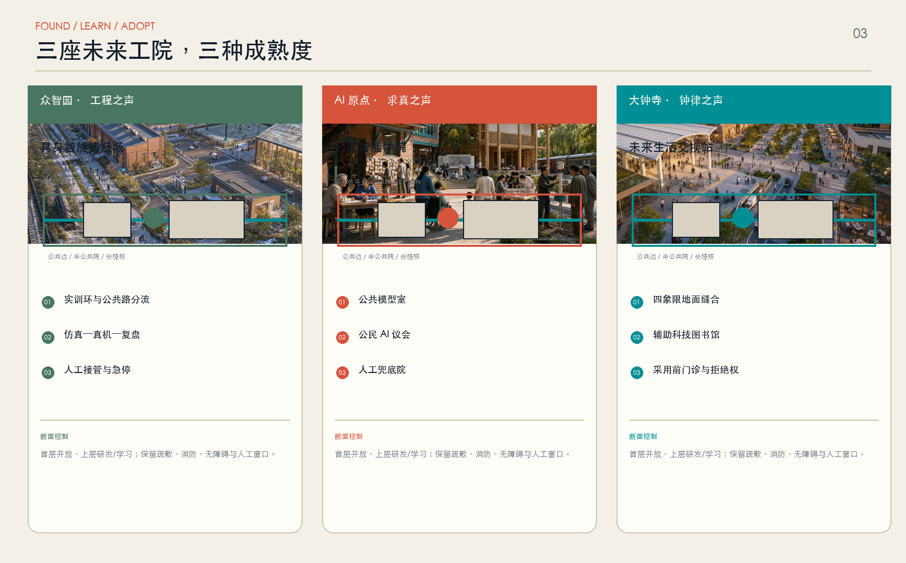

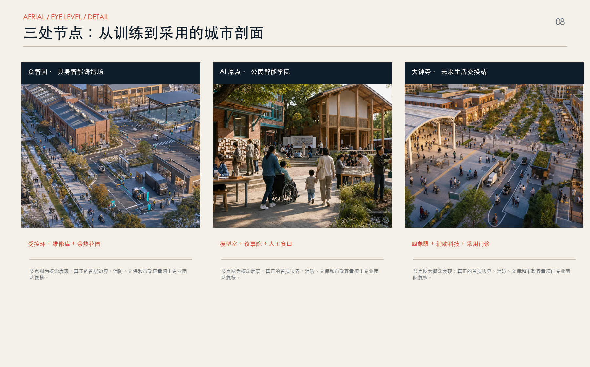

## AI 创新生态、人才画像与 AI+ 场景

“人才”被拆解为七类具体使用者：具身智能工程师需要可控实训和维修；开源开发者需要真实问题与可持续贡献声誉；初创团队需要早期客户、合规和共享设备；高校师生需要把课程与研究接入城市问题；企业与采购方需要可比的验证证据；居民、老人、儿童和残障者需要低扰动空间、人工服务和拒绝权；城市运营者与一线工人需要可解释告警、交接与最终判断权 [source:AGENT-TASKBOOK] [standard:BARRIER-FREE-ENVIRONMENT-LAW]。

| 用户画像 | 一天中的关键任务 | 空间与服务 | 不可越过的边界 |
| --- | --- | --- | --- |
| 具身智能工程师与维修技师 | 仿真、实训、检修、事故复盘 | 实训环、维修库、红队室 | 不在无围栏公共空间做首轮训练 |
| 开源开发者 | 找问题、协作、发布、维护 | 问题库、模型室、贡献档案 | 不用刷脸、轨迹或粉丝量评价贡献 |
| 初创团队 | 找首批用户、测产品、问合规 | 采用门诊、共享设备、服务窗口 | 失败测试不自动公开商业秘密 |
| 高校师生 | 课程实践、研究转化、跨校交流 | 语义孪生室、城市技能学院 | 科研成果、校园数据须明确授权 |
| 企业与采购方 | 比较方案、验证性能、评估采用 | 标准测试卡、证据包、路演 | 展示与试点不等于采购背书 |
| 居民、老人、儿童与残障者 | 通勤、休息、求助、表达与共测 | 安静道、辅助科技库、人工服务院 | 具备匿名、关闭和非数字替代 |
| 城市运营者与一线工人 | 发现问题、调度、维护、复盘 | 可解释仪表、交接台、维修工坊 | AI 不替代执法、审批和最终判断 |

十六个原型使用 R1—R4 方案成熟度：R1 为仿真研究，R2 为有界实训，R3 为小规模公共试点，R4 为成熟人工服务或治理底座；它不是产品 TRL 或认证。每个原型必须同时记录目的、服务对象、授权数据、空间范围、运行时段、人工责任、能源、停止条件与复盘日期 [metric:scenario_node_count] [data:geometry/public_space.geojson#SCENE-01]。

| ID | 日常原型 | 位置与主要用户 | 技术/成熟度 | 人工兜底与停止条件 |
| --- | --- | --- | --- | --- |
| N01 | 世界模型沙盒 | 众智园；工程师、运营者 | 世界模型 / R1 | 只生成仿真证据；不可直接触发现实动作 |
| N02 | 具身智能实景实训环 | 众智园；机器人团队 | 具身智能 / R2 | 安全员、围栏、急停；越界或失联即停 |
| N03 | 机器人安全认证街段 | 众智园；测试机构、公众代表 | 具身智能 / R2 | 预约封闭、替身障碍物优先；近失事件停测 |
| N04 | 算力—余热冬季花园 | 众智园；设施运营、访客 | 能源系统 / R2 | 常规供热备份；能效或舒适不达标即退出 |
| N05 | 城市维护机群库 | 众智园；环卫、园林、维修工 | 具身智能 / R2 | 一线工人调度；不得用自动化考核替代劳动协商 |
| C01 | 开放语义孪生室 | AI 原点；规划者、学生、居民 | CityGML / R3 | 显示版本与不确定性；敏感层不开放 |
| C02 | 公民 AI 议会 | AI 原点；七类用户 | 治理 / R3 | 人工主持、公开纪要、利益冲突披露 |
| C03 | 人工兜底服务院 | AI 原点；所有人 | 人工服务 / R4 | 与数字服务等效、无额外惩罚 |
| C04 | 无障碍共测工坊 | AI 原点；残障者、老人、设计师 | 包容设计 / R3 | 参与者有偿；关键障碍未解决不得上线 |
| C05 | 开源贡献档案馆 | AI 原点；开发者、社区 | 治理 / R3 | 授权、署名、可撤回；不设个人永久排名 |
| C06 | 城市技能学院 | AI 原点；学生、一线工人、转岗者 | 教育 / R3 | 线下教师与纸质材料并存 |
| S01 | 辅助科技图书馆 | 大钟寺；老人、残障者、照护者 | 辅助科技 / R3 | 借用前人工适配；不替代医疗诊断 |
| S02 | 空间计算生活街 | 大钟寺；访客、商户 | 空间计算 / R2 | 明示区域、短时授权、本地优先处理 |
| S03 | 智能终端采用诊所 | 大钟寺；初创、早期客户 | 边缘智能 / R2 | 可比较、可拒绝；不默认商业推荐 |
| S04 | 四象限站城大厅 | 大钟寺；通勤者、访客 | 无障碍移动 / R3 | 人工问询和静态导视永远可用 |
| S05 | 全球未来城市季 | 全带；公众、国际团队 | 公共学习 / R3 | 公开策展与来源；不以活动替代长期服务 |

六项公民 AI 权利适用于全部原型：知情权；拒绝且不受惩罚；等效人工服务；隐私与最少数据；申诉与人工复核；知晓能源与环境代价。缺少任何一项，公共试点不得开始 [source:UNESCO-AI-ETHICS] [depth:risk_missing_data]。

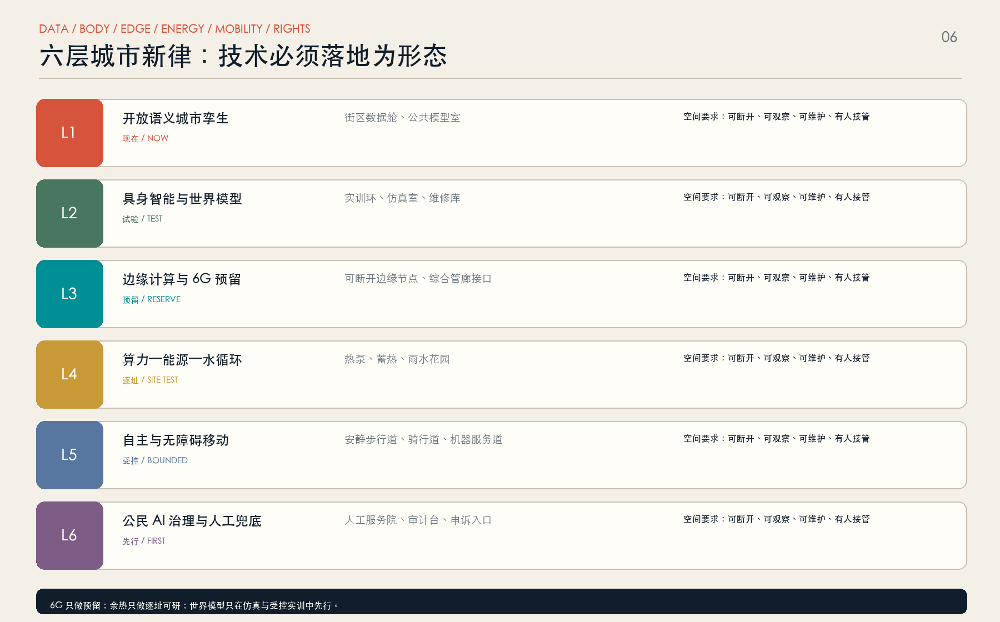

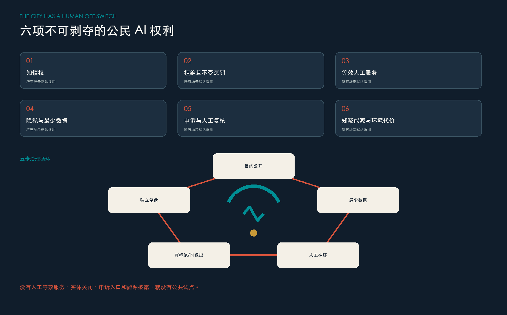

## 用地、建筑规模与拆改留方案

概念用地采用国家用途分类子集，形成完整覆盖、无缝无重叠的功能分区。0802 研发、0803 文化、0804 教育、0702 社区服务、05 商业服务、0701 混合生活和 1401 公园绿地共同支持“训练—治理—采用”的链条。图层面积可从提交几何复算，但只描述本概念图自身，不能外推为法定用地、地块权属或供地条件 [standard:MNR-LAND-USE-CLASSIFICATION-GUIDE] [metric:land_use_0802_area_sqm]。

建筑采取四级策略：A 级保留并维护具有遗产、社区或碳价值的建筑；B 级适应性改造首层和院落；C 级以可逆、轻量、装配式构件补足坡道、遮荫、设备和公共服务；D 级只有在权属、结构、消防、日照、文保、经济和全生命周期碳评估后才讨论更新。当前没有逐栋调查，因此不对任何真实建筑作拆除结论；`geometry/buildings.geojson` 中全部对象均为 `conceptual_prototype=true` [data:geometry/buildings.geojson#BLDG-01] [depth:height_massing_character]。

参考体量采用“低层公共基座 + 中层研发/教育 + 分散设备层”，强调首层连续、院落采光、风环境和可维护性，不追求脱离北京城市肌理的超高层地标。大钟寺控制文保视廊和人流安全，AI 原点控制校园与社区尺度，众智园允许较大跨度实验空间但必须用公共边界缓冲噪声和物流。正式高度、容积率、密度、退线、停车和配套设施由控规与专项论证确定 [standard:MOHURD-CONTROL-DETAILED-PLANNING] [metric:building_height_m]。

首层公共接口设置六条建议控制线：连续无障碍路线；每 300—500 米至少一处免费休息与人工帮助；公共与敏感研发双门禁；物流与访客分流；消防和维护净空；数字服务旁设置无屏幕替代。数值为设计建议，不是法定条文；需由建筑、消防、交通、无障碍和运营专业共同校核。

## 交通、轨道、市政与公共服务设施

交通策略建立“三种并行速度”：最慢层是安静步行和非消费性停留，服务儿童、老人、轮椅和日常散步；中速层是骑行、轮椅与微出行的连续平整路面；机器服务层只允许低速、限定时段和限定路线，并在每个交叉点设置实体让行线、急停柱、声光状态和人工接管。机器必须学会等人，而不是让人适应机器 [data:geometry/roads.geojson#ROAD-01] [standard:BARRIER-FREE-ENVIRONMENT-LAW]。

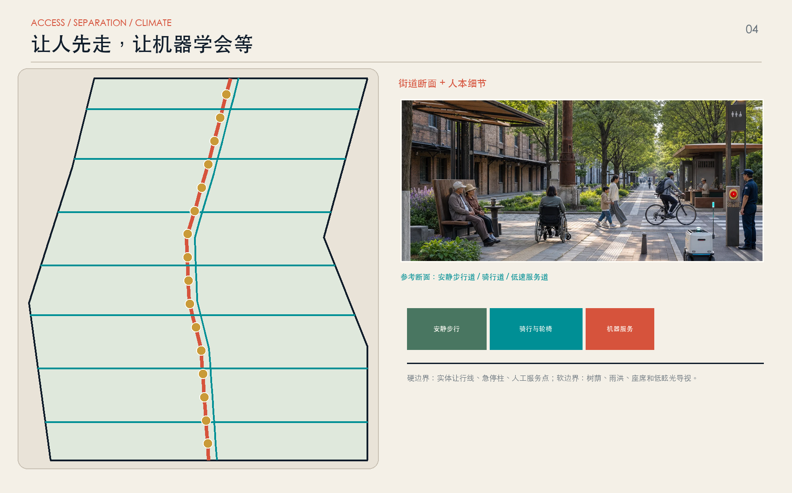

轨道站点被视为城市服务的第一界面。大钟寺优先研究四象限地面缝合与无障碍换乘；AI 原点优先研究站点—校区—园区—社区的步行接力；众智园优先研究公共交通、访客和测试物流分流。桥隧、地下连通、站体改造、自动驾驶接驳和停车规模均须基于交通量、道路红线、轨道运营和应急疏散资料另行论证 [depth:traffic_rail_slow_parking] [metric:road_area_sqm]。

六层城市新律把技术落实为可见的空间、能源和责任系统：

| 层 | 系统 | 空间载体 | 当前成熟度 | 专业底线 |
| --- | --- | --- | --- | --- |
| L1 | 开放语义城市孪生 | 数据舱、公共模型室、版本档案 | 现在可做小范围原型 | 开放标准、最少数据、责任与更新时间可见 |
| L2 | 具身智能与世界模型 | 仿真室、实训环、维修库、红队室 | 仅仿真与有界实训 | 时空围栏、急停、安全员、失联退化模式 |
| L3 | 边缘计算与 6G 预留 | 可断开 MEC 节点、管廊接口、设备柜 | MEC 可试；6G 只预留 | 不承诺覆盖、时延、频谱、日期或供应商 |
| L4 | 算力—能源—水循环 | 热泵、蓄热、冷却、雨水花园、计量 | 必须逐址可研 | 小时级负荷、温度、距离、备份与全生命周期账本 |
| L5 | 自主与无障碍移动 | 安静道、骑行道、机器服务道、站点 | 低速有界试点 | 人优先、物理隔离、人工接管、无障碍共测 |
| L6 | 公民 AI 治理与人工兜底 | 人工服务院、审计台、申诉入口 | 必须先于公共试点 | 六项权利、实体关闭、独立复盘、可撤回 |

CityGML 3.0 用作跨规划、建筑、能源、移动与机器人对象的开放语义骨架；MEC 只在本地化、可断开和可观察的节点运行。6G/ISAC 属于远期管廊、供电、散热和频谱协调预留：在标准、频谱、网络计划和必要场景明确前，不采购专属设备、不宣称覆盖或时延 [source:OGC-CITYGML-3] [source:ETSI-MEC-003] [source:ITU-IMT2030-2026]。

算力基础设施必须有“瓦特、温度和水”的城市身份证。每个节点公开 IT 负荷、冷却负荷、PUE/WUE 口径、峰谷时段、备用能源、噪声和退役路径。余热冬季花园只有在热源温度、热负荷同时性、输送距离、热泵性能、储热、常规备份、碳与经济模型同时通过后才可实施；失败时切回常规系统并恢复公共空间 [source:IEA-ENERGY-AI-2025] [metric:human_fallback_coverage_ratio]。

公共服务设施保持“数字与人工双轨”：无屏幕导视、人工问询、饮水、靠背座椅、卫生间指引、应急呼叫、儿童友好点位和辅助设备借用不得因智能化而取消。数字界面提供大字、语音、手语和多语言，但不把摄像、声纹或手机作为获得基本服务的前提。

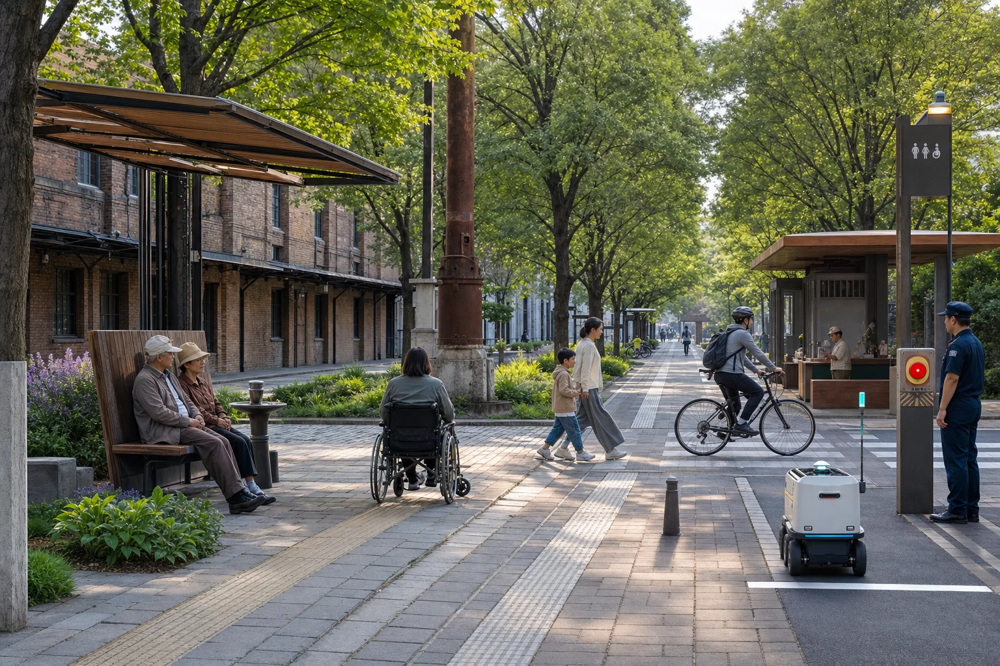

## 蓝绿空间、公共空间与城市风貌

蓝绿系统不是给科技园“加绿”，而是调节热、水、风、声和人群压力的基础设施。遗址公园、清河/小月河生态线索、连续树冠、雨水花园和三处冷岛组成季节网络：夏季提供遮荫、渗透和夜间降温；冬季挡风、向阳停留并测试低品位余热；暴雨时分散调蓄；日常则提供不消费也能停留的公共权利。绿地与公共空间边界仍是概念层，不替代绿线、蓝线和河道管理范围 [data:geometry/green_space.geojson#GREEN-01] [metric:green_ratio]。

材料语言从北京铁路工业遗产和学院理性中提取，而不做仿古。耐候钢只作耐久结构和细部，旧砖肌理用于触感和尺度，可替换木面提供温度，透水铺装和本地适生树种承担气候性能。视觉符号由两条轨道、一道钟形波和一个人为开口构成：轨道代表工程连续性，波形代表公共校准，开口代表任何系统都必须为人留出退出路径。夜景使用低眩光暖白照明，青色只显示系统状态，不制造高亮赛博景观 [source:CULTURE-JINGZHANG-HAIDIAN] [depth:blue_green_public_space]。

空间细节以“可坐、可扶、可听、可关、可修”为尺度：座椅有靠背扶手和多种高度；坡道、盲道和轮椅回转不被展陈侵占；设备箱能物理关闭并显示负责人；传感器标明目的、数据、保存期限和申诉方式；机器人路线有可触知边界；所有构件能被普通维护队伍更换。遗产构筑物、古树、重要视廊与声环境须经专项调查后再定位。

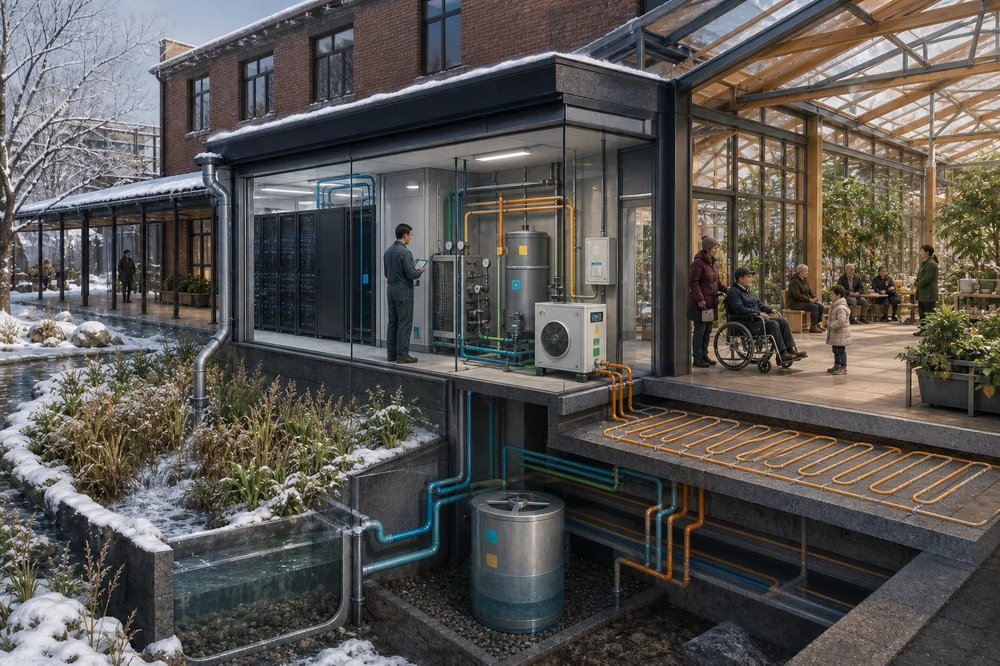

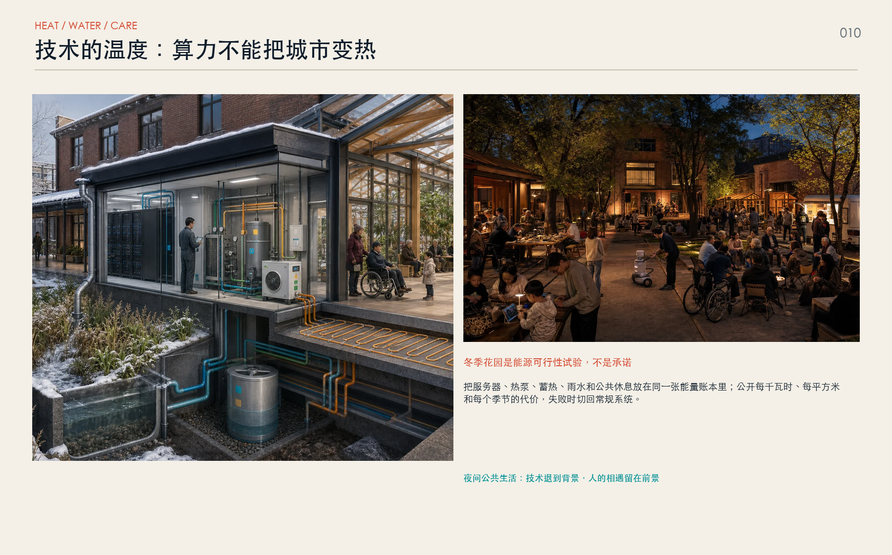

## 更新项目清单、实施政策与分期计划

实施遵循“规则先于空间、空间先于规模”：阶段 0 先确立权利章程、数据和能源账本；阶段 1 用 300 米样段与三处有界原型验证；阶段 2 在正式条件通过后缝合站城、蓝绿和首层；阶段 3 才讨论扩散。分期图层表达逻辑顺序，不是审批、投资或开工计划 [data:geometry/phasing.geojson#PHASE-01] [depth:phasing_implementation]。

CAPEX/OPEX 仅为 L/M/H 相对资源级别，不是投资估算。RACI 中 A 为最终负责、R 为执行、C 为协商、I 为知会；具体机构名称须在实施组织确定后替换。

| 项目 | 核心交付 | 阶段 | CAPEX/OPEX | A / R / C | 启动闸门 | 停止或调整条件 |
| --- | --- | --- | --- | --- | --- | --- |
| P01 百年和鸣轴 300 米样段 | 安静道、骑行、树冠、人工服务、机器让行线 | 0—1 | M/M | 场地业主 / 设计运营 / 社区、交管 | 场地授权、消防、无障碍、维护预算 | 阻断通行、事故或维护不可持续 |
| P02 开放语义孪生底座 | 最小数据集、对象词表、版本与权限 | 0—1 | M/M | 数据责任体 / 技术团队 / 规划、社区 | 数据清单、授权、网络安全评审 | 目的漂移、敏感数据无法隔离 |
| P03 具身智能安全实训环 | 可分段环、急停、维修、事件日志 | 1 | M/H | 测试责任体 / 场地与企业 / 安全代表 | 保险、围栏、接管与撤场演练 | 越界、失联、近失事件未闭环 |
| P04 世界模型评测与红队室 | 极端场景库、模型卡、仿真—实测差异 | 1 | M/M | 评测机构 / 研究团队 / 运营者 | 可追溯数据与基准、独立复核 | 仿真偏差不可解释或被用于直接控制 |
| P05 算力余热可研与冬季花园 | 小时级能源模型、热泵和常规备份 | 1—2 | H/M | 设施业主 / 能源团队 / 园林、公众 | 温度、同时性、距离、碳与经济均通过 | 能效、舒适、噪声或成本未达阈值 |
| P06 公民智能学院 | 议事院、模型室、人工服务与课程 | 1—2 | M/M | 公共治理体 / 学院与运营 / 七类用户 | 稳定运营经费、课程与服务责任 | 只剩展示、人工服务被削减 |
| P07 人工兜底服务院 | 等效柜台、热线、纸面流程、申诉 | 1 | L/H | 公共服务责任体 / 一线团队 / 法务、社区 | 服务标准、人员与转介机制 | 等待或费用显著劣于数字服务 |
| P08 开源贡献档案馆 | 代码、文档、失败、社区贡献可撤回档案 | 1—2 | L/M | 治理体 / 档案团队 / 贡献者 | 许可、署名、删除与争议规则 | 永久个人排名或未经授权公开 |
| P09 大钟寺四象限地面缝合 | 过街缩短、连续无障碍、站口人工信息 | 2 | H/M | 交通责任体 / 设计施工 / 轨道、文保 | 交通调查、疏散、文保和管线论证 | 安全、遗产或站体条件不允许 |
| P10 辅助科技图书馆 | 借用、适配、维修、培训 | 1—2 | M/M | 运营体 / 专业服务团队 / 老人、残障者 | 共创、责任、消毒维护与转介 | 被商业导购取代或形成医疗误导 |
| P11 安静道与无障碍移动网 | 连续平整路线、休息点、机器分流 | 1—2 | M/M | 城市运营体 / 交通景观团队 / 使用者 | 路权、无障碍与安全评估 | 冲突率上升、弱势使用者受排斥 |
| P12 蓝绿降温与雨洪节点 | 树冠、渗透、调蓄、四季监测 | 1—2 | M/L | 园林水务体 / 景观团队 / 社区 | 土壤、管线、海绵与养护核验 | 古树、生态或排水系统受损 |
| P13 城市 AI 权利章程与独立审计台 | 六项权利、登记、申诉、公开复盘 | 0 | L/M | 治理委员会 / 独立审计 / 法务、公众 | 法律审查、预算和真实停止权 | 无法独立、投诉无响应、审计不公开 |
| P14 全球未来城市季 | 开源展、失败复盘、社区课程、国际交流 | 2—3 | L/M | 策展治理体 / 文化教育团队 / 社区 | 公开来源、无障碍、长期服务衔接 | 过度商业化、扰民或活动替代日常服务 |

每个项目使用 90 天闭环：第 0—15 天公开问题与利益相关者；第 16—30 天完成权利、数据、能源和空间闸门；第 31—75 天小规模运行；第 76—90 天独立复盘，给出“停止、修改、延长、扩大”之一。只有连续两个周期通过且专业条件补齐，才可进入更大范围；活动人次、媒体曝光和模型分数不能替代安全、无障碍、能源和居民体验证据 [source:CASE-KALASATAMA] [source:NIST-AI-RMF-GAI]。

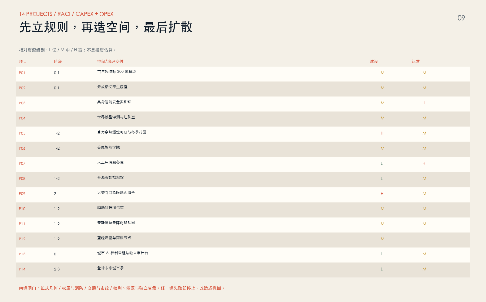

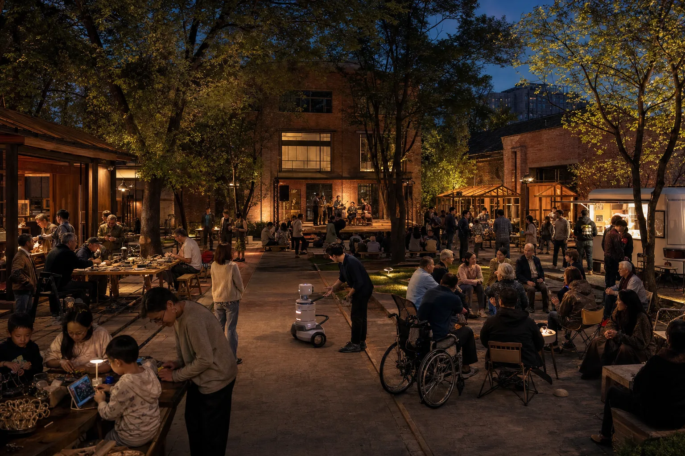

## 指标体系、面积复算与合规矩阵

指标分四类：①公告给出的三层工作范围面积；②从提交临时几何复算的概念空间指标；③方案承诺型指标，如 16 个原型、6 项权利和 14 个项目；④必须保持未知的法定或工程指标。第二类始终是低置信度，第三类是设计条件而非建成绩效，第四类在正式资料缺失时不得补数字 [metric:public_space_ratio] [metric:renewal_project_count] [metric:floor_area_ratio]。

| 指标组 | 当前可报告 | 不能宣称 | 复算/验收方法 |
| --- | --- | --- | --- |
| 空间拓扑 | 临时场地、用地、绿地、公共空间、线路与分期的几何复算 | 官方红线、地块和法定比例 | 替换官方几何后统一重跑所有图层与文档 |
| 城市体验 | 连续无障碍意图、人工服务覆盖、16 个原型位置 | 实际通达率、满意度或安全绩效 | 现场审计、使用者共测、冲突与等待时间 |
| 技术系统 | 六层架构、成熟度、断开与接管要求 | 产品性能、6G 时延、余热收益 | 测试报告、网络与能源专项、独立验证 |
| 公民权利 | 六项权利覆盖全部场景的设计承诺 | 已被法律或机构正式采纳 | 服务抽查、申诉闭环、退出与非数字路径测试 |
| 开发与投资 | L/M/H 相对资源级别 | FAR、高度、总建面、投资额与回报 | 控规、测绘、成本咨询和生命周期模型 |

所有机器场景必须达到 `physical_stop_coverage_ratio=1.0` 的设计要求，所有公共 AI 场景必须达到 `human_fallback_coverage_ratio=1.0`；两者只说明方案设定，不是建成验收结果。合规矩阵、标准矩阵和设计深度矩阵把公告任务、专业标准、图件、GeoJSON、指标、来源、假设与自检关联，任何显示材料和结构化数据不一致都应阻止提交 [metric:physical_stop_coverage_ratio] [standard:GENERATIVE-AI-INTERIM-MEASURES]。

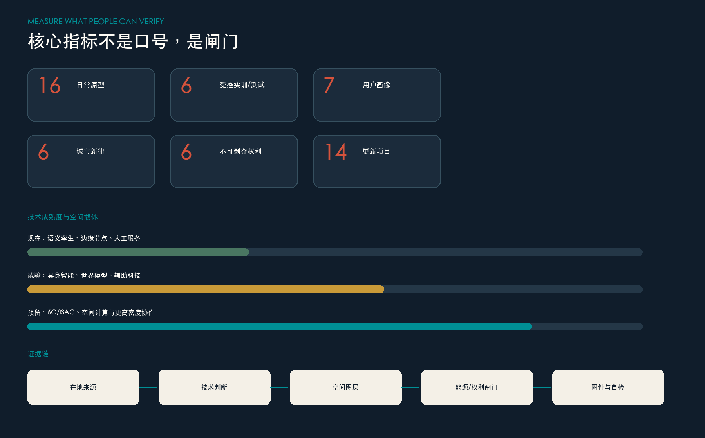

## 风险、版权与合规说明

最高空间风险是把临时几何误读为官方红线。正式边界、权属、控规、建筑普查、交通、市政、文保、古树和生态资料到位后，必须同步重算 GeoJSON、指标、图件、网页和四份 PDF；不能只换底图。任何原型与法定控制冲突时，应移动、缩小或停止，而不是修改来源说明来保留方案 [source:BOUNDARY-SOURCE] [depth:risk_missing_data]。

技术风险包括模型幻觉、世界模型与现实偏差、机器人碰撞与失联、网络攻击、传感器目的漂移、算法歧视、数字排斥和供应商锁定。治理响应是分级成熟度、仿真先行、有界实训、红队、最少数据、开放接口、版本记录、物理急停、人工等效服务、申诉和独立复盘。涉及执法、审批、健康、照护、未成年人和公共安全时，AI 只能辅助，不得单独作出影响个人权益的最终决定 [source:NIST-AI-RMF-GAI] [source:UNESCO-AI-ETHICS]。

能源风险不是附属议题。AI 基础设施具有真实电力、冷却、水、噪声和退役成本；每个节点须公开计量口径和常规替代。余热利用是逐址可研，不是口号；6G 是远期预留，不是当前部署；企业模型页面只证明技术方向存在，不证明本地性能、采购或认证 [source:IEA-ENERGY-AI-2025] [source:GOOGLE-ROBOTICS-ER-16] [source:NVIDIA-COSMOS-3]。

七张媒体图由 OpenAI 内置图像生成工具根据本方案独立提示生成，画面人物、建筑、植被和设备均为合成概念表现。它们只表达空间气氛与系统意图，不是现场照片、测绘、工程效果图、公众意见或空间事实；不得支持边界、面积、现状、无障碍绩效和工程可行性。版权、来源和复用条件见 `report/copyright_statement.md` 与 `sources.json` [source:AI-RENDER-SERIES-2026]。

## 参考资料

本方案采用“正文就近证据标记 + 结构化来源清单”两层书目。项目任务以公告、任务书和场地包为主；空间边界以仓库状态字段为准；专业判断以仓库标准快照和公开机构资料为参照；技术趋势只支持架构、成熟度与风险边界；国际案例只支持方法比较。完整链接、许可、访问日期、用途与限制见 `sources.json` [source:SITE-PACKAGE] [source:SOURCE-REGISTRY]。

- 北京市规划和自然资源委员会海淀分局：百年京张 AI 创新带城市设计资格预审公告。
- 海淀区人民政府、清华大学校史馆、北京市文物局：京张铁路遗址公园、清华园车站与大钟寺钟律文化资料。
- Open City AI：`brief/site-package/`、`data/source_registry.json` 与智能体任务书。
- 工业和信息化部、北京市相关部门：具身智能实景实训与产业培育公开材料。
- OGC CityGML 3.0、ETSI MEC、ITU IMT-2030、IEA《Energy and AI》、NIST AI RMF、UNESCO AI Ethics、WHO Age-friendly Cities。
- JTC Punggol Digital District、Barcelona 22@、MaRS、Smart Kalasatama、Seoul AI Smart City Center、Rotterdam Sensible Sensor Lab。

**最终承诺：**未来城市不是自动化最多的城市，而是最能让技术与历史、生态、身体、劳动和公共权利相互听见的城市。京张和鸣将“先进”定义为一种可被普通人验证的能力：看得懂、进得去、用得起、拒绝后不受惩罚、失败时有人接手，且每一瓦算力都要对城市负责。
