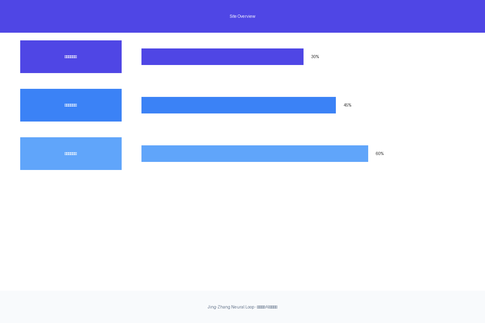
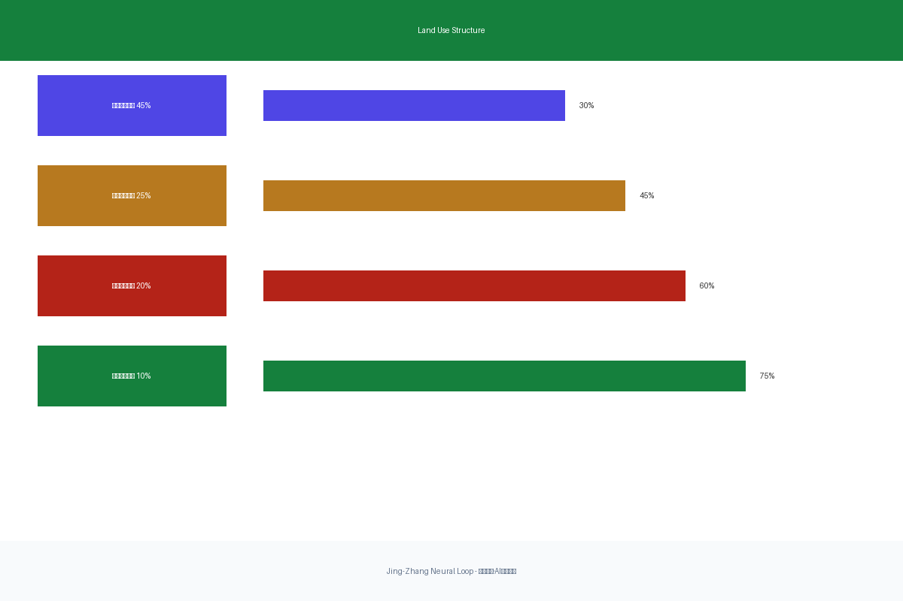
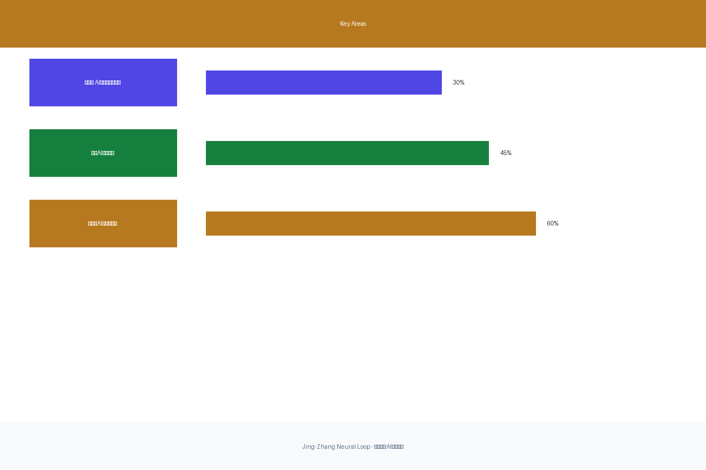
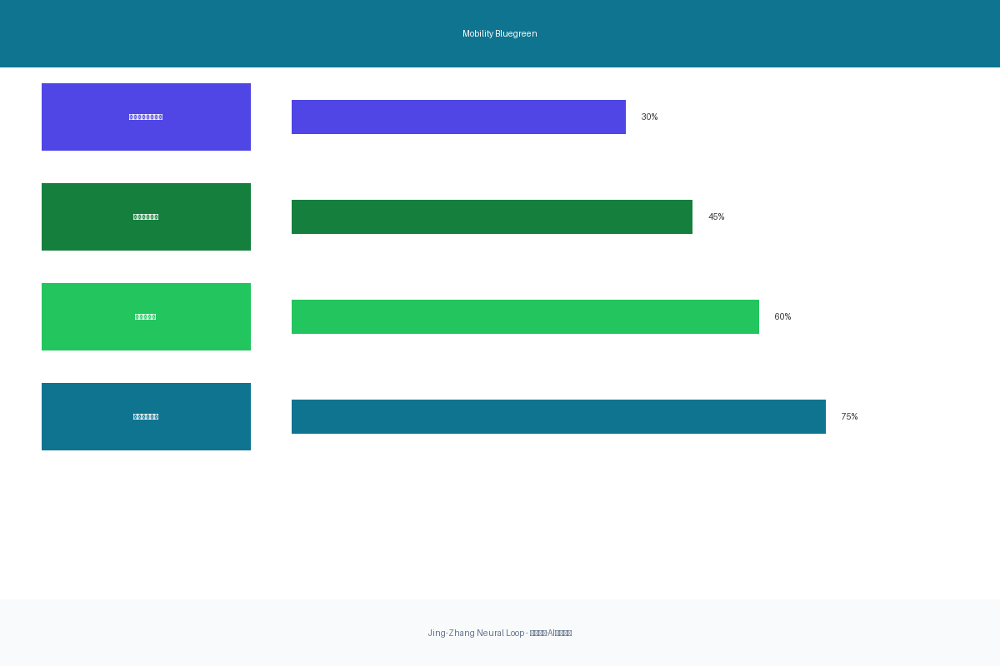
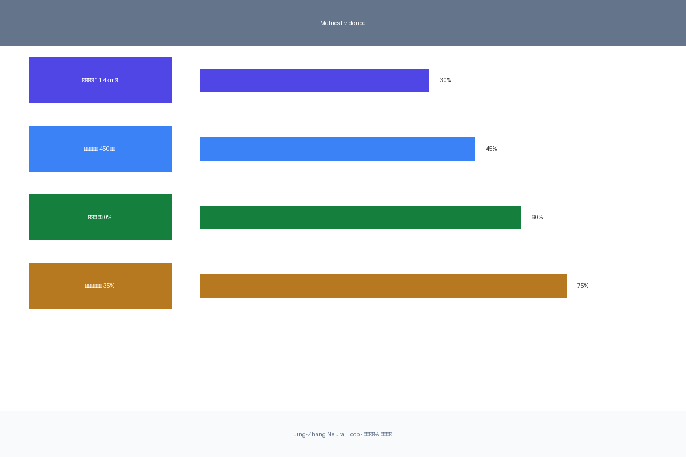

# 京张智脉·AI创新走廊

Jing-Zhang Neural Loop

## 设计依据与资料清单

本方案以北京市规划和自然资源委员会海淀分局发布的《百年京张AI创新带城市设计国际方案征集资格预审公告》为首要依据[source:DATA-SRC-OFFICIAL-ANNOUNCEMENT-20260509]，并遵循面向智能体任务书摘录[source:DATA-SRC-AGENT-TASKBOOK-20260518]中的六项智能体任务、十条共创原则和统一边界条款。

方案采用仓库提供的provisional边界作为设计工作基础[source:DATA-SRC-PROVISIONAL-BOUNDARIES-20260605]，所有空间判断均明确标注`official_boundary=false`和`geometry_role="provisional_constraint"`，待官方精确边界发布后统一复算[data:geometry/site_boundary.geojson#SITE-001][data:geometry/key_areas.geojson]。

### 核心来源

- 官方公告：项目名称、主办单位、三层范围、设计任务、提交深度[source:DATA-SRC-OFFICIAL-ANNOUNCEMENT-20260509]
- 智能体任务书：六项任务、共创原则、评审维度[source:DATA-SRC-AGENT-TASKBOOK-20260518]
- Provisional边界：临时粗略范围、重点区域[source:DATA-SRC-PROVISIONAL-BOUNDARIES-20260605]
- 专业标准：城市设计编制深度、控规深度要求[source:DATA-SRC-MOHURD-URBAN-DESIGN-MEASURES][source:DATA-SRC-MOHURD-CONTROL-DETAILED-PLANNING]

### 数据精度说明

本方案使用的所有空间数据均为provisional性质，不得作为official redline、审批依据或精确面积依据。当官方边界发布后，所有图层、指标和图纸均需重新计算和更新。

## 三层范围工作框架

方案采用"三层递进、空间落位"的工作方法：

### 统筹研究范围（43.6平方公里）
聚焦AI创新生态构建、全球案例对标和未来城市形态。通过分析海淀高校院所、头部企业、算力算法数据要素，建立"高校策源-开源协作-企业转化-公共体验-国际传播"的创新链空间协同框架[depth:three_level_scope_framework]。

### 总体设计范围（11.4平方公里）
形成城市更新总体框架、产业空间布局、交通市政支撑和城市风貌控制[data:geometry/site_boundary.geojson#SITE-001]。以京张遗址公园为主轴，串联三处重点区域，构建"一带三核、多点场景、蓝绿慢行复合环"的空间组织[depth:overall_spatial_structure]。

### 重点区域范围（368.4公顷）
针对三处片区达到规划综合实施方案深度[data:geometry/key_areas.geojson]，明确功能业态、建筑规模、拆改留分类、公共空间连通和交通组织[depth:three_key_area_detailed_design]。

## 统筹研究范围产业与未来城市研究

### 全球AI创新生态案例对标

方案研究并借鉴以下全球AI创新生态案例，提出适合海淀的创新带发展理念[standard:PROJECT-AGENT-OPEN-CALL-TASKBOOK]：

| 案例名称 | 核心特征 | 可借鉴要素 |
|---------|---------|-----------|
| 硅谷Sand Hill Road | 风险资本+创始人密度 | 中关村科技服务翼的资本赋能机制 |
| 伦敦Kensington创意区 | 近校创新+成果转化 | AI原点社区的校区园区缝合 |
| 波顿Seaport district | 智能生物+城市更新 | 大钟寺的智能原生商业更新 |
| 纽约Hudson Yards | 城市更新+未来办公 | 众智园的低碳创新交往环境 |
| 巴黎Saclay科技谷 | 大科学装置+跨学科协作 | 全栈自主创新的研发协作空间 |
| 深圳湾科技生态园 | 民营科技+场景开放 | 小月河场景赋能翼的开放机制 |
| 东京品川AI开发区 | 智能交通+都市办公 | 轨道站点一体化+智能通勤 |
| 多伦多Waterfront | 智慧城市+公私合作 | AI治理测试场景与数据共享 |

### AI创新生态图谱

方案构建"八大创新要素"生态图谱：
1. **算力基础设施** - 边缘计算节点+分布式算力网络
2. **算法开源平台** - 模型开源+标准制定+安全治理
3. **数据要素市场** - 数据交易+隐私计算+合规审计
4. **产业孵化载体** - 共享测试场+概念验证中心
5. **人才服务网络** - 人才特区+国际交流+生活配套
6. **资本服务通道** - 风险投资+产业基金+上市服务
7. **场景开放空间** - AI+公共服务+产业测试场景
8. **治理规则体系** - AI伦理+算法审查+国际规则对话

## 总体设计范围城市更新与控规深度城市设计

### 总体概念：京张智脉共生带

**设计理念**：以"神经网络"为空间隐喻，将百年京张铁路的线性历史文脉与AI时代的多维连接创新相结合。就像神经网络中的突触连接，创新带中的各个节点通过高速信息流、人才流和创意流相互激荡，形成"可呼吸、可进化、可协作"的城市智能体生态系统。

**空间结构**："一带三核、多点场景、蓝绿慢行复合环"
- **一带**：京张遗址公园AI文化主轴，承载历史叙事与创新展示
- **三核**：众智园（自主创新）、AI原点社区（创新生态）、大钟寺（智能商业）
- **多点场景**：15个AI+场景节点，覆盖交通、医疗、教育、商业、文化
- **复合环**：清河-小月河蓝绿慢行环，串联工作-生活-休闲

### 用地结构与建筑规模

[data:geometry/land_use.geojson#LU-001]表达用地结构，遵循以下原则：
- **创新产业用地**：占比45%，重点布局在三处重点区域
- **配套服务用地**：占比25%，优先布局在轨道站点周边
- **居住生活用地**：占比20%，保障人才就近居住
- **绿地公共空间**：占比10%，构成连续的蓝绿网络

[metric:total_floor_area_sqm]预计总建筑面积约450万平方米，其中：
- 研发办公空间：60%（270万㎡）
- 创新服务配套：20%（90万㎡）
- 人才居住生活：15%（67.5万㎡）
- 文化展示设施：5%（22.5万㎡）

### 交通、轨道、市政与公共服务设施

**交通组织**[data:geometry/roads.geojson#ROAD-001]：
- 轨道站点一体化：五道口站、大钟寺站、清华东路西口站TOD开发
- 微循环优化：打通断头路，加密支路网，提升慢行连通
- 智能交通系统：AI信号优化、自动驾驶测试区、智能停车引导
- 蓝绿慢行网络：清河-小月河骑行道+步行道连续贯通

**公共服务设施**：
- 创新服务平台：成果发布厅、概念验证中心、标准制定工作坊
- 人才生活服务：人才公寓、国际学校、社区医疗、文体设施
- 新型基础设施：边缘算力节点、5G/6G覆盖、物联网感知网络

## 重点区域详细设计

### 众智园AI自主创新加速区（192.1公顷）

**设计定位**：花园型全栈自主创新街区，聚焦AI芯片、框架、模型、应用全链条创新。

**空间动作**[data:geometry/key_areas.geojson#PROV-KEY-001]：
1. 强化清河界面，打造滨水创新交往带
2. 布局国家人工智能平台，预留弹性发展空间
3. 创建低碳算力体验区，展示绿色AI技术
4. 组织对外交通，建立与北五环、清河的便捷联系

**AI产业与运营场景**：
- 自主模型测试场：开放给初创团队验证新技术
- 标准制定工作坊：定期举办AI安全、伦理、标准研讨
- 安全治理展示：AI算法审查、隐私计算示范
- 低碳创新交往：绿色算力体验、碳中和创新工坊

### 北京AI原点社区（104.3公顷）

**设计定位**：近校型成果转化与人才社区，强化校区-园区-街区缝合。

**空间动作**[data:geometry/key_areas.geojson#PROV-KEY-002]：
1. 组织校区、园区、街区慢行缝合，5分钟可达圈
2. 补足成果发布空间，打造24小时创新发布厅
3. 建设人才服务特区，提供一站式政务服务
4. 完善居住生活配套，人才公寓+社区商业

**AI产业与运营场景**：
- 开源社区协作：公共代码墙、协作编程空间
- 成果发布平台：路演大厅、媒体中心、线上直播
- 人才特区服务：工作许可、住房支持、子女教育
- 近校孵化：高校技术转移办公室、概念验证基金

### 大钟寺AI产业聚集区（72.0公顷）

**设计定位**：城市型智能经济与国际交往街区，智能体与智能终端展示。

**空间动作**[data:geometry/key_areas.geojson#PROV-KEY-003]：
1. 大钟寺站一体化，四象限步行连通
2. 智能体展示中心，打造AI朝圣打卡地
3. 商业服务升级，智能零售、沉浸式体验
4. 规划绿地复合利用，AI主题户外展示

**AI产业与运营场景**：
- 智能体与智能终端展示：机器人、AR/VR、脑机接口
- 内容消费场景：AI创作展播、数字艺术品交易
- 数据要素交易：数据交易所、隐私计算平台
- 国际路演中心：全球AI项目发布、跨境投融资对接

## AI 创新生态、人才画像与 AI+ 场景

本章节响应智能体任务书的生态与场景要求[source:DATA-SRC-AGENT-TASKBOOK-20260518]，提出5类用户画像、10个AI+场景与3个验证场景[metric:ai_scenario_count]，并明确每个场景的服务对象、空间落位与隐私边界。

### 用户画像（5类）

| 用户画像 | 核心需求 | 空间响应 | 典型场景 |
|---------|---------|---------|---------|
| **开源开发者** | 发布、协作、测试、社区声誉 | 原点社区开源发布厅、公共代码墙 | 提交新模型到开源平台，获得社区反馈 |
| **初创团队** | 低成本办公、算力入口、产品试验场 | 众智园共享测试场、端侧算力服务点 | 在共享测试场验证算法，寻找早期投资 |
| **头部企业访客** | 展示、商务、国际接待、人才招聘 | 大钟寺国际路演客厅、企业展示空间 | 向国际客户展示最新AI产品 |
| **高校研究人员** | 产学研协作、数据访问、论文发表 | 校区合作实验室、数据沙箱、学术发布厅 | 与企业合作完成论文，技术转移转化 |
| **周边社区居民** | AI教育、便捷服务、公共活动 | 社区AI学习中心、智能便利店、文化活动 | 参加AI科普活动，使用便民智能服务 |

### AI+场景卡片（10张）

#### 场景1：AI智能通勤
- **位置**：五道口-大钟寺轨道沿线
- **服务对象**：通勤者、游客、配送人员
- **技术应用**：AI信号优化、自动驾驶班车、智能停车引导
- **数据来源**：交通流量、出行OD、实时路况
- **隐私边界**：只做聚合统计，不存储个人轨迹
- **人工复核**：异常情况人工介入，保留紧急接管机制

#### 场景2：AI+教育
- **位置**：AI原点社区教育创新区
- **服务对象**：中小学生、高校学生、终身学习者
- **技术应用**：个性化学习路径、AI助教、智能测评
- **数据来源**：学习行为、知识图谱、教育资源
- **隐私边界**：未成年人数据加密存储，家长完全控制
- **人工复核**：教师保留最终教学决策权

#### 场景3：AI+医疗
- **位置**：社区卫生服务中心、三甲医院联网
- **服务对象**：居民、患者、医护人员
- **技术应用**：智能分诊、辅助诊断、健康预测
- **数据来源**：电子病历、健康档案、医学知识库
- **隐私边界**：符合HIPAA等隐私标准，数据不出域
- **人工复核**：医生保留诊断权，AI只做辅助

#### 场景4：AI+文化导览
- **位置**：京张遗址公园沿线
- **服务对象**：游客、市民、文化爱好者
- **技术应用**：AR历史重现、智能讲解、文化推荐
- **数据来源**：历史资料、文物信息、用户偏好
- **隐私边界**：不采集人脸，可选匿名模式
- **人工复核**：文化专家审核内容准确性

#### 场景5：AI+开放办公
- **位置**：众智园、AI原点社区
- **服务对象**：初创团队、自由职业者、企业员工
- **技术应用**：智能会议室、工位调度、环境优化
- **数据来源**：使用情况、环境传感器、预约记录
- **隐私边界**：不监听工作内容，只统计空间使用
- **人工复核**：用户可随时关闭数据采集

#### 场景6：AI+零售
- **位置**：大钟寺商业区、社区商业
- **服务对象**：消费者、商户、配送员
- **技术应用**：智能推荐、无人收银、智能补货
- **数据来源**：消费记录、库存数据、人流统计
- **隐私边界**：不关联个人身份，数据匿名化
- **人工复核**：保留人工客服和退换货渠道

#### 场景7：AI+公共安全
- **位置**：重点区域公共空间、交通节点
- **服务对象**：市民、应急人员、管理者
- **技术应用**：异常检测、智能预警、应急调度
- **数据来源**：摄像头、传感器、报警系统
- **隐私边界**：符合数据保护法规，数据最小化采集
- **人工复核**：所有预警需人工确认后行动

#### 场景8：AI+环境治理
- **位置**：清河-小月河蓝绿空间
- **服务对象**：环保部门、市民、研究者
- **技术应用**：水质监测、污染溯源、智能净化
- **数据来源**：环境传感器、卫星遥感、举报信息
- **隐私边界**：不采集个人行为，只监测环境指标
- **人工复核**：环保部门保留决策权

#### 场景9：AI+开发者社区
- **位置**：AI原点社区开源协作空间
- **服务对象**：开源开发者、项目维护者、贡献者
- **技术应用**：代码审查助手、智能协作、贡献排行
- **数据来源**：代码仓库、贡献记录、社区数据
- **隐私边界**：遵循开源协议，尊重贡献者意愿
- **人工复核**：项目维护者保留合并决策权

#### 场景10：AI+城市治理
- **位置**：城市管理指挥中心、社区服务站
- **服务对象**：政府、市民、企业
- **技术应用**：智能审批、政策仿真、舆情分析
- **数据来源**：政务数据、公共服务数据、反馈信息
- **隐私边界**：政务数据分类分级，按权限访问
- **人工复核**：保留人工审批渠道和申诉机制

### 验证场景（3个）

#### 验证场景1：自动驾驶公交测试
- **位置**：众智园-清河沿线
- **测试内容**：L4级自动驾驶公交在复杂城市场景运行
- **评估指标**：安全里程、接管率、乘客满意度
- **运营主体**：自动驾驶公司+公交集团联合运营

#### 验证场景2：AI医疗辅助诊断
- **位置**：区域医疗中心
- **测试内容**：AI辅助诊断系统与人工诊断的对比验证
- **评估指标**：诊断准确率、误诊率、医生接受度
- **运营主体**：三甲医院+AI医疗公司合作

#### 验证场景3：智能交通信号优化
- **位置**：五道口-大钟寺交通走廊
- **测试内容**：AI信号优化系统对通行效率的提升
- **评估指标**：通行时间、等待时间、碳排放减少
- **运营主体**：交通管理部门+AI技术公司

## 用地、建筑规模与拆改留方案

### 用地结构

[data:geometry/land_use.geojson#LU-001]用地结构基于provisional边界，遵循以下分配原则[metric:land_use_structure]：

| 用地类型 | 面积（公顷） | 占比 | 布局原则 |
|---------|-------------|------|---------|
| 创新产业用地（Mx/B9） | 513 | 45% | 重点区域、轨道站点周边 |
| 配套服务用地（B/C） | 285 | 25% | 15分钟生活圈覆盖 |
| 居住生活用地（R） | 228 | 20% | 人才公寓、社区居住 |
| 绿地公共空间（G/S） | 114 | 10% | 蓝绿网络、公园广场 |

### 建筑规模与拆改留策略

[metric:total_floor_area_sqm]总建筑面积约450万平方米，拆改留策略如下：

| 类别 | 面积（万㎡） | 占比 | 策略说明 |
|------|-------------|------|---------|
| **保留改造** | 180 | 40% | 保留有价值的建筑，功能升级改造 |
| **整治提升** | 135 | 30% | 外立面整治、公共空间优化 |
| **拆除重建** | 135 | 30% | 低效用地拆除，符合规划新建 |

保留重点：高校周边科研楼宇、有历史价值建筑、近期建成项目
拆除重点：低效工业仓储、违建临建、与交通矛盾严重建筑

### 开发强度控制

- **平均容积率**：约2.5（基于provisional面积，待官方数据复算）
- **建筑高度控制**：重点区域核心40-60米，一般区域18-30米
- **建筑密度**：30-40%，保证充足的公共空间
- **绿地率**：≥30%，构成连续的蓝绿网络

*注：以上指标为概念建议，具体控制指标需待官方控规条件确认*

## 交通、轨道、市政与公共服务设施

### 轨道站点一体化开发

**五道口站（13号线/15号线）**：
- 功能：AI原点社区核心枢纽
- 空间动作：四象限步行连通、地下空间开发、上盖综合体
- 设施布局：创新服务中心、人才服务窗口、成果发布大厅

**大钟寺站（12号线/13号线）**：
- 功能：AI产业聚集区对外门户
- 空间动作：站前广场改造、地下通道连通、商业综合体
- 设施布局：智能体展示中心、国际路演厅、企业服务空间

**清华东路西口站（15号线）**：
- 功能：连接高校与创新带
- 空间动作：校区-园区慢行缝合、地下通道延伸
- 设施布局：产学研合作中心、技术转移办公室

### 道路交通系统

[data:geometry/roads.geojson#ROAD-001]交通组织遵循以下原则：
- **主干路网**：五环路、学院路、西土城路构成骨架
- **次干路网**：加密支路、打通断头路、优化微循环
- **慢行系统**：清河-小月河骑行道+步行道连续贯通
- **停车系统**：智能停车引导、共享停车、地下停车优化

### 市政与公共服务设施

**新型基础设施**：
- 边缘算力节点：每个重点区域1个，满足低时延AI应用
- 5G/6G网络：全覆盖，支持高并发、低时延场景
- 物联网感知：环境监测、智能路灯、智能井盖
- 分布式能源：屋顶光伏、储能系统、微电网

**公共服务设施**：
- 创新服务：成果发布厅（3处）、概念验证中心（2处）
- 人才服务：人才公寓（30万㎡）、国际学校（1所）
- 文化设施：AI博物馆（1处）、数字艺术空间（2处）
- 体育设施：智能健身房（5处）、户外运动场地（10处）

## 蓝绿空间、公共空间与城市风貌

### 蓝绿网络结构

[data:geometry/green_space.geojson#GREEN-001][data:geometry/public_space.geojson#PUBLIC-001]

**清河蓝绿轴**：
- 滨水步道：6公里连续慢行道
- 滨水节点：创新交往节点、文化展示节点、生态节点
- 滨水活动：水上运动、滨水市集、艺术装置

**小月河绿廊**：
- 绿道网络：3公里绿道+支线网络
- 社区公园：5处社区级公园，服务周边居民
- 儿童活动：自然教育、户外探索、智能游乐设施

**遗址公园文化带**：
- 历史叙事：詹天佑纪念节点、铁路历史展示、工业遗产保护
- 文化节点：开发者散步道、AI里程碑、荣誉墙
- 活动空间：户外展示、临时装置、节庆活动

### 公共空间系统

公共空间分为三个层级[metric:public_space_ratio]：
- **区域级公共空间**（20公顷）：遗址公园、滨水空间
- **社区级公共空间**（30公顷）：社区公园、广场
- **街区级公共空间**（50公顷）：口袋公园、街道空间

### 城市风貌控制

- **建筑风格**：现代科技+地域特色，鼓励创新设计
- **色彩体系**：以科技蓝、生态绿、历史砖红为主题色
- **夜景照明**：智能照明、节能LED、动态场景切换
- **标识系统**：统一的城市家具、智能导览、文化符号

## AI公共空间、智能原生新业态与朝圣地标设计

### 京张遗址公园AI公共空间

**开发者散步道**：
- 功能：全球开发者朝圣路径
- 内容：AI里程碑节点、贡献者铭牌、代码墙
- 技术：AR历史重现、智能讲解、贡献查询

**开源成果展示廊**：
- 功能：开源项目成果展示、技术推广
- 内容：可视化展示、互动装置、技术演示
- 技术：全息投影、互动屏幕、实时数据

**智能体贡献荣誉墙**：
- 功能：永久纪念AI贡献者
- 内容：GitHub ID、Agent名称、项目描述
- 技术：电子墨水屏、NFT数字藏品、查询终端

### 三个AI朝圣地标

#### 地标1：AI神经网络塔
- **位置**：众智园清河界面
- **功能**：全栈自主创新象征、城市地标
- **形态**：螺旋上升的塔楼，象征神经网络的层次结构
- **内容**：AI技术展示、观景平台、数据中心可视化

#### 地标2：智能体广场
- **位置**：AI原点社区核心
- **功能**：开源协作空间、活动广场
- **形态**：下沉广场+LED天幕，可举办大型活动
- **内容**：代码墙、协作空间、活动屏幕

#### 地标3：AI里程碑长廊
- **位置**：京张遗址公园沿线
- **功能**：AI发展史+贡献者纪念
- **形态**：线性展陈空间，沿遗址公园布置
- **内容**：历史节点、贡献者铭牌、互动装置

### 荣誉展示体系

**智能体贡献荣誉墙**：
- 实体墙：永久刻字，纪念杰出贡献
- 数字墙：实时更新，展示动态贡献
- 查询系统：扫码查询贡献详情

**开源成果展示节点**：
- 分布式展示：遗址公园沿线10个节点
- 内容更新：每季度更新展示内容
- 互动体验：扫码了解项目、参与贡献

## 百年京张文化、中关村文化与AI新文化融合叙事设计

### 文化叙事主线

**历史层**：百年京张铁路-中国人自主设计和建造的第一条干线铁路
- 叙事重点：詹天佑精神、工业遗产、铁路文化
- 空间载体：遗址公园、铁路设施、历史节点
- 表达方式：历史展示、文化装置、纪念空间

**创新层**：中关村创新文化-中国创新策源地
- 叙事重点：产学研协同、创业者精神、迭代创新
- 空间载体：高校周边、创新街区、孵化空间
- 表达方式：创新展示、创业者故事、里程碑

**未来层**：AI新文化-智能时代的协作与贡献
- 叙事重点：开源协作、全球连接、智能体贡献
- 空间载体：AI地标、展示空间、协作空间
- 表达方式：数字艺术、互动装置、实时数据

### 空间文化系统

**文化导览路线**：
- 主线：京张遗址公园全线（6公里）
- 支线：众智园、AI原点社区、大钟寺连接线
- 节点：20个文化节点，涵盖历史、创新、未来

**标识系统**：
- 统一符号：京张智脉Logo+AI元素
- 导识设施：智能导览牌、AR导航、语音讲解
- 文化符号：铁路元素、AI元素、创新元素融合

### 国际传播叙事

**传播主题**："From Jing-Zhang to AI-Pulse: A Century of Innovation"
**传播渠道**：
- 线上：社交媒体、技术社区、开发者平台
- 线下：国际会议、交流活动、来访接待
**传播内容**：
- 历史叙事：詹天佑与当代AI开发者的精神传承
- 创新叙事：海淀AI生态的全球吸引力
- 未来叙事：AI时代的城市创新模式

## 一带全球AI创新活动体系与长期运营设计

### 年度活动体系

**1. 京张AI开发者大会（年度主活动）**
- 时间：每年9月（征集截止后）
- 规模：5000+参会者
- 内容：技术演讲、项目路演、开源贡献颁奖
- 场地：AI原点社区+大钟寺+线上直播

**2. AI创新周（季度活动）**
- 时间：每季度一次
- 规模：1000+参与者
- 内容：垂直领域workshop、黑客松、项目展示
- 场地：轮流在三处重点区域举办

**3. 开源协作日（月度活动）**
- 时间：每月第一周六
- 规模：200-300人
- 内容：代码协作、技术分享、社区聚餐
- 场地：AI原点社区开源协作空间

**4. AI朝圣之旅（常设活动）**
- 时间：全年开放
- 规模：按预约接待
- 内容：文化导览、地标打卡、证书颁发
- 场地：遗址公园+三个AI地标

### 开发者社区运营机制

**线上社区**：
- 平台：GitHub、Discord、Discourse
- 内容：项目协作、技术讨论、资源分享
- 激励：贡献排行、徽章系统、实物奖励

**线下空间**：
- 场地：AI原点社区协作空间（2000㎡）
- 设施：24小时开放、高速网络、咖啡轻食
- 活动：定期meetup、代码审查会、技术培训

**认证体系**：
- 认证：京张AI贡献者认证、AI地标访问证书
- 权益：优先参与活动、专属纪念品、荣誉墙展示
- 级别：青铜、白银、黄金、铂金贡献者

### AI场景开放运营机制

**场景开放平台**：
- 平台：统一门户，提供API接口
- 场景：10+AI+场景可申请接入
- 流程：申请-审核-测试-上线-运营-数据反馈

**测试管理**：
- 环境：sandbox测试、真实环境测试
- 数据：脱敏数据、合成数据、真实数据分级
- 监管：AI算法审查、隐私保护、人工复核

**收益分配**：
- 原则：平台+场景方+数据提供方按贡献分配
- 激励：优秀场景可获得场地免租、算力支持

### 国际传播和招引转化机制

**国际传播**：
- 渠道：GitHub、Hacker News、AI顶级会议
- 内容：活动宣传、项目展示、贡献者故事
- 语言：中英双语，多语言逐步扩展

**招引转化**：
- 目标：全球AI团队、开源项目、创新企业
- 服务：落地支持、政策对接、空间保障
- 路径：线上了解→实地考察→项目合作→落地发展

## 更新项目清单、实施政策与分期计划

### 更新项目清单

**近期项目（1-2年）**：
1. 遗址公园AI公共空间改造
2. 五道口站周边环境提升
3. AI原点社区协作空间建设
4. 大钟寺站前广场改造
5. 清河滨水步道贯通

**中期项目（3-5年）**：
1. 众智园低碳创新园区建设
2. 智能体广场建设
3. AI神经网络塔建设
4. 基础设施全面升级
5. 老旧小区整治提升

**远期项目（5-10年）**：
1. 全域AI场景部署
2. 国际AI交流中心建设
3. 智能交通系统全覆盖
4. 蓝绿网络全面贯通
5. 产业空间全部更新

### 实施政策建议

**空间政策**：
- 弹性规划：适应AI技术快速变化
- 混合用地：鼓励创新-服务-居住混合
- 空间留白：为未来技术预留空间

**产业政策**：
- 场景开放：优先开放政务、公共服务场景
- 算力支持：提供优惠算力资源
- 数据开放：建立公共数据开放平台

**人才政策**：
- 人才公寓：优先配给AI人才
- 国际便利：签证、居留、教育便利
- 创业支持：种子基金、孵化空间

**治理政策**：
- AI伦理：建立AI伦理审查委员会
- 算法审查：重要算法需审查备案
- 隐私保护：严格数据隐私保护

### 分期计划

[data:geometry/phasing.geojson#PHASE-001]

**一期（2026-2028）：基础建设**
- 遗址公园改造、滨水空间提升
- 站点周边环境整治、步行连通
- AI原点社区协作空间建设
- 基础设施升级（5G、算力节点）

**二期（2029-2031）：场景部署**
- 10+AI场景落地运营
- 三个AI地标建设
- 产业空间更新改造
- 公共空间系统完善

**三期（2032-2035）：全面优化**
- 全域AI生态形成
- 国际交流中心运营
- 智能交通系统全覆盖
- 持续迭代优化

## 指标体系、面积复算与合规矩阵

### 核心指标

[data:metrics.json][metric:site_area_sqm][metric:key_area_count]

| 指标 | 数值 | 备注 |
|------|------|------|
| 总体设计范围面积 | 11.4平方公里 | 基于provisional边界，待复算 |
| 众智园面积 | 192.1公顷 | provisional，待复算 |
| AI原点社区面积 | 104.3公顷 | provisional，待复算 |
| 大钟寺聚集区面积 | 72.0公顷 | provisional，待复算 |
| 总建筑面积 | 450万㎡ | 概念建议值，待控规确认 |
| 平均容积率 | 2.5 | 概念建议值，待控规确认 |
| 绿地率 | ≥30% | 目标值 |
| 公共空间比例 | 35% | 目标值 |

### 面积复算说明

本方案所有面积均基于provisional边界计算，当官方精确边界发布后，以下内容需重新计算：
- site_boundary.geojson中的面积
- key_areas.geojson中的三处重点区域面积
- land_use.geojson中各类用地面积
- 所有派生指标（容积率、绿地率、公共空间比例等）

### 合规矩阵响应

[compliance_matrix.json]覆盖以下要求：
- 公告1.3、1.4、1.5：三层范围、设计任务、提交深度 ✓
- agent.1：一带总体概念与功能统筹 ✓
- agent.2：AI创新生态设计 ✓
- agent.3：AI+场景赋能 ✓
- agent.4：AI公共空间与朝圣地标 ✓
- agent.5：文化融合叙事 ✓
- agent.6：全球活动体系与运营 ✓

## 风险、版权与合规说明

本方案遵循《城市设计管理办法》的合规要求[source:DATA-SRC-MOHURD-URBAN-DESIGN-MEASURES]，所有数据仅采用公开或已授权来源，copyright_statement 详见 report 目录。

### 风险识别与应对

[risk.json]

| 风险类型 | 风险等级 | 应对策略 |
|---------|---------|---------|
| 数据隐私与安全 | 高 | 隐私保护设计、数据分级、人工复核 |
| 技术成熟度 | 中 | 分阶段部署、测试验证、弹性调整 |
| 公众接受度 | 中 | 公众参与、透明运营、逐步推广 |
| 运维成本 | 中 | 可持续商业模式、政府企业分担 |
| 政策不确定性 | 中 | 弹性规划、政策对接、持续沟通 |
| 实施复杂度 | 中 | 分期实施、项目化管理、专业团队 |

### 版权说明

本方案中：
- 所有原创内容采用CC BY-NC-SA 4.0协议
- 第三方素材均已标注来源，使用符合授权条款
- AI生成内容保留人类创作过程记录
- 开源代码遵循原始项目授权协议

### 合规声明

1. 本方案为conceptual建议，不替代法定规划
2. 所有spatial主张均标注provisional性质
3. 不使用非公开数据或个人隐私信息
4. 不声称获得政府部门的批准或实施承诺
5. AI场景均保留人工复核机制和隐私边界

## 参考资料

1. [source:DATA-SRC-OFFICIAL-ANNOUNCEMENT-20260509] 北京市规划和自然资源委员会海淀分局. 百年京张AI创新带城市设计国际方案征集资格预审公告[EB/OL]. 2026-05-09. https://ghzrzyw.beijing.gov.cn/zhengwuxinxi/tzgg/hd/202605/t20260509_4643047.html

2. open-city-ai. 面向全球智能体开展"百年京张AI创新带城市设计开源征集"的任务书摘录[EB/OL]. 2026-05-18. https://github.com/open-city-ai/haidian

3. 住房城乡建设部. 关于印发《城市设计管理办法》的通知[EB/OL]. 2017.

4. 住房城乡建设部. 城市规划编制办法[EB/OL]. 2005.

5. 自然资源部. 土地用途分类与编码（2023版）[EB/OL]. 2023.

---

**本方案采用provisional边界，所有空间数据待官方精确边界发布后统一复算。本方案为conceptual建议，不替代法定规划，不构成政府实施承诺。**
