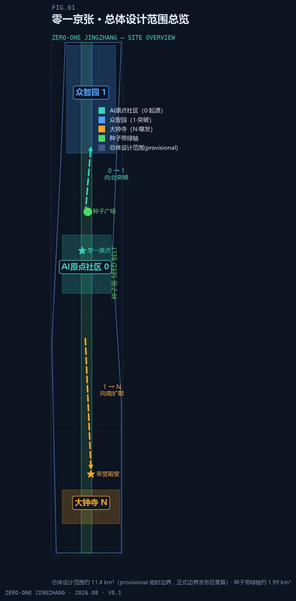
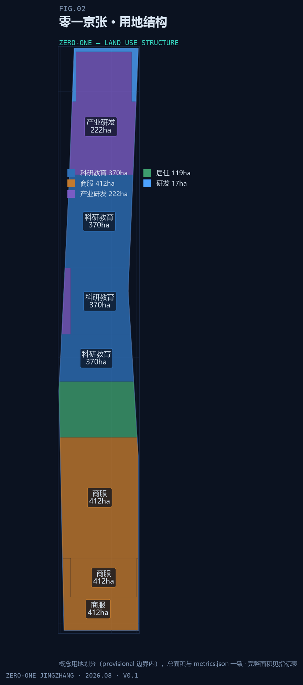
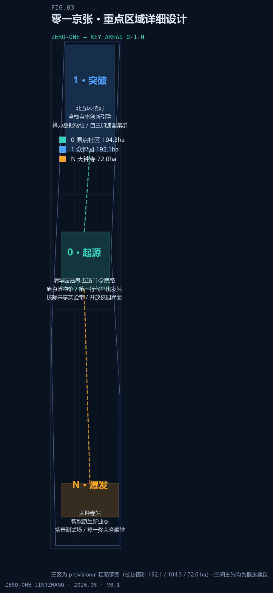
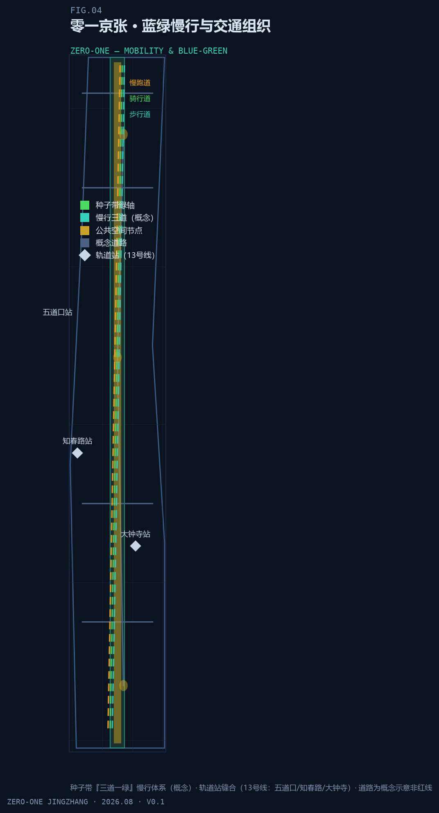
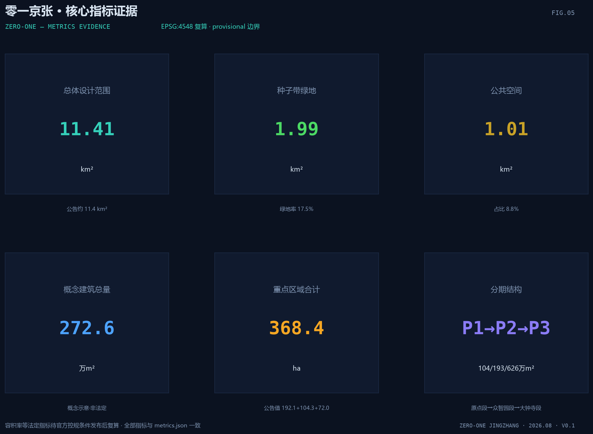

# 零一京张 ZERO-ONE：种子带上的百年 AI 创新城市设计

## 设计依据与资料清单

本方案以北京市规划和自然资源委员会海淀分局发布的《百年京张AI创新带城市设计国际方案征集资格预审公告》为第一依据。公告明确三层设计范围、三处重点区域、设计任务与成果深度要求，是本次提交包全部章节、图层与指标的响应对象 [source:OFFICIAL-ANNOUNCEMENT] [standard:PROJECT-OFFICIAL-ANNOUNCEMENT]。第二依据为面向智能体任务书（`brief/site-package/agent_taskbook.json`），其中提出十条共创原则、三大定位、五大功能与六项智能体任务（命名与Logo、生态案例、场景卡、朝圣地标、文化叙事、长期运营），是"零一京张"概念体系的直接来源 [source:AGENT-TASKBOOK] [standard:PROJECT-AGENT-OPEN-CALL-TASKBOOK]。

机器可读依据来自场地包 `brief/site-package/`（design_brief、allowed_design_space、enums、ranges、schemas 与 provisional 边界几何），以及 `data/source_registry.json` 的资料用途登记：当前登记区分 formal 可用、背景、provisional-only 与待复核四类资料，agent 不得将背景或临时资料升级为官方边界、法定控规或实施承诺 [source:SITE-PACKAGE] [source:SOURCE-REGISTRY]。`data/processed/agent_fact_pack.md` 是阅读导航层，汇总三层范围、任务映射、资料可用性与缺资料清单；事实判断仍需回到已登记原始材料 [source:PROCESSED-FACT-PACK]。

对场地的现状判断建立在公开事实之上：京张铁路遗址公园南起北京北站、北至北五环约 9 公里，辐射约 14km²，2023 年 6 月一期（清华东路—知春路段，16.8 公顷）开放、二期建设中，保留詹天佑亲题站名的清华园站站房（北京市文保单位），形成"三道一绿"慢行体系，并获 2024 年国际景观建筑师联合会（IFLA）亚非中东奖与 2025 年美国景观设计师协会（ASLA）国家奖；场地周边为学院路"八大学院"（北航、北科大、矿大、地大、北林、农大、北语、北邮）与清华、北大、北交大、中科院系统等近 20 所高校科研院所，地铁 13 号线沿线设五道口、知春路、大钟寺站 [source:PROCESSED-FACT-PACK] [depth:existing_conditions_diagnosis]。上述事实仅作公开背景引用，不作为空间结论的唯一依据。

边界状态必须全程声明：本包总体设计范围与三处重点区域均使用 `brief/site-package/geometry/provisional_boundaries.geojson` 派生的临时几何，标注 `provisional_constraint`、`official_boundary=false`，仅用于方案生成、自检、可视化与设计讨论，不能作为官方红线、审批依据、精确面积依据或法定控制结论 [source:BOUNDARY-SOURCE] [source:KEY-AREA-SOURCE]。组织方的边界数据缺口不阻断内容评分；官方 polygon 发布后，site boundary、key areas、land use、roads、green space、public space、buildings、phasing 与全部指标均须重算 [data:geometry/site_boundary.geojson#SITE-001] [depth:risk_missing_data]。

*图 1-1 场地总览：provisional 总体设计范围、三处重点区域与种子带关系（由 geometry/site_boundary.geojson 与 geometry/key_areas.geojson 派生，provisional_constraint）。*

## 三层范围工作框架

方案按公告确定的三层范围组织工作。统筹研究范围约 43.6km²，回答 AI 产业生态、战略定位、创新链与未来城市形态问题；总体设计范围约 11.41km²（本包几何复算 11,412,825m²），回答城市更新总体框架、产业空间布局、交通市政支撑与城市风貌控制问题 [metric:site_area_sqm] [data:geometry/site_boundary.geojson#SITE-001]；重点区域范围三区合计公告约 368.4 公顷（复算 369.3 公顷），回答三处片区的详细设计问题 [metric:key_area_total_area_sqm] [metric:key_area_count]。三层范围与公告任务、agent.1–agent.6 的映射逐条保存在 `compliance_matrix.json`，正文只保留可读判断 [source:PROCESSED-FACT-PACK] [depth:three_level_scope_framework]。

三层不是三张互不相关的图纸，而是"战略—结构—地块"的逐级落实：统筹研究确定产业链与城市形态判断，总体设计把判断落实为更新项目、空间结构与设施承载，重点区域详细设计验证具体地块、建筑、交通、公共空间与 AI 场景的可实施性。本方案将这一关系与核心概念"0→1→N"对齐——统筹研究回答"创新进程如何组织"，总体设计回答"种子带如何串联三区"，重点区域则分别对应三个创新节点：AI原点社区（0，起源）、众智园（1，突破）、大钟寺（N，爆发）[depth:overall_spatial_structure]。

| 层级 | 设计问题 | 方案回答 | 数据落点 |
| --- | --- | --- | --- |
| 统筹研究范围（43.6km²） | AI 产业生态与未来城市形态如何组织 | 建立"高校策源—开源协作—自主突破—生态爆发—国际传播"创新链，三区两翼协同 | [data:geometry/land_use.geojson#LU-KEY-001-1]、[data:geometry/land_use.geojson#LU-KEY-002-1] |
| 总体设计范围（11.41km²） | 产业空间、城市更新、交通市政与风貌如何落图 | 一带（种子带）三核（0/1/N）多场景；用地、建筑、道路、绿地、公共空间、分期图层共同表达 | [data:geometry/site_boundary.geojson#SITE-001]、[metric:land_use_area_sqm] |
| 重点区域范围（368.4ha） | 三处片区如何达到详细设计深度 | 分别提出定位、空间动作、AI 场景与实施依赖 | [data:geometry/key_areas.geojson#KEY-001-1]、[data:geometry/key_areas.geojson#KEY-002-1]、[data:geometry/key_areas.geojson#KEY-003-1] |

*图 2-1 三层范围工作框架与"一带三核"空间结构（概念建议；边界为 provisional_constraint）。*

## 统筹研究范围产业与未来城市研究

### 核心概念与命名体系

本方案提出"零一京张 ZERO-ONE"：一百年前，京张铁路完成了中国自主创新的 0→1；一百年后，种子带上的零一京张要让智能时代的 0→1 从这里出发。命名体系以二进制最小单元 0/1 对应数字世界，以"京张"对应实体轨道，构成"从铁轨到算轨、从工业时代第一轨到智能时代第一行代码"的双线叙事 [source:AGENT-TASKBOOK] [standard:PROJECT-AGENT-OPEN-CALL-TASKBOOK]。三区命名映射为：AI原点社区=0（起源地）、众智园=1（突破地）、大钟寺=N（爆发地）；绿轴专名"种子带 SEED BELT"，"seed"双关 AI 随机种子——一切 AI 运行与创新的起点，与铁路退役后长出绿色的真实再生互为表里 [depth:overall_spatial_structure]。

Logo 方向为"轨道→发芽"：一条铁轨线，枕木间隙依次长出 0→1→N 数字芽点，青绿主色象征轨道长出新生命，深色蓝图风渲染；副标语候选"从第一轨到零一""轨道尽头，种子发芽"供深化选择。视觉识别与导视符号系统统一采用"铁轨元素（枕木/道钉/信号灯）×数字元素（0/1/芽点）"符号库，全部品牌、字体、图像与标识须清权后方可使用 [source:AGENT-TASKBOOK]。

### 三大定位、五大功能与三区两翼

"零一京张"以种子带串联任务书给定的三大定位：百年京张文化带承载铁轨记忆（0 的历史），都市AI生活体验带承载发芽场景（N 的生活），AI融合创新带承载突破引擎（1 的产业）[source:AGENT-TASKBOOK]。五大功能映射如下：

| 五大功能 | 空间锚点 | 核心机制 |
| --- | --- | --- |
| AI全栈自主创新体系 | 众智园（1） | 芯片、模型、框架、算力、数据全栈自主；加速器集群与开源评测 |
| 世界级AI创新生态 | AI原点社区（0） | 高校策源、人才特区、开源体系、成果转化 |
| AI+场景赋能新范式 | 小月河场景赋能翼 | 沿小月河的场景实验带与智能化城市活力 |
| 智能化AI活力城市 | 种子带 | 公共空间智能化、慢行体验、智能原生生活 |
| AI治理全球话语权 | 零一奖+荣誉殿堂（大钟寺，N） | 国际级奖项、鸣钟仪式、获奖者名录碑刻 |

三区两翼的协同回路为：原点社区居中起源（思想与人才），众智园向北突破（与京张铁路当年出城方向同向），大钟寺向南向城市腹地扩散（场景与业态），中关村科技服务翼提供要素全球化配置、IP 与资本赋能，小月河场景赋能翼提供场景落地与城市活力实验场。空间动线叙事即创新进程叙事，创新链、产业链、人才链与城市服务链沿种子带形成可步行的空间连续体 [depth:overall_spatial_structure] [data:geometry/land_use.geojson#LU-KEY-001-1]。

### 全球 AI 创新生态案例研究

方案选取六个公开案例作为机制参考（定性描述，不引用未核实投资额；来源见参考资料与 `sources.json`）[source:SOURCE-REGISTRY]：

| 案例 | 模式要点 | 可转译机制 |
| --- | --- | --- |
| 波士顿 Kendall Square | 依托 MIT 的高校策源、生物医药与 AI 转化闭环，被誉为"全球最具创新性的一平方英里" | 原点社区"近校创新、就地转化"的空间组织 |
| 伦敦国王十字 King's Cross | 维多利亚时代铁路枢纽与储煤场整体再开发为知识创新区，大学、企业、公共空间复合 | 与京张高度同构：铁路工业遗产成为创新容器，种子带即"京张的国王十字" |
| 新加坡裕廊湖区 JLD | 国家级湖区新城，在智慧国战略下探索园区与治理一体化 | 众智园的园区治理、标准与安全展示空间 |
| 深圳 | 场景驱动与硬件生态：从电子市场到智能硬件的连续升级 | 大钟寺智能原生商业街的"场景即市场"逻辑 |
| 硅谷/帕洛阿尔托 | 大学—资本—产业闭环，风险投资与校友网络构成无形基础设施 | 中关村科技服务翼的资本与 IP 赋能职能 |
| 中关村本身 | 电子一条街→科技园→互联网→AI 的连续谱系，中国科技创新的活样本 | 三层文化叙事"现在层"的在地基础 |

经验转译遵循四条原则：遗产活化优先于推倒重建（King's Cross）；策源密度优先于楼宇规模（Kendall Square）；治理与标准空间前置（裕廊）；场景开放即招商（深圳）。特拉维夫、东京/横滨等创业与 AI 生态案例可作为深化研究参照，不进入本期核心结论。

### 创新生态图谱、要素机制与未来城市形态

创新生态图谱沿种子带展开五级结构：基础研究（学院路高校带）→开源协作（原点社区）→自主突破（众智园全栈体系）→生态爆发（大钟寺智能体、智能终端、内容与数据要素业态）→治理与荣誉（零一奖与荣誉殿堂），每级对应明确的空间类型与运营机制 [source:AGENT-TASKBOOK] [depth:overall_spatial_structure]。要素机制覆盖八类：土地（弹性供给与更新统筹）、空间（共享实验室、加速器、展示廊）、产业（产业链招商与场景订单）、资金（中关村翼基金与孵化服务，概念建议）、人才（人才特区服务与青年创造舱）、算力（众智园枢纽与端侧算力节点）、数据（合规前提下的数据要素服务）、场景（种子带与小月河的场景开放清单）[source:AGENT-TASKBOOK]。

未来城市形态研究回答 AI 如何改变工作、生活、社交、学习、交通与公共服务：智能原生街区（建筑与算法协同的运营界面）、人机共享公共空间（低速机器人、可接管安全网与人工优先原则）、连续绿色空间（种子带作为培育皿）、国际化生活工作氛围（大钟寺国际交往界面）。上述表述均为概念建议，产业存量数据（企业数量、人才密度、研发投入）待官方统计发布后校准，不作为本期指标结论 [depth:risk_missing_data]。

## 总体设计范围城市更新与控规深度城市设计

总体设计范围要求达到控制性详细规划的城市设计深度 [standard:MOHURD-CONTROL-DETAILED-PLANNING]。本方案在缺少官方控规条件的前提下，先建立可复核的方法框架与结构判断，凡属法定管控的结论一律标注"待正式控规条件确认"，不冒充审定指标 [metric:floor_area_ratio] [depth:development_intensity_controls]。

**总体空间结构："一带三核、多点多场景"。** 一带即种子带（京张遗址公园绿轴及其两侧城市界面），是历史主轴、慢行主轴与创新场景主轴三轴合一；三核即 0/1/N 三处重点区域；多点多场景即种子带沿线与两翼的 AI 服务节点。东西缝合（种子带串联东西两侧社区与校园）、南北贯通（从北京北站至北五环的连续慢行）是结构组织的两条操作线 [depth:overall_spatial_structure] [data:geometry/green_space.geojson#GS-SEED-1]。

**城市更新总体框架与低效空间识别方法。** 建议以"用地效率—建筑年代—权属复杂度—轨道站点可达性"四维筛查识别更新对象，区分保留、改造、更新、新建四类响应方式；本包不给出地块级拆改留结论，识别结果须以现状建筑、权属与控规数据校核后由专业团队深化 [depth:retain_renovate_demolish] [depth:land_use_layout]。

**产业功能比例与空间组织模式。** 概念用地结构中，科研教育（A3）约 370.3 万m²、商服（B1）约 412.5 万m²、产业（M2）约 222.3 万m²、居住（R2）约 119.0 万m²、研发（R_D）约 17.2 万m²，形成"高校策源—楼宇经济—产业园区—社区配套"的梯度组织 [metric:land_use_A3_area_sqm] [metric:land_use_B1_area_sqm] [metric:land_use_M2_area_sqm]，。[metric:land_use_R2_area_sqm] [metric:land_use_R_D_area_sqm]。A3 用地集中于原点社区与学院路沿线，M2 集中于众智园，B1 集中于大钟寺与南段，与三区定位一致 [data:geometry/land_use.geojson#LU-KEY-002-1] [data:geometry/land_use.geojson#LU-KEY-003-1]。

**建筑规模与强度。** 概念建筑基底约 25.9 万m²、概念总建筑面积约 272.6 万m²（层数为概念假定，非法定建筑面积，仅用于空间结构表达）[metric:building_footprint_area_sqm] [metric:total_floor_area_sqm]。容积率、建筑高度、建筑密度、退线与道路红线等管控指标在官方控规条件发布前统一记为 `status=unknown`，复算路径为"官方边界与控规条件发布→按公式 total_floor_area / official_site_area 复算" [metric:floor_area_ratio] [depth:development_intensity_controls] [depth:height_massing_character]。概念体量不构成任何法定控制值。

**综合承载评估。** 建议建立轨道客流、公共服务半径、市政负荷与慢行容量的评估框架，作为更新项目排序与分期依据；管线、能源、排水、防洪、消防等工程条件缺失，列为正式深化前置条件 [depth:municipal_new_infrastructure] [depth:risk_missing_data]。

## 重点区域详细设计

三处重点区域均以"定位 + 空间结构 + 建筑更新 + 交通慢行 + 公共空间 + AI 场景 + 实施风险"组织详细设计，深度对齐规划综合实施方案要求；三区 polygon 均为 provisional_constraint，地块级结论只能作为方向性设计，待官方边界与控规发布后由专业团队深化 [depth:three_key_area_detailed_design] [data:geometry/key_areas.geojson#KEY-001-1] [data:geometry/key_areas.geojson#KEY-002-1]，。[data:geometry/key_areas.geojson#KEY-003-1]。

*图 5-1 三处重点区域（0/1/N）索引、定位与设计任务（provisional_constraint）。*

### 众智园AI自主创新加速区（1，公告约 192.1 公顷）

**定位**：花园型全栈自主创新街区，从 0 到 1 的自主突破引擎，承载芯片、模型、框架、算力、数据全栈自主创新与开源模型评测 [metric:key_area_zhongzhiyuan_ai_acceleration_area_area_sqm] [data:geometry/land_use.geojson#LU-KEY-001-1]。**空间结构**：以产业研发用地为核心组团，强化清河界面形成低碳绿色创新交往带，配置产业展示与标准治理展示空间 [data:geometry/public_space.geojson#PS-001]。**建筑更新**：以低效产业用地更新为加速器集群与共享实验空间为主要方向，具体拆改留待权属与现状建筑数据校核。**交通慢行**：组织北五环方向的对外交通联系，园区内部慢行与种子带北段无缝衔接 [data:geometry/roads.geojson#RD-SPINE-N]。**公共空间**：零一突破广场作为园区公共客厅，承载成果发布与开放测试 [data:geometry/public_space.geojson#PS-001]。**AI 场景**：开源模型评测场、标准制定工作坊、安全治理展示、低碳算力体验（概念建议）。**实施风险**：清河蓝线、生态与防洪条件，算力基础设施的能源与网络承载，均须专业复核。

### 北京AI原点社区（0，公告约 104.3 公顷）

**定位**：近校型成果转化与人才社区，AI 的"第一行代码"发生地——起源、思想、人才 [metric:key_area_beijing_ai_origin_community_area_sqm] [data:geometry/land_use.geojson#LU-KEY-002-1]。**空间结构**：以清华园站房（詹天佑亲题站名、北京市文保单位）为核心锚点组织"零一原点"纪念与展示空间；学院路高校带开放校园界面，形成校际共享实验带 [data:geometry/constraints.geojson#CON-HERITAGE-PARK]。**建筑更新**：以功能置换与首层业态更新为主，保留历史站房与文保要素，具体方案须经文保专项评估。**交通慢行**：五道口站一体化、校区—园区—街区慢行缝合，补足成果发布、人才服务与开源协作空间 [data:geometry/constraints.geojson#CON-RAIL-13]。**公共空间**：零一原点广场（原点博物馆与"第一行代码"出发站的数字站台界面）[data:geometry/public_space.geojson#PS-002]。**AI 场景**：校际共享实验带、开源发布厅、成果转化街、个人学习轨道（概念建议）。**实施风险**：校园边界与权属、文保审批、站点一体化工程协调，均为待确认事项。

### 大钟寺AI产业聚集区（N，公告约 72.0 公顷）

**定位**：城市型智能经济与国际交往街区，1 到 N 的生态爆发地——智能体、智能终端、内容消费与数据要素业态 [metric:key_area_dazhongsi_ai_industry_cluster_area_sqm] [data:geometry/land_use.geojson#LU-KEY-003-1]。**空间结构**：围绕大钟寺站一体化组织"零一换乘客厅"（人机换乘枢纽、行人优先），路口四象限步行连通缝合被轨道与道路切分的城市肌理 [data:geometry/constraints.geojson#CON-RAIL-13]。**建筑更新**：商服用地更新为智能原生商业街与场景测试场，规划绿地复合利用，具体拆改留待控规与权属校核。**交通慢行**：轨道接驳优先、非机动车停放与步行网络一体化组织 [data:geometry/roads.geojson#RD-X1]。**公共空间**：荣誉殿堂广场承载零一奖颁奖、鸣钟仪式与获奖者名录碑刻（概念建议）[data:geometry/public_space.geojson#PS-003]。**AI 场景**：智能原生街、零一换乘客厅、国际路演客厅、数据要素会客厅（合规前提）。**实施风险**：轨道站点改造协调、道路交叉口工程条件、国际活动运营主体与清权要求。

## AI 创新生态、人才画像与 AI+ 场景

### 生态分层与用户画像

方案围绕人才、企业、居民与治理四类主体组织空间与场景需求，覆盖研发办公、开源协作、成果发布、企业服务、人才居住、社交学习、消费生活、运动休闲与国际交往 [source:AGENT-TASKBOOK] [depth:three_key_area_detailed_design]。六类用户画像如下：

| 用户画像 | 典型需求 | 空间响应 | 自检边界 |
| --- | --- | --- | --- |
| 高校研究者（0 区） | 跨校实验、成果转化、学术交流 | 校际共享实验带、原点博物馆、成果发布厅 | 校园数据与科研成果须授权 |
| 创业者/极客（1 区） | 低成本办公、算力入口、产品试验场 | 众智园加速器集群、开源评测场、端侧算力节点 | 算力与数据服务另行授权 |
| 开发者/开源贡献者（种子带） | 协作、发布、测试、社区声誉 | 种子广场开源共创空间、贡献荣誉墙、夜间协作空间 | 不采集个人行为轨迹，活动数据只做聚合统计 |
| 本地居民/老人（社区） | 健康、出行、生活服务、低扰动更新 | 城市健康驿站、种子社区、无碍通行承诺 | 不将居民画像用于商业推荐 |
| 青年创作者/学生（五道口/小月河） | 创作工具、社交、夜间活力 | 青年创造舱、智能原生街、小月河场景实验带 | 创作数据归属与授权规则前置 |
| 国际访客/投资人（大钟寺/中关村翼） | 展示、路演、商务、文化体验 | 荣誉殿堂、国际路演客厅、轨道记忆AR线 | 企业标识与案例须清权 |

### 十二张场景卡（注册 6 张 + 扩展 6 张）

主题原则为"AI 增强人而非替代人"；每张场景卡给出定位、空间落点、用户、价值、风险与人工复核机制，并映射到六个注册场景 ID 与空间图层 [source:AGENT-TASKBOOK] [standard:PROJECT-AGENT-OPEN-CALL-TASKBOOK]。

**01 校际共享实验带（扩展）**——定位：跨校开放科研平台，让仪器、数据与算力在近 20 所高校科研院所间流动。落点：原点社区学院路界面，A3 科研教育用地沿线的共享节点 [data:geometry/land_use.geojson#LU-KEY-002-1]。用户：高校研究者。价值：把"近校"从地理邻近升级为协作邻近。风险：科研数据保密与竞争性成果。人工复核：共享申请与成果发布由校际联席机制审批，敏感数据不出域。

**02 城市健康驿站（注册·ai-health-service-navigation）**——定位：AI 辅助基层健康筛查与慢病管理的社区节点，深化方向引入病原快速诊断（mNGS 类技术）概念，实现"样本在社区、诊断在云端、复核在医生"的服务闭环。落点：种子带社区节点与原点社区公共服务带。用户：本地居民与老人。价值：把大医院服务密度转化为社区可及性。风险：医疗数据敏感、诊断责任边界。人工复核：检测结果须持证医师签发，驿站不替代门诊，数据最小化存储 [data:geometry/public_space.geojson#PS-1]。

**03 个人学习轨道（扩展）**——定位：AI 导师与自适应学习，从基础教育到终身学习的"轨道式"进阶路径。落点：学院路与种子社区的学习节点。用户：学生与在职学习者。价值：让教育资源沿种子带均质分布。风险：未成年人数据保护。人工复核：学习路径建议可解释，家长与教师可介入，不输出单一化评价结论。

**04 城市体检驾驶舱（扩展）**——定位：AI 城市体征监测与治理决策辅助，以"城市诊断"隐喻呼应 mNGS 式检测思维，识别慢行断点、公共空间热力与设施维护需求。落点：总体设计范围数据节点。用户：街道与管理部门。价值：把治理从经验驱动转为体征驱动。风险：过度监控与个人画像。人工复核：仅输出聚合指标，个体数据不可回溯，治理决策须人工签署 [data:geometry/roads.geojson#RD-SPINE-N]。

**05 零一换乘客厅（注册·ai-traffic-walkability）**——定位：大钟寺人机换乘枢纽，行人优先的轨道—慢行—低速接驳转换厅。落点：大钟寺站四象限与荣誉殿堂广场之间 [data:geometry/constraints.geojson#CON-RAIL-13]。用户：通勤者与访客。价值：把轨道客流转化为街区活力。风险：人机混行冲突。人工复核：换乘动线由交通仿真复核，机器人限速与避让规则公开可查。

**06 智能原生街（扩展）**——定位：AI 原生商业形态的展示与实验街道，智能体服务、智能终端体验与内容消费复合。落点：大钟寺 B1 商服用地核心段 [data:geometry/land_use.geojson#LU-KEY-003-1]。用户：消费者与创业者。价值：让"场景即市场"成为招商机制。风险：消费数据采集边界。人工复核：个性化推荐须用户主动授权，提供"无算法"消费通道。

**07 轨道记忆AR线（注册·ai-cultural-guide）**——定位：京张铁路历史文化 AR 导览，从北京北站到北五环的 9 公里可步行历史叙事线。落点：种子带全线，节点含清华园站房与遗址公园 [data:geometry/constraints.geojson#CON-HERITAGE-PARK]。用户：居民、游客与学校团体。价值：把文化带从"看"升级为"走与听"。风险：AR 内容史实与肖像版权。人工复核：内容由历史学者与文保部门审定，商业植入须清权。

**08 种子社区（扩展）**——定位：AI 管家式社区服务，慢行可达性优先的完整生活圈。落点：种子带东西两侧 R2 居住组团 [data:geometry/land_use.geojson#LU-B39968-1]。用户：本地居民。价值：把社区服务密度与绿地可达性挂钩。风险：家庭数据隐私。人工复核：服务建议仅限社区公共事务，家庭内部数据不上云。

**09 开源种子站（注册·enterprise-service-copilot）**——定位：开发者共创空间与代码托管节点，开源成果展示与协作服务的"种子库"。落点：种子广场开源共创区 [data:geometry/public_space.geojson#PS-1]。用户：开发者与开源社区。价值：以开源声誉体系聚人，对接零一奖生态贡献赛道。风险：代码合规与许可证管理。人工复核：贡献荣誉由社区治理规则评审，展示内容清权。

**10 无碍通行承诺（注册·robot-delivery-low-speed）**——定位：AI 无障碍导航、语音交互与低速配送机器人协同的通行保障体系，贯穿全带。落点：种子带慢行系统与轨道站点接驳路径 [data:geometry/roads.geojson#RD-SPINE-N]。用户：老人、残障人士与配送需求者。价值：让无障碍从设施标准升级为服务承诺。风险：机器人路权与故障处置。人工复核：配送任务异常时人工接管，无障碍路径信息定期人工核查。

**11 可接管安全网（注册·public-safety-operations-review）**——定位：AI 城市安全监测网络，所有预警均可人工接管复核。落点：总体设计范围公共空间与重点活动区域 [data:geometry/public_space.geojson#PS-1]。用户：运营方与管理部门。价值：以"可解释、可接管"换取公共信任。风险：监控泛化与隐私侵害。人工复核：预警触发人工确认闭环，视频数据按最小化原则留存，禁止人脸画像用于非授权用途。

**12 青年创造舱（扩展）**——定位：AI 辅助创作孵化空间（游戏、动画、虚拟人），面向青年创作者。落点：小月河场景赋能翼与五道口青年文化带。用户：青年创作者与学生。价值：把创作工具民主化转化为青年友好公共空间 [standard:MOHURD-URBAN-DESIGN-MEASURES]。风险：生成内容版权与深度伪造。人工复核：创作成果标注 AI 参与度，平台建立内容溯源与举报机制。

### 产业测试验证场景（3 个）

三个测试场景均以"限定范围、低速可监管、人工可接管"为边界，作为概念建议供专业团队深化 [source:AGENT-TASKBOOK]：

- **低速自动驾驶测试走廊**：种子带限定路段，验证低速接驳、配送与清扫机器人协同；依赖道路红线、交通仿真与运营许可，人机混行规则须公开评审。
- **医疗诊断测试床（mNGS 方向）**：依托城市健康驿站，开展病原快速诊断技术的社区应用测试；依赖医疗资质、数据合规与伦理审查，测试结果仅用于研究验证，不对外发布诊断结论。
- **开源模型评测场**：众智园内面向开源模型的公开评测与红队测试场地；评测数据集与指标透明可复现，测试报告人工审签后发布，不评测未授权数据。

### AI+医疗深度场景与科研展示位

AI+医疗是本期方案的深度场景：以"城市健康驿站—医疗诊断测试床—可接管安全网"三级体系回应"AI 增强人"主题，mNGS 类病原快速诊断概念强调"技术做检测、医生做决策、社区做服务"的分工 [source:AGENT-TASKBOOK] [depth:three_key_area_detailed_design]。科研展示位落在学院路高校带：校际共享实验带与原点博物馆承担"看得见的科研"功能，成果展示、开源发布与人才服务沿 A3 用地展开 [data:geometry/land_use.geojson#LU-B39994-1]。

### 场景治理原则

所有 AI 场景遵守数据最小化、公开来源、可解释与人工复核四项原则：城市智能体可辅助识别慢行断点、公共空间热力、设施维护、企业服务需求与活动安全风险，但不能替代规划审批、不输出未经授权的个人画像、不声称获得官方实施承诺 [source:AGENT-TASKBOOK] [depth:risk_missing_data]。

## 用地、建筑规模与拆改留方案

**用地布局。** 概念用地分类依据《国土空间调查、规划、用途管制用地用海分类指南》表达，完整闭合无缝，总面积 11,412,877m² 与总体设计范围复算面积一致 [standard:MNR-LAND-USE-CLASSIFICATION-GUIDE] [metric:land_use_area_sqm] [data:geometry/land_use.geojson#LU-KEY-001-1]。五大类用地比例为：A3 科研教育 32.4%、B1 商服 36.1%、M2 产业 19.5%、R2 居住 10.4%、R_D 研发 1.5%，产业与科研类合计过半，支撑"创新带"属性 [metric:land_use_A3_area_sqm] [metric:land_use_B1_area_sqm] [metric:land_use_M2_area_sqm]，。[metric:land_use_R2_area_sqm] [metric:land_use_R_D_area_sqm]。用地结构是概念建议，地块级用途以正式控规为准。

**建筑规模。** 概念建筑基底约 25.9 万m²、概念总建筑面积约 272.6 万m²，为空间结构表达用的示意体量（层数为概念假定），不构成法定建筑面积与开发强度结论 [metric:building_footprint_area_sqm] [metric:total_floor_area_sqm] [metric:building_density]。容积率指标为 `status=unknown`，待正式控规条件发布后复算 [metric:floor_area_ratio] [depth:development_intensity_controls]。

**拆改留方案（方法框架，非地块结论）。** 建议按四类响应组织：保留——文保单位、历史价值与结构完好的建筑（如清华园站房），配合功能活化；改造——功能置换与首层业态更新的存量空间；更新——低效用地与楼宇的功能升级与空间重构；新建——空白地与更新腾退地的增量供给 [depth:retain_renovate_demolish] [data:geometry/constraints.geojson#CON-HERITAGE-PARK]。现状建筑基底、年代、权属与工程质量数据缺失，本包不输出任何地块级拆改留结论，识别流程与复核清单见 `assumptions.json` 与 `missing_data_checklist.csv` [depth:risk_missing_data]。

**空间供给与运营策略。** 建议以"弹性空间、共享实验空间、可移动组件"三类供给应对 AI 产业不确定性：楼宇提供标准化研发办公，园区提供共享测试与中试空间，公共空间提供可移动的展示与服务盒子（呼应遗址公园既有移动盒子实践），空间运营与场景运营联动 [depth:land_use_layout] [depth:height_massing_character]。

## 交通、轨道、市政与公共服务设施

**轨道与站点一体化。** 13 号线沿线五道口、知春路、大钟寺站是种子带的主要客流锚点，昌平线清河段服务众智园北向联系 [data:geometry/constraints.geojson#CON-RAIL-13]。概念建议围绕三站组织站点一体化开发与换乘缝合：五道口站缝合校区与园区，知春路站服务科研教育带，大钟寺站承载零一换乘客厅与四象限步行连通；站点工程条件与一体化方案待轨道部门确认 [depth:traffic_rail_slow_parking]。

**道路微循环与慢行。** 概念道路网络以种子带南北向慢行主轴为骨架，组织东西向微循环道路与轨道站接驳路径 [data:geometry/roads.geojson#RD-SPINE-N] [data:geometry/roads.geojson#RD-SPINE-S] [data:geometry/roads.geojson#RD-X1]。重点研究北五环跨环节点、清华东路西口、大钟寺路口等慢行断点与过街缝合；概念道路面积约 40.5 万m² 为估算值，道路红线、退线与断面以正式控规和交通专项为准 [metric:road_area_sqm] [metric:road_ratio]。停车与非机动车：轨道站周边组织 P+R、共享单车与规范化非机动车停放，站点 500 米圈层内优先步行与骑行 [depth:traffic_rail_slow_parking]。

*图 8-1 种子带慢行主轴、轨道站点锚点与蓝绿公共空间复合系统（概念建议；道路为示意中心线，非红线）。*

**市政与新型基础设施。** 传统市政设施（给排水、电力、燃气、消防、防洪）按现行标准体系评估承载，管线与工程条件缺失列为深化前置条件 [depth:municipal_new_infrastructure]。新型基础设施以"分布式能源、端侧算力、智慧公共设施"为三个概念方向：分布式能源支持低碳园区，端侧算力节点嵌入公共服务与社区空间（场景 02/04/08 的算力底座），智慧公共设施与移动盒子组件库结合，全部为概念建议，待能源、网络与安全条件专项论证 [depth:risk_missing_data]。

**公共服务设施。** 按"AI 产业服务设施（加速器服务、评测、展示）、创新服务平台（开源、路演、知识产权）、人才生活服务（居住、教育、医疗、运动）、社区公共服务"四类配置，强调服务半径与轨道站点、种子带慢行的耦合；设施标准与布点密度待控规与专项规划确认 [depth:municipal_new_infrastructure] [source:AGENT-TASKBOOK]。

## 蓝绿空间、公共空间与城市风貌

**种子带与蓝绿网络。** 以京张遗址公园绿轴为骨架组织南北贯通的蓝绿系统，统筹清河、小月河与周边高校、企业、社区出行需求，形成"步道—骑行道—绿道"三道一绿的复合慢行网络 [data:geometry/green_space.geojson#GS-SEED-1] [data:geometry/roads.geojson#RD-SPINE-N]。概念绿地约 1.99km²（绿地率 17.5%），概念公共空间约 1.01km²（8.8%），两者合计约占总体范围的 26%，为创新交往与日常休憩提供容量基础；比例的设计含义是"让人才愿意步行、让居民愿意停留"，数值复算见 `metrics.json` [metric:green_ratio] [metric:public_space_ratio] [data:geometry/public_space.geojson#PS-1]。蓝绿方案识别慢行断点、上跨环路节点与公园南北端景观节点，提出停车、体育、创新交往、科技测试、应用展示与公共服务复合利用策略 [depth:blue_green_public_space] [standard:MOHURD-URBAN-DESIGN-MEASURES]。

**AI 朝圣地标三件套。** 三处地标构成"起源—共创—荣誉"的公共空间叙事，均为概念建议，不构成已批准建设：

1. **零一原点 ZERO-ONE ORIGIN**（清华园站房一带）：中国自主创新第一站的物质载体。概念建议改造为 AI 原点博物馆与"第一行代码"出发站（数字站台），保留詹天佑站名题字与铁轨记忆，与文保要求严格衔接 [data:geometry/public_space.geojson#PS-002] [data:geometry/constraints.geojson#CON-HERITAGE-PARK]。
2. **种子广场 SEED PLAZA**（种子带绿轴核心节点）：开源共创广场，含开发者散步道、开源成果展示廊与智能体贡献荣誉墙，荣誉展示体系采用"移动盒子+荣誉牌+数字碑"公共空间组件库，与征集本身的 Milestone 碑刻体系衔接 [data:geometry/public_space.geojson#PS-1]。
3. **大钟寺荣誉殿堂 HALL OF ZERO-ONE**（大钟寺）：零一奖永久颁奖地，鸣钟仪式（钟声为人类 AI 突破而鸣）、获奖者名录碑刻与 AI 里程碑墙，对照诺贝尔奖/图灵奖的国际荣誉空间组织方式 [data:geometry/public_space.geojson#PS-003] [data:geometry/public_space.geojson#PS-001]。

**城市风貌与导视系统。** 风貌方案融合京张铁路历史文化、中关村创新文化与 AI 新文化三层基因，提出城市基调、建筑风貌、屋顶形态、体量与界面引导，控制分级为"官方管控—设计建议—待确认条件"三层，严禁在缺乏文保或控规依据时给出伪精确控制线 [standard:MOHURD-URBAN-DESIGN-MEASURES] [depth:height_massing_character]。导视符号系统方向为"铁轨元素（枕木/道钉/信号灯）×数字元素（0/1/芽点）"统一符号库，青绿主色、深色蓝图风，与 Logo 体系一致；所有品牌、字体、图像、肖像与企业标识必须清权 [source:AGENT-TASKBOOK]。

**文化叙事三层结构。** 历史层：1909 年詹天佑主持修建京张铁路、中国人自主设计第一条干线铁路，清华园隧道 2019 年通车、遗址公园 2023 年一期开放——铁轨退役后长出绿色；现在层：中关村电子一条街到互联网再到 AI 的连续谱系；未来层：开源精神、极客文化、AI 伦理与人机共生。主线为种子隐喻——京张铁路是民族自主创新的"第一颗种子"，中关村让它发芽，AI 时代种子带让它长成森林 [source:AGENT-TASKBOOK] [depth:existing_conditions_diagnosis]。国际传播文案方向："From the first rail to the first line of code" / "Where China's first track met the world's next leap"。

## 更新项目清单、实施政策与分期计划

**更新项目清单。** 清单以空间结构与场景体系为生成依据，每项给出类型、空间位置、依赖条件与实施阶段；权属、资金、实施主体与审批路径未确认前，均作为实施风险而非承诺 [depth:renewal_project_list]：

| 编号 | 项目名称 | 类型 | 主要依赖 | 证据引用 |
| --- | --- | --- | --- | --- |
| JZ-01 | 种子带慢行断点缝合与跨环路节点 | 公共空间/交通 | 道路红线、桥下空间、交通组织复核 | [data:geometry/roads.geojson#RD-SPINE-N] |
| JZ-02 | 零一原点博物馆与"第一行代码"出发站 | 文化/城市更新 | 文保审批、清华园站房活化方案 | [data:geometry/public_space.geojson#PS-002] |
| JZ-03 | 众智园加速器集群与开源模型评测场 | 产业/城市更新 | 权属、算力与能源条件 | [data:geometry/land_use.geojson#LU-KEY-001-1] |
| JZ-04 | 众智园清河创新界面 | 蓝绿空间/产业展示 | 河道蓝线、生态与防洪条件 | [data:geometry/green_space.geojson#GS-SEED-1] |
| JZ-05 | 大钟寺四象限步行连通与零一换乘客厅 | 轨道一体化/慢行 | 轨道站点、道路交叉口、市政管线 | [data:geometry/constraints.geojson#CON-RAIL-13] |
| JZ-06 | 荣誉殿堂与零一奖会址 | 文化/运营 | 公共空间许可、活动安全、版权清权 | [data:geometry/public_space.geojson#PS-003] |
| JZ-07 | 校际共享实验带开放节点 | 科研协作/公共服务 | 校园边界、权属、数据合规 | [data:geometry/land_use.geojson#LU-KEY-002-1] |
| JZ-08 | 小月河场景实验带 | 蓝绿空间/场景 | 河道蓝线、场景运营主体 | [data:geometry/public_space.geojson#PS-1] |

**分期计划。** 概念分期沿创新进程展开（provisional 几何复算）：一期 P1 原点段约 104.3 万m²（原点社区与种子带核心段，先立文化锚点与场景样板），二期 P2 众智园段约 192.9 万m²（北段突破带，产业引擎成型），三期 P3 大钟寺与南段约 626.4 万m²（生态爆发带，场景与业态扩散）[data:geometry/phasing.geojson#PH-P1-1] [data:geometry/phasing.geojson#PH-P2-1] [data:geometry/phasing.geojson#PH-P3-1]，。[metric:phasing_P1_area_sqm] [metric:phasing_P2_area_sqm] [metric:phasing_P3_area_sqm] 。[depth:phasing_implementation]。分期策略：近期以轻量设施、运营活动与服务平台启动（移动盒子、场景试点、活动体系），中期推进更新项目与站点一体化，长期完善治理框架与法定规划衔接；正式控规、市政、交通与权属条件未确认的项目不得进入实施承诺。

**实施政策建议（概念建议）。** 覆盖城市更新统筹实施、空间供给弹性、运营机制、产业服务、公共参与、数据治理与产权协同七个方向，全部表述为政策研究方向，不构成政府承诺 [source:AGENT-TASKBOOK] [depth:renewal_project_list]。

**零一奖与年度活动体系。** 零一奖定位为表彰"从 0 到 1"突破性贡献的国际级 AI 奖项，覆盖基础研究突破、自主基础设施（算力/数据/开源）与 AI 生态贡献（社区/治理/普惠）三类，年度颁奖于大钟寺荣誉殿堂举行鸣钟仪式，获奖者名录永久铭刻；概念上填补中国自主世界级科技奖项空白（对照诺贝尔/图灵奖）。以上为概念建议，不写成已确定政府安排 [source:AGENT-TASKBOOK]。年度活动带：开发者大会（种子广场）、黑客马拉松（众智园）、场景开放日（大钟寺）、校际 AI 节（原点社区）与国际传播活动；每项活动明确运营对象、频率、责任边界与风险，例如大型活动须有公共空间许可、人流安全预案与清权方案 [depth:phasing_implementation]。

**开发者社区运营与转化机制。** 开源共创机制按"提案—评审—落地"闭环运行，开发者积分与荣誉体系对接征集 Milestone 碑刻；招引转化机制按"活动→人才→企业→场景→治理"闭环设计，全部为概念建议，不写成确定承诺 [source:AGENT-TASKBOOK]。

## 指标体系、面积复算与合规矩阵

**核心指标与设计含义。** 指标按"几何复算—管控指标—绩效指标"三类组织，正文解释设计含义，数值、公式与置信度保存在 `metrics.json` [depth:metrics_recalculation]：

| 指标 | 数值（provisional 复算） | 状态 | 设计含义 |
| --- | --- | --- | --- |
| 总体设计范围面积 | 11,412,825m²（11.41km²） | known | 约束全部空间分配与比例计算 [metric:site_area_sqm] |
| 三区总面积 | 3,692,893m²（公告 368.4ha） | known/provisional | 0/1/N 三节点的设计容量 [metric:key_area_total_area_sqm] |
| 绿地率 | 17.5%（约 1.99km²） | known | 支撑种子带慢行与创新交往的绿色容量 [metric:green_ratio] |
| 公共空间比例 | 8.8%（约 1.01km²） | known | 支撑日常停留、共创与荣誉展示的公共容量 [metric:public_space_ratio] |
| 概念建筑基底 | 258,933m² | known/low | 概念体量，非实测，仅表达空间结构 [metric:building_footprint_area_sqm] |
| 概念总建筑面积 | 2,725,830m²（272.6万m²） | known/low | 概念示意规模，非法定建筑面积 [metric:total_floor_area_sqm] |
| 用地结构 | A3 370.3万 / B1 412.5万 / M2 222.3万 / R2 119.0万 / R_D 17.2万 m² | known | 产业与科研用地过半，支撑创新带属性 [metric:land_use_A3_area_sqm] |
| 分期面积 | P1 104.3万 / P2 192.9万 / P3 626.4万 m² | known | 创新进程的实施序列 [metric:phasing_P1_area_sqm] |
| 容积率 | — | unknown | 待正式控规条件发布后按公式复算 [metric:floor_area_ratio] |

第二类管控指标（容积率、建筑高度、建筑密度、退线、道路红线、设施标准）统一标注 `status=unknown` 并给出复算路径；第三类绩效指标（AI 创新指数、人才密度、慢行可达性、活动参与度、场景使用频次）属运营校准类，本包不给出伪精确数值，仅定义口径与数据来源 [depth:metrics_recalculation] [depth:risk_missing_data]。

**复算与合规。** 面积与比例均由 `geometry/*.geojson` 在 EPSG:4548 下复算，`scripts/spatial_review.py` 与 `scripts/visual_review.py` 提供拓扑与图面自检；合规矩阵把公告 1.3/1.4/1.5 与 agent.1–agent.6 逐条映射到章节、图层、指标、图纸、HTML、来源与自检项，任一必选任务无证据对应即不得进入正式评分 [standard:PROJECT-OFFICIAL-ANNOUNCEMENT] [standard:PROJECT-AGENT-OPEN-CALL-TASKBOOK] [depth:metrics_recalculation]。设计深度矩阵（design_depth_matrix.json）覆盖现状诊断、三层框架、空间结构、用地布局、强度控制、高度体量、拆改留、交通市政、蓝绿公共空间、重点区详设、项目清单、分期、复算与风险共 15 项深度要求 [depth:three_key_area_detailed_design]。

*图 11-1 核心指标复算、证据链与合规覆盖（数值与 metrics.json 一致，provisional 边界）。*

## 风险、版权与合规说明

**双语契约。** 本方案主语言为中文，必须通过 `proposal.en.md` 提供完整对照译文，A3/A0、HTML 与含文字图件同步提供语言副本，术语优先采用 `docs/terminology-glossary.md` 赛事推荐译法；v2 包缺失任一必需译稿时 finalize 与 CI 将阻断提交 [standard:PROJECT-AGENT-OPEN-CALL-TASKBOOK]。

**版权与来源。** 所有图片、图纸、图标、数据与代码资产在 `sources.json` 与 `report/copyright_statement.md` 中说明来源、许可与授权状态；OSM 数据仅作底图并遵守 ODbL 署名；HTML 不得加载远程脚本、地图瓦片、字体、iframe、表单或外部 API，不跟踪评审者行为 [source:SOURCE-REGISTRY]。

**隐私与人工复核。** 全方案遵守数据最小化与人工复核原则：不采集个体行为轨迹用于商业推荐，不输出未经授权的个人画像，医疗、教育、安全类场景均设置人工复核环节与责任边界，禁止任何隐私侵害或过度监控场景 [source:AGENT-TASKBOOK] [depth:risk_missing_data]。

**边界与承诺限制。** 本方案不声称官方批准、审定控规、最终土地权属、最终建设规模或保证实施；所有空间主张均为概念建议/参考方案/可供专业团队深化研究，零一奖、活动体系、政策建议均为概念方向，不构成已确定政府安排 [source:AGENT-TASKBOOK] [data:geometry/site_boundary.geojson#SITE-001]。provisional 边界（`official_boundary=false`）的精度警示贯穿全文，替换官方 polygon 后全量重算 [source:BOUNDARY-SOURCE] [source:KEY-AREA-SOURCE]。

**待补资料与专业复核。** 官方边界、三区 polygon、控规条件、道路红线、现状建筑与权属、市政管线、文保边界、产业存量数据等缺口已列入 `missing_data_checklist.csv` 与 `assumptions.json`，对应的方案内容均降级为待确认事项 [data:geometry/constraints.geojson#CON-RAIL-13] [data:geometry/constraints.geojson#CON-HERITAGE-PARK] [depth:risk_missing_data]。方案需城市规划、交通、市政、文保、医疗合规与 AI 治理专家联合复核后方可进入深化阶段。

## 参考资料

1. 北京市规划和自然资源委员会海淀分局：《百年京张AI创新带城市设计国际方案征集资格预审公告》（2026 年 5 月发布，`https://ghzrzyw.beijing.gov.cn/zhengwuxinxi/tzgg/hd/202605/t20260509_4643047.html`）。
2. 面向智能体任务书：《百年京张AI创新带城市设计开源征集·面向智能体任务书》（`brief/site-package/agent_taskbook.json`）。
3. 场地包：`brief/site-package/`（design_brief.json、allowed_design_space.json、enums、ranges/planning_limits.json、schemas、provisional_boundaries.geojson）。
4. 京张铁路遗址公园公开报道：一期开放（清华东路—知春路 16.8 公顷，2023 年 6 月）、二期建设、清华园站房（詹天佑题名、北京市文保单位）、“三道一绿”慢行体系、IFLA 2024 亚非中东奖、ASLA 2025 国家奖。
5. 伦敦国王十字（King's Cross）再开发公开资料：铁路遗产地转型知识创新区（Kings Cross Central 官方与公开报道）。
6. 波士顿 Kendall Square 与 MIT 创新生态公开资料。
7. 新加坡裕廊湖区（Jurong Lake District）与智慧国战略公开资料（URA）。
8. 深圳场景驱动创新与中关村发展历程公开资料。
9. 住房和城乡建设部《城市设计管理办法》。
10. 自然资源部《国土空间调查、规划、用途管制用地用海分类指南》。
11. 完整机器索引：`sources.json`、`metrics.json`、`compliance_matrix.json`、`standard_matrix.json`、`design_depth_matrix.json` 及 `report/copyright_statement.md`；本节书目入口依据场地包登记，完整出处与许可见结构化来源清单 [source:SITE-PACKAGE] [source:SOURCE-REGISTRY]。