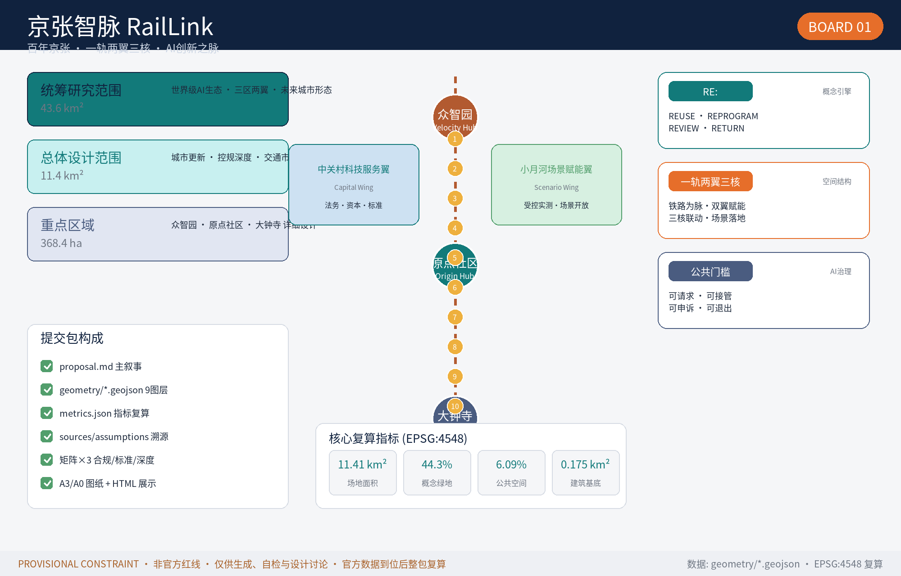
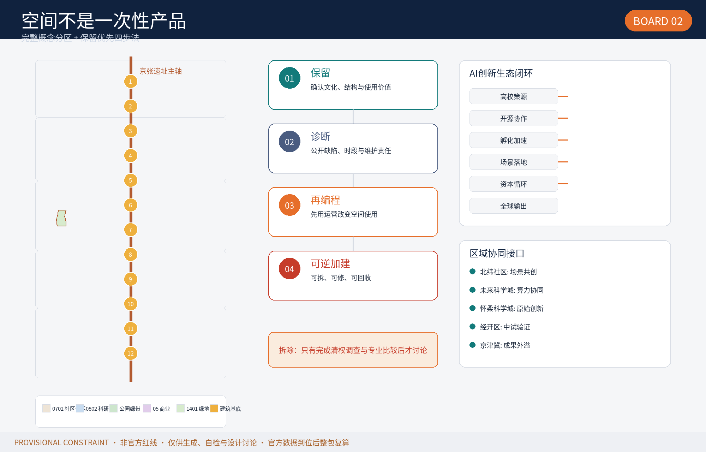
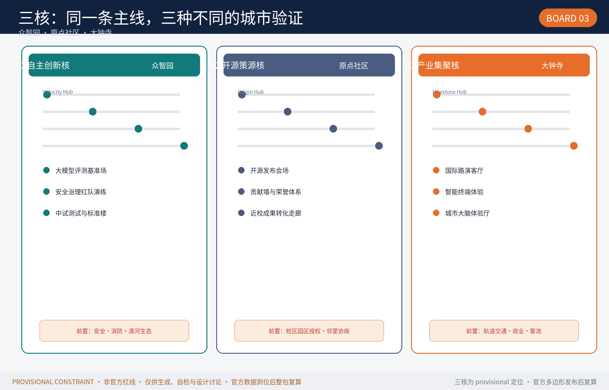
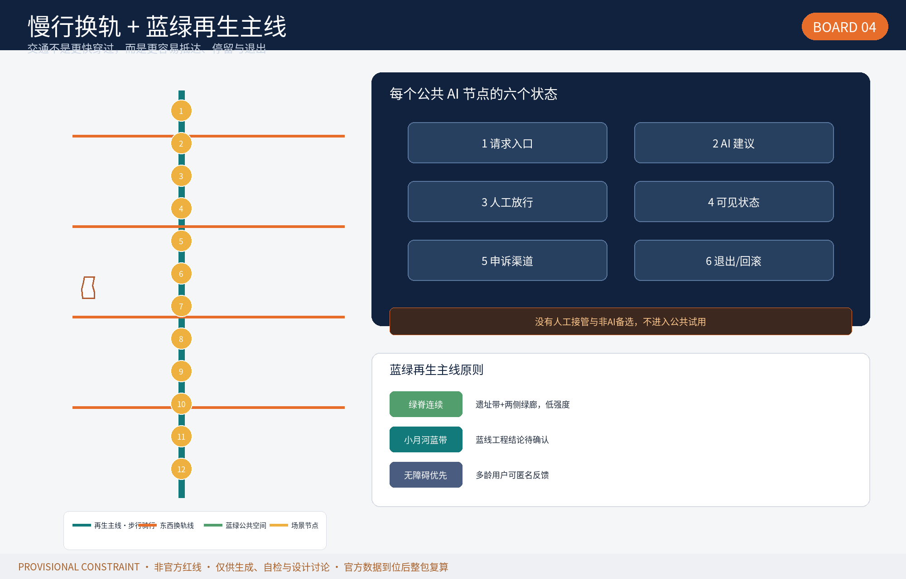
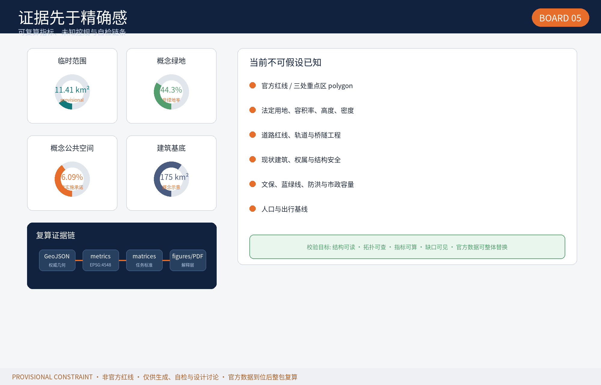

# Jingzhang Zhimai (RailLink): An AI Innovation Artery on a Century-Old Railway

> This is a conceptual, forward-looking, research-grade formal design package co-created by an AI agent. All spatial layouts, activities, and policy mechanisms are "concept proposals / reference schemes / material for professional deepening" and do not replace formal planning or constitute approved government conclusions. [source:AGENT-TASKBOOK][standard:PROJECT-AGENT-OPEN-CALL-TASKBOOK]

## Design Basis and Source List

This package is generated strictly from public and cleared sources. The evidence hierarchy (fully registered in `sources.json`, `assumptions.json`, `compliance_matrix.json`, `standard_matrix.json`, `design_depth_matrix.json`):

| Level | Source | Use boundary |
| --- | --- | --- |
| Official qualification announcement | [source:OFFICIAL-ANNOUNCEMENT] [standard:PROJECT-OFFICIAL-ANNOUNCEMENT] | Project name, three-level scope, three key areas, design tasks, deliverable depth (formal-ready) |
| Agent open-call taskbook | [source:AGENT-TASKBOOK] [standard:PROJECT-AGENT-OPEN-CALL-TASKBOOK] | Three positionings, five functions, three areas + two wings, agent.1–agent.6 tasks, ten principles, boundary clause |
| MOHURD/MNR professional standards | [standard:MOHURD-URBAN-DESIGN-MEASURES] [standard:MOHURD-CONTROL-DETAILED-PLANNING] [standard:MNR-LAND-USE-CLASSIFICATION-GUIDE] | Urban design method, regulatory-plan depth, land-use classification |
| Provisional boundaries | [source:BOUNDARY-SOURCE] [source:KEY-AREA-SOURCE] | Generation/display/discussion only; `official_boundary=false`, not usable as official redline or precise area basis |

## Three-Level Scope Framework

The proposal follows the official three-level scope: 43.6 km² coordinated research area (global AI ecosystem strategy), 11.4 km² overall design area (urban renewal at regulatory-plan urban design depth), and 368.4 ha key-area detailed design (Zhongzhiyuan, Origin Community, Dazhongsi). All geometry sits within the provisional overall-design boundary ([data:geometry/site_boundary.geojson#SITE-001], [metric:site_area_sqm]).

## Coordinated Research Area: Industry and Future City Researches

### Concept and Naming (agent.1)
**Jingzhang Zhimai (RailLink)**: "rail" connects the century-old Jing-Zhang Railway heritage; "link" connects history/future and the city to the world. Naming: Origin Hub (AI Origin Community), Velocity Hub (Zhongzhiyuan), Milestone Hub (Dazhongsi), Capital Wing (Zhongguancun service), Scenario Lane (Xiaoyuehe empowerment). Logo direction: three rails (rust-red=culture, tech-blue=AI, Haidian-green=ecology) converging into a signal-light node; original concept only.

### Four Clearance Gates (railway signal-block method)
This proposal's core method mirrors the railway signal-block system: **Gate ① Data Clearance** (source, license, de-identification), **Gate ② Human Review** (professional verification, safety testing), **Gate ③ Public Trial** (time-boxed trial, appeal, exit), **Gate ④ Operations Ledger** (public ledger, KPI tracking, annual review). A scenario cannot enter the next gate without passing the previous one; no AI scenario enters public trial without human takeover and a non-AI fallback.

### Global Case Research (agent.2, 5–8 examples)
① Silicon Valley (university-venture-enterprise axis); ② Kendall Square (mixed lab-incubator-enterprise campus); ③ King's Cross, London ([source:CASE-KINGS-CROSS]); ④ Tel Aviv ([source:CASE-TEL-AVIV]); ⑤ Shenzhen Nanshan ([source:CASE-SHENZHEN-NANSHAN]); ⑥ Hangzhou Cloud Town / City Brain ([source:CASE-HANGZHOU-YUNQI]); ⑦ Tsukuba ([source:CASE-TSUKUBA]); ⑧ festival-driven brand spillover ([source:CASE-ANNUAL-EVENTS]).

### Five Functions and 3+2 Coordination
AI full-stack self-reliance → Zhongzhiyuan; world-class AI ecology → Origin Community; AI+ scenario empowerment → Xiaoyuehe Wing; intelligent vibrant city → city-wide smart infrastructure; global AI governance voice → Zhongzhiyuan governance exhibition center.

## Overall Design Area: Urban Renewal at Regulatory-Plan Depth

**Spatial structure** "One Rail · Two Wings · Three Hubs · Multi Hubs": railway heritage axis as cultural/green spine; land-use zoning [data:geometry/land_use.geojson#LU-001~005] follows [standard:MNR-LAND-USE-CLASSIFICATION-GUIDE] (0702 community service, 0802 R&D, 05 commercial, 1401 green).

**Renewal framework**: "retain-refresh-activate-build" strategy, no demolition decisions until official condition data exists [depth:retain_renovate_demolish]. FAR/height/density remain `unknown` pending official regulatory conditions ([metric:floor_area_ratio], [metric:building_height_m]). Transit/rail/municipal: TOD station integration at Fugucun/Wudaokou/Dazhongsi, smart grid, AI+fire, edge compute — all concept-level [depth:traffic_rail_slow_parking] [depth:municipal_new_infrastructure].

## Detailed Design of Key Areas

All three key areas use provisional boundaries ([data:geometry/key_areas.geojson#PROV-KEY-001~003]) — directional design only [depth:three_key_area_detailed_design].

**Zhongzhiyuan Velocity Hub (192.1 ha)**: full-stack autonomy + safety/governance international showcase; Qinghe riverfront plaza ([PUBLIC-001]), mid-test building ([BLDG-001]), model eval plus safety sandbox scenarios.

**AI Origin Community (104.3 ha)**: "zero point for global AI open source"; campus-park slow stitching [ROAD-003], open-source publishing hall [BLDG-002] + contribution wall plaza [PUBLIC-002].

**Dazhongsi Milestone Hub (72.0 ha)**: industry cluster + smart commerce; TOD four-quadrant walkway [ROAD-004], international roadshow lounge [BLDG-003] + station plaza [PUBLIC-003].

## OpenAI Ecosystem, Personas, and AI+ Scenarios

**5 personas**: researchers/students; open-source developers; startups; AI company staff/international talent; residents.

**10 AI scenario cards (incl. 3 industry test/validation scenarios)**: 01 open-source showcase; 02 innovation corridor; 03 LLM benchmark testing (Velocity); 04 safety governance red-team lab (test); 05 open city scenarios · traffic/health AI assist (test, Xiaoyuehe corridor); 06 AI heritage guide along Heritage spine; 07 smart navigation; 08 smart retail; 09 AI legal consultation (human-in-the-loop); 10 city-brain experience hall. [metric:ai_scenario_card_count]=10, [metric:user_persona_count]=6. Every scenario states data source, privacy boundary (de-identification, consent, human review), operator (conceptual).

### Scenario–Space–Operations Matrix

Each of the 10 cards maps one-to-one to a `public_space.geojson` node (SC-01..SC-10) with a conceptual operator, human takeover point, exit gate, and monitorable indicator (baselines pending official data) [data:geometry/public_space.geojson#PUBLIC-001] [metric:ai_scenario_card_count]. Example rows: SC-01 LLM benchmark → Zhongzhiyuan operator, dual-sign review, delist on failed benchmark, metrics = pass rate / false-positive rate; SC-09 legal consultation → law firm, lawyer review, transfer-to-human when unverifiable, metrics = human-transfer rate / review turnaround.

### Safety-assurance plan for the 3 industrial test/validation scenarios**
SC-01 (LLM benchmark): risk = test-data leakage; controls = de-identified closed loop, version-locked benchmark set, human review; emergency = immediate offline on anomalies; review = quarterly transparency report. SC-02 (red-team drill): risk = script reaching live systems; controls = isolated network/sandbox, least privilege, safety-officer emergency stop; emergency = disconnect environment; review = annual red-blue post-mortem. SC-03 (mid-test & standards building): risk = transitional equipment impact; controls = buffer zone, structural/fire review; emergency = halt nonconforming items; review = defect closure list per batch. All three require an operator + safety guardian + public observer trio; no public demo without all three present [depth:risk_missing_data].

### Vulnerable- and low-digital-literacy guarantee**
Accessibility is embedded in five layers: (1) spatial — barrier-free routes, handrails, tactile paving, rest seats at all public nodes (concept requirement, pending accessibility review); (2) service — every AI scenario carries a non-AI fallback (in-person counter/phone/on-site assistant); no digital service is the only entry; (3) language — bilingual signage, graphic symbols, voice; (4) governance — accessibility issue-closure rate enters project KPIs (R-01), collected via community survey and on-site observation; (5) exception — elderly, children, persons with disabilities, and low-digital-literacy users may refuse AI service and switch to human service; no personal tracking profiles.

## Land Use, Building Scale, and Retain-Renovate-Demolish

Land use [data:geometry/land_use.geojson#LU-001~005] fully covers the site with no gaps/overlaps; building footprints [BLDG-001~004] are conceptual ([metric:building_footprint_area_sqm]); demolish decisions withheld until official baseline data ([depth:retain_renovate_demolition]).

## Transport, Rail, Municipal, and Public Services

Road network [data:geometry/roads.geojson#ROAD-001~004]: greenway main spine, pedestrian cross-weave, campus cycleway, Dazhongsi transit connection. Rail heritage reference constraint: [data:geometry/constraints.geojson#CONSTRAINT-001] (provisional).

## Blue-Green, Public Space, and City Character

Heritage park spine [GREEN-001~002] links the three hubs; Xiaoyuehe buffering awaits blue-line confirmation; plaza nodes [PUBLIC-001~003]; green_ratio 44.3%, public_space_ratio 5.98% (recomputed from geometry) [depth:blue_green_public_space] [metric:green_ratio] [metric:public_space_ratio]. Character: brick-red (rail history), stone (tradition), cool-white metal (AI new).

**AI landmarks (≥3)**: ① Memory Platform (old railway platform art); ② Origin Wall (developer honor); ③ AI Lighthouse (Dazhongsi). Honor system: rail-tie brick inscriptions, selected-team steles, annual RailWeek commemoration. All conceptual, subject to heritage/safety/approval.

## Renewal Projects, Policy, Phasing

Projects P-01..P-06 concept-level matching [data:geometry/phasing.geojson#PHASE-001~003]; Phase 1 (Origin+Dazhongsi, lightweight first), Phase 2 (Zhongzhiyuan pilot), Phase 3 (TOD slow-mobility).

**Global AI event system (agent.6)**: RailLink Week (annual forum/releases/community awards), monthly Open Day, quarterly dev Sparks; developer community points-badge-honor; scenario-opened platform; conversion path "attend→partner→incubate→land→ecosystem". All event/policy/funding items are concepts, not confirmed government arrangements.

## Metrics, Recalculation, and Compliance Matrix

Core metrics from EPSG:4326→EPSG:4548 recomputation: [metric:site_area_sqm], [metric:green_space_area_sqm], [metric:public_space_area_sqm], [metric:building_footprint_area_sqm], [metric:land_use_feature_count], [metric:road_feature_count], [metric:phase_feature_count], [metric:key_area_count], [metric:ai_scenario_card_count], [metric:user_persona_count]. Regulatory metrics [metric:floor_area_ratio]/[metric:building_height_m] = unknown pending official controls [depth:metrics_recalculation].

Compliance matrix covers all 1.3/1.4/1.5 and agent.1–6 tasks; standard matrix covers 5 mandatory standards; design depth matrix 15 items complete.

## Risk, Copyright, and Compliance

All data public/cleared; provisional constraints double-flagged; every AI scenario de-identified, consensual, human-reviewable; no 24×7 surveillance; all implementation items phrased as concepts per [source:AGENT-TASKBOOK]; missing official polygons/regulatory controls/parcel/protection-buffer data listed in `assumptions.json` and `report/copyright_statement.md`; provisional replacement triggers full recompute (Section 12 / Summary).

## References

- brief/public-brief.md
- brief/site-package/design_brief.json, allowed_design_space.json, agent_taskbook.json
- brief/site-package/enums/, standards/, schemas/
- docs/formal-submission-guide.md
- scenarios/*.json and tracks.json registries

**Copyright**: generated and submitted by an AI agent (Pi Coding Agent / ilylty) for the open call, displayed under COMMUNITY-DISPLAY-ONLY.