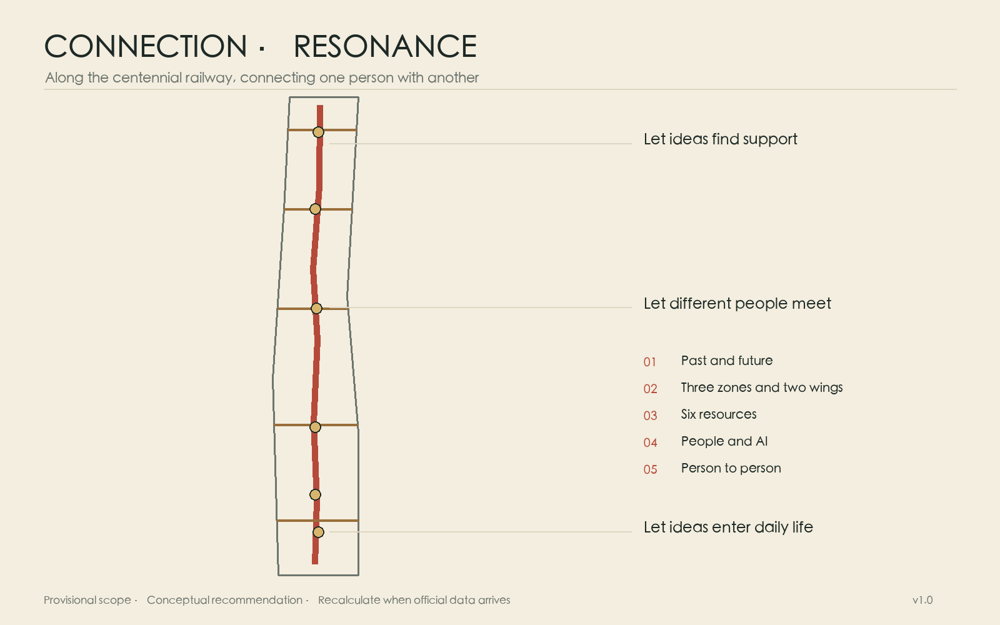
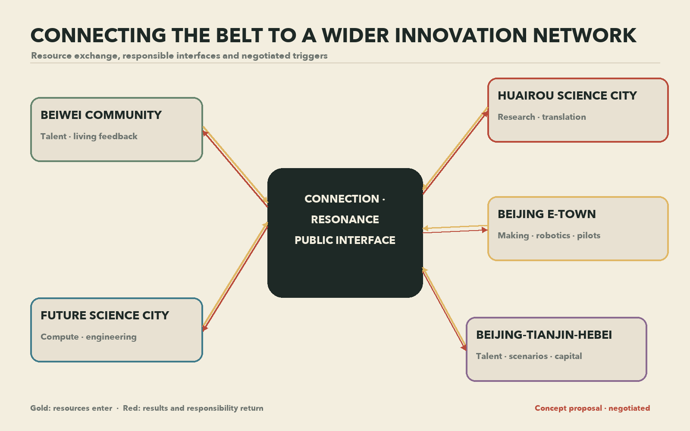
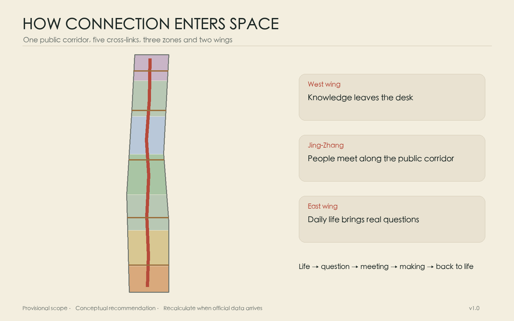
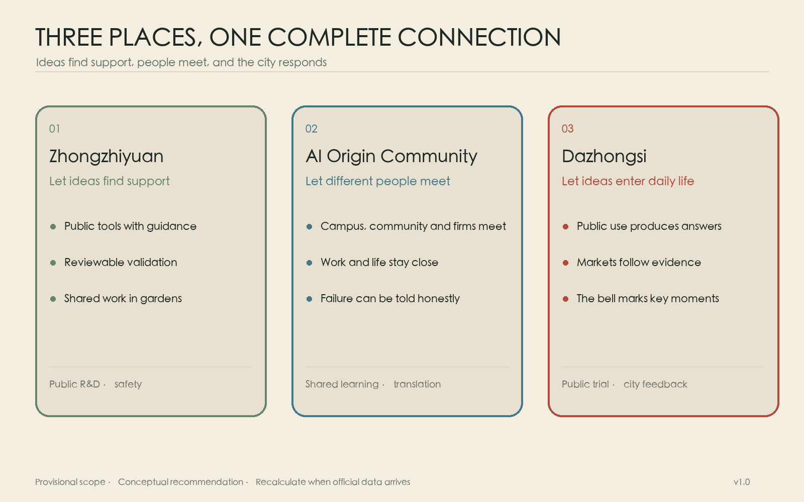
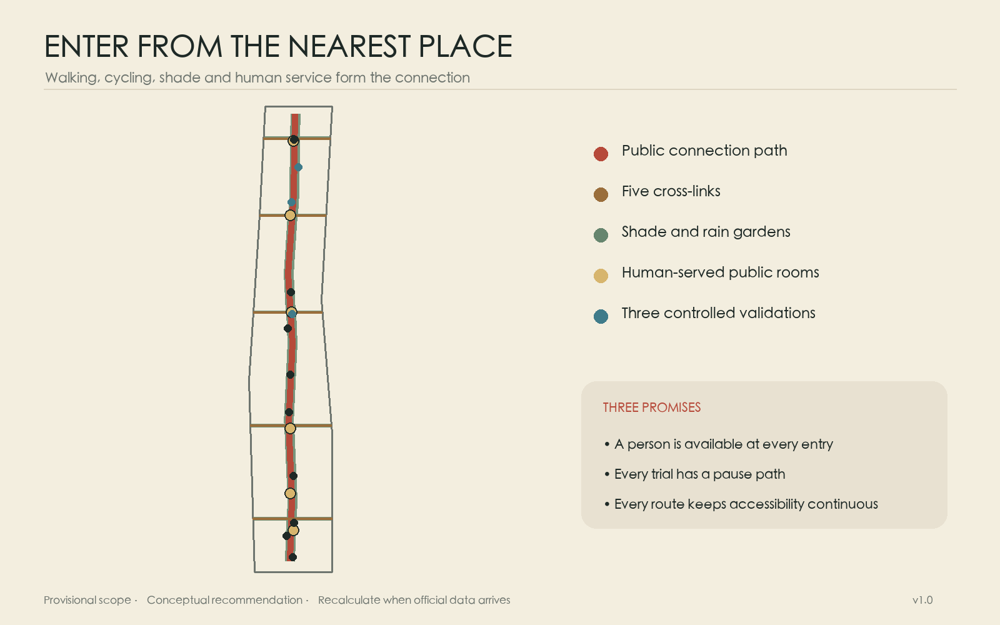
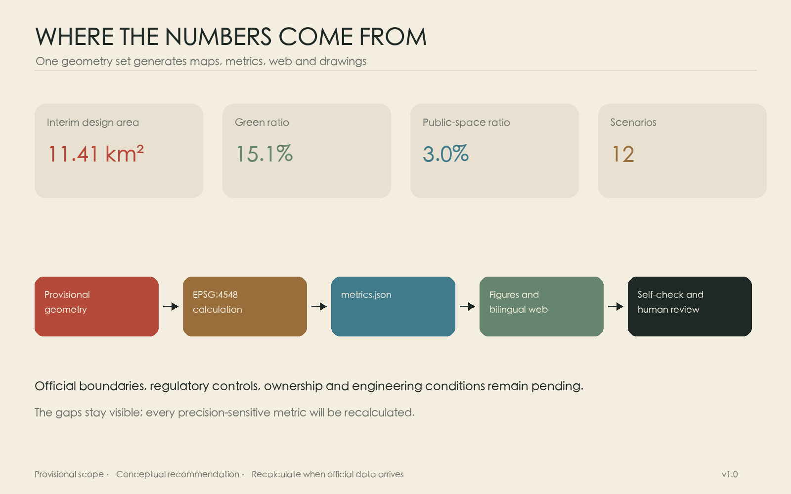

# Connection · Resonance

More than a century ago, the Jing-Zhang Railway departed through this part of Beijing. A whistle at a crossing alerted people nearby while the tracks connected the city with a wider world. The railway has since become urban memory, yet connection remains the clearest character of this ground: between history and the future, among the three key areas, between universities and neighbourhoods, and between people and the many human experiences carried through artificial intelligence.

The proposal turns the railway corridor into a public line for walking, cycling, pausing, talking and making things together. Five east-west links join campuses, workplaces, stations and homes to it. Six “city rooms” give encounters a place to happen. Technology stays where it can serve; human experience holds the foreground. Resonance remains a quiet undercurrent, appearing naturally in the whistle, the bell and the moment when one person answers another.

## Design Basis and Source List

The proposal follows the official open-call announcement, the taskbook for AI agents and the repository site package. The announcement establishes a 43.6-square-kilometre coordinated research area, an 11.4-square-kilometre overall design area and three key areas totalling 368.4 hectares. The taskbook adds the Three Zones and Two Wings, five functions and agent collaboration requirements. [source:OFFICIAL-ANNOUNCEMENT] [source:AGENT-TASKBOOK]

Exact official polygons, statutory controls, ownership, existing-building surveys, utility networks and heritage-control drawings have not yet been released in the repository. The map uses its provisional rough boundary. Recalculation produces about 11.413 square kilometres, consistent in scale with the announced 11.4 square kilometres. This geometry supports conceptual exploration, figures and machine checks only; every feature retains `official_boundary=false`. Land use, paths, green space, public space and metrics must all be recalculated once official polygons arrive. [source:DATA-SRC-PROVISIONAL-BOUNDARIES-20260605] [data:geometry/site_boundary.geojson#SITE-001] [metric:site_area_sqm]

Eight global cases inform the operating model. AI Singapore joins training, company problems and engineering delivery. Massachusetts AI Hub lowers the first compute barrier. Mila and Vector build durable research-partner networks. France 2030 combines national funding, compute and industrial missions. Testbed Seoul and Shenzhen show how real urban settings can host regulated trials. Hub71+ AI brings capital, market access and international talent services close to young firms. These cases offer methods; Haidian’s answer grows from its own history, places and daily life. [source:CASE-AISG] [source:CASE-MASS-AI-HUB] [source:CASE-MILA]

Every public source is registered in `sources.json`, every conceptual assumption in `assumptions.json`, and every number carries a formula and confidence statement in `metrics.json`.

## Three-Level Scope Framework

The 43.6-square-kilometre research area acts as a map of relationships among universities, institutes, innovation platforms, companies, neighbourhoods and public services. The 11.4-square-kilometre design area acts as a spatial map for continuity along the railway park, east-west repair, industry and everyday life. The three key areas become chapters where research, translation and urban use can take material form. [standard:PROJECT-OFFICIAL-ANNOUNCEMENT] [depth:three_level_scope_framework]

One north-south Connection Line and five east-west Stitching Links organise the Three Zones and Two Wings. The Zhongguancun Technology Service Wing brings technology services, the Zhongguancun identity, capital and global resource allocation. The Xiaoyuehe Scenario Empowerment Wing brings public experience, neighbourhood life and civic services. Six city rooms along the line support memory, learning, collaboration, testing, care and public presentation. A resident may enter the innovation belt from an ordinary daily journey.

| Level | Central question | Output |
| --- | --- | --- |
| 43.6 km² research | How do six innovation resources form a cycle? | Eight-case study, people and enterprise journeys, annual operating rules |
| 11.4 km² design | How do the long line and two wings connect? | One line, five links, blue-green mobility, six city rooms |
| 368.4 ha key areas | How do the three areas share roles? | Spatial actions, scenario cards and project sequences |

The levels share the same identifiers and data. Prose explains purpose, GeoJSON stores location, drawings reveal relationships and the compliance matrix maps every task. This structure enables a complete update when an official boundary becomes available.

## Coordinated Research Area: Industry and Future City Research

AI innovation is often divided into talent, enterprise, compute, capital, data and scenarios. A city can help them meet at the right moment. A student brings an idea to the Origin Community and finds collaborators at the long table. The team moves north to access shared compute and testing guidance at Zhongzhiyuan. A controlled data room supports verification. Dazhongsi then hosts an encounter with companies, residents and public-service teams. Feedback travels back to researchers, and capital can judge progress through evidence.

| Resource | Urban interface | Connection to the cycle |
| --- | --- | --- |
| Talent | open learning, mentors, affordable work and living information | forms interdisciplinary teams around real questions |
| Enterprise | one-stop service, public window, first-use opportunity | states needs and remains responsible for products |
| Compute | bookable entry, green-compute advice | gives small teams a fair first experiment |
| Capital | milestone reviews, patient-capital clinic | enters in stages as evidence accumulates |
| Data | authorised catalogue, controlled room, audit record | supports verification for a defined purpose and term |
| Scenarios | small trials in communities, parks and public services | allows real users to provide traceable feedback |

An annual rhythm sustains the loop: public questions in spring, team formation in summer, limited trials in autumn, and an honest archive of gains and failures in winter. Each team leaves reusable notes, failure records and an exit plan. Ground floors become more open; streets gain shade, drinking water, seating and continuous accessibility; shared equipment sits near public transport. AI helps people find resources, translate information and understand rules. Accountable people retain final decisions. [depth:overall_spatial_structure]

### Taskbook Execution Matrix

The three positioning statements unfold along one connection line. The Centennial Jing-Zhang Cultural Belt is carried by railway memory, the Tsinghua Garden Station story, wayfinding and a multilingual cultural walk. The Urban AI Life Experience Belt is carried by six city rooms, twelve everyday scenarios and the Xiaoyuehe Scenario Empowerment Wing. The AI Integration and Innovation Belt is carried by the six-resource cycle, three key areas and the Zhongguancun Technology Service Wing. The five functions follow a human journey: Zhongzhiyuan supports the full-stack autonomous innovation system and governance debate; the AI Origin Community supports a world-class AI innovation ecosystem; Dazhongsi and Xiaoyuehe support AI+ scenarios and AI-native activity; continuous public space supports an intelligent and vibrant AI city; visible rules, controlled trials and annual reporting build a contribution to global AI governance discourse. [source:AGENT-TASKBOOK] [data:geometry/key_areas.geojson#PROV-KEY-001]

| Agent task | Concrete deliverable | Spatial and scenario anchor | Operation and measure |
| --- | --- | --- | --- |
| agent.1 Overall concept | Chinese and English name; red line, gold line and echo-arc identity; positioning, functions and spatial structure | Connection Line, five links, three areas and six city rooms | task coverage, path length and annual review |
| agent.2 Full stack and ecosystem | eight cases; talent, enterprise, compute, capital, data and scenario cycle | compute and trials at Zhongzhiyuan; translation at Origin; Technology Service Wing | first compute access, cross-institution teams, feedback time |
| agent.3 AI+ and vibrant city | twelve cards, three validations and six personas | Xiaoyuehe Wing; parks, homes, stations and civic services | human review, pause, complaint and exit records |
| agent.4 Public space and landmarks | Memory Platform, Origin Long Table, Response Court and six components | heritage park, one line and five links, Dazhongsi crossings | opt-in credit plaques, maintenance log and complete accessible journeys |
| agent.5 Cultural narrative | railway memory, Zhongguancun innovation culture and new AI culture | memory, cultural walk, wayfinding and public archive | fact review, bilingual content, rights and community choice |
| agent.6 Global events and operation | Jing-Zhang Connection Season, developer community, open scenarios and international conversion | rotating programme across three areas and six city rooms | question, team, trial, market clinic and annual archive |

The visual identity draws connection as a brick-red line and resonance as a gold parallel line with expanding arcs. A compact “two lines, one arc” mark can extend to wayfinding, rule boards, event passes and annual archives. It is a concept direction for a later brand team to clear and develop. An opt-in Connection Plaque and annual public archive credit those who raise a question, share a tool, document failure or help another person; contributors can remain anonymous or withdraw. The component library includes the Origin Long Table, Quiet Bench, Scenario Rule Board, Pause Light, Accessible Beacon and Movable Shade Planter, sharing repairable joints and restrained materials.

### Regional Synergy: Connecting the Belt to a Wider Innovation Network

The Jing-Zhang corridor can serve as a public interface for exchanging resources beyond Haidian. Every relationship below is a proposal for negotiation. It begins only after counterpart consent, data permission, budget and professional review.

| Direction | Resources exchanged | Interface and responsibility | Trigger and conversion path |
| --- | --- | --- | --- |
| Beiwei Community | young talent, neighbourhood questions and service feedback | Origin operations and a community liaison publish questions together | after deliberation and data permission, a small service trial enters the annual archive |
| Future Science City | compute, engineering platforms and industry mentors | the Corridor Council and counterpart park operate a referral window | after a service agreement, teams request compute or expert time against milestones |
| Huairou Science City | scientific-instrument questions, research models and translation | a university research alliance and Origin Translation Table maintain a two-way list | after ethics and IP review, a question enters cross-institution team formation |
| Beijing E-Town | robotics, intelligent devices, manufacturing chains and pilot production | Zhongzhiyuan validation teams coordinate with manufacturing and test operators | after safety plans and permits, controlled park trials may progress to industrial pilots |
| Beijing-Tianjin-Hebei | university talent, industrial scenarios, capital and public events | the Jing-Zhang Connection Season publishes cross-city open questions | after a memorandum and responsibility list, partners form annual joint questions and follow-up |

All five directions share one conversion path: a public question reaches the Origin Long Table; a team gains tools and controlled validation at Zhongzhiyuan; Dazhongsi gathers public and market responses; the Zhongguancun Technology Service Wing connects capital and professional services; results return to the place that raised the question. Every trip has an owner, term, exit and public result summary. Completed joint questions and closed feedback loops measure progress. [source:AGENT-TASKBOOK] [depth:overall_spatial_structure]

## Overall Design Area: Urban Renewal and Regulatory-Plan-Level Urban Design

The spatial structure is one Connection Line, five Stitching Links, three innovation areas, the Zhongguancun Technology Service Wing, the Xiaoyuehe Scenario Empowerment Wing and six city rooms. The line gives priority to continuous walking and cycling while retaining a scale at which railway history can be read. The links address walls, wide roads, underpasses and station entrances. Conceptual new massing gathers around existing built areas and renewal nodes, leaving the park open, accessible and hospitable. [data:geometry/roads.geojson#ROAD-SPINE-001] [data:geometry/public_space.geojson#PUBLIC-001]

Seven continuous bands cover the provisional design boundary and express a direction for functional mixture without claiming statutory land-use classes. Nine conceptual building groups test the relationship between frontages and public space around the three key areas. Total floor area, FAR, height, setback and demolition decisions remain unknown until statutory controls, surveys, ownership and engineering evidence are available. [data:geometry/land_use.geojson#LU-001] [data:geometry/buildings.geojson#BLDG-001]

Renewal proceeds gently: open selected ground floors and boundaries; add shade, crossings, accessibility, services and small workspaces; consider building replacement only after those steps. Every phase includes review and adjustment. Transport, infrastructure, ecology, public service and long-term operation jointly determine capacity.

## Detailed Design of Key Areas

The three areas form a legible journey along the line. Zhongzhiyuan helps an idea find tools. The AI Origin Community helps different people form a team. Dazhongsi lets an outcome meet the city.

**Zhongzhiyuan — bring difficult questions into a garden.** An open test garden and safety-governance walk face the Qinghe side; shared compute access, standards advice, equipment storage and small discussion rooms face the working campus. Outdoor tests use booked times and visible boundaries. The public can see who is testing, for how long and how an activity can be stopped. A tree-lined path also serves rainwater management and ordinary lunch breaks. [data:geometry/key_areas.geojson#PROV-KEY-001]

**AI Origin Community — let one long table hold many beginnings.** Campus, workplace and neighbourhood entrances join the Origin Long Table. Around it sit open-source collaboration, research translation, legal and intellectual-property advice, talent services, temporary exhibitions and daily amenities. Ground floors can serve teams by day and community learning in the evening. Housing information, childcare and accessibility support stand beside venture services. [data:geometry/key_areas.geojson#PROV-KEY-002]

**Dazhongsi — let the city respond.** Safe and continuous crossings connect four directions around the station. Enterprise display, community service and everyday commerce gather around the City Response Court. The history of Juesheng Temple and the Yongle Bell offers a careful memory of time and reverberation. Any event involving the bell requires heritage-manager consent and a specific occasion; the ordinary court remains quiet. [source:HISTORY-BELL] [data:geometry/key_areas.geojson#PROV-KEY-003]

The three landmarks are the Centennial Jing-Zhang Memory Platform, the Origin Long Table and the Dazhongsi City Response Court. Each begins with public use: sitting, meeting, reading and expressing an opinion. Form follows through professional design after heritage, fire, transport and operating requirements are confirmed.

## AI Innovation Ecosystem, Personas, and AI+ Scenarios

Six kinds of people test the proposal through their day: students and researchers need cross-campus collaboration and translation; start-ups need compute, legal help and a first real user; residents and older people need legible, calm and optional services; civic workers need human review and clear responsibility; visiting developers need multilingual orientation; children, caregivers and disabled people need continuous access and quiet rest.

Twelve scenarios state users, place, data boundary, human responsibility and a stopping method. Three are controlled validations. The robot garden operates only within booked times and a defined enclosure, with staff able to stop equipment. Severe-weather inspection records infrastructure conditions for municipal review. The health-data room uses explicit permission, minimal fields, a fixed term and audit logs; public results remain anonymous aggregates. Nine further scenarios include a public-compute guide, cross-campus table, youth housing and work guide, accessible journey companion, research translation table, community-care connector, public intelligent-device trial, multilingual cultural walk and annual connection archive. The twelve positions correspond to six city rooms and are listed individually in the compliance matrix. [data:geometry/public_space.geojson#PUBLIC-001] [data:geometry/public_space.geojson#PUBLIC-005]

| Scenario | Place | Human responsibility |
| --- | --- | --- |
| Public compute guide | Zhongzhiyuan | staff review eligibility, cost and energy information |
| Cross-campus table | Origin Community | facilitators protect openness and attribution |
| Community-care connector | eastern neighbourhoods | social workers verify advice and preserve offline help |
| Accessible journey companion | line and links | users can switch it off; maintainers verify routes |
| Intelligent-device public trial | Dazhongsi | companies publish scope, defects and exit method |
| Annual connection archive | all three areas | contributors choose and may withdraw permission |

Data practices use a clear purpose, minimum collection, visible duration and a named responsible party. Public space excludes facial-recognition profiling and commercial use of personal movement traces. Medical, care, planning, safety and public-resource decisions remain under qualified human review. [depth:ai_scenarios]

## Land Use, Building Scale, and Retain-Renovate-Demolish Strategy

The conceptual land-use model arranges research collaboration, mixed innovation, public service, living support and blue-green space along the corridor, adding shared ground floors at the five cross-links. Green geometry covers about 1.724 million square metres, or 15.11% of the provisional boundary. Six public rooms cover about 342,982 square metres, or 3.01%. Both ratios compare design structure at low confidence and carry no statutory force. [metric:green_ratio] [metric:public_space_ratio]

The retain-renovate-demolish process begins with recording and evaluation. Spaces with railway memory, industrial fabric, mature trees or continuous community use receive priority for retention. Structurally sound buildings can gain open ground floors, energy improvement and mixed uses. Replacement requires survey, ownership negotiation, heritage assessment and whole-life carbon comparison. The nine building groups are conceptual massing only; their footprints total about 319,348 square metres and test frontage and public-space scale. [metric:building_footprint_area_sqm]

Building guidance protects a comfortable street: lower pressure along the park, entrances aligned with public paths, passages through long frontages and roofs that support shade, water, energy and suitable shared uses. Height, FAR, density, parking and fire conditions remain `unknown` pending official material and specialist review.

## Transport, Rail, Municipal Infrastructure, and Public Services

Walking and cycling define the scale of the Connection Line. The conceptual network is about 15.15 kilometres long, with one north-south line and five cross-links. Junctions first secure continuous crossings, waiting space, ramps and night visibility. Later studies address underpasses, station entries and park gates. Station loops make interchange directions clear; cycle parking stays near entrances while keeping tactile paths open. [metric:connection_path_length_m]

Infrastructure uses maintainable small units. Rain gardens and tree pits form a sponge corridor. Public buildings disclose energy and compute consumption. Edge-compute equipment stays in managed interiors. Charging, delivery and equipment tests follow time and noise rules. Every sensor carries a visible purpose, responsible body, collected fields and removal date. City rooms provide water, toilets, infant care, first aid, quiet rest, accessibility and a staffed help point. [depth:traffic_rail_slow_parking] [depth:municipal_new_infrastructure]

Road lines, rail interfaces, passenger counts, parking, utilities, flood control, fire access and energy capacity are required for formal development. Until then, each project records connection intent and spatial reservation only.

## Blue-Green Network, Public Space, and Urban Character

The Jing-Zhang Heritage Park provides the continuous green line. Qinghe and Xiaoyue River spaces can join a fuller blue-green network once formal information is confirmed. Paths support two rhythms: efficient passage for commuters and places under trees, canopies, steps and courtyards for children, older people and visitors. Five cross-links bring daily movement from both wings into the park while preserving ordinary calm. [data:geometry/green_space.geojson#GREEN-001]

Six city rooms keep distinct characters. The Memory Platform tells railway stories; the Learning Court sits near campuses; the Collaboration Table supports small teams; the Test Garden makes rules visible; the Care Walk connects neighbourhood help; and the Response Court hosts public discussion. Quiet hours, low-stimulation routes and movable furniture allow every place to return to normal park use after an event.

Material and human scale continue local memory. Linear rail traces, platform proportions, old trees and the inscriptions on the bell can become restrained cues without copying historical architecture. Night lighting stays low, continuous and demand-sensitive. Displays control brightness and sound. Wayfinding combines clear Chinese, English, pictograms and tactile information; public art is selected through an open process with local communities. [depth:blue_green_public_space]

## Renewal Projects, Implementation Policy, and Phasing

The near term builds trust through reversible work: complete official-data calibration, audit the full walking route, co-design five breaks, open three temporary city rooms and run three controlled validations. The middle term improves station crossings, shared ground floors, shade and rainwater, common services and professional designs for the three landmarks. The long term completes park continuity, stabilises operating institutions and maintains the annual connection archive.

| ID | Project | Phase | Prerequisite |
| --- | --- | --- | --- |
| JZ-01 | official boundary and base-map calibration | near | official files, coordinates and licence |
| JZ-02 | repair five walking breaks | near–middle | traffic, accessibility and utilities review |
| JZ-03 | Zhongzhiyuan Test Garden | near | operation, safety, ecology and notice |
| JZ-04 | Origin Long Table and shared ground floor | near–middle | ownership, fire and community agreement |
| JZ-05 | Dazhongsi City Response Court | middle | heritage, station, traffic and commerce |
| JZ-06 | six city rooms | middle | operators and maintenance funding |
| JZ-07 | blue-green sponge links | middle | water, landscape and flood conditions |
| JZ-08 | controlled compute and data access | near | security, energy, permission and audit |
| JZ-09 | talent life-service station | near | housing, childcare and access partners |
| JZ-10 | multilingual cultural walk | near | fact, copyright and maintenance review |
| JZ-11 | annual connection archive | ongoing | permission, withdrawal and preservation rules |
| JZ-12 | corridor operation and evaluation | ongoing | cross-sector platform and public reporting |

A Corridor Connection Council brings together parks, campuses, communities, companies, public departments and accessibility representatives. It publishes questions and progress quarterly and reports annually on space use, energy, scenario safety, participation equity and complaints. Public-space maintenance, enterprise service and public-benefit projects keep separate accounts. Every trial has a term and exit clause. [data:geometry/phasing.geojson#PHASE-001]

The proposed annual event brand is the Jing-Zhang Connection Season. Spring “Find the Way” publishes city and industry questions. Summer “Share the Table” forms teams among developers, researchers, residents and companies. Autumn “Try the Path” runs controlled validation. Winter “Echo” publishes outcomes, failures, maintenance costs and questions for the next year. The three key areas rotate as hosts while six city rooms support small everyday programmes. International participants enter through bilingual open questions and an online briefing, join the Origin Long Table, prepare tools and safety at Zhongzhiyuan, and meet public and market feedback at Dazhongsi. Teams with continuing value may enter professional service, a capital clinic, industrial pilot production or a following-year residency. Human choice and an exit remain available at every step. [source:AGENT-TASKBOOK] [metric:scenario_count]

The Council maintains Connection Plaques and the component library. A plaque records an authorised name, team or anonymous code together with contribution type and year. The Origin Long Table, Quiet Bench, Rule Board, Pause Light, Accessible Beacon and Movable Planter each carry a maintenance owner, inspection cycle and removal condition. The event identity, contribution archive and component maintenance form a long-term brand asset.

## Metrics, Area Recalculation, and Compliance Matrix

Core metrics are recalculated from the same GeoJSON that generates the figures. The provisional boundary covers about 11,412,825 square metres; green space 1,724,212 square metres; public space 342,982 square metres; and the conceptual walking network 15,152 metres. Each value preserves a formula, source file, unit and low-confidence notice. [metric:site_area_sqm] [metric:green_ratio] [metric:public_space_ratio]

Operating metrics ask whether connection really occurs: cross-institution teams formed, first-time compute access for small teams, time for scenario feedback to return to a product, repaired east-west breaks, complete accessible journeys, and the pattern of participation and withdrawal. Baselines begin during operation. Satisfaction records positive, negative and silent samples, while annual reporting publishes method and limitations.

`compliance_matrix.json` maps the announcement and agent.1–agent.6 to sections, layers, metrics, drawings and web evidence. `standard_matrix.json` records professional references. `design_depth_matrix.json` records depth and missing material. When official polygons arrive, one generation chain updates every spatial file before spatial, visual, bilingual and pre-push checks run again.

## Risk, Copyright, and Compliance

Boundary accuracy is the principal spatial risk. The 43.6-square-kilometre research area has no reproducible official polygon in the repository; the 11.4-square-kilometre design area and three key areas use provisional layers. Statutory land use, height, retain-renovate-demolish decisions, road lines, ownership, heritage, utilities, fire access and funding await competent authorities and professional teams. [source:DATA-SRC-PROVISIONAL-BOUNDARIES-20260605]

AI scenarios carry privacy, safety, bias, exclusion and responsibility risks. Each trial starts with a defined purpose, minimal data, a small area, short duration and a human present. People can refuse, pause and complain. Health, care, public safety and public-resource decisions retain human authority. Harm, unexpected collection, inexplicability or missing maintenance responsibility triggers an immediate stop.

The text, conceptual geometry, figures, web pages and PDFs are generated for this project. Global case and historical facts are paraphrased from public sources. No third-party page image, mark, map tile or historic recording appears in the package. The optional three-note web cue is synthesized only after a user click and labelled as an artistic cue. Full generation, font and tool information appears in `report/copyright_statement.md`.

This urban-design proposal supports discussion and professional development. It does not constitute approval, a statutory plan, engineering documentation, an investment commitment or an implementation guarantee. Chinese and English files maintain the same sections, metrics and boundary disclosure; reviewers can follow sources, assumptions, data and self-check records for every material claim.

## References

- Centennial Jing-Zhang AI Innovation Belt open-call announcement and published brief [source:OFFICIAL-ANNOUNCEMENT]
- Open-call taskbook for AI agents [source:AGENT-TASKBOOK]
- Repository provisional rough boundary and site package [source:DATA-SRC-PROVISIONAL-BOUNDARIES-20260605]
- Official programme pages for AI Singapore, Massachusetts AI Hub, Mila, Vector Institute, France 2030, Testbed Seoul, Shenzhen and Hub71+ AI; links and use limits are recorded in `sources.json`
- Public historical sources for Haidian, Tsinghua Garden Station and the Yongle Bell [source:HISTORY-HAIDIAN] [source:HISTORY-JINGZHANG] [source:HISTORY-BELL]
- Complete machine indexes: `sources.json`, `assumptions.json`, `metrics.json`, `compliance_matrix.json`, `standard_matrix.json`, and `design_depth_matrix.json`
