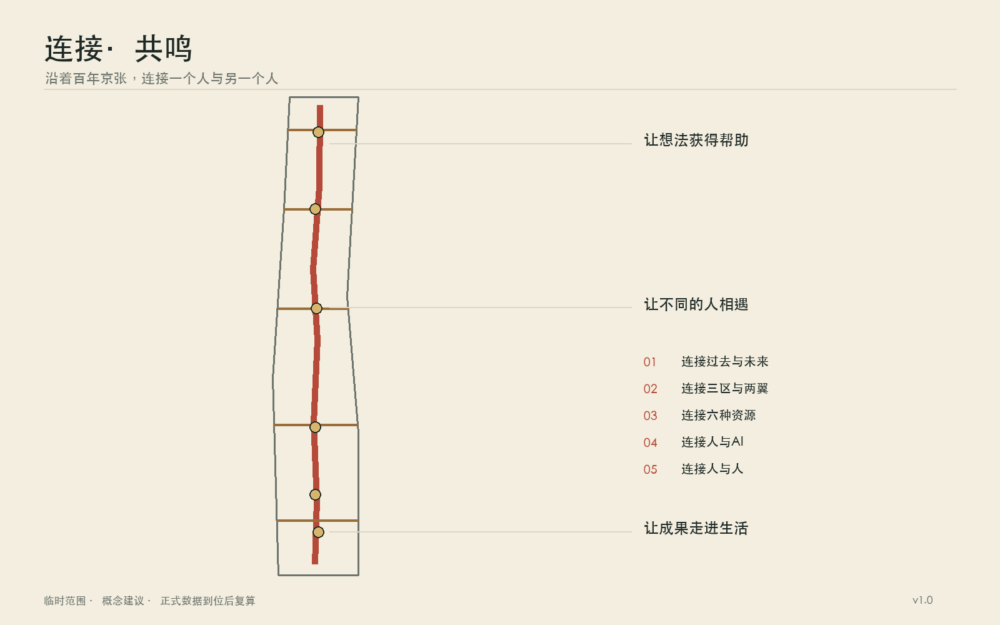
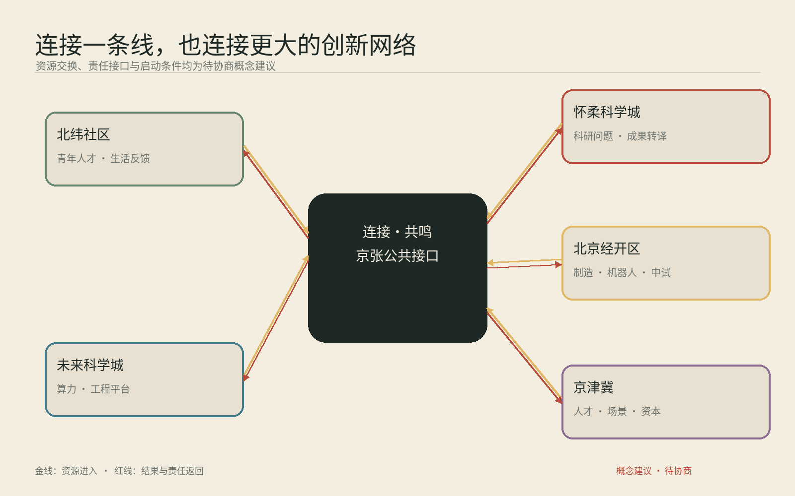
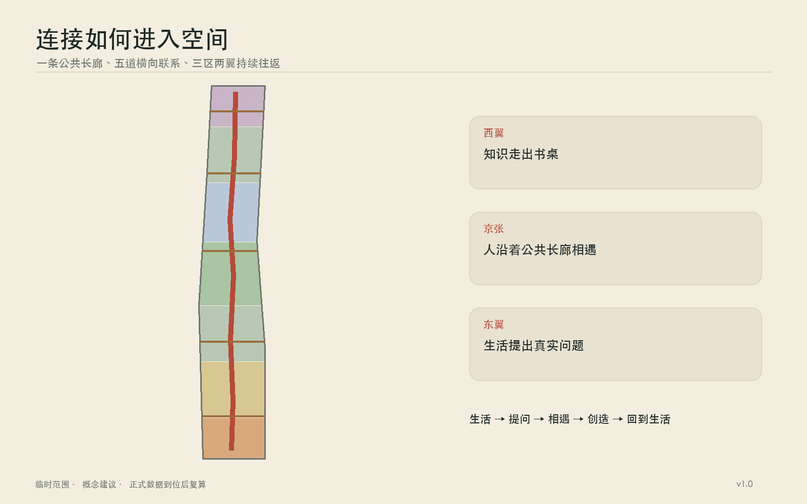
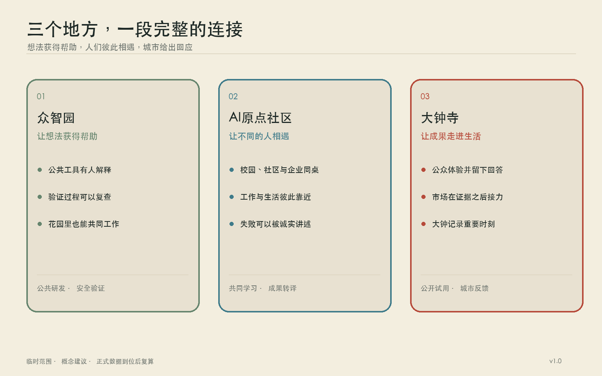
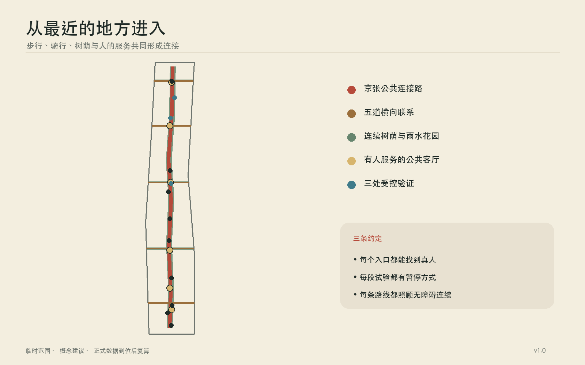
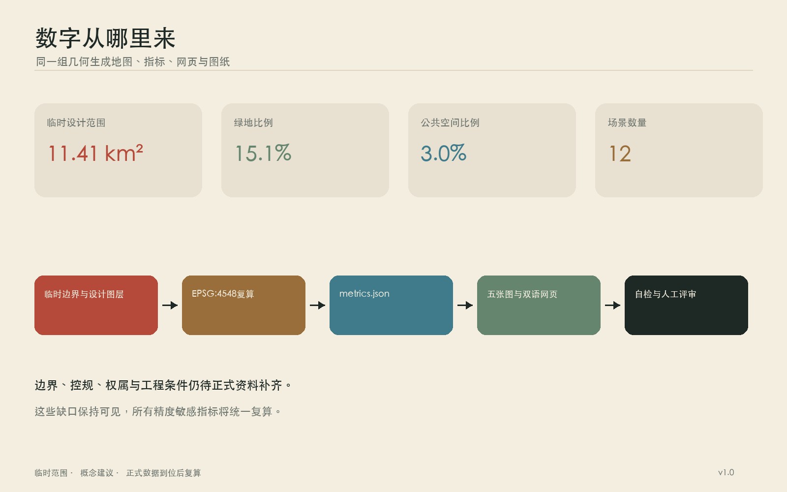

# 连接·共鸣

一百多年前，京张铁路从这里出发。火车经过道口，汽笛提醒路上的人，也把北京与更远的世界连接起来。今天，铁路已成为城市记忆，连接仍是这片土地最清晰的性格。它可以继续向前：连接过去与未来，连接众智园、北京 AI 原点社区与大钟寺，连接高校、企业和社区，也连接人和人工智能背后无数人的经验。

方案把京张沿线理解成一条可以步行、骑行、停留、交谈和共同工作的公共长线。五条东西向支线把校园、园区、车站与街坊接到长线上；六间“城市客厅”让相遇有地方发生。技术留在合适的位置，人的感受走到城市前景中。共鸣藏在汽笛、钟声与人与人回应的瞬间里，陪伴连接这条主线自然展开。

## 设计依据与资料清单

本方案首先遵循征集公告、面向智能体任务书和仓库场地包。公告给出 43.6 平方公里统筹研究范围、11.4 平方公里总体设计范围，以及总计 368.4 公顷的三处重点区域；任务书进一步提出“三区两翼”、五大功能和智能体共创要求。[source:OFFICIAL-ANNOUNCEMENT] [source:AGENT-TASKBOOK]

当前仓库仍缺少官方精确红线、法定控规、权属、现状建筑、市政管线和文保控制图。地图采用仓库提供的临时粗略边界，面积复算得到约 11.413 平方公里，与公告的 11.4 平方公里量级相符。该边界只服务于概念推演、图件生成和机器校验，图层属性持续保留 `official_boundary=false`；未来取得官方多边形后，应统一重算用地、道路、绿地、公共空间和指标。[source:DATA-SRC-PROVISIONAL-BOUNDARIES-20260605] [data:geometry/site_boundary.geojson#SITE-001] [metric:site_area_sqm]

八个全球案例为机制研究提供参照：新加坡 AI Singapore 说明公共计划可以把人才训练、企业题目和工程交付接成一条路；马萨诸塞 AI Hub 展示共享算力怎样降低初创团队的第一道门槛；蒙特利尔 Mila 与多伦多 Vector 说明研究机构需要长期伙伴网络；法国 2030 体现国家资金、算力和产业任务的组合；首尔 Testbed Seoul 与深圳城市级场景开放说明真实街区可以成为受监管的试验环境；阿布扎比 Hub71+ AI 说明资本、市场和国际人才服务需要共同抵达企业身边。[source:CASE-AISG] [source:CASE-MASS-AI-HUB] [source:CASE-MILA]

这些案例提供方法，海淀的回答来自本地的历史、空间和生活。所有自采公开资料记录在 `sources.json`，所有概念假设记录在 `assumptions.json`，所有数值都能在 `metrics.json` 找到公式和置信度。

## 三层范围工作框架

43.6 平方公里研究范围像一张关系图，关注海淀北部高校院所、创新平台、企业、社区和公共服务如何协同。11.4 平方公里设计范围像一张空间图，处理京张遗址公园周边一至两公里内的南北贯通、东西缝合、产业空间和日常生活。三处重点区域像三个可以落笔的章节，分别承接技术策源、成果转化和城市应用。[standard:PROJECT-OFFICIAL-ANNOUNCEMENT] [depth:three_level_scope_framework]

“三区两翼”由一纵五横组织。一纵沿京张遗址公园形成“连接长线”；五横选择现有或可改善的过街与慢行联系，把中关村科技服务翼和小月河场景赋能翼接进长线。中关村科技服务翼汇集科技服务、中关村品牌、资本与全球要素配置能力，小月河场景赋能翼承接公共体验、社区生活和城市服务。沿线六间城市客厅依次承担记忆、求知、协作、试验、照料与展示，任何人都可以从日常路径进入创新带。

| 层级 | 主要问题 | 本方案的工作成果 |
| --- | --- | --- |
| 43.6 平方公里统筹研究 | 六种创新要素怎样形成循环 | 八案例比较、人才与企业旅程、年度运营规则 |
| 11.4 平方公里总体设计 | 南北长线与东西两翼怎样相连 | 一纵五横、蓝绿慢行、六间城市客厅、分期项目 |
| 368.4 公顷重点区域 | 三处片区怎样形成分工 | 众智园、原点社区、大钟寺的空间动作和场景卡 |

三层工作共享同一组编号和数据。正文讲清理由，GeoJSON 保存位置，图纸呈现关系，合规矩阵逐条对应公告要求。这种组织便于官方边界更新后整体替换，也让公众能够看懂方案从何而来。

## 统筹研究范围产业与未来城市研究

AI 创新常被拆成六件事：人才、企业、算力、资本、数据和场景。城市的任务是让它们在合适的时刻遇见。一个学生带着想法进入原点社区，在长桌上找到伙伴；团队沿连接长线去众智园申请共享算力与测试指导；产品通过受控数据室完成验证，再到大钟寺与企业、居民和公共部门见面；使用反馈返回研究团队，资本据此判断长期价值。六种要素由人的旅程串成循环。

| 要素 | 城市提供的接口 | 与其他要素的连接 |
| --- | --- | --- |
| 人才 | 开放课程、导师时间、可负担工作与居住信息 | 在真实题目中组成跨学科团队 |
| 企业 | 一站式服务、展示窗口、首用机会 | 提出需求并承担产品和服务责任 |
| 算力 | 预约式公共入口、绿色算力咨询 | 支持小团队验证，记录能耗与公平使用 |
| 资本 | 里程碑路演、耐心资本会诊 | 根据实证进展分阶段进入 |
| 数据 | 授权目录、受控数据室、审计记录 | 只在明确目的和期限内支持验证 |
| 场景 | 社区、园区和公共服务中的小规模试点 | 由真实使用者给出可追踪反馈 |

年度运行形成四季节奏：春季公开问题，夏季组队与训练，秋季在三处片区开展小规模验证，冬季归档得失并更新下一年的题目。每个团队都要留下可复用的说明、失败记录和退出方案。沿线空间因此拥有稳定的人流与学习节奏，创新成果也能回到城市生活中接受检验。[depth:overall_spatial_structure]

未来城市的形态从细小变化生长出来：首层更开放，门厅容纳短会和展览；街道提供安静座椅、雨棚、饮水与无障碍路线；共享设备靠近公共交通；研究、工作、居住和照料保持步行可达。人工智能帮助人找到资源、翻译信息和理解复杂规则，最终决定仍由有责任的人作出。

### 任务书执行矩阵

三大定位在同一条连接长线上分层发生。“百年京张文化带”由铁路记忆、清华园车站叙事、导视和多语文化漫步承载；“都市 AI 生活体验带”由六间城市客厅、十二个日常场景和小月河场景赋能翼承载；“AI 融合创新带”由六种资源循环、三处重点片区和中关村科技服务翼承载。五大功能沿人的旅程接续：众智园支撑 AI 全栈自主创新体系和治理讨论，AI 原点社区培育世界级 AI 创新生态，大钟寺与小月河场景赋能翼承接 AI+ 场景与智能原生业态，贯通的公共空间形成智能化 AI 活力城市，公开规则、受控验证和年度报告积累 AI 治理全球话语权。[source:AGENT-TASKBOOK] [data:geometry/key_areas.geojson#PROV-KEY-001]

| 智能体任务 | 本方案的具体交付 | 空间与场景锚点 | 运营与衡量 |
| --- | --- | --- | --- |
| agent.1 总体概念与功能统筹 | “连接·共鸣”中英文命名；红线、金线与回声弧的 Logo 方向；三大定位、五大功能、三区两翼关系 | 连接长线、五条缝合支线、三处片区、六间城市客厅 | 任务覆盖表；连接路径长度；年度复核 |
| agent.2 全栈创新与世界级生态 | 八案例研究；人才、企业、算力、资本、数据、场景循环 | 众智园共享算力与受控试验；原点社区成果转译；中关村科技服务翼 | 首次算力入口、跨机构团队、反馈返回时间 |
| agent.3 AI+ 场景与活力城市 | 十二张场景卡、三项受控验证、六类人物 | 小月河场景赋能翼；公园、社区、站点与公共服务节点 | 人工复核、暂停机制、投诉与退出记录 |
| agent.4 公共空间与朝圣地标 | 记忆台、原点长桌、城市回应庭；六件公共空间组件 | 京张遗址公园、一纵五横、大钟寺站四向联系 | 贡献铭牌自愿署名；组件维护台账；无障碍完整旅程 |
| agent.5 三种文化融合 | 京张记忆、中关村创新传统、AI 新文化共同构成空间故事 | 记忆台、文化漫步、导视与公共档案 | 史实复核、双语内容、版权和社区共选 |
| agent.6 全球活动与长期运营 | “京张连接季”四季活动、开发者社区、开放场景和国际招引转化 | 三处片区轮值主场与六间城市客厅 | 问题公开、组队、验证、市场会诊、年度归档 |

视觉识别把“连接”画成一条砖红长线，把“共鸣”画成金色平行线与逐渐展开的弧。标志可以缩减为“两线一弧”，用于导视、场景规则牌、活动证件和年度档案；它是概念方向，字体、比例和应用规范由后续品牌团队完成清权与深化。荣誉展示采用自愿署名的“连接铭牌”和年度公开档案，记录提出问题、共享工具、修复失败和帮助他人的贡献，参与者可以选择匿名或撤回。公共空间组件库包含原点长桌、安静长椅、场景规则牌、可暂停指示灯、无障碍信标和可移动遮阴花箱，六件组件共享朴素材料与可维修连接件。

### 区域协同：把一条连接线接入更大的创新网络

京张沿线可以成为海淀向外交换资源的公共接口。下表全部属于待协商的概念建议，任何合作都以对方机构同意、数据授权、预算和专业审查为触发条件。

| 协同方向 | 交换资源 | 接口与责任 | 触发条件与转化路径 |
| --- | --- | --- | --- |
| 北纬社区 | 青年人才、社区问题、生活服务反馈 | AI 原点社区运营团队与社区联络人共同发布问题 | 社区议事与数据授权后，小规模服务验证进入年度档案 |
| 未来科学城 | 算力、工程平台、产业导师 | 沿线连接议事会对接园区服务平台，建立预约与转介窗口 | 服务协议生效后，团队凭里程碑申请算力或专家时间 |
| 怀柔科学城 | 科学装置需求、科研模型、成果转译 | 高校研究联盟与原点成果翻译桌维护双向问题清单 | 科研伦理与知识产权确认后，研究题目进入跨机构组队 |
| 北京经开区 | 机器人、智能终端、制造供应链与中试场景 | 众智园验证团队对接制造与测试运营方 | 安全方案和测试许可完成后，由园区受控试验转入产业中试 |
| 京津冀 | 高校人才、产业场景、资本与公共活动 | “京张连接季”发布跨城开放题，三地合作方分别承担题目、验证或转化 | 合作备忘与责任清单确认后，形成年度联合题目和成果回访 |

五个方向共享一条转化路径：公开问题进入原点长桌，团队在众智园获得工具与受控验证，大钟寺收集公众和市场回答，中关村科技服务翼连接资本与专业服务，结果回到提出问题的地区。每一次跨区往返都有责任人、期限、退出方式和可公开的结果摘要；协同成效以完成的共同题目和反馈闭环衡量。[source:AGENT-TASKBOOK] [depth:overall_spatial_structure]

## 总体设计范围城市更新与控规深度城市设计

总体结构是“一条连接长线、五条缝合支线、三处创新片区、中关村科技服务翼、小月河场景赋能翼、六间城市客厅”。长线优先连续步行与骑行，保留铁路遗存能够讲述的尺度；支线优先解决隔墙、宽路、桥下和站口造成的断点。新的公共建筑体量集中在既有建设空间和更新节点周边，公园保持开敞、可进入和可停留。[data:geometry/roads.geojson#ROAD-SPINE-001] [data:geometry/public_space.geojson#PUBLIC-001]

用地模型由七条连续带状单元构成，完整覆盖临时设计边界；它表达功能混合的方向，尚未承担法定用地性质。九组概念建筑基底围绕三处重点区和交通节点布置，用于检验公共空间关系。建筑总量、容积率、高度、退线和拆除对象保持待定，后续需要法定控规、现状测绘、权属与工程条件支持。[data:geometry/land_use.geojson#LU-001] [data:geometry/buildings.geojson#BLDG-001]

更新采用三种温和动作：先打开首层和围墙，让既有空间能够共享；再补齐遮阴、过街、无障碍、服务设施和小型工作空间；条件成熟后开展建筑更新。每一步都保留回访和调整窗口。总体承载力从交通、市政、生态、公共服务和运营五方面共同复核，暂不以单一开发量推动空间决策。

## 重点区域详细设计

三处重点区沿连接长线形成一段清楚的旅程：北端众智园让想法获得工具，中段原点社区让不同的人组成团队，南端大钟寺让成果进入城市日常。

**众智园：把难题带进花园。** 临清河一侧形成开放试验花园和安全治理廊，靠园区一侧布置共享算力入口、标准咨询、设备库和小型讨论室。室外试验采用预约时段和可见边界，公众知道谁在测试、测试多久、怎样暂停。林下步道兼作雨洪空间与日常午休场所。[data:geometry/key_areas.geojson#PROV-KEY-001]

**北京 AI 原点社区：让一张长桌容纳许多起点。** 校园、园区和街坊的入口通过慢行支线汇入“原点长桌”。长桌周边安排开源协作、成果翻译、法务知识产权、人才服务、短期展示和生活配套。首层空间可在白天服务团队，傍晚转为公开讲座与社区课堂。住房信息、托育和无障碍服务与创业服务同处一站。[data:geometry/key_areas.geojson#PROV-KEY-002]

**大钟寺：让城市回应成果。** 站点四个方向由安全、连续的过街关系连接，企业展示、社区服务和日常商业围绕“城市回应庭”展开。绝胜寺与永乐大钟的历史提醒这里珍视时间和回响；涉及钟声的活动只在文保管理方同意的特定时刻举行，平日以安静的庭院、光影和文字讲述记忆。[source:HISTORY-BELL] [data:geometry/key_areas.geojson#PROV-KEY-003]

三处地标分别是“百年京张记忆台”“原点长桌”和“大钟寺城市回应庭”。它们都从公共使用开始：可以坐下、相遇、阅读和表达意见。建筑形式在后续专业设计中深化，文保、消防、交通和运营许可均作为前置条件。

## AI 创新生态、人才画像与 AI+ 场景

方案从六类人的一天检验空间：高校学生与研究者需要跨校协作和成果转化；初创团队需要算力、法务和第一个真实用户；居民与长者需要清晰、安心、可选择的服务；公共服务人员需要人工复核和责任边界；外来开发者需要多语导引与短期协作入口；儿童、照护者和行动不便者需要连续无障碍与安静休息点。

十二个场景都写明服务对象、空间、数据边界、人工责任和停止办法。以下三项属于受控验证：机器人花园只在划定时段和围合场地运行，现场人员可立即停机；极端天气巡检只记录设施状态并由市政人员复核；健康数据室采用明确授权、最少字段、限定期限与审计日志，任何公开展示都使用匿名汇总。其余场景包括公共算力向导、跨校长桌、青年住房与工作指南、无障碍旅程伙伴、研究成果翻译桌、社区照料连接员、智能终端公众体验、多语文化漫步和年度连接档案。十二个位置与六间城市客厅对应，并在合规矩阵中逐项记录。[data:geometry/public_space.geojson#PUBLIC-001] [data:geometry/public_space.geojson#PUBLIC-005]

| 场景 | 发生地点 | 人的责任 |
| --- | --- | --- |
| 公共算力向导 | 众智园 | 工作人员审核资格、费用和能耗信息 |
| 跨校团队长桌 | 原点社区 | 主持人维护开放规则与成果署名 |
| 社区照料连接员 | 东翼街坊 | 社工确认建议并保留线下求助入口 |
| 无障碍旅程伙伴 | 一纵五横 | 使用者随时关闭，维护者核查路线 |
| 智能终端公众体验 | 大钟寺 | 企业公开测试范围、缺陷与退出方式 |
| 年度连接档案 | 三处片区 | 参与者选择授权范围，可申请撤回 |

数据遵循目的明确、最少收集、期限可见和责任到人。城市公共空间里不部署人脸识别式画像，不用个人轨迹做商业推荐。AI 提供解释、翻译、匹配和提醒；医疗、照料、规划、安全与公共资源分配由具备职责的人审核。[depth:ai_scenarios]

## 用地、建筑规模与拆改留方案

概念用地将研究协作、混合创新、公共服务、居住配套和蓝绿空间沿南北方向组织，并在五条横向连接处增加共享首层。绿地模型面积约 172.42 万平方米，占临时边界约 15.11%；六处公共房间约 34.30 万平方米，占约 3.01%。两项比例用于比较方案结构，置信度为低，不能转写为规划指标。[metric:green_ratio] [metric:public_space_ratio]

拆改留遵循“先记录、再评估、后决定”。具有铁路记忆、工业构造、成熟树木和持续社区使用的空间优先保留；结构安全且位置适合的建筑通过首层开放、节能改造和功能混合继续使用；确需更新的对象须在现状测绘、权属协商、历史价值评估和全生命周期碳比较后确定。现阶段九组建筑仅为概念体量，基底总面积约 31.93 万平方米，用来研究街道界面和公共空间尺度。[metric:building_footprint_area_sqm]

建筑控制强调舒适的街道感受：沿公园降低首层压迫，入口对准公共路径，长立面设置可穿行通道，屋顶承担遮阴、雨水、能源和公共活动中的合适部分。高度、容积率、建筑密度、停车和消防条件保持 `unknown`，等待正式资料和专业复核。

## 交通、轨道、市政与公共服务设施

步行和骑行是连接长线的基本尺度。概念网络总长约 15.15 公里，由一条南北主线和五条东西支线组成；数字只描述当前 GeoJSON 方案。路口先保证连续人行横道、等候空间、无障碍坡道和夜间可见性，随后研究桥下、站口与公园出入口的复杂节点。轨道站周边建立方向清楚的换乘环，非机动车停放靠近入口并避开盲道。[metric:connection_path_length_m]

市政策略采用可维护的小单元：雨水花园与树池连成海绵带；公共建筑公布能耗与算力能耗；边缘算力设备进入有管理的室内空间；充电、配送和设备测试设置时间与噪声规则。任何传感器都有可见标识、责任单位、采集内容与拆除日期。公共服务设施沿城市客厅布置饮水、卫生间、母婴、急救、安静休息、无障碍和人工咨询，让技术服务始终有线下入口。[depth:traffic_rail_slow_parking] [depth:municipal_new_infrastructure]

正式深化需要道路红线、轨道接口、客流、停车、市政管线、排水防洪、消防和能源容量资料。每个项目在资料到位前只表达连接意图和空间预留。

## 蓝绿空间、公共空间与城市风貌

京张遗址公园承担连续绿线，清河和小月河相关空间在资料确认后纳入更完整的蓝绿网络。公园里的路径有快慢两种节奏：通勤者可以顺畅通过，儿童、长者和访客可以在树荫、雨棚、台阶和庭院中停留。五条横向支线把两翼的日常人流引入公园，同时避免把公园变成单一活动场地。[data:geometry/green_space.geojson#GREEN-001]

六间城市客厅保持不同性格：记忆台适合阅读铁路故事；求知庭靠近高校；协作桌面向小团队；试验花园公开展示规则；照料廊连接社区服务；回应庭承接成果交流。场地布置预留安静时段、低刺激路线和可移动家具，活动结束后能够恢复普通公园使用。

城市风貌从材料和人的尺度延续记忆。铁轨的线性、站台的长边、老树的季节和大钟表面的文字可以成为细腻线索，避免直接复制历史建筑。夜景采用低位、连续和按需照明，展示装置控制亮度与声音。导视系统使用清楚中文、英文、图形和触觉信息；公共艺术通过公开征集与社区共同选择。[depth:blue_green_public_space]

## 更新项目清单、实施政策与分期计划

近期以可逆行动建立信任：完成官方资料补充、全线步行审计、五处断点共创、三间临时城市客厅和三项受控验证。中期推进站点四象限连通、首层开放、雨水与树荫系统、共享服务设施以及三处地标的专业设计。长期形成连续公园、稳定运营机构和年度连接档案，并根据使用反馈更新空间。

| 编号 | 项目 | 阶段 | 完成前置条件 |
| --- | --- | --- | --- |
| JZ-01 | 官方边界与现状底图校准 | 近期 | 官方图件、坐标与许可核验 |
| JZ-02 | 五处慢行断点缝合 | 近期—中期 | 交通组织、无障碍和管线复核 |
| JZ-03 | 众智园试验花园 | 近期 | 运营、安全、生态与公众告知 |
| JZ-04 | 原点长桌与共享首层 | 近期—中期 | 权属、消防、社区协商 |
| JZ-05 | 大钟寺城市回应庭 | 中期 | 文保、站点、交通和商业协调 |
| JZ-06 | 六间城市客厅 | 中期 | 运营主体与维护经费 |
| JZ-07 | 蓝绿海绵连接 | 中期 | 水务、园林和防洪条件 |
| JZ-08 | 公共算力与数据受控入口 | 近期 | 安全、能耗、授权和审计规则 |
| JZ-09 | 人才生活服务站 | 近期 | 住房、托育、无障碍服务协作 |
| JZ-10 | 多语文化漫步 | 近期 | 内容核实、版权与日常维护 |
| JZ-11 | 年度连接档案 | 持续 | 授权、撤回和公共保存规则 |
| JZ-12 | 全线运营与评估 | 持续 | 跨部门平台、公开年度报告 |

治理由“沿线连接议事会”协调，成员包括园区、高校、社区、企业、公共部门和无障碍代表。议事会每季度公开问题和进度，每年发布空间使用、能源、场景安全、参与公平与投诉处理摘要。资金分为公共空间维护、企业服务和公益项目三本账，场景试点设置期限与退出条款。[data:geometry/phasing.geojson#PHASE-001]

年度活动品牌建议命名为“京张连接季”。春季“问路”公开城市与产业问题；夏季“同桌”让开发者、研究者、居民和企业组队；秋季“试行”在受控空间验证；冬季“回声”公开成果、失败、维护成本与下一年问题。三处重点片区轮流承担主场，六间城市客厅保持日常小型活动。国际参与者先通过双语开放题进入线上说明和原点长桌，随后由众智园完成安全与工具准备，再到大钟寺参加公众反馈和市场会诊；有继续价值的团队进入专业服务、资本会诊、产业中试或下一年度驻留，所有路径均保留人工选择和退出机会。[source:AGENT-TASKBOOK] [metric:scenario_count]

“连接铭牌”与公共组件由议事会维护：铭牌只记录获得授权的姓名、团队或匿名代号，并标注贡献类型与年份；原点长桌、安静长椅、规则牌、暂停灯、无障碍信标和移动花箱逐件登记维修责任、检查周期和撤除条件。活动品牌、贡献记录和组件维护共同成为可积累的长期品牌资产。

## 指标体系、面积复算与合规矩阵

核心空间指标由同一组 GeoJSON 自动复算，图件也读取同一几何生成。临时边界面积约 11,412,825 平方米，绿地约 1,724,212 平方米，公共空间约 342,982 平方米，概念慢行网络约 15,152 米。所有数值保留公式、文件来源、单位和低置信度标记。[metric:site_area_sqm] [metric:green_ratio] [metric:public_space_ratio]

运营指标关注连接能否真实发生：跨机构团队形成数量、首次获得算力的小团队比例、场景反馈回到产品的平均时间、东西向断点改善率、无障碍完整旅程比例、居民参与和退出情况。它们在试运行后建立基线，避免用预设数字装饰成果。满意度同时记录正面、负面和沉默样本，年度报告公开方法和局限。

`compliance_matrix.json` 将公告与 agent.1—agent.6 映射到章节、图层、指标、图纸和网页；`standard_matrix.json` 说明相关标准；`design_depth_matrix.json` 记录专业深度与缺口。正式边界到位后，生成链一次性更新所有空间文件，随后重新运行空间、视觉、双语和推送前检查。

## 风险、版权与合规说明

当前最大的空间风险是边界精度。43.6 平方公里研究范围缺少可复算官方多边形，11.4 平方公里设计范围和三处重点区采用仓库临时图层；图上出现的位置关系均为工作推理。法定用地、建筑高度、拆改留、道路红线、权属、文保、市政、消防和资金安排仍待主管部门与专业团队确认。[source:DATA-SRC-PROVISIONAL-BOUNDARIES-20260605]

AI 场景面临隐私、安全、偏差、数字排斥和责任转移风险。每项试验从明确目的、最少数据、小范围、短期限和人工在场开始；参与者可以拒绝、暂停和投诉。健康、照料、公共安全和资源分配保持人工决定。出现伤害、异常采集、无法解释或维护主体缺位时立即停止。

方案文字、概念几何、图表、网页与 PDF 为本项目生成成果。全球案例与历史事实使用公开来源，只作文字归纳；提交包未复制第三方页面图片、商标、地图瓦片或历史录音。网页中的三声提示音由浏览器在用户点击后即时合成，并明确标注为艺术提示。详细生成、字体与工具说明见 `report/copyright_statement.md`。

本方案是供讨论和深化的城市设计建议，不构成官方批准、控规成果、工程图纸、投资承诺或实施保证。所有中英文件保持同一章节、指标与边界声明；人类评审可沿来源、假设、数据和自检记录复核每项重要主张。

## 参考资料

- 百年京张 AI 创新带城市设计征集公告与公开任务资料 [source:OFFICIAL-ANNOUNCEMENT]
- 面向智能体的开源征集任务书 [source:AGENT-TASKBOOK]
- 仓库临时粗略边界与场地包 [source:DATA-SRC-PROVISIONAL-BOUNDARIES-20260605]
- AI Singapore、Massachusetts AI Hub、Mila、Vector Institute、France 2030、Testbed Seoul、深圳、Hub71+ AI 官方资料；逐项链接与使用边界见 `sources.json`
- 海淀历史、清华园车站与永乐大钟公开资料 [source:HISTORY-HAIDIAN] [source:HISTORY-JINGZHANG] [source:HISTORY-BELL]
- 完整机器索引见 `sources.json`、`assumptions.json`、`metrics.json`、`compliance_matrix.json`、`standard_matrix.json` 与 `design_depth_matrix.json`
