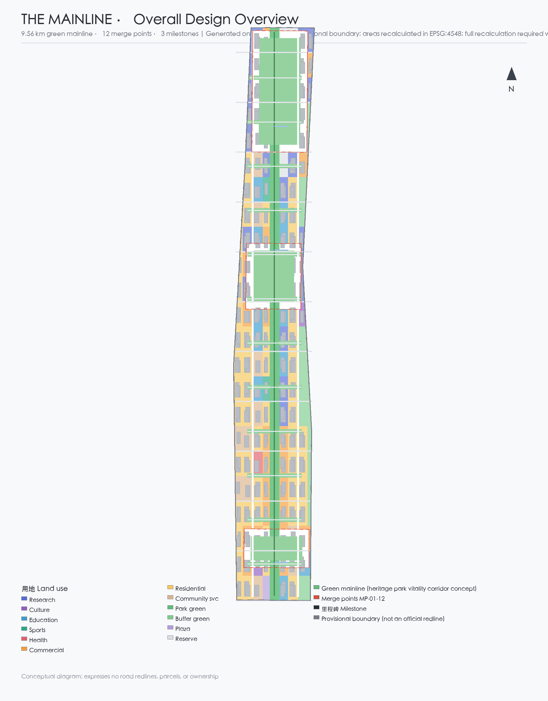
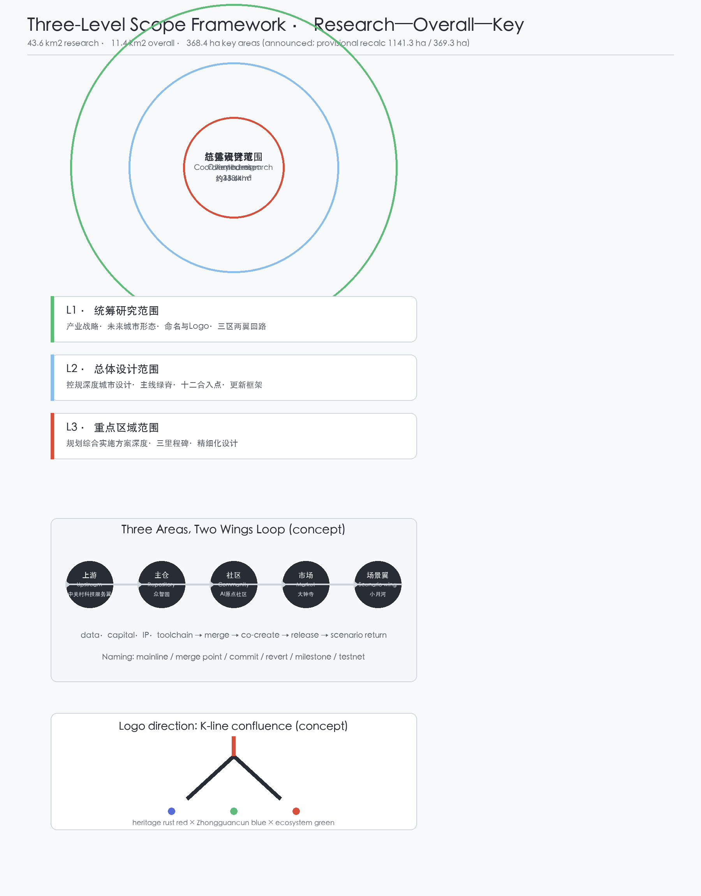
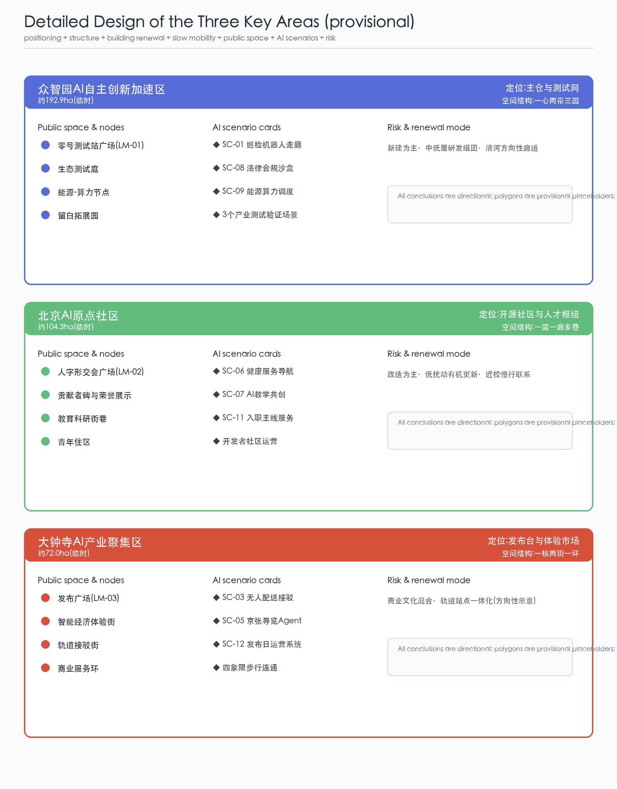
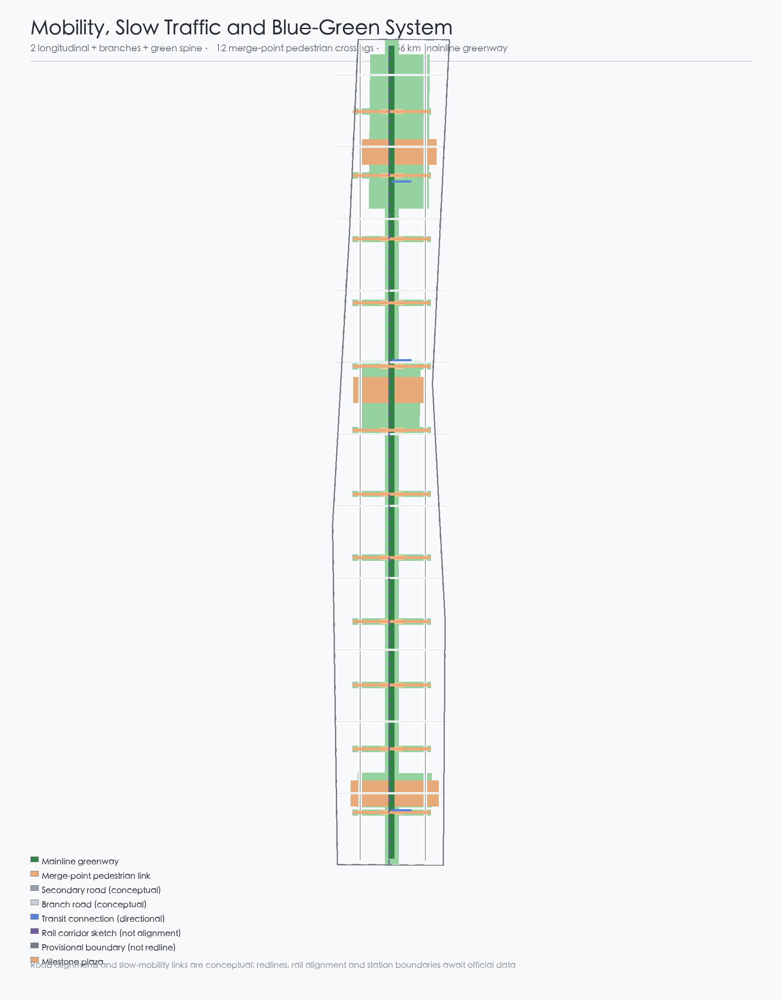
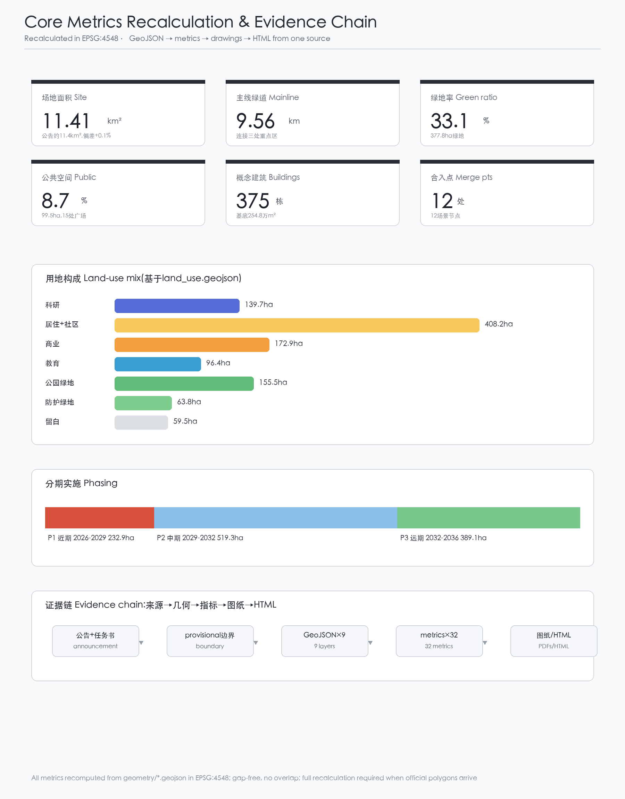

# THE MAINLINE — A City Continuously Committed to Its Open-Source Mainline

## Design Basis and Source List

This proposal takes the Qualification Pre-announcement of the International Urban Design Open Call for the Centennial Jing-Zhang AI Innovation Belt, issued by the Haidian Branch of the Beijing Municipal Commission of Planning and Natural Resources, as its primary basis; the announcement fixes the three scope levels, announced areas, text boundary descriptions, design tasks, and depth requirements [source:OFFICIAL-ANNOUNCEMENT]. The open-call taskbook extract addressed to AI agents adds the three positionings, five functions, three areas and two wings, six mandatory tasks, and ten co-creation principles, and defines the boundary of conceptual wording [source:AGENT-TASKBOOK]. The maintainer-registered provisional boundaries and key-area polygons are used only for generation, display, and intake self-check, and are not official redlines or precise-area bases [source:BOUNDARY-SOURCE]; the three key areas share the same provisional source and require a full-chain recalculation once official polygons are released [source:KEY-AREA-SOURCE]. Source fitness follows `data/source_registry.json`; only formal-ready and background sources support their corresponding claim levels, and all provisional material is labeled [source:SOURCE-REGISTRY]; `data/processed/agent_fact_pack.md` is a reading aid only and adds no authoritative conclusion [source:PROCESSED-FACT-PACK].

Global AI ecosystem cases (Kendall Square, King's Cross, Station F, one-north, Pangyo Techno Valley, Shibuya, and Vienna Smart City) are background comparisons from public materials and do not constitute official conclusions about any city; they are recorded in `sources.json` and discussed in the coordinated research section [source:CASE-KENDALL] [source:CASE-KINGS-CROSS] [source:CASE-STATION-F] [source:CASE-ONE-NORTH] [source:CASE-PANGYO] [source:CASE-SHIBUYA] [source:CASE-VIENNA].

## Three-Level Scope Framework

The three scope levels follow the announcement and taskbook: the coordinated research area (about 43.6 km2) answers industry strategy and future-city form; the overall design area (about 11.4 km2) reaches regulatory-plan urban design depth; the three key areas (about 368.4 ha combined) receive implementation-consolidation-level detailed design [source:OFFICIAL-ANNOUNCEMENT]. One grammar — mainline, merge points, milestones — runs through all levels: the innovation loop at the research level (upstream, origin repository, community, market, scenario wing), the 9.56 km green mainline with twelve merge points at the overall level, and the three milestone key areas at the detailed level [data:geometry/site_boundary.geojson#SITE-001] [data:geometry/key_areas.geojson#KA-001] [metric:site_area_sqm].

All spatial layers are generated from the repository's provisional boundary: the overall area follows `PROV-SITE-001` (recalculated 1,141.3 ha, +0.1% vs the announced about 1,140 ha), and the three key areas follow `PROV-KEY-001/002/003` (369.3 ha combined, +0.2%) [source:BOUNDARY-SOURCE]. The placeholder rectangles express neither road redlines, parcels, nor ownership; after official polygons are released, the six editable layers and all area metrics must be recalculated as a whole [metric:key_area_total_area_sqm] [metric:land_use_coverage_ratio].

## Coordinated Research Area: Industry and Future City Research

Core judgment: use the Mainline as the grammar coordinating the three areas and two wings. Naming system: primary name Jing-Zhang Mainline (THE MAINLINE); the system is built on version-control terms — mainline (overall spatial structure), merge point (east-west suturing), commit (AI scenario pilot), revert (rollback mechanism), milestone (pilgrimage landmark), testnet (Zhongzhiyuan), upstream (Zhongguancun technology-service wing), origin repository (Zhongzhiyuan full-stack system), origin community (AI Origin Community), and release (Dazhongsi smart economy district). Logo direction: Zhan Tianyou's K-line (人字形) switchback as the first fork, redrawn as two rails converging on a rising mainline with three commit nodes, in heritage rust red, Zhongguancun blue, and ecosystem green, extendable to signal, commit-graph, and sleeper textures [depth:overall_spatial_structure] [standard:PROJECT-AGENT-OPEN-CALL-TASKBOOK].

The three positionings and five functions align in one code: the heritage belt is the history layer (readable commit history), the urban AI life-experience belt is the runtime layer (the diff and interface), and the AI-integration belt is the contribution-and-merge layer; the full-stack self-reliant innovation system is carried by the Zhongzhiyuan origin repository, the world-class AI ecosystem by the Origin Community, the AI+ scenario empowerment paradigm by the testnet and sandbox, the intelligent AI-vibrant city by the running release of the mainline, and global AI governance discourse by the contributor covenant and open governance [depth:existing_conditions_diagnosis]. The loop of three areas and two wings: the Zhongguancun wing acts as upstream (data, capital, IP, toolchain), Zhongzhiyuan merges capabilities into the origin repository and runs test validation, the Origin Community organizes developer co-creation, Dazhongsi releases products into experience, and the Xiaoyue River wing returns scenario data upstream [standard:PROJECT-OFFICIAL-ANNOUNCEMENT] [metric:merge_point_count].

Transferable mechanisms from global cases (background): Kendall Square's transport-sutured innovation clustering maps to merge points plus research land; King's Cross's railway-heritage mixed blocks map to mixed functions along the green mainline; Station F's railway-warehouse entrepreneurship campus maps to the Zhongzhiyuan Testnet Station Zero; one-north's work-live-play integration maps to the Origin Community's youth-friendly mix; Pangyo's public test ground maps to the testnet and scenario-open mechanism; Shibuya's digital public space event operations map to the release plaza and event system; Vienna's participatory smart-city governance maps to the contributor covenant and human-review mechanism [source:CASE-KENDALL] [source:CASE-KINGS-CROSS] [source:CASE-STATION-F] [source:CASE-ONE-NORTH] [source:CASE-PANGYO] [source:CASE-SHIBUYA] [source:CASE-VIENNA]. All are directions for professional teams to deepen, not planning or investment conclusions.

## Overall Design Area: Urban Renewal and Regulatory-Plan-Level Urban Design

The overall design proposes a structure of one belt, twelve merge points, three milestones, and two wings: the belt is a 9.56 km green mainline spine organizing slow mobility, blue-green networks, and an AI test corridor [data:geometry/roads.geojson#RD-SPINE] [metric:mainline_greenway_length_m]; twelve merge points every ~700 m carry a scenario plaza, a suturing green connector, and a pedestrian link, embodying the east-west suturing and north-south connection logic [data:geometry/green_space.geojson#GS-MP-01] [data:geometry/public_space.geojson#PS-MP-01] [metric:east_west_connector_count]; three milestones sit in the three key areas; two wings correspond to the Zhongguancun technology-service wing and the Xiaoyue River scenario-empowerment wing [depth:land_use_layout].

Land use: research, community service, and residential west of the spine; education along the Xueyuan Road side to the east; commercial around Dazhongsi; strategic reserve at both ends [data:geometry/land_use.geojson#LU-R00-C0] [metric:lu_0802_area_sqm] [metric:lu_16_area_sqm]. Renewal is expressed in four categories — retain, renovate, new-build, reserve — with merge-point suturing districts dominated by renovation, the northern Zhongzhiyuan segment by new test facilities, and existing residential and education by retention and micro-upgrade; parcel-level conclusions require current building and ownership data and are not given here [depth:retain_renovate_demolish] [standard:MOHURD-URBAN-DESIGN-MEASURES]. At regulatory depth, FAR, height, density, green ratio, and setbacks are stated as pending until official regulatory documents arrive; this package offers only conceptual massing within conventional ranges [depth:development_intensity_controls] [standard:MOHURD-CONTROL-DETAILED-PLANNING].

## Detailed Design of Key Areas

Each key area receives a readable mini-scheme — positioning, spatial structure, building renewal, transport and slow mobility, public space, AI scenarios, and implementation risk — on the provisional polygons; all conclusions are directional [data:geometry/key_areas.geojson#KA-001] [data:geometry/key_areas.geojson#KA-002] [data:geometry/key_areas.geojson#KA-003].

**Zhongzhiyuan AI Self-Reliant Innovation Acceleration Area (provisional ~192.9 ha)**: positioned as the origin repository and testnet. Structure: one heart (Testnet Station Zero plaza), two belts (green mainline and the directional Qinghe corridor), three gardens (ecological test court, energy-compute node, reserve garden). Buildings are research and lab typologies with low-to-mid-rise conceptual massing; the Testnet Station Zero plaza (LM-01) anchors the inspection-robot corridor, the legal-compliance sandbox, and energy-compute dispatch — three industry test-and-validation scenarios [data:geometry/public_space.geojson#PS-ZY-00] [metric:lu_0802_area_sqm]. Risk: the directional Fifth Ring Road and Qinghe references need official blue-line and road data; reserve garden ownership needs confirmation.

**Beijing AI Origin Community (provisional ~104.3 ha)**: positioned as the open-source community and talent hub. Structure: one court (K-Line Confluence Plaza), one corridor (green mainline), several lanes (education-research streets toward Qinghua East Road). Buildings mix research, education, culture, and youth housing; the contributor stele and honor wall sit at the confluence plaza (LM-02) and carry developer-community and talent-service scenarios [data:geometry/public_space.geojson#PS-OC-00] [metric:lu_0804_area_sqm]. Risk: campus-adjacent coordination and education boundaries need verification; the stele design requires rights clearance and public participation.

**Dazhongsi AI Industry Cluster (provisional ~72.0 ha)**: positioned as the release stage and experience market. Structure: one core (Release Plaza), two streets (smart economy experience street and transit connection street), one loop (commercial service loop). Buildings mix commercial, cultural, and small education; the Release Plaza (LM-03) carries release-day operations, robot last-mile delivery, and the public-space privacy shield, with transit connections shown as directional [data:geometry/public_space.geojson#PS-DZ-00] [data:geometry/roads.geojson#RD-TC-01] [metric:lu_05_area_sqm]. Risk: station boundaries and transit baselines need official data; no engineering conclusions for commercial massing or underground space.

## AI Innovation Ecosystem, Personas, and AI+ Scenarios

The ecosystem is organized along the upstream—repository—community—market—scenario-wing loop, covering land (reserve and research land), space (mainline and merge points), industry (full-stack), capital (Zhongguancun), talent (Origin Community), compute (Zhongzhiyuan node), data (desensitized scenario data), and scenarios (twelve merge points) [depth:three_key_area_detailed_design] [standard:PROJECT-AGENT-OPEN-CALL-TASKBOOK].

Six personas: "Peng" the developer (open-source contributor, uses the testnet and Origin Community), "Qinghe" the entrepreneur (tenant of the repository, needs compute and scenario openness), "Lanzhi" the student-teacher (Origin Community education, co-creation space), "Aunt Li" the resident (Dazhongsi and neighborhoods, parallel human-and-digital accessibility), "Gucheng" the city operator (government and operators, contributor covenant and human review), and "Alv" the pilgrim-visitor (release season and pilgrimage week, guides and keepsakes). Full scenario-space-operation mapping lives in `compliance_matrix.json` and `visual/index.html` [metric:scenario_node_count].

Twelve AI scenario cards (SC-01 to SC-12) map to the twelve merge points, each with location, users, operating data, privacy boundary, human review, operator, and risk [data:geometry/public_space.geojson#PS-MP-01] [metric:merge_point_count]:

- SC-01 Mainline inspection-robot corridor (MP-01, industry test-and-validation): infrastructure and green-space inspection; desensitized robot data; human-reviewed fault tickets; Zhongzhiyuan operator [metric:scenario_node_count];
- SC-02 AI slow-mobility safety and accessibility assistant (MP-02, industry test-and-validation): safety assessment and voice navigation; desensitized trajectories only; human-reviewed alerts; mainline operator;
- SC-03 Robot low-speed delivery (MP-03): last-100-meter delivery in Dazhongsi; encrypted parcel and route data; human review of exceptions; logistics operator;
- SC-04 City maintenance ticket copilot (MP-04): issue detection and ticket generation; desensitized via the public data platform; human-reviewed dispatch; municipal department;
- SC-05 Jing-Zhang guide agent (MP-05): heritage narrative guiding; no personal data beyond location; content reviewed by cultural experts; culture operator;
- SC-06 Community health service navigation (MP-06): appointment and navigation; medical data stays in the authorized domain; parallel human service windows; community health agency;
- SC-07 AI teaching co-creation space (MP-07): teachers co-create lessons with AI; graded student-data consent; teacher final review; education operator;
- SC-08 Legal compliance sandbox (MP-08, industry test-and-validation): compliance pre-review for generative AI services; desensitized samples only; lawyer and regulator review; Zhongzhiyuan sandbox operator [standard:GENERATIVE-AI-INTERIM-MEASURES];
- SC-09 Energy-compute dispatch (MP-09): distributed energy and edge-compute dispatch; desensitized metering; human-reviewed dispatch orders; integrated energy operator;
- SC-10 Public-space privacy shield (MP-10): sensing-boundary prompts and anonymization; no biometrics; independent third-party spot checks; public-space operator;
- SC-11 Talent "onboarding to the mainline" service (MP-11): onboarding, housing, community integration; minimal authorized talent data; human-reviewed recommendations; talent-service agency;
- SC-12 Release-day operations system (MP-12): event operations and crowd management; aggregated anonymous flow only; human-reviewed contingency plans; event operator.

Privacy and human-review boundaries: every scenario follows minimal collection, anonymization, human review, and revertibility; public-space sensing sets privacy-shield prompts; test scenarios are not described as approved operations [standard:BARRIER-FREE-ENVIRONMENT-LAW] [standard:ELDERLY-SMART-TECH-PLAN-2020-45].

## Land Use, Building Scale, and Retain-Renovate-Demolish Strategy

Land use is partitioned on a shared lattice; adjacent parcels share boundary coordinates; coverage is gap-free and complete [data:geometry/land_use.geojson#LU-R12-C0] [metric:land_use_coverage_ratio]. Expressed in the national territorial land-use classification: research about 139.7 ha, residential plus community service about 408.2 ha, commercial about 172.9 ha, education about 96.4 ha, culture about 23.0 ha, sports about 10.1 ha, health about 7.2 ha, park green about 155.5 ha, buffer green about 63.8 ha, plaza about 5.0 ha, and reserve about 59.5 ha [metric:lu_0802_area_sqm] [metric:lu_0701_area_sqm] [metric:lu_05_area_sqm] [standard:MNR-LAND-USE-CLASSIFICATION-GUIDE]. The concept includes 375 buildings with about 2.55 million sqm footprint, inside the site; massing is conceptual pending official building inventory and controls [data:geometry/buildings.geojson#B-001] [metric:building_count] [metric:building_footprint_area_sqm] [depth:height_massing_character].

Retain-renovate-demolish logic is expressed by object type, not parcel: suturing districts dominated by renovation, northern Zhongzhiyuan by new build, the green mainline by retention and greening, and the two ends by strategic reserve [depth:retain_renovate_demolish]. Building scale, intensity, and green ratio are pending regulatory confirmation; the conceptual massing is neither planning permission nor construction basis.

## Transport, Rail, Municipal Infrastructure, and Public Services

The road system is organized as two longitudinal routes, multiple transversal branches, and one spine: two secondary roads east and west, branch roads on even lattice edges, and the green mainline as the walking and cycling spine; all twelve merge points cross the spine as pedestrian links, prioritizing daily east-west movement [data:geometry/roads.geojson#RD-NS-W] [data:geometry/roads.geojson#RD-NS-E] [data:geometry/roads.geojson#RD-BR-02] [metric:road_centerline_length_m]. Rail and connections are directional: the Jing-Zhang high-speed tunnel and existing rail corridor are sketched along the spine, with one transit connection per key area; alignment and station boundaries await official data [data:geometry/roads.geojson#RD-TC-03] [data:geometry/constraints.geojson#CON-JZ-HSR] [depth:traffic_rail_slow_parking].

Municipal and new infrastructure: distributed energy and edge-compute nodes combine with merge points; scenario data flows back desensitized through the public data platform; sewage, stormwater, power, gas, fire access, and sponge-city indicators are pending official utility data [depth:municipal_new_infrastructure]. Public services follow a 15-minute-life-circle concept with community, health, sports, and education land; baseline inventory pending verification [metric:lu_0702_area_sqm].

## Blue-Green Network, Public Space, and Urban Character

The blue-green system uses the green mainline as its skeleton: a 9.56 km greenway connects the three key areas, twelve suturing green connectors reach east and west, and the Qinghe directional reference lines the north end; blue-line positions await official data [data:geometry/green_space.geojson#GS-SPINE] [data:geometry/constraints.geojson#CON-QINGHE] [metric:green_ratio]. Fifteen public spaces — twelve merge-point plazas and three milestone plazas — total about 99.5 ha, a public-space ratio of about 8.7% [data:geometry/public_space.geojson#PS-MP-12] [metric:public_space_ratio] [metric:public_space_area_sqm].

AI public space and pilgrimage landmarks: the three milestones are the AI pilgrimage landmarks — Zhongzhiyuan Testnet Station Zero (LM-01, origin of self-reliant innovation), the Origin Community K-Line Confluence Plaza (LM-02, open-source spirit and contributor honor), and the Dazhongsi Release Plaza (LM-03, AI release); the twelve merge points form a signal-lamp walkway as the honor-display system, with commit records, merge records, and the annual Mainline Star as public narrative nodes [metric:milestone_landmark_count] [depth:blue_green_public_space]. Urban character: industrial-heritage base with a technology-life surface — rail elements and signal vocabulary along the mainline, low-to-mid-rise massing, and identifiable, revertible temporary structures; no statutory height conclusions [standard:MOHURD-URBAN-DESIGN-MEASURES]. Landmarks, signage, and the logo are conceptual directions requiring font, image, and trademark clearance before use.

## Renewal Projects, Implementation Policy, and Phasing

Project list (conceptual; dependencies and implementing bodies pending): northern mainline opening with Testnet Station Zero (Zhongzhiyuan, P1), ecological test court (P1), energy-compute node (P1), twelve merge-point suturing (P1–P3 rolling), signal-lamp walkway (P1–P3), Origin Community open-source courtyard (P2), confluence plaza with contributor stele (P2), privacy-shield demonstration street (P2), talent apartments and community services (P1–P2), Dazhongsi smart economy district (P3), Release Plaza (P3), and southern mainline opening (P3) [data:geometry/phasing.geojson#PH-01] [data:geometry/phasing.geojson#PH-02] [data:geometry/phasing.geojson#PH-03] [metric:phasing_phase1_area_sqm] [metric:phasing_phase2_area_sqm] [metric:phasing_phase3_area_sqm].

Phasing and policy: near term (2026–2029) Zhongzhiyuan and the northern mainline first, about 232.9 ha; medium term (2029–2032) complete the Origin Community and the central mainline, about 519.3 ha; long term (2032–2036) Dazhongsi and the southern mainline, about 389.1 ha [depth:phasing_implementation] [depth:renewal_project_list]. Policy mechanisms: contributor covenant (developer community), scenario-open sandbox (test admission and data desensitization), a public-space operation and maintenance fund, and public participation and disclosure; all policy, investment, and recruitment arrangements are conceptual, not confirmed government arrangements [standard:PROJECT-AGENT-OPEN-CALL-TASKBOOK].

Global AI event system and long-term operations: the annual Mainline Release Season comprises four events — Mainline Open Source Day in March, Merge Fest in June, Pilgrimage Week in September, and the State of the Mainline report in December; monthly Commit Day for developers and weekly Signal-Lamp Pop-ups for the public. Brand assets accumulate through the contributor badge system (committer—merger—maintainer) and the naming system; operations cover developer community, scenario openness, public experience routes, and landmark operations; the conversion path is pilgrimage—experience—community—settlement—financing—headquarters [depth:overall_spatial_structure] [metric:milestone_landmark_count]. All events are proposals, not confirmed arrangements.

## Metrics, Area Recalculation, and Compliance Matrix

Core metrics and their design meaning: site area 1,141.3 ha anchors the three-level check [metric:site_area_sqm]; green ratio about 33.1% (377.8 ha) and public-space ratio about 8.7% (99.5 ha) support talent living and innovation exchange [metric:green_ratio] [metric:public_space_ratio]; 375 concept buildings and 2.55 million sqm footprint express industrial space supply [metric:building_count] [metric:building_footprint_area_sqm]; the 9.56 km mainline greenway supports slow-mobility connectivity [metric:mainline_greenway_length_m]; twelve merge points and twelve scenario nodes support suturing and scenario delivery [metric:merge_point_count] [metric:scenario_node_count]; three milestones support pilgrimage and honor display [metric:milestone_landmark_count]; three phase areas (232.9/519.3/389.1 ha) support staged implementation [metric:phasing_phase1_area_sqm] [metric:phasing_phase2_area_sqm] [metric:phasing_phase3_area_sqm]. All metrics are recomputed from the GeoJSON in EPSG:4548; formulas, source files, and confidence are in `metrics.json`; the spatial check confirms gap-free coverage, no overlap, and buildings inside the site [metric:land_use_coverage_ratio] [metric:key_area_total_area_sqm].

Compliance: the 17 announcement tasks in sections 1.3–1.5 and tasks agent.1–agent.6 are mapped one-to-one in `compliance_matrix.json`; six professional standards in `standard_matrix.json`; fifteen design-depth items are marked complete in `design_depth_matrix.json`; self-check items are in `self_check.json` [depth:metrics_recalculation] [depth:risk_missing_data] [depth:three_level_scope_framework].

## Risk, Copyright, and Compliance

Boundary and data risks: all spatial conclusions rest on provisional boundaries and must not be used for precise areas, approval, or formal professional scoring before official polygons arrive; regulatory controls, road redlines, ownership, building inventory, utilities, and blue lines are pending official data and are marked accordingly [source:BOUNDARY-SOURCE] [depth:risk_missing_data]. Legal and ethical risks: all AI scenarios follow minimal collection and human review; public-space sensing sets privacy-shield prompts; generative-AI service boundaries follow the Interim Measures for the Management of Generative AI Services, and test scenarios are not described as approved operations [standard:GENERATIVE-AI-INTERIM-MEASURES]. Copyright and authorization: every cited public source is registered with its purpose boundary; logo, fonts, images, and trademarks require clearance before use; AI-generated content discloses its method, and professional humans retain final judgment [source:SOURCE-REGISTRY]. Compliance boundary: this is an open co-creation concept that does not replace statutory planning or government approval; all spatial suggestions are worded as concepts, reference schemes, or material for professional teams; the text contains no internal data, personal privacy, or uncleared material; see `report/copyright_statement.md` [standard:PROJECT-OFFICIAL-ANNOUNCEMENT] [depth:risk_missing_data].

## References

Primary human-readable materials informing this proposal; the full machine index is in `sources.json` and the three matrices:

1. Qualification Pre-announcement of the International Urban Design Open Call for the Centennial Jing-Zhang AI Innovation Belt, Haidian Branch, Beijing Municipal Commission of Planning and Natural Resources, 2026-05-09.
2. Taskbook Extract of the Open-Source Call for AI Agents, user-provided cleared document, 2026-05-18.
3. "Three Areas and Two Wings to Build a World-Class AI Hub", Beijing Municipal Science & Technology Commission / Zhongguancun Administrative Committee, 2026-04-03.
4. "Haidian Publishes the '1+X+1' Modern Industry System Layout", Haidian District People's Government, 2026-03-02.
5. Measures for the Administration of Urban Design, MOHURD, 2017-03-14.
6. Measures for the Compilation and Approval of Regulatory Detailed Plans for Cities and Towns, MOHURD.
7. Guidelines for the Classification of Land and Sea Use for Territorial Spatial Survey, Planning, and Use Control, MNR, 2023-11-22.
8. Provisional Boundary Derivation and Public-Source Verification, open-city-ai/haidian maintainers, 2026-08-07.
9. Public materials on global AI ecosystem cases (Kendall Square, King's Cross, Station F, one-north, Pangyo, Shibuya, Vienna), retrieved 2026-08-10.
10. Interim Measures for the Management of Generative AI Services, CAC and six other departments, 2023-07-13.
