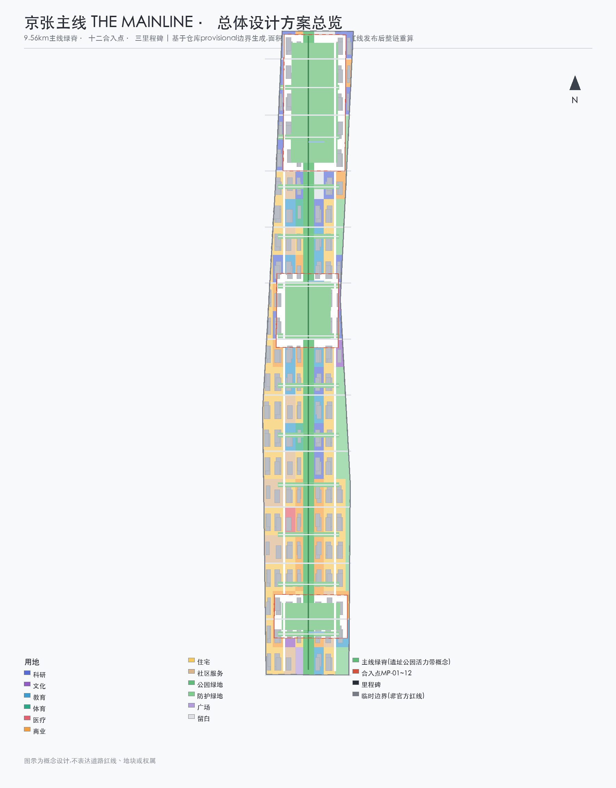
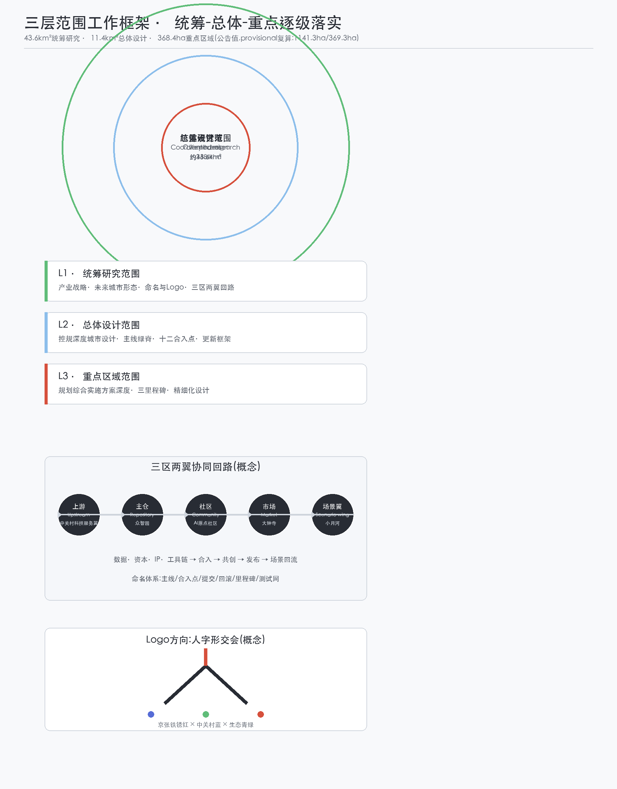
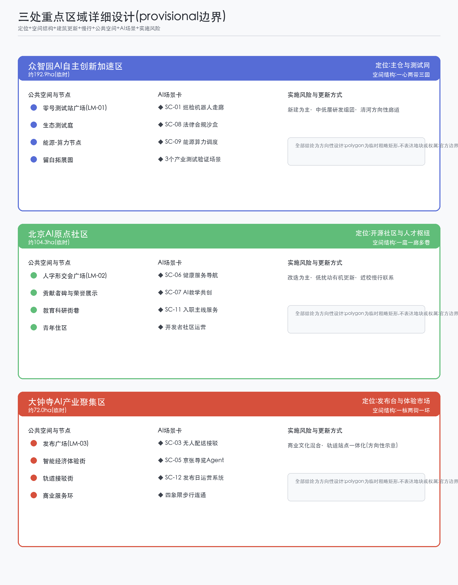
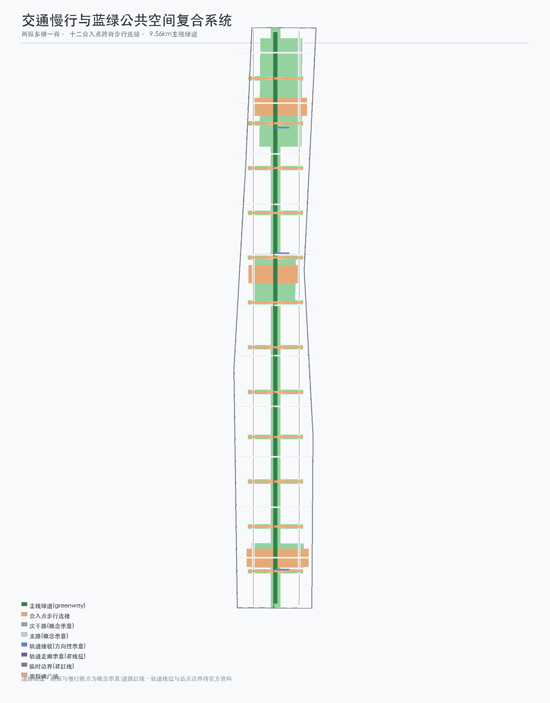
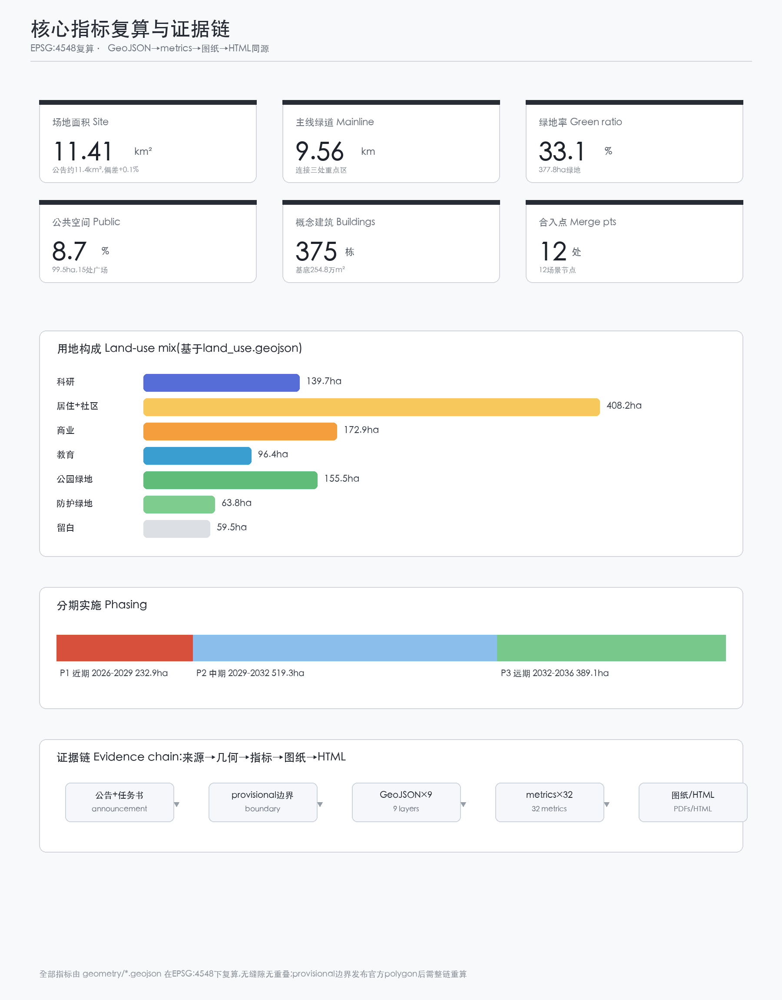

# 京张主线 THE MAINLINE——把城市当作开源主线持续提交的百年京张AI创新带城市设计方案

## 设计依据与资料清单

本方案以北京市规划和自然资源委员会海淀分局发布的《百年京张AI创新带城市设计国际方案征集资格预审公告》为第一依据,该公告确定了三层范围、约面积、文字四至、设计任务与深度要求 [source:OFFICIAL-ANNOUNCEMENT]。面向智能体的开源征集任务书摘录补充了三大定位、五大功能、三区两翼、六项必答任务与十条共创原则,并规定了概念建议的表述边界 [source:AGENT-TASKBOOK]。仓库维护者登记的临时粗略边界与三处重点区 polygon 仅用于本次生成、展示与自检,不作为官方红线或精确面积依据,官方 polygon 发布后需整链重算 [source:BOUNDARY-SOURCE] [source:KEY-AREA-SOURCE]。资料用途以 `data/source_registry.json` 为准,本方案仅把 formal-ready 与背景资料用于对应层级的判断,provisional 资料全部标注;`data/processed/agent_fact_pack.md` 只作为阅读导航层,不新增权威结论 [source:SOURCE-REGISTRY] [source:PROCESSED-FACT-PACK]。

全球 AI 创新生态案例(波士顿肯德尔广场、伦敦国王十字、巴黎 Station F、新加坡纬壹科技城、韩国板桥科技谷、东京涩谷、维也纳智慧城市)来自公开资料,作为背景性经验对照使用,不构成对任何城市的官方结论,全部登记于 `sources.json` 的 CASE-* 条目,并在「统筹研究范围」一节给出可转化机制摘要 [source:CASE-KENDALL] [source:CASE-VIENNA]。

## 三层范围工作框架

三层范围沿公告与任务书逐级落实:统筹研究范围(约43.6平方公里)回答产业战略与未来城市形态,总体设计范围(约11.4平方公里)达到控制性详细规划的城市设计深度,三处重点区域(合计约368.4公顷)开展规划综合实施方案级别的详细设计 [source:OFFICIAL-ANNOUNCEMENT]。本方案以「主线—合入点—里程碑」的统一语法贯穿三层:统筹层的创新网络(上游—主仓—社区—市场—场景翼循环)、总体层的 9.56 公里主线绿脊与十二合入点、重点层的三处里程碑 [metric:site_area_sqm] [data:geometry/site_boundary.geojson#SITE-001]。

全部空间图层基于仓库 provisional 边界生成:总体范围沿用 `PROV-SITE-001`(复算 1141.3 公顷,与公告约 1140 公顷偏差 +0.1%),三处重点区沿用 `PROV-KEY-001/002/003`(合计 369.3 公顷,偏差 +0.2%)[metric:key_area_total_area_sqm]。矩形占位边界不表达道路红线、地块或权属;官方 polygon 发布后,六个可编辑图层与全部面积类指标需整体重算,不能只替换单个边界文件 [metric:land_use_coverage_ratio]。

## 统筹研究范围产业与未来城市研究

核心判断:把「主线」作为统筹三区两翼的产业与空间语法。命名体系:主名称「京张主线」(THE MAINLINE),英文释义 The Mainline — a century-old trunk line that keeps receiving commits。命名体系以版本控制术语为骨架:主线(mainline,总体空间结构)、合入点(merge point,东西缝合口)、提交(commit,AI场景试点)、回滚(revert,可回退机制)、里程碑(milestone,朝圣地标)、测试网(testnet,众智园)、上游(upstream,中关村科技服务翼)、主仓(origin repository,众智园自主创新体系)、社区(origin community,AI原点社区)、发布(release,大钟寺智能经济街区) [depth:overall_spatial_structure]。Logo 方向:以詹天佑「人字形」交会为原型,把主线上的第一次分叉(fork)转化为「双轨交汇、三节点向上生长」的图形,配色为京张铁锈红、中关村蓝与生态青绿,可延展为信号灯、提交图与枕木纹理 [standard:PROJECT-AGENT-OPEN-CALL-TASKBOOK]。

三大定位与五大功能在同一套编码下对齐:百年京张文化带=主线历史层,都市AI生活体验带=运行层,AI融合创新带=贡献与合入层;AI全栈自主创新体系由众智园主仓承担,世界级AI创新生态由原点社区承担,AI+场景赋能新范式由测试网与沙盒承担,智能化AI活力城市由主线运行版承担,AI治理全球话语权由贡献者公约与开源治理承担 [depth:existing_conditions_diagnosis]。三区两翼协同回路:中关村科技服务翼作为上游提供数据、资本、IP 与工具链,众智园合入主仓并完成测试验证,原点社区组织开发者共创,大钟寺把成果发布为可体验产品,小月河场景赋能翼推动应用落地并回流场景数据,形成「上游—主仓—社区—市场—场景翼」闭环 [metric:merge_point_count]。

全球案例与可转化机制(背景性对照,全部案例条目见 `sources.json`):肯德尔广场以交通缝合带动产学研集聚,转化为「合入点+科研用地」布局;国王十字以铁路遗产更新形成混合街区,转化为「主线绿脊两侧功能混合」;Station F 以旧铁路仓库改造为创业单体,转化为「众智园零号测试站」功能组织;纬壹科技城以「工作-生活-玩」一体规划,转化为原点社区青年友好配置;板桥科技谷以公共测试场拉动产业,转化为「测试网+场景开放」机制;涩谷以数字公共空间承载事件运营,转化为发布广场与活动体系;维也纳以市民参与式智能城市治理,转化为贡献者公约与人工复核机制 [source:CASE-KENDALL] [source:CASE-ONE-NORTH] [source:CASE-VIENNA]。以上经验均表述为可供专业团队深化的参考方向,不构成规划或投资结论。

## 总体设计范围城市更新与控规深度城市设计

总体设计范围提出「一带、十二合入点、三里程碑、两翼」的空间结构:一带即 9.56 公里主线绿脊,沿京张遗址公园活力带方向组织慢行、蓝绿与 AI 测试廊道 [data:geometry/roads.geojson#RD-SPINE];十二合入点以约 700 米间隔跨主线设置,每个合入点由一个场景广场、一条东西缝合慢行绿带与一条步行连接组成,承载「东西缝合、南北贯通」的城市更新逻辑 [metric:east_west_connector_count] [data:geometry/public_space.geojson#PS-MP-01];三里程碑落于三处重点区;两翼在统筹层对应中关村科技服务翼与小月河场景赋能翼 [depth:land_use_layout]。

用地布局:主线绿脊为核心绿带,西侧以科研、社区服务与住区为主,东侧沿学院路一侧布置教育科研,大钟寺周边以商业服务为主,南北两端保留战略留白 [metric:lu_0802_area_sqm] [metric:lu_16_area_sqm]。更新对象按「保留—改造—新建—留白」四类表述:合入点缝合地段以改造为主,众智园北段以新建与测试设施为主,现有居住与教育功能以保留和微更新为主;拆改留结论均需现状建筑底数与权属确认,本方案不给出具体地块判定 [depth:retain_renovate_demolish] [standard:MOHURD-URBAN-DESIGN-MEASURES]。控规深度方面,容积率、建筑高度、建筑密度、绿地率与退线等法定控制条件在官方控规文件发布前一律表述为「待确认」,本方案仅给出符合经验区间的概念示意体量 [depth:development_intensity_controls] [standard:MOHURD-CONTROL-DETAILED-PLANNING]。

## 重点区域详细设计

三处重点区作为主线的三处里程碑分别开展「定位+空间结构+建筑更新+交通慢行+公共空间+AI场景+实施风险」的详细设计,全部基于临时 polygon,结论为方向性设计 [data:geometry/key_areas.geojson#KA-001] [data:geometry/key_areas.geojson#KA-003]。

**众智园AI自主创新加速区(临时约192.9公顷)**:定位为「主仓与测试网」。空间结构为「一心两带三园」:零号测试站广场为心,主线绿脊与清河方向性廊道为两带,生态测试庭、算力协同节点与留白拓展园为三园。建筑以科研用地与实验室为主,概念体量遵循经验区间,形态以中低层研发组团为主;公共空间以零号测试站广场(里程碑 LM-01)为核心,承载机器人巡检走廊、法律合规沙盒与能源-算力调度三个产业测试验证场景 [data:geometry/public_space.geojson#PS-ZY-00] [metric:lu_0802_area_sqm]。实施风险:北五环与清河方向性示意均需官方蓝线与道路资料复核,留白园需权属确认。

**北京AI原点社区(临时约104.3公顷)**:定位为「开源社区与人才枢纽」。空间结构为「一庭一廊多巷」:人字形交会广场为庭,主线绿脊为廊,近清华东路方向的教育科研街巷为多巷。建筑以科研、教育、文化与青年住区混合,贡献者碑与荣誉展示墙置于交会广场(里程碑 LM-02),承载开发者社区运营与人才服务场景 [data:geometry/public_space.geojson#PS-OC-00] [metric:lu_0804_area_sqm]。实施风险:高校周边功能协调与教育用地边界需现状核实,贡献者碑设计需完成清权与公众参与。

**大钟寺AI产业聚集区(临时约72.0公顷)**:定位为「发布台与体验市场」。空间结构为「一核两街一环」:发布广场为核,智能经济体验街与轨道接驳街为两街,商业服务环为环。建筑以商业、文化与少量教育配套混合,发布广场(里程碑 LM-03)承载发布日运营、无人配送接驳与公共空间隐私盾等场景 [data:geometry/public_space.geojson#PS-DZ-00] [metric:lu_05_area_sqm]。实施风险:轨道站点边界与公交底数待官方资料,商业体量与地下空间不给出工程结论。

## AI 创新生态、人才画像与 AI+ 场景

AI 创新生态沿「上游—主仓—社区—市场—场景翼」回路组织,要素机制覆盖土地(留白与科研用地)、空间(主线与合入点)、产业(全栈自主)、资金(中关村资本)、人才(原点社区)、算力(众智园节点)、数据(脱敏场景数据)与场景(十二合入点)八类 [depth:three_key_area_detailed_design]。

六类用户画像:开发者「大鹏」(开源贡献者,主用众智园测试网与原点社区)、创业者「青禾」(主仓入驻企业,关注算力与场景开放)、学生与教师「蓝枝」(原点社区教育科研,关注共创空间)、周边居民「李阿姨」(大钟寺与住区,关注无障碍与人工服务并行的生活体验)、城市运营者「顾城」(政府与运营方,关注贡献者公约与人工复核)、朝圣游客「阿旅」(发布季与朝圣周访客,关注导览与纪念物)。完整场景-空间-运营映射见 `compliance_matrix.json` 与 `visual/index.html` [metric:scenario_node_count]。

十二张 AI 场景卡(SC-01 至 SC-12)依次对应十二合入点,每张卡包含空间位置、服务对象、运行数据、隐私边界、人工复核、运营主体与风险 [data:geometry/public_space.geojson#PS-MP-01]:

- SC-01 主线巡检机器人走廊(MP-01,产业测试验证):基础设施与绿地巡检,机器人数据脱敏,人工复核故障单,众智园运营;
- SC-02 AI慢行安全与无障碍助手(MP-02,产业测试验证):主线慢行安全评估与语音导航,仅采集脱敏轨迹,人工复核告警,主线运营方;
- SC-03 无人低速配送接驳(MP-03):大钟寺街区最后一百米配送,包裹与路径数据加密,人工复核异常包裹,物流运营方;
- SC-04 城市运维工单Copilot(MP-04):市政问题发现与工单生成,数据经公共数据平台脱敏,人工复核派发,城市运营部门;
- SC-05 京张导览Agent(MP-05):百年文化叙事导览,不采集位置以外个人信息,内容经文化专家复核,文化运营方;
- SC-06 社区健康服务导航(MP-06):预约与导航服务,医疗数据不出授权域,人工服务窗口并行,社区卫生机构;
- SC-07 AI教学共创空间(MP-07):教师与 AI 共创教案,学生数据分级授权,教师终审,教育运营方;
- SC-08 法律合规沙盒(MP-08,产业测试验证):生成式 AI 服务的合规预审,仅用脱敏样例,律师与监管复核,众智园沙盒运营方;
- SC-09 能源-算力协同调度(MP-09):分布式能源与端侧算力调度,计量数据脱敏,人工复核调度指令,综合能源运营方;
- SC-10 公共空间隐私盾(MP-10):公共场所 AI 感知边界提示与匿名化处理,不采集生物特征,第三方抽查,公共空间运营方;
- SC-11 人才「入职主线」服务(MP-11):入职、居住与社区融入服务,人才数据最小化授权,人工复核推荐,人才服务机构;
- SC-12 发布日运营系统(MP-12):活动运营与人群管理,仅聚合匿名客流,人工复核应急预案,活动运营方。

隐私与人工复核边界:所有场景遵守「最小化采集、匿名化处理、人工复核、可回滚」四条底线,公共场所感知场景必须设置隐私盾提示,测试场景不得写成已批准运营 [standard:GENERATIVE-AI-INTERIM-MEASURES] [standard:BARRIER-FREE-ENVIRONMENT-LAW]。

## 用地、建筑规模与拆改留方案

用地布局由主线骨架格网剖分,相邻地块共享边界,全部地块覆盖场地且无缝隙 [metric:land_use_coverage_ratio]。按国土空间用地用海分类表达:科研用地约139.7公顷、居住与社区服务用地合计约408.2公顷、商业服务用地约172.9公顷、教育用地约96.4公顷、文化约23.0公顷、体育约10.1公顷、医疗约7.2公顷、公园绿地约155.5公顷、防护绿地约63.8公顷、广场约5.0公顷、留白约59.5公顷 [metric:lu_0802_area_sqm] [metric:lu_05_area_sqm] [standard:MNR-LAND-USE-CLASSIFICATION-GUIDE]。概念建筑共375栋、基底约254.8万平方米,主要分布于科研、商业与居住地块内,全部位于场地范围之内;建筑体量为概念示意,现状建筑底数、高度与层数待官方资料补齐 [metric:building_count] [data:geometry/buildings.geojson#B-001] [depth:height_massing_character]。

拆改留逻辑按对象类型表述,不给出具体地块结论:合入点缝合地段以「改造为主」,众智园北段以「新建为主」,主线绿脊沿线以「保留与绿化提升为主」,南北端留白以「战略保留」为主 [depth:retain_renovate_demolish]。建筑规模、开发强度与绿地率均标注为待控规确认,本方案的概念体量不构成规划许可或建设依据。

## 交通、轨道、市政与公共服务设施

道路系统以「两纵、多横、一脊」组织:西侧与东侧两条次干路为纵,偶数格网边界的支路为横,主线绿脊为步行与骑行主脊;十二合入点全部以步行连接跨主脊,优先保障东西向日常通行 [data:geometry/roads.geojson#RD-NS-W] [data:geometry/roads.geojson#RD-NS-E] [metric:road_centerline_length_m]。轨道与接驳按方向性示意表达:京张高铁隧道与既有轨道走廊沿主脊方向示意,三处重点区各设一条轨道接驳连接,线位与站点边界待官方资料确认 [data:geometry/roads.geojson#RD-TC-03] [depth:traffic_rail_slow_parking]。

市政与新型基础设施:分布式能源与端侧算力节点结合合入点布置,场景数据经公共数据平台脱敏回流;污水、雨水、电力、燃气、消防与海绵指标在官方管线资料补齐前全部列为待确认事项 [depth:municipal_new_infrastructure]。公共服务设施按十五分钟生活圈概念布置社区服务、医疗、体育与教育用地,现状底数待核实 [metric:lu_0702_area_sqm]。

## 蓝绿空间、公共空间与城市风貌

蓝绿系统以主线绿脊为骨架:约9.56公里绿道连接三处重点区,十二处缝合绿带向东向西延伸,清河方向性示意沿北端组织,蓝线位置待官方资料复核 [data:geometry/green_space.geojson#GS-SPINE] [metric:green_ratio]。公共空间共15处:十二合入点场景广场与三处里程碑广场,总面积约99.5公顷,公共空间比例约8.7% [data:geometry/public_space.geojson#PS-MP-12] [metric:public_space_ratio]。

AI 公共空间与朝圣地标:三处里程碑即三处 AI 朝圣地标——众智园「零号测试站」(LM-01,自主创新起源)、原点社区「人字形交会广场」(LM-02,开源精神与贡献者荣誉)、大钟寺「发布广场」(LM-03,AI 成果发布);另以十二合入点连成的「信号灯步道」作为荣誉展示体系,以提交记录、合入记录与年度主线之星三类荣誉节点构成公共叙事 [metric:milestone_landmark_count] [depth:blue_green_public_space]。城市风貌以「工业遗产底、科技生活面」为基调:主线两侧保留铁轨元素与信号灯语汇,建筑体量以中低层为主,屋顶与公共装置鼓励可识别、可回退的临时构筑,风貌控制不给出法定高度结论 [standard:MOHURD-URBAN-DESIGN-MEASURES]。地标、导视与Logo为概念方向,使用前须完成字体、图像与商标清权。

## 更新项目清单、实施政策与分期计划

更新项目清单(概念建议,依赖条件与实施主体均待确认):主线北段开放与零号测试站(众智园,P1)、众智园生态测试庭(P1)、能源-算力协同节点(P1)、十二合入点缝合工程(P1-P3 滚动)、信号灯步道(P1-P3)、原点社区开源庭院(P2)、人字形交会广场与贡献者碑(P2)、数据隐私示范街(P2)、人才公寓与社区服务设施(P1-P2)、大钟寺智能经济街区更新(P3)、发布广场(P3)、主线南段开放(P3) [data:geometry/phasing.geojson#PH-01] [metric:phasing_phase1_area_sqm]。

分期与实施政策:近期(2026-2029)以众智园与主线北段先行,面积约232.9公顷;中期(2029-2032)完善原点社区并贯通主线中段,面积约519.3公顷;远期(2032-2036)推进大钟寺街区与主线南段,面积约389.1公顷 [metric:phasing_phase2_area_sqm] [metric:phasing_phase3_area_sqm] [depth:phasing_implementation]。政策与机制建议:贡献者公约(开发者社区运营)、场景开放沙盒(测试准入与数据脱敏)、公共空间运营维护基金、公众参与与公示机制;所有政策、招商与资金安排均为概念建议,不表述为已确定政府安排 [depth:renewal_project_list]。

全球 AI 创新活动体系与长期运营:年度「主线发布季」由四大事件组成——3月主线开源日、6月合入节、9月朝圣周、12月《年度主线报告》;月度「提交日」面向开发者,周度「信号灯快闪」面向公众。品牌资产以贡献者徽章体系(提交者—合入者—维护者三级)与主线命名体系沉淀;运营机制包括开发者社区运营、场景开放运营、公共体验路线运营与城市地标运营;招引转化路径为「朝圣—体验—社区—入驻—融资—总部」六步 [metric:milestone_landmark_count] [standard:PROJECT-AGENT-OPEN-CALL-TASKBOOK]。所有活动均表述为设想,不表述为已确定安排。

## 指标体系、面积复算与合规矩阵

核心指标及其设计含义:场地面积1141.3公顷支撑三层范围复核 [metric:site_area_sqm];绿地率约33.1%(377.8公顷)与公共空间比例约8.7%(99.5公顷)共同支撑人才生活与创新交往 [metric:green_ratio] [metric:public_space_ratio];375栋概念建筑与254.8万平方米基底表达产业空间供给 [metric:building_count];9.56公里主线绿道支撑慢行连通 [metric:mainline_greenway_length_m];十二合入点支撑东西缝合与场景落地,三处里程碑支撑朝圣与荣誉展示 [metric:merge_point_count] [metric:milestone_landmark_count];三期面积(232.9/519.3/389.1公顷)支撑分期实施。全部指标由 GeoJSON 在 EPSG:4548 下复算,公式、来源文件与置信度见 `metrics.json`,空间复核结果为无缝隙、无重叠、建筑全部位于场地内 [metric:land_use_coverage_ratio]。

合规覆盖:公告 1.3、1.4、1.5 共17项任务与 agent.1 至 agent.6 六项任务逐一映射至 `compliance_matrix.json`;六项专业标准映射至 `standard_matrix.json`;十五项设计深度项全部标注为 complete 并映射至 `design_depth_matrix.json`;自检项见 `self_check.json` [depth:metrics_recalculation] [depth:risk_missing_data]。

## 风险、版权与合规说明

边界与数据风险:本方案全部空间结论基于 provisional 边界,官方 polygon 发布前不得用于精确面积、审批或正式专业评分;控规条件、道路红线、权属、现状建筑、管线与蓝线均待官方资料补齐,相关指标列为待确认 [source:BOUNDARY-SOURCE] [depth:risk_missing_data]。法律与伦理风险:所有 AI 场景遵守最小化采集与人工复核原则,公共场所感知设置隐私盾提示,生成式 AI 服务边界按《生成式人工智能服务管理暂行办法》理解,不把测试场景写成已批准运营 [standard:GENERATIVE-AI-INTERIM-MEASURES]。版权与授权:方案引用公开资料均登记来源与用途边界,Logo、字体、图像与商标使用前须完成清权;AI 生成内容已按要求披露生成方式,人类专业团队保留最终判断权 [source:SOURCE-REGISTRY]。合规边界:本方案为开放共创概念建议,不替代正式规划,不构成政府审定结论,所有空间落地建议均表述为「概念建议」「参考方案」或「可供专业团队深化研究」;全文不含未获授权之文档、个人隐私与未清权素材,版权声明详见 `report/copyright_statement.md` [standard:PROJECT-OFFICIAL-ANNOUNCEMENT]。

## 参考资料

以下为主要影响本方案判断的人类可读资料,完整机器索引以 `sources.json` 与三个矩阵文件为准 [source:SITE-PACKAGE]:

1. 《百年京张AI创新带城市设计国际方案征集资格预审公告》,北京市规划和自然资源委员会海淀分局,2026-05-09。
2. 《面向全球智能体开展百年京张AI创新带城市设计开源征集任务书摘录》,用户提供清权文件,2026-05-18。
3. 《"三区两翼"打造世界级AI集聚地》,北京市科学技术委员会、中关村科技园区管理委员会,2026-04-03。
4. 《海淀区发布"1+X+1"现代化产业体系建设布局》,北京市海淀区人民政府,2026-03-02。
5. 《城市设计管理办法》,住房和城乡建设部,2017-03-14。
6. 《城市、镇控制性详细规划编制审批办法》,住房和城乡建设部。
7. 《国土空间调查、规划、用途管制用地用海分类指南》,自然资源部,2023-11-22。
8. 《临时边界推定与公开来源核查》,open-city-ai/haidian 仓库维护者,2026-08-07。
9. 全球 AI 创新生态案例公开资料(肯德尔广场、国王十字、Station F、纬壹科技城、板桥、涩谷、维也纳),2026-08-10 检索。
10. 《生成式人工智能服务管理暂行办法》,国家网信办等七部门,2023-07-13。
