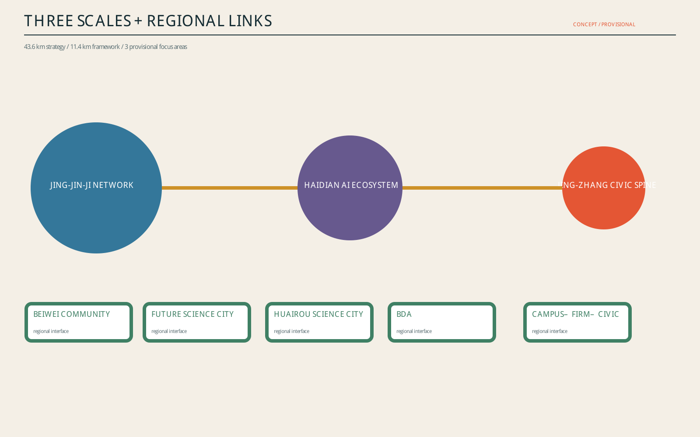
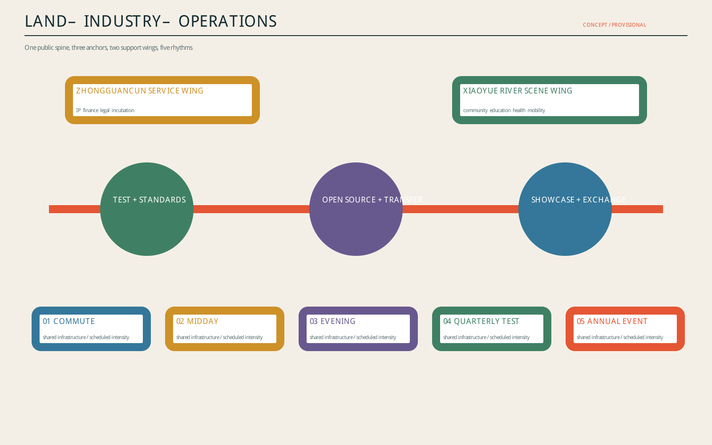
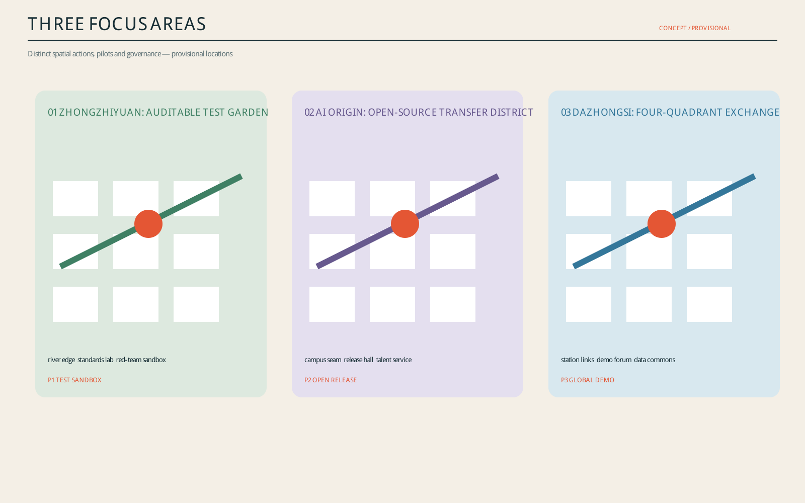
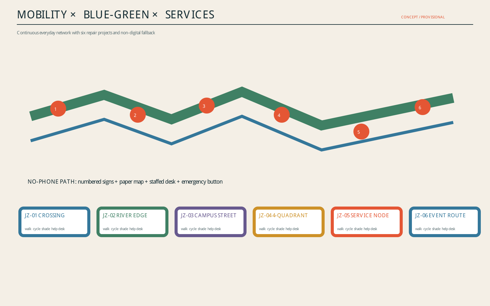
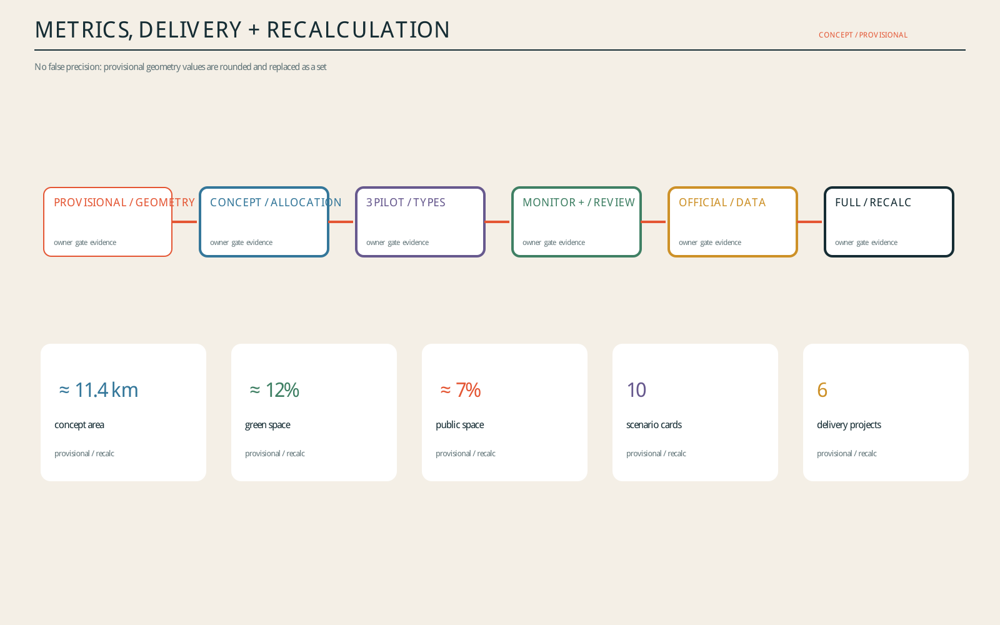

# Jing-Zhang Civic Rhythm: AI Innovation as Everyday Time Infrastructure
## Executive proposition
The proposal delivers one civic spine, three differentiated anchors, two support wings and five time protocols. Shared mobility, blue-green, service and edge-compute infrastructure switches between commute, midday, evening, quarterly testing and annual events. All locations and quantities are conceptual under provisional geometry and will be recalculated as one system when official data arrives.

## Three scales and regional coordination

The 43.6 km² strategic layer connects the Jing-Jin-Ji innovation network; the ≈11.4 km² framework organises the civic spine; three provisional focus areas test detailed actions. Beiwei Community, Future Science City, Huairou Science City and BDA are defined as case, talent, testing and transfer interfaces.

## Industry–space–operations loop

Zhongzhiyuan hosts auditable testing and standards; AI Origin hosts open-source collaboration and transfer; Dazhongsi hosts demonstration, consumption and international exchange. The Zhongguancun wing supplies IP, finance, legal and incubation services; the Xiaoyue River wing turns education, health, mobility and community services into open scenes.

## Five time protocols

Weekdays prioritise continuous commuting; midday activates shared tables and short demos; evenings use low light, low noise and sectional closure; quarterly tests use booking, isolation, human review and stop conditions; annual events use segmented capacity, resident hotlines and post-event reuse evaluation.

## Three focus areas

Zhongzhiyuan becomes an auditable test garden; AI Origin an open-source transfer district; Dazhongsi a four-quadrant exchange station. Each includes a staffed desk and a no-phone route.

## Public interest and inclusion

Every digital service has numbered signs, paper maps, staffed desks and telephone alternatives. Older people, children, disabled users, low-digital-literacy users and service workers are included in testing. Users can refuse digital routes, request human takeover, correct or exit.

## Delivery framework

Six projects move through lightweight pilots, district renewal and long-term governance. Each has a suggested role, indicative cost band, approval checkpoint, pilot scale, acceptance metric, community monitoring and exit mechanism. Suggested roles are not confirmed implementers.

## Identity and civic experience

The identity combines a railway timetable line with a civic pulse: one continuous trace crosses three dots for test, collaborate and exchange. Components include the Rhythm Beacon, Contribution Wall and Mobile Service Desk. Wayfinding uses colour, number and bilingual text.

## Risk and status

Official boundaries, focus-area polygons, statutory controls, road lines, rail engineering, ownership, utilities, flood, fire, heritage and existing-building data are unavailable. This is a conceptual reference. ≈11.4 km², ≈12% and ≈7% are rounded provisional values, not statutory metrics.

## Ten auditable scenario cards

|ID|Scene|Location|Users|Data minimisation|AI|Human review|Suggested operator|Risk|Exit / no-digital fallback|KPI|
|---|---|---|---|---|---|---|---|---|---|---|
|S01|Open Release Hall|AI Origin|developers, universities|public registration; aggregate counts|retrieval + interpretation|host release check|community operator (proposed)|misquote / leakage|withdrawal + offline agenda|projects / correction time|
|S02|Safety Sandbox|Zhongzhiyuan|firms, regulators, public|authorised test set; minimal logs|red-team + explanation|safety officer release|joint lab (proposed)|model overreach|isolation + immediate stop|closure rate|
|S03|Edge Compute Station|service nodes|residents, startups|device status; no tracking|edge inference + queue|staff review|facility operator (proposed)|energy / misuse|quota + physical disconnect|energy / uptime|
|S04|Accessible Navigation|civic spine|all walkers|anonymous counts; manual reports|route assistance|staffed hotline|park ops (proposed)|misdirection / exclusion|paper map + numbered signs|detour / complaints|
|S05|Global Demo Forum|Dazhongsi|firms, visitors|authorised demo assets|interpretation + media index|host editorial check|event operator (proposed)|rights / mistranslation|remove asset + human translator|leads / corrections|
|S06|Low-carbon River Walk|Zhongzhiyuan|residents, researchers|environment sensors; no identity|runoff + energy prompts|maintenance check|park ops (proposed)|sensor error|disable automation|comfort / energy|
|S07|Campus Transfer Street|AI Origin|students, founders|voluntary project data|service matching|legal + mentor review|transfer platform (proposed)|conflict of interest|human choice + exit|transfer time|
|S08|Data Commons Forum|Dazhongsi|firms, public|authorised demo data only|audit-chain display|compliance approval|platform (proposed)|expired consent|immediate takedown|authorisation completeness|
|S09|Inclusive Service Street|Xiaoyue wing|older people, children, disabled users|minimum service data|assisted Q&A + booking|staffed window confirms|community service (proposed)|bias / bad advice|no-phone window + exit|human takeover / satisfaction|
|S10|Global AI Week Route|spine + anchors|public, global visitors|minimal ticket fields; aggregate flow|routing + multilingual guide|control desk review|joint host (proposed)|crowding / noise|section closure + hotline|peak density / reuse|

## Six-project delivery matrix

|Project|Phase|Suggested role|Cost|Approval gate|Pilot|Acceptance|Community monitoring|Stop condition|
|---|---|---|---|---|---|---|---|---|
|JZ-01 crossing|near|mobility/park ops|S|traffic + accessibility|one break / 90 days|detour + safety|complaints|close on safety event|
|JZ-02 river edge|near-mid|park + river specialists|M|flood + ecology|300 m|comfort + runoff|noise/ecology|withdraw if flood gate fails|
|JZ-03 transfer street|mid|renewal platform|M|ownership + frontage|one block|vacancy + transfer time|rent/residents|pause on displacement|
|JZ-04 quadrants|mid-long|rail/mobility specialists|L|rail/utilities/fire|one surface crossing first|transfer + safety|peak density|retain surface-only option|
|JZ-05 service nodes|near|service operator|S|energy/network/data|three mobile nodes|takeover + uptime|inclusive tests|disconnect on privacy/energy event|
|JZ-06 event route|annual|joint host|S-M|permit/capacity/copyright|one week|density + reuse|resident hotline|section closure threshold|
