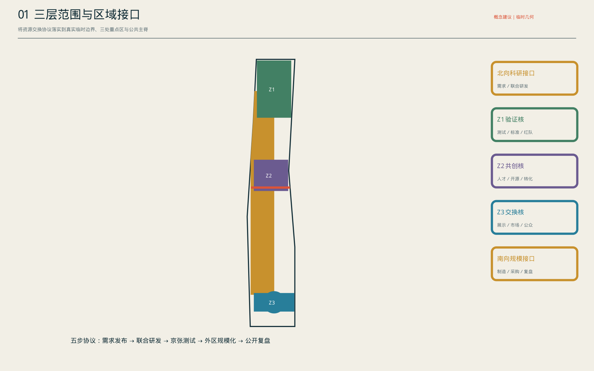
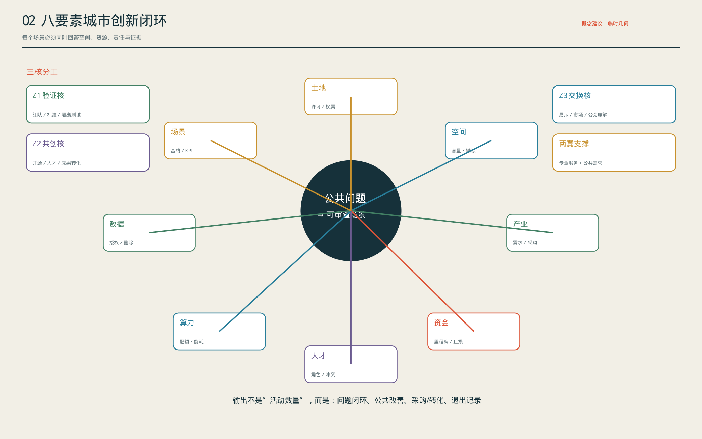
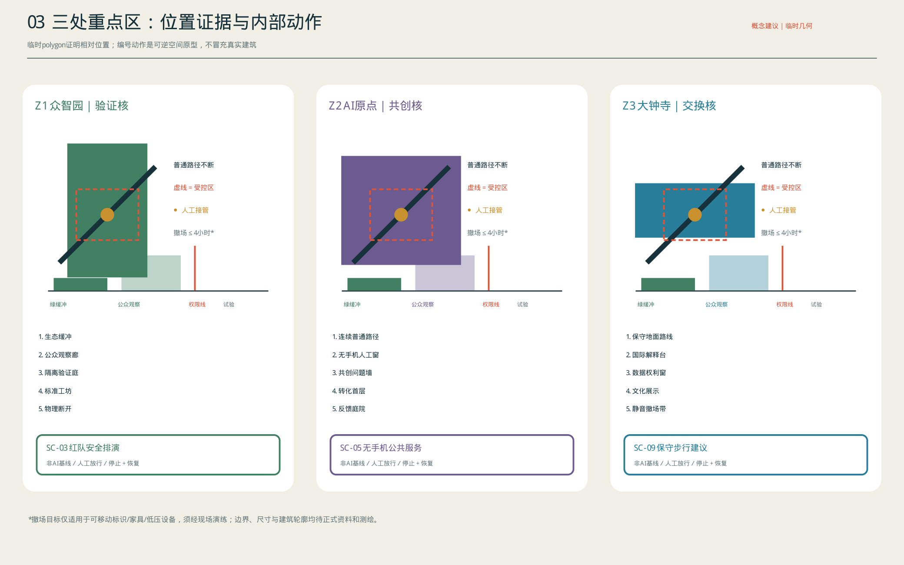
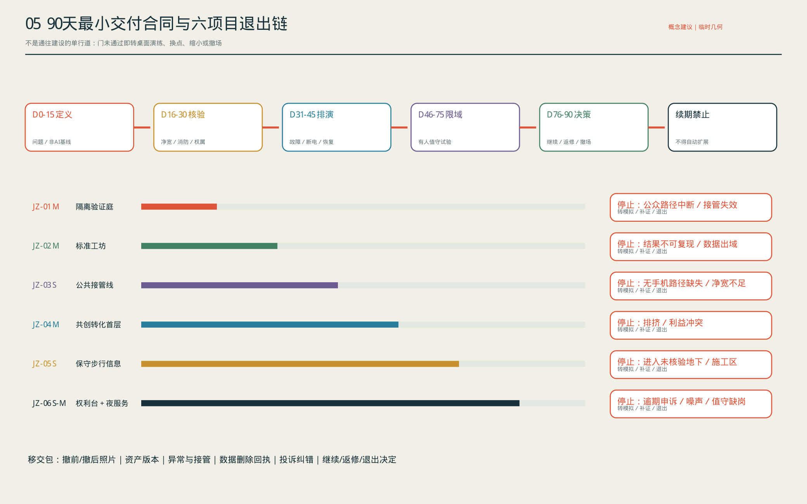
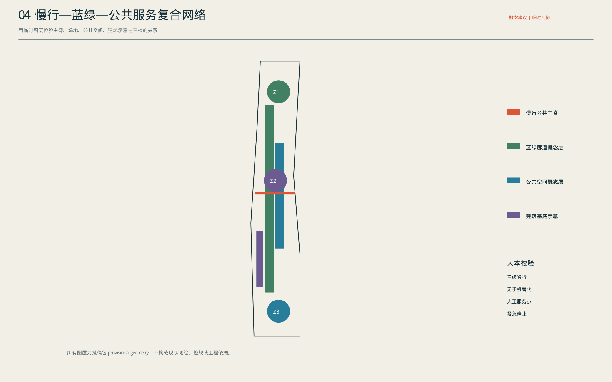

# 京张节律场 v2｜城市试验操作系统

状态：本地深化稿，不上传，不构成正式规划、实施承诺或官方认可。

## 设计依据与资料清单

本稿依据公开任务书、仓库标准快照、来源登记和投稿包 provisional GeoJSON 深化。SITE_BOUNDARY、KEY_AREA、道路、绿地、公共空间、建筑和分期图层均非官方红线或现状测绘，只用于概念关系、复算流程和专业讨论；正式资料到位后必须整体重算 [source:OFFICIAL-ANNOUNCEMENT] [source:AGENT-TASKBOOK] [source:BOUNDARY-SOURCE]。

证据分为四级：公开公告与智能体任务书界定任务和范围；标准矩阵说明适用原则但不虚构审批结论；临时几何支持拓扑、面积和图件流程；案例只校正机制。现状访谈、企业名录、客流、产权、建筑安全、地下管线和社区需求均尚待补齐，故涉及这些内容的主体、数量、容量与成本只写建议或unknown。资料替换不是局部改图：边界、重点区、用地、道路、绿地、公共空间、建筑、分期、指标、PDF、HTML和manifest必须作为同一依赖集合复算与复核 [data:geometry/site_boundary.geojson#SITE-001] [standard:PROJECT-OFFICIAL-ANNOUNCEMENT]。

## 三层范围工作框架

工作采用“统筹研究—总体设计—重点区域”三级递进：约43.6平方公里统筹研究范围用于识别区域产业、科研、教育与公共服务交换，不据此虚构建设边界；约11.4平方公里总体设计范围用于组织公共主脊、三核、两翼、慢行蓝绿网络与六个更新项目；众智园、AI原点社区和大钟寺三处重点区域进入空间原型、权限边界、服务旅程与可逆试点深度。三级成果通过统一的项目ID、场景ID、指标与来源标签关联，避免宏观愿景和局部设计互不支撑 [scope:coordination] [scope:overall] [scope:key-areas]。

正式测绘、权属、控规、轨道保护、道路红线、防洪、消防、文保和市政容量尚未取得，因此范围面积和图形仅用于工作流程。后续每替换一项正式资料，都必须触发面积、比例、项目边界、成本与风险的整体复算；在复算完成前，不把示意值写成审批指标或实施承诺 [depth:metrics_recalculation] [risk:provisional-geometry]。

## 1. 核心判断

京张创新带的稀缺性不在“再造一个AI园区”，而在于它同时拥有铁路遗产形成的连续公共空间、海淀高密度科研与教育资源、三处条件差异明显的创新节点，以及可被日常生活持续检验的城市界面。方案因此不以地标群或产业口号为核心，而把京张遗址公园定义为一套可治理的“城市试验操作系统”：公共空间是接口，三个锚点是不同权限的试验环境，五种时间协议是资源调度方式，六个更新项目是可撤回的空间载体，数据与人工治理共同构成安全边界。

一句话命题：**让AI创新从封闭园区进入可选择、可质疑、可退出的城市日常，并让每一次试验反向改善真实公共空间。**

## 2. 四层空间系统

### 2.1 区域交换层：四类资源而非四个地名

- 未来科学城：生命科学、能源与科研设施需求接口。
- 怀柔科学城：大科学装置、科学传播与高端仪器接口。
- 经开区：机器人、自动驾驶和规模化制造接口。
- 京津冀高校及创新节点：人才交换、联合课程和成果转化接口。

区域层不画虚假物流线，而建立“需求发布—联合研发—京张测试—外区规模化—公开复盘”的五步交换协议。每条关系必须对应资源类型、进入条件、负责角色、数据边界和结果去向。

### 2.2 总体结构层：一脊、三核、两翼、六门

- 一脊：连续慢行、蓝绿、文化叙事与公共服务复合的京张公共主脊。
- 三核：众智园“验证核”、AI原点“共创核”、大钟寺“交换核”。
- 两翼：中关村科技服务翼提供法务、知识产权、金融、孵化；小月河公共场景翼提供教育、健康、交通与社区需求。
- 六门：JZ-01至JZ-06不是六个孤立项目，而是六种进入城市试验系统的门槛：安全、生态、转化、交通、服务、活动。

## 重点区域详细设计

三处重点区不是同一套“科技园语言”的复制，而以不同空间原型承接不同风险与人群。众智园约束高风险验证的边界和观察关系；AI原点社区把校园、社区、转化服务与可转换首层缝合；大钟寺优先修复地面连通，再叠加国际交流、权利解释和夜间服务。每处均明确日常公众路径、受控测试路径、人工服务、紧急停止、90天首期动作和扩展前置条件 [scope:key-areas] [depth:key-area-design]。

由于现有重点区polygon为临时几何，图中内部动作只表达拓扑关系，不冒充真实建筑轮廓。进入下一阶段前必须补齐实测地形、建筑/结构、权属、首层使用、出入口、消防、轨道及水务条件，并邀请真实使用者开展步行与无障碍审计；任何关键条件不成立时，原型须缩小、平移、转为室内/离线测试或退出。

### 2.3 三个重点区：三种不同空间原型

#### 众智园｜可审计测试花园

空间由清河生态缓冲、可断开的试验庭院、标准工坊、红队观察廊和低碳算力廊组成。公众路径与受控测试路径物理分离但视觉可理解；每项测试显示目的、期限、责任角色、数据类型和停止条件。它解决“技术在哪里被安全验证”的问题。

#### AI原点社区｜开源转化街区

以校园—社区缝合路径为骨架，将发布厅、开放工位、导师/法务窗口、小试生产和公共反馈嵌入可转换首层。项目必须经历“公开问题—原型—社区测试—权利确认—转化选择”，避免发布活动与真实转化脱节。它解决“知识如何变成公共价值与产业成果”的问题。

#### 大钟寺｜城市交换站

先以地面连续过街、四象限编号导视和可移动活动平台修复站城割裂，再以国际路演客厅、数据权利会客厅、文化展示和夜间服务形成高可见度交换界面。大型工程未核验前不做地下连通承诺。它解决“创新如何被公众理解、被市场发现并与城市文化交换”的问题。

### 2.4 微观组件层

- 节律柱：显示开放状态、容量、服务与停止原因，不做人脸识别。
- 贡献墙：展示经授权的个人/团队贡献，提供撤回和更正机制。
- 移动服务台：人工咨询、纸质地图、无障碍设备和紧急中止。
- 试验边界带：用颜色、编号、触觉与文字共同标识权限变化。
- 可撤算力柜：限额、断网、物理关停、能耗显示与责任人签字。

## 统筹研究范围产业与未来城市研究

统筹研究不以罗列园区为结论，而追踪“需求从哪里产生、由谁联合研发、在哪里以何种权限测试、如何形成采购或产业转化、结果怎样回到公共投资”的闭环。未来科学城、怀柔科学城、经开区和京津冀高校分别提供生命科学与能源需求、大科学装置与传播、机器人与规模制造、人才与联合课程接口；京张承担公共可见、风险可控、结果可复盘的真实城市测试。每条区域联系都必须登记资源类型、进入条件、负责角色、数据边界和结果去向 [agent.1] [mechanism:regional-exchange]。

未来城市研究以五种时间协议、三类权限环境和八要素审计替代泛化“智慧城市”。通勤、午间、夜间、季度测试与年度活动分别控制通行优先、开放强度、照明噪声、红队与事故披露、峰值容量和活动后复用。验证核、共创核、交换核分别承担安全验证、知识转化和公众/市场交换，防止同一空间同时承担互相冲突的高风险试验和无条件公共开放 [agent.2] [protocol:time]。

[source:AGENT-TASKBOOK] [depth:regional_industry_future_city] [data:geometry/key_areas.geojson#KEY-001]

## 3. 八要素产业—城市闭环

|要素|空间载体|机制|必须产生的证据|
|---|---|---|---|
|土地|可转换首层、公共廊道、临时场地|短周期许可与用途复核|权属/许可状态|
|空间|三核、两翼、六门|按风险分级开放|容量、可达性、撤除路径|
|产业|开发者、企业、公共服务方|问题制开放场景|需求单、原型和采购/转化结果|
|资金|试验、小额采购、社会合作|分阶段拨付|成本带、里程碑和停止损失|
|人才|高校、居民、专业审查者|项目制流动而非永久标签|角色、技能、利益冲突披露|
|算力|端侧柜与受控沙盒|配额、能耗和物理断开|使用量、能耗、异常记录|
|数据|公开、授权、传感与反馈数据|最小化、分级、到期删除|来源、授权、保存期、访问日志|
|场景|交通、教育、健康、社区、活动|90天试验—复盘—扩展/退出|基线、KPI、投诉、人工接管|

闭环不是“八个名词齐全”，而是每个场景必须同时回答八个要素；缺少任一关键前提时只能停留在模拟或离线测试。

## 4. 五种时间协议

时间协议控制空间强度、权限与责任，而不是活动日历：

1. 通勤协议：连续通行优先，任何试验不得侵占无障碍净宽。
2. 午间协议：低门槛交流，公开内容与商业推介分区。
3. 夜间协议：低照度、低噪声、分段关闭，人工服务不晚于数字服务结束。
4. 季度测试协议：预约、隔离、红队、人工放行、24小时内事故披露。
5. 年度活动协议：分段容量、居民热线、临时交通、活动后30/90天复用评估。

## AI 创新生态、人才画像与 AI+ 场景

人才不是单一“高端人才”画像，而是由问题提出者、开发者、数据/模型责任人、交通与生态工程师、社会工作者、无障碍测试者、版权和法务人员、红队、居民观察员、运营值守与采购/转化角色组成的协作网络。每个角色须说明技能、权利、利益冲突、可访问数据和最终责任；居民和一线人员不作为免费测试素材，参与应有知情、合理补偿与撤回机制 [agent.3] [governance:roles]。

AI+场景采用风险分级：公开信息和导览为低风险，可在人工抽检下运行；路径建议、服务问答与环境控制为中风险，必须有来源时间戳、监控和即时接管；资格、健康、安全、个人权利等高风险决定不交给模型。算力采用限额、能耗计量、网络隔离和物理关停，数据采用最小化、用途限定、到期删除和访问日志。三项旗舰场景共同检验“技术性能—城市空间—公共权利—产业转化”是否闭环 [agent.4] [ai:risk-tiering]。

[source:AGENT-TASKBOOK] [depth:ai_scenarios] [data:geometry/public_space.geojson#PUBLIC-001]

## 5. 三个旗舰测试场景

### T1 行人数字孪生与无障碍修复

对象不是“智能导航App”，而是道路、施工、坡度、遮荫、积水、拥挤和人工报障共同构成的步行环境模型。匿名计数与人工巡查形成基线；算法只推荐路径，不能关闭真实通道。盲人、轮椅使用者、老人和无手机用户共同参加测试。成功标准包括绕行下降、错误建议率、人工接管时长和投诉闭环；一次严重安全误导即暂停。

### T2 公共服务小模型与人工接管

在小月河翼与移动服务台测试教育、养老、活动预约等低风险问答。模型只读取公开服务知识库，不做资格最终判断；每条建议展示来源与更新时间。人工窗口拥有最终决定权，用户可不留数字记录。成功标准不是自动化率，而是一次解决率、错误建议率、人工接管满意度和弱势用户可达性。

### T3 城市AI安全与权利沙盒

众智园设置隔离测试环境，企业提交模型卡、数据说明、预期用途和禁用场景；居民代表、专业人员和红队共同测试偏差、越权、解释与退出。任何真实个人数据进入前须完成授权与最小化复核。结果以问题类型和修复状态公开，不公开敏感漏洞。成功标准为严重问题发现率、修复闭环、重复问题下降和公众理解度。

## 更新项目清单、实施政策与分期计划

实施采用“0基线与补证—1可逆试点—2条件扩展—3长期运营”四期。第0期只建立资料清单、责任角色、基线与许可路径；第1期使用临时导视、可移动服务台、可撤遮荫雨洪单元和隔离沙盒，期限原则上90天；第2期仅在安全、生态、公平、使用和许可门槛同时满足后扩大；第3期把维护、能耗、数据删除、投诉与30/90天复盘写入运营。任何项目未通过门槛均可补证、缩小、转模拟或退出 [agent.5] [delivery:phasing]。

政策工具包括短周期场地许可、里程碑小额采购、数据与模型卡、社区影响登记、无数字替代、独立红队、居民观察员和阶段止损。资金不先绑定大体量建设，而对应基线、试点、修复与扩展里程碑；成本以待正式工程条件核验的区间管理，不在资料不足时伪造工程造价。六个项目构成项目组合：JZ-01和JZ-04先修复连通，JZ-02提供生态舒适基底，JZ-03承担转化，JZ-05提供普惠服务，JZ-06验证年度运营 [agent.6] [policy:reversible-procurement]。

参与主体按阶段明确：建议由政府相关部门负责许可与公共责任边界，企业和高校团队负责原型与技术修复，社区、居民观察员及无障碍使用者参与需求确认和影响评估，专业维护者负责设备、能源和应急接管。每期以可衡量指标验收，至少监测安全事件、错误率、人工接管时长、满意度、投诉闭环、能耗、设施复用比例和转化结果；指标未达阈值不进入下一阶段。

[source:AGENT-TASKBOOK] [depth:phasing_implementation] [data:geometry/phasing.geojson#PHASE-001]

## 6. 六项目决策逻辑与首个90天交付合同

每个项目依次通过“必要性—数据—许可—试点—公共影响—扩展”六道门。未通过时选择补证、缩小、转为模拟或退出，不自动进入下一阶段。

|项目|先解决的问题|首个可逆动作|扩展条件|停止条件|
|---|---|---|---|---|
|JZ-01慢行断点|真实绕行与危险|临时过街/导视，90天|绕行与冲突下降|严重安全事件|
|JZ-02清河界面|生态与舒适连续性|300m可撤遮荫/雨洪单元|防洪生态核验通过|水安全或生态恶化|
|JZ-03近校转化街|成果转化断链|一个首层服务单元|权属、需求和排挤监测通过|租金排挤或利益冲突|
|JZ-04四象限连通|站城割裂|地面编号与过街测试|客流、安全与工程条件通过|轨道/消防条件不满足|
|JZ-05服务节点|数字服务排斥|三个移动人工服务台|接管有效、能耗隐私可控|隐私、歧视或能耗异常|
|JZ-06活动路线|活动与日常脱节|一周分段活动|30/90天设施复用成立|拥挤、噪声或居民影响超阈|

首个交付不是整条创新带，也不是新的永久建筑，而是 **Z2一段100—200米公共接管线＋一个无手机人工服务点**。第0—15天只关闭需求、非AI基线、数据字段、责任角色和无障碍共测计划；第16—30天核验净宽、消防、权属、用电和居民影响；第31—45天完成故障、断电、人工接管、删除和场地恢复演练；第46—75天才允许限时、有人值守的公众试验；第76—90天必须作出继续、返修或撤场决定，禁止自动续期。任一门失败即回到桌面演练、换点、缩小或取消 [data:visual/assets/implementation-contract.json#first_90_days]。

责任链采用概念性RACI而不伪造已任命主体：公共空间设计、数据管理员、现场经理和独立评估角色分别承担执行；场地、数据、运营与授权责任主体均保持“待任命”；无障碍共测者、消防/工程、法务/隐私、一线人员与居民代表进入协商；受影响公众获得知情。六个项目分别登记成本量级S/M、前置条件、验收和退出，成本量级仅用于采购路径判断，不是报价 [data:visual/assets/implementation-contract.json#projects]。

## 7. 公共治理与权利

每个场景公开六项权利：知情、拒绝、人工接管、更正、申诉、退出。投诉分为即时安全、服务错误、数据权利和社区影响四类，分别设置响应时限。项目治理采用“建议运营角色+独立审查+居民观察员”三角结构；任何角色均不在资料不足时写成已确定实施主体。

## 8. 案例研究使用原则

案例只用于验证机制，不用于宣称同等条件。重点比较：Helsinki Innovation Districts 的敏捷试点与投资反馈、Helsinki mobility digital twin 的多源数据与步行环境模型、Kalasatama 的生活时间目标与共同创造、Punggol Digital District 的产业—校园—基础设施整合、Barcelona 22@ 的产业更新与居住公平争议、新加坡监管沙盒的分级试验、Montreal/Paris 等创新城区的公共空间与社区治理。正式稿需逐项登记官方来源、日期、许可、可迁移机制和不可照搬条件。

## 9. 五张主图必须回答的问题

1. 区域与三层范围图：资源从哪里来、到哪里验证、如何返回。
2. 总体结构与八要素闭环图：空间节点如何驱动产业与公共价值。
3. 三重点区详图：真实内部动作、权限边界、日常路径和试验路径。
4. 慢行蓝绿与人群旅程图：不同人群如何完成服务、拒绝与求助。
5. 项目决策与证据链图：六项目怎样从试点走向扩展或退出。

五图不得复用同一构图；每图必须有独立图例、编号、证据、限制和下一步数据需求。

## 10. 十二个场景运行契约与八要素审计

|ID|场景与空间|土地/空间前提|产业/资金|人才/算力|数据边界|人工复核与退出|核心KPI|
|---|---|---|---|---|---|---|---|
|S01|Z2开源发布厅|可转换首层、活动许可|社区运营、小额活动预算|开发者、编辑、同传端侧算力|公开议程与授权材料；不采个人轨迹|主持人终审；撤稿和线下议程|纠错时长、授权完整率|
|S02|Z1安全权利沙盒|隔离庭院、受控网络|联合实验、分阶段测试费|红队、安全官、居民观察员|授权测试集、最小日志、到期删除|安全官放行；严重越权立即断开|严重问题发现与闭环率|
|S03|JZ-05端侧算力站|可撤柜体、能源消防核验|设施运营、配额制服务|值守员、维护员、边缘算力|设备状态和聚合用量；不采身份|人工确认；能耗/滥用触发物理关停|单位服务能耗、可用率|
|S04|T1行人数字孪生|慢行主脊、无障碍连续性|公园运维、试验采购|交通工程师、无障碍测试员|路况、施工、天气、匿名流量与人工报障|热线复核；严重误导暂停|错误路径率、接管时长、绕行变化|
|S05|Z3国际路演客厅|地面可达、活动容量|活动运营、赞助与票务分离|策展、翻译、版权审核|仅使用获授权演示与最小票务字段|编辑/版权终审；素材下架和人工翻译|转化线索质量、纠错率|
|S06|JZ-02清河低碳廊|防洪生态核验、可撤单元|园区运维、绿色试验资金|生态/水务专业人员|环境传感、不采身份、公开校准状态|专业人员确认；失准或生态影响即停|舒适时长、雨洪表现、误差率|
|S07|JZ-03近校转化街|权属、首层用途和租金基线|转化平台、里程碑资金|导师、法务、创业团队|团队主动提交的项目资料|利益冲突披露；人工选择与退出|转化周期、排挤效应、存活率|
|S08|Z3数据权利会客厅|公众可见展示界面|合规服务、公共教育预算|合规官、数据提供方|只展示授权范围和审计链，不展示敏感数据|合规官批准；授权失效立即下架|授权完备率、公众理解度|
|S09|T2公共服务小模型|移动人工窗口与无手机入口|社区服务、有限试点采购|社会工作者、服务人员、小模型|公开知识库、来源时间戳、无默认留存|人工最终决定；用户拒绝/纠错/退出|一次解决率、错误率、接管满意度|
|S10|JZ-06全球活动周|分段容量、交通和居民影响核验|联合主办、活动后复用预算|指挥、志愿者、多语服务|最小票务与聚合客流，到期删除|指挥台复核；拥挤/噪声触发分区关闭|峰值密度、投诉、30/90天复用|
|S11|Z3数据权利台|公众可见且有人工窗口|数据责任与申诉服务预算|数据责任人、法务、公众倡导者|申诉所需最少字段；一般问题允许匿名|人工决定访问/更正/删除；逾期即暂停相关处理|按时答复率、删除回执率、复议率|
|S12|Z3夜间服务带|静音时段、照明与撤场路线|夜间运营和劳动保障预算|现场经理、一线服务人员、居民联络角色|只采分贝区间、时段、投诉类别和班次负荷|人工决定降载/停运；超阈或值守缺岗立即静音撤场|超阈分钟、投诉闭合、额外班次负荷|

场景之间不是平铺的“功能菜单”。S04、S09、S02分别构成交通、公共服务和安全治理三条旗舰验证链；S01、S05、S08负责把知识、成果和权利解释给公众；S03、S06提供算力与生态基础；S07、S10验证转化和年度运营；S11、S12把数据权利和夜间劳动/邻里影响变成可停的日常服务。所有场景共享同一套知情、拒绝、人工接管、更正、申诉和退出权，但根据风险等级采用不同许可、日志与停止条件。

每张场景卡还须通过九字段运行契约：空间位置、服务对象、问题、非AI基线、最少数据、AI能力边界、人工放行点、指标、停止与恢复。十二张完整契约登记在 `visual/assets/operating-contracts.json`；其中儿童场景明确零图像/声音采集，低数字素养场景不要求账户，视听障碍场景不推断障碍类型，夜间场景不采集住宅声音内容。任何字段缺失时，场景只能停留在桌面演练 [data:visual/assets/operating-contracts.json#contracts]。

## 11. 六类人群服务旅程

### 老年人与低数字素养者

从连续编号导视或人工服务台进入，不要求下载应用。工作人员先口头说明可选渠道，再由用户决定是否使用数字辅助；任何资格、健康或费用判断均由人工确认。服务结束后提供纸质凭证和纠错电话。KPI以一次解决率、等待时间和人工接管满意度为主，不以“数字化率”评价成功。

### 儿童与监护人

儿童场景采用可见边界、监护确认和不基于人脸的容量管理。模型不直接向儿童提供高风险建议，不建立长期画像。活动结束后默认删除非必要数据。出现走失、拥挤、错误引导或未经同意的数据处理时立即进入人工应急流程。

### 行动障碍者

旅程从坡度、路缘、电梯状态、临时施工和休息点的可验证信息开始。数字孪生建议必须允许用户报告错误，且不能因推荐路径而关闭真实无障碍通道。严重误导视为安全事件，触发S04暂停和人工复核。

### 视听障碍者

信息采用视觉文字、声音、触觉和连续编号冗余表达；不能只靠颜色、二维码或语音。活动和试验必须预留安静求助点、字幕/文字版本和现场人员。可达性测试由真实用户参与并获得合理补偿，不把一次体验反馈夸大为普遍结论。

### 低收入服务人员

服务人员不仅是“运营资源”，也是受影响人群。排班、培训、人工接管负荷和自动化替代风险进入项目监测；工作人员可以报告模型错误并拒绝执行明显有害建议。新系统若只把成本转移给一线人员，不得通过扩展门。

### 国际访客

提供中英文信息、人工翻译和文化背景说明；AI同传只作辅助，重要版权、合同、交通与安全信息由人工确认。票务数据采用最小字段，活动结束后按期限删除。国际传播不得把概念方案描述为已批准建设或政府背书。

## 12. 指标、监测与复算

指标分为四层：空间基线、试验过程、公共结果和长期转化。空间基线包括临时面积、步行断点、遮荫、公共空间和可达性；试验过程包括参与、人工接管、异常、能耗和授权；公共结果包括安全、时间节省、投诉、满意度与排挤效应；长期转化包括采购、项目存活、岗位、设施复用和公共投资改变。临时几何生成的约11.4平方公里、绿色空间比例和公共空间比例只用于流程演示，正式边界替换时全部重算 [metric:site_area_sqm] [depth:metrics_recalculation]。

任何指标必须同时记录公式、来源、时间范围、置信度、负责角色和触发动作。指标不只用于展示：超过安全或社区影响阈值触发暂停；达不到使用和公共价值阈值触发缩小或退出；达到阶段验收且许可完备才允许扩展。未知的容积率、高度、道路红线、轨道条件、能源容量、防洪、消防和文保指标保持unknown，不以概念数值填补。

## 总体设计范围城市更新与控规深度城市设计

总体结构以“一脊、三核、两翼、六门”组织存量更新：主脊优先修复连续步行、无障碍、蓝绿舒适和文化识别；三核分别承载验证、共创和交换；两翼补充专业服务与公共需求；六门把安全、生态、转化、交通、服务和活动嵌入项目决策。设计不以拆除重建为默认，而按“保留可用结构—修复公共界面—插入可转换首层与可撤设施—经核验后再扩展”推进 [depth:overall-urban-design]。

控规深度在本阶段表现为“结构控制＋待核验指标”，不把概念形态伪装成法定图则。结构控制锁定公共主脊连续性、三核功能差异、生态缓冲、关键步行接口和公共服务兜底；待核验指标包括用地兼容、开发强度、高度、建筑退界、道路与轨道、市政、防洪、消防和文保。正式资料若与当前拓扑冲突，优先保留公共目标，重新定位具体项目，不反向篡改数据迁就图面 [source:AGENT-TASKBOOK] [standard:MOHURD-CONTROL-DETAILED-PLANNING] [data:geometry/land_use.geojson#LAND-001]。

## 用地、建筑规模与拆改留方案

在权属、控规和建筑调查缺失条件下，用地仅表达公共主脊、生态缓冲、创新混合、公共服务和交通交换等功能关系，容积率、高度、建筑面积和拆除量保持unknown。拆改留判断依次检查结构与消防安全、文化和社区价值、适应性再利用、全生命周期碳、公共通行和经济可行性；可修复建筑优先保留，临时设施优先可拆卸，新增体量必须在正式指标和视线/日照/消防核验后确定 [depth:land-building-retrofit]。

每栋建筑后续建立“一栋一档”：结构年代与安全、现状使用、产权和租约、首层开放潜力、消防疏散、无障碍、能耗、历史价值、改造碳和搬迁影响。拆除必须证明公共必要性且不存在合理修复方案；保留不等于冻结，可通过首层开口、共享服务、设备更新和轻型加建提高适应性。当前建筑polygon只验证流程，不支撑栋数和面积结论，正式普查后重算保留、改造、拆除和新增面积 [standard:MNR-LAND-USE-CLASSIFICATION-GUIDE] [data:geometry/buildings.geojson#BUILDING-001]。

## 交通、轨道、市政与公共服务设施

交通以行人和无障碍连续性为先，轨道及地下连通只登记为待核验条件，不在缺少保护区和工程资料时承诺。市政重点核验电力/算力负荷、消防、给排水、防洪、通信和临时活动容量；每个端侧算力柜都有配额、能耗显示、隔离和物理断开。公共服务采用移动人工服务台、无手机渠道、连续编号导视、休息点和多模态信息，确保模型失效时基础服务仍可运行 [depth:mobility-infrastructure-services]。

交通调查按早晚高峰、午间、夜间和活动峰值分时，记录步行断点、冲突、坡度、路缘、电梯/过街状态、骑行停车、公交换乘、装卸和应急通道；JZ-01与JZ-04先用地面临时组织检验，而非预设大工程。市政设施建立容量—负荷—冗余—故障—人工接管表，任何AI设施不得挤占基本服务容量。轨道保护、消防和防洪任一不满足即停止扩展 [data:geometry/roads.geojson#ROAD-001] [data:geometry/constraints.geojson#CONSTRAINT-001] [standard:MOHURD-URBAN-DESIGN-MEASURES]。

## 蓝绿空间、公共空间与城市风貌

蓝绿系统把清河生态界面、遮荫、雨洪单元、连续慢行和季节性使用结合，所有水务与生态表现须经专业数据核验；公共空间通过权限边界带、观察廊、人工服务台和可撤活动平台，使公众理解哪里是日常空间、哪里是受控测试。风貌不追求统一科技皮肤，而用铁路遗产连续性、低碳可逆构件、清晰编号和材料可维护性形成识别；不得以屏幕、灯光和广告侵占无障碍、夜间安宁或历史环境 [depth:bluegreen-public-realm-character]。

蓝绿绩效至少跟踪冠荫时长、热舒适、渗滞容积、积水事件、植物存活、维护工时和夜间生态干扰；公共空间同时跟踪连续净宽、休息点、人工服务覆盖、冲突和投诉。材料优先可替换、可修复和低眩光，标识以编号、文字、色彩和触觉冗余表达。当前绿地与公共空间比例仅是临时图层演示，不能代表现状或审批承诺 [data:geometry/green_space.geojson#GREEN-001] [data:geometry/public_space.geojson#PUBLIC-001] [standard:MOHURD-URBAN-DESIGN-MEASURES]。

## 指标体系、面积复算与合规矩阵

所有指标记录公式、单位、空间/时间范围、来源、置信度、责任角色和触发动作。正式边界到位后，GIS脚本重算总面积、分区、公共与绿色空间比例、慢行长度、设施服务半径和项目占地，并与正文、图纸、结构化JSON和manifest做一致性校验。合规矩阵逐项对照规划、权属、轨道、交通、消防、水务、生态、文保、无障碍、活动许可、数据、AI、采购和版权；unknown不是失败，而是进入下一阶段前必须关闭的前置项 [depth:metrics_recalculation] [compliance:matrix]。

复算采用可追溯公式和唯一metric ID：site_area_sqm由SITE_BOUNDARY等面积投影计算，green_ratio与public_space_ratio分别以裁切后的绿色和公共空间面积除以场地面积；慢行长度、服务半径和项目面积在正式道路/设施数据到位后新增 [metric:site_area_sqm] [metric:green_ratio] [metric:public_space_ratio]。

每次替换输入均记录版本、坐标系、脚本、时间和差异，超出容差必须同步更新文字、图例、HTML data属性、PDF和结构化文件，不允许只改一处数值 [data:geometry/site_boundary.geojson#SITE-001]。

## 风险、版权与合规说明

[source:BOUNDARY-SOURCE] [depth:risk_missing_data] [data:geometry/constraints.geojson#CONSTRAINT-001]

所有试验公开说明用途和边界；涉及个人信息时执行隐私最小化、明确授权、期限删除和访问审计。版权资产逐项登记，专业结论由有资格人员人工复核，规划、工程、数据与AI合规条件未满足即不得扩展。非公开资料不进入公开成果，未知条件不以推断替代。

空间风险通过provisional标识、未知项登记和整体重算控制；AI风险通过分级场景、最少必要数据、授权、有限日志、人工最终确认、申诉与物理断开控制；社区风险通过基线调查、居民观察员、投诉时限、租金/噪声/拥挤监测和退出机制控制；实施风险通过六道决策门和阶段止损控制。

最终图件只使用投稿者生成的矢量/代码图形和仓库登记的临时GeoJSON，不使用未经许可的地图截图、照片、Logo或远程字体。案例资料仅引用事实与机制，保留发布者、URL、检索日期、许可和限制；无法确认许可的图像不进入成果。确定性PASS只证明文件规则，不替代版权、规划、工程、数据或公共政策专业审查。

## 参考资料

参考资料只采用公开任务文件、仓库标准与可追溯的一手机构页面。每条案例进入正式证据链前登记发布者、标题、URL、检索日期、许可或合理引用边界、支持的具体结论与不可照搬条件；案例图像默认不转载。当前研究矩阵覆盖Helsinki Innovation Districts、Smart Kalasatama、Helsinki Mobility Digital Twin、Green Kalasatama、Punggol Digital District、Barcelona 22@与CommuniCity，详见 `02_case_transfer_matrix.md`。任务与几何来源以[source:*]标签回指，指标以[metric:*]标签回指，设计深度以[depth:*]标签回指；未核验条目不得作为事实性主张。
