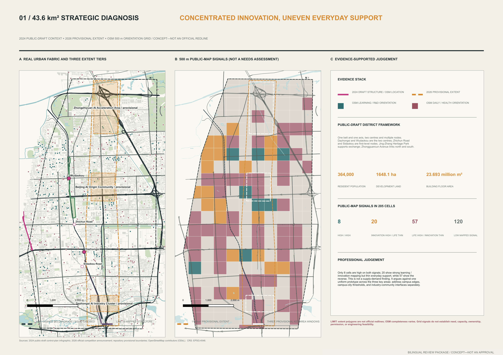
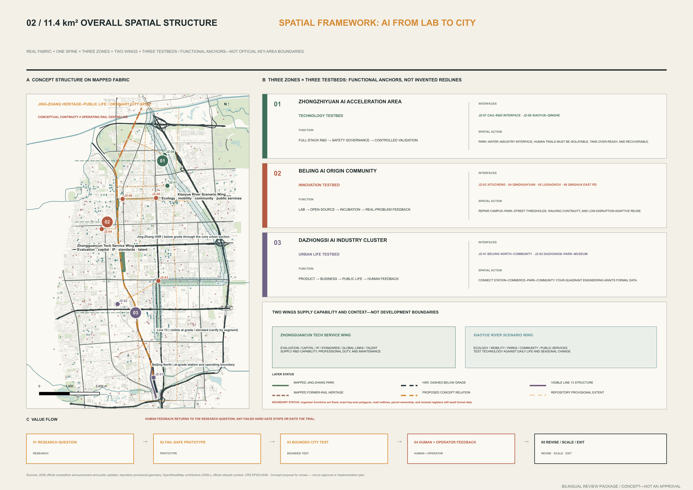
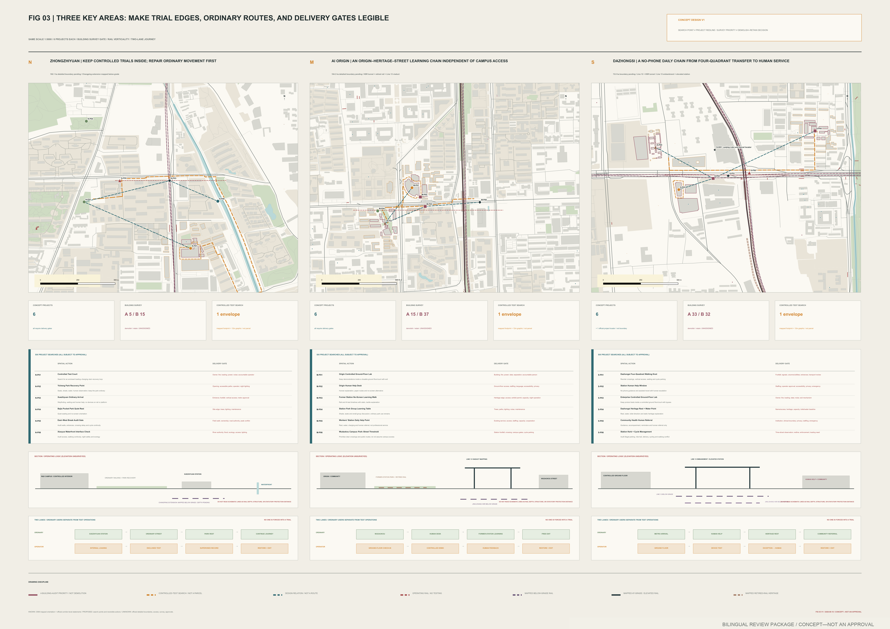
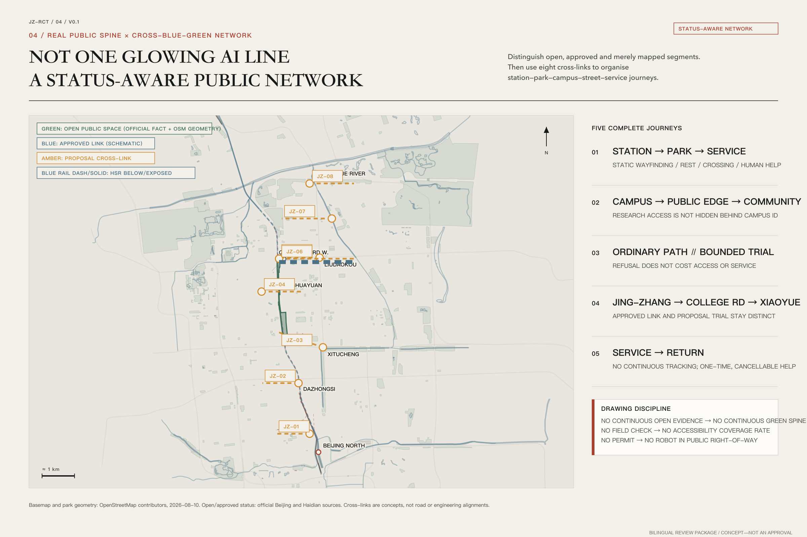
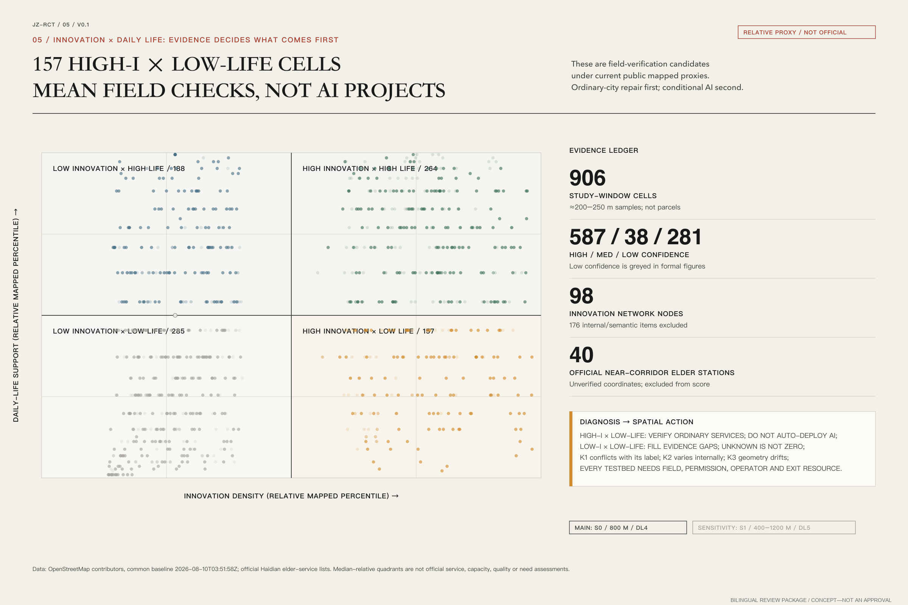

# Jing-Zhang Urban AI Testbed: The First Mile from Lab to City

**Working system name: Jing-Zhang Urban AI Testbed / 京张城市 AI 验证场**  
**Implementation principle: City-in-the-Loop / 城市在环**

This proposal does not line the Jing-Zhang corridor with more AI products. It asks a harder set of questions: when laboratory capability reaches a street, park, neighbourhood, or transport interface, who defines the problem, who can refuse, who takes over after a failure, and what remains for the city when the system is removed? The historic Jing-Zhang project subjected autonomous engineering capacity to real terrain and long-term operation. The corridor can now subject AI to the real city. “First mile” describes the institutional and spatial distance from research to a first bounded urban setting; it is neither a world-first claim nor an implementation promise.

## One-Page Delivery Summary

| Question | Proposal response | Verifiable delivery |
| --- | --- | --- |
| Urban positioning | The Centennial Jing-Zhang Cultural Belt, Urban AI Life Experience Belt, and AI Convergence Innovation Belt translate the vision of a global AI industry highland and a technology-and-culture destination | One spine, Three Zones, Two Wings, and a three-level scope framework |
| Spatial strategy | An ordinary public-life spine comes first; eight transverse interfaces verify lawful crossings one by one; three testbeds operate only in bounded units | Five bilingual analytical figures, eight interface records, nine key-area work packages, and rail verticality |
| Innovation mechanism | `City-in-the-Loop` puts urban problem owners, ordinary users, and operators before the model; `City Release` governs observation, prototyping, temporary deployment, and replication | Twelve scenario cards, three pilot contracts, and V0.1—V2.0 gates |
| Delivery organisation | Every trial carries A/R/C/I roles, an ordinary baseline, candidate acceptance gates, an operating receipt, appeal, stop, restoration, and public return | Twelve scenario-space-operation links, two tabletop receipts, five resource ledgers, and an annual operating loop |
| Public interest | Six provisional personas identify exclusion; clear routes and human service remain available without a phone, an account, or active AI | Two-line journeys, Human Handoff Desks, and ordinary-service repairs |
| Evidence boundary | Operating rail is checked by system and vertical position; provisional geometry supports calculation only; no partnership, effect, or statutory metric is invented | Source and assumption registers, compliance/standard/depth matrices, and stop rules |

These are not six parallel concepts. They form one delivery chain: **task positioning → spatial interface → bounded trial → operating receipt → public judgement → revision, exit, or limited replication**. A project remains on paper whenever responsibility, evidence, or restoration is missing.

## Design Basis and Source List

The evidence model has three levels. Level A comprises the open-call notice, the Agent taskbook, and public government or railway-authority material; it establishes the task, official functional-area names, current railway operation, and publicly documented project context. Level B comprises repository provisional geometry, public-map orientation, and proposal-generated layers; it supports location, comparison, and reproducible calculation only. Level C lists missing official boundaries, regulatory controls, ownership, as-built drawings, footfall, utilities, and field interviews. Graphic precision never upgrades source authority.[source:OFFICIAL-ANNOUNCEMENT] [source:AGENT-TASKBOOK]

As of 10 August 2026, the repository still provides no statutory site or three-key-area polygon. This package retains the locked `SITE-001` and provisional key-area geometry so machine validation and area calculations remain repeatable. They are not redlines, cadastral parcels, surveys, or approvals. The current provisional site calculates to 11,412,825.386 square metres. When official geometry arrives, land use, routes, public space, metrics, the five figures, HTML, and A3/A0 outputs must all be regenerated together.[data:geometry/site_boundary.geojson#SITE-001] [metric:site_area_sqm]

Rail is represented by system, operating status, and vertical position. The operating Beijing-Zhangjiakou high-speed railway opened in 2019: the Beijing North station throat and approach are at grade, trains enter the approximately 6.02-kilometre Qinghuayuan Tunnel through the central urban section, and the line returns to the surface north of the Qinghua East Road–Wanquan River area. The former central surface railway is no longer operating and has partly become heritage and public space. In the middle section, the most visible operating trains are usually Metro Line 13 on viaduct, embankment, and surface segments. Metro Line 12 at Dazhongsi is underground. An apparently open ground surface therefore does not imply buildable subsurface conditions, and visible viaduct space does not imply public access.[source:NRA-JINGZHANG-HSR] [source:BJ-RAIL-VERTICALITY]

This iteration includes desk research, public-map orientation, and peer-proposal review, but no site visit, resident interview, operator commitment, or accompanied accessibility audit. All personas and needs remain hypotheses for verification. People shown in illustrative scenes communicate design intent only; they do not represent participation results. Replacement actions and evidence limits are registered in `assumptions.json` and `sources.json`.[depth:existing_conditions_diagnosis]

## Three-Level Scope Framework

The coordinated research area asks how innovation resources become urban capability. The overall design area asks how that capability enters a walkable and operable spatial network. The three key areas ask how one particular trial can gain permission, be used, be stopped, and leave a public return. The three levels share one value chain rather than three slogans: **research question → fallible prototype → bounded urban trial → human and operator feedback → revise, scale, or exit**.[standard:PROJECT-OFFICIAL-ANNOUNCEMENT] [depth:three_level_scope_framework]

The proposal retains the organiser's “one axis, Three Zones and Two Wings.” The axis becomes the Jing-Zhang Heritage–Public Life Spine. Its first duties are walking, accessible movement, cycle connections, rest, shade, toilet and drinking-water information, heritage interpretation, and human service; it must still work when AI is off. The zones align with a Technology Testbed, Innovation Testbed, and Urban Life Testbed. The wings are capability and scenario relationships, not newly drawn development zones. The Zhongguancun Technology Service Wing brings research, evaluation, open-source practice, legal and finance support, and talent services. The Xiaoyue River Scenario Enablement Wing brings ecology, movement, neighbourhood life, and public-service problems.[depth:overall_spatial_structure]

The three positionings are assigned to space and operation rather than left as slogans. The **Centennial Jing-Zhang Cultural Belt** connects railway heritage, public evidence, and AI-governance learning to the technology-and-culture destination function. The **Urban AI Life Experience Belt** connects an ordinary-service baseline and perceptible but removable AI+ scenarios to quality living and an intelligent active city. The **AI Convergence Innovation Belt** connects research, bounded testing, public receipts, and translation to the full-stack industry, innovation ecosystem, and international-exchange functions. The same public spine links all five functions, while each retains a place, operator, and gate to its next version.[source:AGENT-TASKBOOK]

The eight transverse interfaces, JZ-01 to JZ-08, organise the next field walk and section studies. They are not eight confirmed projects. Each interface must first record legal crossings, the ordinary service baseline, opening status, and accountable operator. A conceptual relationship stops when it reaches an operating railway boundary; only an existing or formally approved bridge, underpass, street crossing, or station passage can establish an east-west connection.[data:geometry/roads.geojson#ROAD-001]

The interface register turns “eight” from a headline count into eight distinct evidence tasks. The current `roads.geojson` contains only six conceptual transverse relationships, corresponding to JZ-01 through JZ-06. No lawful-crossing evidence is yet available at the Beijing North throat or the Qinghuayuan Tunnel portal transition, so JZ-07 and JZ-08 remain register-only and no speculative crossing is drawn. This difference is a risk control, not a missing line.[metric:interface_register_count]

| Interface | Audit window | Rail / spatial condition | Ordinary-service baseline | Evidence gate before any trial |
| --- | --- | --- | --- | --- |
| JZ-01 | Zhongzhiyuan station area—compound entrance | Northern operating surface/bridge rail condition to verify | Continuous walking, accessibility, static wayfinding, and rest | Fence line, opening status, accompanied accessibility walk, and operator confirmation |
| JZ-02 | Zhongzhiyuan—Xiaoyue River | Parallel railway and waterfront conditions to verify | Waterfront access, night help, and a non-collection bypass | River/flood condition, fence line, and night walk |
| JZ-03 | Heritage park—campus/compound | Former surface heritage + underground HSR + visible Line 13 | Public learning route independent of campus opening | Campus access, heritage, tunnel constraint, and public-route walk |
| JZ-04 | AI Origin—street | HSR tunnel section; no assumption of buildable subsurface | No-account problem intake and a named human reply | Site permission, duty roster, privacy notice, and submitter confirmation |
| JZ-05 | Dazhongsi station exit—sports park | Underground Line 12; surface public route to verify | No-phone arrival, rest, and toilet information | Station/accessibility walk, rest points, and service hours |
| JZ-06 | Museum—community service | Existing street network; no new crossing conclusion | Verified paper directory, static map, and one human handoff | Directory audit, operator, opening hours, and accompanied caregiver walk |
| JZ-07 | Beijing North station throat | Operating surface station throat; register-only | Existing lawful passage, safety boundary, and static diversion | As-built information, ownership, safety boundary, and station-operator confirmation |
| JZ-08 | Tunnel portal—northern return-to-grade transition | Operating HSR changes from underground to surface; register-only | Public route outside the fence, warning, and continuous diversion | Portal coordinates, protection boundary, structure, and maintenance records |

| Working scale | Design question | Current deliverable | Gate to the next stage |
| --- | --- | --- | --- |
| Coordinated research | How do resources become verifiable city capability? | Ecosystem chain, case matrix, City Release, and public-return rules | Public sources, a problem owner, and a reusable mechanism |
| Overall design | How do Three Zones and Two Wings cooperate in real space? | Ordinary-city spine, eight interfaces, rail verticality, and blue-green walking structure | Official geometry, field continuity, and ownership checks |
| Key areas | How can three testbeds operate safely? | Three 1:5,000 study windows, project cards, sections, and two-line journeys | Site permission, operator, safety, privacy, and recovery plan |

## Coordinated Research Area: Industry and Future City Research

A world-class ecosystem is not measured by the density of company logos. The proposal separates eight capabilities that must interlock: land and space; research and open source; compute and data; testing and evaluation; finance and enterprise services; talent and community; scenarios and procurement; and governance and international exchange. Research institutions provide capability, urban problem owners provide constraints, and independent reviewers and operators decide whether a trial may advance. No actor can declare success alone.[source:AGENT-TASKBOOK]

Global cases contribute mechanisms, not transplanted numbers. one-north suggests that research, everyday life, and public space must coexist. STATION F demonstrates programme orchestration. Mila places responsible reflection within a research cycle. Knowledge Quarter demonstrates a multi-institution urban knowledge network. Kendall Square demonstrates long-term ecosystem evolution. Public living-lab and bounded embodied-system testing practices supplement the real-world validation dimension. No external area, investment, firm count, or performance claim becomes a local fact.[source:CASE-ONE-NORTH] [source:CASE-MILA]

The industry-space map runs from capability to interface, not from company to parcel. Zhongzhiyuan concentrates full-stack research, safety evaluation, equipment maintenance, and enclosed trials. Beijing AI Origin Community concentrates problem definition, public explanation, open collaboration, legal support, and translation to application. Dazhongsi tests whether products remain usable in commerce and everyday life, with visible human service and operating cost. The Technology Service Wing supports all three testbeds; the Scenario Wing exposes whether technology reduces or transfers urban burdens.[data:geometry/key_areas.geojson#PROV-KEY-001]

Regional collaboration is organised as candidate interfaces with two-way tasks and no implied commitment. North Latitude Community may provide a public-problem interface among talent, universities, and incubation services. Future Science City may exchange methods for bounded validation between research outcomes and industry problems.[source:REGION-NORTH-LATITUDE] [source:REGION-FUTURE-SCIENCE-CITY]

Huairou Science City may connect major-science outcomes, public science communication, and translation to urban settings. Beijing E-Town may connect robotics manufacturing validation, maintenance, and supply-chain problems. Beijing-Tianjin-Hebei collaboration concerns only test protocols and public receipts that remain reusable after local validation. These directions derive from published functions; they do not claim a partnership, site, resource, order, or budget. Both sides must confirm the problem owner, data authority, cost, intellectual property, and exit before any item enters the project register.[source:REGION-HUAIROU-SCIENCE-CITY] [source:REGION-BTH-ROBOTICS]

The identity avoids another generic “technology” emblem. Its visual direction combines a line recalling the 1909 gauge, a line representing the contemporary city interface, and an open verification frame. The frame always retains a gap: the city can refuse, revise, or exit. Public-facing copy uses “The First Mile from Lab to City”; `Jing-Zhang Urban AI Testbed` remains the working institutional name and is not presented as an official designation or trademark claim.[standard:PROJECT-AGENT-OPEN-CALL-TASKBOOK]

## Overall Design Area: Urban Renewal and Regulatory-Plan-Level Urban Design

The overall design does not distribute AI evenly over 11.4 square kilometres. It repairs the ordinary city first and then defines small test units. Its armature comprises a public-life spine that is not the operating railway centreline, eight transverse interfaces, three testbed anchors, an inventory of lawful railway crossings, a continuous blue-green walking network, and City Release operating nodes. Dashed lines are relationships to verify, not redlines or engineering alignments.[data:geometry/land_use.geojson#LU-001] [depth:land_use_layout]

Land-use and building layers support discussion about spatial types, but they do not generate floor-area ratio, height, building density, setbacks, or demolition conclusions. Conceptual building marks represent reversible service or testing prototypes only: a learning commons, controlled test court, human service desk, and recovery bay. Until regulatory planning, surveyed buildings, structure, fire safety, heritage status, and ownership are known, `retain / renovate / demolish` remains unassigned.[standard:MOHURD-CONTROL-DETAILED-PLANNING] [depth:development_intensity_controls]

Urban renewal has four actions. “Repair ordinary” addresses crossings, seats, shade, static wayfinding, human help, and accessibility discontinuities. “Open thresholds” makes the relationship among campus, research compound, neighbourhood, and park legible. “Permit a trial” means testing only inside a unit with clear boundary, time, accountability, and recovery. “Leave a public return” means a better path, facility register, problem archive, or maintenance capacity remains even if the equipment leaves.[depth:retain_renovate_demolish]

Rail protection is a hard line on the overall plan. The middle section can study a section of surface heritage park, underground high-speed railway, and elevated or embanked Line 13, but it cannot assume tunnel cover, loading, ventilation, egress, or maintenance conditions. The north is organised around the high-speed railway returning to grade, the parallel operating Line 13, and railway fencing. Permanent foundations, detention structures, heavy equipment, robot crossings, and new bridges or tunnels all require railway and engineering information; this submission makes no feasibility determination.[source:BJ-RAIL-VERTICALITY]

## Detailed Design of Key Areas

All three key areas use the same drawing protocol: a 1:5,000 study window, six project-search points, building-survey priorities, a controlled-test search envelope, a rail section, and two journeys. A study window is a cartographic frame, not an exact boundary. Exact polygons have not been supplied; in particular, a public issue reports that `PROV-KEY-003` is displaced from Dazhongsi, so no district metric can be inferred from that polygon.[data:geometry/key_areas.geojson#PROV-KEY-003] [depth:three_key_area_detailed_design]

| Key area / testbed | Repair the ordinary city first | Bounded trial | Hard gate and public return |
| --- | --- | --- | --- |
| Zhongzhiyuan / Technology Testbed | Verify station access, compound entrances, east-west walking gaps, Xiaoyue River interfaces, and quiet rest | Test low-speed movement, failure takeover, curb handoff, and non-identifying inspection in an enclosed court | No written site permission, safety owner, insurance, and recovery plan means no trial; leave clearer right-of-way and a facility register |
| Beijing AI Origin / Innovation Testbed | Build an Origin–heritage–street learning chain that does not depend on campus access; begin with static explanation and a human problem desk | Reverse Lab, no-screen explanation walk, and failure-and-revision archive | The problem owner may reject a technical rewrite; leave a problem brief, human responsibility chain, and public archive |
| Dazhongsi / Urban Life Testbed | Connect station, sports park, museum, and neighbourhood services as a journey that works without a smartphone | Non-diagnostic service finding, rest-to-service routes, and caregiver handoff | No medical records, health scores, or substitution for professionals; leave a verified directory, rest points, and human window |

Nine key-area work packages translate district-scale intent into spatial tasks that a professional team can take over. They are not project approvals, construction packages, or real-building retain/renovate/demolish decisions.[metric:key_area_work_package_count]

| Key area | Work package | Spatial object and action | Candidate acceptance / stop and restoration |
| --- | --- | --- | --- |
| Zhongzhiyuan | KA-N-01 Ordinary Route Repair | Station exit—compound threshold; verify opening, wayfinding, accessibility, and rest | Continuous with AI off; retain the ordinary route after removing trial markers |
| Zhongzhiyuan | KA-N-02 Enclosed Drill Court | Internal hard surface; low-speed yielding, emergency stop, and takeover | Every stop succeeds and the ordinary path remains clear; isolate equipment and restore the site on failure |
| Zhongzhiyuan | KA-N-03 Takeover and Recovery Store | Service edge outside movement lines; maintenance, withdrawal, and recovery tools | Failed equipment never occupies the route; close with a restoration receipt |
| AI Origin | KA-C-01 Problem Desk and No-Screen Learning Chain | Public threshold and ordinary walking line; human intake and bilingual static explanation | Understandable without scanning and receives a named reply; revert to a human-only desk on failure |
| AI Origin | KA-C-02 Reverse Lab | Bookable indoor or sheltered space; turn real constraints into a test brief | Submitter confirms no distortion; otherwise withdraw the technical brief and retain the original problem |
| AI Origin | KA-C-03 Public Proof Register | Small public display plus offline archive; version, failure, expiry, and revocation | Every item has a source, owner, review date, and term; remove expired display while retaining the archive |
| Dazhongsi | KA-S-01 No-Phone Service Entrance | Station-to-service route; paper directory, static map, and human window | Complete without phone/account; retain verified directory and wayfinding after exit |
| Dazhongsi | KA-S-02 Rest-to-Service Chain | Streets, parks, and service thresholds; verify crossings, seats, shade, and access control | No extra detour for the most vulnerable user; remove unverified dynamic guidance |
| Dazhongsi | KA-S-03 Human Handoff and Directory Audit Desk | Staffed service threshold; one handoff and periodic directory audit | Named handoff and no diagnostic scoring; downgrade to paper directory plus human window on failure |

The northern Embodied AI Urban Lab begins in an internal or closable hard-surface space. It does not treat an open park, viaduct, or sole accessible path as a sandbox. The central AI Learning Corridor combines static bilingual explanation, tactile models, staffed interpretation, a problem desk, and a failure archive; its essential content does not depend on scanning a code. The southern AI Health and Aging Lab improves only the journey of finding, understanding, reaching, handing off to a person, and returning. It does not perform diagnosis, prescription, risk scoring, or emergency medical triage.

Each area also carries two journeys. The ordinary journey proves that the task can be completed when AI is off. The operating journey shows permission, staffing, takeover, maintenance, complaint handling, deletion, and restoration. Project points on the drawings are labelled `search / audit / field verify`; they do not name a start date, investment, or participating organisation.[source:PEER-ISSUE-1061]

## AI Innovation Ecosystem, Personas, and AI+ Scenarios

Six provisional personas are lenses for detecting exclusion, not simulated consensus: corridor residents and older adults; caregivers and children; night-time and frontline operators; wheelchair and mobility-aid users; researchers and start-up teams; and international or temporary visitors. Each must be revised through accompanied walks, problem interviews, accessibility audits, and operator process interviews. The count is a structured-asset count, not a demographic finding.[metric:persona_count]

Twelve scenario cards belong to three flagships. Every card carries the same 17 fields: User, Problem, Ordinary Baseline, AI Capability, Physical Space, Data, Data Authority, Operator, Human Review, Privacy, Safety, Baseline Measure, KPI, Stop Condition, Exit Condition, Evidence, and Public Return. A card does not begin with capability; it first shows how the task remains possible without AI.[data:visual/assets/scenario_nodes.json#SC01] [metric:scenario_node_count]

The three flagships connect AI to different planning domains. The Learning Corridor addresses interpretation and feedback across cultural heritage, public education, and urban governance. The Embodied Lab addresses right-of-way, emergency stopping, and maintenance across transport, public space, and industry testing. The Health and Aging Lab addresses community services, inclusive movement, and human handoff. AI is not a separate “smart infrastructure” layer here; land use, spatial boundaries, operating shifts, public rights, and exit cost jointly constrain it as an urban system.[depth:ai_ecosystem_industry_space]

| Flagship | Scenario cards | Central test question |
| --- | --- | --- |
| AI Learning Corridor | City Problem Desk; No-Screen Explanation Walk; Reverse Lab; Failure and Revision Library | Can non-specialists understand, challenge, rewrite, and trace an AI project? |
| Embodied AI Urban Lab | Shared Right-of-Way Sandbox; Curb Handoff Bay; Failure and Takeover Drill; Non-Identifying Public-Realm Check | Can equipment yield to the most vulnerable user, accept human takeover, and restore the site? |
| AI Health and Aging Lab | No-Phone Service Finder; Rest-to-Service Route; Caregiver Handoff; Service Directory Audit | Can a service journey become more reliable without sensitive health data and while retaining a human alternative? |

The scenario-space-operation matrix binds every card to one spatial package, one staffed operating unit, and one evidence output, so the twelve cards do not remain a programming list.[metric:scenario_operation_link_count]

| Scenario | Spatial work package | Staffed / operating unit | Evidence output |
| --- | --- | --- | --- |
| SC01 City Problem Desk | KA-C-01 | Human problem desk | Problem brief and named reply |
| SC02 No-Screen Explanation Walk | KA-C-01 | Content audit + human interpretation | No-screen comprehension and correction record |
| SC03 Reverse Lab | KA-C-02 | Facilitator + independent reviewer | Submitter-confirmed reverse brief |
| SC04 Failure and Revision Library | KA-C-03 | Archive editor | Failure, revision, expiry, and revocation record |
| SC05 Shared Right-of-Way Sandbox | KA-N-02 | Equipment operator + safety owner + accessibility observer | Yielding, near-miss, and emergency-stop receipt |
| SC06 Curb Handoff Bay | KA-N-02 | Site operator + human handoff | Space occupation and conflict record |
| SC07 Failure and Takeover Drill | KA-N-03 | Operation, maintenance, and takeover shift | Failure, takeover time, and restoration receipt |
| SC08 Non-Identifying Public-Realm Check | KA-N-03 | Facility maintenance + privacy review | Human-verified defect-candidate log |
| SC09 No-Phone Service Finder | KA-S-01 | Directory owner + human window | Completion, misdirection, and help record |
| SC10 Rest-to-Service Route | KA-S-02 | Route auditor + accompanied accessibility walk | Rest, detour, and obstacle audit |
| SC11 Caregiver Human Handoff | KA-S-03 | Community / aging-service professional | Named handoff and complaint record |
| SC12 Service Directory Audit | KA-S-03 | Directory editor + service-provider check | Dated addition, correction, removal, and expiry log |

Three pilot contracts cover the learning, embodied, and health-and-aging flagships. Each contract names a problem owner, data owner, on-site operator, independent reviewer, and ultimately accountable person. Success concerns end-to-end task completion, burden on the most vulnerable user, takeover, and public return; average model accuracy cannot compensate for harm. Injury, identity disclosure, failed emergency stop, high-risk wrong direction, or a broken human responsibility chain returns the pilot to V0.1.[metric:test_scenario_count] [metric:pilot_contract_count]

Candidate acceptance gates are registered before a test and are not presented as results. PC01 requires a named human owner for every sample, confirmation by the problem submitter that technical translation did not distort the issue, and zero urgent misclassification. PC02 requires every emergency-stop drill to succeed, no equipment intrusion into the ordinary path, and no additional detour for vulnerable users. PC03 requires a no-phone route and named human handoff for every sample, with no diagnosis or risk score. All three currently carry `field_status: not_authorized_not_run`, and measured results remain null. A receipt records version, site, period, accountable shift, baseline, exception, complaint, stop, deletion, and restoration. The public may appeal, the independent reviewer may require downgrade, and the accountable person cannot outsource judgement to the model.

Two City Release tabletop receipts demonstrate how the institution reaches a decision. Both use fictional inputs, contain no real person or site and no measured result, and are not evidence of effectiveness.[metric:synthetic_tabletop_case_count]

| Tabletop receipt | Synthetic condition | Hard-gate result | Decision and public return |
| --- | --- | --- | --- |
| TT-PASS-01 / PC01 | Fictional anonymous request for clearer night-time toilet information; paper form + human reply | Named owner, no-distortion confirmation, and zero urgent misclassification: all pass | Remain at V0.5 only; a small explanation test may follow after permission; retain the problem brief and responsibility chain |
| TT-STOP-01 / PC02 | Fictional enclosed-court drill injects localisation drift; no real device or image | One of two synthetic emergency stops fails and a synthetic boundary intrusion occurs | Isolate immediately and downgrade to V0.1; restore the full route and retain the failure record and revised test envelope |

## Land Use, Building Scale, and Retain-Renovate-Demolish Strategy

`land_use.geojson` is a conceptual partition generated to verify complete coverage without gaps or overlaps. It describes relationships among the public spine, verification interfaces, blue-green space, and service prototypes; it is neither existing nor statutory land use. The conceptual building footprint of 46,617.879 square metres is placeholder geometry for reversible prototypes. It cannot be converted into actual gross floor area, FAR, or investment.[data:geometry/buildings.geojson#BLDG-001] [metric:building_footprint_area_sqm]

The building strategy is survey before classification. Priority A identifies buildings requiring individual audit because they touch a project point, entrance, ground-floor interface, or heritage question. Priority B screens a group for function, access, structure, and fire safety. Priority C remains urban-context background. No real building receives a retain, renovate, or demolish label before ownership, survey, structural, fire, building-services, heritage, and user evidence are complete.[depth:retain_renovate_demolish]

Only three lightweight component types are proposed at this stage: no-screen explanation and wayfinding; a removable human service desk; and enclosure or recovery storage for a bounded trial. Materials should be demountable, repairable, and low-glare. Proportion and durability can relate to railway industrial character without copying locomotives or signal lamps as decoration. Permanent buildings, underground development, structural crossings, and massing remain subject to professional design and statutory review.[depth:height_massing_character]

The land-use decision sequence is explicit: Is the public benefit clear? Can ordinary service solve the problem first? Can existing space be shared? Must the trial occupy space? What public value remains after exit? If any answer is missing, the project remains a paper V0.1. “Innovation” is not a licence to appropriate public space.[standard:MOHURD-URBAN-DESIGN-MEASURES]

## Transport, Rail, Municipal Infrastructure, and Public Services

Movement design begins by proving each crossing. The public spine combines released former-track space, parks, lawfully open spaces below viaducts, streets beside rail, and the general street network. It is not a continuous coloured line through operating fences. Each of eight transverse interfaces receives one status: `existing crossing / official project / field verify / no crossing`. A relationship with no lawful crossing stops on the plan. The 15,237.796-metre conceptual movement network is a package-geometry calculation only.[data:geometry/roads.geojson#ROAD-001] [metric:road_length_m]

Three rail sections control the proposal. X-R1 describes the middle condition of heritage park at grade, high-speed railway in tunnel, and Line 13 on viaduct or embankment. X-R2 describes the northern condition of operating surface/bridge high-speed railway, parallel Line 13, and a park side strip. X-R3 describes the safety interface at Beijing North and the tunnel portal. These are relational sections only; they specify no protection offset, cover depth, clearance, or foundation dimension.[source:BJ-RAIL-VERTICALITY] [depth:traffic_rail_slow_parking]

Municipal and digital infrastructure follows minimum equipment, edge processing, and graceful offline fallback. Every trial unit requires separate confirmation of power, charging, fire response, battery handling, drainage, lighting, communications, and emergency stop. Public Wi-Fi, cameras, positioning, and cloud service are never prerequisites for an ordinary route. If the lawful data controller, retention period, and deletion process cannot be demonstrated, the test remains on paper or offline.[depth:municipal_new_infrastructure]

Public-service improvements begin with seating, shade, drinking-water and toilet information, legible wayfinding, a human window, and visible night-time help. Exact numbers, service radii, and locations depend on a field inventory. General guidance cannot establish local compliance. These items therefore form a V0.1 survey sheet and component library rather than a claim that standards have been met.[source:WHO-AGE-FRIENDLY]

## Blue-Green Network, Public Space, and Urban Character

The blue-green system is not scenery for AI equipment. It establishes whether a project actually reduces city burden. The conceptual green-space area is 874,189.284 square metres and conceptual public-space area is 277,584.374 square metres, equal to 7.6597% and 2.4322% of the current provisional geometry. They are internal proposal-layer calculations, not existing-condition ratios, planning controls, or performance promises.[data:geometry/green_space.geojson#GREEN-001] [metric:green_ratio]

The Xiaoyue River Scenario Enablement Wing puts ecology and ordinary use first. It verifies waterfront access, continuity, night safety, trees, stormwater, and maintenance before discussing facility inspection or environmental sensing. Sensors cannot justify expanded surveillance. Cameras, if ever permitted, face surfaces or equipment by default and retain a clearly marked non-collection route. No permanent structure is proposed before river-management and flood conditions are confirmed.[depth:blue_green_public_space]

Three component families create a restrained common character. An `Evidence Frame` shows fact, assumption, responsible party, and update date. A `Human Handoff Desk` provides help without login. A `Recovery Bay` allows malfunctioning equipment to withdraw without occupying movement space. Deep ink, oxidised red, mineral green, and verification orange are functional colours; glowing screens are not used to manufacture an “AI look.” Heritage interpretation cites date and source, and remains distinct from the overall identity.

The cultural narrative follows three steps: evidence from railway engineering, inquiry from Zhongguancun innovation, and public verification through City Release. The year 1909 is not retro scenery; it recalls how long operation tests engineering. Contemporary AI must likewise face the real city, ordinary users, and maintenance cycles. International communication uses the translatable working line **“From railway proof to public AI proof: useful when offline, accountable when active.”** It explains the institution and is not an official slogan. Chinese and English materials retain the same facts, limits, and responsibilities; the English version does not amplify ambition.

The three public landmarks are usable institutions rather than sculptures: the Origin Problem Desk, the City Takeover Gate, and the Centennial Failure Archive. They let the city formulate a problem, let a person take over, and preserve failure for future reuse. Their final provision and location remain subject to operator and site permission.[metric:public_landmark_count] [standard:PROJECT-AGENT-OPEN-CALL-TASKBOOK]

The **Centennial Public Proof Register** fulfils the taskbook's honor-display requirement without becoming a permanent ranking of companies, models, or individuals. Only ordinary-service repairs, reproducible failures, human takeover, public returns, and reusable open protocols may be nominated. Every entry states its source, public-problem owner, consenting contributors, receipt, limits, review date, display term, and reason for revocation. Recheck after one City Release cycle; false claims, rights violations, unresolved harm, or expired evidence remove the physical display while preserving an auditable archive.

## Renewal Projects, Implementation Policy, and Phasing

Eight renewal projects follow dependencies: P01 Rail and Public-Space Field Base; P02 Eight-Interface Continuity and Accessibility Audit; P03 Ordinary-Service Baseline Repairs; P04 AI Learning Corridor Paper and No-Screen Prototype; P05 Enclosed Embodied-System Drill; P06 Health and Aging No-Phone Journey; P07 Failure and Revision Archive; and P08 Annual City Release Review. The count describes a proposal worklist, not approved projects.[metric:renewal_project_count] [depth:renewal_project_list]

City Release has four gates. V0.1 Observe confirms the problem, baseline, information rights, and responsible people. V0.5 Prototype permits failure on paper, offline, or in an enclosed space. V1.0 Deploy allows temporary operation only within a bounded site, with informed participation, human staffing, and recoverability. V2.0 Scale is discussed only after cross-season evidence, maintenance funding, independent review, and exit cost are known. Failure of any hard gate causes a downgrade; average scores do not offset safety and rights.[data:geometry/phasing.geojson#PHASE-001] [depth:phasing_implementation]

The policy toolkit is not a subsidy list. It consists of four standard documents: a one-page scenario brief; a site and data permission sheet; a failure and human-takeover record; and a public-return and exit checklist. Procurement or partnership evaluation counts restoration, human labour, energy, no-phone task completion, and burden on the most vulnerable user as total cost. A technology supplier cannot unilaterally decide whether a failure becomes public.

The three pilot contracts use a candidate RACI. The urban problem owner or delegated public operator is accountable (A). On-site operation, facility maintenance, and human-takeover shifts are responsible (R). Railway, planning, accessibility, safety, privacy, and other relevant professionals are consulted (C). Nearby users, site managers, and recipients of the public archive receive comprehensible notice (I). Until real organisations confirm participation, only roles are registered; no institutional commitment is invented. Before V1.0, each trial requires site and data permission, an ordinary baseline, a duty roster, candidate acceptance gates, and a secured restoration item. It closes with a traceable City Release receipt.

Five resource ledgers support delivery: the people ledger records responsibility and shifts; the space ledger records open boundaries, lawful movement, and restoration status; the equipment ledger records power, fire safety, maintenance, emergency stop, and removal; the data ledger records controller, minimum fields, retention, deletion, and appeal; and the public-value ledger records ordinary repairs, human hours, complaints, failures, and what remains. Translation follows **public problem intake → public-interest and professional review → paper/offline/enclosed prototype → bounded temporary trial → public receipt → adopt, revise, or stop → limited replication**. A showcase cannot jump directly to scaled deployment.

The developer community does not begin by “recruiting teams.” It begins with a public problem brief that states the ordinary baseline and unacceptable consequences. Entry proceeds through an evidence clinic, paper/offline prototype, enclosed-test sprint, City Release review, and an adopt/revise/stop decision. The problem owner, developer or research team, site operator, human-service owner, independent reviewer, and public-archive editor must all be represented. Public participation requires no account and testing is not tied to one vendor. At version expiry, credentials are revoked, data deleted, equipment removed, and unverified promotional claims withdrawn.

| Candidate annual unit | Core work | Required public output | Unconfirmed boundary |
| --- | --- | --- | --- |
| Spring / Urban Problem and Evidence Clinic | Verify the problem, ordinary baseline, and evidence gaps | Verified problem brief and missing-evidence register | No confirmed host or date |
| Summer / Enclosed Test and Takeover Week | Run only stoppable enclosed drills | Emergency-stop receipt and restoration record | No confirmed site, insurance, or equipment provider |
| Autumn / Public AI Proof Forum | Publish bilingual adopt/revise/stop decisions and exchange regional protocols | City Release decisions and regionally reusable protocols | No confirmed partner or international guest |
| Winter / Failure, Maintenance, and Retirement Yearbook | Compile maintenance, failure, deletion, expiry, and revocation | Bilingual annual archive | No confirmed publisher or budget |

Long-term operations form an annual loop. Spring repeats route and facility baselines. Summer examines thermal conditions and night service. Autumn holds an open City Release Review. Winter publishes maintenance, failure, stop, and deletion records. Recurring operating units include a staffed problem desk, accompanied accessibility walks, emergency-stop drills, service-directory audits, and failure-archive maintenance. The programme is a design recommendation; dates, hosts, funding, and partners are not settled.[source:AGENT-TASKBOOK]

## Metrics, Area Recalculation, and Compliance Matrix

Metrics fall into three groups. Group A is recalculated from current GeoJSON: area and length. Group B counts structured assets, including 12 scenarios, six personas, three test contracts, and three landmarks. Group C is statutory planning or field performance and remains unknown. Groups A and B are auditable but are not automatically evidence of quality. AI cannot fill Group C.[metric:scenario_node_count] [depth:metrics_recalculation]

Numerical fields in the pilot contracts are separated into candidate acceptance gates and measured results. The former enables refusal before a trial; the latter may be populated only after permission, baseline collection, and independent review. All measured results in this iteration are `null`. A single failed hard gate can therefore stop a test without being hidden by an aggregate average.

| Metric group | Reportable now | Not reportable | Next action |
| --- | --- | --- | --- |
| Spatial geometry | Provisional extent; conceptual green/public/building footprint; conceptual network length | Existing ratios, statutory controls, precise quantities | Replace official geometry and recalculate the entire package |
| Scenarios and people | 12 scenario cards, six provisional personas, three test contracts | Real demand, acceptance, and effect | Field baseline, informed participation, and preregistered gates |
| Planning controls | Missing items and responsible disciplines | FAR, height, density, redlines, and retain/renovate/demolish | Regulatory plans, survey, ownership, structure, fire, and heritage review |
| Operating performance | KPI definitions and stop conditions | Unmeasured success, savings, or economic output | Register thresholds only after V0.1 baseline |

`compliance_matrix.json` maps the 17 public-call tasks and agent.1–agent.6 to narrative, layers, metrics, drawings, and checks. `standard_matrix.json` explains how each standard affects a decision. `design_depth_matrix.json` records what planning depth is expressed and which conclusions remain unknown. Every number shown on the web page uses `data-metric` to point to `metrics.json`.[standard:MNR-LAND-USE-CLASSIFICATION-GUIDE]

## Risk, Copyright, and Compliance

The highest risks are not lack of novelty. They are treating provisional geometry as a redline, a public map as ownership evidence, an illustrative scene as participation, or a trial as permission. Controls are evidence-tier graphics, field gates, named accountability, an ordinary alternative, informed participation, data minimisation, physical emergency stop, human takeover, failure publication, and restoration.[depth:risk_missing_data]

Rail risk is separate. The Qinghuayuan Tunnel, Beijing North throat, northern operating surface/bridge high-speed railway, and Line 13 all remain operating infrastructure. A future configuration of the Line 13 capacity project cannot be treated as current space. Without railway engineering, ownership, and safety information, this proposal makes no feasibility claim for a new crossing, deep foundation, heavy loading above the tunnel, or trial under a viaduct.[source:NRA-JINGZHANG-HSR]

Health, children, public safety, and embodied-mobility scenarios preserve human final judgement. The proposal performs no diagnosis, law enforcement, credit scoring, face recognition, or emotion recognition, and it never makes an account a condition of public service. Before real participation, notice, withdrawal, complaint, deletion, and harm-response processes must exist. AI output does not replace planning approval, professional review, or resident views.

OpenAI Codex generated the text under user direction, cleared/public sources, and repository rules, followed by multiple review passes. Maps derive from public government material, repository provisional geometry, and OpenStreetMap orientation; OSM attribution follows ODbL. Figures are programmatically drawn in this task or derived from those reusable sources. No company logo, person likeness, or restricted font is used. Copyright and reuse limits are set out in `report/copyright_statement.md`.

## References

1. Centennial Jing-Zhang AI Innovation Belt open-call notice and Agent taskbook.[source:OFFICIAL-ANNOUNCEMENT]
2. National Railway Administration, Beijing transport, and Haidian public material on the high-speed railway, Qinghuayuan Tunnel, heritage park, and rail relationships.[source:NRA-JINGZHANG-HSR]
3. Repository site package, source registry, processed fact pack, and provisional geometry.[source:SITE-PACKAGE]
4. Official or institutional public pages for one-north, STATION F, Mila, Knowledge Quarter, Kendall Square, and related mechanisms.[source:CASE-KENDALL-SQUARE]
5. Official public material on North Latitude Community, Future Science City, Huairou Science City, Beijing E-Town, and related Beijing-Tianjin-Hebei interfaces, used only to identify candidate collaboration directions.[source:REGION-BTH-ROBOTICS]
6. WHO age-friendly cities and UN-Habitat child public-space guidance, used only as general design lenses.[source:UNHABITAT-CHILD-PUBLIC-SPACE]
7. OpenStreetMap contributors, ODbL 1.0, used only for cartographic orientation.[source:OSM-CONTEXT]

Complete URLs, access dates, uses, licences, and limits are recorded in `sources.json`. A structured citation opens an audit trail; it does not increase the authority of a source. Formal development requires coordinated work by planning, architecture, transport, railway, municipal, landscape, heritage, accessibility, safety, privacy, and operations professionals.
